# GitHub Insights

## Trending issues

Issues that received the most reactions from 2024-05-27 to 2024-08-27.

Issue | Total reactions | Recent reactions
-- | -- | --
Proposal: Framework needs to be aware of physical pixels [flutter/flutter#151065](https://github.com/flutter/flutter/issues/151065) | 152 | 137
add spacing parameter to Column and Row [flutter/flutter#55378](https://github.com/flutter/flutter/issues/55378) | 95 | 70
Enable "hot reload" (not just "hot restart") for Flutter Web [flutter/flutter#53041](https://github.com/flutter/flutter/issues/53041) | 1121 | 67
Add support to define widget preview and see it in the IDE when developing [flutter/flutter#115704](https://github.com/flutter/flutter/issues/115704) | 96 | 54
Allow to provide compile-time variables for native platforms from a file [flutter/flutter#139289](https://github.com/flutter/flutter/issues/139289) | 133 | 48
Add support for visionOS [flutter/flutter#128313](https://github.com/flutter/flutter/issues/128313) | 331 | 44
Flutter app flagged for missing accessibility content labels by Google Play Store [flutter/flutter#109813](https://github.com/flutter/flutter/issues/109813) | 61 | 41
☂️ Intent to deprecate and remove the HTML renderer in Flutter Web [flutter/flutter#145954](https://github.com/flutter/flutter/issues/145954) | 297 | 40
Preserve WillPopScope as an alternate for PopScope [flutter/flutter#138614](https://github.com/flutter/flutter/issues/138614) | 197 | 37
Move `Listenable`, `ValueListenable`, `ChangeNotifier` and `ValueNotifier` to the Dart sdk and add listening methods [dart-lang/sdk#55816](https://github.com/dart-lang/sdk/issues/55816) | 38 | 36
Urgent Flutter 3.24.1 Cherry picks for web [flutter/flutter#152953](https://github.com/flutter/flutter/issues/152953) | 48 | 34
Support multiple windows for desktop shells [flutter/flutter#30701](https://github.com/flutter/flutter/issues/30701) | 631 | 32
Support for hot reload in DDC [dart-lang/sdk#54934](https://github.com/dart-lang/sdk/issues/54934) | 145 | 32
[pigeon] Support typesafe EventChannels [flutter/flutter#66711](https://github.com/flutter/flutter/issues/66711) | 171 | 32
☂️ Add Swift Package Manager compatibility [flutter/flutter#126005](https://github.com/flutter/flutter/issues/126005) | 141 | 28

## Trending issues by team

### Framework

#### Framework

team-framework issues that received the most reactions from 2024-05-27 to 2024-08-27.

Issue | Total reactions | Recent reactions
-- | -- | --
Proposal: Framework needs to be aware of physical pixels [flutter/flutter#151065](https://github.com/flutter/flutter/issues/151065) | 152 | 137
Preserve WillPopScope as an alternate for PopScope [flutter/flutter#138614](https://github.com/flutter/flutter/issues/138614) | 197 | 37
Support multiple windows for desktop shells [flutter/flutter#30701](https://github.com/flutter/flutter/issues/30701) | 631 | 32
☂️ Multi View for Windows/MacOS [flutter/flutter#142845](https://github.com/flutter/flutter/issues/142845) | 61 | 24
Ctrl+F support, finding text on a page (even when scrolled off screen) [flutter/flutter#65504](https://github.com/flutter/flutter/issues/65504) | 145 | 20
Ability to change the keyboard language programmatically [flutter/flutter#99606](https://github.com/flutter/flutter/issues/99606) | 97 | 18
allow Hero widgets to have transitions within the same screen [flutter/flutter#54200](https://github.com/flutter/flutter/issues/54200) | 224 | 14
add restartApp() method [flutter/flutter#127409](https://github.com/flutter/flutter/issues/127409) | 98 | 12
Rewrite the NestedScrollView [flutter/flutter#102003](https://github.com/flutter/flutter/issues/102003) | 86 | 11
Implement wide gamut color support in the Framework [flutter/flutter#127855](https://github.com/flutter/flutter/issues/127855) | 68 | 11
Text widget incorrectly wraps Korean text [flutter/flutter#59284](https://github.com/flutter/flutter/issues/59284) | 35 | 11
Add TextOverflow  "ellipsisStart" , "ellipsisMiddle"  and "ellipsisEnd"  [flutter/flutter#45336](https://github.com/flutter/flutter/issues/45336) | 163 | 9
[integration_test] Allow driving native UI interactions from Dart [flutter/flutter#86295](https://github.com/flutter/flutter/issues/86295) | 91 | 8
Wrapped Text has unexpected intrinsic size [flutter/flutter#27293](https://github.com/flutter/flutter/issues/27293) | 31 | 8
Going back to the previous route, images should not be redrawn [flutter/flutter#124382](https://github.com/flutter/flutter/issues/124382) | 27 | 8

#### Design

team-design issues that received the most reactions from 2024-05-27 to 2024-08-27.

Issue | Total reactions | Recent reactions
-- | -- | --
Table > TableRow > TableCell colspan [flutter/flutter#21594](https://github.com/flutter/flutter/issues/21594) | 274 | 19
ReorderableListView Weird Behaviour on reordering the second last child [flutter/flutter#90856](https://github.com/flutter/flutter/issues/90856) | 27 | 13
SliverAppBar flexibleSpace with height depending on children [flutter/flutter#18345](https://github.com/flutter/flutter/issues/18345) | 248 | 9
Add Dropdown support to `FilterChip` [flutter/flutter#108683](https://github.com/flutter/flutter/issues/108683) | 42 | 9
[ListTile] Support custom height constraints of leading/trailing [flutter/flutter#98178](https://github.com/flutter/flutter/issues/98178) | 38 | 8
Support Material Symbols  [flutter/flutter#102560](https://github.com/flutter/flutter/issues/102560) | 91 | 6
Update both `ProgressIndicator` for Material 3 redesign [flutter/flutter#141340](https://github.com/flutter/flutter/issues/141340) | 18 | 5
Use a system default font on flutter [flutter/flutter#48381](https://github.com/flutter/flutter/issues/48381) | 72 | 5
Issue: Cannot theme progress indicators, many properties missing [flutter/flutter#131690](https://github.com/flutter/flutter/issues/131690) | 20 | 5
Cupertino back gesture are disabled when using PageRouteBuilder [flutter/flutter#47441](https://github.com/flutter/flutter/issues/47441) | 51 | 5
[proposal] Provide a way to close a specific dialog [flutter/flutter#62960](https://github.com/flutter/flutter/issues/62960) | 92 | 5
Support for sheet presentation style [flutter/flutter#42560](https://github.com/flutter/flutter/issues/42560) | 141 | 5
Move the material and cupertino packages outside of Flutter [flutter/flutter#101479](https://github.com/flutter/flutter/issues/101479) | 112 | 4
Different Appbar with same bottomNavigatioBar without nesting Scaffolds [flutter/flutter#36461](https://github.com/flutter/flutter/issues/36461) | 38 | 4
Missing default context menu buttons on each platform [flutter/flutter#107578](https://github.com/flutter/flutter/issues/107578) | 19 | 4

#### Cupertino

f: cupertino issues that received the most reactions from 2024-05-27 to 2024-08-27.
Issue | Total reactions | Recent reactions
-- | -- | --
Cupertino back gesture are disabled when using PageRouteBuilder [flutter/flutter#47441](https://github.com/flutter/flutter/issues/47441) | 51 | 5
[proposal] Provide a way to close a specific dialog [flutter/flutter#62960](https://github.com/flutter/flutter/issues/62960) | 92 | 5
Support for sheet presentation style [flutter/flutter#42560](https://github.com/flutter/flutter/issues/42560) | 141 | 5
Move the material and cupertino packages outside of Flutter [flutter/flutter#101479](https://github.com/flutter/flutter/issues/101479) | 112 | 4
Suggestion: decouple more widgets from Android/iOS design guidelines [flutter/flutter#53059](https://github.com/flutter/flutter/issues/53059) | 32 | 4
Equivalent of `InkWell` in Cupertino style [flutter/flutter#48017](https://github.com/flutter/flutter/issues/48017) | 53 | 3
Pull-Down Menus for iOS 14 [flutter/flutter#60298](https://github.com/flutter/flutter/issues/60298) | 53 | 3
Add new Cupertino calendar date picker mode [flutter/flutter#63693](https://github.com/flutter/flutter/issues/63693) | 123 | 3
Support weight/boldness configuration of an Icon [flutter/flutter#86636](https://github.com/flutter/flutter/issues/86636) | 50 | 2
Add new Cupertino time picker mode  [flutter/flutter#63696](https://github.com/flutter/flutter/issues/63696) | 24 | 2
Autocorrect tooltips don't appear on iOS [flutter/flutter#12920](https://github.com/flutter/flutter/issues/12920) | 79 | 1
CupertinoPicker and CupertinoDatePicker don't play the ticker sound [flutter/flutter#37329](https://github.com/flutter/flutter/issues/37329) | 26 | 1
Cupertino back swipe snapping curve doesn't match native iOS [flutter/flutter#64657](https://github.com/flutter/flutter/issues/64657) | 24 | 1
Support iPadOS pointer interactions [flutter/flutter#55809](https://github.com/flutter/flutter/issues/55809) | 56 | 1
Add a Sidebar widget to Cupertino for a native look on iPadOS [flutter/flutter#60762](https://github.com/flutter/flutter/issues/60762) | 19 | 1

#### go_router

team-go_router issues that received the most reactions from 2024-05-27 to 2024-08-27.

Issue | Total reactions | Recent reactions
-- | -- | --
PopScope seems to be incompatible with GoRouter [flutter/flutter#138737](https://github.com/flutter/flutter/issues/138737) | 98 | 24
[go_router] Failed assertion: line 3817 pos 18: '!keyReservation.contains(key)': is not true. [flutter/flutter#140586](https://github.com/flutter/flutter/issues/140586) | 30 | 14
[go_router] WillPopScope/PopScope doesn't trigger with back button navigation on root screens [flutter/flutter#140869](https://github.com/flutter/flutter/issues/140869) | 46 | 13
[animation] using animations package with go_router package instead of Navigator.push() method [flutter/flutter#121929](https://github.com/flutter/flutter/issues/121929) | 48 | 10
[go_router] ShellRoutes break iOS swipe back navigation [flutter/flutter#120353](https://github.com/flutter/flutter/issues/120353) | 48 | 10
[go_router_builder] Define routes in separate files [flutter/flutter#122258](https://github.com/flutter/flutter/issues/122258) | 45 | 9
[go_router] Unwanted black screen when using async redirect. [flutter/flutter#133746](https://github.com/flutter/flutter/issues/133746) | 26 | 8
[go_router] ShellRoutes seem to cause NavigatorObserver to not fire (5.0.1) [flutter/flutter#112196](https://github.com/flutter/flutter/issues/112196) | 106 | 7
[go_router] Add support for relative routes [flutter/flutter#108177](https://github.com/flutter/flutter/issues/108177) | 48 | 6
[go_router] choose in redirect method if `push` or `go` [flutter/flutter#114131](https://github.com/flutter/flutter/issues/114131) | 37 | 6
[go_router] Replace redirect with onEnter and onExit [flutter/flutter#102408](https://github.com/flutter/flutter/issues/102408) | 81 | 6
[go_router] `ShellRoute` should have a `redirect` method similar to `GoRoute` [flutter/flutter#114559](https://github.com/flutter/flutter/issues/114559) | 24 | 4
[go_router] ShellRoute with CupertinoTabScaffold crashes with "multiple widgets used the same GlobalKey" [flutter/flutter#113757](https://github.com/flutter/flutter/issues/113757) | 25 | 4
[go_router] Duplicate GlobalKey detected in widget tree when a navigatorKey is used on a nested ShellRoute [flutter/flutter#112181](https://github.com/flutter/flutter/issues/112181) | 28 | 4
[go_router_builder] Custom type conversion for parameters [flutter/flutter#110781](https://github.com/flutter/flutter/issues/110781) | 21 | 4

### Tool

team-tool issues that received the most reactions from 2024-05-27 to 2024-08-27.

Issue | Total reactions | Recent reactions
-- | -- | --
Allow to provide compile-time variables for native platforms from a file [flutter/flutter#139289](https://github.com/flutter/flutter/issues/139289) | 133 | 48
Bundling assets only on a specific platform (and remove assets on another platform) [flutter/flutter#65065](https://github.com/flutter/flutter/issues/65065) | 136 | 19
☂️ Native assets support [flutter/flutter#129757](https://github.com/flutter/flutter/issues/129757) | 53 | 14
[Proposal]Allow multiple arb files to organize l10n / intl localizations for a language [flutter/flutter#107157](https://github.com/flutter/flutter/issues/107157) | 93 | 12
Tree shake unused assets [flutter/flutter#64106](https://github.com/flutter/flutter/issues/64106) | 61 | 8
Platform specific assets [flutter/flutter#8230](https://github.com/flutter/flutter/issues/8230) | 51 | 8
Support different dependencies when using flavors [flutter/flutter#46979](https://github.com/flutter/flutter/issues/46979) | 133 | 7
Expo like tool for flutter [flutter/flutter#29021](https://github.com/flutter/flutter/issues/29021) | 275 | 6
[flutter_tools] Add support for running custom scripts [flutter/flutter#90612](https://github.com/flutter/flutter/issues/90612) | 42 | 5
[doc] Explain how hot-restart works and  why deactivate (dispose) not called on hot restart  [flutter/flutter#69949](https://github.com/flutter/flutter/issues/69949) | 20 | 5
Build Flutter macOS artifacts with ARM architecture slice [flutter/flutter#69157](https://github.com/flutter/flutter/issues/69157) | 72 | 5
[flutter_tools] pubspec.yaml environment.flutter constraint not respected by pub get [flutter/flutter#95472](https://github.com/flutter/flutter/issues/95472) | 24 | 5
Provide an easy way to select the version of Flutter to use [flutter/flutter#14230](https://github.com/flutter/flutter/issues/14230) | 134 | 5
Support XDG Base Directory Specfication [flutter/flutter#59430](https://github.com/flutter/flutter/issues/59430) | 76 | 4
Let flutter be installable via homebrew [flutter/flutter#14050](https://github.com/flutter/flutter/issues/14050) | 1006 | 3

### Engine

team-engine issues that received the most reactions from 2024-05-27 to 2024-08-27.
Issue | Total reactions | Recent reactions
-- | -- | --
Add support for visionOS [flutter/flutter#128313](https://github.com/flutter/flutter/issues/128313) | 331 | 44
Code Push / Hot Update / out of band updates [flutter/flutter#14330](https://github.com/flutter/flutter/issues/14330) | 1990 | 22
Apple CarPlay / Android Auto support? [flutter/flutter#26801](https://github.com/flutter/flutter/issues/26801) | 507 | 18
Support soft hyphenation (line breaks at U+00AD plus rendering a hyphen at the end of the line) [flutter/flutter#18443](https://github.com/flutter/flutter/issues/18443) | 293 | 12
AVIF codec support [flutter/flutter#61229](https://github.com/flutter/flutter/issues/61229) | 164 | 11
Roku support [flutter/flutter#37159](https://github.com/flutter/flutter/issues/37159) | 75 | 10
Do plugins need to know about hot reload and hot restart? [flutter/flutter#10437](https://github.com/flutter/flutter/issues/10437) | 83 | 10
Antialiasing behaviour when same-colour  [flutter/flutter#14288](https://github.com/flutter/flutter/issues/14288) | 157 | 9
TextHeightBehaviour should allow more tightly-wrapped text [flutter/flutter#146860](https://github.com/flutter/flutter/issues/146860) | 24 | 9
[Impeller] Implement Wide Gamut colors for Vulkan [flutter/flutter#127852](https://github.com/flutter/flutter/issues/127852) | 30 | 6
Support home and lock screen widgets [flutter/flutter#26134](https://github.com/flutter/flutter/issues/26134) | 317 | 5
Allow text wrapping behavior to be controlled [flutter/flutter#61081](https://github.com/flutter/flutter/issues/61081) | 38 | 5
Space between text and underline [flutter/flutter#30541](https://github.com/flutter/flutter/issues/30541) | 118 | 5
[Engine][3.7] Emojis are not properly rendered [flutter/flutter#119536](https://github.com/flutter/flutter/issues/119536) | 49 | 5
Hot restart while keyboard is up leaves the keyboard up [flutter/flutter#10713](https://github.com/flutter/flutter/issues/10713) | 30 | 4

### Platforms

#### iOS

team-ios issues that received the most reactions from 2024-05-27 to 2024-08-27.

Issue | Total reactions | Recent reactions
-- | -- | --
☂️ Add Swift Package Manager compatibility [flutter/flutter#126005](https://github.com/flutter/flutter/issues/126005) | 141 | 28
Video Player HDR Problem [flutter/flutter#91241](https://github.com/flutter/flutter/issues/91241) | 42 | 18
Flutter adds additional one frame touch latency compared to native [flutter/flutter#110431](https://github.com/flutter/flutter/issues/110431) | 305 | 16
[in_app_purchase] Use StoreKit 2 APIs [flutter/flutter#116383](https://github.com/flutter/flutter/issues/116383) | 32 | 10
Support visionOS devices for iOS apps in `flutter devices`, `flutter run`, etc. [flutter/flutter#129638](https://github.com/flutter/flutter/issues/129638) | 67 | 6
Support eye tracking when running on visionOS or iOS [flutter/flutter#129640](https://github.com/flutter/flutter/issues/129640) | 61 | 6
Let iOS keyboard dismissal synchronize with scroll [flutter/flutter#57609](https://github.com/flutter/flutter/issues/57609) | 93 | 6
Blur filter isn't clipped when using border radius [flutter/flutter#115926](https://github.com/flutter/flutter/issues/115926) | 38 | 6
Flutter support for Apple Watch [flutter/flutter#28901](https://github.com/flutter/flutter/issues/28901) | 262 | 5
Stuttering while scrolling PlatformViews only on iPhone 12 onwards (works on iPhone 7) [flutter/flutter#129632](https://github.com/flutter/flutter/issues/129632) | 22 | 5
Investigate Swift Package Manager for Swift plugins [flutter/flutter#33850](https://github.com/flutter/flutter/issues/33850) | 214 | 4
Support `flutter build ipa` with manual signing and provisioning profiles [flutter/flutter#106612](https://github.com/flutter/flutter/issues/106612) | 56 | 4
Flutter should support iOS 15's Secure Paste feature [flutter/flutter#103163](https://github.com/flutter/flutter/issues/103163) | 62 | 3
In iOS version 17.2, when moving the input focus in a WebView, an unknown area appears at the top of the screen. [flutter/flutter#140501](https://github.com/flutter/flutter/issues/140501) | 35 | 3
Colorized console output does not work in iOS builds but works for Android builds [flutter/flutter#64491](https://github.com/flutter/flutter/issues/64491) | 56 | 3

#### Android

team-android issues that received the most reactions from 2024-05-27 to 2024-08-27.

Issue | Total reactions | Recent reactions
-- | -- | --
Flutter app flagged for missing accessibility content labels by Google Play Store [flutter/flutter#109813](https://github.com/flutter/flutter/issues/109813) | 61 | 41
Make it easier to upload Android native debug symbols for release builds [flutter/flutter#60240](https://github.com/flutter/flutter/issues/60240) | 245 | 16
Add suport for Android 13 per-app language preferences  [flutter/flutter#109842](https://github.com/flutter/flutter/issues/109842) | 76 | 12
Android crash: Fatal Exception: java.lang.RuntimeException java.util.concurrent.ExecutionException: java.lang.UnsatisfiedLinkError: dalvik.system.PathClassLoader[DexPathList[[zip file "/system/framework/android.test.runner.jar", zip file "/system/framework/org.apache.http.legacy.boot.jar"........ [flutter/flutter#83596](https://github.com/flutter/flutter/issues/83596) | 366 | 8
Android TalkBack Item label warning for the whole screen [flutter/flutter#104908](https://github.com/flutter/flutter/issues/104908) | 65 | 8
Can't resolve symbol io.flutter.plugin dependency [flutter/flutter#19830](https://github.com/flutter/flutter/issues/19830) | 113 | 7
Flutter Camera plugin camera lens change [flutter/flutter#91247](https://github.com/flutter/flutter/issues/91247) | 30 | 7
Back gesture on Android 12+ kills app rather than backgrounding it [flutter/flutter#117061](https://github.com/flutter/flutter/issues/117061) | 21 | 6
[image_picker][android] PickedFile should store the original file name.  [flutter/flutter#64685](https://github.com/flutter/flutter/issues/64685) | 42 | 6
Android build fails with certain plugins if project is in a different drive (from sdk) [flutter/flutter#105395](https://github.com/flutter/flutter/issues/105395) | 57 | 5
Use the default NDK version from AGP [flutter/flutter#139427](https://github.com/flutter/flutter/issues/139427) | 21 | 5
Re-implement stretch overscroll behavior as a custom shader [flutter/flutter#82906](https://github.com/flutter/flutter/issues/82906) | 107 | 4
Camera CameraCaptureSession.close() crash [flutter/flutter#114012](https://github.com/flutter/flutter/issues/114012) | 47 | 4
[shared_preferences] Allow specifying the preferences store name on Android [flutter/flutter#14337](https://github.com/flutter/flutter/issues/14337) | 51 | 4
"Lost connection to device" randomly when not doing anything in particular [flutter/flutter#9707](https://github.com/flutter/flutter/issues/9707) | 51 | 3

#### Web

team-web issues that received the most reactions from 2024-05-27 to 2024-08-27.

Issue | Total reactions | Recent reactions
-- | -- | --
Enable "hot reload" (not just "hot restart") for Flutter Web [flutter/flutter#53041](https://github.com/flutter/flutter/issues/53041) | 1121 | 67
☂️ Intent to deprecate and remove the HTML renderer in Flutter Web [flutter/flutter#145954](https://github.com/flutter/flutter/issues/145954) | 297 | 40
Improve the indexability (SEO) of Flutter apps on the web  [flutter/flutter#46789](https://github.com/flutter/flutter/issues/46789) | 793 | 23
[WEB] Refresh MIME Type Error on destination route when using `usePathUrlStrategy` on Flutter stable 3.24.0 [flutter/flutter#152995](https://github.com/flutter/flutter/issues/152995) | 36 | 18
Server-side rendering for Flutter web [flutter/flutter#47600](https://github.com/flutter/flutter/issues/47600) | 633 | 17
[web] Scroll is not recognized by the browser [flutter/flutter#69529](https://github.com/flutter/flutter/issues/69529) | 166 | 15
[WEB] Web Cache invalidation based on pubspec.yaml version [flutter/flutter#149031](https://github.com/flutter/flutter/issues/149031) | 29 | 15
WebGPU Backend for Flutter Web [flutter/flutter#124334](https://github.com/flutter/flutter/issues/124334) | 57 | 14
Keyboard issue on mobile Web platform [flutter/flutter#124205](https://github.com/flutter/flutter/issues/124205) | 62 | 14
[Web]: Proposal to be able to build flutter web app with debug profile support [flutter/flutter#96283](https://github.com/flutter/flutter/issues/96283) | 131 | 13
New DOM renderer for Flutter web [flutter/flutter#139292](https://github.com/flutter/flutter/issues/139292) | 85 | 12
Web: include different files depending on the flavor [flutter/flutter#141371](https://github.com/flutter/flutter/issues/141371) | 26 | 11
Flutter web - Need documentation on how to conditionally display a "Refresh. New Version is available." prompt when updated code is deployed to production. [flutter/flutter#104509](https://github.com/flutter/flutter/issues/104509) | 63 | 10
Support Firefox as a browser in flutter run [flutter/flutter#55324](https://github.com/flutter/flutter/issues/55324) | 197 | 10
[path_provider] Add support for web [flutter/flutter#45296](https://github.com/flutter/flutter/issues/45296) | 253 | 10

#### Desktop

team-desktop issues that received the most reactions from 2024-05-27 to 2024-08-27.

Issue | Total reactions | Recent reactions
-- | -- | --
Implement PlatformView support on Windows [flutter/flutter#31713](https://github.com/flutter/flutter/issues/31713) | 398 | 20
[webview_flutter] Add macOS support [flutter/flutter#41725](https://github.com/flutter/flutter/issues/41725) | 385 | 16
[Windows] ☂️  Add support for Arm64 as a target [flutter/flutter#62597](https://github.com/flutter/flutter/issues/62597) | 48 | 11
[webview_flutter] Add Windows support [flutter/flutter#37597](https://github.com/flutter/flutter/issues/37597) | 305 | 11
Implement PlatformView support on macOS [flutter/flutter#41722](https://github.com/flutter/flutter/issues/41722) | 650 | 8
Avoid requiring Visual Studio for Windows development [flutter/flutter#77638](https://github.com/flutter/flutter/issues/77638) | 75 | 7
Make Windows plugin APIs thread-safe [flutter/flutter#134346](https://github.com/flutter/flutter/issues/134346) | 28 | 7
Implement PlatformView support on Linux [flutter/flutter#41724](https://github.com/flutter/flutter/issues/41724) | 125 | 5
[Desktop] - Splash screen or background color customization [flutter/flutter#41980](https://github.com/flutter/flutter/issues/41980) | 171 | 5
[google_sign_in] Support Windows [flutter/flutter#103682](https://github.com/flutter/flutter/issues/103682) | 19 | 4
Use gtk4 for linux desktop [flutter/flutter#94804](https://github.com/flutter/flutter/issues/94804) | 55 | 4
[video_player] Add Windows support [flutter/flutter#37673](https://github.com/flutter/flutter/issues/37673) | 190 | 4
[webview_flutter] Add Linux support [flutter/flutter#41726](https://github.com/flutter/flutter/issues/41726) | 103 | 4
Support stylus input on Windows 10 devices [flutter/flutter#65248](https://github.com/flutter/flutter/issues/65248) | 38 | 3
[feature-request] Support pen pressure and pointer kinds on Linux [flutter/flutter#63209](https://github.com/flutter/flutter/issues/63209) | 39 | 3

### Ecosystem

team-ecosystem issues that received the most reactions from 2024-05-27 to 2024-08-27.

Issue | Total reactions | Recent reactions
-- | -- | --
[pigeon] Support typesafe EventChannels [flutter/flutter#66711](https://github.com/flutter/flutter/issues/66711) | 171 | 32
[google_maps_flutter] Support Widgets as markers [flutter/flutter#24213](https://github.com/flutter/flutter/issues/24213) | 437 | 11
[video_player] Add network cache functionality [flutter/flutter#28094](https://github.com/flutter/flutter/issues/28094) | 127 | 8
[video_player] add buffering controls [flutter/flutter#40931](https://github.com/flutter/flutter/issues/40931) | 82 | 7
[camera] Support for multiple cameras at once [flutter/flutter#51928](https://github.com/flutter/flutter/issues/51928) | 90 | 6
Allow excluding specific plugins from the host platform build on specific platforms [flutter/flutter#81650](https://github.com/flutter/flutter/issues/81650) | 91 | 6
[camera] Improve CameraPreview to size itself appropriate for video and picture previews  [flutter/flutter#15953](https://github.com/flutter/flutter/issues/15953) | 65 | 5
multicast_dns add support for advertising/broadcasting selected name [flutter/flutter#88243](https://github.com/flutter/flutter/issues/88243) | 18 | 5
[webview_flutter] Support disabling overscroll [flutter/flutter#57090](https://github.com/flutter/flutter/issues/57090) | 21 | 4
[flutter_markdown]Support selecting text using `SelectionArea` [flutter/flutter#107073](https://github.com/flutter/flutter/issues/107073) | 44 | 4
Google Maps initialCameraPosition with bounding [flutter/flutter#29181](https://github.com/flutter/flutter/issues/29181) | 49 | 4
[google_maps_flutter] Add support for Widgets as a content within InfoWindow.  [flutter/flutter#52878](https://github.com/flutter/flutter/issues/52878) | 27 | 4
Google sign-in without firebase [flutter/flutter#36673](https://github.com/flutter/flutter/issues/36673) | 28 | 3
[video_player] Can't  Change HSL Video Quilty [flutter/flutter#58854](https://github.com/flutter/flutter/issues/58854) | 42 | 3
[video_player] Support DRM content [flutter/flutter#24923](https://github.com/flutter/flutter/issues/24923) | 198 | 3

### Dart SDK

dart-lang/sdk issues that received the most reactions from 2024-05-27 to 2024-08-27.

Issue | Total reactions | Recent reactions
-- | -- | --
Move `Listenable`, `ValueListenable`, `ChangeNotifier` and `ValueNotifier` to the Dart sdk and add listening methods [dart-lang/sdk#55816](https://github.com/dart-lang/sdk/issues/55816) | 38 | 36
Support for hot reload in DDC [dart-lang/sdk#54934](https://github.com/dart-lang/sdk/issues/54934) | 145 | 32
Implement Workspace Feature [meta] [dart-lang/sdk#53875](https://github.com/dart-lang/sdk/issues/53875) | 42 | 24
@depreacte dart:html and other "legacy" DOM libraries [dart-lang/sdk#56358](https://github.com/dart-lang/sdk/issues/56358) | 30 | 21
☂️ Explore shared memory multithreading [dart-lang/sdk#55991](https://github.com/dart-lang/sdk/issues/55991) | 18 | 14
Dart Analyzer very slow/stuck [dart-lang/sdk#55281](https://github.com/dart-lang/sdk/issues/55281) | 22 | 11
Macros: Declaring a constructor on a generic class with an `implements` breaks generation [dart-lang/sdk#55762](https://github.com/dart-lang/sdk/issues/55762) | 15 | 10
☂️ [vm/ffi] Native assets feature [dart-lang/sdk#50565](https://github.com/dart-lang/sdk/issues/50565) | 146 | 10
Add possibility to truly cancel/dispose Fututre [dart-lang/sdk#42855](https://github.com/dart-lang/sdk/issues/42855) | 36 | 10
:memo: Data Assets Tracker [dart-lang/sdk#56217](https://github.com/dart-lang/sdk/issues/56217) | 13 | 7
Missing inspections for unused class, unused public methods and properties [dart-lang/sdk#42358](https://github.com/dart-lang/sdk/issues/42358) | 41 | 7
pkg:json - Support for enums [dart-lang/sdk#55760](https://github.com/dart-lang/sdk/issues/55760) | 9 | 7
"Static" "version" in dart [dart-lang/sdk#56017](https://github.com/dart-lang/sdk/issues/56017) | 9 | 7
Provide interop between Dart and WASM [dart-lang/sdk#37355](https://github.com/dart-lang/sdk/issues/37355) | 185 | 6
[ffi/js-interop/wasm] Unified API for using dart:ffi and JS Interop with WASM [dart-lang/sdk#46690](https://github.com/dart-lang/sdk/issues/46690) | 52 | 6

### Dart language

dart-lang/language issues that received the most reactions from 2024-05-27 to 2024-08-27.

Issue | Total reactions | Recent reactions
-- | -- | --
Reusable Pattern Matching [dart-lang/language#4057](https://github.com/dart-lang/language/issues/4057) | 8 | 5
[Feature] Add support for an Undefined data type [dart-lang/language#877](https://github.com/dart-lang/language/issues/877) | 36 | 1
Feature: Statically checked declaration-site variance [dart-lang/language#524](https://github.com/dart-lang/language/issues/524) | 208 | 1
Allow for shorter dot syntax to access enum values [dart-lang/language#357](https://github.com/dart-lang/language/issues/357) | 954 | 1
Static extension methods [dart-lang/language#723](https://github.com/dart-lang/language/issues/723) | 1060 | 1
Optional Semicolons [dart-lang/language#69](https://github.com/dart-lang/language/issues/69) | 1237 | 1
Add data classes [dart-lang/language#314](https://github.com/dart-lang/language/issues/314) | 2078 | 0
Static Metaprogramming [dart-lang/language#1482](https://github.com/dart-lang/language/issues/1482) | 1628 | 0
Sum/union types and type matching [dart-lang/language#83](https://github.com/dart-lang/language/issues/83) | 501 | 0
Abstract static methods [dart-lang/language#356](https://github.com/dart-lang/language/issues/356) | 377 | 0
Support method/function overloads [dart-lang/language#1122](https://github.com/dart-lang/language/issues/1122) | 324 | 0
Constant function literals [dart-lang/language#1048](https://github.com/dart-lang/language/issues/1048) | 285 | 0
Terminating Tokens [dart-lang/language#72](https://github.com/dart-lang/language/issues/72) | 263 | 0
Import shorthand syntax [dart-lang/language#649](https://github.com/dart-lang/language/issues/649) | 233 | 0
It is necessary to implement threads [dart-lang/language#333](https://github.com/dart-lang/language/issues/333) | 225 | 0

## Graphs

<a name="flutter-flutter-151065-graph">

Proposal: Framework needs to be aware of physical pixels...

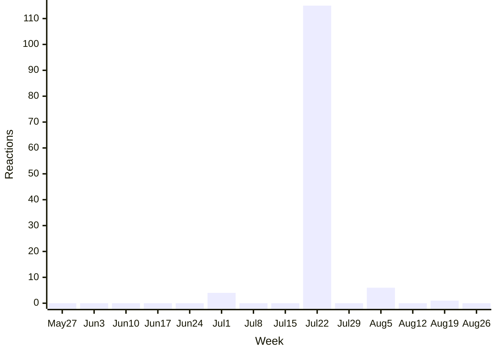
```mermaid
xychart-beta
  x-axis "Week" [May 27, Jun 3, Jun 10, Jun 17, Jun 24, Jul 1, Jul 8, Jul 15, Jul 22, Jul 29, Aug 5, Aug 12, Aug 19, Aug 26]
  y-axis "Reactions"
  bar [0, 0, 0, 0, 0, 4, 0, 0, 115, 0, 6, 0, 1, 0]
```

</a>

<a name="flutter-flutter-55378-graph">

add spacing parameter to Column and Row...

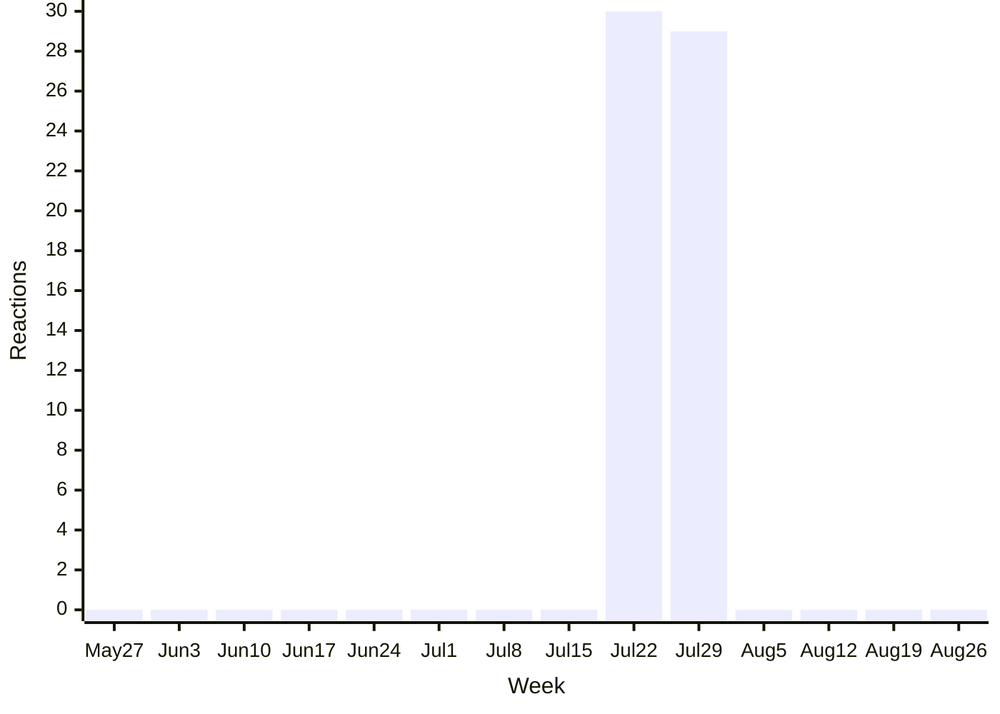
```mermaid
xychart-beta
  x-axis "Week" [May 27, Jun 3, Jun 10, Jun 17, Jun 24, Jul 1, Jul 8, Jul 15, Jul 22, Jul 29, Aug 5, Aug 12, Aug 19, Aug 26]
  y-axis "Reactions"
  bar [0, 0, 0, 0, 0, 0, 0, 0, 30, 29, 0, 0, 0, 0]
```

</a>

<a name="flutter-flutter-53041-graph">

Enable "hot reload" (not just "hot restart") for Flutter Web...

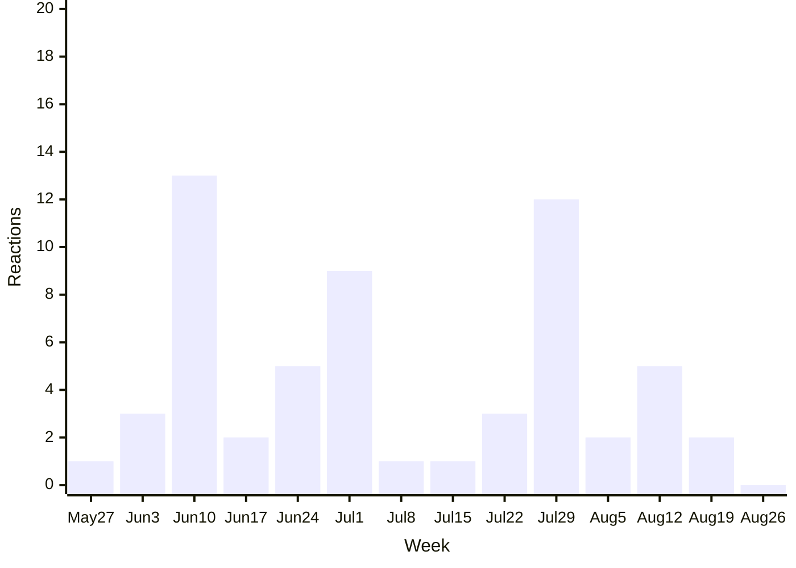
```mermaid
xychart-beta
  x-axis "Week" [May 27, Jun 3, Jun 10, Jun 17, Jun 24, Jul 1, Jul 8, Jul 15, Jul 22, Jul 29, Aug 5, Aug 12, Aug 19, Aug 26]
  y-axis "Reactions" 0 --> 20
  bar [1, 3, 13, 2, 5, 9, 1, 1, 3, 12, 2, 5, 2, 0]
```

</a>

<a name="flutter-flutter-115704-graph">

Add support to define widget preview and see it in the IDE when developing...

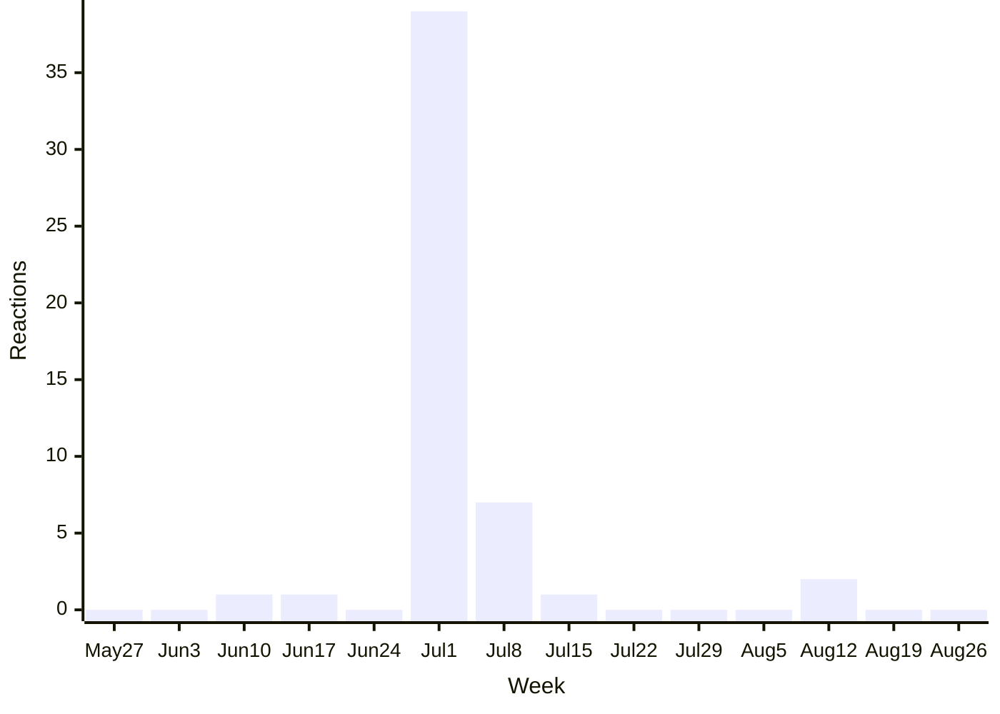
```mermaid
xychart-beta
  x-axis "Week" [May 27, Jun 3, Jun 10, Jun 17, Jun 24, Jul 1, Jul 8, Jul 15, Jul 22, Jul 29, Aug 5, Aug 12, Aug 19, Aug 26]
  y-axis "Reactions"
  bar [0, 0, 1, 1, 0, 39, 7, 1, 0, 0, 0, 2, 0, 0]
```

</a>

<a name="flutter-flutter-139289-graph">

Allow to provide compile-time variables for native platforms from a file...

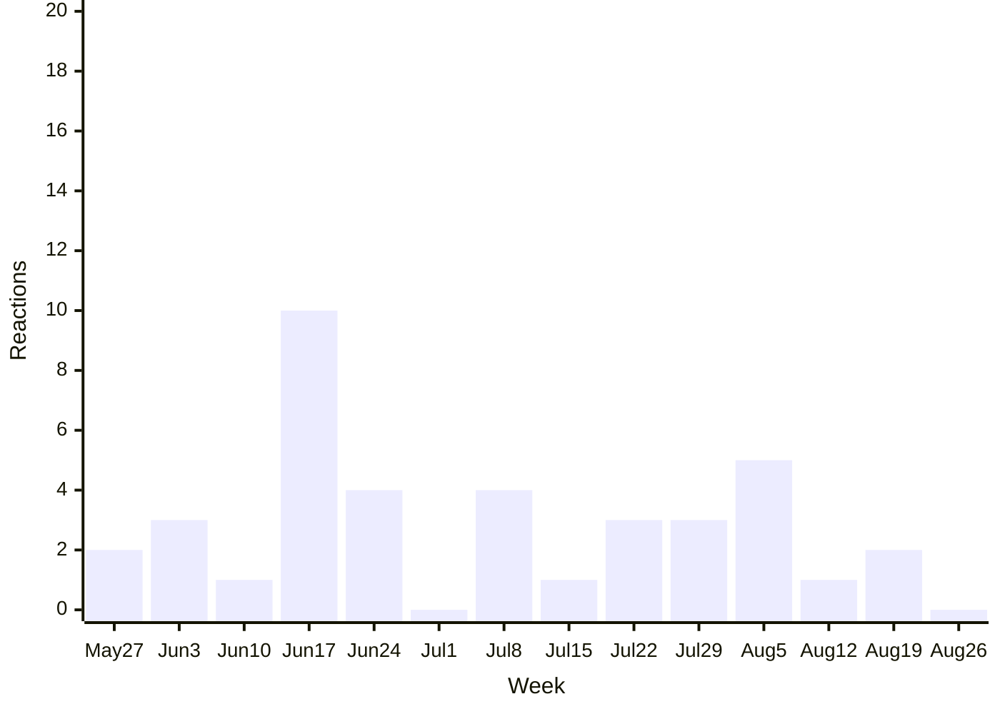
```mermaid
xychart-beta
  x-axis "Week" [May 27, Jun 3, Jun 10, Jun 17, Jun 24, Jul 1, Jul 8, Jul 15, Jul 22, Jul 29, Aug 5, Aug 12, Aug 19, Aug 26]
  y-axis "Reactions" 0 --> 20
  bar [2, 3, 1, 10, 4, 0, 4, 1, 3, 3, 5, 1, 2, 0]
```

</a>

<a name="flutter-flutter-128313-graph">

Add support for visionOS...

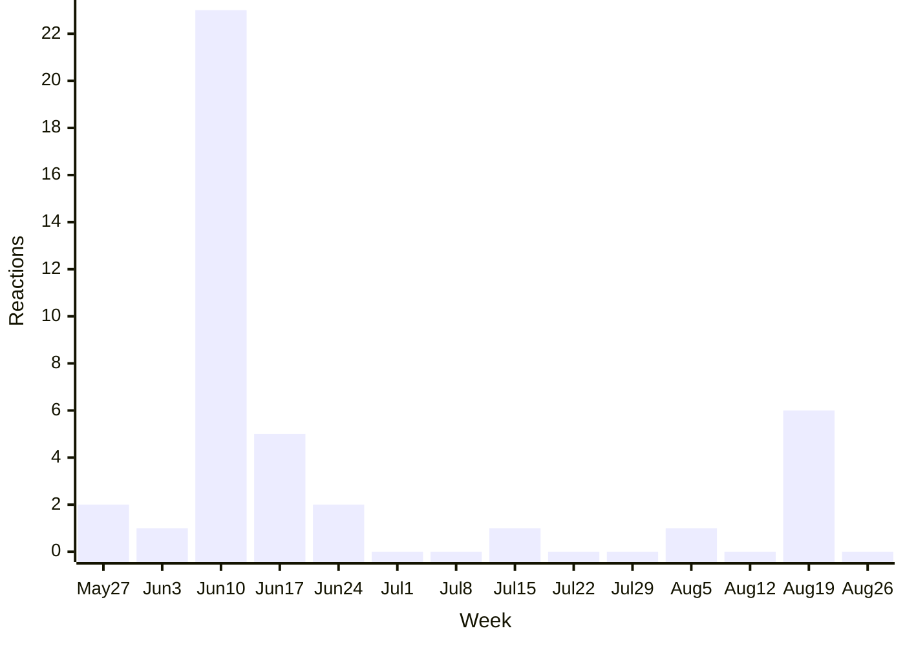
```mermaid
xychart-beta
  x-axis "Week" [May 27, Jun 3, Jun 10, Jun 17, Jun 24, Jul 1, Jul 8, Jul 15, Jul 22, Jul 29, Aug 5, Aug 12, Aug 19, Aug 26]
  y-axis "Reactions"
  bar [2, 1, 23, 5, 2, 0, 0, 1, 0, 0, 1, 0, 6, 0]
```

</a>

<a name="flutter-flutter-109813-graph">

Flutter app flagged for missing accessibility content labels by Google Play Store...

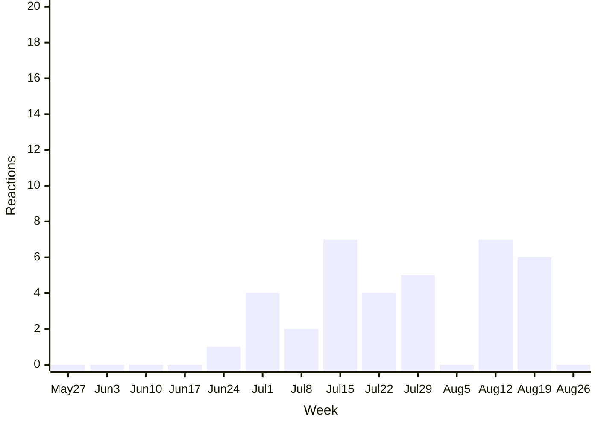
```mermaid
xychart-beta
  x-axis "Week" [May 27, Jun 3, Jun 10, Jun 17, Jun 24, Jul 1, Jul 8, Jul 15, Jul 22, Jul 29, Aug 5, Aug 12, Aug 19, Aug 26]
  y-axis "Reactions" 0 --> 20
  bar [0, 0, 0, 0, 1, 4, 2, 7, 4, 5, 0, 7, 6, 0]
```

</a>

<a name="flutter-flutter-145954-graph">

☂️ Intent to deprecate and remove the HTML renderer in Flutter Web...

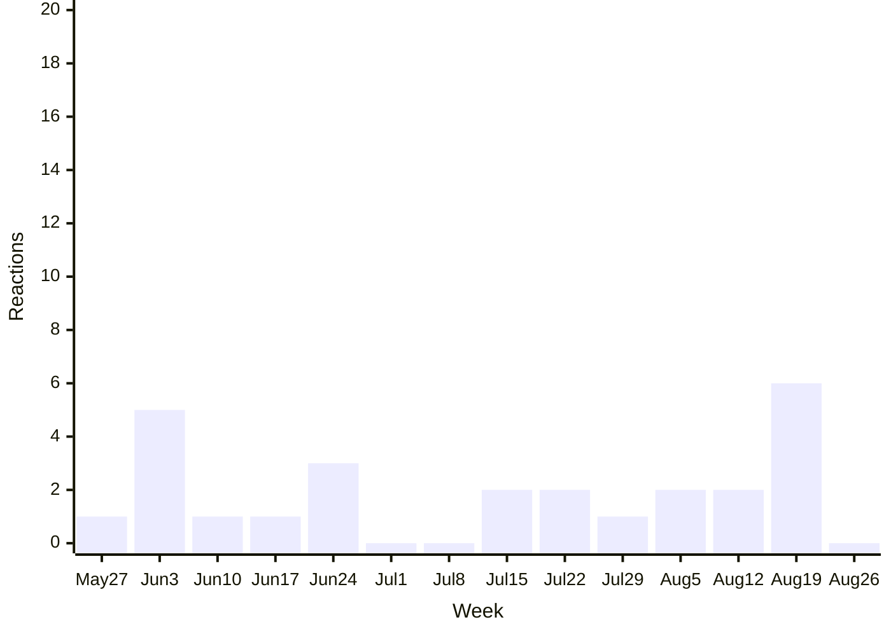
```mermaid
xychart-beta
  x-axis "Week" [May 27, Jun 3, Jun 10, Jun 17, Jun 24, Jul 1, Jul 8, Jul 15, Jul 22, Jul 29, Aug 5, Aug 12, Aug 19, Aug 26]
  y-axis "Reactions" 0 --> 20
  bar [1, 5, 1, 1, 3, 0, 0, 2, 2, 1, 2, 2, 6, 0]
```

</a>

<a name="flutter-flutter-138614-graph">

Preserve WillPopScope as an alternate for PopScope...

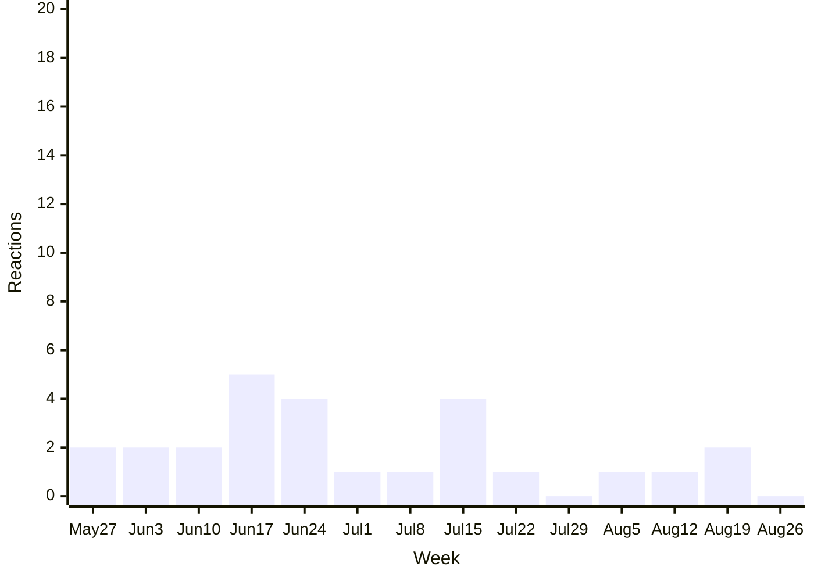
```mermaid
xychart-beta
  x-axis "Week" [May 27, Jun 3, Jun 10, Jun 17, Jun 24, Jul 1, Jul 8, Jul 15, Jul 22, Jul 29, Aug 5, Aug 12, Aug 19, Aug 26]
  y-axis "Reactions" 0 --> 20
  bar [2, 2, 2, 5, 4, 1, 1, 4, 1, 0, 1, 1, 2, 0]
```

</a>

<a name="dart-lang-sdk-55816-graph">

Move `Listenable`, `ValueListenable`, `ChangeNotifier` and `ValueNotifier` to the Dart sdk and add listening methods...

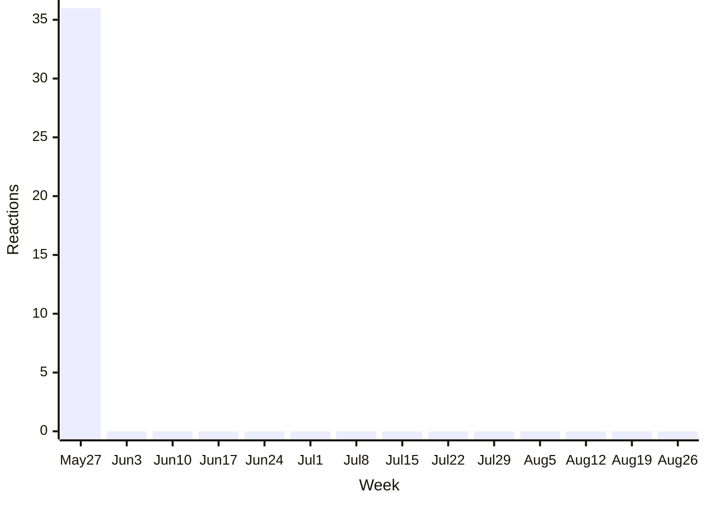
```mermaid
xychart-beta
  x-axis "Week" [May 27, Jun 3, Jun 10, Jun 17, Jun 24, Jul 1, Jul 8, Jul 15, Jul 22, Jul 29, Aug 5, Aug 12, Aug 19, Aug 26]
  y-axis "Reactions"
  bar [36, 0, 0, 0, 0, 0, 0, 0, 0, 0, 0, 0, 0, 0]
```

</a>

<a name="flutter-flutter-152953-graph">

Urgent Flutter 3.24.1 Cherry picks for web...

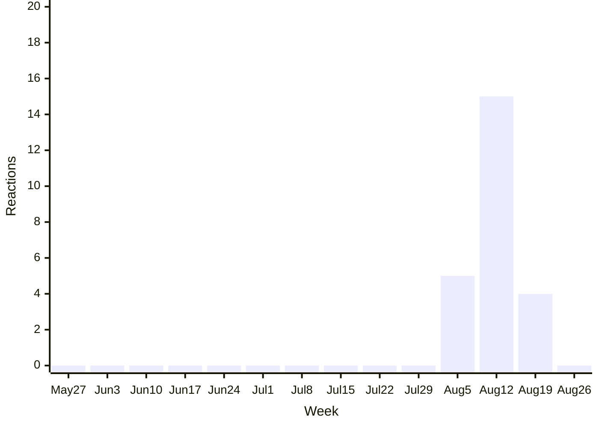
```mermaid
xychart-beta
  x-axis "Week" [May 27, Jun 3, Jun 10, Jun 17, Jun 24, Jul 1, Jul 8, Jul 15, Jul 22, Jul 29, Aug 5, Aug 12, Aug 19, Aug 26]
  y-axis "Reactions" 0 --> 20
  bar [0, 0, 0, 0, 0, 0, 0, 0, 0, 0, 5, 15, 4, 0]
```

</a>

<a name="flutter-flutter-30701-graph">

Support multiple windows for desktop shells...

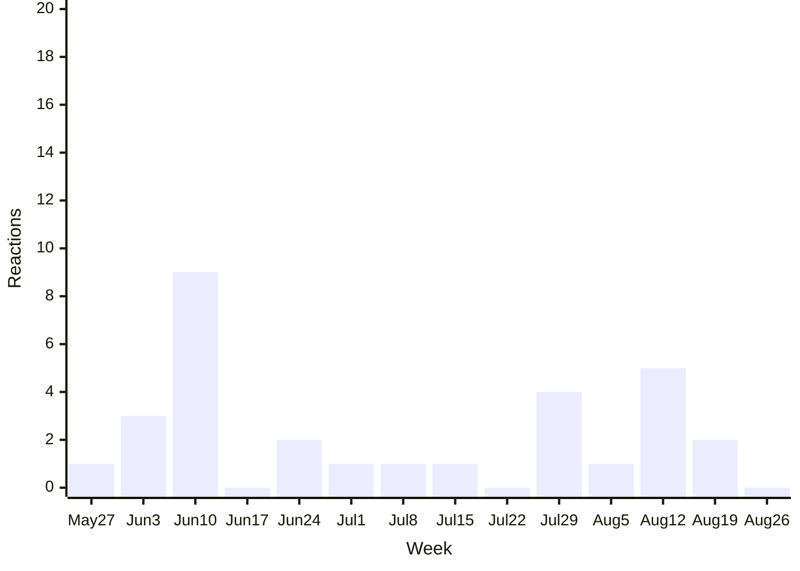
```mermaid
xychart-beta
  x-axis "Week" [May 27, Jun 3, Jun 10, Jun 17, Jun 24, Jul 1, Jul 8, Jul 15, Jul 22, Jul 29, Aug 5, Aug 12, Aug 19, Aug 26]
  y-axis "Reactions" 0 --> 20
  bar [1, 3, 9, 0, 2, 1, 1, 1, 0, 4, 1, 5, 2, 0]
```

</a>

<a name="dart-lang-sdk-54934-graph">

Support for hot reload in DDC...

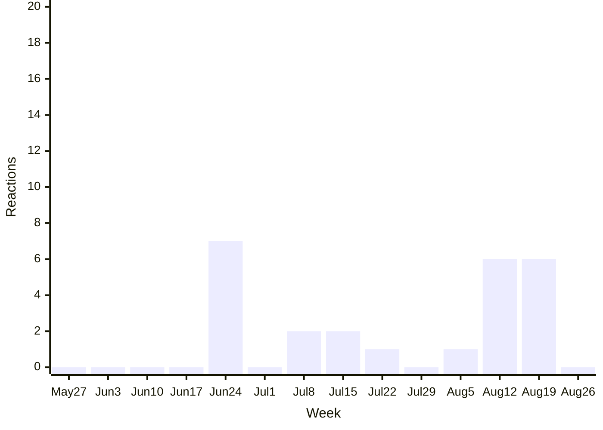
```mermaid
xychart-beta
  x-axis "Week" [May 27, Jun 3, Jun 10, Jun 17, Jun 24, Jul 1, Jul 8, Jul 15, Jul 22, Jul 29, Aug 5, Aug 12, Aug 19, Aug 26]
  y-axis "Reactions" 0 --> 20
  bar [0, 0, 0, 0, 7, 0, 2, 2, 1, 0, 1, 6, 6, 0]
```

</a>

<a name="flutter-flutter-66711-graph">

[pigeon] Support typesafe EventChannels...

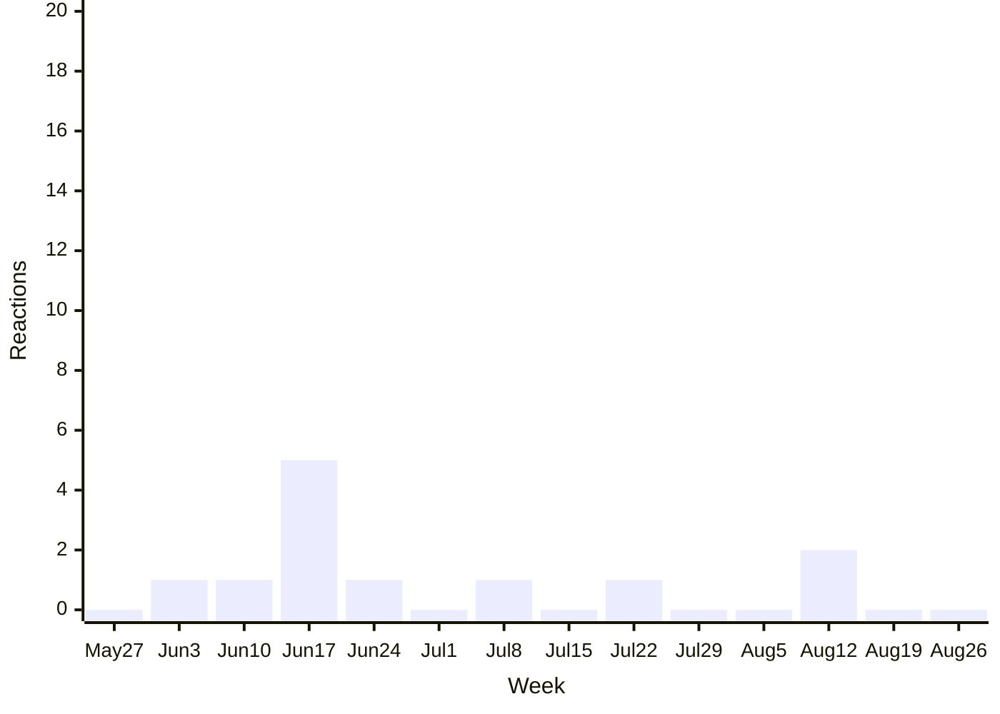
```mermaid
xychart-beta
  x-axis "Week" [May 27, Jun 3, Jun 10, Jun 17, Jun 24, Jul 1, Jul 8, Jul 15, Jul 22, Jul 29, Aug 5, Aug 12, Aug 19, Aug 26]
  y-axis "Reactions" 0 --> 20
  bar [0, 1, 1, 5, 1, 0, 1, 0, 1, 0, 0, 2, 0, 0]
```

</a>

<a name="flutter-flutter-126005-graph">

☂️ Add Swift Package Manager compatibility...

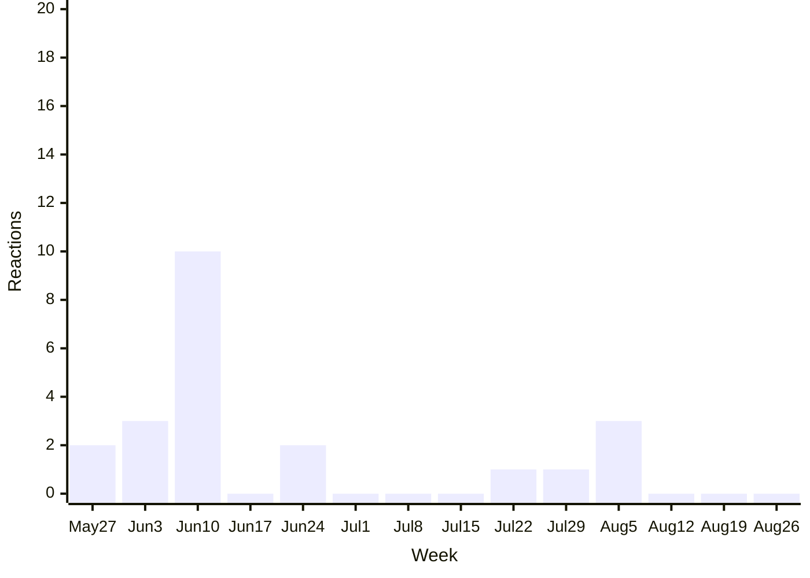
```mermaid
xychart-beta
  x-axis "Week" [May 27, Jun 3, Jun 10, Jun 17, Jun 24, Jul 1, Jul 8, Jul 15, Jul 22, Jul 29, Aug 5, Aug 12, Aug 19, Aug 26]
  y-axis "Reactions" 0 --> 20
  bar [2, 3, 10, 0, 2, 0, 0, 0, 1, 1, 3, 0, 0, 0]
```

</a>

<a name="flutter-flutter-142845-graph">

☂️ Multi View for Windows/MacOS...

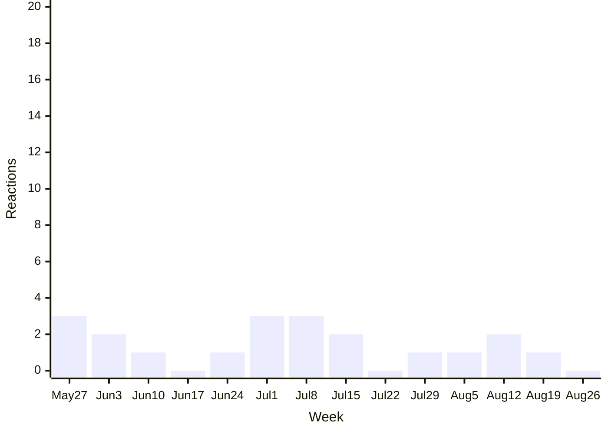
```mermaid
xychart-beta
  x-axis "Week" [May 27, Jun 3, Jun 10, Jun 17, Jun 24, Jul 1, Jul 8, Jul 15, Jul 22, Jul 29, Aug 5, Aug 12, Aug 19, Aug 26]
  y-axis "Reactions" 0 --> 20
  bar [3, 2, 1, 0, 1, 3, 3, 2, 0, 1, 1, 2, 1, 0]
```

</a>

<a name="flutter-flutter-138737-graph">

PopScope seems to be incompatible with GoRouter...

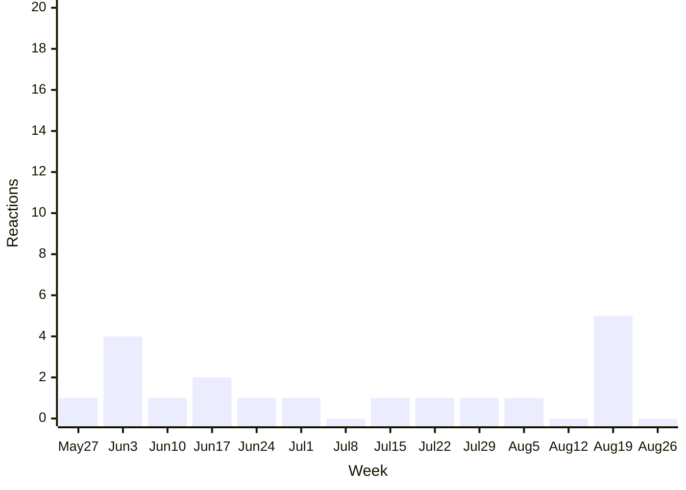
```mermaid
xychart-beta
  x-axis "Week" [May 27, Jun 3, Jun 10, Jun 17, Jun 24, Jul 1, Jul 8, Jul 15, Jul 22, Jul 29, Aug 5, Aug 12, Aug 19, Aug 26]
  y-axis "Reactions" 0 --> 20
  bar [1, 4, 1, 2, 1, 1, 0, 1, 1, 1, 1, 0, 5, 0]
```

</a>

<a name="dart-lang-sdk-53875-graph">

Implement Workspace Feature [meta]...

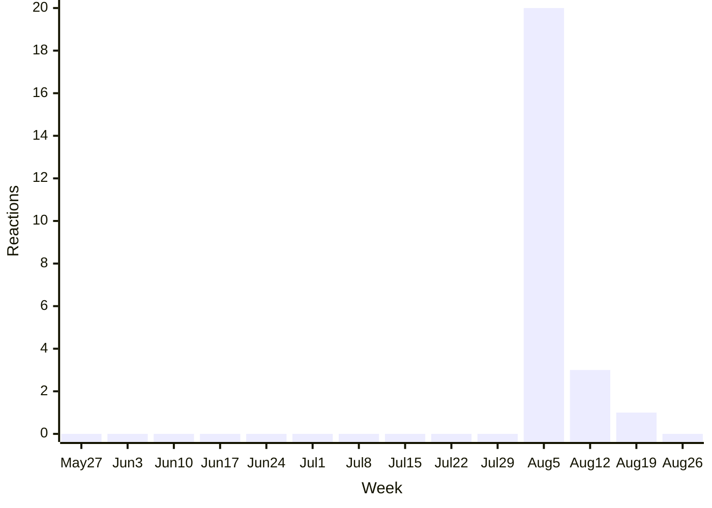
```mermaid
xychart-beta
  x-axis "Week" [May 27, Jun 3, Jun 10, Jun 17, Jun 24, Jul 1, Jul 8, Jul 15, Jul 22, Jul 29, Aug 5, Aug 12, Aug 19, Aug 26]
  y-axis "Reactions" 0 --> 20
  bar [0, 0, 0, 0, 0, 0, 0, 0, 0, 0, 20, 3, 1, 0]
```

</a>

<a name="flutter-flutter-46789-graph">

Improve the indexability (SEO) of Flutter apps on the web ...

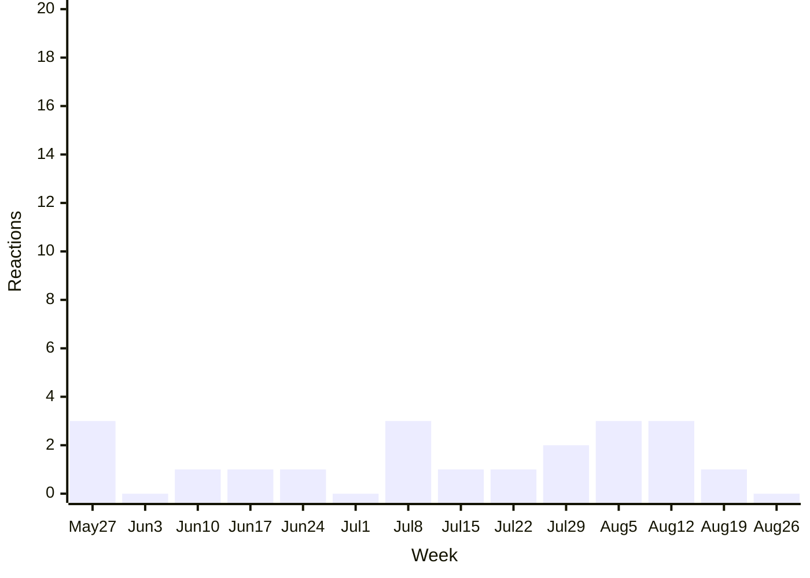
```mermaid
xychart-beta
  x-axis "Week" [May 27, Jun 3, Jun 10, Jun 17, Jun 24, Jul 1, Jul 8, Jul 15, Jul 22, Jul 29, Aug 5, Aug 12, Aug 19, Aug 26]
  y-axis "Reactions" 0 --> 20
  bar [3, 0, 1, 1, 1, 0, 3, 1, 1, 2, 3, 3, 1, 0]
```

</a>

<a name="flutter-flutter-14330-graph">

Code Push / Hot Update / out of band updates...

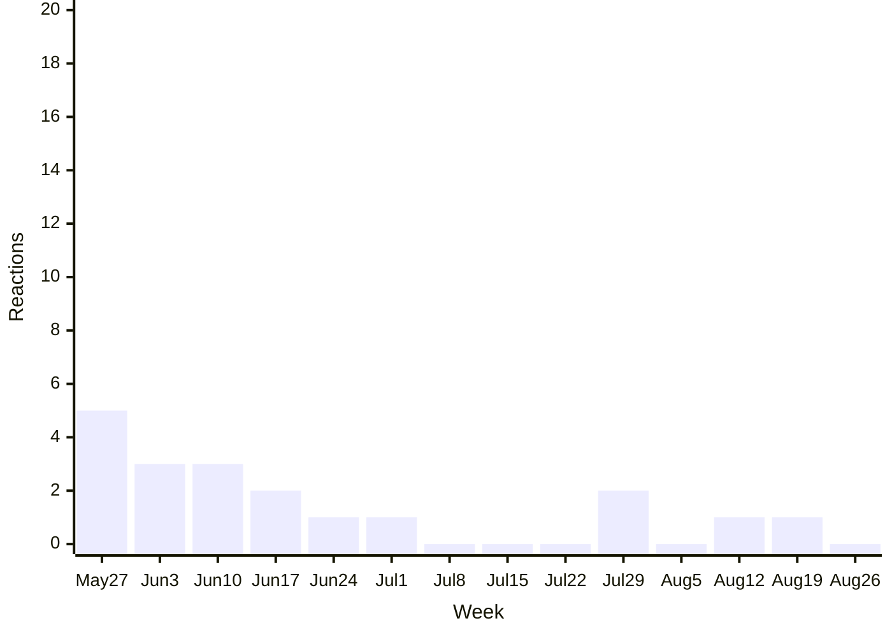
```mermaid
xychart-beta
  x-axis "Week" [May 27, Jun 3, Jun 10, Jun 17, Jun 24, Jul 1, Jul 8, Jul 15, Jul 22, Jul 29, Aug 5, Aug 12, Aug 19, Aug 26]
  y-axis "Reactions" 0 --> 20
  bar [5, 3, 3, 2, 1, 1, 0, 0, 0, 2, 0, 1, 1, 0]
```

</a>

<a name="flutter-flutter-149466-graph">

Move useful Flutter types out of Flutter...

```mermaid
xychart-beta
  x-axis "Week" [May 27, Jun 3, Jun 10, Jun 17, Jun 24, Jul 1, Jul 8, Jul 15, Jul 22, Jul 29, Aug 5, Aug 12, Aug 19, Aug 26]
  y-axis "Reactions" 0 --> 20
  bar [0, 2, 0, 9, 0, 5, 0, 1, 0, 0, 0, 2, 0, 0]
```

</a>

<a name="dart-lang-sdk-56358-graph">

@depreacte dart:html and other "legacy" DOM libraries...

```mermaid
xychart-beta
  x-axis "Week" [May 27, Jun 3, Jun 10, Jun 17, Jun 24, Jul 1, Jul 8, Jul 15, Jul 22, Jul 29, Aug 5, Aug 12, Aug 19, Aug 26]
  y-axis "Reactions" 0 --> 20
  bar [0, 0, 0, 0, 0, 0, 0, 0, 0, 14, 7, 0, 0, 0]
```

</a>

<a name="flutter-flutter-65504-graph">

Ctrl+F support, finding text on a page (even when scrolled off screen)...

```mermaid
xychart-beta
  x-axis "Week" [May 27, Jun 3, Jun 10, Jun 17, Jun 24, Jul 1, Jul 8, Jul 15, Jul 22, Jul 29, Aug 5, Aug 12, Aug 19, Aug 26]
  y-axis "Reactions" 0 --> 20
  bar [1, 1, 0, 0, 4, 5, 1, 1, 2, 0, 3, 0, 0, 0]
```

</a>

<a name="flutter-flutter-31713-graph">

Implement PlatformView support on Windows...

```mermaid
xychart-beta
  x-axis "Week" [May 27, Jun 3, Jun 10, Jun 17, Jun 24, Jul 1, Jul 8, Jul 15, Jul 22, Jul 29, Aug 5, Aug 12, Aug 19, Aug 26]
  y-axis "Reactions" 0 --> 20
  bar [1, 0, 2, 1, 0, 1, 0, 2, 1, 1, 1, 5, 3, 0]
```

</a>

<a name="flutter-flutter-21594-graph">

Table > TableRow > TableCell colspan...

```mermaid
xychart-beta
  x-axis "Week" [May 27, Jun 3, Jun 10, Jun 17, Jun 24, Jul 1, Jul 8, Jul 15, Jul 22, Jul 29, Aug 5, Aug 12, Aug 19, Aug 26]
  y-axis "Reactions" 0 --> 20
  bar [0, 1, 4, 1, 1, 0, 0, 3, 5, 2, 0, 0, 2, 0]
```

</a>

<a name="flutter-flutter-65065-graph">

Bundling assets only on a specific platform (and remove assets on another platform)...

```mermaid
xychart-beta
  x-axis "Week" [May 27, Jun 3, Jun 10, Jun 17, Jun 24, Jul 1, Jul 8, Jul 15, Jul 22, Jul 29, Aug 5, Aug 12, Aug 19, Aug 26]
  y-axis "Reactions" 0 --> 20
  bar [4, 0, 0, 4, 1, 0, 4, 1, 1, 0, 0, 0, 1, 0]
```

</a>

<a name="flutter-flutter-26801-graph">

Apple CarPlay / Android Auto support?...

```mermaid
xychart-beta
  x-axis "Week" [May 27, Jun 3, Jun 10, Jun 17, Jun 24, Jul 1, Jul 8, Jul 15, Jul 22, Jul 29, Aug 5, Aug 12, Aug 19, Aug 26]
  y-axis "Reactions" 0 --> 20
  bar [0, 0, 7, 0, 0, 1, 1, 0, 6, 0, 0, 1, 0, 0]
```

</a>

<a name="flutter-flutter-99606-graph">

Ability to change the keyboard language programmatically...

```mermaid
xychart-beta
  x-axis "Week" [May 27, Jun 3, Jun 10, Jun 17, Jun 24, Jul 1, Jul 8, Jul 15, Jul 22, Jul 29, Aug 5, Aug 12, Aug 19, Aug 26]
  y-axis "Reactions" 0 --> 20
  bar [2, 2, 0, 1, 2, 2, 0, 3, 0, 1, 1, 0, 1, 0]
```

</a>

<a name="flutter-flutter-152995-graph">

[WEB] Refresh MIME Type Error on destination route when using `usePathUrlStrategy` on Flutter stable 3.24.0...

```mermaid
xychart-beta
  x-axis "Week" [May 27, Jun 3, Jun 10, Jun 17, Jun 24, Jul 1, Jul 8, Jul 15, Jul 22, Jul 29, Aug 5, Aug 12, Aug 19, Aug 26]
  y-axis "Reactions" 0 --> 20
  bar [0, 0, 0, 0, 0, 0, 0, 0, 0, 0, 6, 9, 0, 0]
```

</a>

<a name="flutter-flutter-91241-graph">

Video Player HDR Problem...

```mermaid
xychart-beta
  x-axis "Week" [May 27, Jun 3, Jun 10, Jun 17, Jun 24, Jul 1, Jul 8, Jul 15, Jul 22, Jul 29, Aug 5, Aug 12, Aug 19, Aug 26]
  y-axis "Reactions" 0 --> 20
  bar [2, 1, 0, 2, 6, 2, 3, 1, 0, 0, 1, 0, 0, 0]
```

</a>

<a name="flutter-flutter-26863-graph">

[google_maps_flutter] Support marker clustering...

```mermaid
xychart-beta
  x-axis "Week" [May 27, Jun 3, Jun 10, Jun 17, Jun 24, Jul 1, Jul 8, Jul 15, Jul 22, Jul 29, Aug 5, Aug 12, Aug 19, Aug 26]
  y-axis "Reactions" 0 --> 20
  bar [0, 1, 0, 0, 0, 0, 6, 0, 1, 6, 1, 0, 0, 0]
```

</a>

<a name="flutter-flutter-47600-graph">

Server-side rendering for Flutter web...

```mermaid
xychart-beta
  x-axis "Week" [May 27, Jun 3, Jun 10, Jun 17, Jun 24, Jul 1, Jul 8, Jul 15, Jul 22, Jul 29, Aug 5, Aug 12, Aug 19, Aug 26]
  y-axis "Reactions" 0 --> 20
  bar [1, 5, 0, 0, 0, 0, 0, 5, 0, 1, 0, 0, 0, 0]
```

</a>

<a name="flutter-flutter-60240-graph">

Make it easier to upload Android native debug symbols for release builds...

```mermaid
xychart-beta
  x-axis "Week" [May 27, Jun 3, Jun 10, Jun 17, Jun 24, Jul 1, Jul 8, Jul 15, Jul 22, Jul 29, Aug 5, Aug 12, Aug 19, Aug 26]
  y-axis "Reactions" 0 --> 20
  bar [0, 5, 0, 5, 1, 0, 0, 1, 0, 1, 0, 0, 2, 0]
```

</a>

<a name="flutter-flutter-110431-graph">

Flutter adds additional one frame touch latency compared to native...

```mermaid
xychart-beta
  x-axis "Week" [May 27, Jun 3, Jun 10, Jun 17, Jun 24, Jul 1, Jul 8, Jul 15, Jul 22, Jul 29, Aug 5, Aug 12, Aug 19, Aug 26]
  y-axis "Reactions" 0 --> 20
  bar [5, 0, 2, 0, 0, 0, 1, 0, 2, 1, 1, 0, 0, 0]
```

</a>

<a name="flutter-flutter-41725-graph">

[webview_flutter] Add macOS support...

```mermaid
xychart-beta
  x-axis "Week" [May 27, Jun 3, Jun 10, Jun 17, Jun 24, Jul 1, Jul 8, Jul 15, Jul 22, Jul 29, Aug 5, Aug 12, Aug 19, Aug 26]
  y-axis "Reactions" 0 --> 20
  bar [0, 2, 1, 1, 5, 0, 2, 1, 0, 0, 1, 1, 0, 0]
```

</a>

<a name="flutter-flutter-69529-graph">

[web] Scroll is not recognized by the browser...

```mermaid
xychart-beta
  x-axis "Week" [May 27, Jun 3, Jun 10, Jun 17, Jun 24, Jul 1, Jul 8, Jul 15, Jul 22, Jul 29, Aug 5, Aug 12, Aug 19, Aug 26]
  y-axis "Reactions" 0 --> 20
  bar [3, 2, 0, 0, 0, 0, 0, 4, 0, 1, 0, 1, 1, 0]
```

</a>

<a name="flutter-flutter-149031-graph">

[WEB] Web Cache invalidation based on pubspec.yaml version...

```mermaid
xychart-beta
  x-axis "Week" [May 27, Jun 3, Jun 10, Jun 17, Jun 24, Jul 1, Jul 8, Jul 15, Jul 22, Jul 29, Aug 5, Aug 12, Aug 19, Aug 26]
  y-axis "Reactions" 0 --> 20
  bar [0, 0, 0, 0, 0, 0, 0, 0, 0, 0, 6, 1, 6, 0]
```

</a>

<a name="flutter-flutter-124334-graph">

WebGPU Backend for Flutter Web...

```mermaid
xychart-beta
  x-axis "Week" [May 27, Jun 3, Jun 10, Jun 17, Jun 24, Jul 1, Jul 8, Jul 15, Jul 22, Jul 29, Aug 5, Aug 12, Aug 19, Aug 26]
  y-axis "Reactions" 0 --> 20
  bar [0, 6, 0, 0, 1, 0, 0, 0, 2, 3, 0, 0, 1, 0]
```

</a>

<a name="flutter-flutter-124205-graph">

Keyboard issue on mobile Web platform...

```mermaid
xychart-beta
  x-axis "Week" [May 27, Jun 3, Jun 10, Jun 17, Jun 24, Jul 1, Jul 8, Jul 15, Jul 22, Jul 29, Aug 5, Aug 12, Aug 19, Aug 26]
  y-axis "Reactions" 0 --> 20
  bar [0, 1, 1, 1, 0, 1, 2, 0, 0, 2, 2, 1, 1, 0]
```

</a>

<a name="flutter-flutter-140586-graph">

[go_router] Failed assertion: line 3817 pos 18: '!keyReservation.contains(key)': is not true....

```mermaid
xychart-beta
  x-axis "Week" [May 27, Jun 3, Jun 10, Jun 17, Jun 24, Jul 1, Jul 8, Jul 15, Jul 22, Jul 29, Aug 5, Aug 12, Aug 19, Aug 26]
  y-axis "Reactions" 0 --> 20
  bar [1, 1, 0, 1, 0, 1, 1, 0, 0, 0, 3, 0, 2, 0]
```

</a>

<a name="flutter-flutter-54200-graph">

allow Hero widgets to have transitions within the same screen...

```mermaid
xychart-beta
  x-axis "Week" [May 27, Jun 3, Jun 10, Jun 17, Jun 24, Jul 1, Jul 8, Jul 15, Jul 22, Jul 29, Aug 5, Aug 12, Aug 19, Aug 26]
  y-axis "Reactions" 0 --> 20
  bar [1, 2, 1, 0, 5, 0, 1, 0, 0, 3, 1, 0, 0, 0]
```

</a>

<a name="dart-lang-sdk-55991-graph">

☂️ Explore shared memory multithreading...

```mermaid
xychart-beta
  x-axis "Week" [May 27, Jun 3, Jun 10, Jun 17, Jun 24, Jul 1, Jul 8, Jul 15, Jul 22, Jul 29, Aug 5, Aug 12, Aug 19, Aug 26]
  y-axis "Reactions" 0 --> 20
  bar [0, 0, 5, 1, 0, 4, 0, 0, 0, 1, 0, 1, 0, 0]
```

</a>

<a name="flutter-flutter-129757-graph">

☂️ Native assets support...

```mermaid
xychart-beta
  x-axis "Week" [May 27, Jun 3, Jun 10, Jun 17, Jun 24, Jul 1, Jul 8, Jul 15, Jul 22, Jul 29, Aug 5, Aug 12, Aug 19, Aug 26]
  y-axis "Reactions" 0 --> 20
  bar [5, 0, 1, 1, 2, 0, 0, 0, 2, 0, 1, 0, 1, 0]
```

</a>

<a name="flutter-flutter-90856-graph">

ReorderableListView Weird Behaviour on reordering the second last child...

```mermaid
xychart-beta
  x-axis "Week" [May 27, Jun 3, Jun 10, Jun 17, Jun 24, Jul 1, Jul 8, Jul 15, Jul 22, Jul 29, Aug 5, Aug 12, Aug 19, Aug 26]
  y-axis "Reactions" 0 --> 20
  bar [0, 1, 0, 0, 0, 0, 0, 0, 1, 3, 0, 0, 0, 0]
```

</a>

<a name="flutter-flutter-140869-graph">

[go_router] WillPopScope/PopScope doesn't trigger with back button navigation on root screens...

```mermaid
xychart-beta
  x-axis "Week" [May 27, Jun 3, Jun 10, Jun 17, Jun 24, Jul 1, Jul 8, Jul 15, Jul 22, Jul 29, Aug 5, Aug 12, Aug 19, Aug 26]
  y-axis "Reactions" 0 --> 20
  bar [0, 0, 2, 1, 0, 1, 1, 2, 0, 1, 1, 0, 0, 0]
```

</a>

<a name="flutter-flutter-96283-graph">

[Web]: Proposal to be able to build flutter web app with debug profile support...

```mermaid
xychart-beta
  x-axis "Week" [May 27, Jun 3, Jun 10, Jun 17, Jun 24, Jul 1, Jul 8, Jul 15, Jul 22, Jul 29, Aug 5, Aug 12, Aug 19, Aug 26]
  y-axis "Reactions" 0 --> 20
  bar [2, 1, 0, 2, 1, 0, 2, 1, 0, 1, 0, 0, 1, 0]
```

</a>

<a name="flutter-flutter-18443-graph">

Support soft hyphenation (line breaks at U+00AD plus rendering a hyphen at the end of the line)...

```mermaid
xychart-beta
  x-axis "Week" [May 27, Jun 3, Jun 10, Jun 17, Jun 24, Jul 1, Jul 8, Jul 15, Jul 22, Jul 29, Aug 5, Aug 12, Aug 19, Aug 26]
  y-axis "Reactions" 0 --> 20
  bar [0, 0, 3, 2, 1, 0, 0, 0, 0, 1, 3, 0, 0, 0]
```

</a>

<a name="flutter-flutter-107157-graph">

[Proposal]Allow multiple arb files to organize l10n / intl localizations for a language...

```mermaid
xychart-beta
  x-axis "Week" [May 27, Jun 3, Jun 10, Jun 17, Jun 24, Jul 1, Jul 8, Jul 15, Jul 22, Jul 29, Aug 5, Aug 12, Aug 19, Aug 26]
  y-axis "Reactions" 0 --> 20
  bar [2, 1, 0, 1, 1, 2, 1, 1, 0, 0, 1, 1, 1, 0]
```

</a>

<a name="flutter-flutter-139292-graph">

New DOM renderer for Flutter web...

```mermaid
xychart-beta
  x-axis "Week" [May 27, Jun 3, Jun 10, Jun 17, Jun 24, Jul 1, Jul 8, Jul 15, Jul 22, Jul 29, Aug 5, Aug 12, Aug 19, Aug 26]
  y-axis "Reactions" 0 --> 20
  bar [2, 5, 1, 1, 0, 0, 0, 0, 0, 0, 0, 0, 0, 0]
```

</a>

<a name="flutter-flutter-109842-graph">

Add suport for Android 13 per-app language preferences ...

```mermaid
xychart-beta
  x-axis "Week" [May 27, Jun 3, Jun 10, Jun 17, Jun 24, Jul 1, Jul 8, Jul 15, Jul 22, Jul 29, Aug 5, Aug 12, Aug 19, Aug 26]
  y-axis "Reactions" 0 --> 20
  bar [3, 3, 0, 1, 0, -3, 0, 2, 0, 0, 0, 0, 2, 0]
```

</a>

<a name="flutter-flutter-127409-graph">

add restartApp() method...

```mermaid
xychart-beta
  x-axis "Week" [May 27, Jun 3, Jun 10, Jun 17, Jun 24, Jul 1, Jul 8, Jul 15, Jul 22, Jul 29, Aug 5, Aug 12, Aug 19, Aug 26]
  y-axis "Reactions" 0 --> 20
  bar [0, 1, 1, 1, 0, 2, 2, 2, 0, 0, 1, 0, 1, 0]
```

</a>

<a name="dart-lang-sdk-55281-graph">

Dart Analyzer very slow/stuck...

```mermaid
xychart-beta
  x-axis "Week" [May 27, Jun 3, Jun 10, Jun 17, Jun 24, Jul 1, Jul 8, Jul 15, Jul 22, Jul 29, Aug 5, Aug 12, Aug 19, Aug 26]
  y-axis "Reactions" 0 --> 20
  bar [1, 0, 2, 1, 2, 0, 0, 0, 2, 0, 1, 2, 0, 0]
```

</a>

<a name="flutter-flutter-61229-graph">

AVIF codec support...

```mermaid
xychart-beta
  x-axis "Week" [May 27, Jun 3, Jun 10, Jun 17, Jun 24, Jul 1, Jul 8, Jul 15, Jul 22, Jul 29, Aug 5, Aug 12, Aug 19, Aug 26]
  y-axis "Reactions" 0 --> 20
  bar [4, 0, 0, 0, 0, 1, 0, 1, 0, 0, 0, 0, 1, 0]
```

</a>

<a name="flutter-flutter-62597-graph">

[Windows] ☂️  Add support for Arm64 as a target...

```mermaid
xychart-beta
  x-axis "Week" [May 27, Jun 3, Jun 10, Jun 17, Jun 24, Jul 1, Jul 8, Jul 15, Jul 22, Jul 29, Aug 5, Aug 12, Aug 19, Aug 26]
  y-axis "Reactions" 0 --> 20
  bar [1, 0, 0, 0, 3, 2, 0, 1, 0, 2, 0, 0, 1, 0]
```

</a>

<a name="flutter-flutter-102003-graph">

Rewrite the NestedScrollView...

```mermaid
xychart-beta
  x-axis "Week" [May 27, Jun 3, Jun 10, Jun 17, Jun 24, Jul 1, Jul 8, Jul 15, Jul 22, Jul 29, Aug 5, Aug 12, Aug 19, Aug 26]
  y-axis "Reactions" 0 --> 20
  bar [0, 2, 0, 0, 0, 0, 0, 0, 0, 1, 4, 0, 0, 0]
```

</a>

<a name="flutter-flutter-141371-graph">

Web: include different files depending on the flavor...

```mermaid
xychart-beta
  x-axis "Week" [May 27, Jun 3, Jun 10, Jun 17, Jun 24, Jul 1, Jul 8, Jul 15, Jul 22, Jul 29, Aug 5, Aug 12, Aug 19, Aug 26]
  y-axis "Reactions" 0 --> 20
  bar [0, 0, 0, 0, 0, 0, 0, 0, 0, 0, 8, 0, 2, 0]
```

</a>

<a name="flutter-flutter-127855-graph">

Implement wide gamut color support in the Framework...

```mermaid
xychart-beta
  x-axis "Week" [May 27, Jun 3, Jun 10, Jun 17, Jun 24, Jul 1, Jul 8, Jul 15, Jul 22, Jul 29, Aug 5, Aug 12, Aug 19, Aug 26]
  y-axis "Reactions" 0 --> 20
  bar [0, 0, 0, 2, 0, 0, 0, 0, 0, 6, 0, 0, 0, 0]
```

</a>

<a name="flutter-flutter-59284-graph">

Text widget incorrectly wraps Korean text...

```mermaid
xychart-beta
  x-axis "Week" [May 27, Jun 3, Jun 10, Jun 17, Jun 24, Jul 1, Jul 8, Jul 15, Jul 22, Jul 29, Aug 5, Aug 12, Aug 19, Aug 26]
  y-axis "Reactions" 0 --> 20
  bar [0, 0, 0, 0, 0, 1, 0, 0, 0, 9, 0, 0, 1, 0]
```

</a>

<a name="flutter-flutter-24213-graph">

[google_maps_flutter] Support Widgets as markers...

```mermaid
xychart-beta
  x-axis "Week" [May 27, Jun 3, Jun 10, Jun 17, Jun 24, Jul 1, Jul 8, Jul 15, Jul 22, Jul 29, Aug 5, Aug 12, Aug 19, Aug 26]
  y-axis "Reactions" 0 --> 20
  bar [0, 1, 0, 0, 2, 2, 0, 0, 0, 1, 1, 0, 3, 0]
```

</a>

<a name="flutter-flutter-37597-graph">

[webview_flutter] Add Windows support...

```mermaid
xychart-beta
  x-axis "Week" [May 27, Jun 3, Jun 10, Jun 17, Jun 24, Jul 1, Jul 8, Jul 15, Jul 22, Jul 29, Aug 5, Aug 12, Aug 19, Aug 26]
  y-axis "Reactions" 0 --> 20
  bar [0, 0, 2, 2, 0, 1, 1, 1, 0, 0, 0, 2, 0, 0]
```

</a>

<a name="flutter-flutter-116383-graph">

[in_app_purchase] Use StoreKit 2 APIs...

```mermaid
xychart-beta
  x-axis "Week" [May 27, Jun 3, Jun 10, Jun 17, Jun 24, Jul 1, Jul 8, Jul 15, Jul 22, Jul 29, Aug 5, Aug 12, Aug 19, Aug 26]
  y-axis "Reactions" 0 --> 20
  bar [0, 1, 3, 0, 1, 0, 0, 1, 0, 1, 2, 0, 1, 0]
```

</a>

<a name="flutter-flutter-121929-graph">

[animation] using animations package with go_router package instead of Navigator.push() method...

```mermaid
xychart-beta
  x-axis "Week" [May 27, Jun 3, Jun 10, Jun 17, Jun 24, Jul 1, Jul 8, Jul 15, Jul 22, Jul 29, Aug 5, Aug 12, Aug 19, Aug 26]
  y-axis "Reactions" 0 --> 20
  bar [0, 1, 0, 2, 0, 0, 0, 1, 0, 0, 3, 1, 0, 0]
```

</a>

<a name="dart-lang-sdk-55762-graph">

Macros: Declaring a constructor on a generic class with an `implements` breaks generation...

```mermaid
xychart-beta
  x-axis "Week" [May 27, Jun 3, Jun 10, Jun 17, Jun 24, Jul 1, Jul 8, Jul 15, Jul 22, Jul 29, Aug 5, Aug 12, Aug 19, Aug 26]
  y-axis "Reactions" 0 --> 20
  bar [5, 3, 0, 0, 0, 0, 0, 0, 0, 2, 0, 0, 0, 0]
```

</a>

<a name="flutter-flutter-104509-graph">

Flutter web - Need documentation on how to conditionally display a "Refresh. New Version is available." prompt when updated code is deployed to production....

```mermaid
xychart-beta
  x-axis "Week" [May 27, Jun 3, Jun 10, Jun 17, Jun 24, Jul 1, Jul 8, Jul 15, Jul 22, Jul 29, Aug 5, Aug 12, Aug 19, Aug 26]
  y-axis "Reactions" 0 --> 20
  bar [0, 2, 0, 0, 1, 0, 1, 0, 1, 2, 0, 0, 1, 0]
```

</a>

<a name="flutter-flutter-37159-graph">

Roku support...

```mermaid
xychart-beta
  x-axis "Week" [May 27, Jun 3, Jun 10, Jun 17, Jun 24, Jul 1, Jul 8, Jul 15, Jul 22, Jul 29, Aug 5, Aug 12, Aug 19, Aug 26]
  y-axis "Reactions" 0 --> 20
  bar [0, 1, 0, 0, 0, 0, 0, 2, 0, 0, 0, 1, 0, 0]
```

</a>

<a name="dart-lang-sdk-50565-graph">

☂️ [vm/ffi] Native assets feature...

```mermaid
xychart-beta
  x-axis "Week" [May 27, Jun 3, Jun 10, Jun 17, Jun 24, Jul 1, Jul 8, Jul 15, Jul 22, Jul 29, Aug 5, Aug 12, Aug 19, Aug 26]
  y-axis "Reactions" 0 --> 20
  bar [1, 1, 0, 1, 1, 2, 0, 1, 0, 0, 1, 0, 0, 0]
```

</a>

<a name="flutter-flutter-10437-graph">

Do plugins need to know about hot reload and hot restart?...

```mermaid
xychart-beta
  x-axis "Week" [May 27, Jun 3, Jun 10, Jun 17, Jun 24, Jul 1, Jul 8, Jul 15, Jul 22, Jul 29, Aug 5, Aug 12, Aug 19, Aug 26]
  y-axis "Reactions" 0 --> 20
  bar [0, 0, 0, 1, 3, 0, 0, 0, 0, 2, 0, 3, 1, 0]
```

</a>

<a name="dart-lang-sdk-42855-graph">

Add possibility to truly cancel/dispose Fututre...

```mermaid
xychart-beta
  x-axis "Week" [May 27, Jun 3, Jun 10, Jun 17, Jun 24, Jul 1, Jul 8, Jul 15, Jul 22, Jul 29, Aug 5, Aug 12, Aug 19, Aug 26]
  y-axis "Reactions" 0 --> 20
  bar [0, 0, 0, 0, 1, 0, 1, 0, 0, 4, 0, 0, 0, 0]
```

</a>

<a name="flutter-flutter-55324-graph">

Support Firefox as a browser in flutter run...

```mermaid
xychart-beta
  x-axis "Week" [May 27, Jun 3, Jun 10, Jun 17, Jun 24, Jul 1, Jul 8, Jul 15, Jul 22, Jul 29, Aug 5, Aug 12, Aug 19, Aug 26]
  y-axis "Reactions" 0 --> 20
  bar [0, 0, 1, 2, 0, 1, 1, 2, 0, 0, 1, 0, 0, 0]
```

</a>

<a name="flutter-flutter-45296-graph">

[path_provider] Add support for web...

```mermaid
xychart-beta
  x-axis "Week" [May 27, Jun 3, Jun 10, Jun 17, Jun 24, Jul 1, Jul 8, Jul 15, Jul 22, Jul 29, Aug 5, Aug 12, Aug 19, Aug 26]
  y-axis "Reactions" 0 --> 20
  bar [1, 1, 2, 0, 0, 0, 0, 1, 0, 0, 2, 0, 0, 0]
```

</a>

<a name="flutter-flutter-33577-graph">

[web] Support compute on separate thread in Flutter Web...

```mermaid
xychart-beta
  x-axis "Week" [May 27, Jun 3, Jun 10, Jun 17, Jun 24, Jul 1, Jul 8, Jul 15, Jul 22, Jul 29, Aug 5, Aug 12, Aug 19, Aug 26]
  y-axis "Reactions" 0 --> 20
  bar [0, 3, 1, 1, 1, 0, 0, 0, 0, 1, 0, 0, 3, 0]
```

</a>

<a name="flutter-flutter-120353-graph">

[go_router] ShellRoutes break iOS swipe back navigation...

```mermaid
xychart-beta
  x-axis "Week" [May 27, Jun 3, Jun 10, Jun 17, Jun 24, Jul 1, Jul 8, Jul 15, Jul 22, Jul 29, Aug 5, Aug 12, Aug 19, Aug 26]
  y-axis "Reactions" 0 --> 20
  bar [2, 1, 0, 0, 1, 0, 0, 0, 1, 0, 0, 1, 0, 0]
```

</a>

<a name="flutter-flutter-45336-graph">

Add TextOverflow  "ellipsisStart" , "ellipsisMiddle"  and "ellipsisEnd" ...

```mermaid
xychart-beta
  x-axis "Week" [May 27, Jun 3, Jun 10, Jun 17, Jun 24, Jul 1, Jul 8, Jul 15, Jul 22, Jul 29, Aug 5, Aug 12, Aug 19, Aug 26]
  y-axis "Reactions" 0 --> 20
  bar [0, 2, 1, 0, 0, 0, 0, 0, 0, 1, 0, 1, 2, 0]
```

</a>

<a name="flutter-flutter-18345-graph">

SliverAppBar flexibleSpace with height depending on children...

```mermaid
xychart-beta
  x-axis "Week" [May 27, Jun 3, Jun 10, Jun 17, Jun 24, Jul 1, Jul 8, Jul 15, Jul 22, Jul 29, Aug 5, Aug 12, Aug 19, Aug 26]
  y-axis "Reactions" 0 --> 20
  bar [2, 1, 1, 0, 0, 0, 0, 0, 1, 2, 1, 1, 0, 0]
```

</a>

<a name="flutter-flutter-14288-graph">

Antialiasing behaviour when same-colour ...

```mermaid
xychart-beta
  x-axis "Week" [May 27, Jun 3, Jun 10, Jun 17, Jun 24, Jul 1, Jul 8, Jul 15, Jul 22, Jul 29, Aug 5, Aug 12, Aug 19, Aug 26]
  y-axis "Reactions" 0 --> 20
  bar [1, 1, 2, 0, 1, 0, 1, 0, 0, 1, 1, 0, 0, 0]
```

</a>

<a name="flutter-flutter-122258-graph">

[go_router_builder] Define routes in separate files...

```mermaid
xychart-beta
  x-axis "Week" [May 27, Jun 3, Jun 10, Jun 17, Jun 24, Jul 1, Jul 8, Jul 15, Jul 22, Jul 29, Aug 5, Aug 12, Aug 19, Aug 26]
  y-axis "Reactions" 0 --> 20
  bar [0, 0, 1, 0, 0, 2, 2, 0, 0, 0, 1, 1, 0, 0]
```

</a>

<a name="flutter-flutter-108683-graph">

Add Dropdown support to `FilterChip`...

```mermaid
xychart-beta
  x-axis "Week" [May 27, Jun 3, Jun 10, Jun 17, Jun 24, Jul 1, Jul 8, Jul 15, Jul 22, Jul 29, Aug 5, Aug 12, Aug 19, Aug 26]
  y-axis "Reactions" 0 --> 20
  bar [1, 0, 0, 0, 1, 1, 0, 0, 0, 0, 0, 0, 0, 0]
```

</a>

<a name="flutter-flutter-146860-graph">

TextHeightBehaviour should allow more tightly-wrapped text...

```mermaid
xychart-beta
  x-axis "Week" [May 27, Jun 3, Jun 10, Jun 17, Jun 24, Jul 1, Jul 8, Jul 15, Jul 22, Jul 29, Aug 5, Aug 12, Aug 19, Aug 26]
  y-axis "Reactions" 0 --> 20
  bar [0, 0, 1, 0, 0, 0, 1, 0, 0, 1, 2, 0, 2, 0]
```

</a>

<a name="flutter-flutter-133746-graph">

[go_router] Unwanted black screen when using async redirect....

```mermaid
xychart-beta
  x-axis "Week" [May 27, Jun 3, Jun 10, Jun 17, Jun 24, Jul 1, Jul 8, Jul 15, Jul 22, Jul 29, Aug 5, Aug 12, Aug 19, Aug 26]
  y-axis "Reactions" 0 --> 20
  bar [0, 1, 0, 2, 2, 0, 0, 0, 0, 0, 0, 1, 0, 0]
```

</a>

<a name="flutter-flutter-41722-graph">

Implement PlatformView support on macOS...

```mermaid
xychart-beta
  x-axis "Week" [May 27, Jun 3, Jun 10, Jun 17, Jun 24, Jul 1, Jul 8, Jul 15, Jul 22, Jul 29, Aug 5, Aug 12, Aug 19, Aug 26]
  y-axis "Reactions" 0 --> 20
  bar [-1, 1, 1, 0, 0, 0, 0, 1, 3, 0, 0, 2, 0, 0]
```

</a>

<a name="flutter-flutter-83596-graph">

Android crash: Fatal Exception: java.lang.RuntimeException java.util.concurrent.ExecutionException: java.lang.UnsatisfiedLinkError: dalvik.system.PathClassLoader[DexPathList[[zip file "/system/framework/android.test.runner.jar", zip file "/system/framework/org.apache.http.legacy.boot.jar"...........

```mermaid
xychart-beta
  x-axis "Week" [May 27, Jun 3, Jun 10, Jun 17, Jun 24, Jul 1, Jul 8, Jul 15, Jul 22, Jul 29, Aug 5, Aug 12, Aug 19, Aug 26]
  y-axis "Reactions" 0 --> 20
  bar [0, 0, 0, 0, 1, 0, 1, 0, 0, 0, 0, 0, 4, 0]
```

</a>

<a name="flutter-flutter-123078-graph">

[shared_preferences] Consider making async accessors, with optional caching layer...

```mermaid
xychart-beta
  x-axis "Week" [May 27, Jun 3, Jun 10, Jun 17, Jun 24, Jul 1, Jul 8, Jul 15, Jul 22, Jul 29, Aug 5, Aug 12, Aug 19, Aug 26]
  y-axis "Reactions" 0 --> 20
  bar [1, 0, 1, 2, 0, 0, 2, 1, 1, 0, 0, 0, 0, 0]
```

</a>

<a name="flutter-flutter-104908-graph">

Android TalkBack Item label warning for the whole screen...

```mermaid
xychart-beta
  x-axis "Week" [May 27, Jun 3, Jun 10, Jun 17, Jun 24, Jul 1, Jul 8, Jul 15, Jul 22, Jul 29, Aug 5, Aug 12, Aug 19, Aug 26]
  y-axis "Reactions" 0 --> 20
  bar [0, 0, 2, 0, 1, 2, 0, 0, 1, 2, 0, 0, 0, 0]
```

</a>

<a name="flutter-flutter-64106-graph">

Tree shake unused assets...

```mermaid
xychart-beta
  x-axis "Week" [May 27, Jun 3, Jun 10, Jun 17, Jun 24, Jul 1, Jul 8, Jul 15, Jul 22, Jul 29, Aug 5, Aug 12, Aug 19, Aug 26]
  y-axis "Reactions" 0 --> 20
  bar [0, 1, 0, 0, 3, 0, 3, 0, 0, 0, 0, 0, 0, 0]
```

</a>

<a name="flutter-flutter-8230-graph">

Platform specific assets...

```mermaid
xychart-beta
  x-axis "Week" [May 27, Jun 3, Jun 10, Jun 17, Jun 24, Jul 1, Jul 8, Jul 15, Jul 22, Jul 29, Aug 5, Aug 12, Aug 19, Aug 26]
  y-axis "Reactions" 0 --> 20
  bar [2, 1, 0, 0, 0, 0, 3, 0, 1, 0, 0, 0, 0, 0]
```

</a>

<a name="flutter-flutter-86295-graph">

[integration_test] Allow driving native UI interactions from Dart...

```mermaid
xychart-beta
  x-axis "Week" [May 27, Jun 3, Jun 10, Jun 17, Jun 24, Jul 1, Jul 8, Jul 15, Jul 22, Jul 29, Aug 5, Aug 12, Aug 19, Aug 26]
  y-axis "Reactions" 0 --> 20
  bar [0, 1, 0, 0, 0, 0, 0, 1, 0, 3, 0, 0, 1, 0]
```

</a>

<a name="flutter-flutter-129933-graph">

[Flutter-web] Control+MouseWheel should zoom the browser window...

```mermaid
xychart-beta
  x-axis "Week" [May 27, Jun 3, Jun 10, Jun 17, Jun 24, Jul 1, Jul 8, Jul 15, Jul 22, Jul 29, Aug 5, Aug 12, Aug 19, Aug 26]
  y-axis "Reactions" 0 --> 20
  bar [0, 0, 1, 1, 1, 0, 1, 1, 0, 1, 0, 1, 0, 0]
```

</a>

<a name="flutter-flutter-28094-graph">

[video_player] Add network cache functionality...

```mermaid
xychart-beta
  x-axis "Week" [May 27, Jun 3, Jun 10, Jun 17, Jun 24, Jul 1, Jul 8, Jul 15, Jul 22, Jul 29, Aug 5, Aug 12, Aug 19, Aug 26]
  y-axis "Reactions" 0 --> 20
  bar [0, 0, 1, 1, 0, 0, 2, 0, 0, 0, 1, 1, 1, 0]
```

</a>

<a name="flutter-flutter-98178-graph">

[ListTile] Support custom height constraints of leading/trailing...

```mermaid
xychart-beta
  x-axis "Week" [May 27, Jun 3, Jun 10, Jun 17, Jun 24, Jul 1, Jul 8, Jul 15, Jul 22, Jul 29, Aug 5, Aug 12, Aug 19, Aug 26]
  y-axis "Reactions" 0 --> 20
  bar [1, 1, 1, 0, 1, 0, 0, 3, 0, 0, 0, 0, 0, 0]
```

</a>

<a name="flutter-flutter-27293-graph">

Wrapped Text has unexpected intrinsic size...

```mermaid
xychart-beta
  x-axis "Week" [May 27, Jun 3, Jun 10, Jun 17, Jun 24, Jul 1, Jul 8, Jul 15, Jul 22, Jul 29, Aug 5, Aug 12, Aug 19, Aug 26]
  y-axis "Reactions" 0 --> 20
  bar [0, 2, 1, 0, 0, 0, 0, 0, 0, 2, 0, 0, 0, 0]
```

</a>

<a name="flutter-flutter-124382-graph">

Going back to the previous route, images should not be redrawn...

```mermaid
xychart-beta
  x-axis "Week" [May 27, Jun 3, Jun 10, Jun 17, Jun 24, Jul 1, Jul 8, Jul 15, Jul 22, Jul 29, Aug 5, Aug 12, Aug 19, Aug 26]
  y-axis "Reactions" 0 --> 20
  bar [0, 0, 0, 0, 0, 0, 0, 0, 2, 0, 1, 2, 0, 0]
```

</a>

<a name="flutter-flutter-150460-graph">

Expose low level IME interactions...

```mermaid
xychart-beta
  x-axis "Week" [May 27, Jun 3, Jun 10, Jun 17, Jun 24, Jul 1, Jul 8, Jul 15, Jul 22, Jul 29, Aug 5, Aug 12, Aug 19, Aug 26]
  y-axis "Reactions" 0 --> 20
  bar [0, 0, 0, 1, 1, 2, 1, 0, 0, 0, 0, 0, 1, 0]
```

</a>

<a name="dart-lang-sdk-56217-graph">

:memo: Data Assets Tracker...

```mermaid
xychart-beta
  x-axis "Week" [May 27, Jun 3, Jun 10, Jun 17, Jun 24, Jul 1, Jul 8, Jul 15, Jul 22, Jul 29, Aug 5, Aug 12, Aug 19, Aug 26]
  y-axis "Reactions" 0 --> 20
  bar [0, 0, 0, 0, 0, 0, 4, 0, 0, 2, 0, 1, 0, 0]
```

</a>

<a name="flutter-flutter-112196-graph">

[go_router] ShellRoutes seem to cause NavigatorObserver to not fire (5.0.1)...

```mermaid
xychart-beta
  x-axis "Week" [May 27, Jun 3, Jun 10, Jun 17, Jun 24, Jul 1, Jul 8, Jul 15, Jul 22, Jul 29, Aug 5, Aug 12, Aug 19, Aug 26]
  y-axis "Reactions" 0 --> 20
  bar [0, 0, 0, 1, 2, 1, 0, 1, 1, 1, 0, 0, 0, 0]
```

</a>

<a name="flutter-flutter-40931-graph">

[video_player] add buffering controls...

```mermaid
xychart-beta
  x-axis "Week" [May 27, Jun 3, Jun 10, Jun 17, Jun 24, Jul 1, Jul 8, Jul 15, Jul 22, Jul 29, Aug 5, Aug 12, Aug 19, Aug 26]
  y-axis "Reactions" 0 --> 20
  bar [0, 0, 0, 2, 0, 0, 0, 0, 0, 1, 1, 1, 0, 0]
```

</a>

<a name="dart-lang-sdk-42358-graph">

Missing inspections for unused class, unused public methods and properties...

```mermaid
xychart-beta
  x-axis "Week" [May 27, Jun 3, Jun 10, Jun 17, Jun 24, Jul 1, Jul 8, Jul 15, Jul 22, Jul 29, Aug 5, Aug 12, Aug 19, Aug 26]
  y-axis "Reactions" 0 --> 20
  bar [0, 2, 0, 1, 1, 1, 0, 0, 0, 0, 0, 0, 0, 0]
```

</a>

<a name="flutter-flutter-46979-graph">

Support different dependencies when using flavors...

```mermaid
xychart-beta
  x-axis "Week" [May 27, Jun 3, Jun 10, Jun 17, Jun 24, Jul 1, Jul 8, Jul 15, Jul 22, Jul 29, Aug 5, Aug 12, Aug 19, Aug 26]
  y-axis "Reactions" 0 --> 20
  bar [0, 1, 1, 0, 2, 0, 0, 0, 0, 0, 1, 0, 0, 0]
```

</a>

<a name="dart-lang-sdk-55760-graph">

pkg:json - Support for enums...

```mermaid
xychart-beta
  x-axis "Week" [May 27, Jun 3, Jun 10, Jun 17, Jun 24, Jul 1, Jul 8, Jul 15, Jul 22, Jul 29, Aug 5, Aug 12, Aug 19, Aug 26]
  y-axis "Reactions" 0 --> 20
  bar [1, 2, 0, 0, 2, 0, 2, 0, 0, 0, 0, 0, 0, 0]
```

</a>

<a name="dart-lang-sdk-56017-graph">

"Static" "version" in dart...

```mermaid
xychart-beta
  x-axis "Week" [May 27, Jun 3, Jun 10, Jun 17, Jun 24, Jul 1, Jul 8, Jul 15, Jul 22, Jul 29, Aug 5, Aug 12, Aug 19, Aug 26]
  y-axis "Reactions" 0 --> 20
  bar [0, 0, 0, 0, 2, 0, 0, 1, 2, 0, 0, 0, 0, 0]
```

</a>

<a name="flutter-flutter-106277-graph">

Assertion Error on device with 120hz refresh rate "The following assertion was thrown during a scheduler callback: 'elapsedInSeconds >= 0.0': is not true."...

```mermaid
xychart-beta
  x-axis "Week" [May 27, Jun 3, Jun 10, Jun 17, Jun 24, Jul 1, Jul 8, Jul 15, Jul 22, Jul 29, Aug 5, Aug 12, Aug 19, Aug 26]
  y-axis "Reactions" 0 --> 20
  bar [0, 0, 0, 0, 0, 0, 0, 1, 0, 0, 3, 1, 1, 0]
```

</a>

<a name="flutter-flutter-77638-graph">

Avoid requiring Visual Studio for Windows development...

```mermaid
xychart-beta
  x-axis "Week" [May 27, Jun 3, Jun 10, Jun 17, Jun 24, Jul 1, Jul 8, Jul 15, Jul 22, Jul 29, Aug 5, Aug 12, Aug 19, Aug 26]
  y-axis "Reactions" 0 --> 20
  bar [1, 1, 2, 0, 0, 0, 0, 1, 0, 0, 0, 0, 0, 0]
```

</a>

<a name="flutter-flutter-149099-graph">

Cursor does not move on entering full-width space in TextField (3.22.0)...

```mermaid
xychart-beta
  x-axis "Week" [May 27, Jun 3, Jun 10, Jun 17, Jun 24, Jul 1, Jul 8, Jul 15, Jul 22, Jul 29, Aug 5, Aug 12, Aug 19, Aug 26]
  y-axis "Reactions" 0 --> 20
  bar [0, 0, 1, 0, 0, 1, 0, 2, 1, 0, 0, 0, 0, 0]
```

</a>

<a name="flutter-flutter-19830-graph">

Can't resolve symbol io.flutter.plugin dependency...

```mermaid
xychart-beta
  x-axis "Week" [May 27, Jun 3, Jun 10, Jun 17, Jun 24, Jul 1, Jul 8, Jul 15, Jul 22, Jul 29, Aug 5, Aug 12, Aug 19, Aug 26]
  y-axis "Reactions" 0 --> 20
  bar [1, 0, 0, 0, 0, 0, 0, 0, 1, 0, 2, 0, 0, 0]
```

</a>

<a name="flutter-flutter-91247-graph">

Flutter Camera plugin camera lens change...

```mermaid
xychart-beta
  x-axis "Week" [May 27, Jun 3, Jun 10, Jun 17, Jun 24, Jul 1, Jul 8, Jul 15, Jul 22, Jul 29, Aug 5, Aug 12, Aug 19, Aug 26]
  y-axis "Reactions" 0 --> 20
  bar [2, 1, 0, 0, 0, 1, 0, 1, 0, 0, 0, 2, 0, 0]
```

</a>

<a name="flutter-flutter-134346-graph">

Make Windows plugin APIs thread-safe...

```mermaid
xychart-beta
  x-axis "Week" [May 27, Jun 3, Jun 10, Jun 17, Jun 24, Jul 1, Jul 8, Jul 15, Jul 22, Jul 29, Aug 5, Aug 12, Aug 19, Aug 26]
  y-axis "Reactions" 0 --> 20
  bar [0, 1, 0, 1, 0, 0, 1, 0, 0, 0, 0, 1, 1, 0]
```

</a>

<a name="flutter-flutter-108177-graph">

[go_router] Add support for relative routes...

```mermaid
xychart-beta
  x-axis "Week" [May 27, Jun 3, Jun 10, Jun 17, Jun 24, Jul 1, Jul 8, Jul 15, Jul 22, Jul 29, Aug 5, Aug 12, Aug 19, Aug 26]
  y-axis "Reactions" 0 --> 20
  bar [0, 0, 1, 0, 2, 0, 1, 0, 0, 1, 0, 0, 1, 0]
```

</a>

<a name="flutter-flutter-114131-graph">

[go_router] choose in redirect method if `push` or `go`...

```mermaid
xychart-beta
  x-axis "Week" [May 27, Jun 3, Jun 10, Jun 17, Jun 24, Jul 1, Jul 8, Jul 15, Jul 22, Jul 29, Aug 5, Aug 12, Aug 19, Aug 26]
  y-axis "Reactions" 0 --> 20
  bar [0, 0, 0, 0, 1, 0, 1, 0, 0, 1, 1, 0, 1, 0]
```

</a>

<a name="flutter-flutter-102408-graph">

[go_router] Replace redirect with onEnter and onExit...

```mermaid
xychart-beta
  x-axis "Week" [May 27, Jun 3, Jun 10, Jun 17, Jun 24, Jul 1, Jul 8, Jul 15, Jul 22, Jul 29, Aug 5, Aug 12, Aug 19, Aug 26]
  y-axis "Reactions" 0 --> 20
  bar [0, 1, 0, 0, 0, 0, 0, 0, 1, 1, 0, 0, 0, 0]
```

</a>

<a name="dart-lang-sdk-37355-graph">

Provide interop between Dart and WASM...

```mermaid
xychart-beta
  x-axis "Week" [May 27, Jun 3, Jun 10, Jun 17, Jun 24, Jul 1, Jul 8, Jul 15, Jul 22, Jul 29, Aug 5, Aug 12, Aug 19, Aug 26]
  y-axis "Reactions" 0 --> 20
  bar [0, 0, 1, 0, 1, 1, 0, 0, 1, 0, 0, 0, 1, 0]
```

</a>

<a name="flutter-flutter-102560-graph">

Support Material Symbols ...

```mermaid
xychart-beta
  x-axis "Week" [May 27, Jun 3, Jun 10, Jun 17, Jun 24, Jul 1, Jul 8, Jul 15, Jul 22, Jul 29, Aug 5, Aug 12, Aug 19, Aug 26]
  y-axis "Reactions" 0 --> 20
  bar [1, 0, 0, 0, 0, 0, 0, 1, 0, 1, 1, 0, 0, 0]
```

</a>

<a name="flutter-flutter-58498-graph">

[web] Textfield 'autofocus: true' doesn't show up the keyboard...

```mermaid
xychart-beta
  x-axis "Week" [May 27, Jun 3, Jun 10, Jun 17, Jun 24, Jul 1, Jul 8, Jul 15, Jul 22, Jul 29, Aug 5, Aug 12, Aug 19, Aug 26]
  y-axis "Reactions" 0 --> 20
  bar [0, 1, 0, 0, 1, 0, 0, 0, 1, 0, 0, 0, 0, 0]
```

</a>

<a name="flutter-flutter-78254-graph">

[web] Customize path of index.html and/or web directory....

```mermaid
xychart-beta
  x-axis "Week" [May 27, Jun 3, Jun 10, Jun 17, Jun 24, Jul 1, Jul 8, Jul 15, Jul 22, Jul 29, Aug 5, Aug 12, Aug 19, Aug 26]
  y-axis "Reactions" 0 --> 20
  bar [1, 0, 1, 0, 0, 1, 0, 1, 0, 0, 1, 0, 1, 0]
```

</a>

<a name="flutter-flutter-71278-graph">

Web: Flutter does not fill out entire screen in landscape on iOS Safari iPhone XS Max...

```mermaid
xychart-beta
  x-axis "Week" [May 27, Jun 3, Jun 10, Jun 17, Jun 24, Jul 1, Jul 8, Jul 15, Jul 22, Jul 29, Aug 5, Aug 12, Aug 19, Aug 26]
  y-axis "Reactions" 0 --> 20
  bar [0, 0, 0, 0, 0, 0, 0, 0, 0, 0, 1, 0, 0, 0]
```

</a>

<a name="flutter-flutter-105672-graph">

[Proposal] Access l18n Translations with Dynamic Keys...

```mermaid
xychart-beta
  x-axis "Week" [May 27, Jun 3, Jun 10, Jun 17, Jun 24, Jul 1, Jul 8, Jul 15, Jul 22, Jul 29, Aug 5, Aug 12, Aug 19, Aug 26]
  y-axis "Reactions" 0 --> 20
  bar [0, 0, 0, 0, 1, 0, 0, 1, -1, 0, 0, 1, 0, 0]
```

</a>

<a name="flutter-flutter-97544-graph">

SliverWrap widget...

```mermaid
xychart-beta
  x-axis "Week" [May 27, Jun 3, Jun 10, Jun 17, Jun 24, Jul 1, Jul 8, Jul 15, Jul 22, Jul 29, Aug 5, Aug 12, Aug 19, Aug 26]
  y-axis "Reactions" 0 --> 20
  bar [0, 0, 1, 0, 0, 0, 1, 1, 1, 0, 0, 0, 0, 0]
```

</a>

<a name="flutter-flutter-51928-graph">

[camera] Support for multiple cameras at once...

```mermaid
xychart-beta
  x-axis "Week" [May 27, Jun 3, Jun 10, Jun 17, Jun 24, Jul 1, Jul 8, Jul 15, Jul 22, Jul 29, Aug 5, Aug 12, Aug 19, Aug 26]
  y-axis "Reactions" 0 --> 20
  bar [0, 0, 0, 0, 0, 0, 0, 0, 0, 0, 0, 1, 0, 0]
```

</a>

<a name="flutter-flutter-120613-graph">

[web] Enhancing Flutter Web's text editing system by using Platform Views...

```mermaid
xychart-beta
  x-axis "Week" [May 27, Jun 3, Jun 10, Jun 17, Jun 24, Jul 1, Jul 8, Jul 15, Jul 22, Jul 29, Aug 5, Aug 12, Aug 19, Aug 26]
  y-axis "Reactions" 0 --> 20
  bar [2, 0, 0, 0, 0, 2, 0, 0, 0, 0, 0, 2, 0, 0]
```

</a>

<a name="flutter-flutter-32120-graph">

Add option to smoothly animate stepped mouse scroll deltas...

```mermaid
xychart-beta
  x-axis "Week" [May 27, Jun 3, Jun 10, Jun 17, Jun 24, Jul 1, Jul 8, Jul 15, Jul 22, Jul 29, Aug 5, Aug 12, Aug 19, Aug 26]
  y-axis "Reactions" 0 --> 20
  bar [1, 1, 1, 0, 0, 0, 0, 0, 1, 0, 0, 1, 0, 0]
```

</a>

<a name="flutter-flutter-65777-graph">

Integrate Navigator 2.0 and state restoration for the web...

```mermaid
xychart-beta
  x-axis "Week" [May 27, Jun 3, Jun 10, Jun 17, Jun 24, Jul 1, Jul 8, Jul 15, Jul 22, Jul 29, Aug 5, Aug 12, Aug 19, Aug 26]
  y-axis "Reactions" 0 --> 20
  bar [0, 0, 0, 1, 0, 0, 0, 0, 0, 0, 0, 0, 0, 0]
```

</a>

<a name="dart-lang-sdk-46690-graph">

[ffi/js-interop/wasm] Unified API for using dart:ffi and JS Interop with WASM...

```mermaid
xychart-beta
  x-axis "Week" [May 27, Jun 3, Jun 10, Jun 17, Jun 24, Jul 1, Jul 8, Jul 15, Jul 22, Jul 29, Aug 5, Aug 12, Aug 19, Aug 26]
  y-axis "Reactions" 0 --> 20
  bar [0, 0, 1, 0, 1, 0, 1, 0, 1, 0, 0, 0, 1, 0]
```

</a>

<a name="dart-lang-sdk-53884-graph">

[dart2wasm] Support non-JS wasm runtimes...

```mermaid
xychart-beta
  x-axis "Week" [May 27, Jun 3, Jun 10, Jun 17, Jun 24, Jul 1, Jul 8, Jul 15, Jul 22, Jul 29, Aug 5, Aug 12, Aug 19, Aug 26]
  y-axis "Reactions" 0 --> 20
  bar [1, 1, 0, 0, 0, 0, 0, 1, 0, 2, 1, 0, 0, 0]
```

</a>

<a name="flutter-flutter-129638-graph">

Support visionOS devices for iOS apps in `flutter devices`, `flutter run`, etc....

```mermaid
xychart-beta
  x-axis "Week" [May 27, Jun 3, Jun 10, Jun 17, Jun 24, Jul 1, Jul 8, Jul 15, Jul 22, Jul 29, Aug 5, Aug 12, Aug 19, Aug 26]
  y-axis "Reactions" 0 --> 20
  bar [0, 1, 1, 2, 0, 0, 0, 0, 0, 0, 0, 1, 0, 0]
```

</a>

<a name="flutter-flutter-81650-graph">

Allow excluding specific plugins from the host platform build on specific platforms...

```mermaid
xychart-beta
  x-axis "Week" [May 27, Jun 3, Jun 10, Jun 17, Jun 24, Jul 1, Jul 8, Jul 15, Jul 22, Jul 29, Aug 5, Aug 12, Aug 19, Aug 26]
  y-axis "Reactions" 0 --> 20
  bar [0, 1, 0, 0, 1, 0, 4, 0, 0, 0, 0, 0, 0, 0]
```

</a>

<a name="flutter-flutter-117061-graph">

Back gesture on Android 12+ kills app rather than backgrounding it...

```mermaid
xychart-beta
  x-axis "Week" [May 27, Jun 3, Jun 10, Jun 17, Jun 24, Jul 1, Jul 8, Jul 15, Jul 22, Jul 29, Aug 5, Aug 12, Aug 19, Aug 26]
  y-axis "Reactions" 0 --> 20
  bar [0, 1, 0, 1, 1, 0, 0, 0, 0, 0, 1, 1, 0, 0]
```

</a>

<a name="flutter-flutter-122146-graph">

ExpansionTile should have a sliver equivalent...

```mermaid
xychart-beta
  x-axis "Week" [May 27, Jun 3, Jun 10, Jun 17, Jun 24, Jul 1, Jul 8, Jul 15, Jul 22, Jul 29, Aug 5, Aug 12, Aug 19, Aug 26]
  y-axis "Reactions" 0 --> 20
  bar [0, 0, 0, 0, 0, 2, 1, 0, 0, 0, 1, 1, 1, 0]
```

</a>

<a name="flutter-flutter-129640-graph">

Support eye tracking when running on visionOS or iOS...

```mermaid
xychart-beta
  x-axis "Week" [May 27, Jun 3, Jun 10, Jun 17, Jun 24, Jul 1, Jul 8, Jul 15, Jul 22, Jul 29, Aug 5, Aug 12, Aug 19, Aug 26]
  y-axis "Reactions" 0 --> 20
  bar [0, 0, 1, 2, 0, 0, 1, 0, 0, 0, 0, 1, 0, 0]
```

</a>

<a name="flutter-flutter-127852-graph">

[Impeller] Implement Wide Gamut colors for Vulkan...

```mermaid
xychart-beta
  x-axis "Week" [May 27, Jun 3, Jun 10, Jun 17, Jun 24, Jul 1, Jul 8, Jul 15, Jul 22, Jul 29, Aug 5, Aug 12, Aug 19, Aug 26]
  y-axis "Reactions" 0 --> 20
  bar [0, 0, 1, 1, 0, 0, 0, 0, 0, 2, 0, 0, 1, 0]
```

</a>

<a name="flutter-flutter-57609-graph">

Let iOS keyboard dismissal synchronize with scroll...

```mermaid
xychart-beta
  x-axis "Week" [May 27, Jun 3, Jun 10, Jun 17, Jun 24, Jul 1, Jul 8, Jul 15, Jul 22, Jul 29, Aug 5, Aug 12, Aug 19, Aug 26]
  y-axis "Reactions" 0 --> 20
  bar [0, 0, 0, 0, 0, 0, 0, 0, 0, 1, 0, 0, 0, 0]
```

</a>

<a name="flutter-flutter-115926-graph">

Blur filter isn't clipped when using border radius...

```mermaid
xychart-beta
  x-axis "Week" [May 27, Jun 3, Jun 10, Jun 17, Jun 24, Jul 1, Jul 8, Jul 15, Jul 22, Jul 29, Aug 5, Aug 12, Aug 19, Aug 26]
  y-axis "Reactions" 0 --> 20
  bar [0, 0, 1, 2, 1, 0, 0, 0, 1, 0, 0, 1, 0, 0]
```

</a>

<a name="flutter-flutter-29021-graph">

Expo like tool for flutter...

```mermaid
xychart-beta
  x-axis "Week" [May 27, Jun 3, Jun 10, Jun 17, Jun 24, Jul 1, Jul 8, Jul 15, Jul 22, Jul 29, Aug 5, Aug 12, Aug 19, Aug 26]
  y-axis "Reactions" 0 --> 20
  bar [0, 0, 1, 0, 0, 1, 0, 0, 0, 0, 1, 1, 1, 0]
```

</a>

<a name="flutter-flutter-64685-graph">

[image_picker][android] PickedFile should store the original file name. ...

```mermaid
xychart-beta
  x-axis "Week" [May 27, Jun 3, Jun 10, Jun 17, Jun 24, Jul 1, Jul 8, Jul 15, Jul 22, Jul 29, Aug 5, Aug 12, Aug 19, Aug 26]
  y-axis "Reactions" 0 --> 20
  bar [1, 0, 0, 0, 0, 0, 0, 2, 0, 0, 0, 2, 0, 0]
```

</a>

<a name="flutter-flutter-90612-graph">

[flutter_tools] Add support for running custom scripts...

```mermaid
xychart-beta
  x-axis "Week" [May 27, Jun 3, Jun 10, Jun 17, Jun 24, Jul 1, Jul 8, Jul 15, Jul 22, Jul 29, Aug 5, Aug 12, Aug 19, Aug 26]
  y-axis "Reactions" 0 --> 20
  bar [0, 0, 0, 0, 0, 0, 0, 0, 0, 0, 0, 3, 1, 0]
```

</a>

<a name="flutter-flutter-41724-graph">

Implement PlatformView support on Linux...

```mermaid
xychart-beta
  x-axis "Week" [May 27, Jun 3, Jun 10, Jun 17, Jun 24, Jul 1, Jul 8, Jul 15, Jul 22, Jul 29, Aug 5, Aug 12, Aug 19, Aug 26]
  y-axis "Reactions" 0 --> 20
  bar [0, 1, 0, 0, 0, 0, 0, 0, 0, 0, 0, 1, 0, 0]
```

</a>

<a name="flutter-flutter-69949-graph">

[doc] Explain how hot-restart works and  why deactivate (dispose) not called on hot restart ...

```mermaid
xychart-beta
  x-axis "Week" [May 27, Jun 3, Jun 10, Jun 17, Jun 24, Jul 1, Jul 8, Jul 15, Jul 22, Jul 29, Aug 5, Aug 12, Aug 19, Aug 26]
  y-axis "Reactions" 0 --> 20
  bar [0, 1, 0, 0, 0, 2, 0, 1, 0, 0, 0, 0, 0, 0]
```

</a>

<a name="flutter-flutter-141340-graph">

Update both `ProgressIndicator` for Material 3 redesign...

```mermaid
xychart-beta
  x-axis "Week" [May 27, Jun 3, Jun 10, Jun 17, Jun 24, Jul 1, Jul 8, Jul 15, Jul 22, Jul 29, Aug 5, Aug 12, Aug 19, Aug 26]
  y-axis "Reactions" 0 --> 20
  bar [0, 0, 0, 2, 0, 1, 0, 1, 1, 0, 0, 0, 0, 0]
```

</a>

<a name="flutter-flutter-26134-graph">

Support home and lock screen widgets...

```mermaid
xychart-beta
  x-axis "Week" [May 27, Jun 3, Jun 10, Jun 17, Jun 24, Jul 1, Jul 8, Jul 15, Jul 22, Jul 29, Aug 5, Aug 12, Aug 19, Aug 26]
  y-axis "Reactions" 0 --> 20
  bar [1, 0, 2, 0, 0, 0, 0, 0, 0, 1, 1, 0, 0, 0]
```

</a>

<a name="flutter-flutter-61081-graph">

Allow text wrapping behavior to be controlled...

```mermaid
xychart-beta
  x-axis "Week" [May 27, Jun 3, Jun 10, Jun 17, Jun 24, Jul 1, Jul 8, Jul 15, Jul 22, Jul 29, Aug 5, Aug 12, Aug 19, Aug 26]
  y-axis "Reactions" 0 --> 20
  bar [0, 0, 1, 1, 1, 0, 2, 0, 0, 0, 0, 0, 0, 0]
```

</a>

<a name="flutter-flutter-15953-graph">

[camera] Improve CameraPreview to size itself appropriate for video and picture previews ...

```mermaid
xychart-beta
  x-axis "Week" [May 27, Jun 3, Jun 10, Jun 17, Jun 24, Jul 1, Jul 8, Jul 15, Jul 22, Jul 29, Aug 5, Aug 12, Aug 19, Aug 26]
  y-axis "Reactions" 0 --> 20
  bar [0, 0, 3, 0, 0, 0, 0, 0, 0, 0, 1, 0, 0, 0]
```

</a>

<a name="flutter-flutter-48381-graph">

Use a system default font on flutter...

```mermaid
xychart-beta
  x-axis "Week" [May 27, Jun 3, Jun 10, Jun 17, Jun 24, Jul 1, Jul 8, Jul 15, Jul 22, Jul 29, Aug 5, Aug 12, Aug 19, Aug 26]
  y-axis "Reactions" 0 --> 20
  bar [0, 0, 0, 0, 2, 0, 0, 1, 0, 1, 0, 1, 0, 0]
```

</a>

<a name="flutter-flutter-131690-graph">

Issue: Cannot theme progress indicators, many properties missing...

```mermaid
xychart-beta
  x-axis "Week" [May 27, Jun 3, Jun 10, Jun 17, Jun 24, Jul 1, Jul 8, Jul 15, Jul 22, Jul 29, Aug 5, Aug 12, Aug 19, Aug 26]
  y-axis "Reactions" 0 --> 20
  bar [0, 0, 0, 0, 0, 0, 0, 1, 0, 2, 1, 0, 0, 0]
```

</a>

<a name="flutter-flutter-47441-graph">

Cupertino back gesture are disabled when using PageRouteBuilder...

```mermaid
xychart-beta
  x-axis "Week" [May 27, Jun 3, Jun 10, Jun 17, Jun 24, Jul 1, Jul 8, Jul 15, Jul 22, Jul 29, Aug 5, Aug 12, Aug 19, Aug 26]
  y-axis "Reactions" 0 --> 20
  bar [0, 0, 0, 0, 0, 1, 0, 0, 0, 0, 0, 1, 0, 0]
```

</a>

<a name="flutter-flutter-28901-graph">

Flutter support for Apple Watch...

```mermaid
xychart-beta
  x-axis "Week" [May 27, Jun 3, Jun 10, Jun 17, Jun 24, Jul 1, Jul 8, Jul 15, Jul 22, Jul 29, Aug 5, Aug 12, Aug 19, Aug 26]
  y-axis "Reactions" 0 --> 20
  bar [1, 0, 0, 1, 0, 0, 0, 0, 0, 0, 0, 0, 1, 0]
```

</a>

<a name="flutter-flutter-30541-graph">

Space between text and underline...

```mermaid
xychart-beta
  x-axis "Week" [May 27, Jun 3, Jun 10, Jun 17, Jun 24, Jul 1, Jul 8, Jul 15, Jul 22, Jul 29, Aug 5, Aug 12, Aug 19, Aug 26]
  y-axis "Reactions" 0 --> 20
  bar [0, 0, 0, 0, 0, 0, 0, 1, 1, 1, 0, 0, 1, 0]
```

</a>

<a name="flutter-flutter-69157-graph">

Build Flutter macOS artifacts with ARM architecture slice...

```mermaid
xychart-beta
  x-axis "Week" [May 27, Jun 3, Jun 10, Jun 17, Jun 24, Jul 1, Jul 8, Jul 15, Jul 22, Jul 29, Aug 5, Aug 12, Aug 19, Aug 26]
  y-axis "Reactions" 0 --> 20
  bar [0, 0, 0, 0, 0, 0, 0, 1, 2, 0, 0, 1, 0, 0]
```

</a>

<a name="flutter-flutter-105395-graph">

Android build fails with certain plugins if project is in a different drive (from sdk)...

```mermaid
xychart-beta
  x-axis "Week" [May 27, Jun 3, Jun 10, Jun 17, Jun 24, Jul 1, Jul 8, Jul 15, Jul 22, Jul 29, Aug 5, Aug 12, Aug 19, Aug 26]
  y-axis "Reactions" 0 --> 20
  bar [0, 0, 0, 1, 0, 1, 0, 0, 2, 1, 0, 0, 0, 0]
```

</a>

<a name="flutter-flutter-32045-graph">

Flutter clipboard should support images...

```mermaid
xychart-beta
  x-axis "Week" [May 27, Jun 3, Jun 10, Jun 17, Jun 24, Jul 1, Jul 8, Jul 15, Jul 22, Jul 29, Aug 5, Aug 12, Aug 19, Aug 26]
  y-axis "Reactions" 0 --> 20
  bar [0, 0, 0, 0, 0, 0, 0, 0, 1, 1, 1, 0, 0, 0]
```

</a>

<a name="flutter-flutter-88243-graph">

multicast_dns add support for advertising/broadcasting selected name...

```mermaid
xychart-beta
  x-axis "Week" [May 27, Jun 3, Jun 10, Jun 17, Jun 24, Jul 1, Jul 8, Jul 15, Jul 22, Jul 29, Aug 5, Aug 12, Aug 19, Aug 26]
  y-axis "Reactions" 0 --> 20
  bar [0, 0, 0, 1, 0, 1, 1, 0, 0, 1, 0, 0, 1, 0]
```

</a>

<a name="flutter-flutter-119536-graph">

[Engine][3.7] Emojis are not properly rendered...

```mermaid
xychart-beta
  x-axis "Week" [May 27, Jun 3, Jun 10, Jun 17, Jun 24, Jul 1, Jul 8, Jul 15, Jul 22, Jul 29, Aug 5, Aug 12, Aug 19, Aug 26]
  y-axis "Reactions" 0 --> 20
  bar [0, 0, 0, 0, 0, 0, 0, 0, 2, 3, 0, 0, 0, 0]
```

</a>

<a name="flutter-flutter-62960-graph">

[proposal] Provide a way to close a specific dialog...

```mermaid
xychart-beta
  x-axis "Week" [May 27, Jun 3, Jun 10, Jun 17, Jun 24, Jul 1, Jul 8, Jul 15, Jul 22, Jul 29, Aug 5, Aug 12, Aug 19, Aug 26]
  y-axis "Reactions" 0 --> 20
  bar [0, 1, 0, 0, 0, 1, 1, 1, 0, 0, 0, 0, 1, 0]
```

</a>

<a name="flutter-flutter-95472-graph">

[flutter_tools] pubspec.yaml environment.flutter constraint not respected by pub get...

```mermaid
xychart-beta
  x-axis "Week" [May 27, Jun 3, Jun 10, Jun 17, Jun 24, Jul 1, Jul 8, Jul 15, Jul 22, Jul 29, Aug 5, Aug 12, Aug 19, Aug 26]
  y-axis "Reactions" 0 --> 20
  bar [0, 0, 0, 1, 0, 0, 0, 0, 0, 0, 0, 0, 4, 0]
```

</a>

<a name="dart-lang-sdk-43329-graph">

Add Timer.pause(), Timer.resume() and Timer.restart()...

```mermaid
xychart-beta
  x-axis "Week" [May 27, Jun 3, Jun 10, Jun 17, Jun 24, Jul 1, Jul 8, Jul 15, Jul 22, Jul 29, Aug 5, Aug 12, Aug 19, Aug 26]
  y-axis "Reactions" 0 --> 20
  bar [0, 0, 0, 1, 0, 0, 1, 0, 0, 0, 0, 0, 0, 0]
```

</a>

<a name="flutter-flutter-139427-graph">

Use the default NDK version from AGP...

```mermaid
xychart-beta
  x-axis "Week" [May 27, Jun 3, Jun 10, Jun 17, Jun 24, Jul 1, Jul 8, Jul 15, Jul 22, Jul 29, Aug 5, Aug 12, Aug 19, Aug 26]
  y-axis "Reactions" 0 --> 20
  bar [0, 0, 1, 2, 0, 0, 0, 0, 0, 0, 0, 1, 0, 0]
```

</a>

<a name="dart-lang-language-4057-graph">

Reusable Pattern Matching...

```mermaid
xychart-beta
  x-axis "Week" [May 27, Jun 3, Jun 10, Jun 17, Jun 24, Jul 1, Jul 8, Jul 15, Jul 22, Jul 29, Aug 5, Aug 12, Aug 19, Aug 26]
  y-axis "Reactions" 0 --> 20
  bar [0, 0, 0, 0, 0, 0, 0, 0, 0, 0, 0, 0, 0, 0]
```

</a>

<a name="flutter-flutter-24722-graph">

Breaking changes that would improve the overall API...

```mermaid
xychart-beta
  x-axis "Week" [May 27, Jun 3, Jun 10, Jun 17, Jun 24, Jul 1, Jul 8, Jul 15, Jul 22, Jul 29, Aug 5, Aug 12, Aug 19, Aug 26]
  y-axis "Reactions" 0 --> 20
  bar [0, 0, 0, 0, 0, 0, 0, 0, 0, 1, 0, 3, 0, 0]
```

</a>

<a name="flutter-flutter-65331-graph">

the wrap widget add a property “maxline” to limit the lines of the widget...

```mermaid
xychart-beta
  x-axis "Week" [May 27, Jun 3, Jun 10, Jun 17, Jun 24, Jul 1, Jul 8, Jul 15, Jul 22, Jul 29, Aug 5, Aug 12, Aug 19, Aug 26]
  y-axis "Reactions" 0 --> 20
  bar [0, 0, 1, 1, 0, 1, 1, 0, 0, 0, 0, 0, 0, 0]
```

</a>

<a name="flutter-flutter-129632-graph">

Stuttering while scrolling PlatformViews only on iPhone 12 onwards (works on iPhone 7)...

```mermaid
xychart-beta
  x-axis "Week" [May 27, Jun 3, Jun 10, Jun 17, Jun 24, Jul 1, Jul 8, Jul 15, Jul 22, Jul 29, Aug 5, Aug 12, Aug 19, Aug 26]
  y-axis "Reactions" 0 --> 20
  bar [0, 1, 3, 0, 0, 0, 0, 0, 0, 0, 0, 0, 1, 0]
```

</a>

<a name="flutter-flutter-41980-graph">

[Desktop] - Splash screen or background color customization...

```mermaid
xychart-beta
  x-axis "Week" [May 27, Jun 3, Jun 10, Jun 17, Jun 24, Jul 1, Jul 8, Jul 15, Jul 22, Jul 29, Aug 5, Aug 12, Aug 19, Aug 26]
  y-axis "Reactions" 0 --> 20
  bar [0, 1, 2, 0, 0, 0, 1, 0, 1, 0, 0, 0, 0, 0]
```

</a>

<a name="flutter-flutter-129359-graph">

Stack overflow on hot reload with thousands-deep widget tree...

```mermaid
xychart-beta
  x-axis "Week" [May 27, Jun 3, Jun 10, Jun 17, Jun 24, Jul 1, Jul 8, Jul 15, Jul 22, Jul 29, Aug 5, Aug 12, Aug 19, Aug 26]
  y-axis "Reactions" 0 --> 20
  bar [0, 0, 0, 0, 0, 0, 0, 0, 0, 0, 1, 1, 2, 0]
```

</a>

<a name="flutter-flutter-14230-graph">

Provide an easy way to select the version of Flutter to use...

```mermaid
xychart-beta
  x-axis "Week" [May 27, Jun 3, Jun 10, Jun 17, Jun 24, Jul 1, Jul 8, Jul 15, Jul 22, Jul 29, Aug 5, Aug 12, Aug 19, Aug 26]
  y-axis "Reactions" 0 --> 20
  bar [0, 0, 0, 1, 0, 0, 0, 1, 0, 0, 1, 0, 0, 0]
```

</a>

<a name="flutter-flutter-42560-graph">

Support for sheet presentation style...

```mermaid
xychart-beta
  x-axis "Week" [May 27, Jun 3, Jun 10, Jun 17, Jun 24, Jul 1, Jul 8, Jul 15, Jul 22, Jul 29, Aug 5, Aug 12, Aug 19, Aug 26]
  y-axis "Reactions" 0 --> 20
  bar [0, 0, 2, 0, 0, 0, 0, 0, 0, 2, 0, 0, 0, 0]
```

</a>

<a name="flutter-flutter-46589-graph">

 main.dart.js is too large...

```mermaid
xychart-beta
  x-axis "Week" [May 27, Jun 3, Jun 10, Jun 17, Jun 24, Jul 1, Jul 8, Jul 15, Jul 22, Jul 29, Aug 5, Aug 12, Aug 19, Aug 26]
  y-axis "Reactions" 0 --> 20
  bar [1, 0, 1, 0, 0, 1, 0, 0, 0, 0, 0, 0, 1, 0]
```

</a>

<a name="dart-lang-sdk-28617-graph">

Allow AOT executables to be cross-compiled...

```mermaid
xychart-beta
  x-axis "Week" [May 27, Jun 3, Jun 10, Jun 17, Jun 24, Jul 1, Jul 8, Jul 15, Jul 22, Jul 29, Aug 5, Aug 12, Aug 19, Aug 26]
  y-axis "Reactions" 0 --> 20
  bar [0, 0, 0, 0, 1, 0, 1, 0, 1, 0, 0, 0, 0, 0]
```

</a>

<a name="flutter-flutter-103682-graph">

[google_sign_in] Support Windows...

```mermaid
xychart-beta
  x-axis "Week" [May 27, Jun 3, Jun 10, Jun 17, Jun 24, Jul 1, Jul 8, Jul 15, Jul 22, Jul 29, Aug 5, Aug 12, Aug 19, Aug 26]
  y-axis "Reactions" 0 --> 20
  bar [0, 1, 0, 0, 0, 0, 0, 1, 1, 0, 0, 0, 0, 0]
```

</a>

<a name="flutter-flutter-114559-graph">

[go_router] `ShellRoute` should have a `redirect` method similar to `GoRoute`...

```mermaid
xychart-beta
  x-axis "Week" [May 27, Jun 3, Jun 10, Jun 17, Jun 24, Jul 1, Jul 8, Jul 15, Jul 22, Jul 29, Aug 5, Aug 12, Aug 19, Aug 26]
  y-axis "Reactions" 0 --> 20
  bar [0, 0, 0, 0, 0, 2, 0, 0, 0, 0, 0, 0, 0, 0]
```

</a>

<a name="flutter-flutter-94804-graph">

Use gtk4 for linux desktop...

```mermaid
xychart-beta
  x-axis "Week" [May 27, Jun 3, Jun 10, Jun 17, Jun 24, Jul 1, Jul 8, Jul 15, Jul 22, Jul 29, Aug 5, Aug 12, Aug 19, Aug 26]
  y-axis "Reactions" 0 --> 20
  bar [0, 0, 0, 1, 0, 0, 0, 1, 0, 0, 0, 1, 1, 0]
```

</a>

<a name="flutter-flutter-82906-graph">

Re-implement stretch overscroll behavior as a custom shader...

```mermaid
xychart-beta
  x-axis "Week" [May 27, Jun 3, Jun 10, Jun 17, Jun 24, Jul 1, Jul 8, Jul 15, Jul 22, Jul 29, Aug 5, Aug 12, Aug 19, Aug 26]
  y-axis "Reactions" 0 --> 20
  bar [0, 0, 1, 0, 0, 3, 0, 0, 0, 0, 0, 0, 0, 0]
```

</a>

<a name="flutter-flutter-113757-graph">

[go_router] ShellRoute with CupertinoTabScaffold crashes with "multiple widgets used the same GlobalKey"...

```mermaid
xychart-beta
  x-axis "Week" [May 27, Jun 3, Jun 10, Jun 17, Jun 24, Jul 1, Jul 8, Jul 15, Jul 22, Jul 29, Aug 5, Aug 12, Aug 19, Aug 26]
  y-axis "Reactions" 0 --> 20
  bar [0, 0, 0, 1, 0, 0, 0, 1, 0, 0, 0, 0, 0, 0]
```

</a>

<a name="flutter-flutter-114324-graph">

Extra page shown when swiping back in Safari on iOS ...

```mermaid
xychart-beta
  x-axis "Week" [May 27, Jun 3, Jun 10, Jun 17, Jun 24, Jul 1, Jul 8, Jul 15, Jul 22, Jul 29, Aug 5, Aug 12, Aug 19, Aug 26]
  y-axis "Reactions" 0 --> 20
  bar [0, 1, 1, 0, 0, 0, 1, 0, 1, 0, 0, 0, 0, 0]
```

</a>

<a name="flutter-flutter-67283-graph">

Make "fields" in FormState not a private member...

```mermaid
xychart-beta
  x-axis "Week" [May 27, Jun 3, Jun 10, Jun 17, Jun 24, Jul 1, Jul 8, Jul 15, Jul 22, Jul 29, Aug 5, Aug 12, Aug 19, Aug 26]
  y-axis "Reactions" 0 --> 20
  bar [0, 0, 0, 0, 0, 0, 0, 0, 3, 0, 1, 0, 0, 0]
```

</a>

<a name="flutter-flutter-112181-graph">

[go_router] Duplicate GlobalKey detected in widget tree when a navigatorKey is used on a nested ShellRoute...

```mermaid
xychart-beta
  x-axis "Week" [May 27, Jun 3, Jun 10, Jun 17, Jun 24, Jul 1, Jul 8, Jul 15, Jul 22, Jul 29, Aug 5, Aug 12, Aug 19, Aug 26]
  y-axis "Reactions" 0 --> 20
  bar [1, 0, 1, 0, 1, 0, 1, 0, 0, 0, 0, 0, 0, 0]
```

</a>

<a name="flutter-flutter-101479-graph">

Move the material and cupertino packages outside of Flutter...

```mermaid
xychart-beta
  x-axis "Week" [May 27, Jun 3, Jun 10, Jun 17, Jun 24, Jul 1, Jul 8, Jul 15, Jul 22, Jul 29, Aug 5, Aug 12, Aug 19, Aug 26]
  y-axis "Reactions" 0 --> 20
  bar [0, 0, 0, 1, 1, 0, 0, 0, 0, 0, 0, 0, 0, 0]
```

</a>

<a name="flutter-flutter-10713-graph">

Hot restart while keyboard is up leaves the keyboard up...

```mermaid
xychart-beta
  x-axis "Week" [May 27, Jun 3, Jun 10, Jun 17, Jun 24, Jul 1, Jul 8, Jul 15, Jul 22, Jul 29, Aug 5, Aug 12, Aug 19, Aug 26]
  y-axis "Reactions" 0 --> 20
  bar [0, 0, 1, 1, 1, 1, 0, 0, 0, 0, 0, 0, 0, 0]
```

</a>

<a name="flutter-flutter-103386-graph">

☂️ [macOS] Support building engine on Apple Silicon without Rosetta...

```mermaid
xychart-beta
  x-axis "Week" [May 27, Jun 3, Jun 10, Jun 17, Jun 24, Jul 1, Jul 8, Jul 15, Jul 22, Jul 29, Aug 5, Aug 12, Aug 19, Aug 26]
  y-axis "Reactions" 0 --> 20
  bar [1, 0, 1, 0, 0, 0, 0, 0, 0, 0, 0, 1, 0, 0]
```

</a>

<a name="flutter-flutter-36461-graph">

Different Appbar with same bottomNavigatioBar without nesting Scaffolds...

```mermaid
xychart-beta
  x-axis "Week" [May 27, Jun 3, Jun 10, Jun 17, Jun 24, Jul 1, Jul 8, Jul 15, Jul 22, Jul 29, Aug 5, Aug 12, Aug 19, Aug 26]
  y-axis "Reactions" 0 --> 20
  bar [0, 0, 0, 0, 0, 0, 1, 0, 0, 0, 2, 1, 0, 0]
```

</a>

<a name="flutter-flutter-110781-graph">

[go_router_builder] Custom type conversion for parameters...

```mermaid
xychart-beta
  x-axis "Week" [May 27, Jun 3, Jun 10, Jun 17, Jun 24, Jul 1, Jul 8, Jul 15, Jul 22, Jul 29, Aug 5, Aug 12, Aug 19, Aug 26]
  y-axis "Reactions" 0 --> 20
  bar [2, 0, 0, 0, 0, 0, 0, 0, 0, 0, 1, 1, 0, 0]
```

</a>

<a name="flutter-flutter-57090-graph">

[webview_flutter] Support disabling overscroll...

```mermaid
xychart-beta
  x-axis "Week" [May 27, Jun 3, Jun 10, Jun 17, Jun 24, Jul 1, Jul 8, Jul 15, Jul 22, Jul 29, Aug 5, Aug 12, Aug 19, Aug 26]
  y-axis "Reactions" 0 --> 20
  bar [0, 0, 0, 0, 1, 0, 0, 0, 0, 0, 1, 0, 0, 0]
```

</a>

<a name="flutter-flutter-50168-graph">

TextOverflow.ellipsis not applied properly with multi-line Text with maxLines set...

```mermaid
xychart-beta
  x-axis "Week" [May 27, Jun 3, Jun 10, Jun 17, Jun 24, Jul 1, Jul 8, Jul 15, Jul 22, Jul 29, Aug 5, Aug 12, Aug 19, Aug 26]
  y-axis "Reactions" 0 --> 20
  bar [0, 1, 0, 0, 2, 0, 0, 0, 1, 0, 0, 0, 0, 0]
```

</a>

<a name="flutter-flutter-107578-graph">

Missing default context menu buttons on each platform...

```mermaid
xychart-beta
  x-axis "Week" [May 27, Jun 3, Jun 10, Jun 17, Jun 24, Jul 1, Jul 8, Jul 15, Jul 22, Jul 29, Aug 5, Aug 12, Aug 19, Aug 26]
  y-axis "Reactions" 0 --> 20
  bar [1, 0, 1, 1, 0, 0, 0, 0, 1, 0, 0, 0, 0, 0]
```

</a>

<a name="flutter-flutter-98248-graph">

[Web][iOS chrome]: Browser title doesn't update and shows `flutter`...

```mermaid
xychart-beta
  x-axis "Week" [May 27, Jun 3, Jun 10, Jun 17, Jun 24, Jul 1, Jul 8, Jul 15, Jul 22, Jul 29, Aug 5, Aug 12, Aug 19, Aug 26]
  y-axis "Reactions" 0 --> 20
  bar [0, 0, 0, 1, 1, 0, 0, 1, 1, 0, 0, 0, 0, 0]
```

</a>

<a name="flutter-flutter-77883-graph">

Idea: match platform scrolling behavior with Flutter using HTML scrollable area...

```mermaid
xychart-beta
  x-axis "Week" [May 27, Jun 3, Jun 10, Jun 17, Jun 24, Jul 1, Jul 8, Jul 15, Jul 22, Jul 29, Aug 5, Aug 12, Aug 19, Aug 26]
  y-axis "Reactions" 0 --> 20
  bar [0, 0, 2, 1, 0, 0, 0, 1, 0, 0, 0, 0, 0, 0]
```

</a>

<a name="flutter-flutter-37673-graph">

[video_player] Add Windows support...

```mermaid
xychart-beta
  x-axis "Week" [May 27, Jun 3, Jun 10, Jun 17, Jun 24, Jul 1, Jul 8, Jul 15, Jul 22, Jul 29, Aug 5, Aug 12, Aug 19, Aug 26]
  y-axis "Reactions" 0 --> 20
  bar [0, 0, 1, 0, 0, 2, 0, 0, 0, 1, 0, 0, 0, 0]
```

</a>

<a name="flutter-flutter-73740-graph">

[pigeon] Add support for Linux...

```mermaid
xychart-beta
  x-axis "Week" [May 27, Jun 3, Jun 10, Jun 17, Jun 24, Jul 1, Jul 8, Jul 15, Jul 22, Jul 29, Aug 5, Aug 12, Aug 19, Aug 26]
  y-axis "Reactions" 0 --> 20
  bar [2, 0, 0, 0, 0, 2, 0, 0, 0, 0, 0, 0, 0, 0]
```

</a>

<a name="flutter-flutter-113282-graph">

[go_router] Add default pageBuilder to GoRouter...

```mermaid
xychart-beta
  x-axis "Week" [May 27, Jun 3, Jun 10, Jun 17, Jun 24, Jul 1, Jul 8, Jul 15, Jul 22, Jul 29, Aug 5, Aug 12, Aug 19, Aug 26]
  y-axis "Reactions" 0 --> 20
  bar [2, 0, 0, 1, 0, 0, 1, 0, 0, 0, 0, 0, 0, 0]
```

</a>

<a name="flutter-flutter-112267-graph">

[go_router] Add support for the TabView for more beautiful animation...

```mermaid
xychart-beta
  x-axis "Week" [May 27, Jun 3, Jun 10, Jun 17, Jun 24, Jul 1, Jul 8, Jul 15, Jul 22, Jul 29, Aug 5, Aug 12, Aug 19, Aug 26]
  y-axis "Reactions" 0 --> 20
  bar [0, 1, 2, 0, 1, 0, 0, 0, 0, 0, 0, 0, 0, 0]
```

</a>

<a name="flutter-flutter-53059-graph">

Suggestion: decouple more widgets from Android/iOS design guidelines...

```mermaid
xychart-beta
  x-axis "Week" [May 27, Jun 3, Jun 10, Jun 17, Jun 24, Jul 1, Jul 8, Jul 15, Jul 22, Jul 29, Aug 5, Aug 12, Aug 19, Aug 26]
  y-axis "Reactions" 0 --> 20
  bar [0, 0, 0, 1, 0, 0, 0, 0, 0, 0, 1, 0, 1, 0]
```

</a>

<a name="flutter-flutter-107073-graph">

[flutter_markdown]Support selecting text using `SelectionArea`...

```mermaid
xychart-beta
  x-axis "Week" [May 27, Jun 3, Jun 10, Jun 17, Jun 24, Jul 1, Jul 8, Jul 15, Jul 22, Jul 29, Aug 5, Aug 12, Aug 19, Aug 26]
  y-axis "Reactions" 0 --> 20
  bar [0, 1, 1, 0, 0, 0, 0, 0, 0, 1, 0, 0, 0, 0]
```

</a>

<a name="flutter-flutter-12990-graph">

ColorFilter doesn't handle transparency of images...

```mermaid
xychart-beta
  x-axis "Week" [May 27, Jun 3, Jun 10, Jun 17, Jun 24, Jul 1, Jul 8, Jul 15, Jul 22, Jul 29, Aug 5, Aug 12, Aug 19, Aug 26]
  y-axis "Reactions" 0 --> 20
  bar [0, 0, 0, 0, 0, 1, 0, 0, 1, 0, 0, 0, 0, 0]
```

</a>

<a name="flutter-flutter-99105-graph">

[go_router] Support deferred libraries...

```mermaid
xychart-beta
  x-axis "Week" [May 27, Jun 3, Jun 10, Jun 17, Jun 24, Jul 1, Jul 8, Jul 15, Jul 22, Jul 29, Aug 5, Aug 12, Aug 19, Aug 26]
  y-axis "Reactions" 0 --> 20
  bar [0, 0, 0, 1, 0, 2, 0, 0, 0, 1, 0, 0, 0, 0]
```

</a>

<a name="flutter-flutter-114012-graph">

Camera CameraCaptureSession.close() crash...

```mermaid
xychart-beta
  x-axis "Week" [May 27, Jun 3, Jun 10, Jun 17, Jun 24, Jul 1, Jul 8, Jul 15, Jul 22, Jul 29, Aug 5, Aug 12, Aug 19, Aug 26]
  y-axis "Reactions" 0 --> 20
  bar [1, 0, 0, 0, 0, 0, 0, 0, 1, 1, 1, 0, 0, 0]
```

</a>

<a name="flutter-flutter-94340-graph">

[Feature Request] Support for Jetbrains Fleet
...

```mermaid
xychart-beta
  x-axis "Week" [May 27, Jun 3, Jun 10, Jun 17, Jun 24, Jul 1, Jul 8, Jul 15, Jul 22, Jul 29, Aug 5, Aug 12, Aug 19, Aug 26]
  y-axis "Reactions" 0 --> 20
  bar [0, 0, 0, 0, 0, 0, 0, 2, 1, 0, 0, 0, 1, 0]
```

</a>

<a name="flutter-flutter-19941-graph">

Return index of the first visible item in ListView...

```mermaid
xychart-beta
  x-axis "Week" [May 27, Jun 3, Jun 10, Jun 17, Jun 24, Jul 1, Jul 8, Jul 15, Jul 22, Jul 29, Aug 5, Aug 12, Aug 19, Aug 26]
  y-axis "Reactions" 0 --> 20
  bar [1, 0, 0, 0, 2, 0, 0, 0, 1, 0, 0, 0, 0, 0]
```

</a>

<a name="flutter-flutter-30736-graph">

Support window size/placement on desktop...

```mermaid
xychart-beta
  x-axis "Week" [May 27, Jun 3, Jun 10, Jun 17, Jun 24, Jul 1, Jul 8, Jul 15, Jul 22, Jul 29, Aug 5, Aug 12, Aug 19, Aug 26]
  y-axis "Reactions" 0 --> 20
  bar [0, 2, 1, 0, 0, 0, 0, 0, 1, 0, 0, 0, 0, 0]
```

</a>

<a name="flutter-flutter-75747-graph">

Opt a subtree out of hitTestSelf culling...

```mermaid
xychart-beta
  x-axis "Week" [May 27, Jun 3, Jun 10, Jun 17, Jun 24, Jul 1, Jul 8, Jul 15, Jul 22, Jul 29, Aug 5, Aug 12, Aug 19, Aug 26]
  y-axis "Reactions" 0 --> 20
  bar [0, 0, 0, 1, 0, 0, 0, 0, 1, 0, 1, 0, 0, 0]
```

</a>

<a name="flutter-flutter-29181-graph">

Google Maps initialCameraPosition with bounding...

```mermaid
xychart-beta
  x-axis "Week" [May 27, Jun 3, Jun 10, Jun 17, Jun 24, Jul 1, Jul 8, Jul 15, Jul 22, Jul 29, Aug 5, Aug 12, Aug 19, Aug 26]
  y-axis "Reactions" 0 --> 20
  bar [0, 0, 1, 0, 0, 0, 1, 0, 0, 0, 0, 0, 0, 0]
```

</a>

<a name="flutter-flutter-57698-graph">

InteractiveViewer should support rotation...

```mermaid
xychart-beta
  x-axis "Week" [May 27, Jun 3, Jun 10, Jun 17, Jun 24, Jul 1, Jul 8, Jul 15, Jul 22, Jul 29, Aug 5, Aug 12, Aug 19, Aug 26]
  y-axis "Reactions" 0 --> 20
  bar [1, 2, 0, 0, 0, 0, 0, 0, 0, 1, 0, 0, 0, 0]
```

</a>

<a name="flutter-flutter-41726-graph">

[webview_flutter] Add Linux support...

```mermaid
xychart-beta
  x-axis "Week" [May 27, Jun 3, Jun 10, Jun 17, Jun 24, Jul 1, Jul 8, Jul 15, Jul 22, Jul 29, Aug 5, Aug 12, Aug 19, Aug 26]
  y-axis "Reactions" 0 --> 20
  bar [0, 1, 0, 0, 0, 0, 0, -2, 0, 0, 1, 1, 0, 0]
```

</a>

<a name="flutter-flutter-61069-graph">

[proposal] ability to change text overflow on the TextField...

```mermaid
xychart-beta
  x-axis "Week" [May 27, Jun 3, Jun 10, Jun 17, Jun 24, Jul 1, Jul 8, Jul 15, Jul 22, Jul 29, Aug 5, Aug 12, Aug 19, Aug 26]
  y-axis "Reactions" 0 --> 20
  bar [0, 1, 0, 0, 0, 0, 0, 0, 1, 1, 0, 1, 0, 0]
```

</a>

<a name="flutter-flutter-11754-graph">

Allow release mode builds to run on simulators...

```mermaid
xychart-beta
  x-axis "Week" [May 27, Jun 3, Jun 10, Jun 17, Jun 24, Jul 1, Jul 8, Jul 15, Jul 22, Jul 29, Aug 5, Aug 12, Aug 19, Aug 26]
  y-axis "Reactions" 0 --> 20
  bar [0, 0, 1, 0, 0, 0, 0, 0, 0, 0, 0, 0, 0, 0]
```

</a>

<a name="flutter-flutter-14337-graph">

[shared_preferences] Allow specifying the preferences store name on Android...

```mermaid
xychart-beta
  x-axis "Week" [May 27, Jun 3, Jun 10, Jun 17, Jun 24, Jul 1, Jul 8, Jul 15, Jul 22, Jul 29, Aug 5, Aug 12, Aug 19, Aug 26]
  y-axis "Reactions" 0 --> 20
  bar [0, 1, 0, 0, 0, 0, 0, 0, 0, 0, 0, 1, 0, 0]
```

</a>

<a name="flutter-flutter-52878-graph">

[google_maps_flutter] Add support for Widgets as a content within InfoWindow. ...

```mermaid
xychart-beta
  x-axis "Week" [May 27, Jun 3, Jun 10, Jun 17, Jun 24, Jul 1, Jul 8, Jul 15, Jul 22, Jul 29, Aug 5, Aug 12, Aug 19, Aug 26]
  y-axis "Reactions" 0 --> 20
  bar [0, 0, 0, 1, 0, 0, 0, 0, 0, 0, 1, 0, 2, 0]
```

</a>

<a name="flutter-flutter-33850-graph">

Investigate Swift Package Manager for Swift plugins...

```mermaid
xychart-beta
  x-axis "Week" [May 27, Jun 3, Jun 10, Jun 17, Jun 24, Jul 1, Jul 8, Jul 15, Jul 22, Jul 29, Aug 5, Aug 12, Aug 19, Aug 26]
  y-axis "Reactions" 0 --> 20
  bar [1, 0, 1, 0, 0, 0, 0, 0, 0, 1, 1, 0, 0, 0]
```

</a>

<a name="flutter-flutter-87348-graph">

PaginatedDataTable and paginated data from the server...

```mermaid
xychart-beta
  x-axis "Week" [May 27, Jun 3, Jun 10, Jun 17, Jun 24, Jul 1, Jul 8, Jul 15, Jul 22, Jul 29, Aug 5, Aug 12, Aug 19, Aug 26]
  y-axis "Reactions" 0 --> 20
  bar [0, 0, 2, 0, 0, 1, 0, 1, 0, 0, 0, 0, -1, 0]
```

</a>

<a name="flutter-flutter-106612-graph">

Support `flutter build ipa` with manual signing and provisioning profiles...

```mermaid
xychart-beta
  x-axis "Week" [May 27, Jun 3, Jun 10, Jun 17, Jun 24, Jul 1, Jul 8, Jul 15, Jul 22, Jul 29, Aug 5, Aug 12, Aug 19, Aug 26]
  y-axis "Reactions" 0 --> 20
  bar [0, 0, 0, 0, 0, 0, 0, 0, 1, 1, 0, 1, 0, 0]
```

</a>

<a name="dart-lang-sdk-49426-graph">

[Feature request] Date class, without time...

```mermaid
xychart-beta
  x-axis "Week" [May 27, Jun 3, Jun 10, Jun 17, Jun 24, Jul 1, Jul 8, Jul 15, Jul 22, Jul 29, Aug 5, Aug 12, Aug 19, Aug 26]
  y-axis "Reactions" 0 --> 20
  bar [0, 1, 1, 0, 1, 0, 0, 1, 0, 0, 0, 0, 0, 0]
```

</a>

<a name="flutter-flutter-40376-graph">

Support Google AdSense in Flutter Web applications...

```mermaid
xychart-beta
  x-axis "Week" [May 27, Jun 3, Jun 10, Jun 17, Jun 24, Jul 1, Jul 8, Jul 15, Jul 22, Jul 29, Aug 5, Aug 12, Aug 19, Aug 26]
  y-axis "Reactions" 0 --> 20
  bar [0, 0, 0, 2, 0, 0, 1, 0, 0, 0, 0, 0, 0, 0]
```

</a>

<a name="dart-lang-sdk-52947-graph">

Dart LSP slow startup/first response on large codebase...

```mermaid
xychart-beta
  x-axis "Week" [May 27, Jun 3, Jun 10, Jun 17, Jun 24, Jul 1, Jul 8, Jul 15, Jul 22, Jul 29, Aug 5, Aug 12, Aug 19, Aug 26]
  y-axis "Reactions" 0 --> 20
  bar [0, 0, 0, 0, 1, 1, 0, 1, 0, 0, 0, 1, 0, 0]
```

</a>

<a name="flutter-flutter-130135-graph">

Add a static function to Material UI widgets exposing internal default values...

```mermaid
xychart-beta
  x-axis "Week" [May 27, Jun 3, Jun 10, Jun 17, Jun 24, Jul 1, Jul 8, Jul 15, Jul 22, Jul 29, Aug 5, Aug 12, Aug 19, Aug 26]
  y-axis "Reactions" 0 --> 20
  bar [0, 0, 0, 0, 0, 0, 0, 0, 0, 0, 0, 0, 3, 0]
```

</a>

<a name="flutter-flutter-60069-graph">

[web] support offline PWA...

```mermaid
xychart-beta
  x-axis "Week" [May 27, Jun 3, Jun 10, Jun 17, Jun 24, Jul 1, Jul 8, Jul 15, Jul 22, Jul 29, Aug 5, Aug 12, Aug 19, Aug 26]
  y-axis "Reactions" 0 --> 20
  bar [0, 1, 0, 0, 0, 0, 0, 1, 0, 1, 0, 0, 0, 0]
```

</a>

<a name="flutter-flutter-64739-graph">

[shared_preferences] Be able to specify the suiteName in SharedPreferences iOS...

```mermaid
xychart-beta
  x-axis "Week" [May 27, Jun 3, Jun 10, Jun 17, Jun 24, Jul 1, Jul 8, Jul 15, Jul 22, Jul 29, Aug 5, Aug 12, Aug 19, Aug 26]
  y-axis "Reactions" 0 --> 20
  bar [2, 0, 0, 0, 0, 0, 0, 0, 0, 0, 0, 0, 0, 0]
```

</a>

<a name="flutter-flutter-36283-graph">

Can't swipe to dismiss scrollable Bottom Sheet...

```mermaid
xychart-beta
  x-axis "Week" [May 27, Jun 3, Jun 10, Jun 17, Jun 24, Jul 1, Jul 8, Jul 15, Jul 22, Jul 29, Aug 5, Aug 12, Aug 19, Aug 26]
  y-axis "Reactions" 0 --> 20
  bar [0, 0, 0, 0, 1, 2, 0, 0, 0, 0, 0, 0, 0, 0]
```

</a>

<a name="flutter-flutter-59430-graph">

Support XDG Base Directory Specfication...

```mermaid
xychart-beta
  x-axis "Week" [May 27, Jun 3, Jun 10, Jun 17, Jun 24, Jul 1, Jul 8, Jul 15, Jul 22, Jul 29, Aug 5, Aug 12, Aug 19, Aug 26]
  y-axis "Reactions" 0 --> 20
  bar [0, 0, 0, 1, 2, 0, 0, 0, 0, 0, 1, 0, 0, 0]
```

</a>

<a name="dart-lang-sdk-55832-graph">

☂️ [vm/ffi] Multi language debugging...

```mermaid
xychart-beta
  x-axis "Week" [May 27, Jun 3, Jun 10, Jun 17, Jun 24, Jul 1, Jul 8, Jul 15, Jul 22, Jul 29, Aug 5, Aug 12, Aug 19, Aug 26]
  y-axis "Reactions" 0 --> 20
  bar [1, 0, 0, 1, 0, 2, 0, 0, 0, 0, 0, 0, 0, 0]
```

</a>

<a name="dart-lang-sdk-53662-graph">

SIMD is broken (Int32x4 and Float32x4)...

```mermaid
xychart-beta
  x-axis "Week" [May 27, Jun 3, Jun 10, Jun 17, Jun 24, Jul 1, Jul 8, Jul 15, Jul 22, Jul 29, Aug 5, Aug 12, Aug 19, Aug 26]
  y-axis "Reactions" 0 --> 20
  bar [1, 1, 0, 0, 0, 0, 0, 0, 0, 0, 1, 0, 0, 0]
```

</a>

<a name="dart-lang-sdk-55856-graph">

Allow dart2wasm to interop with other wasm code & provide wasm data structures (e.g. in `dart:wasm`)...

```mermaid
xychart-beta
  x-axis "Week" [May 27, Jun 3, Jun 10, Jun 17, Jun 24, Jul 1, Jul 8, Jul 15, Jul 22, Jul 29, Aug 5, Aug 12, Aug 19, Aug 26]
  y-axis "Reactions" 0 --> 20
  bar [0, 1, 0, 0, 1, 0, 0, 0, 0, 0, 2, 0, 0, 0]
```

</a>

<a name="flutter-flutter-119328-graph">

Introduce side sheets...

```mermaid
xychart-beta
  x-axis "Week" [May 27, Jun 3, Jun 10, Jun 17, Jun 24, Jul 1, Jul 8, Jul 15, Jul 22, Jul 29, Aug 5, Aug 12, Aug 19, Aug 26]
  y-axis "Reactions" 0 --> 20
  bar [1, 0, 0, 1, 0, 0, 0, 0, 0, 1, 1, 0, 0, 0]
```

</a>

<a name="dart-lang-sdk-55670-graph">

Macro doesn't execute when defined in a project outside of analysis roots...

```mermaid
xychart-beta
  x-axis "Week" [May 27, Jun 3, Jun 10, Jun 17, Jun 24, Jul 1, Jul 8, Jul 15, Jul 22, Jul 29, Aug 5, Aug 12, Aug 19, Aug 26]
  y-axis "Reactions" 0 --> 20
  bar [1, 1, 0, 0, 0, 0, 0, 1, 0, 0, 0, 0, 0, 0]
```

</a>

<a name="dart-lang-sdk-52400-graph">

Deprecate `.from` constructors, defer to `.of` + `.cast`....

```mermaid
xychart-beta
  x-axis "Week" [May 27, Jun 3, Jun 10, Jun 17, Jun 24, Jul 1, Jul 8, Jul 15, Jul 22, Jul 29, Aug 5, Aug 12, Aug 19, Aug 26]
  y-axis "Reactions" 0 --> 20
  bar [0, 0, 0, 0, 0, 4, 0, 0, 0, 0, 0, 0, 0, 0]
```

</a>

<a name="dart-lang-sdk-55921-graph">

"Error: The non-abstract class '_StaticTypeImpl' is missing implementations"...

```mermaid
xychart-beta
  x-axis "Week" [May 27, Jun 3, Jun 10, Jun 17, Jun 24, Jul 1, Jul 8, Jul 15, Jul 22, Jul 29, Aug 5, Aug 12, Aug 19, Aug 26]
  y-axis "Reactions" 0 --> 20
  bar [0, 0, 0, 0, 0, 0, 0, 0, 0, 0, 2, 1, 0, 0]
```

</a>

<a name="dart-lang-sdk-54785-graph">

Manage the `dart.` namespace of the compilation environment....

```mermaid
xychart-beta
  x-axis "Week" [May 27, Jun 3, Jun 10, Jun 17, Jun 24, Jul 1, Jul 8, Jul 15, Jul 22, Jul 29, Aug 5, Aug 12, Aug 19, Aug 26]
  y-axis "Reactions" 0 --> 20
  bar [0, 0, 0, 0, 0, 0, 1, 0, 0, 0, 1, 0, 1, 0]
```

</a>

<a name="dart-lang-sdk-41717-graph">

Add a maxValue and minValue to int...

```mermaid
xychart-beta
  x-axis "Week" [May 27, Jun 3, Jun 10, Jun 17, Jun 24, Jul 1, Jul 8, Jul 15, Jul 22, Jul 29, Aug 5, Aug 12, Aug 19, Aug 26]
  y-axis "Reactions" 0 --> 20
  bar [1, 1, 0, 1, 0, 0, 0, 0, 0, 0, 0, 1, 0, 0]
```

</a>

<a name="flutter-flutter-66618-graph">

WebGPU in Flutter...

```mermaid
xychart-beta
  x-axis "Week" [May 27, Jun 3, Jun 10, Jun 17, Jun 24, Jul 1, Jul 8, Jul 15, Jul 22, Jul 29, Aug 5, Aug 12, Aug 19, Aug 26]
  y-axis "Reactions" 0 --> 20
  bar [0, 2, 0, 0, 0, 0, 0, 0, 2, 0, 0, 0, 0, 0]
```

</a>

<a name="flutter-flutter-65248-graph">

Support stylus input on Windows 10 devices...

```mermaid
xychart-beta
  x-axis "Week" [May 27, Jun 3, Jun 10, Jun 17, Jun 24, Jul 1, Jul 8, Jul 15, Jul 22, Jul 29, Aug 5, Aug 12, Aug 19, Aug 26]
  y-axis "Reactions" 0 --> 20
  bar [0, 0, 0, 0, 1, 0, 0, 0, 1, 0, 0, 0, 1, 0]
```

</a>

<a name="flutter-flutter-114088-graph">

Support for M3 Docked `DatePicker`...

```mermaid
xychart-beta
  x-axis "Week" [May 27, Jun 3, Jun 10, Jun 17, Jun 24, Jul 1, Jul 8, Jul 15, Jul 22, Jul 29, Aug 5, Aug 12, Aug 19, Aug 26]
  y-axis "Reactions" 0 --> 20
  bar [0, 0, 0, 0, 0, 0, 1, 0, 0, 0, 0, 0, 0, 0]
```

</a>

<a name="flutter-flutter-116651-graph">

[go_router] What does 'refreshListenable' do? How does it work? (missing documentation)...

```mermaid
xychart-beta
  x-axis "Week" [May 27, Jun 3, Jun 10, Jun 17, Jun 24, Jul 1, Jul 8, Jul 15, Jul 22, Jul 29, Aug 5, Aug 12, Aug 19, Aug 26]
  y-axis "Reactions" 0 --> 20
  bar [1, 0, 0, 0, 1, 0, 0, 0, 0, 0, 1, 0, 0, 0]
```

</a>

<a name="flutter-flutter-106121-graph">

[go_router_builder][go_router] Exception thrown when parent route has `$extra` param...

```mermaid
xychart-beta
  x-axis "Week" [May 27, Jun 3, Jun 10, Jun 17, Jun 24, Jul 1, Jul 8, Jul 15, Jul 22, Jul 29, Aug 5, Aug 12, Aug 19, Aug 26]
  y-axis "Reactions" 0 --> 20
  bar [0, 1, 0, 1, 0, 0, 0, 0, 0, 0, 0, 0, 0, 0]
```

</a>

<a name="flutter-flutter-63209-graph">

[feature-request] Support pen pressure and pointer kinds on Linux...

```mermaid
xychart-beta
  x-axis "Week" [May 27, Jun 3, Jun 10, Jun 17, Jun 24, Jul 1, Jul 8, Jul 15, Jul 22, Jul 29, Aug 5, Aug 12, Aug 19, Aug 26]
  y-axis "Reactions" 0 --> 20
  bar [0, 0, 0, 0, 1, 0, 0, 0, 1, 0, 1, 0, 0, 0]
```

</a>

<a name="flutter-flutter-25652-graph">

Scrollbar resizing and jumping...

```mermaid
xychart-beta
  x-axis "Week" [May 27, Jun 3, Jun 10, Jun 17, Jun 24, Jul 1, Jul 8, Jul 15, Jul 22, Jul 29, Aug 5, Aug 12, Aug 19, Aug 26]
  y-axis "Reactions" 0 --> 20
  bar [0, 0, 0, 0, 0, 0, 0, 2, 0, 0, 0, 0, 1, 0]
```

</a>

<a name="flutter-flutter-103163-graph">

Flutter should support iOS 15's Secure Paste feature...

```mermaid
xychart-beta
  x-axis "Week" [May 27, Jun 3, Jun 10, Jun 17, Jun 24, Jul 1, Jul 8, Jul 15, Jul 22, Jul 29, Aug 5, Aug 12, Aug 19, Aug 26]
  y-axis "Reactions" 0 --> 20
  bar [0, 0, 0, 0, 0, 0, 0, 0, 1, 0, 0, 0, 0, 0]
```

</a>

<a name="flutter-flutter-84833-graph">

[web][PWA] SafeArea Widget does not work on iOS Safari PWA...

```mermaid
xychart-beta
  x-axis "Week" [May 27, Jun 3, Jun 10, Jun 17, Jun 24, Jul 1, Jul 8, Jul 15, Jul 22, Jul 29, Aug 5, Aug 12, Aug 19, Aug 26]
  y-axis "Reactions" 0 --> 20
  bar [0, 0, 1, 0, 0, 0, 1, 0, 0, 0, 0, 1, 0, 0]
```

</a>

<a name="flutter-flutter-23603-graph">

Flutter should be able to interact with host clipboard for rich content...

```mermaid
xychart-beta
  x-axis "Week" [May 27, Jun 3, Jun 10, Jun 17, Jun 24, Jul 1, Jul 8, Jul 15, Jul 22, Jul 29, Aug 5, Aug 12, Aug 19, Aug 26]
  y-axis "Reactions" 0 --> 20
  bar [0, 0, 0, 0, 0, 0, 0, 0, 1, 0, 1, 0, 0, 0]
```

</a>

<a name="flutter-flutter-25841-graph">

Add a way to detect keyboard language...

```mermaid
xychart-beta
  x-axis "Week" [May 27, Jun 3, Jun 10, Jun 17, Jun 24, Jul 1, Jul 8, Jul 15, Jul 22, Jul 29, Aug 5, Aug 12, Aug 19, Aug 26]
  y-axis "Reactions" 0 --> 20
  bar [0, 0, 0, 0, 0, 0, 0, 0, 0, 0, 1, 0, 0, 0]
```

</a>

<a name="flutter-flutter-140501-graph">

In iOS version 17.2, when moving the input focus in a WebView, an unknown area appears at the top of the screen....

```mermaid
xychart-beta
  x-axis "Week" [May 27, Jun 3, Jun 10, Jun 17, Jun 24, Jul 1, Jul 8, Jul 15, Jul 22, Jul 29, Aug 5, Aug 12, Aug 19, Aug 26]
  y-axis "Reactions" 0 --> 20
  bar [0, 0, 0, 1, 0, 0, 1, 0, 0, 0, 0, 1, 0, 0]
```

</a>

<a name="flutter-flutter-70010-graph">

Suggestion: Ability to check if asset exists without loading...

```mermaid
xychart-beta
  x-axis "Week" [May 27, Jun 3, Jun 10, Jun 17, Jun 24, Jul 1, Jul 8, Jul 15, Jul 22, Jul 29, Aug 5, Aug 12, Aug 19, Aug 26]
  y-axis "Reactions" 0 --> 20
  bar [0, 1, 0, 0, 1, 0, 0, 0, 0, 1, 0, 0, 0, 0]
```

</a>

<a name="flutter-flutter-76706-graph">

Need a ReorderableListView.seperated constructor...

```mermaid
xychart-beta
  x-axis "Week" [May 27, Jun 3, Jun 10, Jun 17, Jun 24, Jul 1, Jul 8, Jul 15, Jul 22, Jul 29, Aug 5, Aug 12, Aug 19, Aug 26]
  y-axis "Reactions" 0 --> 20
  bar [0, 0, 1, 0, 1, 0, 0, 0, 0, 1, 0, 0, 0, 0]
```

</a>

<a name="flutter-flutter-13675-graph">

Circular-shaped decorations are not properly clipped...

```mermaid
xychart-beta
  x-axis "Week" [May 27, Jun 3, Jun 10, Jun 17, Jun 24, Jul 1, Jul 8, Jul 15, Jul 22, Jul 29, Aug 5, Aug 12, Aug 19, Aug 26]
  y-axis "Reactions" 0 --> 20
  bar [0, 0, 0, 0, 0, 0, 0, 0, 0, 0, 0, 1, 0, 0]
```

</a>

<a name="flutter-flutter-150743-graph">

[Web] - Superscript and subscript font features don't work on web...

```mermaid
xychart-beta
  x-axis "Week" [May 27, Jun 3, Jun 10, Jun 17, Jun 24, Jul 1, Jul 8, Jul 15, Jul 22, Jul 29, Aug 5, Aug 12, Aug 19, Aug 26]
  y-axis "Reactions" 0 --> 20
  bar [0, 0, 0, 0, 3, 0, 0, 0, 0, 0, 0, 0, 0, 0]
```

</a>

<a name="flutter-flutter-64491-graph">

Colorized console output does not work in iOS builds but works for Android builds...

```mermaid
xychart-beta
  x-axis "Week" [May 27, Jun 3, Jun 10, Jun 17, Jun 24, Jul 1, Jul 8, Jul 15, Jul 22, Jul 29, Aug 5, Aug 12, Aug 19, Aug 26]
  y-axis "Reactions" 0 --> 20
  bar [0, 0, 0, 0, 1, 1, 0, 0, 0, 0, 0, 0, 1, 0]
```

</a>

<a name="flutter-flutter-131625-graph">

[go_router] support popUntil...

```mermaid
xychart-beta
  x-axis "Week" [May 27, Jun 3, Jun 10, Jun 17, Jun 24, Jul 1, Jul 8, Jul 15, Jul 22, Jul 29, Aug 5, Aug 12, Aug 19, Aug 26]
  y-axis "Reactions" 0 --> 20
  bar [0, 1, 0, 0, 0, 0, 0, 0, 1, 1, 0, 0, 0, 0]
```

</a>

<a name="flutter-flutter-134723-graph">

Password bar in the keyboard is flashing when using `TextField` with `AutofillHints.password` on iOS 17...

```mermaid
xychart-beta
  x-axis "Week" [May 27, Jun 3, Jun 10, Jun 17, Jun 24, Jul 1, Jul 8, Jul 15, Jul 22, Jul 29, Aug 5, Aug 12, Aug 19, Aug 26]
  y-axis "Reactions" 0 --> 20
  bar [0, 0, 0, 1, 0, 1, 0, 1, 0, 0, 0, 0, 0, 0]
```

</a>

<a name="flutter-flutter-10647-graph">

Using dart:ui from non-main-thread Isolates crashes...

```mermaid
xychart-beta
  x-axis "Week" [May 27, Jun 3, Jun 10, Jun 17, Jun 24, Jul 1, Jul 8, Jul 15, Jul 22, Jul 29, Aug 5, Aug 12, Aug 19, Aug 26]
  y-axis "Reactions" 0 --> 20
  bar [0, 1, 0, 0, 0, 0, 0, 0, 0, 0, 0, 2, 0, 0]
```

</a>

<a name="flutter-flutter-50763-graph">

Allow Hero to define it's Overlay level...

```mermaid
xychart-beta
  x-axis "Week" [May 27, Jun 3, Jun 10, Jun 17, Jun 24, Jul 1, Jul 8, Jul 15, Jul 22, Jul 29, Aug 5, Aug 12, Aug 19, Aug 26]
  y-axis "Reactions" 0 --> 20
  bar [0, 0, 0, 2, 0, 0, 1, 0, 0, 0, 0, 0, 0, 0]
```

</a>

<a name="flutter-flutter-70836-graph">

[proposal] Z-index in Stack widget...

```mermaid
xychart-beta
  x-axis "Week" [May 27, Jun 3, Jun 10, Jun 17, Jun 24, Jul 1, Jul 8, Jul 15, Jul 22, Jul 29, Aug 5, Aug 12, Aug 19, Aug 26]
  y-axis "Reactions" 0 --> 20
  bar [0, 2, 0, 0, 1, 0, 0, 0, 0, 0, 0, 0, 0, 0]
```

</a>

<a name="flutter-flutter-14050-graph">

Let flutter be installable via homebrew...

```mermaid
xychart-beta
  x-axis "Week" [May 27, Jun 3, Jun 10, Jun 17, Jun 24, Jul 1, Jul 8, Jul 15, Jul 22, Jul 29, Aug 5, Aug 12, Aug 19, Aug 26]
  y-axis "Reactions" 0 --> 20
  bar [1, 0, 0, 0, 1, 0, 0, 0, 0, 0, 0, 0, 1, 0]
```

</a>

<a name="flutter-flutter-87352-graph">

Create a ModalBottomSheetPage...

```mermaid
xychart-beta
  x-axis "Week" [May 27, Jun 3, Jun 10, Jun 17, Jun 24, Jul 1, Jul 8, Jul 15, Jul 22, Jul 29, Aug 5, Aug 12, Aug 19, Aug 26]
  y-axis "Reactions" 0 --> 20
  bar [0, 0, 0, 0, 0, 2, 0, 0, 0, 0, 0, 0, 0, 0]
```

</a>

<a name="flutter-flutter-36673-graph">

Google sign-in without firebase...

```mermaid
xychart-beta
  x-axis "Week" [May 27, Jun 3, Jun 10, Jun 17, Jun 24, Jul 1, Jul 8, Jul 15, Jul 22, Jul 29, Aug 5, Aug 12, Aug 19, Aug 26]
  y-axis "Reactions" 0 --> 20
  bar [1, 0, 0, 0, 0, 0, 0, 0, 0, 0, 1, 0, 0, 0]
```

</a>

<a name="flutter-flutter-116526-graph">

Support Material 3 motion - Transitions...

```mermaid
xychart-beta
  x-axis "Week" [May 27, Jun 3, Jun 10, Jun 17, Jun 24, Jul 1, Jul 8, Jul 15, Jul 22, Jul 29, Aug 5, Aug 12, Aug 19, Aug 26]
  y-axis "Reactions" 0 --> 20
  bar [0, 0, 0, 1, 1, 0, 0, 0, 0, 0, 1, 0, 0, 0]
```

</a>

<a name="flutter-flutter-48017-graph">

Equivalent of `InkWell` in Cupertino style...

```mermaid
xychart-beta
  x-axis "Week" [May 27, Jun 3, Jun 10, Jun 17, Jun 24, Jul 1, Jul 8, Jul 15, Jul 22, Jul 29, Aug 5, Aug 12, Aug 19, Aug 26]
  y-axis "Reactions" 0 --> 20
  bar [0, 0, 3, 0, 0, 0, 0, 0, 0, 0, 0, 0, 0, 0]
```

</a>

<a name="flutter-flutter-66931-graph">

[video_player_web] Integrate Shaka Player for DASH and HLS support....

```mermaid
xychart-beta
  x-axis "Week" [May 27, Jun 3, Jun 10, Jun 17, Jun 24, Jul 1, Jul 8, Jul 15, Jul 22, Jul 29, Aug 5, Aug 12, Aug 19, Aug 26]
  y-axis "Reactions" 0 --> 20
  bar [0, 0, 0, 0, 0, 0, 0, 0, 0, 1, 0, 0, 0, 0]
```

</a>

<a name="flutter-flutter-60298-graph">

Pull-Down Menus for iOS 14...

```mermaid
xychart-beta
  x-axis "Week" [May 27, Jun 3, Jun 10, Jun 17, Jun 24, Jul 1, Jul 8, Jul 15, Jul 22, Jul 29, Aug 5, Aug 12, Aug 19, Aug 26]
  y-axis "Reactions" 0 --> 20
  bar [0, 0, 0, 0, 0, 1, 0, 1, 0, 1, 0, 0, 0, 0]
```

</a>

<a name="flutter-flutter-14203-graph">

Document that WillPopScope prevents swipe to go back on MaterialPageRoute...

```mermaid
xychart-beta
  x-axis "Week" [May 27, Jun 3, Jun 10, Jun 17, Jun 24, Jul 1, Jul 8, Jul 15, Jul 22, Jul 29, Aug 5, Aug 12, Aug 19, Aug 26]
  y-axis "Reactions" 0 --> 20
  bar [0, 0, 0, 0, 0, 1, 0, 0, 0, 0, 0, 0, 0, 0]
```

</a>

<a name="flutter-flutter-50196-graph">

Web: Cache-able code splitting, Tree Shaking and Routes grouping...

```mermaid
xychart-beta
  x-axis "Week" [May 27, Jun 3, Jun 10, Jun 17, Jun 24, Jul 1, Jul 8, Jul 15, Jul 22, Jul 29, Aug 5, Aug 12, Aug 19, Aug 26]
  y-axis "Reactions" 0 --> 20
  bar [0, 0, 1, 0, 0, 0, 0, 1, 1, 0, 0, 0, 0, 0]
```

</a>

<a name="flutter-flutter-9707-graph">

"Lost connection to device" randomly when not doing anything in particular...

```mermaid
xychart-beta
  x-axis "Week" [May 27, Jun 3, Jun 10, Jun 17, Jun 24, Jul 1, Jul 8, Jul 15, Jul 22, Jul 29, Aug 5, Aug 12, Aug 19, Aug 26]
  y-axis "Reactions" 0 --> 20
  bar [0, 0, 0, 0, 0, 0, 0, 1, 1, 0, 0, 0, 0, 0]
```

</a>

<a name="flutter-flutter-133465-graph">

Long-term solution to replacing `ios-deploy`...

```mermaid
xychart-beta
  x-axis "Week" [May 27, Jun 3, Jun 10, Jun 17, Jun 24, Jul 1, Jul 8, Jul 15, Jul 22, Jul 29, Aug 5, Aug 12, Aug 19, Aug 26]
  y-axis "Reactions" 0 --> 20
  bar [0, 0, 0, 1, 0, 0, 0, 0, 0, 0, 0, 1, 0, 0]
```

</a>

<a name="flutter-flutter-23122-graph">

Tree shaking and platform specific widgets...

```mermaid
xychart-beta
  x-axis "Week" [May 27, Jun 3, Jun 10, Jun 17, Jun 24, Jul 1, Jul 8, Jul 15, Jul 22, Jul 29, Aug 5, Aug 12, Aug 19, Aug 26]
  y-axis "Reactions" 0 --> 20
  bar [0, 0, 0, 0, 1, 1, 0, 0, 1, 0, 0, 0, 0, 0]
```

</a>

<a name="flutter-flutter-119207-graph">

Unable receive Platform Channel calls in background isolates...

```mermaid
xychart-beta
  x-axis "Week" [May 27, Jun 3, Jun 10, Jun 17, Jun 24, Jul 1, Jul 8, Jul 15, Jul 22, Jul 29, Aug 5, Aug 12, Aug 19, Aug 26]
  y-axis "Reactions" 0 --> 20
  bar [2, 1, 0, 0, 0, 0, 0, 0, 0, 0, 0, 0, 0, 0]
```

</a>

<a name="flutter-flutter-117382-graph">

Canvas instrumentation (recording)...

```mermaid
xychart-beta
  x-axis "Week" [May 27, Jun 3, Jun 10, Jun 17, Jun 24, Jul 1, Jul 8, Jul 15, Jul 22, Jul 29, Aug 5, Aug 12, Aug 19, Aug 26]
  y-axis "Reactions" 0 --> 20
  bar [0, 0, 0, 0, 1, 0, 0, 0, 1, 1, 0, 0, 0, 0]
```

</a>

<a name="flutter-flutter-66751-graph">

Transparent Backgrounds for Linux...

```mermaid
xychart-beta
  x-axis "Week" [May 27, Jun 3, Jun 10, Jun 17, Jun 24, Jul 1, Jul 8, Jul 15, Jul 22, Jul 29, Aug 5, Aug 12, Aug 19, Aug 26]
  y-axis "Reactions" 0 --> 20
  bar [0, 0, 1, 0, 0, 1, 0, 0, 0, 0, 0, 1, 0, 0]
```

</a>

<a name="flutter-flutter-122954-graph">

[go_router] Missing exit animation support...

```mermaid
xychart-beta
  x-axis "Week" [May 27, Jun 3, Jun 10, Jun 17, Jun 24, Jul 1, Jul 8, Jul 15, Jul 22, Jul 29, Aug 5, Aug 12, Aug 19, Aug 26]
  y-axis "Reactions" 0 --> 20
  bar [0, 0, 0, 0, 0, 0, 0, 0, 0, 0, 0, 2, 0, 0]
```

</a>

<a name="flutter-flutter-84957-graph">

[camera] Taking pictures is too slow on some devices...

```mermaid
xychart-beta
  x-axis "Week" [May 27, Jun 3, Jun 10, Jun 17, Jun 24, Jul 1, Jul 8, Jul 15, Jul 22, Jul 29, Aug 5, Aug 12, Aug 19, Aug 26]
  y-axis "Reactions" 0 --> 20
  bar [0, 0, 0, 1, 0, 0, 0, 0, 0, 0, 0, 1, 0, 0]
```

</a>

<a name="flutter-flutter-66537-graph">

Middle Mouse Button Scrolling...

```mermaid
xychart-beta
  x-axis "Week" [May 27, Jun 3, Jun 10, Jun 17, Jun 24, Jul 1, Jul 8, Jul 15, Jul 22, Jul 29, Aug 5, Aug 12, Aug 19, Aug 26]
  y-axis "Reactions" 0 --> 20
  bar [0, 0, 2, 0, 0, 0, 0, 0, 0, 0, 0, 0, 0, 0]
```

</a>

<a name="flutter-flutter-28894-graph">

Emoji size is off on iOS...

```mermaid
xychart-beta
  x-axis "Week" [May 27, Jun 3, Jun 10, Jun 17, Jun 24, Jul 1, Jul 8, Jul 15, Jul 22, Jul 29, Aug 5, Aug 12, Aug 19, Aug 26]
  y-axis "Reactions" 0 --> 20
  bar [0, 0, 0, 0, 0, 0, 0, 0, 0, 0, 1, 1, 0, 0]
```

</a>

<a name="flutter-flutter-39998-graph">

Dart SDK libraries and Flutter for web...

```mermaid
xychart-beta
  x-axis "Week" [May 27, Jun 3, Jun 10, Jun 17, Jun 24, Jul 1, Jul 8, Jul 15, Jul 22, Jul 29, Aug 5, Aug 12, Aug 19, Aug 26]
  y-axis "Reactions" 0 --> 20
  bar [0, 0, 0, 0, 0, 0, 0, 0, 0, 1, 0, 0, 1, 0]
```

</a>

<a name="flutter-flutter-19502-graph">

Feature Request for `SliverBottomAppBar`...

```mermaid
xychart-beta
  x-axis "Week" [May 27, Jun 3, Jun 10, Jun 17, Jun 24, Jul 1, Jul 8, Jul 15, Jul 22, Jul 29, Aug 5, Aug 12, Aug 19, Aug 26]
  y-axis "Reactions" 0 --> 20
  bar [0, 0, 0, 0, 0, 0, 0, 0, 0, 0, 0, 0, 0, 0]
```

</a>

<a name="dart-lang-sdk-42816-graph">

[ffi] Add support for abi-specific structs...

```mermaid
xychart-beta
  x-axis "Week" [May 27, Jun 3, Jun 10, Jun 17, Jun 24, Jul 1, Jul 8, Jul 15, Jul 22, Jul 29, Aug 5, Aug 12, Aug 19, Aug 26]
  y-axis "Reactions" 0 --> 20
  bar [0, 0, 0, 0, 0, 1, 1, 0, 0, 0, 0, 0, 0, 0]
```

</a>

<a name="dart-lang-sdk-54237-graph">

dart:io feature request: InternetAddress subnet mask/network prefix length/broadcast address...

```mermaid
xychart-beta
  x-axis "Week" [May 27, Jun 3, Jun 10, Jun 17, Jun 24, Jul 1, Jul 8, Jul 15, Jul 22, Jul 29, Aug 5, Aug 12, Aug 19, Aug 26]
  y-axis "Reactions" 0 --> 20
  bar [0, 0, 0, 1, 0, 0, 0, 0, 0, 0, 0, 0, 0, 0]
```

</a>

<a name="dart-lang-sdk-46318-graph">

Async stack traces are missing frames before the first async gap for all typical Flutter use cases...

```mermaid
xychart-beta
  x-axis "Week" [May 27, Jun 3, Jun 10, Jun 17, Jun 24, Jul 1, Jul 8, Jul 15, Jul 22, Jul 29, Aug 5, Aug 12, Aug 19, Aug 26]
  y-axis "Reactions" 0 --> 20
  bar [1, 0, 0, 1, 0, 0, 0, 0, 0, 0, 0, 0, 1, 0]
```

</a>

<a name="dart-lang-sdk-28985-graph">

Code that uses DateTime.now is untestable...

```mermaid
xychart-beta
  x-axis "Week" [May 27, Jun 3, Jun 10, Jun 17, Jun 24, Jul 1, Jul 8, Jul 15, Jul 22, Jul 29, Aug 5, Aug 12, Aug 19, Aug 26]
  y-axis "Reactions" 0 --> 20
  bar [2, 0, 0, 0, 0, 0, 0, 1, 0, 0, 0, 0, 0, 0]
```

</a>

<a name="dart-lang-sdk-40198-graph">

Support async expression evaluation in debuggers...

```mermaid
xychart-beta
  x-axis "Week" [May 27, Jun 3, Jun 10, Jun 17, Jun 24, Jul 1, Jul 8, Jul 15, Jul 22, Jul 29, Aug 5, Aug 12, Aug 19, Aug 26]
  y-axis "Reactions" 0 --> 20
  bar [0, 0, 0, 0, 1, 0, 0, 0, 0, 0, 0, 0, 0, 0]
```

</a>

<a name="flutter-flutter-58854-graph">

[video_player] Can't  Change HSL Video Quilty...

```mermaid
xychart-beta
  x-axis "Week" [May 27, Jun 3, Jun 10, Jun 17, Jun 24, Jul 1, Jul 8, Jul 15, Jul 22, Jul 29, Aug 5, Aug 12, Aug 19, Aug 26]
  y-axis "Reactions" 0 --> 20
  bar [0, 0, 0, 0, 1, 1, 0, 0, 0, 0, 0, 0, 0, 0]
```

</a>

<a name="dart-lang-sdk-55111-graph">

Extension Type Compile Error with Icon Tree Shaking...

```mermaid
xychart-beta
  x-axis "Week" [May 27, Jun 3, Jun 10, Jun 17, Jun 24, Jul 1, Jul 8, Jul 15, Jul 22, Jul 29, Aug 5, Aug 12, Aug 19, Aug 26]
  y-axis "Reactions" 0 --> 20
  bar [0, 0, 0, 0, 0, 3, 0, 0, 0, 0, 0, 0, 0, 0]
```

</a>

<a name="flutter-flutter-62118-graph">

Video_Player issues - out of memory exception when choosing large file from phone to play...

```mermaid
xychart-beta
  x-axis "Week" [May 27, Jun 3, Jun 10, Jun 17, Jun 24, Jul 1, Jul 8, Jul 15, Jul 22, Jul 29, Aug 5, Aug 12, Aug 19, Aug 26]
  y-axis "Reactions" 0 --> 20
  bar [0, 0, 0, 1, 0, 1, 0, 1, 0, 0, 0, 0, 0, 0]
```

</a>

<a name="flutter-flutter-84631-graph">

Flutter Emoji font override...

```mermaid
xychart-beta
  x-axis "Week" [May 27, Jun 3, Jun 10, Jun 17, Jun 24, Jul 1, Jul 8, Jul 15, Jul 22, Jul 29, Aug 5, Aug 12, Aug 19, Aug 26]
  y-axis "Reactions" 0 --> 20
  bar [0, 1, 0, 0, 1, 0, 0, 0, 0, 0, 0, 0, 0, 0]
```

</a>

<a name="dart-lang-sdk-42947-graph">

Null safety feedback: How to use firstWhere?...

```mermaid
xychart-beta
  x-axis "Week" [May 27, Jun 3, Jun 10, Jun 17, Jun 24, Jul 1, Jul 8, Jul 15, Jul 22, Jul 29, Aug 5, Aug 12, Aug 19, Aug 26]
  y-axis "Reactions" 0 --> 20
  bar [0, 0, 0, 0, 1, 0, 0, 1, 1, 0, 0, 0, 0, 0]
```

</a>

<a name="dart-lang-sdk-55948-graph">

Dart2Wasm compiler fails building when dart:ffi library is conditionally imported...

```mermaid
xychart-beta
  x-axis "Week" [May 27, Jun 3, Jun 10, Jun 17, Jun 24, Jul 1, Jul 8, Jul 15, Jul 22, Jul 29, Aug 5, Aug 12, Aug 19, Aug 26]
  y-axis "Reactions" 0 --> 20
  bar [0, 2, 0, 0, 0, 0, 0, 0, 0, 0, 0, 0, 0, 0]
```

</a>

<a name="flutter-flutter-24923-graph">

[video_player] Support DRM content...

```mermaid
xychart-beta
  x-axis "Week" [May 27, Jun 3, Jun 10, Jun 17, Jun 24, Jul 1, Jul 8, Jul 15, Jul 22, Jul 29, Aug 5, Aug 12, Aug 19, Aug 26]
  y-axis "Reactions" 0 --> 20
  bar [0, 0, 0, 0, 1, 0, 0, 0, 0, 0, 0, 2, 0, 0]
```

</a>

<a name="dart-lang-sdk-33841-graph">

Its is scary to use `<Iterable>.firstWhere(orElse: ...)`...

```mermaid
xychart-beta
  x-axis "Week" [May 27, Jun 3, Jun 10, Jun 17, Jun 24, Jul 1, Jul 8, Jul 15, Jul 22, Jul 29, Aug 5, Aug 12, Aug 19, Aug 26]
  y-axis "Reactions" 0 --> 20
  bar [1, 0, 1, 0, 0, 0, 0, 0, 0, 0, 0, 0, 0, 0]
```

</a>

<a name="flutter-flutter-30604-graph">

Enable dart:ui APIs for text measurement in secondary isolates...

```mermaid
xychart-beta
  x-axis "Week" [May 27, Jun 3, Jun 10, Jun 17, Jun 24, Jul 1, Jul 8, Jul 15, Jul 22, Jul 29, Aug 5, Aug 12, Aug 19, Aug 26]
  y-axis "Reactions" 0 --> 20
  bar [0, 1, 1, 0, 0, 0, 0, 1, 0, 0, 0, 0, 0, 0]
```

</a>

<a name="flutter-flutter-39707-graph">

Import multiple Flutter modules in a native app...

```mermaid
xychart-beta
  x-axis "Week" [May 27, Jun 3, Jun 10, Jun 17, Jun 24, Jul 1, Jul 8, Jul 15, Jul 22, Jul 29, Aug 5, Aug 12, Aug 19, Aug 26]
  y-axis "Reactions" 0 --> 20
  bar [1, 0, 0, 0, 0, 0, 0, 1, 0, 0, 1, 0, 0, 0]
```

</a>

<a name="flutter-flutter-81739-graph">

[flutter_markdown] Support `maxLines` and `overflow`...

```mermaid
xychart-beta
  x-axis "Week" [May 27, Jun 3, Jun 10, Jun 17, Jun 24, Jul 1, Jul 8, Jul 15, Jul 22, Jul 29, Aug 5, Aug 12, Aug 19, Aug 26]
  y-axis "Reactions" 0 --> 20
  bar [0, 0, 0, 0, 0, 0, 0, 2, 0, 0, 0, 0, 1, 0]
```

</a>

<a name="dart-lang-sdk-56428-graph">

WASM - Faster Native Uint8List  ...

```mermaid
xychart-beta
  x-axis "Week" [May 27, Jun 3, Jun 10, Jun 17, Jun 24, Jul 1, Jul 8, Jul 15, Jul 22, Jul 29, Aug 5, Aug 12, Aug 19, Aug 26]
  y-axis "Reactions" 0 --> 20
  bar [0, 0, 0, 0, 0, 0, 0, 0, 0, 0, 0, 1, 2, 0]
```

</a>

<a name="flutter-flutter-153092-graph">

Add support for custom cluster icon in Google Map Flutter...

```mermaid
xychart-beta
  x-axis "Week" [May 27, Jun 3, Jun 10, Jun 17, Jun 24, Jul 1, Jul 8, Jul 15, Jul 22, Jul 29, Aug 5, Aug 12, Aug 19, Aug 26]
  y-axis "Reactions" 0 --> 20
  bar [0, 0, 0, 0, 0, 0, 0, 0, 0, 0, 0, 1, 1, 0]
```

</a>

<a name="flutter-flutter-54059-graph">

Overscrolling outer scrollview / SliverAppBar.stretch does not work in NestedScrollView...

```mermaid
xychart-beta
  x-axis "Week" [May 27, Jun 3, Jun 10, Jun 17, Jun 24, Jul 1, Jul 8, Jul 15, Jul 22, Jul 29, Aug 5, Aug 12, Aug 19, Aug 26]
  y-axis "Reactions" 0 --> 20
  bar [0, 0, 1, 0, 0, 0, 0, 0, 0, 0, 1, 1, 0, 0]
```

</a>

<a name="flutter-flutter-145961-graph">

[camera_android_camerax] Cannot set imageFormatGroup to ImageFormatGroup.nv21...

```mermaid
xychart-beta
  x-axis "Week" [May 27, Jun 3, Jun 10, Jun 17, Jun 24, Jul 1, Jul 8, Jul 15, Jul 22, Jul 29, Aug 5, Aug 12, Aug 19, Aug 26]
  y-axis "Reactions" 0 --> 20
  bar [0, 0, 0, 0, 0, 0, 0, 0, 0, 0, 0, 1, 1, 0]
```

</a>

<a name="flutter-flutter-153036-graph">

Icon matchTextDirection not work with rtl while using impeller...

```mermaid
xychart-beta
  x-axis "Week" [May 27, Jun 3, Jun 10, Jun 17, Jun 24, Jul 1, Jul 8, Jul 15, Jul 22, Jul 29, Aug 5, Aug 12, Aug 19, Aug 26]
  y-axis "Reactions" 0 --> 20
  bar [0, 0, 0, 0, 0, 0, 0, 0, 0, 0, 0, 0, 3, 0]
```

</a>

<a name="flutter-flutter-85529-graph">

[in_app_purchase]  ` PurchaseStatus.restored` received several times when restoring the items, duplicate purchase error when purchase is completed ...

```mermaid
xychart-beta
  x-axis "Week" [May 27, Jun 3, Jun 10, Jun 17, Jun 24, Jul 1, Jul 8, Jul 15, Jul 22, Jul 29, Aug 5, Aug 12, Aug 19, Aug 26]
  y-axis "Reactions" 0 --> 20
  bar [0, 1, 0, 1, 1, 0, 0, 0, 0, 0, 0, 0, 0, 0]
```

</a>

<a name="dart-lang-sdk-55882-graph">

Analyzer and compiler should call out when a getter doesn't exist but a setter does...

```mermaid
xychart-beta
  x-axis "Week" [May 27, Jun 3, Jun 10, Jun 17, Jun 24, Jul 1, Jul 8, Jul 15, Jul 22, Jul 29, Aug 5, Aug 12, Aug 19, Aug 26]
  y-axis "Reactions" 0 --> 20
  bar [0, 2, 0, 0, 1, 0, 0, 0, 0, 0, 0, 0, 0, 0]
```

</a>

<a name="flutter-flutter-53229-graph">

[Proposal] Icon support Linux desktop application...

```mermaid
xychart-beta
  x-axis "Week" [May 27, Jun 3, Jun 10, Jun 17, Jun 24, Jul 1, Jul 8, Jul 15, Jul 22, Jul 29, Aug 5, Aug 12, Aug 19, Aug 26]
  y-axis "Reactions" 0 --> 20
  bar [0, 1, 0, 0, 0, 0, 0, 0, 0, 0, 0, 1, 0, 0]
```

</a>

<a name="flutter-flutter-152160-graph">

icons paint incorrectly on macOS...

```mermaid
xychart-beta
  x-axis "Week" [May 27, Jun 3, Jun 10, Jun 17, Jun 24, Jul 1, Jul 8, Jul 15, Jul 22, Jul 29, Aug 5, Aug 12, Aug 19, Aug 26]
  y-axis "Reactions" 0 --> 20
  bar [0, 0, 0, 0, 0, 0, 0, 0, 3, 0, 0, 0, 0, 0]
```

</a>

<a name="flutter-flutter-9688-graph">

Input validator async...

```mermaid
xychart-beta
  x-axis "Week" [May 27, Jun 3, Jun 10, Jun 17, Jun 24, Jul 1, Jul 8, Jul 15, Jul 22, Jul 29, Aug 5, Aug 12, Aug 19, Aug 26]
  y-axis "Reactions" 0 --> 20
  bar [1, 0, 0, 1, 0, 0, 0, 0, 0, 0, 0, 0, 0, 0]
```

</a>

<a name="flutter-flutter-110425-graph">

Better textFormField label placement customization when focused and when value input- vertical floatingLabelAlignment feature....

```mermaid
xychart-beta
  x-axis "Week" [May 27, Jun 3, Jun 10, Jun 17, Jun 24, Jul 1, Jul 8, Jul 15, Jul 22, Jul 29, Aug 5, Aug 12, Aug 19, Aug 26]
  y-axis "Reactions" 0 --> 20
  bar [0, 0, 0, 0, 0, 0, 0, 0, 1, 0, 0, 0, 1, 0]
```

</a>

<a name="flutter-flutter-135047-graph">

Convert a Future<T> to a series of AsyncSnapshot's outside of the widget tree...

```mermaid
xychart-beta
  x-axis "Week" [May 27, Jun 3, Jun 10, Jun 17, Jun 24, Jul 1, Jul 8, Jul 15, Jul 22, Jul 29, Aug 5, Aug 12, Aug 19, Aug 26]
  y-axis "Reactions" 0 --> 20
  bar [0, 1, 0, 0, 0, 0, 0, 1, 0, 0, 0, 1, 0, 0]
```

</a>

<a name="flutter-flutter-50890-graph">

How to remove 'I/flutter (13135):' in vscode debug console...

```mermaid
xychart-beta
  x-axis "Week" [May 27, Jun 3, Jun 10, Jun 17, Jun 24, Jul 1, Jul 8, Jul 15, Jul 22, Jul 29, Aug 5, Aug 12, Aug 19, Aug 26]
  y-axis "Reactions" 0 --> 20
  bar [0, 1, 0, 0, 0, 1, 0, 0, 0, 0, 0, 1, 0, 0]
```

</a>

<a name="flutter-flutter-50314-graph">

Scaffold body is hidden behind bottomSheet...

```mermaid
xychart-beta
  x-axis "Week" [May 27, Jun 3, Jun 10, Jun 17, Jun 24, Jul 1, Jul 8, Jul 15, Jul 22, Jul 29, Aug 5, Aug 12, Aug 19, Aug 26]
  y-axis "Reactions" 0 --> 20
  bar [0, 0, 0, 0, 0, 0, 0, 0, 1, 0, 1, 0, 0, 0]
```

</a>

<a name="flutter-flutter-104182-graph">

Add DropdownButton method to open the list programmatically...

```mermaid
xychart-beta
  x-axis "Week" [May 27, Jun 3, Jun 10, Jun 17, Jun 24, Jul 1, Jul 8, Jul 15, Jul 22, Jul 29, Aug 5, Aug 12, Aug 19, Aug 26]
  y-axis "Reactions" 0 --> 20
  bar [0, 0, 0, 0, 0, 0, 0, 0, 0, 2, 1, 0, 0, 0]
```

</a>

<a name="flutter-flutter-104798-graph">

NestedScrollView / Material3: _StretchController throws  the error: Build scheduled during frame...

```mermaid
xychart-beta
  x-axis "Week" [May 27, Jun 3, Jun 10, Jun 17, Jun 24, Jul 1, Jul 8, Jul 15, Jul 22, Jul 29, Aug 5, Aug 12, Aug 19, Aug 26]
  y-axis "Reactions" 0 --> 20
  bar [0, 0, 0, 1, 0, 1, 0, 1, 0, 0, 0, 0, 0, 0]
```

</a>

<a name="flutter-flutter-115607-graph">

Support stylus handwriting input on Android...

```mermaid
xychart-beta
  x-axis "Week" [May 27, Jun 3, Jun 10, Jun 17, Jun 24, Jul 1, Jul 8, Jul 15, Jul 22, Jul 29, Aug 5, Aug 12, Aug 19, Aug 26]
  y-axis "Reactions" 0 --> 20
  bar [0, 1, 0, 0, 0, 0, 0, 0, 0, 1, 0, 0, 0, 0]
```

</a>

<a name="dart-lang-sdk-55932-graph">

Ctrl + Click on @override should take you to the method being overriden...

```mermaid
xychart-beta
  x-axis "Week" [May 27, Jun 3, Jun 10, Jun 17, Jun 24, Jul 1, Jul 8, Jul 15, Jul 22, Jul 29, Aug 5, Aug 12, Aug 19, Aug 26]
  y-axis "Reactions" 0 --> 20
  bar [0, 3, 0, 0, 0, 0, 0, 0, 0, 0, 0, 0, 0, 0]
```

</a>

<a name="flutter-flutter-75909-graph">

[web] Add --build-name and --build-number flags to flutter build web...

```mermaid
xychart-beta
  x-axis "Week" [May 27, Jun 3, Jun 10, Jun 17, Jun 24, Jul 1, Jul 8, Jul 15, Jul 22, Jul 29, Aug 5, Aug 12, Aug 19, Aug 26]
  y-axis "Reactions" 0 --> 20
  bar [0, 0, 1, 0, 0, 0, 0, 0, 0, 0, 0, 0, 1, 0]
```

</a>

<a name="flutter-flutter-120874-graph">

Failed assertion node.isRepaintBoundary is not true when combining LayoutBuilder, AnimatedSwitcher and ProgressIndicator...

```mermaid
xychart-beta
  x-axis "Week" [May 27, Jun 3, Jun 10, Jun 17, Jun 24, Jul 1, Jul 8, Jul 15, Jul 22, Jul 29, Aug 5, Aug 12, Aug 19, Aug 26]
  y-axis "Reactions" 0 --> 20
  bar [1, 0, 1, 0, 0, 1, 0, 0, 0, 0, 0, 0, 0, 0]
```

</a>

<a name="dart-lang-sdk-41560-graph">

Adhere to XDG base directory spec...

```mermaid
xychart-beta
  x-axis "Week" [May 27, Jun 3, Jun 10, Jun 17, Jun 24, Jul 1, Jul 8, Jul 15, Jul 22, Jul 29, Aug 5, Aug 12, Aug 19, Aug 26]
  y-axis "Reactions" 0 --> 20
  bar [0, 1, 0, 0, 1, 0, 0, 0, 1, 0, 0, 0, 0, 0]
```

</a>

<a name="dart-lang-sdk-47695-graph">

[dart:io] HttpClientResponse with full certificate chain...

```mermaid
xychart-beta
  x-axis "Week" [May 27, Jun 3, Jun 10, Jun 17, Jun 24, Jul 1, Jul 8, Jul 15, Jul 22, Jul 29, Aug 5, Aug 12, Aug 19, Aug 26]
  y-axis "Reactions" 0 --> 20
  bar [0, 0, 0, 0, 2, 0, 0, 0, 0, 0, 1, 0, 0, 0]
```

</a>

<a name="flutter-flutter-86584-graph">

ListView background overflows from parent Container...

```mermaid
xychart-beta
  x-axis "Week" [May 27, Jun 3, Jun 10, Jun 17, Jun 24, Jul 1, Jul 8, Jul 15, Jul 22, Jul 29, Aug 5, Aug 12, Aug 19, Aug 26]
  y-axis "Reactions" 0 --> 20
  bar [0, 1, 0, 1, 0, 0, 0, 0, 0, 0, 1, 0, 0, 0]
```

</a>

<a name="dart-lang-sdk-47718-graph">

dart compile exe support static linking of C code...

```mermaid
xychart-beta
  x-axis "Week" [May 27, Jun 3, Jun 10, Jun 17, Jun 24, Jul 1, Jul 8, Jul 15, Jul 22, Jul 29, Aug 5, Aug 12, Aug 19, Aug 26]
  y-axis "Reactions" 0 --> 20
  bar [0, 0, 0, 0, 0, 0, 1, 0, 0, 0, 0, 1, 0, 0]
```

</a>

<a name="dart-lang-sdk-55761-graph">

pkg:json - Support for dynamic values...

```mermaid
xychart-beta
  x-axis "Week" [May 27, Jun 3, Jun 10, Jun 17, Jun 24, Jul 1, Jul 8, Jul 15, Jul 22, Jul 29, Aug 5, Aug 12, Aug 19, Aug 26]
  y-axis "Reactions" 0 --> 20
  bar [0, 0, 0, 0, 2, 0, 0, 0, 0, 0, 0, 0, 1, 0]
```

</a>

<a name="flutter-flutter-31728-graph">

Expanded hitTest area...

```mermaid
xychart-beta
  x-axis "Week" [May 27, Jun 3, Jun 10, Jun 17, Jun 24, Jul 1, Jul 8, Jul 15, Jul 22, Jul 29, Aug 5, Aug 12, Aug 19, Aug 26]
  y-axis "Reactions" 0 --> 20
  bar [0, 0, 0, 0, 0, 0, 0, 1, 0, 0, 0, 0, 0, 0]
```

</a>

<a name="flutter-flutter-122698-graph">

`flutter attach` doesn't work on physical iOS device in larger apps...

```mermaid
xychart-beta
  x-axis "Week" [May 27, Jun 3, Jun 10, Jun 17, Jun 24, Jul 1, Jul 8, Jul 15, Jul 22, Jul 29, Aug 5, Aug 12, Aug 19, Aug 26]
  y-axis "Reactions" 0 --> 20
  bar [1, 1, 0, 0, 0, 0, 1, 0, 0, 0, 0, 0, 0, 0]
```

</a>

<a name="flutter-flutter-78247-graph">

Low Resolution in Camera Image Stream, ResolutionPreset Constructor Parameter is ignored...

```mermaid
xychart-beta
  x-axis "Week" [May 27, Jun 3, Jun 10, Jun 17, Jun 24, Jul 1, Jul 8, Jul 15, Jul 22, Jul 29, Aug 5, Aug 12, Aug 19, Aug 26]
  y-axis "Reactions" 0 --> 20
  bar [0, 0, 0, 0, 0, 0, 0, 0, 0, 2, 1, 0, 0, 0]
```

</a>

<a name="flutter-flutter-16921-graph">

Possibility to give Widgets a name in the view hierarchy (so the Play Store "Pre-launch report" Sign-in credentials can be configured)...

```mermaid
xychart-beta
  x-axis "Week" [May 27, Jun 3, Jun 10, Jun 17, Jun 24, Jul 1, Jul 8, Jul 15, Jul 22, Jul 29, Aug 5, Aug 12, Aug 19, Aug 26]
  y-axis "Reactions" 0 --> 20
  bar [1, 0, 0, 0, 0, 0, 0, 2, 0, 0, 0, 0, 0, 0]
```

</a>

<a name="dart-lang-sdk-48975-graph">

[Feature] `Uint8List.empty()` or `const Uint8List(0)`...

```mermaid
xychart-beta
  x-axis "Week" [May 27, Jun 3, Jun 10, Jun 17, Jun 24, Jul 1, Jul 8, Jul 15, Jul 22, Jul 29, Aug 5, Aug 12, Aug 19, Aug 26]
  y-axis "Reactions" 0 --> 20
  bar [0, 1, 0, 0, 1, 0, 0, 0, 0, 0, 0, 1, 0, 0]
```

</a>

<a name="flutter-flutter-29317-graph">

Provide a way to print the Navigator inner stack...

```mermaid
xychart-beta
  x-axis "Week" [May 27, Jun 3, Jun 10, Jun 17, Jun 24, Jul 1, Jul 8, Jul 15, Jul 22, Jul 29, Aug 5, Aug 12, Aug 19, Aug 26]
  y-axis "Reactions" 0 --> 20
  bar [0, 0, 0, 0, 0, 1, 0, 0, 0, 0, 1, 0, 0, 0]
```

</a>

<a name="dart-lang-sdk-34362-graph">

Kotlin style receiver Function literals with receiver...

```mermaid
xychart-beta
  x-axis "Week" [May 27, Jun 3, Jun 10, Jun 17, Jun 24, Jul 1, Jul 8, Jul 15, Jul 22, Jul 29, Aug 5, Aug 12, Aug 19, Aug 26]
  y-axis "Reactions" 0 --> 20
  bar [3, 0, 0, 0, 0, 0, 0, 0, 0, 0, 0, 0, 0, 0]
```

</a>

<a name="flutter-flutter-71400-graph">

Customizable project structure (platforms)...

```mermaid
xychart-beta
  x-axis "Week" [May 27, Jun 3, Jun 10, Jun 17, Jun 24, Jul 1, Jul 8, Jul 15, Jul 22, Jul 29, Aug 5, Aug 12, Aug 19, Aug 26]
  y-axis "Reactions" 0 --> 20
  bar [0, 0, 0, 0, 0, 1, 0, 0, 1, 1, 0, 0, 0, 0]
```

</a>

<a name="flutter-flutter-129098-graph">

(Doing PR) "Session replay" / pseudo screen recording for Flutter, which is helpful for debugging, and already exists for Web...

```mermaid
xychart-beta
  x-axis "Week" [May 27, Jun 3, Jun 10, Jun 17, Jun 24, Jul 1, Jul 8, Jul 15, Jul 22, Jul 29, Aug 5, Aug 12, Aug 19, Aug 26]
  y-axis "Reactions" 0 --> 20
  bar [0, 1, 0, 0, 0, 0, 0, 0, 0, 1, 0, 0, 1, 0]
```

</a>

<a name="flutter-flutter-129850-graph">

[flutter_adaptive_scaffold] [go_router] Please create documentation for using the AdaptiveScaffold and go_router together...

```mermaid
xychart-beta
  x-axis "Week" [May 27, Jun 3, Jun 10, Jun 17, Jun 24, Jul 1, Jul 8, Jul 15, Jul 22, Jul 29, Aug 5, Aug 12, Aug 19, Aug 26]
  y-axis "Reactions" 0 --> 20
  bar [0, 0, 0, 0, 0, 0, 0, 0, 0, 0, 0, 1, 1, 0]
```

</a>

<a name="flutter-flutter-130386-graph">

[go_router] Add StatefulShellBranches dynamically on app runtime...

```mermaid
xychart-beta
  x-axis "Week" [May 27, Jun 3, Jun 10, Jun 17, Jun 24, Jul 1, Jul 8, Jul 15, Jul 22, Jul 29, Aug 5, Aug 12, Aug 19, Aug 26]
  y-axis "Reactions" 0 --> 20
  bar [0, 0, 0, 0, 0, 0, 2, 0, 0, 0, 0, 0, 0, 0]
```

</a>

<a name="flutter-flutter-63693-graph">

Add new Cupertino calendar date picker mode...

```mermaid
xychart-beta
  x-axis "Week" [May 27, Jun 3, Jun 10, Jun 17, Jun 24, Jul 1, Jul 8, Jul 15, Jul 22, Jul 29, Aug 5, Aug 12, Aug 19, Aug 26]
  y-axis "Reactions" 0 --> 20
  bar [0, 0, 0, 0, 1, 0, 0, 1, 0, 1, 0, 0, 0, 0]
```

</a>

<a name="dart-lang-sdk-35981-graph">

SSL Public key Pinning support for SecurityContext...

```mermaid
xychart-beta
  x-axis "Week" [May 27, Jun 3, Jun 10, Jun 17, Jun 24, Jul 1, Jul 8, Jul 15, Jul 22, Jul 29, Aug 5, Aug 12, Aug 19, Aug 26]
  y-axis "Reactions" 0 --> 20
  bar [0, 0, 0, 2, 0, 0, 0, 0, 1, 0, 0, 0, 0, 0]
```

</a>

<a name="flutter-flutter-99100-graph">

[go_router] Platform-adaptive support...

```mermaid
xychart-beta
  x-axis "Week" [May 27, Jun 3, Jun 10, Jun 17, Jun 24, Jul 1, Jul 8, Jul 15, Jul 22, Jul 29, Aug 5, Aug 12, Aug 19, Aug 26]
  y-axis "Reactions" 0 --> 20
  bar [0, 0, 1, 0, 0, 0, 0, 0, 1, 0, 0, 1, 0, 0]
```

</a>

<a name="flutter-flutter-27997-graph">

Flutter test coverage will not report untested files...

```mermaid
xychart-beta
  x-axis "Week" [May 27, Jun 3, Jun 10, Jun 17, Jun 24, Jul 1, Jul 8, Jul 15, Jul 22, Jul 29, Aug 5, Aug 12, Aug 19, Aug 26]
  y-axis "Reactions" 0 --> 20
  bar [0, 1, 1, 0, 0, 1, 0, 0, 0, 0, 0, 0, 0, 0]
```

</a>

<a name="flutter-flutter-18636-graph">

ShadowBox inset attribute? Inner shadow...

```mermaid
xychart-beta
  x-axis "Week" [May 27, Jun 3, Jun 10, Jun 17, Jun 24, Jul 1, Jul 8, Jul 15, Jul 22, Jul 29, Aug 5, Aug 12, Aug 19, Aug 26]
  y-axis "Reactions" 0 --> 20
  bar [0, 0, 0, 0, 0, 0, 1, 0, 0, 0, 1, 0, 0, 0]
```

</a>

<a name="flutter-flutter-106170-graph">

[Proposal] Modify 300ms delay when using double tap ...

```mermaid
xychart-beta
  x-axis "Week" [May 27, Jun 3, Jun 10, Jun 17, Jun 24, Jul 1, Jul 8, Jul 15, Jul 22, Jul 29, Aug 5, Aug 12, Aug 19, Aug 26]
  y-axis "Reactions" 0 --> 20
  bar [0, 0, 0, 1, 0, 1, 0, 0, 0, 0, 0, 0, 0, 0]
```

</a>

<a name="flutter-flutter-141719-graph">

☂️ Support running iOS apps on ARM Macs as "My Mac (Designed for iPad)"...

```mermaid
xychart-beta
  x-axis "Week" [May 27, Jun 3, Jun 10, Jun 17, Jun 24, Jul 1, Jul 8, Jul 15, Jul 22, Jul 29, Aug 5, Aug 12, Aug 19, Aug 26]
  y-axis "Reactions" 0 --> 20
  bar [0, 0, 0, 0, 0, 0, 0, 0, 0, 1, 0, 0, 1, 0]
```

</a>

<a name="flutter-flutter-98773-graph">

[Android] Document fix for warning "native debug symbols are missing in appbundle" when uploading app to playconsole...

```mermaid
xychart-beta
  x-axis "Week" [May 27, Jun 3, Jun 10, Jun 17, Jun 24, Jul 1, Jul 8, Jul 15, Jul 22, Jul 29, Aug 5, Aug 12, Aug 19, Aug 26]
  y-axis "Reactions" 0 --> 20
  bar [0, 1, 0, 0, 0, 0, 0, 0, 0, 1, 0, 0, 0, 0]
```

</a>

<a name="flutter-flutter-89167-graph">

Making NavigationRail scrollable...

```mermaid
xychart-beta
  x-axis "Week" [May 27, Jun 3, Jun 10, Jun 17, Jun 24, Jul 1, Jul 8, Jul 15, Jul 22, Jul 29, Aug 5, Aug 12, Aug 19, Aug 26]
  y-axis "Reactions" 0 --> 20
  bar [0, 0, 0, 0, 0, 0, 0, 0, 0, 1, 1, 0, 0, 0]
```

</a>

<a name="flutter-flutter-64542-graph">

Support adding a Flutter add-to-app module to a Flutter-created app...

```mermaid
xychart-beta
  x-axis "Week" [May 27, Jun 3, Jun 10, Jun 17, Jun 24, Jul 1, Jul 8, Jul 15, Jul 22, Jul 29, Aug 5, Aug 12, Aug 19, Aug 26]
  y-axis "Reactions" 0 --> 20
  bar [0, 1, 0, 0, 0, 0, 0, 0, 0, 0, 1, 0, 0, 0]
```

</a>

<a name="flutter-flutter-37510-graph">

Provide a disableSwipe to PageView...

```mermaid
xychart-beta
  x-axis "Week" [May 27, Jun 3, Jun 10, Jun 17, Jun 24, Jul 1, Jul 8, Jul 15, Jul 22, Jul 29, Aug 5, Aug 12, Aug 19, Aug 26]
  y-axis "Reactions" 0 --> 20
  bar [0, 0, 0, 0, 0, 0, 0, 0, 0, 0, 0, 0, 0, 0]
```

</a>

<a name="flutter-flutter-16296-graph">

How to write custom ImageFilters?...

```mermaid
xychart-beta
  x-axis "Week" [May 27, Jun 3, Jun 10, Jun 17, Jun 24, Jul 1, Jul 8, Jul 15, Jul 22, Jul 29, Aug 5, Aug 12, Aug 19, Aug 26]
  y-axis "Reactions" 0 --> 20
  bar [0, 0, 0, 0, 0, 0, 0, 0, 0, 0, 0, 1, 1, 0]
```

</a>

<a name="flutter-flutter-64552-graph">

Show suffix/prefix text in TextField even when it is not in focus and empty....

```mermaid
xychart-beta
  x-axis "Week" [May 27, Jun 3, Jun 10, Jun 17, Jun 24, Jul 1, Jul 8, Jul 15, Jul 22, Jul 29, Aug 5, Aug 12, Aug 19, Aug 26]
  y-axis "Reactions" 0 --> 20
  bar [0, 0, 0, 0, 0, 0, 0, 0, 0, 0, 0, 0, 0, 0]
```

</a>

<a name="flutter-flutter-27801-graph">

Support wildcard/globs in `flutter: assets:` YAML...

```mermaid
xychart-beta
  x-axis "Week" [May 27, Jun 3, Jun 10, Jun 17, Jun 24, Jul 1, Jul 8, Jul 15, Jul 22, Jul 29, Aug 5, Aug 12, Aug 19, Aug 26]
  y-axis "Reactions" 0 --> 20
  bar [0, 0, 0, 0, 0, 1, 0, 0, 0, 0, 0, 0, 0, 0]
```

</a>

<a name="flutter-flutter-125741-graph">

Running iOS apps on M1 hardware via 'My Mac (Designed for iPad)'...

```mermaid
xychart-beta
  x-axis "Week" [May 27, Jun 3, Jun 10, Jun 17, Jun 24, Jul 1, Jul 8, Jul 15, Jul 22, Jul 29, Aug 5, Aug 12, Aug 19, Aug 26]
  y-axis "Reactions" 0 --> 20
  bar [0, 0, 1, 0, 0, 1, 0, 0, 0, 0, 0, 0, 0, 0]
```

</a>

<a name="flutter-flutter-81804-graph">

PlatformException VideoError, Video Player had error...

```mermaid
xychart-beta
  x-axis "Week" [May 27, Jun 3, Jun 10, Jun 17, Jun 24, Jul 1, Jul 8, Jul 15, Jul 22, Jul 29, Aug 5, Aug 12, Aug 19, Aug 26]
  y-axis "Reactions" 0 --> 20
  bar [0, 0, 1, 0, 0, 0, 0, 0, 0, 0, 0, 0, 1, 0]
```

</a>

<a name="flutter-flutter-107996-graph">

[go_router] Use of `UrlPathStrategy.path` cause `404 Not Found` HTTP status on browser refresh action because the current location is requested from server but it is not really exist...

```mermaid
xychart-beta
  x-axis "Week" [May 27, Jun 3, Jun 10, Jun 17, Jun 24, Jul 1, Jul 8, Jul 15, Jul 22, Jul 29, Aug 5, Aug 12, Aug 19, Aug 26]
  y-axis "Reactions" 0 --> 20
  bar [0, 1, 0, 0, 0, 0, 0, 1, 0, 0, 0, 0, 0, 0]
```

</a>

<a name="flutter-flutter-109414-graph">

[video_player] Select different video stream resolutions...

```mermaid
xychart-beta
  x-axis "Week" [May 27, Jun 3, Jun 10, Jun 17, Jun 24, Jul 1, Jul 8, Jul 15, Jul 22, Jul 29, Aug 5, Aug 12, Aug 19, Aug 26]
  y-axis "Reactions" 0 --> 20
  bar [0, 0, 2, 0, 0, 0, 0, 0, 0, 0, 0, 0, 0, 0]
```

</a>

<a name="flutter-flutter-129833-graph">

[go_router] Come up with a better way to get the current location without context...

```mermaid
xychart-beta
  x-axis "Week" [May 27, Jun 3, Jun 10, Jun 17, Jun 24, Jul 1, Jul 8, Jul 15, Jul 22, Jul 29, Aug 5, Aug 12, Aug 19, Aug 26]
  y-axis "Reactions" 0 --> 20
  bar [0, 0, 0, 0, 0, 1, 0, 0, 0, 0, 1, 0, 0, 0]
```

</a>

<a name="flutter-flutter-91660-graph">

Flutter deep linking does not work from Safari View Controller on real device...

```mermaid
xychart-beta
  x-axis "Week" [May 27, Jun 3, Jun 10, Jun 17, Jun 24, Jul 1, Jul 8, Jul 15, Jul 22, Jul 29, Aug 5, Aug 12, Aug 19, Aug 26]
  y-axis "Reactions" 0 --> 20
  bar [0, 0, 0, 0, 0, 0, 0, 0, 0, 2, 0, 0, 0, 0]
```

</a>

<a name="flutter-flutter-88354-graph">

iOS Keyboard flickers when switching the TextFields which have obscureText set to true...

```mermaid
xychart-beta
  x-axis "Week" [May 27, Jun 3, Jun 10, Jun 17, Jun 24, Jul 1, Jul 8, Jul 15, Jul 22, Jul 29, Aug 5, Aug 12, Aug 19, Aug 26]
  y-axis "Reactions" 0 --> 20
  bar [0, 0, 1, 0, 1, 0, 0, 0, 0, 0, 0, 0, 0, 0]
```

</a>

<a name="flutter-flutter-86636-graph">

Support weight/boldness configuration of an Icon...

```mermaid
xychart-beta
  x-axis "Week" [May 27, Jun 3, Jun 10, Jun 17, Jun 24, Jul 1, Jul 8, Jul 15, Jul 22, Jul 29, Aug 5, Aug 12, Aug 19, Aug 26]
  y-axis "Reactions" 0 --> 20
  bar [0, 0, 0, 0, 0, 0, 0, 0, 0, 0, 0, 0, 1, 0]
```

</a>

<a name="flutter-flutter-32036-graph">

Access to flavors on pubspec.yaml to gain more granular control over my artifacts...

```mermaid
xychart-beta
  x-axis "Week" [May 27, Jun 3, Jun 10, Jun 17, Jun 24, Jul 1, Jul 8, Jul 15, Jul 22, Jul 29, Aug 5, Aug 12, Aug 19, Aug 26]
  y-axis "Reactions" 0 --> 20
  bar [0, 1, 0, 0, 0, 0, 0, 0, 0, 0, 1, 0, 0, 0]
```

</a>

<a name="flutter-flutter-42846-graph">

Stylus doesn't trigger PointerDownEvent...

```mermaid
xychart-beta
  x-axis "Week" [May 27, Jun 3, Jun 10, Jun 17, Jun 24, Jul 1, Jul 8, Jul 15, Jul 22, Jul 29, Aug 5, Aug 12, Aug 19, Aug 26]
  y-axis "Reactions" 0 --> 20
  bar [0, 1, 0, 0, 0, 0, 0, 0, 1, 0, 0, 0, 0, 0]
```

</a>

<a name="flutter-flutter-27725-graph">

Problem showing AlertDialog on top of Overlay...

```mermaid
xychart-beta
  x-axis "Week" [May 27, Jun 3, Jun 10, Jun 17, Jun 24, Jul 1, Jul 8, Jul 15, Jul 22, Jul 29, Aug 5, Aug 12, Aug 19, Aug 26]
  y-axis "Reactions" 0 --> 20
  bar [1, 0, 0, 0, 0, 0, 1, 0, 0, 0, 0, 0, 0, 0]
```

</a>

<a name="flutter-flutter-106790-graph">

[go_router_builder][go_router] `.location`, `.go(context)` and `.push(context)` are only defined in the generated extension...

```mermaid
xychart-beta
  x-axis "Week" [May 27, Jun 3, Jun 10, Jun 17, Jun 24, Jul 1, Jul 8, Jul 15, Jul 22, Jul 29, Aug 5, Aug 12, Aug 19, Aug 26]
  y-axis "Reactions" 0 --> 20
  bar [0, 0, 0, 0, 0, 1, 0, 0, 1, 0, 0, 0, 0, 0]
```

</a>

<a name="flutter-flutter-40675-graph">

Add `bool validateOnLostFocus` to the `FormField` and `Form` class...

```mermaid
xychart-beta
  x-axis "Week" [May 27, Jun 3, Jun 10, Jun 17, Jun 24, Jul 1, Jul 8, Jul 15, Jul 22, Jul 29, Aug 5, Aug 12, Aug 19, Aug 26]
  y-axis "Reactions" 0 --> 20
  bar [0, 0, 0, 0, 0, 0, 0, 0, 0, 2, 0, 0, 0, 0]
```

</a>

<a name="flutter-flutter-15741-graph">

DateFormat Crash - Locale data has not been initialized, call initializeDateFormatting(<locale>)...

```mermaid
xychart-beta
  x-axis "Week" [May 27, Jun 3, Jun 10, Jun 17, Jun 24, Jul 1, Jul 8, Jul 15, Jul 22, Jul 29, Aug 5, Aug 12, Aug 19, Aug 26]
  y-axis "Reactions" 0 --> 20
  bar [0, 0, 1, 0, 0, 0, 0, 1, 0, 0, 0, 0, 0, 0]
```

</a>

<a name="flutter-flutter-56383-graph">

[Test]: Golden Test Fails on CI(Same Platform)...

```mermaid
xychart-beta
  x-axis "Week" [May 27, Jun 3, Jun 10, Jun 17, Jun 24, Jul 1, Jul 8, Jul 15, Jul 22, Jul 29, Aug 5, Aug 12, Aug 19, Aug 26]
  y-axis "Reactions" 0 --> 20
  bar [0, 0, 0, 0, 0, 0, 1, 0, 0, 0, 0, 0, 0, 0]
```

</a>

<a name="flutter-flutter-51267-graph">

[google_maps_flutter] Please clarify why API KEY in source code is OK...

```mermaid
xychart-beta
  x-axis "Week" [May 27, Jun 3, Jun 10, Jun 17, Jun 24, Jul 1, Jul 8, Jul 15, Jul 22, Jul 29, Aug 5, Aug 12, Aug 19, Aug 26]
  y-axis "Reactions" 0 --> 20
  bar [0, 0, 0, 0, 0, 0, 0, 1, 0, 0, 0, 1, 0, 0]
```

</a>

<a name="flutter-flutter-29749-graph">

PageView with height based on current child...

```mermaid
xychart-beta
  x-axis "Week" [May 27, Jun 3, Jun 10, Jun 17, Jun 24, Jul 1, Jul 8, Jul 15, Jul 22, Jul 29, Aug 5, Aug 12, Aug 19, Aug 26]
  y-axis "Reactions" 0 --> 20
  bar [0, 0, 0, 0, 1, 0, 1, 0, 0, 0, 0, 0, 0, 0]
```

</a>

<a name="flutter-flutter-66264-graph">

Support running integration tests with the Flutter Tool...

```mermaid
xychart-beta
  x-axis "Week" [May 27, Jun 3, Jun 10, Jun 17, Jun 24, Jul 1, Jul 8, Jul 15, Jul 22, Jul 29, Aug 5, Aug 12, Aug 19, Aug 26]
  y-axis "Reactions" 0 --> 20
  bar [0, 1, 0, 0, 0, 0, 0, 0, 0, 0, 1, 0, 0, 0]
```

</a>

<a name="flutter-flutter-49537-graph">

An infinite loop using PageView...

```mermaid
xychart-beta
  x-axis "Week" [May 27, Jun 3, Jun 10, Jun 17, Jun 24, Jul 1, Jul 8, Jul 15, Jul 22, Jul 29, Aug 5, Aug 12, Aug 19, Aug 26]
  y-axis "Reactions" 0 --> 20
  bar [0, 0, 0, 0, 0, 0, 0, 1, 0, 0, 0, 0, 0, 0]
```

</a>

<a name="flutter-flutter-109108-graph">

Support woff2 font...

```mermaid
xychart-beta
  x-axis "Week" [May 27, Jun 3, Jun 10, Jun 17, Jun 24, Jul 1, Jul 8, Jul 15, Jul 22, Jul 29, Aug 5, Aug 12, Aug 19, Aug 26]
  y-axis "Reactions" 0 --> 20
  bar [0, 0, 0, 0, 0, 0, 0, 0, 1, 0, 0, 0, 0, 0]
```

</a>

<a name="flutter-flutter-63696-graph">

Add new Cupertino time picker mode ...

```mermaid
xychart-beta
  x-axis "Week" [May 27, Jun 3, Jun 10, Jun 17, Jun 24, Jul 1, Jul 8, Jul 15, Jul 22, Jul 29, Aug 5, Aug 12, Aug 19, Aug 26]
  y-axis "Reactions" 0 --> 20
  bar [0, 0, 0, 0, 1, 0, 1, 0, 0, 0, 0, 0, 0, 0]
```

</a>

<a name="flutter-flutter-70270-graph">

[local_auth] Support Linux...

```mermaid
xychart-beta
  x-axis "Week" [May 27, Jun 3, Jun 10, Jun 17, Jun 24, Jul 1, Jul 8, Jul 15, Jul 22, Jul 29, Aug 5, Aug 12, Aug 19, Aug 26]
  y-axis "Reactions" 0 --> 20
  bar [0, 0, 2, 0, 0, 0, 0, 0, 0, 0, 0, 0, 0, 0]
```

</a>

<a name="flutter-flutter-54400-graph">

WidgetSpans in RTL text laying out LTR if they occur on the same line...

```mermaid
xychart-beta
  x-axis "Week" [May 27, Jun 3, Jun 10, Jun 17, Jun 24, Jul 1, Jul 8, Jul 15, Jul 22, Jul 29, Aug 5, Aug 12, Aug 19, Aug 26]
  y-axis "Reactions" 0 --> 20
  bar [0, 0, 0, 0, 0, 0, 0, 1, 0, 0, 0, 0, 1, 0]
```

</a>

<a name="flutter-flutter-104268-graph">

Filtering `updateAcquireFence: Did not find frame.` out from flutter run output...

```mermaid
xychart-beta
  x-axis "Week" [May 27, Jun 3, Jun 10, Jun 17, Jun 24, Jul 1, Jul 8, Jul 15, Jul 22, Jul 29, Aug 5, Aug 12, Aug 19, Aug 26]
  y-axis "Reactions" 0 --> 20
  bar [0, 0, 0, 0, 0, 1, 0, 0, 0, 1, 0, 0, 0, 0]
```

</a>

<a name="flutter-flutter-24954-graph">

Adding options to compress/original the picked videos in image_picker....

```mermaid
xychart-beta
  x-axis "Week" [May 27, Jun 3, Jun 10, Jun 17, Jun 24, Jul 1, Jul 8, Jul 15, Jul 22, Jul 29, Aug 5, Aug 12, Aug 19, Aug 26]
  y-axis "Reactions" 0 --> 20
  bar [0, 0, 0, 0, 0, 0, 0, 0, 1, 0, 0, 0, 0, 0]
```

</a>

<a name="flutter-flutter-31373-graph">

Desktop Client Side Decoration support...

```mermaid
xychart-beta
  x-axis "Week" [May 27, Jun 3, Jun 10, Jun 17, Jun 24, Jul 1, Jul 8, Jul 15, Jul 22, Jul 29, Aug 5, Aug 12, Aug 19, Aug 26]
  y-axis "Reactions" 0 --> 20
  bar [0, 0, 1, 0, 0, 0, 0, 0, 0, 0, 0, 0, 1, 0]
```

</a>

<a name="flutter-flutter-119465-graph">

[SystemUiMode.edgeToEdge] systemNavigationBarColor can't be made transparent without breaking older Android versions...

```mermaid
xychart-beta
  x-axis "Week" [May 27, Jun 3, Jun 10, Jun 17, Jun 24, Jul 1, Jul 8, Jul 15, Jul 22, Jul 29, Aug 5, Aug 12, Aug 19, Aug 26]
  y-axis "Reactions" 0 --> 20
  bar [0, 0, 0, 0, 0, 0, 1, 0, 0, 0, 0, 0, 0, 0]
```

</a>

<a name="flutter-flutter-55870-graph">

String.fromEnvironment without a const silently does the wrong thing in the VM...

```mermaid
xychart-beta
  x-axis "Week" [May 27, Jun 3, Jun 10, Jun 17, Jun 24, Jul 1, Jul 8, Jul 15, Jul 22, Jul 29, Aug 5, Aug 12, Aug 19, Aug 26]
  y-axis "Reactions" 0 --> 20
  bar [1, 0, 0, 1, 0, 0, 0, 0, 0, 0, 0, 0, 0, 0]
```

</a>

<a name="flutter-flutter-99158-graph">

Maintain scroll location to prevent content jumping when network images or dynamic network content loads into a listview that has already been laid out...

```mermaid
xychart-beta
  x-axis "Week" [May 27, Jun 3, Jun 10, Jun 17, Jun 24, Jul 1, Jul 8, Jul 15, Jul 22, Jul 29, Aug 5, Aug 12, Aug 19, Aug 26]
  y-axis "Reactions" 0 --> 20
  bar [0, 0, 0, 0, 0, 1, 0, 0, 0, 0, 0, 0, 0, 0]
```

</a>

<a name="flutter-flutter-92506-graph">

[Feature Request] Ability to copy WidgetSpan to clipboard...

```mermaid
xychart-beta
  x-axis "Week" [May 27, Jun 3, Jun 10, Jun 17, Jun 24, Jul 1, Jul 8, Jul 15, Jul 22, Jul 29, Aug 5, Aug 12, Aug 19, Aug 26]
  y-axis "Reactions" 0 --> 20
  bar [0, 0, 1, 0, 0, 1, 0, 0, 0, 0, 0, 0, 0, 0]
```

</a>

<a name="flutter-flutter-26348-graph">

Camera document how to use ImageStream...

```mermaid
xychart-beta
  x-axis "Week" [May 27, Jun 3, Jun 10, Jun 17, Jun 24, Jul 1, Jul 8, Jul 15, Jul 22, Jul 29, Aug 5, Aug 12, Aug 19, Aug 26]
  y-axis "Reactions" 0 --> 20
  bar [0, 0, 0, 0, 0, 0, 0, 0, 0, 0, 0, 1, 0, 0]
```

</a>

<a name="flutter-flutter-89905-graph">

Widget test issue with DropdownButton...

```mermaid
xychart-beta
  x-axis "Week" [May 27, Jun 3, Jun 10, Jun 17, Jun 24, Jul 1, Jul 8, Jul 15, Jul 22, Jul 29, Aug 5, Aug 12, Aug 19, Aug 26]
  y-axis "Reactions" 0 --> 20
  bar [0, 1, 0, 0, 0, 1, 0, 0, 0, 0, 0, 0, 0, 0]
```

</a>

<a name="flutter-flutter-64958-graph">

Make it easy to use C# for Windows plugins...

```mermaid
xychart-beta
  x-axis "Week" [May 27, Jun 3, Jun 10, Jun 17, Jun 24, Jul 1, Jul 8, Jul 15, Jul 22, Jul 29, Aug 5, Aug 12, Aug 19, Aug 26]
  y-axis "Reactions" 0 --> 20
  bar [0, 0, 0, 0, 0, 0, 1, 0, 0, 0, 0, 0, 0, 0]
```

</a>

<a name="flutter-flutter-81720-graph">

Bug: `blockquote` property not being applied in `MarkdownBody`  widget...

```mermaid
xychart-beta
  x-axis "Week" [May 27, Jun 3, Jun 10, Jun 17, Jun 24, Jul 1, Jul 8, Jul 15, Jul 22, Jul 29, Aug 5, Aug 12, Aug 19, Aug 26]
  y-axis "Reactions" 0 --> 20
  bar [0, 0, 0, 0, 0, 0, 0, 0, 1, 0, 0, 0, 0, 0]
```

</a>

<a name="flutter-flutter-136494-graph">

 flutter run --watch option...

```mermaid
xychart-beta
  x-axis "Week" [May 27, Jun 3, Jun 10, Jun 17, Jun 24, Jul 1, Jul 8, Jul 15, Jul 22, Jul 29, Aug 5, Aug 12, Aug 19, Aug 26]
  y-axis "Reactions" 0 --> 20
  bar [0, 0, 0, 0, 0, 1, 1, 0, 0, 0, 0, 0, 0, 0]
```

</a>

<a name="flutter-flutter-115787-graph">

[Selection] How To Avoid `'!_selectionStartsInScrollable': is not true.` assertion when using SelectionArea with scrollable widget....

```mermaid
xychart-beta
  x-axis "Week" [May 27, Jun 3, Jun 10, Jun 17, Jun 24, Jul 1, Jul 8, Jul 15, Jul 22, Jul 29, Aug 5, Aug 12, Aug 19, Aug 26]
  y-axis "Reactions" 0 --> 20
  bar [0, 0, 0, 0, 0, 0, 0, 0, 0, 1, 1, 0, 0, 0]
```

</a>

<a name="flutter-flutter-106521-graph">

Refactor or replace ExpansionPanel / ExpansionPanelList for more efficient scrolling...

```mermaid
xychart-beta
  x-axis "Week" [May 27, Jun 3, Jun 10, Jun 17, Jun 24, Jul 1, Jul 8, Jul 15, Jul 22, Jul 29, Aug 5, Aug 12, Aug 19, Aug 26]
  y-axis "Reactions" 0 --> 20
  bar [0, 0, 0, 0, 0, 1, 1, 0, 0, 0, 0, 0, 0, 0]
```

</a>

<a name="flutter-flutter-81152-graph">

PrimaryScrollController attached to multiple scroll views in TabBarView's keep-alive tabs...

```mermaid
xychart-beta
  x-axis "Week" [May 27, Jun 3, Jun 10, Jun 17, Jun 24, Jul 1, Jul 8, Jul 15, Jul 22, Jul 29, Aug 5, Aug 12, Aug 19, Aug 26]
  y-axis "Reactions" 0 --> 20
  bar [0, 0, 0, 0, 0, 0, 0, 0, 0, 1, 1, 0, 0, 0]
```

</a>

<a name="flutter-flutter-78660-graph">

Arrow keys in RTL move the wrong way...

```mermaid
xychart-beta
  x-axis "Week" [May 27, Jun 3, Jun 10, Jun 17, Jun 24, Jul 1, Jul 8, Jul 15, Jul 22, Jul 29, Aug 5, Aug 12, Aug 19, Aug 26]
  y-axis "Reactions" 0 --> 20
  bar [0, 0, 1, 0, 0, 0, 0, 1, 0, 0, 0, 0, 0, 0]
```

</a>

<a name="flutter-flutter-123113-graph">

[Material 3] Implement Standard Navigation Drawer...

```mermaid
xychart-beta
  x-axis "Week" [May 27, Jun 3, Jun 10, Jun 17, Jun 24, Jul 1, Jul 8, Jul 15, Jul 22, Jul 29, Aug 5, Aug 12, Aug 19, Aug 26]
  y-axis "Reactions" 0 --> 20
  bar [0, 0, 0, 0, 0, 0, 0, 1, 0, 0, 0, 0, 0, 0]
```

</a>

<a name="flutter-flutter-34345-graph">

flutter_driver can't interact with native elements...

```mermaid
xychart-beta
  x-axis "Week" [May 27, Jun 3, Jun 10, Jun 17, Jun 24, Jul 1, Jul 8, Jul 15, Jul 22, Jul 29, Aug 5, Aug 12, Aug 19, Aug 26]
  y-axis "Reactions" 0 --> 20
  bar [0, 0, 0, 0, 0, 0, 0, 0, 0, 0, 0, 0, 0, 0]
```

</a>

<a name="flutter-flutter-102754-graph">

[flutter_test] Simulating hover should be easier...

```mermaid
xychart-beta
  x-axis "Week" [May 27, Jun 3, Jun 10, Jun 17, Jun 24, Jul 1, Jul 8, Jul 15, Jul 22, Jul 29, Aug 5, Aug 12, Aug 19, Aug 26]
  y-axis "Reactions" 0 --> 20
  bar [0, 0, 0, 0, 0, 0, 0, 1, 0, 0, 0, 0, 0, 0]
```

</a>

<a name="flutter-flutter-80393-graph">

[Camera] Don't force 16:9 aspect as preview size...

```mermaid
xychart-beta
  x-axis "Week" [May 27, Jun 3, Jun 10, Jun 17, Jun 24, Jul 1, Jul 8, Jul 15, Jul 22, Jul 29, Aug 5, Aug 12, Aug 19, Aug 26]
  y-axis "Reactions" 0 --> 20
  bar [0, 0, 0, 0, 0, 0, 0, 0, 0, 0, 0, 0, 0, 0]
```

</a>

<a name="flutter-flutter-28567-graph">

Support text capitalization in TextStyle ...

```mermaid
xychart-beta
  x-axis "Week" [May 27, Jun 3, Jun 10, Jun 17, Jun 24, Jul 1, Jul 8, Jul 15, Jul 22, Jul 29, Aug 5, Aug 12, Aug 19, Aug 26]
  y-axis "Reactions" 0 --> 20
  bar [0, 1, 0, 0, 0, 1, 0, 0, 0, 0, 0, 0, 0, 0]
```

</a>

<a name="flutter-flutter-62464-graph">

[webview_flutter]WebView can't hide scollbar...

```mermaid
xychart-beta
  x-axis "Week" [May 27, Jun 3, Jun 10, Jun 17, Jun 24, Jul 1, Jul 8, Jul 15, Jul 22, Jul 29, Aug 5, Aug 12, Aug 19, Aug 26]
  y-axis "Reactions" 0 --> 20
  bar [0, 0, 0, 0, 0, 0, 0, 0, 0, 0, 1, 0, 0, 0]
```

</a>

<a name="flutter-flutter-115353-graph">

[go_router] Support a history stack like in a web browser...

```mermaid
xychart-beta
  x-axis "Week" [May 27, Jun 3, Jun 10, Jun 17, Jun 24, Jul 1, Jul 8, Jul 15, Jul 22, Jul 29, Aug 5, Aug 12, Aug 19, Aug 26]
  y-axis "Reactions" 0 --> 20
  bar [0, 0, 0, 0, 0, 0, 0, 1, 0, 1, 0, 0, 0, 0]
```

</a>

<a name="flutter-flutter-41737-graph">

Distribute Flutter as a Flatpak...

```mermaid
xychart-beta
  x-axis "Week" [May 27, Jun 3, Jun 10, Jun 17, Jun 24, Jul 1, Jul 8, Jul 15, Jul 22, Jul 29, Aug 5, Aug 12, Aug 19, Aug 26]
  y-axis "Reactions" 0 --> 20
  bar [1, 1, 0, 0, 0, 0, 0, 0, 0, 0, 0, 0, 0, 0]
```

</a>

<a name="flutter-flutter-138624-graph">

PopScope does not invoke `onPopInvoked` for iOS back gesture when `canPop` set to false...

```mermaid
xychart-beta
  x-axis "Week" [May 27, Jun 3, Jun 10, Jun 17, Jun 24, Jul 1, Jul 8, Jul 15, Jul 22, Jul 29, Aug 5, Aug 12, Aug 19, Aug 26]
  y-axis "Reactions" 0 --> 20
  bar [0, 2, 0, 0, 0, 0, 0, 0, 0, 0, 0, 0, 0, 0]
```

</a>

<a name="flutter-flutter-124406-graph">

Add a "fast fail" argument to `flutter test` to stop after a failure...

```mermaid
xychart-beta
  x-axis "Week" [May 27, Jun 3, Jun 10, Jun 17, Jun 24, Jul 1, Jul 8, Jul 15, Jul 22, Jul 29, Aug 5, Aug 12, Aug 19, Aug 26]
  y-axis "Reactions" 0 --> 20
  bar [1, 0, 1, 0, 0, 0, 0, 0, 0, 0, 0, 0, 0, 0]
```

</a>

<a name="flutter-flutter-40064-graph">

Allow flutter to save widget to image even if widget is offscreen...

```mermaid
xychart-beta
  x-axis "Week" [May 27, Jun 3, Jun 10, Jun 17, Jun 24, Jul 1, Jul 8, Jul 15, Jul 22, Jul 29, Aug 5, Aug 12, Aug 19, Aug 26]
  y-axis "Reactions" 0 --> 20
  bar [1, 0, 0, 0, 0, 0, 0, 1, 0, 0, 0, 0, 0, 0]
```

</a>

<a name="flutter-flutter-63185-graph">

AnimatedList calls initState of children below a removed/added item, disallowing smooth transitions....

```mermaid
xychart-beta
  x-axis "Week" [May 27, Jun 3, Jun 10, Jun 17, Jun 24, Jul 1, Jul 8, Jul 15, Jul 22, Jul 29, Aug 5, Aug 12, Aug 19, Aug 26]
  y-axis "Reactions" 0 --> 20
  bar [0, 0, 0, 0, 0, 0, 0, 0, 0, 0, 0, 1, 0, 0]
```

</a>

<a name="flutter-flutter-27950-graph">

video_player Image Thumbnail...

```mermaid
xychart-beta
  x-axis "Week" [May 27, Jun 3, Jun 10, Jun 17, Jun 24, Jul 1, Jul 8, Jul 15, Jul 22, Jul 29, Aug 5, Aug 12, Aug 19, Aug 26]
  y-axis "Reactions" 0 --> 20
  bar [1, 0, 1, 0, 0, 0, 0, 0, 0, 0, 0, 0, 0, 0]
```

</a>

<a name="flutter-flutter-23764-graph">

Date Time Picker needs seconds picker...

```mermaid
xychart-beta
  x-axis "Week" [May 27, Jun 3, Jun 10, Jun 17, Jun 24, Jul 1, Jul 8, Jul 15, Jul 22, Jul 29, Aug 5, Aug 12, Aug 19, Aug 26]
  y-axis "Reactions" 0 --> 20
  bar [0, 1, 0, 0, 0, 0, 0, 0, 0, 0, 0, 0, 0, 0]
```

</a>

<a name="flutter-flutter-36158-graph">

RefreshIndicator cannot be canceled on Android...

```mermaid
xychart-beta
  x-axis "Week" [May 27, Jun 3, Jun 10, Jun 17, Jun 24, Jul 1, Jul 8, Jul 15, Jul 22, Jul 29, Aug 5, Aug 12, Aug 19, Aug 26]
  y-axis "Reactions" 0 --> 20
  bar [0, 1, 0, 0, 0, 0, 0, 0, 0, 0, 0, 1, 0, 0]
```

</a>

<a name="flutter-flutter-58145-graph">

3D Flutter Api Support...

```mermaid
xychart-beta
  x-axis "Week" [May 27, Jun 3, Jun 10, Jun 17, Jun 24, Jul 1, Jul 8, Jul 15, Jul 22, Jul 29, Aug 5, Aug 12, Aug 19, Aug 26]
  y-axis "Reactions" 0 --> 20
  bar [0, 0, 0, 1, 0, 0, 0, 0, 0, 0, 0, 0, 0, 0]
```

</a>

<a name="flutter-flutter-26479-graph">

[google_maps_flutter] Support for Ground Overlay...

```mermaid
xychart-beta
  x-axis "Week" [May 27, Jun 3, Jun 10, Jun 17, Jun 24, Jul 1, Jul 8, Jul 15, Jul 22, Jul 29, Aug 5, Aug 12, Aug 19, Aug 26]
  y-axis "Reactions" 0 --> 20
  bar [0, 0, 0, 1, 0, 0, 0, 0, 1, 0, 0, 0, 0, 0]
```

</a>

<a name="dart-lang-sdk-55268-graph">

Breakpoint system needs a serious overhaul...

```mermaid
xychart-beta
  x-axis "Week" [May 27, Jun 3, Jun 10, Jun 17, Jun 24, Jul 1, Jul 8, Jul 15, Jul 22, Jul 29, Aug 5, Aug 12, Aug 19, Aug 26]
  y-axis "Reactions" 0 --> 20
  bar [2, 0, 0, 0, 0, 0, 0, 0, 0, 0, 0, 0, 0, 0]
```

</a>

<a name="flutter-flutter-148271-graph">

[Web][HTML]: cursor offset is incorrect when typing CJK ...

```mermaid
xychart-beta
  x-axis "Week" [May 27, Jun 3, Jun 10, Jun 17, Jun 24, Jul 1, Jul 8, Jul 15, Jul 22, Jul 29, Aug 5, Aug 12, Aug 19, Aug 26]
  y-axis "Reactions" 0 --> 20
  bar [0, 0, 0, 0, 0, 0, 0, 0, 0, 0, 1, 0, 1, 0]
```

</a>

<a name="flutter-flutter-97050-graph">

Supporting of in app purchases on Windows Store...

```mermaid
xychart-beta
  x-axis "Week" [May 27, Jun 3, Jun 10, Jun 17, Jun 24, Jul 1, Jul 8, Jul 15, Jul 22, Jul 29, Aug 5, Aug 12, Aug 19, Aug 26]
  y-axis "Reactions" 0 --> 20
  bar [0, 1, 0, 0, 0, 0, 0, 1, 0, 0, 0, 0, 0, 0]
```

</a>

<a name="flutter-flutter-77104-graph">

Enable custom "flutter create" templates...

```mermaid
xychart-beta
  x-axis "Week" [May 27, Jun 3, Jun 10, Jun 17, Jun 24, Jul 1, Jul 8, Jul 15, Jul 22, Jul 29, Aug 5, Aug 12, Aug 19, Aug 26]
  y-axis "Reactions" 0 --> 20
  bar [0, 0, 0, 0, 0, 1, 0, 0, 0, 0, 0, 1, 0, 0]
```

</a>

<a name="flutter-flutter-56665-graph">

[video_player] Better exception message on iOS devices if the video fails to play...

```mermaid
xychart-beta
  x-axis "Week" [May 27, Jun 3, Jun 10, Jun 17, Jun 24, Jul 1, Jul 8, Jul 15, Jul 22, Jul 29, Aug 5, Aug 12, Aug 19, Aug 26]
  y-axis "Reactions" 0 --> 20
  bar [0, 0, 0, 0, 0, 0, 0, 0, 0, 0, 1, 0, 0, 0]
```

</a>

<a name="flutter-flutter-151813-graph">

Asset transformers overwrite the asset for pixel-density variants and fail...

```mermaid
xychart-beta
  x-axis "Week" [May 27, Jun 3, Jun 10, Jun 17, Jun 24, Jul 1, Jul 8, Jul 15, Jul 22, Jul 29, Aug 5, Aug 12, Aug 19, Aug 26]
  y-axis "Reactions" 0 --> 20
  bar [0, 0, 0, 0, 0, 0, 0, 2, 0, 0, 0, 0, 0, 0]
```

</a>

<a name="flutter-flutter-37777-graph">

Support 32-bit Windows as a target...

```mermaid
xychart-beta
  x-axis "Week" [May 27, Jun 3, Jun 10, Jun 17, Jun 24, Jul 1, Jul 8, Jul 15, Jul 22, Jul 29, Aug 5, Aug 12, Aug 19, Aug 26]
  y-axis "Reactions" 0 --> 20
  bar [0, 2, 0, 0, 0, 0, 0, 0, 0, 0, 0, 0, 0, 0]
```

</a>

<a name="flutter-flutter-32115-graph">

Allow to set the logical pixel size programmatically ...

```mermaid
xychart-beta
  x-axis "Week" [May 27, Jun 3, Jun 10, Jun 17, Jun 24, Jul 1, Jul 8, Jul 15, Jul 22, Jul 29, Aug 5, Aug 12, Aug 19, Aug 26]
  y-axis "Reactions" 0 --> 20
  bar [0, 0, 0, 0, 0, 0, 0, 0, 0, 0, 0, 0, 0, 0]
```

</a>

<a name="flutter-flutter-86248-graph">

Edge-To-Edge by default on android...

```mermaid
xychart-beta
  x-axis "Week" [May 27, Jun 3, Jun 10, Jun 17, Jun 24, Jul 1, Jul 8, Jul 15, Jul 22, Jul 29, Aug 5, Aug 12, Aug 19, Aug 26]
  y-axis "Reactions" 0 --> 20
  bar [0, 0, 0, 1, 0, 0, 1, 0, 0, 0, 0, 0, 0, 0]
```

</a>

<a name="dart-lang-sdk-30310-graph">

[feature request] Extract class to a new file...

```mermaid
xychart-beta
  x-axis "Week" [May 27, Jun 3, Jun 10, Jun 17, Jun 24, Jul 1, Jul 8, Jul 15, Jul 22, Jul 29, Aug 5, Aug 12, Aug 19, Aug 26]
  y-axis "Reactions" 0 --> 20
  bar [0, 2, 0, 0, 0, 0, 0, 0, 0, 0, 0, 0, 0, 0]
```

</a>

<a name="flutter-flutter-110928-graph">

Documentation request: deep linking and Android launchMode...

```mermaid
xychart-beta
  x-axis "Week" [May 27, Jun 3, Jun 10, Jun 17, Jun 24, Jul 1, Jul 8, Jul 15, Jul 22, Jul 29, Aug 5, Aug 12, Aug 19, Aug 26]
  y-axis "Reactions" 0 --> 20
  bar [1, 0, 0, 0, 0, 1, 0, 0, 0, 0, 0, 0, 0, 0]
```

</a>

<a name="flutter-flutter-12531-graph">

Updating an App on timezone or timezone definition changes...

```mermaid
xychart-beta
  x-axis "Week" [May 27, Jun 3, Jun 10, Jun 17, Jun 24, Jul 1, Jul 8, Jul 15, Jul 22, Jul 29, Aug 5, Aug 12, Aug 19, Aug 26]
  y-axis "Reactions" 0 --> 20
  bar [0, 1, 0, 0, 0, 0, 0, 0, 0, 0, 0, 1, 0, 0]
```

</a>

<a name="flutter-flutter-26748-graph">

How to add custom overflow string in `Text` or `TextSpan`?...

```mermaid
xychart-beta
  x-axis "Week" [May 27, Jun 3, Jun 10, Jun 17, Jun 24, Jul 1, Jul 8, Jul 15, Jul 22, Jul 29, Aug 5, Aug 12, Aug 19, Aug 26]
  y-axis "Reactions" 0 --> 20
  bar [0, 0, 0, 0, 0, 0, 1, 1, 0, 0, 0, 0, 0, 0]
```

</a>

<a name="flutter-flutter-76053-graph">

Ability to use TimePicker outside a dialog...

```mermaid
xychart-beta
  x-axis "Week" [May 27, Jun 3, Jun 10, Jun 17, Jun 24, Jul 1, Jul 8, Jul 15, Jul 22, Jul 29, Aug 5, Aug 12, Aug 19, Aug 26]
  y-axis "Reactions" 0 --> 20
  bar [0, 0, 0, 0, 0, 0, 0, 0, 0, 1, 0, 0, 0, 0]
```

</a>

<a name="dart-lang-sdk-44321-graph">

Dart Analyzer in Flutter stops suggesting Classes as you type (and doesn't import them)...

```mermaid
xychart-beta
  x-axis "Week" [May 27, Jun 3, Jun 10, Jun 17, Jun 24, Jul 1, Jul 8, Jul 15, Jul 22, Jul 29, Aug 5, Aug 12, Aug 19, Aug 26]
  y-axis "Reactions" 0 --> 20
  bar [0, 0, 1, 0, 0, 0, 0, 0, 0, 1, 0, 0, 0, 0]
```

</a>

<a name="flutter-flutter-50946-graph">

Make ListView scrollable within PageView ...

```mermaid
xychart-beta
  x-axis "Week" [May 27, Jun 3, Jun 10, Jun 17, Jun 24, Jul 1, Jul 8, Jul 15, Jul 22, Jul 29, Aug 5, Aug 12, Aug 19, Aug 26]
  y-axis "Reactions" 0 --> 20
  bar [0, 0, 0, 0, 0, 1, 0, 0, 0, 0, 0, 1, 0, 0]
```

</a>

<a name="flutter-flutter-34704-graph">

Flutter slider should have the feature to show value indicator all the time, not just while gesturing...

```mermaid
xychart-beta
  x-axis "Week" [May 27, Jun 3, Jun 10, Jun 17, Jun 24, Jul 1, Jul 8, Jul 15, Jul 22, Jul 29, Aug 5, Aug 12, Aug 19, Aug 26]
  y-axis "Reactions" 0 --> 20
  bar [1, 0, 0, 0, 0, 0, 0, 0, 0, 1, 0, 0, 0, 0]
```

</a>

<a name="flutter-flutter-111110-graph">

When using `flutter drive`, Flutter's semantics tree doesn't produce virtual Android Views...

```mermaid
xychart-beta
  x-axis "Week" [May 27, Jun 3, Jun 10, Jun 17, Jun 24, Jul 1, Jul 8, Jul 15, Jul 22, Jul 29, Aug 5, Aug 12, Aug 19, Aug 26]
  y-axis "Reactions" 0 --> 20
  bar [0, 0, 0, 0, 0, 0, 0, -1, 0, 0, 0, 2, 0, 0]
```

</a>

<a name="flutter-flutter-26499-graph">

Feature: allow BottomNavigation to float above keyboard...

```mermaid
xychart-beta
  x-axis "Week" [May 27, Jun 3, Jun 10, Jun 17, Jun 24, Jul 1, Jul 8, Jul 15, Jul 22, Jul 29, Aug 5, Aug 12, Aug 19, Aug 26]
  y-axis "Reactions" 0 --> 20
  bar [0, 0, 1, 0, 0, 0, 0, 0, 0, 0, 0, 0, 0, 0]
```

</a>

<a name="flutter-flutter-100758-graph">

False positives for "missed hit test" warning for RenderObjects that don't add themselves to the HitTestResult...

```mermaid
xychart-beta
  x-axis "Week" [May 27, Jun 3, Jun 10, Jun 17, Jun 24, Jul 1, Jul 8, Jul 15, Jul 22, Jul 29, Aug 5, Aug 12, Aug 19, Aug 26]
  y-axis "Reactions" 0 --> 20
  bar [0, 1, 0, 0, 0, 0, 0, 1, 0, 0, 0, 0, 0, 0]
```

</a>

<a name="flutter-flutter-24843-graph">

How to pin keyboard when Popupmenu appears...

```mermaid
xychart-beta
  x-axis "Week" [May 27, Jun 3, Jun 10, Jun 17, Jun 24, Jul 1, Jul 8, Jul 15, Jul 22, Jul 29, Aug 5, Aug 12, Aug 19, Aug 26]
  y-axis "Reactions" 0 --> 20
  bar [0, 0, 0, 0, 1, 1, 0, 0, 0, 0, 0, 0, 0, 0]
```

</a>

<a name="flutter-flutter-43785-graph">

[maps] MissingPluginException when calling methods on maps instance that has been torn down on the native side...

```mermaid
xychart-beta
  x-axis "Week" [May 27, Jun 3, Jun 10, Jun 17, Jun 24, Jul 1, Jul 8, Jul 15, Jul 22, Jul 29, Aug 5, Aug 12, Aug 19, Aug 26]
  y-axis "Reactions" 0 --> 20
  bar [0, 0, 0, 1, 0, 0, 0, 0, 0, 0, 0, 0, 0, 0]
```

</a>

<a name="flutter-flutter-74806-graph">

Title Bar widget & Buttons for Window - for Desktop Platforms...

```mermaid
xychart-beta
  x-axis "Week" [May 27, Jun 3, Jun 10, Jun 17, Jun 24, Jul 1, Jul 8, Jul 15, Jul 22, Jul 29, Aug 5, Aug 12, Aug 19, Aug 26]
  y-axis "Reactions" 0 --> 20
  bar [0, 0, 0, 0, 1, 0, 0, 0, 0, 1, 0, 0, 0, 0]
```

</a>

<a name="flutter-flutter-92762-graph">

[camera] Android  emulator camera throws `CameraAccessException: CAMERA_ERROR (3): The camera device has encountered a serious error` when taking a photo...

```mermaid
xychart-beta
  x-axis "Week" [May 27, Jun 3, Jun 10, Jun 17, Jun 24, Jul 1, Jul 8, Jul 15, Jul 22, Jul 29, Aug 5, Aug 12, Aug 19, Aug 26]
  y-axis "Reactions" 0 --> 20
  bar [0, 0, 0, 0, 0, 0, 0, 1, 0, 0, 1, 0, 0, 0]
```

</a>

<a name="flutter-flutter-28012-graph">

Make FixedExtentScrollPhysics & FixedExtentScrollController usable with ordinary ListViews...

```mermaid
xychart-beta
  x-axis "Week" [May 27, Jun 3, Jun 10, Jun 17, Jun 24, Jul 1, Jul 8, Jul 15, Jul 22, Jul 29, Aug 5, Aug 12, Aug 19, Aug 26]
  y-axis "Reactions" 0 --> 20
  bar [0, 1, 0, 0, 0, 0, 0, 0, 0, 0, 0, 1, 0, 0]
```

</a>

<a name="flutter-flutter-42413-graph">

Flutter doesn't recognise external USB camera...

```mermaid
xychart-beta
  x-axis "Week" [May 27, Jun 3, Jun 10, Jun 17, Jun 24, Jul 1, Jul 8, Jul 15, Jul 22, Jul 29, Aug 5, Aug 12, Aug 19, Aug 26]
  y-axis "Reactions" 0 --> 20
  bar [0, 0, 0, 0, 0, 1, 0, 0, 0, 0, 1, 0, 0, 0]
```

</a>

<a name="flutter-flutter-101031-graph">

Flutter Integration testing fail when moving between tests...

```mermaid
xychart-beta
  x-axis "Week" [May 27, Jun 3, Jun 10, Jun 17, Jun 24, Jul 1, Jul 8, Jul 15, Jul 22, Jul 29, Aug 5, Aug 12, Aug 19, Aug 26]
  y-axis "Reactions" 0 --> 20
  bar [0, 0, 0, 0, 0, 0, 0, 0, 0, 0, 0, 1, 1, 0]
```

</a>

<a name="dart-lang-sdk-28477-graph">

Add keyword that refers to a class' type for use in type parameters...

```mermaid
xychart-beta
  x-axis "Week" [May 27, Jun 3, Jun 10, Jun 17, Jun 24, Jul 1, Jul 8, Jul 15, Jul 22, Jul 29, Aug 5, Aug 12, Aug 19, Aug 26]
  y-axis "Reactions" 0 --> 20
  bar [0, 0, 0, 0, 0, 0, 0, 0, 0, 0, 0, 1, 0, 0]
```

</a>

<a name="dart-lang-sdk-49673-graph">

Interop: Objective C & Swift...

```mermaid
xychart-beta
  x-axis "Week" [May 27, Jun 3, Jun 10, Jun 17, Jun 24, Jul 1, Jul 8, Jul 15, Jul 22, Jul 29, Aug 5, Aug 12, Aug 19, Aug 26]
  y-axis "Reactions" 0 --> 20
  bar [0, 0, 0, 1, 0, 0, 0, 0, 0, 1, 0, 0, 0, 0]
```

</a>

<a name="flutter-flutter-78869-graph">

Allow developers to create Integration Tests without coding...

```mermaid
xychart-beta
  x-axis "Week" [May 27, Jun 3, Jun 10, Jun 17, Jun 24, Jul 1, Jul 8, Jul 15, Jul 22, Jul 29, Aug 5, Aug 12, Aug 19, Aug 26]
  y-axis "Reactions" 0 --> 20
  bar [0, 0, 0, 1, 0, 0, 0, 0, 0, 0, 1, 0, 0, 0]
```

</a>

<a name="flutter-flutter-97496-graph">

A Standard For Implementing Custom UIs...

```mermaid
xychart-beta
  x-axis "Week" [May 27, Jun 3, Jun 10, Jun 17, Jun 24, Jul 1, Jul 8, Jul 15, Jul 22, Jul 29, Aug 5, Aug 12, Aug 19, Aug 26]
  y-axis "Reactions" 0 --> 20
  bar [0, 0, 0, 0, 0, 0, 0, 0, 0, 0, 0, 0, 0, 0]
```

</a>

<a name="dart-lang-sdk-54003-graph">

Data assets feature...

```mermaid
xychart-beta
  x-axis "Week" [May 27, Jun 3, Jun 10, Jun 17, Jun 24, Jul 1, Jul 8, Jul 15, Jul 22, Jul 29, Aug 5, Aug 12, Aug 19, Aug 26]
  y-axis "Reactions" 0 --> 20
  bar [0, 0, 0, 0, 0, 2, 0, 0, 0, 0, 0, 0, 0, 0]
```

</a>

<a name="dart-lang-sdk-43763-graph">

int doesn't extend Comparable<int>...

```mermaid
xychart-beta
  x-axis "Week" [May 27, Jun 3, Jun 10, Jun 17, Jun 24, Jul 1, Jul 8, Jul 15, Jul 22, Jul 29, Aug 5, Aug 12, Aug 19, Aug 26]
  y-axis "Reactions" 0 --> 20
  bar [0, 0, 0, 0, 0, 0, 0, 0, 0, 0, 1, 1, 0, 0]
```

</a>

<a name="dart-lang-sdk-46196-graph">

Support creating files and sockets from file descriptors...

```mermaid
xychart-beta
  x-axis "Week" [May 27, Jun 3, Jun 10, Jun 17, Jun 24, Jul 1, Jul 8, Jul 15, Jul 22, Jul 29, Aug 5, Aug 12, Aug 19, Aug 26]
  y-axis "Reactions" 0 --> 20
  bar [0, 0, 0, 0, 1, 0, 0, 1, 0, 0, 0, 0, 0, 0]
```

</a>

<a name="dart-lang-sdk-32803-graph">

Support conversion between BigInt and binary representation...

```mermaid
xychart-beta
  x-axis "Week" [May 27, Jun 3, Jun 10, Jun 17, Jun 24, Jul 1, Jul 8, Jul 15, Jul 22, Jul 29, Aug 5, Aug 12, Aug 19, Aug 26]
  y-axis "Reactions" 0 --> 20
  bar [0, 1, 0, 0, 0, 0, 0, 0, 0, 0, 1, 0, 0, 0]
```

</a>

<a name="dart-lang-sdk-49900-graph">

Add list interspersion as built in function...

```mermaid
xychart-beta
  x-axis "Week" [May 27, Jun 3, Jun 10, Jun 17, Jun 24, Jul 1, Jul 8, Jul 15, Jul 22, Jul 29, Aug 5, Aug 12, Aug 19, Aug 26]
  y-axis "Reactions" 0 --> 20
  bar [0, 0, 0, 0, 1, 0, 0, 0, 0, 0, 0, 0, 0, 0]
```

</a>

<a name="flutter-flutter-64897-graph">

[video_player] Playing two videos simultaneously fails on Android...

```mermaid
xychart-beta
  x-axis "Week" [May 27, Jun 3, Jun 10, Jun 17, Jun 24, Jul 1, Jul 8, Jul 15, Jul 22, Jul 29, Aug 5, Aug 12, Aug 19, Aug 26]
  y-axis "Reactions" 0 --> 20
  bar [0, 0, 0, 0, 0, 0, 0, 0, 0, 0, 0, 0, 0, 0]
```

</a>

<a name="flutter-flutter-95403-graph">

[Android]Switching between immersive and edgeToEdge system UI modes shows black status bar...

```mermaid
xychart-beta
  x-axis "Week" [May 27, Jun 3, Jun 10, Jun 17, Jun 24, Jul 1, Jul 8, Jul 15, Jul 22, Jul 29, Aug 5, Aug 12, Aug 19, Aug 26]
  y-axis "Reactions" 0 --> 20
  bar [0, 0, 0, 0, 0, 0, 0, 1, 1, 0, 0, 0, 0, 0]
```

</a>

<a name="flutter-flutter-14488-graph">

Get dimensions of widget after layout without render ...

```mermaid
xychart-beta
  x-axis "Week" [May 27, Jun 3, Jun 10, Jun 17, Jun 24, Jul 1, Jul 8, Jul 15, Jul 22, Jul 29, Aug 5, Aug 12, Aug 19, Aug 26]
  y-axis "Reactions" 0 --> 20
  bar [0, 0, 0, 0, 0, 1, 0, 0, 0, 0, 0, 0, 0, 0]
```

</a>

<a name="dart-lang-sdk-27585-graph">

Dart.next: <Primitive>.fromEnvironment is a total misnomer...

```mermaid
xychart-beta
  x-axis "Week" [May 27, Jun 3, Jun 10, Jun 17, Jun 24, Jul 1, Jul 8, Jul 15, Jul 22, Jul 29, Aug 5, Aug 12, Aug 19, Aug 26]
  y-axis "Reactions" 0 --> 20
  bar [0, 1, 1, 0, 0, 0, 0, 0, 0, 0, 0, 0, 0, 0]
```

</a>

<a name="dart-lang-sdk-47958-graph">

Add a fix for the sort_pub_dependencies lint...

```mermaid
xychart-beta
  x-axis "Week" [May 27, Jun 3, Jun 10, Jun 17, Jun 24, Jul 1, Jul 8, Jul 15, Jul 22, Jul 29, Aug 5, Aug 12, Aug 19, Aug 26]
  y-axis "Reactions" 0 --> 20
  bar [2, 0, 0, 0, 0, 0, 0, 0, 0, 0, 0, 0, 0, 0]
```

</a>

<a name="dart-lang-sdk-43838-graph">

Uri.toString() for "mailto" does not encode spaces properly (`+` instead of `%20`)...

```mermaid
xychart-beta
  x-axis "Week" [May 27, Jun 3, Jun 10, Jun 17, Jun 24, Jul 1, Jul 8, Jul 15, Jul 22, Jul 29, Aug 5, Aug 12, Aug 19, Aug 26]
  y-axis "Reactions" 0 --> 20
  bar [0, 0, 0, 0, 0, 1, 0, 0, 0, 1, 0, 0, 0, 0]
```

</a>

<a name="dart-lang-sdk-36551-graph">

How to use custom DNS server with HttpClient...

```mermaid
xychart-beta
  x-axis "Week" [May 27, Jun 3, Jun 10, Jun 17, Jun 24, Jul 1, Jul 8, Jul 15, Jul 22, Jul 29, Aug 5, Aug 12, Aug 19, Aug 26]
  y-axis "Reactions" 0 --> 20
  bar [0, 0, 0, 0, 0, 0, 0, 0, 0, 1, 0, 0, 0, 0]
```

</a>

<a name="flutter-flutter-25074-graph">

Horizontal ListWheelScrollView feature request...

```mermaid
xychart-beta
  x-axis "Week" [May 27, Jun 3, Jun 10, Jun 17, Jun 24, Jul 1, Jul 8, Jul 15, Jul 22, Jul 29, Aug 5, Aug 12, Aug 19, Aug 26]
  y-axis "Reactions" 0 --> 20
  bar [0, 0, 1, 0, 0, 0, 1, 0, 0, 0, 0, 0, 0, 0]
```

</a>

<a name="flutter-flutter-31134-graph">

Feature Request: Add minLines to Text (Not TextField)...

```mermaid
xychart-beta
  x-axis "Week" [May 27, Jun 3, Jun 10, Jun 17, Jun 24, Jul 1, Jul 8, Jul 15, Jul 22, Jul 29, Aug 5, Aug 12, Aug 19, Aug 26]
  y-axis "Reactions" 0 --> 20
  bar [0, 0, 0, 1, 0, 1, 0, 0, 0, 0, 0, 0, 0, 0]
```

</a>

<a name="flutter-flutter-36024-graph">

Document how to write UI tests that interact with native UI elements...

```mermaid
xychart-beta
  x-axis "Week" [May 27, Jun 3, Jun 10, Jun 17, Jun 24, Jul 1, Jul 8, Jul 15, Jul 22, Jul 29, Aug 5, Aug 12, Aug 19, Aug 26]
  y-axis "Reactions" 0 --> 20
  bar [0, 1, 0, 0, 0, 0, 0, 0, 0, 0, 0, 0, 0, 0]
```

</a>

<a name="flutter-flutter-64768-graph">

Add a Split widget...

```mermaid
xychart-beta
  x-axis "Week" [May 27, Jun 3, Jun 10, Jun 17, Jun 24, Jul 1, Jul 8, Jul 15, Jul 22, Jul 29, Aug 5, Aug 12, Aug 19, Aug 26]
  y-axis "Reactions" 0 --> 20
  bar [0, 0, 0, 0, 2, 0, 0, 0, 0, 0, 0, 0, 0, 0]
```

</a>

<a name="flutter-flutter-67034-graph">

Flutter Fonts are not rendering correctly, Antialiasing is doubled on desktop...

```mermaid
xychart-beta
  x-axis "Week" [May 27, Jun 3, Jun 10, Jun 17, Jun 24, Jul 1, Jul 8, Jul 15, Jul 22, Jul 29, Aug 5, Aug 12, Aug 19, Aug 26]
  y-axis "Reactions" 0 --> 20
  bar [0, 0, 0, 0, 0, 1, 0, 0, 0, 0, 0, 0, 0, 0]
```

</a>

<a name="dart-lang-sdk-42177-graph">

Dart-defines should generate a warning when not const...

```mermaid
xychart-beta
  x-axis "Week" [May 27, Jun 3, Jun 10, Jun 17, Jun 24, Jul 1, Jul 8, Jul 15, Jul 22, Jul 29, Aug 5, Aug 12, Aug 19, Aug 26]
  y-axis "Reactions" 0 --> 20
  bar [1, 0, 0, 1, 0, 0, 0, 0, 0, 0, 0, 0, 0, 0]
```

</a>

<a name="dart-lang-sdk-54504-graph">

[vm/ffi] ☂️ Exploration of `dart:ffi2` using new language features...

```mermaid
xychart-beta
  x-axis "Week" [May 27, Jun 3, Jun 10, Jun 17, Jun 24, Jul 1, Jul 8, Jul 15, Jul 22, Jul 29, Aug 5, Aug 12, Aug 19, Aug 26]
  y-axis "Reactions" 0 --> 20
  bar [0, 0, 0, 0, 0, 0, 0, 0, 0, 2, 0, 0, 0, 0]
```

</a>

<a name="dart-lang-sdk-47270-graph">

provide helpers (or samples) for zero-overhead non-leaking bytes transfer between isolates in ffi...

```mermaid
xychart-beta
  x-axis "Week" [May 27, Jun 3, Jun 10, Jun 17, Jun 24, Jul 1, Jul 8, Jul 15, Jul 22, Jul 29, Aug 5, Aug 12, Aug 19, Aug 26]
  y-axis "Reactions" 0 --> 20
  bar [0, 0, 0, 0, 0, 0, 0, 0, 0, 0, 0, 0, 0, 0]
```

</a>

<a name="flutter-flutter-75588-graph">

Decoration for unselected tabs in TabBar...

```mermaid
xychart-beta
  x-axis "Week" [May 27, Jun 3, Jun 10, Jun 17, Jun 24, Jul 1, Jul 8, Jul 15, Jul 22, Jul 29, Aug 5, Aug 12, Aug 19, Aug 26]
  y-axis "Reactions" 0 --> 20
  bar [1, 0, 0, 0, 0, 0, 0, 0, 0, 0, 0, 0, 0, 0]
```

</a>

<a name="dart-lang-sdk-42679-graph">

Hot Restart should be notified to program code so it can dispose of resources....

```mermaid
xychart-beta
  x-axis "Week" [May 27, Jun 3, Jun 10, Jun 17, Jun 24, Jul 1, Jul 8, Jul 15, Jul 22, Jul 29, Aug 5, Aug 12, Aug 19, Aug 26]
  y-axis "Reactions" 0 --> 20
  bar [0, 0, 0, 0, 0, 2, 0, 0, 0, 0, 0, 0, 0, 0]
```

</a>

<a name="dart-lang-sdk-42509-graph">

ffi: Support memory allocations in the current stack frame...

```mermaid
xychart-beta
  x-axis "Week" [May 27, Jun 3, Jun 10, Jun 17, Jun 24, Jul 1, Jul 8, Jul 15, Jul 22, Jul 29, Aug 5, Aug 12, Aug 19, Aug 26]
  y-axis "Reactions" 0 --> 20
  bar [0, 0, 0, 0, 0, 0, 0, 2, 0, 0, 0, 0, 0, 0]
```

</a>

<a name="dart-lang-sdk-50085-graph">

Show descriptive hover/tooltips for keywords in IDEs...

```mermaid
xychart-beta
  x-axis "Week" [May 27, Jun 3, Jun 10, Jun 17, Jun 24, Jul 1, Jul 8, Jul 15, Jul 22, Jul 29, Aug 5, Aug 12, Aug 19, Aug 26]
  y-axis "Reactions" 0 --> 20
  bar [0, 2, 0, 0, 0, 0, 0, 0, 0, 0, 0, 0, 0, 0]
```

</a>

<a name="flutter-flutter-87789-graph">

SliverWrap...

```mermaid
xychart-beta
  x-axis "Week" [May 27, Jun 3, Jun 10, Jun 17, Jun 24, Jul 1, Jul 8, Jul 15, Jul 22, Jul 29, Aug 5, Aug 12, Aug 19, Aug 26]
  y-axis "Reactions" 0 --> 20
  bar [0, 0, 0, 0, 0, 1, 0, 0, 0, 0, 1, 0, 0, 0]
```

</a>

<a name="flutter-flutter-60911-graph">

Google_maps_flutter KML support...

```mermaid
xychart-beta
  x-axis "Week" [May 27, Jun 3, Jun 10, Jun 17, Jun 24, Jul 1, Jul 8, Jul 15, Jul 22, Jul 29, Aug 5, Aug 12, Aug 19, Aug 26]
  y-axis "Reactions" 0 --> 20
  bar [0, 0, 0, 0, 0, 0, 0, 0, 0, 1, 0, 1, 0, 0]
```

</a>

<a name="flutter-flutter-38684-graph">

Allow nested hero widgets...

```mermaid
xychart-beta
  x-axis "Week" [May 27, Jun 3, Jun 10, Jun 17, Jun 24, Jul 1, Jul 8, Jul 15, Jul 22, Jul 29, Aug 5, Aug 12, Aug 19, Aug 26]
  y-axis "Reactions" 0 --> 20
  bar [0, 0, 0, 0, 0, 0, 0, 0, 1, 0, 0, 0, 0, 0]
```

</a>

<a name="dart-lang-sdk-48554-graph">

json schema for `analysis_options.yaml`...

```mermaid
xychart-beta
  x-axis "Week" [May 27, Jun 3, Jun 10, Jun 17, Jun 24, Jul 1, Jul 8, Jul 15, Jul 22, Jul 29, Aug 5, Aug 12, Aug 19, Aug 26]
  y-axis "Reactions" 0 --> 20
  bar [1, 0, 0, 0, 0, 0, 0, 0, 0, 0, 0, 0, 0, 0]
```

</a>

<a name="flutter-flutter-25558-graph">

[video_player]  Initialization error when initializing multiple videos   ...

```mermaid
xychart-beta
  x-axis "Week" [May 27, Jun 3, Jun 10, Jun 17, Jun 24, Jul 1, Jul 8, Jul 15, Jul 22, Jul 29, Aug 5, Aug 12, Aug 19, Aug 26]
  y-axis "Reactions" 0 --> 20
  bar [0, 0, 1, 0, 0, 0, 0, 0, 0, 1, 0, 0, 0, 0]
```

</a>

<a name="dart-lang-sdk-31991-graph">

Documentation for builtin collection should talk about deep equality...

```mermaid
xychart-beta
  x-axis "Week" [May 27, Jun 3, Jun 10, Jun 17, Jun 24, Jul 1, Jul 8, Jul 15, Jul 22, Jul 29, Aug 5, Aug 12, Aug 19, Aug 26]
  y-axis "Reactions" 0 --> 20
  bar [0, 0, 0, 0, 0, 0, 0, 0, 0, 0, 0, 2, 0, 0]
```

</a>

<a name="flutter-flutter-93404-graph">

Safari high memory usage...

```mermaid
xychart-beta
  x-axis "Week" [May 27, Jun 3, Jun 10, Jun 17, Jun 24, Jul 1, Jul 8, Jul 15, Jul 22, Jul 29, Aug 5, Aug 12, Aug 19, Aug 26]
  y-axis "Reactions" 0 --> 20
  bar [0, 0, 0, 0, 0, 0, 0, 2, 0, 0, 0, 0, 0, 0]
```

</a>

<a name="flutter-flutter-33037-graph">

Support build/debug iOS on a remote Mac...

```mermaid
xychart-beta
  x-axis "Week" [May 27, Jun 3, Jun 10, Jun 17, Jun 24, Jul 1, Jul 8, Jul 15, Jul 22, Jul 29, Aug 5, Aug 12, Aug 19, Aug 26]
  y-axis "Reactions" 0 --> 20
  bar [0, 0, 0, 1, 0, 0, 0, 0, 0, 0, 1, 0, 0, 0]
```

</a>

<a name="flutter-flutter-76478-graph">

[web]: No back/forward gesture support on iOS and MacOS browsers...

```mermaid
xychart-beta
  x-axis "Week" [May 27, Jun 3, Jun 10, Jun 17, Jun 24, Jul 1, Jul 8, Jul 15, Jul 22, Jul 29, Aug 5, Aug 12, Aug 19, Aug 26]
  y-axis "Reactions" 0 --> 20
  bar [0, 0, 0, 0, 0, 0, 0, 0, 0, 0, 0, 1, 0, 0]
```

</a>

<a name="dart-lang-sdk-50204-graph">

Future.wait should support Flutter's SynchronousFuture...

```mermaid
xychart-beta
  x-axis "Week" [May 27, Jun 3, Jun 10, Jun 17, Jun 24, Jul 1, Jul 8, Jul 15, Jul 22, Jul 29, Aug 5, Aug 12, Aug 19, Aug 26]
  y-axis "Reactions" 0 --> 20
  bar [0, 0, 0, 0, 0, 0, 0, 0, 1, 0, 0, 0, 0, 0]
```

</a>

<a name="flutter-flutter-58997-graph">

InteractiveViewer `constrained: false` custom default scale...

```mermaid
xychart-beta
  x-axis "Week" [May 27, Jun 3, Jun 10, Jun 17, Jun 24, Jul 1, Jul 8, Jul 15, Jul 22, Jul 29, Aug 5, Aug 12, Aug 19, Aug 26]
  y-axis "Reactions" 0 --> 20
  bar [0, 0, 0, 0, 0, 2, 0, 0, 0, 0, 0, 0, 0, 0]
```

</a>

<a name="flutter-flutter-9984-graph">

Plugins could avoid warnings by installing UIApplicationDelegate methods dynamically...

```mermaid
xychart-beta
  x-axis "Week" [May 27, Jun 3, Jun 10, Jun 17, Jun 24, Jul 1, Jul 8, Jul 15, Jul 22, Jul 29, Aug 5, Aug 12, Aug 19, Aug 26]
  y-axis "Reactions" 0 --> 20
  bar [0, 0, 0, 0, 0, 1, 0, 1, 0, 0, 0, 0, 0, 0]
```

</a>

<a name="flutter-flutter-137043-graph">

[Proposal] - Let users query the files available in an AssetBundle...

```mermaid
xychart-beta
  x-axis "Week" [May 27, Jun 3, Jun 10, Jun 17, Jun 24, Jul 1, Jul 8, Jul 15, Jul 22, Jul 29, Aug 5, Aug 12, Aug 19, Aug 26]
  y-axis "Reactions" 0 --> 20
  bar [0, 1, 0, 0, 0, 0, 0, 0, 0, 0, 0, 0, 0, 0]
```

</a>

<a name="flutter-flutter-140762-graph">

Material App is complicated/confusing...

```mermaid
xychart-beta
  x-axis "Week" [May 27, Jun 3, Jun 10, Jun 17, Jun 24, Jul 1, Jul 8, Jul 15, Jul 22, Jul 29, Aug 5, Aug 12, Aug 19, Aug 26]
  y-axis "Reactions" 0 --> 20
  bar [1, 0, 0, 0, 0, 1, 0, 0, 0, 0, 0, 0, 0, 0]
```

</a>

<a name="dart-lang-sdk-53876-graph">

Support multi-option contexts...

```mermaid
xychart-beta
  x-axis "Week" [May 27, Jun 3, Jun 10, Jun 17, Jun 24, Jul 1, Jul 8, Jul 15, Jul 22, Jul 29, Aug 5, Aug 12, Aug 19, Aug 26]
  y-axis "Reactions" 0 --> 20
  bar [0, 0, 1, 0, 0, 0, 0, 0, 0, 0, 1, 0, 0, 0]
```

</a>

<a name="dart-lang-sdk-55913-graph">

Improve String handling in Dart for native platforms...

```mermaid
xychart-beta
  x-axis "Week" [May 27, Jun 3, Jun 10, Jun 17, Jun 24, Jul 1, Jul 8, Jul 15, Jul 22, Jul 29, Aug 5, Aug 12, Aug 19, Aug 26]
  y-axis "Reactions" 0 --> 20
  bar [0, 0, 0, 1, 0, 0, 0, 0, 0, 0, 0, 0, 0, 0]
```

</a>

<a name="dart-lang-sdk-55850-graph">

[native_assets] Hot restart native libs...

```mermaid
xychart-beta
  x-axis "Week" [May 27, Jun 3, Jun 10, Jun 17, Jun 24, Jul 1, Jul 8, Jul 15, Jul 22, Jul 29, Aug 5, Aug 12, Aug 19, Aug 26]
  y-axis "Reactions" 0 --> 20
  bar [0, 0, 0, 0, 0, 1, 0, 0, 1, 0, 0, 0, 0, 0]
```

</a>

<a name="flutter-flutter-64157-graph">

NestedScrollView in DraggableScrollableSheet not working...

```mermaid
xychart-beta
  x-axis "Week" [May 27, Jun 3, Jun 10, Jun 17, Jun 24, Jul 1, Jul 8, Jul 15, Jul 22, Jul 29, Aug 5, Aug 12, Aug 19, Aug 26]
  y-axis "Reactions" 0 --> 20
  bar [1, 0, 0, 0, 0, 0, 0, 0, 0, 0, 1, 0, 0, 0]
```

</a>

<a name="flutter-flutter-55323-graph">

Support Safari as a browser in flutter run...

```mermaid
xychart-beta
  x-axis "Week" [May 27, Jun 3, Jun 10, Jun 17, Jun 24, Jul 1, Jul 8, Jul 15, Jul 22, Jul 29, Aug 5, Aug 12, Aug 19, Aug 26]
  y-axis "Reactions" 0 --> 20
  bar [0, 0, 0, 1, 0, 0, 0, 0, 0, 0, 1, 0, 0, 0]
```

</a>

<a name="dart-lang-sdk-54315-graph">

Finalizer documentation needs improving...

```mermaid
xychart-beta
  x-axis "Week" [May 27, Jun 3, Jun 10, Jun 17, Jun 24, Jul 1, Jul 8, Jul 15, Jul 22, Jul 29, Aug 5, Aug 12, Aug 19, Aug 26]
  y-axis "Reactions" 0 --> 20
  bar [0, 0, 0, 0, 0, 0, 1, 0, 0, 0, 0, 0, 0, 0]
```

</a>

<a name="dart-lang-sdk-55352-graph">

Lack of documentation for migration from js to js_interop...

```mermaid
xychart-beta
  x-axis "Week" [May 27, Jun 3, Jun 10, Jun 17, Jun 24, Jul 1, Jul 8, Jul 15, Jul 22, Jul 29, Aug 5, Aug 12, Aug 19, Aug 26]
  y-axis "Reactions" 0 --> 20
  bar [0, 0, 1, 0, 0, 0, 0, 0, 0, 0, 0, 0, 1, 0]
```

</a>

<a name="dart-lang-sdk-54554-graph">

[vm/ffi] Introduce a `NativeCallable.blocking`...

```mermaid
xychart-beta
  x-axis "Week" [May 27, Jun 3, Jun 10, Jun 17, Jun 24, Jul 1, Jul 8, Jul 15, Jul 22, Jul 29, Aug 5, Aug 12, Aug 19, Aug 26]
  y-axis "Reactions" 0 --> 20
  bar [0, 0, 0, 0, 0, 0, 0, 1, 0, 0, 0, 0, 0, 0]
```

</a>

<a name="dart-lang-sdk-52266-graph">

[Windows] Support root certificates that are installed lazily...

```mermaid
xychart-beta
  x-axis "Week" [May 27, Jun 3, Jun 10, Jun 17, Jun 24, Jul 1, Jul 8, Jul 15, Jul 22, Jul 29, Aug 5, Aug 12, Aug 19, Aug 26]
  y-axis "Reactions" 0 --> 20
  bar [0, 0, 0, 0, 0, 0, 0, 0, 1, 0, 0, 0, 1, 0]
```

</a>

<a name="flutter-flutter-31191-graph">

PageView should preload pages...

```mermaid
xychart-beta
  x-axis "Week" [May 27, Jun 3, Jun 10, Jun 17, Jun 24, Jul 1, Jul 8, Jul 15, Jul 22, Jul 29, Aug 5, Aug 12, Aug 19, Aug 26]
  y-axis "Reactions" 0 --> 20
  bar [0, 0, 0, 0, 2, 0, 0, 0, 0, 0, 0, 0, 0, 0]
```

</a>

<a name="flutter-flutter-63323-graph">

Code generation experience needs improvements...

```mermaid
xychart-beta
  x-axis "Week" [May 27, Jun 3, Jun 10, Jun 17, Jun 24, Jul 1, Jul 8, Jul 15, Jul 22, Jul 29, Aug 5, Aug 12, Aug 19, Aug 26]
  y-axis "Reactions" 0 --> 20
  bar [0, 0, 0, 0, 1, 0, 0, 0, 1, 0, 0, 0, 0, 0]
```

</a>

<a name="flutter-flutter-42833-graph">

Text decoration underline is not aligning some characters or space...

```mermaid
xychart-beta
  x-axis "Week" [May 27, Jun 3, Jun 10, Jun 17, Jun 24, Jul 1, Jul 8, Jul 15, Jul 22, Jul 29, Aug 5, Aug 12, Aug 19, Aug 26]
  y-axis "Reactions" 0 --> 20
  bar [0, 1, -1, 0, 0, 0, 0, 1, 0, 0, 0, 0, 0, 0]
```

</a>

<a name="flutter-flutter-27650-graph">

[camera] Allow controlling the preview and output mirroring...

```mermaid
xychart-beta
  x-axis "Week" [May 27, Jun 3, Jun 10, Jun 17, Jun 24, Jul 1, Jul 8, Jul 15, Jul 22, Jul 29, Aug 5, Aug 12, Aug 19, Aug 26]
  y-axis "Reactions" 0 --> 20
  bar [0, 0, 0, 0, 0, 0, 0, 0, 1, 0, 0, 1, 0, 0]
```

</a>

<a name="flutter-flutter-150525-graph">

Consider merging platform and UI thread...

```mermaid
xychart-beta
  x-axis "Week" [May 27, Jun 3, Jun 10, Jun 17, Jun 24, Jul 1, Jul 8, Jul 15, Jul 22, Jul 29, Aug 5, Aug 12, Aug 19, Aug 26]
  y-axis "Reactions" 0 --> 20
  bar [0, 0, 0, 0, 0, 0, 0, 0, 0, 0, 0, 1, 1, 0]
```

</a>

<a name="flutter-flutter-79605-graph">

Memory leaks with StatelessWidget due to closures sharing captured variables...

```mermaid
xychart-beta
  x-axis "Week" [May 27, Jun 3, Jun 10, Jun 17, Jun 24, Jul 1, Jul 8, Jul 15, Jul 22, Jul 29, Aug 5, Aug 12, Aug 19, Aug 26]
  y-axis "Reactions" 0 --> 20
  bar [1, 0, 0, 0, 0, 0, 0, 0, 0, 0, 1, 0, 0, 0]
```

</a>

<a name="dart-lang-sdk-22274-graph">

Introduce a shorthand syntax to reuse ancestor constructors without having to duplicate the signature...

```mermaid
xychart-beta
  x-axis "Week" [May 27, Jun 3, Jun 10, Jun 17, Jun 24, Jul 1, Jul 8, Jul 15, Jul 22, Jul 29, Aug 5, Aug 12, Aug 19, Aug 26]
  y-axis "Reactions" 0 --> 20
  bar [0, 0, 0, 0, 0, 0, 0, 1, 0, 0, 0, 0, 0, 0]
```

</a>

<a name="flutter-flutter-22621-graph">

Feature request: Allow datepicker to select multiple days and return them as List<DateTime>...

```mermaid
xychart-beta
  x-axis "Week" [May 27, Jun 3, Jun 10, Jun 17, Jun 24, Jul 1, Jul 8, Jul 15, Jul 22, Jul 29, Aug 5, Aug 12, Aug 19, Aug 26]
  y-axis "Reactions" 0 --> 20
  bar [0, 0, 0, 1, 0, 0, 0, 0, 0, 0, 0, 0, 0, 0]
```

</a>

<a name="flutter-flutter-15465-graph">

Render as many lines as space allows before ellipsing ...

```mermaid
xychart-beta
  x-axis "Week" [May 27, Jun 3, Jun 10, Jun 17, Jun 24, Jul 1, Jul 8, Jul 15, Jul 22, Jul 29, Aug 5, Aug 12, Aug 19, Aug 26]
  y-axis "Reactions" 0 --> 20
  bar [0, 0, 0, 0, 0, 0, 0, 0, 0, 0, 0, 0, 0, 0]
```

</a>

<a name="flutter-flutter-72009-graph">

☂️ Lightweight Flutter Engines...

```mermaid
xychart-beta
  x-axis "Week" [May 27, Jun 3, Jun 10, Jun 17, Jun 24, Jul 1, Jul 8, Jul 15, Jul 22, Jul 29, Aug 5, Aug 12, Aug 19, Aug 26]
  y-axis "Reactions" 0 --> 20
  bar [0, 0, 1, 0, 0, 0, 0, 0, 0, 0, 0, 0, 0, 0]
```

</a>

<a name="flutter-flutter-43595-graph">

[webview_flutter] Add option to allow mixed-mode content (http in https page)...

```mermaid
xychart-beta
  x-axis "Week" [May 27, Jun 3, Jun 10, Jun 17, Jun 24, Jul 1, Jul 8, Jul 15, Jul 22, Jul 29, Aug 5, Aug 12, Aug 19, Aug 26]
  y-axis "Reactions" 0 --> 20
  bar [0, 0, 0, 0, 1, 0, 0, 0, 0, 0, 0, 0, 0, 0]
```

</a>

<a name="flutter-flutter-4719-graph">

flutter test --coverage and flutter test --watch...

```mermaid
xychart-beta
  x-axis "Week" [May 27, Jun 3, Jun 10, Jun 17, Jun 24, Jul 1, Jul 8, Jul 15, Jul 22, Jul 29, Aug 5, Aug 12, Aug 19, Aug 26]
  y-axis "Reactions" 0 --> 20
  bar [0, 0, 1, 0, 0, 0, 0, 0, 0, 0, 0, 0, 0, 0]
```

</a>

<a name="flutter-flutter-12920-graph">

Autocorrect tooltips don't appear on iOS...

```mermaid
xychart-beta
  x-axis "Week" [May 27, Jun 3, Jun 10, Jun 17, Jun 24, Jul 1, Jul 8, Jul 15, Jul 22, Jul 29, Aug 5, Aug 12, Aug 19, Aug 26]
  y-axis "Reactions" 0 --> 20
  bar [1, 0, 0, 0, 0, 0, 0, 0, 0, 0, 0, 0, 0, 0]
```

</a>

<a name="flutter-flutter-53103-graph">

Flutter should include popover as part of the default widget library...

```mermaid
xychart-beta
  x-axis "Week" [May 27, Jun 3, Jun 10, Jun 17, Jun 24, Jul 1, Jul 8, Jul 15, Jul 22, Jul 29, Aug 5, Aug 12, Aug 19, Aug 26]
  y-axis "Reactions" 0 --> 20
  bar [1, 0, 0, 0, 0, 0, 0, 0, 0, 0, 0, 0, 0, 0]
```

</a>

<a name="flutter-flutter-51258-graph">

Need to find how much of a long word could fit in one line before an unnatural line break...

```mermaid
xychart-beta
  x-axis "Week" [May 27, Jun 3, Jun 10, Jun 17, Jun 24, Jul 1, Jul 8, Jul 15, Jul 22, Jul 29, Aug 5, Aug 12, Aug 19, Aug 26]
  y-axis "Reactions" 0 --> 20
  bar [0, 0, 0, 0, 0, 0, 0, 0, 0, 0, 0, 0, 0, 0]
```

</a>

<a name="flutter-flutter-29130-graph">

Gifs play faster than expected...

```mermaid
xychart-beta
  x-axis "Week" [May 27, Jun 3, Jun 10, Jun 17, Jun 24, Jul 1, Jul 8, Jul 15, Jul 22, Jul 29, Aug 5, Aug 12, Aug 19, Aug 26]
  y-axis "Reactions" 0 --> 20
  bar [0, 0, 0, 0, 0, 0, 0, 0, 0, 0, 0, 0, 0, 0]
```

</a>

<a name="flutter-flutter-62401-graph">

showDatePicker has date format issues when DatePickerEntryMode.input is selected...

```mermaid
xychart-beta
  x-axis "Week" [May 27, Jun 3, Jun 10, Jun 17, Jun 24, Jul 1, Jul 8, Jul 15, Jul 22, Jul 29, Aug 5, Aug 12, Aug 19, Aug 26]
  y-axis "Reactions" 0 --> 20
  bar [0, 0, 0, 0, 0, 0, 0, 0, 0, 0, 1, 0, 0, 0]
```

</a>

<a name="flutter-flutter-98720-graph">

[Android] TextField cursor doesn't move to tapped position, but converts into text selection mode after selecting input mode from virtual keyboard....

```mermaid
xychart-beta
  x-axis "Week" [May 27, Jun 3, Jun 10, Jun 17, Jun 24, Jul 1, Jul 8, Jul 15, Jul 22, Jul 29, Aug 5, Aug 12, Aug 19, Aug 26]
  y-axis "Reactions" 0 --> 20
  bar [0, 0, 0, 0, 0, 0, 0, 0, 0, 0, 0, 0, 0, 0]
```

</a>

<a name="flutter-flutter-91318-graph">

[flutter_tools] Refactor Flutter SDK to support installation in read-only directory...

```mermaid
xychart-beta
  x-axis "Week" [May 27, Jun 3, Jun 10, Jun 17, Jun 24, Jul 1, Jul 8, Jul 15, Jul 22, Jul 29, Aug 5, Aug 12, Aug 19, Aug 26]
  y-axis "Reactions" 0 --> 20
  bar [0, 0, 0, 0, 0, 0, 0, 0, 0, 1, 0, 0, 0, 0]
```

</a>

<a name="flutter-flutter-85785-graph">

[google_sign_in] PlatformException is thrown when cancelling signIn...

```mermaid
xychart-beta
  x-axis "Week" [May 27, Jun 3, Jun 10, Jun 17, Jun 24, Jul 1, Jul 8, Jul 15, Jul 22, Jul 29, Aug 5, Aug 12, Aug 19, Aug 26]
  y-axis "Reactions" 0 --> 20
  bar [0, 0, 1, 0, 0, 0, 0, 0, 0, 0, 0, 0, 0, 0]
```

</a>

<a name="flutter-flutter-42451-graph">

[google_maps_flutter] Sometimes requires the WAKE_LOCK permission...

```mermaid
xychart-beta
  x-axis "Week" [May 27, Jun 3, Jun 10, Jun 17, Jun 24, Jul 1, Jul 8, Jul 15, Jul 22, Jul 29, Aug 5, Aug 12, Aug 19, Aug 26]
  y-axis "Reactions" 0 --> 20
  bar [0, 1, 0, 0, 0, 0, 0, 0, 0, 0, 0, 0, 0, 0]
```

</a>

<a name="flutter-flutter-41710-graph">

[camera] Add Linux support...

```mermaid
xychart-beta
  x-axis "Week" [May 27, Jun 3, Jun 10, Jun 17, Jun 24, Jul 1, Jul 8, Jul 15, Jul 22, Jul 29, Aug 5, Aug 12, Aug 19, Aug 26]
  y-axis "Reactions" 0 --> 20
  bar [0, 0, 0, 0, 0, 0, 0, 0, 0, 0, 0, 0, 1, 0]
```

</a>

<a name="flutter-flutter-145269-graph">

Flutter iOS documentation to address "ITMS-91053: Missing API declaration"...

```mermaid
xychart-beta
  x-axis "Week" [May 27, Jun 3, Jun 10, Jun 17, Jun 24, Jul 1, Jul 8, Jul 15, Jul 22, Jul 29, Aug 5, Aug 12, Aug 19, Aug 26]
  y-axis "Reactions" 0 --> 20
  bar [0, 0, 0, 0, 0, 1, 0, 0, 0, 0, 0, 0, 0, 0]
```

</a>

<a name="flutter-flutter-135050-graph">

Add `context.dependOnListenable(Listenable listenable)`...

```mermaid
xychart-beta
  x-axis "Week" [May 27, Jun 3, Jun 10, Jun 17, Jun 24, Jul 1, Jul 8, Jul 15, Jul 22, Jul 29, Aug 5, Aug 12, Aug 19, Aug 26]
  y-axis "Reactions" 0 --> 20
  bar [0, 0, 0, 0, 0, 0, 0, 0, 1, 0, 0, 0, 0, 0]
```

</a>

<a name="flutter-flutter-14803-graph">

Navigator forces expand size constraint....

```mermaid
xychart-beta
  x-axis "Week" [May 27, Jun 3, Jun 10, Jun 17, Jun 24, Jul 1, Jul 8, Jul 15, Jul 22, Jul 29, Aug 5, Aug 12, Aug 19, Aug 26]
  y-axis "Reactions" 0 --> 20
  bar [0, 0, 0, 0, 0, 0, 0, 1, 0, 0, 0, 0, 0, 0]
```

</a>

<a name="flutter-flutter-35042-graph">

Official support for Raspberry PI 4...

```mermaid
xychart-beta
  x-axis "Week" [May 27, Jun 3, Jun 10, Jun 17, Jun 24, Jul 1, Jul 8, Jul 15, Jul 22, Jul 29, Aug 5, Aug 12, Aug 19, Aug 26]
  y-axis "Reactions" 0 --> 20
  bar [0, 0, 0, 0, 1, 0, 0, 0, 0, 0, 0, 0, 0, 0]
```

</a>

<a name="flutter-flutter-104889-graph">

[webview_flutter][android] webview crashes when embedded in a scrollview...

```mermaid
xychart-beta
  x-axis "Week" [May 27, Jun 3, Jun 10, Jun 17, Jun 24, Jul 1, Jul 8, Jul 15, Jul 22, Jul 29, Aug 5, Aug 12, Aug 19, Aug 26]
  y-axis "Reactions" 0 --> 20
  bar [0, 0, 0, 0, 0, 0, 0, 0, 0, 0, 0, 1, 0, 0]
```

</a>

<a name="flutter-flutter-37329-graph">

CupertinoPicker and CupertinoDatePicker don't play the ticker sound...

```mermaid
xychart-beta
  x-axis "Week" [May 27, Jun 3, Jun 10, Jun 17, Jun 24, Jul 1, Jul 8, Jul 15, Jul 22, Jul 29, Aug 5, Aug 12, Aug 19, Aug 26]
  y-axis "Reactions" 0 --> 20
  bar [0, 0, 0, 0, 0, 0, 0, 1, 0, 0, 0, 0, 0, 0]
```

</a>

<a name="flutter-flutter-40856-graph">

Staggered GridView in Flutter...

```mermaid
xychart-beta
  x-axis "Week" [May 27, Jun 3, Jun 10, Jun 17, Jun 24, Jul 1, Jul 8, Jul 15, Jul 22, Jul 29, Aug 5, Aug 12, Aug 19, Aug 26]
  y-axis "Reactions" 0 --> 20
  bar [0, 0, 0, 0, 0, 0, 1, 0, 0, 0, 0, 0, 0, 0]
```

</a>

<a name="flutter-flutter-30712-graph">

Allow setting desktop shell window title...

```mermaid
xychart-beta
  x-axis "Week" [May 27, Jun 3, Jun 10, Jun 17, Jun 24, Jul 1, Jul 8, Jul 15, Jul 22, Jul 29, Aug 5, Aug 12, Aug 19, Aug 26]
  y-axis "Reactions" 0 --> 20
  bar [1, 0, 0, 0, 0, 0, 0, 0, 0, 0, 0, 0, 0, 0]
```

</a>

<a name="flutter-flutter-28345-graph">

AutomaticKeepAliveClientMixin does not work with BottomNavigationBar...

```mermaid
xychart-beta
  x-axis "Week" [May 27, Jun 3, Jun 10, Jun 17, Jun 24, Jul 1, Jul 8, Jul 15, Jul 22, Jul 29, Aug 5, Aug 12, Aug 19, Aug 26]
  y-axis "Reactions" 0 --> 20
  bar [0, 1, 0, 0, 0, 0, 0, 0, 0, 0, 0, 0, 0, 0]
```

</a>

<a name="flutter-flutter-51752-graph">

Reusing state logic is either too verbose or too difficult...

```mermaid
xychart-beta
  x-axis "Week" [May 27, Jun 3, Jun 10, Jun 17, Jun 24, Jul 1, Jul 8, Jul 15, Jul 22, Jul 29, Aug 5, Aug 12, Aug 19, Aug 26]
  y-axis "Reactions" 0 --> 20
  bar [0, 0, 0, 0, 0, 0, 1, 0, 0, 0, 0, 0, 0, 0]
```

</a>

<a name="flutter-flutter-102983-graph">

Rethink package:flutter_gen...

```mermaid
xychart-beta
  x-axis "Week" [May 27, Jun 3, Jun 10, Jun 17, Jun 24, Jul 1, Jul 8, Jul 15, Jul 22, Jul 29, Aug 5, Aug 12, Aug 19, Aug 26]
  y-axis "Reactions" 0 --> 20
  bar [0, 0, 0, 0, 0, 0, 0, 0, 0, 0, 0, 0, 1, 0]
```

</a>

<a name="flutter-flutter-65517-graph">

Scale flutter on linux Xorg based on Xft.dpi...

```mermaid
xychart-beta
  x-axis "Week" [May 27, Jun 3, Jun 10, Jun 17, Jun 24, Jul 1, Jul 8, Jul 15, Jul 22, Jul 29, Aug 5, Aug 12, Aug 19, Aug 26]
  y-axis "Reactions" 0 --> 20
  bar [0, 0, 1, 0, 0, 0, 0, 0, 0, 0, 0, 0, 0, 0]
```

</a>

<a name="flutter-flutter-64657-graph">

Cupertino back swipe snapping curve doesn't match native iOS...

```mermaid
xychart-beta
  x-axis "Week" [May 27, Jun 3, Jun 10, Jun 17, Jun 24, Jul 1, Jul 8, Jul 15, Jul 22, Jul 29, Aug 5, Aug 12, Aug 19, Aug 26]
  y-axis "Reactions" 0 --> 20
  bar [0, 1, 0, 0, 0, 0, 0, 0, 0, 0, 0, 0, 0, 0]
```

</a>

<a name="flutter-flutter-59414-graph">

[Feature request]Get system bottom navigation bar height...

```mermaid
xychart-beta
  x-axis "Week" [May 27, Jun 3, Jun 10, Jun 17, Jun 24, Jul 1, Jul 8, Jul 15, Jul 22, Jul 29, Aug 5, Aug 12, Aug 19, Aug 26]
  y-axis "Reactions" 0 --> 20
  bar [1, 0, 0, 0, 0, 0, 0, 0, 0, 0, 0, 0, 0, 0]
```

</a>

<a name="flutter-flutter-40504-graph">

Add support for external storage(Sd Card, USB Storage etc) in flutter....

```mermaid
xychart-beta
  x-axis "Week" [May 27, Jun 3, Jun 10, Jun 17, Jun 24, Jul 1, Jul 8, Jul 15, Jul 22, Jul 29, Aug 5, Aug 12, Aug 19, Aug 26]
  y-axis "Reactions" 0 --> 20
  bar [0, 0, 0, 0, 0, 0, 0, 0, 0, 1, 0, 0, 0, 0]
```

</a>

<a name="flutter-flutter-29871-graph">

Change viewportFraction dynamically in PageController...

```mermaid
xychart-beta
  x-axis "Week" [May 27, Jun 3, Jun 10, Jun 17, Jun 24, Jul 1, Jul 8, Jul 15, Jul 22, Jul 29, Aug 5, Aug 12, Aug 19, Aug 26]
  y-axis "Reactions" 0 --> 20
  bar [0, 1, 0, 0, 0, 0, 0, 0, 0, 0, 0, 0, 0, 0]
```

</a>

<a name="flutter-flutter-29167-graph">

Initial routes with parameters...

```mermaid
xychart-beta
  x-axis "Week" [May 27, Jun 3, Jun 10, Jun 17, Jun 24, Jul 1, Jul 8, Jul 15, Jul 22, Jul 29, Aug 5, Aug 12, Aug 19, Aug 26]
  y-axis "Reactions" 0 --> 20
  bar [0, 0, 0, 0, 0, 0, 0, 0, 0, 0, 0, 1, 0, 0]
```

</a>

<a name="flutter-flutter-123095-graph">

App crash on Android device with type FlutterJNI.nativeUpdateRefreshRate...

```mermaid
xychart-beta
  x-axis "Week" [May 27, Jun 3, Jun 10, Jun 17, Jun 24, Jul 1, Jul 8, Jul 15, Jul 22, Jul 29, Aug 5, Aug 12, Aug 19, Aug 26]
  y-axis "Reactions" 0 --> 20
  bar [0, 0, 0, 0, 0, 0, 0, 0, 0, 0, 0, 0, 1, 0]
```

</a>

<a name="flutter-flutter-19144-graph">

shared_preferences plugin should support value observing...

```mermaid
xychart-beta
  x-axis "Week" [May 27, Jun 3, Jun 10, Jun 17, Jun 24, Jul 1, Jul 8, Jul 15, Jul 22, Jul 29, Aug 5, Aug 12, Aug 19, Aug 26]
  y-axis "Reactions" 0 --> 20
  bar [0, 0, 0, 0, 0, 0, 0, 0, 0, 0, 0, 1, 0, 0]
```

</a>

<a name="flutter-flutter-129523-graph">

Navigator can't be used inside scrollable content....

```mermaid
xychart-beta
  x-axis "Week" [May 27, Jun 3, Jun 10, Jun 17, Jun 24, Jul 1, Jul 8, Jul 15, Jul 22, Jul 29, Aug 5, Aug 12, Aug 19, Aug 26]
  y-axis "Reactions" 0 --> 20
  bar [0, 0, 0, 0, 0, 0, 0, 0, 0, 0, 0, 1, 0, 0]
```

</a>

<a name="flutter-flutter-118063-graph">

(Material3) Cannot Theme `FilledButton` and `FilledButton.tonal` Variants Separately...

```mermaid
xychart-beta
  x-axis "Week" [May 27, Jun 3, Jun 10, Jun 17, Jun 24, Jul 1, Jul 8, Jul 15, Jul 22, Jul 29, Aug 5, Aug 12, Aug 19, Aug 26]
  y-axis "Reactions" 0 --> 20
  bar [0, 0, 0, 0, 1, 0, 0, 0, 0, 0, 0, 0, 0, 0]
```

</a>

<a name="flutter-flutter-117937-graph">

External Texture Support for Vulkan...

```mermaid
xychart-beta
  x-axis "Week" [May 27, Jun 3, Jun 10, Jun 17, Jun 24, Jul 1, Jul 8, Jul 15, Jul 22, Jul 29, Aug 5, Aug 12, Aug 19, Aug 26]
  y-axis "Reactions" 0 --> 20
  bar [0, 0, 0, 0, 0, 0, 0, 0, 0, 0, 0, 0, 0, 0]
```

</a>

<a name="flutter-flutter-78746-graph">

Autocomplete widget goes out of screen from right side...

```mermaid
xychart-beta
  x-axis "Week" [May 27, Jun 3, Jun 10, Jun 17, Jun 24, Jul 1, Jul 8, Jul 15, Jul 22, Jul 29, Aug 5, Aug 12, Aug 19, Aug 26]
  y-axis "Reactions" 0 --> 20
  bar [0, 0, 0, 0, 0, 0, 0, 0, 0, 0, 1, 0, 0, 0]
```

</a>

<a name="flutter-flutter-59327-graph">

Blinking cursor should use less CPU...

```mermaid
xychart-beta
  x-axis "Week" [May 27, Jun 3, Jun 10, Jun 17, Jun 24, Jul 1, Jul 8, Jul 15, Jul 22, Jul 29, Aug 5, Aug 12, Aug 19, Aug 26]
  y-axis "Reactions" 0 --> 20
  bar [0, 0, 1, 0, 0, 0, 0, 0, 0, 0, 0, 0, 0, 0]
```

</a>

<a name="flutter-flutter-59990-graph">

Navigator.popUntil shows intermediate pages during animation...

```mermaid
xychart-beta
  x-axis "Week" [May 27, Jun 3, Jun 10, Jun 17, Jun 24, Jul 1, Jul 8, Jul 15, Jul 22, Jul 29, Aug 5, Aug 12, Aug 19, Aug 26]
  y-axis "Reactions" 0 --> 20
  bar [0, 0, 0, 0, 0, 0, 0, 0, 1, 0, 0, 0, 0, 0]
```

</a>

<a name="flutter-flutter-58880-graph">

Overflow issues with CupertinoContextMenu, Columns and ListViews...

```mermaid
xychart-beta
  x-axis "Week" [May 27, Jun 3, Jun 10, Jun 17, Jun 24, Jul 1, Jul 8, Jul 15, Jul 22, Jul 29, Aug 5, Aug 12, Aug 19, Aug 26]
  y-axis "Reactions" 0 --> 20
  bar [0, 0, 0, 0, 0, 1, 0, 0, 0, 0, 0, 0, 0, 0]
```

</a>

<a name="flutter-flutter-49878-graph">

Circular widget with wrap text inside...

```mermaid
xychart-beta
  x-axis "Week" [May 27, Jun 3, Jun 10, Jun 17, Jun 24, Jul 1, Jul 8, Jul 15, Jul 22, Jul 29, Aug 5, Aug 12, Aug 19, Aug 26]
  y-axis "Reactions" 0 --> 20
  bar [0, 1, 0, 0, 0, 0, 0, 0, 0, 0, 0, 0, 0, 0]
```

</a>

<a name="flutter-flutter-23801-graph">

Make BorderStyle extensible...

```mermaid
xychart-beta
  x-axis "Week" [May 27, Jun 3, Jun 10, Jun 17, Jun 24, Jul 1, Jul 8, Jul 15, Jul 22, Jul 29, Aug 5, Aug 12, Aug 19, Aug 26]
  y-axis "Reactions" 0 --> 20
  bar [1, 0, 0, 0, 0, 0, 0, 0, 0, 0, 0, 0, 0, 0]
```

</a>

<a name="flutter-flutter-14452-graph">

Dragging a list that is currently handling an animateTo animation throws exception...

```mermaid
xychart-beta
  x-axis "Week" [May 27, Jun 3, Jun 10, Jun 17, Jun 24, Jul 1, Jul 8, Jul 15, Jul 22, Jul 29, Aug 5, Aug 12, Aug 19, Aug 26]
  y-axis "Reactions" 0 --> 20
  bar [0, 0, 0, 0, 0, 0, 0, 0, 0, 0, 0, 0, 1, 0]
```

</a>

<a name="flutter-flutter-5813-graph">

specify assets that are for development only...

```mermaid
xychart-beta
  x-axis "Week" [May 27, Jun 3, Jun 10, Jun 17, Jun 24, Jul 1, Jul 8, Jul 15, Jul 22, Jul 29, Aug 5, Aug 12, Aug 19, Aug 26]
  y-axis "Reactions" 0 --> 20
  bar [0, 0, 1, 0, 0, 0, 0, 0, 0, 0, 0, 0, 0, 0]
```

</a>

<a name="flutter-flutter-141941-graph">

Create DropdownMenuFormField...

```mermaid
xychart-beta
  x-axis "Week" [May 27, Jun 3, Jun 10, Jun 17, Jun 24, Jul 1, Jul 8, Jul 15, Jul 22, Jul 29, Aug 5, Aug 12, Aug 19, Aug 26]
  y-axis "Reactions" 0 --> 20
  bar [0, 0, 0, 1, 0, 0, 0, 0, 0, 0, 0, 0, 0, 0]
```

</a>

<a name="flutter-flutter-48245-graph">

[webview_flutter] Provide callback/error for unsupported content types (e.g., PDF)...

```mermaid
xychart-beta
  x-axis "Week" [May 27, Jun 3, Jun 10, Jun 17, Jun 24, Jul 1, Jul 8, Jul 15, Jul 22, Jul 29, Aug 5, Aug 12, Aug 19, Aug 26]
  y-axis "Reactions" 0 --> 20
  bar [0, 0, 1, 0, 0, 0, 0, 0, 1, 0, 0, 0, -1, 0]
```

</a>

<a name="flutter-flutter-119398-graph">

[go_router] `routerNeglect` does not seem to work...

```mermaid
xychart-beta
  x-axis "Week" [May 27, Jun 3, Jun 10, Jun 17, Jun 24, Jul 1, Jul 8, Jul 15, Jul 22, Jul 29, Aug 5, Aug 12, Aug 19, Aug 26]
  y-axis "Reactions" 0 --> 20
  bar [0, 0, 0, 0, 0, 0, 0, 0, 1, 0, 0, 0, 0, 0]
```

</a>

<a name="flutter-flutter-74727-graph">

Proposal Refactor Scroll To Top iOS (non-breaking)...

```mermaid
xychart-beta
  x-axis "Week" [May 27, Jun 3, Jun 10, Jun 17, Jun 24, Jul 1, Jul 8, Jul 15, Jul 22, Jul 29, Aug 5, Aug 12, Aug 19, Aug 26]
  y-axis "Reactions" 0 --> 20
  bar [0, 0, 0, 0, 0, 1, 0, 0, 0, 0, 0, 0, 0, 0]
```

</a>

<a name="flutter-flutter-108973-graph">

Support custom ExpansionPanel icon...

```mermaid
xychart-beta
  x-axis "Week" [May 27, Jun 3, Jun 10, Jun 17, Jun 24, Jul 1, Jul 8, Jul 15, Jul 22, Jul 29, Aug 5, Aug 12, Aug 19, Aug 26]
  y-axis "Reactions" 0 --> 20
  bar [0, 0, 0, 1, 0, 0, 0, 0, 0, 0, 0, 0, 0, 0]
```

</a>

<a name="flutter-flutter-104547-graph">

[Selection] Reimplement SelectableText with SelectionArea...

```mermaid
xychart-beta
  x-axis "Week" [May 27, Jun 3, Jun 10, Jun 17, Jun 24, Jul 1, Jul 8, Jul 15, Jul 22, Jul 29, Aug 5, Aug 12, Aug 19, Aug 26]
  y-axis "Reactions" 0 --> 20
  bar [0, 0, 0, 0, 0, 0, 0, 0, 0, 0, 0, 0, 0, 0]
```

</a>

<a name="flutter-flutter-98484-graph">

[in_app_purchase][ios] `AppStorePurchaseDetails.pendingCompletePurchase = true` after calling `completePurchase`...

```mermaid
xychart-beta
  x-axis "Week" [May 27, Jun 3, Jun 10, Jun 17, Jun 24, Jul 1, Jul 8, Jul 15, Jul 22, Jul 29, Aug 5, Aug 12, Aug 19, Aug 26]
  y-axis "Reactions" 0 --> 20
  bar [0, 0, 0, 0, 1, 0, 0, 0, 0, 0, 0, 0, 0, 0]
```

</a>

<a name="flutter-flutter-71208-graph">

FlutterActivity should extend AppCompatActivity instead of Activity...

```mermaid
xychart-beta
  x-axis "Week" [May 27, Jun 3, Jun 10, Jun 17, Jun 24, Jul 1, Jul 8, Jul 15, Jul 22, Jul 29, Aug 5, Aug 12, Aug 19, Aug 26]
  y-axis "Reactions" 0 --> 20
  bar [0, 0, 0, 0, 0, 0, 0, 0, 0, 0, 0, 0, 0, 0]
```

</a>

<a name="flutter-flutter-67624-graph">

[iOS] Crash in debug when opening from the home screen...

```mermaid
xychart-beta
  x-axis "Week" [May 27, Jun 3, Jun 10, Jun 17, Jun 24, Jul 1, Jul 8, Jul 15, Jul 22, Jul 29, Aug 5, Aug 12, Aug 19, Aug 26]
  y-axis "Reactions" 0 --> 20
  bar [0, 0, 0, 0, 0, 0, 0, 0, 0, 1, 0, 0, 0, 0]
```

</a>

<a name="flutter-flutter-63043-graph">

text rendering using subpixel / cleartype...

```mermaid
xychart-beta
  x-axis "Week" [May 27, Jun 3, Jun 10, Jun 17, Jun 24, Jul 1, Jul 8, Jul 15, Jul 22, Jul 29, Aug 5, Aug 12, Aug 19, Aug 26]
  y-axis "Reactions" 0 --> 20
  bar [0, 0, 0, 0, 0, 0, 0, 0, 0, 0, 1, 0, 0, 0]
```

</a>

<a name="flutter-flutter-64156-graph">

InteractiveViewer double tap to zoom...

```mermaid
xychart-beta
  x-axis "Week" [May 27, Jun 3, Jun 10, Jun 17, Jun 24, Jul 1, Jul 8, Jul 15, Jul 22, Jul 29, Aug 5, Aug 12, Aug 19, Aug 26]
  y-axis "Reactions" 0 --> 20
  bar [0, 0, 0, 1, 0, 0, 0, 0, 0, 0, 0, 0, 0, 0]
```

</a>

<a name="flutter-flutter-45665-graph">

[camera] Allow custom resolution and aspect ratio...

```mermaid
xychart-beta
  x-axis "Week" [May 27, Jun 3, Jun 10, Jun 17, Jun 24, Jul 1, Jul 8, Jul 15, Jul 22, Jul 29, Aug 5, Aug 12, Aug 19, Aug 26]
  y-axis "Reactions" 0 --> 20
  bar [0, 0, 1, 0, 0, 0, 0, 0, 0, 0, 0, 0, 0, 0]
```

</a>

<a name="flutter-flutter-43582-graph">

keep state inside SearchDelegate ...

```mermaid
xychart-beta
  x-axis "Week" [May 27, Jun 3, Jun 10, Jun 17, Jun 24, Jul 1, Jul 8, Jul 15, Jul 22, Jul 29, Aug 5, Aug 12, Aug 19, Aug 26]
  y-axis "Reactions" 0 --> 20
  bar [0, 0, 0, 0, 0, 0, 0, 0, 1, 0, 0, 0, 0, 0]
```

</a>

<a name="flutter-flutter-40740-graph">

NestedScrollView's use of PrimaryScrollController breaks when there are multiple inner ScrollPositions...

```mermaid
xychart-beta
  x-axis "Week" [May 27, Jun 3, Jun 10, Jun 17, Jun 24, Jul 1, Jul 8, Jul 15, Jul 22, Jul 29, Aug 5, Aug 12, Aug 19, Aug 26]
  y-axis "Reactions" 0 --> 20
  bar [0, 0, 0, 0, 0, 0, 0, 0, 1, 0, 0, 0, 0, 0]
```

</a>

<a name="flutter-flutter-55809-graph">

Support iPadOS pointer interactions...

```mermaid
xychart-beta
  x-axis "Week" [May 27, Jun 3, Jun 10, Jun 17, Jun 24, Jul 1, Jul 8, Jul 15, Jul 22, Jul 29, Aug 5, Aug 12, Aug 19, Aug 26]
  y-axis "Reactions" 0 --> 20
  bar [1, 0, 0, 0, 0, 0, 0, 0, 0, 0, 0, 0, 0, 0]
```

</a>

<a name="flutter-flutter-53549-graph">

Text widget should allow for other line-breaking algorithms...

```mermaid
xychart-beta
  x-axis "Week" [May 27, Jun 3, Jun 10, Jun 17, Jun 24, Jul 1, Jul 8, Jul 15, Jul 22, Jul 29, Aug 5, Aug 12, Aug 19, Aug 26]
  y-axis "Reactions" 0 --> 20
  bar [0, 0, 0, 0, 0, 0, 0, 0, 0, 0, 1, 0, 0, 0]
```

</a>

<a name="flutter-flutter-127209-graph">

Add docs for go_router StatefulShellRoute...

```mermaid
xychart-beta
  x-axis "Week" [May 27, Jun 3, Jun 10, Jun 17, Jun 24, Jul 1, Jul 8, Jul 15, Jul 22, Jul 29, Aug 5, Aug 12, Aug 19, Aug 26]
  y-axis "Reactions" 0 --> 20
  bar [0, 0, 0, 0, 0, 0, 1, 0, 0, 0, 0, 0, 0, 0]
```

</a>

<a name="flutter-flutter-45632-graph">

Allow PageView to set a cacheExtent...

```mermaid
xychart-beta
  x-axis "Week" [May 27, Jun 3, Jun 10, Jun 17, Jun 24, Jul 1, Jul 8, Jul 15, Jul 22, Jul 29, Aug 5, Aug 12, Aug 19, Aug 26]
  y-axis "Reactions" 0 --> 20
  bar [0, 0, 0, 0, 0, 1, 0, 0, 0, 0, 0, 0, 0, 0]
```

</a>

<a name="flutter-flutter-107416-graph">

Image.errorBuilder throws exception for invalid image data...

```mermaid
xychart-beta
  x-axis "Week" [May 27, Jun 3, Jun 10, Jun 17, Jun 24, Jul 1, Jul 8, Jul 15, Jul 22, Jul 29, Aug 5, Aug 12, Aug 19, Aug 26]
  y-axis "Reactions" 0 --> 20
  bar [0, 0, 0, 0, 0, 1, 0, 0, 0, 0, 0, 0, 0, 0]
```

</a>

<a name="flutter-flutter-99819-graph">

[flutter_markdown] Selecting text works only paragraph by paragraph in markdown widget when text is not indented...

```mermaid
xychart-beta
  x-axis "Week" [May 27, Jun 3, Jun 10, Jun 17, Jun 24, Jul 1, Jul 8, Jul 15, Jul 22, Jul 29, Aug 5, Aug 12, Aug 19, Aug 26]
  y-axis "Reactions" 0 --> 20
  bar [0, 0, 0, 0, 0, 0, 1, 0, 0, 0, 0, 0, 0, 0]
```

</a>

<a name="flutter-flutter-84241-graph">

[desktop] `'!_debugDuringDeviceUpdate': is not true` exception thrown...

```mermaid
xychart-beta
  x-axis "Week" [May 27, Jun 3, Jun 10, Jun 17, Jun 24, Jul 1, Jul 8, Jul 15, Jul 22, Jul 29, Aug 5, Aug 12, Aug 19, Aug 26]
  y-axis "Reactions" 0 --> 20
  bar [0, 0, 0, 0, 0, 1, 0, 0, 0, 0, 0, 0, 0, 0]
```

</a>

<a name="flutter-flutter-65254-graph">

Export widget as Video...

```mermaid
xychart-beta
  x-axis "Week" [May 27, Jun 3, Jun 10, Jun 17, Jun 24, Jul 1, Jul 8, Jul 15, Jul 22, Jul 29, Aug 5, Aug 12, Aug 19, Aug 26]
  y-axis "Reactions" 0 --> 20
  bar [0, 0, 1, 0, 0, 0, 0, 0, 0, 0, 0, 0, 0, 0]
```

</a>

<a name="flutter-flutter-55967-graph">

Service worker caching should be smarter...

```mermaid
xychart-beta
  x-axis "Week" [May 27, Jun 3, Jun 10, Jun 17, Jun 24, Jul 1, Jul 8, Jul 15, Jul 22, Jul 29, Aug 5, Aug 12, Aug 19, Aug 26]
  y-axis "Reactions" 0 --> 20
  bar [0, 0, 1, 0, 0, 0, 0, 0, 0, 0, 0, 0, 0, 0]
```

</a>

<a name="flutter-flutter-28195-graph">

How to use local aar inside flutter plugin?...

```mermaid
xychart-beta
  x-axis "Week" [May 27, Jun 3, Jun 10, Jun 17, Jun 24, Jul 1, Jul 8, Jul 15, Jul 22, Jul 29, Aug 5, Aug 12, Aug 19, Aug 26]
  y-axis "Reactions" 0 --> 20
  bar [0, 1, 0, 0, 0, 0, 0, 0, 0, 0, 0, 0, 0, 0]
```

</a>

<a name="flutter-flutter-27585-graph">

BottomAppBar elevation doesn't seem to do anything...

```mermaid
xychart-beta
  x-axis "Week" [May 27, Jun 3, Jun 10, Jun 17, Jun 24, Jul 1, Jul 8, Jul 15, Jul 22, Jul 29, Aug 5, Aug 12, Aug 19, Aug 26]
  y-axis "Reactions" 0 --> 20
  bar [0, 0, 0, 0, 0, 0, 0, 0, 0, 0, 0, 0, 0, 0]
```

</a>

<a name="flutter-flutter-136244-graph">

[PlatformView][iOS] Touch gesture on InteractiveViewer stops working if you touch your finger first and then touch with Apple Pencil on iPad...

```mermaid
xychart-beta
  x-axis "Week" [May 27, Jun 3, Jun 10, Jun 17, Jun 24, Jul 1, Jul 8, Jul 15, Jul 22, Jul 29, Aug 5, Aug 12, Aug 19, Aug 26]
  y-axis "Reactions" 0 --> 20
  bar [0, 0, 0, 0, 0, 0, 0, 0, 0, 0, 0, 0, 1, 0]
```

</a>

<a name="flutter-flutter-34138-graph">

[webview_flutter] make height of WebView the height of webpage...

```mermaid
xychart-beta
  x-axis "Week" [May 27, Jun 3, Jun 10, Jun 17, Jun 24, Jul 1, Jul 8, Jul 15, Jul 22, Jul 29, Aug 5, Aug 12, Aug 19, Aug 26]
  y-axis "Reactions" 0 --> 20
  bar [0, 0, 0, 0, 0, 0, 0, 0, 0, 0, 0, 0, 0, 0]
```

</a>

<a name="flutter-flutter-108120-graph">

[Proposal] Select only month and year in showDatePicker or in alternative function ...

```mermaid
xychart-beta
  x-axis "Week" [May 27, Jun 3, Jun 10, Jun 17, Jun 24, Jul 1, Jul 8, Jul 15, Jul 22, Jul 29, Aug 5, Aug 12, Aug 19, Aug 26]
  y-axis "Reactions" 0 --> 20
  bar [0, 0, 0, 1, 0, 0, 0, 0, 0, 0, 0, 0, 0, 0]
```

</a>

<a name="flutter-flutter-92173-graph">

paragraph.layout() seems very expensive...

```mermaid
xychart-beta
  x-axis "Week" [May 27, Jun 3, Jun 10, Jun 17, Jun 24, Jul 1, Jul 8, Jul 15, Jul 22, Jul 29, Aug 5, Aug 12, Aug 19, Aug 26]
  y-axis "Reactions" 0 --> 20
  bar [0, 0, 0, 0, 0, 0, 0, 0, 0, 0, 0, 0, 0, 0]
```

</a>

<a name="flutter-flutter-85603-graph">

[iOS]  Statusbar tap to scroll top doesn't work in nested navigation ...

```mermaid
xychart-beta
  x-axis "Week" [May 27, Jun 3, Jun 10, Jun 17, Jun 24, Jul 1, Jul 8, Jul 15, Jul 22, Jul 29, Aug 5, Aug 12, Aug 19, Aug 26]
  y-axis "Reactions" 0 --> 20
  bar [1, 0, 0, 0, 0, 0, 0, 0, 0, 0, 0, 0, 0, 0]
```

</a>

<a name="flutter-flutter-48217-graph">

Animate changes to IndexedStack...

```mermaid
xychart-beta
  x-axis "Week" [May 27, Jun 3, Jun 10, Jun 17, Jun 24, Jul 1, Jul 8, Jul 15, Jul 22, Jul 29, Aug 5, Aug 12, Aug 19, Aug 26]
  y-axis "Reactions" 0 --> 20
  bar [0, 0, 0, 0, 0, 0, 0, 1, 0, 0, 0, 0, 0, 0]
```

</a>

<a name="flutter-flutter-73315-graph">

Ink widget decoration visible or/and renders outside the ListView boundary up to the cacheExtent....

```mermaid
xychart-beta
  x-axis "Week" [May 27, Jun 3, Jun 10, Jun 17, Jun 24, Jul 1, Jul 8, Jul 15, Jul 22, Jul 29, Aug 5, Aug 12, Aug 19, Aug 26]
  y-axis "Reactions" 0 --> 20
  bar [0, 1, 0, 0, 0, 0, 0, 0, 0, 0, 0, 0, 0, 0]
```

</a>

<a name="flutter-flutter-68017-graph">

DropdownButton very slow on first opening...

```mermaid
xychart-beta
  x-axis "Week" [May 27, Jun 3, Jun 10, Jun 17, Jun 24, Jul 1, Jul 8, Jul 15, Jul 22, Jul 29, Aug 5, Aug 12, Aug 19, Aug 26]
  y-axis "Reactions" 0 --> 20
  bar [0, 0, 0, 0, 0, 0, 0, 0, 1, 0, 0, 0, 0, 0]
```

</a>

<a name="flutter-flutter-55720-graph">

Locale parser...

```mermaid
xychart-beta
  x-axis "Week" [May 27, Jun 3, Jun 10, Jun 17, Jun 24, Jul 1, Jul 8, Jul 15, Jul 22, Jul 29, Aug 5, Aug 12, Aug 19, Aug 26]
  y-axis "Reactions" 0 --> 20
  bar [0, 0, 0, 0, 0, 0, 0, 0, 0, 0, 0, 0, 0, 0]
```

</a>

<a name="flutter-flutter-50808-graph">

Feature request: Add a flag to `flutter run` & `flutter logs` to filter output...

```mermaid
xychart-beta
  x-axis "Week" [May 27, Jun 3, Jun 10, Jun 17, Jun 24, Jul 1, Jul 8, Jul 15, Jul 22, Jul 29, Aug 5, Aug 12, Aug 19, Aug 26]
  y-axis "Reactions" 0 --> 20
  bar [0, 0, 0, 0, 0, 0, 0, 0, 0, 0, 1, 0, 0, 0]
```

</a>

<a name="flutter-flutter-35733-graph">

flutter run with Multiple, but not All Devices...

```mermaid
xychart-beta
  x-axis "Week" [May 27, Jun 3, Jun 10, Jun 17, Jun 24, Jul 1, Jul 8, Jul 15, Jul 22, Jul 29, Aug 5, Aug 12, Aug 19, Aug 26]
  y-axis "Reactions" 0 --> 20
  bar [0, 0, 0, 0, 0, 0, 0, 0, 0, 0, 0, 0, 0, 0]
```

</a>

<a name="flutter-flutter-27550-graph">

Google Map's camera is not positioned correctly at initialization....

```mermaid
xychart-beta
  x-axis "Week" [May 27, Jun 3, Jun 10, Jun 17, Jun 24, Jul 1, Jul 8, Jul 15, Jul 22, Jul 29, Aug 5, Aug 12, Aug 19, Aug 26]
  y-axis "Reactions" 0 --> 20
  bar [0, 0, 0, 0, 0, 0, 1, 0, 0, 0, 0, 0, 0, 0]
```

</a>

<a name="flutter-flutter-125980-graph">

Adding a Carousel Widget...

```mermaid
xychart-beta
  x-axis "Week" [May 27, Jun 3, Jun 10, Jun 17, Jun 24, Jul 1, Jul 8, Jul 15, Jul 22, Jul 29, Aug 5, Aug 12, Aug 19, Aug 26]
  y-axis "Reactions" 0 --> 20
  bar [0, 0, 0, 0, 0, 0, 0, 0, 1, 0, 0, 0, 0, 0]
```

</a>

<a name="flutter-flutter-41731-graph">

[google_maps_flutter] Performance drop when loading markers from bytes...

```mermaid
xychart-beta
  x-axis "Week" [May 27, Jun 3, Jun 10, Jun 17, Jun 24, Jul 1, Jul 8, Jul 15, Jul 22, Jul 29, Aug 5, Aug 12, Aug 19, Aug 26]
  y-axis "Reactions" 0 --> 20
  bar [0, 0, 0, 0, 0, 0, 0, 0, 0, 0, 0, 0, 1, 0]
```

</a>

<a name="flutter-flutter-22193-graph">

Testing localized widgets can fail when assets are too big due to race condition...

```mermaid
xychart-beta
  x-axis "Week" [May 27, Jun 3, Jun 10, Jun 17, Jun 24, Jul 1, Jul 8, Jul 15, Jul 22, Jul 29, Aug 5, Aug 12, Aug 19, Aug 26]
  y-axis "Reactions" 0 --> 20
  bar [0, 0, 0, 1, 0, 0, 0, 0, 0, 0, 0, 0, 0, 0]
```

</a>

<a name="flutter-flutter-89558-graph">

[Android]The Hybrid composition Platform view will show on the top of page while resume the app from background....

```mermaid
xychart-beta
  x-axis "Week" [May 27, Jun 3, Jun 10, Jun 17, Jun 24, Jul 1, Jul 8, Jul 15, Jul 22, Jul 29, Aug 5, Aug 12, Aug 19, Aug 26]
  y-axis "Reactions" 0 --> 20
  bar [0, 0, 1, 0, 0, 0, 0, 0, 0, 0, 0, 0, 0, 0]
```

</a>

<a name="flutter-flutter-73322-graph">

Streaming from assets...

```mermaid
xychart-beta
  x-axis "Week" [May 27, Jun 3, Jun 10, Jun 17, Jun 24, Jul 1, Jul 8, Jul 15, Jul 22, Jul 29, Aug 5, Aug 12, Aug 19, Aug 26]
  y-axis "Reactions" 0 --> 20
  bar [0, 0, 0, 0, 0, 0, 0, 0, 0, 0, 1, 0, 0, 0]
```

</a>

<a name="flutter-flutter-63389-graph">

PageView : How to change scrolling speed and smoothness...

```mermaid
xychart-beta
  x-axis "Week" [May 27, Jun 3, Jun 10, Jun 17, Jun 24, Jul 1, Jul 8, Jul 15, Jul 22, Jul 29, Aug 5, Aug 12, Aug 19, Aug 26]
  y-axis "Reactions" 0 --> 20
  bar [0, 0, 0, 0, 0, 1, 0, 0, 0, 0, 0, 0, 0, 0]
```

</a>

<a name="flutter-flutter-51135-graph">

Provide option for Flutter driver to create machine-readable output...

```mermaid
xychart-beta
  x-axis "Week" [May 27, Jun 3, Jun 10, Jun 17, Jun 24, Jul 1, Jul 8, Jul 15, Jul 22, Jul 29, Aug 5, Aug 12, Aug 19, Aug 26]
  y-axis "Reactions" 0 --> 20
  bar [0, 0, 0, 0, 0, 0, 0, 0, 0, 0, 0, 0, 0, 0]
```

</a>

<a name="flutter-flutter-24804-graph">

GIFs with high frame rates run slower than expected...

```mermaid
xychart-beta
  x-axis "Week" [May 27, Jun 3, Jun 10, Jun 17, Jun 24, Jul 1, Jul 8, Jul 15, Jul 22, Jul 29, Aug 5, Aug 12, Aug 19, Aug 26]
  y-axis "Reactions" 0 --> 20
  bar [0, 0, 0, 0, 0, 0, 0, 0, 0, 0, 0, 0, 0, 0]
```

</a>

<a name="flutter-flutter-30112-graph">

Return data with popUntil ...

```mermaid
xychart-beta
  x-axis "Week" [May 27, Jun 3, Jun 10, Jun 17, Jun 24, Jul 1, Jul 8, Jul 15, Jul 22, Jul 29, Aug 5, Aug 12, Aug 19, Aug 26]
  y-axis "Reactions" 0 --> 20
  bar [0, 0, 0, 0, 1, 0, 0, 0, 0, 0, 0, 0, 0, 0]
```

</a>

<a name="flutter-flutter-40601-graph">

Horizontal Stepper Overflows Title (with no way to allow for scrolling)...

```mermaid
xychart-beta
  x-axis "Week" [May 27, Jun 3, Jun 10, Jun 17, Jun 24, Jul 1, Jul 8, Jul 15, Jul 22, Jul 29, Aug 5, Aug 12, Aug 19, Aug 26]
  y-axis "Reactions" 0 --> 20
  bar [0, 0, 1, 0, 0, 0, 0, 0, 0, 0, 0, 0, 0, 0]
```

</a>

<a name="flutter-flutter-32804-graph">

BackdropFilter performance issue...

```mermaid
xychart-beta
  x-axis "Week" [May 27, Jun 3, Jun 10, Jun 17, Jun 24, Jul 1, Jul 8, Jul 15, Jul 22, Jul 29, Aug 5, Aug 12, Aug 19, Aug 26]
  y-axis "Reactions" 0 --> 20
  bar [0, 0, 1, 0, 0, 0, 0, 0, 0, 0, 0, 0, 0, 0]
```

</a>

<a name="flutter-flutter-126866-graph">

Make internationalization files easier to update...

```mermaid
xychart-beta
  x-axis "Week" [May 27, Jun 3, Jun 10, Jun 17, Jun 24, Jul 1, Jul 8, Jul 15, Jul 22, Jul 29, Aug 5, Aug 12, Aug 19, Aug 26]
  y-axis "Reactions" 0 --> 20
  bar [0, 0, 0, 0, 0, 0, 0, 1, 0, 0, 0, 0, 0, 0]
```

</a>

<a name="flutter-flutter-99218-graph">

Flutter Desktop: Allow using native Flutter widgets in MenuBar applications...

```mermaid
xychart-beta
  x-axis "Week" [May 27, Jun 3, Jun 10, Jun 17, Jun 24, Jul 1, Jul 8, Jul 15, Jul 22, Jul 29, Aug 5, Aug 12, Aug 19, Aug 26]
  y-axis "Reactions" 0 --> 20
  bar [0, 0, 0, 0, 1, 0, 0, 0, 0, 0, 0, 0, 0, 0]
```

</a>

<a name="flutter-flutter-9784-graph">

Make a CupertinoSearchBar...

```mermaid
xychart-beta
  x-axis "Week" [May 27, Jun 3, Jun 10, Jun 17, Jun 24, Jul 1, Jul 8, Jul 15, Jul 22, Jul 29, Aug 5, Aug 12, Aug 19, Aug 26]
  y-axis "Reactions" 0 --> 20
  bar [0, 0, 0, 0, 0, 0, 0, 0, 0, 1, 0, 0, 0, 0]
```

</a>

<a name="flutter-flutter-21980-graph">

Dependency Injection for Flutter...

```mermaid
xychart-beta
  x-axis "Week" [May 27, Jun 3, Jun 10, Jun 17, Jun 24, Jul 1, Jul 8, Jul 15, Jul 22, Jul 29, Aug 5, Aug 12, Aug 19, Aug 26]
  y-axis "Reactions" 0 --> 20
  bar [0, 0, 0, 0, 1, 0, 0, 0, 0, 0, 0, 0, 0, 0]
```

</a>

<a name="flutter-flutter-88858-graph">

gifs can cause jank and high cpu usage ...

```mermaid
xychart-beta
  x-axis "Week" [May 27, Jun 3, Jun 10, Jun 17, Jun 24, Jul 1, Jul 8, Jul 15, Jul 22, Jul 29, Aug 5, Aug 12, Aug 19, Aug 26]
  y-axis "Reactions" 0 --> 20
  bar [0, 1, 0, 0, 0, 0, 0, 0, 0, 0, 0, 0, 0, 0]
```

</a>

<a name="flutter-flutter-52207-graph">

ListView: Poor performance with many variable-extent items + jumpTo (scroll bar, trackpad, mouse wheels)...

```mermaid
xychart-beta
  x-axis "Week" [May 27, Jun 3, Jun 10, Jun 17, Jun 24, Jul 1, Jul 8, Jul 15, Jul 22, Jul 29, Aug 5, Aug 12, Aug 19, Aug 26]
  y-axis "Reactions" 0 --> 20
  bar [0, 0, 0, 0, 0, 0, 0, 0, 0, 0, 0, 0, 0, 0]
```

</a>

<a name="flutter-flutter-78543-graph">

Severe performance issues when drawing transformed widgets that contain beziers....

```mermaid
xychart-beta
  x-axis "Week" [May 27, Jun 3, Jun 10, Jun 17, Jun 24, Jul 1, Jul 8, Jul 15, Jul 22, Jul 29, Aug 5, Aug 12, Aug 19, Aug 26]
  y-axis "Reactions" 0 --> 20
  bar [0, 0, 0, 0, 0, 0, 0, 0, 0, 0, 0, 1, 0, 0]
```

</a>

<a name="flutter-flutter-102140-graph">

Dart/Flutter never release memory of "Dart/Flutter Native" leading to OOM crash...

```mermaid
xychart-beta
  x-axis "Week" [May 27, Jun 3, Jun 10, Jun 17, Jun 24, Jul 1, Jul 8, Jul 15, Jul 22, Jul 29, Aug 5, Aug 12, Aug 19, Aug 26]
  y-axis "Reactions" 0 --> 20
  bar [0, 0, 0, 0, 0, 0, 0, 1, 0, 0, 0, 0, 0, 0]
```

</a>

<a name="flutter-flutter-60762-graph">

Add a Sidebar widget to Cupertino for a native look on iPadOS...

```mermaid
xychart-beta
  x-axis "Week" [May 27, Jun 3, Jun 10, Jun 17, Jun 24, Jul 1, Jul 8, Jul 15, Jul 22, Jul 29, Aug 5, Aug 12, Aug 19, Aug 26]
  y-axis "Reactions" 0 --> 20
  bar [0, 0, 0, 0, 0, 0, 0, 0, 0, 0, 0, 1, 0, 0]
```

</a>

<a name="flutter-flutter-29823-graph">

Custom Keyboard Plugin...

```mermaid
xychart-beta
  x-axis "Week" [May 27, Jun 3, Jun 10, Jun 17, Jun 24, Jul 1, Jul 8, Jul 15, Jul 22, Jul 29, Aug 5, Aug 12, Aug 19, Aug 26]
  y-axis "Reactions" 0 --> 20
  bar [0, 0, 0, 0, 0, 0, 0, 1, 0, 0, 0, 0, 0, 0]
```

</a>

<a name="flutter-flutter-44572-graph">

Path.combine not implemented in the HTML backend...

```mermaid
xychart-beta
  x-axis "Week" [May 27, Jun 3, Jun 10, Jun 17, Jun 24, Jul 1, Jul 8, Jul 15, Jul 22, Jul 29, Aug 5, Aug 12, Aug 19, Aug 26]
  y-axis "Reactions" 0 --> 20
  bar [1, 0, 0, 0, 0, 0, 0, 0, 0, 0, 0, 0, 0, 0]
```

</a>

<a name="flutter-flutter-26191-graph">

image_picker plugin should allow generation of thumbnail images...

```mermaid
xychart-beta
  x-axis "Week" [May 27, Jun 3, Jun 10, Jun 17, Jun 24, Jul 1, Jul 8, Jul 15, Jul 22, Jul 29, Aug 5, Aug 12, Aug 19, Aug 26]
  y-axis "Reactions" 0 --> 20
  bar [1, 0, 0, 0, 0, 0, 0, 0, 0, 0, 0, 0, 0, 0]
```

</a>

<a name="flutter-flutter-13343-graph">

Secondary isolates should get dart:ui bindings....

```mermaid
xychart-beta
  x-axis "Week" [May 27, Jun 3, Jun 10, Jun 17, Jun 24, Jul 1, Jul 8, Jul 15, Jul 22, Jul 29, Aug 5, Aug 12, Aug 19, Aug 26]
  y-axis "Reactions" 0 --> 20
  bar [0, 0, 0, 0, 0, 0, 0, 0, 0, 0, 0, 1, 0, 0]
```

</a>

<a name="flutter-flutter-6085-graph">

Draggable feedback in overlay should optionally be same size as child. ("use child as feedback" feature)...

```mermaid
xychart-beta
  x-axis "Week" [May 27, Jun 3, Jun 10, Jun 17, Jun 24, Jul 1, Jul 8, Jul 15, Jul 22, Jul 29, Aug 5, Aug 12, Aug 19, Aug 26]
  y-axis "Reactions" 0 --> 20
  bar [1, 0, 0, 0, 0, 0, 0, 0, 0, 0, 0, 0, 0, 0]
```

</a>

<a name="flutter-flutter-112281-graph">

 Save password prompt dismiss is pushing UI up and down...

```mermaid
xychart-beta
  x-axis "Week" [May 27, Jun 3, Jun 10, Jun 17, Jun 24, Jul 1, Jul 8, Jul 15, Jul 22, Jul 29, Aug 5, Aug 12, Aug 19, Aug 26]
  y-axis "Reactions" 0 --> 20
  bar [0, 0, 0, 0, 0, 0, 0, 0, 0, 0, 0, 0, 1, 0]
```

</a>

<a name="flutter-flutter-51337-graph">

OpenContainer should support Hero animations (Focal Elements)....

```mermaid
xychart-beta
  x-axis "Week" [May 27, Jun 3, Jun 10, Jun 17, Jun 24, Jul 1, Jul 8, Jul 15, Jul 22, Jul 29, Aug 5, Aug 12, Aug 19, Aug 26]
  y-axis "Reactions" 0 --> 20
  bar [0, 0, 0, 0, 0, 0, 0, 0, 0, 0, 0, 1, 0, 0]
```

</a>

<a name="flutter-flutter-106549-graph">

Add a variant to context.dependOnInheritedWidget that removes the unused dependencies when the dependent no-longer depends on it...

```mermaid
xychart-beta
  x-axis "Week" [May 27, Jun 3, Jun 10, Jun 17, Jun 24, Jul 1, Jul 8, Jul 15, Jul 22, Jul 29, Aug 5, Aug 12, Aug 19, Aug 26]
  y-axis "Reactions" 0 --> 20
  bar [0, 0, 0, 0, 0, 0, 1, 0, 0, 0, 0, 0, 0, 0]
```

</a>

<a name="flutter-flutter-41708-graph">

[camera] Add macOS support...

```mermaid
xychart-beta
  x-axis "Week" [May 27, Jun 3, Jun 10, Jun 17, Jun 24, Jul 1, Jul 8, Jul 15, Jul 22, Jul 29, Aug 5, Aug 12, Aug 19, Aug 26]
  y-axis "Reactions" 0 --> 20
  bar [0, 0, 0, 0, 0, 0, 0, 0, 0, 0, 0, 0, 0, 0]
```

</a>

<a name="flutter-flutter-78862-graph">

[proposal] Provide way to generate platform files  in flutter module with custom minimum sdk ...

```mermaid
xychart-beta
  x-axis "Week" [May 27, Jun 3, Jun 10, Jun 17, Jun 24, Jul 1, Jul 8, Jul 15, Jul 22, Jul 29, Aug 5, Aug 12, Aug 19, Aug 26]
  y-axis "Reactions" 0 --> 20
  bar [0, 0, 0, 0, 0, 0, 0, 0, 0, 0, 0, 0, 0, 0]
```

</a>

<a name="flutter-flutter-12675-graph">

RichTextEditor...

```mermaid
xychart-beta
  x-axis "Week" [May 27, Jun 3, Jun 10, Jun 17, Jun 24, Jul 1, Jul 8, Jul 15, Jul 22, Jul 29, Aug 5, Aug 12, Aug 19, Aug 26]
  y-axis "Reactions" 0 --> 20
  bar [0, 0, 0, 0, 0, 0, 0, 0, 0, 0, 0, 0, 0, 0]
```

</a>

<a name="flutter-flutter-24385-graph">

Support debugging `flutter drive` integration tests from the editors...

```mermaid
xychart-beta
  x-axis "Week" [May 27, Jun 3, Jun 10, Jun 17, Jun 24, Jul 1, Jul 8, Jul 15, Jul 22, Jul 29, Aug 5, Aug 12, Aug 19, Aug 26]
  y-axis "Reactions" 0 --> 20
  bar [0, 0, 1, 0, 0, 0, 0, 0, 0, 0, 0, 0, 0, 0]
```

</a>

<a name="flutter-flutter-46430-graph">

Support for interative Drag-Drop Reorderable GridView...

```mermaid
xychart-beta
  x-axis "Week" [May 27, Jun 3, Jun 10, Jun 17, Jun 24, Jul 1, Jul 8, Jul 15, Jul 22, Jul 29, Aug 5, Aug 12, Aug 19, Aug 26]
  y-axis "Reactions" 0 --> 20
  bar [0, 0, 0, 0, 0, 0, 0, 0, 0, 0, 0, 0, 1, 0]
```

</a>

<a name="flutter-flutter-34610-graph">

Mixing RTL and LTR text bugs...

```mermaid
xychart-beta
  x-axis "Week" [May 27, Jun 3, Jun 10, Jun 17, Jun 24, Jul 1, Jul 8, Jul 15, Jul 22, Jul 29, Aug 5, Aug 12, Aug 19, Aug 26]
  y-axis "Reactions" 0 --> 20
  bar [0, 0, 0, 1, 0, 0, 0, 0, 0, 0, 0, 0, 0, 0]
```

</a>

<a name="flutter-flutter-29543-graph">

Add run once after first build layout...

```mermaid
xychart-beta
  x-axis "Week" [May 27, Jun 3, Jun 10, Jun 17, Jun 24, Jul 1, Jul 8, Jul 15, Jul 22, Jul 29, Aug 5, Aug 12, Aug 19, Aug 26]
  y-axis "Reactions" 0 --> 20
  bar [0, 0, 0, 1, 0, 0, 0, 0, 0, 0, 0, 0, 0, 0]
```

</a>

<a name="flutter-flutter-17668-graph">

Scrollable.ensureVisible is not useful for items scrolled out of view....

```mermaid
xychart-beta
  x-axis "Week" [May 27, Jun 3, Jun 10, Jun 17, Jun 24, Jul 1, Jul 8, Jul 15, Jul 22, Jul 29, Aug 5, Aug 12, Aug 19, Aug 26]
  y-axis "Reactions" 0 --> 20
  bar [0, 0, 0, 0, 0, 0, 1, 0, 0, 0, 0, 0, 0, 0]
```

</a>

<a name="flutter-flutter-16854-graph">

Fill remaining space between slivers with sliver...

```mermaid
xychart-beta
  x-axis "Week" [May 27, Jun 3, Jun 10, Jun 17, Jun 24, Jul 1, Jul 8, Jul 15, Jul 22, Jul 29, Aug 5, Aug 12, Aug 19, Aug 26]
  y-axis "Reactions" 0 --> 20
  bar [0, 0, 0, 1, 0, 0, 0, 0, 0, 0, 0, 0, 0, 0]
```

</a>

<a name="flutter-flutter-79952-graph">

Multiplatform tooling: A way to store and update app properties, like name, descriptions, icons, permission and apply them to all platform runners/embedders...

```mermaid
xychart-beta
  x-axis "Week" [May 27, Jun 3, Jun 10, Jun 17, Jun 24, Jul 1, Jul 8, Jul 15, Jul 22, Jul 29, Aug 5, Aug 12, Aug 19, Aug 26]
  y-axis "Reactions" 0 --> 20
  bar [0, 0, 0, 0, 1, 0, 0, 0, 0, 0, 0, 0, 0, 0]
```

</a>

<a name="flutter-flutter-119558-graph">

CupertinoListSection should have a sliver equivalent...

```mermaid
xychart-beta
  x-axis "Week" [May 27, Jun 3, Jun 10, Jun 17, Jun 24, Jul 1, Jul 8, Jul 15, Jul 22, Jul 29, Aug 5, Aug 12, Aug 19, Aug 26]
  y-axis "Reactions" 0 --> 20
  bar [0, 0, 0, 0, 0, 0, 0, 0, 0, 0, 0, 0, 0, 0]
```

</a>

<a name="flutter-flutter-98481-graph">

[IOS] App Crashes with error EXC_BAD_ACCESS KERN_INVALID_ADDRESS...

```mermaid
xychart-beta
  x-axis "Week" [May 27, Jun 3, Jun 10, Jun 17, Jun 24, Jul 1, Jul 8, Jul 15, Jul 22, Jul 29, Aug 5, Aug 12, Aug 19, Aug 26]
  y-axis "Reactions" 0 --> 20
  bar [0, 0, 1, 0, 0, 0, 0, 0, 0, 0, 0, 0, 0, 0]
```

</a>

<a name="dart-lang-sdk-43943-graph">

[Analyzer] Analyzer extremely slow...

```mermaid
xychart-beta
  x-axis "Week" [May 27, Jun 3, Jun 10, Jun 17, Jun 24, Jul 1, Jul 8, Jul 15, Jul 22, Jul 29, Aug 5, Aug 12, Aug 19, Aug 26]
  y-axis "Reactions" 0 --> 20
  bar [0, 0, 0, 0, 0, 1, 0, 0, 0, 0, 0, 0, 0, 0]
```

</a>

<a name="flutter-flutter-56239-graph">

Specifying cacheWidth / cacheHeight can degrade the image quality...

```mermaid
xychart-beta
  x-axis "Week" [May 27, Jun 3, Jun 10, Jun 17, Jun 24, Jul 1, Jul 8, Jul 15, Jul 22, Jul 29, Aug 5, Aug 12, Aug 19, Aug 26]
  y-axis "Reactions" 0 --> 20
  bar [0, 0, 0, 1, 0, 0, 0, 0, 0, 0, 0, 0, 0, 0]
```

</a>

<a name="dart-lang-sdk-56366-graph">

[proposal] [dart2wasm] WASI support...

```mermaid
xychart-beta
  x-axis "Week" [May 27, Jun 3, Jun 10, Jun 17, Jun 24, Jul 1, Jul 8, Jul 15, Jul 22, Jul 29, Aug 5, Aug 12, Aug 19, Aug 26]
  y-axis "Reactions" 0 --> 20
  bar [0, 0, 0, 0, 0, 0, 0, 0, 0, 1, 0, 0, 0, 0]
```

</a>

<a name="flutter-flutter-62006-graph">

The Dreaded MissingPluginException (Let's have an FAQ)...

```mermaid
xychart-beta
  x-axis "Week" [May 27, Jun 3, Jun 10, Jun 17, Jun 24, Jul 1, Jul 8, Jul 15, Jul 22, Jul 29, Aug 5, Aug 12, Aug 19, Aug 26]
  y-axis "Reactions" 0 --> 20
  bar [1, 0, 0, 0, 0, 0, 0, 0, 0, 0, 0, 0, 0, 0]
```

</a>

<a name="dart-lang-sdk-39104-graph">

Delegate implementation of dart:io's networking bits......

```mermaid
xychart-beta
  x-axis "Week" [May 27, Jun 3, Jun 10, Jun 17, Jun 24, Jul 1, Jul 8, Jul 15, Jul 22, Jul 29, Aug 5, Aug 12, Aug 19, Aug 26]
  y-axis "Reactions" 0 --> 20
  bar [0, 0, 0, 0, 0, 0, 0, 0, 0, 0, 0, 0, 1, 0]
```

</a>

<a name="dart-lang-sdk-20802-graph">

Add a facility to test whether a snapshot is up-to-date without running it...

```mermaid
xychart-beta
  x-axis "Week" [May 27, Jun 3, Jun 10, Jun 17, Jun 24, Jul 1, Jul 8, Jul 15, Jul 22, Jul 29, Aug 5, Aug 12, Aug 19, Aug 26]
  y-axis "Reactions" 0 --> 20
  bar [0, 0, 0, 0, 0, 0, 0, 0, 0, 0, 0, 0, 1, 0]
```

</a>

<a name="dart-lang-sdk-46180-graph">

BigInt .gcd() is really slow...

```mermaid
xychart-beta
  x-axis "Week" [May 27, Jun 3, Jun 10, Jun 17, Jun 24, Jul 1, Jul 8, Jul 15, Jul 22, Jul 29, Aug 5, Aug 12, Aug 19, Aug 26]
  y-axis "Reactions" 0 --> 20
  bar [0, 0, 0, 0, 0, 0, 0, 0, 1, 0, 0, 0, 0, 0]
```

</a>

<a name="dart-lang-sdk-48056-graph">

Disabled CA certificates on android are trusted by Dart...

```mermaid
xychart-beta
  x-axis "Week" [May 27, Jun 3, Jun 10, Jun 17, Jun 24, Jul 1, Jul 8, Jul 15, Jul 22, Jul 29, Aug 5, Aug 12, Aug 19, Aug 26]
  y-axis "Reactions" 0 --> 20
  bar [0, 0, 0, 0, 0, 0, 0, 0, 1, 0, 0, 0, 0, 0]
```

</a>

<a name="dart-lang-sdk-49234-graph">

Child processes remain after parent termination on Windows...

```mermaid
xychart-beta
  x-axis "Week" [May 27, Jun 3, Jun 10, Jun 17, Jun 24, Jul 1, Jul 8, Jul 15, Jul 22, Jul 29, Aug 5, Aug 12, Aug 19, Aug 26]
  y-axis "Reactions" 0 --> 20
  bar [0, 0, 0, 0, 0, 0, 0, 0, 0, 0, 0, 0, 0, 0]
```

</a>

<a name="dart-lang-sdk-49818-graph">

`dart fix` should remove `const`s when they err just as it adds them when needed...

```mermaid
xychart-beta
  x-axis "Week" [May 27, Jun 3, Jun 10, Jun 17, Jun 24, Jul 1, Jul 8, Jul 15, Jul 22, Jul 29, Aug 5, Aug 12, Aug 19, Aug 26]
  y-axis "Reactions" 0 --> 20
  bar [0, 0, 0, 0, 1, 0, 0, 0, 0, 0, 0, 0, 0, 0]
```

</a>

<a name="dart-lang-sdk-53860-graph">

Wording of `unnecessary_null_comparison`...

```mermaid
xychart-beta
  x-axis "Week" [May 27, Jun 3, Jun 10, Jun 17, Jun 24, Jul 1, Jul 8, Jul 15, Jul 22, Jul 29, Aug 5, Aug 12, Aug 19, Aug 26]
  y-axis "Reactions" 0 --> 20
  bar [0, 0, 0, 0, 0, 0, 0, 0, 0, 0, 1, 0, 0, 0]
```

</a>

<a name="dart-lang-sdk-53906-graph">

Add Brotli support...

```mermaid
xychart-beta
  x-axis "Week" [May 27, Jun 3, Jun 10, Jun 17, Jun 24, Jul 1, Jul 8, Jul 15, Jul 22, Jul 29, Aug 5, Aug 12, Aug 19, Aug 26]
  y-axis "Reactions" 0 --> 20
  bar [0, 0, 0, 0, 0, 0, 0, 0, 0, 0, 0, 0, 1, 0]
```

</a>

<a name="dart-lang-sdk-54509-graph">

Desupport Windows 7 & 8...

```mermaid
xychart-beta
  x-axis "Week" [May 27, Jun 3, Jun 10, Jun 17, Jun 24, Jul 1, Jul 8, Jul 15, Jul 22, Jul 29, Aug 5, Aug 12, Aug 19, Aug 26]
  y-axis "Reactions" 0 --> 20
  bar [0, 1, 0, 0, 0, 0, 0, 0, 0, 0, 0, 0, 0, 0]
```

</a>

<a name="dart-lang-sdk-54149-graph">

Native types could use helpful consts like maxValue, minPositive, maxFinite, etc....

```mermaid
xychart-beta
  x-axis "Week" [May 27, Jun 3, Jun 10, Jun 17, Jun 24, Jul 1, Jul 8, Jul 15, Jul 22, Jul 29, Aug 5, Aug 12, Aug 19, Aug 26]
  y-axis "Reactions" 0 --> 20
  bar [0, 1, 0, 0, 0, 0, 0, 0, 0, 0, 0, 0, 0, 0]
```

</a>

<a name="flutter-flutter-99600-graph">

Feature request: Allow declaring main language of app to VoiceOver and TalkBack...

```mermaid
xychart-beta
  x-axis "Week" [May 27, Jun 3, Jun 10, Jun 17, Jun 24, Jul 1, Jul 8, Jul 15, Jul 22, Jul 29, Aug 5, Aug 12, Aug 19, Aug 26]
  y-axis "Reactions" 0 --> 20
  bar [0, 0, 0, 0, 0, 0, 0, 0, 0, 0, 1, 0, 0, 0]
```

</a>

<a name="dart-lang-sdk-36814-graph">

dart2js modular FE and analysis support...

```mermaid
xychart-beta
  x-axis "Week" [May 27, Jun 3, Jun 10, Jun 17, Jun 24, Jul 1, Jul 8, Jul 15, Jul 22, Jul 29, Aug 5, Aug 12, Aug 19, Aug 26]
  y-axis "Reactions" 0 --> 20
  bar [0, 0, 0, 0, 0, 0, 0, 1, 0, 0, 0, 0, 0, 0]
```

</a>

<a name="dart-lang-sdk-34847-graph">

Code-completion should recognize enum-like classes and constructor like functions....

```mermaid
xychart-beta
  x-axis "Week" [May 27, Jun 3, Jun 10, Jun 17, Jun 24, Jul 1, Jul 8, Jul 15, Jul 22, Jul 29, Aug 5, Aug 12, Aug 19, Aug 26]
  y-axis "Reactions" 0 --> 20
  bar [0, 0, 0, 1, 0, 0, 0, 0, 0, 0, 0, 0, 0, 0]
```

</a>

<a name="dart-lang-sdk-56121-graph">

Give warning for probable wrong inclusion of `=>` in block lambdas: `() => { foo();  }`...

```mermaid
xychart-beta
  x-axis "Week" [May 27, Jun 3, Jun 10, Jun 17, Jun 24, Jul 1, Jul 8, Jul 15, Jul 22, Jul 29, Aug 5, Aug 12, Aug 19, Aug 26]
  y-axis "Reactions" 0 --> 20
  bar [0, 0, 0, 0, 0, 1, 0, 0, 0, 0, 0, 0, 0, 0]
```

</a>

<a name="dart-lang-sdk-16547-graph">

Allow const instance fields as const expressions on const objects....

```mermaid
xychart-beta
  x-axis "Week" [May 27, Jun 3, Jun 10, Jun 17, Jun 24, Jul 1, Jul 8, Jul 15, Jul 22, Jul 29, Aug 5, Aug 12, Aug 19, Aug 26]
  y-axis "Reactions" 0 --> 20
  bar [0, 0, 0, 0, 0, 0, 0, 0, 0, 0, 0, 1, 0, 0]
```

</a>

<a name="dart-lang-sdk-35500-graph">

Proposal: Adopt Observable spec for streams in Dart 3...

```mermaid
xychart-beta
  x-axis "Week" [May 27, Jun 3, Jun 10, Jun 17, Jun 24, Jul 1, Jul 8, Jul 15, Jul 22, Jul 29, Aug 5, Aug 12, Aug 19, Aug 26]
  y-axis "Reactions" 0 --> 20
  bar [0, 0, 0, 0, 0, 0, 0, 0, 0, 1, 0, 0, 0, 0]
```

</a>

<a name="dart-lang-sdk-49540-graph">

[First party package suggestion] Dart needs a native webp encoder...

```mermaid
xychart-beta
  x-axis "Week" [May 27, Jun 3, Jun 10, Jun 17, Jun 24, Jul 1, Jul 8, Jul 15, Jul 22, Jul 29, Aug 5, Aug 12, Aug 19, Aug 26]
  y-axis "Reactions" 0 --> 20
  bar [0, 0, 0, 0, 0, 0, 0, 0, 0, 0, 0, 0, 0, 0]
```

</a>

<a name="dart-lang-sdk-11744-graph">

Encoding class does not support UTF- encodings...

```mermaid
xychart-beta
  x-axis "Week" [May 27, Jun 3, Jun 10, Jun 17, Jun 24, Jul 1, Jul 8, Jul 15, Jul 22, Jul 29, Aug 5, Aug 12, Aug 19, Aug 26]
  y-axis "Reactions" 0 --> 20
  bar [0, 0, 0, 0, 0, 0, 0, 1, 0, 0, 0, 0, 0, 0]
```

</a>

<a name="dart-lang-sdk-54113-graph">

[analyzer_plugin] Running build_runner does not invoke `analysis.updateContent` with the newly generated files in VScode...

```mermaid
xychart-beta
  x-axis "Week" [May 27, Jun 3, Jun 10, Jun 17, Jun 24, Jul 1, Jul 8, Jul 15, Jul 22, Jul 29, Aug 5, Aug 12, Aug 19, Aug 26]
  y-axis "Reactions" 0 --> 20
  bar [0, 1, 0, 0, 0, 0, 0, 0, 0, 0, 0, 0, 0, 0]
```

</a>

<a name="dart-lang-sdk-35693-graph">

JSON: support custom encode/decode without intermediate objects...

```mermaid
xychart-beta
  x-axis "Week" [May 27, Jun 3, Jun 10, Jun 17, Jun 24, Jul 1, Jul 8, Jul 15, Jul 22, Jul 29, Aug 5, Aug 12, Aug 19, Aug 26]
  y-axis "Reactions" 0 --> 20
  bar [0, 0, 0, 0, 0, 0, 0, 0, 0, 0, 0, 0, 0, 0]
```

</a>

<a name="dart-lang-sdk-36488-graph">

Autocomplete vs. Expected a value of type 'KeyboardEvent$', but got one of type 'Event$'...

```mermaid
xychart-beta
  x-axis "Week" [May 27, Jun 3, Jun 10, Jun 17, Jun 24, Jul 1, Jul 8, Jul 15, Jul 22, Jul 29, Aug 5, Aug 12, Aug 19, Aug 26]
  y-axis "Reactions" 0 --> 20
  bar [0, 0, 0, 0, 0, 1, 0, 0, 0, 0, 0, 0, 0, 0]
```

</a>

<a name="flutter-flutter-11675-graph">

Should be possible to indicate to the refresh indicator that a reload is in progress....

```mermaid
xychart-beta
  x-axis "Week" [May 27, Jun 3, Jun 10, Jun 17, Jun 24, Jul 1, Jul 8, Jul 15, Jul 22, Jul 29, Aug 5, Aug 12, Aug 19, Aug 26]
  y-axis "Reactions" 0 --> 20
  bar [0, 0, 0, 0, 0, 0, 0, 1, 0, 0, 0, 0, 0, 0]
```

</a>

<a name="dart-lang-sdk-26953-graph">

Build and upload ARM Dart SDK debian packages on official builders...

```mermaid
xychart-beta
  x-axis "Week" [May 27, Jun 3, Jun 10, Jun 17, Jun 24, Jul 1, Jul 8, Jul 15, Jul 22, Jul 29, Aug 5, Aug 12, Aug 19, Aug 26]
  y-axis "Reactions" 0 --> 20
  bar [0, 0, 0, 0, 0, 0, 1, 0, 0, 0, 0, 0, 0, 0]
```

</a>

<a name="dart-lang-sdk-30296-graph">

Optimize imports command doesn't resolve imports automatically...

```mermaid
xychart-beta
  x-axis "Week" [May 27, Jun 3, Jun 10, Jun 17, Jun 24, Jul 1, Jul 8, Jul 15, Jul 22, Jul 29, Aug 5, Aug 12, Aug 19, Aug 26]
  y-axis "Reactions" 0 --> 20
  bar [0, 1, 0, 0, 0, 0, 0, 0, 0, 0, 0, 0, 0, 0]
```

</a>

<a name="dart-lang-sdk-31487-graph">

SIMD types in dart:typed_data should have const constructors...

```mermaid
xychart-beta
  x-axis "Week" [May 27, Jun 3, Jun 10, Jun 17, Jun 24, Jul 1, Jul 8, Jul 15, Jul 22, Jul 29, Aug 5, Aug 12, Aug 19, Aug 26]
  y-axis "Reactions" 0 --> 20
  bar [0, 0, 0, 0, 0, 0, 0, 0, 0, 0, 0, 0, 0, 0]
```

</a>

<a name="dart-lang-sdk-26283-graph">

HttpResponse support for chunked responses (use of addStream and flush methods)...

```mermaid
xychart-beta
  x-axis "Week" [May 27, Jun 3, Jun 10, Jun 17, Jun 24, Jul 1, Jul 8, Jul 15, Jul 22, Jul 29, Aug 5, Aug 12, Aug 19, Aug 26]
  y-axis "Reactions" 0 --> 20
  bar [0, 0, 0, 0, 0, 0, 0, 0, 0, 0, 0, 1, 0, 0]
```

</a>

<a name="dart-lang-sdk-34401-graph">

Add a hint: Unnecessary import of dart:async...

```mermaid
xychart-beta
  x-axis "Week" [May 27, Jun 3, Jun 10, Jun 17, Jun 24, Jul 1, Jul 8, Jul 15, Jul 22, Jul 29, Aug 5, Aug 12, Aug 19, Aug 26]
  y-axis "Reactions" 0 --> 20
  bar [0, 1, 0, 0, 0, 0, 0, 0, 0, 0, 0, 0, 0, 0]
```

</a>

<a name="dart-lang-sdk-53431-graph">

Print all errors from ParallelWaitError...

```mermaid
xychart-beta
  x-axis "Week" [May 27, Jun 3, Jun 10, Jun 17, Jun 24, Jul 1, Jul 8, Jul 15, Jul 22, Jul 29, Aug 5, Aug 12, Aug 19, Aug 26]
  y-axis "Reactions" 0 --> 20
  bar [1, 0, 0, 0, 0, 0, 0, 0, 0, 0, 0, 0, 0, 0]
```

</a>

<a name="dart-lang-sdk-38832-graph">

Support for capturing errno across calls...

```mermaid
xychart-beta
  x-axis "Week" [May 27, Jun 3, Jun 10, Jun 17, Jun 24, Jul 1, Jul 8, Jul 15, Jul 22, Jul 29, Aug 5, Aug 12, Aug 19, Aug 26]
  y-axis "Reactions" 0 --> 20
  bar [0, 0, 0, 0, 0, 1, 0, 0, 0, 0, 0, 0, 0, 0]
```

</a>

<a name="dart-lang-sdk-40131-graph">

Sometimes it is impossible to control async work with zones, because some values are tied to root zone...

```mermaid
xychart-beta
  x-axis "Week" [May 27, Jun 3, Jun 10, Jun 17, Jun 24, Jul 1, Jul 8, Jul 15, Jul 22, Jul 29, Aug 5, Aug 12, Aug 19, Aug 26]
  y-axis "Reactions" 0 --> 20
  bar [0, 0, 0, 0, 0, 1, 0, 0, 0, 0, 0, 0, 0, 0]
```

</a>

<a name="flutter-flutter-37987-graph">

Enable hot restart on profile mode...

```mermaid
xychart-beta
  x-axis "Week" [May 27, Jun 3, Jun 10, Jun 17, Jun 24, Jul 1, Jul 8, Jul 15, Jul 22, Jul 29, Aug 5, Aug 12, Aug 19, Aug 26]
  y-axis "Reactions" 0 --> 20
  bar [0, 0, 0, 0, 0, 0, 0, 0, 0, 0, 0, 0, 1, 0]
```

</a>

<a name="flutter-flutter-26527-graph">

Listview with shrinkwrap on the cross axis - impossible?...

```mermaid
xychart-beta
  x-axis "Week" [May 27, Jun 3, Jun 10, Jun 17, Jun 24, Jul 1, Jul 8, Jul 15, Jul 22, Jul 29, Aug 5, Aug 12, Aug 19, Aug 26]
  y-axis "Reactions" 0 --> 20
  bar [0, 0, 0, 0, 0, 0, 0, 0, 0, 0, 0, 0, 0, 0]
```

</a>

<a name="dart-lang-sdk-44395-graph">

Wrong async return semantics...

```mermaid
xychart-beta
  x-axis "Week" [May 27, Jun 3, Jun 10, Jun 17, Jun 24, Jul 1, Jul 8, Jul 15, Jul 22, Jul 29, Aug 5, Aug 12, Aug 19, Aug 26]
  y-axis "Reactions" 0 --> 20
  bar [0, 0, 0, 0, 0, 0, 0, 0, 0, 0, 0, 0, 0, 0]
```

</a>

<a name="flutter-flutter-57451-graph">

[camera] startVideoRecording/stopVideoRecording() freezes the UI ...

```mermaid
xychart-beta
  x-axis "Week" [May 27, Jun 3, Jun 10, Jun 17, Jun 24, Jul 1, Jul 8, Jul 15, Jul 22, Jul 29, Aug 5, Aug 12, Aug 19, Aug 26]
  y-axis "Reactions" 0 --> 20
  bar [0, 0, 0, 0, 0, 0, 0, 0, 0, 0, 0, 0, 0, 0]
```

</a>

<a name="flutter-flutter-41156-graph">

[video_player] black (first?) frame on iOS...

```mermaid
xychart-beta
  x-axis "Week" [May 27, Jun 3, Jun 10, Jun 17, Jun 24, Jul 1, Jul 8, Jul 15, Jul 22, Jul 29, Aug 5, Aug 12, Aug 19, Aug 26]
  y-axis "Reactions" 0 --> 20
  bar [0, 0, 0, 0, 0, 0, 1, 0, 0, 0, 0, 0, 0, 0]
```

</a>

<a name="dart-lang-sdk-48210-graph">

improve socket read throughput...

```mermaid
xychart-beta
  x-axis "Week" [May 27, Jun 3, Jun 10, Jun 17, Jun 24, Jul 1, Jul 8, Jul 15, Jul 22, Jul 29, Aug 5, Aug 12, Aug 19, Aug 26]
  y-axis "Reactions" 0 --> 20
  bar [0, 0, 0, 0, 0, 0, 0, 0, 0, 0, 0, 0, 1, 0]
```

</a>

<a name="dart-lang-sdk-51619-graph">

Consider using UTF8 backed strings in the VM...

```mermaid
xychart-beta
  x-axis "Week" [May 27, Jun 3, Jun 10, Jun 17, Jun 24, Jul 1, Jul 8, Jul 15, Jul 22, Jul 29, Aug 5, Aug 12, Aug 19, Aug 26]
  y-axis "Reactions" 0 --> 20
  bar [0, 0, 0, 0, 0, 0, 0, 0, 0, 0, 1, 0, 0, 0]
```

</a>

<a name="dart-lang-sdk-47310-graph">

Dart should support a cross-platform IPC system e.g. named pipes on Windows, Unix domain sockets on POSIX...

```mermaid
xychart-beta
  x-axis "Week" [May 27, Jun 3, Jun 10, Jun 17, Jun 24, Jul 1, Jul 8, Jul 15, Jul 22, Jul 29, Aug 5, Aug 12, Aug 19, Aug 26]
  y-axis "Reactions" 0 --> 20
  bar [0, 0, 0, 0, 0, 0, 0, 1, 0, 0, 0, 0, 0, 0]
```

</a>

<a name="dart-lang-sdk-50336-graph">

Stack traces on web aren't async stack traces...

```mermaid
xychart-beta
  x-axis "Week" [May 27, Jun 3, Jun 10, Jun 17, Jun 24, Jul 1, Jul 8, Jul 15, Jul 22, Jul 29, Aug 5, Aug 12, Aug 19, Aug 26]
  y-axis "Reactions" 0 --> 20
  bar [0, 0, 1, 0, 0, 0, 0, 0, 0, 0, 0, 0, 0, 0]
```

</a>

<a name="dart-lang-sdk-40072-graph">

String.splitMap...

```mermaid
xychart-beta
  x-axis "Week" [May 27, Jun 3, Jun 10, Jun 17, Jun 24, Jul 1, Jul 8, Jul 15, Jul 22, Jul 29, Aug 5, Aug 12, Aug 19, Aug 26]
  y-axis "Reactions" 0 --> 20
  bar [1, 0, 0, 0, 0, 0, 0, 0, 0, 0, 0, 0, 0, 0]
```

</a>

<a name="dart-lang-sdk-41140-graph">

Add option to trigger Stream.periodic on start...

```mermaid
xychart-beta
  x-axis "Week" [May 27, Jun 3, Jun 10, Jun 17, Jun 24, Jul 1, Jul 8, Jul 15, Jul 22, Jul 29, Aug 5, Aug 12, Aug 19, Aug 26]
  y-axis "Reactions" 0 --> 20
  bar [0, 0, 0, 0, 0, 0, 0, 0, 0, 0, 1, 0, 0, 0]
```

</a>

<a name="dart-lang-sdk-49418-graph">

[vm/ffi] Explore using `FfiNative` for static linking...

```mermaid
xychart-beta
  x-axis "Week" [May 27, Jun 3, Jun 10, Jun 17, Jun 24, Jul 1, Jul 8, Jul 15, Jul 22, Jul 29, Aug 5, Aug 12, Aug 19, Aug 26]
  y-axis "Reactions" 0 --> 20
  bar [0, 0, 0, 0, 0, 0, 0, 0, 0, 0, 0, 0, 0, 0]
```

</a>

<a name="dart-lang-sdk-51806-graph">

either improve sync* performance or introduce a lint encouraging people to avoid it...

```mermaid
xychart-beta
  x-axis "Week" [May 27, Jun 3, Jun 10, Jun 17, Jun 24, Jul 1, Jul 8, Jul 15, Jul 22, Jul 29, Aug 5, Aug 12, Aug 19, Aug 26]
  y-axis "Reactions" 0 --> 20
  bar [0, 0, 0, 0, 0, 0, 0, 0, 0, 0, 0, 0, 0, 0]
```

</a>

<a name="dart-lang-sdk-27100-graph">

If multiple mixins define a method with one name, there's no way to call them individually...

```mermaid
xychart-beta
  x-axis "Week" [May 27, Jun 3, Jun 10, Jun 17, Jun 24, Jul 1, Jul 8, Jul 15, Jul 22, Jul 29, Aug 5, Aug 12, Aug 19, Aug 26]
  y-axis "Reactions" 0 --> 20
  bar [0, 0, 0, 0, 1, 0, 0, 0, 0, 0, 0, 0, 0, 0]
```

</a>

<a name="dart-lang-sdk-39576-graph">

[dart2native] Embed resource files into Dart2Native executables...

```mermaid
xychart-beta
  x-axis "Week" [May 27, Jun 3, Jun 10, Jun 17, Jun 24, Jul 1, Jul 8, Jul 15, Jul 22, Jul 29, Aug 5, Aug 12, Aug 19, Aug 26]
  y-axis "Reactions" 0 --> 20
  bar [0, 0, 0, 0, 0, 0, 0, 0, 0, 0, 1, 0, 0, 0]
```

</a>

<a name="dart-lang-sdk-54009-graph">

After `HttpClient` processes HLS files over HTTPS, the process becomes highly CPU intensive...

```mermaid
xychart-beta
  x-axis "Week" [May 27, Jun 3, Jun 10, Jun 17, Jun 24, Jul 1, Jul 8, Jul 15, Jul 22, Jul 29, Aug 5, Aug 12, Aug 19, Aug 26]
  y-axis "Reactions" 0 --> 20
  bar [0, 0, 0, 0, 0, 0, 0, 0, 0, 0, 0, 1, 0, 0]
```

</a>

<a name="flutter-flutter-107972-graph">

A KeyRepeatEvent is dispatched, but the state shows that the physical key is not pressed...

```mermaid
xychart-beta
  x-axis "Week" [May 27, Jun 3, Jun 10, Jun 17, Jun 24, Jul 1, Jul 8, Jul 15, Jul 22, Jul 29, Aug 5, Aug 12, Aug 19, Aug 26]
  y-axis "Reactions" 0 --> 20
  bar [1, 0, 0, 0, 0, 0, 0, 0, 0, 0, 0, 0, 0, 0]
```

</a>

<a name="dart-lang-sdk-12693-graph">

Add remote port information to Socket errors...

```mermaid
xychart-beta
  x-axis "Week" [May 27, Jun 3, Jun 10, Jun 17, Jun 24, Jul 1, Jul 8, Jul 15, Jul 22, Jul 29, Aug 5, Aug 12, Aug 19, Aug 26]
  y-axis "Reactions" 0 --> 20
  bar [0, 0, 0, 0, 0, 0, 0, 0, 0, 0, 0, 0, 0, 0]
```

</a>

<a name="dart-lang-sdk-39425-graph">

badCertificateCallback is called with issuer certificate instead of leaf certificate for LetsEncrypt published certificate...

```mermaid
xychart-beta
  x-axis "Week" [May 27, Jun 3, Jun 10, Jun 17, Jun 24, Jul 1, Jul 8, Jul 15, Jul 22, Jul 29, Aug 5, Aug 12, Aug 19, Aug 26]
  y-axis "Reactions" 0 --> 20
  bar [0, 0, 0, 0, 0, 0, 0, 0, 1, 0, 0, 0, 0, 0]
```

</a>

<a name="flutter-flutter-137546-graph">

SizedBox calculates intrinsic dimensions incorrectly...

```mermaid
xychart-beta
  x-axis "Week" [May 27, Jun 3, Jun 10, Jun 17, Jun 24, Jul 1, Jul 8, Jul 15, Jul 22, Jul 29, Aug 5, Aug 12, Aug 19, Aug 26]
  y-axis "Reactions" 0 --> 20
  bar [0, 0, 1, 0, 0, 0, 0, 0, 0, 0, 0, 0, 0, 0]
```

</a>

<a name="dart-lang-sdk-52642-graph">

Provider a way to override `exit()` calls...

```mermaid
xychart-beta
  x-axis "Week" [May 27, Jun 3, Jun 10, Jun 17, Jun 24, Jul 1, Jul 8, Jul 15, Jul 22, Jul 29, Aug 5, Aug 12, Aug 19, Aug 26]
  y-axis "Reactions" 0 --> 20
  bar [0, 0, 0, 0, 0, 1, 0, 0, 0, 0, 0, 0, 0, 0]
```

</a>

<a name="dart-lang-sdk-45357-graph">

[NNBD] Switch statements should type-promote...

```mermaid
xychart-beta
  x-axis "Week" [May 27, Jun 3, Jun 10, Jun 17, Jun 24, Jul 1, Jul 8, Jul 15, Jul 22, Jul 29, Aug 5, Aug 12, Aug 19, Aug 26]
  y-axis "Reactions" 0 --> 20
  bar [0, 0, 0, 0, 0, 0, 0, 0, 0, 0, 0, 0, 0, 0]
```

</a>

<a name="dart-lang-sdk-33764-graph">

Dart should allow arbitrary network I/O...

```mermaid
xychart-beta
  x-axis "Week" [May 27, Jun 3, Jun 10, Jun 17, Jun 24, Jul 1, Jul 8, Jul 15, Jul 22, Jul 29, Aug 5, Aug 12, Aug 19, Aug 26]
  y-axis "Reactions" 0 --> 20
  bar [0, 0, 0, 0, 0, 0, 0, 0, 0, 1, 0, 0, 0, 0]
```

</a>

<a name="dart-lang-sdk-15078-graph">

Add the ability to read and modify file/directory permissions to dart:io...

```mermaid
xychart-beta
  x-axis "Week" [May 27, Jun 3, Jun 10, Jun 17, Jun 24, Jul 1, Jul 8, Jul 15, Jul 22, Jul 29, Aug 5, Aug 12, Aug 19, Aug 26]
  y-axis "Reactions" 0 --> 20
  bar [0, 0, 0, 0, 1, 0, 0, 0, 0, 0, 0, 0, 0, 0]
```

</a>

<a name="dart-lang-sdk-43352-graph">

Add support for Certificate Transparency...

```mermaid
xychart-beta
  x-axis "Week" [May 27, Jun 3, Jun 10, Jun 17, Jun 24, Jul 1, Jul 8, Jul 15, Jul 22, Jul 29, Aug 5, Aug 12, Aug 19, Aug 26]
  y-axis "Reactions" 0 --> 20
  bar [0, 0, 0, 0, 0, 0, 0, 0, 0, 1, 0, 0, 0, 0]
```

</a>

<a name="dart-lang-sdk-49674-graph">

Interop: Java/Kotlin...

```mermaid
xychart-beta
  x-axis "Week" [May 27, Jun 3, Jun 10, Jun 17, Jun 24, Jul 1, Jul 8, Jul 15, Jul 22, Jul 29, Aug 5, Aug 12, Aug 19, Aug 26]
  y-axis "Reactions" 0 --> 20
  bar [0, 0, 0, 0, 0, 0, 0, 1, 0, 0, 0, 0, 0, 0]
```

</a>

<a name="dart-lang-sdk-52722-graph">

Monomorphization?...

```mermaid
xychart-beta
  x-axis "Week" [May 27, Jun 3, Jun 10, Jun 17, Jun 24, Jul 1, Jul 8, Jul 15, Jul 22, Jul 29, Aug 5, Aug 12, Aug 19, Aug 26]
  y-axis "Reactions" 0 --> 20
  bar [0, 0, 0, 0, 1, 0, 0, 0, 0, 0, 0, 0, 0, 0]
```

</a>

<a name="dart-lang-sdk-51632-graph">

Provide a way to pass an existing Uint8List to FFI functions without copying...

```mermaid
xychart-beta
  x-axis "Week" [May 27, Jun 3, Jun 10, Jun 17, Jun 24, Jul 1, Jul 8, Jul 15, Jul 22, Jul 29, Aug 5, Aug 12, Aug 19, Aug 26]
  y-axis "Reactions" 0 --> 20
  bar [0, 0, 0, 0, 0, 0, 0, 0, 0, 0, 0, 0, 1, 0]
```

</a>

<a name="flutter-flutter-36653-graph">

Automatically calculate map bounds from a list of `LatLng` values...

```mermaid
xychart-beta
  x-axis "Week" [May 27, Jun 3, Jun 10, Jun 17, Jun 24, Jul 1, Jul 8, Jul 15, Jul 22, Jul 29, Aug 5, Aug 12, Aug 19, Aug 26]
  y-axis "Reactions" 0 --> 20
  bar [0, 0, 0, 0, 1, 0, 0, 0, 0, 0, 0, 0, 0, 0]
```

</a>

<a name="flutter-flutter-48464-graph">

When popping a route, controls should reacquire focus without opening the keyboard or scrolling to make visible....

```mermaid
xychart-beta
  x-axis "Week" [May 27, Jun 3, Jun 10, Jun 17, Jun 24, Jul 1, Jul 8, Jul 15, Jul 22, Jul 29, Aug 5, Aug 12, Aug 19, Aug 26]
  y-axis "Reactions" 0 --> 20
  bar [1, 0, 0, 0, 0, 0, 0, 0, 0, 0, 0, 0, 0, 0]
```

</a>

<a name="flutter-flutter-71735-graph">

Transparent Backgrounds for Flutter Windows Desktop Applications....

```mermaid
xychart-beta
  x-axis "Week" [May 27, Jun 3, Jun 10, Jun 17, Jun 24, Jul 1, Jul 8, Jul 15, Jul 22, Jul 29, Aug 5, Aug 12, Aug 19, Aug 26]
  y-axis "Reactions" 0 --> 20
  bar [0, 0, 0, 0, 0, 0, 0, 0, 0, 0, 0, 1, 0, 0]
```

</a>

<a name="flutter-flutter-54821-graph">

Flex() make it easier to reverse child order...

```mermaid
xychart-beta
  x-axis "Week" [May 27, Jun 3, Jun 10, Jun 17, Jun 24, Jul 1, Jul 8, Jul 15, Jul 22, Jul 29, Aug 5, Aug 12, Aug 19, Aug 26]
  y-axis "Reactions" 0 --> 20
  bar [0, 0, 0, 0, 0, 0, 0, 0, 0, 0, 0, 0, 0, 0]
```

</a>

<a name="dart-lang-sdk-6922-graph">

Allow omitting parentheses around single identifier argument in function expressions....

```mermaid
xychart-beta
  x-axis "Week" [May 27, Jun 3, Jun 10, Jun 17, Jun 24, Jul 1, Jul 8, Jul 15, Jul 22, Jul 29, Aug 5, Aug 12, Aug 19, Aug 26]
  y-axis "Reactions" 0 --> 20
  bar [0, 1, 0, 0, 0, 0, 0, 0, 0, 0, 0, 0, 0, 0]
```

</a>

<a name="dart-lang-sdk-21798-graph">

Issues with dart:io HttpClient reusing connections...

```mermaid
xychart-beta
  x-axis "Week" [May 27, Jun 3, Jun 10, Jun 17, Jun 24, Jul 1, Jul 8, Jul 15, Jul 22, Jul 29, Aug 5, Aug 12, Aug 19, Aug 26]
  y-axis "Reactions" 0 --> 20
  bar [0, 0, 0, 0, 0, 0, 0, 0, 0, 0, 0, 1, 0, 0]
```

</a>

<a name="dart-lang-sdk-51994-graph">

proposal to introduce a rich, efficient and more flexible type system in dart 3.x...

```mermaid
xychart-beta
  x-axis "Week" [May 27, Jun 3, Jun 10, Jun 17, Jun 24, Jul 1, Jul 8, Jul 15, Jul 22, Jul 29, Aug 5, Aug 12, Aug 19, Aug 26]
  y-axis "Reactions" 0 --> 20
  bar [0, 0, 0, 0, 0, 0, 0, 0, 0, 0, 0, 0, 1, 0]
```

</a>

<a name="dart-lang-sdk-56464-graph">

[CP] Fix analysis_options.yaml "include:"  for nested folders in workspace....

```mermaid
xychart-beta
  x-axis "Week" [May 27, Jun 3, Jun 10, Jun 17, Jun 24, Jul 1, Jul 8, Jul 15, Jul 22, Jul 29, Aug 5, Aug 12, Aug 19, Aug 26]
  y-axis "Reactions" 0 --> 20
  bar [0, 0, 0, 0, 0, 0, 0, 0, 0, 0, 0, 0, 1, 0]
```

</a>

<a name="dart-lang-sdk-43490-graph">

Disposable...

```mermaid
xychart-beta
  x-axis "Week" [May 27, Jun 3, Jun 10, Jun 17, Jun 24, Jul 1, Jul 8, Jul 15, Jul 22, Jul 29, Aug 5, Aug 12, Aug 19, Aug 26]
  y-axis "Reactions" 0 --> 20
  bar [0, 0, 1, 0, 0, 0, 0, 0, 0, 0, 0, 0, 0, 0]
```

</a>

<a name="dart-lang-sdk-52953-graph">

Investigate CodeQL (code scanning) support...

```mermaid
xychart-beta
  x-axis "Week" [May 27, Jun 3, Jun 10, Jun 17, Jun 24, Jul 1, Jul 8, Jul 15, Jul 22, Jul 29, Aug 5, Aug 12, Aug 19, Aug 26]
  y-axis "Reactions" 0 --> 20
  bar [0, 0, 0, 0, 0, 0, 0, 0, 0, 0, 1, 0, 0, 0]
```

</a>

<a name="dart-lang-sdk-53486-graph">

Exhaustiveness checking says a non-subtype is unhandled....

```mermaid
xychart-beta
  x-axis "Week" [May 27, Jun 3, Jun 10, Jun 17, Jun 24, Jul 1, Jul 8, Jul 15, Jul 22, Jul 29, Aug 5, Aug 12, Aug 19, Aug 26]
  y-axis "Reactions" 0 --> 20
  bar [0, 0, 0, 0, 0, 0, 0, 0, 0, 0, 0, 0, 0, 0]
```

</a>

<a name="flutter-flutter-104393-graph">

Support extended FABs collapsing into a FAB...

```mermaid
xychart-beta
  x-axis "Week" [May 27, Jun 3, Jun 10, Jun 17, Jun 24, Jul 1, Jul 8, Jul 15, Jul 22, Jul 29, Aug 5, Aug 12, Aug 19, Aug 26]
  y-axis "Reactions" 0 --> 20
  bar [0, 0, 0, 0, 0, 0, 0, 0, 0, 1, 0, 0, 0, 0]
```

</a>

<a name="dart-lang-sdk-21758-graph">

Provide function to get the current system timezone name...

```mermaid
xychart-beta
  x-axis "Week" [May 27, Jun 3, Jun 10, Jun 17, Jun 24, Jul 1, Jul 8, Jul 15, Jul 22, Jul 29, Aug 5, Aug 12, Aug 19, Aug 26]
  y-axis "Reactions" 0 --> 20
  bar [0, 0, 0, 0, 0, 0, 0, 0, 0, 0, 0, 0, 0, 0]
```

</a>

<a name="dart-lang-sdk-54162-graph">

Add support for the Trailer HTTP header to the Dart HttpClient...

```mermaid
xychart-beta
  x-axis "Week" [May 27, Jun 3, Jun 10, Jun 17, Jun 24, Jul 1, Jul 8, Jul 15, Jul 22, Jul 29, Aug 5, Aug 12, Aug 19, Aug 26]
  y-axis "Reactions" 0 --> 20
  bar [0, 0, 0, 0, 0, 0, 0, 0, 0, 0, 1, 0, 0, 0]
```

</a>

<a name="dart-lang-sdk-33249-graph">

Conditional code preprocessing...

```mermaid
xychart-beta
  x-axis "Week" [May 27, Jun 3, Jun 10, Jun 17, Jun 24, Jul 1, Jul 8, Jul 15, Jul 22, Jul 29, Aug 5, Aug 12, Aug 19, Aug 26]
  y-axis "Reactions" 0 --> 20
  bar [0, 0, 0, 0, 0, 0, 0, 0, 0, 0, 0, 0, 1, 0]
```

</a>

<a name="dart-lang-sdk-38581-graph">

Official bazel build support...

```mermaid
xychart-beta
  x-axis "Week" [May 27, Jun 3, Jun 10, Jun 17, Jun 24, Jul 1, Jul 8, Jul 15, Jul 22, Jul 29, Aug 5, Aug 12, Aug 19, Aug 26]
  y-axis "Reactions" 0 --> 20
  bar [0, 0, 0, 0, 0, 0, 1, 0, 0, 0, 0, 0, 0, 0]
```

</a>

<a name="dart-lang-sdk-33920-graph">

Customers want guidance and docs for tree-shaking...

```mermaid
xychart-beta
  x-axis "Week" [May 27, Jun 3, Jun 10, Jun 17, Jun 24, Jul 1, Jul 8, Jul 15, Jul 22, Jul 29, Aug 5, Aug 12, Aug 19, Aug 26]
  y-axis "Reactions" 0 --> 20
  bar [0, 0, 0, 1, 0, 0, 0, 0, 0, 0, 0, 0, 0, 0]
```

</a>

<a name="flutter-flutter-97542-graph">

[camera] Support image streams on Windows platform...

```mermaid
xychart-beta
  x-axis "Week" [May 27, Jun 3, Jun 10, Jun 17, Jun 24, Jul 1, Jul 8, Jul 15, Jul 22, Jul 29, Aug 5, Aug 12, Aug 19, Aug 26]
  y-axis "Reactions" 0 --> 20
  bar [0, 0, 0, 0, 0, 0, 0, 1, 0, 0, 0, 0, 0, 0]
```

</a>

<a name="dart-lang-sdk-44489-graph">

Request for feedback: Discontinuing support for dart:mirrors...

```mermaid
xychart-beta
  x-axis "Week" [May 27, Jun 3, Jun 10, Jun 17, Jun 24, Jul 1, Jul 8, Jul 15, Jul 22, Jul 29, Aug 5, Aug 12, Aug 19, Aug 26]
  y-axis "Reactions" 0 --> 20
  bar [0, 0, 0, 0, 0, 0, 0, 0, 1, 0, 1, -1, 0, 0]
```

</a>

<a name="flutter-flutter-34864-graph">

Slight flicker on the screen when loading from app overview on Android...

```mermaid
xychart-beta
  x-axis "Week" [May 27, Jun 3, Jun 10, Jun 17, Jun 24, Jul 1, Jul 8, Jul 15, Jul 22, Jul 29, Aug 5, Aug 12, Aug 19, Aug 26]
  y-axis "Reactions" 0 --> 20
  bar [0, 0, 0, 0, 0, 0, 0, 0, 1, 0, 0, 0, 0, 0]
```

</a>

<a name="flutter-flutter-39810-graph">

[google_maps_flutter] Change camera animation speed (and curve?)...

```mermaid
xychart-beta
  x-axis "Week" [May 27, Jun 3, Jun 10, Jun 17, Jun 24, Jul 1, Jul 8, Jul 15, Jul 22, Jul 29, Aug 5, Aug 12, Aug 19, Aug 26]
  y-axis "Reactions" 0 --> 20
  bar [0, 0, 0, 0, 0, 0, 0, 0, 1, 0, 0, 0, 0, 0]
```

</a>

<a name="dart-lang-sdk-27245-graph">

[Proposal] Add DateTime.addYears, DateTime.addMonths, DateTime.addDays, ......

```mermaid
xychart-beta
  x-axis "Week" [May 27, Jun 3, Jun 10, Jun 17, Jun 24, Jul 1, Jul 8, Jul 15, Jul 22, Jul 29, Aug 5, Aug 12, Aug 19, Aug 26]
  y-axis "Reactions" 0 --> 20
  bar [0, 0, 0, 0, 0, 0, 0, 0, 0, 0, 0, 0, 0, 0]
```

</a>

<a name="dart-lang-sdk-56297-graph">

Expose the code of an initializer to macros...

```mermaid
xychart-beta
  x-axis "Week" [May 27, Jun 3, Jun 10, Jun 17, Jun 24, Jul 1, Jul 8, Jul 15, Jul 22, Jul 29, Aug 5, Aug 12, Aug 19, Aug 26]
  y-axis "Reactions" 0 --> 20
  bar [0, 0, 0, 0, 0, 0, 0, 0, 0, 0, 0, 0, 0, 0]
```

</a>

<a name="dart-lang-sdk-55522-graph">

Improve VM's JSON decoder ...

```mermaid
xychart-beta
  x-axis "Week" [May 27, Jun 3, Jun 10, Jun 17, Jun 24, Jul 1, Jul 8, Jul 15, Jul 22, Jul 29, Aug 5, Aug 12, Aug 19, Aug 26]
  y-axis "Reactions" 0 --> 20
  bar [0, 0, 0, 1, 0, 0, 0, 0, 0, 0, 0, 0, 0, 0]
```

</a>

<a name="flutter-flutter-104219-graph">

remove non-free dependency com.google.android.play.core.splitcompat.SplitCompatApplication...

```mermaid
xychart-beta
  x-axis "Week" [May 27, Jun 3, Jun 10, Jun 17, Jun 24, Jul 1, Jul 8, Jul 15, Jul 22, Jul 29, Aug 5, Aug 12, Aug 19, Aug 26]
  y-axis "Reactions" 0 --> 20
  bar [0, 0, 1, 0, 0, 0, 0, 0, 0, 0, 0, 0, 0, 0]
```

</a>

<a name="dart-lang-sdk-39965-graph">

Dart need a dart REPL now...

```mermaid
xychart-beta
  x-axis "Week" [May 27, Jun 3, Jun 10, Jun 17, Jun 24, Jul 1, Jul 8, Jul 15, Jul 22, Jul 29, Aug 5, Aug 12, Aug 19, Aug 26]
  y-axis "Reactions" 0 --> 20
  bar [0, 0, 0, 0, 1, 0, 0, 0, 0, 0, 0, 0, 0, 0]
```

</a>

<a name="flutter-flutter-105913-graph">

Integration test TimeoutException after 0:12:00.000000: Test timed out after 12 minutes...

```mermaid
xychart-beta
  x-axis "Week" [May 27, Jun 3, Jun 10, Jun 17, Jun 24, Jul 1, Jul 8, Jul 15, Jul 22, Jul 29, Aug 5, Aug 12, Aug 19, Aug 26]
  y-axis "Reactions" 0 --> 20
  bar [0, 1, 0, 0, 0, 0, 0, 0, 0, 0, 0, 0, 0, 0]
```

</a>

<a name="flutter-flutter-128870-graph">

How to make ScrollTransitions as in SwiftUI in Flutter...

```mermaid
xychart-beta
  x-axis "Week" [May 27, Jun 3, Jun 10, Jun 17, Jun 24, Jul 1, Jul 8, Jul 15, Jul 22, Jul 29, Aug 5, Aug 12, Aug 19, Aug 26]
  y-axis "Reactions" 0 --> 20
  bar [0, 0, 1, 0, 0, 0, 0, 0, 0, 0, 0, 0, 0, 0]
```

</a>

<a name="flutter-flutter-59969-graph">

[macos] Transparent FlutterViewController...

```mermaid
xychart-beta
  x-axis "Week" [May 27, Jun 3, Jun 10, Jun 17, Jun 24, Jul 1, Jul 8, Jul 15, Jul 22, Jul 29, Aug 5, Aug 12, Aug 19, Aug 26]
  y-axis "Reactions" 0 --> 20
  bar [0, 0, 0, 0, 0, 0, 0, 0, 0, 0, 0, 1, 0, 0]
```

</a>

<a name="dart-lang-language-877-graph">

[Feature] Add support for an Undefined data type...

```mermaid
xychart-beta
  x-axis "Week" [May 27, Jun 3, Jun 10, Jun 17, Jun 24, Jul 1, Jul 8, Jul 15, Jul 22, Jul 29, Aug 5, Aug 12, Aug 19, Aug 26]
  y-axis "Reactions" 0 --> 20
  bar [0, 0, 0, 0, 0, 0, 0, 0, 0, 0, 0, 0, 0, 0]
```

</a>

<a name="dart-lang-sdk-54670-graph">

Make writing `dart fix`es more debuggable...

```mermaid
xychart-beta
  x-axis "Week" [May 27, Jun 3, Jun 10, Jun 17, Jun 24, Jul 1, Jul 8, Jul 15, Jul 22, Jul 29, Aug 5, Aug 12, Aug 19, Aug 26]
  y-axis "Reactions" 0 --> 20
  bar [0, 0, 0, 0, 0, 0, 0, 0, 0, 0, 0, 0, 1, 0]
```

</a>

<a name="dart-lang-language-524-graph">

Feature: Statically checked declaration-site variance...

```mermaid
xychart-beta
  x-axis "Week" [May 27, Jun 3, Jun 10, Jun 17, Jun 24, Jul 1, Jul 8, Jul 15, Jul 22, Jul 29, Aug 5, Aug 12, Aug 19, Aug 26]
  y-axis "Reactions" 0 --> 20
  bar [0, 0, 0, 0, 0, 0, 0, 0, 0, 0, 0, 0, 0, 0]
```

</a>

<a name="dart-lang-language-357-graph">

Allow for shorter dot syntax to access enum values...

```mermaid
xychart-beta
  x-axis "Week" [May 27, Jun 3, Jun 10, Jun 17, Jun 24, Jul 1, Jul 8, Jul 15, Jul 22, Jul 29, Aug 5, Aug 12, Aug 19, Aug 26]
  y-axis "Reactions" 0 --> 20
  bar [0, 0, 0, 0, 0, 0, 0, 0, 0, 0, 0, 0, 0, 0]
```

</a>

<a name="dart-lang-language-723-graph">

Static extension methods...

```mermaid
xychart-beta
  x-axis "Week" [May 27, Jun 3, Jun 10, Jun 17, Jun 24, Jul 1, Jul 8, Jul 15, Jul 22, Jul 29, Aug 5, Aug 12, Aug 19, Aug 26]
  y-axis "Reactions" 0 --> 20
  bar [0, 0, 0, 0, 0, 0, 0, 0, 0, 0, 0, 0, 0, 0]
```

</a>

<a name="dart-lang-sdk-53345-graph">

[dart2wasm] finalize approach for typed data...

```mermaid
xychart-beta
  x-axis "Week" [May 27, Jun 3, Jun 10, Jun 17, Jun 24, Jul 1, Jul 8, Jul 15, Jul 22, Jul 29, Aug 5, Aug 12, Aug 19, Aug 26]
  y-axis "Reactions" 0 --> 20
  bar [0, 0, 0, 0, 0, 0, 0, 1, 0, 0, 0, 0, 0, 0]
```

</a>

<a name="dart-lang-language-69-graph">

Optional Semicolons...

```mermaid
xychart-beta
  x-axis "Week" [May 27, Jun 3, Jun 10, Jun 17, Jun 24, Jul 1, Jul 8, Jul 15, Jul 22, Jul 29, Aug 5, Aug 12, Aug 19, Aug 26]
  y-axis "Reactions" 0 --> 20
  bar [0, 0, 0, 0, 0, 0, 0, 0, 0, 0, 0, 0, 0, 0]
```

</a>

<a name="flutter-flutter-147610-graph">

[web] Cannot use `renderer` run-time configuration in new `load` API....

```mermaid
xychart-beta
  x-axis "Week" [May 27, Jun 3, Jun 10, Jun 17, Jun 24, Jul 1, Jul 8, Jul 15, Jul 22, Jul 29, Aug 5, Aug 12, Aug 19, Aug 26]
  y-axis "Reactions" 0 --> 20
  bar [1, 0, 0, 0, 0, 0, 0, 0, 0, 0, 0, 0, 0, 0]
```

</a>

<a name="flutter-flutter-32954-graph">

Vertical `Dismissible` does not dismiss `SingleChildScrollView` (nor` ListView`)...

```mermaid
xychart-beta
  x-axis "Week" [May 27, Jun 3, Jun 10, Jun 17, Jun 24, Jul 1, Jul 8, Jul 15, Jul 22, Jul 29, Aug 5, Aug 12, Aug 19, Aug 26]
  y-axis "Reactions" 0 --> 20
  bar [0, 0, 0, 0, 0, 0, 0, 0, 0, 0, 0, 1, 0, 0]
```

</a>

<a name="flutter-flutter-81644-graph">

[Desktop] Add support for system tray icons...

```mermaid
xychart-beta
  x-axis "Week" [May 27, Jun 3, Jun 10, Jun 17, Jun 24, Jul 1, Jul 8, Jul 15, Jul 22, Jul 29, Aug 5, Aug 12, Aug 19, Aug 26]
  y-axis "Reactions" 0 --> 20
  bar [0, 0, 0, 0, 0, 0, 0, 0, 0, 0, 0, 0, 1, 0]
```

</a>

<a name="flutter-flutter-71674-graph">

Create macOS archive from command line...

```mermaid
xychart-beta
  x-axis "Week" [May 27, Jun 3, Jun 10, Jun 17, Jun 24, Jul 1, Jul 8, Jul 15, Jul 22, Jul 29, Aug 5, Aug 12, Aug 19, Aug 26]
  y-axis "Reactions" 0 --> 20
  bar [0, 0, 0, 0, 0, 0, 0, 0, 0, 0, 1, 0, 0, 0]
```

</a>

<a name="flutter-flutter-86613-graph">

[video_player] Feature request: Switch to PlatformView on iOS (and macOS when possible) to fix performance issues...

```mermaid
xychart-beta
  x-axis "Week" [May 27, Jun 3, Jun 10, Jun 17, Jun 24, Jul 1, Jul 8, Jul 15, Jul 22, Jul 29, Aug 5, Aug 12, Aug 19, Aug 26]
  y-axis "Reactions" 0 --> 20
  bar [0, 0, 0, 0, 0, 0, 0, 0, 0, 0, 0, 0, 1, 0]
```

</a>

<a name="dart-lang-sdk-54852-graph">

Deprecate `Point`, `Rectangle`, and `MutableRectangle` in `dart:math`...

```mermaid
xychart-beta
  x-axis "Week" [May 27, Jun 3, Jun 10, Jun 17, Jun 24, Jul 1, Jul 8, Jul 15, Jul 22, Jul 29, Aug 5, Aug 12, Aug 19, Aug 26]
  y-axis "Reactions" 0 --> 20
  bar [0, 0, 0, 0, 0, 0, 0, 0, 0, 1, 0, 0, 0, 0]
```

</a>

<a name="flutter-flutter-91972-graph">

Add support for SliverOverlapInjector.pinned...

```mermaid
xychart-beta
  x-axis "Week" [May 27, Jun 3, Jun 10, Jun 17, Jun 24, Jul 1, Jul 8, Jul 15, Jul 22, Jul 29, Aug 5, Aug 12, Aug 19, Aug 26]
  y-axis "Reactions" 0 --> 20
  bar [0, 0, 0, 0, 0, 0, 0, 0, 0, 0, 0, 1, 0, 0]
```

</a>

<a name="flutter-flutter-102469-graph">

[Flutter drive] cannot find relative imports to parent directory when running on web...

```mermaid
xychart-beta
  x-axis "Week" [May 27, Jun 3, Jun 10, Jun 17, Jun 24, Jul 1, Jul 8, Jul 15, Jul 22, Jul 29, Aug 5, Aug 12, Aug 19, Aug 26]
  y-axis "Reactions" 0 --> 20
  bar [0, 0, 1, 0, 0, 0, 0, 0, 0, 0, 0, 0, 0, 0]
```

</a>

<a name="flutter-flutter-130658-graph">

`'earliestUsefulChild != null': is not true` is thrown if we set the previous laid out children to `null` in `ListView.builder`...

```mermaid
xychart-beta
  x-axis "Week" [May 27, Jun 3, Jun 10, Jun 17, Jun 24, Jul 1, Jul 8, Jul 15, Jul 22, Jul 29, Aug 5, Aug 12, Aug 19, Aug 26]
  y-axis "Reactions" 0 --> 20
  bar [0, 0, 0, 0, 0, 0, 0, 0, 0, 0, 0, 0, 0, 0]
```

</a>

<a name="flutter-flutter-69429-graph">

Make tests compile and run faster...

```mermaid
xychart-beta
  x-axis "Week" [May 27, Jun 3, Jun 10, Jun 17, Jun 24, Jul 1, Jul 8, Jul 15, Jul 22, Jul 29, Aug 5, Aug 12, Aug 19, Aug 26]
  y-axis "Reactions" 0 --> 20
  bar [0, 0, 0, 0, 0, 0, 0, 0, 0, 0, 0, 0, 1, 0]
```

</a>

<a name="flutter-flutter-116889-graph">

[Autofill] TextInput.finishAutofillContext() doesn't bring up the system prompt...

```mermaid
xychart-beta
  x-axis "Week" [May 27, Jun 3, Jun 10, Jun 17, Jun 24, Jul 1, Jul 8, Jul 15, Jul 22, Jul 29, Aug 5, Aug 12, Aug 19, Aug 26]
  y-axis "Reactions" 0 --> 20
  bar [0, 0, 0, 0, 0, 0, 0, 0, 0, 1, 0, 0, 0, 0]
```

</a>

<a name="flutter-flutter-130472-graph">

[google_maps_web] Migrate legacy Markers to Advanced Markers....

```mermaid
xychart-beta
  x-axis "Week" [May 27, Jun 3, Jun 10, Jun 17, Jun 24, Jul 1, Jul 8, Jul 15, Jul 22, Jul 29, Aug 5, Aug 12, Aug 19, Aug 26]
  y-axis "Reactions" 0 --> 20
  bar [0, 0, 0, 0, 0, 0, 0, 0, 0, 0, 0, 0, 0, 0]
```

</a>

<a name="flutter-flutter-89127-graph">

Defining updating theme causes lot of rebuilds...

```mermaid
xychart-beta
  x-axis "Week" [May 27, Jun 3, Jun 10, Jun 17, Jun 24, Jul 1, Jul 8, Jul 15, Jul 22, Jul 29, Aug 5, Aug 12, Aug 19, Aug 26]
  y-axis "Reactions" 0 --> 20
  bar [0, 0, 0, 0, 0, 0, 0, 0, 0, 0, 1, 0, 0, 0]
```

</a>

<a name="flutter-flutter-117957-graph">

Configure Splash Radius of Icon in BottomNavigationBar...

```mermaid
xychart-beta
  x-axis "Week" [May 27, Jun 3, Jun 10, Jun 17, Jun 24, Jul 1, Jul 8, Jul 15, Jul 22, Jul 29, Aug 5, Aug 12, Aug 19, Aug 26]
  y-axis "Reactions" 0 --> 20
  bar [0, 0, 0, 0, 0, 0, 0, 0, 1, 0, 0, 0, 0, 0]
```

</a>

<a name="flutter-flutter-131478-graph">

Switch proposal: Expose `_SwitchConfig` configuration...

```mermaid
xychart-beta
  x-axis "Week" [May 27, Jun 3, Jun 10, Jun 17, Jun 24, Jul 1, Jul 8, Jul 15, Jul 22, Jul 29, Aug 5, Aug 12, Aug 19, Aug 26]
  y-axis "Reactions" 0 --> 20
  bar [0, 0, 0, 0, 0, 0, 0, 0, 0, 1, 0, 0, 0, 0]
```

</a>

<a name="flutter-flutter-101296-graph">

[integration_test] Enable sharding of integration test suites...

```mermaid
xychart-beta
  x-axis "Week" [May 27, Jun 3, Jun 10, Jun 17, Jun 24, Jul 1, Jul 8, Jul 15, Jul 22, Jul 29, Aug 5, Aug 12, Aug 19, Aug 26]
  y-axis "Reactions" 0 --> 20
  bar [0, 0, 0, 0, 0, 0, 0, 0, 0, 0, 1, 0, 0, 0]
```

</a>

<a name="dart-lang-sdk-34103-graph">

Access to <IFrameElement>.contentDocument" on the SDK...

```mermaid
xychart-beta
  x-axis "Week" [May 27, Jun 3, Jun 10, Jun 17, Jun 24, Jul 1, Jul 8, Jul 15, Jul 22, Jul 29, Aug 5, Aug 12, Aug 19, Aug 26]
  y-axis "Reactions" 0 --> 20
  bar [0, 0, 0, 0, 0, 0, 0, 0, 0, 0, 0, 0, 0, 0]
```

</a>

<a name="dart-lang-sdk-55975-graph">

Analysis options bugged after upgrading from Flutter 3.22.0-0.2.pre to 3.23.0-0.1.pre...

```mermaid
xychart-beta
  x-axis "Week" [May 27, Jun 3, Jun 10, Jun 17, Jun 24, Jul 1, Jul 8, Jul 15, Jul 22, Jul 29, Aug 5, Aug 12, Aug 19, Aug 26]
  y-axis "Reactions" 0 --> 20
  bar [0, 0, 0, 0, 0, 0, 0, 0, 1, 0, 0, 0, 0, 0]
```

</a>

<a name="dart-lang-sdk-39332-graph">

[Request] On variable hover, show the typedef instead of the full type if possible...

```mermaid
xychart-beta
  x-axis "Week" [May 27, Jun 3, Jun 10, Jun 17, Jun 24, Jul 1, Jul 8, Jul 15, Jul 22, Jul 29, Aug 5, Aug 12, Aug 19, Aug 26]
  y-axis "Reactions" 0 --> 20
  bar [1, 0, 0, 0, 0, 0, 0, 0, 0, 0, 0, 0, 0, 0]
```

</a>

<a name="flutter-flutter-54272-graph">

Add support for RefreshIndicator to be used with SliverAppBar...

```mermaid
xychart-beta
  x-axis "Week" [May 27, Jun 3, Jun 10, Jun 17, Jun 24, Jul 1, Jul 8, Jul 15, Jul 22, Jul 29, Aug 5, Aug 12, Aug 19, Aug 26]
  y-axis "Reactions" 0 --> 20
  bar [0, 0, 0, 0, 0, 0, 0, 0, 0, 0, 0, 0, 1, 0]
```

</a>

<a name="flutter-flutter-53106-graph">

flutter create uses directory name rather than package name to check name validity...

```mermaid
xychart-beta
  x-axis "Week" [May 27, Jun 3, Jun 10, Jun 17, Jun 24, Jul 1, Jul 8, Jul 15, Jul 22, Jul 29, Aug 5, Aug 12, Aug 19, Aug 26]
  y-axis "Reactions" 0 --> 20
  bar [0, 0, 0, 1, 0, 0, 0, 0, 0, 0, 0, 0, 0, 0]
```

</a>

<a name="flutter-flutter-110658-graph">

coreLibraryDesugaringEnabled  option in android/app/build.gradle causes immediate flutter crash (java.lang.NoSuchMethod) on Android 12L/13 ...

```mermaid
xychart-beta
  x-axis "Week" [May 27, Jun 3, Jun 10, Jun 17, Jun 24, Jul 1, Jul 8, Jul 15, Jul 22, Jul 29, Aug 5, Aug 12, Aug 19, Aug 26]
  y-axis "Reactions" 0 --> 20
  bar [0, 0, 1, 0, 0, 0, 0, 0, 0, 0, 0, 0, 0, 0]
```

</a>

<a name="flutter-flutter-60695-graph">

[google_maps_flutter] Add callback for click on google poi's on the map...

```mermaid
xychart-beta
  x-axis "Week" [May 27, Jun 3, Jun 10, Jun 17, Jun 24, Jul 1, Jul 8, Jul 15, Jul 22, Jul 29, Aug 5, Aug 12, Aug 19, Aug 26]
  y-axis "Reactions" 0 --> 20
  bar [0, 0, 0, 0, 0, 0, 0, 0, 0, 0, 0, 0, 0, 0]
```

</a>

<a name="flutter-flutter-97455-graph">

[flutter-web] Add support for classes or  testID attribute that can be used to identify html tags...

```mermaid
xychart-beta
  x-axis "Week" [May 27, Jun 3, Jun 10, Jun 17, Jun 24, Jul 1, Jul 8, Jul 15, Jul 22, Jul 29, Aug 5, Aug 12, Aug 19, Aug 26]
  y-axis "Reactions" 0 --> 20
  bar [1, 0, 0, 0, 0, 0, 0, 0, 0, 0, 0, 0, 0, 0]
```

</a>

<a name="flutter-flutter-93707-graph">

[Proposal] Add DatePicker and DateRangePicker Theme...

```mermaid
xychart-beta
  x-axis "Week" [May 27, Jun 3, Jun 10, Jun 17, Jun 24, Jul 1, Jul 8, Jul 15, Jul 22, Jul 29, Aug 5, Aug 12, Aug 19, Aug 26]
  y-axis "Reactions" 0 --> 20
  bar [0, 0, 0, 0, 0, 0, 0, 0, 0, 0, 0, 0, 0, 0]
```

</a>

<a name="dart-lang-sdk-49166-graph">

`.dart` and `.dartServer` is stored in home folder on macOS...

```mermaid
xychart-beta
  x-axis "Week" [May 27, Jun 3, Jun 10, Jun 17, Jun 24, Jul 1, Jul 8, Jul 15, Jul 22, Jul 29, Aug 5, Aug 12, Aug 19, Aug 26]
  y-axis "Reactions" 0 --> 20
  bar [0, 0, 0, 0, 0, 0, 0, 0, 0, 0, 1, 0, 0, 0]
```

</a>

<a name="dart-lang-sdk-54575-graph">

`default:` doesn't trigger UNREACHABLE_SWITCH_CASE hint...

```mermaid
xychart-beta
  x-axis "Week" [May 27, Jun 3, Jun 10, Jun 17, Jun 24, Jul 1, Jul 8, Jul 15, Jul 22, Jul 29, Aug 5, Aug 12, Aug 19, Aug 26]
  y-axis "Reactions" 0 --> 20
  bar [0, 0, 0, 0, 0, 0, 0, 0, 0, 0, 0, 1, 0, 0]
```

</a>

<a name="flutter-flutter-16892-graph">

Transitioning a TabBarView manually doesn't honor the duration and curve...

```mermaid
xychart-beta
  x-axis "Week" [May 27, Jun 3, Jun 10, Jun 17, Jun 24, Jul 1, Jul 8, Jul 15, Jul 22, Jul 29, Aug 5, Aug 12, Aug 19, Aug 26]
  y-axis "Reactions" 0 --> 20
  bar [0, 0, 0, 0, 0, 0, 0, 0, 0, 0, 0, 0, 1, 0]
```

</a>

<a name="dart-lang-sdk-17354-graph">

dart:io Directory should provide a clean way to get child directories or files...

```mermaid
xychart-beta
  x-axis "Week" [May 27, Jun 3, Jun 10, Jun 17, Jun 24, Jul 1, Jul 8, Jul 15, Jul 22, Jul 29, Aug 5, Aug 12, Aug 19, Aug 26]
  y-axis "Reactions" 0 --> 20
  bar [0, 0, 0, 0, 0, 0, 0, 0, 0, 0, 0, 0, 0, 0]
```

</a>

<a name="dart-lang-sdk-46373-graph">

Need better protection from Type.toString() in release modes...

```mermaid
xychart-beta
  x-axis "Week" [May 27, Jun 3, Jun 10, Jun 17, Jun 24, Jul 1, Jul 8, Jul 15, Jul 22, Jul 29, Aug 5, Aug 12, Aug 19, Aug 26]
  y-axis "Reactions" 0 --> 20
  bar [0, 0, 0, 0, 0, 0, 0, 0, 0, 0, 0, 0, 1, 0]
```

</a>

<a name="flutter-flutter-45117-graph">

A widget that skips / stops / prevents rebuilding it's child(ren)...

```mermaid
xychart-beta
  x-axis "Week" [May 27, Jun 3, Jun 10, Jun 17, Jun 24, Jul 1, Jul 8, Jul 15, Jul 22, Jul 29, Aug 5, Aug 12, Aug 19, Aug 26]
  y-axis "Reactions" 0 --> 20
  bar [0, 0, 0, 0, 0, 0, 1, 0, 0, 0, 0, 0, 0, 0]
```

</a>

<a name="dart-lang-sdk-51383-graph">

[vm/ffi] Static `@NativeCallback`s API...

```mermaid
xychart-beta
  x-axis "Week" [May 27, Jun 3, Jun 10, Jun 17, Jun 24, Jul 1, Jul 8, Jul 15, Jul 22, Jul 29, Aug 5, Aug 12, Aug 19, Aug 26]
  y-axis "Reactions" 0 --> 20
  bar [0, 0, 0, 0, 1, 0, 0, 0, 0, 0, 0, 0, 0, 0]
```

</a>

<a name="flutter-flutter-58586-graph">

Allow the user to set the log level of the VideoPlayer...

```mermaid
xychart-beta
  x-axis "Week" [May 27, Jun 3, Jun 10, Jun 17, Jun 24, Jul 1, Jul 8, Jul 15, Jul 22, Jul 29, Aug 5, Aug 12, Aug 19, Aug 26]
  y-axis "Reactions" 0 --> 20
  bar [0, 0, 0, 0, 0, 0, 0, 0, 0, 1, 0, 0, 0, 0]
```

</a>

<a name="dart-lang-sdk-53986-graph">

Contributing to the SDK's sdk/lib folder is difficult because of large numbers of analysis errors...

```mermaid
xychart-beta
  x-axis "Week" [May 27, Jun 3, Jun 10, Jun 17, Jun 24, Jul 1, Jul 8, Jul 15, Jul 22, Jul 29, Aug 5, Aug 12, Aug 19, Aug 26]
  y-axis "Reactions" 0 --> 20
  bar [0, 0, 0, 0, 0, 0, 0, 0, 0, 1, 0, 0, 0, 0]
```

</a>

<a name="dart-lang-sdk-55117-graph">

Introduce `dart doctor`...

```mermaid
xychart-beta
  x-axis "Week" [May 27, Jun 3, Jun 10, Jun 17, Jun 24, Jul 1, Jul 8, Jul 15, Jul 22, Jul 29, Aug 5, Aug 12, Aug 19, Aug 26]
  y-axis "Reactions" 0 --> 20
  bar [0, 0, 0, 0, 0, 0, 0, 0, 0, 0, 1, 0, 0, 0]
```

</a>

<a name="flutter-flutter-128059-graph">

[Web] CanvasKit error on web app after hot restart/hot reload...

```mermaid
xychart-beta
  x-axis "Week" [May 27, Jun 3, Jun 10, Jun 17, Jun 24, Jul 1, Jul 8, Jul 15, Jul 22, Jul 29, Aug 5, Aug 12, Aug 19, Aug 26]
  y-axis "Reactions" 0 --> 20
  bar [0, 0, 0, 0, 0, 0, 0, 0, 0, 1, 0, 0, 0, 0]
```

</a>

<a name="flutter-flutter-56662-graph">

[animations] PageTransitionSwitcher doesn't work well with IndexedStack...

```mermaid
xychart-beta
  x-axis "Week" [May 27, Jun 3, Jun 10, Jun 17, Jun 24, Jul 1, Jul 8, Jul 15, Jul 22, Jul 29, Aug 5, Aug 12, Aug 19, Aug 26]
  y-axis "Reactions" 0 --> 20
  bar [0, 0, 0, 0, 0, 0, 0, 1, 0, 0, 0, 0, 0, 0]
```

</a>

<a name="flutter-flutter-88762-graph">

[Docs]Tests to scroll a ListView and tap on a child...

```mermaid
xychart-beta
  x-axis "Week" [May 27, Jun 3, Jun 10, Jun 17, Jun 24, Jul 1, Jul 8, Jul 15, Jul 22, Jul 29, Aug 5, Aug 12, Aug 19, Aug 26]
  y-axis "Reactions" 0 --> 20
  bar [0, 0, 0, 0, 0, 0, 0, 0, 0, 0, 1, 0, 0, 0]
```

</a>

<a name="flutter-flutter-48955-graph">

Be able to restart/reinstall application during UI test execution...

```mermaid
xychart-beta
  x-axis "Week" [May 27, Jun 3, Jun 10, Jun 17, Jun 24, Jul 1, Jul 8, Jul 15, Jul 22, Jul 29, Aug 5, Aug 12, Aug 19, Aug 26]
  y-axis "Reactions" 0 --> 20
  bar [0, 0, 0, 0, 0, 0, 0, 0, 0, 0, 0, 0, 0, 0]
```

</a>

<a name="flutter-flutter-92381-graph">

Missing revertFlutterImage function in integration_test...

```mermaid
xychart-beta
  x-axis "Week" [May 27, Jun 3, Jun 10, Jun 17, Jun 24, Jul 1, Jul 8, Jul 15, Jul 22, Jul 29, Aug 5, Aug 12, Aug 19, Aug 26]
  y-axis "Reactions" 0 --> 20
  bar [0, 0, 0, 0, 0, 0, 0, 0, 0, 0, 1, 0, 0, 0]
```

</a>

<a name="flutter-flutter-40135-graph">

Don't rely on global `pod` installation, use bundled version...

```mermaid
xychart-beta
  x-axis "Week" [May 27, Jun 3, Jun 10, Jun 17, Jun 24, Jul 1, Jul 8, Jul 15, Jul 22, Jul 29, Aug 5, Aug 12, Aug 19, Aug 26]
  y-axis "Reactions" 0 --> 20
  bar [1, 0, 0, 0, 0, 0, 0, 0, 0, 0, 0, 0, 0, 0]
```

</a>

<a name="flutter-flutter-22234-graph">

Provide background Service and WorkManager execution out of the box for Dart execution...

```mermaid
xychart-beta
  x-axis "Week" [May 27, Jun 3, Jun 10, Jun 17, Jun 24, Jul 1, Jul 8, Jul 15, Jul 22, Jul 29, Aug 5, Aug 12, Aug 19, Aug 26]
  y-axis "Reactions" 0 --> 20
  bar [0, 0, 0, 0, 1, 0, 0, 0, 0, 0, 0, 0, 0, 0]
```

</a>

<a name="flutter-flutter-135307-graph">

[go_router] Support multiple nested routes of the same type...

```mermaid
xychart-beta
  x-axis "Week" [May 27, Jun 3, Jun 10, Jun 17, Jun 24, Jul 1, Jul 8, Jul 15, Jul 22, Jul 29, Aug 5, Aug 12, Aug 19, Aug 26]
  y-axis "Reactions" 0 --> 20
  bar [0, 0, 0, 0, 0, 0, 0, 0, 0, 0, 0, 0, 0, 0]
```

</a>

<a name="flutter-flutter-25232-graph">

Photos are coming up rotated with the camera: ^0.2.6 package on Samsung Devices...

```mermaid
xychart-beta
  x-axis "Week" [May 27, Jun 3, Jun 10, Jun 17, Jun 24, Jul 1, Jul 8, Jul 15, Jul 22, Jul 29, Aug 5, Aug 12, Aug 19, Aug 26]
  y-axis "Reactions" 0 --> 20
  bar [0, 0, 0, 1, 0, 0, 0, 0, 0, 0, 0, 0, 0, 0]
```

</a>

<a name="flutter-flutter-43806-graph">

[iOS] Light/Dark mode on iOS should change in the background...

```mermaid
xychart-beta
  x-axis "Week" [May 27, Jun 3, Jun 10, Jun 17, Jun 24, Jul 1, Jul 8, Jul 15, Jul 22, Jul 29, Aug 5, Aug 12, Aug 19, Aug 26]
  y-axis "Reactions" 0 --> 20
  bar [0, 0, 1, 0, 0, 0, 0, 0, 0, 0, 0, 0, 0, 0]
```

</a>

<a name="dart-lang-sdk-56015-graph">

[breaking change] Remove `Object` from `ExternalDartReference`'s implemented types...

```mermaid
xychart-beta
  x-axis "Week" [May 27, Jun 3, Jun 10, Jun 17, Jun 24, Jul 1, Jul 8, Jul 15, Jul 22, Jul 29, Aug 5, Aug 12, Aug 19, Aug 26]
  y-axis "Reactions" 0 --> 20
  bar [0, 0, 0, 0, 0, 0, 0, 0, 0, 0, 0, 0, 0, 0]
```

</a>

<a name="flutter-flutter-49118-graph">

A convenient way to clip children to their parent's content without pixel overflow errors....

```mermaid
xychart-beta
  x-axis "Week" [May 27, Jun 3, Jun 10, Jun 17, Jun 24, Jul 1, Jul 8, Jul 15, Jul 22, Jul 29, Aug 5, Aug 12, Aug 19, Aug 26]
  y-axis "Reactions" 0 --> 20
  bar [0, 0, 0, 0, 0, 0, 0, 0, 0, 1, 0, 0, 0, 0]
```

</a>

<a name="flutter-flutter-58367-graph">

Enable single widget for NavigationRail destinations...

```mermaid
xychart-beta
  x-axis "Week" [May 27, Jun 3, Jun 10, Jun 17, Jun 24, Jul 1, Jul 8, Jul 15, Jul 22, Jul 29, Aug 5, Aug 12, Aug 19, Aug 26]
  y-axis "Reactions" 0 --> 20
  bar [0, 0, 0, 1, 0, 0, 0, 0, 0, 0, 0, 0, 0, 0]
```

</a>

<a name="flutter-flutter-62030-graph">

"mounted" state should be automatically checked by flutter instead of forcing code to "fix" it...

```mermaid
xychart-beta
  x-axis "Week" [May 27, Jun 3, Jun 10, Jun 17, Jun 24, Jul 1, Jul 8, Jul 15, Jul 22, Jul 29, Aug 5, Aug 12, Aug 19, Aug 26]
  y-axis "Reactions" 0 --> 20
  bar [0, 0, 0, 0, 0, 0, 0, 0, 0, 1, 0, 0, 0, 0]
```

</a>

<a name="flutter-flutter-65146-graph">

Expose access to iOS's 'preferredScreenEdgesDeferringSystemGestures'...

```mermaid
xychart-beta
  x-axis "Week" [May 27, Jun 3, Jun 10, Jun 17, Jun 24, Jul 1, Jul 8, Jul 15, Jul 22, Jul 29, Aug 5, Aug 12, Aug 19, Aug 26]
  y-axis "Reactions" 0 --> 20
  bar [0, 0, 0, 0, 0, 1, 0, 0, 0, 0, 0, 0, 0, 0]
```

</a>

<a name="flutter-flutter-69040-graph">

Flutter web : Allow to add event listener on other windows...

```mermaid
xychart-beta
  x-axis "Week" [May 27, Jun 3, Jun 10, Jun 17, Jun 24, Jul 1, Jul 8, Jul 15, Jul 22, Jul 29, Aug 5, Aug 12, Aug 19, Aug 26]
  y-axis "Reactions" 0 --> 20
  bar [0, 0, 0, 0, 0, 0, 1, 0, 0, 0, 0, 0, 0, 0]
```

</a>

<a name="flutter-flutter-70216-graph">

Confusing error message from flutter tools when verifying a broken Android Studio version....

```mermaid
xychart-beta
  x-axis "Week" [May 27, Jun 3, Jun 10, Jun 17, Jun 24, Jul 1, Jul 8, Jul 15, Jul 22, Jul 29, Aug 5, Aug 12, Aug 19, Aug 26]
  y-axis "Reactions" 0 --> 20
  bar [0, 1, 0, 0, 0, 0, 0, 0, 0, 0, 0, 0, 0, 0]
```

</a>

<a name="dart-lang-sdk-28794-graph">

language: Make it an error to have two mixin applications of the same mixin...

```mermaid
xychart-beta
  x-axis "Week" [May 27, Jun 3, Jun 10, Jun 17, Jun 24, Jul 1, Jul 8, Jul 15, Jul 22, Jul 29, Aug 5, Aug 12, Aug 19, Aug 26]
  y-axis "Reactions" 0 --> 20
  bar [0, 0, 0, 1, 0, 0, 0, 0, 0, 0, 0, 0, 0, 0]
```

</a>

<a name="flutter-flutter-102243-graph">

[google_sign_in_android] Migrate from Google Sign-In to Google Identity Services...

```mermaid
xychart-beta
  x-axis "Week" [May 27, Jun 3, Jun 10, Jun 17, Jun 24, Jul 1, Jul 8, Jul 15, Jul 22, Jul 29, Aug 5, Aug 12, Aug 19, Aug 26]
  y-axis "Reactions" 0 --> 20
  bar [0, 1, 0, 0, 0, 0, 0, 0, 0, 0, 0, 0, 0, 0]
```

</a>

<a name="dart-lang-sdk-33893-graph">

The BigInt class does not have a const constructor...

```mermaid
xychart-beta
  x-axis "Week" [May 27, Jun 3, Jun 10, Jun 17, Jun 24, Jul 1, Jul 8, Jul 15, Jul 22, Jul 29, Aug 5, Aug 12, Aug 19, Aug 26]
  y-axis "Reactions" 0 --> 20
  bar [0, 1, 0, 0, 0, 0, 0, 0, 0, 0, 0, 0, 0, 0]
```

</a>

<a name="flutter-flutter-73786-graph">

[proposal] Allow Horizontal ListView with Vertical ListView Children Without Fixed Height...

```mermaid
xychart-beta
  x-axis "Week" [May 27, Jun 3, Jun 10, Jun 17, Jun 24, Jul 1, Jul 8, Jul 15, Jul 22, Jul 29, Aug 5, Aug 12, Aug 19, Aug 26]
  y-axis "Reactions" 0 --> 20
  bar [0, 0, 0, 0, 0, 0, 0, 0, 1, 0, 0, 0, 0, 0]
```

</a>

<a name="dart-lang-sdk-38148-graph">

Directory.deleteSync(recursive: true) failing if directory is not empty...

```mermaid
xychart-beta
  x-axis "Week" [May 27, Jun 3, Jun 10, Jun 17, Jun 24, Jul 1, Jul 8, Jul 15, Jul 22, Jul 29, Aug 5, Aug 12, Aug 19, Aug 26]
  y-axis "Reactions" 0 --> 20
  bar [0, 0, 0, 0, 0, 0, 1, 0, 0, 0, 0, 0, 0, 0]
```

</a>

<a name="flutter-flutter-107279-graph">

Provide an API to update query parameters...

```mermaid
xychart-beta
  x-axis "Week" [May 27, Jun 3, Jun 10, Jun 17, Jun 24, Jul 1, Jul 8, Jul 15, Jul 22, Jul 29, Aug 5, Aug 12, Aug 19, Aug 26]
  y-axis "Reactions" 0 --> 20
  bar [0, 0, 0, 0, 0, 0, 0, 0, 0, 0, 0, 0, 0, 0]
```

</a>

<a name="flutter-flutter-108530-graph">

[Proposal] Allow modification of Steps padding in Stepper...

```mermaid
xychart-beta
  x-axis "Week" [May 27, Jun 3, Jun 10, Jun 17, Jun 24, Jul 1, Jul 8, Jul 15, Jul 22, Jul 29, Aug 5, Aug 12, Aug 19, Aug 26]
  y-axis "Reactions" 0 --> 20
  bar [0, 0, 0, 0, 0, 0, 1, 0, 0, 0, 0, 0, 0, 0]
```

</a>

<a name="flutter-flutter-115358-graph">

Failed assertion: line 651 pos 12 in package:flutter/src/widgets/heroes.dart...

```mermaid
xychart-beta
  x-axis "Week" [May 27, Jun 3, Jun 10, Jun 17, Jun 24, Jul 1, Jul 8, Jul 15, Jul 22, Jul 29, Aug 5, Aug 12, Aug 19, Aug 26]
  y-axis "Reactions" 0 --> 20
  bar [0, 0, 0, 0, 0, -1, 1, 0, 0, 1, 0, 0, 0, 0]
```

</a>

<a name="dart-lang-sdk-42652-graph">

Provide Range function/class...

```mermaid
xychart-beta
  x-axis "Week" [May 27, Jun 3, Jun 10, Jun 17, Jun 24, Jul 1, Jul 8, Jul 15, Jul 22, Jul 29, Aug 5, Aug 12, Aug 19, Aug 26]
  y-axis "Reactions" 0 --> 20
  bar [0, 0, 0, 0, 0, 0, 0, 0, 0, 0, 0, 1, 0, 0]
```

</a>

<a name="flutter-flutter-116136-graph">

Add support for preferredSize with context  in `PreferredSizeWidget`...

```mermaid
xychart-beta
  x-axis "Week" [May 27, Jun 3, Jun 10, Jun 17, Jun 24, Jul 1, Jul 8, Jul 15, Jul 22, Jul 29, Aug 5, Aug 12, Aug 19, Aug 26]
  y-axis "Reactions" 0 --> 20
  bar [0, 0, 1, 0, 0, 0, 0, 0, 0, 0, 0, 0, 0, 0]
```

</a>

<a name="dart-lang-sdk-46915-graph">

[Request] Add an "add all" quick fix to missing_required_argument...

```mermaid
xychart-beta
  x-axis "Week" [May 27, Jun 3, Jun 10, Jun 17, Jun 24, Jul 1, Jul 8, Jul 15, Jul 22, Jul 29, Aug 5, Aug 12, Aug 19, Aug 26]
  y-axis "Reactions" 0 --> 20
  bar [0, 0, 1, 0, 0, 0, 0, 0, 0, 0, 0, 0, 0, 0]
```

</a>

<a name="flutter-flutter-125090-graph">

[FATAL:flutter/shell/platform/android/platform_view_android_jni_impl.cc(1233)] Check failed: fml::jni::CheckException(env). ...

```mermaid
xychart-beta
  x-axis "Week" [May 27, Jun 3, Jun 10, Jun 17, Jun 24, Jul 1, Jul 8, Jul 15, Jul 22, Jul 29, Aug 5, Aug 12, Aug 19, Aug 26]
  y-axis "Reactions" 0 --> 20
  bar [0, 0, 0, 0, 0, 0, 0, 0, 1, 0, 0, 0, 0, 0]
```

</a>

<a name="flutter-flutter-9383-graph">

Support keyboard events in flutter_driver...

```mermaid
xychart-beta
  x-axis "Week" [May 27, Jun 3, Jun 10, Jun 17, Jun 24, Jul 1, Jul 8, Jul 15, Jul 22, Jul 29, Aug 5, Aug 12, Aug 19, Aug 26]
  y-axis "Reactions" 0 --> 20
  bar [1, 0, 0, 0, 0, 0, 0, 0, 0, 0, 0, 0, 0, 0]
```

</a>

<a name="flutter-flutter-24505-graph">

Pixel-snapping in font rendering leads to jittery font scaling animations even when using optical sizing...

```mermaid
xychart-beta
  x-axis "Week" [May 27, Jun 3, Jun 10, Jun 17, Jun 24, Jul 1, Jul 8, Jul 15, Jul 22, Jul 29, Aug 5, Aug 12, Aug 19, Aug 26]
  y-axis "Reactions" 0 --> 20
  bar [0, 0, 0, 0, 0, 0, 0, 0, 0, 0, 0, 1, 0, 0]
```

</a>

<a name="dart-lang-sdk-48556-graph">

Cross platform common paths...

```mermaid
xychart-beta
  x-axis "Week" [May 27, Jun 3, Jun 10, Jun 17, Jun 24, Jul 1, Jul 8, Jul 15, Jul 22, Jul 29, Aug 5, Aug 12, Aug 19, Aug 26]
  y-axis "Reactions" 0 --> 20
  bar [0, 0, 0, 0, 0, 0, 0, 0, 0, 0, 0, 0, 0, 0]
```

</a>

<a name="flutter-flutter-35712-graph">

[web/all] PageView shouldn't skip pages...

```mermaid
xychart-beta
  x-axis "Week" [May 27, Jun 3, Jun 10, Jun 17, Jun 24, Jul 1, Jul 8, Jul 15, Jul 22, Jul 29, Aug 5, Aug 12, Aug 19, Aug 26]
  y-axis "Reactions" 0 --> 20
  bar [0, 0, 0, 0, 0, 0, 0, 0, 0, 0, 0, 0, 0, 0]
```

</a>

<a name="dart-lang-sdk-42813-graph">

Any way I could change the location of `.dart` and `.dartServer` folders?...

```mermaid
xychart-beta
  x-axis "Week" [May 27, Jun 3, Jun 10, Jun 17, Jun 24, Jul 1, Jul 8, Jul 15, Jul 22, Jul 29, Aug 5, Aug 12, Aug 19, Aug 26]
  y-axis "Reactions" 0 --> 20
  bar [0, 1, 0, 0, 0, 0, 0, 0, 0, 0, 0, 0, 0, 0]
```

</a>

<a name="dart-lang-sdk-49969-graph">

Consider deprecating and dropping support for IA32 architecture...

```mermaid
xychart-beta
  x-axis "Week" [May 27, Jun 3, Jun 10, Jun 17, Jun 24, Jul 1, Jul 8, Jul 15, Jul 22, Jul 29, Aug 5, Aug 12, Aug 19, Aug 26]
  y-axis "Reactions" 0 --> 20
  bar [0, 1, 0, 0, 0, 0, 0, 0, 0, 0, 0, 0, 0, 0]
```

</a>

<a name="dart-lang-sdk-51788-graph">

Publish CFE precompiled to Kernel to cloud storage to unlock bootstrapping without prebuilt SDK...

```mermaid
xychart-beta
  x-axis "Week" [May 27, Jun 3, Jun 10, Jun 17, Jun 24, Jul 1, Jul 8, Jul 15, Jul 22, Jul 29, Aug 5, Aug 12, Aug 19, Aug 26]
  y-axis "Reactions" 0 --> 20
  bar [0, 0, 0, 0, 0, 0, 0, 0, 0, 0, 0, 0, 1, 0]
```

</a>

<a name="flutter-flutter-60160-graph">

Image.memory retains the Uint8List...

```mermaid
xychart-beta
  x-axis "Week" [May 27, Jun 3, Jun 10, Jun 17, Jun 24, Jul 1, Jul 8, Jul 15, Jul 22, Jul 29, Aug 5, Aug 12, Aug 19, Aug 26]
  y-axis "Reactions" 0 --> 20
  bar [0, 0, 0, 0, 0, 0, 0, 1, 0, 0, 0, 0, 0, 0]
```

</a>

<a name="flutter-flutter-60903-graph">

ReorderableListView animate insertion/removal of items...

```mermaid
xychart-beta
  x-axis "Week" [May 27, Jun 3, Jun 10, Jun 17, Jun 24, Jul 1, Jul 8, Jul 15, Jul 22, Jul 29, Aug 5, Aug 12, Aug 19, Aug 26]
  y-axis "Reactions" 0 --> 20
  bar [0, 0, 0, 0, 0, 0, 0, 0, 0, 0, 0, 0, 0, 0]
```

</a>

<a name="flutter-flutter-63672-graph">

Consider MSIX as a build option...

```mermaid
xychart-beta
  x-axis "Week" [May 27, Jun 3, Jun 10, Jun 17, Jun 24, Jul 1, Jul 8, Jul 15, Jul 22, Jul 29, Aug 5, Aug 12, Aug 19, Aug 26]
  y-axis "Reactions" 0 --> 20
  bar [0, 0, 0, 0, 0, 0, 1, 0, 0, 0, 0, 0, 0, 0]
```

</a>

<a name="flutter-flutter-36624-graph">

What do each of the colors in ThemeData and ColorScheme() do?...

```mermaid
xychart-beta
  x-axis "Week" [May 27, Jun 3, Jun 10, Jun 17, Jun 24, Jul 1, Jul 8, Jul 15, Jul 22, Jul 29, Aug 5, Aug 12, Aug 19, Aug 26]
  y-axis "Reactions" 0 --> 20
  bar [0, 0, 1, 0, 0, 0, 0, 0, 0, 0, 0, 0, 0, 0]
```

</a>

<a name="flutter-flutter-27795-graph">

Get webview cookies (including HttpOnly)...

```mermaid
xychart-beta
  x-axis "Week" [May 27, Jun 3, Jun 10, Jun 17, Jun 24, Jul 1, Jul 8, Jul 15, Jul 22, Jul 29, Aug 5, Aug 12, Aug 19, Aug 26]
  y-axis "Reactions" 0 --> 20
  bar [0, 0, 0, 0, 0, 0, 1, 0, 0, 0, 0, 0, 0, 0]
```

</a>

<a name="dart-lang-sdk-50702-graph">

Introduce a syntax for importing elements just for doc comment references...

```mermaid
xychart-beta
  x-axis "Week" [May 27, Jun 3, Jun 10, Jun 17, Jun 24, Jul 1, Jul 8, Jul 15, Jul 22, Jul 29, Aug 5, Aug 12, Aug 19, Aug 26]
  y-axis "Reactions" 0 --> 20
  bar [0, 1, 0, 0, 0, 0, 0, 0, 0, 0, 0, 0, 0, 0]
```

</a>

<a name="flutter-flutter-33227-graph">

Flutter tools support for packaging/linking to native libraries...

```mermaid
xychart-beta
  x-axis "Week" [May 27, Jun 3, Jun 10, Jun 17, Jun 24, Jul 1, Jul 8, Jul 15, Jul 22, Jul 29, Aug 5, Aug 12, Aug 19, Aug 26]
  y-axis "Reactions" 0 --> 20
  bar [0, 0, 0, 0, 0, 0, 0, 0, 0, 0, 0, 0, 1, 0]
```

</a>

<a name="flutter-flutter-33514-graph">

Support data layers, GeoJSON in google maps plugin...

```mermaid
xychart-beta
  x-axis "Week" [May 27, Jun 3, Jun 10, Jun 17, Jun 24, Jul 1, Jul 8, Jul 15, Jul 22, Jul 29, Aug 5, Aug 12, Aug 19, Aug 26]
  y-axis "Reactions" 0 --> 20
  bar [0, 0, 0, 0, 0, 0, 1, 0, 0, 0, 0, 0, 0, 0]
```

</a>

<a name="flutter-flutter-38965-graph">

Using activity-alias as MAIN/LAUNCHER activity will throw an incorrect error when using `flutter run`...

```mermaid
xychart-beta
  x-axis "Week" [May 27, Jun 3, Jun 10, Jun 17, Jun 24, Jul 1, Jul 8, Jul 15, Jul 22, Jul 29, Aug 5, Aug 12, Aug 19, Aug 26]
  y-axis "Reactions" 0 --> 20
  bar [0, 0, 0, 0, 0, 0, 0, 0, 0, 1, 0, 0, 0, 0]
```

</a>

<a name="flutter-flutter-121541-graph">

Migrate Gradle plugin to Kotlin, away from Groovy...

```mermaid
xychart-beta
  x-axis "Week" [May 27, Jun 3, Jun 10, Jun 17, Jun 24, Jul 1, Jul 8, Jul 15, Jul 22, Jul 29, Aug 5, Aug 12, Aug 19, Aug 26]
  y-axis "Reactions" 0 --> 20
  bar [0, 0, 0, 0, 1, 0, 0, 0, 0, 0, 0, 0, 0, 0]
```

</a>

<a name="dart-lang-sdk-53147-graph">

Documentation for `fromEnvironment` constructors is very vague about what environment they refer to...

```mermaid
xychart-beta
  x-axis "Week" [May 27, Jun 3, Jun 10, Jun 17, Jun 24, Jul 1, Jul 8, Jul 15, Jul 22, Jul 29, Aug 5, Aug 12, Aug 19, Aug 26]
  y-axis "Reactions" 0 --> 20
  bar [0, 1, 0, 0, 0, 0, 0, 0, 0, 0, 0, 0, 0, 0]
```

</a>

<a name="flutter-flutter-74255-graph">

☂️ Proposal: desktop context menu fidelity...

```mermaid
xychart-beta
  x-axis "Week" [May 27, Jun 3, Jun 10, Jun 17, Jun 24, Jul 1, Jul 8, Jul 15, Jul 22, Jul 29, Aug 5, Aug 12, Aug 19, Aug 26]
  y-axis "Reactions" 0 --> 20
  bar [0, 1, 0, 0, 0, 0, 0, 0, 0, 0, 0, 0, 0, 0]
```

</a>

<a name="dart-lang-sdk-53599-graph">

Automatically removing `const` for non-constant related errors...

```mermaid
xychart-beta
  x-axis "Week" [May 27, Jun 3, Jun 10, Jun 17, Jun 24, Jul 1, Jul 8, Jul 15, Jul 22, Jul 29, Aug 5, Aug 12, Aug 19, Aug 26]
  y-axis "Reactions" 0 --> 20
  bar [0, 0, 0, 0, 0, 1, 0, 0, 0, 0, 0, 0, 0, 0]
```

</a>

<a name="dart-lang-sdk-53670-graph">

Operand can't be null - wrong analyzer warnings?...

```mermaid
xychart-beta
  x-axis "Week" [May 27, Jun 3, Jun 10, Jun 17, Jun 24, Jul 1, Jul 8, Jul 15, Jul 22, Jul 29, Aug 5, Aug 12, Aug 19, Aug 26]
  y-axis "Reactions" 0 --> 20
  bar [0, 0, 0, 0, 0, 0, 0, 1, 0, 0, 0, 0, 0, 0]
```

</a>

<a name="flutter-flutter-33862-graph">

Support Android Development from 32-bit Windows...

```mermaid
xychart-beta
  x-axis "Week" [May 27, Jun 3, Jun 10, Jun 17, Jun 24, Jul 1, Jul 8, Jul 15, Jul 22, Jul 29, Aug 5, Aug 12, Aug 19, Aug 26]
  y-axis "Reactions" 0 --> 20
  bar [0, 0, 0, 0, 0, 0, 1, 0, 0, 0, 0, 0, 0, 0]
```

</a>

<a name="flutter-flutter-41244-graph">

initialize Google maps plugin by providing API key at runtime ...

```mermaid
xychart-beta
  x-axis "Week" [May 27, Jun 3, Jun 10, Jun 17, Jun 24, Jul 1, Jul 8, Jul 15, Jul 22, Jul 29, Aug 5, Aug 12, Aug 19, Aug 26]
  y-axis "Reactions" 0 --> 20
  bar [0, 0, 0, 0, 1, 0, 0, 0, 0, 0, 0, 0, 0, 0]
```

</a>

<a name="flutter-flutter-75755-graph">

Ability to use Canvas in Isolates...

```mermaid
xychart-beta
  x-axis "Week" [May 27, Jun 3, Jun 10, Jun 17, Jun 24, Jul 1, Jul 8, Jul 15, Jul 22, Jul 29, Aug 5, Aug 12, Aug 19, Aug 26]
  y-axis "Reactions" 0 --> 20
  bar [0, 1, 0, 0, 0, 0, 0, 0, 0, 0, 0, 0, 0, 0]
```

</a>

<a name="flutter-flutter-53017-graph">

[video_player] Allow creating a video player controller from bytes stream (e.g., Uint8List)...

```mermaid
xychart-beta
  x-axis "Week" [May 27, Jun 3, Jun 10, Jun 17, Jun 24, Jul 1, Jul 8, Jul 15, Jul 22, Jul 29, Aug 5, Aug 12, Aug 19, Aug 26]
  y-axis "Reactions" 0 --> 20
  bar [0, 0, 0, 0, 0, 0, 0, 0, 0, 0, 0, 0, 0, 0]
```

</a>

<a name="flutter-flutter-53040-graph">

Way to stop PageStorageKey being shared by nested scrollables...

```mermaid
xychart-beta
  x-axis "Week" [May 27, Jun 3, Jun 10, Jun 17, Jun 24, Jul 1, Jul 8, Jul 15, Jul 22, Jul 29, Aug 5, Aug 12, Aug 19, Aug 26]
  y-axis "Reactions" 0 --> 20
  bar [0, 0, 0, 0, 0, 1, 0, 0, 0, 0, 0, 0, 0, 0]
```

</a>

<a name="flutter-flutter-96823-graph">

[FragmentProgram] Allow defining an ImageFilter...

```mermaid
xychart-beta
  x-axis "Week" [May 27, Jun 3, Jun 10, Jun 17, Jun 24, Jul 1, Jul 8, Jul 15, Jul 22, Jul 29, Aug 5, Aug 12, Aug 19, Aug 26]
  y-axis "Reactions" 0 --> 20
  bar [0, 0, 1, 0, 0, 0, 0, 0, 0, 0, 0, 0, 0, 0]
```

</a>

<a name="flutter-flutter-58959-graph">

[PageView] Add/Remove page while staying on current page...

```mermaid
xychart-beta
  x-axis "Week" [May 27, Jun 3, Jun 10, Jun 17, Jun 24, Jul 1, Jul 8, Jul 15, Jul 22, Jul 29, Aug 5, Aug 12, Aug 19, Aug 26]
  y-axis "Reactions" 0 --> 20
  bar [0, 1, 0, 0, 0, 0, 0, 0, 0, 0, 0, 0, 0, 0]
```

</a>

<a name="flutter-flutter-59072-graph">

[web] Support Image.toByteData on web in HTML renderer...

```mermaid
xychart-beta
  x-axis "Week" [May 27, Jun 3, Jun 10, Jun 17, Jun 24, Jul 1, Jul 8, Jul 15, Jul 22, Jul 29, Aug 5, Aug 12, Aug 19, Aug 26]
  y-axis "Reactions" 0 --> 20
  bar [0, 0, 0, 0, 0, 0, 0, 0, 0, 1, 0, 0, 0, 0]
```

</a>

<a name="flutter-flutter-62265-graph">

How to effectively implement a feed of Video Players in Flutter...

```mermaid
xychart-beta
  x-axis "Week" [May 27, Jun 3, Jun 10, Jun 17, Jun 24, Jul 1, Jul 8, Jul 15, Jul 22, Jul 29, Aug 5, Aug 12, Aug 19, Aug 26]
  y-axis "Reactions" 0 --> 20
  bar [0, 0, 0, 0, 0, 0, 0, 0, 0, 0, 0, 1, 0, 0]
```

</a>

<a name="flutter-flutter-64073-graph">

[google_maps_flutter_web] Add "My Location" Widget....

```mermaid
xychart-beta
  x-axis "Week" [May 27, Jun 3, Jun 10, Jun 17, Jun 24, Jul 1, Jul 8, Jul 15, Jul 22, Jul 29, Aug 5, Aug 12, Aug 19, Aug 26]
  y-axis "Reactions" 0 --> 20
  bar [0, 0, 0, 0, 1, 0, 0, 0, 0, 0, 0, 0, 0, 0]
```

</a>

<a name="flutter-flutter-63533-graph">

Flutter tries to install old android build tools/platforms to build APK...

```mermaid
xychart-beta
  x-axis "Week" [May 27, Jun 3, Jun 10, Jun 17, Jun 24, Jul 1, Jul 8, Jul 15, Jul 22, Jul 29, Aug 5, Aug 12, Aug 19, Aug 26]
  y-axis "Reactions" 0 --> 20
  bar [0, 0, 0, 0, 1, 0, 0, 0, 0, 0, 0, 0, 0, 0]
```

</a>

<a name="dart-lang-sdk-53783-graph">

JS interop support for ES6 modules...

```mermaid
xychart-beta
  x-axis "Week" [May 27, Jun 3, Jun 10, Jun 17, Jun 24, Jul 1, Jul 8, Jul 15, Jul 22, Jul 29, Aug 5, Aug 12, Aug 19, Aug 26]
  y-axis "Reactions" 0 --> 20
  bar [0, 0, 0, 0, 0, 1, 0, 0, 0, 0, 0, 0, 0, 0]
```

</a>

<a name="flutter-flutter-67090-graph">

`flutter drive` options `-d` and `--browser-name` have confusing behavior...

```mermaid
xychart-beta
  x-axis "Week" [May 27, Jun 3, Jun 10, Jun 17, Jun 24, Jul 1, Jul 8, Jul 15, Jul 22, Jul 29, Aug 5, Aug 12, Aug 19, Aug 26]
  y-axis "Reactions" 0 --> 20
  bar [0, 0, 0, 0, 0, 1, 0, 0, 0, 0, 0, 0, 0, 0]
```

</a>

<a name="flutter-flutter-73864-graph">

NestedScrollView extreme scroll jank with BouncingScrollPhysics...

```mermaid
xychart-beta
  x-axis "Week" [May 27, Jun 3, Jun 10, Jun 17, Jun 24, Jul 1, Jul 8, Jul 15, Jul 22, Jul 29, Aug 5, Aug 12, Aug 19, Aug 26]
  y-axis "Reactions" 0 --> 20
  bar [0, 0, 1, 0, 0, 0, 0, 0, 0, 0, 0, 0, 0, 0]
```

</a>

<a name="flutter-flutter-80578-graph">

[google_maps_flutter_web] Markers anchor and rotation have no effect...

```mermaid
xychart-beta
  x-axis "Week" [May 27, Jun 3, Jun 10, Jun 17, Jun 24, Jul 1, Jul 8, Jul 15, Jul 22, Jul 29, Aug 5, Aug 12, Aug 19, Aug 26]
  y-axis "Reactions" 0 --> 20
  bar [0, 0, 0, 0, 0, 0, 0, 0, 0, 0, 0, 0, 0, 0]
```

</a>

<a name="dart-lang-sdk-54925-graph">

Error: "Expected a wrapped Dart object, but got a JS object or a wrapped Dart object from a separate runtime instead" during Flutter web hot reload....

```mermaid
xychart-beta
  x-axis "Week" [May 27, Jun 3, Jun 10, Jun 17, Jun 24, Jul 1, Jul 8, Jul 15, Jul 22, Jul 29, Aug 5, Aug 12, Aug 19, Aug 26]
  y-axis "Reactions" 0 --> 20
  bar [0, 0, 0, 0, 0, 0, 0, 0, 1, 0, 0, 0, 0, 0]
```

</a>

<a name="dart-lang-sdk-55364-graph">

[dart2wasm] Multi isolate support...

```mermaid
xychart-beta
  x-axis "Week" [May 27, Jun 3, Jun 10, Jun 17, Jun 24, Jul 1, Jul 8, Jul 15, Jul 22, Jul 29, Aug 5, Aug 12, Aug 19, Aug 26]
  y-axis "Reactions" 0 --> 20
  bar [0, 0, 0, 0, 0, 0, 0, 0, 0, 1, 0, 0, 0, 0]
```

</a>

<a name="flutter-flutter-83741-graph">

Automatic Icons Updater for Flutter...

```mermaid
xychart-beta
  x-axis "Week" [May 27, Jun 3, Jun 10, Jun 17, Jun 24, Jul 1, Jul 8, Jul 15, Jul 22, Jul 29, Aug 5, Aug 12, Aug 19, Aug 26]
  y-axis "Reactions" 0 --> 20
  bar [0, 0, 0, 0, 0, 0, 0, 0, 0, 0, 0, 0, 1, 0]
```

</a>

<a name="flutter-flutter-91174-graph">

[Proposal] Align prefixIcon with input text...

```mermaid
xychart-beta
  x-axis "Week" [May 27, Jun 3, Jun 10, Jun 17, Jun 24, Jul 1, Jul 8, Jul 15, Jul 22, Jul 29, Aug 5, Aug 12, Aug 19, Aug 26]
  y-axis "Reactions" 0 --> 20
  bar [0, 0, 0, 0, 0, 0, 0, 0, 1, 0, 0, 0, 0, 0]
```

</a>

<a name="dart-lang-sdk-53729-graph">

DateTime addDays...

```mermaid
xychart-beta
  x-axis "Week" [May 27, Jun 3, Jun 10, Jun 17, Jun 24, Jul 1, Jul 8, Jul 15, Jul 22, Jul 29, Aug 5, Aug 12, Aug 19, Aug 26]
  y-axis "Reactions" 0 --> 20
  bar [0, 0, 0, 1, 0, 0, 0, 0, 0, 0, 0, 0, 0, 0]
```

</a>

<a name="dart-lang-sdk-53745-graph">

@protected annotation on methods isn't inherited...

```mermaid
xychart-beta
  x-axis "Week" [May 27, Jun 3, Jun 10, Jun 17, Jun 24, Jul 1, Jul 8, Jul 15, Jul 22, Jul 29, Aug 5, Aug 12, Aug 19, Aug 26]
  y-axis "Reactions" 0 --> 20
  bar [0, 0, 0, 0, 0, 0, 0, 0, 1, 0, 0, 0, 0, 0]
```

</a>

<a name="flutter-flutter-40682-graph">

Spellcheck on Flutter Web...

```mermaid
xychart-beta
  x-axis "Week" [May 27, Jun 3, Jun 10, Jun 17, Jun 24, Jul 1, Jul 8, Jul 15, Jul 22, Jul 29, Aug 5, Aug 12, Aug 19, Aug 26]
  y-axis "Reactions" 0 --> 20
  bar [0, 0, 0, 0, 0, 0, 0, 0, 0, 0, 0, 0, 1, 0]
```

</a>

<a name="flutter-flutter-104206-graph">

[Selection] SelectableRegion should support rich text clipboard...

```mermaid
xychart-beta
  x-axis "Week" [May 27, Jun 3, Jun 10, Jun 17, Jun 24, Jul 1, Jul 8, Jul 15, Jul 22, Jul 29, Aug 5, Aug 12, Aug 19, Aug 26]
  y-axis "Reactions" 0 --> 20
  bar [0, 0, 0, 1, 0, 0, 0, 0, 0, 0, 0, 0, 0, 0]
```

</a>

<a name="dart-lang-sdk-52180-graph">

"Add missing case clauses" only inserts first case for switch pattern statements...

```mermaid
xychart-beta
  x-axis "Week" [May 27, Jun 3, Jun 10, Jun 17, Jun 24, Jul 1, Jul 8, Jul 15, Jul 22, Jul 29, Aug 5, Aug 12, Aug 19, Aug 26]
  y-axis "Reactions" 0 --> 20
  bar [0, 0, 1, 0, 0, 0, 0, 0, 0, 0, 0, 0, 0, 0]
```

</a>

<a name="flutter-flutter-98482-graph">

[video_player] `seekTo` beginning happens after delay because of the buffering on Android...

```mermaid
xychart-beta
  x-axis "Week" [May 27, Jun 3, Jun 10, Jun 17, Jun 24, Jul 1, Jul 8, Jul 15, Jul 22, Jul 29, Aug 5, Aug 12, Aug 19, Aug 26]
  y-axis "Reactions" 0 --> 20
  bar [0, 0, 0, 0, 0, 0, 1, 0, 0, 0, 0, 0, 0, 0]
```

</a>

<a name="flutter-flutter-108230-graph">

Can't remove `package` from TextStyle...

```mermaid
xychart-beta
  x-axis "Week" [May 27, Jun 3, Jun 10, Jun 17, Jun 24, Jul 1, Jul 8, Jul 15, Jul 22, Jul 29, Aug 5, Aug 12, Aug 19, Aug 26]
  y-axis "Reactions" 0 --> 20
  bar [0, 0, 0, 0, 0, 0, 0, 0, 0, 0, 0, 0, 0, 0]
```

</a>

<a name="flutter-flutter-26359-graph">

App ignores proxy settings...

```mermaid
xychart-beta
  x-axis "Week" [May 27, Jun 3, Jun 10, Jun 17, Jun 24, Jul 1, Jul 8, Jul 15, Jul 22, Jul 29, Aug 5, Aug 12, Aug 19, Aug 26]
  y-axis "Reactions" 0 --> 20
  bar [0, 0, 0, 0, 0, 0, 0, 0, 0, 0, 0, 0, 0, 0]
```

</a>

<a name="flutter-flutter-117819-graph">

[pigeon] Support data class inheritance...

```mermaid
xychart-beta
  x-axis "Week" [May 27, Jun 3, Jun 10, Jun 17, Jun 24, Jul 1, Jul 8, Jul 15, Jul 22, Jul 29, Aug 5, Aug 12, Aug 19, Aug 26]
  y-axis "Reactions" 0 --> 20
  bar [0, 0, 0, 0, 0, 0, 0, 0, 0, 0, 0, 0, 0, 0]
```

</a>

<a name="flutter-flutter-100813-graph">

Proposal to add flavor to pubspec.yaml...

```mermaid
xychart-beta
  x-axis "Week" [May 27, Jun 3, Jun 10, Jun 17, Jun 24, Jul 1, Jul 8, Jul 15, Jul 22, Jul 29, Aug 5, Aug 12, Aug 19, Aug 26]
  y-axis "Reactions" 0 --> 20
  bar [0, 0, 0, 0, 0, 0, 0, 0, 0, 0, 0, 0, 0, 0]
```

</a>

<a name="flutter-flutter-36936-graph">

Why TableRow doesn't support  center,width and height params?...

```mermaid
xychart-beta
  x-axis "Week" [May 27, Jun 3, Jun 10, Jun 17, Jun 24, Jul 1, Jul 8, Jul 15, Jul 22, Jul 29, Aug 5, Aug 12, Aug 19, Aug 26]
  y-axis "Reactions" 0 --> 20
  bar [0, 0, 0, 0, 0, 0, 0, 0, 0, 0, 0, 0, 0, 0]
```

</a>

<a name="flutter-flutter-14591-graph">

Would like an example of using C++ Gl with Flutter...

```mermaid
xychart-beta
  x-axis "Week" [May 27, Jun 3, Jun 10, Jun 17, Jun 24, Jul 1, Jul 8, Jul 15, Jul 22, Jul 29, Aug 5, Aug 12, Aug 19, Aug 26]
  y-axis "Reactions" 0 --> 20
  bar [0, 0, 0, 0, 0, 0, 0, 0, 0, 0, 0, 0, 0, 0]
```

</a>

<a name="flutter-flutter-81931-graph">

Image.network throws uncaught exception when providing valid url without an image ...

```mermaid
xychart-beta
  x-axis "Week" [May 27, Jun 3, Jun 10, Jun 17, Jun 24, Jul 1, Jul 8, Jul 15, Jul 22, Jul 29, Aug 5, Aug 12, Aug 19, Aug 26]
  y-axis "Reactions" 0 --> 20
  bar [0, 0, 0, 0, 0, 0, 0, 0, 0, 0, 0, 0, 0, 0]
```

</a>

<a name="flutter-flutter-22429-graph">

Offline mode needs to be extended to all flutter commands...

```mermaid
xychart-beta
  x-axis "Week" [May 27, Jun 3, Jun 10, Jun 17, Jun 24, Jul 1, Jul 8, Jul 15, Jul 22, Jul 29, Aug 5, Aug 12, Aug 19, Aug 26]
  y-axis "Reactions" 0 --> 20
  bar [0, 0, 0, 0, 0, 0, 0, 0, 0, 0, 0, 0, 0, 0]
```

</a>

<a name="flutter-flutter-79365-graph">

Support color fonts in COLR format...

```mermaid
xychart-beta
  x-axis "Week" [May 27, Jun 3, Jun 10, Jun 17, Jun 24, Jul 1, Jul 8, Jul 15, Jul 22, Jul 29, Aug 5, Aug 12, Aug 19, Aug 26]
  y-axis "Reactions" 0 --> 20
  bar [0, 0, 0, 0, 0, 0, 0, 0, 0, 0, 0, 0, 0, 0]
```

</a>

<a name="flutter-flutter-22954-graph">

Scrolling content is shown above BoxShadow instead of below it...

```mermaid
xychart-beta
  x-axis "Week" [May 27, Jun 3, Jun 10, Jun 17, Jun 24, Jul 1, Jul 8, Jul 15, Jul 22, Jul 29, Aug 5, Aug 12, Aug 19, Aug 26]
  y-axis "Reactions" 0 --> 20
  bar [0, 0, 0, 0, 0, 0, 0, 0, 0, 0, 0, 0, 0, 0]
```

</a>

<a name="flutter-flutter-68594-graph">

InteractiveViewer inside pageview doesn't allow scaling...

```mermaid
xychart-beta
  x-axis "Week" [May 27, Jun 3, Jun 10, Jun 17, Jun 24, Jul 1, Jul 8, Jul 15, Jul 22, Jul 29, Aug 5, Aug 12, Aug 19, Aug 26]
  y-axis "Reactions" 0 --> 20
  bar [0, 0, 0, 0, 0, 0, 0, 0, 0, 0, 0, 0, 0, 0]
```

</a>

<a name="flutter-flutter-26000-graph">

iOS Google Maps: Strange appear animation...

```mermaid
xychart-beta
  x-axis "Week" [May 27, Jun 3, Jun 10, Jun 17, Jun 24, Jul 1, Jul 8, Jul 15, Jul 22, Jul 29, Aug 5, Aug 12, Aug 19, Aug 26]
  y-axis "Reactions" 0 --> 20
  bar [0, 0, 0, 0, 0, 0, 0, 0, 0, 0, 0, 0, 0, 0]
```

</a>

<a name="flutter-flutter-66127-graph">

Implement auto-completion for zsh, bash, and PowerShell for the flutter tool...

```mermaid
xychart-beta
  x-axis "Week" [May 27, Jun 3, Jun 10, Jun 17, Jun 24, Jul 1, Jul 8, Jul 15, Jul 22, Jul 29, Aug 5, Aug 12, Aug 19, Aug 26]
  y-axis "Reactions" 0 --> 20
  bar [0, 0, 0, 0, 0, 0, 0, 0, 0, 0, 0, 0, 0, 0]
```

</a>

<a name="flutter-flutter-30331-graph">

Add ability for text field TextInputAction to be dynamic...

```mermaid
xychart-beta
  x-axis "Week" [May 27, Jun 3, Jun 10, Jun 17, Jun 24, Jul 1, Jul 8, Jul 15, Jul 22, Jul 29, Aug 5, Aug 12, Aug 19, Aug 26]
  y-axis "Reactions" 0 --> 20
  bar [0, 0, 0, 0, 0, 0, 0, 0, 0, 0, 0, 0, 0, 0]
```

</a>

<a name="flutter-flutter-34817-graph">

`flutter run` should pause and retry on iOS device lock...

```mermaid
xychart-beta
  x-axis "Week" [May 27, Jun 3, Jun 10, Jun 17, Jun 24, Jul 1, Jul 8, Jul 15, Jul 22, Jul 29, Aug 5, Aug 12, Aug 19, Aug 26]
  y-axis "Reactions" 0 --> 20
  bar [0, 0, 0, 0, 0, 0, 0, 0, 0, 0, 0, 0, 0, 0]
```

</a>

<a name="flutter-flutter-61814-graph">

[proposal] allow to detect programmatically what flutter version the app was compiled under...

```mermaid
xychart-beta
  x-axis "Week" [May 27, Jun 3, Jun 10, Jun 17, Jun 24, Jul 1, Jul 8, Jul 15, Jul 22, Jul 29, Aug 5, Aug 12, Aug 19, Aug 26]
  y-axis "Reactions" 0 --> 20
  bar [0, 0, 0, 0, 0, 0, 0, 0, 0, 0, 0, 0, 0, 0]
```

</a>

<a name="flutter-flutter-59853-graph">

Allow Wrap widget to have a WrapAlignment.justify...

```mermaid
xychart-beta
  x-axis "Week" [May 27, Jun 3, Jun 10, Jun 17, Jun 24, Jul 1, Jul 8, Jul 15, Jul 22, Jul 29, Aug 5, Aug 12, Aug 19, Aug 26]
  y-axis "Reactions" 0 --> 20
  bar [0, 0, 0, 0, 0, 0, 0, 0, 0, 0, 0, 0, 0, 0]
```

</a>

<a name="flutter-flutter-36259-graph">

Need documentation for `flutter driver` when used with apps that include native UI...

```mermaid
xychart-beta
  x-axis "Week" [May 27, Jun 3, Jun 10, Jun 17, Jun 24, Jul 1, Jul 8, Jul 15, Jul 22, Jul 29, Aug 5, Aug 12, Aug 19, Aug 26]
  y-axis "Reactions" 0 --> 20
  bar [0, 0, 0, 0, 0, 0, 0, 0, 0, 0, 0, 0, 0, 0]
```

</a>

<a name="flutter-flutter-42084-graph">

Support loading different ttf files into single font...

```mermaid
xychart-beta
  x-axis "Week" [May 27, Jun 3, Jun 10, Jun 17, Jun 24, Jul 1, Jul 8, Jul 15, Jul 22, Jul 29, Aug 5, Aug 12, Aug 19, Aug 26]
  y-axis "Reactions" 0 --> 20
  bar [0, 0, 0, 0, 0, 0, 0, 0, 0, 0, 0, 0, 0, 0]
```

</a>

<a name="flutter-flutter-58192-graph">

Add mouse cursor support to the remaining widgets...

```mermaid
xychart-beta
  x-axis "Week" [May 27, Jun 3, Jun 10, Jun 17, Jun 24, Jul 1, Jul 8, Jul 15, Jul 22, Jul 29, Aug 5, Aug 12, Aug 19, Aug 26]
  y-axis "Reactions" 0 --> 20
  bar [0, 0, 0, 0, 0, 0, 0, 0, 0, 0, 0, 0, 0, 0]
```

</a>

<a name="flutter-flutter-42974-graph">

parsing line table prologue at offset 0x6f697463 found unsupported version 0x00...

```mermaid
xychart-beta
  x-axis "Week" [May 27, Jun 3, Jun 10, Jun 17, Jun 24, Jul 1, Jul 8, Jul 15, Jul 22, Jul 29, Aug 5, Aug 12, Aug 19, Aug 26]
  y-axis "Reactions" 0 --> 20
  bar [0, 0, 0, 0, 0, 0, 0, 0, 0, 0, 0, 0, 0, 0]
```

</a>

<a name="flutter-flutter-43574-graph">

CupertinoTabView is not hot reload friendly...

```mermaid
xychart-beta
  x-axis "Week" [May 27, Jun 3, Jun 10, Jun 17, Jun 24, Jul 1, Jul 8, Jul 15, Jul 22, Jul 29, Aug 5, Aug 12, Aug 19, Aug 26]
  y-axis "Reactions" 0 --> 20
  bar [0, 0, 0, 0, 0, 0, 0, 0, 0, 0, 0, 0, 0, 0]
```

</a>

<a name="flutter-flutter-43721-graph">

[google_maps_flutter] Padding not working on android...

```mermaid
xychart-beta
  x-axis "Week" [May 27, Jun 3, Jun 10, Jun 17, Jun 24, Jul 1, Jul 8, Jul 15, Jul 22, Jul 29, Aug 5, Aug 12, Aug 19, Aug 26]
  y-axis "Reactions" 0 --> 20
  bar [0, 0, 0, 0, 0, 0, 0, 0, 0, 0, 0, 0, 0, 0]
```

</a>

<a name="flutter-flutter-44570-graph">

Dialog maxWidth is not configurable...

```mermaid
xychart-beta
  x-axis "Week" [May 27, Jun 3, Jun 10, Jun 17, Jun 24, Jul 1, Jul 8, Jul 15, Jul 22, Jul 29, Aug 5, Aug 12, Aug 19, Aug 26]
  y-axis "Reactions" 0 --> 20
  bar [0, 0, 0, 0, 0, 0, 0, 0, 0, 0, 0, 0, 0, 0]
```

</a>

<a name="flutter-flutter-47378-graph">

Image.network's caching strategy is problematic...

```mermaid
xychart-beta
  x-axis "Week" [May 27, Jun 3, Jun 10, Jun 17, Jun 24, Jul 1, Jul 8, Jul 15, Jul 22, Jul 29, Aug 5, Aug 12, Aug 19, Aug 26]
  y-axis "Reactions" 0 --> 20
  bar [0, 0, 0, 0, 0, 0, 0, 0, 0, 0, 0, 0, 0, 0]
```

</a>

<a name="flutter-flutter-42796-graph">

Support iOS 13 Context Menu Submenu...

```mermaid
xychart-beta
  x-axis "Week" [May 27, Jun 3, Jun 10, Jun 17, Jun 24, Jul 1, Jul 8, Jul 15, Jul 22, Jul 29, Aug 5, Aug 12, Aug 19, Aug 26]
  y-axis "Reactions" 0 --> 20
  bar [0, 0, 0, 0, 0, 0, 0, 0, 0, 0, 0, 0, 0, 0]
```

</a>

<a name="flutter-flutter-44690-graph">

Video Player Plugin - Change to diffirent Url dynamically...

```mermaid
xychart-beta
  x-axis "Week" [May 27, Jun 3, Jun 10, Jun 17, Jun 24, Jul 1, Jul 8, Jul 15, Jul 22, Jul 29, Aug 5, Aug 12, Aug 19, Aug 26]
  y-axis "Reactions" 0 --> 20
  bar [0, 0, 0, 0, 0, 0, 0, 0, 0, 0, 0, 0, 0, 0]
```

</a>

<a name="flutter-flutter-39557-graph">

Feature request: Make listeners removable inside function body....

```mermaid
xychart-beta
  x-axis "Week" [May 27, Jun 3, Jun 10, Jun 17, Jun 24, Jul 1, Jul 8, Jul 15, Jul 22, Jul 29, Aug 5, Aug 12, Aug 19, Aug 26]
  y-axis "Reactions" 0 --> 20
  bar [0, 0, 0, 0, 0, 0, 0, 0, 0, 0, 0, 0, 0, 0]
```

</a>

<a name="flutter-flutter-35341-graph">

Google Play Pre-Launch Report cannot control Flutter PageView...

```mermaid
xychart-beta
  x-axis "Week" [May 27, Jun 3, Jun 10, Jun 17, Jun 24, Jul 1, Jul 8, Jul 15, Jul 22, Jul 29, Aug 5, Aug 12, Aug 19, Aug 26]
  y-axis "Reactions" 0 --> 20
  bar [0, 0, 0, 0, 0, 0, 0, 0, 0, 0, 0, 0, 0, 0]
```

</a>

<a name="flutter-flutter-44944-graph">

flutter run stuck on "Installing and launching" if the iOS app crashes on launch...

```mermaid
xychart-beta
  x-axis "Week" [May 27, Jun 3, Jun 10, Jun 17, Jun 24, Jul 1, Jul 8, Jul 15, Jul 22, Jul 29, Aug 5, Aug 12, Aug 19, Aug 26]
  y-axis "Reactions" 0 --> 20
  bar [0, 0, 0, 0, 0, 0, 0, 0, 0, 0, 0, 0, 0, 0]
```

</a>

<a name="flutter-flutter-29450-graph">

[Flutter Driver] How to submit a TextField?...

```mermaid
xychart-beta
  x-axis "Week" [May 27, Jun 3, Jun 10, Jun 17, Jun 24, Jul 1, Jul 8, Jul 15, Jul 22, Jul 29, Aug 5, Aug 12, Aug 19, Aug 26]
  y-axis "Reactions" 0 --> 20
  bar [0, 0, 0, 0, 0, 0, 0, 0, 0, 0, 0, 0, 0, 0]
```

</a>

<a name="flutter-flutter-27896-graph">

[webview] Allow overriding responses to webview requests with local resources...

```mermaid
xychart-beta
  x-axis "Week" [May 27, Jun 3, Jun 10, Jun 17, Jun 24, Jul 1, Jul 8, Jul 15, Jul 22, Jul 29, Aug 5, Aug 12, Aug 19, Aug 26]
  y-axis "Reactions" 0 --> 20
  bar [0, 0, 0, 0, 0, 0, 0, 0, 0, 0, 0, 0, 0, 0]
```

</a>

<a name="flutter-flutter-55619-graph">

Could not read script 'flutter/packages/flutter_tools/gradle/app_plugin_loader.gradle' as it does not exist...

```mermaid
xychart-beta
  x-axis "Week" [May 27, Jun 3, Jun 10, Jun 17, Jun 24, Jul 1, Jul 8, Jul 15, Jul 22, Jul 29, Aug 5, Aug 12, Aug 19, Aug 26]
  y-axis "Reactions" 0 --> 20
  bar [0, 0, 0, 0, 0, 0, 0, 0, 0, 0, 0, 0, 0, 0]
```

</a>

<a name="flutter-flutter-24233-graph">

Dismissible widgets disable Tabview drag detection...

```mermaid
xychart-beta
  x-axis "Week" [May 27, Jun 3, Jun 10, Jun 17, Jun 24, Jul 1, Jul 8, Jul 15, Jul 22, Jul 29, Aug 5, Aug 12, Aug 19, Aug 26]
  y-axis "Reactions" 0 --> 20
  bar [0, 0, 0, 0, 0, 0, 0, 0, 0, 0, 0, 0, 0, 0]
```

</a>

<a name="flutter-flutter-20987-graph">

Animation lag when navigating to screen with `TextField` with `autoFocus` set to `true` on iOS...

```mermaid
xychart-beta
  x-axis "Week" [May 27, Jun 3, Jun 10, Jun 17, Jun 24, Jul 1, Jul 8, Jul 15, Jul 22, Jul 29, Aug 5, Aug 12, Aug 19, Aug 26]
  y-axis "Reactions" 0 --> 20
  bar [0, 0, 0, 0, 0, 0, 0, 0, 0, 0, 0, 0, 0, 0]
```

</a>

<a name="flutter-flutter-20591-graph">

Adjacent Material widgets in Column with equal elevation cast shadows on each other...

```mermaid
xychart-beta
  x-axis "Week" [May 27, Jun 3, Jun 10, Jun 17, Jun 24, Jul 1, Jul 8, Jul 15, Jul 22, Jul 29, Aug 5, Aug 12, Aug 19, Aug 26]
  y-axis "Reactions" 0 --> 20
  bar [0, 0, 0, 0, 0, 0, 0, 0, 0, 0, 0, 0, 0, 0]
```

</a>

<a name="flutter-flutter-20220-graph">

Text/TextSpan superscript on top (like HTML ruby tag) for phonetic pronunciations...

```mermaid
xychart-beta
  x-axis "Week" [May 27, Jun 3, Jun 10, Jun 17, Jun 24, Jul 1, Jul 8, Jul 15, Jul 22, Jul 29, Aug 5, Aug 12, Aug 19, Aug 26]
  y-axis "Reactions" 0 --> 20
  bar [0, 0, 0, 0, 0, 0, 0, 0, 0, 0, 0, 0, 0, 0]
```

</a>

<a name="flutter-flutter-51530-graph">

[web]: Support for backend proxy...

```mermaid
xychart-beta
  x-axis "Week" [May 27, Jun 3, Jun 10, Jun 17, Jun 24, Jul 1, Jul 8, Jul 15, Jul 22, Jul 29, Aug 5, Aug 12, Aug 19, Aug 26]
  y-axis "Reactions" 0 --> 20
  bar [0, 0, 0, 0, 0, 0, 0, 0, 0, 0, 0, 0, 0, 0]
```

</a>

<a name="flutter-flutter-138612-graph">

Safari on MacOS Sonoma shows white lines in scrollable items and text fields become with a white color when included web ensureSemantics ...

```mermaid
xychart-beta
  x-axis "Week" [May 27, Jun 3, Jun 10, Jun 17, Jun 24, Jul 1, Jul 8, Jul 15, Jul 22, Jul 29, Aug 5, Aug 12, Aug 19, Aug 26]
  y-axis "Reactions" 0 --> 20
  bar [0, 0, 0, 0, 0, 0, 0, 0, 0, 0, 0, 0, 0, 0]
```

</a>

<a name="flutter-flutter-71418-graph">

showModalBottomSheet does not move along with keyboard...

```mermaid
xychart-beta
  x-axis "Week" [May 27, Jun 3, Jun 10, Jun 17, Jun 24, Jul 1, Jul 8, Jul 15, Jul 22, Jul 29, Aug 5, Aug 12, Aug 19, Aug 26]
  y-axis "Reactions" 0 --> 20
  bar [0, 0, 0, 0, 0, 0, 0, 0, 0, 0, 0, 0, 0, 0]
```

</a>

<a name="flutter-flutter-72364-graph">

[Autofill] Switch to `SecSharedCredentials` on iOS, and explore how we can expose it in the framework...

```mermaid
xychart-beta
  x-axis "Week" [May 27, Jun 3, Jun 10, Jun 17, Jun 24, Jul 1, Jul 8, Jul 15, Jul 22, Jul 29, Aug 5, Aug 12, Aug 19, Aug 26]
  y-axis "Reactions" 0 --> 20
  bar [0, 0, 0, 0, 0, 0, 0, 0, 0, 0, 0, 0, 0, 0]
```

</a>

<a name="flutter-flutter-115310-graph">

`TextTheme` and `DefaultTextStyle` Have Very Unintuitive Interaction...

```mermaid
xychart-beta
  x-axis "Week" [May 27, Jun 3, Jun 10, Jun 17, Jun 24, Jul 1, Jul 8, Jul 15, Jul 22, Jul 29, Aug 5, Aug 12, Aug 19, Aug 26]
  y-axis "Reactions" 0 --> 20
  bar [0, 0, 0, 0, 0, 0, 0, 0, 0, 0, 0, 0, 0, 0]
```

</a>

<a name="flutter-flutter-106992-graph">

Allow cross-compiling for Linux from Windows...

```mermaid
xychart-beta
  x-axis "Week" [May 27, Jun 3, Jun 10, Jun 17, Jun 24, Jul 1, Jul 8, Jul 15, Jul 22, Jul 29, Aug 5, Aug 12, Aug 19, Aug 26]
  y-axis "Reactions" 0 --> 20
  bar [0, 0, 0, 0, 0, 0, 0, 0, 0, 0, 0, 0, 0, 0]
```

</a>

<a name="flutter-flutter-73208-graph">

Draggable feedback widget gets an offset when InteractiveViewer is scaled...

```mermaid
xychart-beta
  x-axis "Week" [May 27, Jun 3, Jun 10, Jun 17, Jun 24, Jul 1, Jul 8, Jul 15, Jul 22, Jul 29, Aug 5, Aug 12, Aug 19, Aug 26]
  y-axis "Reactions" 0 --> 20
  bar [0, 0, 0, 0, 0, 0, 0, 0, 0, 0, 0, 0, 0, 0]
```

</a>

<a name="flutter-flutter-76988-graph">

EventChannel is not working when app is in background...

```mermaid
xychart-beta
  x-axis "Week" [May 27, Jun 3, Jun 10, Jun 17, Jun 24, Jul 1, Jul 8, Jul 15, Jul 22, Jul 29, Aug 5, Aug 12, Aug 19, Aug 26]
  y-axis "Reactions" 0 --> 20
  bar [0, 0, 0, 0, 0, 0, 0, 0, 0, 0, 0, 0, 0, 0]
```

</a>

<a name="flutter-flutter-97701-graph">

Support maven publish for `flutter build aar`...

```mermaid
xychart-beta
  x-axis "Week" [May 27, Jun 3, Jun 10, Jun 17, Jun 24, Jul 1, Jul 8, Jul 15, Jul 22, Jul 29, Aug 5, Aug 12, Aug 19, Aug 26]
  y-axis "Reactions" 0 --> 20
  bar [0, 0, 0, 0, 0, 0, 0, 0, 0, 0, 0, 0, 0, 0]
```

</a>

<a name="flutter-flutter-95568-graph">

Crashed: com.apple.main-thread EXC_BAD_ACCESS KERN_INVALID_ADDRESS...

```mermaid
xychart-beta
  x-axis "Week" [May 27, Jun 3, Jun 10, Jun 17, Jun 24, Jul 1, Jul 8, Jul 15, Jul 22, Jul 29, Aug 5, Aug 12, Aug 19, Aug 26]
  y-axis "Reactions" 0 --> 20
  bar [0, 0, 0, 0, 0, 0, 0, 0, 0, 0, 0, 0, 0, 0]
```

</a>

<a name="flutter-flutter-80051-graph">

Proposal: Make ScrollPhysics reactive...

```mermaid
xychart-beta
  x-axis "Week" [May 27, Jun 3, Jun 10, Jun 17, Jun 24, Jul 1, Jul 8, Jul 15, Jul 22, Jul 29, Aug 5, Aug 12, Aug 19, Aug 26]
  y-axis "Reactions" 0 --> 20
  bar [0, 0, 0, 0, 0, 0, 0, 0, 0, 0, 0, 0, 0, 0]
```

</a>

<a name="flutter-flutter-80303-graph">

Allow RestorationAPI to restore any StatefulWidget at runtime...

```mermaid
xychart-beta
  x-axis "Week" [May 27, Jun 3, Jun 10, Jun 17, Jun 24, Jul 1, Jul 8, Jul 15, Jul 22, Jul 29, Aug 5, Aug 12, Aug 19, Aug 26]
  y-axis "Reactions" 0 --> 20
  bar [0, 0, 0, 0, 0, 0, 0, 0, 0, 0, 0, 0, 0, 0]
```

</a>

<a name="flutter-flutter-33860-graph">

[macOS] Project Catalyst support...

```mermaid
xychart-beta
  x-axis "Week" [May 27, Jun 3, Jun 10, Jun 17, Jun 24, Jul 1, Jul 8, Jul 15, Jul 22, Jul 29, Aug 5, Aug 12, Aug 19, Aug 26]
  y-axis "Reactions" 0 --> 20
  bar [0, 0, 0, 0, 0, 0, 0, 0, 0, 0, 0, 0, 0, 0]
```

</a>

<a name="flutter-flutter-89525-graph">

[camera] Proposal - Add support for optical image stabilization (OIS)...

```mermaid
xychart-beta
  x-axis "Week" [May 27, Jun 3, Jun 10, Jun 17, Jun 24, Jul 1, Jul 8, Jul 15, Jul 22, Jul 29, Aug 5, Aug 12, Aug 19, Aug 26]
  y-axis "Reactions" 0 --> 20
  bar [0, 0, 0, 0, 0, 0, 0, 0, 0, 0, 0, 0, 0, 0]
```

</a>

<a name="flutter-flutter-22998-graph">

[DISCUSSION] Use bundler to configure dependencies for iOS project...

```mermaid
xychart-beta
  x-axis "Week" [May 27, Jun 3, Jun 10, Jun 17, Jun 24, Jul 1, Jul 8, Jul 15, Jul 22, Jul 29, Aug 5, Aug 12, Aug 19, Aug 26]
  y-axis "Reactions" 0 --> 20
  bar [0, 0, 0, 0, 0, 0, 0, 0, 0, 0, 0, 0, 0, 0]
```

</a>

<a name="flutter-flutter-87734-graph">

[web] Incomplete sourcemaps...

```mermaid
xychart-beta
  x-axis "Week" [May 27, Jun 3, Jun 10, Jun 17, Jun 24, Jul 1, Jul 8, Jul 15, Jul 22, Jul 29, Aug 5, Aug 12, Aug 19, Aug 26]
  y-axis "Reactions" 0 --> 20
  bar [0, 0, 0, 0, 0, 0, 0, 0, 0, 0, 0, 0, 0, 0]
```

</a>

<a name="flutter-flutter-85203-graph">

[in_app_purchase] Handling "nothing to restore" with restorePurchases()...

```mermaid
xychart-beta
  x-axis "Week" [May 27, Jun 3, Jun 10, Jun 17, Jun 24, Jul 1, Jul 8, Jul 15, Jul 22, Jul 29, Aug 5, Aug 12, Aug 19, Aug 26]
  y-axis "Reactions" 0 --> 20
  bar [0, 0, 0, 0, 0, 0, 0, 0, 0, 0, 0, 0, 0, 0]
```

</a>

<a name="flutter-flutter-84966-graph">

`flutter test` stack traces are truncated when `pumpAndSettle` timeouts...

```mermaid
xychart-beta
  x-axis "Week" [May 27, Jun 3, Jun 10, Jun 17, Jun 24, Jul 1, Jul 8, Jul 15, Jul 22, Jul 29, Aug 5, Aug 12, Aug 19, Aug 26]
  y-axis "Reactions" 0 --> 20
  bar [0, 0, 0, 0, 0, 0, 0, 0, 0, 0, 0, 0, 0, 0]
```

</a>

<a name="flutter-flutter-83074-graph">

[camera] Provide an option to choose video encoder for iOS...

```mermaid
xychart-beta
  x-axis "Week" [May 27, Jun 3, Jun 10, Jun 17, Jun 24, Jul 1, Jul 8, Jul 15, Jul 22, Jul 29, Aug 5, Aug 12, Aug 19, Aug 26]
  y-axis "Reactions" 0 --> 20
  bar [0, 0, 0, 0, 0, 0, 0, 0, 0, 0, 0, 0, 0, 0]
```

</a>

<a name="flutter-flutter-113279-graph">

SharedPreferences DiskReadViolation: shared preferences do work in UI thread...

```mermaid
xychart-beta
  x-axis "Week" [May 27, Jun 3, Jun 10, Jun 17, Jun 24, Jul 1, Jul 8, Jul 15, Jul 22, Jul 29, Aug 5, Aug 12, Aug 19, Aug 26]
  y-axis "Reactions" 0 --> 20
  bar [0, 0, 0, 0, 0, 0, 0, 0, 0, 0, 0, 0, 0, 0]
```

</a>

<a name="flutter-flutter-78422-graph">

[web] Standardized way to preload emoji font using CanvasKit...

```mermaid
xychart-beta
  x-axis "Week" [May 27, Jun 3, Jun 10, Jun 17, Jun 24, Jul 1, Jul 8, Jul 15, Jul 22, Jul 29, Aug 5, Aug 12, Aug 19, Aug 26]
  y-axis "Reactions" 0 --> 20
  bar [0, 0, 0, 0, 0, 0, 0, 0, 0, 0, 0, 0, 0, 0]
```

</a>

<a name="flutter-flutter-75528-graph">

Add hot restart hooks to support dart:ffi...

```mermaid
xychart-beta
  x-axis "Week" [May 27, Jun 3, Jun 10, Jun 17, Jun 24, Jul 1, Jul 8, Jul 15, Jul 22, Jul 29, Aug 5, Aug 12, Aug 19, Aug 26]
  y-axis "Reactions" 0 --> 20
  bar [0, 0, 0, 0, 0, 0, 0, 0, 0, 0, 0, 0, 0, 0]
```

</a>

<a name="flutter-flutter-73651-graph">

Landscape Orientation is Wrong Way on iOS...

```mermaid
xychart-beta
  x-axis "Week" [May 27, Jun 3, Jun 10, Jun 17, Jun 24, Jul 1, Jul 8, Jul 15, Jul 22, Jul 29, Aug 5, Aug 12, Aug 19, Aug 26]
  y-axis "Reactions" 0 --> 20
  bar [0, 0, 0, 0, 0, 0, 0, 0, 0, 0, 0, 0, 0, 0]
```

</a>

<a name="flutter-flutter-70028-graph">

ANR: Input dispatching timed out from production app ...

```mermaid
xychart-beta
  x-axis "Week" [May 27, Jun 3, Jun 10, Jun 17, Jun 24, Jul 1, Jul 8, Jul 15, Jul 22, Jul 29, Aug 5, Aug 12, Aug 19, Aug 26]
  y-axis "Reactions" 0 --> 20
  bar [0, 0, 0, 0, 0, 0, 0, 0, 0, 0, 0, 0, 0, 0]
```

</a>

<a name="flutter-flutter-68117-graph">

Allow custom spacing between helperText, errorText and border on InputDecoration...

```mermaid
xychart-beta
  x-axis "Week" [May 27, Jun 3, Jun 10, Jun 17, Jun 24, Jul 1, Jul 8, Jul 15, Jul 22, Jul 29, Aug 5, Aug 12, Aug 19, Aug 26]
  y-axis "Reactions" 0 --> 20
  bar [0, 0, 0, 0, 0, 0, 0, 0, 0, 0, 0, 0, 0, 0]
```

</a>

<a name="flutter-flutter-27802-graph">

Meta issue for the difficulty of using assets with Flutter...

```mermaid
xychart-beta
  x-axis "Week" [May 27, Jun 3, Jun 10, Jun 17, Jun 24, Jul 1, Jul 8, Jul 15, Jul 22, Jul 29, Aug 5, Aug 12, Aug 19, Aug 26]
  y-axis "Reactions" 0 --> 20
  bar [0, 0, 0, 0, 0, 0, 0, 0, 0, 0, 0, 0, 0, 0]
```

</a>

<a name="flutter-flutter-61193-graph">

Scrolling jank in ListView when semantics are enabled...

```mermaid
xychart-beta
  x-axis "Week" [May 27, Jun 3, Jun 10, Jun 17, Jun 24, Jul 1, Jul 8, Jul 15, Jul 22, Jul 29, Aug 5, Aug 12, Aug 19, Aug 26]
  y-axis "Reactions" 0 --> 20
  bar [0, 0, 0, 0, 0, 0, 0, 0, 0, 0, 0, 0, 0, 0]
```

</a>

<a name="flutter-flutter-61082-graph">

Failed to apply plugin [id 'com.android.internal.version-check']...

```mermaid
xychart-beta
  x-axis "Week" [May 27, Jun 3, Jun 10, Jun 17, Jun 24, Jul 1, Jul 8, Jul 15, Jul 22, Jul 29, Aug 5, Aug 12, Aug 19, Aug 26]
  y-axis "Reactions" 0 --> 20
  bar [0, 0, 0, 0, 0, 0, 0, 0, 0, 0, 0, 0, 0, 0]
```

</a>

<a name="flutter-flutter-99460-graph">

The following _CastError was thrown during a service extension callback for "ext.flutter.inspector.getRootWidgetSummaryTree"...

```mermaid
xychart-beta
  x-axis "Week" [May 27, Jun 3, Jun 10, Jun 17, Jun 24, Jul 1, Jul 8, Jul 15, Jul 22, Jul 29, Aug 5, Aug 12, Aug 19, Aug 26]
  y-axis "Reactions" 0 --> 20
  bar [0, 0, 0, 0, 0, 0, 0, 0, 0, 0, 0, 0, 0, 0]
```

</a>

<a name="flutter-flutter-102558-graph">

Stepper widget has hardcoded colors...

```mermaid
xychart-beta
  x-axis "Week" [May 27, Jun 3, Jun 10, Jun 17, Jun 24, Jul 1, Jul 8, Jul 15, Jul 22, Jul 29, Aug 5, Aug 12, Aug 19, Aug 26]
  y-axis "Reactions" 0 --> 20
  bar [0, 0, 0, 0, 0, 0, 0, 0, 0, 0, 0, 0, 0, 0]
```

</a>

<a name="flutter-flutter-56812-graph">

Background Clipping in Dismissible...

```mermaid
xychart-beta
  x-axis "Week" [May 27, Jun 3, Jun 10, Jun 17, Jun 24, Jul 1, Jul 8, Jul 15, Jul 22, Jul 29, Aug 5, Aug 12, Aug 19, Aug 26]
  y-axis "Reactions" 0 --> 20
  bar [0, 0, 0, 0, 0, 0, 0, 0, 0, 0, 0, 0, 0, 0]
```

</a>

<a name="flutter-flutter-52825-graph">

AnimatedFractionallySizedBox...

```mermaid
xychart-beta
  x-axis "Week" [May 27, Jun 3, Jun 10, Jun 17, Jun 24, Jul 1, Jul 8, Jul 15, Jul 22, Jul 29, Aug 5, Aug 12, Aug 19, Aug 26]
  y-axis "Reactions" 0 --> 20
  bar [0, 0, 0, 0, 0, 0, 0, 0, 0, 0, 0, 0, 0, 0]
```

</a>

<a name="flutter-flutter-52599-graph">

TextField: Keyboard not showing on `autofocus: true` after app is paused then resumed in Android...

```mermaid
xychart-beta
  x-axis "Week" [May 27, Jun 3, Jun 10, Jun 17, Jun 24, Jul 1, Jul 8, Jul 15, Jul 22, Jul 29, Aug 5, Aug 12, Aug 19, Aug 26]
  y-axis "Reactions" 0 --> 20
  bar [0, 0, 0, 0, 0, 0, 0, 0, 0, 0, 0, 0, 0, 0]
```

</a>

<a name="flutter-flutter-43284-graph">

flutter create --template plugin should make a federated plugin by default...

```mermaid
xychart-beta
  x-axis "Week" [May 27, Jun 3, Jun 10, Jun 17, Jun 24, Jul 1, Jul 8, Jul 15, Jul 22, Jul 29, Aug 5, Aug 12, Aug 19, Aug 26]
  y-axis "Reactions" 0 --> 20
  bar [0, 0, 0, 0, 0, 0, 0, 0, 0, 0, 0, 0, 0, 0]
```

</a>

<a name="flutter-flutter-110559-graph">

Android Gradle Sync is time-consuming...

```mermaid
xychart-beta
  x-axis "Week" [May 27, Jun 3, Jun 10, Jun 17, Jun 24, Jul 1, Jul 8, Jul 15, Jul 22, Jul 29, Aug 5, Aug 12, Aug 19, Aug 26]
  y-axis "Reactions" 0 --> 20
  bar [0, 0, 0, 0, 0, 0, 0, 0, 0, 0, 0, 0, 0, 0]
```

</a>

<a name="flutter-flutter-35687-graph">

PageScrollPhysics has weird behavior...

```mermaid
xychart-beta
  x-axis "Week" [May 27, Jun 3, Jun 10, Jun 17, Jun 24, Jul 1, Jul 8, Jul 15, Jul 22, Jul 29, Aug 5, Aug 12, Aug 19, Aug 26]
  y-axis "Reactions" 0 --> 20
  bar [0, 0, 0, 0, 0, 0, 0, 0, 0, 0, 0, 0, 0, 0]
```

</a>

<a name="flutter-flutter-24969-graph">

Should the modal barrier of an Alert also change the color of the status bar?...

```mermaid
xychart-beta
  x-axis "Week" [May 27, Jun 3, Jun 10, Jun 17, Jun 24, Jul 1, Jul 8, Jul 15, Jul 22, Jul 29, Aug 5, Aug 12, Aug 19, Aug 26]
  y-axis "Reactions" 0 --> 20
  bar [0, 0, 0, 0, 0, 0, 0, 0, 0, 0, 0, 0, 0, 0]
```

</a>

<a name="flutter-flutter-118397-graph">

Screen reader loses focus from previous route after navigation...

```mermaid
xychart-beta
  x-axis "Week" [May 27, Jun 3, Jun 10, Jun 17, Jun 24, Jul 1, Jul 8, Jul 15, Jul 22, Jul 29, Aug 5, Aug 12, Aug 19, Aug 26]
  y-axis "Reactions" 0 --> 20
  bar [0, 0, 0, 0, 0, 0, 0, 0, 0, 0, 0, 0, 0, 0]
```

</a>

<a name="flutter-flutter-23690-graph">

Possibility of adding retained mode scenegraph API and PBR renderer to Flutter?...

```mermaid
xychart-beta
  x-axis "Week" [May 27, Jun 3, Jun 10, Jun 17, Jun 24, Jul 1, Jul 8, Jul 15, Jul 22, Jul 29, Aug 5, Aug 12, Aug 19, Aug 26]
  y-axis "Reactions" 0 --> 20
  bar [0, 0, 0, 0, 0, 0, 0, 0, 0, 0, 0, 0, 0, 0]
```

</a>

<a name="flutter-flutter-20775-graph">

Box shadow doesn't have flexible features....

```mermaid
xychart-beta
  x-axis "Week" [May 27, Jun 3, Jun 10, Jun 17, Jun 24, Jul 1, Jul 8, Jul 15, Jul 22, Jul 29, Aug 5, Aug 12, Aug 19, Aug 26]
  y-axis "Reactions" 0 --> 20
  bar [0, 0, 0, 0, 0, 0, 0, 0, 0, 0, 0, 0, 0, 0]
```

</a>

<a name="flutter-flutter-14268-graph">

Downloading lines for flutter doctor should display information...

```mermaid
xychart-beta
  x-axis "Week" [May 27, Jun 3, Jun 10, Jun 17, Jun 24, Jul 1, Jul 8, Jul 15, Jul 22, Jul 29, Aug 5, Aug 12, Aug 19, Aug 26]
  y-axis "Reactions" 0 --> 20
  bar [0, 0, 0, 0, 0, 0, 0, 0, 0, 0, 0, 0, 0, 0]
```

</a>

<a name="flutter-flutter-13212-graph">

Enable the Flutter tool to change app id after project creation...

```mermaid
xychart-beta
  x-axis "Week" [May 27, Jun 3, Jun 10, Jun 17, Jun 24, Jul 1, Jul 8, Jul 15, Jul 22, Jul 29, Aug 5, Aug 12, Aug 19, Aug 26]
  y-axis "Reactions" 0 --> 20
  bar [0, 0, 0, 0, 0, 0, 0, 0, 0, 0, 0, 0, 0, 0]
```

</a>

<a name="flutter-flutter-13102-graph">

single finger scale gesture...

```mermaid
xychart-beta
  x-axis "Week" [May 27, Jun 3, Jun 10, Jun 17, Jun 24, Jul 1, Jul 8, Jul 15, Jul 22, Jul 29, Aug 5, Aug 12, Aug 19, Aug 26]
  y-axis "Reactions" 0 --> 20
  bar [0, 0, 0, 0, 0, 0, 0, 0, 0, 0, 0, 0, 0, 0]
```

</a>

<a name="flutter-flutter-11490-graph">

Refactor "pop" so that BackButton can quit the app on Android...

```mermaid
xychart-beta
  x-axis "Week" [May 27, Jun 3, Jun 10, Jun 17, Jun 24, Jul 1, Jul 8, Jul 15, Jul 22, Jul 29, Aug 5, Aug 12, Aug 19, Aug 26]
  y-axis "Reactions" 0 --> 20
  bar [0, 0, 0, 0, 0, 0, 0, 0, 0, 0, 0, 0, 0, 0]
```

</a>

<a name="flutter-flutter-1837-graph">

Draggable feedback should animate back to the draggable when the drop fails...

```mermaid
xychart-beta
  x-axis "Week" [May 27, Jun 3, Jun 10, Jun 17, Jun 24, Jul 1, Jul 8, Jul 15, Jul 22, Jul 29, Aug 5, Aug 12, Aug 19, Aug 26]
  y-axis "Reactions" 0 --> 20
  bar [0, 0, 0, 0, 0, 0, 0, 0, 0, 0, 0, 0, 0, 0]
```

</a>

<a name="flutter-flutter-121696-graph">

[Impeller] Unsharp circle border when using impeller...

```mermaid
xychart-beta
  x-axis "Week" [May 27, Jun 3, Jun 10, Jun 17, Jun 24, Jul 1, Jul 8, Jul 15, Jul 22, Jul 29, Aug 5, Aug 12, Aug 19, Aug 26]
  y-axis "Reactions" 0 --> 20
  bar [0, 0, 0, 0, 0, 0, 0, 0, 0, 0, 0, 0, 0, 0]
```

</a>

<a name="flutter-flutter-51890-graph">

add screenshot capability to e2e integration tests...

```mermaid
xychart-beta
  x-axis "Week" [May 27, Jun 3, Jun 10, Jun 17, Jun 24, Jul 1, Jul 8, Jul 15, Jul 22, Jul 29, Aug 5, Aug 12, Aug 19, Aug 26]
  y-axis "Reactions" 0 --> 20
  bar [0, 0, 0, 0, 0, 0, 0, 0, 0, 0, 0, 0, 0, 0]
```

</a>

<a name="flutter-flutter-130872-graph">

WebView sometimes isn't loaded when run with `IntegrationTestWidgetsFlutterBinding`...

```mermaid
xychart-beta
  x-axis "Week" [May 27, Jun 3, Jun 10, Jun 17, Jun 24, Jul 1, Jul 8, Jul 15, Jul 22, Jul 29, Aug 5, Aug 12, Aug 19, Aug 26]
  y-axis "Reactions" 0 --> 20
  bar [0, 0, 0, 0, 0, 0, 0, 0, 0, 0, 0, 0, 0, 0]
```

</a>

<a name="flutter-flutter-126261-graph">

Icon tree shaking ignores IconData implementation getters...

```mermaid
xychart-beta
  x-axis "Week" [May 27, Jun 3, Jun 10, Jun 17, Jun 24, Jul 1, Jul 8, Jul 15, Jul 22, Jul 29, Aug 5, Aug 12, Aug 19, Aug 26]
  y-axis "Reactions" 0 --> 20
  bar [0, 0, 0, 0, 0, 0, 0, 0, 0, 0, 0, 0, 0, 0]
```

</a>

<a name="flutter-flutter-118709-graph">

Image.asset() doesn't load/render image when descendant of disabled TickerMode widget....

```mermaid
xychart-beta
  x-axis "Week" [May 27, Jun 3, Jun 10, Jun 17, Jun 24, Jul 1, Jul 8, Jul 15, Jul 22, Jul 29, Aug 5, Aug 12, Aug 19, Aug 26]
  y-axis "Reactions" 0 --> 20
  bar [0, 0, 0, 0, 0, 0, 0, 0, 0, 0, 0, 0, 0, 0]
```

</a>

<a name="flutter-flutter-118606-graph">

TalkBack includes labelText and hintText into text field length...

```mermaid
xychart-beta
  x-axis "Week" [May 27, Jun 3, Jun 10, Jun 17, Jun 24, Jul 1, Jul 8, Jul 15, Jul 22, Jul 29, Aug 5, Aug 12, Aug 19, Aug 26]
  y-axis "Reactions" 0 --> 20
  bar [0, 0, 0, 0, 0, 0, 0, 0, 0, 0, 0, 0, 0, 0]
```

</a>

<a name="flutter-flutter-117309-graph">

[local_auth][Android] getAvailableBiometrics returns empty on some devices when face unlock is enabled without fingerprint...

```mermaid
xychart-beta
  x-axis "Week" [May 27, Jun 3, Jun 10, Jun 17, Jun 24, Jul 1, Jul 8, Jul 15, Jul 22, Jul 29, Aug 5, Aug 12, Aug 19, Aug 26]
  y-axis "Reactions" 0 --> 20
  bar [0, 0, 0, 0, 0, 0, 0, 0, 0, 0, 0, 0, 0, 0]
```

</a>

<a name="flutter-flutter-116961-graph">

Flutter app works too slow if use AdobeRGB 1998 images...

```mermaid
xychart-beta
  x-axis "Week" [May 27, Jun 3, Jun 10, Jun 17, Jun 24, Jul 1, Jul 8, Jul 15, Jul 22, Jul 29, Aug 5, Aug 12, Aug 19, Aug 26]
  y-axis "Reactions" 0 --> 20
  bar [0, 0, 0, 0, 0, 0, 0, 0, 0, 0, 0, 0, 0, 0]
```

</a>

<a name="flutter-flutter-9401-graph">

Installation needs to be simpler...

```mermaid
xychart-beta
  x-axis "Week" [May 27, Jun 3, Jun 10, Jun 17, Jun 24, Jul 1, Jul 8, Jul 15, Jul 22, Jul 29, Aug 5, Aug 12, Aug 19, Aug 26]
  y-axis "Reactions" 0 --> 20
  bar [0, 0, 0, 0, 0, 0, 0, 0, 0, 0, 0, 0, 0, 0]
```

</a>

<a name="flutter-flutter-17150-graph">

Example application in Flutter Plugin project does not include Gradle sub-projects...

```mermaid
xychart-beta
  x-axis "Week" [May 27, Jun 3, Jun 10, Jun 17, Jun 24, Jul 1, Jul 8, Jul 15, Jul 22, Jul 29, Aug 5, Aug 12, Aug 19, Aug 26]
  y-axis "Reactions" 0 --> 20
  bar [0, 0, 0, 0, 0, 0, 0, 0, 0, 0, 0, 0, 0, 0]
```

</a>

<a name="flutter-flutter-18061-graph">

[video_player] Add RTSP/RTMP support...

```mermaid
xychart-beta
  x-axis "Week" [May 27, Jun 3, Jun 10, Jun 17, Jun 24, Jul 1, Jul 8, Jul 15, Jul 22, Jul 29, Aug 5, Aug 12, Aug 19, Aug 26]
  y-axis "Reactions" 0 --> 20
  bar [0, 0, 0, 0, 0, 0, 0, 0, 0, 0, 0, 0, 0, 0]
```

</a>

<a name="flutter-flutter-25042-graph">

Provide a way to give Widgets negative spacing attributes....

```mermaid
xychart-beta
  x-axis "Week" [May 27, Jun 3, Jun 10, Jun 17, Jun 24, Jul 1, Jul 8, Jul 15, Jul 22, Jul 29, Aug 5, Aug 12, Aug 19, Aug 26]
  y-axis "Reactions" 0 --> 20
  bar [0, 0, 0, 0, 0, 0, 0, 0, 0, 0, 0, 0, 0, 0]
```

</a>

<a name="flutter-flutter-26667-graph">

SliverPersistentHeaderDelegate.build overlapsContent does not work reliably...

```mermaid
xychart-beta
  x-axis "Week" [May 27, Jun 3, Jun 10, Jun 17, Jun 24, Jul 1, Jul 8, Jul 15, Jul 22, Jul 29, Aug 5, Aug 12, Aug 19, Aug 26]
  y-axis "Reactions" 0 --> 20
  bar [0, 0, 0, 0, 0, 0, 0, 0, 0, 0, 0, 0, 0, 0]
```

</a>

<a name="flutter-flutter-29483-graph">

Cupertino blurs should boost saturation...

```mermaid
xychart-beta
  x-axis "Week" [May 27, Jun 3, Jun 10, Jun 17, Jun 24, Jul 1, Jul 8, Jul 15, Jul 22, Jul 29, Aug 5, Aug 12, Aug 19, Aug 26]
  y-axis "Reactions" 0 --> 20
  bar [0, 0, 0, 0, 0, 0, 0, 0, 0, 0, 0, 0, 0, 0]
```

</a>

<a name="flutter-flutter-101591-graph">

Linux Desktop: high CPU usage when running an animation...

```mermaid
xychart-beta
  x-axis "Week" [May 27, Jun 3, Jun 10, Jun 17, Jun 24, Jul 1, Jul 8, Jul 15, Jul 22, Jul 29, Aug 5, Aug 12, Aug 19, Aug 26]
  y-axis "Reactions" 0 --> 20
  bar [0, 0, 0, 0, 0, 0, 0, 0, 0, 0, 0, 0, 0, 0]
```

</a>

<a name="flutter-flutter-97077-graph">

Navigating to a new page causes the Image errorBuilder to be ignored....

```mermaid
xychart-beta
  x-axis "Week" [May 27, Jun 3, Jun 10, Jun 17, Jun 24, Jul 1, Jul 8, Jul 15, Jul 22, Jul 29, Aug 5, Aug 12, Aug 19, Aug 26]
  y-axis "Reactions" 0 --> 20
  bar [0, 0, 0, 0, 0, 0, 0, 0, 0, 0, 0, 0, 0, 0]
```

</a>

<a name="flutter-flutter-96186-graph">

[webview_flutter][android] `onPageFinished` is not working properly...

```mermaid
xychart-beta
  x-axis "Week" [May 27, Jun 3, Jun 10, Jun 17, Jun 24, Jul 1, Jul 8, Jul 15, Jul 22, Jul 29, Aug 5, Aug 12, Aug 19, Aug 26]
  y-axis "Reactions" 0 --> 20
  bar [0, 0, 0, 0, 0, 0, 0, 0, 0, 0, 0, 0, 0, 0]
```

</a>

<a name="flutter-flutter-82031-graph">

[camera] In Android take photo, `unlockAutoFocus` error Fatal Exception: java.lang.NullPointerException is thrown...

```mermaid
xychart-beta
  x-axis "Week" [May 27, Jun 3, Jun 10, Jun 17, Jun 24, Jul 1, Jul 8, Jul 15, Jul 22, Jul 29, Aug 5, Aug 12, Aug 19, Aug 26]
  y-axis "Reactions" 0 --> 20
  bar [0, 0, 0, 0, 0, 0, 0, 0, 0, 0, 0, 0, 0, 0]
```

</a>

<a name="flutter-flutter-64001-graph">

Flutter overrides Android statusbar icon brightness on startup...

```mermaid
xychart-beta
  x-axis "Week" [May 27, Jun 3, Jun 10, Jun 17, Jun 24, Jul 1, Jul 8, Jul 15, Jul 22, Jul 29, Aug 5, Aug 12, Aug 19, Aug 26]
  y-axis "Reactions" 0 --> 20
  bar [0, 0, 0, 0, 0, 0, 0, 0, 0, 0, 0, 0, 0, 0]
```

</a>

<a name="flutter-flutter-79261-graph">

package assets declared under dev_dependency shouldn't be included in release bundle...

```mermaid
xychart-beta
  x-axis "Week" [May 27, Jun 3, Jun 10, Jun 17, Jun 24, Jul 1, Jul 8, Jul 15, Jul 22, Jul 29, Aug 5, Aug 12, Aug 19, Aug 26]
  y-axis "Reactions" 0 --> 20
  bar [0, 0, 0, 0, 0, 0, 0, 0, 0, 0, 0, 0, 0, 0]
```

</a>

<a name="flutter-flutter-52522-graph">

[in_app_purchase] Support InApp purchase local verification...

```mermaid
xychart-beta
  x-axis "Week" [May 27, Jun 3, Jun 10, Jun 17, Jun 24, Jul 1, Jul 8, Jul 15, Jul 22, Jul 29, Aug 5, Aug 12, Aug 19, Aug 26]
  y-axis "Reactions" 0 --> 20
  bar [0, 0, 0, 0, 0, 0, 0, 0, 0, 0, 0, 0, 0, 0]
```

</a>

<a name="flutter-flutter-75399-graph">

Scrolling over a large delta in a very short amount of time in ListView.builder is significantly slower...

```mermaid
xychart-beta
  x-axis "Week" [May 27, Jun 3, Jun 10, Jun 17, Jun 24, Jul 1, Jul 8, Jul 15, Jul 22, Jul 29, Aug 5, Aug 12, Aug 19, Aug 26]
  y-axis "Reactions" 0 --> 20
  bar [0, 0, 0, 0, 0, 0, 0, 0, 0, 0, 0, 0, 0, 0]
```

</a>

<a name="flutter-flutter-72029-graph">

Selection toolbar/handler should disappear when it is opened and user clicks outside of it...

```mermaid
xychart-beta
  x-axis "Week" [May 27, Jun 3, Jun 10, Jun 17, Jun 24, Jul 1, Jul 8, Jul 15, Jul 22, Jul 29, Aug 5, Aug 12, Aug 19, Aug 26]
  y-axis "Reactions" 0 --> 20
  bar [0, 0, 0, 0, 0, 0, 0, 0, 0, 0, 0, 0, 0, 0]
```

</a>

<a name="flutter-flutter-30111-graph">

webview_flutter black screen...

```mermaid
xychart-beta
  x-axis "Week" [May 27, Jun 3, Jun 10, Jun 17, Jun 24, Jul 1, Jul 8, Jul 15, Jul 22, Jul 29, Aug 5, Aug 12, Aug 19, Aug 26]
  y-axis "Reactions" 0 --> 20
  bar [0, 0, 0, 0, 0, 0, 0, 0, 0, 0, 0, 0, 0, 0]
```

</a>

<a name="flutter-flutter-32082-graph">

[PlatformView][Android] - Not able to render on SurfaceView using Secure Decoder ...

```mermaid
xychart-beta
  x-axis "Week" [May 27, Jun 3, Jun 10, Jun 17, Jun 24, Jul 1, Jul 8, Jul 15, Jul 22, Jul 29, Aug 5, Aug 12, Aug 19, Aug 26]
  y-axis "Reactions" 0 --> 20
  bar [0, 0, 0, 0, 0, 0, 0, 0, 0, 0, 0, 0, 0, 0]
```

</a>

<a name="flutter-flutter-67625-graph">

[web] flutter_service_worker.js should be generated from template file...

```mermaid
xychart-beta
  x-axis "Week" [May 27, Jun 3, Jun 10, Jun 17, Jun 24, Jul 1, Jul 8, Jul 15, Jul 22, Jul 29, Aug 5, Aug 12, Aug 19, Aug 26]
  y-axis "Reactions" 0 --> 20
  bar [0, 0, 0, 0, 0, 0, 0, 0, 0, 0, 0, 0, 0, 0]
```

</a>

<a name="flutter-flutter-37287-graph">

Simple improvement to "flutter upgrade" for error situations...

```mermaid
xychart-beta
  x-axis "Week" [May 27, Jun 3, Jun 10, Jun 17, Jun 24, Jul 1, Jul 8, Jul 15, Jul 22, Jul 29, Aug 5, Aug 12, Aug 19, Aug 26]
  y-axis "Reactions" 0 --> 20
  bar [0, 0, 0, 0, 0, 0, 0, 0, 0, 0, 0, 0, 0, 0]
```

</a>

<a name="flutter-flutter-64069-graph">

Sliver version for AnimatedSwitcher...

```mermaid
xychart-beta
  x-axis "Week" [May 27, Jun 3, Jun 10, Jun 17, Jun 24, Jul 1, Jul 8, Jul 15, Jul 22, Jul 29, Aug 5, Aug 12, Aug 19, Aug 26]
  y-axis "Reactions" 0 --> 20
  bar [0, 0, 0, 0, 0, 0, 0, 0, 0, 0, 0, 0, 0, 0]
```

</a>

<a name="flutter-flutter-39321-graph">

[webview_flutter] Add a callback for unsupported content types...

```mermaid
xychart-beta
  x-axis "Week" [May 27, Jun 3, Jun 10, Jun 17, Jun 24, Jul 1, Jul 8, Jul 15, Jul 22, Jul 29, Aug 5, Aug 12, Aug 19, Aug 26]
  y-axis "Reactions" 0 --> 20
  bar [0, 0, 0, 0, 0, 0, 0, 0, 0, 0, 0, 0, 0, 0]
```

</a>

<a name="flutter-flutter-60198-graph">

Android: Sharing Flutter Engine between foreground and background isolates...

```mermaid
xychart-beta
  x-axis "Week" [May 27, Jun 3, Jun 10, Jun 17, Jun 24, Jul 1, Jul 8, Jul 15, Jul 22, Jul 29, Aug 5, Aug 12, Aug 19, Aug 26]
  y-axis "Reactions" 0 --> 20
  bar [0, 0, 0, 0, 0, 0, 0, 0, 0, 0, 0, 0, 0, 0]
```

</a>

<a name="flutter-flutter-58980-graph">

Support `--route` on flutter drive for Web...

```mermaid
xychart-beta
  x-axis "Week" [May 27, Jun 3, Jun 10, Jun 17, Jun 24, Jul 1, Jul 8, Jul 15, Jul 22, Jul 29, Aug 5, Aug 12, Aug 19, Aug 26]
  y-axis "Reactions" 0 --> 20
  bar [0, 0, 0, 0, 0, 0, 0, 0, 0, 0, 0, 0, 0, 0]
```

</a>

<a name="flutter-flutter-49957-graph">

Add ripple effect style of new Android versions...

```mermaid
xychart-beta
  x-axis "Week" [May 27, Jun 3, Jun 10, Jun 17, Jun 24, Jul 1, Jul 8, Jul 15, Jul 22, Jul 29, Aug 5, Aug 12, Aug 19, Aug 26]
  y-axis "Reactions" 0 --> 20
  bar [0, 0, 0, 0, 0, 0, 0, 0, 0, 0, 0, 0, 0, 0]
```

</a>

<a name="flutter-flutter-51953-graph">

Support for @2x, @3x, etc naming convention for images...

```mermaid
xychart-beta
  x-axis "Week" [May 27, Jun 3, Jun 10, Jun 17, Jun 24, Jul 1, Jul 8, Jul 15, Jul 22, Jul 29, Aug 5, Aug 12, Aug 19, Aug 26]
  y-axis "Reactions" 0 --> 20
  bar [0, 0, 0, 0, 0, 0, 0, 0, 0, 0, 0, 0, 0, 0]
```

</a>

<a name="flutter-flutter-44284-graph">

[google_maps_flutter] Zoom animations are extremely fast on iOS...

```mermaid
xychart-beta
  x-axis "Week" [May 27, Jun 3, Jun 10, Jun 17, Jun 24, Jul 1, Jul 8, Jul 15, Jul 22, Jul 29, Aug 5, Aug 12, Aug 19, Aug 26]
  y-axis "Reactions" 0 --> 20
  bar [0, 0, 0, 0, 0, 0, 0, 0, 0, 0, 0, 0, 0, 0]
```

</a>

<a name="flutter-flutter-50557-graph">

Android: Extend WidgetsBindingObserver to allow listening on onWindowFocusChanged...

```mermaid
xychart-beta
  x-axis "Week" [May 27, Jun 3, Jun 10, Jun 17, Jun 24, Jul 1, Jul 8, Jul 15, Jul 22, Jul 29, Aug 5, Aug 12, Aug 19, Aug 26]
  y-axis "Reactions" 0 --> 20
  bar [0, 0, 0, 0, 0, 0, 0, 0, 0, 0, 0, 0, 0, 0]
```

</a>

<a name="flutter-flutter-46696-graph">

Flutter process internals prone to flagging from antivirus on Windows...

```mermaid
xychart-beta
  x-axis "Week" [May 27, Jun 3, Jun 10, Jun 17, Jun 24, Jul 1, Jul 8, Jul 15, Jul 22, Jul 29, Aug 5, Aug 12, Aug 19, Aug 26]
  y-axis "Reactions" 0 --> 20
  bar [0, 0, 0, 0, 0, 0, 0, 0, 0, 0, 0, 0, 0, 0]
```

</a>

<a name="flutter-flutter-50604-graph">

Change backgroundColor of CupertinoActionSheet...

```mermaid
xychart-beta
  x-axis "Week" [May 27, Jun 3, Jun 10, Jun 17, Jun 24, Jul 1, Jul 8, Jul 15, Jul 22, Jul 29, Aug 5, Aug 12, Aug 19, Aug 26]
  y-axis "Reactions" 0 --> 20
  bar [0, 0, 0, 0, 0, 0, 0, 0, 0, 0, 0, 0, 0, 0]
```

</a>

<a name="flutter-flutter-41927-graph">

[web]: HTML Reading Mode for Static Content...

```mermaid
xychart-beta
  x-axis "Week" [May 27, Jun 3, Jun 10, Jun 17, Jun 24, Jul 1, Jul 8, Jul 15, Jul 22, Jul 29, Aug 5, Aug 12, Aug 19, Aug 26]
  y-axis "Reactions" 0 --> 20
  bar [0, 0, 0, 0, 0, 0, 0, 0, 0, 0, 0, 0, 0, 0]
```

</a>

<a name="flutter-flutter-39379-graph">

Widgets inserted in MaterialApp Navigator Overlay don't get theme...

```mermaid
xychart-beta
  x-axis "Week" [May 27, Jun 3, Jun 10, Jun 17, Jun 24, Jul 1, Jul 8, Jul 15, Jul 22, Jul 29, Aug 5, Aug 12, Aug 19, Aug 26]
  y-axis "Reactions" 0 --> 20
  bar [0, 0, 0, 0, 0, 0, 0, 0, 0, 0, 0, 0, 0, 0]
```

</a>

<a name="flutter-flutter-39188-graph">

[Proposal]ExpansionTile should allow flexible content...

```mermaid
xychart-beta
  x-axis "Week" [May 27, Jun 3, Jun 10, Jun 17, Jun 24, Jul 1, Jul 8, Jul 15, Jul 22, Jul 29, Aug 5, Aug 12, Aug 19, Aug 26]
  y-axis "Reactions" 0 --> 20
  bar [0, 0, 0, 0, 0, 0, 0, 0, 0, 0, 0, 0, 0, 0]
```

</a>

<a name="flutter-flutter-27547-graph">

Feature request: Add a widget to relatively position a child to its parent...

```mermaid
xychart-beta
  x-axis "Week" [May 27, Jun 3, Jun 10, Jun 17, Jun 24, Jul 1, Jul 8, Jul 15, Jul 22, Jul 29, Aug 5, Aug 12, Aug 19, Aug 26]
  y-axis "Reactions" 0 --> 20
  bar [0, 0, 0, 0, 0, 0, 0, 0, 0, 0, 0, 0, 0, 0]
```

</a>

<a name="flutter-flutter-52999-graph">

Inner shadow for BoxShadow...

```mermaid
xychart-beta
  x-axis "Week" [May 27, Jun 3, Jun 10, Jun 17, Jun 24, Jul 1, Jul 8, Jul 15, Jul 22, Jul 29, Aug 5, Aug 12, Aug 19, Aug 26]
  y-axis "Reactions" 0 --> 20
  bar [0, 0, 0, 0, 0, 0, 0, 0, 0, 0, 0, 0, 0, 0]
```

</a>

<a name="flutter-flutter-21230-graph">

Add new features to Dismissible widget...

```mermaid
xychart-beta
  x-axis "Week" [May 27, Jun 3, Jun 10, Jun 17, Jun 24, Jul 1, Jul 8, Jul 15, Jul 22, Jul 29, Aug 5, Aug 12, Aug 19, Aug 26]
  y-axis "Reactions" 0 --> 20
  bar [0, 0, 0, 0, 0, 0, 0, 0, 0, 0, 0, 0, 0, 0]
```

</a>

<a name="flutter-flutter-18140-graph">

Changing build folder destination issue ( .flutter_settings file)...

```mermaid
xychart-beta
  x-axis "Week" [May 27, Jun 3, Jun 10, Jun 17, Jun 24, Jul 1, Jul 8, Jul 15, Jul 22, Jul 29, Aug 5, Aug 12, Aug 19, Aug 26]
  y-axis "Reactions" 0 --> 20
  bar [0, 0, 0, 0, 0, 0, 0, 0, 0, 0, 0, 0, 0, 0]
```

</a>

<a name="flutter-flutter-5064-graph">

Material components: Ability to long-press a menu icon to open menu, follow finger...

```mermaid
xychart-beta
  x-axis "Week" [May 27, Jun 3, Jun 10, Jun 17, Jun 24, Jul 1, Jul 8, Jul 15, Jul 22, Jul 29, Aug 5, Aug 12, Aug 19, Aug 26]
  y-axis "Reactions" 0 --> 20
  bar [0, 0, 0, 0, 0, 0, 0, 0, 0, 0, 0, 0, 0, 0]
```

</a>

<a name="flutter-flutter-3496-graph">

Would be nice to have `flutter screenrecord`...

```mermaid
xychart-beta
  x-axis "Week" [May 27, Jun 3, Jun 10, Jun 17, Jun 24, Jul 1, Jul 8, Jul 15, Jul 22, Jul 29, Aug 5, Aug 12, Aug 19, Aug 26]
  y-axis "Reactions" 0 --> 20
  bar [0, 0, 0, 0, 0, 0, 0, 0, 0, 0, 0, 0, 0, 0]
```

</a>

<a name="flutter-flutter-150116-graph">

[Web | CanvasKit | Chrome] Image with color representation of "Uncalibrated" does not appear...

```mermaid
xychart-beta
  x-axis "Week" [May 27, Jun 3, Jun 10, Jun 17, Jun 24, Jul 1, Jul 8, Jul 15, Jul 22, Jul 29, Aug 5, Aug 12, Aug 19, Aug 26]
  y-axis "Reactions" 0 --> 20
  bar [0, 0, 0, 0, 0, 0, 0, 0, 0, 0, 0, 0, 0, 0]
```

</a>

<a name="flutter-flutter-55290-graph">

Change height of GridView row to fixed height...

```mermaid
xychart-beta
  x-axis "Week" [May 27, Jun 3, Jun 10, Jun 17, Jun 24, Jul 1, Jul 8, Jul 15, Jul 22, Jul 29, Aug 5, Aug 12, Aug 19, Aug 26]
  y-axis "Reactions" 0 --> 20
  bar [0, 0, 0, 0, 0, 0, 0, 0, 0, 0, 0, 0, 0, 0]
```

</a>

<a name="flutter-flutter-133985-graph">

[go_router] `redirect` provides state with `fullPath` from the bottom of the navigation stack when using `refreshListenable`...

```mermaid
xychart-beta
  x-axis "Week" [May 27, Jun 3, Jun 10, Jun 17, Jun 24, Jul 1, Jul 8, Jul 15, Jul 22, Jul 29, Aug 5, Aug 12, Aug 19, Aug 26]
  y-axis "Reactions" 0 --> 20
  bar [0, 0, 0, 0, 0, 0, 0, 0, 0, 0, 0, 0, 0, 0]
```

</a>

<a name="flutter-flutter-126069-graph">

Update tooltips to support Material 3...

```mermaid
xychart-beta
  x-axis "Week" [May 27, Jun 3, Jun 10, Jun 17, Jun 24, Jul 1, Jul 8, Jul 15, Jul 22, Jul 29, Aug 5, Aug 12, Aug 19, Aug 26]
  y-axis "Reactions" 0 --> 20
  bar [0, 0, 0, 0, 0, 0, 0, 0, 0, 0, 0, 0, 0, 0]
```

</a>

<a name="flutter-flutter-123441-graph">

RenderImage invalidates layout when playing a GIF...

```mermaid
xychart-beta
  x-axis "Week" [May 27, Jun 3, Jun 10, Jun 17, Jun 24, Jul 1, Jul 8, Jul 15, Jul 22, Jul 29, Aug 5, Aug 12, Aug 19, Aug 26]
  y-axis "Reactions" 0 --> 20
  bar [0, 0, 0, 0, 0, 0, 0, 0, 0, 0, 0, 0, 0, 0]
```

</a>

<a name="flutter-flutter-55955-graph">

[camera] Add byte streaming capability for the camera...

```mermaid
xychart-beta
  x-axis "Week" [May 27, Jun 3, Jun 10, Jun 17, Jun 24, Jul 1, Jul 8, Jul 15, Jul 22, Jul 29, Aug 5, Aug 12, Aug 19, Aug 26]
  y-axis "Reactions" 0 --> 20
  bar [0, 0, 0, 0, 0, 0, 0, 0, 0, 0, 0, 0, 0, 0]
```

</a>

<a name="flutter-flutter-117514-graph">

[go_router] Check if route exists...

```mermaid
xychart-beta
  x-axis "Week" [May 27, Jun 3, Jun 10, Jun 17, Jun 24, Jul 1, Jul 8, Jul 15, Jul 22, Jul 29, Aug 5, Aug 12, Aug 19, Aug 26]
  y-axis "Reactions" 0 --> 20
  bar [0, 0, 0, 0, 0, 0, 0, 0, 0, 0, 0, 0, 0, 0]
```

</a>

<a name="flutter-flutter-114541-graph">

`flutter test` is missing the `--use-application-binary` argument, which `flutter drive` has...

```mermaid
xychart-beta
  x-axis "Week" [May 27, Jun 3, Jun 10, Jun 17, Jun 24, Jul 1, Jul 8, Jul 15, Jul 22, Jul 29, Aug 5, Aug 12, Aug 19, Aug 26]
  y-axis "Reactions" 0 --> 20
  bar [0, 0, 0, -1, 0, 0, 0, 0, 0, 0, 1, 0, 0, 0]
```

</a>

<a name="flutter-flutter-47030-graph">

[video_player] Videos don't play in Safari/Chrome on iOS ...

```mermaid
xychart-beta
  x-axis "Week" [May 27, Jun 3, Jun 10, Jun 17, Jun 24, Jul 1, Jul 8, Jul 15, Jul 22, Jul 29, Aug 5, Aug 12, Aug 19, Aug 26]
  y-axis "Reactions" 0 --> 20
  bar [0, 0, 0, 0, 0, 0, 0, 0, 0, 0, 0, 0, 0, 0]
```

</a>

<a name="flutter-flutter-102812-graph">

📚 `cupertino` library tracker...

```mermaid
xychart-beta
  x-axis "Week" [May 27, Jun 3, Jun 10, Jun 17, Jun 24, Jul 1, Jul 8, Jul 15, Jul 22, Jul 29, Aug 5, Aug 12, Aug 19, Aug 26]
  y-axis "Reactions" 0 --> 20
  bar [0, 0, 0, 0, 0, 0, 0, 0, 0, 0, 0, 0, 0, 0]
```

</a>

<a name="flutter-flutter-58042-graph">

InteractiveViewer overscroll...

```mermaid
xychart-beta
  x-axis "Week" [May 27, Jun 3, Jun 10, Jun 17, Jun 24, Jul 1, Jul 8, Jul 15, Jul 22, Jul 29, Aug 5, Aug 12, Aug 19, Aug 26]
  y-axis "Reactions" 0 --> 20
  bar [0, 0, 0, 0, 0, 0, 0, 0, 0, 0, 0, 0, 0, 0]
```

</a>

<a name="flutter-flutter-60083-graph">

google_maps is not drawing customized Polyline on iOS...

```mermaid
xychart-beta
  x-axis "Week" [May 27, Jun 3, Jun 10, Jun 17, Jun 24, Jul 1, Jul 8, Jul 15, Jul 22, Jul 29, Aug 5, Aug 12, Aug 19, Aug 26]
  y-axis "Reactions" 0 --> 20
  bar [0, 0, 0, 0, 0, 0, 0, 0, 0, 0, 0, 0, 0, 0]
```

</a>

<a name="flutter-flutter-69460-graph">

Support text selection programmatically for the SelectableText widget...

```mermaid
xychart-beta
  x-axis "Week" [May 27, Jun 3, Jun 10, Jun 17, Jun 24, Jul 1, Jul 8, Jul 15, Jul 22, Jul 29, Aug 5, Aug 12, Aug 19, Aug 26]
  y-axis "Reactions" 0 --> 20
  bar [0, 0, 0, 0, 0, 0, 0, 0, 0, 0, 0, 0, 0, 0]
```

</a>

<a name="flutter-flutter-83630-graph">

[image_picker] maxDuration not limting videos in gallery selection (Android or iOS)...

```mermaid
xychart-beta
  x-axis "Week" [May 27, Jun 3, Jun 10, Jun 17, Jun 24, Jul 1, Jul 8, Jul 15, Jul 22, Jul 29, Aug 5, Aug 12, Aug 19, Aug 26]
  y-axis "Reactions" 0 --> 20
  bar [0, 0, 0, 0, 0, 0, 0, 0, 0, 0, 0, 0, 0, 0]
```

</a>

<a name="flutter-flutter-37396-graph">

Crash running Android in emulation on x86 devices in libndk_translation.so...

```mermaid
xychart-beta
  x-axis "Week" [May 27, Jun 3, Jun 10, Jun 17, Jun 24, Jul 1, Jul 8, Jul 15, Jul 22, Jul 29, Aug 5, Aug 12, Aug 19, Aug 26]
  y-axis "Reactions" 0 --> 20
  bar [0, 0, 0, 0, 0, 0, 0, 0, 0, 0, 0, 0, 0, 0]
```

</a>

<a name="flutter-flutter-78268-graph">

[proposal] Provide a way to change the animation duration of SearchDelegate...

```mermaid
xychart-beta
  x-axis "Week" [May 27, Jun 3, Jun 10, Jun 17, Jun 24, Jul 1, Jul 8, Jul 15, Jul 22, Jul 29, Aug 5, Aug 12, Aug 19, Aug 26]
  y-axis "Reactions" 0 --> 20
  bar [0, 0, 0, 0, 0, 0, 0, 0, 0, 0, 0, 0, 0, 0]
```

</a>

<a name="flutter-flutter-75823-graph">

Support for ARMv7 (Linux)...

```mermaid
xychart-beta
  x-axis "Week" [May 27, Jun 3, Jun 10, Jun 17, Jun 24, Jul 1, Jul 8, Jul 15, Jul 22, Jul 29, Aug 5, Aug 12, Aug 19, Aug 26]
  y-axis "Reactions" 0 --> 20
  bar [0, 0, 0, 0, 0, 0, 0, 0, 0, 0, 0, 0, 0, 0]
```

</a>

<a name="flutter-flutter-71839-graph">

[proposal][animations] OpenContainer widget to slide back...

```mermaid
xychart-beta
  x-axis "Week" [May 27, Jun 3, Jun 10, Jun 17, Jun 24, Jul 1, Jul 8, Jul 15, Jul 22, Jul 29, Aug 5, Aug 12, Aug 19, Aug 26]
  y-axis "Reactions" 0 --> 20
  bar [0, 0, 0, 0, 0, 0, 0, 0, 0, 0, 0, 0, 0, 0]
```

</a>

<a name="flutter-flutter-73163-graph">

[proposal] InkRipple and InkSplash implementations warrant improvements...

```mermaid
xychart-beta
  x-axis "Week" [May 27, Jun 3, Jun 10, Jun 17, Jun 24, Jul 1, Jul 8, Jul 15, Jul 22, Jul 29, Aug 5, Aug 12, Aug 19, Aug 26]
  y-axis "Reactions" 0 --> 20
  bar [0, 0, 0, 0, 0, 0, 0, 0, 0, 0, 0, 0, 0, 0]
```

</a>

<a name="flutter-flutter-67282-graph">

TextField TextInputType "name" overrides TextCapitalization "words"...

```mermaid
xychart-beta
  x-axis "Week" [May 27, Jun 3, Jun 10, Jun 17, Jun 24, Jul 1, Jul 8, Jul 15, Jul 22, Jul 29, Aug 5, Aug 12, Aug 19, Aug 26]
  y-axis "Reactions" 0 --> 20
  bar [0, 0, 0, 0, 0, 0, 0, 0, 0, 0, 0, 0, 0, 0]
```

</a>

<a name="flutter-flutter-75832-graph">

Font weight light (anything < 400) does not render correctly in Flutter Web...

```mermaid
xychart-beta
  x-axis "Week" [May 27, Jun 3, Jun 10, Jun 17, Jun 24, Jul 1, Jul 8, Jul 15, Jul 22, Jul 29, Aug 5, Aug 12, Aug 19, Aug 26]
  y-axis "Reactions" 0 --> 20
  bar [0, 0, 0, 0, 0, 0, 0, 0, 0, 0, 0, 0, 0, 0]
```

</a>

<a name="flutter-flutter-86304-graph">

Include components version, component license(s) and component source/origin in all license components details...

```mermaid
xychart-beta
  x-axis "Week" [May 27, Jun 3, Jun 10, Jun 17, Jun 24, Jul 1, Jul 8, Jul 15, Jul 22, Jul 29, Aug 5, Aug 12, Aug 19, Aug 26]
  y-axis "Reactions" 0 --> 20
  bar [0, 0, 0, 0, 0, 0, 0, 0, 0, 0, 0, 0, 0, 0]
```

</a>

<a name="flutter-flutter-58090-graph">

Obfuscation : Support excluding certain classes and types from obfuscation...

```mermaid
xychart-beta
  x-axis "Week" [May 27, Jun 3, Jun 10, Jun 17, Jun 24, Jul 1, Jul 8, Jul 15, Jul 22, Jul 29, Aug 5, Aug 12, Aug 19, Aug 26]
  y-axis "Reactions" 0 --> 20
  bar [0, 0, 0, 0, 0, 0, 0, 0, 0, 0, 0, 0, 0, 0]
```

</a>

<a name="flutter-flutter-55148-graph">

Google maps plugin spams the logs...

```mermaid
xychart-beta
  x-axis "Week" [May 27, Jun 3, Jun 10, Jun 17, Jun 24, Jul 1, Jul 8, Jul 15, Jul 22, Jul 29, Aug 5, Aug 12, Aug 19, Aug 26]
  y-axis "Reactions" 0 --> 20
  bar [0, 0, 0, 0, 0, 0, 0, 0, 0, 0, 0, 0, 0, 0]
```

</a>

<a name="flutter-flutter-52114-graph">

Support configurable placements of SnackBars...

```mermaid
xychart-beta
  x-axis "Week" [May 27, Jun 3, Jun 10, Jun 17, Jun 24, Jul 1, Jul 8, Jul 15, Jul 22, Jul 29, Aug 5, Aug 12, Aug 19, Aug 26]
  y-axis "Reactions" 0 --> 20
  bar [0, 0, 0, 0, 0, 0, 0, 0, 0, 0, 0, 0, 0, 0]
```

</a>

<a name="flutter-flutter-51086-graph">

[url_launcher] - PlatformException when launching URLs from a Flutter AAR module added to an Android app...

```mermaid
xychart-beta
  x-axis "Week" [May 27, Jun 3, Jun 10, Jun 17, Jun 24, Jul 1, Jul 8, Jul 15, Jul 22, Jul 29, Aug 5, Aug 12, Aug 19, Aug 26]
  y-axis "Reactions" 0 --> 20
  bar [0, 0, 0, 0, 0, 0, 0, 0, 0, 0, 0, 0, 0, 0]
```

</a>

<a name="flutter-flutter-50087-graph">

Specify tab size in Text widget...

```mermaid
xychart-beta
  x-axis "Week" [May 27, Jun 3, Jun 10, Jun 17, Jun 24, Jul 1, Jul 8, Jul 15, Jul 22, Jul 29, Aug 5, Aug 12, Aug 19, Aug 26]
  y-axis "Reactions" 0 --> 20
  bar [0, 0, 0, 0, 0, 0, 0, 0, 0, 0, 0, 0, 0, 0]
```

</a>

<a name="flutter-flutter-49849-graph">

Support web libraries in Flutter web plugins...

```mermaid
xychart-beta
  x-axis "Week" [May 27, Jun 3, Jun 10, Jun 17, Jun 24, Jul 1, Jul 8, Jul 15, Jul 22, Jul 29, Aug 5, Aug 12, Aug 19, Aug 26]
  y-axis "Reactions" 0 --> 20
  bar [0, 0, 0, 0, 0, 0, 0, 0, 0, 0, 0, 0, 0, 0]
```

</a>

<a name="flutter-flutter-49266-graph">

CupertinoPageRoute. Left to Right Animation Transition support ?...

```mermaid
xychart-beta
  x-axis "Week" [May 27, Jun 3, Jun 10, Jun 17, Jun 24, Jul 1, Jul 8, Jul 15, Jul 22, Jul 29, Aug 5, Aug 12, Aug 19, Aug 26]
  y-axis "Reactions" 0 --> 20
  bar [0, 0, 0, 0, 0, 0, 0, 0, 0, 0, 0, 0, 0, 0]
```

</a>

<a name="flutter-flutter-48717-graph">

CustomScrollView doesn't affect WebView internal scrolling...

```mermaid
xychart-beta
  x-axis "Week" [May 27, Jun 3, Jun 10, Jun 17, Jun 24, Jul 1, Jul 8, Jul 15, Jul 22, Jul 29, Aug 5, Aug 12, Aug 19, Aug 26]
  y-axis "Reactions" 0 --> 20
  bar [0, 0, 0, 0, 0, 0, 0, 0, 0, 0, 0, 0, 0, 0]
```

</a>

<a name="flutter-flutter-48208-graph">

path_provider plugin's getExternalStorageDirectory() method...

```mermaid
xychart-beta
  x-axis "Week" [May 27, Jun 3, Jun 10, Jun 17, Jun 24, Jul 1, Jul 8, Jul 15, Jul 22, Jul 29, Aug 5, Aug 12, Aug 19, Aug 26]
  y-axis "Reactions" 0 --> 20
  bar [0, 0, 0, 0, 0, 0, 0, 0, 0, 0, 0, 0, 0, 0]
```

</a>

<a name="flutter-flutter-48045-graph">

flutter_driver - Capture Native UI Elements in Screenshots...

```mermaid
xychart-beta
  x-axis "Week" [May 27, Jun 3, Jun 10, Jun 17, Jun 24, Jul 1, Jul 8, Jul 15, Jul 22, Jul 29, Aug 5, Aug 12, Aug 19, Aug 26]
  y-axis "Reactions" 0 --> 20
  bar [0, 0, 0, 0, 0, 0, 0, 0, 0, 0, 0, 0, 0, 0]
```

</a>

<a name="flutter-flutter-47232-graph">

Add color gradient support to polygon in google_maps_flutter...

```mermaid
xychart-beta
  x-axis "Week" [May 27, Jun 3, Jun 10, Jun 17, Jun 24, Jul 1, Jul 8, Jul 15, Jul 22, Jul 29, Aug 5, Aug 12, Aug 19, Aug 26]
  y-axis "Reactions" 0 --> 20
  bar [0, 0, 0, 0, 0, 0, 0, 0, 0, 0, 0, 0, 0, 0]
```

</a>

<a name="flutter-flutter-45532-graph">

Annoying event log messages...

```mermaid
xychart-beta
  x-axis "Week" [May 27, Jun 3, Jun 10, Jun 17, Jun 24, Jul 1, Jul 8, Jul 15, Jul 22, Jul 29, Aug 5, Aug 12, Aug 19, Aug 26]
  y-axis "Reactions" 0 --> 20
  bar [0, 0, 0, 0, 0, 0, 0, 0, 0, 0, 0, 0, 0, 0]
```

</a>

<a name="flutter-flutter-88765-graph">

integration_test missing FlutterDriver.waitFor support...

```mermaid
xychart-beta
  x-axis "Week" [May 27, Jun 3, Jun 10, Jun 17, Jun 24, Jul 1, Jul 8, Jul 15, Jul 22, Jul 29, Aug 5, Aug 12, Aug 19, Aug 26]
  y-axis "Reactions" 0 --> 20
  bar [0, 0, 0, 0, 0, 0, 0, 0, 0, 0, 0, 0, 0, 0]
```

</a>

<a name="flutter-flutter-42442-graph">

[webview_flutter] Allow programmatic scroll control ...

```mermaid
xychart-beta
  x-axis "Week" [May 27, Jun 3, Jun 10, Jun 17, Jun 24, Jul 1, Jul 8, Jul 15, Jul 22, Jul 29, Aug 5, Aug 12, Aug 19, Aug 26]
  y-axis "Reactions" 0 --> 20
  bar [0, 0, 0, 0, 0, 0, 0, 0, 0, 0, 0, 0, 0, 0]
```

</a>

<a name="flutter-flutter-37823-graph">

Issue with refunds (IAP Plugin)...

```mermaid
xychart-beta
  x-axis "Week" [May 27, Jun 3, Jun 10, Jun 17, Jun 24, Jul 1, Jul 8, Jul 15, Jul 22, Jul 29, Aug 5, Aug 12, Aug 19, Aug 26]
  y-axis "Reactions" 0 --> 20
  bar [0, 0, 0, 0, 0, 0, 0, 0, 0, 0, 0, 0, 0, 0]
```

</a>

<a name="flutter-flutter-37560-graph">

GPU performance degrades when rendering vectors each frame...

```mermaid
xychart-beta
  x-axis "Week" [May 27, Jun 3, Jun 10, Jun 17, Jun 24, Jul 1, Jul 8, Jul 15, Jul 22, Jul 29, Aug 5, Aug 12, Aug 19, Aug 26]
  y-axis "Reactions" 0 --> 20
  bar [0, 0, 0, 0, 0, 0, 0, 0, 0, 0, 0, 0, 0, 0]
```

</a>

<a name="flutter-flutter-34749-graph">

[iOS 13] New Text Editing Gestures...

```mermaid
xychart-beta
  x-axis "Week" [May 27, Jun 3, Jun 10, Jun 17, Jun 24, Jul 1, Jul 8, Jul 15, Jul 22, Jul 29, Aug 5, Aug 12, Aug 19, Aug 26]
  y-axis "Reactions" 0 --> 20
  bar [0, 0, 0, 0, 0, 0, 0, 0, 0, 0, 0, 0, 0, 0]
```

</a>

<a name="flutter-flutter-30981-graph">

flutter create, app_name, AndroidManfest.xml, strings.xml...

```mermaid
xychart-beta
  x-axis "Week" [May 27, Jun 3, Jun 10, Jun 17, Jun 24, Jul 1, Jul 8, Jul 15, Jul 22, Jul 29, Aug 5, Aug 12, Aug 19, Aug 26]
  y-axis "Reactions" 0 --> 20
  bar [0, 0, 0, 0, 0, 0, 0, 0, 0, 0, 0, 0, 0, 0]
```

</a>

<a name="flutter-flutter-30062-graph">

[Discussion] Scope spanning multiple screens...

```mermaid
xychart-beta
  x-axis "Week" [May 27, Jun 3, Jun 10, Jun 17, Jun 24, Jul 1, Jul 8, Jul 15, Jul 22, Jul 29, Aug 5, Aug 12, Aug 19, Aug 26]
  y-axis "Reactions" 0 --> 20
  bar [0, 0, 0, 0, 0, 0, 0, 0, 0, 0, 0, 0, 0, 0]
```

</a>

<a name="flutter-flutter-29125-graph">

Points of Path not Accessible...

```mermaid
xychart-beta
  x-axis "Week" [May 27, Jun 3, Jun 10, Jun 17, Jun 24, Jul 1, Jul 8, Jul 15, Jul 22, Jul 29, Aug 5, Aug 12, Aug 19, Aug 26]
  y-axis "Reactions" 0 --> 20
  bar [0, 0, 0, 0, 0, 0, 0, 0, 0, 0, 0, 0, 0, 0]
```

</a>

<a name="flutter-flutter-26954-graph">

Navigation with a drawer does not have closing animation...

```mermaid
xychart-beta
  x-axis "Week" [May 27, Jun 3, Jun 10, Jun 17, Jun 24, Jul 1, Jul 8, Jul 15, Jul 22, Jul 29, Aug 5, Aug 12, Aug 19, Aug 26]
  y-axis "Reactions" 0 --> 20
  bar [0, 0, 0, 0, 0, 0, 0, 0, 0, 0, 0, 0, 0, 0]
```

</a>

<a name="flutter-flutter-22570-graph">

MonthPicker should be a first-class widget...

```mermaid
xychart-beta
  x-axis "Week" [May 27, Jun 3, Jun 10, Jun 17, Jun 24, Jul 1, Jul 8, Jul 15, Jul 22, Jul 29, Aug 5, Aug 12, Aug 19, Aug 26]
  y-axis "Reactions" 0 --> 20
  bar [0, 0, 0, 0, 0, 0, 0, 0, 0, 0, 0, 0, 0, 0]
```

</a>

<a name="flutter-flutter-19042-graph">

Row/Column with CrossAxisAlignment.stretch is unclear ...

```mermaid
xychart-beta
  x-axis "Week" [May 27, Jun 3, Jun 10, Jun 17, Jun 24, Jul 1, Jul 8, Jul 15, Jul 22, Jul 29, Aug 5, Aug 12, Aug 19, Aug 26]
  y-axis "Reactions" 0 --> 20
  bar [0, 0, 0, 0, 0, 0, 0, 0, 0, 0, 0, 0, 0, 0]
```

</a>

<a name="flutter-flutter-96696-graph">

[Proposal] Scaffold should provide an event handler for clicking status bar...

```mermaid
xychart-beta
  x-axis "Week" [May 27, Jun 3, Jun 10, Jun 17, Jun 24, Jul 1, Jul 8, Jul 15, Jul 22, Jul 29, Aug 5, Aug 12, Aug 19, Aug 26]
  y-axis "Reactions" 0 --> 20
  bar [0, 0, 0, 0, 0, 0, 0, 0, 0, 0, 0, 0, 0, 0]
```

</a>

<a name="flutter-flutter-16015-graph">

Align asset storage with underlying platform...

```mermaid
xychart-beta
  x-axis "Week" [May 27, Jun 3, Jun 10, Jun 17, Jun 24, Jul 1, Jul 8, Jul 15, Jul 22, Jul 29, Aug 5, Aug 12, Aug 19, Aug 26]
  y-axis "Reactions" 0 --> 20
  bar [0, 0, 0, 0, 0, 0, 0, 0, 0, 0, 0, 0, 0, 0]
```

</a>

<a name="flutter-flutter-15202-graph">

"flutter uninstall" to delete flutter and all related cache files...

```mermaid
xychart-beta
  x-axis "Week" [May 27, Jun 3, Jun 10, Jun 17, Jun 24, Jul 1, Jul 8, Jul 15, Jul 22, Jul 29, Aug 5, Aug 12, Aug 19, Aug 26]
  y-axis "Reactions" 0 --> 20
  bar [0, 0, 0, 0, 0, 0, 0, 0, 0, 0, 0, 0, 0, 0]
```

</a>

<a name="flutter-flutter-14790-graph">

FadeInImage support for crossfading between images...

```mermaid
xychart-beta
  x-axis "Week" [May 27, Jun 3, Jun 10, Jun 17, Jun 24, Jul 1, Jul 8, Jul 15, Jul 22, Jul 29, Aug 5, Aug 12, Aug 19, Aug 26]
  y-axis "Reactions" 0 --> 20
  bar [0, 0, 0, 0, 0, 0, 0, 0, 0, 0, 0, 0, 0, 0]
```

</a>

<a name="flutter-flutter-6491-graph">

Would be nice if `flutter run` only downloaded the necessary artifacts...

```mermaid
xychart-beta
  x-axis "Week" [May 27, Jun 3, Jun 10, Jun 17, Jun 24, Jul 1, Jul 8, Jul 15, Jul 22, Jul 29, Aug 5, Aug 12, Aug 19, Aug 26]
  y-axis "Reactions" 0 --> 20
  bar [0, 0, 0, 0, 0, 0, 0, 0, 0, 0, 0, 0, 0, 0]
```

</a>

<a name="flutter-flutter-4963-graph">

Support peek/pop on iOS...

```mermaid
xychart-beta
  x-axis "Week" [May 27, Jun 3, Jun 10, Jun 17, Jun 24, Jul 1, Jul 8, Jul 15, Jul 22, Jul 29, Aug 5, Aug 12, Aug 19, Aug 26]
  y-axis "Reactions" 0 --> 20
  bar [0, 0, 0, 0, 0, 0, 0, 0, 0, 0, 0, 0, 0, 0]
```

</a>

<a name="flutter-flutter-44482-graph">

Asset Image should be brightness-aware...

```mermaid
xychart-beta
  x-axis "Week" [May 27, Jun 3, Jun 10, Jun 17, Jun 24, Jul 1, Jul 8, Jul 15, Jul 22, Jul 29, Aug 5, Aug 12, Aug 19, Aug 26]
  y-axis "Reactions" 0 --> 20
  bar [0, 0, 0, 0, 0, 0, 0, 0, 0, 0, 0, 0, 0, 0]
```

</a>

<a name="flutter-flutter-103989-graph">

[web] Bug in TextPainter. Assertion failed: !debugNeedsLayout...

```mermaid
xychart-beta
  x-axis "Week" [May 27, Jun 3, Jun 10, Jun 17, Jun 24, Jul 1, Jul 8, Jul 15, Jul 22, Jul 29, Aug 5, Aug 12, Aug 19, Aug 26]
  y-axis "Reactions" 0 --> 20
  bar [0, 0, 0, 0, 0, 0, 0, 0, 0, 0, 0, 0, 0, 0]
```

</a>

<a name="flutter-flutter-89464-graph">

flutter_markdown: Please add example how to use in showDialog...

```mermaid
xychart-beta
  x-axis "Week" [May 27, Jun 3, Jun 10, Jun 17, Jun 24, Jul 1, Jul 8, Jul 15, Jul 22, Jul 29, Aug 5, Aug 12, Aug 19, Aug 26]
  y-axis "Reactions" 0 --> 20
  bar [0, 0, 0, 0, 0, 0, 0, 0, 0, 0, 0, 0, 0, 0]
```

</a>

<a name="flutter-flutter-87896-graph">

[image_picker] Permission error for camera picker on OnePlus 3 with Android 9 (API 28)...

```mermaid
xychart-beta
  x-axis "Week" [May 27, Jun 3, Jun 10, Jun 17, Jun 24, Jul 1, Jul 8, Jul 15, Jul 22, Jul 29, Aug 5, Aug 12, Aug 19, Aug 26]
  y-axis "Reactions" 0 --> 20
  bar [0, 0, 0, 0, 0, 0, 0, 0, 0, 0, 0, 0, 0, 0]
```

</a>

<a name="flutter-flutter-81769-graph">

[flutter_markdown] Add Dark Theme Support!...

```mermaid
xychart-beta
  x-axis "Week" [May 27, Jun 3, Jun 10, Jun 17, Jun 24, Jul 1, Jul 8, Jul 15, Jul 22, Jul 29, Aug 5, Aug 12, Aug 19, Aug 26]
  y-axis "Reactions" 0 --> 20
  bar [0, 0, 0, 0, 0, 0, 0, 0, 0, 0, 0, 0, 0, 0]
```

</a>

<a name="flutter-flutter-76852-graph">

[integration_test] mocking - Provide dataHandler/requestData...

```mermaid
xychart-beta
  x-axis "Week" [May 27, Jun 3, Jun 10, Jun 17, Jun 24, Jul 1, Jul 8, Jul 15, Jul 22, Jul 29, Aug 5, Aug 12, Aug 19, Aug 26]
  y-axis "Reactions" 0 --> 20
  bar [0, 0, 0, 0, 0, 0, 0, 0, 0, 0, 0, 0, 0, 0]
```

</a>

<a name="flutter-flutter-59189-graph">

NestedScrollView does not support SliverAppBar floating and snapping simultaneously...

```mermaid
xychart-beta
  x-axis "Week" [May 27, Jun 3, Jun 10, Jun 17, Jun 24, Jul 1, Jul 8, Jul 15, Jul 22, Jul 29, Aug 5, Aug 12, Aug 19, Aug 26]
  y-axis "Reactions" 0 --> 20
  bar [0, 0, 0, 0, 0, 0, 0, 0, 0, 0, 0, 0, 0, 0]
```

</a>

<a name="flutter-flutter-56654-graph">

Xcode build failed due to concurrent builds....

```mermaid
xychart-beta
  x-axis "Week" [May 27, Jun 3, Jun 10, Jun 17, Jun 24, Jul 1, Jul 8, Jul 15, Jul 22, Jul 29, Aug 5, Aug 12, Aug 19, Aug 26]
  y-axis "Reactions" 0 --> 20
  bar [0, 0, 0, 0, 0, 0, 0, 0, 0, 0, 0, 0, 0, 0]
```

</a>

<a name="flutter-flutter-54126-graph">

Adding debuggable:true to Android release build prevents VM initialization...

```mermaid
xychart-beta
  x-axis "Week" [May 27, Jun 3, Jun 10, Jun 17, Jun 24, Jul 1, Jul 8, Jul 15, Jul 22, Jul 29, Aug 5, Aug 12, Aug 19, Aug 26]
  y-axis "Reactions" 0 --> 20
  bar [0, 0, 0, 0, 0, 0, 0, 0, 0, 0, 0, 0, 0, 0]
```

</a>

<a name="flutter-flutter-53628-graph">

Creating Resizable View that resizes when pinch or drag from corners and sides...

```mermaid
xychart-beta
  x-axis "Week" [May 27, Jun 3, Jun 10, Jun 17, Jun 24, Jul 1, Jul 8, Jul 15, Jul 22, Jul 29, Aug 5, Aug 12, Aug 19, Aug 26]
  y-axis "Reactions" 0 --> 20
  bar [0, 0, 0, 0, 0, 0, 0, 0, 0, 0, 0, 0, 0, 0]
```

</a>

<a name="flutter-flutter-53408-graph">

Add support for Ascender, Descender, XHeight alignment widgets....

```mermaid
xychart-beta
  x-axis "Week" [May 27, Jun 3, Jun 10, Jun 17, Jun 24, Jul 1, Jul 8, Jul 15, Jul 22, Jul 29, Aug 5, Aug 12, Aug 19, Aug 26]
  y-axis "Reactions" 0 --> 20
  bar [0, 0, 0, 0, 0, 0, 0, 0, 0, 0, 0, 0, 0, 0]
```

</a>

<a name="flutter-flutter-47872-graph">

Allow specifying --user-data-dir for chrome launch...

```mermaid
xychart-beta
  x-axis "Week" [May 27, Jun 3, Jun 10, Jun 17, Jun 24, Jul 1, Jul 8, Jul 15, Jul 22, Jul 29, Aug 5, Aug 12, Aug 19, Aug 26]
  y-axis "Reactions" 0 --> 20
  bar [0, 0, 0, 0, 0, 0, 0, 0, 0, 0, 0, 0, 0, 0]
```

</a>

<a name="flutter-flutter-47011-graph">

Readable plural messages in arb files...

```mermaid
xychart-beta
  x-axis "Week" [May 27, Jun 3, Jun 10, Jun 17, Jun 24, Jul 1, Jul 8, Jul 15, Jul 22, Jul 29, Aug 5, Aug 12, Aug 19, Aug 26]
  y-axis "Reactions" 0 --> 20
  bar [0, 0, 0, 0, 0, 0, 0, 0, 0, 0, 0, 0, 0, 0]
```

</a>

<a name="flutter-flutter-39003-graph">

Remove generated Pod directory on `flutter clean`...

```mermaid
xychart-beta
  x-axis "Week" [May 27, Jun 3, Jun 10, Jun 17, Jun 24, Jul 1, Jul 8, Jul 15, Jul 22, Jul 29, Aug 5, Aug 12, Aug 19, Aug 26]
  y-axis "Reactions" 0 --> 20
  bar [0, 0, 0, 0, 0, 0, 0, 0, 0, 0, 0, 0, 0, 0]
```

</a>

<a name="flutter-flutter-36405-graph">

Expose attributes of widgets to Flutter Driver...

```mermaid
xychart-beta
  x-axis "Week" [May 27, Jun 3, Jun 10, Jun 17, Jun 24, Jul 1, Jul 8, Jul 15, Jul 22, Jul 29, Aug 5, Aug 12, Aug 19, Aug 26]
  y-axis "Reactions" 0 --> 20
  bar [0, 0, 0, 0, 0, 0, 0, 0, 0, 0, 0, 0, 0, 0]
```

</a>

<a name="flutter-flutter-36347-graph">

[Google Map] InfoWindow can support a style on title and snippet? ...

```mermaid
xychart-beta
  x-axis "Week" [May 27, Jun 3, Jun 10, Jun 17, Jun 24, Jul 1, Jul 8, Jul 15, Jul 22, Jul 29, Aug 5, Aug 12, Aug 19, Aug 26]
  y-axis "Reactions" 0 --> 20
  bar [0, 0, 0, 0, 0, 0, 0, 0, 0, 0, 0, 0, 0, 0]
```

</a>

<a name="flutter-flutter-35109-graph">

[Material] Popup menu animation fidelity issue...

```mermaid
xychart-beta
  x-axis "Week" [May 27, Jun 3, Jun 10, Jun 17, Jun 24, Jul 1, Jul 8, Jul 15, Jul 22, Jul 29, Aug 5, Aug 12, Aug 19, Aug 26]
  y-axis "Reactions" 0 --> 20
  bar [0, 0, 0, 0, 0, 0, 0, 0, 0, 0, 0, 0, 0, 0]
```

</a>

<a name="flutter-flutter-32907-graph">

MergeSemantics should not forcibly merge nodes marked as "explicitChildNodes"...

```mermaid
xychart-beta
  x-axis "Week" [May 27, Jun 3, Jun 10, Jun 17, Jun 24, Jul 1, Jul 8, Jul 15, Jul 22, Jul 29, Aug 5, Aug 12, Aug 19, Aug 26]
  y-axis "Reactions" 0 --> 20
  bar [0, 0, 0, 0, 0, 0, 0, 0, 0, 0, 0, 0, 0, 0]
```

</a>

<a name="flutter-flutter-29990-graph">

"flutter" tool should check for announcements...

```mermaid
xychart-beta
  x-axis "Week" [May 27, Jun 3, Jun 10, Jun 17, Jun 24, Jul 1, Jul 8, Jul 15, Jul 22, Jul 29, Aug 5, Aug 12, Aug 19, Aug 26]
  y-axis "Reactions" 0 --> 20
  bar [0, 0, 0, 0, 0, 0, 0, 0, 0, 0, 0, 0, 0, 0]
```

</a>

<a name="flutter-flutter-9315-graph">

Would like an example of how to do lazy network fetch and caching with a ListView...

```mermaid
xychart-beta
  x-axis "Week" [May 27, Jun 3, Jun 10, Jun 17, Jun 24, Jul 1, Jul 8, Jul 15, Jul 22, Jul 29, Aug 5, Aug 12, Aug 19, Aug 26]
  y-axis "Reactions" 0 --> 20
  bar [0, 0, 0, 0, 0, 0, 0, 0, 0, 0, 0, 0, 0, 0]
```

</a>

<a name="flutter-flutter-17780-graph">

Let’s Rewrite Buildroot...

```mermaid
xychart-beta
  x-axis "Week" [May 27, Jun 3, Jun 10, Jun 17, Jun 24, Jul 1, Jul 8, Jul 15, Jul 22, Jul 29, Aug 5, Aug 12, Aug 19, Aug 26]
  y-axis "Reactions" 0 --> 20
  bar [0, 0, 0, 0, 0, 0, 0, 0, 0, 0, 0, 0, 0, 0]
```

</a>

<a name="flutter-flutter-36247-graph">

iOS: Blank screen in running my flutter app in release mode...

```mermaid
xychart-beta
  x-axis "Week" [May 27, Jun 3, Jun 10, Jun 17, Jun 24, Jul 1, Jul 8, Jul 15, Jul 22, Jul 29, Aug 5, Aug 12, Aug 19, Aug 26]
  y-axis "Reactions" 0 --> 20
  bar [0, 0, 0, 0, 0, 0, 0, 0, 0, 0, 0, 0, 0, 0]
```

</a>

<a name="flutter-flutter-20922-graph">

InkWell and InkResponse not close enough to the real thing...

```mermaid
xychart-beta
  x-axis "Week" [May 27, Jun 3, Jun 10, Jun 17, Jun 24, Jul 1, Jul 8, Jul 15, Jul 22, Jul 29, Aug 5, Aug 12, Aug 19, Aug 26]
  y-axis "Reactions" 0 --> 20
  bar [0, 0, 0, 0, 0, 0, 0, 0, 0, 0, 0, 0, 0, 0]
```

</a>

<a name="flutter-flutter-18103-graph">

Support search box inside large title nav bar...

```mermaid
xychart-beta
  x-axis "Week" [May 27, Jun 3, Jun 10, Jun 17, Jun 24, Jul 1, Jul 8, Jul 15, Jul 22, Jul 29, Aug 5, Aug 12, Aug 19, Aug 26]
  y-axis "Reactions" 0 --> 20
  bar [0, 0, 0, 0, 0, 0, 0, 0, 0, 0, 0, 0, 0, 0]
```

</a>

<a name="flutter-flutter-113494-graph">

`ListView` has one frame jank when releasing finger (PointerUpEvent), no matter how lightweight the content is...

```mermaid
xychart-beta
  x-axis "Week" [May 27, Jun 3, Jun 10, Jun 17, Jun 24, Jul 1, Jul 8, Jul 15, Jul 22, Jul 29, Aug 5, Aug 12, Aug 19, Aug 26]
  y-axis "Reactions" 0 --> 20
  bar [0, 0, 0, 0, 0, 0, 0, 0, 0, 0, 0, 0, 0, 0]
```

</a>

<a name="flutter-flutter-48225-graph">

iOS App Freeze for ~0.5 second on Swipe Back Gesture...

```mermaid
xychart-beta
  x-axis "Week" [May 27, Jun 3, Jun 10, Jun 17, Jun 24, Jul 1, Jul 8, Jul 15, Jul 22, Jul 29, Aug 5, Aug 12, Aug 19, Aug 26]
  y-axis "Reactions" 0 --> 20
  bar [0, 0, 0, 0, 0, 0, 0, 0, 0, 0, 0, 0, 0, 0]
```

</a>

<a name="flutter-flutter-131940-graph">

Determine how to handle privacy manifests in packages...

```mermaid
xychart-beta
  x-axis "Week" [May 27, Jun 3, Jun 10, Jun 17, Jun 24, Jul 1, Jul 8, Jul 15, Jul 22, Jul 29, Aug 5, Aug 12, Aug 19, Aug 26]
  y-axis "Reactions" 0 --> 20
  bar [0, 0, 0, 0, 0, 0, 0, 0, 0, 0, 0, 0, 0, 0]
```

</a>

<a name="flutter-flutter-22512-graph">

The flex property should have type double instead of int...

```mermaid
xychart-beta
  x-axis "Week" [May 27, Jun 3, Jun 10, Jun 17, Jun 24, Jul 1, Jul 8, Jul 15, Jul 22, Jul 29, Aug 5, Aug 12, Aug 19, Aug 26]
  y-axis "Reactions" 0 --> 20
  bar [0, 0, 0, 0, 0, 0, 0, 0, 0, 0, 0, 0, 0, 0]
```

</a>

<a name="flutter-flutter-24286-graph">

Crash on Production App - tgkill...

```mermaid
xychart-beta
  x-axis "Week" [May 27, Jun 3, Jun 10, Jun 17, Jun 24, Jul 1, Jul 8, Jul 15, Jul 22, Jul 29, Aug 5, Aug 12, Aug 19, Aug 26]
  y-axis "Reactions" 0 --> 20
  bar [0, 0, 0, 0, 0, 0, 0, 0, 0, 0, 0, 0, 0, 0]
```

</a>

<a name="flutter-flutter-64397-graph">

[video_player] Add Fullscreen for Web...

```mermaid
xychart-beta
  x-axis "Week" [May 27, Jun 3, Jun 10, Jun 17, Jun 24, Jul 1, Jul 8, Jul 15, Jul 22, Jul 29, Aug 5, Aug 12, Aug 19, Aug 26]
  y-axis "Reactions" 0 --> 20
  bar [0, 0, 0, 0, 0, 0, 0, 0, 0, 0, 0, 0, 0, 0]
```

</a>

<a name="flutter-flutter-73260-graph">

Installation on Alpine Linux container: unable to 'pub upgrade'...

```mermaid
xychart-beta
  x-axis "Week" [May 27, Jun 3, Jun 10, Jun 17, Jun 24, Jul 1, Jul 8, Jul 15, Jul 22, Jul 29, Aug 5, Aug 12, Aug 19, Aug 26]
  y-axis "Reactions" 0 --> 20
  bar [0, 0, 0, 0, 0, 0, 0, 0, 0, 0, 0, 0, 0, 0]
```

</a>

<a name="flutter-flutter-123507-graph">

 ☂️  NavigationDrawer Issues [Material3]...

```mermaid
xychart-beta
  x-axis "Week" [May 27, Jun 3, Jun 10, Jun 17, Jun 24, Jul 1, Jul 8, Jul 15, Jul 22, Jul 29, Aug 5, Aug 12, Aug 19, Aug 26]
  y-axis "Reactions" 0 --> 20
  bar [0, 0, 0, 0, 0, 0, 0, 0, 0, 0, 0, 0, 0, 0]
```

</a>

<a name="flutter-flutter-82397-graph">

Need desktop window resizing event/callback...

```mermaid
xychart-beta
  x-axis "Week" [May 27, Jun 3, Jun 10, Jun 17, Jun 24, Jul 1, Jul 8, Jul 15, Jul 22, Jul 29, Aug 5, Aug 12, Aug 19, Aug 26]
  y-axis "Reactions" 0 --> 20
  bar [0, 0, 0, 0, 0, 0, 0, 0, 0, 0, 0, 0, 0, 0]
```

</a>

<a name="flutter-flutter-31918-graph">

Make flutter analyze configurable so it doesn't fail on info messages...

```mermaid
xychart-beta
  x-axis "Week" [May 27, Jun 3, Jun 10, Jun 17, Jun 24, Jul 1, Jul 8, Jul 15, Jul 22, Jul 29, Aug 5, Aug 12, Aug 19, Aug 26]
  y-axis "Reactions" 0 --> 20
  bar [0, 0, 0, 0, 0, 0, 0, 0, 0, 0, 0, 0, 0, 0]
```

</a>

<a name="flutter-flutter-137162-graph">

Automatically create `lib/src` when doing `flutter create -t package`...

```mermaid
xychart-beta
  x-axis "Week" [May 27, Jun 3, Jun 10, Jun 17, Jun 24, Jul 1, Jul 8, Jul 15, Jul 22, Jul 29, Aug 5, Aug 12, Aug 19, Aug 26]
  y-axis "Reactions" 0 --> 20
  bar [0, 0, 0, 0, 0, 0, 0, 0, 0, 0, 0, 0, 0, 0]
```

</a>

<a name="flutter-flutter-119949-graph">

[go_router] support flow navigation...

```mermaid
xychart-beta
  x-axis "Week" [May 27, Jun 3, Jun 10, Jun 17, Jun 24, Jul 1, Jul 8, Jul 15, Jul 22, Jul 29, Aug 5, Aug 12, Aug 19, Aug 26]
  y-axis "Reactions" 0 --> 20
  bar [0, 0, 0, 0, 0, 0, 0, 0, 0, 0, 0, 0, 0, 0]
```

</a>

<a name="flutter-flutter-86093-graph">

Input decoration vertical alignment is broken with `isDense: true`...

```mermaid
xychart-beta
  x-axis "Week" [May 27, Jun 3, Jun 10, Jun 17, Jun 24, Jul 1, Jul 8, Jul 15, Jul 22, Jul 29, Aug 5, Aug 12, Aug 19, Aug 26]
  y-axis "Reactions" 0 --> 20
  bar [0, 0, 0, 0, 0, 0, 0, 0, 0, 0, 0, 0, 0, 0]
```

</a>

<a name="flutter-flutter-65145-graph">

[shared_preferences] Replace Shared Preferences with Jetpack Datastore...

```mermaid
xychart-beta
  x-axis "Week" [May 27, Jun 3, Jun 10, Jun 17, Jun 24, Jul 1, Jul 8, Jul 15, Jul 22, Jul 29, Aug 5, Aug 12, Aug 19, Aug 26]
  y-axis "Reactions" 0 --> 20
  bar [0, 0, 0, 0, 0, 0, 0, 0, 0, 0, 0, 0, 0, 0]
```

</a>

<a name="flutter-flutter-61604-graph">

Support custom ADB sockets while debugging...

```mermaid
xychart-beta
  x-axis "Week" [May 27, Jun 3, Jun 10, Jun 17, Jun 24, Jul 1, Jul 8, Jul 15, Jul 22, Jul 29, Aug 5, Aug 12, Aug 19, Aug 26]
  y-axis "Reactions" 0 --> 20
  bar [0, 0, 0, 0, 0, 0, 0, 0, 0, 0, 0, 0, 0, 0]
```

</a>

<a name="flutter-flutter-65006-graph">

[InteractiveViewer] ListView in InteractiveViewer doesn't zoom sometimes...

```mermaid
xychart-beta
  x-axis "Week" [May 27, Jun 3, Jun 10, Jun 17, Jun 24, Jul 1, Jul 8, Jul 15, Jul 22, Jul 29, Aug 5, Aug 12, Aug 19, Aug 26]
  y-axis "Reactions" 0 --> 20
  bar [0, 0, 0, 0, 0, 0, 0, 0, 0, 0, 0, 0, 0, 0]
```

</a>

<a name="flutter-flutter-57674-graph">

Let Flutter be installable via winget...

```mermaid
xychart-beta
  x-axis "Week" [May 27, Jun 3, Jun 10, Jun 17, Jun 24, Jul 1, Jul 8, Jul 15, Jul 22, Jul 29, Aug 5, Aug 12, Aug 19, Aug 26]
  y-axis "Reactions" 0 --> 20
  bar [0, 0, 0, 0, 0, 0, 0, 0, 0, 0, 0, 0, 0, 0]
```

</a>

<a name="flutter-flutter-50171-graph">

Need a line/word breaker for custom text rendering...

```mermaid
xychart-beta
  x-axis "Week" [May 27, Jun 3, Jun 10, Jun 17, Jun 24, Jul 1, Jul 8, Jul 15, Jul 22, Jul 29, Aug 5, Aug 12, Aug 19, Aug 26]
  y-axis "Reactions" 0 --> 20
  bar [0, 0, 0, 0, 0, 0, 0, 0, 0, 0, 0, 0, 0, 0]
```

</a>

<a name="flutter-flutter-27198-graph">

webview_flutter v0.3.0 - Multiple flashes on the page before webview loads....

```mermaid
xychart-beta
  x-axis "Week" [May 27, Jun 3, Jun 10, Jun 17, Jun 24, Jul 1, Jul 8, Jul 15, Jul 22, Jul 29, Aug 5, Aug 12, Aug 19, Aug 26]
  y-axis "Reactions" 0 --> 20
  bar [0, 0, 0, 0, 0, 0, 0, 0, 0, 0, 0, 0, 0, 0]
```

</a>

<a name="flutter-flutter-32338-graph">

[web]: Scrolling is very slow when displaying large Text...

```mermaid
xychart-beta
  x-axis "Week" [May 27, Jun 3, Jun 10, Jun 17, Jun 24, Jul 1, Jul 8, Jul 15, Jul 22, Jul 29, Aug 5, Aug 12, Aug 19, Aug 26]
  y-axis "Reactions" 0 --> 20
  bar [0, 0, 0, 0, 0, 0, 0, 0, 0, 0, 0, 0, 0, 0]
```

</a>

<a name="flutter-flutter-34788-graph">

How to change background color of BottomNavigationBarItem(child) when user pressed? Not change all of navbar color...

```mermaid
xychart-beta
  x-axis "Week" [May 27, Jun 3, Jun 10, Jun 17, Jun 24, Jul 1, Jul 8, Jul 15, Jul 22, Jul 29, Aug 5, Aug 12, Aug 19, Aug 26]
  y-axis "Reactions" 0 --> 20
  bar [0, 0, 0, 0, 0, 0, 0, 0, 0, 0, 0, 0, 0, 0]
```

</a>

<a name="flutter-flutter-39027-graph">

Support Flutter add-to-library...

```mermaid
xychart-beta
  x-axis "Week" [May 27, Jun 3, Jun 10, Jun 17, Jun 24, Jul 1, Jul 8, Jul 15, Jul 22, Jul 29, Aug 5, Aug 12, Aug 19, Aug 26]
  y-axis "Reactions" 0 --> 20
  bar [0, 0, 0, 0, 0, 0, 0, 0, 0, 0, 0, 0, 0, 0]
```

</a>

<a name="flutter-flutter-100964-graph">

Emojis render no color on macOS Desktop...

```mermaid
xychart-beta
  x-axis "Week" [May 27, Jun 3, Jun 10, Jun 17, Jun 24, Jul 1, Jul 8, Jul 15, Jul 22, Jul 29, Aug 5, Aug 12, Aug 19, Aug 26]
  y-axis "Reactions" 0 --> 20
  bar [0, 0, 0, 0, 0, 0, 0, 0, 0, 0, 0, 0, 0, 0]
```

</a>

<a name="flutter-flutter-135201-graph">

[iOS] Process for renaming `Runner` incomplete for non-trivial projects...

```mermaid
xychart-beta
  x-axis "Week" [May 27, Jun 3, Jun 10, Jun 17, Jun 24, Jul 1, Jul 8, Jul 15, Jul 22, Jul 29, Aug 5, Aug 12, Aug 19, Aug 26]
  y-axis "Reactions" 0 --> 20
  bar [0, 0, 0, 0, 0, 0, 0, 0, 0, 0, 0, 0, 0, 0]
```

</a>

<a name="flutter-flutter-121374-graph">

Using multiple "flutter apps" inside a page using Element Embedding...

```mermaid
xychart-beta
  x-axis "Week" [May 27, Jun 3, Jun 10, Jun 17, Jun 24, Jul 1, Jul 8, Jul 15, Jul 22, Jul 29, Aug 5, Aug 12, Aug 19, Aug 26]
  y-axis "Reactions" 0 --> 20
  bar [0, 0, 0, 0, 0, 0, 0, 0, 0, 0, 0, 0, 0, 0]
```

</a>

<a name="flutter-flutter-108539-graph">

 Cannot theme `shape` independently for `SnackBar` with different `behavior`...

```mermaid
xychart-beta
  x-axis "Week" [May 27, Jun 3, Jun 10, Jun 17, Jun 24, Jul 1, Jul 8, Jul 15, Jul 22, Jul 29, Aug 5, Aug 12, Aug 19, Aug 26]
  y-axis "Reactions" 0 --> 20
  bar [0, 0, 0, 0, 0, 0, 0, 0, 0, 0, 0, 0, 0, 0]
```

</a>

<a name="flutter-flutter-83273-graph">

When DraggableScrollableSheet is nested in showModalBottomSheet, minChildSize is ignored....

```mermaid
xychart-beta
  x-axis "Week" [May 27, Jun 3, Jun 10, Jun 17, Jun 24, Jul 1, Jul 8, Jul 15, Jul 22, Jul 29, Aug 5, Aug 12, Aug 19, Aug 26]
  y-axis "Reactions" 0 --> 20
  bar [0, 0, 0, 0, 0, 0, 0, 0, 0, 0, 0, 0, 0, 0]
```

</a>

<a name="flutter-flutter-79327-graph">

Support deferred components on iOS...

```mermaid
xychart-beta
  x-axis "Week" [May 27, Jun 3, Jun 10, Jun 17, Jun 24, Jul 1, Jul 8, Jul 15, Jul 22, Jul 29, Aug 5, Aug 12, Aug 19, Aug 26]
  y-axis "Reactions" 0 --> 20
  bar [0, 0, 0, 0, 0, 0, 0, 0, 0, 0, 0, 0, 0, 0]
```

</a>

<a name="flutter-flutter-41707-graph">

Text layout without blocking the UI...

```mermaid
xychart-beta
  x-axis "Week" [May 27, Jun 3, Jun 10, Jun 17, Jun 24, Jul 1, Jul 8, Jul 15, Jul 22, Jul 29, Aug 5, Aug 12, Aug 19, Aug 26]
  y-axis "Reactions" 0 --> 20
  bar [0, 0, 0, 0, 0, 0, 0, 0, 0, 0, 0, 0, 0, 0]
```

</a>

<a name="flutter-flutter-122282-graph">

[web] Allow dynamic loading of font assets from `pubspec.yaml`...

```mermaid
xychart-beta
  x-axis "Week" [May 27, Jun 3, Jun 10, Jun 17, Jun 24, Jul 1, Jul 8, Jul 15, Jul 22, Jul 29, Aug 5, Aug 12, Aug 19, Aug 26]
  y-axis "Reactions" 0 --> 20
  bar [0, 0, 0, 0, 0, 0, 0, 0, 0, 0, 0, 0, 0, 0]
```

</a>

<a name="flutter-flutter-33798-graph">

[iOS 13] new fullscreen stack type route transition...

```mermaid
xychart-beta
  x-axis "Week" [May 27, Jun 3, Jun 10, Jun 17, Jun 24, Jul 1, Jul 8, Jul 15, Jul 22, Jul 29, Aug 5, Aug 12, Aug 19, Aug 26]
  y-axis "Reactions" 0 --> 20
  bar [0, 0, 0, 0, 0, 0, 0, 0, 0, 0, 0, 0, 0, 0]
```

</a>

<a name="flutter-flutter-148028-graph">

☂️ Proposal: Make on-device testing awesome 💫...

```mermaid
xychart-beta
  x-axis "Week" [May 27, Jun 3, Jun 10, Jun 17, Jun 24, Jul 1, Jul 8, Jul 15, Jul 22, Jul 29, Aug 5, Aug 12, Aug 19, Aug 26]
  y-axis "Reactions" 0 --> 20
  bar [0, 0, 0, 0, 0, 0, 0, 0, 0, 0, 0, 0, 0, 0]
```

</a>

<a name="flutter-flutter-131510-graph">

Flutter needs a way to test real IME text input behavior...

```mermaid
xychart-beta
  x-axis "Week" [May 27, Jun 3, Jun 10, Jun 17, Jun 24, Jul 1, Jul 8, Jul 15, Jul 22, Jul 29, Aug 5, Aug 12, Aug 19, Aug 26]
  y-axis "Reactions" 0 --> 20
  bar [0, 0, 0, 0, 0, 0, 0, 0, 0, 0, 0, 0, 0, 0]
```

</a>

<a name="flutter-flutter-51478-graph">

Flutter OnScreen Keyboard opens on physical key press...

```mermaid
xychart-beta
  x-axis "Week" [May 27, Jun 3, Jun 10, Jun 17, Jun 24, Jul 1, Jul 8, Jul 15, Jul 22, Jul 29, Aug 5, Aug 12, Aug 19, Aug 26]
  y-axis "Reactions" 0 --> 20
  bar [0, 0, 0, 0, 0, 0, 0, 0, 0, 0, 0, 0, 0, 0]
```

</a>

<a name="flutter-flutter-44464-graph">

Implement Contextual Action Bar (and ActionMode) in material design libraries....

```mermaid
xychart-beta
  x-axis "Week" [May 27, Jun 3, Jun 10, Jun 17, Jun 24, Jul 1, Jul 8, Jul 15, Jul 22, Jul 29, Aug 5, Aug 12, Aug 19, Aug 26]
  y-axis "Reactions" 0 --> 20
  bar [0, 0, 0, 0, 0, 0, 0, 0, 0, 0, 0, 0, 0, 0]
```

</a>

<a name="flutter-flutter-49883-graph">

Document how and when to use TextPainter.setPlaceholderDimensions...

```mermaid
xychart-beta
  x-axis "Week" [May 27, Jun 3, Jun 10, Jun 17, Jun 24, Jul 1, Jul 8, Jul 15, Jul 22, Jul 29, Aug 5, Aug 12, Aug 19, Aug 26]
  y-axis "Reactions" 0 --> 20
  bar [0, 0, 0, 0, 0, 0, 0, 0, 0, 0, 0, 0, 0, 0]
```

</a>

<a name="flutter-flutter-97501-graph">

[camera] [android] Camera flash remains lit after taking a picture....

```mermaid
xychart-beta
  x-axis "Week" [May 27, Jun 3, Jun 10, Jun 17, Jun 24, Jul 1, Jul 8, Jul 15, Jul 22, Jul 29, Aug 5, Aug 12, Aug 19, Aug 26]
  y-axis "Reactions" 0 --> 20
  bar [0, 0, 0, 0, 0, 0, 0, 0, 0, 0, 0, 0, 0, 0]
```

</a>

<a name="flutter-flutter-73987-graph">

Haptic Feedback does not work properly on Samsung devices...

```mermaid
xychart-beta
  x-axis "Week" [May 27, Jun 3, Jun 10, Jun 17, Jun 24, Jul 1, Jul 8, Jul 15, Jul 22, Jul 29, Aug 5, Aug 12, Aug 19, Aug 26]
  y-axis "Reactions" 0 --> 20
  bar [0, 0, 0, 0, 0, 0, 0, 0, 0, 0, 0, 0, 0, 0]
```

</a>

<a name="flutter-flutter-50455-graph">

Failed to xcodebuild against multiple iOS devices: Build service could not start build operation: unknown error while handling message: Could not acquire lock at path `Path(str: ".../DerivedData/.../...-Workspace.lock")`...

```mermaid
xychart-beta
  x-axis "Week" [May 27, Jun 3, Jun 10, Jun 17, Jun 24, Jul 1, Jul 8, Jul 15, Jul 22, Jul 29, Aug 5, Aug 12, Aug 19, Aug 26]
  y-axis "Reactions" 0 --> 20
  bar [0, 0, 0, 0, 0, 0, 0, 0, 0, 0, 0, 0, 0, 0]
```

</a>

<a name="flutter-flutter-53745-graph">

[web] Uncaught (in promise) TypeError: Failed to fetch ( Actual Error message not shown because service worker exception is not handled)...

```mermaid
xychart-beta
  x-axis "Week" [May 27, Jun 3, Jun 10, Jun 17, Jun 24, Jul 1, Jul 8, Jul 15, Jul 22, Jul 29, Aug 5, Aug 12, Aug 19, Aug 26]
  y-axis "Reactions" 0 --> 20
  bar [0, 0, 0, 0, 0, 0, 0, 0, 0, 0, 0, 0, 0, 0]
```

</a>

<a name="flutter-flutter-71723-graph">

flutter downgrade to support version selection...

```mermaid
xychart-beta
  x-axis "Week" [May 27, Jun 3, Jun 10, Jun 17, Jun 24, Jul 1, Jul 8, Jul 15, Jul 22, Jul 29, Aug 5, Aug 12, Aug 19, Aug 26]
  y-axis "Reactions" 0 --> 20
  bar [0, 0, 0, 0, 0, 0, 0, 0, 0, 0, 0, 0, 0, 0]
```

</a>

<a name="flutter-flutter-54397-graph">

Expose Android setSystemGestureExclusionRects and getSystemGestureExclusionRects...

```mermaid
xychart-beta
  x-axis "Week" [May 27, Jun 3, Jun 10, Jun 17, Jun 24, Jul 1, Jul 8, Jul 15, Jul 22, Jul 29, Aug 5, Aug 12, Aug 19, Aug 26]
  y-axis "Reactions" 0 --> 20
  bar [0, 0, 0, 0, 0, 0, 0, 0, 0, 0, 0, 0, 0, 0]
```

</a>

<a name="flutter-flutter-140684-graph">

bug: a few hot restarts cause a canvaskit failure...

```mermaid
xychart-beta
  x-axis "Week" [May 27, Jun 3, Jun 10, Jun 17, Jun 24, Jul 1, Jul 8, Jul 15, Jul 22, Jul 29, Aug 5, Aug 12, Aug 19, Aug 26]
  y-axis "Reactions" 0 --> 20
  bar [0, 0, 0, 0, 0, 0, 0, 0, 0, 0, 0, 0, 0, 0]
```

</a>

<a name="flutter-flutter-135025-graph">

Add open and close animations for MenuAnchor...

```mermaid
xychart-beta
  x-axis "Week" [May 27, Jun 3, Jun 10, Jun 17, Jun 24, Jul 1, Jul 8, Jul 15, Jul 22, Jul 29, Aug 5, Aug 12, Aug 19, Aug 26]
  y-axis "Reactions" 0 --> 20
  bar [0, 0, 0, 0, 0, 0, 0, 0, 0, 0, 0, 0, 0, 0]
```

</a>

<a name="flutter-flutter-125408-graph">

ModalRoute cannot be dismissed by tap outside the modal when screen reader is turned on...

```mermaid
xychart-beta
  x-axis "Week" [May 27, Jun 3, Jun 10, Jun 17, Jun 24, Jul 1, Jul 8, Jul 15, Jul 22, Jul 29, Aug 5, Aug 12, Aug 19, Aug 26]
  y-axis "Reactions" 0 --> 20
  bar [0, 0, 0, 0, 0, 0, 0, 0, 0, 0, 0, 0, 0, 0]
```

</a>

<a name="flutter-flutter-78200-graph">

PageView: Add parameter to specify marging between pages...

```mermaid
xychart-beta
  x-axis "Week" [May 27, Jun 3, Jun 10, Jun 17, Jun 24, Jul 1, Jul 8, Jul 15, Jul 22, Jul 29, Aug 5, Aug 12, Aug 19, Aug 26]
  y-axis "Reactions" 0 --> 20
  bar [0, 0, 0, 0, 0, 0, 0, 0, 0, 0, 0, 0, 0, 0]
```

</a>

<a name="flutter-flutter-52456-graph">

Refactoring FlutterViewController to support addToExistingApp better...

```mermaid
xychart-beta
  x-axis "Week" [May 27, Jun 3, Jun 10, Jun 17, Jun 24, Jul 1, Jul 8, Jul 15, Jul 22, Jul 29, Aug 5, Aug 12, Aug 19, Aug 26]
  y-axis "Reactions" 0 --> 20
  bar [0, 0, 0, 0, 0, 0, 0, 0, 0, 0, 0, 0, 0, 0]
```

</a>

<a name="flutter-flutter-22079-graph">

Need to animate the old page during transition...

```mermaid
xychart-beta
  x-axis "Week" [May 27, Jun 3, Jun 10, Jun 17, Jun 24, Jul 1, Jul 8, Jul 15, Jul 22, Jul 29, Aug 5, Aug 12, Aug 19, Aug 26]
  y-axis "Reactions" 0 --> 20
  bar [0, 0, 0, 0, 0, 0, 0, 0, 0, 0, 0, 0, 0, 0]
```

</a>

<a name="flutter-flutter-93140-graph">

[web] Remove the iOS 15 text workaround when the webkit bug is fixed...

```mermaid
xychart-beta
  x-axis "Week" [May 27, Jun 3, Jun 10, Jun 17, Jun 24, Jul 1, Jul 8, Jul 15, Jul 22, Jul 29, Aug 5, Aug 12, Aug 19, Aug 26]
  y-axis "Reactions" 0 --> 20
  bar [0, 0, 0, 0, 0, 0, 0, 0, 0, 0, 0, 0, 0, 0]
```

</a>

<a name="flutter-flutter-57186-graph">

type 'MaterialPageRoute<dynamic>' is not a subtype of type 'Route<String?>?' of ' in type cast'...

```mermaid
xychart-beta
  x-axis "Week" [May 27, Jun 3, Jun 10, Jun 17, Jun 24, Jul 1, Jul 8, Jul 15, Jul 22, Jul 29, Aug 5, Aug 12, Aug 19, Aug 26]
  y-axis "Reactions" 0 --> 20
  bar [0, 0, 0, 0, 0, 0, 0, 0, 0, 0, 0, 0, 0, 0]
```

</a>

<a name="flutter-flutter-43515-graph">

Bottom Navigation Bar Ripple Style...

```mermaid
xychart-beta
  x-axis "Week" [May 27, Jun 3, Jun 10, Jun 17, Jun 24, Jul 1, Jul 8, Jul 15, Jul 22, Jul 29, Aug 5, Aug 12, Aug 19, Aug 26]
  y-axis "Reactions" 0 --> 20
  bar [0, 0, 0, 0, 0, 0, 0, 0, 0, 0, 0, 0, 0, 0]
```

</a>

<a name="flutter-flutter-87464-graph">

[tools] `Warning: Mapping new ns` lines are printed in the logs during gradlew...

```mermaid
xychart-beta
  x-axis "Week" [May 27, Jun 3, Jun 10, Jun 17, Jun 24, Jul 1, Jul 8, Jul 15, Jul 22, Jul 29, Aug 5, Aug 12, Aug 19, Aug 26]
  y-axis "Reactions" 0 --> 20
  bar [0, 0, 0, 0, 0, 0, 0, 0, 0, 0, 0, 0, 0, 0]
```

</a>

<a name="flutter-flutter-14161-graph">

The 'Pods-Runner' target has transitive dependencies...

```mermaid
xychart-beta
  x-axis "Week" [May 27, Jun 3, Jun 10, Jun 17, Jun 24, Jul 1, Jul 8, Jul 15, Jul 22, Jul 29, Aug 5, Aug 12, Aug 19, Aug 26]
  y-axis "Reactions" 0 --> 20
  bar [0, 0, 0, 0, 0, 0, 0, 0, 0, 0, 0, 0, 0, 0]
```

</a>

<a name="flutter-flutter-81777-graph">

[flutter_markdown] Relative anchors...

```mermaid
xychart-beta
  x-axis "Week" [May 27, Jun 3, Jun 10, Jun 17, Jun 24, Jul 1, Jul 8, Jul 15, Jul 22, Jul 29, Aug 5, Aug 12, Aug 19, Aug 26]
  y-axis "Reactions" 0 --> 20
  bar [0, 0, 0, 0, 0, 0, 0, 0, 0, 0, 0, 0, 0, 0]
```

</a>

<a name="flutter-flutter-76248-graph">

[web] Emojis take a few seconds to render on canvaskit...

```mermaid
xychart-beta
  x-axis "Week" [May 27, Jun 3, Jun 10, Jun 17, Jun 24, Jul 1, Jul 8, Jul 15, Jul 22, Jul 29, Aug 5, Aug 12, Aug 19, Aug 26]
  y-axis "Reactions" 0 --> 20
  bar [0, 0, 0, 0, 0, 0, 0, 0, 0, 0, 0, 0, 0, 0]
```

</a>

<a name="flutter-flutter-112369-graph">

[iOS] There is an error when typing Korean using the Chunjiin(Korean 10 key) keyboard...

```mermaid
xychart-beta
  x-axis "Week" [May 27, Jun 3, Jun 10, Jun 17, Jun 24, Jul 1, Jul 8, Jul 15, Jul 22, Jul 29, Aug 5, Aug 12, Aug 19, Aug 26]
  y-axis "Reactions" 0 --> 20
  bar [0, 0, 0, 0, 0, 0, 0, 0, 0, 0, 0, 0, 0, 0]
```

</a>

<a name="flutter-flutter-74720-graph">

 Add the ability to use C# and .NET libraries in flutter cross Platform....

```mermaid
xychart-beta
  x-axis "Week" [May 27, Jun 3, Jun 10, Jun 17, Jun 24, Jul 1, Jul 8, Jul 15, Jul 22, Jul 29, Aug 5, Aug 12, Aug 19, Aug 26]
  y-axis "Reactions" 0 --> 20
  bar [0, 0, 0, 0, 0, 0, 0, 0, 0, 0, 0, 0, 0, 0]
```

</a>

<a name="flutter-flutter-139783-graph">

launchUrl returns false even though new tab opens successfully...

```mermaid
xychart-beta
  x-axis "Week" [May 27, Jun 3, Jun 10, Jun 17, Jun 24, Jul 1, Jul 8, Jul 15, Jul 22, Jul 29, Aug 5, Aug 12, Aug 19, Aug 26]
  y-axis "Reactions" 0 --> 20
  bar [0, 0, 0, 0, 0, 0, 0, 0, 0, 0, 0, 0, 0, 0]
```

</a>

<a name="flutter-flutter-153184-graph">

Web: Move decodeImageFromPixels off heap / drastically reduce memory usage...

```mermaid
xychart-beta
  x-axis "Week" [May 27, Jun 3, Jun 10, Jun 17, Jun 24, Jul 1, Jul 8, Jul 15, Jul 22, Jul 29, Aug 5, Aug 12, Aug 19, Aug 26]
  y-axis "Reactions" 0 --> 20
  bar [0, 0, 0, 0, 0, 0, 0, 0, 0, 0, 0, 0, 0, 0]
```

</a>

<a name="flutter-flutter-46598-graph">

CupertinoPageRoute should support _kBackGestureWidth customization...

```mermaid
xychart-beta
  x-axis "Week" [May 27, Jun 3, Jun 10, Jun 17, Jun 24, Jul 1, Jul 8, Jul 15, Jul 22, Jul 29, Aug 5, Aug 12, Aug 19, Aug 26]
  y-axis "Reactions" 0 --> 20
  bar [0, 0, 0, 0, 0, 0, 0, 0, 0, 0, 0, 0, 0, 0]
```

</a>

<a name="flutter-flutter-139338-graph">

Add neutral Material themes...

```mermaid
xychart-beta
  x-axis "Week" [May 27, Jun 3, Jun 10, Jun 17, Jun 24, Jul 1, Jul 8, Jul 15, Jul 22, Jul 29, Aug 5, Aug 12, Aug 19, Aug 26]
  y-axis "Reactions" 0 --> 20
  bar [0, 0, 0, 0, 0, 0, 0, 0, 0, 0, 0, 0, 0, 0]
```

</a>

<a name="flutter-flutter-64872-graph">

We need richtext text support, similar to Android (TextView.setText(html)) or iOS (TextView.attributedText=html)...

```mermaid
xychart-beta
  x-axis "Week" [May 27, Jun 3, Jun 10, Jun 17, Jun 24, Jul 1, Jul 8, Jul 15, Jul 22, Jul 29, Aug 5, Aug 12, Aug 19, Aug 26]
  y-axis "Reactions" 0 --> 20
  bar [0, 0, 0, 0, 0, 0, 0, 0, 0, 0, 0, 0, 0, 0]
```

</a>

<a name="flutter-flutter-34657-graph">

[google_maps_flutter] Add support for custom marker size...

```mermaid
xychart-beta
  x-axis "Week" [May 27, Jun 3, Jun 10, Jun 17, Jun 24, Jul 1, Jul 8, Jul 15, Jul 22, Jul 29, Aug 5, Aug 12, Aug 19, Aug 26]
  y-axis "Reactions" 0 --> 20
  bar [0, 0, 0, 0, 0, 0, 0, 0, 0, 0, 0, 0, 0, 0]
```

</a>

<a name="flutter-flutter-48226-graph">

AnimatedList with Dividers...

```mermaid
xychart-beta
  x-axis "Week" [May 27, Jun 3, Jun 10, Jun 17, Jun 24, Jul 1, Jul 8, Jul 15, Jul 22, Jul 29, Aug 5, Aug 12, Aug 19, Aug 26]
  y-axis "Reactions" 0 --> 20
  bar [0, 0, 0, 0, 0, 0, 0, 0, 0, 0, 0, 0, 0, 0]
```

</a>

<a name="flutter-flutter-97894-graph">

[Semantics] Add support for setting the heading level...

```mermaid
xychart-beta
  x-axis "Week" [May 27, Jun 3, Jun 10, Jun 17, Jun 24, Jul 1, Jul 8, Jul 15, Jul 22, Jul 29, Aug 5, Aug 12, Aug 19, Aug 26]
  y-axis "Reactions" 0 --> 20
  bar [0, 0, 0, 0, 0, 0, 0, 0, 0, 0, 0, 0, 0, 0]
```

</a>

<a name="flutter-flutter-22860-graph">

Integrating ARKIT and ARCORE with flutter...

```mermaid
xychart-beta
  x-axis "Week" [May 27, Jun 3, Jun 10, Jun 17, Jun 24, Jul 1, Jul 8, Jul 15, Jul 22, Jul 29, Aug 5, Aug 12, Aug 19, Aug 26]
  y-axis "Reactions" 0 --> 20
  bar [0, 0, 0, 0, 0, 0, 0, 0, 0, 0, 0, 0, 0, 0]
```

</a>

<a name="dart-lang-sdk-55084-graph">

Semantics highlighting gets shifted...

```mermaid
xychart-beta
  x-axis "Week" [May 27, Jun 3, Jun 10, Jun 17, Jun 24, Jul 1, Jul 8, Jul 15, Jul 22, Jul 29, Aug 5, Aug 12, Aug 19, Aug 26]
  y-axis "Reactions" 0 --> 20
  bar [0, 0, 0, 0, 0, 0, 0, 0, 0, 0, 0, 0, 0, 0]
```

</a>

<a name="flutter-flutter-30725-graph">

Add desktop shell support for text navigation key combinations...

```mermaid
xychart-beta
  x-axis "Week" [May 27, Jun 3, Jun 10, Jun 17, Jun 24, Jul 1, Jul 8, Jul 15, Jul 22, Jul 29, Aug 5, Aug 12, Aug 19, Aug 26]
  y-axis "Reactions" 0 --> 20
  bar [0, 0, 0, 0, 0, 0, 0, 0, 0, 0, 0, 0, 0, 0]
```

</a>

<a name="dart-lang-language-314-graph">

Add data classes...

```mermaid
xychart-beta
  x-axis "Week" [May 27, Jun 3, Jun 10, Jun 17, Jun 24, Jul 1, Jul 8, Jul 15, Jul 22, Jul 29, Aug 5, Aug 12, Aug 19, Aug 26]
  y-axis "Reactions" 0 --> 20
  bar [0, 0, 0, 0, 0, 0, 0, 0, 0, 0, 0, 0, 0, 0]
```

</a>

<a name="dart-lang-language-1482-graph">

Static Metaprogramming...

```mermaid
xychart-beta
  x-axis "Week" [May 27, Jun 3, Jun 10, Jun 17, Jun 24, Jul 1, Jul 8, Jul 15, Jul 22, Jul 29, Aug 5, Aug 12, Aug 19, Aug 26]
  y-axis "Reactions" 0 --> 20
  bar [0, 0, 0, 0, 0, 0, 0, 0, 0, 0, 0, 0, 0, 0]
```

</a>

<a name="flutter-flutter-67628-graph">

HttpServer crashes on iOS app in TestFlight when coming back from standby...

```mermaid
xychart-beta
  x-axis "Week" [May 27, Jun 3, Jun 10, Jun 17, Jun 24, Jul 1, Jul 8, Jul 15, Jul 22, Jul 29, Aug 5, Aug 12, Aug 19, Aug 26]
  y-axis "Reactions" 0 --> 20
  bar [0, 0, 0, 0, 0, 0, 0, 0, 0, 0, 0, 0, 0, 0]
```

</a>

<a name="flutter-flutter-77416-graph">

Proposal to add `shrinkWrap` property for platform views...

```mermaid
xychart-beta
  x-axis "Week" [May 27, Jun 3, Jun 10, Jun 17, Jun 24, Jul 1, Jul 8, Jul 15, Jul 22, Jul 29, Aug 5, Aug 12, Aug 19, Aug 26]
  y-axis "Reactions" 0 --> 20
  bar [0, 0, 0, 0, 0, 0, 0, 0, 0, 0, 0, 0, 0, 0]
```

</a>

<a name="flutter-flutter-85104-graph">

[in_app_purchase] please add a simple way to determine the exact purchase error type on iOS...

```mermaid
xychart-beta
  x-axis "Week" [May 27, Jun 3, Jun 10, Jun 17, Jun 24, Jul 1, Jul 8, Jul 15, Jul 22, Jul 29, Aug 5, Aug 12, Aug 19, Aug 26]
  y-axis "Reactions" 0 --> 20
  bar [0, 0, 0, 0, 0, 0, 0, 0, 0, 0, 0, 0, 0, 0]
```

</a>

<a name="dart-lang-language-83-graph">

Sum/union types and type matching...

```mermaid
xychart-beta
  x-axis "Week" [May 27, Jun 3, Jun 10, Jun 17, Jun 24, Jul 1, Jul 8, Jul 15, Jul 22, Jul 29, Aug 5, Aug 12, Aug 19, Aug 26]
  y-axis "Reactions" 0 --> 20
  bar [0, 0, 0, 0, 0, 0, 0, 0, 0, 0, 0, 0, 0, 0]
```

</a>

<a name="dart-lang-language-356-graph">

Abstract static methods...

```mermaid
xychart-beta
  x-axis "Week" [May 27, Jun 3, Jun 10, Jun 17, Jun 24, Jul 1, Jul 8, Jul 15, Jul 22, Jul 29, Aug 5, Aug 12, Aug 19, Aug 26]
  y-axis "Reactions" 0 --> 20
  bar [0, 0, 0, 0, 0, 0, 0, 0, 0, 0, 0, 0, 0, 0]
```

</a>

<a name="dart-lang-language-1122-graph">

Support method/function overloads...

```mermaid
xychart-beta
  x-axis "Week" [May 27, Jun 3, Jun 10, Jun 17, Jun 24, Jul 1, Jul 8, Jul 15, Jul 22, Jul 29, Aug 5, Aug 12, Aug 19, Aug 26]
  y-axis "Reactions" 0 --> 20
  bar [0, 0, 0, 0, 0, 0, 0, 0, 0, 0, 0, 0, 0, 0]
```

</a>

<a name="dart-lang-language-1048-graph">

Constant function literals...

```mermaid
xychart-beta
  x-axis "Week" [May 27, Jun 3, Jun 10, Jun 17, Jun 24, Jul 1, Jul 8, Jul 15, Jul 22, Jul 29, Aug 5, Aug 12, Aug 19, Aug 26]
  y-axis "Reactions" 0 --> 20
  bar [0, 0, 0, 0, 0, 0, 0, 0, 0, 0, 0, 0, 0, 0]
```

</a>

<a name="dart-lang-language-72-graph">

Terminating Tokens...

```mermaid
xychart-beta
  x-axis "Week" [May 27, Jun 3, Jun 10, Jun 17, Jun 24, Jul 1, Jul 8, Jul 15, Jul 22, Jul 29, Aug 5, Aug 12, Aug 19, Aug 26]
  y-axis "Reactions" 0 --> 20
  bar [0, 0, 0, 0, 0, 0, 0, 0, 0, 0, 0, 0, 0, 0]
```

</a>

<a name="dart-lang-language-649-graph">

Import shorthand syntax...

```mermaid
xychart-beta
  x-axis "Week" [May 27, Jun 3, Jun 10, Jun 17, Jun 24, Jul 1, Jul 8, Jul 15, Jul 22, Jul 29, Aug 5, Aug 12, Aug 19, Aug 26]
  y-axis "Reactions" 0 --> 20
  bar [0, 0, 0, 0, 0, 0, 0, 0, 0, 0, 0, 0, 0, 0]
```

</a>

<a name="dart-lang-language-333-graph">

It is necessary to implement threads...

```mermaid
xychart-beta
  x-axis "Week" [May 27, Jun 3, Jun 10, Jun 17, Jun 24, Jul 1, Jul 8, Jul 15, Jul 22, Jul 29, Aug 5, Aug 12, Aug 19, Aug 26]
  y-axis "Reactions" 0 --> 20
  bar [0, 0, 0, 0, 0, 0, 0, 0, 0, 0, 0, 0, 0, 0]
```

</a>

<a name="dart-lang-language-399-graph">

Add "Safe" (nullable) cast operator `as?`...

```mermaid
xychart-beta
  x-axis "Week" [May 27, Jun 3, Jun 10, Jun 17, Jun 24, Jul 1, Jul 8, Jul 15, Jul 22, Jul 29, Aug 5, Aug 12, Aug 19, Aug 26]
  y-axis "Reactions" 0 --> 20
  bar [0, 0, 0, 0, 0, 0, 0, 0, 0, 0, 0, 0, 0, 0]
```

</a>

<a name="flutter-flutter-115751-graph">

Building all integration test targets into a single application binary...

```mermaid
xychart-beta
  x-axis "Week" [May 27, Jun 3, Jun 10, Jun 17, Jun 24, Jul 1, Jul 8, Jul 15, Jul 22, Jul 29, Aug 5, Aug 12, Aug 19, Aug 26]
  y-axis "Reactions" 0 --> 20
  bar [0, 0, 0, -1, 0, 0, 0, 0, 0, 0, 1, 0, 0, 0]
```

</a>

<a name="dart-lang-language-1076-graph">

Allow both optional positional and optional named arguments in the same function signature....

```mermaid
xychart-beta
  x-axis "Week" [May 27, Jun 3, Jun 10, Jun 17, Jun 24, Jul 1, Jul 8, Jul 15, Jul 22, Jul 29, Aug 5, Aug 12, Aug 19, Aug 26]
  y-axis "Reactions" 0 --> 20
  bar [0, 0, 0, 0, 0, 0, 0, 0, 0, 0, 0, 0, 0, 0]
```

</a>

<a name="dart-lang-language-2364-graph">

Primary constructor on classes...

```mermaid
xychart-beta
  x-axis "Week" [May 27, Jun 3, Jun 10, Jun 17, Jun 24, Jul 1, Jul 8, Jul 15, Jul 22, Jul 29, Aug 5, Aug 12, Aug 19, Aug 26]
  y-axis "Reactions" 0 --> 20
  bar [0, 0, 0, 0, 0, 0, 0, 0, 0, 0, 0, 0, 0, 0]
```

</a>

<a name="dart-lang-language-1014-graph">

Feature Request: Variable Number of Arguments...

```mermaid
xychart-beta
  x-axis "Week" [May 27, Jun 3, Jun 10, Jun 17, Jun 24, Jul 1, Jul 8, Jul 15, Jul 22, Jul 29, Aug 5, Aug 12, Aug 19, Aug 26]
  y-axis "Reactions" 0 --> 20
  bar [0, 0, 0, 0, 0, 0, 0, 0, 0, 0, 0, 0, 0, 0]
```

</a>

<a name="dart-lang-language-336-graph">

Static nested classes...

```mermaid
xychart-beta
  x-axis "Week" [May 27, Jun 3, Jun 10, Jun 17, Jun 24, Jul 1, Jul 8, Jul 15, Jul 22, Jul 29, Aug 5, Aug 12, Aug 19, Aug 26]
  y-axis "Reactions" 0 --> 20
  bar [0, 0, 0, 0, 0, 0, 0, 0, 0, 0, 0, 0, 0, 0]
```

</a>

<a name="dart-lang-language-136-graph">

The `final` keyword is too long...

```mermaid
xychart-beta
  x-axis "Week" [May 27, Jun 3, Jun 10, Jun 17, Jun 24, Jul 1, Jul 8, Jul 15, Jul 22, Jul 29, Aug 5, Aug 12, Aug 19, Aug 26]
  y-axis "Reactions" 0 --> 20
  bar [0, 0, 0, 0, 0, 0, 0, 0, 0, 0, 0, 0, 0, 0]
```

</a>

<a name="dart-lang-language-145-graph">

Users want to define union or union-like APIs...

```mermaid
xychart-beta
  x-axis "Week" [May 27, Jun 3, Jun 10, Jun 17, Jun 24, Jul 1, Jul 8, Jul 15, Jul 22, Jul 29, Aug 5, Aug 12, Aug 19, Aug 26]
  y-axis "Reactions" 0 --> 20
  bar [0, 0, 0, 0, 0, 0, 0, 0, 0, 0, 0, 0, 0, 0]
```

</a>

<a name="dart-lang-language-2-graph">

Digit separators in number literals....

```mermaid
xychart-beta
  x-axis "Week" [May 27, Jun 3, Jun 10, Jun 17, Jun 24, Jul 1, Jul 8, Jul 15, Jul 22, Jul 29, Aug 5, Aug 12, Aug 19, Aug 26]
  y-axis "Reactions" 0 --> 20
  bar [0, 0, 0, 0, 0, 0, 0, 0, 0, 0, 0, 0, 0, 0]
```

</a>

<a name="dart-lang-language-1047-graph">

Extensible pattern-matching...

```mermaid
xychart-beta
  x-axis "Week" [May 27, Jun 3, Jun 10, Jun 17, Jun 24, Jul 1, Jul 8, Jul 15, Jul 22, Jul 29, Aug 5, Aug 12, Aug 19, Aug 26]
  y-axis "Reactions" 0 --> 20
  bar [0, 0, 0, 0, 0, 0, 0, 0, 0, 0, 0, 0, 0, 0]
```

</a>

<a name="dart-lang-language-320-graph">

Requst: Optional parentheses for one argument arrow function...

```mermaid
xychart-beta
  x-axis "Week" [May 27, Jun 3, Jun 10, Jun 17, Jun 24, Jul 1, Jul 8, Jul 15, Jul 22, Jul 29, Aug 5, Aug 12, Aug 19, Aug 26]
  y-axis "Reactions" 0 --> 20
  bar [0, 0, 0, 0, 0, 0, 0, 0, 0, 0, 0, 0, 0, 0]
```

</a>

<a name="dart-lang-language-251-graph">

Add possibility to consistently get object property name...

```mermaid
xychart-beta
  x-axis "Week" [May 27, Jun 3, Jun 10, Jun 17, Jun 24, Jul 1, Jul 8, Jul 15, Jul 22, Jul 29, Aug 5, Aug 12, Aug 19, Aug 26]
  y-axis "Reactions" 0 --> 20
  bar [0, 0, 0, 0, 0, 0, 0, 0, 0, 0, 0, 0, 0, 0]
```

</a>

<a name="dart-lang-language-870-graph">

Disallow returning futures from `async` functions....

```mermaid
xychart-beta
  x-axis "Week" [May 27, Jun 3, Jun 10, Jun 17, Jun 24, Jul 1, Jul 8, Jul 15, Jul 22, Jul 29, Aug 5, Aug 12, Aug 19, Aug 26]
  y-axis "Reactions" 0 --> 20
  bar [0, 0, 0, 0, 0, 0, 0, 0, 0, 0, 0, 0, 0, 0]
```

</a>

<a name="dart-lang-language-1246-graph">

Add a function pipe operator...

```mermaid
xychart-beta
  x-axis "Week" [May 27, Jun 3, Jun 10, Jun 17, Jun 24, Jul 1, Jul 8, Jul 15, Jul 22, Jul 29, Aug 5, Aug 12, Aug 19, Aug 26]
  y-axis "Reactions" 0 --> 20
  bar [0, 0, 0, 0, 0, 0, 0, 0, 0, 0, 0, 0, 0, 0]
```

</a>

<a name="dart-lang-language-620-graph">

Infer generic type parameters based on the declaring type...

```mermaid
xychart-beta
  x-axis "Week" [May 27, Jun 3, Jun 10, Jun 17, Jun 24, Jul 1, Jul 8, Jul 15, Jul 22, Jul 29, Aug 5, Aug 12, Aug 19, Aug 26]
  y-axis "Reactions" 0 --> 20
  bar [0, 0, 0, 0, 0, 0, 0, 0, 0, 0, 0, 0, 0, 0]
```

</a>

<a name="dart-lang-language-783-graph">

Typed Maps - like interfaces in TypeScript...

```mermaid
xychart-beta
  x-axis "Week" [May 27, Jun 3, Jun 10, Jun 17, Jun 24, Jul 1, Jul 8, Jul 15, Jul 22, Jul 29, Aug 5, Aug 12, Aug 19, Aug 26]
  y-axis "Reactions" 0 --> 20
  bar [0, 0, 0, 0, 0, 0, 0, 0, 0, 0, 0, 0, 0, 0]
```

</a>

<a name="dart-lang-language-698-graph">

Enhanced Default Constructors...

```mermaid
xychart-beta
  x-axis "Week" [May 27, Jun 3, Jun 10, Jun 17, Jun 24, Jul 1, Jul 8, Jul 15, Jul 22, Jul 29, Aug 5, Aug 12, Aug 19, Aug 26]
  y-axis "Reactions" 0 --> 20
  bar [0, 0, 0, 0, 0, 0, 0, 0, 0, 0, 0, 0, 0, 0]
```

</a>

<a name="dart-lang-language-323-graph">

Null-aware elements...

```mermaid
xychart-beta
  x-axis "Week" [May 27, Jun 3, Jun 10, Jun 17, Jun 24, Jul 1, Jul 8, Jul 15, Jul 22, Jul 29, Aug 5, Aug 12, Aug 19, Aug 26]
  y-axis "Reactions" 0 --> 20
  bar [0, 0, 0, 0, 0, 0, 0, 0, 0, 0, 0, 0, 0, 0]
```

</a>

<a name="dart-lang-language-252-graph">

Partial Classes and Methods feature request...

```mermaid
xychart-beta
  x-axis "Week" [May 27, Jun 3, Jun 10, Jun 17, Jun 24, Jul 1, Jul 8, Jul 15, Jul 22, Jul 29, Aug 5, Aug 12, Aug 19, Aug 26]
  y-axis "Reactions" 0 --> 20
  bar [0, 0, 0, 0, 0, 0, 0, 0, 0, 0, 0, 0, 0, 0]
```

</a>

<a name="dart-lang-language-1394-graph">

constructor initializer list — make expressions able to use earlier names in the list...

```mermaid
xychart-beta
  x-axis "Week" [May 27, Jun 3, Jun 10, Jun 17, Jun 24, Jul 1, Jul 8, Jul 15, Jul 22, Jul 29, Aug 5, Aug 12, Aug 19, Aug 26]
  y-axis "Reactions" 0 --> 20
  bar [0, 0, 0, 0, 0, 0, 0, 0, 0, 0, 0, 0, 0, 0]
```

</a>

<a name="dart-lang-language-112-graph">

Syntax catching multiple exceptions in a single on block...

```mermaid
xychart-beta
  x-axis "Week" [May 27, Jun 3, Jun 10, Jun 17, Jun 24, Jul 1, Jul 8, Jul 15, Jul 22, Jul 29, Aug 5, Aug 12, Aug 19, Aug 26]
  y-axis "Reactions" 0 --> 20
  bar [0, 0, 0, 0, 0, 0, 0, 0, 0, 0, 0, 0, 0, 0]
```

</a>

<a name="dart-lang-language-3001-graph">

Parameter destructuring...

```mermaid
xychart-beta
  x-axis "Week" [May 27, Jun 3, Jun 10, Jun 17, Jun 24, Jul 1, Jul 8, Jul 15, Jul 22, Jul 29, Aug 5, Aug 12, Aug 19, Aug 26]
  y-axis "Reactions" 0 --> 20
  bar [0, 0, 0, 0, 0, 0, 0, 0, 0, 0, 0, 0, 0, 0]
```

</a>

<a name="dart-lang-language-1201-graph">

If-variables...

```mermaid
xychart-beta
  x-axis "Week" [May 27, Jun 3, Jun 10, Jun 17, Jun 24, Jul 1, Jul 8, Jul 15, Jul 22, Jul 29, Aug 5, Aug 12, Aug 19, Aug 26]
  y-axis "Reactions" 0 --> 20
  bar [0, 0, 0, 0, 0, 0, 0, 0, 0, 0, 0, 0, 0, 0]
```

</a>

<a name="dart-lang-language-1518-graph">

Stable getters...

```mermaid
xychart-beta
  x-axis "Week" [May 27, Jun 3, Jun 10, Jun 17, Jun 24, Jul 1, Jul 8, Jul 15, Jul 22, Jul 29, Aug 5, Aug 12, Aug 19, Aug 26]
  y-axis "Reactions" 0 --> 20
  bar [0, 0, 0, 0, 0, 0, 0, 0, 0, 0, 0, 0, 0, 0]
```

</a>

<a name="dart-lang-language-540-graph">

Mixin composition...

```mermaid
xychart-beta
  x-axis "Week" [May 27, Jun 3, Jun 10, Jun 17, Jun 24, Jul 1, Jul 8, Jul 15, Jul 22, Jul 29, Aug 5, Aug 12, Aug 19, Aug 26]
  y-axis "Reactions" 0 --> 20
  bar [0, 0, 0, 0, 0, 0, 0, 0, 0, 0, 0, 0, 0, 0]
```

</a>

<a name="dart-lang-language-125-graph">

Statically tracked shared immutable objects...

```mermaid
xychart-beta
  x-axis "Week" [May 27, Jun 3, Jun 10, Jun 17, Jun 24, Jul 1, Jul 8, Jul 15, Jul 22, Jul 29, Aug 5, Aug 12, Aug 19, Aug 26]
  y-axis "Reactions" 0 --> 20
  bar [0, 0, 0, 0, 0, 0, 0, 0, 0, 0, 0, 0, 0, 0]
```

</a>

<a name="dart-lang-language-25-graph">

Prefix `await` is cumbersome to work with....

```mermaid
xychart-beta
  x-axis "Week" [May 27, Jun 3, Jun 10, Jun 17, Jun 24, Jul 1, Jul 8, Jul 15, Jul 22, Jul 29, Aug 5, Aug 12, Aug 19, Aug 26]
  y-axis "Reactions" 0 --> 20
  bar [0, 0, 0, 0, 0, 0, 0, 0, 0, 0, 0, 0, 0, 0]
```

</a>

<a name="dart-lang-language-3021-graph">

More concise syntax for defining sealed families...

```mermaid
xychart-beta
  x-axis "Week" [May 27, Jun 3, Jun 10, Jun 17, Jun 24, Jul 1, Jul 8, Jul 15, Jul 22, Jul 29, Aug 5, Aug 12, Aug 19, Aug 26]
  y-axis "Reactions" 0 --> 20
  bar [0, 0, 0, 0, 0, 0, 0, 0, 0, 0, 0, 0, 0, 0]
```

</a>

<a name="dart-lang-language-2128-graph">

Record spreading...

```mermaid
xychart-beta
  x-axis "Week" [May 27, Jun 3, Jun 10, Jun 17, Jun 24, Jul 1, Jul 8, Jul 15, Jul 22, Jul 29, Aug 5, Aug 12, Aug 19, Aug 26]
  y-axis "Reactions" 0 --> 20
  bar [0, 0, 0, 0, 0, 0, 0, 0, 0, 0, 0, 0, 0, 0]
```

</a>

<a name="dart-lang-language-581-graph">

Add binary integer literals...

```mermaid
xychart-beta
  x-axis "Week" [May 27, Jun 3, Jun 10, Jun 17, Jun 24, Jul 1, Jul 8, Jul 15, Jul 22, Jul 29, Aug 5, Aug 12, Aug 19, Aug 26]
  y-axis "Reactions" 0 --> 20
  bar [0, 0, 0, 0, 0, 0, 0, 0, 0, 0, 0, 0, 0, 0]
```

</a>

<a name="dart-lang-language-2090-graph">

Give `Type` a type argument such that `T is Type<T>`...

```mermaid
xychart-beta
  x-axis "Week" [May 27, Jun 3, Jun 10, Jun 17, Jun 24, Jul 1, Jul 8, Jul 15, Jul 22, Jul 29, Aug 5, Aug 12, Aug 19, Aug 26]
  y-axis "Reactions" 0 --> 20
  bar [0, 0, 0, 0, 0, 0, 0, 0, 0, 0, 0, 0, 0, 0]
```

</a>

<a name="dart-lang-language-647-graph">

Constructor specific generics...

```mermaid
xychart-beta
  x-axis "Week" [May 27, Jun 3, Jun 10, Jun 17, Jun 24, Jul 1, Jul 8, Jul 15, Jul 22, Jul 29, Aug 5, Aug 12, Aug 19, Aug 26]
  y-axis "Reactions" 0 --> 20
  bar [0, 0, 0, 0, 0, 0, 0, 0, 0, 0, 0, 0, 0, 0]
```

</a>

<a name="dart-lang-language-1512-graph">

Allow parameter defaults for null values...

```mermaid
xychart-beta
  x-axis "Week" [May 27, Jun 3, Jun 10, Jun 17, Jun 24, Jul 1, Jul 8, Jul 15, Jul 22, Jul 29, Aug 5, Aug 12, Aug 19, Aug 26]
  y-axis "Reactions" 0 --> 20
  bar [0, 0, 0, 0, 0, 0, 0, 0, 0, 0, 0, 0, 0, 0]
```

</a>

<a name="dart-lang-language-3712-graph">

Wildcard variables...

```mermaid
xychart-beta
  x-axis "Week" [May 27, Jun 3, Jun 10, Jun 17, Jun 24, Jul 1, Jul 8, Jul 15, Jul 22, Jul 29, Aug 5, Aug 12, Aug 19, Aug 26]
  y-axis "Reactions" 0 --> 20
  bar [0, 0, 0, 0, 0, 0, 0, 0, 0, 0, 0, 0, 0, 0]
```

</a>

<a name="dart-lang-language-736-graph">

Interface support for extensions...

```mermaid
xychart-beta
  x-axis "Week" [May 27, Jun 3, Jun 10, Jun 17, Jun 24, Jul 1, Jul 8, Jul 15, Jul 22, Jul 29, Aug 5, Aug 12, Aug 19, Aug 26]
  y-axis "Reactions" 0 --> 20
  bar [0, 0, 0, 0, 0, 0, 0, 0, 0, 0, 0, 0, 0, 0]
```

</a>

<a name="dart-lang-language-177-graph">

Scoped Class Extensions...

```mermaid
xychart-beta
  x-axis "Week" [May 27, Jun 3, Jun 10, Jun 17, Jun 24, Jul 1, Jul 8, Jul 15, Jul 22, Jul 29, Aug 5, Aug 12, Aug 19, Aug 26]
  y-axis "Reactions" 0 --> 20
  bar [0, 0, 0, 0, 0, 0, 0, 0, 0, 0, 0, 0, 0, 0]
```

</a>

<a name="dart-lang-language-2563-graph">

Allow inferring the name on object patterns ...

```mermaid
xychart-beta
  x-axis "Week" [May 27, Jun 3, Jun 10, Jun 17, Jun 24, Jul 1, Jul 8, Jul 15, Jul 22, Jul 29, Aug 5, Aug 12, Aug 19, Aug 26]
  y-axis "Reactions" 0 --> 20
  bar [0, 0, 0, 0, 0, 0, 0, 0, 0, 0, 0, 0, 0, 0]
```

</a>

<a name="dart-lang-language-3501-graph">

First-class, functional-style `Result<E, T>` types with built-in operators...

```mermaid
xychart-beta
  x-axis "Week" [May 27, Jun 3, Jun 10, Jun 17, Jun 24, Jul 1, Jul 8, Jul 15, Jul 22, Jul 29, Aug 5, Aug 12, Aug 19, Aug 26]
  y-axis "Reactions" 0 --> 20
  bar [0, 0, 0, 0, 0, 0, 0, 0, 0, 0, 0, 0, 0, 0]
```

</a>

<a name="dart-lang-language-213-graph">

Safe typing involving variance...

```mermaid
xychart-beta
  x-axis "Week" [May 27, Jun 3, Jun 10, Jun 17, Jun 24, Jul 1, Jul 8, Jul 15, Jul 22, Jul 29, Aug 5, Aug 12, Aug 19, Aug 26]
  y-axis "Reactions" 0 --> 20
  bar [0, 0, 0, 0, 0, 0, 0, 0, 0, 0, 0, 0, 0, 0]
```

</a>

<a name="dart-lang-language-2254-graph">

export as...

```mermaid
xychart-beta
  x-axis "Week" [May 27, Jun 3, Jun 10, Jun 17, Jun 24, Jul 1, Jul 8, Jul 15, Jul 22, Jul 29, Aug 5, Aug 12, Aug 19, Aug 26]
  y-axis "Reactions" 0 --> 20
  bar [0, 0, 0, 0, 0, 0, 0, 0, 0, 0, 0, 0, 0, 0]
```

</a>

<a name="dart-lang-language-782-graph">

Asynchronous Constructors...

```mermaid
xychart-beta
  x-axis "Week" [May 27, Jun 3, Jun 10, Jun 17, Jun 24, Jul 1, Jul 8, Jul 15, Jul 22, Jul 29, Aug 5, Aug 12, Aug 19, Aug 26]
  y-axis "Reactions" 0 --> 20
  bar [0, 0, 0, 0, 0, 0, 0, 0, 0, 0, 0, 0, 0, 0]
```

</a>

<a name="dart-lang-language-2005-graph">

Allow setting named private properties...

```mermaid
xychart-beta
  x-axis "Week" [May 27, Jun 3, Jun 10, Jun 17, Jun 24, Jul 1, Jul 8, Jul 15, Jul 22, Jul 29, Aug 5, Aug 12, Aug 19, Aug 26]
  y-axis "Reactions" 0 --> 20
  bar [0, 0, 0, 0, 0, 0, 0, 0, 0, 0, 0, 0, 0, 0]
```

</a>

<a name="dart-lang-language-2235-graph">

Dart conditionally imported library...

```mermaid
xychart-beta
  x-axis "Week" [May 27, Jun 3, Jun 10, Jun 17, Jun 24, Jul 1, Jul 8, Jul 15, Jul 22, Jul 29, Aug 5, Aug 12, Aug 19, Aug 26]
  y-axis "Reactions" 0 --> 20
  bar [0, 0, 0, 0, 0, 0, 0, 0, 0, 0, 0, 0, 0, 0]
```

</a>

<a name="dart-lang-language-3192-graph">

Remove dynamic type...

```mermaid
xychart-beta
  x-axis "Week" [May 27, Jun 3, Jun 10, Jun 17, Jun 24, Jul 1, Jul 8, Jul 15, Jul 22, Jul 29, Aug 5, Aug 12, Aug 19, Aug 26]
  y-axis "Reactions" 0 --> 20
  bar [0, 0, 0, 0, 0, 0, 0, 0, 0, 0, 0, 0, 0, 0]
```

</a>

<a name="dart-lang-language-265-graph">

Abbreviated function literals...

```mermaid
xychart-beta
  x-axis "Week" [May 27, Jun 3, Jun 10, Jun 17, Jun 24, Jul 1, Jul 8, Jul 15, Jul 22, Jul 29, Aug 5, Aug 12, Aug 19, Aug 26]
  y-axis "Reactions" 0 --> 20
  bar [0, 0, 0, 0, 0, 0, 0, 0, 0, 0, 0, 0, 0, 0]
```

</a>

<a name="dart-lang-language-3788-graph">

Shorter constructor declaration syntax....

```mermaid
xychart-beta
  x-axis "Week" [May 27, Jun 3, Jun 10, Jun 17, Jun 24, Jul 1, Jul 8, Jul 15, Jul 22, Jul 29, Aug 5, Aug 12, Aug 19, Aug 26]
  y-axis "Reactions" 0 --> 20
  bar [0, 0, 0, 0, 0, 0, 0, 0, 0, 0, 0, 0, 0, 0]
```

</a>

<a name="dart-lang-language-2232-graph">

Simplified parameters, nullable means optional...

```mermaid
xychart-beta
  x-axis "Week" [May 27, Jun 3, Jun 10, Jun 17, Jun 24, Jul 1, Jul 8, Jul 15, Jul 22, Jul 29, Aug 5, Aug 12, Aug 19, Aug 26]
  y-axis "Reactions" 0 --> 20
  bar [0, 0, 0, 0, 0, 0, 0, 0, 0, 0, 0, 0, 0, 0]
```

</a>

<a name="dart-lang-language-1077-graph">

Meta: Small and useful features collection...

```mermaid
xychart-beta
  x-axis "Week" [May 27, Jun 3, Jun 10, Jun 17, Jun 24, Jul 1, Jul 8, Jul 15, Jul 22, Jul 29, Aug 5, Aug 12, Aug 19, Aug 26]
  y-axis "Reactions" 0 --> 20
  bar [0, 0, 0, 0, 0, 0, 0, 0, 0, 0, 0, 0, 0, 0]
```

</a>

<a name="dart-lang-language-1610-graph">

Make `@override` a language feature...

```mermaid
xychart-beta
  x-axis "Week" [May 27, Jun 3, Jun 10, Jun 17, Jun 24, Jul 1, Jul 8, Jul 15, Jul 22, Jul 29, Aug 5, Aug 12, Aug 19, Aug 26]
  y-axis "Reactions" 0 --> 20
  bar [0, 0, 0, 0, 0, 0, 0, 0, 0, 0, 0, 0, 0, 0]
```

</a>

<a name="dart-lang-language-493-graph">

Ability to provide constructor that forwards all arguments...

```mermaid
xychart-beta
  x-axis "Week" [May 27, Jun 3, Jun 10, Jun 17, Jun 24, Jul 1, Jul 8, Jul 15, Jul 22, Jul 29, Aug 5, Aug 12, Aug 19, Aug 26]
  y-axis "Reactions" 0 --> 20
  bar [0, 0, 0, 0, 0, 0, 0, 0, 0, 0, 0, 0, 0, 0]
```

</a>

<a name="dart-lang-language-3374-graph">

if expressions...

```mermaid
xychart-beta
  x-axis "Week" [May 27, Jun 3, Jun 10, Jun 17, Jun 24, Jul 1, Jul 8, Jul 15, Jul 22, Jul 29, Aug 5, Aug 12, Aug 19, Aug 26]
  y-axis "Reactions" 0 --> 20
  bar [0, 0, 0, 0, 0, 0, 0, 0, 0, 0, 0, 0, 0, 0]
```

</a>

<a name="dart-lang-language-1874-graph">

Functional/Expression macro...

```mermaid
xychart-beta
  x-axis "Week" [May 27, Jun 3, Jun 10, Jun 17, Jun 24, Jul 1, Jul 8, Jul 15, Jul 22, Jul 29, Aug 5, Aug 12, Aug 19, Aug 26]
  y-axis "Reactions" 0 --> 20
  bar [0, 0, 0, 0, 0, 0, 0, 0, 0, 0, 0, 0, 0, 0]
```

</a>

<a name="dart-lang-language-1152-graph">

Support with and implements keyword in generic constraint, allow multiple constraints for one generic type....

```mermaid
xychart-beta
  x-axis "Week" [May 27, Jun 3, Jun 10, Jun 17, Jun 24, Jul 1, Jul 8, Jul 15, Jul 22, Jul 29, Aug 5, Aug 12, Aug 19, Aug 26]
  y-axis "Reactions" 0 --> 20
  bar [0, 0, 0, 0, 0, 0, 0, 0, 0, 0, 0, 0, 0, 0]
```

</a>

<a name="dart-lang-language-361-graph">

Proposal: operator !! (opposite of ??)...

```mermaid
xychart-beta
  x-axis "Week" [May 27, Jun 3, Jun 10, Jun 17, Jun 24, Jul 1, Jul 8, Jul 15, Jul 22, Jul 29, Aug 5, Aug 12, Aug 19, Aug 26]
  y-axis "Reactions" 0 --> 20
  bar [0, 0, 0, 0, 0, 0, 0, 0, 0, 0, 0, 0, 0, 0]
```

</a>

<a name="dart-lang-language-121-graph">

The `async*` function `yield` should work well with `await for`....

```mermaid
xychart-beta
  x-axis "Week" [May 27, Jun 3, Jun 10, Jun 17, Jun 24, Jul 1, Jul 8, Jul 15, Jul 22, Jul 29, Aug 5, Aug 12, Aug 19, Aug 26]
  y-axis "Reactions" 0 --> 20
  bar [0, 0, 0, 0, 0, 0, 0, 0, 0, 0, 0, 0, 0, 0]
```

</a>

<a name="dart-lang-language-1159-graph">

No Tail Call Optimisation...

```mermaid
xychart-beta
  x-axis "Week" [May 27, Jun 3, Jun 10, Jun 17, Jun 24, Jul 1, Jul 8, Jul 15, Jul 22, Jul 29, Aug 5, Aug 12, Aug 19, Aug 26]
  y-axis "Reactions" 0 --> 20
  bar [0, 0, 0, 0, 0, 0, 0, 0, 0, 0, 0, 0, 0, 0]
```

</a>

<a name="dart-lang-language-285-graph">

Support for code regions...

```mermaid
xychart-beta
  x-axis "Week" [May 27, Jun 3, Jun 10, Jun 17, Jun 24, Jul 1, Jul 8, Jul 15, Jul 22, Jul 29, Aug 5, Aug 12, Aug 19, Aug 26]
  y-axis "Reactions" 0 --> 20
  bar [0, 0, 0, 0, 0, 0, 0, 0, 0, 0, 0, 0, 0, 0]
```

</a>

<a name="dart-lang-language-140-graph">

It is inconvenient that the default value of a formal parameter is constant...

```mermaid
xychart-beta
  x-axis "Week" [May 27, Jun 3, Jun 10, Jun 17, Jun 24, Jul 1, Jul 8, Jul 15, Jul 22, Jul 29, Aug 5, Aug 12, Aug 19, Aug 26]
  y-axis "Reactions" 0 --> 20
  bar [0, 0, 0, 0, 0, 0, 0, 0, 0, 0, 0, 0, 0, 0]
```

</a>

<a name="dart-lang-language-8-graph">

Support concise function literals...

```mermaid
xychart-beta
  x-axis "Week" [May 27, Jun 3, Jun 10, Jun 17, Jun 24, Jul 1, Jul 8, Jul 15, Jul 22, Jul 29, Aug 5, Aug 12, Aug 19, Aug 26]
  y-axis "Reactions" 0 --> 20
  bar [0, 0, 0, 0, 0, 0, 0, 0, 0, 0, 0, 0, 0, 0]
```

</a>

<a name="dart-lang-language-836-graph">

NNBD support for generic functions where the result nullability depends on if an optional parameter is passed or not...

```mermaid
xychart-beta
  x-axis "Week" [May 27, Jun 3, Jun 10, Jun 17, Jun 24, Jul 1, Jul 8, Jul 15, Jul 22, Jul 29, Aug 5, Aug 12, Aug 19, Aug 26]
  y-axis "Reactions" 0 --> 20
  bar [0, 0, 0, 0, 0, 0, 0, 0, 0, 0, 0, 0, 0, 0]
```

</a>

<a name="dart-lang-language-1565-graph">

Code generation (metaprogramming) proposal v2...

```mermaid
xychart-beta
  x-axis "Week" [May 27, Jun 3, Jun 10, Jun 17, Jun 24, Jul 1, Jul 8, Jul 15, Jul 22, Jul 29, Aug 5, Aug 12, Aug 19, Aug 26]
  y-axis "Reactions" 0 --> 20
  bar [0, 0, 0, 0, 0, 0, 0, 0, 0, 0, 0, 0, 0, 0]
```

</a>

<a name="dart-lang-language-1113-graph">

Nullable compound assignments are inconvenient....

```mermaid
xychart-beta
  x-axis "Week" [May 27, Jun 3, Jun 10, Jun 17, Jun 24, Jul 1, Jul 8, Jul 15, Jul 22, Jul 29, Aug 5, Aug 12, Aug 19, Aug 26]
  y-axis "Reactions" 0 --> 20
  bar [0, 0, 0, 0, 0, 0, 0, 0, 0, 0, 0, 0, 0, 0]
```

</a>

<a name="flutter-flutter-90225-graph">

Investigate running test suites in a single isolate...

```mermaid
xychart-beta
  x-axis "Week" [May 27, Jun 3, Jun 10, Jun 17, Jun 24, Jul 1, Jul 8, Jul 15, Jul 22, Jul 29, Aug 5, Aug 12, Aug 19, Aug 26]
  y-axis "Reactions" 0 --> 20
  bar [0, 0, 0, 0, 0, 0, 0, 0, 0, 0, 0, 0, 0, 0]
```

</a>

<a name="dart-lang-language-3061-graph">

Switch expression doesn't actually seem to be an expression....

```mermaid
xychart-beta
  x-axis "Week" [May 27, Jun 3, Jun 10, Jun 17, Jun 24, Jul 1, Jul 8, Jul 15, Jul 22, Jul 29, Aug 5, Aug 12, Aug 19, Aug 26]
  y-axis "Reactions" 0 --> 20
  bar [0, 0, 0, 0, 0, 0, 0, 0, 0, 0, 0, 0, 0, 0]
```

</a>

<a name="dart-lang-language-559-graph">

Introduce ability to remove leading indents in a multiline string after a newline....

```mermaid
xychart-beta
  x-axis "Week" [May 27, Jun 3, Jun 10, Jun 17, Jun 24, Jul 1, Jul 8, Jul 15, Jul 22, Jul 29, Aug 5, Aug 12, Aug 19, Aug 26]
  y-axis "Reactions" 0 --> 20
  bar [0, 0, 0, 0, 0, 0, 0, 0, 0, 0, 0, 0, 0, 0]
```

</a>

<a name="dart-lang-language-131-graph">

"if not null" operators...

```mermaid
xychart-beta
  x-axis "Week" [May 27, Jun 3, Jun 10, Jun 17, Jun 24, Jul 1, Jul 8, Jul 15, Jul 22, Jul 29, Aug 5, Aug 12, Aug 19, Aug 26]
  y-axis "Reactions" 0 --> 20
  bar [0, 0, 0, 0, 0, 0, 0, 0, 0, 0, 0, 0, 0, 0]
```

</a>

<a name="dart-lang-language-1121-graph">

Optional auto-generation of operator== and hashCode on classes with const constructors...

```mermaid
xychart-beta
  x-axis "Week" [May 27, Jun 3, Jun 10, Jun 17, Jun 24, Jul 1, Jul 8, Jul 15, Jul 22, Jul 29, Aug 5, Aug 12, Aug 19, Aug 26]
  y-axis "Reactions" 0 --> 20
  bar [0, 0, 0, 0, 0, 0, 0, 0, 0, 0, 0, 0, 0, 0]
```

</a>

<a name="dart-lang-language-2703-graph">

Let...

```mermaid
xychart-beta
  x-axis "Week" [May 27, Jun 3, Jun 10, Jun 17, Jun 24, Jul 1, Jul 8, Jul 15, Jul 22, Jul 29, Aug 5, Aug 12, Aug 19, Aug 26]
  y-axis "Reactions" 0 --> 20
  bar [0, 0, 0, 0, 0, 0, 0, 0, 0, 0, 0, 0, 0, 0]
```

</a>

<a name="dart-lang-language-1758-graph">

unsafe context...

```mermaid
xychart-beta
  x-axis "Week" [May 27, Jun 3, Jun 10, Jun 17, Jun 24, Jul 1, Jul 8, Jul 15, Jul 22, Jul 29, Aug 5, Aug 12, Aug 19, Aug 26]
  y-axis "Reactions" 0 --> 20
  bar [0, 0, 0, 0, 0, 0, 0, 0, 0, 0, 0, 0, 0, 0]
```

</a>

<a name="dart-lang-language-1548-graph">

Swift-like guard statement...

```mermaid
xychart-beta
  x-axis "Week" [May 27, Jun 3, Jun 10, Jun 17, Jun 24, Jul 1, Jul 8, Jul 15, Jul 22, Jul 29, Aug 5, Aug 12, Aug 19, Aug 26]
  y-axis "Reactions" 0 --> 20
  bar [0, 0, 0, 0, 0, 0, 0, 0, 0, 0, 0, 0, 0, 0]
```

</a>

<a name="dart-lang-language-271-graph">

Escaped reserved words...

```mermaid
xychart-beta
  x-axis "Week" [May 27, Jun 3, Jun 10, Jun 17, Jun 24, Jul 1, Jul 8, Jul 15, Jul 22, Jul 29, Aug 5, Aug 12, Aug 19, Aug 26]
  y-axis "Reactions" 0 --> 20
  bar [0, 0, 0, 0, 0, 0, 0, 0, 0, 0, 0, 0, 0, 0]
```

</a>

<a name="dart-lang-language-1087-graph">

Infix function...

```mermaid
xychart-beta
  x-axis "Week" [May 27, Jun 3, Jun 10, Jun 17, Jun 24, Jul 1, Jul 8, Jul 15, Jul 22, Jul 29, Aug 5, Aug 12, Aug 19, Aug 26]
  y-axis "Reactions" 0 --> 20
  bar [0, 0, 0, 0, 0, 0, 0, 0, 0, 0, 0, 0, 0, 0]
```

</a>

<a name="dart-lang-language-170-graph">

Type Patterns...

```mermaid
xychart-beta
  x-axis "Week" [May 27, Jun 3, Jun 10, Jun 17, Jun 24, Jul 1, Jul 8, Jul 15, Jul 22, Jul 29, Aug 5, Aug 12, Aug 19, Aug 26]
  y-axis "Reactions" 0 --> 20
  bar [0, 0, 0, 0, 0, 0, 0, 0, 0, 0, 0, 0, 0, 0]
```

</a>

<a name="dart-lang-language-2478-graph">

Make `Function` generic, and `Function<Record, Type>` denote a function type....

```mermaid
xychart-beta
  x-axis "Week" [May 27, Jun 3, Jun 10, Jun 17, Jun 24, Jul 1, Jul 8, Jul 15, Jul 22, Jul 29, Aug 5, Aug 12, Aug 19, Aug 26]
  y-axis "Reactions" 0 --> 20
  bar [0, 0, 0, 0, 0, 0, 0, 0, 0, 0, 0, 0, 0, 0]
```

</a>

<a name="dart-lang-language-2321-graph">

Awaiting records....

```mermaid
xychart-beta
  x-axis "Week" [May 27, Jun 3, Jun 10, Jun 17, Jun 24, Jul 1, Jul 8, Jul 15, Jul 22, Jul 29, Aug 5, Aug 12, Aug 19, Aug 26]
  y-axis "Reactions" 0 --> 20
  bar [0, 0, 0, 0, 0, 0, 0, 0, 0, 0, 0, 0, 0, 0]
```

</a>

<a name="dart-lang-language-1660-graph">

Switch statements on ints should accept ranges...

```mermaid
xychart-beta
  x-axis "Week" [May 27, Jun 3, Jun 10, Jun 17, Jun 24, Jul 1, Jul 8, Jul 15, Jul 22, Jul 29, Aug 5, Aug 12, Aug 19, Aug 26]
  y-axis "Reactions" 0 --> 20
  bar [0, 0, 0, 0, 0, 0, 0, 0, 0, 0, 0, 0, 0, 0]
```

</a>

<a name="dart-lang-language-1655-graph">

Adding higher-order type constructor to dart...

```mermaid
xychart-beta
  x-axis "Week" [May 27, Jun 3, Jun 10, Jun 17, Jun 24, Jul 1, Jul 8, Jul 15, Jul 22, Jul 29, Aug 5, Aug 12, Aug 19, Aug 26]
  y-axis "Reactions" 0 --> 20
  bar [0, 0, 0, 0, 0, 0, 0, 0, 0, 0, 0, 0, 0, 0]
```

</a>

<a name="dart-lang-language-2009-graph">

With expressions...

```mermaid
xychart-beta
  x-axis "Week" [May 27, Jun 3, Jun 10, Jun 17, Jun 24, Jul 1, Jul 8, Jul 15, Jul 22, Jul 29, Aug 5, Aug 12, Aug 19, Aug 26]
  y-axis "Reactions" 0 --> 20
  bar [0, 0, 0, 0, 0, 0, 0, 0, 0, 0, 0, 0, 0, 0]
```

</a>

<a name="dart-lang-language-1612-graph">

Allow some kind of structural typing...

```mermaid
xychart-beta
  x-axis "Week" [May 27, Jun 3, Jun 10, Jun 17, Jun 24, Jul 1, Jul 8, Jul 15, Jul 22, Jul 29, Aug 5, Aug 12, Aug 19, Aug 26]
  y-axis "Reactions" 0 --> 20
  bar [0, 0, 0, 0, 0, 0, 0, 0, 0, 0, 0, 0, 0, 0]
```

</a>

<a name="dart-lang-language-459-graph">

Allow type-checking type variables...

```mermaid
xychart-beta
  x-axis "Week" [May 27, Jun 3, Jun 10, Jun 17, Jun 24, Jul 1, Jul 8, Jul 15, Jul 22, Jul 29, Aug 5, Aug 12, Aug 19, Aug 26]
  y-axis "Reactions" 0 --> 20
  bar [0, 0, 0, 0, 0, 0, 0, 0, 0, 0, 0, 0, 0, 0]
```

</a>

<a name="dart-lang-language-3748-graph">

Add first class support for method forwarding...

```mermaid
xychart-beta
  x-axis "Week" [May 27, Jun 3, Jun 10, Jun 17, Jun 24, Jul 1, Jul 8, Jul 15, Jul 22, Jul 29, Aug 5, Aug 12, Aug 19, Aug 26]
  y-axis "Reactions" 0 --> 20
  bar [0, 0, 0, 0, 0, 0, 0, 0, 0, 0, 0, 0, 0, 0]
```

</a>

<a name="dart-lang-language-2025-graph">

Control-flow in expressions...

```mermaid
xychart-beta
  x-axis "Week" [May 27, Jun 3, Jun 10, Jun 17, Jun 24, Jul 1, Jul 8, Jul 15, Jul 22, Jul 29, Aug 5, Aug 12, Aug 19, Aug 26]
  y-axis "Reactions" 0 --> 20
  bar [0, 0, 0, 0, 0, 0, 0, 0, 0, 0, 0, 0, 0, 0]
```

</a>

<a name="dart-lang-language-1514-graph">

Shadowing a non-local variable...

```mermaid
xychart-beta
  x-axis "Week" [May 27, Jun 3, Jun 10, Jun 17, Jun 24, Jul 1, Jul 8, Jul 15, Jul 22, Jul 29, Aug 5, Aug 12, Aug 19, Aug 26]
  y-axis "Reactions" 0 --> 20
  bar [0, 0, 0, 0, 0, 0, 0, 0, 0, 0, 0, 0, 0, 0]
```

</a>

<a name="dart-lang-language-108-graph">

Implicit Constructor proposal...

```mermaid
xychart-beta
  x-axis "Week" [May 27, Jun 3, Jun 10, Jun 17, Jun 24, Jul 1, Jul 8, Jul 15, Jul 22, Jul 29, Aug 5, Aug 12, Aug 19, Aug 26]
  y-axis "Reactions" 0 --> 20
  bar [0, 0, 0, 0, 0, 0, 0, 0, 0, 0, 0, 0, 0, 0]
```

</a>

<a name="dart-lang-language-3608-graph">

Unions as parameters...

```mermaid
xychart-beta
  x-axis "Week" [May 27, Jun 3, Jun 10, Jun 17, Jun 24, Jul 1, Jul 8, Jul 15, Jul 22, Jul 29, Aug 5, Aug 12, Aug 19, Aug 26]
  y-axis "Reactions" 0 --> 20
  bar [0, 0, 0, 0, 0, 0, 0, 0, 0, 0, 0, 0, 0, 0]
```

</a>

<a name="dart-lang-language-3457-graph">

Allow switch without scrutinee and patterns in cases...

```mermaid
xychart-beta
  x-axis "Week" [May 27, Jun 3, Jun 10, Jun 17, Jun 24, Jul 1, Jul 8, Jul 15, Jul 22, Jul 29, Aug 5, Aug 12, Aug 19, Aug 26]
  y-axis "Reactions" 0 --> 20
  bar [0, 0, 0, 0, 0, 0, 0, 0, 0, 0, 0, 0, 0, 0]
```

</a>

<a name="dart-lang-language-2306-graph">

Remove/redefine conditional expression syntax....

```mermaid
xychart-beta
  x-axis "Week" [May 27, Jun 3, Jun 10, Jun 17, Jun 24, Jul 1, Jul 8, Jul 15, Jul 22, Jul 29, Aug 5, Aug 12, Aug 19, Aug 26]
  y-axis "Reactions" 0 --> 20
  bar [0, 0, 0, 0, 0, 0, 0, 0, 0, 0, 0, 0, 0, 0]
```

</a>

<a name="dart-lang-language-1622-graph">

Should we have generic getters?...

```mermaid
xychart-beta
  x-axis "Week" [May 27, Jun 3, Jun 10, Jun 17, Jun 24, Jul 1, Jul 8, Jul 15, Jul 22, Jul 29, Aug 5, Aug 12, Aug 19, Aug 26]
  y-axis "Reactions" 0 --> 20
  bar [0, 0, 0, 0, 0, 0, 0, 0, 0, 0, 0, 0, 0, 0]
```

</a>

<a name="dart-lang-language-1415-graph">

Dart treats a final nullable property as nullable even after checking that the property is not  null...

```mermaid
xychart-beta
  x-axis "Week" [May 27, Jun 3, Jun 10, Jun 17, Jun 24, Jul 1, Jul 8, Jul 15, Jul 22, Jul 29, Aug 5, Aug 12, Aug 19, Aug 26]
  y-axis "Reactions" 0 --> 20
  bar [0, 0, 0, 0, 0, 0, 0, 0, 0, 0, 0, 0, 0, 0]
```

</a>

<a name="dart-lang-language-2496-graph">

Optional Entries in Map Patterns...

```mermaid
xychart-beta
  x-axis "Week" [May 27, Jun 3, Jun 10, Jun 17, Jun 24, Jul 1, Jul 8, Jul 15, Jul 22, Jul 29, Aug 5, Aug 12, Aug 19, Aug 26]
  y-axis "Reactions" 0 --> 20
  bar [0, 0, 0, 0, 0, 0, 0, 0, 0, 0, 0, 0, 0, 0]
```

</a>

<a name="dart-lang-language-1889-graph">

Add a compile-time constant for platform...

```mermaid
xychart-beta
  x-axis "Week" [May 27, Jun 3, Jun 10, Jun 17, Jun 24, Jul 1, Jul 8, Jul 15, Jul 22, Jul 29, Aug 5, Aug 12, Aug 19, Aug 26]
  y-axis "Reactions" 0 --> 20
  bar [0, 0, 0, 0, 0, 0, 0, 0, 0, 0, 0, 0, 0, 0]
```

</a>

<a name="dart-lang-language-1420-graph">

Declaration expressions and declaration promotion...

```mermaid
xychart-beta
  x-axis "Week" [May 27, Jun 3, Jun 10, Jun 17, Jun 24, Jul 1, Jul 8, Jul 15, Jul 22, Jul 29, Aug 5, Aug 12, Aug 19, Aug 26]
  y-axis "Reactions" 0 --> 20
  bar [0, 0, 0, 0, 0, 0, 0, 0, 0, 0, 0, 0, 0, 0]
```

</a>

<a name="dart-lang-language-1224-graph">

Using `if (foo?.bar == somethingNotNull)` should promote `foo`...

```mermaid
xychart-beta
  x-axis "Week" [May 27, Jun 3, Jun 10, Jun 17, Jun 24, Jul 1, Jul 8, Jul 15, Jul 22, Jul 29, Aug 5, Aug 12, Aug 19, Aug 26]
  y-axis "Reactions" 0 --> 20
  bar [0, 0, 0, 0, 0, 0, 0, 0, 0, 0, 0, 0, 0, 0]
```

</a>

<a name="dart-lang-language-1188-graph">

Proposal: context-gated field promotion with runtime checking...

```mermaid
xychart-beta
  x-axis "Week" [May 27, Jun 3, Jun 10, Jun 17, Jun 24, Jul 1, Jul 8, Jul 15, Jul 22, Jul 29, Aug 5, Aug 12, Aug 19, Aug 26]
  y-axis "Reactions" 0 --> 20
  bar [0, 0, 0, 0, 0, 0, 0, 0, 0, 0, 0, 0, 0, 0]
```

</a>

<a name="dart-lang-language-835-graph">

Add access modifiers...

```mermaid
xychart-beta
  x-axis "Week" [May 27, Jun 3, Jun 10, Jun 17, Jun 24, Jul 1, Jul 8, Jul 15, Jul 22, Jul 29, Aug 5, Aug 12, Aug 19, Aug 26]
  y-axis "Reactions" 0 --> 20
  bar [0, 0, 0, 0, 0, 0, 0, 0, 0, 0, 0, 0, 0, 0]
```

</a>

<a name="dart-lang-language-753-graph">

Feature: Sound use-site variance...

```mermaid
xychart-beta
  x-axis "Week" [May 27, Jun 3, Jun 10, Jun 17, Jun 24, Jul 1, Jul 8, Jul 15, Jul 22, Jul 29, Aug 5, Aug 12, Aug 19, Aug 26]
  y-axis "Reactions" 0 --> 20
  bar [0, 0, 0, 0, 0, 0, 0, 0, 0, 0, 0, 0, 0, 0]
```

</a>

<a name="dart-lang-language-171-graph">

Improved loop constructs and scoping....

```mermaid
xychart-beta
  x-axis "Week" [May 27, Jun 3, Jun 10, Jun 17, Jun 24, Jul 1, Jul 8, Jul 15, Jul 22, Jul 29, Aug 5, Aug 12, Aug 19, Aug 26]
  y-axis "Reactions" 0 --> 20
  bar [0, 0, 0, 0, 0, 0, 0, 0, 0, 0, 0, 0, 0, 0]
```

</a>

<a name="dart-lang-language-117-graph">

Make it easy/efficient to create immutable collections via literals...

```mermaid
xychart-beta
  x-axis "Week" [May 27, Jun 3, Jun 10, Jun 17, Jun 24, Jul 1, Jul 8, Jul 15, Jul 22, Jul 29, Aug 5, Aug 12, Aug 19, Aug 26]
  y-axis "Reactions" 0 --> 20
  bar [0, 0, 0, 0, 0, 0, 0, 0, 0, 0, 0, 0, 0, 0]
```

</a>

<a name="dart-lang-language-3083-graph">

Switch expression is not exhaustive on integers...

```mermaid
xychart-beta
  x-axis "Week" [May 27, Jun 3, Jun 10, Jun 17, Jun 24, Jul 1, Jul 8, Jul 15, Jul 22, Jul 29, Aug 5, Aug 12, Aug 19, Aug 26]
  y-axis "Reactions" 0 --> 20
  bar [0, 0, 0, 0, 0, 0, 0, 0, 0, 0, 0, 0, 0, 0]
```

</a>

<a name="dart-lang-language-1987-graph">

Add support for "js tagged string like" feature...

```mermaid
xychart-beta
  x-axis "Week" [May 27, Jun 3, Jun 10, Jun 17, Jun 24, Jul 1, Jul 8, Jul 15, Jul 22, Jul 29, Aug 5, Aug 12, Aug 19, Aug 26]
  y-axis "Reactions" 0 --> 20
  bar [0, 0, 0, 0, 0, 0, 0, 0, 0, 0, 0, 0, 0, 0]
```

</a>

<a name="dart-lang-language-823-graph">

Constant constructor call should be legal in another constant constructor definition....

```mermaid
xychart-beta
  x-axis "Week" [May 27, Jun 3, Jun 10, Jun 17, Jun 24, Jul 1, Jul 8, Jul 15, Jul 22, Jul 29, Aug 5, Aug 12, Aug 19, Aug 26]
  y-axis "Reactions" 0 --> 20
  bar [0, 0, 0, 0, 0, 0, 0, 0, 0, 0, 0, 0, 0, 0]
```

</a>

<a name="dart-lang-language-2399-graph">

[breaking change] Remove implicit tearoff of `call` methods...

```mermaid
xychart-beta
  x-axis "Week" [May 27, Jun 3, Jun 10, Jun 17, Jun 24, Jul 1, Jul 8, Jul 15, Jul 22, Jul 29, Aug 5, Aug 12, Aug 19, Aug 26]
  y-axis "Reactions" 0 --> 20
  bar [0, 0, 0, 0, 0, 0, 0, 0, 0, 0, 0, 0, 0, 0]
```

</a>

<a name="dart-lang-language-1803-graph">

Allow mixins to declare factory constructors...

```mermaid
xychart-beta
  x-axis "Week" [May 27, Jun 3, Jun 10, Jun 17, Jun 24, Jul 1, Jul 8, Jul 15, Jul 22, Jul 29, Aug 5, Aug 12, Aug 19, Aug 26]
  y-axis "Reactions" 0 --> 20
  bar [0, 0, 0, 0, 0, 0, 0, 0, 0, 0, 0, 0, 0, 0]
```

</a>

<a name="dart-lang-language-1136-graph">

Add variable observers willSet didSet...

```mermaid
xychart-beta
  x-axis "Week" [May 27, Jun 3, Jun 10, Jun 17, Jun 24, Jul 1, Jul 8, Jul 15, Jul 22, Jul 29, Aug 5, Aug 12, Aug 19, Aug 26]
  y-axis "Reactions" 0 --> 20
  bar [0, 0, 0, 0, 0, 0, 0, 0, 0, 0, 0, 0, 0, 0]
```

</a>

<a name="dart-lang-language-50-graph">

Enums are too heavy for large-scale use, but are the only feature affording easy completion....

```mermaid
xychart-beta
  x-axis "Week" [May 27, Jun 3, Jun 10, Jun 17, Jun 24, Jul 1, Jul 8, Jul 15, Jul 22, Jul 29, Aug 5, Aug 12, Aug 19, Aug 26]
  y-axis "Reactions" 0 --> 20
  bar [0, 0, 0, 0, 0, 0, 0, 0, 0, 0, 0, 0, 0, 0]
```

</a>

<a name="dart-lang-language-2537-graph">

A "guard-let"-like statement form...

```mermaid
xychart-beta
  x-axis "Week" [May 27, Jun 3, Jun 10, Jun 17, Jun 24, Jul 1, Jul 8, Jul 15, Jul 22, Jul 29, Aug 5, Aug 12, Aug 19, Aug 26]
  y-axis "Reactions" 0 --> 20
  bar [0, 0, 0, 0, 0, 0, 0, 0, 0, 0, 0, 0, 0, 0]
```

</a>

<a name="dart-lang-language-2051-graph">

Add a "try-with-resources" or "using" style syntax for automatic resource management...

```mermaid
xychart-beta
  x-axis "Week" [May 27, Jun 3, Jun 10, Jun 17, Jun 24, Jul 1, Jul 8, Jul 15, Jul 22, Jul 29, Aug 5, Aug 12, Aug 19, Aug 26]
  y-axis "Reactions" 0 --> 20
  bar [0, 0, 0, 0, 0, 0, 0, 0, 0, 0, 0, 0, 0, 0]
```

</a>

<a name="dart-lang-language-1264-graph">

Make '(' and ')' optional in statements, make ';' optional at the end of lines...

```mermaid
xychart-beta
  x-axis "Week" [May 27, Jun 3, Jun 10, Jun 17, Jun 24, Jul 1, Jul 8, Jul 15, Jul 22, Jul 29, Aug 5, Aug 12, Aug 19, Aug 26]
  y-axis "Reactions" 0 --> 20
  bar [0, 0, 0, 0, 0, 0, 0, 0, 0, 0, 0, 0, 0, 0]
```

</a>

<a name="dart-lang-language-831-graph">

Optionally named parameters...

```mermaid
xychart-beta
  x-axis "Week" [May 27, Jun 3, Jun 10, Jun 17, Jun 24, Jul 1, Jul 8, Jul 15, Jul 22, Jul 29, Aug 5, Aug 12, Aug 19, Aug 26]
  y-axis "Reactions" 0 --> 20
  bar [0, 0, 0, 0, 0, 0, 0, 0, 0, 0, 0, 0, 0, 0]
```

</a>

<a name="dart-lang-language-283-graph">

Problem: Adding a 2nd (or later) type parameter to a class breaks clients...

```mermaid
xychart-beta
  x-axis "Week" [May 27, Jun 3, Jun 10, Jun 17, Jun 24, Jul 1, Jul 8, Jul 15, Jul 22, Jul 29, Aug 5, Aug 12, Aug 19, Aug 26]
  y-axis "Reactions" 0 --> 20
  bar [0, 0, 0, 0, 0, 0, 0, 0, 0, 0, 0, 0, 0, 0]
```

</a>

<a name="dart-lang-language-2780-graph">

Make `MyEnum.aValue.anInstanceVariable` constant...

```mermaid
xychart-beta
  x-axis "Week" [May 27, Jun 3, Jun 10, Jun 17, Jun 24, Jul 1, Jul 8, Jul 15, Jul 22, Jul 29, Aug 5, Aug 12, Aug 19, Aug 26]
  y-axis "Reactions" 0 --> 20
  bar [0, 0, 0, 0, 0, 0, 0, 0, 0, 0, 0, 0, 0, 0]
```

</a>

<a name="dart-lang-language-2269-graph">

Provide explicit access to the default values of parameters...

```mermaid
xychart-beta
  x-axis "Week" [May 27, Jun 3, Jun 10, Jun 17, Jun 24, Jul 1, Jul 8, Jul 15, Jul 22, Jul 29, Aug 5, Aug 12, Aug 19, Aug 26]
  y-axis "Reactions" 0 --> 20
  bar [0, 0, 0, 0, 0, 0, 0, 0, 0, 0, 0, 0, 0, 0]
```

</a>

<a name="dart-lang-language-678-graph">

Partial classes - feature proposal...

```mermaid
xychart-beta
  x-axis "Week" [May 27, Jun 3, Jun 10, Jun 17, Jun 24, Jul 1, Jul 8, Jul 15, Jul 22, Jul 29, Aug 5, Aug 12, Aug 19, Aug 26]
  y-axis "Reactions" 0 --> 20
  bar [0, 0, 0, 0, 0, 0, 0, 0, 0, 0, 0, 0, 0, 0]
```

</a>

<a name="dart-lang-language-1-graph">

Long number literals are unreadable...

```mermaid
xychart-beta
  x-axis "Week" [May 27, Jun 3, Jun 10, Jun 17, Jun 24, Jul 1, Jul 8, Jul 15, Jul 22, Jul 29, Aug 5, Aug 12, Aug 19, Aug 26]
  y-axis "Reactions" 0 --> 20
  bar [0, 0, 0, 0, 0, 0, 0, 0, 0, 0, 0, 0, 0, 0]
```

</a>

<a name="dart-lang-language-3842-graph">

No implicit `dynamic`...

```mermaid
xychart-beta
  x-axis "Week" [May 27, Jun 3, Jun 10, Jun 17, Jun 24, Jul 1, Jul 8, Jul 15, Jul 22, Jul 29, Aug 5, Aug 12, Aug 19, Aug 26]
  y-axis "Reactions" 0 --> 20
  bar [0, 0, 0, 0, 0, 0, 0, 0, 0, 0, 0, 0, 0, 0]
```

</a>

<a name="dart-lang-language-3680-graph">

Late parameters, late-init-query operator, parameter element...

```mermaid
xychart-beta
  x-axis "Week" [May 27, Jun 3, Jun 10, Jun 17, Jun 24, Jul 1, Jul 8, Jul 15, Jul 22, Jul 29, Aug 5, Aug 12, Aug 19, Aug 26]
  y-axis "Reactions" 0 --> 20
  bar [0, 0, 0, 0, 0, 0, 0, 0, 0, 0, 0, 0, 0, 0]
```

</a>

<a name="dart-lang-language-2477-graph">

Non-growable list literal syntax...

```mermaid
xychart-beta
  x-axis "Week" [May 27, Jun 3, Jun 10, Jun 17, Jun 24, Jul 1, Jul 8, Jul 15, Jul 22, Jul 29, Aug 5, Aug 12, Aug 19, Aug 26]
  y-axis "Reactions" 0 --> 20
  bar [0, 0, 0, 0, 0, 0, 0, 0, 0, 0, 0, 0, 0, 0]
```

</a>

<a name="dart-lang-language-1988-graph">

Tagged strings...

```mermaid
xychart-beta
  x-axis "Week" [May 27, Jun 3, Jun 10, Jun 17, Jun 24, Jul 1, Jul 8, Jul 15, Jul 22, Jul 29, Aug 5, Aug 12, Aug 19, Aug 26]
  y-axis "Reactions" 0 --> 20
  bar [0, 0, 0, 0, 0, 0, 0, 0, 0, 0, 0, 0, 0, 0]
```

</a>

<a name="dart-lang-language-1684-graph">

Constant parameters...

```mermaid
xychart-beta
  x-axis "Week" [May 27, Jun 3, Jun 10, Jun 17, Jun 24, Jul 1, Jul 8, Jul 15, Jul 22, Jul 29, Aug 5, Aug 12, Aug 19, Aug 26]
  y-axis "Reactions" 0 --> 20
  bar [0, 0, 0, 0, 0, 0, 0, 0, 0, 0, 0, 0, 0, 0]
```

</a>

<a name="dart-lang-language-607-graph">

Support for defining a new operator...

```mermaid
xychart-beta
  x-axis "Week" [May 27, Jun 3, Jun 10, Jun 17, Jun 24, Jul 1, Jul 8, Jul 15, Jul 22, Jul 29, Aug 5, Aug 12, Aug 19, Aug 26]
  y-axis "Reactions" 0 --> 20
  bar [0, 0, 0, 0, 0, 0, 0, 0, 0, 0, 0, 0, 0, 0]
```

</a>

<a name="dart-lang-language-2401-graph">

Deprecate `new` keyword WRT `new SomeClass`...

```mermaid
xychart-beta
  x-axis "Week" [May 27, Jun 3, Jun 10, Jun 17, Jun 24, Jul 1, Jul 8, Jul 15, Jul 22, Jul 29, Aug 5, Aug 12, Aug 19, Aug 26]
  y-axis "Reactions" 0 --> 20
  bar [0, 0, 0, 0, 0, 0, 0, 0, 0, 0, 0, 0, 0, 0]
```

</a>

<a name="dart-lang-language-2222-graph">

User-Defined Constant Functions...

```mermaid
xychart-beta
  x-axis "Week" [May 27, Jun 3, Jun 10, Jun 17, Jun 24, Jul 1, Jul 8, Jul 15, Jul 22, Jul 29, Aug 5, Aug 12, Aug 19, Aug 26]
  y-axis "Reactions" 0 --> 20
  bar [0, 0, 0, 0, 0, 0, 0, 0, 0, 0, 0, 0, 0, 0]
```

</a>

<a name="dart-lang-language-2194-graph">

Dart typeclasses...

```mermaid
xychart-beta
  x-axis "Week" [May 27, Jun 3, Jun 10, Jun 17, Jun 24, Jul 1, Jul 8, Jul 15, Jul 22, Jul 29, Aug 5, Aug 12, Aug 19, Aug 26]
  y-axis "Reactions" 0 --> 20
  bar [0, 0, 0, 0, 0, 0, 0, 0, 0, 0, 0, 0, 0, 0]
```

</a>

<a name="dart-lang-language-2074-graph">

Support for Swift style if-let and guard-let constructs....

```mermaid
xychart-beta
  x-axis "Week" [May 27, Jun 3, Jun 10, Jun 17, Jun 24, Jul 1, Jul 8, Jul 15, Jul 22, Jul 29, Aug 5, Aug 12, Aug 19, Aug 26]
  y-axis "Reactions" 0 --> 20
  bar [0, 0, 0, 0, 0, 0, 0, 0, 0, 0, 0, 0, 0, 0]
```

</a>

<a name="dart-lang-language-1398-graph">

Infer Future<void> for await Future.delayed()...

```mermaid
xychart-beta
  x-axis "Week" [May 27, Jun 3, Jun 10, Jun 17, Jun 24, Jul 1, Jul 8, Jul 15, Jul 22, Jul 29, Aug 5, Aug 12, Aug 19, Aug 26]
  y-axis "Reactions" 0 --> 20
  bar [0, 0, 0, 0, 0, 0, 0, 0, 0, 0, 0, 0, 0, 0]
```

</a>

<a name="dart-lang-language-1397-graph">

Type promotion for `this`...

```mermaid
xychart-beta
  x-axis "Week" [May 27, Jun 3, Jun 10, Jun 17, Jun 24, Jul 1, Jul 8, Jul 15, Jul 22, Jul 29, Aug 5, Aug 12, Aug 19, Aug 26]
  y-axis "Reactions" 0 --> 20
  bar [0, 0, 0, 0, 0, 0, 0, 0, 0, 0, 0, 0, 0, 0]
```

</a>

<a name="dart-lang-language-3322-graph">

Allow shadowing local final variables...

```mermaid
xychart-beta
  x-axis "Week" [May 27, Jun 3, Jun 10, Jun 17, Jun 24, Jul 1, Jul 8, Jul 15, Jul 22, Jul 29, Aug 5, Aug 12, Aug 19, Aug 26]
  y-axis "Reactions" 0 --> 20
  bar [0, 0, 0, 0, 0, 0, 0, 0, 0, 0, 0, 0, 0, 0]
```

</a>

<a name="dart-lang-language-3312-graph">

Allow `default` in a switch expression (as an alias for `_`)...

```mermaid
xychart-beta
  x-axis "Week" [May 27, Jun 3, Jun 10, Jun 17, Jun 24, Jul 1, Jul 8, Jul 15, Jul 22, Jul 29, Aug 5, Aug 12, Aug 19, Aug 26]
  y-axis "Reactions" 0 --> 20
  bar [0, 0, 0, 0, 0, 0, 0, 0, 0, 0, 0, 0, 0, 0]
```

</a>

<a name="dart-lang-language-3065-graph">

Switch expressions with some cases that need a body...

```mermaid
xychart-beta
  x-axis "Week" [May 27, Jun 3, Jun 10, Jun 17, Jun 24, Jul 1, Jul 8, Jul 15, Jul 22, Jul 29, Aug 5, Aug 12, Aug 19, Aug 26]
  y-axis "Reactions" 0 --> 20
  bar [0, 0, 0, 0, 0, 0, 0, 0, 0, 0, 0, 0, 0, 0]
```

</a>

<a name="dart-lang-language-2517-graph">

Discontinue old-style typedef....

```mermaid
xychart-beta
  x-axis "Week" [May 27, Jun 3, Jun 10, Jun 17, Jun 24, Jul 1, Jul 8, Jul 15, Jul 22, Jul 29, Aug 5, Aug 12, Aug 19, Aug 26]
  y-axis "Reactions" 0 --> 20
  bar [0, 0, 0, 0, 0, 0, 0, 0, 0, 0, 0, 0, 0, 0]
```

</a>

<a name="dart-lang-language-2393-graph">

Remove type literals from the language....

```mermaid
xychart-beta
  x-axis "Week" [May 27, Jun 3, Jun 10, Jun 17, Jun 24, Jul 1, Jul 8, Jul 15, Jul 22, Jul 29, Aug 5, Aug 12, Aug 19, Aug 26]
  y-axis "Reactions" 0 --> 20
  bar [0, 0, 0, 0, 0, 0, 0, 0, 0, 0, 0, 0, 0, 0]
```

</a>

<a name="dart-lang-language-2313-graph">

Conditional instance members and constructors...

```mermaid
xychart-beta
  x-axis "Week" [May 27, Jun 3, Jun 10, Jun 17, Jun 24, Jul 1, Jul 8, Jul 15, Jul 22, Jul 29, Aug 5, Aug 12, Aug 19, Aug 26]
  y-axis "Reactions" 0 --> 20
  bar [0, 0, 0, 0, 0, 0, 0, 0, 0, 0, 0, 0, 0, 0]
```

</a>

<a name="dart-lang-language-1774-graph">

Variadic Generics...

```mermaid
xychart-beta
  x-axis "Week" [May 27, Jun 3, Jun 10, Jun 17, Jun 24, Jul 1, Jul 8, Jul 15, Jul 22, Jul 29, Aug 5, Aug 12, Aug 19, Aug 26]
  y-axis "Reactions" 0 --> 20
  bar [0, 0, 0, 0, 0, 0, 0, 0, 0, 0, 0, 0, 0, 0]
```

</a>

<a name="dart-lang-language-1711-graph">

Allow static and instance members to have the same name....

```mermaid
xychart-beta
  x-axis "Week" [May 27, Jun 3, Jun 10, Jun 17, Jun 24, Jul 1, Jul 8, Jul 15, Jul 22, Jul 29, Aug 5, Aug 12, Aug 19, Aug 26]
  y-axis "Reactions" 0 --> 20
  bar [0, 0, 0, 0, 0, 0, 0, 0, 0, 0, 0, 0, 0, 0]
```

</a>

<a name="dart-lang-language-1709-graph">

Glob or RegExp import/export...

```mermaid
xychart-beta
  x-axis "Week" [May 27, Jun 3, Jun 10, Jun 17, Jun 24, Jul 1, Jul 8, Jul 15, Jul 22, Jul 29, Aug 5, Aug 12, Aug 19, Aug 26]
  y-axis "Reactions" 0 --> 20
  bar [0, 0, 0, 0, 0, 0, 0, 0, 0, 0, 0, 0, 0, 0]
```

</a>

<a name="dart-lang-language-1478-graph">

String interpolation elements...

```mermaid
xychart-beta
  x-axis "Week" [May 27, Jun 3, Jun 10, Jun 17, Jun 24, Jul 1, Jul 8, Jul 15, Jul 22, Jul 29, Aug 5, Aug 12, Aug 19, Aug 26]
  y-axis "Reactions" 0 --> 20
  bar [0, 0, 0, 0, 0, 0, 0, 0, 0, 0, 0, 0, 0, 0]
```

</a>

<a name="dart-lang-language-416-graph">

Proposal: guards...

```mermaid
xychart-beta
  x-axis "Week" [May 27, Jun 3, Jun 10, Jun 17, Jun 24, Jul 1, Jul 8, Jul 15, Jul 22, Jul 29, Aug 5, Aug 12, Aug 19, Aug 26]
  y-axis "Reactions" 0 --> 20
  bar [0, 0, 0, 0, 0, 0, 0, 0, 0, 0, 0, 0, 0, 0]
```

</a>

<a name="dart-lang-language-395-graph">

Dart thinks getter and function return dynamic unless return type specified...

```mermaid
xychart-beta
  x-axis "Week" [May 27, Jun 3, Jun 10, Jun 17, Jun 24, Jul 1, Jul 8, Jul 15, Jul 22, Jul 29, Aug 5, Aug 12, Aug 19, Aug 26]
  y-axis "Reactions" 0 --> 20
  bar [0, 0, 0, 0, 0, 0, 0, 0, 0, 0, 0, 0, 0, 0]
```

</a>

<a name="dart-lang-language-360-graph">

Request: calling a function only when a parameter is not null....

```mermaid
xychart-beta
  x-axis "Week" [May 27, Jun 3, Jun 10, Jun 17, Jun 24, Jul 1, Jul 8, Jul 15, Jul 22, Jul 29, Aug 5, Aug 12, Aug 19, Aug 26]
  y-axis "Reactions" 0 --> 20
  bar [0, 0, 0, 0, 0, 0, 0, 0, 0, 0, 0, 0, 0, 0]
```

</a>

<a name="dart-lang-language-359-graph">

Allow referencing type parameters in static fields...

```mermaid
xychart-beta
  x-axis "Week" [May 27, Jun 3, Jun 10, Jun 17, Jun 24, Jul 1, Jul 8, Jul 15, Jul 22, Jul 29, Aug 5, Aug 12, Aug 19, Aug 26]
  y-axis "Reactions" 0 --> 20
  bar [0, 0, 0, 0, 0, 0, 0, 0, 0, 0, 0, 0, 0, 0]
```

</a>

<a name="dart-lang-language-260-graph">

Anonymous methods...

```mermaid
xychart-beta
  x-axis "Week" [May 27, Jun 3, Jun 10, Jun 17, Jun 24, Jul 1, Jul 8, Jul 15, Jul 22, Jul 29, Aug 5, Aug 12, Aug 19, Aug 26]
  y-axis "Reactions" 0 --> 20
  bar [0, 0, 0, 0, 0, 0, 0, 0, 0, 0, 0, 0, 0, 0]
```

</a>

<a name="dart-lang-language-190-graph">

operators to replace "== null" and "!= null"...

```mermaid
xychart-beta
  x-axis "Week" [May 27, Jun 3, Jun 10, Jun 17, Jun 24, Jul 1, Jul 8, Jul 15, Jul 22, Jul 29, Aug 5, Aug 12, Aug 19, Aug 26]
  y-axis "Reactions" 0 --> 20
  bar [0, 0, 0, 0, 0, 0, 0, 0, 0, 0, 0, 0, 0, 0]
```

</a>

<a name="dart-lang-language-3356-graph">

Allow constant factory constructors to return a (potentially) constant value....

```mermaid
xychart-beta
  x-axis "Week" [May 27, Jun 3, Jun 10, Jun 17, Jun 24, Jul 1, Jul 8, Jul 15, Jul 22, Jul 29, Aug 5, Aug 12, Aug 19, Aug 26]
  y-axis "Reactions" 0 --> 20
  bar [0, 0, 0, 0, 0, 0, 0, 0, 0, 0, 0, 0, 0, 0]
```

</a>

<a name="dart-lang-language-3306-graph">

Support ??= as default value operator...

```mermaid
xychart-beta
  x-axis "Week" [May 27, Jun 3, Jun 10, Jun 17, Jun 24, Jul 1, Jul 8, Jul 15, Jul 22, Jul 29, Aug 5, Aug 12, Aug 19, Aug 26]
  y-axis "Reactions" 0 --> 20
  bar [0, 0, 0, 0, 0, 0, 0, 0, 0, 0, 0, 0, 0, 0]
```

</a>

<a name="dart-lang-language-2567-graph">

Algebraic Effect handlers...

```mermaid
xychart-beta
  x-axis "Week" [May 27, Jun 3, Jun 10, Jun 17, Jun 24, Jul 1, Jul 8, Jul 15, Jul 22, Jul 29, Aug 5, Aug 12, Aug 19, Aug 26]
  y-axis "Reactions" 0 --> 20
  bar [0, 0, 0, 0, 0, 0, 0, 0, 0, 0, 0, 0, 0, 0]
```

</a>

<a name="dart-lang-language-2316-graph">

Allow `collection if` in argument lists...

```mermaid
xychart-beta
  x-axis "Week" [May 27, Jun 3, Jun 10, Jun 17, Jun 24, Jul 1, Jul 8, Jul 15, Jul 22, Jul 29, Aug 5, Aug 12, Aug 19, Aug 26]
  y-axis "Reactions" 0 --> 20
  bar [0, 0, 0, 0, 0, 0, 0, 0, 0, 0, 0, 0, 0, 0]
```

</a>

<a name="dart-lang-language-2033-graph">

Add "asyncOr", similar to "async", for FutureOr...

```mermaid
xychart-beta
  x-axis "Week" [May 27, Jun 3, Jun 10, Jun 17, Jun 24, Jul 1, Jul 8, Jul 15, Jul 22, Jul 29, Aug 5, Aug 12, Aug 19, Aug 26]
  y-axis "Reactions" 0 --> 20
  bar [0, 0, 0, 0, 0, 0, 0, 0, 0, 0, 0, 0, 0, 0]
```

</a>

<a name="dart-lang-language-1402-graph">

Allow trailing commas in constructor initializer lists and generic type lists...

```mermaid
xychart-beta
  x-axis "Week" [May 27, Jun 3, Jun 10, Jun 17, Jun 24, Jul 1, Jul 8, Jul 15, Jul 22, Jul 29, Aug 5, Aug 12, Aug 19, Aug 26]
  y-axis "Reactions" 0 --> 20
  bar [0, 0, 0, 0, 0, 0, 0, 0, 0, 0, 0, 0, 0, 0]
```

</a>

<a name="dart-lang-language-3132-graph">

Inferred record types + optional fields for record expressions?...

```mermaid
xychart-beta
  x-axis "Week" [May 27, Jun 3, Jun 10, Jun 17, Jun 24, Jul 1, Jul 8, Jul 15, Jul 22, Jul 29, Aug 5, Aug 12, Aug 19, Aug 26]
  y-axis "Reactions" 0 --> 20
  bar [0, 0, 0, 0, 0, 0, 0, 0, 0, 0, 0, 0, 0, 0]
```

</a>

<a name="dart-lang-language-3059-graph">

If-case expressions...

```mermaid
xychart-beta
  x-axis "Week" [May 27, Jun 3, Jun 10, Jun 17, Jun 24, Jul 1, Jul 8, Jul 15, Jul 22, Jul 29, Aug 5, Aug 12, Aug 19, Aug 26]
  y-axis "Reactions" 0 --> 20
  bar [0, 0, 0, 0, 0, 0, 0, 0, 0, 0, 0, 0, 0, 0]
```

</a>

<a name="dart-lang-language-3025-graph">

Self type...

```mermaid
xychart-beta
  x-axis "Week" [May 27, Jun 3, Jun 10, Jun 17, Jun 24, Jul 1, Jul 8, Jul 15, Jul 22, Jul 29, Aug 5, Aug 12, Aug 19, Aug 26]
  y-axis "Reactions" 0 --> 20
  bar [0, 0, 0, 0, 0, 0, 0, 0, 0, 0, 0, 0, 0, 0]
```

</a>

<a name="dart-lang-language-2291-graph">

Variable tear off using setters...

```mermaid
xychart-beta
  x-axis "Week" [May 27, Jun 3, Jun 10, Jun 17, Jun 24, Jul 1, Jul 8, Jul 15, Jul 22, Jul 29, Aug 5, Aug 12, Aug 19, Aug 26]
  y-axis "Reactions" 0 --> 20
  bar [0, 0, 0, 0, 0, 0, 0, 0, 0, 0, 0, 0, 0, 0]
```

</a>

<a name="dart-lang-language-1559-graph">

"not" instead of "!" for negation / add new keyword "not"...

```mermaid
xychart-beta
  x-axis "Week" [May 27, Jun 3, Jun 10, Jun 17, Jun 24, Jul 1, Jul 8, Jul 15, Jul 22, Jul 29, Aug 5, Aug 12, Aug 19, Aug 26]
  y-axis "Reactions" 0 --> 20
  bar [0, 0, 0, 0, 0, 0, 0, 0, 0, 0, 0, 0, 0, 0]
```

</a>

<a name="dart-lang-language-137-graph">

Problem: It is impossible to implement a Kotlin like copy method in Dart if you have "nullable" variables...

```mermaid
xychart-beta
  x-axis "Week" [May 27, Jun 3, Jun 10, Jun 17, Jun 24, Jul 1, Jul 8, Jul 15, Jul 22, Jul 29, Aug 5, Aug 12, Aug 19, Aug 26]
  y-axis "Reactions" 0 --> 20
  bar [0, 0, 0, 0, 0, 0, 0, 0, 0, 0, 0, 0, 0, 0]
```

</a>

<a name="dart-lang-language-58-graph">

Abbreviated formal parameter lists using kwargs...

```mermaid
xychart-beta
  x-axis "Week" [May 27, Jun 3, Jun 10, Jun 17, Jun 24, Jul 1, Jul 8, Jul 15, Jul 22, Jul 29, Aug 5, Aug 12, Aug 19, Aug 26]
  y-axis "Reactions" 0 --> 20
  bar [0, 0, 0, 0, 0, 0, 0, 0, 0, 0, 0, 0, 0, 0]
```

</a>

<a name="dart-lang-language-3062-graph">

Boolean pattern matches...

```mermaid
xychart-beta
  x-axis "Week" [May 27, Jun 3, Jun 10, Jun 17, Jun 24, Jul 1, Jul 8, Jul 15, Jul 22, Jul 29, Aug 5, Aug 12, Aug 19, Aug 26]
  y-axis "Reactions" 0 --> 20
  bar [0, 0, 0, 0, 0, 0, 0, 0, 0, 0, 0, 0, 0, 0]
```

</a>

<a name="dart-lang-language-2809-graph">

Setter/getter typing: Support "start as null, never go back"...

```mermaid
xychart-beta
  x-axis "Week" [May 27, Jun 3, Jun 10, Jun 17, Jun 24, Jul 1, Jul 8, Jul 15, Jul 22, Jul 29, Aug 5, Aug 12, Aug 19, Aug 26]
  y-axis "Reactions" 0 --> 20
  bar [0, 0, 0, 0, 0, 0, 0, 0, 0, 0, 0, 0, 0, 0]
```

</a>

<a name="dart-lang-language-1941-graph">

Are import shorthands worth the cost in readability/cognitive load?...

```mermaid
xychart-beta
  x-axis "Week" [May 27, Jun 3, Jun 10, Jun 17, Jun 24, Jul 1, Jul 8, Jul 15, Jul 22, Jul 29, Aug 5, Aug 12, Aug 19, Aug 26]
  y-axis "Reactions" 0 --> 20
  bar [0, 0, 0, 0, 0, 0, 0, 0, 0, 0, 0, 0, 0, 0]
```

</a>

<a name="dart-lang-language-886-graph">

Add syntax for character code constants....

```mermaid
xychart-beta
  x-axis "Week" [May 27, Jun 3, Jun 10, Jun 17, Jun 24, Jul 1, Jul 8, Jul 15, Jul 22, Jul 29, Aug 5, Aug 12, Aug 19, Aug 26]
  y-axis "Reactions" 0 --> 20
  bar [0, 0, 0, 0, 0, 0, 0, 0, 0, 0, 0, 0, 0, 0]
```

</a>

<a name="dart-lang-language-729-graph">

unify the syntax of if-statements, collection ifs and the ternary operator...

```mermaid
xychart-beta
  x-axis "Week" [May 27, Jun 3, Jun 10, Jun 17, Jun 24, Jul 1, Jul 8, Jul 15, Jul 22, Jul 29, Aug 5, Aug 12, Aug 19, Aug 26]
  y-axis "Reactions" 0 --> 20
  bar [0, 0, 0, 0, 0, 0, 0, 0, 0, 0, 0, 0, 0, 0]
```

</a>

<a name="dart-lang-language-351-graph">

Language suggestion: partial application for functions...

```mermaid
xychart-beta
  x-axis "Week" [May 27, Jun 3, Jun 10, Jun 17, Jun 24, Jul 1, Jul 8, Jul 15, Jul 22, Jul 29, Aug 5, Aug 12, Aug 19, Aug 26]
  y-axis "Reactions" 0 --> 20
  bar [0, 0, 0, 0, 0, 0, 0, 0, 0, 0, 0, 0, 0, 0]
```

</a>

<a name="dart-lang-language-345-graph">

Consider adding RAII...

```mermaid
xychart-beta
  x-axis "Week" [May 27, Jun 3, Jun 10, Jun 17, Jun 24, Jul 1, Jul 8, Jul 15, Jul 22, Jul 29, Aug 5, Aug 12, Aug 19, Aug 26]
  y-axis "Reactions" 0 --> 20
  bar [0, 0, 0, 0, 0, 0, 0, 0, 0, 0, 0, 0, 0, 0]
```

</a>

<a name="dart-lang-language-43-graph">

Pipeline-operator for inline invocation of static functions....

```mermaid
xychart-beta
  x-axis "Week" [May 27, Jun 3, Jun 10, Jun 17, Jun 24, Jul 1, Jul 8, Jul 15, Jul 22, Jul 29, Aug 5, Aug 12, Aug 19, Aug 26]
  y-axis "Reactions" 0 --> 20
  bar [0, 0, 0, 0, 0, 0, 0, 0, 0, 0, 0, 0, 0, 0]
```

</a>

<a name="dart-lang-language-3834-graph">

Parameter default scopes...

```mermaid
xychart-beta
  x-axis "Week" [May 27, Jun 3, Jun 10, Jun 17, Jun 24, Jul 1, Jul 8, Jul 15, Jul 22, Jul 29, Aug 5, Aug 12, Aug 19, Aug 26]
  y-axis "Reactions" 0 --> 20
  bar [0, 0, 0, 0, 0, 0, 0, 0, 0, 0, 0, 0, 0, 0]
```

</a>

<a name="dart-lang-language-3117-graph">

Allow Multi-Statement Bodies in Switch Expressions...

```mermaid
xychart-beta
  x-axis "Week" [May 27, Jun 3, Jun 10, Jun 17, Jun 24, Jul 1, Jul 8, Jul 15, Jul 22, Jul 29, Aug 5, Aug 12, Aug 19, Aug 26]
  y-axis "Reactions" 0 --> 20
  bar [0, 0, 0, 0, 0, 0, 0, 0, 0, 0, 0, 0, 0, 0]
```

</a>

<a name="dart-lang-language-3058-graph">

Rename for initializing formals (and similar parameters)...

```mermaid
xychart-beta
  x-axis "Week" [May 27, Jun 3, Jun 10, Jun 17, Jun 24, Jul 1, Jul 8, Jul 15, Jul 22, Jul 29, Aug 5, Aug 12, Aug 19, Aug 26]
  y-axis "Reactions" 0 --> 20
  bar [0, 0, 0, 0, 0, 0, 0, 0, 0, 0, 0, 0, 0, 0]
```

</a>

<a name="dart-lang-language-2704-graph">

Add wildcard to method/constructor arguments [Breaking change suggestion]...

```mermaid
xychart-beta
  x-axis "Week" [May 27, Jun 3, Jun 10, Jun 17, Jun 24, Jul 1, Jul 8, Jul 15, Jul 22, Jul 29, Aug 5, Aug 12, Aug 19, Aug 26]
  y-axis "Reactions" 0 --> 20
  bar [0, 0, 0, 0, 0, 0, 0, 0, 0, 0, 0, 0, 0, 0]
```

</a>

<a name="dart-lang-language-2305-graph">

Loop counters...

```mermaid
xychart-beta
  x-axis "Week" [May 27, Jun 3, Jun 10, Jun 17, Jun 24, Jul 1, Jul 8, Jul 15, Jul 22, Jul 29, Aug 5, Aug 12, Aug 19, Aug 26]
  y-axis "Reactions" 0 --> 20
  bar [0, 0, 0, 0, 0, 0, 0, 0, 0, 0, 0, 0, 0, 0]
```

</a>

<a name="dart-lang-language-2026-graph">

async by default...

```mermaid
xychart-beta
  x-axis "Week" [May 27, Jun 3, Jun 10, Jun 17, Jun 24, Jul 1, Jul 8, Jul 15, Jul 22, Jul 29, Aug 5, Aug 12, Aug 19, Aug 26]
  y-axis "Reactions" 0 --> 20
  bar [0, 0, 0, 0, 0, 0, 0, 0, 0, 0, 0, 0, 0, 0]
```

</a>

<a name="dart-lang-language-1911-graph">

Reference parameters...

```mermaid
xychart-beta
  x-axis "Week" [May 27, Jun 3, Jun 10, Jun 17, Jun 24, Jul 1, Jul 8, Jul 15, Jul 22, Jul 29, Aug 5, Aug 12, Aug 19, Aug 26]
  y-axis "Reactions" 0 --> 20
  bar [0, 0, 0, 0, 0, 0, 0, 0, 0, 0, 0, 0, 0, 0]
```

</a>

<a name="dart-lang-language-1899-graph">

Allow constructors to restrict type arguments to class....

```mermaid
xychart-beta
  x-axis "Week" [May 27, Jun 3, Jun 10, Jun 17, Jun 24, Jul 1, Jul 8, Jul 15, Jul 22, Jul 29, Aug 5, Aug 12, Aug 19, Aug 26]
  y-axis "Reactions" 0 --> 20
  bar [0, 0, 0, 0, 0, 0, 0, 0, 0, 0, 0, 0, 0, 0]
```

</a>

<a name="dart-lang-language-299-graph">

Infer final fields as const for const constructors...

```mermaid
xychart-beta
  x-axis "Week" [May 27, Jun 3, Jun 10, Jun 17, Jun 24, Jul 1, Jul 8, Jul 15, Jul 22, Jul 29, Aug 5, Aug 12, Aug 19, Aug 26]
  y-axis "Reactions" 0 --> 20
  bar [0, 0, 0, 0, 0, 0, 0, 0, 0, 0, 0, 0, 0, 0]
```

</a>

<a name="dart-lang-language-122-graph">

Dart should support `&&=` and `||=` operators....

```mermaid
xychart-beta
  x-axis "Week" [May 27, Jun 3, Jun 10, Jun 17, Jun 24, Jul 1, Jul 8, Jul 15, Jul 22, Jul 29, Aug 5, Aug 12, Aug 19, Aug 26]
  y-axis "Reactions" 0 --> 20
  bar [0, 0, 0, 0, 0, 0, 0, 0, 0, 0, 0, 0, 0, 0]
```

</a>

<a name="dart-lang-language-3673-graph">

Allow pattern matching on error handling...

```mermaid
xychart-beta
  x-axis "Week" [May 27, Jun 3, Jun 10, Jun 17, Jun 24, Jul 1, Jul 8, Jul 15, Jul 22, Jul 29, Aug 5, Aug 12, Aug 19, Aug 26]
  y-axis "Reactions" 0 --> 20
  bar [0, 0, 0, 0, 0, 0, 0, 0, 0, 0, 0, 0, 0, 0]
```

</a>

<a name="dart-lang-language-3102-graph">

Pattern-esque syntax for terser named arguments/record fields...

```mermaid
xychart-beta
  x-axis "Week" [May 27, Jun 3, Jun 10, Jun 17, Jun 24, Jul 1, Jul 8, Jul 15, Jul 22, Jul 29, Aug 5, Aug 12, Aug 19, Aug 26]
  y-axis "Reactions" 0 --> 20
  bar [0, 0, 0, 0, 0, 0, 0, 0, 0, 0, 0, 0, 0, 0]
```

</a>

<a name="dart-lang-language-2774-graph">

Destructuring assignment in initializer lists....

```mermaid
xychart-beta
  x-axis "Week" [May 27, Jun 3, Jun 10, Jun 17, Jun 24, Jul 1, Jul 8, Jul 15, Jul 22, Jul 29, Aug 5, Aug 12, Aug 19, Aug 26]
  y-axis "Reactions" 0 --> 20
  bar [0, 0, 0, 0, 0, 0, 0, 0, 0, 0, 0, 0, 0, 0]
```

</a>

<a name="dart-lang-language-1210-graph">

Binding expressions...

```mermaid
xychart-beta
  x-axis "Week" [May 27, Jun 3, Jun 10, Jun 17, Jun 24, Jul 1, Jul 8, Jul 15, Jul 22, Jul 29, Aug 5, Aug 12, Aug 19, Aug 26]
  y-axis "Reactions" 0 --> 20
  bar [0, 0, 0, 0, 0, 0, 0, 0, 0, 0, 0, 0, 0, 0]
```

</a>

<a name="dart-lang-language-884-graph">

Interface default methods...

```mermaid
xychart-beta
  x-axis "Week" [May 27, Jun 3, Jun 10, Jun 17, Jun 24, Jul 1, Jul 8, Jul 15, Jul 22, Jul 29, Aug 5, Aug 12, Aug 19, Aug 26]
  y-axis "Reactions" 0 --> 20
  bar [0, 0, 0, 0, 0, 0, 0, 0, 0, 0, 0, 0, 0, 0]
```

</a>

<a name="dart-lang-language-519-graph">

Allow imports in part files...

```mermaid
xychart-beta
  x-axis "Week" [May 27, Jun 3, Jun 10, Jun 17, Jun 24, Jul 1, Jul 8, Jul 15, Jul 22, Jul 29, Aug 5, Aug 12, Aug 19, Aug 26]
  y-axis "Reactions" 0 --> 20
  bar [0, 0, 0, 0, 0, 0, 0, 0, 0, 0, 0, 0, 0, 0]
```

</a>

<a name="dart-lang-language-352-graph">

Language suggestion: make IF and TRY/CATCH expressions (like Kotlin)...

```mermaid
xychart-beta
  x-axis "Week" [May 27, Jun 3, Jun 10, Jun 17, Jun 24, Jul 1, Jul 8, Jul 15, Jul 22, Jul 29, Aug 5, Aug 12, Aug 19, Aug 26]
  y-axis "Reactions" 0 --> 20
  bar [0, 0, 0, 0, 0, 0, 0, 0, 0, 0, 0, 0, 0, 0]
```

</a>

<a name="dart-lang-language-3972-graph">

Support for Rust like #[cfg()] attributes...

```mermaid
xychart-beta
  x-axis "Week" [May 27, Jun 3, Jun 10, Jun 17, Jun 24, Jul 1, Jul 8, Jul 15, Jul 22, Jul 29, Aug 5, Aug 12, Aug 19, Aug 26]
  y-axis "Reactions" 0 --> 20
  bar [0, 0, 0, 0, 0, 0, 0, 0, 0, 0, 0, 0, 0, 0]
```

</a>

<a name="dart-lang-language-3706-graph">

A more intentional and query-like API for macro source introspection...

```mermaid
xychart-beta
  x-axis "Week" [May 27, Jun 3, Jun 10, Jun 17, Jun 24, Jul 1, Jul 8, Jul 15, Jul 22, Jul 29, Aug 5, Aug 12, Aug 19, Aug 26]
  y-axis "Reactions" 0 --> 20
  bar [0, 0, 0, 0, 0, 0, 0, 0, 0, 0, 0, 0, 0, 0]
```

</a>

<a name="dart-lang-language-3441-graph">

Should we deprecate and remove support for switch case labels?...

```mermaid
xychart-beta
  x-axis "Week" [May 27, Jun 3, Jun 10, Jun 17, Jun 24, Jul 1, Jul 8, Jul 15, Jul 22, Jul 29, Aug 5, Aug 12, Aug 19, Aug 26]
  y-axis "Reactions" 0 --> 20
  bar [0, 0, 0, 0, 0, 0, 0, 0, 0, 0, 0, 0, 0, 0]
```

</a>

<a name="dart-lang-language-3430-graph">

Safe list destructuring...

```mermaid
xychart-beta
  x-axis "Week" [May 27, Jun 3, Jun 10, Jun 17, Jun 24, Jul 1, Jul 8, Jul 15, Jul 22, Jul 29, Aug 5, Aug 12, Aug 19, Aug 26]
  y-axis "Reactions" 0 --> 20
  bar [0, 0, 0, 0, 0, 0, 0, 0, 0, 0, 0, 0, 0, 0]
```

</a>

<a name="dart-lang-language-3399-graph">

const-by-default constructors...

```mermaid
xychart-beta
  x-axis "Week" [May 27, Jun 3, Jun 10, Jun 17, Jun 24, Jul 1, Jul 8, Jul 15, Jul 22, Jul 29, Aug 5, Aug 12, Aug 19, Aug 26]
  y-axis "Reactions" 0 --> 20
  bar [0, 0, 0, 0, 0, 0, 0, 0, 0, 0, 0, 0, 0, 0]
```

</a>

<a name="dart-lang-language-3337-graph">

Modeling a "Result" type is possible, but difficult...

```mermaid
xychart-beta
  x-axis "Week" [May 27, Jun 3, Jun 10, Jun 17, Jun 24, Jul 1, Jul 8, Jul 15, Jul 22, Jul 29, Aug 5, Aug 12, Aug 19, Aug 26]
  y-axis "Reactions" 0 --> 20
  bar [0, 0, 0, 0, 0, 0, 0, 0, 0, 0, 0, 0, 0, 0]
```

</a>

<a name="dart-lang-language-3296-graph">

Set patterns...

```mermaid
xychart-beta
  x-axis "Week" [May 27, Jun 3, Jun 10, Jun 17, Jun 24, Jul 1, Jul 8, Jul 15, Jul 22, Jul 29, Aug 5, Aug 12, Aug 19, Aug 26]
  y-axis "Reactions" 0 --> 20
  bar [0, 0, 0, 0, 0, 0, 0, 0, 0, 0, 0, 0, 0, 0]
```

</a>

<a name="dart-lang-language-2776-graph">

const parameters / type parameters...

```mermaid
xychart-beta
  x-axis "Week" [May 27, Jun 3, Jun 10, Jun 17, Jun 24, Jul 1, Jul 8, Jul 15, Jul 22, Jul 29, Aug 5, Aug 12, Aug 19, Aug 26]
  y-axis "Reactions" 0 --> 20
  bar [0, 0, 0, 0, 0, 0, 0, 0, 0, 0, 0, 0, 0, 0]
```

</a>

<a name="dart-lang-language-2709-graph">

Multiple upper bounds...

```mermaid
xychart-beta
  x-axis "Week" [May 27, Jun 3, Jun 10, Jun 17, Jun 24, Jul 1, Jul 8, Jul 15, Jul 22, Jul 29, Aug 5, Aug 12, Aug 19, Aug 26]
  y-axis "Reactions" 0 --> 20
  bar [0, 0, 0, 0, 0, 0, 0, 0, 0, 0, 0, 0, 0, 0]
```

</a>

<a name="dart-lang-language-2656-graph">

A null-aware exception catching expression....

```mermaid
xychart-beta
  x-axis "Week" [May 27, Jun 3, Jun 10, Jun 17, Jun 24, Jul 1, Jul 8, Jul 15, Jul 22, Jul 29, Aug 5, Aug 12, Aug 19, Aug 26]
  y-axis "Reactions" 0 --> 20
  bar [0, 0, 0, 0, 0, 0, 0, 0, 0, 0, 0, 0, 0, 0]
```

</a>

<a name="dart-lang-language-2603-graph">

[inline classes] Support simple union types?...

```mermaid
xychart-beta
  x-axis "Week" [May 27, Jun 3, Jun 10, Jun 17, Jun 24, Jul 1, Jul 8, Jul 15, Jul 22, Jul 29, Aug 5, Aug 12, Aug 19, Aug 26]
  y-axis "Reactions" 0 --> 20
  bar [0, 0, 0, 0, 0, 0, 0, 0, 0, 0, 0, 0, 0, 0]
```

</a>

<a name="dart-lang-language-2506-graph">

[extension-types] Automatically provide access to some members of the representation interface...

```mermaid
xychart-beta
  x-axis "Week" [May 27, Jun 3, Jun 10, Jun 17, Jun 24, Jul 1, Jul 8, Jul 15, Jul 22, Jul 29, Aug 5, Aug 12, Aug 19, Aug 26]
  y-axis "Reactions" 0 --> 20
  bar [0, 0, 0, 0, 0, 0, 0, 0, 0, 0, 0, 0, 0, 0]
```

</a>

<a name="dart-lang-language-2124-graph">

Switch elements - switches in collections, like `if` and `for`...

```mermaid
xychart-beta
  x-axis "Week" [May 27, Jun 3, Jun 10, Jun 17, Jun 24, Jul 1, Jul 8, Jul 15, Jul 22, Jul 29, Aug 5, Aug 12, Aug 19, Aug 26]
  y-axis "Reactions" 0 --> 20
  bar [0, 0, 0, 0, 0, 0, 0, 0, 0, 0, 0, 0, 0, 0]
```

</a>

<a name="dart-lang-language-1661-graph">

Make "unawaited futures" a language feature....

```mermaid
xychart-beta
  x-axis "Week" [May 27, Jun 3, Jun 10, Jun 17, Jun 24, Jul 1, Jul 8, Jul 15, Jul 22, Jul 29, Aug 5, Aug 12, Aug 19, Aug 26]
  y-axis "Reactions" 0 --> 20
  bar [0, 0, 0, 0, 0, 0, 0, 0, 0, 0, 0, 0, 0, 0]
```

</a>

<a name="dart-lang-language-517-graph">

Zero-cost Static Wrapper Types...

```mermaid
xychart-beta
  x-axis "Week" [May 27, Jun 3, Jun 10, Jun 17, Jun 24, Jul 1, Jul 8, Jul 15, Jul 22, Jul 29, Aug 5, Aug 12, Aug 19, Aug 26]
  y-axis "Reactions" 0 --> 20
  bar [0, 0, 0, 0, 0, 0, 0, 0, 0, 0, 0, 0, 0, 0]
```

</a>

<a name="dart-lang-language-404-graph">

Allow null-aware invocations....

```mermaid
xychart-beta
  x-axis "Week" [May 27, Jun 3, Jun 10, Jun 17, Jun 24, Jul 1, Jul 8, Jul 15, Jul 22, Jul 29, Aug 5, Aug 12, Aug 19, Aug 26]
  y-axis "Reactions" 0 --> 20
  bar [0, 0, 0, 0, 0, 0, 0, 0, 0, 0, 0, 0, 0, 0]
```

</a>

<a name="dart-lang-language-15-graph">

Problem: Syntax for optional parameters and required named parameters is verbose and unfamiliar...

```mermaid
xychart-beta
  x-axis "Week" [May 27, Jun 3, Jun 10, Jun 17, Jun 24, Jul 1, Jul 8, Jul 15, Jul 22, Jul 29, Aug 5, Aug 12, Aug 19, Aug 26]
  y-axis "Reactions" 0 --> 20
  bar [0, 0, 0, 0, 0, 0, 0, 0, 0, 0, 0, 0, 0, 0]
```

</a>

<a name="dart-lang-language-3964-graph">

Partial Record destructuring...

```mermaid
xychart-beta
  x-axis "Week" [May 27, Jun 3, Jun 10, Jun 17, Jun 24, Jul 1, Jul 8, Jul 15, Jul 22, Jul 29, Aug 5, Aug 12, Aug 19, Aug 26]
  y-axis "Reactions" 0 --> 20
  bar [0, 0, 0, 0, 0, 0, 0, 0, 0, 0, 0, 0, 0, 0]
```

</a>

<a name="dart-lang-language-3210-graph">

Allow functions to be used directly as metadata annotations...

```mermaid
xychart-beta
  x-axis "Week" [May 27, Jun 3, Jun 10, Jun 17, Jun 24, Jul 1, Jul 8, Jul 15, Jul 22, Jul 29, Aug 5, Aug 12, Aug 19, Aug 26]
  y-axis "Reactions" 0 --> 20
  bar [0, 0, 0, 0, 0, 0, 0, 0, 0, 0, 0, 0, 0, 0]
```

</a>

<a name="dart-lang-language-2943-graph">

Allow using "Never" expressions in map litteral "if/else" clauses...

```mermaid
xychart-beta
  x-axis "Week" [May 27, Jun 3, Jun 10, Jun 17, Jun 24, Jul 1, Jul 8, Jul 15, Jul 22, Jul 29, Aug 5, Aug 12, Aug 19, Aug 26]
  y-axis "Reactions" 0 --> 20
  bar [0, 0, 0, 0, 0, 0, 0, 0, 0, 0, 0, 0, 0, 0]
```

</a>

<a name="dart-lang-language-2850-graph">

add a cheaper way to get the current source location...

```mermaid
xychart-beta
  x-axis "Week" [May 27, Jun 3, Jun 10, Jun 17, Jun 24, Jul 1, Jul 8, Jul 15, Jul 22, Jul 29, Aug 5, Aug 12, Aug 19, Aug 26]
  y-axis "Reactions" 0 --> 20
  bar [0, 0, 0, 0, 0, 0, 0, 0, 0, 0, 0, 0, 0, 0]
```

</a>

<a name="dart-lang-language-2430-graph">

Add support for optional trailing commas in type argument and type parameter lists....

```mermaid
xychart-beta
  x-axis "Week" [May 27, Jun 3, Jun 10, Jun 17, Jun 24, Jul 1, Jul 8, Jul 15, Jul 22, Jul 29, Aug 5, Aug 12, Aug 19, Aug 26]
  y-axis "Reactions" 0 --> 20
  bar [0, 0, 0, 0, 0, 0, 0, 0, 0, 0, 0, 0, 0, 0]
```

</a>

<a name="dart-lang-language-1950-graph">

Light-weight concurrency...

```mermaid
xychart-beta
  x-axis "Week" [May 27, Jun 3, Jun 10, Jun 17, Jun 24, Jul 1, Jul 8, Jul 15, Jul 22, Jul 29, Aug 5, Aug 12, Aug 19, Aug 26]
  y-axis "Reactions" 0 --> 20
  bar [0, 0, 0, 0, 0, 0, 0, 0, 0, 0, 0, 0, 0, 0]
```

</a>

<a name="dart-lang-language-1723-graph">

Rethinking if-else...

```mermaid
xychart-beta
  x-axis "Week" [May 27, Jun 3, Jun 10, Jun 17, Jun 24, Jul 1, Jul 8, Jul 15, Jul 22, Jul 29, Aug 5, Aug 12, Aug 19, Aug 26]
  y-axis "Reactions" 0 --> 20
  bar [0, 0, 0, 0, 0, 0, 0, 0, 0, 0, 0, 0, 0, 0]
```

</a>

<a name="dart-lang-language-1499-graph">

Add declaration keyword and swap type and variable names...

```mermaid
xychart-beta
  x-axis "Week" [May 27, Jun 3, Jun 10, Jun 17, Jun 24, Jul 1, Jul 8, Jul 15, Jul 22, Jul 29, Aug 5, Aug 12, Aug 19, Aug 26]
  y-axis "Reactions" 0 --> 20
  bar [0, 0, 0, 0, 0, 0, 0, 0, 0, 0, 0, 0, 0, 0]
```

</a>

<a name="dart-lang-language-1044-graph">

type parameter in operator overloading...

```mermaid
xychart-beta
  x-axis "Week" [May 27, Jun 3, Jun 10, Jun 17, Jun 24, Jul 1, Jul 8, Jul 15, Jul 22, Jul 29, Aug 5, Aug 12, Aug 19, Aug 26]
  y-axis "Reactions" 0 --> 20
  bar [0, 0, 0, 0, 0, 0, 0, 0, 0, 0, 0, 0, 0, 0]
```

</a>

<a name="dart-lang-language-993-graph">

implicit-dynamic: false, anonymous functions, and explicitly dynamic types require gratuitous verbosity in code...

```mermaid
xychart-beta
  x-axis "Week" [May 27, Jun 3, Jun 10, Jun 17, Jun 24, Jul 1, Jul 8, Jul 15, Jul 22, Jul 29, Aug 5, Aug 12, Aug 19, Aug 26]
  y-axis "Reactions" 0 --> 20
  bar [0, 0, 0, 0, 0, 0, 0, 0, 0, 0, 0, 0, 0, 0]
```

</a>

<a name="dart-lang-language-704-graph">

Non-interface class declarations....

```mermaid
xychart-beta
  x-axis "Week" [May 27, Jun 3, Jun 10, Jun 17, Jun 24, Jul 1, Jul 8, Jul 15, Jul 22, Jul 29, Aug 5, Aug 12, Aug 19, Aug 26]
  y-axis "Reactions" 0 --> 20
  bar [0, 0, 0, 0, 0, 0, 0, 0, 0, 0, 0, 0, 0, 0]
```

</a>

<a name="dart-lang-language-622-graph">

Provide access to previous constructor initializers from later ones...

```mermaid
xychart-beta
  x-axis "Week" [May 27, Jun 3, Jun 10, Jun 17, Jun 24, Jul 1, Jul 8, Jul 15, Jul 22, Jul 29, Aug 5, Aug 12, Aug 19, Aug 26]
  y-axis "Reactions" 0 --> 20
  bar [0, 0, 0, 0, 0, 0, 0, 0, 0, 0, 0, 0, 0, 0]
```

</a>

<a name="dart-lang-language-157-graph">

Problem: Wrapping functions and forwarding arguments is noisy...

```mermaid
xychart-beta
  x-axis "Week" [May 27, Jun 3, Jun 10, Jun 17, Jun 24, Jul 1, Jul 8, Jul 15, Jul 22, Jul 29, Aug 5, Aug 12, Aug 19, Aug 26]
  y-axis "Reactions" 0 --> 20
  bar [0, 0, 0, 0, 0, 0, 0, 0, 0, 0, 0, 0, 0, 0]
```

</a>

<a name="dart-lang-language-134-graph">

Tagged Template Literals...

```mermaid
xychart-beta
  x-axis "Week" [May 27, Jun 3, Jun 10, Jun 17, Jun 24, Jul 1, Jul 8, Jul 15, Jul 22, Jul 29, Aug 5, Aug 12, Aug 19, Aug 26]
  y-axis "Reactions" 0 --> 20
  bar [0, 0, 0, 0, 0, 0, 0, 0, 0, 0, 0, 0, 0, 0]
```

</a>

<a name="dart-lang-language-102-graph">

allow more compact definition of generic classes with type parameters that extend other generic classes...

```mermaid
xychart-beta
  x-axis "Week" [May 27, Jun 3, Jun 10, Jun 17, Jun 24, Jul 1, Jul 8, Jul 15, Jul 22, Jul 29, Aug 5, Aug 12, Aug 19, Aug 26]
  y-axis "Reactions" 0 --> 20
  bar [0, 0, 0, 0, 0, 0, 0, 0, 0, 0, 0, 0, 0, 0]
```

</a>

<a name="dart-lang-language-3106-graph">

Allow explicitly exposing a final/base class implementation for testing...

```mermaid
xychart-beta
  x-axis "Week" [May 27, Jun 3, Jun 10, Jun 17, Jun 24, Jul 1, Jul 8, Jul 15, Jul 22, Jul 29, Aug 5, Aug 12, Aug 19, Aug 26]
  y-axis "Reactions" 0 --> 20
  bar [0, 0, 0, 0, 0, 0, 0, 0, 0, 0, 0, 0, 0, 0]
```

</a>

<a name="dart-lang-language-2664-graph">

Allow patterns matching in conditional expression condition....

```mermaid
xychart-beta
  x-axis "Week" [May 27, Jun 3, Jun 10, Jun 17, Jun 24, Jul 1, Jul 8, Jul 15, Jul 22, Jul 29, Aug 5, Aug 12, Aug 19, Aug 26]
  y-axis "Reactions" 0 --> 20
  bar [0, 0, 0, 0, 0, 0, 0, 0, 0, 0, 0, 0, 0, 0]
```

</a>

<a name="dart-lang-language-2574-graph">

Alternative for "required" keyword ...

```mermaid
xychart-beta
  x-axis "Week" [May 27, Jun 3, Jun 10, Jun 17, Jun 24, Jul 1, Jul 8, Jul 15, Jul 22, Jul 29, Aug 5, Aug 12, Aug 19, Aug 26]
  y-axis "Reactions" 0 --> 20
  bar [0, 0, 0, 0, 0, 0, 0, 0, 0, 0, 0, 0, 0, 0]
```

</a>

<a name="dart-lang-language-2412-graph">

Parallel asynchronous context operator...

```mermaid
xychart-beta
  x-axis "Week" [May 27, Jun 3, Jun 10, Jun 17, Jun 24, Jul 1, Jul 8, Jul 15, Jul 22, Jul 29, Aug 5, Aug 12, Aug 19, Aug 26]
  y-axis "Reactions" 0 --> 20
  bar [0, 0, 0, 0, 0, 0, 0, 0, 0, 0, 0, 0, 0, 0]
```

</a>

<a name="dart-lang-language-1674-graph">

Allow lower bounds on type parameters of functions...

```mermaid
xychart-beta
  x-axis "Week" [May 27, Jun 3, Jun 10, Jun 17, Jun 24, Jul 1, Jul 8, Jul 15, Jul 22, Jul 29, Aug 5, Aug 12, Aug 19, Aug 26]
  y-axis "Reactions" 0 --> 20
  bar [0, 0, 0, 0, 0, 0, 0, 0, 0, 0, 0, 0, 0, 0]
```

</a>

<a name="dart-lang-language-1639-graph">

In a function, non-nullable optional parameters with default value should allow to be called with nullable values...

```mermaid
xychart-beta
  x-axis "Week" [May 27, Jun 3, Jun 10, Jun 17, Jun 24, Jul 1, Jul 8, Jul 15, Jul 22, Jul 29, Aug 5, Aug 12, Aug 19, Aug 26]
  y-axis "Reactions" 0 --> 20
  bar [0, 0, 0, 0, 0, 0, 0, 0, 0, 0, 0, 0, 0, 0]
```

</a>

<a name="dart-lang-language-1592-graph">

Evaluate to null if condition is met...

```mermaid
xychart-beta
  x-axis "Week" [May 27, Jun 3, Jun 10, Jun 17, Jun 24, Jul 1, Jul 8, Jul 15, Jul 22, Jul 29, Aug 5, Aug 12, Aug 19, Aug 26]
  y-axis "Reactions" 0 --> 20
  bar [0, 0, 0, 0, 0, 0, 0, 0, 0, 0, 0, 0, 0, 0]
```

</a>

<a name="dart-lang-language-1479-graph">

Generalized string interpolation...

```mermaid
xychart-beta
  x-axis "Week" [May 27, Jun 3, Jun 10, Jun 17, Jun 24, Jul 1, Jul 8, Jul 15, Jul 22, Jul 29, Aug 5, Aug 12, Aug 19, Aug 26]
  y-axis "Reactions" 0 --> 20
  bar [0, 0, 0, 0, 0, 0, 0, 0, 0, 0, 0, 0, 0, 0]
```

</a>

<a name="dart-lang-language-1154-graph">

Smart cast fails without explicit generics...

```mermaid
xychart-beta
  x-axis "Week" [May 27, Jun 3, Jun 10, Jun 17, Jun 24, Jul 1, Jul 8, Jul 15, Jul 22, Jul 29, Aug 5, Aug 12, Aug 19, Aug 26]
  y-axis "Reactions" 0 --> 20
  bar [0, 0, 0, 0, 0, 0, 0, 0, 0, 0, 0, 0, 0, 0]
```

</a>

<a name="dart-lang-language-3995-graph">

More strict handling of exceptions...

```mermaid
xychart-beta
  x-axis "Week" [May 27, Jun 3, Jun 10, Jun 17, Jun 24, Jul 1, Jul 8, Jul 15, Jul 22, Jul 29, Aug 5, Aug 12, Aug 19, Aug 26]
  y-axis "Reactions" 0 --> 20
  bar [0, 0, 0, 0, 0, 0, 0, 0, 0, 0, 0, 0, 0, 0]
```

</a>

<a name="dart-lang-language-3927-graph">

Allow pattern `case` conditions in `while` statements....

```mermaid
xychart-beta
  x-axis "Week" [May 27, Jun 3, Jun 10, Jun 17, Jun 24, Jul 1, Jul 8, Jul 15, Jul 22, Jul 29, Aug 5, Aug 12, Aug 19, Aug 26]
  y-axis "Reactions" 0 --> 20
  bar [0, 0, 0, 0, 0, 0, 0, 0, 0, 0, 0, 0, 0, 0]
```

</a>

<a name="dart-lang-language-3825-graph">

Protected instance members...

```mermaid
xychart-beta
  x-axis "Week" [May 27, Jun 3, Jun 10, Jun 17, Jun 24, Jul 1, Jul 8, Jul 15, Jul 22, Jul 29, Aug 5, Aug 12, Aug 19, Aug 26]
  y-axis "Reactions" 0 --> 20
  bar [0, 0, 0, 0, 0, 0, 0, 0, 0, 0, 0, 0, 0, 0]
```

</a>

<a name="dart-lang-language-3298-graph">

Add value types & value semantics for deep immutability (w/ compile-time enforcement)...

```mermaid
xychart-beta
  x-axis "Week" [May 27, Jun 3, Jun 10, Jun 17, Jun 24, Jul 1, Jul 8, Jul 15, Jul 22, Jul 29, Aug 5, Aug 12, Aug 19, Aug 26]
  y-axis "Reactions" 0 --> 20
  bar [0, 0, 0, 0, 0, 0, 0, 0, 0, 0, 0, 0, 0, 0]
```

</a>

<a name="dart-lang-language-3050-graph">

[Field Promotion] Promotion of fields on final classes...

```mermaid
xychart-beta
  x-axis "Week" [May 27, Jun 3, Jun 10, Jun 17, Jun 24, Jul 1, Jul 8, Jul 15, Jul 22, Jul 29, Aug 5, Aug 12, Aug 19, Aug 26]
  y-axis "Reactions" 0 --> 20
  bar [0, 0, 0, 0, 0, 0, 0, 0, 0, 0, 0, 0, 0, 0]
```

</a>

<a name="dart-lang-language-2581-graph">

Allow run-time-only assertion checking in constant constructors...

```mermaid
xychart-beta
  x-axis "Week" [May 27, Jun 3, Jun 10, Jun 17, Jun 24, Jul 1, Jul 8, Jul 15, Jul 22, Jul 29, Aug 5, Aug 12, Aug 19, Aug 26]
  y-axis "Reactions" 0 --> 20
  bar [0, 0, 0, 0, 0, 0, 0, 0, 0, 0, 0, 0, 0, 0]
```

</a>

<a name="dart-lang-language-2348-graph">

Add a `parse` static member to each enumerated type...

```mermaid
xychart-beta
  x-axis "Week" [May 27, Jun 3, Jun 10, Jun 17, Jun 24, Jul 1, Jul 8, Jul 15, Jul 22, Jul 29, Aug 5, Aug 12, Aug 19, Aug 26]
  y-axis "Reactions" 0 --> 20
  bar [0, 0, 0, 0, 0, 0, 0, 0, 0, 0, 0, 0, 0, 0]
```

</a>

<a name="dart-lang-language-2234-graph">

Using constructor and function parameter lists as implicit parameter groups...

```mermaid
xychart-beta
  x-axis "Week" [May 27, Jun 3, Jun 10, Jun 17, Jun 24, Jul 1, Jul 8, Jul 15, Jul 22, Jul 29, Aug 5, Aug 12, Aug 19, Aug 26]
  y-axis "Reactions" 0 --> 20
  bar [0, 0, 0, 0, 0, 0, 0, 0, 0, 0, 0, 0, 0, 0]
```

</a>

<a name="dart-lang-language-2142-graph">

Support nullableCallable?() for nullable/optional callbacks consistently to nullableCallable!()...

```mermaid
xychart-beta
  x-axis "Week" [May 27, Jun 3, Jun 10, Jun 17, Jun 24, Jul 1, Jul 8, Jul 15, Jul 22, Jul 29, Aug 5, Aug 12, Aug 19, Aug 26]
  y-axis "Reactions" 0 --> 20
  bar [0, 0, 0, 0, 0, 0, 0, 0, 0, 0, 0, 0, 0, 0]
```

</a>

<a name="dart-lang-language-1825-graph">

Allow `finally` keyword on `if` constructions...

```mermaid
xychart-beta
  x-axis "Week" [May 27, Jun 3, Jun 10, Jun 17, Jun 24, Jul 1, Jul 8, Jul 15, Jul 22, Jul 29, Aug 5, Aug 12, Aug 19, Aug 26]
  y-axis "Reactions" 0 --> 20
  bar [0, 0, 0, 0, 0, 0, 0, 0, 0, 0, 0, 0, 0, 0]
```

</a>

<a name="dart-lang-language-1563-graph">

Adding EnumMaps into Dart...

```mermaid
xychart-beta
  x-axis "Week" [May 27, Jun 3, Jun 10, Jun 17, Jun 24, Jul 1, Jul 8, Jul 15, Jul 22, Jul 29, Aug 5, Aug 12, Aug 19, Aug 26]
  y-axis "Reactions" 0 --> 20
  bar [0, 0, 0, 0, 0, 0, 0, 0, 0, 0, 0, 0, 0, 0]
```

</a>

<a name="dart-lang-language-1533-graph">

Consider making inference treat raw types in contexts as non-constraining....

```mermaid
xychart-beta
  x-axis "Week" [May 27, Jun 3, Jun 10, Jun 17, Jun 24, Jul 1, Jul 8, Jul 15, Jul 22, Jul 29, Aug 5, Aug 12, Aug 19, Aug 26]
  y-axis "Reactions" 0 --> 20
  bar [0, 0, 0, 0, 0, 0, 0, 0, 0, 0, 0, 0, 0, 0]
```

</a>

<a name="dart-lang-language-1467-graph">

Protected extension types or proper "Value types"...

```mermaid
xychart-beta
  x-axis "Week" [May 27, Jun 3, Jun 10, Jun 17, Jun 24, Jul 1, Jul 8, Jul 15, Jul 22, Jul 29, Aug 5, Aug 12, Aug 19, Aug 26]
  y-axis "Reactions" 0 --> 20
  bar [0, 0, 0, 0, 0, 0, 0, 0, 0, 0, 0, 0, 0, 0]
```

</a>

<a name="dart-lang-language-1299-graph">

Completer.complete() signature is not null-safe-friendly...

```mermaid
xychart-beta
  x-axis "Week" [May 27, Jun 3, Jun 10, Jun 17, Jun 24, Jul 1, Jul 8, Jul 15, Jul 22, Jul 29, Aug 5, Aug 12, Aug 19, Aug 26]
  y-axis "Reactions" 0 --> 20
  bar [0, 0, 0, 0, 0, 0, 0, 0, 0, 0, 0, 0, 0, 0]
```

</a>

<a name="dart-lang-language-1238-graph">

short form to declare a local variable with an initializer as nullable...

```mermaid
xychart-beta
  x-axis "Week" [May 27, Jun 3, Jun 10, Jun 17, Jun 24, Jul 1, Jul 8, Jul 15, Jul 22, Jul 29, Aug 5, Aug 12, Aug 19, Aug 26]
  y-axis "Reactions" 0 --> 20
  bar [0, 0, 0, 0, 0, 0, 0, 0, 0, 0, 0, 0, 0, 0]
```

</a>

<a name="dart-lang-language-541-graph">

Mixin Composition Syntax...

```mermaid
xychart-beta
  x-axis "Week" [May 27, Jun 3, Jun 10, Jun 17, Jun 24, Jul 1, Jul 8, Jul 15, Jul 22, Jul 29, Aug 5, Aug 12, Aug 19, Aug 26]
  y-axis "Reactions" 0 --> 20
  bar [0, 0, 0, 0, 0, 0, 0, 0, 0, 0, 0, 0, 0, 0]
```

</a>

<a name="dart-lang-language-329-graph">

StatefulWidget syntax in Flutter requires 2 classes...

```mermaid
xychart-beta
  x-axis "Week" [May 27, Jun 3, Jun 10, Jun 17, Jun 24, Jul 1, Jul 8, Jul 15, Jul 22, Jul 29, Aug 5, Aug 12, Aug 19, Aug 26]
  y-axis "Reactions" 0 --> 20
  bar [0, 0, 0, 0, 0, 0, 0, 0, 0, 0, 0, 0, 0, 0]
```

</a>

<a name="dart-lang-language-217-graph">

Proposal: allow field formal parameters in setters...

```mermaid
xychart-beta
  x-axis "Week" [May 27, Jun 3, Jun 10, Jun 17, Jun 24, Jul 1, Jul 8, Jul 15, Jul 22, Jul 29, Aug 5, Aug 12, Aug 19, Aug 26]
  y-axis "Reactions" 0 --> 20
  bar [0, 0, 0, 0, 0, 0, 0, 0, 0, 0, 0, 0, 0, 0]
```

</a>

<a name="dart-lang-language-132-graph">

hope for do expression...

```mermaid
xychart-beta
  x-axis "Week" [May 27, Jun 3, Jun 10, Jun 17, Jun 24, Jul 1, Jul 8, Jul 15, Jul 22, Jul 29, Aug 5, Aug 12, Aug 19, Aug 26]
  y-axis "Reactions" 0 --> 20
  bar [0, 0, 0, 0, 0, 0, 0, 0, 0, 0, 0, 0, 0, 0]
```

</a>

<a name="dart-lang-language-23-graph">

Logical compound assignment operators &&= and ||=...

```mermaid
xychart-beta
  x-axis "Week" [May 27, Jun 3, Jun 10, Jun 17, Jun 24, Jul 1, Jul 8, Jul 15, Jul 22, Jul 29, Aug 5, Aug 12, Aug 19, Aug 26]
  y-axis "Reactions" 0 --> 20
  bar [0, 0, 0, 0, 0, 0, 0, 0, 0, 0, 0, 0, 0, 0]
```

</a>

<a name="dart-lang-language-3818-graph">

Feature Request: Add comptime Functionality Similar to ZigLang to Dart...

```mermaid
xychart-beta
  x-axis "Week" [May 27, Jun 3, Jun 10, Jun 17, Jun 24, Jul 1, Jul 8, Jul 15, Jul 22, Jul 29, Aug 5, Aug 12, Aug 19, Aug 26]
  y-axis "Reactions" 0 --> 20
  bar [0, 0, 0, 0, 0, 0, 0, 0, 0, 0, 0, 0, 0, 0]
```

</a>

<a name="dart-lang-language-3704-graph">

Implicit coercion through implicit constructors....

```mermaid
xychart-beta
  x-axis "Week" [May 27, Jun 3, Jun 10, Jun 17, Jun 24, Jul 1, Jul 8, Jul 15, Jul 22, Jul 29, Aug 5, Aug 12, Aug 19, Aug 26]
  y-axis "Reactions" 0 --> 20
  bar [0, 0, 0, 0, 0, 0, 0, 0, 0, 0, 0, 0, 0, 0]
```

</a>

<a name="dart-lang-language-3505-graph">

Type Promotion For If-Case Statements...

```mermaid
xychart-beta
  x-axis "Week" [May 27, Jun 3, Jun 10, Jun 17, Jun 24, Jul 1, Jul 8, Jul 15, Jul 22, Jul 29, Aug 5, Aug 12, Aug 19, Aug 26]
  y-axis "Reactions" 0 --> 20
  bar [0, 0, 0, 0, 0, 0, 0, 0, 0, 0, 0, 0, 0, 0]
```

</a>

<a name="dart-lang-language-3332-graph">

Value fields...

```mermaid
xychart-beta
  x-axis "Week" [May 27, Jun 3, Jun 10, Jun 17, Jun 24, Jul 1, Jul 8, Jul 15, Jul 22, Jul 29, Aug 5, Aug 12, Aug 19, Aug 26]
  y-axis "Reactions" 0 --> 20
  bar [0, 0, 0, 0, 0, 0, 0, 0, 0, 0, 0, 0, 0, 0]
```

</a>

<a name="dart-lang-language-3287-graph">

Inferring required named parameters without making function types a pitfall...

```mermaid
xychart-beta
  x-axis "Week" [May 27, Jun 3, Jun 10, Jun 17, Jun 24, Jul 1, Jul 8, Jul 15, Jul 22, Jul 29, Aug 5, Aug 12, Aug 19, Aug 26]
  y-axis "Reactions" 0 --> 20
  bar [0, 0, 0, 0, 0, 0, 0, 0, 0, 0, 0, 0, 0, 0]
```

</a>

<a name="dart-lang-language-3245-graph">

Record named field shorthand...

```mermaid
xychart-beta
  x-axis "Week" [May 27, Jun 3, Jun 10, Jun 17, Jun 24, Jul 1, Jul 8, Jul 15, Jul 22, Jul 29, Aug 5, Aug 12, Aug 19, Aug 26]
  y-axis "Reactions" 0 --> 20
  bar [0, 0, 0, 0, 0, 0, 0, 0, 0, 0, 0, 0, 0, 0]
```

</a>

<a name="dart-lang-language-3037-graph">

Allow constant sets to have duplicate values...

```mermaid
xychart-beta
  x-axis "Week" [May 27, Jun 3, Jun 10, Jun 17, Jun 24, Jul 1, Jul 8, Jul 15, Jul 22, Jul 29, Aug 5, Aug 12, Aug 19, Aug 26]
  y-axis "Reactions" 0 --> 20
  bar [0, 0, 0, 0, 0, 0, 0, 0, 0, 0, 0, 0, 0, 0]
```

</a>

<a name="dart-lang-language-2601-graph">

Disallow identity-escapes in string literals....

```mermaid
xychart-beta
  x-axis "Week" [May 27, Jun 3, Jun 10, Jun 17, Jun 24, Jul 1, Jul 8, Jul 15, Jul 22, Jul 29, Aug 5, Aug 12, Aug 19, Aug 26]
  y-axis "Reactions" 0 --> 20
  bar [0, 0, 0, 0, 0, 0, 0, 0, 0, 0, 0, 0, 0, 0]
```

</a>

<a name="dart-lang-language-2576-graph">

Allow user-defined classes to use `++` and `--` syntax....

```mermaid
xychart-beta
  x-axis "Week" [May 27, Jun 3, Jun 10, Jun 17, Jun 24, Jul 1, Jul 8, Jul 15, Jul 22, Jul 29, Aug 5, Aug 12, Aug 19, Aug 26]
  y-axis "Reactions" 0 --> 20
  bar [0, 0, 0, 0, 0, 0, 0, 0, 0, 0, 0, 0, 0, 0]
```

</a>

<a name="dart-lang-language-2219-graph">

Introduce additional primitive members...

```mermaid
xychart-beta
  x-axis "Week" [May 27, Jun 3, Jun 10, Jun 17, Jun 24, Jul 1, Jul 8, Jul 15, Jul 22, Jul 29, Aug 5, Aug 12, Aug 19, Aug 26]
  y-axis "Reactions" 0 --> 20
  bar [0, 0, 0, 0, 0, 0, 0, 0, 0, 0, 0, 0, 0, 0]
```

</a>

<a name="dart-lang-language-2133-graph">

Platform (iOS, Android, etc.) should be a useable condition for conditional imports...

```mermaid
xychart-beta
  x-axis "Week" [May 27, Jun 3, Jun 10, Jun 17, Jun 24, Jul 1, Jul 8, Jul 15, Jul 22, Jul 29, Aug 5, Aug 12, Aug 19, Aug 26]
  y-axis "Reactions" 0 --> 20
  bar [0, 0, 0, 0, 0, 0, 0, 0, 0, 0, 0, 0, 0, 0]
```

</a>

<a name="dart-lang-language-1870-graph">

Further extending the meaning of `?` to check for nulls...

```mermaid
xychart-beta
  x-axis "Week" [May 27, Jun 3, Jun 10, Jun 17, Jun 24, Jul 1, Jul 8, Jul 15, Jul 22, Jul 29, Aug 5, Aug 12, Aug 19, Aug 26]
  y-axis "Reactions" 0 --> 20
  bar [0, 0, 0, 0, 0, 0, 0, 0, 0, 0, 0, 0, 0, 0]
```

</a>

<a name="dart-lang-language-1813-graph">

Implicitly add missing parameters to anonymous functions...

```mermaid
xychart-beta
  x-axis "Week" [May 27, Jun 3, Jun 10, Jun 17, Jun 24, Jul 1, Jul 8, Jul 15, Jul 22, Jul 29, Aug 5, Aug 12, Aug 19, Aug 26]
  y-axis "Reactions" 0 --> 20
  bar [0, 0, 0, 0, 0, 0, 0, 0, 0, 0, 0, 0, 0, 0]
```

</a>

<a name="dart-lang-language-1759-graph">

`async*` methods should start synchronously when their streams are listened to....

```mermaid
xychart-beta
  x-axis "Week" [May 27, Jun 3, Jun 10, Jun 17, Jun 24, Jul 1, Jul 8, Jul 15, Jul 22, Jul 29, Aug 5, Aug 12, Aug 19, Aug 26]
  y-axis "Reactions" 0 --> 20
  bar [0, 0, 0, 0, 0, 0, 0, 0, 0, 0, 0, 0, 0, 0]
```

</a>

<a name="dart-lang-language-1708-graph">

Add show as to import stmt....

```mermaid
xychart-beta
  x-axis "Week" [May 27, Jun 3, Jun 10, Jun 17, Jun 24, Jul 1, Jul 8, Jul 15, Jul 22, Jul 29, Aug 5, Aug 12, Aug 19, Aug 26]
  y-axis "Reactions" 0 --> 20
  bar [0, 0, 0, 0, 0, 0, 0, 0, 0, 0, 0, 0, 0, 0]
```

</a>

<a name="dart-lang-language-1547-graph">

Provide a safer-for-nullability version of `as`...

```mermaid
xychart-beta
  x-axis "Week" [May 27, Jun 3, Jun 10, Jun 17, Jun 24, Jul 1, Jul 8, Jul 15, Jul 22, Jul 29, Aug 5, Aug 12, Aug 19, Aug 26]
  y-axis "Reactions" 0 --> 20
  bar [0, 0, 0, 0, 0, 0, 0, 0, 0, 0, 0, 0, 0, 0]
```

</a>

<a name="dart-lang-language-1187-graph">

Provide a "forced promotion" operator with runtime checking....

```mermaid
xychart-beta
  x-axis "Week" [May 27, Jun 3, Jun 10, Jun 17, Jun 24, Jul 1, Jul 8, Jul 15, Jul 22, Jul 29, Aug 5, Aug 12, Aug 19, Aug 26]
  y-axis "Reactions" 0 --> 20
  bar [0, 0, 0, 0, 0, 0, 0, 0, 0, 0, 0, 0, 0, 0]
```

</a>

<a name="dart-lang-language-229-graph">

Use-site Invariance...

```mermaid
xychart-beta
  x-axis "Week" [May 27, Jun 3, Jun 10, Jun 17, Jun 24, Jul 1, Jul 8, Jul 15, Jul 22, Jul 29, Aug 5, Aug 12, Aug 19, Aug 26]
  y-axis "Reactions" 0 --> 20
  bar [0, 0, 0, 0, 0, 0, 0, 0, 0, 0, 0, 0, 0, 0]
```

</a>

<a name="dart-lang-language-205-graph">

Enhanced Object Literals...

```mermaid
xychart-beta
  x-axis "Week" [May 27, Jun 3, Jun 10, Jun 17, Jun 24, Jul 1, Jul 8, Jul 15, Jul 22, Jul 29, Aug 5, Aug 12, Aug 19, Aug 26]
  y-axis "Reactions" 0 --> 20
  bar [0, 0, 0, 0, 0, 0, 0, 0, 0, 0, 0, 0, 0, 0]
```

</a>

<a name="dart-lang-language-194-graph">

Lazy evaluation of function arguments...

```mermaid
xychart-beta
  x-axis "Week" [May 27, Jun 3, Jun 10, Jun 17, Jun 24, Jul 1, Jul 8, Jul 15, Jul 22, Jul 29, Aug 5, Aug 12, Aug 19, Aug 26]
  y-axis "Reactions" 0 --> 20
  bar [0, 0, 0, 0, 0, 0, 0, 0, 0, 0, 0, 0, 0, 0]
```

</a>

<a name="dart-lang-language-107-graph">

Make it easy to use type B in place of type A when there is an obvious/explicit conversion from B -> A...

```mermaid
xychart-beta
  x-axis "Week" [May 27, Jun 3, Jun 10, Jun 17, Jun 24, Jul 1, Jul 8, Jul 15, Jul 22, Jul 29, Aug 5, Aug 12, Aug 19, Aug 26]
  y-axis "Reactions" 0 --> 20
  bar [0, 0, 0, 0, 0, 0, 0, 0, 0, 0, 0, 0, 0, 0]
```

</a>

<a name="dart-lang-language-3809-graph">

Macros: Could `ClassTypeBuilder` have access to user-defined class methods?...

```mermaid
xychart-beta
  x-axis "Week" [May 27, Jun 3, Jun 10, Jun 17, Jun 24, Jul 1, Jul 8, Jul 15, Jul 22, Jul 29, Aug 5, Aug 12, Aug 19, Aug 26]
  y-axis "Reactions" 0 --> 20
  bar [0, 0, 0, 0, 0, 0, 0, 0, 0, 0, 0, 0, 0, 0]
```

</a>

<a name="dart-lang-language-3616-graph">

Dot syntax for static access...

```mermaid
xychart-beta
  x-axis "Week" [May 27, Jun 3, Jun 10, Jun 17, Jun 24, Jul 1, Jul 8, Jul 15, Jul 22, Jul 29, Aug 5, Aug 12, Aug 19, Aug 26]
  y-axis "Reactions" 0 --> 20
  bar [0, 0, 0, 0, 0, 0, 0, 0, 0, 0, 0, 0, 0, 0]
```

</a>

<a name="dart-lang-language-3381-graph">

Allow extension types to declare abstract instance members....

```mermaid
xychart-beta
  x-axis "Week" [May 27, Jun 3, Jun 10, Jun 17, Jun 24, Jul 1, Jul 8, Jul 15, Jul 22, Jul 29, Aug 5, Aug 12, Aug 19, Aug 26]
  y-axis "Reactions" 0 --> 20
  bar [0, 0, 0, 0, 0, 0, 0, 0, 0, 0, 0, 0, 0, 0]
```

</a>

<a name="dart-lang-language-3366-graph">

Range syntax...

```mermaid
xychart-beta
  x-axis "Week" [May 27, Jun 3, Jun 10, Jun 17, Jun 24, Jul 1, Jul 8, Jul 15, Jul 22, Jul 29, Aug 5, Aug 12, Aug 19, Aug 26]
  y-axis "Reactions" 0 --> 20
  bar [0, 0, 0, 0, 0, 0, 0, 0, 0, 0, 0, 0, 0, 0]
```

</a>

<a name="dart-lang-language-3329-graph">

Don't use 'iff'...

```mermaid
xychart-beta
  x-axis "Week" [May 27, Jun 3, Jun 10, Jun 17, Jun 24, Jul 1, Jul 8, Jul 15, Jul 22, Jul 29, Aug 5, Aug 12, Aug 19, Aug 26]
  y-axis "Reactions" 0 --> 20
  bar [0, 0, 0, 0, 0, 0, 0, 0, 0, 0, 0, 0, 0, 0]
```

</a>

<a name="dart-lang-language-3043-graph">

Nested cascades....

```mermaid
xychart-beta
  x-axis "Week" [May 27, Jun 3, Jun 10, Jun 17, Jun 24, Jul 1, Jul 8, Jul 15, Jul 22, Jul 29, Aug 5, Aug 12, Aug 19, Aug 26]
  y-axis "Reactions" 0 --> 20
  bar [0, 0, 0, 0, 0, 0, 0, 0, 0, 0, 0, 0, 0, 0]
```

</a>

<a name="dart-lang-language-2476-graph">

Make unit tests a first class citizen...

```mermaid
xychart-beta
  x-axis "Week" [May 27, Jun 3, Jun 10, Jun 17, Jun 24, Jul 1, Jul 8, Jul 15, Jul 22, Jul 29, Aug 5, Aug 12, Aug 19, Aug 26]
  y-axis "Reactions" 0 --> 20
  bar [0, 0, 0, 0, 0, 0, 0, 0, 0, 0, 0, 0, 0, 0]
```

</a>

<a name="dart-lang-language-2456-graph">

Support operator (parameter) overloading...

```mermaid
xychart-beta
  x-axis "Week" [May 27, Jun 3, Jun 10, Jun 17, Jun 24, Jul 1, Jul 8, Jul 15, Jul 22, Jul 29, Aug 5, Aug 12, Aug 19, Aug 26]
  y-axis "Reactions" 0 --> 20
  bar [0, 0, 0, 0, 0, 0, 0, 0, 0, 0, 0, 0, 0, 0]
```

</a>

<a name="dart-lang-language-2410-graph">

Do we need a 'process if present' construct?...

```mermaid
xychart-beta
  x-axis "Week" [May 27, Jun 3, Jun 10, Jun 17, Jun 24, Jul 1, Jul 8, Jul 15, Jul 22, Jul 29, Aug 5, Aug 12, Aug 19, Aug 26]
  y-axis "Reactions" 0 --> 20
  bar [0, 0, 0, 0, 0, 0, 0, 0, 0, 0, 0, 0, 0, 0]
```

</a>

<a name="dart-lang-language-2308-graph">

Some class members may not be valid for some actual type arguments: Check that situation statically...

```mermaid
xychart-beta
  x-axis "Week" [May 27, Jun 3, Jun 10, Jun 17, Jun 24, Jul 1, Jul 8, Jul 15, Jul 22, Jul 29, Aug 5, Aug 12, Aug 19, Aug 26]
  y-axis "Reactions" 0 --> 20
  bar [0, 0, 0, 0, 0, 0, 0, 0, 0, 0, 0, 0, 0, 0]
```

</a>

<a name="dart-lang-language-2119-graph">

Improve support for nested exceptions with stacktraces...

```mermaid
xychart-beta
  x-axis "Week" [May 27, Jun 3, Jun 10, Jun 17, Jun 24, Jul 1, Jul 8, Jul 15, Jul 22, Jul 29, Aug 5, Aug 12, Aug 19, Aug 26]
  y-axis "Reactions" 0 --> 20
  bar [0, 0, 0, 0, 0, 0, 0, 0, 0, 0, 0, 0, 0, 0]
```

</a>

<a name="dart-lang-language-1982-graph">

Deprecate and remove adjacent strings...

```mermaid
xychart-beta
  x-axis "Week" [May 27, Jun 3, Jun 10, Jun 17, Jun 24, Jul 1, Jul 8, Jul 15, Jul 22, Jul 29, Aug 5, Aug 12, Aug 19, Aug 26]
  y-axis "Reactions" 0 --> 20
  bar [0, 0, 0, 0, 0, 0, 0, 0, 0, 0, 0, 0, 0, 0]
```

</a>

<a name="dart-lang-language-1880-graph">

Forwarding function expressions and declarations...

```mermaid
xychart-beta
  x-axis "Week" [May 27, Jun 3, Jun 10, Jun 17, Jun 24, Jul 1, Jul 8, Jul 15, Jul 22, Jul 29, Aug 5, Aug 12, Aug 19, Aug 26]
  y-axis "Reactions" 0 --> 20
  bar [0, 0, 0, 0, 0, 0, 0, 0, 0, 0, 0, 0, 0, 0]
```

</a>

<a name="dart-lang-language-1851-graph">

Items from const literals should be able to be const as well...

```mermaid
xychart-beta
  x-axis "Week" [May 27, Jun 3, Jun 10, Jun 17, Jun 24, Jul 1, Jul 8, Jul 15, Jul 22, Jul 29, Aug 5, Aug 12, Aug 19, Aug 26]
  y-axis "Reactions" 0 --> 20
  bar [0, 0, 0, 0, 0, 0, 0, 0, 0, 0, 0, 0, 0, 0]
```

</a>

<a name="dart-lang-language-1627-graph">

Cannot hide individual extension methods....

```mermaid
xychart-beta
  x-axis "Week" [May 27, Jun 3, Jun 10, Jun 17, Jun 24, Jul 1, Jul 8, Jul 15, Jul 22, Jul 29, Aug 5, Aug 12, Aug 19, Aug 26]
  y-axis "Reactions" 0 --> 20
  bar [0, 0, 0, 0, 0, 0, 0, 0, 0, 0, 0, 0, 0, 0]
```

</a>

<a name="dart-lang-language-1611-graph">

Allow classes to have `self` references similar to `super`....

```mermaid
xychart-beta
  x-axis "Week" [May 27, Jun 3, Jun 10, Jun 17, Jun 24, Jul 1, Jul 8, Jul 15, Jul 22, Jul 29, Aug 5, Aug 12, Aug 19, Aug 26]
  y-axis "Reactions" 0 --> 20
  bar [0, 0, 0, 0, 0, 0, 0, 0, 0, 0, 0, 0, 0, 0]
```

</a>

<a name="dart-lang-language-1488-graph">

Allow asserts in redirecting generative constructors....

```mermaid
xychart-beta
  x-axis "Week" [May 27, Jun 3, Jun 10, Jun 17, Jun 24, Jul 1, Jul 8, Jul 15, Jul 22, Jul 29, Aug 5, Aug 12, Aug 19, Aug 26]
  y-axis "Reactions" 0 --> 20
  bar [0, 0, 0, 0, 0, 0, 0, 0, 0, 0, 0, 0, 0, 0]
```

</a>

<a name="dart-lang-language-1441-graph">

await for ... on ... catch syntax...

```mermaid
xychart-beta
  x-axis "Week" [May 27, Jun 3, Jun 10, Jun 17, Jun 24, Jul 1, Jul 8, Jul 15, Jul 22, Jul 29, Aug 5, Aug 12, Aug 19, Aug 26]
  y-axis "Reactions" 0 --> 20
  bar [0, 0, 0, 0, 0, 0, 0, 0, 0, 0, 0, 0, 0, 0]
```

</a>

<a name="dart-lang-language-1439-graph">

type inference needlessly guesses nullable type...

```mermaid
xychart-beta
  x-axis "Week" [May 27, Jun 3, Jun 10, Jun 17, Jun 24, Jul 1, Jul 8, Jul 15, Jul 22, Jul 29, Aug 5, Aug 12, Aug 19, Aug 26]
  y-axis "Reactions" 0 --> 20
  bar [0, 0, 0, 0, 0, 0, 0, 0, 0, 0, 0, 0, 0, 0]
```

</a>

<a name="dart-lang-language-1408-graph">

Some improvements picked up from Kotlin language...

```mermaid
xychart-beta
  x-axis "Week" [May 27, Jun 3, Jun 10, Jun 17, Jun 24, Jul 1, Jul 8, Jul 15, Jul 22, Jul 29, Aug 5, Aug 12, Aug 19, Aug 26]
  y-axis "Reactions" 0 --> 20
  bar [0, 0, 0, 0, 0, 0, 0, 0, 0, 0, 0, 0, 0, 0]
```

</a>

<a name="dart-lang-language-1399-graph">

Promoting type variables....

```mermaid
xychart-beta
  x-axis "Week" [May 27, Jun 3, Jun 10, Jun 17, Jun 24, Jul 1, Jul 8, Jul 15, Jul 22, Jul 29, Aug 5, Aug 12, Aug 19, Aug 26]
  y-axis "Reactions" 0 --> 20
  bar [0, 0, 0, 0, 0, 0, 0, 0, 0, 0, 0, 0, 0, 0]
```

</a>

<a name="dart-lang-language-1357-graph">

Explicit reflection support...

```mermaid
xychart-beta
  x-axis "Week" [May 27, Jun 3, Jun 10, Jun 17, Jun 24, Jul 1, Jul 8, Jul 15, Jul 22, Jul 29, Aug 5, Aug 12, Aug 19, Aug 26]
  y-axis "Reactions" 0 --> 20
  bar [0, 0, 0, 0, 0, 0, 0, 0, 0, 0, 0, 0, 0, 0]
```

</a>

<a name="dart-lang-language-1353-graph">

Property mixins...

```mermaid
xychart-beta
  x-axis "Week" [May 27, Jun 3, Jun 10, Jun 17, Jun 24, Jul 1, Jul 8, Jul 15, Jul 22, Jul 29, Aug 5, Aug 12, Aug 19, Aug 26]
  y-axis "Reactions" 0 --> 20
  bar [0, 0, 0, 0, 0, 0, 0, 0, 0, 0, 0, 0, 0, 0]
```

</a>

<a name="dart-lang-language-1123-graph">

Arguments shorthand...

```mermaid
xychart-beta
  x-axis "Week" [May 27, Jun 3, Jun 10, Jun 17, Jun 24, Jul 1, Jul 8, Jul 15, Jul 22, Jul 29, Aug 5, Aug 12, Aug 19, Aug 26]
  y-axis "Reactions" 0 --> 20
  bar [0, 0, 0, 0, 0, 0, 0, 0, 0, 0, 0, 0, 0, 0]
```

</a>

<a name="dart-lang-language-1007-graph">

Expose interfaces for enums and enum items for generic programming...

```mermaid
xychart-beta
  x-axis "Week" [May 27, Jun 3, Jun 10, Jun 17, Jun 24, Jul 1, Jul 8, Jul 15, Jul 22, Jul 29, Aug 5, Aug 12, Aug 19, Aug 26]
  y-axis "Reactions" 0 --> 20
  bar [0, 0, 0, 0, 0, 0, 0, 0, 0, 0, 0, 0, 0, 0]
```

</a>

<a name="dart-lang-language-920-graph">

Non-local returns...

```mermaid
xychart-beta
  x-axis "Week" [May 27, Jun 3, Jun 10, Jun 17, Jun 24, Jul 1, Jul 8, Jul 15, Jul 22, Jul 29, Aug 5, Aug 12, Aug 19, Aug 26]
  y-axis "Reactions" 0 --> 20
  bar [0, 0, 0, 0, 0, 0, 0, 0, 0, 0, 0, 0, 0, 0]
```

</a>

<a name="dart-lang-language-844-graph">

Sugar for simulated higher-kinded types through type defunctionalization....

```mermaid
xychart-beta
  x-axis "Week" [May 27, Jun 3, Jun 10, Jun 17, Jun 24, Jul 1, Jul 8, Jul 15, Jul 22, Jul 29, Aug 5, Aug 12, Aug 19, Aug 26]
  y-axis "Reactions" 0 --> 20
  bar [0, 0, 0, 0, 0, 0, 0, 0, 0, 0, 0, 0, 0, 0]
```

</a>

<a name="dart-lang-language-820-graph">

if - assignment operator...

```mermaid
xychart-beta
  x-axis "Week" [May 27, Jun 3, Jun 10, Jun 17, Jun 24, Jul 1, Jul 8, Jul 15, Jul 22, Jul 29, Aug 5, Aug 12, Aug 19, Aug 26]
  y-axis "Reactions" 0 --> 20
  bar [0, 0, 0, 0, 0, 0, 0, 0, 0, 0, 0, 0, 0, 0]
```

</a>

<a name="dart-lang-language-663-graph">

Constant from extension method?...

```mermaid
xychart-beta
  x-axis "Week" [May 27, Jun 3, Jun 10, Jun 17, Jun 24, Jul 1, Jul 8, Jul 15, Jul 22, Jul 29, Aug 5, Aug 12, Aug 19, Aug 26]
  y-axis "Reactions" 0 --> 20
  bar [0, 0, 0, 0, 0, 0, 0, 0, 0, 0, 0, 0, 0, 0]
```

</a>

<a name="dart-lang-language-625-graph">

Const asserts...

```mermaid
xychart-beta
  x-axis "Week" [May 27, Jun 3, Jun 10, Jun 17, Jun 24, Jul 1, Jul 8, Jul 15, Jul 22, Jul 29, Aug 5, Aug 12, Aug 19, Aug 26]
  y-axis "Reactions" 0 --> 20
  bar [0, 0, 0, 0, 0, 0, 0, 0, 0, 0, 0, 0, 0, 0]
```

</a>

<a name="dart-lang-language-462-graph">

Create Auto Properties in Dart...

```mermaid
xychart-beta
  x-axis "Week" [May 27, Jun 3, Jun 10, Jun 17, Jun 24, Jul 1, Jul 8, Jul 15, Jul 22, Jul 29, Aug 5, Aug 12, Aug 19, Aug 26]
  y-axis "Reactions" 0 --> 20
  bar [0, 0, 0, 0, 0, 0, 0, 0, 0, 0, 0, 0, 0, 0]
```

</a>

<a name="dart-lang-language-367-graph">

[Proposal] Create a Dart class convenience constructor for optional parameters....

```mermaid
xychart-beta
  x-axis "Week" [May 27, Jun 3, Jun 10, Jun 17, Jun 24, Jul 1, Jul 8, Jul 15, Jul 22, Jul 29, Aug 5, Aug 12, Aug 19, Aug 26]
  y-axis "Reactions" 0 --> 20
  bar [0, 0, 0, 0, 0, 0, 0, 0, 0, 0, 0, 0, 0, 0]
```

</a>

<a name="dart-lang-language-308-graph">

Static classes, enabling compile-time elimination of objects...

```mermaid
xychart-beta
  x-axis "Week" [May 27, Jun 3, Jun 10, Jun 17, Jun 24, Jul 1, Jul 8, Jul 15, Jul 22, Jul 29, Aug 5, Aug 12, Aug 19, Aug 26]
  y-axis "Reactions" 0 --> 20
  bar [0, 0, 0, 0, 0, 0, 0, 0, 0, 0, 0, 0, 0, 0]
```

</a>

<a name="dart-lang-language-148-graph">

Case functions...

```mermaid
xychart-beta
  x-axis "Week" [May 27, Jun 3, Jun 10, Jun 17, Jun 24, Jul 1, Jul 8, Jul 15, Jul 22, Jul 29, Aug 5, Aug 12, Aug 19, Aug 26]
  y-axis "Reactions" 0 --> 20
  bar [0, 0, 0, 0, 0, 0, 0, 0, 0, 0, 0, 0, 0, 0]
```

</a>

<a name="dart-lang-language-3780-graph">

`enum`s extending other types...

```mermaid
xychart-beta
  x-axis "Week" [May 27, Jun 3, Jun 10, Jun 17, Jun 24, Jul 1, Jul 8, Jul 15, Jul 22, Jul 29, Aug 5, Aug 12, Aug 19, Aug 26]
  y-axis "Reactions" 0 --> 20
  bar [0, 0, 0, 0, 0, 0, 0, 0, 0, 0, 0, 0, 0, 0]
```

</a>

<a name="dart-lang-language-3714-graph">

Allow recursive typedef...

```mermaid
xychart-beta
  x-axis "Week" [May 27, Jun 3, Jun 10, Jun 17, Jun 24, Jul 1, Jul 8, Jul 15, Jul 22, Jul 29, Aug 5, Aug 12, Aug 19, Aug 26]
  y-axis "Reactions" 0 --> 20
  bar [0, 0, 0, 0, 0, 0, 0, 0, 0, 0, 0, 0, 0, 0]
```

</a>

<a name="dart-lang-language-3471-graph">

Require the static type of all expressions to be a subtype of their context; push coercions down to satisfy this....

```mermaid
xychart-beta
  x-axis "Week" [May 27, Jun 3, Jun 10, Jun 17, Jun 24, Jul 1, Jul 8, Jul 15, Jul 22, Jul 29, Aug 5, Aug 12, Aug 19, Aug 26]
  y-axis "Reactions" 0 --> 20
  bar [0, 0, 0, 0, 0, 0, 0, 0, 0, 0, 0, 0, 0, 0]
```

</a>

<a name="dart-lang-language-3197-graph">

Better int type support in Dart, now that targeting wasm is (nearly) possible...

```mermaid
xychart-beta
  x-axis "Week" [May 27, Jun 3, Jun 10, Jun 17, Jun 24, Jul 1, Jul 8, Jul 15, Jul 22, Jul 29, Aug 5, Aug 12, Aug 19, Aug 26]
  y-axis "Reactions" 0 --> 20
  bar [0, 0, 0, 0, 0, 0, 0, 0, 0, 0, 0, 0, 0, 0]
```

</a>

<a name="dart-lang-language-3179-graph">

`try <pattern>`...

```mermaid
xychart-beta
  x-axis "Week" [May 27, Jun 3, Jun 10, Jun 17, Jun 24, Jul 1, Jul 8, Jul 15, Jul 22, Jul 29, Aug 5, Aug 12, Aug 19, Aug 26]
  y-axis "Reactions" 0 --> 20
  bar [0, 0, 0, 0, 0, 0, 0, 0, 0, 0, 0, 0, 0, 0]
```

</a>

<a name="dart-lang-language-3004-graph">

Allow a `const` record entry to be assignable to a `const`...

```mermaid
xychart-beta
  x-axis "Week" [May 27, Jun 3, Jun 10, Jun 17, Jun 24, Jul 1, Jul 8, Jul 15, Jul 22, Jul 29, Aug 5, Aug 12, Aug 19, Aug 26]
  y-axis "Reactions" 0 --> 20
  bar [0, 0, 0, 0, 0, 0, 0, 0, 0, 0, 0, 0, 0, 0]
```

</a>

<a name="dart-lang-language-3002-graph">

Generalized generative constructor initializer code....

```mermaid
xychart-beta
  x-axis "Week" [May 27, Jun 3, Jun 10, Jun 17, Jun 24, Jul 1, Jul 8, Jul 15, Jul 22, Jul 29, Aug 5, Aug 12, Aug 19, Aug 26]
  y-axis "Reactions" 0 --> 20
  bar [0, 0, 0, 0, 0, 0, 0, 0, 0, 0, 0, 0, 0, 0]
```

</a>

<a name="dart-lang-language-2988-graph">

Implementing "!" bang operator override...

```mermaid
xychart-beta
  x-axis "Week" [May 27, Jun 3, Jun 10, Jun 17, Jun 24, Jul 1, Jul 8, Jul 15, Jul 22, Jul 29, Aug 5, Aug 12, Aug 19, Aug 26]
  y-axis "Reactions" 0 --> 20
  bar [0, 0, 0, 0, 0, 0, 0, 0, 0, 0, 0, 0, 0, 0]
```

</a>

<a name="dart-lang-language-2536-graph">

"while-case" and "do-while-case"...

```mermaid
xychart-beta
  x-axis "Week" [May 27, Jun 3, Jun 10, Jun 17, Jun 24, Jul 1, Jul 8, Jul 15, Jul 22, Jul 29, Aug 5, Aug 12, Aug 19, Aug 26]
  y-axis "Reactions" 0 --> 20
  bar [0, 0, 0, 0, 0, 0, 0, 0, 0, 0, 0, 0, 0, 0]
```

</a>

<a name="dart-lang-language-2534-graph">

Allow multiple arguments to index operators...

```mermaid
xychart-beta
  x-axis "Week" [May 27, Jun 3, Jun 10, Jun 17, Jun 24, Jul 1, Jul 8, Jul 15, Jul 22, Jul 29, Aug 5, Aug 12, Aug 19, Aug 26]
  y-axis "Reactions" 0 --> 20
  bar [0, 0, 0, 0, 0, 0, 0, 0, 0, 0, 0, 0, 0, 0]
```

</a>

<a name="dart-lang-language-2156-graph">

[proposal] Enable `default` outside switch case...

```mermaid
xychart-beta
  x-axis "Week" [May 27, Jun 3, Jun 10, Jun 17, Jun 24, Jul 1, Jul 8, Jul 15, Jul 22, Jul 29, Aug 5, Aug 12, Aug 19, Aug 26]
  y-axis "Reactions" 0 --> 20
  bar [0, 0, 0, 0, 0, 0, 0, 0, 0, 0, 0, 0, 0, 0]
```

</a>

<a name="dart-lang-language-2077-graph">

Adding more null aware operators: ?+ , ?- , ?/ , ?*...

```mermaid
xychart-beta
  x-axis "Week" [May 27, Jun 3, Jun 10, Jun 17, Jun 24, Jul 1, Jul 8, Jul 15, Jul 22, Jul 29, Aug 5, Aug 12, Aug 19, Aug 26]
  y-axis "Reactions" 0 --> 20
  bar [0, 0, 0, 0, 0, 0, 0, 0, 0, 0, 0, 0, 0, 0]
```

</a>

<a name="dart-lang-language-2053-graph">

Interpolation is letting a null string bypass null safety feature...

```mermaid
xychart-beta
  x-axis "Week" [May 27, Jun 3, Jun 10, Jun 17, Jun 24, Jul 1, Jul 8, Jul 15, Jul 22, Jul 29, Aug 5, Aug 12, Aug 19, Aug 26]
  y-axis "Reactions" 0 --> 20
  bar [0, 0, 0, 0, 0, 0, 0, 0, 0, 0, 0, 0, 0, 0]
```

</a>

<a name="dart-lang-language-1991-graph">

Allow if-scoped variable declarations to help address field promotion...

```mermaid
xychart-beta
  x-axis "Week" [May 27, Jun 3, Jun 10, Jun 17, Jun 24, Jul 1, Jul 8, Jul 15, Jul 22, Jul 29, Aug 5, Aug 12, Aug 19, Aug 26]
  y-axis "Reactions" 0 --> 20
  bar [0, 0, 0, 0, 0, 0, 0, 0, 0, 0, 0, 0, 0, 0]
```

</a>

<a name="dart-lang-language-1845-graph">

Flow analysis feature request: on join, promote to LUB...

```mermaid
xychart-beta
  x-axis "Week" [May 27, Jun 3, Jun 10, Jun 17, Jun 24, Jul 1, Jul 8, Jul 15, Jul 22, Jul 29, Aug 5, Aug 12, Aug 19, Aug 26]
  y-axis "Reactions" 0 --> 20
  bar [0, 0, 0, 0, 0, 0, 0, 0, 0, 0, 0, 0, 0, 0]
```

</a>

<a name="dart-lang-language-1539-graph">

switch is exhaustive and default is redundant...

```mermaid
xychart-beta
  x-axis "Week" [May 27, Jun 3, Jun 10, Jun 17, Jun 24, Jul 1, Jul 8, Jul 15, Jul 22, Jul 29, Aug 5, Aug 12, Aug 19, Aug 26]
  y-axis "Reactions" 0 --> 20
  bar [0, 0, 0, 0, 0, 0, 0, 0, 0, 0, 0, 0, 0, 0]
```

</a>

<a name="dart-lang-language-1536-graph">

[NNBD] Type promotion fails for variable uses in anonymous functions...

```mermaid
xychart-beta
  x-axis "Week" [May 27, Jun 3, Jun 10, Jun 17, Jun 24, Jul 1, Jul 8, Jul 15, Jul 22, Jul 29, Aug 5, Aug 12, Aug 19, Aug 26]
  y-axis "Reactions" 0 --> 20
  bar [0, 0, 0, 0, 0, 0, 0, 0, 0, 0, 0, 0, 0, 0]
```

</a>

<a name="dart-lang-language-1377-graph">

Flow analysis - keep non-nullability on join...

```mermaid
xychart-beta
  x-axis "Week" [May 27, Jun 3, Jun 10, Jun 17, Jun 24, Jul 1, Jul 8, Jul 15, Jul 22, Jul 29, Aug 5, Aug 12, Aug 19, Aug 26]
  y-axis "Reactions" 0 --> 20
  bar [0, 0, 0, 0, 0, 0, 0, 0, 0, 0, 0, 0, 0, 0]
```

</a>

<a name="dart-lang-language-1363-graph">

Provide a way to group or compose annotations...

```mermaid
xychart-beta
  x-axis "Week" [May 27, Jun 3, Jun 10, Jun 17, Jun 24, Jul 1, Jul 8, Jul 15, Jul 22, Jul 29, Aug 5, Aug 12, Aug 19, Aug 26]
  y-axis "Reactions" 0 --> 20
  bar [0, 0, 0, 0, 0, 0, 0, 0, 0, 0, 0, 0, 0, 0]
```

</a>

<a name="dart-lang-language-1293-graph">

Should tuples be equivalent to argument lists?...

```mermaid
xychart-beta
  x-axis "Week" [May 27, Jun 3, Jun 10, Jun 17, Jun 24, Jul 1, Jul 8, Jul 15, Jul 22, Jul 29, Aug 5, Aug 12, Aug 19, Aug 26]
  y-axis "Reactions" 0 --> 20
  bar [0, 0, 0, 0, 0, 0, 0, 0, 0, 0, 0, 0, 0, 0]
```

</a>

<a name="dart-lang-language-1052-graph">

Add an expression-local declaration (let-expression)....

```mermaid
xychart-beta
  x-axis "Week" [May 27, Jun 3, Jun 10, Jun 17, Jun 24, Jul 1, Jul 8, Jul 15, Jul 22, Jul 29, Aug 5, Aug 12, Aug 19, Aug 26]
  y-axis "Reactions" 0 --> 20
  bar [0, 0, 0, 0, 0, 0, 0, 0, 0, 0, 0, 0, 0, 0]
```

</a>

<a name="dart-lang-language-926-graph">

Consider supporting type promotion for `this`....

```mermaid
xychart-beta
  x-axis "Week" [May 27, Jun 3, Jun 10, Jun 17, Jun 24, Jul 1, Jul 8, Jul 15, Jul 22, Jul 29, Aug 5, Aug 12, Aug 19, Aug 26]
  y-axis "Reactions" 0 --> 20
  bar [0, 0, 0, 0, 0, 0, 0, 0, 0, 0, 0, 0, 0, 0]
```

</a>

<a name="dart-lang-language-889-graph">

Add Decimal type...

```mermaid
xychart-beta
  x-axis "Week" [May 27, Jun 3, Jun 10, Jun 17, Jun 24, Jul 1, Jul 8, Jul 15, Jul 22, Jul 29, Aug 5, Aug 12, Aug 19, Aug 26]
  y-axis "Reactions" 0 --> 20
  bar [0, 0, 0, 0, 0, 0, 0, 0, 0, 0, 0, 0, 0, 0]
```

</a>

<a name="dart-lang-language-631-graph">

Automatically generating missing methods...

```mermaid
xychart-beta
  x-axis "Week" [May 27, Jun 3, Jun 10, Jun 17, Jun 24, Jul 1, Jul 8, Jul 15, Jul 22, Jul 29, Aug 5, Aug 12, Aug 19, Aug 26]
  y-axis "Reactions" 0 --> 20
  bar [0, 0, 0, 0, 0, 0, 0, 0, 0, 0, 0, 0, 0, 0]
```

</a>

<a name="dart-lang-language-371-graph">

Link time sets and maps...

```mermaid
xychart-beta
  x-axis "Week" [May 27, Jun 3, Jun 10, Jun 17, Jun 24, Jul 1, Jul 8, Jul 15, Jul 22, Jul 29, Aug 5, Aug 12, Aug 19, Aug 26]
  y-axis "Reactions" 0 --> 20
  bar [0, 0, 0, 0, 0, 0, 0, 0, 0, 0, 0, 0, 0, 0]
```

</a>

<a name="dart-lang-language-369-graph">

Provide a way to gather static initializers...

```mermaid
xychart-beta
  x-axis "Week" [May 27, Jun 3, Jun 10, Jun 17, Jun 24, Jul 1, Jul 8, Jul 15, Jul 22, Jul 29, Aug 5, Aug 12, Aug 19, Aug 26]
  y-axis "Reactions" 0 --> 20
  bar [0, 0, 0, 0, 0, 0, 0, 0, 0, 0, 0, 0, 0, 0]
```

</a>

<a name="dart-lang-language-16-graph">

Solution: Make a parameter optional by giving it a default value...

```mermaid
xychart-beta
  x-axis "Week" [May 27, Jun 3, Jun 10, Jun 17, Jun 24, Jul 1, Jul 8, Jul 15, Jul 22, Jul 29, Aug 5, Aug 12, Aug 19, Aug 26]
  y-axis "Reactions" 0 --> 20
  bar [0, 0, 0, 0, 0, 0, 0, 0, 0, 0, 0, 0, 0, 0]
```

</a>

<a name="dart-lang-language-3970-graph">

Infer the type of an optional parameter from the default value...

```mermaid
xychart-beta
  x-axis "Week" [May 27, Jun 3, Jun 10, Jun 17, Jun 24, Jul 1, Jul 8, Jul 15, Jul 22, Jul 29, Aug 5, Aug 12, Aug 19, Aug 26]
  y-axis "Reactions" 0 --> 20
  bar [0, 0, 0, 0, 0, 0, 0, 0, 0, 0, 0, 0, 0, 0]
```

</a>

<a name="dart-lang-language-3963-graph">

Let a wildcard as an actual type argument indicate a request for inference...

```mermaid
xychart-beta
  x-axis "Week" [May 27, Jun 3, Jun 10, Jun 17, Jun 24, Jul 1, Jul 8, Jul 15, Jul 22, Jul 29, Aug 5, Aug 12, Aug 19, Aug 26]
  y-axis "Reactions" 0 --> 20
  bar [0, 0, 0, 0, 0, 0, 0, 0, 0, 0, 0, 0, 0, 0]
```

</a>

<a name="dart-lang-language-3795-graph">

Strict bounds...

```mermaid
xychart-beta
  x-axis "Week" [May 27, Jun 3, Jun 10, Jun 17, Jun 24, Jul 1, Jul 8, Jul 15, Jul 22, Jul 29, Aug 5, Aug 12, Aug 19, Aug 26]
  y-axis "Reactions" 0 --> 20
  bar [0, 0, 0, 0, 0, 0, 0, 0, 0, 0, 0, 0, 0, 0]
```

</a>

<a name="dart-lang-language-3722-graph">

const extensions / `constexpr` in Dart...

```mermaid
xychart-beta
  x-axis "Week" [May 27, Jun 3, Jun 10, Jun 17, Jun 24, Jul 1, Jul 8, Jul 15, Jul 22, Jul 29, Aug 5, Aug 12, Aug 19, Aug 26]
  y-axis "Reactions" 0 --> 20
  bar [0, 0, 0, 0, 0, 0, 0, 0, 0, 0, 0, 0, 0, 0]
```

</a>

<a name="dart-lang-language-3679-graph">

CSS-like inheritance of certain properties?...

```mermaid
xychart-beta
  x-axis "Week" [May 27, Jun 3, Jun 10, Jun 17, Jun 24, Jul 1, Jul 8, Jul 15, Jul 22, Jul 29, Aug 5, Aug 12, Aug 19, Aug 26]
  y-axis "Reactions" 0 --> 20
  bar [0, 0, 0, 0, 0, 0, 0, 0, 0, 0, 0, 0, 0, 0]
```

</a>

<a name="dart-lang-language-3628-graph">

Support Abstract Type Members...

```mermaid
xychart-beta
  x-axis "Week" [May 27, Jun 3, Jun 10, Jun 17, Jun 24, Jul 1, Jul 8, Jul 15, Jul 22, Jul 29, Aug 5, Aug 12, Aug 19, Aug 26]
  y-axis "Reactions" 0 --> 20
  bar [0, 0, 0, 0, 0, 0, 0, 0, 0, 0, 0, 0, 0, 0]
```

</a>

<a name="dart-lang-language-3620-graph">

Parametric type parameters?...

```mermaid
xychart-beta
  x-axis "Week" [May 27, Jun 3, Jun 10, Jun 17, Jun 24, Jul 1, Jul 8, Jul 15, Jul 22, Jul 29, Aug 5, Aug 12, Aug 19, Aug 26]
  y-axis "Reactions" 0 --> 20
  bar [0, 0, 0, 0, 0, 0, 0, 0, 0, 0, 0, 0, 0, 0]
```

</a>

<a name="dart-lang-language-3611-graph">

Macros: Will it be possible to Introspect Doc Comments in declaration phase?...

```mermaid
xychart-beta
  x-axis "Week" [May 27, Jun 3, Jun 10, Jun 17, Jun 24, Jul 1, Jul 8, Jul 15, Jul 22, Jul 29, Aug 5, Aug 12, Aug 19, Aug 26]
  y-axis "Reactions" 0 --> 20
  bar [0, 0, 0, 0, 0, 0, 0, 0, 0, 0, 0, 0, 0, 0]
```

</a>

<a name="dart-lang-language-3444-graph">

Forwarding functions...

```mermaid
xychart-beta
  x-axis "Week" [May 27, Jun 3, Jun 10, Jun 17, Jun 24, Jul 1, Jul 8, Jul 15, Jul 22, Jul 29, Aug 5, Aug 12, Aug 19, Aug 26]
  y-axis "Reactions" 0 --> 20
  bar [0, 0, 0, 0, 0, 0, 0, 0, 0, 0, 0, 0, 0, 0]
```

</a>

<a name="dart-lang-language-3172-graph">

Primary constructor type parameter syntax...

```mermaid
xychart-beta
  x-axis "Week" [May 27, Jun 3, Jun 10, Jun 17, Jun 24, Jul 1, Jul 8, Jul 15, Jul 22, Jul 29, Aug 5, Aug 12, Aug 19, Aug 26]
  y-axis "Reactions" 0 --> 20
  bar [0, 0, 0, 0, 0, 0, 0, 0, 0, 0, 0, 0, 0, 0]
```

</a>

<a name="dart-lang-language-3114-graph">

Consider a shorthand for boolean fields...

```mermaid
xychart-beta
  x-axis "Week" [May 27, Jun 3, Jun 10, Jun 17, Jun 24, Jul 1, Jul 8, Jul 15, Jul 22, Jul 29, Aug 5, Aug 12, Aug 19, Aug 26]
  y-axis "Reactions" 0 --> 20
  bar [0, 0, 0, 0, 0, 0, 0, 0, 0, 0, 0, 0, 0, 0]
```

</a>

<a name="dart-lang-language-3097-graph">

Can't `rethrow` in switch expression...

```mermaid
xychart-beta
  x-axis "Week" [May 27, Jun 3, Jun 10, Jun 17, Jun 24, Jul 1, Jul 8, Jul 15, Jul 22, Jul 29, Aug 5, Aug 12, Aug 19, Aug 26]
  y-axis "Reactions" 0 --> 20
  bar [0, 0, 0, 0, 0, 0, 0, 0, 0, 0, 0, 0, 0, 0]
```

</a>

<a name="dart-lang-language-3075-graph">

Static classes...

```mermaid
xychart-beta
  x-axis "Week" [May 27, Jun 3, Jun 10, Jun 17, Jun 24, Jul 1, Jul 8, Jul 15, Jul 22, Jul 29, Aug 5, Aug 12, Aug 19, Aug 26]
  y-axis "Reactions" 0 --> 20
  bar [0, 0, 0, 0, 0, 0, 0, 0, 0, 0, 0, 0, 0, 0]
```

</a>

<a name="dart-lang-language-3067-graph">

Permits clause for sealed types...

```mermaid
xychart-beta
  x-axis "Week" [May 27, Jun 3, Jun 10, Jun 17, Jun 24, Jul 1, Jul 8, Jul 15, Jul 22, Jul 29, Aug 5, Aug 12, Aug 19, Aug 26]
  y-axis "Reactions" 0 --> 20
  bar [0, 0, 0, 0, 0, 0, 0, 0, 0, 0, 0, 0, 0, 0]
```

</a>

<a name="dart-lang-language-2952-graph">

Nested typedefs...

```mermaid
xychart-beta
  x-axis "Week" [May 27, Jun 3, Jun 10, Jun 17, Jun 24, Jul 1, Jul 8, Jul 15, Jul 22, Jul 29, Aug 5, Aug 12, Aug 19, Aug 26]
  y-axis "Reactions" 0 --> 20
  bar [0, 0, 0, 0, 0, 0, 0, 0, 0, 0, 0, 0, 0, 0]
```

</a>

<a name="dart-lang-language-2751-graph">

Allow `throw` in potentially constant expressions....

```mermaid
xychart-beta
  x-axis "Week" [May 27, Jun 3, Jun 10, Jun 17, Jun 24, Jul 1, Jul 8, Jul 15, Jul 22, Jul 29, Aug 5, Aug 12, Aug 19, Aug 26]
  y-axis "Reactions" 0 --> 20
  bar [0, 0, 0, 0, 0, 0, 0, 0, 0, 0, 0, 0, 0, 0]
```

</a>

<a name="dart-lang-language-2509-graph">

Clarify the treatment of named parameters whose name starts with `_`...

```mermaid
xychart-beta
  x-axis "Week" [May 27, Jun 3, Jun 10, Jun 17, Jun 24, Jul 1, Jul 8, Jul 15, Jul 22, Jul 29, Aug 5, Aug 12, Aug 19, Aug 26]
  y-axis "Reactions" 0 --> 20
  bar [0, 0, 0, 0, 0, 0, 0, 0, 0, 0, 0, 0, 0, 0]
```

</a>

<a name="dart-lang-language-2347-graph">

Simplifying `const factory` declarations...

```mermaid
xychart-beta
  x-axis "Week" [May 27, Jun 3, Jun 10, Jun 17, Jun 24, Jul 1, Jul 8, Jul 15, Jul 22, Jul 29, Aug 5, Aug 12, Aug 19, Aug 26]
  y-axis "Reactions" 0 --> 20
  bar [0, 0, 0, 0, 0, 0, 0, 0, 0, 0, 0, 0, 0, 0]
```

</a>

<a name="dart-lang-language-2253-graph">

User defined type promotion...

```mermaid
xychart-beta
  x-axis "Week" [May 27, Jun 3, Jun 10, Jun 17, Jun 24, Jul 1, Jul 8, Jul 15, Jul 22, Jul 29, Aug 5, Aug 12, Aug 19, Aug 26]
  y-axis "Reactions" 0 --> 20
  bar [0, 0, 0, 0, 0, 0, 0, 0, 0, 0, 0, 0, 0, 0]
```

</a>

<a name="dart-lang-language-2166-graph">

Extend existing class to use mixin?...

```mermaid
xychart-beta
  x-axis "Week" [May 27, Jun 3, Jun 10, Jun 17, Jun 24, Jul 1, Jul 8, Jul 15, Jul 22, Jul 29, Aug 5, Aug 12, Aug 19, Aug 26]
  y-axis "Reactions" 0 --> 20
  bar [0, 0, 0, 0, 0, 0, 0, 0, 0, 0, 0, 0, 0, 0]
```

</a>

<a name="dart-lang-language-2155-graph">

[Feature Request] - Contracts...

```mermaid
xychart-beta
  x-axis "Week" [May 27, Jun 3, Jun 10, Jun 17, Jun 24, Jul 1, Jul 8, Jul 15, Jul 22, Jul 29, Aug 5, Aug 12, Aug 19, Aug 26]
  y-axis "Reactions" 0 --> 20
  bar [0, 0, 0, 0, 0, 0, 0, 0, 0, 0, 0, 0, 0, 0]
```

</a>

<a name="dart-lang-language-2129-graph">

Consider pushing implicit conversions down...

```mermaid
xychart-beta
  x-axis "Week" [May 27, Jun 3, Jun 10, Jun 17, Jun 24, Jul 1, Jul 8, Jul 15, Jul 22, Jul 29, Aug 5, Aug 12, Aug 19, Aug 26]
  y-axis "Reactions" 0 --> 20
  bar [0, 0, 0, 0, 0, 0, 0, 0, 0, 0, 0, 0, 0, 0]
```

</a>

<a name="dart-lang-language-2047-graph">

Infer generics in `is` check for type promotion...

```mermaid
xychart-beta
  x-axis "Week" [May 27, Jun 3, Jun 10, Jun 17, Jun 24, Jul 1, Jul 8, Jul 15, Jul 22, Jul 29, Aug 5, Aug 12, Aug 19, Aug 26]
  y-axis "Reactions" 0 --> 20
  bar [0, 0, 0, 0, 0, 0, 0, 0, 0, 0, 0, 0, 0, 0]
```

</a>

<a name="dart-lang-language-1658-graph">

Promotion and `??`...

```mermaid
xychart-beta
  x-axis "Week" [May 27, Jun 3, Jun 10, Jun 17, Jun 24, Jul 1, Jul 8, Jul 15, Jul 22, Jul 29, Aug 5, Aug 12, Aug 19, Aug 26]
  y-axis "Reactions" 0 --> 20
  bar [0, 0, 0, 0, 0, 0, 0, 0, 0, 0, 0, 0, 0, 0]
```

</a>

<a name="dart-lang-language-1458-graph">

Review increasing number of code generation use cases to understand potential missing capabilities of the language...

```mermaid
xychart-beta
  x-axis "Week" [May 27, Jun 3, Jun 10, Jun 17, Jun 24, Jul 1, Jul 8, Jul 15, Jul 22, Jul 29, Aug 5, Aug 12, Aug 19, Aug 26]
  y-axis "Reactions" 0 --> 20
  bar [0, 0, 0, 0, 0, 0, 0, 0, 0, 0, 0, 0, 0, 0]
```

</a>

<a name="dart-lang-language-1390-graph">

Overriding fields to be final...

```mermaid
xychart-beta
  x-axis "Week" [May 27, Jun 3, Jun 10, Jun 17, Jun 24, Jul 1, Jul 8, Jul 15, Jul 22, Jul 29, Aug 5, Aug 12, Aug 19, Aug 26]
  y-axis "Reactions" 0 --> 20
  bar [0, 0, 0, 0, 0, 0, 0, 0, 0, 0, 0, 0, 0, 0]
```

</a>

<a name="dart-lang-language-1387-graph">

Optional Generics?...

```mermaid
xychart-beta
  x-axis "Week" [May 27, Jun 3, Jun 10, Jun 17, Jun 24, Jul 1, Jul 8, Jul 15, Jul 22, Jul 29, Aug 5, Aug 12, Aug 19, Aug 26]
  y-axis "Reactions" 0 --> 20
  bar [0, 0, 0, 0, 0, 0, 0, 0, 0, 0, 0, 0, 0, 0]
```

</a>

<a name="dart-lang-language-1066-graph">

Synatctic feature requests....

```mermaid
xychart-beta
  x-axis "Week" [May 27, Jun 3, Jun 10, Jun 17, Jun 24, Jul 1, Jul 8, Jul 15, Jul 22, Jul 29, Aug 5, Aug 12, Aug 19, Aug 26]
  y-axis "Reactions" 0 --> 20
  bar [0, 0, 0, 0, 0, 0, 0, 0, 0, 0, 0, 0, 0, 0]
```

</a>

<a name="dart-lang-language-1005-graph">

Make maps not always use `null` as default value....

```mermaid
xychart-beta
  x-axis "Week" [May 27, Jun 3, Jun 10, Jun 17, Jun 24, Jul 1, Jul 8, Jul 15, Jul 22, Jul 29, Aug 5, Aug 12, Aug 19, Aug 26]
  y-axis "Reactions" 0 --> 20
  bar [0, 0, 0, 0, 0, 0, 0, 0, 0, 0, 0, 0, 0, 0]
```

</a>

<a name="dart-lang-language-985-graph">

String canonicalization...

```mermaid
xychart-beta
  x-axis "Week" [May 27, Jun 3, Jun 10, Jun 17, Jun 24, Jul 1, Jul 8, Jul 15, Jul 22, Jul 29, Aug 5, Aug 12, Aug 19, Aug 26]
  y-axis "Reactions" 0 --> 20
  bar [0, 0, 0, 0, 0, 0, 0, 0, 0, 0, 0, 0, 0, 0]
```

</a>

<a name="dart-lang-language-979-graph">

Add parallel keyword identifier which is opposite to await...

```mermaid
xychart-beta
  x-axis "Week" [May 27, Jun 3, Jun 10, Jun 17, Jun 24, Jul 1, Jul 8, Jul 15, Jul 22, Jul 29, Aug 5, Aug 12, Aug 19, Aug 26]
  y-axis "Reactions" 0 --> 20
  bar [0, 0, 0, 0, 0, 0, 0, 0, 0, 0, 0, 0, 0, 0]
```

</a>

<a name="dart-lang-language-855-graph">

About the Dart lang assignment of class private member variables and method...

```mermaid
xychart-beta
  x-axis "Week" [May 27, Jun 3, Jun 10, Jun 17, Jun 24, Jul 1, Jul 8, Jul 15, Jul 22, Jul 29, Aug 5, Aug 12, Aug 19, Aug 26]
  y-axis "Reactions" 0 --> 20
  bar [0, 0, 0, 0, 0, 0, 0, 0, 0, 0, 0, 0, 0, 0]
```

</a>

<a name="dart-lang-language-785-graph">

Specify grammar rules around `?[`...

```mermaid
xychart-beta
  x-axis "Week" [May 27, Jun 3, Jun 10, Jun 17, Jun 24, Jul 1, Jul 8, Jul 15, Jul 22, Jul 29, Aug 5, Aug 12, Aug 19, Aug 26]
  y-axis "Reactions" 0 --> 20
  bar [0, 0, 0, 0, 0, 0, 0, 0, 0, 0, 0, 0, 0, 0]
```

</a>

<a name="dart-lang-language-169-graph">

Type decomposition...

```mermaid
xychart-beta
  x-axis "Week" [May 27, Jun 3, Jun 10, Jun 17, Jun 24, Jul 1, Jul 8, Jul 15, Jul 22, Jul 29, Aug 5, Aug 12, Aug 19, Aug 26]
  y-axis "Reactions" 0 --> 20
  bar [0, 0, 0, 0, 0, 0, 0, 0, 0, 0, 0, 0, 0, 0]
```

</a>

<a name="dart-lang-language-67-graph">

It's inconvenient to have to define typedefs at top-level if you only need them locally....

```mermaid
xychart-beta
  x-axis "Week" [May 27, Jun 3, Jun 10, Jun 17, Jun 24, Jul 1, Jul 8, Jul 15, Jul 22, Jul 29, Aug 5, Aug 12, Aug 19, Aug 26]
  y-axis "Reactions" 0 --> 20
  bar [0, 0, 0, 0, 0, 0, 0, 0, 0, 0, 0, 0, 0, 0]
```

</a>

<a name="dart-lang-language-3956-graph">

Unusable inference in list pattern with `dynamic` value....

```mermaid
xychart-beta
  x-axis "Week" [May 27, Jun 3, Jun 10, Jun 17, Jun 24, Jul 1, Jul 8, Jul 15, Jul 22, Jul 29, Aug 5, Aug 12, Aug 19, Aug 26]
  y-axis "Reactions" 0 --> 20
  bar [0, 0, 0, 0, 0, 0, 0, 0, 0, 0, 0, 0, 0, 0]
```

</a>

<a name="dart-lang-language-3814-graph">

Tick marks for macros...

```mermaid
xychart-beta
  x-axis "Week" [May 27, Jun 3, Jun 10, Jun 17, Jun 24, Jul 1, Jul 8, Jul 15, Jul 22, Jul 29, Aug 5, Aug 12, Aug 19, Aug 26]
  y-axis "Reactions" 0 --> 20
  bar [0, 0, 0, 0, 0, 0, 0, 0, 0, 0, 0, 0, 0, 0]
```

</a>

<a name="dart-lang-language-3786-graph">

Implicitly create static methods as wrappers for instance methods...

```mermaid
xychart-beta
  x-axis "Week" [May 27, Jun 3, Jun 10, Jun 17, Jun 24, Jul 1, Jul 8, Jul 15, Jul 22, Jul 29, Aug 5, Aug 12, Aug 19, Aug 26]
  y-axis "Reactions" 0 --> 20
  bar [0, 0, 0, 0, 0, 0, 0, 0, 0, 0, 0, 0, 0, 0]
```

</a>

<a name="dart-lang-language-3651-graph">

Support debugging Dart projects with compilation errors...

```mermaid
xychart-beta
  x-axis "Week" [May 27, Jun 3, Jun 10, Jun 17, Jun 24, Jul 1, Jul 8, Jul 15, Jul 22, Jul 29, Aug 5, Aug 12, Aug 19, Aug 26]
  y-axis "Reactions" 0 --> 20
  bar [0, 0, 0, 0, 0, 0, 0, 0, 0, 0, 0, 0, 0, 0]
```

</a>

<a name="dart-lang-language-3602-graph">

Records with (comparable) positional fields should implement Comparable...

```mermaid
xychart-beta
  x-axis "Week" [May 27, Jun 3, Jun 10, Jun 17, Jun 24, Jul 1, Jul 8, Jul 15, Jul 22, Jul 29, Aug 5, Aug 12, Aug 19, Aug 26]
  y-axis "Reactions" 0 --> 20
  bar [0, 0, 0, 0, 0, 0, 0, 0, 0, 0, 0, 0, 0, 0]
```

</a>

<a name="dart-lang-language-3520-graph">

Partial evaluation in Dart...

```mermaid
xychart-beta
  x-axis "Week" [May 27, Jun 3, Jun 10, Jun 17, Jun 24, Jul 1, Jul 8, Jul 15, Jul 22, Jul 29, Aug 5, Aug 12, Aug 19, Aug 26]
  y-axis "Reactions" 0 --> 20
  bar [0, 0, 0, 0, 0, 0, 0, 0, 0, 0, 0, 0, 0, 0]
```

</a>

<a name="dart-lang-language-3487-graph">

Replace record fields (`$1`, `$2`, etc.) with named fields if type contains field names (eg. `(int a, int b)`)...

```mermaid
xychart-beta
  x-axis "Week" [May 27, Jun 3, Jun 10, Jun 17, Jun 24, Jul 1, Jul 8, Jul 15, Jul 22, Jul 29, Aug 5, Aug 12, Aug 19, Aug 26]
  y-axis "Reactions" 0 --> 20
  bar [0, 0, 0, 0, 0, 0, 0, 0, 0, 0, 0, 0, 0, 0]
```

</a>

<a name="dart-lang-language-3368-graph">

Runtime-evaluated pattern matching function signatures....

```mermaid
xychart-beta
  x-axis "Week" [May 27, Jun 3, Jun 10, Jun 17, Jun 24, Jul 1, Jul 8, Jul 15, Jul 22, Jul 29, Aug 5, Aug 12, Aug 19, Aug 26]
  y-axis "Reactions" 0 --> 20
  bar [0, 0, 0, 0, 0, 0, 0, 0, 0, 0, 0, 0, 0, 0]
```

</a>

<a name="dart-lang-language-3228-graph">

Disallow "identity escapes" and "escaped whitespace" in string literals....

```mermaid
xychart-beta
  x-axis "Week" [May 27, Jun 3, Jun 10, Jun 17, Jun 24, Jul 1, Jul 8, Jul 15, Jul 22, Jul 29, Aug 5, Aug 12, Aug 19, Aug 26]
  y-axis "Reactions" 0 --> 20
  bar [0, 0, 0, 0, 0, 0, 0, 0, 0, 0, 0, 0, 0, 0]
```

</a>

<a name="dart-lang-language-3222-graph">

Infer the return type of a cycle-free arrow getter...

```mermaid
xychart-beta
  x-axis "Week" [May 27, Jun 3, Jun 10, Jun 17, Jun 24, Jul 1, Jul 8, Jul 15, Jul 22, Jul 29, Aug 5, Aug 12, Aug 19, Aug 26]
  y-axis "Reactions" 0 --> 20
  bar [0, 0, 0, 0, 0, 0, 0, 0, 0, 0, 0, 0, 0, 0]
```

</a>

<a name="dart-lang-language-3181-graph">

Generic-constrained/subtype guarded instance members....

```mermaid
xychart-beta
  x-axis "Week" [May 27, Jun 3, Jun 10, Jun 17, Jun 24, Jul 1, Jul 8, Jul 15, Jul 22, Jul 29, Aug 5, Aug 12, Aug 19, Aug 26]
  y-axis "Reactions" 0 --> 20
  bar [0, 0, 0, 0, 0, 0, 0, 0, 0, 0, 0, 0, 0, 0]
```

</a>

<a name="dart-lang-language-3175-graph">

Allow a destructuring context in matching patterns...

```mermaid
xychart-beta
  x-axis "Week" [May 27, Jun 3, Jun 10, Jun 17, Jun 24, Jul 1, Jul 8, Jul 15, Jul 22, Jul 29, Aug 5, Aug 12, Aug 19, Aug 26]
  y-axis "Reactions" 0 --> 20
  bar [0, 0, 0, 0, 0, 0, 0, 0, 0, 0, 0, 0, 0, 0]
```

</a>

<a name="dart-lang-language-3096-graph">

Can class fields be assigned in pattern assignments?...

```mermaid
xychart-beta
  x-axis "Week" [May 27, Jun 3, Jun 10, Jun 17, Jun 24, Jul 1, Jul 8, Jul 15, Jul 22, Jul 29, Aug 5, Aug 12, Aug 19, Aug 26]
  y-axis "Reactions" 0 --> 20
  bar [0, 0, 0, 0, 0, 0, 0, 0, 0, 0, 0, 0, 0, 0]
```

</a>

<a name="dart-lang-language-3093-graph">

Allow collection `while` ...

```mermaid
xychart-beta
  x-axis "Week" [May 27, Jun 3, Jun 10, Jun 17, Jun 24, Jul 1, Jul 8, Jul 15, Jul 22, Jul 29, Aug 5, Aug 12, Aug 19, Aug 26]
  y-axis "Reactions" 0 --> 20
  bar [0, 0, 0, 0, 0, 0, 0, 0, 0, 0, 0, 0, 0, 0]
```

</a>

<a name="dart-lang-language-3092-graph">

[Pattern-matching] Allow :name syntax in switch statements...

```mermaid
xychart-beta
  x-axis "Week" [May 27, Jun 3, Jun 10, Jun 17, Jun 24, Jul 1, Jul 8, Jul 15, Jul 22, Jul 29, Aug 5, Aug 12, Aug 19, Aug 26]
  y-axis "Reactions" 0 --> 20
  bar [0, 0, 0, 0, 0, 0, 0, 0, 0, 0, 0, 0, 0, 0]
```

</a>

<a name="dart-lang-language-3064-graph">

Why does pattern matching have such strict restrictions on non-constant values?...

```mermaid
xychart-beta
  x-axis "Week" [May 27, Jun 3, Jun 10, Jun 17, Jun 24, Jul 1, Jul 8, Jul 15, Jul 22, Jul 29, Aug 5, Aug 12, Aug 19, Aug 26]
  y-axis "Reactions" 0 --> 20
  bar [0, 0, 0, 0, 0, 0, 0, 0, 0, 0, 0, 0, 0, 0]
```

</a>

<a name="dart-lang-language-3049-graph">

Should it be an error to match a non-List to a List pattern?...

```mermaid
xychart-beta
  x-axis "Week" [May 27, Jun 3, Jun 10, Jun 17, Jun 24, Jul 1, Jul 8, Jul 15, Jul 22, Jul 29, Aug 5, Aug 12, Aug 19, Aug 26]
  y-axis "Reactions" 0 --> 20
  bar [0, 0, 0, 0, 0, 0, 0, 0, 0, 0, 0, 0, 0, 0]
```

</a>

<a name="dart-lang-language-3020-graph">

void returns in switch expressions...

```mermaid
xychart-beta
  x-axis "Week" [May 27, Jun 3, Jun 10, Jun 17, Jun 24, Jul 1, Jul 8, Jul 15, Jul 22, Jul 29, Aug 5, Aug 12, Aug 19, Aug 26]
  y-axis "Reactions" 0 --> 20
  bar [0, 0, 0, 0, 0, 0, 0, 0, 0, 0, 0, 0, 0, 0]
```

</a>

<a name="dart-lang-language-2977-graph">

When flow analysis can't figure out that a switch is exhaustive, user experience is poor...

```mermaid
xychart-beta
  x-axis "Week" [May 27, Jun 3, Jun 10, Jun 17, Jun 24, Jul 1, Jul 8, Jul 15, Jul 22, Jul 29, Aug 5, Aug 12, Aug 19, Aug 26]
  y-axis "Reactions" 0 --> 20
  bar [0, 0, 0, 0, 0, 0, 0, 0, 0, 0, 0, 0, 0, 0]
```

</a>

<a name="dart-lang-language-2938-graph">

RegExp could express its capture groups as a type argument...

```mermaid
xychart-beta
  x-axis "Week" [May 27, Jun 3, Jun 10, Jun 17, Jun 24, Jul 1, Jul 8, Jul 15, Jul 22, Jul 29, Aug 5, Aug 12, Aug 19, Aug 26]
  y-axis "Reactions" 0 --> 20
  bar [0, 0, 0, 0, 0, 0, 0, 0, 0, 0, 0, 0, 0, 0]
```

</a>

<a name="dart-lang-language-2831-graph">

Pseudo-methods, ::before and ::after...

```mermaid
xychart-beta
  x-axis "Week" [May 27, Jun 3, Jun 10, Jun 17, Jun 24, Jul 1, Jul 8, Jul 15, Jul 22, Jul 29, Aug 5, Aug 12, Aug 19, Aug 26]
  y-axis "Reactions" 0 --> 20
  bar [0, 0, 0, 0, 0, 0, 0, 0, 0, 0, 0, 0, 0, 0]
```

</a>

<a name="dart-lang-language-2580-graph">

User-defined mutating operators....

```mermaid
xychart-beta
  x-axis "Week" [May 27, Jun 3, Jun 10, Jun 17, Jun 24, Jul 1, Jul 8, Jul 15, Jul 22, Jul 29, Aug 5, Aug 12, Aug 19, Aug 26]
  y-axis "Reactions" 0 --> 20
  bar [0, 0, 0, 0, 0, 0, 0, 0, 0, 0, 0, 0, 0, 0]
```

</a>

<a name="dart-lang-language-2373-graph">

allow const modifier in function parameter and return type for creating const Widget with the parameter...

```mermaid
xychart-beta
  x-axis "Week" [May 27, Jun 3, Jun 10, Jun 17, Jun 24, Jul 1, Jul 8, Jul 15, Jul 22, Jul 29, Aug 5, Aug 12, Aug 19, Aug 26]
  y-axis "Reactions" 0 --> 20
  bar [0, 0, 0, 0, 0, 0, 0, 0, 0, 0, 0, 0, 0, 0]
```

</a>

<a name="dart-lang-language-1608-graph">

Using "continue" without label in a switch should continue with the next case...

```mermaid
xychart-beta
  x-axis "Week" [May 27, Jun 3, Jun 10, Jun 17, Jun 24, Jul 1, Jul 8, Jul 15, Jul 22, Jul 29, Aug 5, Aug 12, Aug 19, Aug 26]
  y-axis "Reactions" 0 --> 20
  bar [0, 0, 0, 0, 0, 0, 0, 0, 0, 0, 0, 0, 0, 0]
```

</a>

<a name="dart-lang-language-1574-graph">

Problem converting List<dynamic> to nested lists ...

```mermaid
xychart-beta
  x-axis "Week" [May 27, Jun 3, Jun 10, Jun 17, Jun 24, Jul 1, Jul 8, Jul 15, Jul 22, Jul 29, Aug 5, Aug 12, Aug 19, Aug 26]
  y-axis "Reactions" 0 --> 20
  bar [0, 0, 0, 0, 0, 0, 0, 0, 0, 0, 0, 0, 0, 0]
```

</a>

<a name="dart-lang-language-1529-graph">

Allow mixins as superclasses. Deprecate using classes as mixins....

```mermaid
xychart-beta
  x-axis "Week" [May 27, Jun 3, Jun 10, Jun 17, Jun 24, Jul 1, Jul 8, Jul 15, Jul 22, Jul 29, Aug 5, Aug 12, Aug 19, Aug 26]
  y-axis "Reactions" 0 --> 20
  bar [0, 0, 0, 0, 0, 0, 0, 0, 0, 0, 0, 0, 0, 0]
```

</a>

<a name="dart-lang-language-1314-graph">

Records: type naming and nesting?...

```mermaid
xychart-beta
  x-axis "Week" [May 27, Jun 3, Jun 10, Jun 17, Jun 24, Jul 1, Jul 8, Jul 15, Jul 22, Jul 29, Aug 5, Aug 12, Aug 19, Aug 26]
  y-axis "Reactions" 0 --> 20
  bar [0, 0, 0, 0, 0, 0, 0, 0, 0, 0, 0, 0, 0, 0]
```

</a>

<a name="dart-lang-language-1295-graph">

Obtaining a tuple of actual function arguments...

```mermaid
xychart-beta
  x-axis "Week" [May 27, Jun 3, Jun 10, Jun 17, Jun 24, Jul 1, Jul 8, Jul 15, Jul 22, Jul 29, Aug 5, Aug 12, Aug 19, Aug 26]
  y-axis "Reactions" 0 --> 20
  bar [0, 0, 0, 0, 0, 0, 0, 0, 0, 0, 0, 0, 0, 0]
```

</a>

<a name="dart-lang-language-1294-graph">

Allow compile-time argument validity checks when said arguments are compile-time constant...

```mermaid
xychart-beta
  x-axis "Week" [May 27, Jun 3, Jun 10, Jun 17, Jun 24, Jul 1, Jul 8, Jul 15, Jul 22, Jul 29, Aug 5, Aug 12, Aug 19, Aug 26]
  y-axis "Reactions" 0 --> 20
  bar [0, 0, 0, 0, 0, 0, 0, 0, 0, 0, 0, 0, 0, 0]
```

</a>

<a name="dart-lang-language-1255-graph">

[Request] One extension for several types...

```mermaid
xychart-beta
  x-axis "Week" [May 27, Jun 3, Jun 10, Jun 17, Jun 24, Jul 1, Jul 8, Jul 15, Jul 22, Jul 29, Aug 5, Aug 12, Aug 19, Aug 26]
  y-axis "Reactions" 0 --> 20
  bar [0, 0, 0, 0, 0, 0, 0, 0, 0, 0, 0, 0, 0, 0]
```

</a>

<a name="dart-lang-language-1158-graph">

could you support attribute macro like rust?...

```mermaid
xychart-beta
  x-axis "Week" [May 27, Jun 3, Jun 10, Jun 17, Jun 24, Jul 1, Jul 8, Jul 15, Jul 22, Jul 29, Aug 5, Aug 12, Aug 19, Aug 26]
  y-axis "Reactions" 0 --> 20
  bar [0, 0, 0, 0, 0, 0, 0, 0, 0, 0, 0, 0, 0, 0]
```

</a>

<a name="dart-lang-language-945-graph">

Enable 'as' and 'is' syntax for types available only at runtime...

```mermaid
xychart-beta
  x-axis "Week" [May 27, Jun 3, Jun 10, Jun 17, Jun 24, Jul 1, Jul 8, Jul 15, Jul 22, Jul 29, Aug 5, Aug 12, Aug 19, Aug 26]
  y-axis "Reactions" 0 --> 20
  bar [0, 0, 0, 0, 0, 0, 0, 0, 0, 0, 0, 0, 0, 0]
```

</a>

<a name="dart-lang-language-939-graph">

Dart uses raw URIs for library identity....

```mermaid
xychart-beta
  x-axis "Week" [May 27, Jun 3, Jun 10, Jun 17, Jun 24, Jul 1, Jul 8, Jul 15, Jul 22, Jul 29, Aug 5, Aug 12, Aug 19, Aug 26]
  y-axis "Reactions" 0 --> 20
  bar [0, 0, 0, 0, 0, 0, 0, 0, 0, 0, 0, 0, 0, 0]
```

</a>

<a name="dart-lang-language-895-graph">

Compile-Time Ephemerons...

```mermaid
xychart-beta
  x-axis "Week" [May 27, Jun 3, Jun 10, Jun 17, Jun 24, Jul 1, Jul 8, Jul 15, Jul 22, Jul 29, Aug 5, Aug 12, Aug 19, Aug 26]
  y-axis "Reactions" 0 --> 20
  bar [0, 0, 0, 0, 0, 0, 0, 0, 0, 0, 0, 0, 0, 0]
```

</a>

<a name="dart-lang-language-584-graph">

Document best practices for filing feature requests and other language repo interactions...

```mermaid
xychart-beta
  x-axis "Week" [May 27, Jun 3, Jun 10, Jun 17, Jun 24, Jul 1, Jul 8, Jul 15, Jul 22, Jul 29, Aug 5, Aug 12, Aug 19, Aug 26]
  y-axis "Reactions" 0 --> 20
  bar [0, 0, 0, 0, 0, 0, 0, 0, 0, 0, 0, 0, 0, 0]
```

</a>

<a name="dart-lang-language-577-graph">

NNBD, non-nullable named parameters with defaults, and wrapping....

```mermaid
xychart-beta
  x-axis "Week" [May 27, Jun 3, Jun 10, Jun 17, Jun 24, Jul 1, Jul 8, Jul 15, Jul 22, Jul 29, Aug 5, Aug 12, Aug 19, Aug 26]
  y-axis "Reactions" 0 --> 20
  bar [0, 0, 0, 0, 0, 0, 0, 0, 0, 0, 0, 0, 0, 0]
```

</a>

<a name="dart-lang-language-542-graph">

Allow referring to assigned variable within its initializer....

```mermaid
xychart-beta
  x-axis "Week" [May 27, Jun 3, Jun 10, Jun 17, Jun 24, Jul 1, Jul 8, Jul 15, Jul 22, Jul 29, Aug 5, Aug 12, Aug 19, Aug 26]
  y-axis "Reactions" 0 --> 20
  bar [0, 0, 0, 0, 0, 0, 0, 0, 0, 0, 0, 0, 0, 0]
```

</a>

<a name="dart-lang-language-450-graph">

State management without boilerplate by introducing new language features...

```mermaid
xychart-beta
  x-axis "Week" [May 27, Jun 3, Jun 10, Jun 17, Jun 24, Jul 1, Jul 8, Jul 15, Jul 22, Jul 29, Aug 5, Aug 12, Aug 19, Aug 26]
  y-axis "Reactions" 0 --> 20
  bar [0, 0, 0, 0, 0, 0, 0, 0, 0, 0, 0, 0, 0, 0]
```

</a>

<a name="dart-lang-language-57-graph">

Abbreviated formal parameter lists...

```mermaid
xychart-beta
  x-axis "Week" [May 27, Jun 3, Jun 10, Jun 17, Jun 24, Jul 1, Jul 8, Jul 15, Jul 22, Jul 29, Aug 5, Aug 12, Aug 19, Aug 26]
  y-axis "Reactions" 0 --> 20
  bar [0, 0, 0, 0, 0, 0, 0, 0, 0, 0, 0, 0, 0, 0]
```

</a>

<a name="flutter-flutter-60048-graph">

[ios][video_player] pip - picture in picture...

```mermaid
xychart-beta
  x-axis "Week" [May 27, Jun 3, Jun 10, Jun 17, Jun 24, Jul 1, Jul 8, Jul 15, Jul 22, Jul 29, Aug 5, Aug 12, Aug 19, Aug 26]
  y-axis "Reactions" 0 --> 20
  bar [0, 0, 0, 0, 0, 0, 0, 0, 0, 0, 0, 0, 0, 0]
```

</a>

<a name="dart-lang-language-4020-graph">

Allow `with` as function name...

```mermaid
xychart-beta
  x-axis "Week" [May 27, Jun 3, Jun 10, Jun 17, Jun 24, Jul 1, Jul 8, Jul 15, Jul 22, Jul 29, Aug 5, Aug 12, Aug 19, Aug 26]
  y-axis "Reactions" 0 --> 20
  bar [0, 0, 0, 0, 0, 0, 0, 0, 0, 0, 0, 0, 0, 0]
```

</a>

<a name="dart-lang-language-3962-graph">

Support paired-up private and public variables: "Private var, public final"...

```mermaid
xychart-beta
  x-axis "Week" [May 27, Jun 3, Jun 10, Jun 17, Jun 24, Jul 1, Jul 8, Jul 15, Jul 22, Jul 29, Aug 5, Aug 12, Aug 19, Aug 26]
  y-axis "Reactions" 0 --> 20
  bar [0, 0, 0, 0, 0, 0, 0, 0, 0, 0, 0, 0, 0, 0]
```

</a>

<a name="dart-lang-language-3804-graph">

New Operator: ?.() conditional function call...

```mermaid
xychart-beta
  x-axis "Week" [May 27, Jun 3, Jun 10, Jun 17, Jun 24, Jul 1, Jul 8, Jul 15, Jul 22, Jul 29, Aug 5, Aug 12, Aug 19, Aug 26]
  y-axis "Reactions" 0 --> 20
  bar [0, 0, 0, 0, 0, 0, 0, 0, 0, 0, 0, 0, 0, 0]
```

</a>

<a name="dart-lang-language-3745-graph">

A post constructor call-back (finalizer) would be a nice addition...

```mermaid
xychart-beta
  x-axis "Week" [May 27, Jun 3, Jun 10, Jun 17, Jun 24, Jul 1, Jul 8, Jul 15, Jul 22, Jul 29, Aug 5, Aug 12, Aug 19, Aug 26]
  y-axis "Reactions" 0 --> 20
  bar [0, 0, 0, 0, 0, 0, 0, 0, 0, 0, 0, 0, 0, 0]
```

</a>

<a name="dart-lang-language-3533-graph">

Provide a way to "unzip" nullability by destructring a nullable record of values into a non-nullable record of nullable values...

```mermaid
xychart-beta
  x-axis "Week" [May 27, Jun 3, Jun 10, Jun 17, Jun 24, Jul 1, Jul 8, Jul 15, Jul 22, Jul 29, Aug 5, Aug 12, Aug 19, Aug 26]
  y-axis "Reactions" 0 --> 20
  bar [0, 0, 0, 0, 0, 0, 0, 0, 0, 0, 0, 0, 0, 0]
```

</a>

<a name="dart-lang-language-3449-graph">

Object Spread operator...

```mermaid
xychart-beta
  x-axis "Week" [May 27, Jun 3, Jun 10, Jun 17, Jun 24, Jul 1, Jul 8, Jul 15, Jul 22, Jul 29, Aug 5, Aug 12, Aug 19, Aug 26]
  y-axis "Reactions" 0 --> 20
  bar [0, 0, 0, 0, 0, 0, 0, 0, 0, 0, 0, 0, 0, 0]
```

</a>

<a name="dart-lang-language-3280-graph">

`Never()` factory constructor...

```mermaid
xychart-beta
  x-axis "Week" [May 27, Jun 3, Jun 10, Jun 17, Jun 24, Jul 1, Jul 8, Jul 15, Jul 22, Jul 29, Aug 5, Aug 12, Aug 19, Aug 26]
  y-axis "Reactions" 0 --> 20
  bar [0, 0, 0, 0, 0, 0, 0, 0, 0, 0, 0, 0, 0, 0]
```

</a>

<a name="dart-lang-language-3240-graph">

Class instance extension members...

```mermaid
xychart-beta
  x-axis "Week" [May 27, Jun 3, Jun 10, Jun 17, Jun 24, Jul 1, Jul 8, Jul 15, Jul 22, Jul 29, Aug 5, Aug 12, Aug 19, Aug 26]
  y-axis "Reactions" 0 --> 20
  bar [0, 0, 0, 0, 0, 0, 0, 0, 0, 0, 0, 0, 0, 0]
```

</a>

<a name="dart-lang-language-3206-graph">

Rethink `required` to be optional for non-nullable named parameters without default values...

```mermaid
xychart-beta
  x-axis "Week" [May 27, Jun 3, Jun 10, Jun 17, Jun 24, Jul 1, Jul 8, Jul 15, Jul 22, Jul 29, Aug 5, Aug 12, Aug 19, Aug 26]
  y-axis "Reactions" 0 --> 20
  bar [0, 0, 0, 0, 0, 0, 0, 0, 0, 0, 0, 0, 0, 0]
```

</a>

<a name="dart-lang-language-3190-graph">

Rest for pattern matching positional record fields...

```mermaid
xychart-beta
  x-axis "Week" [May 27, Jun 3, Jun 10, Jun 17, Jun 24, Jul 1, Jul 8, Jul 15, Jul 22, Jul 29, Aug 5, Aug 12, Aug 19, Aug 26]
  y-axis "Reactions" 0 --> 20
  bar [0, 0, 0, 0, 0, 0, 0, 0, 0, 0, 0, 0, 0, 0]
```

</a>

<a name="dart-lang-language-3165-graph">

Better static checking of erroneous API results...

```mermaid
xychart-beta
  x-axis "Week" [May 27, Jun 3, Jun 10, Jun 17, Jun 24, Jul 1, Jul 8, Jul 15, Jul 22, Jul 29, Aug 5, Aug 12, Aug 19, Aug 26]
  y-axis "Reactions" 0 --> 20
  bar [0, 0, 0, 0, 0, 0, 0, 0, 0, 0, 0, 0, 0, 0]
```

</a>

<a name="dart-lang-language-3163-graph">

Promote associated variables when passing a tuple to a switch...

```mermaid
xychart-beta
  x-axis "Week" [May 27, Jun 3, Jun 10, Jun 17, Jun 24, Jul 1, Jul 8, Jul 15, Jul 22, Jul 29, Aug 5, Aug 12, Aug 19, Aug 26]
  y-axis "Reactions" 0 --> 20
  bar [0, 0, 0, 0, 0, 0, 0, 0, 0, 0, 0, 0, 0, 0]
```

</a>

<a name="dart-lang-language-3135-graph">

Allow subclassing a sealed class outside the library with an abstract class...

```mermaid
xychart-beta
  x-axis "Week" [May 27, Jun 3, Jun 10, Jun 17, Jun 24, Jul 1, Jul 8, Jul 15, Jul 22, Jul 29, Aug 5, Aug 12, Aug 19, Aug 26]
  y-axis "Reactions" 0 --> 20
  bar [0, 0, 0, 0, 0, 0, 0, 0, 0, 0, 0, 0, 0, 0]
```

</a>

<a name="dart-lang-language-3113-graph">

Class modifiers in multi-library packages...

```mermaid
xychart-beta
  x-axis "Week" [May 27, Jun 3, Jun 10, Jun 17, Jun 24, Jul 1, Jul 8, Jul 15, Jul 22, Jul 29, Aug 5, Aug 12, Aug 19, Aug 26]
  y-axis "Reactions" 0 --> 20
  bar [0, 0, 0, 0, 0, 0, 0, 0, 0, 0, 0, 0, 0, 0]
```

</a>

<a name="dart-lang-language-3091-graph">

Record feature requests...

```mermaid
xychart-beta
  x-axis "Week" [May 27, Jun 3, Jun 10, Jun 17, Jun 24, Jul 1, Jul 8, Jul 15, Jul 22, Jul 29, Aug 5, Aug 12, Aug 19, Aug 26]
  y-axis "Reactions" 0 --> 20
  bar [0, 0, 0, 0, 0, 0, 0, 0, 0, 0, 0, 0, 0, 0]
```

</a>

<a name="dart-lang-language-3009-graph">

Type inference does not solve some constraints involving F-bounds...

```mermaid
xychart-beta
  x-axis "Week" [May 27, Jun 3, Jun 10, Jun 17, Jun 24, Jul 1, Jul 8, Jul 15, Jul 22, Jul 29, Aug 5, Aug 12, Aug 19, Aug 26]
  y-axis "Reactions" 0 --> 20
  bar [0, 0, 0, 0, 0, 0, 0, 0, 0, 0, 0, 0, 0, 0]
```

</a>

<a name="dart-lang-language-3000-graph">

Could augmentation libraries and metaprogramming be released separately?...

```mermaid
xychart-beta
  x-axis "Week" [May 27, Jun 3, Jun 10, Jun 17, Jun 24, Jul 1, Jul 8, Jul 15, Jul 22, Jul 29, Aug 5, Aug 12, Aug 19, Aug 26]
  y-axis "Reactions" 0 --> 20
  bar [0, 0, 0, 0, 0, 0, 0, 0, 0, 0, 0, 0, 0, 0]
```

</a>

<a name="dart-lang-language-2901-graph">

Deprecate function formal parameters and function type aliases....

```mermaid
xychart-beta
  x-axis "Week" [May 27, Jun 3, Jun 10, Jun 17, Jun 24, Jul 1, Jul 8, Jul 15, Jul 22, Jul 29, Aug 5, Aug 12, Aug 19, Aug 26]
  y-axis "Reactions" 0 --> 20
  bar [0, 0, 0, 0, 0, 0, 0, 0, 0, 0, 0, 0, 0, 0]
```

</a>

<a name="dart-lang-language-2875-graph">

Automatic determination of parameters based on the base class...

```mermaid
xychart-beta
  x-axis "Week" [May 27, Jun 3, Jun 10, Jun 17, Jun 24, Jul 1, Jul 8, Jul 15, Jul 22, Jul 29, Aug 5, Aug 12, Aug 19, Aug 26]
  y-axis "Reactions" 0 --> 20
  bar [0, 0, 0, 0, 0, 0, 0, 0, 0, 0, 0, 0, 0, 0]
```

</a>

<a name="dart-lang-language-2860-graph">

assignment_to_final_local interaction with try/catch...

```mermaid
xychart-beta
  x-axis "Week" [May 27, Jun 3, Jun 10, Jun 17, Jun 24, Jul 1, Jul 8, Jul 15, Jul 22, Jul 29, Aug 5, Aug 12, Aug 19, Aug 26]
  y-axis "Reactions" 0 --> 20
  bar [0, 0, 0, 0, 0, 0, 0, 0, 0, 0, 0, 0, 0, 0]
```

</a>

<a name="dart-lang-language-2858-graph">

IIFE tracking issue....

```mermaid
xychart-beta
  x-axis "Week" [May 27, Jun 3, Jun 10, Jun 17, Jun 24, Jul 1, Jul 8, Jul 15, Jul 22, Jul 29, Aug 5, Aug 12, Aug 19, Aug 26]
  y-axis "Reactions" 0 --> 20
  bar [0, 0, 0, 0, 0, 0, 0, 0, 0, 0, 0, 0, 0, 0]
```

</a>

<a name="dart-lang-language-2793-graph">

`export ... from` syntax...

```mermaid
xychart-beta
  x-axis "Week" [May 27, Jun 3, Jun 10, Jun 17, Jun 24, Jul 1, Jul 8, Jul 15, Jul 22, Jul 29, Aug 5, Aug 12, Aug 19, Aug 26]
  y-axis "Reactions" 0 --> 20
  bar [0, 0, 0, 0, 0, 0, 0, 0, 0, 0, 0, 0, 0, 0]
```

</a>

<a name="dart-lang-language-2762-graph">

Support await keyword in cascade notation...

```mermaid
xychart-beta
  x-axis "Week" [May 27, Jun 3, Jun 10, Jun 17, Jun 24, Jul 1, Jul 8, Jul 15, Jul 22, Jul 29, Aug 5, Aug 12, Aug 19, Aug 26]
  y-axis "Reactions" 0 --> 20
  bar [0, 0, 0, 0, 0, 0, 0, 0, 0, 0, 0, 0, 0, 0]
```

</a>

<a name="dart-lang-language-2708-graph">

Add octal literals...

```mermaid
xychart-beta
  x-axis "Week" [May 27, Jun 3, Jun 10, Jun 17, Jun 24, Jul 1, Jul 8, Jul 15, Jul 22, Jul 29, Aug 5, Aug 12, Aug 19, Aug 26]
  y-axis "Reactions" 0 --> 20
  bar [0, 0, 0, 0, 0, 0, 0, 0, 0, 0, 0, 0, 0, 0]
```

</a>

<a name="dart-lang-language-2647-graph">

Open enums....

```mermaid
xychart-beta
  x-axis "Week" [May 27, Jun 3, Jun 10, Jun 17, Jun 24, Jul 1, Jul 8, Jul 15, Jul 22, Jul 29, Aug 5, Aug 12, Aug 19, Aug 26]
  y-axis "Reactions" 0 --> 20
  bar [0, 0, 0, 0, 0, 0, 0, 0, 0, 0, 0, 0, 0, 0]
```

</a>

<a name="dart-lang-language-2643-graph">

[Feature Request] Inherit all props from parent...

```mermaid
xychart-beta
  x-axis "Week" [May 27, Jun 3, Jun 10, Jun 17, Jun 24, Jul 1, Jul 8, Jul 15, Jul 22, Jul 29, Aug 5, Aug 12, Aug 19, Aug 26]
  y-axis "Reactions" 0 --> 20
  bar [0, 0, 0, 0, 0, 0, 0, 0, 0, 0, 0, 0, 0, 0]
```

</a>

<a name="dart-lang-language-2532-graph">

Variadic Generics...

```mermaid
xychart-beta
  x-axis "Week" [May 27, Jun 3, Jun 10, Jun 17, Jun 24, Jul 1, Jul 8, Jul 15, Jul 22, Jul 29, Aug 5, Aug 12, Aug 19, Aug 26]
  y-axis "Reactions" 0 --> 20
  bar [0, 0, 0, 0, 0, 0, 0, 0, 0, 0, 0, 0, 0, 0]
```

</a>

<a name="dart-lang-language-2522-graph">

Disallow `var` or `final` in front of initializing or super parameters....

```mermaid
xychart-beta
  x-axis "Week" [May 27, Jun 3, Jun 10, Jun 17, Jun 24, Jul 1, Jul 8, Jul 15, Jul 22, Jul 29, Aug 5, Aug 12, Aug 19, Aug 26]
  y-axis "Reactions" 0 --> 20
  bar [0, 0, 0, 0, 0, 0, 0, 0, 0, 0, 0, 0, 0, 0]
```

</a>

<a name="dart-lang-language-2503-graph">

Can we promote through record fields?...

```mermaid
xychart-beta
  x-axis "Week" [May 27, Jun 3, Jun 10, Jun 17, Jun 24, Jul 1, Jul 8, Jul 15, Jul 22, Jul 29, Aug 5, Aug 12, Aug 19, Aug 26]
  y-axis "Reactions" 0 --> 20
  bar [0, 0, 0, 0, 0, 0, 0, 0, 0, 0, 0, 0, 0, 0]
```

</a>

<a name="dart-lang-language-2433-graph">

Allow extractor patterns to use full selector chains....

```mermaid
xychart-beta
  x-axis "Week" [May 27, Jun 3, Jun 10, Jun 17, Jun 24, Jul 1, Jul 8, Jul 15, Jul 22, Jul 29, Aug 5, Aug 12, Aug 19, Aug 26]
  y-axis "Reactions" 0 --> 20
  bar [0, 0, 0, 0, 0, 0, 0, 0, 0, 0, 0, 0, 0, 0]
```

</a>

<a name="dart-lang-language-2374-graph">

access final enum members as const...

```mermaid
xychart-beta
  x-axis "Week" [May 27, Jun 3, Jun 10, Jun 17, Jun 24, Jul 1, Jul 8, Jul 15, Jul 22, Jul 29, Aug 5, Aug 12, Aug 19, Aug 26]
  y-axis "Reactions" 0 --> 20
  bar [0, 0, 0, 0, 0, 0, 0, 0, 0, 0, 0, 0, 0, 0]
```

</a>

<a name="dart-lang-language-2173-graph">

Add infer keyword...

```mermaid
xychart-beta
  x-axis "Week" [May 27, Jun 3, Jun 10, Jun 17, Jun 24, Jul 1, Jul 8, Jul 15, Jul 22, Jul 29, Aug 5, Aug 12, Aug 19, Aug 26]
  y-axis "Reactions" 0 --> 20
  bar [0, 0, 0, 0, 0, 0, 0, 0, 0, 0, 0, 0, 0, 0]
```

</a>

<a name="dart-lang-language-2032-graph">

Generic method parameters need to be more tightly typed...

```mermaid
xychart-beta
  x-axis "Week" [May 27, Jun 3, Jun 10, Jun 17, Jun 24, Jul 1, Jul 8, Jul 15, Jul 22, Jul 29, Aug 5, Aug 12, Aug 19, Aug 26]
  y-axis "Reactions" 0 --> 20
  bar [0, 0, 0, 0, 0, 0, 0, 0, 0, 0, 0, 0, 0, 0]
```

</a>

<a name="dart-lang-language-1994-graph">

Behavior of `values` getter in enhanced enums....

```mermaid
xychart-beta
  x-axis "Week" [May 27, Jun 3, Jun 10, Jun 17, Jun 24, Jul 1, Jul 8, Jul 15, Jul 22, Jul 29, Aug 5, Aug 12, Aug 19, Aug 26]
  y-axis "Reactions" 0 --> 20
  bar [0, 0, 0, 0, 0, 0, 0, 0, 0, 0, 0, 0, 0, 0]
```

</a>

<a name="dart-lang-language-1891-graph">

Question: Why allow empty statements?...

```mermaid
xychart-beta
  x-axis "Week" [May 27, Jun 3, Jun 10, Jun 17, Jun 24, Jul 1, Jul 8, Jul 15, Jul 22, Jul 29, Aug 5, Aug 12, Aug 19, Aug 26]
  y-axis "Reactions" 0 --> 20
  bar [0, 0, 0, 0, 0, 0, 0, 0, 0, 0, 0, 0, 0, 0]
```

</a>

<a name="dart-lang-language-1884-graph">

Variables initialized in a try-block are awkward to use going forward...

```mermaid
xychart-beta
  x-axis "Week" [May 27, Jun 3, Jun 10, Jun 17, Jun 24, Jul 1, Jul 8, Jul 15, Jul 22, Jul 29, Aug 5, Aug 12, Aug 19, Aug 26]
  y-axis "Reactions" 0 --> 20
  bar [0, 0, 0, 0, 0, 0, 0, 0, 0, 0, 0, 0, 0, 0]
```

</a>

<a name="dart-lang-language-1834-graph">

Don't let a field shadow a super-class field...

```mermaid
xychart-beta
  x-axis "Week" [May 27, Jun 3, Jun 10, Jun 17, Jun 24, Jul 1, Jul 8, Jul 15, Jul 22, Jul 29, Aug 5, Aug 12, Aug 19, Aug 26]
  y-axis "Reactions" 0 --> 20
  bar [0, 0, 0, 0, 0, 0, 0, 0, 0, 0, 0, 0, 0, 0]
```

</a>

<a name="dart-lang-language-1808-graph">

Feedback on library groups for packages libraries...

```mermaid
xychart-beta
  x-axis "Week" [May 27, Jun 3, Jun 10, Jun 17, Jun 24, Jul 1, Jul 8, Jul 15, Jul 22, Jul 29, Aug 5, Aug 12, Aug 19, Aug 26]
  y-axis "Reactions" 0 --> 20
  bar [0, 0, 0, 0, 0, 0, 0, 0, 0, 0, 0, 0, 0, 0]
```

</a>

<a name="dart-lang-language-1781-graph">

Object spread like TypeScript has...

```mermaid
xychart-beta
  x-axis "Week" [May 27, Jun 3, Jun 10, Jun 17, Jun 24, Jul 1, Jul 8, Jul 15, Jul 22, Jul 29, Aug 5, Aug 12, Aug 19, Aug 26]
  y-axis "Reactions" 0 --> 20
  bar [0, 0, 0, 0, 0, 0, 0, 0, 0, 0, 0, 0, 0, 0]
```

</a>

<a name="dart-lang-language-1652-graph">

Statement metadata...

```mermaid
xychart-beta
  x-axis "Week" [May 27, Jun 3, Jun 10, Jun 17, Jun 24, Jul 1, Jul 8, Jul 15, Jul 22, Jul 29, Aug 5, Aug 12, Aug 19, Aug 26]
  y-axis "Reactions" 0 --> 20
  bar [0, 0, 0, 0, 0, 0, 0, 0, 0, 0, 0, 0, 0, 0]
```

</a>

<a name="dart-lang-language-1633-graph">

Generator expressions / Iterable literals and Stream literals...

```mermaid
xychart-beta
  x-axis "Week" [May 27, Jun 3, Jun 10, Jun 17, Jun 24, Jul 1, Jul 8, Jul 15, Jul 22, Jul 29, Aug 5, Aug 12, Aug 19, Aug 26]
  y-axis "Reactions" 0 --> 20
  bar [0, 0, 0, 0, 0, 0, 0, 0, 0, 0, 0, 0, 0, 0]
```

</a>

<a name="dart-lang-language-1619-graph">

An unexpected type error caused by legal code that uses covariance, type inference....

```mermaid
xychart-beta
  x-axis "Week" [May 27, Jun 3, Jun 10, Jun 17, Jun 24, Jul 1, Jul 8, Jul 15, Jul 22, Jul 29, Aug 5, Aug 12, Aug 19, Aug 26]
  y-axis "Reactions" 0 --> 20
  bar [0, 0, 0, 0, 0, 0, 0, 0, 0, 0, 0, 0, 0, 0]
```

</a>

<a name="dart-lang-language-1601-graph">

Class and function scoped typedefs bound to class/function generics...

```mermaid
xychart-beta
  x-axis "Week" [May 27, Jun 3, Jun 10, Jun 17, Jun 24, Jul 1, Jul 8, Jul 15, Jul 22, Jul 29, Aug 5, Aug 12, Aug 19, Aug 26]
  y-axis "Reactions" 0 --> 20
  bar [0, 0, 0, 0, 0, 0, 0, 0, 0, 0, 0, 0, 0, 0]
```

</a>

<a name="dart-lang-language-1534-graph">

Inferencing implicit instance getters...

```mermaid
xychart-beta
  x-axis "Week" [May 27, Jun 3, Jun 10, Jun 17, Jun 24, Jul 1, Jul 8, Jul 15, Jul 22, Jul 29, Aug 5, Aug 12, Aug 19, Aug 26]
  y-axis "Reactions" 0 --> 20
  bar [0, 0, 0, 0, 0, 0, 0, 0, 0, 0, 0, 0, 0, 0]
```

</a>

<a name="dart-lang-language-1503-graph">

Support compile-time source & bytecode aspect-oriented programming, similar to AspectJ...

```mermaid
xychart-beta
  x-axis "Week" [May 27, Jun 3, Jun 10, Jun 17, Jun 24, Jul 1, Jul 8, Jul 15, Jul 22, Jul 29, Aug 5, Aug 12, Aug 19, Aug 26]
  y-axis "Reactions" 0 --> 20
  bar [0, 0, 0, 0, 0, 0, 0, 0, 0, 0, 0, 0, 0, 0]
```

</a>

<a name="dart-lang-language-1423-graph">

Proposal: worker isolates for (immutable) classes...

```mermaid
xychart-beta
  x-axis "Week" [May 27, Jun 3, Jun 10, Jun 17, Jun 24, Jul 1, Jul 8, Jul 15, Jul 22, Jul 29, Aug 5, Aug 12, Aug 19, Aug 26]
  y-axis "Reactions" 0 --> 20
  bar [0, 0, 0, 0, 0, 0, 0, 0, 0, 0, 0, 0, 0, 0]
```

</a>

<a name="dart-lang-language-1385-graph">

More specific type inference instead of dynamic...

```mermaid
xychart-beta
  x-axis "Week" [May 27, Jun 3, Jun 10, Jun 17, Jun 24, Jul 1, Jul 8, Jul 15, Jul 22, Jul 29, Aug 5, Aug 12, Aug 19, Aug 26]
  y-axis "Reactions" 0 --> 20
  bar [0, 0, 0, 0, 0, 0, 0, 0, 0, 0, 0, 0, 0, 0]
```

</a>

<a name="dart-lang-language-1324-graph">

Null safety feedback: No warning for dynamic?...

```mermaid
xychart-beta
  x-axis "Week" [May 27, Jun 3, Jun 10, Jun 17, Jun 24, Jul 1, Jul 8, Jul 15, Jul 22, Jul 29, Aug 5, Aug 12, Aug 19, Aug 26]
  y-axis "Reactions" 0 --> 20
  bar [0, 0, 0, 0, 0, 0, 0, 0, 0, 0, 0, 0, 0, 0]
```

</a>

<a name="dart-lang-language-1137-graph">

Problem: contravariant return types on instance members interact badly with covariant generics...

```mermaid
xychart-beta
  x-axis "Week" [May 27, Jun 3, Jun 10, Jun 17, Jun 24, Jul 1, Jul 8, Jul 15, Jul 22, Jul 29, Aug 5, Aug 12, Aug 19, Aug 26]
  y-axis "Reactions" 0 --> 20
  bar [0, 0, 0, 0, 0, 0, 0, 0, 0, 0, 0, 0, 0, 0]
```

</a>

<a name="dart-lang-language-1075-graph">

Make deprecated APIs expire based on language version....

```mermaid
xychart-beta
  x-axis "Week" [May 27, Jun 3, Jun 10, Jun 17, Jun 24, Jul 1, Jul 8, Jul 15, Jul 22, Jul 29, Aug 5, Aug 12, Aug 19, Aug 26]
  y-axis "Reactions" 0 --> 20
  bar [0, 0, 0, 0, 0, 0, 0, 0, 0, 0, 0, 0, 0, 0]
```

</a>

<a name="dart-lang-language-1036-graph">

Allow Map literals to support MapEntry...

```mermaid
xychart-beta
  x-axis "Week" [May 27, Jun 3, Jun 10, Jun 17, Jun 24, Jul 1, Jul 8, Jul 15, Jul 22, Jul 29, Aug 5, Aug 12, Aug 19, Aug 26]
  y-axis "Reactions" 0 --> 20
  bar [0, 0, 0, 0, 0, 0, 0, 0, 0, 0, 0, 0, 0, 0]
```

</a>

<a name="dart-lang-language-966-graph">

Extensions can't shadow members, leading to unexpected behaviour changes...

```mermaid
xychart-beta
  x-axis "Week" [May 27, Jun 3, Jun 10, Jun 17, Jun 24, Jul 1, Jul 8, Jul 15, Jul 22, Jul 29, Aug 5, Aug 12, Aug 19, Aug 26]
  y-axis "Reactions" 0 --> 20
  bar [0, 0, 0, 0, 0, 0, 0, 0, 0, 0, 0, 0, 0, 0]
```

</a>

<a name="dart-lang-language-893-graph">

Support rest parameter syntax like Javascript....

```mermaid
xychart-beta
  x-axis "Week" [May 27, Jun 3, Jun 10, Jun 17, Jun 24, Jul 1, Jul 8, Jul 15, Jul 22, Jul 29, Aug 5, Aug 12, Aug 19, Aug 26]
  y-axis "Reactions" 0 --> 20
  bar [0, 0, 0, 0, 0, 0, 0, 0, 0, 0, 0, 0, 0, 0]
```

</a>

<a name="dart-lang-language-834-graph">

No return statement should be compile time error....

```mermaid
xychart-beta
  x-axis "Week" [May 27, Jun 3, Jun 10, Jun 17, Jun 24, Jul 1, Jul 8, Jul 15, Jul 22, Jul 29, Aug 5, Aug 12, Aug 19, Aug 26]
  y-axis "Reactions" 0 --> 20
  bar [0, 0, 0, 0, 0, 0, 0, 0, 0, 0, 0, 0, 0, 0]
```

</a>

<a name="dart-lang-language-758-graph">

Sealed functions...

```mermaid
xychart-beta
  x-axis "Week" [May 27, Jun 3, Jun 10, Jun 17, Jun 24, Jul 1, Jul 8, Jul 15, Jul 22, Jul 29, Aug 5, Aug 12, Aug 19, Aug 26]
  y-axis "Reactions" 0 --> 20
  bar [0, 0, 0, 0, 0, 0, 0, 0, 0, 0, 0, 0, 0, 0]
```

</a>

<a name="dart-lang-language-757-graph">

Support restriction of access to `this` object...

```mermaid
xychart-beta
  x-axis "Week" [May 27, Jun 3, Jun 10, Jun 17, Jun 24, Jul 1, Jul 8, Jul 15, Jul 22, Jul 29, Aug 5, Aug 12, Aug 19, Aug 26]
  y-axis "Reactions" 0 --> 20
  bar [0, 0, 0, 0, 0, 0, 0, 0, 0, 0, 0, 0, 0, 0]
```

</a>

<a name="dart-lang-language-726-graph">

Support Synchronous evaluation of FutureOr...

```mermaid
xychart-beta
  x-axis "Week" [May 27, Jun 3, Jun 10, Jun 17, Jun 24, Jul 1, Jul 8, Jul 15, Jul 22, Jul 29, Aug 5, Aug 12, Aug 19, Aug 26]
  y-axis "Reactions" 0 --> 20
  bar [0, 0, 0, 0, 0, 0, 0, 0, 0, 0, 0, 0, 0, 0]
```

</a>

<a name="dart-lang-language-605-graph">

Type inference fails to infer named argument type from default value...

```mermaid
xychart-beta
  x-axis "Week" [May 27, Jun 3, Jun 10, Jun 17, Jun 24, Jul 1, Jul 8, Jul 15, Jul 22, Jul 29, Aug 5, Aug 12, Aug 19, Aug 26]
  y-axis "Reactions" 0 --> 20
  bar [0, 0, 0, 0, 0, 0, 0, 0, 0, 0, 0, 0, 0, 0]
```

</a>

<a name="dart-lang-language-502-graph">

Grammar anomaly with `var` and parameters...

```mermaid
xychart-beta
  x-axis "Week" [May 27, Jun 3, Jun 10, Jun 17, Jun 24, Jul 1, Jul 8, Jul 15, Jul 22, Jul 29, Aug 5, Aug 12, Aug 19, Aug 26]
  y-axis "Reactions" 0 --> 20
  bar [0, 0, 0, 0, 0, 0, 0, 0, 0, 0, 0, 0, 0, 0]
```

</a>

<a name="dart-lang-language-466-graph">

Compiler support for implicit caller name...

```mermaid
xychart-beta
  x-axis "Week" [May 27, Jun 3, Jun 10, Jun 17, Jun 24, Jul 1, Jul 8, Jul 15, Jul 22, Jul 29, Aug 5, Aug 12, Aug 19, Aug 26]
  y-axis "Reactions" 0 --> 20
  bar [0, 0, 0, 0, 0, 0, 0, 0, 0, 0, 0, 0, 0, 0]
```

</a>

<a name="dart-lang-language-443-graph">

Statements inside if conditions...

```mermaid
xychart-beta
  x-axis "Week" [May 27, Jun 3, Jun 10, Jun 17, Jun 24, Jul 1, Jul 8, Jul 15, Jul 22, Jul 29, Aug 5, Aug 12, Aug 19, Aug 26]
  y-axis "Reactions" 0 --> 20
  bar [0, 0, 0, 0, 0, 0, 0, 0, 0, 0, 0, 0, 0, 0]
```

</a>

<a name="dart-lang-language-418-graph">

Keyword to easily forward function calls proxy/delegate, mirrors intermediate...

```mermaid
xychart-beta
  x-axis "Week" [May 27, Jun 3, Jun 10, Jun 17, Jun 24, Jul 1, Jul 8, Jul 15, Jul 22, Jul 29, Aug 5, Aug 12, Aug 19, Aug 26]
  y-axis "Reactions" 0 --> 20
  bar [0, 0, 0, 0, 0, 0, 0, 0, 0, 0, 0, 0, 0, 0]
```

</a>

<a name="dart-lang-language-415-graph">

Problem: unable to soundly guard parts of programs...

```mermaid
xychart-beta
  x-axis "Week" [May 27, Jun 3, Jun 10, Jun 17, Jun 24, Jul 1, Jul 8, Jul 15, Jul 22, Jul 29, Aug 5, Aug 12, Aug 19, Aug 26]
  y-axis "Reactions" 0 --> 20
  bar [0, 0, 0, 0, 0, 0, 0, 0, 0, 0, 0, 0, 0, 0]
```

</a>

<a name="dart-lang-language-405-graph">

Feature request : object type cast in switch block...

```mermaid
xychart-beta
  x-axis "Week" [May 27, Jun 3, Jun 10, Jun 17, Jun 24, Jul 1, Jul 8, Jul 15, Jul 22, Jul 29, Aug 5, Aug 12, Aug 19, Aug 26]
  y-axis "Reactions" 0 --> 20
  bar [0, 0, 0, 0, 0, 0, 0, 0, 0, 0, 0, 0, 0, 0]
```

</a>

<a name="dart-lang-language-370-graph">

[Feature Request] Can we have syntactic sugar for calling super constructors?...

```mermaid
xychart-beta
  x-axis "Week" [May 27, Jun 3, Jun 10, Jun 17, Jun 24, Jul 1, Jul 8, Jul 15, Jul 22, Jul 29, Aug 5, Aug 12, Aug 19, Aug 26]
  y-axis "Reactions" 0 --> 20
  bar [0, 0, 0, 0, 0, 0, 0, 0, 0, 0, 0, 0, 0, 0]
```

</a>

<a name="dart-lang-language-343-graph">

Allow more concise function literal argument...

```mermaid
xychart-beta
  x-axis "Week" [May 27, Jun 3, Jun 10, Jun 17, Jun 24, Jul 1, Jul 8, Jul 15, Jul 22, Jul 29, Aug 5, Aug 12, Aug 19, Aug 26]
  y-axis "Reactions" 0 --> 20
  bar [0, 0, 0, 0, 0, 0, 0, 0, 0, 0, 0, 0, 0, 0]
```

</a>

<a name="dart-lang-language-288-graph">

Operator =?? (opposite to ??=)...

```mermaid
xychart-beta
  x-axis "Week" [May 27, Jun 3, Jun 10, Jun 17, Jun 24, Jul 1, Jul 8, Jul 15, Jul 22, Jul 29, Aug 5, Aug 12, Aug 19, Aug 26]
  y-axis "Reactions" 0 --> 20
  bar [0, 0, 0, 0, 0, 0, 0, 0, 0, 0, 0, 0, 0, 0]
```

</a>

<a name="dart-lang-language-267-graph">

Importing name spaces locally...

```mermaid
xychart-beta
  x-axis "Week" [May 27, Jun 3, Jun 10, Jun 17, Jun 24, Jul 1, Jul 8, Jul 15, Jul 22, Jul 29, Aug 5, Aug 12, Aug 19, Aug 26]
  y-axis "Reactions" 0 --> 20
  bar [0, 0, 0, 0, 0, 0, 0, 0, 0, 0, 0, 0, 0, 0]
```

</a>

<a name="dart-lang-language-183-graph">

Enums, value classes and beyond...

```mermaid
xychart-beta
  x-axis "Week" [May 27, Jun 3, Jun 10, Jun 17, Jun 24, Jul 1, Jul 8, Jul 15, Jul 22, Jul 29, Aug 5, Aug 12, Aug 19, Aug 26]
  y-axis "Reactions" 0 --> 20
  bar [0, 0, 0, 0, 0, 0, 0, 0, 0, 0, 0, 0, 0, 0]
```

</a>

<a name="dart-lang-language-59-graph">

Abbreviated formal parameter lists using `forward`...

```mermaid
xychart-beta
  x-axis "Week" [May 27, Jun 3, Jun 10, Jun 17, Jun 24, Jul 1, Jul 8, Jul 15, Jul 22, Jul 29, Aug 5, Aug 12, Aug 19, Aug 26]
  y-axis "Reactions" 0 --> 20
  bar [0, 0, 0, 0, 0, 0, 0, 0, 0, 0, 0, 0, 0, 0]
```

</a>

<a name="dart-lang-language-4040-graph">

Allow refutable patterns in assignment patterns....

```mermaid
xychart-beta
  x-axis "Week" [May 27, Jun 3, Jun 10, Jun 17, Jun 24, Jul 1, Jul 8, Jul 15, Jul 22, Jul 29, Aug 5, Aug 12, Aug 19, Aug 26]
  y-axis "Reactions" 0 --> 20
  bar [0, 0, 0, 0, 0, 0, 0, 0, 0, 0, 0, 0, 0, 0]
```

</a>

<a name="dart-lang-language-4021-graph">

Allow use switch expression to init a const variable...

```mermaid
xychart-beta
  x-axis "Week" [May 27, Jun 3, Jun 10, Jun 17, Jun 24, Jul 1, Jul 8, Jul 15, Jul 22, Jul 29, Aug 5, Aug 12, Aug 19, Aug 26]
  y-axis "Reactions" 0 --> 20
  bar [0, 0, 0, 0, 0, 0, 0, 0, 0, 0, 0, 0, 0, 0]
```

</a>

<a name="dart-lang-language-3989-graph">

[analyzer] Switch cases for destructured records do not promote types...

```mermaid
xychart-beta
  x-axis "Week" [May 27, Jun 3, Jun 10, Jun 17, Jun 24, Jul 1, Jul 8, Jul 15, Jul 22, Jul 29, Aug 5, Aug 12, Aug 19, Aug 26]
  y-axis "Reactions" 0 --> 20
  bar [0, 0, 0, 0, 0, 0, 0, 0, 0, 0, 0, 0, 0, 0]
```

</a>

<a name="dart-lang-language-3930-graph">

Allow recursive extension type...

```mermaid
xychart-beta
  x-axis "Week" [May 27, Jun 3, Jun 10, Jun 17, Jun 24, Jul 1, Jul 8, Jul 15, Jul 22, Jul 29, Aug 5, Aug 12, Aug 19, Aug 26]
  y-axis "Reactions" 0 --> 20
  bar [0, 0, 0, 0, 0, 0, 0, 0, 0, 0, 0, 0, 0, 0]
```

</a>

<a name="dart-lang-language-3838-graph">

`identical`-based promotion...

```mermaid
xychart-beta
  x-axis "Week" [May 27, Jun 3, Jun 10, Jun 17, Jun 24, Jul 1, Jul 8, Jul 15, Jul 22, Jul 29, Aug 5, Aug 12, Aug 19, Aug 26]
  y-axis "Reactions" 0 --> 20
  bar [0, 0, 0, 0, 0, 0, 0, 0, 0, 0, 0, 0, 0, 0]
```

</a>

<a name="dart-lang-language-3816-graph">

Private to `this`...

```mermaid
xychart-beta
  x-axis "Week" [May 27, Jun 3, Jun 10, Jun 17, Jun 24, Jul 1, Jul 8, Jul 15, Jul 22, Jul 29, Aug 5, Aug 12, Aug 19, Aug 26]
  y-axis "Reactions" 0 --> 20
  bar [0, 0, 0, 0, 0, 0, 0, 0, 0, 0, 0, 0, 0, 0]
```

</a>

<a name="dart-lang-language-3808-graph">

Macros: It is inconvenient to have to use Identifiers for everything, including what's inside the Dart SDK...

```mermaid
xychart-beta
  x-axis "Week" [May 27, Jun 3, Jun 10, Jun 17, Jun 24, Jul 1, Jul 8, Jul 15, Jul 22, Jul 29, Aug 5, Aug 12, Aug 19, Aug 26]
  y-axis "Reactions" 0 --> 20
  bar [0, 0, 0, 0, 0, 0, 0, 0, 0, 0, 0, 0, 0, 0]
```

</a>

<a name="dart-lang-language-3797-graph">

Allow subtype constraint generation to strip null off of `Null`, following a similar rule for `dynamic` and `void`...

```mermaid
xychart-beta
  x-axis "Week" [May 27, Jun 3, Jun 10, Jun 17, Jun 24, Jul 1, Jul 8, Jul 15, Jul 22, Jul 29, Aug 5, Aug 12, Aug 19, Aug 26]
  y-axis "Reactions" 0 --> 20
  bar [0, 0, 0, 0, 0, 0, 0, 0, 0, 0, 0, 0, 0, 0]
```

</a>

<a name="dart-lang-language-3794-graph">

[extension-types] Allow a redirecting factory constructor to redirect to a representation type constructor...

```mermaid
xychart-beta
  x-axis "Week" [May 27, Jun 3, Jun 10, Jun 17, Jun 24, Jul 1, Jul 8, Jul 15, Jul 22, Jul 29, Aug 5, Aug 12, Aug 19, Aug 26]
  y-axis "Reactions" 0 --> 20
  bar [0, 0, 0, 0, 0, 0, 0, 0, 0, 0, 0, 0, 0, 0]
```

</a>

<a name="dart-lang-language-3684-graph">

`switch` should be considered exhaustive when an object of type S with a type parameter T shares T with one of its fields with type U, which is a sealed class, and has T checked against all possible types for U...

```mermaid
xychart-beta
  x-axis "Week" [May 27, Jun 3, Jun 10, Jun 17, Jun 24, Jul 1, Jul 8, Jul 15, Jul 22, Jul 29, Aug 5, Aug 12, Aug 19, Aug 26]
  y-axis "Reactions" 0 --> 20
  bar [0, 0, 0, 0, 0, 0, 0, 0, 0, 0, 0, 0, 0, 0]
```

</a>

<a name="dart-lang-language-3683-graph">

`switch` should understand that when a field of an object with a parameter type T that shares T with one of its fields and the field is exhaustively checked it may be promoted...

```mermaid
xychart-beta
  x-axis "Week" [May 27, Jun 3, Jun 10, Jun 17, Jun 24, Jul 1, Jul 8, Jul 15, Jul 22, Jul 29, Aug 5, Aug 12, Aug 19, Aug 26]
  y-axis "Reactions" 0 --> 20
  bar [0, 0, 0, 0, 0, 0, 0, 0, 0, 0, 0, 0, 0, 0]
```

</a>

<a name="dart-lang-language-3614-graph">

[extension types] Let `T` be assignable to a fully transparent extension type with representation type `T`...

```mermaid
xychart-beta
  x-axis "Week" [May 27, Jun 3, Jun 10, Jun 17, Jun 24, Jul 1, Jul 8, Jul 15, Jul 22, Jul 29, Aug 5, Aug 12, Aug 19, Aug 26]
  y-axis "Reactions" 0 --> 20
  bar [0, 0, 0, 0, 0, 0, 0, 0, 0, 0, 0, 0, 0, 0]
```

</a>

<a name="dart-lang-language-3572-graph">

Consider using bounds information when computing the greatest closure...

```mermaid
xychart-beta
  x-axis "Week" [May 27, Jun 3, Jun 10, Jun 17, Jun 24, Jul 1, Jul 8, Jul 15, Jul 22, Jul 29, Aug 5, Aug 12, Aug 19, Aug 26]
  y-axis "Reactions" 0 --> 20
  bar [0, 0, 0, 0, 0, 0, 0, 0, 0, 0, 0, 0, 0, 0]
```

</a>

<a name="dart-lang-language-3563-graph">

(3.14,) == (3.14,) constant?...

```mermaid
xychart-beta
  x-axis "Week" [May 27, Jun 3, Jun 10, Jun 17, Jun 24, Jul 1, Jul 8, Jul 15, Jul 22, Jul 29, Aug 5, Aug 12, Aug 19, Aug 26]
  y-axis "Reactions" 0 --> 20
  bar [0, 0, 0, 0, 0, 0, 0, 0, 0, 0, 0, 0, 0, 0]
```

</a>

<a name="dart-lang-language-3547-graph">

Preserve type refinements in closures created past last assignment...

```mermaid
xychart-beta
  x-axis "Week" [May 27, Jun 3, Jun 10, Jun 17, Jun 24, Jul 1, Jul 8, Jul 15, Jul 22, Jul 29, Aug 5, Aug 12, Aug 19, Aug 26]
  y-axis "Reactions" 0 --> 20
  bar [0, 0, 0, 0, 0, 0, 0, 0, 0, 0, 0, 0, 0, 0]
```

</a>

<a name="dart-lang-language-3532-graph">

Questions about "extension types"...

```mermaid
xychart-beta
  x-axis "Week" [May 27, Jun 3, Jun 10, Jun 17, Jun 24, Jul 1, Jul 8, Jul 15, Jul 22, Jul 29, Aug 5, Aug 12, Aug 19, Aug 26]
  y-axis "Reactions" 0 --> 20
  bar [0, 0, 0, 0, 0, 0, 0, 0, 0, 0, 0, 0, 0, 0]
```

</a>

<a name="dart-lang-language-3510-graph">

"Infer this type" for explicit generic types. ...

```mermaid
xychart-beta
  x-axis "Week" [May 27, Jun 3, Jun 10, Jun 17, Jun 24, Jul 1, Jul 8, Jul 15, Jul 22, Jul 29, Aug 5, Aug 12, Aug 19, Aug 26]
  y-axis "Reactions" 0 --> 20
  bar [0, 0, 0, 0, 0, 0, 0, 0, 0, 0, 0, 0, 0, 0]
```

</a>

<a name="dart-lang-language-3447-graph">

`@pragma` for dart analyzer to hint null type promotion....

```mermaid
xychart-beta
  x-axis "Week" [May 27, Jun 3, Jun 10, Jun 17, Jun 24, Jul 1, Jul 8, Jul 15, Jul 22, Jul 29, Aug 5, Aug 12, Aug 19, Aug 26]
  y-axis "Reactions" 0 --> 20
  bar [0, 0, 0, 0, 0, 0, 0, 0, 0, 0, 0, 0, 0, 0]
```

</a>

<a name="dart-lang-language-3422-graph">

The "base" keyword requiring subclasses to also use "base/sealed/final" is inconvenient for testing purposes...

```mermaid
xychart-beta
  x-axis "Week" [May 27, Jun 3, Jun 10, Jun 17, Jun 24, Jul 1, Jul 8, Jul 15, Jul 22, Jul 29, Aug 5, Aug 12, Aug 19, Aug 26]
  y-axis "Reactions" 0 --> 20
  bar [0, 0, 0, 0, 0, 0, 0, 0, 0, 0, 0, 0, 0, 0]
```

</a>

<a name="dart-lang-language-3410-graph">

Stop allowing void-to-void data transfer?...

```mermaid
xychart-beta
  x-axis "Week" [May 27, Jun 3, Jun 10, Jun 17, Jun 24, Jul 1, Jul 8, Jul 15, Jul 22, Jul 29, Aug 5, Aug 12, Aug 19, Aug 26]
  y-axis "Reactions" 0 --> 20
  bar [0, 0, 0, 0, 0, 0, 0, 0, 0, 0, 0, 0, 0, 0]
```

</a>

<a name="dart-lang-language-3340-graph">

Address encapsulation challenges in abstract classes...

```mermaid
xychart-beta
  x-axis "Week" [May 27, Jun 3, Jun 10, Jun 17, Jun 24, Jul 1, Jul 8, Jul 15, Jul 22, Jul 29, Aug 5, Aug 12, Aug 19, Aug 26]
  y-axis "Reactions" 0 --> 20
  bar [0, 0, 0, 0, 0, 0, 0, 0, 0, 0, 0, 0, 0, 0]
```

</a>

<a name="dart-lang-language-3325-graph">

Consider allowing static fields and top level variables in the same library to be considered stable and promotable (if they’re final)...

```mermaid
xychart-beta
  x-axis "Week" [May 27, Jun 3, Jun 10, Jun 17, Jun 24, Jul 1, Jul 8, Jul 15, Jul 22, Jul 29, Aug 5, Aug 12, Aug 19, Aug 26]
  y-axis "Reactions" 0 --> 20
  bar [0, 0, 0, 0, 0, 0, 0, 0, 0, 0, 0, 0, 0, 0]
```

</a>

<a name="dart-lang-language-3324-graph">

Look up a type variable at a given superinterface...

```mermaid
xychart-beta
  x-axis "Week" [May 27, Jun 3, Jun 10, Jun 17, Jun 24, Jul 1, Jul 8, Jul 15, Jul 22, Jul 29, Aug 5, Aug 12, Aug 19, Aug 26]
  y-axis "Reactions" 0 --> 20
  bar [0, 0, 0, 0, 0, 0, 0, 0, 0, 0, 0, 0, 0, 0]
```

</a>

<a name="dart-lang-language-3305-graph">

Expose default values for parameters to macros?...

```mermaid
xychart-beta
  x-axis "Week" [May 27, Jun 3, Jun 10, Jun 17, Jun 24, Jul 1, Jul 8, Jul 15, Jul 22, Jul 29, Aug 5, Aug 12, Aug 19, Aug 26]
  y-axis "Reactions" 0 --> 20
  bar [0, 0, 0, 0, 0, 0, 0, 0, 0, 0, 0, 0, 0, 0]
```

</a>

<a name="dart-lang-language-3292-graph">

Pattern matching brittleness...

```mermaid
xychart-beta
  x-axis "Week" [May 27, Jun 3, Jun 10, Jun 17, Jun 24, Jul 1, Jul 8, Jul 15, Jul 22, Jul 29, Aug 5, Aug 12, Aug 19, Aug 26]
  y-axis "Reactions" 0 --> 20
  bar [0, 0, 0, 0, 0, 0, 0, 0, 0, 0, 0, 0, 0, 0]
```

</a>

<a name="dart-lang-language-3246-graph">

Allow `return;` in function returning `FutureOr<void>`....

```mermaid
xychart-beta
  x-axis "Week" [May 27, Jun 3, Jun 10, Jun 17, Jun 24, Jul 1, Jul 8, Jul 15, Jul 22, Jul 29, Aug 5, Aug 12, Aug 19, Aug 26]
  y-axis "Reactions" 0 --> 20
  bar [0, 0, 0, 0, 0, 0, 0, 0, 0, 0, 0, 0, 0, 0]
```

</a>

<a name="dart-lang-language-3242-graph">

Allow this.{field} in the constructor parameters to refer to fields declared in a mixin....

```mermaid
xychart-beta
  x-axis "Week" [May 27, Jun 3, Jun 10, Jun 17, Jun 24, Jul 1, Jul 8, Jul 15, Jul 22, Jul 29, Aug 5, Aug 12, Aug 19, Aug 26]
  y-axis "Reactions" 0 --> 20
  bar [0, 0, 0, 0, 0, 0, 0, 0, 0, 0, 0, 0, 0, 0]
```

</a>

<a name="dart-lang-language-3203-graph">

Make sure type-special-casing for numbers is updated to account for extension types....

```mermaid
xychart-beta
  x-axis "Week" [May 27, Jun 3, Jun 10, Jun 17, Jun 24, Jul 1, Jul 8, Jul 15, Jul 22, Jul 29, Aug 5, Aug 12, Aug 19, Aug 26]
  y-axis "Reactions" 0 --> 20
  bar [0, 0, 0, 0, 0, 0, 0, 0, 0, 0, 0, 0, 0, 0]
```

</a>

<a name="dart-lang-language-3154-graph">

Library versioning...

```mermaid
xychart-beta
  x-axis "Week" [May 27, Jun 3, Jun 10, Jun 17, Jun 24, Jul 1, Jul 8, Jul 15, Jul 22, Jul 29, Aug 5, Aug 12, Aug 19, Aug 26]
  y-axis "Reactions" 0 --> 20
  bar [0, 0, 0, 0, 0, 0, 0, 0, 0, 0, 0, 0, 0, 0]
```

</a>

<a name="dart-lang-language-3103-graph">

`base mixin` that implements a `sealed class` counts towards exhaustiveness. Maybe allow `sealed mixin`....

```mermaid
xychart-beta
  x-axis "Week" [May 27, Jun 3, Jun 10, Jun 17, Jun 24, Jul 1, Jul 8, Jul 15, Jul 22, Jul 29, Aug 5, Aug 12, Aug 19, Aug 26]
  y-axis "Reactions" 0 --> 20
  bar [0, 0, 0, 0, 0, 0, 0, 0, 0, 0, 0, 0, 0, 0]
```

</a>

<a name="dart-lang-language-3099-graph">

Propagate promotions out of cast patterns...

```mermaid
xychart-beta
  x-axis "Week" [May 27, Jun 3, Jun 10, Jun 17, Jun 24, Jul 1, Jul 8, Jul 15, Jul 22, Jul 29, Aug 5, Aug 12, Aug 19, Aug 26]
  y-axis "Reactions" 0 --> 20
  bar [0, 0, 0, 0, 0, 0, 0, 0, 0, 0, 0, 0, 0, 0]
```

</a>

<a name="dart-lang-language-2968-graph">

Make it possible to mark an enum as "extensible"...

```mermaid
xychart-beta
  x-axis "Week" [May 27, Jun 3, Jun 10, Jun 17, Jun 24, Jul 1, Jul 8, Jul 15, Jul 22, Jul 29, Aug 5, Aug 12, Aug 19, Aug 26]
  y-axis "Reactions" 0 --> 20
  bar [0, 0, 0, 0, 0, 0, 0, 0, 0, 0, 0, 0, 0, 0]
```

</a>

<a name="dart-lang-language-2945-graph">

[spec] Library version comments are not being ignored by the compiler....

```mermaid
xychart-beta
  x-axis "Week" [May 27, Jun 3, Jun 10, Jun 17, Jun 24, Jul 1, Jul 8, Jul 15, Jul 22, Jul 29, Aug 5, Aug 12, Aug 19, Aug 26]
  y-axis "Reactions" 0 --> 20
  bar [0, 0, 0, 0, 0, 0, 0, 0, 0, 0, 0, 0, 0, 0]
```

</a>

<a name="dart-lang-language-2920-graph">

[Class Modifiers] Consider allowing type aliases to remove capabilities....

```mermaid
xychart-beta
  x-axis "Week" [May 27, Jun 3, Jun 10, Jun 17, Jun 24, Jul 1, Jul 8, Jul 15, Jul 22, Jul 29, Aug 5, Aug 12, Aug 19, Aug 26]
  y-axis "Reactions" 0 --> 20
  bar [0, 0, 0, 0, 0, 0, 0, 0, 0, 0, 0, 0, 0, 0]
```

</a>

<a name="dart-lang-language-2839-graph">

Library introspection and macros that apply to imports/exports ...

```mermaid
xychart-beta
  x-axis "Week" [May 27, Jun 3, Jun 10, Jun 17, Jun 24, Jul 1, Jul 8, Jul 15, Jul 22, Jul 29, Aug 5, Aug 12, Aug 19, Aug 26]
  y-axis "Reactions" 0 --> 20
  bar [0, 0, 0, 0, 0, 0, 0, 0, 0, 0, 0, 0, 0, 0]
```

</a>

<a name="dart-lang-language-2667-graph">

Allow const constructors on classes that use mixins that define only const instance fields...

```mermaid
xychart-beta
  x-axis "Week" [May 27, Jun 3, Jun 10, Jun 17, Jun 24, Jul 1, Jul 8, Jul 15, Jul 22, Jul 29, Aug 5, Aug 12, Aug 19, Aug 26]
  y-axis "Reactions" 0 --> 20
  bar [0, 0, 0, 0, 0, 0, 0, 0, 0, 0, 0, 0, 0, 0]
```

</a>

<a name="dart-lang-language-2465-graph">

Make void optional...

```mermaid
xychart-beta
  x-axis "Week" [May 27, Jun 3, Jun 10, Jun 17, Jun 24, Jul 1, Jul 8, Jul 15, Jul 22, Jul 29, Aug 5, Aug 12, Aug 19, Aug 26]
  y-axis "Reactions" 0 --> 20
  bar [0, 0, 0, 0, 0, 0, 0, 0, 0, 0, 0, 0, 0, 0]
```

</a>

<a name="dart-lang-language-2464-graph">

Proposal: Allow "late final" on const classes and enhanced enums...

```mermaid
xychart-beta
  x-axis "Week" [May 27, Jun 3, Jun 10, Jun 17, Jun 24, Jul 1, Jul 8, Jul 15, Jul 22, Jul 29, Aug 5, Aug 12, Aug 19, Aug 26]
  y-axis "Reactions" 0 --> 20
  bar [0, 0, 0, 0, 0, 0, 0, 0, 0, 0, 0, 0, 0, 0]
```

</a>

<a name="dart-lang-language-2391-graph">

Add an await pattern?...

```mermaid
xychart-beta
  x-axis "Week" [May 27, Jun 3, Jun 10, Jun 17, Jun 24, Jul 1, Jul 8, Jul 15, Jul 22, Jul 29, Aug 5, Aug 12, Aug 19, Aug 26]
  y-axis "Reactions" 0 --> 20
  bar [0, 0, 0, 0, 0, 0, 0, 0, 0, 0, 0, 0, 0, 0]
```

</a>

<a name="dart-lang-language-2344-graph">

[Feature Request] Add "placeholders"...

```mermaid
xychart-beta
  x-axis "Week" [May 27, Jun 3, Jun 10, Jun 17, Jun 24, Jul 1, Jul 8, Jul 15, Jul 22, Jul 29, Aug 5, Aug 12, Aug 19, Aug 26]
  y-axis "Reactions" 0 --> 20
  bar [0, 0, 0, 0, 0, 0, 0, 0, 0, 0, 0, 0, 0, 0]
```

</a>

<a name="dart-lang-language-2336-graph">

Don't implictly use the Never type as default generic type parameter...

```mermaid
xychart-beta
  x-axis "Week" [May 27, Jun 3, Jun 10, Jun 17, Jun 24, Jul 1, Jul 8, Jul 15, Jul 22, Jul 29, Aug 5, Aug 12, Aug 19, Aug 26]
  y-axis "Reactions" 0 --> 20
  bar [0, 0, 0, 0, 0, 0, 0, 0, 0, 0, 0, 0, 0, 0]
```

</a>

<a name="dart-lang-language-2332-graph">

Are we thinking about an alias for if null and if not null?...

```mermaid
xychart-beta
  x-axis "Week" [May 27, Jun 3, Jun 10, Jun 17, Jun 24, Jul 1, Jul 8, Jul 15, Jul 22, Jul 29, Aug 5, Aug 12, Aug 19, Aug 26]
  y-axis "Reactions" 0 --> 20
  bar [0, 0, 0, 0, 0, 0, 0, 0, 0, 0, 0, 0, 0, 0]
```

</a>

<a name="dart-lang-language-2259-graph">

More complicated context type for `??`...

```mermaid
xychart-beta
  x-axis "Week" [May 27, Jun 3, Jun 10, Jun 17, Jun 24, Jul 1, Jul 8, Jul 15, Jul 22, Jul 29, Aug 5, Aug 12, Aug 19, Aug 26]
  y-axis "Reactions" 0 --> 20
  bar [0, 0, 0, 0, 0, 0, 0, 0, 0, 0, 0, 0, 0, 0]
```

</a>

<a name="dart-lang-language-2225-graph">

Allow late final fields on const classes...

```mermaid
xychart-beta
  x-axis "Week" [May 27, Jun 3, Jun 10, Jun 17, Jun 24, Jul 1, Jul 8, Jul 15, Jul 22, Jul 29, Aug 5, Aug 12, Aug 19, Aug 26]
  y-axis "Reactions" 0 --> 20
  bar [0, 0, 0, 0, 0, 0, 0, 0, 0, 0, 0, 0, 0, 0]
```

</a>

<a name="dart-lang-language-2221-graph">

Type aliases and type variable binding in pattern matching....

```mermaid
xychart-beta
  x-axis "Week" [May 27, Jun 3, Jun 10, Jun 17, Jun 24, Jul 1, Jul 8, Jul 15, Jul 22, Jul 29, Aug 5, Aug 12, Aug 19, Aug 26]
  y-axis "Reactions" 0 --> 20
  bar [0, 0, 0, 0, 0, 0, 0, 0, 0, 0, 0, 0, 0, 0]
```

</a>

<a name="dart-lang-language-2185-graph">

When can macros inspect the body of functions?...

```mermaid
xychart-beta
  x-axis "Week" [May 27, Jun 3, Jun 10, Jun 17, Jun 24, Jul 1, Jul 8, Jul 15, Jul 22, Jul 29, Aug 5, Aug 12, Aug 19, Aug 26]
  y-axis "Reactions" 0 --> 20
  bar [0, 0, 0, 0, 0, 0, 0, 0, 0, 0, 0, 0, 0, 0]
```

</a>

<a name="dart-lang-language-2171-graph">

Prohibit "automatic-dynamic" behaviour for generic types...

```mermaid
xychart-beta
  x-axis "Week" [May 27, Jun 3, Jun 10, Jun 17, Jun 24, Jul 1, Jul 8, Jul 15, Jul 22, Jul 29, Aug 5, Aug 12, Aug 19, Aug 26]
  y-axis "Reactions" 0 --> 20
  bar [0, 0, 0, 0, 0, 0, 0, 0, 0, 0, 0, 0, 0, 0]
```

</a>

<a name="dart-lang-language-1985-graph">

Tagged Strings proposal: return type other than `Object?` for values param?...

```mermaid
xychart-beta
  x-axis "Week" [May 27, Jun 3, Jun 10, Jun 17, Jun 24, Jul 1, Jul 8, Jul 15, Jul 22, Jul 29, Aug 5, Aug 12, Aug 19, Aug 26]
  y-axis "Reactions" 0 --> 20
  bar [0, 0, 0, 0, 0, 0, 0, 0, 0, 0, 0, 0, 0, 0]
```

</a>

<a name="dart-lang-language-1878-graph">

Separate context types into hints and requirements for inference....

```mermaid
xychart-beta
  x-axis "Week" [May 27, Jun 3, Jun 10, Jun 17, Jun 24, Jul 1, Jul 8, Jul 15, Jul 22, Jul 29, Aug 5, Aug 12, Aug 19, Aug 26]
  y-axis "Reactions" 0 --> 20
  bar [0, 0, 0, 0, 0, 0, 0, 0, 0, 0, 0, 0, 0, 0]
```

</a>

<a name="dart-lang-language-1725-graph">

the type to index a map should be the key type of map?...

```mermaid
xychart-beta
  x-axis "Week" [May 27, Jun 3, Jun 10, Jun 17, Jun 24, Jul 1, Jul 8, Jul 15, Jul 22, Jul 29, Aug 5, Aug 12, Aug 19, Aug 26]
  y-axis "Reactions" 0 --> 20
  bar [0, 0, 0, 0, 0, 0, 0, 0, 0, 0, 0, 0, 0, 0]
```

</a>

<a name="dart-lang-language-1648-graph">

[extension-types, views] Allow variable show...

```mermaid
xychart-beta
  x-axis "Week" [May 27, Jun 3, Jun 10, Jun 17, Jun 24, Jul 1, Jul 8, Jul 15, Jul 22, Jul 29, Aug 5, Aug 12, Aug 19, Aug 26]
  y-axis "Reactions" 0 --> 20
  bar [0, 0, 0, 0, 0, 0, 0, 0, 0, 0, 0, 0, 0, 0]
```

</a>

<a name="dart-lang-language-1605-graph">

Allow final fields in mixins that get filled in classes using the mixin with Constructor(this.field) notation...

```mermaid
xychart-beta
  x-axis "Week" [May 27, Jun 3, Jun 10, Jun 17, Jun 24, Jul 1, Jul 8, Jul 15, Jul 22, Jul 29, Aug 5, Aug 12, Aug 19, Aug 26]
  y-axis "Reactions" 0 --> 20
  bar [0, 0, 0, 0, 0, 0, 0, 0, 0, 0, 0, 0, 0, 0]
```

</a>

<a name="dart-lang-language-1596-graph">

Allow non-nullable setter along with nullable getter...

```mermaid
xychart-beta
  x-axis "Week" [May 27, Jun 3, Jun 10, Jun 17, Jun 24, Jul 1, Jul 8, Jul 15, Jul 22, Jul 29, Aug 5, Aug 12, Aug 19, Aug 26]
  y-axis "Reactions" 0 --> 20
  bar [0, 0, 0, 0, 0, 0, 0, 0, 0, 0, 0, 0, 0, 0]
```

</a>

<a name="dart-lang-language-1562-graph">

Smart casts, type inference and markers...

```mermaid
xychart-beta
  x-axis "Week" [May 27, Jun 3, Jun 10, Jun 17, Jun 24, Jul 1, Jul 8, Jul 15, Jul 22, Jul 29, Aug 5, Aug 12, Aug 19, Aug 26]
  y-axis "Reactions" 0 --> 20
  bar [0, 0, 0, 0, 0, 0, 0, 0, 0, 0, 0, 0, 0, 0]
```

</a>

<a name="dart-lang-language-1544-graph">

Static Reflection (from proposal for Data Classes) + Expression Trees = ❤...

```mermaid
xychart-beta
  x-axis "Week" [May 27, Jun 3, Jun 10, Jun 17, Jun 24, Jul 1, Jul 8, Jul 15, Jul 22, Jul 29, Aug 5, Aug 12, Aug 19, Aug 26]
  y-axis "Reactions" 0 --> 20
  bar [0, 0, 0, 0, 0, 0, 0, 0, 0, 0, 0, 0, 0, 0]
```

</a>

<a name="dart-lang-language-1491-graph">

[extension-types] Boxing?...

```mermaid
xychart-beta
  x-axis "Week" [May 27, Jun 3, Jun 10, Jun 17, Jun 24, Jul 1, Jul 8, Jul 15, Jul 22, Jul 29, Aug 5, Aug 12, Aug 19, Aug 26]
  y-axis "Reactions" 0 --> 20
  bar [0, 0, 0, 0, 0, 0, 0, 0, 0, 0, 0, 0, 0, 0]
```

</a>

<a name="dart-lang-language-1411-graph">

Deferred importing a library makes it a breaking change to add an extension to the library....

```mermaid
xychart-beta
  x-axis "Week" [May 27, Jun 3, Jun 10, Jun 17, Jun 24, Jul 1, Jul 8, Jul 15, Jul 22, Jul 29, Aug 5, Aug 12, Aug 19, Aug 26]
  y-axis "Reactions" 0 --> 20
  bar [0, 0, 0, 0, 0, 0, 0, 0, 0, 0, 0, 0, 0, 0]
```

</a>

<a name="dart-lang-language-1370-graph">

value-free return should be allowed in function which returns FutureOr<void>...

```mermaid
xychart-beta
  x-axis "Week" [May 27, Jun 3, Jun 10, Jun 17, Jun 24, Jul 1, Jul 8, Jul 15, Jul 22, Jul 29, Aug 5, Aug 12, Aug 19, Aug 26]
  y-axis "Reactions" 0 --> 20
  bar [0, 0, 0, 0, 0, 0, 0, 0, 0, 0, 0, 0, 0, 0]
```

</a>

<a name="dart-lang-language-1296-graph">

Perform tighter static checks on potentially constant expressions...

```mermaid
xychart-beta
  x-axis "Week" [May 27, Jun 3, Jun 10, Jun 17, Jun 24, Jul 1, Jul 8, Jul 15, Jul 22, Jul 29, Aug 5, Aug 12, Aug 19, Aug 26]
  y-axis "Reactions" 0 --> 20
  bar [0, 0, 0, 0, 0, 0, 0, 0, 0, 0, 0, 0, 0, 0]
```

</a>

<a name="dart-lang-language-1292-graph">

Should there be a way to update a tuple?...

```mermaid
xychart-beta
  x-axis "Week" [May 27, Jun 3, Jun 10, Jun 17, Jun 24, Jul 1, Jul 8, Jul 15, Jul 22, Jul 29, Aug 5, Aug 12, Aug 19, Aug 26]
  y-axis "Reactions" 0 --> 20
  bar [0, 0, 0, 0, 0, 0, 0, 0, 0, 0, 0, 0, 0, 0]
```

</a>

<a name="dart-lang-language-1265-graph">

In type conversion, Dart lacks "as?" and "as!"...

```mermaid
xychart-beta
  x-axis "Week" [May 27, Jun 3, Jun 10, Jun 17, Jun 24, Jul 1, Jul 8, Jul 15, Jul 22, Jul 29, Aug 5, Aug 12, Aug 19, Aug 26]
  y-axis "Reactions" 0 --> 20
  bar [0, 0, 0, 0, 0, 0, 0, 0, 0, 0, 0, 0, 0, 0]
```

</a>

<a name="dart-lang-language-1150-graph">

List element repetition....

```mermaid
xychart-beta
  x-axis "Week" [May 27, Jun 3, Jun 10, Jun 17, Jun 24, Jul 1, Jul 8, Jul 15, Jul 22, Jul 29, Aug 5, Aug 12, Aug 19, Aug 26]
  y-axis "Reactions" 0 --> 20
  bar [0, 0, 0, 0, 0, 0, 0, 0, 0, 0, 0, 0, 0, 0]
```

</a>

<a name="dart-lang-language-1140-graph">

Named mixins...

```mermaid
xychart-beta
  x-axis "Week" [May 27, Jun 3, Jun 10, Jun 17, Jun 24, Jul 1, Jul 8, Jul 15, Jul 22, Jul 29, Aug 5, Aug 12, Aug 19, Aug 26]
  y-axis "Reactions" 0 --> 20
  bar [0, 0, 0, 0, 0, 0, 0, 0, 0, 0, 0, 0, 0, 0]
```

</a>

<a name="dart-lang-language-1022-graph">

NNBD - null values with dynamic isn't a problem?...

```mermaid
xychart-beta
  x-axis "Week" [May 27, Jun 3, Jun 10, Jun 17, Jun 24, Jul 1, Jul 8, Jul 15, Jul 22, Jul 29, Aug 5, Aug 12, Aug 19, Aug 26]
  y-axis "Reactions" 0 --> 20
  bar [0, 0, 0, 0, 0, 0, 0, 0, 0, 0, 0, 0, 0, 0]
```

</a>

<a name="dart-lang-language-1006-graph">

Do implementers have to implement private members?...

```mermaid
xychart-beta
  x-axis "Week" [May 27, Jun 3, Jun 10, Jun 17, Jun 24, Jul 1, Jul 8, Jul 15, Jul 22, Jul 29, Aug 5, Aug 12, Aug 19, Aug 26]
  y-axis "Reactions" 0 --> 20
  bar [0, 0, 0, 0, 0, 0, 0, 0, 0, 0, 0, 0, 0, 0]
```

</a>

<a name="dart-lang-language-964-graph">

Perform async constructor arguments in parallel...

```mermaid
xychart-beta
  x-axis "Week" [May 27, Jun 3, Jun 10, Jun 17, Jun 24, Jul 1, Jul 8, Jul 15, Jul 22, Jul 29, Aug 5, Aug 12, Aug 19, Aug 26]
  y-axis "Reactions" 0 --> 20
  bar [0, 0, 0, 0, 0, 0, 0, 0, 0, 0, 0, 0, 0, 0]
```

</a>

<a name="dart-lang-language-853-graph">

Automatic types conversion by operator 'TO'...

```mermaid
xychart-beta
  x-axis "Week" [May 27, Jun 3, Jun 10, Jun 17, Jun 24, Jul 1, Jul 8, Jul 15, Jul 22, Jul 29, Aug 5, Aug 12, Aug 19, Aug 26]
  y-axis "Reactions" 0 --> 20
  bar [0, 0, 0, 0, 0, 0, 0, 0, 0, 0, 0, 0, 0, 0]
```

</a>

<a name="dart-lang-language-796-graph">

Stronger static typing for implicit casts and generics...

```mermaid
xychart-beta
  x-axis "Week" [May 27, Jun 3, Jun 10, Jun 17, Jun 24, Jul 1, Jul 8, Jul 15, Jul 22, Jul 29, Aug 5, Aug 12, Aug 19, Aug 26]
  y-axis "Reactions" 0 --> 20
  bar [0, 0, 0, 0, 0, 0, 0, 0, 0, 0, 0, 0, 0, 0]
```

</a>

<a name="dart-lang-language-780-graph">

Allow parenthesized element expressions....

```mermaid
xychart-beta
  x-axis "Week" [May 27, Jun 3, Jun 10, Jun 17, Jun 24, Jul 1, Jul 8, Jul 15, Jul 22, Jul 29, Aug 5, Aug 12, Aug 19, Aug 26]
  y-axis "Reactions" 0 --> 20
  bar [0, 0, 0, 0, 0, 0, 0, 0, 0, 0, 0, 0, 0, 0]
```

</a>

<a name="dart-lang-language-745-graph">

Can we expect 'switch' operator rework?...

```mermaid
xychart-beta
  x-axis "Week" [May 27, Jun 3, Jun 10, Jun 17, Jun 24, Jul 1, Jul 8, Jul 15, Jul 22, Jul 29, Aug 5, Aug 12, Aug 19, Aug 26]
  y-axis "Reactions" 0 --> 20
  bar [0, 0, 0, 0, 0, 0, 0, 0, 0, 0, 0, 0, 0, 0]
```

</a>

<a name="dart-lang-language-742-graph">

Allow generic type names to be overloaded by type parameter arity...

```mermaid
xychart-beta
  x-axis "Week" [May 27, Jun 3, Jun 10, Jun 17, Jun 24, Jul 1, Jul 8, Jul 15, Jul 22, Jul 29, Aug 5, Aug 12, Aug 19, Aug 26]
  y-axis "Reactions" 0 --> 20
  bar [0, 0, 0, 0, 0, 0, 0, 0, 0, 0, 0, 0, 0, 0]
```

</a>

<a name="dart-lang-language-679-graph">

Should we add support for preview releases in language versioning?...

```mermaid
xychart-beta
  x-axis "Week" [May 27, Jun 3, Jun 10, Jun 17, Jun 24, Jul 1, Jul 8, Jul 15, Jul 22, Jul 29, Aug 5, Aug 12, Aug 19, Aug 26]
  y-axis "Reactions" 0 --> 20
  bar [0, 0, 0, 0, 0, 0, 0, 0, 0, 0, 0, 0, 0, 0]
```

</a>

<a name="dart-lang-language-662-graph">

Implicit templates for performance guarantees...

```mermaid
xychart-beta
  x-axis "Week" [May 27, Jun 3, Jun 10, Jun 17, Jun 24, Jul 1, Jul 8, Jul 15, Jul 22, Jul 29, Aug 5, Aug 12, Aug 19, Aug 26]
  y-axis "Reactions" 0 --> 20
  bar [0, 0, 0, 0, 0, 0, 0, 0, 0, 0, 0, 0, 0, 0]
```

</a>

<a name="dart-lang-language-580-graph">

Should use-site variance include covariance and contravariance?...

```mermaid
xychart-beta
  x-axis "Week" [May 27, Jun 3, Jun 10, Jun 17, Jun 24, Jul 1, Jul 8, Jul 15, Jul 22, Jul 29, Aug 5, Aug 12, Aug 19, Aug 26]
  y-axis "Reactions" 0 --> 20
  bar [0, 0, 0, 0, 0, 0, 0, 0, 0, 0, 0, 0, 0, 0]
```

</a>

<a name="dart-lang-language-562-graph">

can add "/" alias instead of package:xxxmypackageName...

```mermaid
xychart-beta
  x-axis "Week" [May 27, Jun 3, Jun 10, Jun 17, Jun 24, Jul 1, Jul 8, Jul 15, Jul 22, Jul 29, Aug 5, Aug 12, Aug 19, Aug 26]
  y-axis "Reactions" 0 --> 20
  bar [0, 0, 0, 0, 0, 0, 0, 0, 0, 0, 0, 0, 0, 0]
```

</a>

<a name="dart-lang-language-469-graph">

(Proposal) Default constructor with arguments...

```mermaid
xychart-beta
  x-axis "Week" [May 27, Jun 3, Jun 10, Jun 17, Jun 24, Jul 1, Jul 8, Jul 15, Jul 22, Jul 29, Aug 5, Aug 12, Aug 19, Aug 26]
  y-axis "Reactions" 0 --> 20
  bar [0, 0, 0, 0, 0, 0, 0, 0, 0, 0, 0, 0, 0, 0]
```

</a>

<a name="dart-lang-language-426-graph">

Proposal: argument passed by reference...

```mermaid
xychart-beta
  x-axis "Week" [May 27, Jun 3, Jun 10, Jun 17, Jun 24, Jul 1, Jul 8, Jul 15, Jul 22, Jul 29, Aug 5, Aug 12, Aug 19, Aug 26]
  y-axis "Reactions" 0 --> 20
  bar [0, 0, 0, 0, 0, 0, 0, 0, 0, 0, 0, 0, 0, 0]
```

</a>

<a name="dart-lang-language-372-graph">

Allow n suffix for BigInt to match JavaScript...

```mermaid
xychart-beta
  x-axis "Week" [May 27, Jun 3, Jun 10, Jun 17, Jun 24, Jul 1, Jul 8, Jul 15, Jul 22, Jul 29, Aug 5, Aug 12, Aug 19, Aug 26]
  y-axis "Reactions" 0 --> 20
  bar [0, 0, 0, 0, 0, 0, 0, 0, 0, 0, 0, 0, 0, 0]
```

</a>

<a name="dart-lang-language-368-graph">

Add modifier for static variables and methods to be inherited by all subclasses....

```mermaid
xychart-beta
  x-axis "Week" [May 27, Jun 3, Jun 10, Jun 17, Jun 24, Jul 1, Jul 8, Jul 15, Jul 22, Jul 29, Aug 5, Aug 12, Aug 19, Aug 26]
  y-axis "Reactions" 0 --> 20
  bar [0, 0, 0, 0, 0, 0, 0, 0, 0, 0, 0, 0, 0, 0]
```

</a>

<a name="dart-lang-language-354-graph">

Problem: Generated code does not contain Language Version overrides...

```mermaid
xychart-beta
  x-axis "Week" [May 27, Jun 3, Jun 10, Jun 17, Jun 24, Jul 1, Jul 8, Jul 15, Jul 22, Jul 29, Aug 5, Aug 12, Aug 19, Aug 26]
  y-axis "Reactions" 0 --> 20
  bar [0, 0, 0, 0, 0, 0, 0, 0, 0, 0, 0, 0, 0, 0]
```

</a>

<a name="dart-lang-language-306-graph">

Allow objects to be eliminated...

```mermaid
xychart-beta
  x-axis "Week" [May 27, Jun 3, Jun 10, Jun 17, Jun 24, Jul 1, Jul 8, Jul 15, Jul 22, Jul 29, Aug 5, Aug 12, Aug 19, Aug 26]
  y-axis "Reactions" 0 --> 20
  bar [0, 0, 0, 0, 0, 0, 0, 0, 0, 0, 0, 0, 0, 0]
```

</a>

<a name="dart-lang-language-297-graph">

Compute a sound type for "contravariant members"...

```mermaid
xychart-beta
  x-axis "Week" [May 27, Jun 3, Jun 10, Jun 17, Jun 24, Jul 1, Jul 8, Jul 15, Jul 22, Jul 29, Aug 5, Aug 12, Aug 19, Aug 26]
  y-axis "Reactions" 0 --> 20
  bar [0, 0, 0, 0, 0, 0, 0, 0, 0, 0, 0, 0, 0, 0]
```

</a>

<a name="dart-lang-language-276-graph">

Specialize interfaces for specific generic types on a class...

```mermaid
xychart-beta
  x-axis "Week" [May 27, Jun 3, Jun 10, Jun 17, Jun 24, Jul 1, Jul 8, Jul 15, Jul 22, Jul 29, Aug 5, Aug 12, Aug 19, Aug 26]
  y-axis "Reactions" 0 --> 20
  bar [0, 0, 0, 0, 0, 0, 0, 0, 0, 0, 0, 0, 0, 0]
```

</a>

<a name="dart-lang-language-259-graph">

Work with an anonymous object...

```mermaid
xychart-beta
  x-axis "Week" [May 27, Jun 3, Jun 10, Jun 17, Jun 24, Jul 1, Jul 8, Jul 15, Jul 22, Jul 29, Aug 5, Aug 12, Aug 19, Aug 26]
  y-axis "Reactions" 0 --> 20
  bar [0, 0, 0, 0, 0, 0, 0, 0, 0, 0, 0, 0, 0, 0]
```

</a>

<a name="dart-lang-language-4056-graph">

Scope of imported extensions...

```mermaid
xychart-beta
  x-axis "Week" [May 27, Jun 3, Jun 10, Jun 17, Jun 24, Jul 1, Jul 8, Jul 15, Jul 22, Jul 29, Aug 5, Aug 12, Aug 19, Aug 26]
  y-axis "Reactions" 0 --> 20
  bar [0, 0, 0, 0, 0, 0, 0, 0, 0, 0, 0, 0, 0, 0]
```

</a>

<a name="dart-lang-language-4041-graph">

Proposal: `base` class members...

```mermaid
xychart-beta
  x-axis "Week" [May 27, Jun 3, Jun 10, Jun 17, Jun 24, Jul 1, Jul 8, Jul 15, Jul 22, Jul 29, Aug 5, Aug 12, Aug 19, Aug 26]
  y-axis "Reactions" 0 --> 20
  bar [0, 0, 0, 0, 0, 0, 0, 0, 0, 0, 0, 0, 0, 0]
```

</a>

<a name="dart-lang-language-4037-graph">

Allow accessing `Enum.values` inside extensions and mixins...

```mermaid
xychart-beta
  x-axis "Week" [May 27, Jun 3, Jun 10, Jun 17, Jun 24, Jul 1, Jul 8, Jul 15, Jul 22, Jul 29, Aug 5, Aug 12, Aug 19, Aug 26]
  y-axis "Reactions" 0 --> 20
  bar [0, 0, 0, 0, 0, 0, 0, 0, 0, 0, 0, 0, 0, 0]
```

</a>

<a name="dart-lang-language-4009-graph">

Allow `augmented` to be a regular identifier inside an augmenting declaration?...

```mermaid
xychart-beta
  x-axis "Week" [May 27, Jun 3, Jun 10, Jun 17, Jun 24, Jul 1, Jul 8, Jul 15, Jul 22, Jul 29, Aug 5, Aug 12, Aug 19, Aug 26]
  y-axis "Reactions" 0 --> 20
  bar [0, 0, 0, 0, 0, 0, 0, 0, 0, 0, 0, 0, 0, 0]
```

</a>

<a name="dart-lang-language-3988-graph">

Generalize mixin inference to other superinterfaces?...

```mermaid
xychart-beta
  x-axis "Week" [May 27, Jun 3, Jun 10, Jun 17, Jun 24, Jul 1, Jul 8, Jul 15, Jul 22, Jul 29, Aug 5, Aug 12, Aug 19, Aug 26]
  y-axis "Reactions" 0 --> 20
  bar [0, 0, 0, 0, 0, 0, 0, 0, 0, 0, 0, 0, 0, 0]
```

</a>

<a name="dart-lang-language-3982-graph">

Macros: Emit diagnostics inside macro arguments...

```mermaid
xychart-beta
  x-axis "Week" [May 27, Jun 3, Jun 10, Jun 17, Jun 24, Jul 1, Jul 8, Jul 15, Jul 22, Jul 29, Aug 5, Aug 12, Aug 19, Aug 26]
  y-axis "Reactions" 0 --> 20
  bar [0, 0, 0, 0, 0, 0, 0, 0, 0, 0, 0, 0, 0, 0]
```

</a>

<a name="dart-lang-language-3969-graph">

[parts-with-imports] Consider dropping the library name from the library directive...

```mermaid
xychart-beta
  x-axis "Week" [May 27, Jun 3, Jun 10, Jun 17, Jun 24, Jul 1, Jul 8, Jul 15, Jul 22, Jul 29, Aug 5, Aug 12, Aug 19, Aug 26]
  y-axis "Reactions" 0 --> 20
  bar [0, 0, 0, 0, 0, 0, 0, 0, 0, 0, 0, 0, 0, 0]
```

</a>

<a name="dart-lang-language-3904-graph">

Next steps for `dart_model` prototype integration...

```mermaid
xychart-beta
  x-axis "Week" [May 27, Jun 3, Jun 10, Jun 17, Jun 24, Jul 1, Jul 8, Jul 15, Jul 22, Jul 29, Aug 5, Aug 12, Aug 19, Aug 26]
  y-axis "Reactions" 0 --> 20
  bar [0, 0, 0, 0, 0, 0, 0, 0, 0, 0, 0, 0, 0, 0]
```

</a>

<a name="dart-lang-language-3839-graph">

Allow extension type to implement Record and Function types...

```mermaid
xychart-beta
  x-axis "Week" [May 27, Jun 3, Jun 10, Jun 17, Jun 24, Jul 1, Jul 8, Jul 15, Jul 22, Jul 29, Aug 5, Aug 12, Aug 19, Aug 26]
  y-axis "Reactions" 0 --> 20
  bar [0, 0, 0, 0, 0, 0, 0, 0, 0, 0, 0, 0, 0, 0]
```

</a>

<a name="dart-lang-language-3826-graph">

Impact of adding private members...

```mermaid
xychart-beta
  x-axis "Week" [May 27, Jun 3, Jun 10, Jun 17, Jun 24, Jul 1, Jul 8, Jul 15, Jul 22, Jul 29, Aug 5, Aug 12, Aug 19, Aug 26]
  y-axis "Reactions" 0 --> 20
  bar [0, 0, 0, 0, 0, 0, 0, 0, 0, 0, 0, 0, 0, 0]
```

</a>

<a name="dart-lang-language-3815-graph">

Make each "parameter" of a catch clause optional...

```mermaid
xychart-beta
  x-axis "Week" [May 27, Jun 3, Jun 10, Jun 17, Jun 24, Jul 1, Jul 8, Jul 15, Jul 22, Jul 29, Aug 5, Aug 12, Aug 19, Aug 26]
  y-axis "Reactions" 0 --> 20
  bar [0, 0, 0, 0, 0, 0, 0, 0, 0, 0, 0, 0, 0, 0]
```

</a>

<a name="dart-lang-language-3789-graph">

[static-metaprogramming] Make "Refactor -> Rename..." convenient for code generated by Macros ...

```mermaid
xychart-beta
  x-axis "Week" [May 27, Jun 3, Jun 10, Jun 17, Jun 24, Jul 1, Jul 8, Jul 15, Jul 22, Jul 29, Aug 5, Aug 12, Aug 19, Aug 26]
  y-axis "Reactions" 0 --> 20
  bar [0, 0, 0, 0, 0, 0, 0, 0, 0, 0, 0, 0, 0, 0]
```

</a>

<a name="dart-lang-language-3774-graph">

For loop is under-specified. Doesn't address "for(type x...", "for(final x...", "for(expr..." or "for(const x ..."....

```mermaid
xychart-beta
  x-axis "Week" [May 27, Jun 3, Jun 10, Jun 17, Jun 24, Jul 1, Jul 8, Jul 15, Jul 22, Jul 29, Aug 5, Aug 12, Aug 19, Aug 26]
  y-axis "Reactions" 0 --> 20
  bar [0, 0, 0, 0, 0, 0, 0, 0, 0, 0, 0, 0, 0, 0]
```

</a>

<a name="dart-lang-language-3736-graph">

Allow interface as its own construct (not just class modifier)...

```mermaid
xychart-beta
  x-axis "Week" [May 27, Jun 3, Jun 10, Jun 17, Jun 24, Jul 1, Jul 8, Jul 15, Jul 22, Jul 29, Aug 5, Aug 12, Aug 19, Aug 26]
  y-axis "Reactions" 0 --> 20
  bar [0, 0, 0, 0, 0, 0, 0, 0, 0, 0, 0, 0, 0, 0]
```

</a>

<a name="dart-lang-language-3730-graph">

Null-aware collection-for...

```mermaid
xychart-beta
  x-axis "Week" [May 27, Jun 3, Jun 10, Jun 17, Jun 24, Jul 1, Jul 8, Jul 15, Jul 22, Jul 29, Aug 5, Aug 12, Aug 19, Aug 26]
  y-axis "Reactions" 0 --> 20
  bar [0, 0, 0, 0, 0, 0, 0, 0, 0, 0, 0, 0, 0, 0]
```

</a>

<a name="dart-lang-language-3681-graph">

More user-definable unary operators?...

```mermaid
xychart-beta
  x-axis "Week" [May 27, Jun 3, Jun 10, Jun 17, Jun 24, Jul 1, Jul 8, Jul 15, Jul 22, Jul 29, Aug 5, Aug 12, Aug 19, Aug 26]
  y-axis "Reactions" 0 --> 20
  bar [0, 0, 0, 0, 0, 0, 0, 0, 0, 0, 0, 0, 0, 0]
```

</a>

<a name="dart-lang-language-3666-graph">

Resolve to non-`null` version of extension when available and criteria are met...

```mermaid
xychart-beta
  x-axis "Week" [May 27, Jun 3, Jun 10, Jun 17, Jun 24, Jul 1, Jul 8, Jul 15, Jul 22, Jul 29, Aug 5, Aug 12, Aug 19, Aug 26]
  y-axis "Reactions" 0 --> 20
  bar [0, 0, 0, 0, 0, 0, 0, 0, 0, 0, 0, 0, 0, 0]
```

</a>

<a name="dart-lang-language-3659-graph">

Eliminate symbol literals with several identifiers?...

```mermaid
xychart-beta
  x-axis "Week" [May 27, Jun 3, Jun 10, Jun 17, Jun 24, Jul 1, Jul 8, Jul 15, Jul 22, Jul 29, Aug 5, Aug 12, Aug 19, Aug 26]
  y-axis "Reactions" 0 --> 20
  bar [0, 0, 0, 0, 0, 0, 0, 0, 0, 0, 0, 0, 0, 0]
```

</a>

<a name="dart-lang-language-3658-graph">

Assignment expressions in `if`-statements don't correctly promote nullable variables...

```mermaid
xychart-beta
  x-axis "Week" [May 27, Jun 3, Jun 10, Jun 17, Jun 24, Jul 1, Jul 8, Jul 15, Jul 22, Jul 29, Aug 5, Aug 12, Aug 19, Aug 26]
  y-axis "Reactions" 0 --> 20
  bar [0, 0, 0, 0, 0, 0, 0, 0, 0, 0, 0, 0, 0, 0]
```

</a>

<a name="dart-lang-language-3653-graph">

Proposal: add a context for RHS of equality operations....

```mermaid
xychart-beta
  x-axis "Week" [May 27, Jun 3, Jun 10, Jun 17, Jun 24, Jul 1, Jul 8, Jul 15, Jul 22, Jul 29, Aug 5, Aug 12, Aug 19, Aug 26]
  y-axis "Reactions" 0 --> 20
  bar [0, 0, 0, 0, 0, 0, 0, 0, 0, 0, 0, 0, 0, 0]
```

</a>

<a name="dart-lang-language-3633-graph">

Pattern matching non-exhaustive error on sealed class and multiple type parameters...

```mermaid
xychart-beta
  x-axis "Week" [May 27, Jun 3, Jun 10, Jun 17, Jun 24, Jul 1, Jul 8, Jul 15, Jul 22, Jul 29, Aug 5, Aug 12, Aug 19, Aug 26]
  y-axis "Reactions" 0 --> 20
  bar [0, 0, 0, 0, 0, 0, 0, 0, 0, 0, 0, 0, 0, 0]
```

</a>

<a name="dart-lang-language-3627-graph">

When are stack traces set on `Error`s....

```mermaid
xychart-beta
  x-axis "Week" [May 27, Jun 3, Jun 10, Jun 17, Jun 24, Jul 1, Jul 8, Jul 15, Jul 22, Jul 29, Aug 5, Aug 12, Aug 19, Aug 26]
  y-axis "Reactions" 0 --> 20
  bar [0, 0, 0, 0, 0, 0, 0, 0, 0, 0, 0, 0, 0, 0]
```

</a>

<a name="dart-lang-language-3607-graph">

[extension-types] Allow implicit return mechanisms to use an extension type as if it were the representation type...

```mermaid
xychart-beta
  x-axis "Week" [May 27, Jun 3, Jun 10, Jun 17, Jun 24, Jul 1, Jul 8, Jul 15, Jul 22, Jul 29, Aug 5, Aug 12, Aug 19, Aug 26]
  y-axis "Reactions" 0 --> 20
  bar [0, 0, 0, 0, 0, 0, 0, 0, 0, 0, 0, 0, 0, 0]
```

</a>

<a name="dart-lang-language-3606-graph">

Macros: ergonomics of type checking (StaticType) in the current API...

```mermaid
xychart-beta
  x-axis "Week" [May 27, Jun 3, Jun 10, Jun 17, Jun 24, Jul 1, Jul 8, Jul 15, Jul 22, Jul 29, Aug 5, Aug 12, Aug 19, Aug 26]
  y-axis "Reactions" 0 --> 20
  bar [0, 0, 0, 0, 0, 0, 0, 0, 0, 0, 0, 0, 0, 0]
```

</a>

<a name="dart-lang-language-3603-graph">

[extension-types] Allow redirecting factories to redirect to the representation type?...

```mermaid
xychart-beta
  x-axis "Week" [May 27, Jun 3, Jun 10, Jun 17, Jun 24, Jul 1, Jul 8, Jul 15, Jul 22, Jul 29, Aug 5, Aug 12, Aug 19, Aug 26]
  y-axis "Reactions" 0 --> 20
  bar [0, 0, 0, 0, 0, 0, 0, 0, 0, 0, 0, 0, 0, 0]
```

</a>

<a name="dart-lang-language-3557-graph">

Allow using `super.parameter` when using `: this(...)` constructor...

```mermaid
xychart-beta
  x-axis "Week" [May 27, Jun 3, Jun 10, Jun 17, Jun 24, Jul 1, Jul 8, Jul 15, Jul 22, Jul 29, Aug 5, Aug 12, Aug 19, Aug 26]
  y-axis "Reactions" 0 --> 20
  bar [0, 0, 0, 0, 0, 0, 0, 0, 0, 0, 0, 0, 0, 0]
```

</a>

<a name="dart-lang-language-3527-graph">

Receiver Type Inference...

```mermaid
xychart-beta
  x-axis "Week" [May 27, Jun 3, Jun 10, Jun 17, Jun 24, Jul 1, Jul 8, Jul 15, Jul 22, Jul 29, Aug 5, Aug 12, Aug 19, Aug 26]
  y-axis "Reactions" 0 --> 20
  bar [0, 0, 0, 0, 0, 0, 0, 0, 0, 0, 0, 0, 0, 0]
```

</a>

<a name="dart-lang-language-3493-graph">

Reduce use of prefixes in macro output...

```mermaid
xychart-beta
  x-axis "Week" [May 27, Jun 3, Jun 10, Jun 17, Jun 24, Jul 1, Jul 8, Jul 15, Jul 22, Jul 29, Aug 5, Aug 12, Aug 19, Aug 26]
  y-axis "Reactions" 0 --> 20
  bar [0, 0, 0, 0, 0, 0, 0, 0, 0, 0, 0, 0, 0, 0]
```

</a>

<a name="dart-lang-language-3468-graph">

Spec disallows `double ~/ double` as constant expression, implementations allow....

```mermaid
xychart-beta
  x-axis "Week" [May 27, Jun 3, Jun 10, Jun 17, Jun 24, Jul 1, Jul 8, Jul 15, Jul 22, Jul 29, Aug 5, Aug 12, Aug 19, Aug 26]
  y-axis "Reactions" 0 --> 20
  bar [0, 0, 0, 0, 0, 0, 0, 0, 0, 0, 0, 0, 0, 0]
```

</a>

<a name="dart-lang-language-3401-graph">

const_constructor_param_type_mismatch generates poor errors:...

```mermaid
xychart-beta
  x-axis "Week" [May 27, Jun 3, Jun 10, Jun 17, Jun 24, Jul 1, Jul 8, Jul 15, Jul 22, Jul 29, Aug 5, Aug 12, Aug 19, Aug 26]
  y-axis "Reactions" 0 --> 20
  bar [0, 0, 0, 0, 0, 0, 0, 0, 0, 0, 0, 0, 0, 0]
```

</a>

<a name="dart-lang-language-3349-graph">

Extension type dispatch....

```mermaid
xychart-beta
  x-axis "Week" [May 27, Jun 3, Jun 10, Jun 17, Jun 24, Jul 1, Jul 8, Jul 15, Jul 22, Jul 29, Aug 5, Aug 12, Aug 19, Aug 26]
  y-axis "Reactions" 0 --> 20
  bar [0, 0, 0, 0, 0, 0, 0, 0, 0, 0, 0, 0, 0, 0]
```

</a>

<a name="dart-lang-language-3345-graph">

Macros: How to gracefully handle name conflict between user input and generated code?...

```mermaid
xychart-beta
  x-axis "Week" [May 27, Jun 3, Jun 10, Jun 17, Jun 24, Jul 1, Jul 8, Jul 15, Jul 22, Jul 29, Aug 5, Aug 12, Aug 19, Aug 26]
  y-axis "Reactions" 0 --> 20
  bar [0, 0, 0, 0, 0, 0, 0, 0, 0, 0, 0, 0, 0, 0]
```

</a>

<a name="dart-lang-language-3331-graph">

Don't invent a default value when no well-defined value is available...

```mermaid
xychart-beta
  x-axis "Week" [May 27, Jun 3, Jun 10, Jun 17, Jun 24, Jul 1, Jul 8, Jul 15, Jul 22, Jul 29, Aug 5, Aug 12, Aug 19, Aug 26]
  y-axis "Reactions" 0 --> 20
  bar [0, 0, 0, 0, 0, 0, 0, 0, 0, 0, 0, 0, 0, 0]
```

</a>

<a name="dart-lang-language-3323-graph">

Call out predecessors by names in super, to unhide methods and enhance readability....

```mermaid
xychart-beta
  x-axis "Week" [May 27, Jun 3, Jun 10, Jun 17, Jun 24, Jul 1, Jul 8, Jul 15, Jul 22, Jul 29, Aug 5, Aug 12, Aug 19, Aug 26]
  y-axis "Reactions" 0 --> 20
  bar [0, 0, 0, 0, 0, 0, 0, 0, 0, 0, 0, 0, 0, 0]
```

</a>

<a name="dart-lang-language-3299-graph">

Consider allowing "name-last" syntax for primary constructors...

```mermaid
xychart-beta
  x-axis "Week" [May 27, Jun 3, Jun 10, Jun 17, Jun 24, Jul 1, Jul 8, Jul 15, Jul 22, Jul 29, Aug 5, Aug 12, Aug 19, Aug 26]
  y-axis "Reactions" 0 --> 20
  bar [0, 0, 0, 0, 0, 0, 0, 0, 0, 0, 0, 0, 0, 0]
```

</a>

<a name="dart-lang-language-3286-graph">

A function field should be able to extend a method...

```mermaid
xychart-beta
  x-axis "Week" [May 27, Jun 3, Jun 10, Jun 17, Jun 24, Jul 1, Jul 8, Jul 15, Jul 22, Jul 29, Aug 5, Aug 12, Aug 19, Aug 26]
  y-axis "Reactions" 0 --> 20
  bar [0, 0, 0, 0, 0, 0, 0, 0, 0, 0, 0, 0, 0, 0]
```

</a>

<a name="dart-lang-language-3282-graph">

Adjust the last case in UP to use classes rather than types...

```mermaid
xychart-beta
  x-axis "Week" [May 27, Jun 3, Jun 10, Jun 17, Jun 24, Jul 1, Jul 8, Jul 15, Jul 22, Jul 29, Aug 5, Aug 12, Aug 19, Aug 26]
  y-axis "Reactions" 0 --> 20
  bar [0, 0, 0, 0, 0, 0, 0, 0, 0, 0, 0, 0, 0, 0]
```

</a>

<a name="dart-lang-language-3250-graph">

Allow to resolve the inheritance signature conflict in derived class...

```mermaid
xychart-beta
  x-axis "Week" [May 27, Jun 3, Jun 10, Jun 17, Jun 24, Jul 1, Jul 8, Jul 15, Jul 22, Jul 29, Aug 5, Aug 12, Aug 19, Aug 26]
  y-axis "Reactions" 0 --> 20
  bar [0, 0, 0, 0, 0, 0, 0, 0, 0, 0, 0, 0, 0, 0]
```

</a>

<a name="dart-lang-language-3247-graph">

Constant map literals should allow overriding keys from spreads...

```mermaid
xychart-beta
  x-axis "Week" [May 27, Jun 3, Jun 10, Jun 17, Jun 24, Jul 1, Jul 8, Jul 15, Jul 22, Jul 29, Aug 5, Aug 12, Aug 19, Aug 26]
  y-axis "Reactions" 0 --> 20
  bar [0, 0, 0, 0, 0, 0, 0, 0, 0, 0, 0, 0, 0, 0]
```

</a>

<a name="dart-lang-language-3215-graph">

Can we allow `mixin on <SealedClass>`?...

```mermaid
xychart-beta
  x-axis "Week" [May 27, Jun 3, Jun 10, Jun 17, Jun 24, Jul 1, Jul 8, Jul 15, Jul 22, Jul 29, Aug 5, Aug 12, Aug 19, Aug 26]
  y-axis "Reactions" 0 --> 20
  bar [0, 0, 0, 0, 0, 0, 0, 0, 0, 0, 0, 0, 0, 0]
```

</a>

<a name="dart-lang-language-3171-graph">

Should we allow eliding `final` on field declarations in enums and inline classes?...

```mermaid
xychart-beta
  x-axis "Week" [May 27, Jun 3, Jun 10, Jun 17, Jun 24, Jul 1, Jul 8, Jul 15, Jul 22, Jul 29, Aug 5, Aug 12, Aug 19, Aug 26]
  y-axis "Reactions" 0 --> 20
  bar [0, 0, 0, 0, 0, 0, 0, 0, 0, 0, 0, 0, 0, 0]
```

</a>

<a name="dart-lang-language-3150-graph">

Implicit parameters to help reduce boilerplate...

```mermaid
xychart-beta
  x-axis "Week" [May 27, Jun 3, Jun 10, Jun 17, Jun 24, Jul 1, Jul 8, Jul 15, Jul 22, Jul 29, Aug 5, Aug 12, Aug 19, Aug 26]
  y-axis "Reactions" 0 --> 20
  bar [0, 0, 0, 0, 0, 0, 0, 0, 0, 0, 0, 0, 0, 0]
```

</a>

<a name="dart-lang-language-3136-graph">

Let record types have a constructor....

```mermaid
xychart-beta
  x-axis "Week" [May 27, Jun 3, Jun 10, Jun 17, Jun 24, Jul 1, Jul 8, Jul 15, Jul 22, Jul 29, Aug 5, Aug 12, Aug 19, Aug 26]
  y-axis "Reactions" 0 --> 20
  bar [0, 0, 0, 0, 0, 0, 0, 0, 0, 0, 0, 0, 0, 0]
```

</a>

<a name="dart-lang-language-3125-graph">

Cross-library private access grants...

```mermaid
xychart-beta
  x-axis "Week" [May 27, Jun 3, Jun 10, Jun 17, Jun 24, Jul 1, Jul 8, Jul 15, Jul 22, Jul 29, Aug 5, Aug 12, Aug 19, Aug 26]
  y-axis "Reactions" 0 --> 20
  bar [0, 0, 0, 0, 0, 0, 0, 0, 0, 0, 0, 0, 0, 0]
```

</a>

<a name="dart-lang-language-3112-graph">

Missing documentation for project root path imports...

```mermaid
xychart-beta
  x-axis "Week" [May 27, Jun 3, Jun 10, Jun 17, Jun 24, Jul 1, Jul 8, Jul 15, Jul 22, Jul 29, Aug 5, Aug 12, Aug 19, Aug 26]
  y-axis "Reactions" 0 --> 20
  bar [0, 0, 0, 0, 0, 0, 0, 0, 0, 0, 0, 0, 0, 0]
```

</a>

<a name="dart-lang-language-3100-graph">

Change flow analysis to assume sound null safety once unsound null safety support is fully removed...

```mermaid
xychart-beta
  x-axis "Week" [May 27, Jun 3, Jun 10, Jun 17, Jun 24, Jul 1, Jul 8, Jul 15, Jul 22, Jul 29, Aug 5, Aug 12, Aug 19, Aug 26]
  y-axis "Reactions" 0 --> 20
  bar [0, 0, 0, 0, 0, 0, 0, 0, 0, 0, 0, 0, 0, 0]
```

</a>

<a name="dart-lang-language-2913-graph">

Equality argument context type `_`?...

```mermaid
xychart-beta
  x-axis "Week" [May 27, Jun 3, Jun 10, Jun 17, Jun 24, Jul 1, Jul 8, Jul 15, Jul 22, Jul 29, Aug 5, Aug 12, Aug 19, Aug 26]
  y-axis "Reactions" 0 --> 20
  bar [0, 0, 0, 0, 0, 0, 0, 0, 0, 0, 0, 0, 0, 0]
```

</a>

<a name="dart-lang-language-2907-graph">

Where is `void` allowed in pattern matching?...

```mermaid
xychart-beta
  x-axis "Week" [May 27, Jun 3, Jun 10, Jun 17, Jun 24, Jul 1, Jul 8, Jul 15, Jul 22, Jul 29, Aug 5, Aug 12, Aug 19, Aug 26]
  y-axis "Reactions" 0 --> 20
  bar [0, 0, 0, 0, 0, 0, 0, 0, 0, 0, 0, 0, 0, 0]
```

</a>

<a name="dart-lang-language-2900-graph">

Symmetric equality...

```mermaid
xychart-beta
  x-axis "Week" [May 27, Jun 3, Jun 10, Jun 17, Jun 24, Jul 1, Jul 8, Jul 15, Jul 22, Jul 29, Aug 5, Aug 12, Aug 19, Aug 26]
  y-axis "Reactions" 0 --> 20
  bar [0, 0, 0, 0, 0, 0, 0, 0, 0, 0, 0, 0, 0, 0]
```

</a>

<a name="dart-lang-language-2880-graph">

Recursion Schemes in Dart....

```mermaid
xychart-beta
  x-axis "Week" [May 27, Jun 3, Jun 10, Jun 17, Jun 24, Jul 1, Jul 8, Jul 15, Jul 22, Jul 29, Aug 5, Aug 12, Aug 19, Aug 26]
  y-axis "Reactions" 0 --> 20
  bar [0, 0, 0, 0, 0, 0, 0, 0, 0, 0, 0, 0, 0, 0]
```

</a>

<a name="dart-lang-language-2856-graph">

Consider keeping supertype in joins...

```mermaid
xychart-beta
  x-axis "Week" [May 27, Jun 3, Jun 10, Jun 17, Jun 24, Jul 1, Jul 8, Jul 15, Jul 22, Jul 29, Aug 5, Aug 12, Aug 19, Aug 26]
  y-axis "Reactions" 0 --> 20
  bar [0, 0, 0, 0, 0, 0, 0, 0, 0, 0, 0, 0, 0, 0]
```

</a>

<a name="dart-lang-language-2828-graph">

rename `nonLabelledStatement`...

```mermaid
xychart-beta
  x-axis "Week" [May 27, Jun 3, Jun 10, Jun 17, Jun 24, Jul 1, Jul 8, Jul 15, Jul 22, Jul 29, Aug 5, Aug 12, Aug 19, Aug 26]
  y-axis "Reactions" 0 --> 20
  bar [0, 0, 0, 0, 0, 0, 0, 0, 0, 0, 0, 0, 0, 0]
```

</a>

<a name="dart-lang-language-2824-graph">

Should the use of both show and hide on an import be a syntax error?...

```mermaid
xychart-beta
  x-axis "Week" [May 27, Jun 3, Jun 10, Jun 17, Jun 24, Jul 1, Jul 8, Jul 15, Jul 22, Jul 29, Aug 5, Aug 12, Aug 19, Aug 26]
  y-axis "Reactions" 0 --> 20
  bar [0, 0, 0, 0, 0, 0, 0, 0, 0, 0, 0, 0, 0, 0]
```

</a>

<a name="dart-lang-language-2820-graph">

IIFE type inference...

```mermaid
xychart-beta
  x-axis "Week" [May 27, Jun 3, Jun 10, Jun 17, Jun 24, Jul 1, Jul 8, Jul 15, Jul 22, Jul 29, Aug 5, Aug 12, Aug 19, Aug 26]
  y-axis "Reactions" 0 --> 20
  bar [0, 0, 0, 0, 0, 0, 0, 0, 0, 0, 0, 0, 0, 0]
```

</a>

<a name="dart-lang-language-2807-graph">

Make compile-time environment be required for compilation. (No delayed `.fromEnvironment`)...

```mermaid
xychart-beta
  x-axis "Week" [May 27, Jun 3, Jun 10, Jun 17, Jun 24, Jul 1, Jul 8, Jul 15, Jul 22, Jul 29, Aug 5, Aug 12, Aug 19, Aug 26]
  y-axis "Reactions" 0 --> 20
  bar [0, 0, 0, 0, 0, 0, 0, 0, 0, 0, 0, 0, 0, 0]
```

</a>

<a name="dart-lang-language-2806-graph">

why must the getter return type be a subclass of the setter return type?...

```mermaid
xychart-beta
  x-axis "Week" [May 27, Jun 3, Jun 10, Jun 17, Jun 24, Jul 1, Jul 8, Jul 15, Jul 22, Jul 29, Aug 5, Aug 12, Aug 19, Aug 26]
  y-axis "Reactions" 0 --> 20
  bar [0, 0, 0, 0, 0, 0, 0, 0, 0, 0, 0, 0, 0, 0]
```

</a>

<a name="dart-lang-language-2742-graph">

Inline getters (and possibly setters)...

```mermaid
xychart-beta
  x-axis "Week" [May 27, Jun 3, Jun 10, Jun 17, Jun 24, Jul 1, Jul 8, Jul 15, Jul 22, Jul 29, Aug 5, Aug 12, Aug 19, Aug 26]
  y-axis "Reactions" 0 --> 20
  bar [0, 0, 0, 0, 0, 0, 0, 0, 0, 0, 0, 0, 0, 0]
```

</a>

<a name="dart-lang-language-2731-graph">

Strawman union proposal question regarding intersection...

```mermaid
xychart-beta
  x-axis "Week" [May 27, Jun 3, Jun 10, Jun 17, Jun 24, Jul 1, Jul 8, Jul 15, Jul 22, Jul 29, Aug 5, Aug 12, Aug 19, Aug 26]
  y-axis "Reactions" 0 --> 20
  bar [0, 0, 0, 0, 0, 0, 0, 0, 0, 0, 0, 0, 0, 0]
```

</a>

<a name="dart-lang-language-2721-graph">

Can we specify that `{}` has type `LinkedHashMap`?...

```mermaid
xychart-beta
  x-axis "Week" [May 27, Jun 3, Jun 10, Jun 17, Jun 24, Jul 1, Jul 8, Jul 15, Jul 22, Jul 29, Aug 5, Aug 12, Aug 19, Aug 26]
  y-axis "Reactions" 0 --> 20
  bar [0, 0, 0, 0, 0, 0, 0, 0, 0, 0, 0, 0, 0, 0]
```

</a>

<a name="dart-lang-language-2695-graph">

Strawman Nominal Union types proposal: Can two unions be assigned to each other?...

```mermaid
xychart-beta
  x-axis "Week" [May 27, Jun 3, Jun 10, Jun 17, Jun 24, Jul 1, Jul 8, Jul 15, Jul 22, Jul 29, Aug 5, Aug 12, Aug 19, Aug 26]
  y-axis "Reactions" 0 --> 20
  bar [0, 0, 0, 0, 0, 0, 0, 0, 0, 0, 0, 0, 0, 0]
```

</a>

<a name="dart-lang-language-2632-graph">

[Patterns] what should the user experience be if a record match is guaranteed to fail due to shape mismatch?...

```mermaid
xychart-beta
  x-axis "Week" [May 27, Jun 3, Jun 10, Jun 17, Jun 24, Jul 1, Jul 8, Jul 15, Jul 22, Jul 29, Aug 5, Aug 12, Aug 19, Aug 26]
  y-axis "Reactions" 0 --> 20
  bar [0, 0, 0, 0, 0, 0, 0, 0, 0, 0, 0, 0, 0, 0]
```

</a>

<a name="dart-lang-language-2586-graph">

Continue to label that is not for a loop...

```mermaid
xychart-beta
  x-axis "Week" [May 27, Jun 3, Jun 10, Jun 17, Jun 24, Jul 1, Jul 8, Jul 15, Jul 22, Jul 29, Aug 5, Aug 12, Aug 19, Aug 26]
  y-axis "Reactions" 0 --> 20
  bar [0, 0, 0, 0, 0, 0, 0, 0, 0, 0, 0, 0, 0, 0]
```

</a>

<a name="dart-lang-language-2564-graph">

Document the reasons of putting types before variables...

```mermaid
xychart-beta
  x-axis "Week" [May 27, Jun 3, Jun 10, Jun 17, Jun 24, Jul 1, Jul 8, Jul 15, Jul 22, Jul 29, Aug 5, Aug 12, Aug 19, Aug 26]
  y-axis "Reactions" 0 --> 20
  bar [0, 0, 0, 0, 0, 0, 0, 0, 0, 0, 0, 0, 0, 0]
```

</a>

<a name="dart-lang-language-2530-graph">

Definite assignment for const...

```mermaid
xychart-beta
  x-axis "Week" [May 27, Jun 3, Jun 10, Jun 17, Jun 24, Jul 1, Jul 8, Jul 15, Jul 22, Jul 29, Aug 5, Aug 12, Aug 19, Aug 26]
  y-axis "Reactions" 0 --> 20
  bar [0, 0, 0, 0, 0, 0, 0, 0, 0, 0, 0, 0, 0, 0]
```

</a>

<a name="dart-lang-language-2510-graph">

Class extension members...

```mermaid
xychart-beta
  x-axis "Week" [May 27, Jun 3, Jun 10, Jun 17, Jun 24, Jul 1, Jul 8, Jul 15, Jul 22, Jul 29, Aug 5, Aug 12, Aug 19, Aug 26]
  y-axis "Reactions" 0 --> 20
  bar [0, 0, 0, 0, 0, 0, 0, 0, 0, 0, 0, 0, 0, 0]
```

</a>

<a name="dart-lang-language-2500-graph">

Some released features still appear under the `future releases` folder...

```mermaid
xychart-beta
  x-axis "Week" [May 27, Jun 3, Jun 10, Jun 17, Jun 24, Jul 1, Jul 8, Jul 15, Jul 22, Jul 29, Aug 5, Aug 12, Aug 19, Aug 26]
  y-axis "Reactions" 0 --> 20
  bar [0, 0, 0, 0, 0, 0, 0, 0, 0, 0, 0, 0, 0, 0]
```

</a>

<a name="dart-lang-language-2445-graph">

Consider changing context type for index expressions...

```mermaid
xychart-beta
  x-axis "Week" [May 27, Jun 3, Jun 10, Jun 17, Jun 24, Jul 1, Jul 8, Jul 15, Jul 22, Jul 29, Aug 5, Aug 12, Aug 19, Aug 26]
  y-axis "Reactions" 0 --> 20
  bar [0, 0, 0, 0, 0, 0, 0, 0, 0, 0, 0, 0, 0, 0]
```

</a>

<a name="dart-lang-language-2434-graph">

SDK library versioning by language version...

```mermaid
xychart-beta
  x-axis "Week" [May 27, Jun 3, Jun 10, Jun 17, Jun 24, Jul 1, Jul 8, Jul 15, Jul 22, Jul 29, Aug 5, Aug 12, Aug 19, Aug 26]
  y-axis "Reactions" 0 --> 20
  bar [0, 0, 0, 0, 0, 0, 0, 0, 0, 0, 0, 0, 0, 0]
```

</a>

<a name="dart-lang-language-2400-graph">

Should non-virtual methods be generalized to classes?...

```mermaid
xychart-beta
  x-axis "Week" [May 27, Jun 3, Jun 10, Jun 17, Jun 24, Jul 1, Jul 8, Jul 15, Jul 22, Jul 29, Aug 5, Aug 12, Aug 19, Aug 26]
  y-axis "Reactions" 0 --> 20
  bar [0, 0, 0, 0, 0, 0, 0, 0, 0, 0, 0, 0, 0, 0]
```

</a>

<a name="dart-lang-language-2394-graph">

Proposal: consider code unreachable more consistently due to types `Never` and `Null`...

```mermaid
xychart-beta
  x-axis "Week" [May 27, Jun 3, Jun 10, Jun 17, Jun 24, Jul 1, Jul 8, Jul 15, Jul 22, Jul 29, Aug 5, Aug 12, Aug 19, Aug 26]
  y-axis "Reactions" 0 --> 20
  bar [0, 0, 0, 0, 0, 0, 0, 0, 0, 0, 0, 0, 0, 0]
```

</a>

<a name="dart-lang-language-2358-graph">

Disallow `part of dotted.name;`....

```mermaid
xychart-beta
  x-axis "Week" [May 27, Jun 3, Jun 10, Jun 17, Jun 24, Jul 1, Jul 8, Jul 15, Jul 22, Jul 29, Aug 5, Aug 12, Aug 19, Aug 26]
  y-axis "Reactions" 0 --> 20
  bar [0, 0, 0, 0, 0, 0, 0, 0, 0, 0, 0, 0, 0, 0]
```

</a>

<a name="dart-lang-language-2349-graph">

Syntax sugar to generate instance method tear-offs without an instance as closures...

```mermaid
xychart-beta
  x-axis "Week" [May 27, Jun 3, Jun 10, Jun 17, Jun 24, Jul 1, Jul 8, Jul 15, Jul 22, Jul 29, Aug 5, Aug 12, Aug 19, Aug 26]
  y-axis "Reactions" 0 --> 20
  bar [0, 0, 0, 0, 0, 0, 0, 0, 0, 0, 0, 0, 0, 0]
```

</a>

<a name="dart-lang-language-2322-graph">

Current "covariance by default" paradigm is not respected by the compiler...

```mermaid
xychart-beta
  x-axis "Week" [May 27, Jun 3, Jun 10, Jun 17, Jun 24, Jul 1, Jul 8, Jul 15, Jul 22, Jul 29, Aug 5, Aug 12, Aug 19, Aug 26]
  y-axis "Reactions" 0 --> 20
  bar [0, 0, 0, 0, 0, 0, 0, 0, 0, 0, 0, 0, 0, 0]
```

</a>

<a name="dart-lang-language-2288-graph">

Library versioning: Adding restrictions in later versions....

```mermaid
xychart-beta
  x-axis "Week" [May 27, Jun 3, Jun 10, Jun 17, Jun 24, Jul 1, Jul 8, Jul 15, Jul 22, Jul 29, Aug 5, Aug 12, Aug 19, Aug 26]
  y-axis "Reactions" 0 --> 20
  bar [0, 0, 0, 0, 0, 0, 0, 0, 0, 0, 0, 0, 0, 0]
```

</a>

<a name="dart-lang-language-2256-graph">

Generative enums don't work if used alongside const constructors of classes...

```mermaid
xychart-beta
  x-axis "Week" [May 27, Jun 3, Jun 10, Jun 17, Jun 24, Jul 1, Jul 8, Jul 15, Jul 22, Jul 29, Aug 5, Aug 12, Aug 19, Aug 26]
  y-axis "Reactions" 0 --> 20
  bar [0, 0, 0, 0, 0, 0, 0, 0, 0, 0, 0, 0, 0, 0]
```

</a>

<a name="dart-lang-language-2246-graph">

classes with structural identity...

```mermaid
xychart-beta
  x-axis "Week" [May 27, Jun 3, Jun 10, Jun 17, Jun 24, Jul 1, Jul 8, Jul 15, Jul 22, Jul 29, Aug 5, Aug 12, Aug 19, Aug 26]
  y-axis "Reactions" 0 --> 20
  bar [0, 0, 0, 0, 0, 0, 0, 0, 0, 0, 0, 0, 0, 0]
```

</a>

<a name="dart-lang-language-2220-graph">

What would be the macro equivalent of build_runner's built.yaml?...

```mermaid
xychart-beta
  x-axis "Week" [May 27, Jun 3, Jun 10, Jun 17, Jun 24, Jul 1, Jul 8, Jul 15, Jul 22, Jul 29, Aug 5, Aug 12, Aug 19, Aug 26]
  y-axis "Reactions" 0 --> 20
  bar [0, 0, 0, 0, 0, 0, 0, 0, 0, 0, 0, 0, 0, 0]
```

</a>

<a name="dart-lang-language-2216-graph">

FutureOr conditional expression typing issue...

```mermaid
xychart-beta
  x-axis "Week" [May 27, Jun 3, Jun 10, Jun 17, Jun 24, Jul 1, Jul 8, Jul 15, Jul 22, Jul 29, Aug 5, Aug 12, Aug 19, Aug 26]
  y-axis "Reactions" 0 --> 20
  bar [0, 0, 0, 0, 0, 0, 0, 0, 0, 0, 0, 0, 0, 0]
```

</a>

<a name="dart-lang-language-2215-graph">

Super-parameters de-sugaring example contains super-parameters...

```mermaid
xychart-beta
  x-axis "Week" [May 27, Jun 3, Jun 10, Jun 17, Jun 24, Jul 1, Jul 8, Jul 15, Jul 22, Jul 29, Aug 5, Aug 12, Aug 19, Aug 26]
  y-axis "Reactions" 0 --> 20
  bar [0, 0, 0, 0, 0, 0, 0, 0, 0, 0, 0, 0, 0, 0]
```

</a>

<a name="dart-lang-language-2197-graph">

Introduce `let` construct for local destructuring...

```mermaid
xychart-beta
  x-axis "Week" [May 27, Jun 3, Jun 10, Jun 17, Jun 24, Jul 1, Jul 8, Jul 15, Jul 22, Jul 29, Aug 5, Aug 12, Aug 19, Aug 26]
  y-axis "Reactions" 0 --> 20
  bar [0, 0, 0, 0, 0, 0, 0, 0, 0, 0, 0, 0, 0, 0]
```

</a>

<a name="dart-lang-language-2170-graph">

Unexpected type inference failure with self-referential types....

```mermaid
xychart-beta
  x-axis "Week" [May 27, Jun 3, Jun 10, Jun 17, Jun 24, Jul 1, Jul 8, Jul 15, Jul 22, Jul 29, Aug 5, Aug 12, Aug 19, Aug 26]
  y-axis "Reactions" 0 --> 20
  bar [0, 0, 0, 0, 0, 0, 0, 0, 0, 0, 0, 0, 0, 0]
```

</a>

<a name="dart-lang-language-2117-graph">

Shouldn't an enum `index` be a non-virtual member? What is that, anyway?...

```mermaid
xychart-beta
  x-axis "Week" [May 27, Jun 3, Jun 10, Jun 17, Jun 24, Jul 1, Jul 8, Jul 15, Jul 22, Jul 29, Aug 5, Aug 12, Aug 19, Aug 26]
  y-axis "Reactions" 0 --> 20
  bar [0, 0, 0, 0, 0, 0, 0, 0, 0, 0, 0, 0, 0, 0]
```

</a>

<a name="dart-lang-language-2104-graph">

Should we support user-defined destructuring behavior and custom extractor pattern logic?...

```mermaid
xychart-beta
  x-axis "Week" [May 27, Jun 3, Jun 10, Jun 17, Jun 24, Jul 1, Jul 8, Jul 15, Jul 22, Jul 29, Aug 5, Aug 12, Aug 19, Aug 26]
  y-axis "Reactions" 0 --> 20
  bar [0, 0, 0, 0, 0, 0, 0, 0, 0, 0, 0, 0, 0, 0]
```

</a>

<a name="dart-lang-language-2070-graph">

Should we change import uri grammar and specification to match the current implementation or at least make it clear that although it's syntactically valid it's not valid in the "official" implementation?...

```mermaid
xychart-beta
  x-axis "Week" [May 27, Jun 3, Jun 10, Jun 17, Jun 24, Jul 1, Jul 8, Jul 15, Jul 22, Jul 29, Aug 5, Aug 12, Aug 19, Aug 26]
  y-axis "Reactions" 0 --> 20
  bar [0, 0, 0, 0, 0, 0, 0, 0, 0, 0, 0, 0, 0, 0]
```

</a>

<a name="dart-lang-language-2066-graph">

cascade set and reset operator...

```mermaid
xychart-beta
  x-axis "Week" [May 27, Jun 3, Jun 10, Jun 17, Jun 24, Jul 1, Jul 8, Jul 15, Jul 22, Jul 29, Aug 5, Aug 12, Aug 19, Aug 26]
  y-axis "Reactions" 0 --> 20
  bar [0, 0, 0, 0, 0, 0, 0, 0, 0, 0, 0, 0, 0, 0]
```

</a>

<a name="dart-lang-language-1975-graph">

An alternative syntax for if-variables...

```mermaid
xychart-beta
  x-axis "Week" [May 27, Jun 3, Jun 10, Jun 17, Jun 24, Jul 1, Jul 8, Jul 15, Jul 22, Jul 29, Aug 5, Aug 12, Aug 19, Aug 26]
  y-axis "Reactions" 0 --> 20
  bar [0, 0, 0, 0, 0, 0, 0, 0, 0, 0, 0, 0, 0, 0]
```

</a>

<a name="dart-lang-language-1968-graph">

Behavior of implicit coercions is inconsistent in the presence of assignments to promoted variables...

```mermaid
xychart-beta
  x-axis "Week" [May 27, Jun 3, Jun 10, Jun 17, Jun 24, Jul 1, Jul 8, Jul 15, Jul 22, Jul 29, Aug 5, Aug 12, Aug 19, Aug 26]
  y-axis "Reactions" 0 --> 20
  bar [0, 0, 0, 0, 0, 0, 0, 0, 0, 0, 0, 0, 0, 0]
```

</a>

<a name="dart-lang-language-1940-graph">

How do we expect tools to handle import shorthands?...

```mermaid
xychart-beta
  x-axis "Week" [May 27, Jun 3, Jun 10, Jun 17, Jun 24, Jul 1, Jul 8, Jul 15, Jul 22, Jul 29, Aug 5, Aug 12, Aug 19, Aug 26]
  y-axis "Reactions" 0 --> 20
  bar [0, 0, 0, 0, 0, 0, 0, 0, 0, 0, 0, 0, 0, 0]
```

</a>

<a name="dart-lang-language-1928-graph">

Should we allow non-expression syntax in macro application arguments?...

```mermaid
xychart-beta
  x-axis "Week" [May 27, Jun 3, Jun 10, Jun 17, Jun 24, Jul 1, Jul 8, Jul 15, Jul 22, Jul 29, Aug 5, Aug 12, Aug 19, Aug 26]
  y-axis "Reactions" 0 --> 20
  bar [0, 0, 0, 0, 0, 0, 0, 0, 0, 0, 0, 0, 0, 0]
```

</a>

<a name="dart-lang-language-1922-graph">

Make it clear that it is an error for a non-abstract class to have Enum as a super-interface...

```mermaid
xychart-beta
  x-axis "Week" [May 27, Jun 3, Jun 10, Jun 17, Jun 24, Jul 1, Jul 8, Jul 15, Jul 22, Jul 29, Aug 5, Aug 12, Aug 19, Aug 26]
  y-axis "Reactions" 0 --> 20
  bar [0, 0, 0, 0, 0, 0, 0, 0, 0, 0, 0, 0, 0, 0]
```

</a>

<a name="dart-lang-language-1920-graph">

Should generic enum entries be required to specify the type arguments?...

```mermaid
xychart-beta
  x-axis "Week" [May 27, Jun 3, Jun 10, Jun 17, Jun 24, Jul 1, Jul 8, Jul 15, Jul 22, Jul 29, Aug 5, Aug 12, Aug 19, Aug 26]
  y-axis "Reactions" 0 --> 20
  bar [0, 0, 0, 0, 0, 0, 0, 0, 0, 0, 0, 0, 0, 0]
```

</a>

<a name="dart-lang-language-1807-graph">

Concerns around grouping package libraries by name...

```mermaid
xychart-beta
  x-axis "Week" [May 27, Jun 3, Jun 10, Jun 17, Jun 24, Jul 1, Jul 8, Jul 15, Jul 22, Jul 29, Aug 5, Aug 12, Aug 19, Aug 26]
  y-axis "Reactions" 0 --> 20
  bar [0, 0, 0, 0, 0, 0, 0, 0, 0, 0, 0, 0, 0, 0]
```

</a>

<a name="dart-lang-language-1757-graph">

Alternative for the Private Imports proposal...

```mermaid
xychart-beta
  x-axis "Week" [May 27, Jun 3, Jun 10, Jun 17, Jun 24, Jul 1, Jul 8, Jul 15, Jul 22, Jul 29, Aug 5, Aug 12, Aug 19, Aug 26]
  y-axis "Reactions" 0 --> 20
  bar [0, 0, 0, 0, 0, 0, 0, 0, 0, 0, 0, 0, 0, 0]
```

</a>

<a name="dart-lang-language-1722-graph">

Null safety flow analysis on nullable object fields...

```mermaid
xychart-beta
  x-axis "Week" [May 27, Jun 3, Jun 10, Jun 17, Jun 24, Jul 1, Jul 8, Jul 15, Jul 22, Jul 29, Aug 5, Aug 12, Aug 19, Aug 26]
  y-axis "Reactions" 0 --> 20
  bar [0, 0, 0, 0, 0, 0, 0, 0, 0, 0, 0, 0, 0, 0]
```

</a>

<a name="dart-lang-language-1721-graph">

Flow analysis could handle final variables with assignments better...

```mermaid
xychart-beta
  x-axis "Week" [May 27, Jun 3, Jun 10, Jun 17, Jun 24, Jul 1, Jul 8, Jul 15, Jul 22, Jul 29, Aug 5, Aug 12, Aug 19, Aug 26]
  y-axis "Reactions" 0 --> 20
  bar [0, 0, 0, 0, 0, 0, 0, 0, 0, 0, 0, 0, 0, 0]
```

</a>

<a name="dart-lang-language-1707-graph">

Add interfaces support in addition to abstract classes...

```mermaid
xychart-beta
  x-axis "Week" [May 27, Jun 3, Jun 10, Jun 17, Jun 24, Jul 1, Jul 8, Jul 15, Jul 22, Jul 29, Aug 5, Aug 12, Aug 19, Aug 26]
  y-axis "Reactions" 0 --> 20
  bar [0, 0, 0, 0, 0, 0, 0, 0, 0, 0, 0, 0, 0, 0]
```

</a>

<a name="dart-lang-language-1698-graph">

Modules: Testing code likely needs special powers...

```mermaid
xychart-beta
  x-axis "Week" [May 27, Jun 3, Jun 10, Jun 17, Jun 24, Jul 1, Jul 8, Jul 15, Jul 22, Jul 29, Aug 5, Aug 12, Aug 19, Aug 26]
  y-axis "Reactions" 0 --> 20
  bar [0, 0, 0, 0, 0, 0, 0, 0, 0, 0, 0, 0, 0, 0]
```

</a>

<a name="dart-lang-language-1673-graph">

Passing additional named parameters to a callback/interface is painful...

```mermaid
xychart-beta
  x-axis "Week" [May 27, Jun 3, Jun 10, Jun 17, Jun 24, Jul 1, Jul 8, Jul 15, Jul 22, Jul 29, Aug 5, Aug 12, Aug 19, Aug 26]
  y-axis "Reactions" 0 --> 20
  bar [0, 0, 0, 0, 0, 0, 0, 0, 0, 0, 0, 0, 0, 0]
```

</a>

<a name="dart-lang-language-1665-graph">

Make it safer to "enter" a (plain) view or an extension type...

```mermaid
xychart-beta
  x-axis "Week" [May 27, Jun 3, Jun 10, Jun 17, Jun 24, Jul 1, Jul 8, Jul 15, Jul 22, Jul 29, Aug 5, Aug 12, Aug 19, Aug 26]
  y-axis "Reactions" 0 --> 20
  bar [0, 0, 0, 0, 0, 0, 0, 0, 0, 0, 0, 0, 0, 0]
```

</a>

<a name="dart-lang-language-1642-graph">

Auto-Free of Pointers and other natively allocated memory...

```mermaid
xychart-beta
  x-axis "Week" [May 27, Jun 3, Jun 10, Jun 17, Jun 24, Jul 1, Jul 8, Jul 15, Jul 22, Jul 29, Aug 5, Aug 12, Aug 19, Aug 26]
  y-axis "Reactions" 0 --> 20
  bar [0, 0, 0, 0, 0, 0, 0, 0, 0, 0, 0, 0, 0, 0]
```

</a>

<a name="dart-lang-language-1629-graph">

CancelableOperation and CancelableCompleter should cancel/kill delayed Futures...

```mermaid
xychart-beta
  x-axis "Week" [May 27, Jun 3, Jun 10, Jun 17, Jun 24, Jul 1, Jul 8, Jul 15, Jul 22, Jul 29, Aug 5, Aug 12, Aug 19, Aug 26]
  y-axis "Reactions" 0 --> 20
  bar [0, 0, 0, 0, 0, 0, 0, 0, 0, 0, 0, 0, 0, 0]
```

</a>

<a name="dart-lang-language-1590-graph">

Avoid single void argument...

```mermaid
xychart-beta
  x-axis "Week" [May 27, Jun 3, Jun 10, Jun 17, Jun 24, Jul 1, Jul 8, Jul 15, Jul 22, Jul 29, Aug 5, Aug 12, Aug 19, Aug 26]
  y-axis "Reactions" 0 --> 20
  bar [0, 0, 0, 0, 0, 0, 0, 0, 0, 0, 0, 0, 0, 0]
```

</a>

<a name="dart-lang-language-1558-graph">

Allow using null-safety declaration (e.g., Type?) in 2.10 for easy migration...

```mermaid
xychart-beta
  x-axis "Week" [May 27, Jun 3, Jun 10, Jun 17, Jun 24, Jul 1, Jul 8, Jul 15, Jul 22, Jul 29, Aug 5, Aug 12, Aug 19, Aug 26]
  y-axis "Reactions" 0 --> 20
  bar [0, 0, 0, 0, 0, 0, 0, 0, 0, 0, 0, 0, 0, 0]
```

</a>

<a name="dart-lang-language-1541-graph">

Allow the default value of a parameter to reference a final variable....

```mermaid
xychart-beta
  x-axis "Week" [May 27, Jun 3, Jun 10, Jun 17, Jun 24, Jul 1, Jul 8, Jul 15, Jul 22, Jul 29, Aug 5, Aug 12, Aug 19, Aug 26]
  y-axis "Reactions" 0 --> 20
  bar [0, 0, 0, 0, 0, 0, 0, 0, 0, 0, 0, 0, 0, 0]
```

</a>

<a name="dart-lang-language-1537-graph">

[NNBD] Type promotion fails in async functions...

```mermaid
xychart-beta
  x-axis "Week" [May 27, Jun 3, Jun 10, Jun 17, Jun 24, Jul 1, Jul 8, Jul 15, Jul 22, Jul 29, Aug 5, Aug 12, Aug 19, Aug 26]
  y-axis "Reactions" 0 --> 20
  bar [0, 0, 0, 0, 0, 0, 0, 0, 0, 0, 0, 0, 0, 0]
```

</a>

<a name="dart-lang-language-1360-graph">

"ghost" imports and "ghost" annotations...

```mermaid
xychart-beta
  x-axis "Week" [May 27, Jun 3, Jun 10, Jun 17, Jun 24, Jul 1, Jul 8, Jul 15, Jul 22, Jul 29, Aug 5, Aug 12, Aug 19, Aug 26]
  y-axis "Reactions" 0 --> 20
  bar [0, 0, 0, 0, 0, 0, 0, 0, 0, 0, 0, 0, 0, 0]
```

</a>

<a name="dart-lang-language-1345-graph">

Allow redirecting factory constructor to omit parameters...

```mermaid
xychart-beta
  x-axis "Week" [May 27, Jun 3, Jun 10, Jun 17, Jun 24, Jul 1, Jul 8, Jul 15, Jul 22, Jul 29, Aug 5, Aug 12, Aug 19, Aug 26]
  y-axis "Reactions" 0 --> 20
  bar [0, 0, 0, 0, 0, 0, 0, 0, 0, 0, 0, 0, 0, 0]
```

</a>

<a name="dart-lang-language-1321-graph">

Proposal: implicit return should return the value of the last expression...

```mermaid
xychart-beta
  x-axis "Week" [May 27, Jun 3, Jun 10, Jun 17, Jun 24, Jul 1, Jul 8, Jul 15, Jul 22, Jul 29, Aug 5, Aug 12, Aug 19, Aug 26]
  y-axis "Reactions" 0 --> 20
  bar [0, 0, 0, 0, 0, 0, 0, 0, 0, 0, 0, 0, 0, 0]
```

</a>

<a name="dart-lang-language-1251-graph">

non-reified generic classes...

```mermaid
xychart-beta
  x-axis "Week" [May 27, Jun 3, Jun 10, Jun 17, Jun 24, Jul 1, Jul 8, Jul 15, Jul 22, Jul 29, Aug 5, Aug 12, Aug 19, Aug 26]
  y-axis "Reactions" 0 --> 20
  bar [0, 0, 0, 0, 0, 0, 0, 0, 0, 0, 0, 0, 0, 0]
```

</a>

<a name="dart-lang-language-1229-graph">

Context aware extension methods...

```mermaid
xychart-beta
  x-axis "Week" [May 27, Jun 3, Jun 10, Jun 17, Jun 24, Jul 1, Jul 8, Jul 15, Jul 22, Jul 29, Aug 5, Aug 12, Aug 19, Aug 26]
  y-axis "Reactions" 0 --> 20
  bar [0, 0, 0, 0, 0, 0, 0, 0, 0, 0, 0, 0, 0, 0]
```

</a>

<a name="dart-lang-language-1189-graph">

A fast and safe List.cast...

```mermaid
xychart-beta
  x-axis "Week" [May 27, Jun 3, Jun 10, Jun 17, Jun 24, Jul 1, Jul 8, Jul 15, Jul 22, Jul 29, Aug 5, Aug 12, Aug 19, Aug 26]
  y-axis "Reactions" 0 --> 20
  bar [0, 0, 0, 0, 0, 0, 0, 0, 0, 0, 0, 0, 0, 0]
```

</a>

<a name="dart-lang-language-1160-graph">

Promote late variables to definitely assigned on a successful read....

```mermaid
xychart-beta
  x-axis "Week" [May 27, Jun 3, Jun 10, Jun 17, Jun 24, Jul 1, Jul 8, Jul 15, Jul 22, Jul 29, Aug 5, Aug 12, Aug 19, Aug 26]
  y-axis "Reactions" 0 --> 20
  bar [0, 0, 0, 0, 0, 0, 0, 0, 0, 0, 0, 0, 0, 0]
```

</a>

<a name="dart-lang-language-1153-graph">

how can I make a generic class with multiple choice of type ?...

```mermaid
xychart-beta
  x-axis "Week" [May 27, Jun 3, Jun 10, Jun 17, Jun 24, Jul 1, Jul 8, Jul 15, Jul 22, Jul 29, Aug 5, Aug 12, Aug 19, Aug 26]
  y-axis "Reactions" 0 --> 20
  bar [0, 0, 0, 0, 0, 0, 0, 0, 0, 0, 0, 0, 0, 0]
```

</a>

<a name="dart-lang-language-1144-graph">

Library Supports Feature X...

```mermaid
xychart-beta
  x-axis "Week" [May 27, Jun 3, Jun 10, Jun 17, Jun 24, Jul 1, Jul 8, Jul 15, Jul 22, Jul 29, Aug 5, Aug 12, Aug 19, Aug 26]
  y-axis "Reactions" 0 --> 20
  bar [0, 0, 0, 0, 0, 0, 0, 0, 0, 0, 0, 0, 0, 0]
```

</a>

<a name="dart-lang-language-1135-graph">

clarify the stance on optimisations that change "exceptional behaviour"...

```mermaid
xychart-beta
  x-axis "Week" [May 27, Jun 3, Jun 10, Jun 17, Jun 24, Jul 1, Jul 8, Jul 15, Jul 22, Jul 29, Aug 5, Aug 12, Aug 19, Aug 26]
  y-axis "Reactions" 0 --> 20
  bar [0, 0, 0, 0, 0, 0, 0, 0, 0, 0, 0, 0, 0, 0]
```

</a>

<a name="dart-lang-language-1101-graph">

[nnbd] Late Keyword is Redundant for Local Non-nullable variables without Intializers...

```mermaid
xychart-beta
  x-axis "Week" [May 27, Jun 3, Jun 10, Jun 17, Jun 24, Jul 1, Jul 8, Jul 15, Jul 22, Jul 29, Aug 5, Aug 12, Aug 19, Aug 26]
  y-axis "Reactions" 0 --> 20
  bar [0, 0, 0, 0, 0, 0, 0, 0, 0, 0, 0, 0, 0, 0]
```

</a>

<a name="dart-lang-language-1100-graph">

[nnbd] Late Keyword is Redundant for Top-level variables with Intializers...

```mermaid
xychart-beta
  x-axis "Week" [May 27, Jun 3, Jun 10, Jun 17, Jun 24, Jul 1, Jul 8, Jul 15, Jul 22, Jul 29, Aug 5, Aug 12, Aug 19, Aug 26]
  y-axis "Reactions" 0 --> 20
  bar [0, 0, 0, 0, 0, 0, 0, 0, 0, 0, 0, 0, 0, 0]
```

</a>

<a name="dart-lang-language-1058-graph">

Proposal: Allow downgrading of the language version (below the min sdk) with a field in the pubspec...

```mermaid
xychart-beta
  x-axis "Week" [May 27, Jun 3, Jun 10, Jun 17, Jun 24, Jul 1, Jul 8, Jul 15, Jul 22, Jul 29, Aug 5, Aug 12, Aug 19, Aug 26]
  y-axis "Reactions" 0 --> 20
  bar [0, 0, 0, 0, 0, 0, 0, 0, 0, 0, 0, 0, 0, 0]
```

</a>

<a name="dart-lang-language-1038-graph">

Can we improve inference for types which are comparable to a supertype?...

```mermaid
xychart-beta
  x-axis "Week" [May 27, Jun 3, Jun 10, Jun 17, Jun 24, Jul 1, Jul 8, Jul 15, Jul 22, Jul 29, Aug 5, Aug 12, Aug 19, Aug 26]
  y-axis "Reactions" 0 --> 20
  bar [0, 0, 0, 0, 0, 0, 0, 0, 0, 0, 0, 0, 0, 0]
```

</a>

<a name="dart-lang-language-1035-graph">

Inference cannot solve for `T?` == `dynamic`...

```mermaid
xychart-beta
  x-axis "Week" [May 27, Jun 3, Jun 10, Jun 17, Jun 24, Jul 1, Jul 8, Jul 15, Jul 22, Jul 29, Aug 5, Aug 12, Aug 19, Aug 26]
  y-axis "Reactions" 0 --> 20
  bar [0, 0, 0, 0, 0, 0, 0, 0, 0, 0, 0, 0, 0, 0]
```

</a>

<a name="dart-lang-language-1018-graph">

How should we hint/lint about "unnecessary" null checks during the migration period?...

```mermaid
xychart-beta
  x-axis "Week" [May 27, Jun 3, Jun 10, Jun 17, Jun 24, Jul 1, Jul 8, Jul 15, Jul 22, Jul 29, Aug 5, Aug 12, Aug 19, Aug 26]
  y-axis "Reactions" 0 --> 20
  bar [0, 0, 0, 0, 0, 0, 0, 0, 0, 0, 0, 0, 0, 0]
```

</a>

<a name="dart-lang-language-951-graph">

Allow optional defaults to be properties of mandatory positional parameters...

```mermaid
xychart-beta
  x-axis "Week" [May 27, Jun 3, Jun 10, Jun 17, Jun 24, Jul 1, Jul 8, Jul 15, Jul 22, Jul 29, Aug 5, Aug 12, Aug 19, Aug 26]
  y-axis "Reactions" 0 --> 20
  bar [0, 0, 0, 0, 0, 0, 0, 0, 0, 0, 0, 0, 0, 0]
```

</a>

<a name="dart-lang-language-883-graph">

Declare extensions methods directly in class....

```mermaid
xychart-beta
  x-axis "Week" [May 27, Jun 3, Jun 10, Jun 17, Jun 24, Jul 1, Jul 8, Jul 15, Jul 22, Jul 29, Aug 5, Aug 12, Aug 19, Aug 26]
  y-axis "Reactions" 0 --> 20
  bar [0, 0, 0, 0, 0, 0, 0, 0, 0, 0, 0, 0, 0, 0]
```

</a>

<a name="dart-lang-language-873-graph">

Proposal: support unboxed type....

```mermaid
xychart-beta
  x-axis "Week" [May 27, Jun 3, Jun 10, Jun 17, Jun 24, Jul 1, Jul 8, Jul 15, Jul 22, Jul 29, Aug 5, Aug 12, Aug 19, Aug 26]
  y-axis "Reactions" 0 --> 20
  bar [0, 0, 0, 0, 0, 0, 0, 0, 0, 0, 0, 0, 0, 0]
```

</a>

<a name="dart-lang-language-862-graph">

For loop specification needs total rewrite...

```mermaid
xychart-beta
  x-axis "Week" [May 27, Jun 3, Jun 10, Jun 17, Jun 24, Jul 1, Jul 8, Jul 15, Jul 22, Jul 29, Aug 5, Aug 12, Aug 19, Aug 26]
  y-axis "Reactions" 0 --> 20
  bar [0, 0, 0, 0, 0, 0, 0, 0, 0, 0, 0, 0, 0, 0]
```

</a>

<a name="dart-lang-language-852-graph">

Null aware ternary operator...

```mermaid
xychart-beta
  x-axis "Week" [May 27, Jun 3, Jun 10, Jun 17, Jun 24, Jul 1, Jul 8, Jul 15, Jul 22, Jul 29, Aug 5, Aug 12, Aug 19, Aug 26]
  y-axis "Reactions" 0 --> 20
  bar [0, 0, 0, 0, 0, 0, 0, 0, 0, 0, 0, 0, 0, 0]
```

</a>

<a name="dart-lang-language-822-graph">

Short form field expressions...

```mermaid
xychart-beta
  x-axis "Week" [May 27, Jun 3, Jun 10, Jun 17, Jun 24, Jul 1, Jul 8, Jul 15, Jul 22, Jul 29, Aug 5, Aug 12, Aug 19, Aug 26]
  y-axis "Reactions" 0 --> 20
  bar [0, 0, 0, 0, 0, 0, 0, 0, 0, 0, 0, 0, 0, 0]
```

</a>

<a name="dart-lang-language-803-graph">

Discards - Dummy type/ field ...

```mermaid
xychart-beta
  x-axis "Week" [May 27, Jun 3, Jun 10, Jun 17, Jun 24, Jul 1, Jul 8, Jul 15, Jul 22, Jul 29, Aug 5, Aug 12, Aug 19, Aug 26]
  y-axis "Reactions" 0 --> 20
  bar [0, 0, 0, 0, 0, 0, 0, 0, 0, 0, 0, 0, 0, 0]
```

</a>

<a name="dart-lang-language-701-graph">

Static "reflection" capability: general parsed data from classes, methods or vars...

```mermaid
xychart-beta
  x-axis "Week" [May 27, Jun 3, Jun 10, Jun 17, Jun 24, Jul 1, Jul 8, Jul 15, Jul 22, Jul 29, Aug 5, Aug 12, Aug 19, Aug 26]
  y-axis "Reactions" 0 --> 20
  bar [0, 0, 0, 0, 0, 0, 0, 0, 0, 0, 0, 0, 0, 0]
```

</a>

<a name="dart-lang-language-690-graph">

Make .runtimeType aware of necessary superclasses...

```mermaid
xychart-beta
  x-axis "Week" [May 27, Jun 3, Jun 10, Jun 17, Jun 24, Jul 1, Jul 8, Jul 15, Jul 22, Jul 29, Aug 5, Aug 12, Aug 19, Aug 26]
  y-axis "Reactions" 0 --> 20
  bar [0, 0, 0, 0, 0, 0, 0, 0, 0, 0, 0, 0, 0, 0]
```

</a>

<a name="dart-lang-language-674-graph">

Assert functions...

```mermaid
xychart-beta
  x-axis "Week" [May 27, Jun 3, Jun 10, Jun 17, Jun 24, Jul 1, Jul 8, Jul 15, Jul 22, Jul 29, Aug 5, Aug 12, Aug 19, Aug 26]
  y-axis "Reactions" 0 --> 20
  bar [0, 0, 0, 0, 0, 0, 0, 0, 0, 0, 0, 0, 0, 0]
```

</a>

<a name="dart-lang-language-575-graph">

Default argument values should imply "const" context...

```mermaid
xychart-beta
  x-axis "Week" [May 27, Jun 3, Jun 10, Jun 17, Jun 24, Jul 1, Jul 8, Jul 15, Jul 22, Jul 29, Aug 5, Aug 12, Aug 19, Aug 26]
  y-axis "Reactions" 0 --> 20
  bar [0, 0, 0, 0, 0, 0, 0, 0, 0, 0, 0, 0, 0, 0]
```

</a>

<a name="dart-lang-language-572-graph">

Unspecify behavior of unconnected external functions...

```mermaid
xychart-beta
  x-axis "Week" [May 27, Jun 3, Jun 10, Jun 17, Jun 24, Jul 1, Jul 8, Jul 15, Jul 22, Jul 29, Aug 5, Aug 12, Aug 19, Aug 26]
  y-axis "Reactions" 0 --> 20
  bar [0, 0, 0, 0, 0, 0, 0, 0, 0, 0, 0, 0, 0, 0]
```

</a>

<a name="dart-lang-language-430-graph">

Create cascade operator for immutable classes that return mutated copies...

```mermaid
xychart-beta
  x-axis "Week" [May 27, Jun 3, Jun 10, Jun 17, Jun 24, Jul 1, Jul 8, Jul 15, Jul 22, Jul 29, Aug 5, Aug 12, Aug 19, Aug 26]
  y-axis "Reactions" 0 --> 20
  bar [0, 0, 0, 0, 0, 0, 0, 0, 0, 0, 0, 0, 0, 0]
```

</a>

<a name="dart-lang-language-429-graph">

Lowering the requirements for default const parameters...

```mermaid
xychart-beta
  x-axis "Week" [May 27, Jun 3, Jun 10, Jun 17, Jun 24, Jul 1, Jul 8, Jul 15, Jul 22, Jul 29, Aug 5, Aug 12, Aug 19, Aug 26]
  y-axis "Reactions" 0 --> 20
  bar [0, 0, 0, 0, 0, 0, 0, 0, 0, 0, 0, 0, 0, 0]
```

</a>

<a name="dart-lang-language-396-graph">

What if postfix "!" operator was the "implicit operator"?...

```mermaid
xychart-beta
  x-axis "Week" [May 27, Jun 3, Jun 10, Jun 17, Jun 24, Jul 1, Jul 8, Jul 15, Jul 22, Jul 29, Aug 5, Aug 12, Aug 19, Aug 26]
  y-axis "Reactions" 0 --> 20
  bar [0, 0, 0, 0, 0, 0, 0, 0, 0, 0, 0, 0, 0, 0]
```

</a>

<a name="dart-lang-language-389-graph">

amend language specification to permit `case null`...

```mermaid
xychart-beta
  x-axis "Week" [May 27, Jun 3, Jun 10, Jun 17, Jun 24, Jul 1, Jul 8, Jul 15, Jul 22, Jul 29, Aug 5, Aug 12, Aug 19, Aug 26]
  y-axis "Reactions" 0 --> 20
  bar [0, 0, 0, 0, 0, 0, 0, 0, 0, 0, 0, 0, 0, 0]
```

</a>

<a name="dart-lang-language-339-graph">

Variable/Attribute alias...

```mermaid
xychart-beta
  x-axis "Week" [May 27, Jun 3, Jun 10, Jun 17, Jun 24, Jul 1, Jul 8, Jul 15, Jul 22, Jul 29, Aug 5, Aug 12, Aug 19, Aug 26]
  y-axis "Reactions" 0 --> 20
  bar [0, 0, 0, 0, 0, 0, 0, 0, 0, 0, 0, 0, 0, 0]
```

</a>

<a name="dart-lang-language-305-graph">

Variadic constructors...

```mermaid
xychart-beta
  x-axis "Week" [May 27, Jun 3, Jun 10, Jun 17, Jun 24, Jul 1, Jul 8, Jul 15, Jul 22, Jul 29, Aug 5, Aug 12, Aug 19, Aug 26]
  y-axis "Reactions" 0 --> 20
  bar [0, 0, 0, 0, 0, 0, 0, 0, 0, 0, 0, 0, 0, 0]
```

</a>

<a name="dart-lang-language-301-graph">

Allow creating setter-names with symbol literals....

```mermaid
xychart-beta
  x-axis "Week" [May 27, Jun 3, Jun 10, Jun 17, Jun 24, Jul 1, Jul 8, Jul 15, Jul 22, Jul 29, Aug 5, Aug 12, Aug 19, Aug 26]
  y-axis "Reactions" 0 --> 20
  bar [0, 0, 0, 0, 0, 0, 0, 0, 0, 0, 0, 0, 0, 0]
```

</a>

<a name="dart-lang-language-275-graph">

Problem: Existing interfaces with generic types may be only partially supportable with nullable types...

```mermaid
xychart-beta
  x-axis "Week" [May 27, Jun 3, Jun 10, Jun 17, Jun 24, Jul 1, Jul 8, Jul 15, Jul 22, Jul 29, Aug 5, Aug 12, Aug 19, Aug 26]
  y-axis "Reactions" 0 --> 20
  bar [0, 0, 0, 0, 0, 0, 0, 0, 0, 0, 0, 0, 0, 0]
```

</a>

<a name="dart-lang-language-160-graph">

`final` local variables and static immutability are related via closures...

```mermaid
xychart-beta
  x-axis "Week" [May 27, Jun 3, Jun 10, Jun 17, Jun 24, Jul 1, Jul 8, Jul 15, Jul 22, Jul 29, Aug 5, Aug 12, Aug 19, Aug 26]
  y-axis "Reactions" 0 --> 20
  bar [0, 0, 0, 0, 0, 0, 0, 0, 0, 0, 0, 0, 0, 0]
```

</a>

<a name="dart-lang-language-95-graph">

Specify that constant expressions of type `Type` and constant type expressions are canonicalized...

```mermaid
xychart-beta
  x-axis "Week" [May 27, Jun 3, Jun 10, Jun 17, Jun 24, Jul 1, Jul 8, Jul 15, Jul 22, Jul 29, Aug 5, Aug 12, Aug 19, Aug 26]
  y-axis "Reactions" 0 --> 20
  bar [0, 0, 0, 0, 0, 0, 0, 0, 0, 0, 0, 0, 0, 0]
```

</a>

<a name="dart-lang-language-62-graph">

Conditional statements...

```mermaid
xychart-beta
  x-axis "Week" [May 27, Jun 3, Jun 10, Jun 17, Jun 24, Jul 1, Jul 8, Jul 15, Jul 22, Jul 29, Aug 5, Aug 12, Aug 19, Aug 26]
  y-axis "Reactions" 0 --> 20
  bar [0, 0, 0, 0, 0, 0, 0, 0, 0, 0, 0, 0, 0, 0]
```

</a>

<a name="dart-lang-language-3597-graph">

Nested intersections OK?...

```mermaid
xychart-beta
  x-axis "Week" [May 27, Jun 3, Jun 10, Jun 17, Jun 24, Jul 1, Jul 8, Jul 15, Jul 22, Jul 29, Aug 5, Aug 12, Aug 19, Aug 26]
  y-axis "Reactions" 0 --> 20
  bar [0, 0, 0, 0, 0, 0, 0, 0, 0, 0, 0, 0, 0, 0]
```

</a>

<a name="dart-lang-language-3588-graph">

[specification parser] The disambiguation rules about `foo<int>` are not implemented...

```mermaid
xychart-beta
  x-axis "Week" [May 27, Jun 3, Jun 10, Jun 17, Jun 24, Jul 1, Jul 8, Jul 15, Jul 22, Jul 29, Aug 5, Aug 12, Aug 19, Aug 26]
  y-axis "Reactions" 0 --> 20
  bar [0, 0, 0, 0, 0, 0, 0, 0, 0, 0, 0, 0, 0, 0]
```

</a>

<a name="dart-lang-language-3586-graph">

Analyzer and front end have different (and dubious) interpretations of type tests in pattern spec...

```mermaid
xychart-beta
  x-axis "Week" [May 27, Jun 3, Jun 10, Jun 17, Jun 24, Jul 1, Jul 8, Jul 15, Jul 22, Jul 29, Aug 5, Aug 12, Aug 19, Aug 26]
  y-axis "Reactions" 0 --> 20
  bar [0, 0, 0, 0, 0, 0, 0, 0, 0, 0, 0, 0, 0, 0]
```

</a>

<a name="dart-lang-language-3585-graph">

Better mockability...

```mermaid
xychart-beta
  x-axis "Week" [May 27, Jun 3, Jun 10, Jun 17, Jun 24, Jul 1, Jul 8, Jul 15, Jul 22, Jul 29, Aug 5, Aug 12, Aug 19, Aug 26]
  y-axis "Reactions" 0 --> 20
  bar [0, 0, 0, 0, 0, 0, 0, 0, 0, 0, 0, 0, 0, 0]
```

</a>

<a name="dart-lang-language-3575-graph">

How do we expect required context types to interact with `await`?...

```mermaid
xychart-beta
  x-axis "Week" [May 27, Jun 3, Jun 10, Jun 17, Jun 24, Jul 1, Jul 8, Jul 15, Jul 22, Jul 29, Aug 5, Aug 12, Aug 19, Aug 26]
  y-axis "Reactions" 0 --> 20
  bar [0, 0, 0, 0, 0, 0, 0, 0, 0, 0, 0, 0, 0, 0]
```

</a>

<a name="dart-lang-language-3523-graph">

Propagate context types into receivers...

```mermaid
xychart-beta
  x-axis "Week" [May 27, Jun 3, Jun 10, Jun 17, Jun 24, Jul 1, Jul 8, Jul 15, Jul 22, Jul 29, Aug 5, Aug 12, Aug 19, Aug 26]
  y-axis "Reactions" 0 --> 20
  bar [0, 0, 0, 0, 0, 0, 0, 0, 0, 0, 0, 0, 0, 0]
```

</a>

<a name="dart-lang-language-3418-graph">

Inconsistent behavior of field promotion in irrefutable patterns....

```mermaid
xychart-beta
  x-axis "Week" [May 27, Jun 3, Jun 10, Jun 17, Jun 24, Jul 1, Jul 8, Jul 15, Jul 22, Jul 29, Aug 5, Aug 12, Aug 19, Aug 26]
  y-axis "Reactions" 0 --> 20
  bar [0, 0, 0, 0, 0, 0, 0, 0, 0, 0, 0, 0, 0, 0]
```

</a>

<a name="dart-lang-language-3409-graph">

literal-conforming assignment operator...

```mermaid
xychart-beta
  x-axis "Week" [May 27, Jun 3, Jun 10, Jun 17, Jun 24, Jul 1, Jul 8, Jul 15, Jul 22, Jul 29, Aug 5, Aug 12, Aug 19, Aug 26]
  y-axis "Reactions" 0 --> 20
  bar [0, 0, 0, 0, 0, 0, 0, 0, 0, 0, 0, 0, 0, 0]
```

</a>

<a name="dart-lang-language-3394-graph">

Add `..` to continuation tokens for constructor-tearoff type argument selector....

```mermaid
xychart-beta
  x-axis "Week" [May 27, Jun 3, Jun 10, Jun 17, Jun 24, Jul 1, Jul 8, Jul 15, Jul 22, Jul 29, Aug 5, Aug 12, Aug 19, Aug 26]
  y-axis "Reactions" 0 --> 20
  bar [0, 0, 0, 0, 0, 0, 0, 0, 0, 0, 0, 0, 0, 0]
```

</a>

<a name="dart-lang-language-3382-graph">

Extensions on nested generic mixins don't promote types properly...

```mermaid
xychart-beta
  x-axis "Week" [May 27, Jun 3, Jun 10, Jun 17, Jun 24, Jul 1, Jul 8, Jul 15, Jul 22, Jul 29, Aug 5, Aug 12, Aug 19, Aug 26]
  y-axis "Reactions" 0 --> 20
  bar [0, 0, 0, 0, 0, 0, 0, 0, 0, 0, 0, 0, 0, 0]
```

</a>

<a name="dart-lang-language-3373-graph">

[extension types] type-annotation-driven resolution?...

```mermaid
xychart-beta
  x-axis "Week" [May 27, Jun 3, Jun 10, Jun 17, Jun 24, Jul 1, Jul 8, Jul 15, Jul 22, Jul 29, Aug 5, Aug 12, Aug 19, Aug 26]
  y-axis "Reactions" 0 --> 20
  bar [0, 0, 0, 0, 0, 0, 0, 0, 0, 0, 0, 0, 0, 0]
```

</a>

<a name="dart-lang-language-3363-graph">

Always coerce before LUB...

```mermaid
xychart-beta
  x-axis "Week" [May 27, Jun 3, Jun 10, Jun 17, Jun 24, Jul 1, Jul 8, Jul 15, Jul 22, Jul 29, Aug 5, Aug 12, Aug 19, Aug 26]
  y-axis "Reactions" 0 --> 20
  bar [0, 0, 0, 0, 0, 0, 0, 0, 0, 0, 0, 0, 0, 0]
```

</a>

<a name="dart-lang-language-3357-graph">

Allow type promotion based on `runtimeType`...

```mermaid
xychart-beta
  x-axis "Week" [May 27, Jun 3, Jun 10, Jun 17, Jun 24, Jul 1, Jul 8, Jul 15, Jul 22, Jul 29, Aug 5, Aug 12, Aug 19, Aug 26]
  y-axis "Reactions" 0 --> 20
  bar [0, 0, 0, 0, 0, 0, 0, 0, 0, 0, 0, 0, 0, 0]
```

</a>

<a name="dart-lang-language-3355-graph">

Extension types should be able to omit their bodys....

```mermaid
xychart-beta
  x-axis "Week" [May 27, Jun 3, Jun 10, Jun 17, Jun 24, Jul 1, Jul 8, Jul 15, Jul 22, Jul 29, Aug 5, Aug 12, Aug 19, Aug 26]
  y-axis "Reactions" 0 --> 20
  bar [0, 0, 0, 0, 0, 0, 0, 0, 0, 0, 0, 0, 0, 0]
```

</a>

<a name="dart-lang-language-3346-graph">

Lints and macro generated code...

```mermaid
xychart-beta
  x-axis "Week" [May 27, Jun 3, Jun 10, Jun 17, Jun 24, Jul 1, Jul 8, Jul 15, Jul 22, Jul 29, Aug 5, Aug 12, Aug 19, Aug 26]
  y-axis "Reactions" 0 --> 20
  bar [0, 0, 0, 0, 0, 0, 0, 0, 0, 0, 0, 0, 0, 0]
```

</a>

<a name="dart-lang-language-3343-graph">

Awkward two-constructor necessity in extension type with validation...

```mermaid
xychart-beta
  x-axis "Week" [May 27, Jun 3, Jun 10, Jun 17, Jun 24, Jul 1, Jul 8, Jul 15, Jul 22, Jul 29, Aug 5, Aug 12, Aug 19, Aug 26]
  y-axis "Reactions" 0 --> 20
  bar [0, 0, 0, 0, 0, 0, 0, 0, 0, 0, 0, 0, 0, 0]
```

</a>

<a name="dart-lang-language-3341-graph">

Exhaustiveness of enums...

```mermaid
xychart-beta
  x-axis "Week" [May 27, Jun 3, Jun 10, Jun 17, Jun 24, Jul 1, Jul 8, Jul 15, Jul 22, Jul 29, Aug 5, Aug 12, Aug 19, Aug 26]
  y-axis "Reactions" 0 --> 20
  bar [0, 0, 0, 0, 0, 0, 0, 0, 0, 0, 0, 0, 0, 0]
```

</a>

<a name="dart-lang-language-3335-graph">

Generics lost in extension after cast type...

```mermaid
xychart-beta
  x-axis "Week" [May 27, Jun 3, Jun 10, Jun 17, Jun 24, Jul 1, Jul 8, Jul 15, Jul 22, Jul 29, Aug 5, Aug 12, Aug 19, Aug 26]
  y-axis "Reactions" 0 --> 20
  bar [0, 0, 0, 0, 0, 0, 0, 0, 0, 0, 0, 0, 0, 0]
```

</a>

<a name="dart-lang-language-3274-graph">

Unwanted Object-inference induced type errors #2...

```mermaid
xychart-beta
  x-axis "Week" [May 27, Jun 3, Jun 10, Jun 17, Jun 24, Jul 1, Jul 8, Jul 15, Jul 22, Jul 29, Aug 5, Aug 12, Aug 19, Aug 26]
  y-axis "Reactions" 0 --> 20
  bar [0, 0, 0, 0, 0, 0, 0, 0, 0, 0, 0, 0, 0, 0]
```

</a>

<a name="dart-lang-language-3259-graph">

Primitive types are too large, signed, and lack precision guarantees...

```mermaid
xychart-beta
  x-axis "Week" [May 27, Jun 3, Jun 10, Jun 17, Jun 24, Jul 1, Jul 8, Jul 15, Jul 22, Jul 29, Aug 5, Aug 12, Aug 19, Aug 26]
  y-axis "Reactions" 0 --> 20
  bar [0, 0, 0, 0, 0, 0, 0, 0, 0, 0, 0, 0, 0, 0]
```

</a>

<a name="dart-lang-language-3254-graph">

Let the fields that begin with the underscore, the class migration starts with the modulable keyword...

```mermaid
xychart-beta
  x-axis "Week" [May 27, Jun 3, Jun 10, Jun 17, Jun 24, Jul 1, Jul 8, Jul 15, Jul 22, Jul 29, Aug 5, Aug 12, Aug 19, Aug 26]
  y-axis "Reactions" 0 --> 20
  bar [0, 0, 0, 0, 0, 0, 0, 0, 0, 0, 0, 0, 0, 0]
```

</a>

<a name="dart-lang-language-3188-graph">

Composing `sealed` classes...

```mermaid
xychart-beta
  x-axis "Week" [May 27, Jun 3, Jun 10, Jun 17, Jun 24, Jul 1, Jul 8, Jul 15, Jul 22, Jul 29, Aug 5, Aug 12, Aug 19, Aug 26]
  y-axis "Reactions" 0 --> 20
  bar [0, 0, 0, 0, 0, 0, 0, 0, 0, 0, 0, 0, 0, 0]
```

</a>

<a name="dart-lang-language-3170-graph">

Scope for default values in a primary constructor...

```mermaid
xychart-beta
  x-axis "Week" [May 27, Jun 3, Jun 10, Jun 17, Jun 24, Jul 1, Jul 8, Jul 15, Jul 22, Jul 29, Aug 5, Aug 12, Aug 19, Aug 26]
  y-axis "Reactions" 0 --> 20
  bar [0, 0, 0, 0, 0, 0, 0, 0, 0, 0, 0, 0, 0, 0]
```

</a>

<a name="dart-lang-language-3169-graph">

Better support for shared modular behaviors....

```mermaid
xychart-beta
  x-axis "Week" [May 27, Jun 3, Jun 10, Jun 17, Jun 24, Jul 1, Jul 8, Jul 15, Jul 22, Jul 29, Aug 5, Aug 12, Aug 19, Aug 26]
  y-axis "Reactions" 0 --> 20
  bar [0, 0, 0, 0, 0, 0, 0, 0, 0, 0, 0, 0, 0, 0]
```

</a>

<a name="dart-lang-language-3168-graph">

Should inline class members with same names as those of the field be targets of lint? ...

```mermaid
xychart-beta
  x-axis "Week" [May 27, Jun 3, Jun 10, Jun 17, Jun 24, Jul 1, Jul 8, Jul 15, Jul 22, Jul 29, Aug 5, Aug 12, Aug 19, Aug 26]
  y-axis "Reactions" 0 --> 20
  bar [0, 0, 0, 0, 0, 0, 0, 0, 0, 0, 0, 0, 0, 0]
```

</a>

<a name="dart-lang-language-3162-graph">

Type inference breaks(?) when using a list of records and a callback function...

```mermaid
xychart-beta
  x-axis "Week" [May 27, Jun 3, Jun 10, Jun 17, Jun 24, Jul 1, Jul 8, Jul 15, Jul 22, Jul 29, Aug 5, Aug 12, Aug 19, Aug 26]
  y-axis "Reactions" 0 --> 20
  bar [0, 0, 0, 0, 0, 0, 0, 0, 0, 0, 0, 0, 0, 0]
```

</a>

<a name="dart-lang-language-3158-graph">

Dart is unable to reconcile function types with the `call` method at runtime...

```mermaid
xychart-beta
  x-axis "Week" [May 27, Jun 3, Jun 10, Jun 17, Jun 24, Jul 1, Jul 8, Jul 15, Jul 22, Jul 29, Aug 5, Aug 12, Aug 19, Aug 26]
  y-axis "Reactions" 0 --> 20
  bar [0, 0, 0, 0, 0, 0, 0, 0, 0, 0, 0, 0, 0, 0]
```

</a>

<a name="dart-lang-language-3148-graph">

Function literal return type inference fails on divergent future...

```mermaid
xychart-beta
  x-axis "Week" [May 27, Jun 3, Jun 10, Jun 17, Jun 24, Jul 1, Jul 8, Jul 15, Jul 22, Jul 29, Aug 5, Aug 12, Aug 19, Aug 26]
  y-axis "Reactions" 0 --> 20
  bar [0, 0, 0, 0, 0, 0, 0, 0, 0, 0, 0, 0, 0, 0]
```

</a>

<a name="dart-lang-language-3141-graph">

Non-virtual and re-declared virtual members....

```mermaid
xychart-beta
  x-axis "Week" [May 27, Jun 3, Jun 10, Jun 17, Jun 24, Jul 1, Jul 8, Jul 15, Jul 22, Jul 29, Aug 5, Aug 12, Aug 19, Aug 26]
  y-axis "Reactions" 0 --> 20
  bar [0, 0, 0, 0, 0, 0, 0, 0, 0, 0, 0, 0, 0, 0]
```

</a>

<a name="dart-lang-language-3139-graph">

Add `isAbc` getters for enums per enum value...

```mermaid
xychart-beta
  x-axis "Week" [May 27, Jun 3, Jun 10, Jun 17, Jun 24, Jul 1, Jul 8, Jul 15, Jul 22, Jul 29, Aug 5, Aug 12, Aug 19, Aug 26]
  y-axis "Reactions" 0 --> 20
  bar [0, 0, 0, 0, 0, 0, 0, 0, 0, 0, 0, 0, 0, 0]
```

</a>

<a name="dart-lang-language-3108-graph">

[Class Modifiers] Should base be removable within the same library?...

```mermaid
xychart-beta
  x-axis "Week" [May 27, Jun 3, Jun 10, Jun 17, Jun 24, Jul 1, Jul 8, Jul 15, Jul 22, Jul 29, Aug 5, Aug 12, Aug 19, Aug 26]
  y-axis "Reactions" 0 --> 20
  bar [0, 0, 0, 0, 0, 0, 0, 0, 0, 0, 0, 0, 0, 0]
```

</a>

<a name="dart-lang-language-3098-graph">

Context type intentionally different from parameter type in non-standard `==`?...

```mermaid
xychart-beta
  x-axis "Week" [May 27, Jun 3, Jun 10, Jun 17, Jun 24, Jul 1, Jul 8, Jul 15, Jul 22, Jul 29, Aug 5, Aug 12, Aug 19, Aug 26]
  y-axis "Reactions" 0 --> 20
  bar [0, 0, 0, 0, 0, 0, 0, 0, 0, 0, 0, 0, 0, 0]
```

</a>

<a name="dart-lang-language-3017-graph">

Adapt a generic type based on a potentially null value...

```mermaid
xychart-beta
  x-axis "Week" [May 27, Jun 3, Jun 10, Jun 17, Jun 24, Jul 1, Jul 8, Jul 15, Jul 22, Jul 29, Aug 5, Aug 12, Aug 19, Aug 26]
  y-axis "Reactions" 0 --> 20
  bar [0, 0, 0, 0, 0, 0, 0, 0, 0, 0, 0, 0, 0, 0]
```

</a>

<a name="dart-lang-language-3013-graph">

Could horizontal type inference handle this situation?...

```mermaid
xychart-beta
  x-axis "Week" [May 27, Jun 3, Jun 10, Jun 17, Jun 24, Jul 1, Jul 8, Jul 15, Jul 22, Jul 29, Aug 5, Aug 12, Aug 19, Aug 26]
  y-axis "Reactions" 0 --> 20
  bar [0, 0, 0, 0, 0, 0, 0, 0, 0, 0, 0, 0, 0, 0]
```

</a>

<a name="dart-lang-language-3007-graph">

Function generic type parameters are really inconvenient to extend/cast...

```mermaid
xychart-beta
  x-axis "Week" [May 27, Jun 3, Jun 10, Jun 17, Jun 24, Jul 1, Jul 8, Jul 15, Jul 22, Jul 29, Aug 5, Aug 12, Aug 19, Aug 26]
  y-axis "Reactions" 0 --> 20
  bar [0, 0, 0, 0, 0, 0, 0, 0, 0, 0, 0, 0, 0, 0]
```

</a>

<a name="dart-lang-language-3003-graph">

Returning a function expression from an async function causes type inference problems....

```mermaid
xychart-beta
  x-axis "Week" [May 27, Jun 3, Jun 10, Jun 17, Jun 24, Jul 1, Jul 8, Jul 15, Jul 22, Jul 29, Aug 5, Aug 12, Aug 19, Aug 26]
  y-axis "Reactions" 0 --> 20
  bar [0, 0, 0, 0, 0, 0, 0, 0, 0, 0, 0, 0, 0, 0]
```

</a>

<a name="dart-lang-language-2995-graph">

Typings is a package that transpiles TypeScript to Dart and enable directly use of NPM packages. Lets make it sound...

```mermaid
xychart-beta
  x-axis "Week" [May 27, Jun 3, Jun 10, Jun 17, Jun 24, Jul 1, Jul 8, Jul 15, Jul 22, Jul 29, Aug 5, Aug 12, Aug 19, Aug 26]
  y-axis "Reactions" 0 --> 20
  bar [0, 0, 0, 0, 0, 0, 0, 0, 0, 0, 0, 0, 0, 0]
```

</a>

<a name="dart-lang-language-2994-graph">

Make UP ignore inaccessible types....

```mermaid
xychart-beta
  x-axis "Week" [May 27, Jun 3, Jun 10, Jun 17, Jun 24, Jul 1, Jul 8, Jul 15, Jul 22, Jul 29, Aug 5, Aug 12, Aug 19, Aug 26]
  y-axis "Reactions" 0 --> 20
  bar [0, 0, 0, 0, 0, 0, 0, 0, 0, 0, 0, 0, 0, 0]
```

</a>

<a name="dart-lang-language-2942-graph">

[Class modifiers] a couple of typos/issues in the specification ...

```mermaid
xychart-beta
  x-axis "Week" [May 27, Jun 3, Jun 10, Jun 17, Jun 24, Jul 1, Jul 8, Jul 15, Jul 22, Jul 29, Aug 5, Aug 12, Aug 19, Aug 26]
  y-axis "Reactions" 0 --> 20
  bar [0, 0, 0, 0, 0, 0, 0, 0, 0, 0, 0, 0, 0, 0]
```

</a>

<a name="dart-lang-language-2936-graph">

[patterns] Make `fromEnvironment` in map pattern keys an error?...

```mermaid
xychart-beta
  x-axis "Week" [May 27, Jun 3, Jun 10, Jun 17, Jun 24, Jul 1, Jul 8, Jul 15, Jul 22, Jul 29, Aug 5, Aug 12, Aug 19, Aug 26]
  y-axis "Reactions" 0 --> 20
  bar [0, 0, 0, 0, 0, 0, 0, 0, 0, 0, 0, 0, 0, 0]
```

</a>

<a name="dart-lang-language-2924-graph">

(How) should unreachable switch cases be reported?...

```mermaid
xychart-beta
  x-axis "Week" [May 27, Jun 3, Jun 10, Jun 17, Jun 24, Jul 1, Jul 8, Jul 15, Jul 22, Jul 29, Aug 5, Aug 12, Aug 19, Aug 26]
  y-axis "Reactions" 0 --> 20
  bar [0, 0, 0, 0, 0, 0, 0, 0, 0, 0, 0, 0, 0, 0]
```

</a>

<a name="dart-lang-language-2921-graph">

Wrong type parameter variance error when passing generic function type to superclass constructor in Dart...

```mermaid
xychart-beta
  x-axis "Week" [May 27, Jun 3, Jun 10, Jun 17, Jun 24, Jul 1, Jul 8, Jul 15, Jul 22, Jul 29, Aug 5, Aug 12, Aug 19, Aug 26]
  y-axis "Reactions" 0 --> 20
  bar [0, 0, 0, 0, 0, 0, 0, 0, 0, 0, 0, 0, 0, 0]
```

</a>

<a name="dart-lang-language-2918-graph">

Disallow private members from being accessed without `this`...

```mermaid
xychart-beta
  x-axis "Week" [May 27, Jun 3, Jun 10, Jun 17, Jun 24, Jul 1, Jul 8, Jul 15, Jul 22, Jul 29, Aug 5, Aug 12, Aug 19, Aug 26]
  y-axis "Reactions" 0 --> 20
  bar [0, 0, 0, 0, 0, 0, 0, 0, 0, 0, 0, 0, 0, 0]
```

</a>

<a name="dart-lang-language-2906-graph">

Allow non-nullable optional arg for generic type...

```mermaid
xychart-beta
  x-axis "Week" [May 27, Jun 3, Jun 10, Jun 17, Jun 24, Jul 1, Jul 8, Jul 15, Jul 22, Jul 29, Aug 5, Aug 12, Aug 19, Aug 26]
  y-axis "Reactions" 0 --> 20
  bar [0, 0, 0, 0, 0, 0, 0, 0, 0, 0, 0, 0, 0, 0]
```

</a>

<a name="dart-lang-language-2899-graph">

Provide better support for default function parameters...

```mermaid
xychart-beta
  x-axis "Week" [May 27, Jun 3, Jun 10, Jun 17, Jun 24, Jul 1, Jul 8, Jul 15, Jul 22, Jul 29, Aug 5, Aug 12, Aug 19, Aug 26]
  y-axis "Reactions" 0 --> 20
  bar [0, 0, 0, 0, 0, 0, 0, 0, 0, 0, 0, 0, 0, 0]
```

</a>

<a name="dart-lang-language-2898-graph">

[void] Make `typeTest`s and `typeCast`s support full `type`s...

```mermaid
xychart-beta
  x-axis "Week" [May 27, Jun 3, Jun 10, Jun 17, Jun 24, Jul 1, Jul 8, Jul 15, Jul 22, Jul 29, Aug 5, Aug 12, Aug 19, Aug 26]
  y-axis "Reactions" 0 --> 20
  bar [0, 0, 0, 0, 0, 0, 0, 0, 0, 0, 0, 0, 0, 0]
```

</a>

<a name="dart-lang-language-2897-graph">

[void, patterns] castPatterns take a `type` not a `typeNotVoid`...

```mermaid
xychart-beta
  x-axis "Week" [May 27, Jun 3, Jun 10, Jun 17, Jun 24, Jul 1, Jul 8, Jul 15, Jul 22, Jul 29, Aug 5, Aug 12, Aug 19, Aug 26]
  y-axis "Reactions" 0 --> 20
  bar [0, 0, 0, 0, 0, 0, 0, 0, 0, 0, 0, 0, 0, 0]
```

</a>

<a name="dart-lang-language-2896-graph">

Should record types of interest be compositional?...

```mermaid
xychart-beta
  x-axis "Week" [May 27, Jun 3, Jun 10, Jun 17, Jun 24, Jul 1, Jul 8, Jul 15, Jul 22, Jul 29, Aug 5, Aug 12, Aug 19, Aug 26]
  y-axis "Reactions" 0 --> 20
  bar [0, 0, 0, 0, 0, 0, 0, 0, 0, 0, 0, 0, 0, 0]
```

</a>

<a name="dart-lang-language-2895-graph">

What guarantees do we have around the runtimeType of primitive types?...

```mermaid
xychart-beta
  x-axis "Week" [May 27, Jun 3, Jun 10, Jun 17, Jun 24, Jul 1, Jul 8, Jul 15, Jul 22, Jul 29, Aug 5, Aug 12, Aug 19, Aug 26]
  y-axis "Reactions" 0 --> 20
  bar [0, 0, 0, 0, 0, 0, 0, 0, 0, 0, 0, 0, 0, 0]
```

</a>

<a name="dart-lang-language-2890-graph">

Code trap without warnings...

```mermaid
xychart-beta
  x-axis "Week" [May 27, Jun 3, Jun 10, Jun 17, Jun 24, Jul 1, Jul 8, Jul 15, Jul 22, Jul 29, Aug 5, Aug 12, Aug 19, Aug 26]
  y-axis "Reactions" 0 --> 20
  bar [0, 0, 0, 0, 0, 0, 0, 0, 0, 0, 0, 0, 0, 0]
```

</a>

<a name="dart-lang-language-2885-graph">

When the same operator is used consecutively, support to append the operatior at the end...

```mermaid
xychart-beta
  x-axis "Week" [May 27, Jun 3, Jun 10, Jun 17, Jun 24, Jul 1, Jul 8, Jul 15, Jul 22, Jul 29, Aug 5, Aug 12, Aug 19, Aug 26]
  y-axis "Reactions" 0 --> 20
  bar [0, 0, 0, 0, 0, 0, 0, 0, 0, 0, 0, 0, 0, 0]
```

</a>

<a name="dart-lang-language-2879-graph">

Bug: Analyzer (and maybe runtime?) not properly narrowing when using extensions...

```mermaid
xychart-beta
  x-axis "Week" [May 27, Jun 3, Jun 10, Jun 17, Jun 24, Jul 1, Jul 8, Jul 15, Jul 22, Jul 29, Aug 5, Aug 12, Aug 19, Aug 26]
  y-axis "Reactions" 0 --> 20
  bar [0, 0, 0, 0, 0, 0, 0, 0, 0, 0, 0, 0, 0, 0]
```

</a>

<a name="dart-lang-language-2876-graph">

Backends will expose whether assertions are enabled via a constant. Question: should this be specified?...

```mermaid
xychart-beta
  x-axis "Week" [May 27, Jun 3, Jun 10, Jun 17, Jun 24, Jul 1, Jul 8, Jul 15, Jul 22, Jul 29, Aug 5, Aug 12, Aug 19, Aug 26]
  y-axis "Reactions" 0 --> 20
  bar [0, 0, 0, 0, 0, 0, 0, 0, 0, 0, 0, 0, 0, 0]
```

</a>

<a name="dart-lang-language-2872-graph">

Add more tests for CONST_CANONICAL_TYPE...

```mermaid
xychart-beta
  x-axis "Week" [May 27, Jun 3, Jun 10, Jun 17, Jun 24, Jul 1, Jul 8, Jul 15, Jul 22, Jul 29, Aug 5, Aug 12, Aug 19, Aug 26]
  y-axis "Reactions" 0 --> 20
  bar [0, 0, 0, 0, 0, 0, 0, 0, 0, 0, 0, 0, 0, 0]
```

</a>

<a name="dart-lang-language-2869-graph">

Issue with type inference in constant factory constructors...

```mermaid
xychart-beta
  x-axis "Week" [May 27, Jun 3, Jun 10, Jun 17, Jun 24, Jul 1, Jul 8, Jul 15, Jul 22, Jul 29, Aug 5, Aug 12, Aug 19, Aug 26]
  y-axis "Reactions" 0 --> 20
  bar [0, 0, 0, 0, 0, 0, 0, 0, 0, 0, 0, 0, 0, 0]
```

</a>

<a name="dart-lang-language-2863-graph">

Type inference seems to prioritize outer type information over inner type information. Is this intended?...

```mermaid
xychart-beta
  x-axis "Week" [May 27, Jun 3, Jun 10, Jun 17, Jun 24, Jul 1, Jul 8, Jul 15, Jul 22, Jul 29, Aug 5, Aug 12, Aug 19, Aug 26]
  y-axis "Reactions" 0 --> 20
  bar [0, 0, 0, 0, 0, 0, 0, 0, 0, 0, 0, 0, 0, 0]
```

</a>

<a name="dart-lang-language-2855-graph">

Allow any assignable expressions in assignment patterns....

```mermaid
xychart-beta
  x-axis "Week" [May 27, Jun 3, Jun 10, Jun 17, Jun 24, Jul 1, Jul 8, Jul 15, Jul 22, Jul 29, Aug 5, Aug 12, Aug 19, Aug 26]
  y-axis "Reactions" 0 --> 20
  bar [0, 0, 0, 0, 0, 0, 0, 0, 0, 0, 0, 0, 0, 0]
```

</a>

<a name="dart-lang-language-2852-graph">

Support for function body metadata....

```mermaid
xychart-beta
  x-axis "Week" [May 27, Jun 3, Jun 10, Jun 17, Jun 24, Jul 1, Jul 8, Jul 15, Jul 22, Jul 29, Aug 5, Aug 12, Aug 19, Aug 26]
  y-axis "Reactions" 0 --> 20
  bar [0, 0, 0, 0, 0, 0, 0, 0, 0, 0, 0, 0, 0, 0]
```

</a>

<a name="dart-lang-language-2848-graph">

IIFE insufficient flow analysis ...

```mermaid
xychart-beta
  x-axis "Week" [May 27, Jun 3, Jun 10, Jun 17, Jun 24, Jul 1, Jul 8, Jul 15, Jul 22, Jul 29, Aug 5, Aug 12, Aug 19, Aug 26]
  y-axis "Reactions" 0 --> 20
  bar [0, 0, 0, 0, 0, 0, 0, 0, 0, 0, 0, 0, 0, 0]
```

</a>

<a name="dart-lang-language-2817-graph">

[patterns] Incorrect caching in list patterns for tail elements...

```mermaid
xychart-beta
  x-axis "Week" [May 27, Jun 3, Jun 10, Jun 17, Jun 24, Jul 1, Jul 8, Jul 15, Jul 22, Jul 29, Aug 5, Aug 12, Aug 19, Aug 26]
  y-axis "Reactions" 0 --> 20
  bar [0, 0, 0, 0, 0, 0, 0, 0, 0, 0, 0, 0, 0, 0]
```

</a>

<a name="dart-lang-language-2814-graph">

Code validation for Future<void> method(){...}  against Future<void> method() async {...} ...

```mermaid
xychart-beta
  x-axis "Week" [May 27, Jun 3, Jun 10, Jun 17, Jun 24, Jul 1, Jul 8, Jul 15, Jul 22, Jul 29, Aug 5, Aug 12, Aug 19, Aug 26]
  y-axis "Reactions" 0 --> 20
  bar [0, 0, 0, 0, 0, 0, 0, 0, 0, 0, 0, 0, 0, 0]
```

</a>

<a name="dart-lang-language-2764-graph">

Destructuring in await for...

```mermaid
xychart-beta
  x-axis "Week" [May 27, Jun 3, Jun 10, Jun 17, Jun 24, Jul 1, Jul 8, Jul 15, Jul 22, Jul 29, Aug 5, Aug 12, Aug 19, Aug 26]
  y-axis "Reactions" 0 --> 20
  bar [0, 0, 0, 0, 0, 0, 0, 0, 0, 0, 0, 0, 0, 0]
```

</a>

<a name="dart-lang-language-2760-graph">

Static+Instance methods...

```mermaid
xychart-beta
  x-axis "Week" [May 27, Jun 3, Jun 10, Jun 17, Jun 24, Jul 1, Jul 8, Jul 15, Jul 22, Jul 29, Aug 5, Aug 12, Aug 19, Aug 26]
  y-axis "Reactions" 0 --> 20
  bar [0, 0, 0, 0, 0, 0, 0, 0, 0, 0, 0, 0, 0, 0]
```

</a>

<a name="dart-lang-language-2759-graph">

Inconsistencies around the interface of Null....

```mermaid
xychart-beta
  x-axis "Week" [May 27, Jun 3, Jun 10, Jun 17, Jun 24, Jul 1, Jul 8, Jul 15, Jul 22, Jul 29, Aug 5, Aug 12, Aug 19, Aug 26]
  y-axis "Reactions" 0 --> 20
  bar [0, 0, 0, 0, 0, 0, 0, 0, 0, 0, 0, 0, 0, 0]
```

</a>

<a name="dart-lang-language-2735-graph">

Whitespace is underspecified in punctuation...

```mermaid
xychart-beta
  x-axis "Week" [May 27, Jun 3, Jun 10, Jun 17, Jun 24, Jul 1, Jul 8, Jul 15, Jul 22, Jul 29, Aug 5, Aug 12, Aug 19, Aug 26]
  y-axis "Reactions" 0 --> 20
  bar [0, 0, 0, 0, 0, 0, 0, 0, 0, 0, 0, 0, 0, 0]
```

</a>

<a name="dart-lang-language-2717-graph">

Allow `const`-constructor-class field initializers to be potentially constant expressions....

```mermaid
xychart-beta
  x-axis "Week" [May 27, Jun 3, Jun 10, Jun 17, Jun 24, Jul 1, Jul 8, Jul 15, Jul 22, Jul 29, Aug 5, Aug 12, Aug 19, Aug 26]
  y-axis "Reactions" 0 --> 20
  bar [0, 0, 0, 0, 0, 0, 0, 0, 0, 0, 0, 0, 0, 0]
```

</a>

<a name="dart-lang-language-2694-graph">

Allow attaching metadata to arbitrary source code lines...

```mermaid
xychart-beta
  x-axis "Week" [May 27, Jun 3, Jun 10, Jun 17, Jun 24, Jul 1, Jul 8, Jul 15, Jul 22, Jul 29, Aug 5, Aug 12, Aug 19, Aug 26]
  y-axis "Reactions" 0 --> 20
  bar [0, 0, 0, 0, 0, 0, 0, 0, 0, 0, 0, 0, 0, 0]
```

</a>

<a name="dart-lang-language-2670-graph">

Section 'Assignment' does not have all cases...

```mermaid
xychart-beta
  x-axis "Week" [May 27, Jun 3, Jun 10, Jun 17, Jun 24, Jul 1, Jul 8, Jul 15, Jul 22, Jul 29, Aug 5, Aug 12, Aug 19, Aug 26]
  y-axis "Reactions" 0 --> 20
  bar [0, 0, 0, 0, 0, 0, 0, 0, 0, 0, 0, 0, 0, 0]
```

</a>

<a name="dart-lang-language-2654-graph">

Prohibit `extends` on public abstract classes with private abstract members....

```mermaid
xychart-beta
  x-axis "Week" [May 27, Jun 3, Jun 10, Jun 17, Jun 24, Jul 1, Jul 8, Jul 15, Jul 22, Jul 29, Aug 5, Aug 12, Aug 19, Aug 26]
  y-axis "Reactions" 0 --> 20
  bar [0, 0, 0, 0, 0, 0, 0, 0, 0, 0, 0, 0, 0, 0]
```

</a>

<a name="dart-lang-language-2653-graph">

Leaking uninitialized late fields in APIs considered dangerous?...

```mermaid
xychart-beta
  x-axis "Week" [May 27, Jun 3, Jun 10, Jun 17, Jun 24, Jul 1, Jul 8, Jul 15, Jul 22, Jul 29, Aug 5, Aug 12, Aug 19, Aug 26]
  y-axis "Reactions" 0 --> 20
  bar [0, 0, 0, 0, 0, 0, 0, 0, 0, 0, 0, 0, 0, 0]
```

</a>

<a name="dart-lang-language-2641-graph">

Patterns spec uses an ill-defined notion of structural equivalence of types....

```mermaid
xychart-beta
  x-axis "Week" [May 27, Jun 3, Jun 10, Jun 17, Jun 24, Jul 1, Jul 8, Jul 15, Jul 22, Jul 29, Aug 5, Aug 12, Aug 19, Aug 26]
  y-axis "Reactions" 0 --> 20
  bar [0, 0, 0, 0, 0, 0, 0, 0, 0, 0, 0, 0, 0, 0]
```

</a>

<a name="dart-lang-language-2625-graph">

Clarify static checks on superinvocations in mixins: not checked at mixin application, only at run time...

```mermaid
xychart-beta
  x-axis "Week" [May 27, Jun 3, Jun 10, Jun 17, Jun 24, Jul 1, Jul 8, Jul 15, Jul 22, Jul 29, Aug 5, Aug 12, Aug 19, Aug 26]
  y-axis "Reactions" 0 --> 20
  bar [0, 0, 0, 0, 0, 0, 0, 0, 0, 0, 0, 0, 0, 0]
```

</a>

<a name="dart-lang-language-2623-graph">

[Patterns] pattern context type schema for object pattern is underspecified...

```mermaid
xychart-beta
  x-axis "Week" [May 27, Jun 3, Jun 10, Jun 17, Jun 24, Jul 1, Jul 8, Jul 15, Jul 22, Jul 29, Aug 5, Aug 12, Aug 19, Aug 26]
  y-axis "Reactions" 0 --> 20
  bar [0, 0, 0, 0, 0, 0, 0, 0, 0, 0, 0, 0, 0, 0]
```

</a>

<a name="dart-lang-language-2622-graph">

Type promotion in pattern `&&`...

```mermaid
xychart-beta
  x-axis "Week" [May 27, Jun 3, Jun 10, Jun 17, Jun 24, Jul 1, Jul 8, Jul 15, Jul 22, Jul 29, Aug 5, Aug 12, Aug 19, Aug 26]
  y-axis "Reactions" 0 --> 20
  bar [0, 0, 0, 0, 0, 0, 0, 0, 0, 0, 0, 0, 0, 0]
```

</a>

<a name="dart-lang-language-2546-graph">

Require "final" when using primary constructor syntax in a view declaration...

```mermaid
xychart-beta
  x-axis "Week" [May 27, Jun 3, Jun 10, Jun 17, Jun 24, Jul 1, Jul 8, Jul 15, Jul 22, Jul 29, Aug 5, Aug 12, Aug 19, Aug 26]
  y-axis "Reactions" 0 --> 20
  bar [0, 0, 0, 0, 0, 0, 0, 0, 0, 0, 0, 0, 0, 0]
```

</a>

<a name="dart-lang-language-2540-graph">

[Question] Using `==` directive vs. in constant Set literal...

```mermaid
xychart-beta
  x-axis "Week" [May 27, Jun 3, Jun 10, Jun 17, Jun 24, Jul 1, Jul 8, Jul 15, Jul 22, Jul 29, Aug 5, Aug 12, Aug 19, Aug 26]
  y-axis "Reactions" 0 --> 20
  bar [0, 0, 0, 0, 0, 0, 0, 0, 0, 0, 0, 0, 0, 0]
```

</a>

<a name="dart-lang-language-2424-graph">

How does implicit variable typing interact with variable type inconsistencies?...

```mermaid
xychart-beta
  x-axis "Week" [May 27, Jun 3, Jun 10, Jun 17, Jun 24, Jul 1, Jul 8, Jul 15, Jul 22, Jul 29, Aug 5, Aug 12, Aug 19, Aug 26]
  y-axis "Reactions" 0 --> 20
  bar [0, 0, 0, 0, 0, 0, 0, 0, 0, 0, 0, 0, 0, 0]
```

</a>

<a name="dart-lang-language-2409-graph">

Unexpected generic inference only on `async` functions...

```mermaid
xychart-beta
  x-axis "Week" [May 27, Jun 3, Jun 10, Jun 17, Jun 24, Jul 1, Jul 8, Jul 15, Jul 22, Jul 29, Aug 5, Aug 12, Aug 19, Aug 26]
  y-axis "Reactions" 0 --> 20
  bar [0, 0, 0, 0, 0, 0, 0, 0, 0, 0, 0, 0, 0, 0]
```

</a>

<a name="dart-lang-language-2405-graph">

Add multimap literal...

```mermaid
xychart-beta
  x-axis "Week" [May 27, Jun 3, Jun 10, Jun 17, Jun 24, Jul 1, Jul 8, Jul 15, Jul 22, Jul 29, Aug 5, Aug 12, Aug 19, Aug 26]
  y-axis "Reactions" 0 --> 20
  bar [0, 0, 0, 0, 0, 0, 0, 0, 0, 0, 0, 0, 0, 0]
```

</a>

<a name="dart-lang-language-2398-graph">

Metadata on primary constructor parameters....

```mermaid
xychart-beta
  x-axis "Week" [May 27, Jun 3, Jun 10, Jun 17, Jun 24, Jul 1, Jul 8, Jul 15, Jul 22, Jul 29, Aug 5, Aug 12, Aug 19, Aug 26]
  y-axis "Reactions" 0 --> 20
  bar [0, 0, 0, 0, 0, 0, 0, 0, 0, 0, 0, 0, 0, 0]
```

</a>

<a name="dart-lang-language-2396-graph">

Should struct types have a shared non-`Object` supertype....

```mermaid
xychart-beta
  x-axis "Week" [May 27, Jun 3, Jun 10, Jun 17, Jun 24, Jul 1, Jul 8, Jul 15, Jul 22, Jul 29, Aug 5, Aug 12, Aug 19, Aug 26]
  y-axis "Reactions" 0 --> 20
  bar [0, 0, 0, 0, 0, 0, 0, 0, 0, 0, 0, 0, 0, 0]
```

</a>

<a name="dart-lang-language-2379-graph">

Can switch expressions be used in const contexts?...

```mermaid
xychart-beta
  x-axis "Week" [May 27, Jun 3, Jun 10, Jun 17, Jun 24, Jul 1, Jul 8, Jul 15, Jul 22, Jul 29, Aug 5, Aug 12, Aug 19, Aug 26]
  y-axis "Reactions" 0 --> 20
  bar [0, 0, 0, 0, 0, 0, 0, 0, 0, 0, 0, 0, 0, 0]
```

</a>

<a name="dart-lang-language-2376-graph">

Should struct types work with `Expando` and `Finalizer`?...

```mermaid
xychart-beta
  x-axis "Week" [May 27, Jun 3, Jun 10, Jun 17, Jun 24, Jul 1, Jul 8, Jul 15, Jul 22, Jul 29, Aug 5, Aug 12, Aug 19, Aug 26]
  y-axis "Reactions" 0 --> 20
  bar [0, 0, 0, 0, 0, 0, 0, 0, 0, 0, 0, 0, 0, 0]
```

</a>

<a name="dart-lang-language-2353-graph">

Not accurate specification of `for` loop...

```mermaid
xychart-beta
  x-axis "Week" [May 27, Jun 3, Jun 10, Jun 17, Jun 24, Jul 1, Jul 8, Jul 15, Jul 22, Jul 29, Aug 5, Aug 12, Aug 19, Aug 26]
  y-axis "Reactions" 0 --> 20
  bar [0, 0, 0, 0, 0, 0, 0, 0, 0, 0, 0, 0, 0, 0]
```

</a>

<a name="dart-lang-language-2329-graph">

Add more options for type parameters...

```mermaid
xychart-beta
  x-axis "Week" [May 27, Jun 3, Jun 10, Jun 17, Jun 24, Jul 1, Jul 8, Jul 15, Jul 22, Jul 29, Aug 5, Aug 12, Aug 19, Aug 26]
  y-axis "Reactions" 0 --> 20
  bar [0, 0, 0, 0, 0, 0, 0, 0, 0, 0, 0, 0, 0, 0]
```

</a>

<a name="dart-lang-language-2315-graph">

Enhanced enum type parameters do not work well in functions with switch statements...

```mermaid
xychart-beta
  x-axis "Week" [May 27, Jun 3, Jun 10, Jun 17, Jun 24, Jul 1, Jul 8, Jul 15, Jul 22, Jul 29, Aug 5, Aug 12, Aug 19, Aug 26]
  y-axis "Reactions" 0 --> 20
  bar [0, 0, 0, 0, 0, 0, 0, 0, 0, 0, 0, 0, 0, 0]
```

</a>

<a name="dart-lang-language-2287-graph">

Can part directives be improved...

```mermaid
xychart-beta
  x-axis "Week" [May 27, Jun 3, Jun 10, Jun 17, Jun 24, Jul 1, Jul 8, Jul 15, Jul 22, Jul 29, Aug 5, Aug 12, Aug 19, Aug 26]
  y-axis "Reactions" 0 --> 20
  bar [0, 0, 0, 0, 0, 0, 0, 0, 0, 0, 0, 0, 0, 0]
```

</a>

<a name="dart-lang-language-2286-graph">

[specification] Implicitly induced private members from a different library...

```mermaid
xychart-beta
  x-axis "Week" [May 27, Jun 3, Jun 10, Jun 17, Jun 24, Jul 1, Jul 8, Jul 15, Jul 22, Jul 29, Aug 5, Aug 12, Aug 19, Aug 26]
  y-axis "Reactions" 0 --> 20
  bar [0, 0, 0, 0, 0, 0, 0, 0, 0, 0, 0, 0, 0, 0]
```

</a>

<a name="dart-lang-language-2282-graph">

[Spec] <declaration> production seems to be missing some types of modifiers...

```mermaid
xychart-beta
  x-axis "Week" [May 27, Jun 3, Jun 10, Jun 17, Jun 24, Jul 1, Jul 8, Jul 15, Jul 22, Jul 29, Aug 5, Aug 12, Aug 19, Aug 26]
  y-axis "Reactions" 0 --> 20
  bar [0, 0, 0, 0, 0, 0, 0, 0, 0, 0, 0, 0, 0, 0]
```

</a>

<a name="dart-lang-language-2271-graph">

Specify the context type for the index in an increment/decrement operation...

```mermaid
xychart-beta
  x-axis "Week" [May 27, Jun 3, Jun 10, Jun 17, Jun 24, Jul 1, Jul 8, Jul 15, Jul 22, Jul 29, Aug 5, Aug 12, Aug 19, Aug 26]
  y-axis "Reactions" 0 --> 20
  bar [0, 0, 0, 0, 0, 0, 0, 0, 0, 0, 0, 0, 0, 0]
```

</a>

<a name="dart-lang-language-2267-graph">

[specification] Missing support for `new` in enum entry...

```mermaid
xychart-beta
  x-axis "Week" [May 27, Jun 3, Jun 10, Jun 17, Jun 24, Jul 1, Jul 8, Jul 15, Jul 22, Jul 29, Aug 5, Aug 12, Aug 19, Aug 26]
  y-axis "Reactions" 0 --> 20
  bar [0, 0, 0, 0, 0, 0, 0, 0, 0, 0, 0, 0, 0, 0]
```

</a>

<a name="dart-lang-language-2265-graph">

Should having a concrete private member which does not implement the super interface signature(s) be a static error?...

```mermaid
xychart-beta
  x-axis "Week" [May 27, Jun 3, Jun 10, Jun 17, Jun 24, Jul 1, Jul 8, Jul 15, Jul 22, Jul 29, Aug 5, Aug 12, Aug 19, Aug 26]
  y-axis "Reactions" 0 --> 20
  bar [0, 0, 0, 0, 0, 0, 0, 0, 0, 0, 0, 0, 0, 0]
```

</a>

<a name="dart-lang-language-2263-graph">

Should combined member signature computation be defined WRT the current library?...

```mermaid
xychart-beta
  x-axis "Week" [May 27, Jun 3, Jun 10, Jun 17, Jun 24, Jul 1, Jul 8, Jul 15, Jul 22, Jul 29, Aug 5, Aug 12, Aug 19, Aug 26]
  y-axis "Reactions" 0 --> 20
  bar [0, 0, 0, 0, 0, 0, 0, 0, 0, 0, 0, 0, 0, 0]
```

</a>

<a name="dart-lang-language-2258-graph">

Promotion based on a non-null test: Implementation more flexible than specification...

```mermaid
xychart-beta
  x-axis "Week" [May 27, Jun 3, Jun 10, Jun 17, Jun 24, Jul 1, Jul 8, Jul 15, Jul 22, Jul 29, Aug 5, Aug 12, Aug 19, Aug 26]
  y-axis "Reactions" 0 --> 20
  bar [0, 0, 0, 0, 0, 0, 0, 0, 0, 0, 0, 0, 0, 0]
```

</a>

<a name="dart-lang-language-2245-graph">

Parameter Groups ...

```mermaid
xychart-beta
  x-axis "Week" [May 27, Jun 3, Jun 10, Jun 17, Jun 24, Jul 1, Jul 8, Jul 15, Jul 22, Jul 29, Aug 5, Aug 12, Aug 19, Aug 26]
  y-axis "Reactions" 0 --> 20
  bar [0, 0, 0, 0, 0, 0, 0, 0, 0, 0, 0, 0, 0, 0]
```

</a>

<a name="dart-lang-language-2204-graph">

resolve return type value with nested generics...

```mermaid
xychart-beta
  x-axis "Week" [May 27, Jun 3, Jun 10, Jun 17, Jun 24, Jul 1, Jul 8, Jul 15, Jul 22, Jul 29, Aug 5, Aug 12, Aug 19, Aug 26]
  y-axis "Reactions" 0 --> 20
  bar [0, 0, 0, 0, 0, 0, 0, 0, 0, 0, 0, 0, 0, 0]
```

</a>

<a name="dart-lang-language-2202-graph">

Clarify that the Enum interface can have an index getter?...

```mermaid
xychart-beta
  x-axis "Week" [May 27, Jun 3, Jun 10, Jun 17, Jun 24, Jul 1, Jul 8, Jul 15, Jul 22, Jul 29, Aug 5, Aug 12, Aug 19, Aug 26]
  y-axis "Reactions" 0 --> 20
  bar [0, 0, 0, 0, 0, 0, 0, 0, 0, 0, 0, 0, 0, 0]
```

</a>

<a name="dart-lang-language-2200-graph">

[specification] Mention type inference for redirecting factories...

```mermaid
xychart-beta
  x-axis "Week" [May 27, Jun 3, Jun 10, Jun 17, Jun 24, Jul 1, Jul 8, Jul 15, Jul 22, Jul 29, Aug 5, Aug 12, Aug 19, Aug 26]
  y-axis "Reactions" 0 --> 20
  bar [0, 0, 0, 0, 0, 0, 0, 0, 0, 0, 0, 0, 0, 0]
```

</a>

<a name="dart-lang-language-2167-graph">

Report compile-time error for `var` in initializing formal parameter?...

```mermaid
xychart-beta
  x-axis "Week" [May 27, Jun 3, Jun 10, Jun 17, Jun 24, Jul 1, Jul 8, Jul 15, Jul 22, Jul 29, Aug 5, Aug 12, Aug 19, Aug 26]
  y-axis "Reactions" 0 --> 20
  bar [0, 0, 0, 0, 0, 0, 0, 0, 0, 0, 0, 0, 0, 0]
```

</a>

<a name="dart-lang-language-2147-graph">

Finalizer/NativeFinalizer token -> peer ?...

```mermaid
xychart-beta
  x-axis "Week" [May 27, Jun 3, Jun 10, Jun 17, Jun 24, Jul 1, Jul 8, Jul 15, Jul 22, Jul 29, Aug 5, Aug 12, Aug 19, Aug 26]
  y-axis "Reactions" 0 --> 20
  bar [0, 0, 0, 0, 0, 0, 0, 0, 0, 0, 0, 0, 0, 0]
```

</a>

<a name="dart-lang-language-2130-graph">

Inconsistent inference in analyzer and CFE...

```mermaid
xychart-beta
  x-axis "Week" [May 27, Jun 3, Jun 10, Jun 17, Jun 24, Jul 1, Jul 8, Jul 15, Jul 22, Jul 29, Aug 5, Aug 12, Aug 19, Aug 26]
  y-axis "Reactions" 0 --> 20
  bar [0, 0, 0, 0, 0, 0, 0, 0, 0, 0, 0, 0, 0, 0]
```

</a>

<a name="dart-lang-language-2122-graph">

Rust like Default Trait for Dart?...

```mermaid
xychart-beta
  x-axis "Week" [May 27, Jun 3, Jun 10, Jun 17, Jun 24, Jul 1, Jul 8, Jul 15, Jul 22, Jul 29, Aug 5, Aug 12, Aug 19, Aug 26]
  y-axis "Reactions" 0 --> 20
  bar [0, 0, 0, 0, 0, 0, 0, 0, 0, 0, 0, 0, 0, 0]
```

</a>

<a name="dart-lang-language-2121-graph">

Dart's difficulty to analyze code flows within a method that needs to return a specific object....

```mermaid
xychart-beta
  x-axis "Week" [May 27, Jun 3, Jun 10, Jun 17, Jun 24, Jul 1, Jul 8, Jul 15, Jul 22, Jul 29, Aug 5, Aug 12, Aug 19, Aug 26]
  y-axis "Reactions" 0 --> 20
  bar [0, 0, 0, 0, 0, 0, 0, 0, 0, 0, 0, 0, 0, 0]
```

</a>

<a name="dart-lang-language-2078-graph">

Should declaration variance support an explicit "covariant" marker?...

```mermaid
xychart-beta
  x-axis "Week" [May 27, Jun 3, Jun 10, Jun 17, Jun 24, Jul 1, Jul 8, Jul 15, Jul 22, Jul 29, Aug 5, Aug 12, Aug 19, Aug 26]
  y-axis "Reactions" 0 --> 20
  bar [0, 0, 0, 0, 0, 0, 0, 0, 0, 0, 0, 0, 0, 0]
```

</a>

<a name="dart-lang-language-2054-graph">

[Analyzer] Type inference for lists in for loops...

```mermaid
xychart-beta
  x-axis "Week" [May 27, Jun 3, Jun 10, Jun 17, Jun 24, Jul 1, Jul 8, Jul 15, Jul 22, Jul 29, Aug 5, Aug 12, Aug 19, Aug 26]
  y-axis "Reactions" 0 --> 20
  bar [0, 0, 0, 0, 0, 0, 0, 0, 0, 0, 0, 0, 0, 0]
```

</a>

<a name="dart-lang-language-2046-graph">

Callable extensions can be invoked but cannot be passed as parameters....

```mermaid
xychart-beta
  x-axis "Week" [May 27, Jun 3, Jun 10, Jun 17, Jun 24, Jul 1, Jul 8, Jul 15, Jul 22, Jul 29, Aug 5, Aug 12, Aug 19, Aug 26]
  y-axis "Reactions" 0 --> 20
  bar [0, 0, 0, 0, 0, 0, 0, 0, 0, 0, 0, 0, 0, 0]
```

</a>

<a name="dart-lang-language-2037-graph">

Bad type inference when chaining generic anonymous functions...

```mermaid
xychart-beta
  x-axis "Week" [May 27, Jun 3, Jun 10, Jun 17, Jun 24, Jul 1, Jul 8, Jul 15, Jul 22, Jul 29, Aug 5, Aug 12, Aug 19, Aug 26]
  y-axis "Reactions" 0 --> 20
  bar [0, 0, 0, 0, 0, 0, 0, 0, 0, 0, 0, 0, 0, 0]
```

</a>

<a name="dart-lang-language-2036-graph">

Dart conditional operators short form...

```mermaid
xychart-beta
  x-axis "Week" [May 27, Jun 3, Jun 10, Jun 17, Jun 24, Jul 1, Jul 8, Jul 15, Jul 22, Jul 29, Aug 5, Aug 12, Aug 19, Aug 26]
  y-axis "Reactions" 0 --> 20
  bar [0, 0, 0, 0, 0, 0, 0, 0, 0, 0, 0, 0, 0, 0]
```

</a>

<a name="dart-lang-language-2000-graph">

`const` Constructor parameters are never considered `const`...

```mermaid
xychart-beta
  x-axis "Week" [May 27, Jun 3, Jun 10, Jun 17, Jun 24, Jul 1, Jul 8, Jul 15, Jul 22, Jul 29, Aug 5, Aug 12, Aug 19, Aug 26]
  y-axis "Reactions" 0 --> 20
  bar [0, 0, 0, 0, 0, 0, 0, 0, 0, 0, 0, 0, 0, 0]
```

</a>

<a name="dart-lang-language-1996-graph">

Should abstract Enum have `values`?...

```mermaid
xychart-beta
  x-axis "Week" [May 27, Jun 3, Jun 10, Jun 17, Jun 24, Jul 1, Jul 8, Jul 15, Jul 22, Jul 29, Aug 5, Aug 12, Aug 19, Aug 26]
  y-axis "Reactions" 0 --> 20
  bar [0, 0, 0, 0, 0, 0, 0, 0, 0, 0, 0, 0, 0, 0]
```

</a>

<a name="dart-lang-language-1983-graph">

Comments on tagged strings...

```mermaid
xychart-beta
  x-axis "Week" [May 27, Jun 3, Jun 10, Jun 17, Jun 24, Jul 1, Jul 8, Jul 15, Jul 22, Jul 29, Aug 5, Aug 12, Aug 19, Aug 26]
  y-axis "Reactions" 0 --> 20
  bar [0, 0, 0, 0, 0, 0, 0, 0, 0, 0, 0, 0, 0, 0]
```

</a>

<a name="dart-lang-language-1976-graph">

Promotion of variables after assignment in try...

```mermaid
xychart-beta
  x-axis "Week" [May 27, Jun 3, Jun 10, Jun 17, Jun 24, Jul 1, Jul 8, Jul 15, Jul 22, Jul 29, Aug 5, Aug 12, Aug 19, Aug 26]
  y-axis "Reactions" 0 --> 20
  bar [0, 0, 0, 0, 0, 0, 0, 0, 0, 0, 0, 0, 0, 0]
```

</a>

<a name="dart-lang-language-1959-graph">

Allow `== null` to promote to `Null`...

```mermaid
xychart-beta
  x-axis "Week" [May 27, Jun 3, Jun 10, Jun 17, Jun 24, Jul 1, Jul 8, Jul 15, Jul 22, Jul 29, Aug 5, Aug 12, Aug 19, Aug 26]
  y-axis "Reactions" 0 --> 20
  bar [0, 0, 0, 0, 0, 0, 0, 0, 0, 0, 0, 0, 0, 0]
```

</a>

<a name="dart-lang-language-1951-graph">

The `for(;;)` loop is underspecified...

```mermaid
xychart-beta
  x-axis "Week" [May 27, Jun 3, Jun 10, Jun 17, Jun 24, Jul 1, Jul 8, Jul 15, Jul 22, Jul 29, Aug 5, Aug 12, Aug 19, Aug 26]
  y-axis "Reactions" 0 --> 20
  bar [0, 0, 0, 0, 0, 0, 0, 0, 0, 0, 0, 0, 0, 0]
```

</a>

<a name="dart-lang-language-1949-graph">

Extension methods prefers global over member...

```mermaid
xychart-beta
  x-axis "Week" [May 27, Jun 3, Jun 10, Jun 17, Jun 24, Jul 1, Jul 8, Jul 15, Jul 22, Jul 29, Aug 5, Aug 12, Aug 19, Aug 26]
  y-axis "Reactions" 0 --> 20
  bar [0, 0, 0, 0, 0, 0, 0, 0, 0, 0, 0, 0, 0, 0]
```

</a>

<a name="dart-lang-language-1939-graph">

Is `index` inherited or inserted?...

```mermaid
xychart-beta
  x-axis "Week" [May 27, Jun 3, Jun 10, Jun 17, Jun 24, Jul 1, Jul 8, Jul 15, Jul 22, Jul 29, Aug 5, Aug 12, Aug 19, Aug 26]
  y-axis "Reactions" 0 --> 20
  bar [0, 0, 0, 0, 0, 0, 0, 0, 0, 0, 0, 0, 0, 0]
```

</a>

<a name="dart-lang-language-1931-graph">

Define the macro API for generating metadata annotations on declarations...

```mermaid
xychart-beta
  x-axis "Week" [May 27, Jun 3, Jun 10, Jun 17, Jun 24, Jul 1, Jul 8, Jul 15, Jul 22, Jul 29, Aug 5, Aug 12, Aug 19, Aug 26]
  y-axis "Reactions" 0 --> 20
  bar [0, 0, 0, 0, 0, 0, 0, 0, 0, 0, 0, 0, 0, 0]
```

</a>

<a name="dart-lang-language-1927-graph">

Enum proposal: de-sugarings are missing super constructor calls?...

```mermaid
xychart-beta
  x-axis "Week" [May 27, Jun 3, Jun 10, Jun 17, Jun 24, Jul 1, Jul 8, Jul 15, Jul 22, Jul 29, Aug 5, Aug 12, Aug 19, Aug 26]
  y-axis "Reactions" 0 --> 20
  bar [0, 0, 0, 0, 0, 0, 0, 0, 0, 0, 0, 0, 0, 0]
```

</a>

<a name="dart-lang-language-1926-graph">

Enum proposal: how to _name and _$name connect?...

```mermaid
xychart-beta
  x-axis "Week" [May 27, Jun 3, Jun 10, Jun 17, Jun 24, Jul 1, Jul 8, Jul 15, Jul 22, Jul 29, Aug 5, Aug 12, Aug 19, Aug 26]
  y-axis "Reactions" 0 --> 20
  bar [0, 0, 0, 0, 0, 0, 0, 0, 0, 0, 0, 0, 0, 0]
```

</a>

<a name="dart-lang-language-1925-graph">

In the Enum proposal, when is _name intended to be fresh vs private?...

```mermaid
xychart-beta
  x-axis "Week" [May 27, Jun 3, Jun 10, Jun 17, Jun 24, Jul 1, Jul 8, Jul 15, Jul 22, Jul 29, Aug 5, Aug 12, Aug 19, Aug 26]
  y-axis "Reactions" 0 --> 20
  bar [0, 0, 0, 0, 0, 0, 0, 0, 0, 0, 0, 0, 0, 0]
```

</a>

<a name="dart-lang-language-1924-graph">

De-sugaring example has incorrect type for `values`...

```mermaid
xychart-beta
  x-axis "Week" [May 27, Jun 3, Jun 10, Jun 17, Jun 24, Jul 1, Jul 8, Jul 15, Jul 22, Jul 29, Aug 5, Aug 12, Aug 19, Aug 26]
  y-axis "Reactions" 0 --> 20
  bar [0, 0, 0, 0, 0, 0, 0, 0, 0, 0, 0, 0, 0, 0]
```

</a>

<a name="dart-lang-language-1923-graph">

Misleading text in the enhanced enum proposal around classes vs enums?...

```mermaid
xychart-beta
  x-axis "Week" [May 27, Jun 3, Jun 10, Jun 17, Jun 24, Jul 1, Jul 8, Jul 15, Jul 22, Jul 29, Aug 5, Aug 12, Aug 19, Aug 26]
  y-axis "Reactions" 0 --> 20
  bar [0, 0, 0, 0, 0, 0, 0, 0, 0, 0, 0, 0, 0, 0]
```

</a>

<a name="dart-lang-language-1921-graph">

Is using instantiate to bounds for the values field on enums the right choice?...

```mermaid
xychart-beta
  x-axis "Week" [May 27, Jun 3, Jun 10, Jun 17, Jun 24, Jul 1, Jul 8, Jul 15, Jul 22, Jul 29, Aug 5, Aug 12, Aug 19, Aug 26]
  y-axis "Reactions" 0 --> 20
  bar [0, 0, 0, 0, 0, 0, 0, 0, 0, 0, 0, 0, 0, 0]
```

</a>

<a name="dart-lang-language-1916-graph">

How do we restrict core libraries for macros?...

```mermaid
xychart-beta
  x-axis "Week" [May 27, Jun 3, Jun 10, Jun 17, Jun 24, Jul 1, Jul 8, Jul 15, Jul 22, Jul 29, Aug 5, Aug 12, Aug 19, Aug 26]
  y-axis "Reactions" 0 --> 20
  bar [0, 0, 0, 0, 0, 0, 0, 0, 0, 0, 0, 0, 0, 0]
```

</a>

<a name="dart-lang-language-1908-graph">

Macros generating macro applications and phases...

```mermaid
xychart-beta
  x-axis "Week" [May 27, Jun 3, Jun 10, Jun 17, Jun 24, Jul 1, Jul 8, Jul 15, Jul 22, Jul 29, Aug 5, Aug 12, Aug 19, Aug 26]
  y-axis "Reactions" 0 --> 20
  bar [0, 0, 0, 0, 0, 0, 0, 0, 0, 0, 0, 0, 0, 0]
```

</a>

<a name="dart-lang-language-1907-graph">

Clarification on spec's text around implicit call tear-off...

```mermaid
xychart-beta
  x-axis "Week" [May 27, Jun 3, Jun 10, Jun 17, Jun 24, Jul 1, Jul 8, Jul 15, Jul 22, Jul 29, Aug 5, Aug 12, Aug 19, Aug 26]
  y-axis "Reactions" 0 --> 20
  bar [0, 0, 0, 0, 0, 0, 0, 0, 0, 0, 0, 0, 0, 0]
```

</a>

<a name="dart-lang-language-1905-graph">

Map from optional arguments...

```mermaid
xychart-beta
  x-axis "Week" [May 27, Jun 3, Jun 10, Jun 17, Jun 24, Jul 1, Jul 8, Jul 15, Jul 22, Jul 29, Aug 5, Aug 12, Aug 19, Aug 26]
  y-axis "Reactions" 0 --> 20
  bar [0, 0, 0, 0, 0, 0, 0, 0, 0, 0, 0, 0, 0, 0]
```

</a>

<a name="dart-lang-language-1886-graph">

Multiple imports in one statement (like variable declarations)...

```mermaid
xychart-beta
  x-axis "Week" [May 27, Jun 3, Jun 10, Jun 17, Jun 24, Jul 1, Jul 8, Jul 15, Jul 22, Jul 29, Aug 5, Aug 12, Aug 19, Aug 26]
  y-axis "Reactions" 0 --> 20
  bar [0, 0, 0, 0, 0, 0, 0, 0, 0, 0, 0, 0, 0, 0]
```

</a>

<a name="dart-lang-language-1885-graph">

Type-inference acts on dead code (multiple returns)...

```mermaid
xychart-beta
  x-axis "Week" [May 27, Jun 3, Jun 10, Jun 17, Jun 24, Jul 1, Jul 8, Jul 15, Jul 22, Jul 29, Aug 5, Aug 12, Aug 19, Aug 26]
  y-axis "Reactions" 0 --> 20
  bar [0, 0, 0, 0, 0, 0, 0, 0, 0, 0, 0, 0, 0, 0]
```

</a>

<a name="dart-lang-language-1873-graph">

Should a cascade after an expression treated as an explicit `call` tearoff be an error?...

```mermaid
xychart-beta
  x-axis "Week" [May 27, Jun 3, Jun 10, Jun 17, Jun 24, Jul 1, Jul 8, Jul 15, Jul 22, Jul 29, Aug 5, Aug 12, Aug 19, Aug 26]
  y-axis "Reactions" 0 --> 20
  bar [0, 0, 0, 0, 0, 0, 0, 0, 0, 0, 0, 0, 0, 0]
```

</a>

<a name="dart-lang-language-1866-graph">

Inconsistent type deduction between `final x = …;` and `for (final x in …)`....

```mermaid
xychart-beta
  x-axis "Week" [May 27, Jun 3, Jun 10, Jun 17, Jun 24, Jul 1, Jul 8, Jul 15, Jul 22, Jul 29, Aug 5, Aug 12, Aug 19, Aug 26]
  y-axis "Reactions" 0 --> 20
  bar [0, 0, 0, 0, 0, 0, 0, 0, 0, 0, 0, 0, 0, 0]
```

</a>

<a name="dart-lang-language-1857-graph">

Dart type inference behaving differently in lamda returns when defined in a field or in a method...

```mermaid
xychart-beta
  x-axis "Week" [May 27, Jun 3, Jun 10, Jun 17, Jun 24, Jul 1, Jul 8, Jul 15, Jul 22, Jul 29, Aug 5, Aug 12, Aug 19, Aug 26]
  y-axis "Reactions" 0 --> 20
  bar [0, 0, 0, 0, 0, 0, 0, 0, 0, 0, 0, 0, 0, 0]
```

</a>

<a name="dart-lang-language-1852-graph">

**UP** ignores certain function supertypes...

```mermaid
xychart-beta
  x-axis "Week" [May 27, Jun 3, Jun 10, Jun 17, Jun 24, Jul 1, Jul 8, Jul 15, Jul 22, Jul 29, Aug 5, Aug 12, Aug 19, Aug 26]
  y-axis "Reactions" 0 --> 20
  bar [0, 0, 0, 0, 0, 0, 0, 0, 0, 0, 0, 0, 0, 0]
```

</a>

<a name="dart-lang-language-1849-graph">

Function or Class generic not being derrived from List<Generic> type value properly....

```mermaid
xychart-beta
  x-axis "Week" [May 27, Jun 3, Jun 10, Jun 17, Jun 24, Jul 1, Jul 8, Jul 15, Jul 22, Jul 29, Aug 5, Aug 12, Aug 19, Aug 26]
  y-axis "Reactions" 0 --> 20
  bar [0, 0, 0, 0, 0, 0, 0, 0, 0, 0, 0, 0, 0, 0]
```

</a>

<a name="dart-lang-language-1846-graph">

Compiler check for the upper bound of condition cases...

```mermaid
xychart-beta
  x-axis "Week" [May 27, Jun 3, Jun 10, Jun 17, Jun 24, Jul 1, Jul 8, Jul 15, Jul 22, Jul 29, Aug 5, Aug 12, Aug 19, Aug 26]
  y-axis "Reactions" 0 --> 20
  bar [0, 0, 0, 0, 0, 0, 0, 0, 0, 0, 0, 0, 0, 0]
```

</a>

<a name="dart-lang-language-1844-graph">

Flow analysis feature: Assignment Promotion...

```mermaid
xychart-beta
  x-axis "Week" [May 27, Jun 3, Jun 10, Jun 17, Jun 24, Jul 1, Jul 8, Jul 15, Jul 22, Jul 29, Aug 5, Aug 12, Aug 19, Aug 26]
  y-axis "Reactions" 0 --> 20
  bar [0, 0, 0, 0, 0, 0, 0, 0, 0, 0, 0, 0, 0, 0]
```

</a>

<a name="dart-lang-language-1824-graph">

I have this doubt....

```mermaid
xychart-beta
  x-axis "Week" [May 27, Jun 3, Jun 10, Jun 17, Jun 24, Jul 1, Jul 8, Jul 15, Jul 22, Jul 29, Aug 5, Aug 12, Aug 19, Aug 26]
  y-axis "Reactions" 0 --> 20
  bar [0, 0, 0, 0, 0, 0, 0, 0, 0, 0, 0, 0, 0, 0]
```

</a>

<a name="dart-lang-language-1819-graph">

Resolve dispatch on type names...

```mermaid
xychart-beta
  x-axis "Week" [May 27, Jun 3, Jun 10, Jun 17, Jun 24, Jul 1, Jul 8, Jul 15, Jul 22, Jul 29, Aug 5, Aug 12, Aug 19, Aug 26]
  y-axis "Reactions" 0 --> 20
  bar [0, 0, 0, 0, 0, 0, 0, 0, 0, 0, 0, 0, 0, 0]
```

</a>

<a name="dart-lang-language-1809-graph">

Feedback on private imports...

```mermaid
xychart-beta
  x-axis "Week" [May 27, Jun 3, Jun 10, Jun 17, Jun 24, Jul 1, Jul 8, Jul 15, Jul 22, Jul 29, Aug 5, Aug 12, Aug 19, Aug 26]
  y-axis "Reactions" 0 --> 20
  bar [0, 0, 0, 0, 0, 0, 0, 0, 0, 0, 0, 0, 0, 0]
```

</a>

<a name="dart-lang-language-1784-graph">

Bundle getters and setters in imports and exports...

```mermaid
xychart-beta
  x-axis "Week" [May 27, Jun 3, Jun 10, Jun 17, Jun 24, Jul 1, Jul 8, Jul 15, Jul 22, Jul 29, Aug 5, Aug 12, Aug 19, Aug 26]
  y-axis "Reactions" 0 --> 20
  bar [0, 0, 0, 0, 0, 0, 0, 0, 0, 0, 0, 0, 0, 0]
```

</a>

<a name="dart-lang-language-1783-graph">

Perform the post-land corrections in #1782...

```mermaid
xychart-beta
  x-axis "Week" [May 27, Jun 3, Jun 10, Jun 17, Jun 24, Jul 1, Jul 8, Jul 15, Jul 22, Jul 29, Aug 5, Aug 12, Aug 19, Aug 26]
  y-axis "Reactions" 0 --> 20
  bar [0, 0, 0, 0, 0, 0, 0, 0, 0, 0, 0, 0, 0, 0]
```

</a>

<a name="dart-lang-language-1773-graph">

Dynamic property access...

```mermaid
xychart-beta
  x-axis "Week" [May 27, Jun 3, Jun 10, Jun 17, Jun 24, Jul 1, Jul 8, Jul 15, Jul 22, Jul 29, Aug 5, Aug 12, Aug 19, Aug 26]
  y-axis "Reactions" 0 --> 20
  bar [0, 0, 0, 0, 0, 0, 0, 0, 0, 0, 0, 0, 0, 0]
```

</a>

<a name="dart-lang-language-1767-graph">

Comments on private imports....

```mermaid
xychart-beta
  x-axis "Week" [May 27, Jun 3, Jun 10, Jun 17, Jun 24, Jul 1, Jul 8, Jul 15, Jul 22, Jul 29, Aug 5, Aug 12, Aug 19, Aug 26]
  y-axis "Reactions" 0 --> 20
  bar [0, 0, 0, 0, 0, 0, 0, 0, 0, 0, 0, 0, 0, 0]
```

</a>

<a name="dart-lang-language-1766-graph">

Can't promote to generic argument...

```mermaid
xychart-beta
  x-axis "Week" [May 27, Jun 3, Jun 10, Jun 17, Jun 24, Jul 1, Jul 8, Jul 15, Jul 22, Jul 29, Aug 5, Aug 12, Aug 19, Aug 26]
  y-axis "Reactions" 0 --> 20
  bar [0, 0, 0, 0, 0, 0, 0, 0, 0, 0, 0, 0, 0, 0]
```

</a>

<a name="dart-lang-language-1753-graph">

Will modules facilitate partial classes? ...

```mermaid
xychart-beta
  x-axis "Week" [May 27, Jun 3, Jun 10, Jun 17, Jun 24, Jul 1, Jul 8, Jul 15, Jul 22, Jul 29, Aug 5, Aug 12, Aug 19, Aug 26]
  y-axis "Reactions" 0 --> 20
  bar [0, 0, 0, 0, 0, 0, 0, 0, 0, 0, 0, 0, 0, 0]
```

</a>

<a name="dart-lang-language-1751-graph">

Compile time error is missing (opted out of null safety) or confusing (opted in to null safety) for generic type inference...

```mermaid
xychart-beta
  x-axis "Week" [May 27, Jun 3, Jun 10, Jun 17, Jun 24, Jul 1, Jul 8, Jul 15, Jul 22, Jul 29, Aug 5, Aug 12, Aug 19, Aug 26]
  y-axis "Reactions" 0 --> 20
  bar [0, 0, 0, 0, 0, 0, 0, 0, 0, 0, 0, 0, 0, 0]
```

</a>

<a name="dart-lang-language-1749-graph">

Questions and comments about the modules proposal...

```mermaid
xychart-beta
  x-axis "Week" [May 27, Jun 3, Jun 10, Jun 17, Jun 24, Jul 1, Jul 8, Jul 15, Jul 22, Jul 29, Aug 5, Aug 12, Aug 19, Aug 26]
  y-axis "Reactions" 0 --> 20
  bar [0, 0, 0, 0, 0, 0, 0, 0, 0, 0, 0, 0, 0, 0]
```

</a>

<a name="dart-lang-language-1748-graph">

`assert` code block...

```mermaid
xychart-beta
  x-axis "Week" [May 27, Jun 3, Jun 10, Jun 17, Jun 24, Jul 1, Jul 8, Jul 15, Jul 22, Jul 29, Aug 5, Aug 12, Aug 19, Aug 26]
  y-axis "Reactions" 0 --> 20
  bar [0, 0, 0, 0, 0, 0, 0, 0, 0, 0, 0, 0, 0, 0]
```

</a>

<a name="dart-lang-language-1726-graph">

Local variable is not promoted when checked that its value is a non-null literal...

```mermaid
xychart-beta
  x-axis "Week" [May 27, Jun 3, Jun 10, Jun 17, Jun 24, Jul 1, Jul 8, Jul 15, Jul 22, Jul 29, Aug 5, Aug 12, Aug 19, Aug 26]
  y-axis "Reactions" 0 --> 20
  bar [0, 0, 0, 0, 0, 0, 0, 0, 0, 0, 0, 0, 0, 0]
```

</a>

<a name="dart-lang-language-1724-graph">

Add swap macro...

```mermaid
xychart-beta
  x-axis "Week" [May 27, Jun 3, Jun 10, Jun 17, Jun 24, Jul 1, Jul 8, Jul 15, Jul 22, Jul 29, Aug 5, Aug 12, Aug 19, Aug 26]
  y-axis "Reactions" 0 --> 20
  bar [0, 0, 0, 0, 0, 0, 0, 0, 0, 0, 0, 0, 0, 0]
```

</a>

<a name="dart-lang-language-1719-graph">

Class Modifiers: practical difference between interface and open (extending vs implementing)...

```mermaid
xychart-beta
  x-axis "Week" [May 27, Jun 3, Jun 10, Jun 17, Jun 24, Jul 1, Jul 8, Jul 15, Jul 22, Jul 29, Aug 5, Aug 12, Aug 19, Aug 26]
  y-axis "Reactions" 0 --> 20
  bar [0, 0, 0, 0, 0, 0, 0, 0, 0, 0, 0, 0, 0, 0]
```

</a>

<a name="dart-lang-language-1668-graph">

String? test(int? foo) {} should be error?...

```mermaid
xychart-beta
  x-axis "Week" [May 27, Jun 3, Jun 10, Jun 17, Jun 24, Jul 1, Jul 8, Jul 15, Jul 22, Jul 29, Aug 5, Aug 12, Aug 19, Aug 26]
  y-axis "Reactions" 0 --> 20
  bar [0, 0, 0, 0, 0, 0, 0, 0, 0, 0, 0, 0, 0, 0]
```

</a>

<a name="dart-lang-language-1651-graph">

Unclear whether `.call` can be implicitly torn off when supplying type arguments...

```mermaid
xychart-beta
  x-axis "Week" [May 27, Jun 3, Jun 10, Jun 17, Jun 24, Jul 1, Jul 8, Jul 15, Jul 22, Jul 29, Aug 5, Aug 12, Aug 19, Aug 26]
  y-axis "Reactions" 0 --> 20
  bar [0, 0, 0, 0, 0, 0, 0, 0, 0, 0, 0, 0, 0, 0]
```

</a>

<a name="dart-lang-language-1631-graph">

Should `super` be callable?...

```mermaid
xychart-beta
  x-axis "Week" [May 27, Jun 3, Jun 10, Jun 17, Jun 24, Jul 1, Jul 8, Jul 15, Jul 22, Jul 29, Aug 5, Aug 12, Aug 19, Aug 26]
  y-axis "Reactions" 0 --> 20
  bar [0, 0, 0, 0, 0, 0, 0, 0, 0, 0, 0, 0, 0, 0]
```

</a>

<a name="dart-lang-language-1625-graph">

async generator cause racing condition to future...

```mermaid
xychart-beta
  x-axis "Week" [May 27, Jun 3, Jun 10, Jun 17, Jun 24, Jul 1, Jul 8, Jul 15, Jul 22, Jul 29, Aug 5, Aug 12, Aug 19, Aug 26]
  y-axis "Reactions" 0 --> 20
  bar [0, 0, 0, 0, 0, 0, 0, 0, 0, 0, 0, 0, 0, 0]
```

</a>

<a name="dart-lang-language-1606-graph">

Type promotion fails with null checks in Iterable.where()...

```mermaid
xychart-beta
  x-axis "Week" [May 27, Jun 3, Jun 10, Jun 17, Jun 24, Jul 1, Jul 8, Jul 15, Jul 22, Jul 29, Aug 5, Aug 12, Aug 19, Aug 26]
  y-axis "Reactions" 0 --> 20
  bar [0, 0, 0, 0, 0, 0, 0, 0, 0, 0, 0, 0, 0, 0]
```

</a>

<a name="dart-lang-language-1597-graph">

Dart cannot be sure that the method argument is not null if the argument is used in a closure...

```mermaid
xychart-beta
  x-axis "Week" [May 27, Jun 3, Jun 10, Jun 17, Jun 24, Jul 1, Jul 8, Jul 15, Jul 22, Jul 29, Aug 5, Aug 12, Aug 19, Aug 26]
  y-axis "Reactions" 0 --> 20
  bar [0, 0, 0, 0, 0, 0, 0, 0, 0, 0, 0, 0, 0, 0]
```

</a>

<a name="dart-lang-language-1582-graph">

Type promotion doesn't work when a closure is used...

```mermaid
xychart-beta
  x-axis "Week" [May 27, Jun 3, Jun 10, Jun 17, Jun 24, Jul 1, Jul 8, Jul 15, Jul 22, Jul 29, Aug 5, Aug 12, Aug 19, Aug 26]
  y-axis "Reactions" 0 --> 20
  bar [0, 0, 0, 0, 0, 0, 0, 0, 0, 0, 0, 0, 0, 0]
```

</a>

<a name="dart-lang-language-1581-graph">

List runtime subtyping error...

```mermaid
xychart-beta
  x-axis "Week" [May 27, Jun 3, Jun 10, Jun 17, Jun 24, Jul 1, Jul 8, Jul 15, Jul 22, Jul 29, Aug 5, Aug 12, Aug 19, Aug 26]
  y-axis "Reactions" 0 --> 20
  bar [0, 0, 0, 0, 0, 0, 0, 0, 0, 0, 0, 0, 0, 0]
```

</a>

<a name="dart-lang-language-1577-graph">

Consider an "in function variable type" to be safe if nullable variable is assigned before function declaration....

```mermaid
xychart-beta
  x-axis "Week" [May 27, Jun 3, Jun 10, Jun 17, Jun 24, Jul 1, Jul 8, Jul 15, Jul 22, Jul 29, Aug 5, Aug 12, Aug 19, Aug 26]
  y-axis "Reactions" 0 --> 20
  bar [0, 0, 0, 0, 0, 0, 0, 0, 0, 0, 0, 0, 0, 0]
```

</a>

<a name="dart-lang-language-1572-graph">

Can not implicitly convert non-nullable generic argument to nullable ones...

```mermaid
xychart-beta
  x-axis "Week" [May 27, Jun 3, Jun 10, Jun 17, Jun 24, Jul 1, Jul 8, Jul 15, Jul 22, Jul 29, Aug 5, Aug 12, Aug 19, Aug 26]
  y-axis "Reactions" 0 --> 20
  bar [0, 0, 0, 0, 0, 0, 0, 0, 0, 0, 0, 0, 0, 0]
```

</a>

<a name="dart-lang-language-1546-graph">

Allow a parameter to be required or not based on a generic type...

```mermaid
xychart-beta
  x-axis "Week" [May 27, Jun 3, Jun 10, Jun 17, Jun 24, Jul 1, Jul 8, Jul 15, Jul 22, Jul 29, Aug 5, Aug 12, Aug 19, Aug 26]
  y-axis "Reactions" 0 --> 20
  bar [0, 0, 0, 0, 0, 0, 0, 0, 0, 0, 0, 0, 0, 0]
```

</a>

<a name="dart-lang-language-1532-graph">

Working code produces errors just from copy and pasting....

```mermaid
xychart-beta
  x-axis "Week" [May 27, Jun 3, Jun 10, Jun 17, Jun 24, Jul 1, Jul 8, Jul 15, Jul 22, Jul 29, Aug 5, Aug 12, Aug 19, Aug 26]
  y-axis "Reactions" 0 --> 20
  bar [0, 0, 0, 0, 0, 0, 0, 0, 0, 0, 0, 0, 0, 0]
```

</a>

<a name="dart-lang-language-1531-graph">

Null-safety when using externally specified code...

```mermaid
xychart-beta
  x-axis "Week" [May 27, Jun 3, Jun 10, Jun 17, Jun 24, Jul 1, Jul 8, Jul 15, Jul 22, Jul 29, Aug 5, Aug 12, Aug 19, Aug 26]
  y-axis "Reactions" 0 --> 20
  bar [0, 0, 0, 0, 0, 0, 0, 0, 0, 0, 0, 0, 0, 0]
```

</a>

<a name="dart-lang-language-1528-graph">

Deferred import without prefix....

```mermaid
xychart-beta
  x-axis "Week" [May 27, Jun 3, Jun 10, Jun 17, Jun 24, Jul 1, Jul 8, Jul 15, Jul 22, Jul 29, Aug 5, Aug 12, Aug 19, Aug 26]
  y-axis "Reactions" 0 --> 20
  bar [0, 0, 0, 0, 0, 0, 0, 0, 0, 0, 0, 0, 0, 0]
```

</a>

<a name="dart-lang-language-1505-graph">

'null' isn't promoted to 'Null'....

```mermaid
xychart-beta
  x-axis "Week" [May 27, Jun 3, Jun 10, Jun 17, Jun 24, Jul 1, Jul 8, Jul 15, Jul 22, Jul 29, Aug 5, Aug 12, Aug 19, Aug 26]
  y-axis "Reactions" 0 --> 20
  bar [0, 0, 0, 0, 0, 0, 0, 0, 0, 0, 0, 0, 0, 0]
```

</a>

<a name="dart-lang-language-1500-graph">

Analysis identifies how to reach null...

```mermaid
xychart-beta
  x-axis "Week" [May 27, Jun 3, Jun 10, Jun 17, Jun 24, Jul 1, Jul 8, Jul 15, Jul 22, Jul 29, Aug 5, Aug 12, Aug 19, Aug 26]
  y-axis "Reactions" 0 --> 20
  bar [0, 0, 0, 0, 0, 0, 0, 0, 0, 0, 0, 0, 0, 0]
```

</a>

<a name="dart-lang-language-1471-graph">

Are setter names in the scope of an imported or exported library?...

```mermaid
xychart-beta
  x-axis "Week" [May 27, Jun 3, Jun 10, Jun 17, Jun 24, Jul 1, Jul 8, Jul 15, Jul 22, Jul 29, Aug 5, Aug 12, Aug 19, Aug 26]
  y-axis "Reactions" 0 --> 20
  bar [0, 0, 0, 0, 0, 0, 0, 0, 0, 0, 0, 0, 0, 0]
```

</a>

<a name="dart-lang-language-1466-graph">

Run-time type checks of protected extension types....

```mermaid
xychart-beta
  x-axis "Week" [May 27, Jun 3, Jun 10, Jun 17, Jun 24, Jul 1, Jul 8, Jul 15, Jul 22, Jul 29, Aug 5, Aug 12, Aug 19, Aug 26]
  y-axis "Reactions" 0 --> 20
  bar [0, 0, 0, 0, 0, 0, 0, 0, 0, 0, 0, 0, 0, 0]
```

</a>

<a name="dart-lang-language-1457-graph">

[extension-types] How powerful should the show/hide part be?...

```mermaid
xychart-beta
  x-axis "Week" [May 27, Jun 3, Jun 10, Jun 17, Jun 24, Jul 1, Jul 8, Jul 15, Jul 22, Jul 29, Aug 5, Aug 12, Aug 19, Aug 26]
  y-axis "Reactions" 0 --> 20
  bar [0, 0, 0, 0, 0, 0, 0, 0, 0, 0, 0, 0, 0, 0]
```

</a>

<a name="dart-lang-language-1440-graph">

await for ... and ... syntax...

```mermaid
xychart-beta
  x-axis "Week" [May 27, Jun 3, Jun 10, Jun 17, Jun 24, Jul 1, Jul 8, Jul 15, Jul 22, Jul 29, Aug 5, Aug 12, Aug 19, Aug 26]
  y-axis "Reactions" 0 --> 20
  bar [0, 0, 0, 0, 0, 0, 0, 0, 0, 0, 0, 0, 0, 0]
```

</a>

<a name="dart-lang-language-1432-graph">

Add syntax for grapheme clusters literals....

```mermaid
xychart-beta
  x-axis "Week" [May 27, Jun 3, Jun 10, Jun 17, Jun 24, Jul 1, Jul 8, Jul 15, Jul 22, Jul 29, Aug 5, Aug 12, Aug 19, Aug 26]
  y-axis "Reactions" 0 --> 20
  bar [0, 0, 0, 0, 0, 0, 0, 0, 0, 0, 0, 0, 0, 0]
```

</a>

<a name="dart-lang-language-1431-graph">

Is equality for int and double specified, implementation defined, or undefined?...

```mermaid
xychart-beta
  x-axis "Week" [May 27, Jun 3, Jun 10, Jun 17, Jun 24, Jul 1, Jul 8, Jul 15, Jul 22, Jul 29, Aug 5, Aug 12, Aug 19, Aug 26]
  y-axis "Reactions" 0 --> 20
  bar [0, 0, 0, 0, 0, 0, 0, 0, 0, 0, 0, 0, 0, 0]
```

</a>

<a name="dart-lang-language-1421-graph">

The triple-shift language experiment is spelled "tripple-shift"...

```mermaid
xychart-beta
  x-axis "Week" [May 27, Jun 3, Jun 10, Jun 17, Jun 24, Jul 1, Jul 8, Jul 15, Jul 22, Jul 29, Aug 5, Aug 12, Aug 19, Aug 26]
  y-axis "Reactions" 0 --> 20
  bar [0, 0, 0, 0, 0, 0, 0, 0, 0, 0, 0, 0, 0, 0]
```

</a>

<a name="dart-lang-language-1406-graph">

Should constant matchers be value matchers...

```mermaid
xychart-beta
  x-axis "Week" [May 27, Jun 3, Jun 10, Jun 17, Jun 24, Jul 1, Jul 8, Jul 15, Jul 22, Jul 29, Aug 5, Aug 12, Aug 19, Aug 26]
  y-axis "Reactions" 0 --> 20
  bar [0, 0, 0, 0, 0, 0, 0, 0, 0, 0, 0, 0, 0, 0]
```

</a>

<a name="dart-lang-language-1401-graph">

Provide an expression to maybe provide an optional parameter...

```mermaid
xychart-beta
  x-axis "Week" [May 27, Jun 3, Jun 10, Jun 17, Jun 24, Jul 1, Jul 8, Jul 15, Jul 22, Jul 29, Aug 5, Aug 12, Aug 19, Aug 26]
  y-axis "Reactions" 0 --> 20
  bar [0, 0, 0, 0, 0, 0, 0, 0, 0, 0, 0, 0, 0, 0]
```

</a>

<a name="dart-lang-language-1395-graph">

Abstract members in mixin could be considered as originating in interface...

```mermaid
xychart-beta
  x-axis "Week" [May 27, Jun 3, Jun 10, Jun 17, Jun 24, Jul 1, Jul 8, Jul 15, Jul 22, Jul 29, Aug 5, Aug 12, Aug 19, Aug 26]
  y-axis "Reactions" 0 --> 20
  bar [0, 0, 0, 0, 0, 0, 0, 0, 0, 0, 0, 0, 0, 0]
```

</a>

<a name="dart-lang-language-1362-graph">

Should implicit downcasts promote in null safety mode?...

```mermaid
xychart-beta
  x-axis "Week" [May 27, Jun 3, Jun 10, Jun 17, Jun 24, Jul 1, Jul 8, Jul 15, Jul 22, Jul 29, Aug 5, Aug 12, Aug 19, Aug 26]
  y-axis "Reactions" 0 --> 20
  bar [0, 0, 0, 0, 0, 0, 0, 0, 0, 0, 0, 0, 0, 0]
```

</a>

<a name="dart-lang-language-1359-graph">

I want to provide annotations in my builder package while allowing users to keep it a `dev_dependency`...

```mermaid
xychart-beta
  x-axis "Week" [May 27, Jun 3, Jun 10, Jun 17, Jun 24, Jul 1, Jul 8, Jul 15, Jul 22, Jul 29, Aug 5, Aug 12, Aug 19, Aug 26]
  y-axis "Reactions" 0 --> 20
  bar [0, 0, 0, 0, 0, 0, 0, 0, 0, 0, 0, 0, 0, 0]
```

</a>

<a name="dart-lang-language-1347-graph">

Report an error for incompatible signatures of operator `[]` / `[]=`?...

```mermaid
xychart-beta
  x-axis "Week" [May 27, Jun 3, Jun 10, Jun 17, Jun 24, Jul 1, Jul 8, Jul 15, Jul 22, Jul 29, Aug 5, Aug 12, Aug 19, Aug 26]
  y-axis "Reactions" 0 --> 20
  bar [0, 0, 0, 0, 0, 0, 0, 0, 0, 0, 0, 0, 0, 0]
```

</a>

<a name="dart-lang-language-1337-graph">

Null-aware operator with cascade doesn't work with newlines?...

```mermaid
xychart-beta
  x-axis "Week" [May 27, Jun 3, Jun 10, Jun 17, Jun 24, Jul 1, Jul 8, Jul 15, Jul 22, Jul 29, Aug 5, Aug 12, Aug 19, Aug 26]
  y-axis "Reactions" 0 --> 20
  bar [0, 0, 0, 0, 0, 0, 0, 0, 0, 0, 0, 0, 0, 0]
```

</a>

<a name="dart-lang-language-1331-graph">

EBNF for <identifier>...

```mermaid
xychart-beta
  x-axis "Week" [May 27, Jun 3, Jun 10, Jun 17, Jun 24, Jul 1, Jul 8, Jul 15, Jul 22, Jul 29, Aug 5, Aug 12, Aug 19, Aug 26]
  y-axis "Reactions" 0 --> 20
  bar [0, 0, 0, 0, 0, 0, 0, 0, 0, 0, 0, 0, 0, 0]
```

</a>

<a name="dart-lang-language-1319-graph">

Records: Should functional update be allowed to change the type?...

```mermaid
xychart-beta
  x-axis "Week" [May 27, Jun 3, Jun 10, Jun 17, Jun 24, Jul 1, Jul 8, Jul 15, Jul 22, Jul 29, Aug 5, Aug 12, Aug 19, Aug 26]
  y-axis "Reactions" 0 --> 20
  bar [0, 0, 0, 0, 0, 0, 0, 0, 0, 0, 0, 0, 0, 0]
```

</a>

<a name="dart-lang-language-1313-graph">

Records, how to assign them to Objects of the same shape...

```mermaid
xychart-beta
  x-axis "Week" [May 27, Jun 3, Jun 10, Jun 17, Jun 24, Jul 1, Jul 8, Jul 15, Jul 22, Jul 29, Aug 5, Aug 12, Aug 19, Aug 26]
  y-axis "Reactions" 0 --> 20
  bar [0, 0, 0, 0, 0, 0, 0, 0, 0, 0, 0, 0, 0, 0]
```

</a>

<a name="dart-lang-language-1311-graph">

Function internal parameter type override....

```mermaid
xychart-beta
  x-axis "Week" [May 27, Jun 3, Jun 10, Jun 17, Jun 24, Jul 1, Jul 8, Jul 15, Jul 22, Jul 29, Aug 5, Aug 12, Aug 19, Aug 26]
  y-axis "Reactions" 0 --> 20
  bar [0, 0, 0, 0, 0, 0, 0, 0, 0, 0, 0, 0, 0, 0]
```

</a>

<a name="dart-lang-language-1307-graph">

Nullable variable not consistently promoted...

```mermaid
xychart-beta
  x-axis "Week" [May 27, Jun 3, Jun 10, Jun 17, Jun 24, Jul 1, Jul 8, Jul 15, Jul 22, Jul 29, Aug 5, Aug 12, Aug 19, Aug 26]
  y-axis "Reactions" 0 --> 20
  bar [0, 0, 0, 0, 0, 0, 0, 0, 0, 0, 0, 0, 0, 0]
```

</a>

<a name="dart-lang-language-1302-graph">

consider support conditional compile...

```mermaid
xychart-beta
  x-axis "Week" [May 27, Jun 3, Jun 10, Jun 17, Jun 24, Jul 1, Jul 8, Jul 15, Jul 22, Jul 29, Aug 5, Aug 12, Aug 19, Aug 26]
  y-axis "Reactions" 0 --> 20
  bar [0, 0, 0, 0, 0, 0, 0, 0, 0, 0, 0, 0, 0, 0]
```

</a>

<a name="dart-lang-language-1288-graph">

Should override errors for abstract mixed-in declarations be omitted?...

```mermaid
xychart-beta
  x-axis "Week" [May 27, Jun 3, Jun 10, Jun 17, Jun 24, Jul 1, Jul 8, Jul 15, Jul 22, Jul 29, Aug 5, Aug 12, Aug 19, Aug 26]
  y-axis "Reactions" 0 --> 20
  bar [0, 0, 0, 0, 0, 0, 0, 0, 0, 0, 0, 0, 0, 0]
```

</a>

<a name="dart-lang-language-1282-graph">

Optional assignment operator on object instantiation...

```mermaid
xychart-beta
  x-axis "Week" [May 27, Jun 3, Jun 10, Jun 17, Jun 24, Jul 1, Jul 8, Jul 15, Jul 22, Jul 29, Aug 5, Aug 12, Aug 19, Aug 26]
  y-axis "Reactions" 0 --> 20
  bar [0, 0, 0, 0, 0, 0, 0, 0, 0, 0, 0, 0, 0, 0]
```

</a>

<a name="dart-lang-language-1261-graph">

Need to clarify the algorithm for deciding whether a type alias refers to itself...

```mermaid
xychart-beta
  x-axis "Week" [May 27, Jun 3, Jun 10, Jun 17, Jun 24, Jul 1, Jul 8, Jul 15, Jul 22, Jul 29, Aug 5, Aug 12, Aug 19, Aug 26]
  y-axis "Reactions" 0 --> 20
  bar [0, 0, 0, 0, 0, 0, 0, 0, 0, 0, 0, 0, 0, 0]
```

</a>

<a name="dart-lang-language-1247-graph">

Flow analysis does not specify treatment of local variables in function literal bodies...

```mermaid
xychart-beta
  x-axis "Week" [May 27, Jun 3, Jun 10, Jun 17, Jun 24, Jul 1, Jul 8, Jul 15, Jul 22, Jul 29, Aug 5, Aug 12, Aug 19, Aug 26]
  y-axis "Reactions" 0 --> 20
  bar [0, 0, 0, 0, 0, 0, 0, 0, 0, 0, 0, 0, 0, 0]
```

</a>

<a name="dart-lang-language-1244-graph">

Expand "is" for Types...

```mermaid
xychart-beta
  x-axis "Week" [May 27, Jun 3, Jun 10, Jun 17, Jun 24, Jul 1, Jul 8, Jul 15, Jul 22, Jul 29, Aug 5, Aug 12, Aug 19, Aug 26]
  y-axis "Reactions" 0 --> 20
  bar [0, 0, 0, 0, 0, 0, 0, 0, 0, 0, 0, 0, 0, 0]
```

</a>

<a name="dart-lang-language-1239-graph">

Decide what advice and hints/lints we want around `late final` fields...

```mermaid
xychart-beta
  x-axis "Week" [May 27, Jun 3, Jun 10, Jun 17, Jun 24, Jul 1, Jul 8, Jul 15, Jul 22, Jul 29, Aug 5, Aug 12, Aug 19, Aug 26]
  y-axis "Reactions" 0 --> 20
  bar [0, 0, 0, 0, 0, 0, 0, 0, 0, 0, 0, 0, 0, 0]
```

</a>

<a name="dart-lang-language-1227-graph">

Let types declare default values, and make them available on type variables....

```mermaid
xychart-beta
  x-axis "Week" [May 27, Jun 3, Jun 10, Jun 17, Jun 24, Jul 1, Jul 8, Jul 15, Jul 22, Jul 29, Aug 5, Aug 12, Aug 19, Aug 26]
  y-axis "Reactions" 0 --> 20
  bar [0, 0, 0, 0, 0, 0, 0, 0, 0, 0, 0, 0, 0, 0]
```

</a>

<a name="dart-lang-language-1216-graph">

Inline prefix operators...

```mermaid
xychart-beta
  x-axis "Week" [May 27, Jun 3, Jun 10, Jun 17, Jun 24, Jul 1, Jul 8, Jul 15, Jul 22, Jul 29, Aug 5, Aug 12, Aug 19, Aug 26]
  y-axis "Reactions" 0 --> 20
  bar [0, 0, 0, 0, 0, 0, 0, 0, 0, 0, 0, 0, 0, 0]
```

</a>

<a name="dart-lang-language-1212-graph">

clarify the stance on minification/obfuscation and non-symbolic stack traces...

```mermaid
xychart-beta
  x-axis "Week" [May 27, Jun 3, Jun 10, Jun 17, Jun 24, Jul 1, Jul 8, Jul 15, Jul 22, Jul 29, Aug 5, Aug 12, Aug 19, Aug 26]
  y-axis "Reactions" 0 --> 20
  bar [0, 0, 0, 0, 0, 0, 0, 0, 0, 0, 0, 0, 0, 0]
```

</a>

<a name="dart-lang-language-1198-graph">

Specification: Integrate feature spec about numbers with null safety...

```mermaid
xychart-beta
  x-axis "Week" [May 27, Jun 3, Jun 10, Jun 17, Jun 24, Jul 1, Jul 8, Jul 15, Jul 22, Jul 29, Aug 5, Aug 12, Aug 19, Aug 26]
  y-axis "Reactions" 0 --> 20
  bar [0, 0, 0, 0, 0, 0, 0, 0, 0, 0, 0, 0, 0, 0]
```

</a>

<a name="dart-lang-language-1197-graph">

Dart will support dynamic proxy?...

```mermaid
xychart-beta
  x-axis "Week" [May 27, Jun 3, Jun 10, Jun 17, Jun 24, Jul 1, Jul 8, Jul 15, Jul 22, Jul 29, Aug 5, Aug 12, Aug 19, Aug 26]
  y-axis "Reactions" 0 --> 20
  bar [0, 0, 0, 0, 0, 0, 0, 0, 0, 0, 0, 0, 0, 0]
```

</a>

<a name="dart-lang-language-1191-graph">

Binding type cast and type check....

```mermaid
xychart-beta
  x-axis "Week" [May 27, Jun 3, Jun 10, Jun 17, Jun 24, Jul 1, Jul 8, Jul 15, Jul 22, Jul 29, Aug 5, Aug 12, Aug 19, Aug 26]
  y-axis "Reactions" 0 --> 20
  bar [0, 0, 0, 0, 0, 0, 0, 0, 0, 0, 0, 0, 0, 0]
```

</a>

<a name="dart-lang-language-1165-graph">

Switch Cases & Enum & Extension Query...

```mermaid
xychart-beta
  x-axis "Week" [May 27, Jun 3, Jun 10, Jun 17, Jun 24, Jul 1, Jul 8, Jul 15, Jul 22, Jul 29, Aug 5, Aug 12, Aug 19, Aug 26]
  y-axis "Reactions" 0 --> 20
  bar [0, 0, 0, 0, 0, 0, 0, 0, 0, 0, 0, 0, 0, 0]
```

</a>

<a name="dart-lang-language-1157-graph">

Language specification: Integrate feature specification about external and abstract variables...

```mermaid
xychart-beta
  x-axis "Week" [May 27, Jun 3, Jun 10, Jun 17, Jun 24, Jul 1, Jul 8, Jul 15, Jul 22, Jul 29, Aug 5, Aug 12, Aug 19, Aug 26]
  y-axis "Reactions" 0 --> 20
  bar [0, 0, 0, 0, 0, 0, 0, 0, 0, 0, 0, 0, 0, 0]
```

</a>

<a name="dart-lang-language-1149-graph">

deferred loading: allow references to deferred types...

```mermaid
xychart-beta
  x-axis "Week" [May 27, Jun 3, Jun 10, Jun 17, Jun 24, Jul 1, Jul 8, Jul 15, Jul 22, Jul 29, Aug 5, Aug 12, Aug 19, Aug 26]
  y-axis "Reactions" 0 --> 20
  bar [0, 0, 0, 0, 0, 0, 0, 0, 0, 0, 0, 0, 0, 0]
```

</a>

<a name="dart-lang-language-1138-graph">

Flow analysis spec and implementation discrepancy around never assigned variables...

```mermaid
xychart-beta
  x-axis "Week" [May 27, Jun 3, Jun 10, Jun 17, Jun 24, Jul 1, Jul 8, Jul 15, Jul 22, Jul 29, Aug 5, Aug 12, Aug 19, Aug 26]
  y-axis "Reactions" 0 --> 20
  bar [0, 0, 0, 0, 0, 0, 0, 0, 0, 0, 0, 0, 0, 0]
```

</a>

<a name="dart-lang-language-1129-graph">

Dart numbers, when compiled to JavaScript, are unsigned 32 bit...

```mermaid
xychart-beta
  x-axis "Week" [May 27, Jun 3, Jun 10, Jun 17, Jun 24, Jul 1, Jul 8, Jul 15, Jul 22, Jul 29, Aug 5, Aug 12, Aug 19, Aug 26]
  y-axis "Reactions" 0 --> 20
  bar [0, 0, 0, 0, 0, 0, 0, 0, 0, 0, 0, 0, 0, 0]
```

</a>

<a name="dart-lang-language-1111-graph">

Restrict public parameter to subtype of actual parameter....

```mermaid
xychart-beta
  x-axis "Week" [May 27, Jun 3, Jun 10, Jun 17, Jun 24, Jul 1, Jul 8, Jul 15, Jul 22, Jul 29, Aug 5, Aug 12, Aug 19, Aug 26]
  y-axis "Reactions" 0 --> 20
  bar [0, 0, 0, 0, 0, 0, 0, 0, 0, 0, 0, 0, 0, 0]
```

</a>

<a name="dart-lang-language-1090-graph">

extension methods can break inheritance and interface implementation...

```mermaid
xychart-beta
  x-axis "Week" [May 27, Jun 3, Jun 10, Jun 17, Jun 24, Jul 1, Jul 8, Jul 15, Jul 22, Jul 29, Aug 5, Aug 12, Aug 19, Aug 26]
  y-axis "Reactions" 0 --> 20
  bar [0, 0, 0, 0, 0, 0, 0, 0, 0, 0, 0, 0, 0, 0]
```

</a>

<a name="dart-lang-language-1080-graph">

Should parameters default to named or positional with enhanced default constructors?...

```mermaid
xychart-beta
  x-axis "Week" [May 27, Jun 3, Jun 10, Jun 17, Jun 24, Jul 1, Jul 8, Jul 15, Jul 22, Jul 29, Aug 5, Aug 12, Aug 19, Aug 26]
  y-axis "Reactions" 0 --> 20
  bar [0, 0, 0, 0, 0, 0, 0, 0, 0, 0, 0, 0, 0, 0]
```

</a>

<a name="dart-lang-language-1068-graph">

Allow using a class with an empty const constructor as a mixin...

```mermaid
xychart-beta
  x-axis "Week" [May 27, Jun 3, Jun 10, Jun 17, Jun 24, Jul 1, Jul 8, Jul 15, Jul 22, Jul 29, Aug 5, Aug 12, Aug 19, Aug 26]
  y-axis "Reactions" 0 --> 20
  bar [0, 0, 0, 0, 0, 0, 0, 0, 0, 0, 0, 0, 0, 0]
```

</a>

<a name="dart-lang-language-1040-graph">

Complex arithmetic and scalar operator overloading...

```mermaid
xychart-beta
  x-axis "Week" [May 27, Jun 3, Jun 10, Jun 17, Jun 24, Jul 1, Jul 8, Jul 15, Jul 22, Jul 29, Aug 5, Aug 12, Aug 19, Aug 26]
  y-axis "Reactions" 0 --> 20
  bar [0, 0, 0, 0, 0, 0, 0, 0, 0, 0, 0, 0, 0, 0]
```

</a>

<a name="dart-lang-language-1039-graph">

Null safety: null-aware operator for constructor or function call arguments...

```mermaid
xychart-beta
  x-axis "Week" [May 27, Jun 3, Jun 10, Jun 17, Jun 24, Jul 1, Jul 8, Jul 15, Jul 22, Jul 29, Aug 5, Aug 12, Aug 19, Aug 26]
  y-axis "Reactions" 0 --> 20
  bar [0, 0, 0, 0, 0, 0, 0, 0, 0, 0, 0, 0, 0, 0]
```

</a>

<a name="dart-lang-language-1023-graph">

Promote final variables that are assigned a non-nullable value...

```mermaid
xychart-beta
  x-axis "Week" [May 27, Jun 3, Jun 10, Jun 17, Jun 24, Jul 1, Jul 8, Jul 15, Jul 22, Jul 29, Aug 5, Aug 12, Aug 19, Aug 26]
  y-axis "Reactions" 0 --> 20
  bar [0, 0, 0, 0, 0, 0, 0, 0, 0, 0, 0, 0, 0, 0]
```

</a>

<a name="dart-lang-language-1015-graph">

Errors specified for a mixin derived from a class are incomplete...

```mermaid
xychart-beta
  x-axis "Week" [May 27, Jun 3, Jun 10, Jun 17, Jun 24, Jul 1, Jul 8, Jul 15, Jul 22, Jul 29, Aug 5, Aug 12, Aug 19, Aug 26]
  y-axis "Reactions" 0 --> 20
  bar [0, 0, 0, 0, 0, 0, 0, 0, 0, 0, 0, 0, 0, 0]
```

</a>

<a name="dart-lang-language-987-graph">

Dart doesn't allow final class...

```mermaid
xychart-beta
  x-axis "Week" [May 27, Jun 3, Jun 10, Jun 17, Jun 24, Jul 1, Jul 8, Jul 15, Jul 22, Jul 29, Aug 5, Aug 12, Aug 19, Aug 26]
  y-axis "Reactions" 0 --> 20
  bar [0, 0, 0, 0, 0, 0, 0, 0, 0, 0, 0, 0, 0, 0]
```

</a>

<a name="dart-lang-language-981-graph">

handle functions with empty scope as top-level/static...

```mermaid
xychart-beta
  x-axis "Week" [May 27, Jun 3, Jun 10, Jun 17, Jun 24, Jul 1, Jul 8, Jul 15, Jul 22, Jul 29, Aug 5, Aug 12, Aug 19, Aug 26]
  y-axis "Reactions" 0 --> 20
  bar [0, 0, 0, 0, 0, 0, 0, 0, 0, 0, 0, 0, 0, 0]
```

</a>

<a name="dart-lang-language-956-graph">

`for` statement flow analysis...

```mermaid
xychart-beta
  x-axis "Week" [May 27, Jun 3, Jun 10, Jun 17, Jun 24, Jul 1, Jul 8, Jul 15, Jul 22, Jul 29, Aug 5, Aug 12, Aug 19, Aug 26]
  y-axis "Reactions" 0 --> 20
  bar [0, 0, 0, 0, 0, 0, 0, 0, 0, 0, 0, 0, 0, 0]
```

</a>

<a name="dart-lang-language-947-graph">

Null-safety specification: Change LaTeX to markdown?...

```mermaid
xychart-beta
  x-axis "Week" [May 27, Jun 3, Jun 10, Jun 17, Jun 24, Jul 1, Jul 8, Jul 15, Jul 22, Jul 29, Aug 5, Aug 12, Aug 19, Aug 26]
  y-axis "Reactions" 0 --> 20
  bar [0, 0, 0, 0, 0, 0, 0, 0, 0, 0, 0, 0, 0, 0]
```

</a>

<a name="dart-lang-language-937-graph">

As specified, type inference infers no constraint for Null <: Future<T>...

```mermaid
xychart-beta
  x-axis "Week" [May 27, Jun 3, Jun 10, Jun 17, Jun 24, Jul 1, Jul 8, Jul 15, Jul 22, Jul 29, Aug 5, Aug 12, Aug 19, Aug 26]
  y-axis "Reactions" 0 --> 20
  bar [0, 0, 0, 0, 0, 0, 0, 0, 0, 0, 0, 0, 0, 0]
```

</a>

<a name="dart-lang-language-931-graph">

Variable redefinition...

```mermaid
xychart-beta
  x-axis "Week" [May 27, Jun 3, Jun 10, Jun 17, Jun 24, Jul 1, Jul 8, Jul 15, Jul 22, Jul 29, Aug 5, Aug 12, Aug 19, Aug 26]
  y-axis "Reactions" 0 --> 20
  bar [0, 0, 0, 0, 0, 0, 0, 0, 0, 0, 0, 0, 0, 0]
```

</a>

<a name="dart-lang-language-890-graph">

Experiencing Immutability Whiplash...

```mermaid
xychart-beta
  x-axis "Week" [May 27, Jun 3, Jun 10, Jun 17, Jun 24, Jul 1, Jul 8, Jul 15, Jul 22, Jul 29, Aug 5, Aug 12, Aug 19, Aug 26]
  y-axis "Reactions" 0 --> 20
  bar [0, 0, 0, 0, 0, 0, 0, 0, 0, 0, 0, 0, 0, 0]
```

</a>

<a name="dart-lang-language-869-graph">

Implicit superinitializers shouldn't be added to external constructors...

```mermaid
xychart-beta
  x-axis "Week" [May 27, Jun 3, Jun 10, Jun 17, Jun 24, Jul 1, Jul 8, Jul 15, Jul 22, Jul 29, Aug 5, Aug 12, Aug 19, Aug 26]
  y-axis "Reactions" 0 --> 20
  bar [0, 0, 0, 0, 0, 0, 0, 0, 0, 0, 0, 0, 0, 0]
```

</a>

<a name="dart-lang-language-865-graph">

Compile-time error when using assignment initializer with anonymous functions....

```mermaid
xychart-beta
  x-axis "Week" [May 27, Jun 3, Jun 10, Jun 17, Jun 24, Jul 1, Jul 8, Jul 15, Jul 22, Jul 29, Aug 5, Aug 12, Aug 19, Aug 26]
  y-axis "Reactions" 0 --> 20
  bar [0, 0, 0, 0, 0, 0, 0, 0, 0, 0, 0, 0, 0, 0]
```

</a>

<a name="dart-lang-language-849-graph">

prohibit or at least warn about type parameter names shadowing existing type names...

```mermaid
xychart-beta
  x-axis "Week" [May 27, Jun 3, Jun 10, Jun 17, Jun 24, Jul 1, Jul 8, Jul 15, Jul 22, Jul 29, Aug 5, Aug 12, Aug 19, Aug 26]
  y-axis "Reactions" 0 --> 20
  bar [0, 0, 0, 0, 0, 0, 0, 0, 0, 0, 0, 0, 0, 0]
```

</a>

<a name="dart-lang-language-827-graph">

Looking for consistency in Null Safety core library migrations...

```mermaid
xychart-beta
  x-axis "Week" [May 27, Jun 3, Jun 10, Jun 17, Jun 24, Jul 1, Jul 8, Jul 15, Jul 22, Jul 29, Aug 5, Aug 12, Aug 19, Aug 26]
  y-axis "Reactions" 0 --> 20
  bar [0, 0, 0, 0, 0, 0, 0, 0, 0, 0, 0, 0, 0, 0]
```

</a>

<a name="dart-lang-language-806-graph">

Is is permissible for an implementation to have a single Error class?...

```mermaid
xychart-beta
  x-axis "Week" [May 27, Jun 3, Jun 10, Jun 17, Jun 24, Jul 1, Jul 8, Jul 15, Jul 22, Jul 29, Aug 5, Aug 12, Aug 19, Aug 26]
  y-axis "Reactions" 0 --> 20
  bar [0, 0, 0, 0, 0, 0, 0, 0, 0, 0, 0, 0, 0, 0]
```

</a>

<a name="dart-lang-language-800-graph">

map a List of Streams of different types to Array of Arrays of corresponding types...

```mermaid
xychart-beta
  x-axis "Week" [May 27, Jun 3, Jun 10, Jun 17, Jun 24, Jul 1, Jul 8, Jul 15, Jul 22, Jul 29, Aug 5, Aug 12, Aug 19, Aug 26]
  y-axis "Reactions" 0 --> 20
  bar [0, 0, 0, 0, 0, 0, 0, 0, 0, 0, 0, 0, 0, 0]
```

</a>

<a name="dart-lang-language-795-graph">

Variables for import's and export's path...

```mermaid
xychart-beta
  x-axis "Week" [May 27, Jun 3, Jun 10, Jun 17, Jun 24, Jul 1, Jul 8, Jul 15, Jul 22, Jul 29, Aug 5, Aug 12, Aug 19, Aug 26]
  y-axis "Reactions" 0 --> 20
  bar [0, 0, 0, 0, 0, 0, 0, 0, 0, 0, 0, 0, 0, 0]
```

</a>

<a name="dart-lang-language-769-graph">

Clarify spec of constructors which are induced implicitly by mixin application...

```mermaid
xychart-beta
  x-axis "Week" [May 27, Jun 3, Jun 10, Jun 17, Jun 24, Jul 1, Jul 8, Jul 15, Jul 22, Jul 29, Aug 5, Aug 12, Aug 19, Aug 26]
  y-axis "Reactions" 0 --> 20
  bar [0, 0, 0, 0, 0, 0, 0, 0, 0, 0, 0, 0, 0, 0]
```

</a>

<a name="dart-lang-language-728-graph">

Specify inference changes for NNBD...

```mermaid
xychart-beta
  x-axis "Week" [May 27, Jun 3, Jun 10, Jun 17, Jun 24, Jul 1, Jul 8, Jul 15, Jul 22, Jul 29, Aug 5, Aug 12, Aug 19, Aug 26]
  y-axis "Reactions" 0 --> 20
  bar [0, 0, 0, 0, 0, 0, 0, 0, 0, 0, 0, 0, 0, 0]
```

</a>

<a name="dart-lang-language-694-graph">

Shorthand for creating constant identifier var (like an enum with a single value)...

```mermaid
xychart-beta
  x-axis "Week" [May 27, Jun 3, Jun 10, Jun 17, Jun 24, Jul 1, Jul 8, Jul 15, Jul 22, Jul 29, Aug 5, Aug 12, Aug 19, Aug 26]
  y-axis "Reactions" 0 --> 20
  bar [0, 0, 0, 0, 0, 0, 0, 0, 0, 0, 0, 0, 0, 0]
```

</a>

<a name="dart-lang-language-687-graph">

Invocation of static getters/setters/methods is unspecified...

```mermaid
xychart-beta
  x-axis "Week" [May 27, Jun 3, Jun 10, Jun 17, Jun 24, Jul 1, Jul 8, Jul 15, Jul 22, Jul 29, Aug 5, Aug 12, Aug 19, Aug 26]
  y-axis "Reactions" 0 --> 20
  bar [0, 0, 0, 0, 0, 0, 0, 0, 0, 0, 0, 0, 0, 0]
```

</a>

<a name="dart-lang-language-682-graph">

Specify that writes in `late` local variable initializers disable promotion...

```mermaid
xychart-beta
  x-axis "Week" [May 27, Jun 3, Jun 10, Jun 17, Jun 24, Jul 1, Jul 8, Jul 15, Jul 22, Jul 29, Aug 5, Aug 12, Aug 19, Aug 26]
  y-axis "Reactions" 0 --> 20
  bar [0, 0, 0, 0, 0, 0, 0, 0, 0, 0, 0, 0, 0, 0]
```

</a>

<a name="dart-lang-language-675-graph">

Implicitly import "import.dart"...

```mermaid
xychart-beta
  x-axis "Week" [May 27, Jun 3, Jun 10, Jun 17, Jun 24, Jul 1, Jul 8, Jul 15, Jul 22, Jul 29, Aug 5, Aug 12, Aug 19, Aug 26]
  y-axis "Reactions" 0 --> 20
  bar [0, 0, 0, 0, 0, 0, 0, 0, 0, 0, 0, 0, 0, 0]
```

</a>

<a name="dart-lang-language-669-graph">

Unused parameters interact poorly with inference_failure_on_untyped_parameter...

```mermaid
xychart-beta
  x-axis "Week" [May 27, Jun 3, Jun 10, Jun 17, Jun 24, Jul 1, Jul 8, Jul 15, Jul 22, Jul 29, Aug 5, Aug 12, Aug 19, Aug 26]
  y-axis "Reactions" 0 --> 20
  bar [0, 0, 0, 0, 0, 0, 0, 0, 0, 0, 0, 0, 0, 0]
```

</a>

<a name="dart-lang-language-658-graph">

Should inference take variance into account to resolve under-constrained inference problems?...

```mermaid
xychart-beta
  x-axis "Week" [May 27, Jun 3, Jun 10, Jun 17, Jun 24, Jul 1, Jul 8, Jul 15, Jul 22, Jul 29, Aug 5, Aug 12, Aug 19, Aug 26]
  y-axis "Reactions" 0 --> 20
  bar [0, 0, 0, 0, 0, 0, 0, 0, 0, 0, 0, 0, 0, 0]
```

</a>

<a name="dart-lang-language-656-graph">

Disallow metadata on the type parameters of a function type?...

```mermaid
xychart-beta
  x-axis "Week" [May 27, Jun 3, Jun 10, Jun 17, Jun 24, Jul 1, Jul 8, Jul 15, Jul 22, Jul 29, Aug 5, Aug 12, Aug 19, Aug 26]
  y-axis "Reactions" 0 --> 20
  bar [0, 0, 0, 0, 0, 0, 0, 0, 0, 0, 0, 0, 0, 0]
```

</a>

<a name="dart-lang-language-648-graph">

Define how variance and late fields in NNBD interact...

```mermaid
xychart-beta
  x-axis "Week" [May 27, Jun 3, Jun 10, Jun 17, Jun 24, Jul 1, Jul 8, Jul 15, Jul 22, Jul 29, Aug 5, Aug 12, Aug 19, Aug 26]
  y-axis "Reactions" 0 --> 20
  bar [0, 0, 0, 0, 0, 0, 0, 0, 0, 0, 0, 0, 0, 0]
```

</a>

<a name="dart-lang-language-644-graph">

Throw expressions are annoying to use on the right of if-null expressions...

```mermaid
xychart-beta
  x-axis "Week" [May 27, Jun 3, Jun 10, Jun 17, Jun 24, Jul 1, Jul 8, Jul 15, Jul 22, Jul 29, Aug 5, Aug 12, Aug 19, Aug 26]
  y-axis "Reactions" 0 --> 20
  bar [0, 0, 0, 0, 0, 0, 0, 0, 0, 0, 0, 0, 0, 0]
```

</a>

<a name="dart-lang-language-639-graph">

Eliminate unnecessary constraint on metadata?...

```mermaid
xychart-beta
  x-axis "Week" [May 27, Jun 3, Jun 10, Jun 17, Jun 24, Jul 1, Jul 8, Jul 15, Jul 22, Jul 29, Aug 5, Aug 12, Aug 19, Aug 26]
  y-axis "Reactions" 0 --> 20
  bar [0, 0, 0, 0, 0, 0, 0, 0, 0, 0, 0, 0, 0, 0]
```

</a>

<a name="dart-lang-language-621-graph">

Should we allow built-in identifiers to be used as prefixes?...

```mermaid
xychart-beta
  x-axis "Week" [May 27, Jun 3, Jun 10, Jun 17, Jun 24, Jul 1, Jul 8, Jul 15, Jul 22, Jul 29, Aug 5, Aug 12, Aug 19, Aug 26]
  y-axis "Reactions" 0 --> 20
  bar [0, 0, 0, 0, 0, 0, 0, 0, 0, 0, 0, 0, 0, 0]
```

</a>

<a name="dart-lang-language-609-graph">

Cascade operator: The expression here has a type of 'void', and therefore can't be used....

```mermaid
xychart-beta
  x-axis "Week" [May 27, Jun 3, Jun 10, Jun 17, Jun 24, Jul 1, Jul 8, Jul 15, Jul 22, Jul 29, Aug 5, Aug 12, Aug 19, Aug 26]
  y-axis "Reactions" 0 --> 20
  bar [0, 0, 0, 0, 0, 0, 0, 0, 0, 0, 0, 0, 0, 0]
```

</a>

<a name="dart-lang-language-608-graph">

Don't allow cascades on expressions with infix operators....

```mermaid
xychart-beta
  x-axis "Week" [May 27, Jun 3, Jun 10, Jun 17, Jun 24, Jul 1, Jul 8, Jul 15, Jul 22, Jul 29, Aug 5, Aug 12, Aug 19, Aug 26]
  y-axis "Reactions" 0 --> 20
  bar [0, 0, 0, 0, 0, 0, 0, 0, 0, 0, 0, 0, 0, 0]
```

</a>

<a name="dart-lang-language-606-graph">

An async function declared to return FutureOr<T> can't directly return a T...

```mermaid
xychart-beta
  x-axis "Week" [May 27, Jun 3, Jun 10, Jun 17, Jun 24, Jul 1, Jul 8, Jul 15, Jul 22, Jul 29, Aug 5, Aug 12, Aug 19, Aug 26]
  y-axis "Reactions" 0 --> 20
  bar [0, 0, 0, 0, 0, 0, 0, 0, 0, 0, 0, 0, 0, 0]
```

</a>

<a name="dart-lang-language-589-graph">

implementation_meta_issue template missing codemirror and highlight.js...

```mermaid
xychart-beta
  x-axis "Week" [May 27, Jun 3, Jun 10, Jun 17, Jun 24, Jul 1, Jul 8, Jul 15, Jul 22, Jul 29, Aug 5, Aug 12, Aug 19, Aug 26]
  y-axis "Reactions" 0 --> 20
  bar [0, 0, 0, 0, 0, 0, 0, 0, 0, 0, 0, 0, 0, 0]
```

</a>

<a name="dart-lang-language-576-graph">

Proposal to add `throwIf` and `throwIfNot` like assert...

```mermaid
xychart-beta
  x-axis "Week" [May 27, Jun 3, Jun 10, Jun 17, Jun 24, Jul 1, Jul 8, Jul 15, Jul 22, Jul 29, Aug 5, Aug 12, Aug 19, Aug 26]
  y-axis "Reactions" 0 --> 20
  bar [0, 0, 0, 0, 0, 0, 0, 0, 0, 0, 0, 0, 0, 0]
```

</a>

<a name="dart-lang-language-571-graph">

Specify behavior of external constructors with initializing formals...

```mermaid
xychart-beta
  x-axis "Week" [May 27, Jun 3, Jun 10, Jun 17, Jun 24, Jul 1, Jul 8, Jul 15, Jul 22, Jul 29, Aug 5, Aug 12, Aug 19, Aug 26]
  y-axis "Reactions" 0 --> 20
  bar [0, 0, 0, 0, 0, 0, 0, 0, 0, 0, 0, 0, 0, 0]
```

</a>

<a name="dart-lang-language-564-graph">

Should use-site variance be allowed almost everywhere with legacy type variables?...

```mermaid
xychart-beta
  x-axis "Week" [May 27, Jun 3, Jun 10, Jun 17, Jun 24, Jul 1, Jul 8, Jul 15, Jul 22, Jul 29, Aug 5, Aug 12, Aug 19, Aug 26]
  y-axis "Reactions" 0 --> 20
  bar [0, 0, 0, 0, 0, 0, 0, 0, 0, 0, 0, 0, 0, 0]
```

</a>

<a name="dart-lang-language-555-graph">

pls add syntactic sugars of List and Map...

```mermaid
xychart-beta
  x-axis "Week" [May 27, Jun 3, Jun 10, Jun 17, Jun 24, Jul 1, Jul 8, Jul 15, Jul 22, Jul 29, Aug 5, Aug 12, Aug 19, Aug 26]
  y-axis "Reactions" 0 --> 20
  bar [0, 0, 0, 0, 0, 0, 0, 0, 0, 0, 0, 0, 0, 0]
```

</a>

<a name="dart-lang-language-552-graph">

Error preventive measure for calling async function...

```mermaid
xychart-beta
  x-axis "Week" [May 27, Jun 3, Jun 10, Jun 17, Jun 24, Jul 1, Jul 8, Jul 15, Jul 22, Jul 29, Aug 5, Aug 12, Aug 19, Aug 26]
  y-axis "Reactions" 0 --> 20
  bar [0, 0, 0, 0, 0, 0, 0, 0, 0, 0, 0, 0, 0, 0]
```

</a>

<a name="dart-lang-language-525-graph">

Least upper bound bug? Analyzer and CFE infer "Function"...

```mermaid
xychart-beta
  x-axis "Week" [May 27, Jun 3, Jun 10, Jun 17, Jun 24, Jul 1, Jul 8, Jul 15, Jul 22, Jul 29, Aug 5, Aug 12, Aug 19, Aug 26]
  y-axis "Reactions" 0 --> 20
  bar [0, 0, 0, 0, 0, 0, 0, 0, 0, 0, 0, 0, 0, 0]
```

</a>

<a name="dart-lang-language-504-graph">

Clarify specification of errors around exports of clashing names...

```mermaid
xychart-beta
  x-axis "Week" [May 27, Jun 3, Jun 10, Jun 17, Jun 24, Jul 1, Jul 8, Jul 15, Jul 22, Jul 29, Aug 5, Aug 12, Aug 19, Aug 26]
  y-axis "Reactions" 0 --> 20
  bar [0, 0, 0, 0, 0, 0, 0, 0, 0, 0, 0, 0, 0, 0]
```

</a>

<a name="dart-lang-language-480-graph">

Consider null-shorting a broader set of syntactic forms...

```mermaid
xychart-beta
  x-axis "Week" [May 27, Jun 3, Jun 10, Jun 17, Jun 24, Jul 1, Jul 8, Jul 15, Jul 22, Jul 29, Aug 5, Aug 12, Aug 19, Aug 26]
  y-axis "Reactions" 0 --> 20
  bar [0, 0, 0, 0, 0, 0, 0, 0, 0, 0, 0, 0, 0, 0]
```

</a>

<a name="dart-lang-language-477-graph">

Allow `covariant` to be used for arbitrary function types?...

```mermaid
xychart-beta
  x-axis "Week" [May 27, Jun 3, Jun 10, Jun 17, Jun 24, Jul 1, Jul 8, Jul 15, Jul 22, Jul 29, Aug 5, Aug 12, Aug 19, Aug 26]
  y-axis "Reactions" 0 --> 20
  bar [0, 0, 0, 0, 0, 0, 0, 0, 0, 0, 0, 0, 0, 0]
```

</a>

<a name="dart-lang-language-439-graph">

Add * operator to elements in a list...

```mermaid
xychart-beta
  x-axis "Week" [May 27, Jun 3, Jun 10, Jun 17, Jun 24, Jul 1, Jul 8, Jul 15, Jul 22, Jul 29, Aug 5, Aug 12, Aug 19, Aug 26]
  y-axis "Reactions" 0 --> 20
  bar [0, 0, 0, 0, 0, 0, 0, 0, 0, 0, 0, 0, 0, 0]
```

</a>

<a name="dart-lang-language-436-graph">

Should `Null` constrain inference?...

```mermaid
xychart-beta
  x-axis "Week" [May 27, Jun 3, Jun 10, Jun 17, Jun 24, Jul 1, Jul 8, Jul 15, Jul 22, Jul 29, Aug 5, Aug 12, Aug 19, Aug 26]
  y-axis "Reactions" 0 --> 20
  bar [0, 0, 0, 0, 0, 0, 0, 0, 0, 0, 0, 0, 0, 0]
```

</a>

<a name="dart-lang-language-433-graph">

Should we restrict cycles of F-bounded types through union types? ...

```mermaid
xychart-beta
  x-axis "Week" [May 27, Jun 3, Jun 10, Jun 17, Jun 24, Jul 1, Jul 8, Jul 15, Jul 22, Jul 29, Aug 5, Aug 12, Aug 19, Aug 26]
  y-axis "Reactions" 0 --> 20
  bar [0, 0, 0, 0, 0, 0, 0, 0, 0, 0, 0, 0, 0, 0]
```

</a>

<a name="dart-lang-language-414-graph">

An object wrapping/mutating/decorating shortcut related to #40...

```mermaid
xychart-beta
  x-axis "Week" [May 27, Jun 3, Jun 10, Jun 17, Jun 24, Jul 1, Jul 8, Jul 15, Jul 22, Jul 29, Aug 5, Aug 12, Aug 19, Aug 26]
  y-axis "Reactions" 0 --> 20
  bar [0, 0, 0, 0, 0, 0, 0, 0, 0, 0, 0, 0, 0, 0]
```

</a>

<a name="dart-lang-language-411-graph">

Language features for FFI...

```mermaid
xychart-beta
  x-axis "Week" [May 27, Jun 3, Jun 10, Jun 17, Jun 24, Jul 1, Jul 8, Jul 15, Jul 22, Jul 29, Aug 5, Aug 12, Aug 19, Aug 26]
  y-axis "Reactions" 0 --> 20
  bar [0, 0, 0, 0, 0, 0, 0, 0, 0, 0, 0, 0, 0, 0]
```

</a>

<a name="dart-lang-language-383-graph">

No static error when iterating over a generic type, T....

```mermaid
xychart-beta
  x-axis "Week" [May 27, Jun 3, Jun 10, Jun 17, Jun 24, Jul 1, Jul 8, Jul 15, Jul 22, Jul 29, Aug 5, Aug 12, Aug 19, Aug 26]
  y-axis "Reactions" 0 --> 20
  bar [0, 0, 0, 0, 0, 0, 0, 0, 0, 0, 0, 0, 0, 0]
```

</a>

<a name="dart-lang-language-362-graph">

Functions downcast...

```mermaid
xychart-beta
  x-axis "Week" [May 27, Jun 3, Jun 10, Jun 17, Jun 24, Jul 1, Jul 8, Jul 15, Jul 22, Jul 29, Aug 5, Aug 12, Aug 19, Aug 26]
  y-axis "Reactions" 0 --> 20
  bar [0, 0, 0, 0, 0, 0, 0, 0, 0, 0, 0, 0, 0, 0]
```

</a>

<a name="dart-lang-language-342-graph">

Function literal syntax improvements akin to Kotlin...

```mermaid
xychart-beta
  x-axis "Week" [May 27, Jun 3, Jun 10, Jun 17, Jun 24, Jul 1, Jul 8, Jul 15, Jul 22, Jul 29, Aug 5, Aug 12, Aug 19, Aug 26]
  y-axis "Reactions" 0 --> 20
  bar [0, 0, 0, 0, 0, 0, 0, 0, 0, 0, 0, 0, 0, 0]
```

</a>

<a name="dart-lang-language-328-graph">

Allow variables named `this`...

```mermaid
xychart-beta
  x-axis "Week" [May 27, Jun 3, Jun 10, Jun 17, Jun 24, Jul 1, Jul 8, Jul 15, Jul 22, Jul 29, Aug 5, Aug 12, Aug 19, Aug 26]
  y-axis "Reactions" 0 --> 20
  bar [0, 0, 0, 0, 0, 0, 0, 0, 0, 0, 0, 0, 0, 0]
```

</a>

<a name="dart-lang-language-322-graph">

Named functions...

```mermaid
xychart-beta
  x-axis "Week" [May 27, Jun 3, Jun 10, Jun 17, Jun 24, Jul 1, Jul 8, Jul 15, Jul 22, Jul 29, Aug 5, Aug 12, Aug 19, Aug 26]
  y-axis "Reactions" 0 --> 20
  bar [0, 0, 0, 0, 0, 0, 0, 0, 0, 0, 0, 0, 0, 0]
```

</a>

<a name="dart-lang-language-309-graph">

Implicit constructors in receiver/wrapper classes...

```mermaid
xychart-beta
  x-axis "Week" [May 27, Jun 3, Jun 10, Jun 17, Jun 24, Jul 1, Jul 8, Jul 15, Jul 22, Jul 29, Aug 5, Aug 12, Aug 19, Aug 26]
  y-axis "Reactions" 0 --> 20
  bar [0, 0, 0, 0, 0, 0, 0, 0, 0, 0, 0, 0, 0, 0]
```

</a>

<a name="dart-lang-language-296-graph">

Use sound approximations for non-covariant types...

```mermaid
xychart-beta
  x-axis "Week" [May 27, Jun 3, Jun 10, Jun 17, Jun 24, Jul 1, Jul 8, Jul 15, Jul 22, Jul 29, Aug 5, Aug 12, Aug 19, Aug 26]
  y-axis "Reactions" 0 --> 20
  bar [0, 0, 0, 0, 0, 0, 0, 0, 0, 0, 0, 0, 0, 0]
```

</a>

<a name="dart-lang-language-295-graph">

Should we provide a dynamically checked function type?...

```mermaid
xychart-beta
  x-axis "Week" [May 27, Jun 3, Jun 10, Jun 17, Jun 24, Jul 1, Jul 8, Jul 15, Jul 22, Jul 29, Aug 5, Aug 12, Aug 19, Aug 26]
  y-axis "Reactions" 0 --> 20
  bar [0, 0, 0, 0, 0, 0, 0, 0, 0, 0, 0, 0, 0, 0]
```

</a>

<a name="dart-lang-language-286-graph">

Should language versioning require opting in to non-breaking changes?...

```mermaid
xychart-beta
  x-axis "Week" [May 27, Jun 3, Jun 10, Jun 17, Jun 24, Jul 1, Jul 8, Jul 15, Jul 22, Jul 29, Aug 5, Aug 12, Aug 19, Aug 26]
  y-axis "Reactions" 0 --> 20
  bar [0, 0, 0, 0, 0, 0, 0, 0, 0, 0, 0, 0, 0, 0]
```

</a>

<a name="dart-lang-language-274-graph">

Spec is unclear about scoping of variables declared in `for` loops...

```mermaid
xychart-beta
  x-axis "Week" [May 27, Jun 3, Jun 10, Jun 17, Jun 24, Jul 1, Jul 8, Jul 15, Jul 22, Jul 29, Aug 5, Aug 12, Aug 19, Aug 26]
  y-axis "Reactions" 0 --> 20
  bar [0, 0, 0, 0, 0, 0, 0, 0, 0, 0, 0, 0, 0, 0]
```

</a>

<a name="dart-lang-language-270-graph">

Make it possible to add new reserved words...

```mermaid
xychart-beta
  x-axis "Week" [May 27, Jun 3, Jun 10, Jun 17, Jun 24, Jul 1, Jul 8, Jul 15, Jul 22, Jul 29, Aug 5, Aug 12, Aug 19, Aug 26]
  y-axis "Reactions" 0 --> 20
  bar [0, 0, 0, 0, 0, 0, 0, 0, 0, 0, 0, 0, 0, 0]
```

</a>

<a name="dart-lang-language-266-graph">

Improve the support for managing name spaces locally...

```mermaid
xychart-beta
  x-axis "Week" [May 27, Jun 3, Jun 10, Jun 17, Jun 24, Jul 1, Jul 8, Jul 15, Jul 22, Jul 29, Aug 5, Aug 12, Aug 19, Aug 26]
  y-axis "Reactions" 0 --> 20
  bar [0, 0, 0, 0, 0, 0, 0, 0, 0, 0, 0, 0, 0, 0]
```

</a>

<a name="dart-lang-language-254-graph">

An inferred actual type argument should be a denotable type...

```mermaid
xychart-beta
  x-axis "Week" [May 27, Jun 3, Jun 10, Jun 17, Jun 24, Jul 1, Jul 8, Jul 15, Jul 22, Jul 29, Aug 5, Aug 12, Aug 19, Aug 26]
  y-axis "Reactions" 0 --> 20
  bar [0, 0, 0, 0, 0, 0, 0, 0, 0, 0, 0, 0, 0, 0]
```

</a>

<a name="dart-lang-language-253-graph">

Type inference might exploit some 'immediate' types...

```mermaid
xychart-beta
  x-axis "Week" [May 27, Jun 3, Jun 10, Jun 17, Jun 24, Jul 1, Jul 8, Jul 15, Jul 22, Jul 29, Aug 5, Aug 12, Aug 19, Aug 26]
  y-axis "Reactions" 0 --> 20
  bar [0, 0, 0, 0, 0, 0, 0, 0, 0, 0, 0, 0, 0, 0]
```

</a>

<a name="dart-lang-language-230-graph">

Omitting an argument name should not turn into a implicit dynamic with an argument named after a type...

```mermaid
xychart-beta
  x-axis "Week" [May 27, Jun 3, Jun 10, Jun 17, Jun 24, Jul 1, Jul 8, Jul 15, Jul 22, Jul 29, Aug 5, Aug 12, Aug 19, Aug 26]
  y-axis "Reactions" 0 --> 20
  bar [0, 0, 0, 0, 0, 0, 0, 0, 0, 0, 0, 0, 0, 0]
```

</a>

<a name="dart-lang-language-228-graph">

Eliminate excessive redundancy in the specification of semantically similar constructs...

```mermaid
xychart-beta
  x-axis "Week" [May 27, Jun 3, Jun 10, Jun 17, Jun 24, Jul 1, Jul 8, Jul 15, Jul 22, Jul 29, Aug 5, Aug 12, Aug 19, Aug 26]
  y-axis "Reactions" 0 --> 20
  bar [0, 0, 0, 0, 0, 0, 0, 0, 0, 0, 0, 0, 0, 0]
```

</a>

<a name="dart-lang-language-227-graph">

Make specification of desugaring well-defined....

```mermaid
xychart-beta
  x-axis "Week" [May 27, Jun 3, Jun 10, Jun 17, Jun 24, Jul 1, Jul 8, Jul 15, Jul 22, Jul 29, Aug 5, Aug 12, Aug 19, Aug 26]
  y-axis "Reactions" 0 --> 20
  bar [0, 0, 0, 0, 0, 0, 0, 0, 0, 0, 0, 0, 0, 0]
```

</a>

<a name="dart-lang-language-193-graph">

What's the right syntax for an implicit cast/inline cast operator?...

```mermaid
xychart-beta
  x-axis "Week" [May 27, Jun 3, Jun 10, Jun 17, Jun 24, Jul 1, Jul 8, Jul 15, Jul 22, Jul 29, Aug 5, Aug 12, Aug 19, Aug 26]
  y-axis "Reactions" 0 --> 20
  bar [0, 0, 0, 0, 0, 0, 0, 0, 0, 0, 0, 0, 0, 0]
```

</a>

<a name="dart-lang-language-187-graph">

Allow non-const classes to be more efficient on const values...

```mermaid
xychart-beta
  x-axis "Week" [May 27, Jun 3, Jun 10, Jun 17, Jun 24, Jul 1, Jul 8, Jul 15, Jul 22, Jul 29, Aug 5, Aug 12, Aug 19, Aug 26]
  y-axis "Reactions" 0 --> 20
  bar [0, 0, 0, 0, 0, 0, 0, 0, 0, 0, 0, 0, 0, 0]
```

</a>

<a name="dart-lang-language-178-graph">

Feature Request: implementation of crypto...

```mermaid
xychart-beta
  x-axis "Week" [May 27, Jun 3, Jun 10, Jun 17, Jun 24, Jul 1, Jul 8, Jul 15, Jul 22, Jul 29, Aug 5, Aug 12, Aug 19, Aug 26]
  y-axis "Reactions" 0 --> 20
  bar [0, 0, 0, 0, 0, 0, 0, 0, 0, 0, 0, 0, 0, 0]
```

</a>

<a name="dart-lang-language-176-graph">

Upper/lower bound computations in Dart give surprising results...

```mermaid
xychart-beta
  x-axis "Week" [May 27, Jun 3, Jun 10, Jun 17, Jun 24, Jul 1, Jul 8, Jul 15, Jul 22, Jul 29, Aug 5, Aug 12, Aug 19, Aug 26]
  y-axis "Reactions" 0 --> 20
  bar [0, 0, 0, 0, 0, 0, 0, 0, 0, 0, 0, 0, 0, 0]
```

</a>

<a name="dart-lang-language-150-graph">

Type inference defaulting to dynamic can cause hard to find issues...

```mermaid
xychart-beta
  x-axis "Week" [May 27, Jun 3, Jun 10, Jun 17, Jun 24, Jul 1, Jul 8, Jul 15, Jul 22, Jul 29, Aug 5, Aug 12, Aug 19, Aug 26]
  y-axis "Reactions" 0 --> 20
  bar [0, 0, 0, 0, 0, 0, 0, 0, 0, 0, 0, 0, 0, 0]
```

</a>

<a name="dart-lang-language-106-graph">

Unable to specify interfaces or mixins as type arguments...

```mermaid
xychart-beta
  x-axis "Week" [May 27, Jun 3, Jun 10, Jun 17, Jun 24, Jul 1, Jul 8, Jul 15, Jul 22, Jul 29, Aug 5, Aug 12, Aug 19, Aug 26]
  y-axis "Reactions" 0 --> 20
  bar [0, 0, 0, 0, 0, 0, 0, 0, 0, 0, 0, 0, 0, 0]
```

</a>

<a name="dart-lang-language-103-graph">

Support templated functions as function literals...

```mermaid
xychart-beta
  x-axis "Week" [May 27, Jun 3, Jun 10, Jun 17, Jun 24, Jul 1, Jul 8, Jul 15, Jul 22, Jul 29, Aug 5, Aug 12, Aug 19, Aug 26]
  y-axis "Reactions" 0 --> 20
  bar [0, 0, 0, 0, 0, 0, 0, 0, 0, 0, 0, 0, 0, 0]
```

</a>

<a name="dart-lang-language-101-graph">

Make adding a private field not a breaking change...

```mermaid
xychart-beta
  x-axis "Week" [May 27, Jun 3, Jun 10, Jun 17, Jun 24, Jul 1, Jul 8, Jul 15, Jul 22, Jul 29, Aug 5, Aug 12, Aug 19, Aug 26]
  y-axis "Reactions" 0 --> 20
  bar [0, 0, 0, 0, 0, 0, 0, 0, 0, 0, 0, 0, 0, 0]
```

</a>

<a name="dart-lang-language-92-graph">

Testing whether two `Type` instances reify the same type is expensive...

```mermaid
xychart-beta
  x-axis "Week" [May 27, Jun 3, Jun 10, Jun 17, Jun 24, Jul 1, Jul 8, Jul 15, Jul 22, Jul 29, Aug 5, Aug 12, Aug 19, Aug 26]
  y-axis "Reactions" 0 --> 20
  bar [0, 0, 0, 0, 0, 0, 0, 0, 0, 0, 0, 0, 0, 0]
```

</a>

<a name="dart-lang-language-52-graph">

Minimal non-integer-index Unicode grapheme cluster support....

```mermaid
xychart-beta
  x-axis "Week" [May 27, Jun 3, Jun 10, Jun 17, Jun 24, Jul 1, Jul 8, Jul 15, Jul 22, Jul 29, Aug 5, Aug 12, Aug 19, Aug 26]
  y-axis "Reactions" 0 --> 20
  bar [0, 0, 0, 0, 0, 0, 0, 0, 0, 0, 0, 0, 0, 0]
```

</a>

<a name="dart-lang-language-30-graph">

The spec should be clear about that mixins' interface can be implemented...

```mermaid
xychart-beta
  x-axis "Week" [May 27, Jun 3, Jun 10, Jun 17, Jun 24, Jul 1, Jul 8, Jul 15, Jul 22, Jul 29, Aug 5, Aug 12, Aug 19, Aug 26]
  y-axis "Reactions" 0 --> 20
  bar [0, 0, 0, 0, 0, 0, 0, 0, 0, 0, 0, 0, 0, 0]
```

</a>

<a name="dart-lang-language-28-graph">

Should mixin inference be performed on mixin superclass constraints?...

```mermaid
xychart-beta
  x-axis "Week" [May 27, Jun 3, Jun 10, Jun 17, Jun 24, Jul 1, Jul 8, Jul 15, Jul 22, Jul 29, Aug 5, Aug 12, Aug 19, Aug 26]
  y-axis "Reactions" 0 --> 20
  bar [0, 0, 0, 0, 0, 0, 0, 0, 0, 0, 0, 0, 0, 0]
```

</a>

<a name="dart-lang-language-21-graph">

Additional static type checking...

```mermaid
xychart-beta
  x-axis "Week" [May 27, Jun 3, Jun 10, Jun 17, Jun 24, Jul 1, Jul 8, Jul 15, Jul 22, Jul 29, Aug 5, Aug 12, Aug 19, Aug 26]
  y-axis "Reactions" 0 --> 20
  bar [0, 0, 0, 0, 0, 0, 0, 0, 0, 0, 0, 0, 0, 0]
```

</a>

<a name="flutter-flutter-23938-graph">

[google_maps_flutter] How to customize infoWindowText in marker...

```mermaid
xychart-beta
  x-axis "Week" [May 27, Jun 3, Jun 10, Jun 17, Jun 24, Jul 1, Jul 8, Jul 15, Jul 22, Jul 29, Aug 5, Aug 12, Aug 19, Aug 26]
  y-axis "Reactions" 0 --> 20
  bar [0, 0, 0, 0, 0, 0, 0, 0, 0, 0, 0, 0, 0, 0]
```

</a>

<a name="flutter-flutter-47928-graph">

Add Support for tvOS...

```mermaid
xychart-beta
  x-axis "Week" [May 27, Jun 3, Jun 10, Jun 17, Jun 24, Jul 1, Jul 8, Jul 15, Jul 22, Jul 29, Aug 5, Aug 12, Aug 19, Aug 26]
  y-axis "Reactions" 0 --> 20
  bar [0, 0, 0, 0, 0, 0, 0, 0, 0, 0, 0, 0, 0, 0]
```

</a>

<a name="flutter-flutter-17130-graph">

A cold-start "flutter test" takes multiple seconds...

```mermaid
xychart-beta
  x-axis "Week" [May 27, Jun 3, Jun 10, Jun 17, Jun 24, Jul 1, Jul 8, Jul 15, Jul 22, Jul 29, Aug 5, Aug 12, Aug 19, Aug 26]
  y-axis "Reactions" 0 --> 20
  bar [0, 0, 0, 0, 0, 0, 0, 0, 0, 0, 0, 0, 0, 0]
```

</a>

<a name="flutter-flutter-31985-graph">

Gaining/losing focus and opening/closing the keyboard must not be strongly coupled...

```mermaid
xychart-beta
  x-axis "Week" [May 27, Jun 3, Jun 10, Jun 17, Jun 24, Jul 1, Jul 8, Jul 15, Jul 22, Jul 29, Aug 5, Aug 12, Aug 19, Aug 26]
  y-axis "Reactions" 0 --> 20
  bar [0, 0, 0, 0, 0, 0, 0, 0, 0, 0, 0, 0, 0, 0]
```

</a>

<a name="flutter-flutter-99330-graph">

[Keyboard] Synchronize keyboard state on defocus and refocus...

```mermaid
xychart-beta
  x-axis "Week" [May 27, Jun 3, Jun 10, Jun 17, Jun 24, Jul 1, Jul 8, Jul 15, Jul 22, Jul 29, Aug 5, Aug 12, Aug 19, Aug 26]
  y-axis "Reactions" 0 --> 20
  bar [0, 0, 0, 0, 0, 0, 0, 0, 0, 0, 0, 0, 0, 0]
```

</a>

<a name="flutter-flutter-101227-graph">

[Proposal]Let Flutter run animations at 60fps even if there are heavy widgets, possibly using React Fiber-like or suspend-like algorithm?...

```mermaid
xychart-beta
  x-axis "Week" [May 27, Jun 3, Jun 10, Jun 17, Jun 24, Jul 1, Jul 8, Jul 15, Jul 22, Jul 29, Aug 5, Aug 12, Aug 19, Aug 26]
  y-axis "Reactions" 0 --> 20
  bar [0, 0, 0, 0, 0, 0, 0, 0, 0, 0, 0, 0, 0, 0]
```

</a>

<a name="flutter-flutter-104936-graph">

OpenContainer should support partial-screen transitions...

```mermaid
xychart-beta
  x-axis "Week" [May 27, Jun 3, Jun 10, Jun 17, Jun 24, Jul 1, Jul 8, Jul 15, Jul 22, Jul 29, Aug 5, Aug 12, Aug 19, Aug 26]
  y-axis "Reactions" 0 --> 20
  bar [0, 0, 0, 0, 0, 0, 0, 0, 0, 0, 0, 0, 0, 0]
```

</a>

<a name="dart-lang-sdk-49025-graph">

unused_element reports on unused parameters whose presence is idiomatic...

```mermaid
xychart-beta
  x-axis "Week" [May 27, Jun 3, Jun 10, Jun 17, Jun 24, Jul 1, Jul 8, Jul 15, Jul 22, Jul 29, Aug 5, Aug 12, Aug 19, Aug 26]
  y-axis "Reactions" 0 --> 20
  bar [0, 0, 0, 0, 0, 0, 0, 0, 0, 0, 0, 0, 0, 0]
```

</a>

<a name="flutter-flutter-45464-graph">

webview_flutter fullscreen for youtube not working...

```mermaid
xychart-beta
  x-axis "Week" [May 27, Jun 3, Jun 10, Jun 17, Jun 24, Jul 1, Jul 8, Jul 15, Jul 22, Jul 29, Aug 5, Aug 12, Aug 19, Aug 26]
  y-axis "Reactions" 0 --> 20
  bar [0, 0, 0, 0, 0, 0, 0, 0, 0, 0, 0, 0, 0, 0]
```

</a>

<a name="dart-lang-sdk-45675-graph">

[Feature Request] New refactoring: convert positional parameters to named ones...

```mermaid
xychart-beta
  x-axis "Week" [May 27, Jun 3, Jun 10, Jun 17, Jun 24, Jul 1, Jul 8, Jul 15, Jul 22, Jul 29, Aug 5, Aug 12, Aug 19, Aug 26]
  y-axis "Reactions" 0 --> 20
  bar [0, 0, 0, 0, 0, 0, 0, 0, 0, 0, 0, 0, 0, 0]
```

</a>

<a name="flutter-flutter-107482-graph">

Support for Share Extension in iOS Flutter app...

```mermaid
xychart-beta
  x-axis "Week" [May 27, Jun 3, Jun 10, Jun 17, Jun 24, Jul 1, Jul 8, Jul 15, Jul 22, Jul 29, Aug 5, Aug 12, Aug 19, Aug 26]
  y-axis "Reactions" 0 --> 20
  bar [0, 0, 0, 0, 0, 0, 0, 0, 0, 0, 0, 0, 0, 0]
```

</a>

<a name="flutter-flutter-33048-graph">

Isn't Google Map Street View available in Flutter?...

```mermaid
xychart-beta
  x-axis "Week" [May 27, Jun 3, Jun 10, Jun 17, Jun 24, Jul 1, Jul 8, Jul 15, Jul 22, Jul 29, Aug 5, Aug 12, Aug 19, Aug 26]
  y-axis "Reactions" 0 --> 20
  bar [0, 0, 0, 0, 0, 0, 0, 0, 0, 0, 0, 0, 0, 0]
```

</a>

<a name="flutter-flutter-49531-graph">

Camera live filter for photo and video...

```mermaid
xychart-beta
  x-axis "Week" [May 27, Jun 3, Jun 10, Jun 17, Jun 24, Jul 1, Jul 8, Jul 15, Jul 22, Jul 29, Aug 5, Aug 12, Aug 19, Aug 26]
  y-axis "Reactions" 0 --> 20
  bar [0, 0, 0, 0, 0, 0, 0, 0, 0, 0, 0, 0, 0, 0]
```

</a>

<a name="flutter-flutter-44681-graph">

Prevent soft keyboard to show when physical keyboard is used...

```mermaid
xychart-beta
  x-axis "Week" [May 27, Jun 3, Jun 10, Jun 17, Jun 24, Jul 1, Jul 8, Jul 15, Jul 22, Jul 29, Aug 5, Aug 12, Aug 19, Aug 26]
  y-axis "Reactions" 0 --> 20
  bar [0, 0, 0, 0, 0, 0, 0, 0, 0, 0, 0, 0, 0, 0]
```

</a>

<a name="flutter-flutter-143232-graph">

☂️ Support Privacy Manifest and Required APIs in iOS and macOS...

```mermaid
xychart-beta
  x-axis "Week" [May 27, Jun 3, Jun 10, Jun 17, Jun 24, Jul 1, Jul 8, Jul 15, Jul 22, Jul 29, Aug 5, Aug 12, Aug 19, Aug 26]
  y-axis "Reactions" 0 --> 20
  bar [0, 0, 0, 0, 0, 0, 0, 0, 0, 0, 0, 0, 0, 0]
```

</a>

<a name="flutter-flutter-49482-graph">

Finished with error: Failed to establish connection with the application instance in Chrome....

```mermaid
xychart-beta
  x-axis "Week" [May 27, Jun 3, Jun 10, Jun 17, Jun 24, Jul 1, Jul 8, Jul 15, Jul 22, Jul 29, Aug 5, Aug 12, Aug 19, Aug 26]
  y-axis "Reactions" 0 --> 20
  bar [0, 0, 0, 0, 0, 0, 0, 0, 0, 0, 0, 0, 0, 0]
```

</a>

<a name="flutter-flutter-14918-graph">

Calendar, and Datepicker does not support Jalali Calendar...

```mermaid
xychart-beta
  x-axis "Week" [May 27, Jun 3, Jun 10, Jun 17, Jun 24, Jul 1, Jul 8, Jul 15, Jul 22, Jul 29, Aug 5, Aug 12, Aug 19, Aug 26]
  y-axis "Reactions" 0 --> 20
  bar [0, 0, 0, 0, 0, 0, 0, 0, 0, 0, 0, 0, 0, 0]
```

</a>

<a name="flutter-flutter-30547-graph">

Allow multiline text in AppBar...

```mermaid
xychart-beta
  x-axis "Week" [May 27, Jun 3, Jun 10, Jun 17, Jun 24, Jul 1, Jul 8, Jul 15, Jul 22, Jul 29, Aug 5, Aug 12, Aug 19, Aug 26]
  y-axis "Reactions" 0 --> 20
  bar [0, 0, 0, 0, 0, 0, 0, 0, 0, 0, 0, 0, 0, 0]
```

</a>

<a name="flutter-flutter-28310-graph">

Need a way to make synchronous calls from plugin platform code to Dart code...

```mermaid
xychart-beta
  x-axis "Week" [May 27, Jun 3, Jun 10, Jun 17, Jun 24, Jul 1, Jul 8, Jul 15, Jul 22, Jul 29, Aug 5, Aug 12, Aug 19, Aug 26]
  y-axis "Reactions" 0 --> 20
  bar [0, 0, 0, 0, 0, 0, 0, 0, 0, 0, 0, 0, 0, 0]
```

</a>

<a name="dart-lang-sdk-44616-graph">

Unexpected Behavior with Nested Async Generators...

```mermaid
xychart-beta
  x-axis "Week" [May 27, Jun 3, Jun 10, Jun 17, Jun 24, Jul 1, Jul 8, Jul 15, Jul 22, Jul 29, Aug 5, Aug 12, Aug 19, Aug 26]
  y-axis "Reactions" 0 --> 20
  bar [0, 0, 0, 0, 0, 0, 0, 0, 0, 0, 0, 0, 0, 0]
```

</a>

<a name="flutter-flutter-24946-graph">

Backdrop filter is inconsistent on software rendering...

```mermaid
xychart-beta
  x-axis "Week" [May 27, Jun 3, Jun 10, Jun 17, Jun 24, Jul 1, Jul 8, Jul 15, Jul 22, Jul 29, Aug 5, Aug 12, Aug 19, Aug 26]
  y-axis "Reactions" 0 --> 20
  bar [0, 0, 0, 0, 0, 0, 0, 0, 0, 0, 0, 0, 0, 0]
```

</a>

<a name="dart-lang-sdk-42910-graph">

"warning - The include file cannot be found" when using pedantic with a nested module...

```mermaid
xychart-beta
  x-axis "Week" [May 27, Jun 3, Jun 10, Jun 17, Jun 24, Jul 1, Jul 8, Jul 15, Jul 22, Jul 29, Aug 5, Aug 12, Aug 19, Aug 26]
  y-axis "Reactions" 0 --> 20
  bar [0, 0, 0, 0, 0, 0, 0, 0, 0, 0, 0, 0, 0, 0]
```

</a>

<a name="flutter-flutter-90218-graph">

Remote Flutter Widgets (rfw) package feedback thread...

```mermaid
xychart-beta
  x-axis "Week" [May 27, Jun 3, Jun 10, Jun 17, Jun 24, Jul 1, Jul 8, Jul 15, Jul 22, Jul 29, Aug 5, Aug 12, Aug 19, Aug 26]
  y-axis "Reactions" 0 --> 20
  bar [-1, 0, 0, 1, 0, 0, 0, 0, 0, 0, 0, 0, 0, 0]
```

</a>

<a name="flutter-flutter-25287-graph">

Flutter Text widgets should have multiple wrapping modes...

```mermaid
xychart-beta
  x-axis "Week" [May 27, Jun 3, Jun 10, Jun 17, Jun 24, Jul 1, Jul 8, Jul 15, Jul 22, Jul 29, Aug 5, Aug 12, Aug 19, Aug 26]
  y-axis "Reactions" 0 --> 20
  bar [0, 0, 0, 0, 0, 0, 0, 0, 0, 0, 0, 0, 0, 0]
```

</a>

<a name="flutter-flutter-31376-graph">

 Programmatically trigger a CupertinoSliverRefreshControl refresh...

```mermaid
xychart-beta
  x-axis "Week" [May 27, Jun 3, Jun 10, Jun 17, Jun 24, Jul 1, Jul 8, Jul 15, Jul 22, Jul 29, Aug 5, Aug 12, Aug 19, Aug 26]
  y-axis "Reactions" 0 --> 20
  bar [0, 0, 0, 0, 0, 0, 0, 0, 0, 0, 0, 0, 0, 0]
```

</a>

<a name="flutter-flutter-2057-graph">

Support making Android Wear apps...

```mermaid
xychart-beta
  x-axis "Week" [May 27, Jun 3, Jun 10, Jun 17, Jun 24, Jul 1, Jul 8, Jul 15, Jul 22, Jul 29, Aug 5, Aug 12, Aug 19, Aug 26]
  y-axis "Reactions" 0 --> 20
  bar [0, 0, 0, 0, 0, 0, 0, 0, 0, 0, 0, 0, 0, 0]
```

</a>

<a name="flutter-flutter-34473-graph">

[google_maps_flutter] animateCamera doesn't work correctly inside onMapCreated on iOS...

```mermaid
xychart-beta
  x-axis "Week" [May 27, Jun 3, Jun 10, Jun 17, Jun 24, Jul 1, Jul 8, Jul 15, Jul 22, Jul 29, Aug 5, Aug 12, Aug 19, Aug 26]
  y-axis "Reactions" 0 --> 20
  bar [0, 0, 0, 0, 0, 0, 0, 0, 0, 0, 0, 0, 0, 0]
```

</a>

<a name="dart-lang-sdk-31969-graph">

Enable tree shaking of platform-specific code in AOT mode....

```mermaid
xychart-beta
  x-axis "Week" [May 27, Jun 3, Jun 10, Jun 17, Jun 24, Jul 1, Jul 8, Jul 15, Jul 22, Jul 29, Aug 5, Aug 12, Aug 19, Aug 26]
  y-axis "Reactions" 0 --> 20
  bar [0, 0, 0, 0, 0, 0, 0, 0, 0, 0, 0, 0, 0, 0]
```

</a>

<a name="flutter-flutter-31952-graph">

Add the ability to programmatically change mouse cursors....

```mermaid
xychart-beta
  x-axis "Week" [May 27, Jun 3, Jun 10, Jun 17, Jun 24, Jul 1, Jul 8, Jul 15, Jul 22, Jul 29, Aug 5, Aug 12, Aug 19, Aug 26]
  y-axis "Reactions" 0 --> 20
  bar [0, 0, 0, 0, 0, 0, 0, 0, 0, 0, 0, 0, 0, 0]
```

</a>

<a name="flutter-flutter-53781-graph">

Add option to avoid pod install during "flutter build ios"...

```mermaid
xychart-beta
  x-axis "Week" [May 27, Jun 3, Jun 10, Jun 17, Jun 24, Jul 1, Jul 8, Jul 15, Jul 22, Jul 29, Aug 5, Aug 12, Aug 19, Aug 26]
  y-axis "Reactions" 0 --> 20
  bar [0, 0, 0, 0, 0, 0, 0, 0, 0, 0, 0, 0, 0, 0]
```

</a>

<a name="flutter-flutter-90063-graph">

TextField with lots of text can hang app...

```mermaid
xychart-beta
  x-axis "Week" [May 27, Jun 3, Jun 10, Jun 17, Jun 24, Jul 1, Jul 8, Jul 15, Jul 22, Jul 29, Aug 5, Aug 12, Aug 19, Aug 26]
  y-axis "Reactions" 0 --> 20
  bar [0, 0, 0, 0, 0, 0, 0, 0, 0, 0, 0, 0, 0, 0]
```

</a>

<a name="dart-lang-sdk-10530-graph">

Dynamic module loading...

```mermaid
xychart-beta
  x-axis "Week" [May 27, Jun 3, Jun 10, Jun 17, Jun 24, Jul 1, Jul 8, Jul 15, Jul 22, Jul 29, Aug 5, Aug 12, Aug 19, Aug 26]
  y-axis "Reactions" 0 --> 20
  bar [0, 0, 0, 0, 0, 0, 0, 0, 0, 0, 0, 0, 0, 0]
```

</a>

<a name="flutter-flutter-53985-graph">

Ability to use ParagraphBuilder & Paragraph in other isolates...

```mermaid
xychart-beta
  x-axis "Week" [May 27, Jun 3, Jun 10, Jun 17, Jun 24, Jul 1, Jul 8, Jul 15, Jul 22, Jul 29, Aug 5, Aug 12, Aug 19, Aug 26]
  y-axis "Reactions" 0 --> 20
  bar [0, 0, 0, 0, 0, 0, 0, 0, 0, 0, 0, 0, 0, 0]
```

</a>

<a name="dart-lang-sdk-53779-graph">

Code optimization issues in generic binary search benchmark...

```mermaid
xychart-beta
  x-axis "Week" [May 27, Jun 3, Jun 10, Jun 17, Jun 24, Jul 1, Jul 8, Jul 15, Jul 22, Jul 29, Aug 5, Aug 12, Aug 19, Aug 26]
  y-axis "Reactions" 0 --> 20
  bar [0, 0, 0, 0, 0, 0, 0, 0, 0, 0, 0, 0, 0, 0]
```

</a>

<a name="flutter-flutter-89201-graph">

[New Feature] Plugin system capability in Flutter apps...

```mermaid
xychart-beta
  x-axis "Week" [May 27, Jun 3, Jun 10, Jun 17, Jun 24, Jul 1, Jul 8, Jul 15, Jul 22, Jul 29, Aug 5, Aug 12, Aug 19, Aug 26]
  y-axis "Reactions" 0 --> 20
  bar [0, 0, 0, 0, 0, 0, 0, 0, 0, 0, 0, 0, 0, 0]
```

</a>

<a name="flutter-flutter-64758-graph">

"Hot Reload received invalid response" ... "Error while starting Kernel isolate task" on hot reload...

```mermaid
xychart-beta
  x-axis "Week" [May 27, Jun 3, Jun 10, Jun 17, Jun 24, Jul 1, Jul 8, Jul 15, Jul 22, Jul 29, Aug 5, Aug 12, Aug 19, Aug 26]
  y-axis "Reactions" 0 --> 20
  bar [0, 0, 0, 0, 0, 0, 0, 0, 0, 0, 0, 0, 0, 0]
```

</a>

<a name="dart-lang-sdk-983-graph">

Add a Python-like slice operator for lists and strings...

```mermaid
xychart-beta
  x-axis "Week" [May 27, Jun 3, Jun 10, Jun 17, Jun 24, Jul 1, Jul 8, Jul 15, Jul 22, Jul 29, Aug 5, Aug 12, Aug 19, Aug 26]
  y-axis "Reactions" 0 --> 20
  bar [0, 0, 0, 0, 0, 0, 0, 0, 0, 0, 0, 0, 0, 0]
```

</a>

<a name="dart-lang-sdk-35427-graph">

Get Progress Event on Multipart Request...

```mermaid
xychart-beta
  x-axis "Week" [May 27, Jun 3, Jun 10, Jun 17, Jun 24, Jul 1, Jul 8, Jul 15, Jul 22, Jul 29, Aug 5, Aug 12, Aug 19, Aug 26]
  y-axis "Reactions" 0 --> 20
  bar [0, 0, 0, 0, 0, 0, 0, 0, 0, 0, 0, 0, 0, 0]
```

</a>

<a name="dart-lang-sdk-31876-graph">

JSON.decode is not very handy in strong mode...

```mermaid
xychart-beta
  x-axis "Week" [May 27, Jun 3, Jun 10, Jun 17, Jun 24, Jul 1, Jul 8, Jul 15, Jul 22, Jul 29, Aug 5, Aug 12, Aug 19, Aug 26]
  y-axis "Reactions" 0 --> 20
  bar [0, 0, 0, 0, 0, 0, 0, 0, 0, 0, 0, 0, 0, 0]
```

</a>

<a name="dart-lang-sdk-37420-graph">

Should be able to parse DateTime as UTC....

```mermaid
xychart-beta
  x-axis "Week" [May 27, Jun 3, Jun 10, Jun 17, Jun 24, Jul 1, Jul 8, Jul 15, Jul 22, Jul 29, Aug 5, Aug 12, Aug 19, Aug 26]
  y-axis "Reactions" 0 --> 20
  bar [0, 0, 0, 0, 0, 0, 0, 0, 0, 0, 0, 0, 0, 0]
```

</a>

<a name="flutter-flutter-60034-graph">

Add package for SF Symbols 2...

```mermaid
xychart-beta
  x-axis "Week" [May 27, Jun 3, Jun 10, Jun 17, Jun 24, Jul 1, Jul 8, Jul 15, Jul 22, Jul 29, Aug 5, Aug 12, Aug 19, Aug 26]
  y-axis "Reactions" 0 --> 20
  bar [0, 0, 0, 0, 0, 0, 0, 0, 0, 0, 0, 0, 0, 0]
```

</a>

<a name="dart-lang-sdk-16059-graph">

Add Duration.parse...

```mermaid
xychart-beta
  x-axis "Week" [May 27, Jun 3, Jun 10, Jun 17, Jun 24, Jul 1, Jul 8, Jul 15, Jul 22, Jul 29, Aug 5, Aug 12, Aug 19, Aug 26]
  y-axis "Reactions" 0 --> 20
  bar [0, 0, 0, 0, 0, 0, 0, 0, 0, 0, 0, 0, 0, 0]
```

</a>

<a name="dart-lang-sdk-55763-graph">

[dart2wasm] Better debugging support...

```mermaid
xychart-beta
  x-axis "Week" [May 27, Jun 3, Jun 10, Jun 17, Jun 24, Jul 1, Jul 8, Jul 15, Jul 22, Jul 29, Aug 5, Aug 12, Aug 19, Aug 26]
  y-axis "Reactions" 0 --> 20
  bar [0, 0, 0, 0, 0, 0, 0, 0, 0, 0, 0, 0, 0, 0]
```

</a>

<a name="dart-lang-sdk-53402-graph">

☂️ New analyzer plugin system...

```mermaid
xychart-beta
  x-axis "Week" [May 27, Jun 3, Jun 10, Jun 17, Jun 24, Jul 1, Jul 8, Jul 15, Jul 22, Jul 29, Aug 5, Aug 12, Aug 19, Aug 26]
  y-axis "Reactions" 0 --> 20
  bar [0, 0, 0, 0, 0, 0, 0, 0, 0, 0, 0, 0, 0, 0]
```

</a>

<a name="dart-lang-sdk-45234-graph">

Support go-to-definition on macro references within dart documentation comments...

```mermaid
xychart-beta
  x-axis "Week" [May 27, Jun 3, Jun 10, Jun 17, Jun 24, Jul 1, Jul 8, Jul 15, Jul 22, Jul 29, Aug 5, Aug 12, Aug 19, Aug 26]
  y-axis "Reactions" 0 --> 20
  bar [0, 0, 0, 0, 0, 0, 0, 0, 0, 0, 0, 0, 0, 0]
```

</a>

<a name="flutter-flutter-58163-graph">

[camera] Unable To Get High Quality/Full Frame Image & Camera Stretching Issue ...

```mermaid
xychart-beta
  x-axis "Week" [May 27, Jun 3, Jun 10, Jun 17, Jun 24, Jul 1, Jul 8, Jul 15, Jul 22, Jul 29, Aug 5, Aug 12, Aug 19, Aug 26]
  y-axis "Reactions" 0 --> 20
  bar [0, 0, 0, 0, 0, 0, 0, 0, 0, 0, 0, 0, 0, 0]
```

</a>

<a name="flutter-flutter-33430-graph">

Animating marker google map...

```mermaid
xychart-beta
  x-axis "Week" [May 27, Jun 3, Jun 10, Jun 17, Jun 24, Jul 1, Jul 8, Jul 15, Jul 22, Jul 29, Aug 5, Aug 12, Aug 19, Aug 26]
  y-axis "Reactions" 0 --> 20
  bar [0, 0, 0, 0, 0, 0, 0, 0, 0, 0, 0, 0, 0, 0]
```

</a>

<a name="flutter-flutter-66862-graph">

flutter devices reporting physical device is busy...

```mermaid
xychart-beta
  x-axis "Week" [May 27, Jun 3, Jun 10, Jun 17, Jun 24, Jul 1, Jul 8, Jul 15, Jul 22, Jul 29, Aug 5, Aug 12, Aug 19, Aug 26]
  y-axis "Reactions" 0 --> 20
  bar [0, 0, 0, 0, 0, 0, 0, 0, 0, 0, 0, 0, 0, 0]
```

</a>

<a name="dart-lang-sdk-35309-graph">

Copying simple objects...

```mermaid
xychart-beta
  x-axis "Week" [May 27, Jun 3, Jun 10, Jun 17, Jun 24, Jul 1, Jul 8, Jul 15, Jul 22, Jul 29, Aug 5, Aug 12, Aug 19, Aug 26]
  y-axis "Reactions" 0 --> 20
  bar [0, 0, 0, 0, 0, 0, 0, 0, 0, 0, 0, 0, 0, 0]
```

</a>

<a name="dart-lang-sdk-28950-graph">

Access to initialized final fields inside initializer expressions...

```mermaid
xychart-beta
  x-axis "Week" [May 27, Jun 3, Jun 10, Jun 17, Jun 24, Jul 1, Jul 8, Jul 15, Jul 22, Jul 29, Aug 5, Aug 12, Aug 19, Aug 26]
  y-axis "Reactions" 0 --> 20
  bar [0, 0, 0, 0, 0, 0, 0, 0, 0, 0, 0, 0, 0, 0]
```

</a>

<a name="flutter-flutter-69676-graph">

Persistent bottom sheet does not respect SafeArea...

```mermaid
xychart-beta
  x-axis "Week" [May 27, Jun 3, Jun 10, Jun 17, Jun 24, Jul 1, Jul 8, Jul 15, Jul 22, Jul 29, Aug 5, Aug 12, Aug 19, Aug 26]
  y-axis "Reactions" 0 --> 20
  bar [0, 0, 0, 0, 0, 0, 0, 0, 0, 0, 0, 0, 0, 0]
```

</a>

<a name="flutter-flutter-46233-graph">

Rendering order inside Grid/ListView...

```mermaid
xychart-beta
  x-axis "Week" [May 27, Jun 3, Jun 10, Jun 17, Jun 24, Jul 1, Jul 8, Jul 15, Jul 22, Jul 29, Aug 5, Aug 12, Aug 19, Aug 26]
  y-axis "Reactions" 0 --> 20
  bar [0, 0, 0, 0, 0, 0, 0, 0, 0, 0, 0, 0, 0, 0]
```

</a>

<a name="dart-lang-sdk-42307-graph">

RegEx: add a way to get the positions of groups...

```mermaid
xychart-beta
  x-axis "Week" [May 27, Jun 3, Jun 10, Jun 17, Jun 24, Jul 1, Jul 8, Jul 15, Jul 22, Jul 29, Aug 5, Aug 12, Aug 19, Aug 26]
  y-axis "Reactions" 0 --> 20
  bar [0, 0, 0, 0, 0, 0, 0, 0, 0, 0, 0, 0, 0, 0]
```

</a>

<a name="flutter-flutter-71368-graph">

[documentation] [tools] Decouple Flutter installation from Android Studio...

```mermaid
xychart-beta
  x-axis "Week" [May 27, Jun 3, Jun 10, Jun 17, Jun 24, Jul 1, Jul 8, Jul 15, Jul 22, Jul 29, Aug 5, Aug 12, Aug 19, Aug 26]
  y-axis "Reactions" 0 --> 20
  bar [0, 0, 0, 0, 0, 0, 0, 0, 0, 0, 0, 0, 0, 0]
```

</a>

<a name="flutter-flutter-80221-graph">

[Web] App violates Content Security Policy...

```mermaid
xychart-beta
  x-axis "Week" [May 27, Jun 3, Jun 10, Jun 17, Jun 24, Jul 1, Jul 8, Jul 15, Jul 22, Jul 29, Aug 5, Aug 12, Aug 19, Aug 26]
  y-axis "Reactions" 0 --> 20
  bar [0, 0, 0, 0, 0, 0, 0, 0, 0, 0, 0, 0, 0, 0]
```

</a>

<a name="dart-lang-sdk-41376-graph">

Dart sockets don't respect iOS's VPN...

```mermaid
xychart-beta
  x-axis "Week" [May 27, Jun 3, Jun 10, Jun 17, Jun 24, Jul 1, Jul 8, Jul 15, Jul 22, Jul 29, Aug 5, Aug 12, Aug 19, Aug 26]
  y-axis "Reactions" 0 --> 20
  bar [0, 0, 0, 0, 0, 0, 0, 0, 0, 0, 0, 0, 0, 0]
```

</a>

<a name="flutter-flutter-33441-graph">

Support interactive transitions between routes (i.e., controlled by gesture)...

```mermaid
xychart-beta
  x-axis "Week" [May 27, Jun 3, Jun 10, Jun 17, Jun 24, Jul 1, Jul 8, Jul 15, Jul 22, Jul 29, Aug 5, Aug 12, Aug 19, Aug 26]
  y-axis "Reactions" 0 --> 20
  bar [0, 0, 0, 0, 0, 0, 0, 0, 0, 0, 0, 0, 0, 0]
```

</a>

<a name="dart-lang-sdk-34050-graph">

Add Stream.whereType like Iterable.whereType...

```mermaid
xychart-beta
  x-axis "Week" [May 27, Jun 3, Jun 10, Jun 17, Jun 24, Jul 1, Jul 8, Jul 15, Jul 22, Jul 29, Aug 5, Aug 12, Aug 19, Aug 26]
  y-axis "Reactions" 0 --> 20
  bar [0, 0, 0, 0, 0, 0, 0, 0, 0, 0, 0, 0, 0, 0]
```

</a>

<a name="dart-lang-sdk-26544-graph">

Add support for Passive Event Listeners...

```mermaid
xychart-beta
  x-axis "Week" [May 27, Jun 3, Jun 10, Jun 17, Jun 24, Jul 1, Jul 8, Jul 15, Jul 22, Jul 29, Aug 5, Aug 12, Aug 19, Aug 26]
  y-axis "Reactions" 0 --> 20
  bar [0, 0, 0, 0, 0, 0, 0, 0, 0, 0, 0, 0, 0, 0]
```

</a>

<a name="dart-lang-sdk-8575-graph">

Round for doubles should take the number of decimals as argument......

```mermaid
xychart-beta
  x-axis "Week" [May 27, Jun 3, Jun 10, Jun 17, Jun 24, Jul 1, Jul 8, Jul 15, Jul 22, Jul 29, Aug 5, Aug 12, Aug 19, Aug 26]
  y-axis "Reactions" 0 --> 20
  bar [0, 0, 0, 0, 0, 0, 0, 0, 0, 0, 0, 0, 0, 0]
```

</a>

<a name="flutter-flutter-80339-graph">

[proposal] Add-to-App support for desktop platforms...

```mermaid
xychart-beta
  x-axis "Week" [May 27, Jun 3, Jun 10, Jun 17, Jun 24, Jul 1, Jul 8, Jul 15, Jul 22, Jul 29, Aug 5, Aug 12, Aug 19, Aug 26]
  y-axis "Reactions" 0 --> 20
  bar [0, 0, 0, 0, 0, 0, 0, 0, 0, 0, 0, 0, 0, 0]
```

</a>

<a name="dart-lang-sdk-22306-graph">

List swap method...

```mermaid
xychart-beta
  x-axis "Week" [May 27, Jun 3, Jun 10, Jun 17, Jun 24, Jul 1, Jul 8, Jul 15, Jul 22, Jul 29, Aug 5, Aug 12, Aug 19, Aug 26]
  y-axis "Reactions" 0 --> 20
  bar [0, 0, 0, 0, 0, 0, 0, 0, 0, 0, 0, 0, 0, 0]
```

</a>

<a name="dart-lang-sdk-42991-graph">

@Deprecated should warn if you're overriding a deprecated method...

```mermaid
xychart-beta
  x-axis "Week" [May 27, Jun 3, Jun 10, Jun 17, Jun 24, Jul 1, Jul 8, Jul 15, Jul 22, Jul 29, Aug 5, Aug 12, Aug 19, Aug 26]
  y-axis "Reactions" 0 --> 20
  bar [0, 0, 0, 0, 0, 0, 0, 0, 0, 0, 0, 0, 0, 0]
```

</a>

<a name="flutter-flutter-15200-graph">

Embed Flutter UI in existing Xamarin.iOS and Xamarin.Android apps...

```mermaid
xychart-beta
  x-axis "Week" [May 27, Jun 3, Jun 10, Jun 17, Jun 24, Jul 1, Jul 8, Jul 15, Jul 22, Jul 29, Aug 5, Aug 12, Aug 19, Aug 26]
  y-axis "Reactions" 0 --> 20
  bar [0, 0, 0, 0, 0, 0, 0, 0, 0, 0, 0, 0, 0, 0]
```

</a>

<a name="dart-lang-sdk-33014-graph">

DateTime.difference providing years and months...

```mermaid
xychart-beta
  x-axis "Week" [May 27, Jun 3, Jun 10, Jun 17, Jun 24, Jul 1, Jul 8, Jul 15, Jul 22, Jul 29, Aug 5, Aug 12, Aug 19, Aug 26]
  y-axis "Reactions" 0 --> 20
  bar [0, 0, 0, 0, 0, 0, 0, 0, 0, 0, 0, 0, 0, 0]
```

</a>

<a name="flutter-flutter-20663-graph">

Color codes in error messages are probably escaped when using the iOS simulator...

```mermaid
xychart-beta
  x-axis "Week" [May 27, Jun 3, Jun 10, Jun 17, Jun 24, Jul 1, Jul 8, Jul 15, Jul 22, Jul 29, Aug 5, Aug 12, Aug 19, Aug 26]
  y-axis "Reactions" 0 --> 20
  bar [0, 0, 0, 0, 0, 0, 0, 0, 0, 0, 0, 0, 0, 0]
```

</a>

<a name="dart-lang-sdk-43977-graph">

Install dart-sdk for windows through winget...

```mermaid
xychart-beta
  x-axis "Week" [May 27, Jun 3, Jun 10, Jun 17, Jun 24, Jul 1, Jul 8, Jul 15, Jul 22, Jul 29, Aug 5, Aug 12, Aug 19, Aug 26]
  y-axis "Reactions" 0 --> 20
  bar [0, 0, 0, 0, 0, 0, 0, 0, 0, 0, 0, 0, 0, 0]
```

</a>

<a name="dart-lang-sdk-38407-graph">

`dart analyze` does not know when analyzer plugin results are complete...

```mermaid
xychart-beta
  x-axis "Week" [May 27, Jun 3, Jun 10, Jun 17, Jun 24, Jul 1, Jul 8, Jul 15, Jul 22, Jul 29, Aug 5, Aug 12, Aug 19, Aug 26]
  y-axis "Reactions" 0 --> 20
  bar [0, 0, 0, 0, 0, 0, 0, 0, 0, 0, 0, 0, 0, 0]
```

</a>

<a name="flutter-flutter-82980-graph">

[Google One Tap SignIn] Support this feature from flutter...

```mermaid
xychart-beta
  x-axis "Week" [May 27, Jun 3, Jun 10, Jun 17, Jun 24, Jul 1, Jul 8, Jul 15, Jul 22, Jul 29, Aug 5, Aug 12, Aug 19, Aug 26]
  y-axis "Reactions" 0 --> 20
  bar [0, 0, 0, 0, 0, 0, 0, 0, 0, 0, 0, 0, 0, 0]
```

</a>

<a name="flutter-flutter-59579-graph">

suppress video player logging messages...

```mermaid
xychart-beta
  x-axis "Week" [May 27, Jun 3, Jun 10, Jun 17, Jun 24, Jul 1, Jul 8, Jul 15, Jul 22, Jul 29, Aug 5, Aug 12, Aug 19, Aug 26]
  y-axis "Reactions" 0 --> 20
  bar [0, 0, 0, 0, 0, 0, 0, 0, 0, 0, 0, 0, 0, 0]
```

</a>

<a name="dart-lang-sdk-27613-graph">

(Dart.next) RegExp should support a `const` constructor...

```mermaid
xychart-beta
  x-axis "Week" [May 27, Jun 3, Jun 10, Jun 17, Jun 24, Jul 1, Jul 8, Jul 15, Jul 22, Jul 29, Aug 5, Aug 12, Aug 19, Aug 26]
  y-axis "Reactions" 0 --> 20
  bar [0, 0, 0, 0, 0, 0, 0, 0, 0, 0, 0, 0, 0, 0]
```

</a>

<a name="dart-lang-sdk-49470-graph">

Provide a way to encode Strings to an existing buffer...

```mermaid
xychart-beta
  x-axis "Week" [May 27, Jun 3, Jun 10, Jun 17, Jun 24, Jul 1, Jul 8, Jul 15, Jul 22, Jul 29, Aug 5, Aug 12, Aug 19, Aug 26]
  y-axis "Reactions" 0 --> 20
  bar [0, 0, 0, 0, 0, 0, 0, 0, 0, 0, 0, 0, 0, 0]
```

</a>

<a name="dart-lang-sdk-44875-graph">

It's very troublesome to import extension method....

```mermaid
xychart-beta
  x-axis "Week" [May 27, Jun 3, Jun 10, Jun 17, Jun 24, Jul 1, Jul 8, Jul 15, Jul 22, Jul 29, Aug 5, Aug 12, Aug 19, Aug 26]
  y-axis "Reactions" 0 --> 20
  bar [0, 0, 0, 0, 0, 0, 0, 0, 0, 0, 0, 0, 0, 0]
```

</a>

<a name="flutter-flutter-97305-graph">

[web] support scaling page content using two-finger pinch gesture...

```mermaid
xychart-beta
  x-axis "Week" [May 27, Jun 3, Jun 10, Jun 17, Jun 24, Jul 1, Jul 8, Jul 15, Jul 22, Jul 29, Aug 5, Aug 12, Aug 19, Aug 26]
  y-axis "Reactions" 0 --> 20
  bar [0, 0, 0, 0, 0, 0, 0, 0, 0, 0, 0, 0, 0, 0]
```

</a>

<a name="dart-lang-sdk-34284-graph">

dart:io WebSocket client cannot connect to WebSocket server with pinned, self-signed certificate...

```mermaid
xychart-beta
  x-axis "Week" [May 27, Jun 3, Jun 10, Jun 17, Jun 24, Jul 1, Jul 8, Jul 15, Jul 22, Jul 29, Aug 5, Aug 12, Aug 19, Aug 26]
  y-axis "Reactions" 0 --> 20
  bar [0, 0, 0, 0, 0, 0, 0, 0, 0, 0, 0, 0, 0, 0]
```

</a>

<a name="dart-lang-sdk-28160-graph">

Allow environment variables to be set within a process...

```mermaid
xychart-beta
  x-axis "Week" [May 27, Jun 3, Jun 10, Jun 17, Jun 24, Jul 1, Jul 8, Jul 15, Jul 22, Jul 29, Aug 5, Aug 12, Aug 19, Aug 26]
  y-axis "Reactions" 0 --> 20
  bar [0, 0, 0, 0, 0, 0, 0, 0, 0, 0, 0, 0, 0, 0]
```

</a>

<a name="flutter-flutter-99052-graph">

There should be no default page transitions for desktop and web platforms....

```mermaid
xychart-beta
  x-axis "Week" [May 27, Jun 3, Jun 10, Jun 17, Jun 24, Jul 1, Jul 8, Jul 15, Jul 22, Jul 29, Aug 5, Aug 12, Aug 19, Aug 26]
  y-axis "Reactions" 0 --> 20
  bar [0, 0, 0, 0, 0, 0, 0, 0, 0, 0, 0, 0, 0, 0]
```

</a>

<a name="dart-lang-sdk-52455-graph">

Recent analyzer version broke the behavior of code-generators when relying on "invalid types"...

```mermaid
xychart-beta
  x-axis "Week" [May 27, Jun 3, Jun 10, Jun 17, Jun 24, Jul 1, Jul 8, Jul 15, Jul 22, Jul 29, Aug 5, Aug 12, Aug 19, Aug 26]
  y-axis "Reactions" 0 --> 20
  bar [0, 0, 0, 0, 0, 0, 0, 0, 0, 0, 0, 0, 0, 0]
```

</a>

<a name="dart-lang-sdk-45033-graph">

Add clone() method to Object class to create an independent copy instance of any object...

```mermaid
xychart-beta
  x-axis "Week" [May 27, Jun 3, Jun 10, Jun 17, Jun 24, Jul 1, Jul 8, Jul 15, Jul 22, Jul 29, Aug 5, Aug 12, Aug 19, Aug 26]
  y-axis "Reactions" 0 --> 20
  bar [0, 0, 0, 0, 0, 0, 0, 0, 0, 0, 0, 0, 0, 0]
```

</a>

<a name="dart-lang-sdk-35766-graph">

dart:ffi asynchronous C execution...

```mermaid
xychart-beta
  x-axis "Week" [May 27, Jun 3, Jun 10, Jun 17, Jun 24, Jul 1, Jul 8, Jul 15, Jul 22, Jul 29, Aug 5, Aug 12, Aug 19, Aug 26]
  y-axis "Reactions" 0 --> 20
  bar [0, 0, 0, 0, 0, 0, 0, 0, 0, 0, 0, 0, 0, 0]
```

</a>

<a name="dart-lang-sdk-33979-graph">

require.js added to global namespace, when serving via dartdevc...

```mermaid
xychart-beta
  x-axis "Week" [May 27, Jun 3, Jun 10, Jun 17, Jun 24, Jul 1, Jul 8, Jul 15, Jul 22, Jul 29, Aug 5, Aug 12, Aug 19, Aug 26]
  y-axis "Reactions" 0 --> 20
  bar [0, 0, 0, 0, 0, 0, 0, 0, 0, 0, 0, 0, 0, 0]
```

</a>

<a name="dart-lang-sdk-27755-graph">

Sealing or watching List objects, or copy-on-write List objects...

```mermaid
xychart-beta
  x-axis "Week" [May 27, Jun 3, Jun 10, Jun 17, Jun 24, Jul 1, Jul 8, Jul 15, Jul 22, Jul 29, Aug 5, Aug 12, Aug 19, Aug 26]
  y-axis "Reactions" 0 --> 20
  bar [0, 0, 0, 0, 0, 0, 0, 0, 0, 0, 0, 0, 0, 0]
```

</a>

<a name="flutter-flutter-105511-graph">

Proposal: `MultiChildLayoutDelegate` as replacement of RenderBox just for more advanced layout phase...

```mermaid
xychart-beta
  x-axis "Week" [May 27, Jun 3, Jun 10, Jun 17, Jun 24, Jul 1, Jul 8, Jul 15, Jul 22, Jul 29, Aug 5, Aug 12, Aug 19, Aug 26]
  y-axis "Reactions" 0 --> 20
  bar [0, 0, 0, 0, 0, 0, 0, 0, 0, 0, 0, 0, 0, 0]
```

</a>

<a name="dart-lang-sdk-48875-graph">

analysis_server has memory leaks...

```mermaid
xychart-beta
  x-axis "Week" [May 27, Jun 3, Jun 10, Jun 17, Jun 24, Jul 1, Jul 8, Jul 15, Jul 22, Jul 29, Aug 5, Aug 12, Aug 19, Aug 26]
  y-axis "Reactions" 0 --> 20
  bar [0, 0, 0, 0, 0, 0, 0, 0, 0, 0, 0, 0, 0, 0]
```

</a>

<a name="dart-lang-sdk-39787-graph">

[vm/ffi] Investigate copy-free Strings...

```mermaid
xychart-beta
  x-axis "Week" [May 27, Jun 3, Jun 10, Jun 17, Jun 24, Jul 1, Jul 8, Jul 15, Jul 22, Jul 29, Aug 5, Aug 12, Aug 19, Aug 26]
  y-axis "Reactions" 0 --> 20
  bar [0, 0, 0, 0, 0, 0, 0, 0, 0, 0, 0, 0, 0, 0]
```

</a>

<a name="flutter-flutter-112915-graph">

[go_router] Redirection with Riverpod example...

```mermaid
xychart-beta
  x-axis "Week" [May 27, Jun 3, Jun 10, Jun 17, Jun 24, Jul 1, Jul 8, Jul 15, Jul 22, Jul 29, Aug 5, Aug 12, Aug 19, Aug 26]
  y-axis "Reactions" 0 --> 20
  bar [0, 0, 0, 0, 0, 0, 0, 0, 0, 0, 0, 0, 0, 0]
```

</a>

<a name="dart-lang-sdk-34795-graph">

Support folding arbitrary source code regions in editors...

```mermaid
xychart-beta
  x-axis "Week" [May 27, Jun 3, Jun 10, Jun 17, Jun 24, Jul 1, Jul 8, Jul 15, Jul 22, Jul 29, Aug 5, Aug 12, Aug 19, Aug 26]
  y-axis "Reactions" 0 --> 20
  bar [0, 0, 0, 0, 0, 0, 0, 0, 0, 0, 0, 0, 0, 0]
```

</a>

<a name="dart-lang-sdk-27315-graph">

reconcile Future/Promise...

```mermaid
xychart-beta
  x-axis "Week" [May 27, Jun 3, Jun 10, Jun 17, Jun 24, Jul 1, Jul 8, Jul 15, Jul 22, Jul 29, Aug 5, Aug 12, Aug 19, Aug 26]
  y-axis "Reactions" 0 --> 20
  bar [0, 0, 0, 0, 0, 0, 0, 0, 0, 0, 0, 0, 0, 0]
```

</a>

<a name="flutter-flutter-112080-graph">

[in_app_purchase] Restore Purchase on IOS 16 Future is Not Completed...

```mermaid
xychart-beta
  x-axis "Week" [May 27, Jun 3, Jun 10, Jun 17, Jun 24, Jul 1, Jul 8, Jul 15, Jul 22, Jul 29, Aug 5, Aug 12, Aug 19, Aug 26]
  y-axis "Reactions" 0 --> 20
  bar [0, 0, 0, 0, 0, 0, 0, 0, 0, 0, 0, 0, 0, 0]
```

</a>

<a name="flutter-flutter-6265-graph">

Feature Request: List Item Animations...

```mermaid
xychart-beta
  x-axis "Week" [May 27, Jun 3, Jun 10, Jun 17, Jun 24, Jul 1, Jul 8, Jul 15, Jul 22, Jul 29, Aug 5, Aug 12, Aug 19, Aug 26]
  y-axis "Reactions" 0 --> 20
  bar [0, 0, 0, 0, 0, 0, 0, 0, 0, 0, 0, 0, 0, 0]
```

</a>

<a name="dart-lang-sdk-50290-graph">

intent to implement: dart:crypto...

```mermaid
xychart-beta
  x-axis "Week" [May 27, Jun 3, Jun 10, Jun 17, Jun 24, Jul 1, Jul 8, Jul 15, Jul 22, Jul 29, Aug 5, Aug 12, Aug 19, Aug 26]
  y-axis "Reactions" 0 --> 20
  bar [0, 0, 0, 0, 0, 0, 0, 0, 0, 0, 0, 0, 0, 0]
```

</a>

<a name="dart-lang-sdk-42383-graph">

Extension methods are not auto-suggested consistently...

```mermaid
xychart-beta
  x-axis "Week" [May 27, Jun 3, Jun 10, Jun 17, Jun 24, Jul 1, Jul 8, Jul 15, Jul 22, Jul 29, Aug 5, Aug 12, Aug 19, Aug 26]
  y-axis "Reactions" 0 --> 20
  bar [0, 0, 0, 0, 0, 0, 0, 0, 0, 0, 0, 0, 0, 0]
```

</a>

<a name="dart-lang-sdk-33998-graph">

syntactic sugar for single-arg closures `foo.map(@.name)` -> `foo.map((e) => e.name)`...

```mermaid
xychart-beta
  x-axis "Week" [May 27, Jun 3, Jun 10, Jun 17, Jun 24, Jul 1, Jul 8, Jul 15, Jul 22, Jul 29, Aug 5, Aug 12, Aug 19, Aug 26]
  y-axis "Reactions" 0 --> 20
  bar [0, 0, 0, 0, 0, 0, 0, 0, 0, 0, 0, 0, 0, 0]
```

</a>

<a name="flutter-flutter-95637-graph">

[in_app_purchase] add `appAccountToken` to PurchaseOption...

```mermaid
xychart-beta
  x-axis "Week" [May 27, Jun 3, Jun 10, Jun 17, Jun 24, Jul 1, Jul 8, Jul 15, Jul 22, Jul 29, Aug 5, Aug 12, Aug 19, Aug 26]
  y-axis "Reactions" 0 --> 20
  bar [0, 0, 0, 0, 0, 0, 0, 0, 0, 0, 0, 0, 0, 0]
```

</a>

<a name="flutter-flutter-84030-graph">

RenderParagraph reports incorrect text boxes for justified text...

```mermaid
xychart-beta
  x-axis "Week" [May 27, Jun 3, Jun 10, Jun 17, Jun 24, Jul 1, Jul 8, Jul 15, Jul 22, Jul 29, Aug 5, Aug 12, Aug 19, Aug 26]
  y-axis "Reactions" 0 --> 20
  bar [0, 0, 0, 0, 0, 0, 0, 0, 0, 0, 0, 0, 0, 0]
```

</a>

<a name="dart-lang-sdk-52250-graph">

Better standard types (typealiases + number types)...

```mermaid
xychart-beta
  x-axis "Week" [May 27, Jun 3, Jun 10, Jun 17, Jun 24, Jul 1, Jul 8, Jul 15, Jul 22, Jul 29, Aug 5, Aug 12, Aug 19, Aug 26]
  y-axis "Reactions" 0 --> 20
  bar [0, 0, 0, 0, 0, 0, 0, 0, 0, 0, 0, 0, 0, 0]
```

</a>

<a name="dart-lang-sdk-47778-graph">

Implement support for creating isolate independent native functions code in dart:ffi...

```mermaid
xychart-beta
  x-axis "Week" [May 27, Jun 3, Jun 10, Jun 17, Jun 24, Jul 1, Jul 8, Jul 15, Jul 22, Jul 29, Aug 5, Aug 12, Aug 19, Aug 26]
  y-axis "Reactions" 0 --> 20
  bar [0, 0, 0, 0, 0, 0, 0, 0, 0, 0, 0, 0, 0, 0]
```

</a>

<a name="dart-lang-sdk-40262-graph">

Support" Smart Completion" in the analysis server...

```mermaid
xychart-beta
  x-axis "Week" [May 27, Jun 3, Jun 10, Jun 17, Jun 24, Jul 1, Jul 8, Jul 15, Jul 22, Jul 29, Aug 5, Aug 12, Aug 19, Aug 26]
  y-axis "Reactions" 0 --> 20
  bar [0, 0, 0, 0, 0, 0, 0, 0, 0, 0, 0, 0, 0, 0]
```

</a>

<a name="dart-lang-sdk-25897-graph">

API for deleting a set of characters within StringBuffer...

```mermaid
xychart-beta
  x-axis "Week" [May 27, Jun 3, Jun 10, Jun 17, Jun 24, Jul 1, Jul 8, Jul 15, Jul 22, Jul 29, Aug 5, Aug 12, Aug 19, Aug 26]
  y-axis "Reactions" 0 --> 20
  bar [0, 0, 0, 0, 0, 0, 0, 0, 0, 0, 0, 0, 0, 0]
```

</a>

<a name="dart-lang-sdk-3059-graph">

Allow compile-time constant index operations on constant string, list and maps....

```mermaid
xychart-beta
  x-axis "Week" [May 27, Jun 3, Jun 10, Jun 17, Jun 24, Jul 1, Jul 8, Jul 15, Jul 22, Jul 29, Aug 5, Aug 12, Aug 19, Aug 26]
  y-axis "Reactions" 0 --> 20
  bar [0, 0, 0, 0, 0, 0, 0, 0, 0, 0, 0, 0, 0, 0]
```

</a>

<a name="flutter-flutter-112798-graph">

[go_router] RangeError with async redirect...

```mermaid
xychart-beta
  x-axis "Week" [May 27, Jun 3, Jun 10, Jun 17, Jun 24, Jul 1, Jul 8, Jul 15, Jul 22, Jul 29, Aug 5, Aug 12, Aug 19, Aug 26]
  y-axis "Reactions" 0 --> 20
  bar [0, 0, 0, 0, 0, 0, 0, 0, 0, 0, 0, 0, 0, 0]
```

</a>

<a name="dart-lang-sdk-46752-graph">

Follow up work once lightweight isolates are enabled by-default....

```mermaid
xychart-beta
  x-axis "Week" [May 27, Jun 3, Jun 10, Jun 17, Jun 24, Jul 1, Jul 8, Jul 15, Jul 22, Jul 29, Aug 5, Aug 12, Aug 19, Aug 26]
  y-axis "Reactions" 0 --> 20
  bar [0, 0, 0, 0, 0, 0, 0, 0, 0, 0, 0, 0, 0, 0]
```

</a>

<a name="dart-lang-sdk-46442-graph">

Throws exception 'Failed to parse header value'...

```mermaid
xychart-beta
  x-axis "Week" [May 27, Jun 3, Jun 10, Jun 17, Jun 24, Jul 1, Jul 8, Jul 15, Jul 22, Jul 29, Aug 5, Aug 12, Aug 19, Aug 26]
  y-axis "Reactions" 0 --> 20
  bar [0, 0, 0, 0, 0, 0, 0, 0, 0, 0, 0, 0, 0, 0]
```

</a>

<a name="dart-lang-sdk-36983-graph">

Dart VM closures are not safe-for-space (share the same context if defined within the same scope - leading to overcapturing)...

```mermaid
xychart-beta
  x-axis "Week" [May 27, Jun 3, Jun 10, Jun 17, Jun 24, Jul 1, Jul 8, Jul 15, Jul 22, Jul 29, Aug 5, Aug 12, Aug 19, Aug 26]
  y-axis "Reactions" 0 --> 20
  bar [0, 0, 0, 0, 0, 0, 0, 0, 0, 0, 0, 0, 0, 0]
```

</a>

<a name="flutter-flutter-26767-graph">

Video playback within a ListView...

```mermaid
xychart-beta
  x-axis "Week" [May 27, Jun 3, Jun 10, Jun 17, Jun 24, Jul 1, Jul 8, Jul 15, Jul 22, Jul 29, Aug 5, Aug 12, Aug 19, Aug 26]
  y-axis "Reactions" 0 --> 20
  bar [0, 0, 0, 0, 0, 0, 0, 0, 0, 0, 0, 0, 0, 0]
```

</a>

<a name="dart-lang-sdk-25360-graph">

Add rudimentary support for serial port i/o to dart:io...

```mermaid
xychart-beta
  x-axis "Week" [May 27, Jun 3, Jun 10, Jun 17, Jun 24, Jul 1, Jul 8, Jul 15, Jul 22, Jul 29, Aug 5, Aug 12, Aug 19, Aug 26]
  y-axis "Reactions" 0 --> 20
  bar [0, 0, 0, 0, 0, 0, 0, 0, 0, 0, 0, 0, 0, 0]
```

</a>

<a name="dart-lang-sdk-51796-graph">

Misleading error message for enabling the records feature...

```mermaid
xychart-beta
  x-axis "Week" [May 27, Jun 3, Jun 10, Jun 17, Jun 24, Jul 1, Jul 8, Jul 15, Jul 22, Jul 29, Aug 5, Aug 12, Aug 19, Aug 26]
  y-axis "Reactions" 0 --> 20
  bar [0, 0, 0, 0, 0, 0, 0, 0, 0, 0, 0, 0, 0, 0]
```

</a>

<a name="dart-lang-sdk-50585-graph">

[patterns] Implement the patterns feature....

```mermaid
xychart-beta
  x-axis "Week" [May 27, Jun 3, Jun 10, Jun 17, Jun 24, Jul 1, Jul 8, Jul 15, Jul 22, Jul 29, Aug 5, Aug 12, Aug 19, Aug 26]
  y-axis "Reactions" 0 --> 20
  bar [0, 0, 0, 0, 0, 0, 0, 0, 0, 0, 0, 0, 0, 0]
```

</a>

<a name="flutter-flutter-115364-graph">

☂️ `Chip` does not conform to M3 specs...

```mermaid
xychart-beta
  x-axis "Week" [May 27, Jun 3, Jun 10, Jun 17, Jun 24, Jul 1, Jul 8, Jul 15, Jul 22, Jul 29, Aug 5, Aug 12, Aug 19, Aug 26]
  y-axis "Reactions" 0 --> 20
  bar [0, 0, 0, 0, 0, 0, 0, 0, 0, 0, 0, 0, 0, 0]
```

</a>

<a name="dart-lang-sdk-48401-graph">

Split unused_element into two diagnostics?...

```mermaid
xychart-beta
  x-axis "Week" [May 27, Jun 3, Jun 10, Jun 17, Jun 24, Jul 1, Jul 8, Jul 15, Jul 22, Jul 29, Aug 5, Aug 12, Aug 19, Aug 26]
  y-axis "Reactions" 0 --> 20
  bar [0, 0, 0, 0, 0, 0, 0, 0, 0, 0, 0, 0, 0, 0]
```

</a>

<a name="flutter-flutter-74547-graph">

Support IME reconversion on Windows...

```mermaid
xychart-beta
  x-axis "Week" [May 27, Jun 3, Jun 10, Jun 17, Jun 24, Jul 1, Jul 8, Jul 15, Jul 22, Jul 29, Aug 5, Aug 12, Aug 19, Aug 26]
  y-axis "Reactions" 0 --> 20
  bar [0, 0, 0, 0, 0, 0, 0, 0, 0, 0, 0, 0, 0, 0]
```

</a>

<a name="dart-lang-sdk-46264-graph">

Compiler should not print warnings...

```mermaid
xychart-beta
  x-axis "Week" [May 27, Jun 3, Jun 10, Jun 17, Jun 24, Jul 1, Jul 8, Jul 15, Jul 22, Jul 29, Aug 5, Aug 12, Aug 19, Aug 26]
  y-axis "Reactions" 0 --> 20
  bar [0, 0, 0, 0, 0, 0, 0, 0, 0, 0, 0, 0, 0, 0]
```

</a>

<a name="dart-lang-sdk-45427-graph">

Support automatically inserting missing semicolons during save/formatting...

```mermaid
xychart-beta
  x-axis "Week" [May 27, Jun 3, Jun 10, Jun 17, Jun 24, Jul 1, Jul 8, Jul 15, Jul 22, Jul 29, Aug 5, Aug 12, Aug 19, Aug 26]
  y-axis "Reactions" 0 --> 20
  bar [0, 0, 0, 0, 0, 0, 0, 0, 0, 0, 0, 0, 0, 0]
```

</a>

<a name="flutter-flutter-64288-graph">

Consider adding initialization callback to runApp...

```mermaid
xychart-beta
  x-axis "Week" [May 27, Jun 3, Jun 10, Jun 17, Jun 24, Jul 1, Jul 8, Jul 15, Jul 22, Jul 29, Aug 5, Aug 12, Aug 19, Aug 26]
  y-axis "Reactions" 0 --> 20
  bar [0, 0, 0, 0, 0, 0, 0, 0, 0, 0, 0, 0, 0, 0]
```

</a>

<a name="dart-lang-sdk-42902-graph">

need more leniency in handling invalid Response cookies (avoid FormatException)...

```mermaid
xychart-beta
  x-axis "Week" [May 27, Jun 3, Jun 10, Jun 17, Jun 24, Jul 1, Jul 8, Jul 15, Jul 22, Jul 29, Aug 5, Aug 12, Aug 19, Aug 26]
  y-axis "Reactions" 0 --> 20
  bar [0, 0, 0, 0, 0, 0, 0, 0, 0, 0, 0, 0, 0, 0]
```

</a>

<a name="flutter-flutter-53262-graph">

AnimationController should have the ability to repeat n times...

```mermaid
xychart-beta
  x-axis "Week" [May 27, Jun 3, Jun 10, Jun 17, Jun 24, Jul 1, Jul 8, Jul 15, Jul 22, Jul 29, Aug 5, Aug 12, Aug 19, Aug 26]
  y-axis "Reactions" 0 --> 20
  bar [0, 0, 0, 0, 0, 0, 0, 0, 0, 0, 0, 0, 0, 0]
```

</a>

<a name="dart-lang-sdk-31459-graph">

Consider adding ".classType" or "Type.classOf"...

```mermaid
xychart-beta
  x-axis "Week" [May 27, Jun 3, Jun 10, Jun 17, Jun 24, Jul 1, Jul 8, Jul 15, Jul 22, Jul 29, Aug 5, Aug 12, Aug 19, Aug 26]
  y-axis "Reactions" 0 --> 20
  bar [0, 0, 0, 0, 0, 0, 0, 0, 0, 0, 0, 0, 0, 0]
```

</a>

<a name="dart-lang-sdk-30921-graph">

Optional `new` and `const` for Dart 2 (meta issue)...

```mermaid
xychart-beta
  x-axis "Week" [May 27, Jun 3, Jun 10, Jun 17, Jun 24, Jul 1, Jul 8, Jul 15, Jul 22, Jul 29, Aug 5, Aug 12, Aug 19, Aug 26]
  y-axis "Reactions" 0 --> 20
  bar [0, 0, 0, 0, 0, 0, 0, 0, 0, 0, 0, 0, 0, 0]
```

</a>

<a name="dart-lang-sdk-25986-graph">

Proposal: Provide an "Async Aware" operator:...

```mermaid
xychart-beta
  x-axis "Week" [May 27, Jun 3, Jun 10, Jun 17, Jun 24, Jul 1, Jul 8, Jul 15, Jul 22, Jul 29, Aug 5, Aug 12, Aug 19, Aug 26]
  y-axis "Reactions" 0 --> 20
  bar [0, 0, 0, 0, 0, 0, 0, 0, 0, 0, 0, 0, 0, 0]
```

</a>

<a name="dart-lang-sdk-15505-graph">

Enhancement: Add support for "lazy val" semantics...

```mermaid
xychart-beta
  x-axis "Week" [May 27, Jun 3, Jun 10, Jun 17, Jun 24, Jul 1, Jul 8, Jul 15, Jul 22, Jul 29, Aug 5, Aug 12, Aug 19, Aug 26]
  y-axis "Reactions" 0 --> 20
  bar [0, 0, 0, 0, 0, 0, 0, 0, 0, 0, 0, 0, 0, 0]
```

</a>

<a name="flutter-flutter-50636-graph">

[google_maps_flutter] Plans for adapting Maps SDK Utility Library for google_maps_flutter...

```mermaid
xychart-beta
  x-axis "Week" [May 27, Jun 3, Jun 10, Jun 17, Jun 24, Jul 1, Jul 8, Jul 15, Jul 22, Jul 29, Aug 5, Aug 12, Aug 19, Aug 26]
  y-axis "Reactions" 0 --> 20
  bar [0, 0, 0, 0, 0, 0, 0, 0, 0, 0, 0, 0, 0, 0]
```

</a>

<a name="dart-lang-sdk-47346-graph">

Even on a 1-line hello-world pure-Dart example, Valgrind reports hundreds of `Mismatched free() / delete / delete []` errors...

```mermaid
xychart-beta
  x-axis "Week" [May 27, Jun 3, Jun 10, Jun 17, Jun 24, Jul 1, Jul 8, Jul 15, Jul 22, Jul 29, Aug 5, Aug 12, Aug 19, Aug 26]
  y-axis "Reactions" 0 --> 20
  bar [0, 0, 0, 0, 0, 0, 0, 0, 0, 0, 0, 0, 0, 0]
```

</a>

<a name="flutter-flutter-116872-graph">

[go_router] Query Parameters are not preserved on `pop`...

```mermaid
xychart-beta
  x-axis "Week" [May 27, Jun 3, Jun 10, Jun 17, Jun 24, Jul 1, Jul 8, Jul 15, Jul 22, Jul 29, Aug 5, Aug 12, Aug 19, Aug 26]
  y-axis "Reactions" 0 --> 20
  bar [0, 0, 0, 0, 0, 0, 0, 0, 0, 0, 0, 0, 0, 0]
```

</a>

<a name="flutter-flutter-49757-graph">

Desktop app frame rate isn't synced to display...

```mermaid
xychart-beta
  x-axis "Week" [May 27, Jun 3, Jun 10, Jun 17, Jun 24, Jul 1, Jul 8, Jul 15, Jul 22, Jul 29, Aug 5, Aug 12, Aug 19, Aug 26]
  y-axis "Reactions" 0 --> 20
  bar [0, 0, 0, 0, 0, 0, 0, 0, 0, 0, 0, 0, 0, 0]
```

</a>

<a name="dart-lang-sdk-38930-graph">

Analyzer to find duplicate code?...

```mermaid
xychart-beta
  x-axis "Week" [May 27, Jun 3, Jun 10, Jun 17, Jun 24, Jul 1, Jul 8, Jul 15, Jul 22, Jul 29, Aug 5, Aug 12, Aug 19, Aug 26]
  y-axis "Reactions" 0 --> 20
  bar [0, 0, 0, 0, 0, 0, 0, 0, 0, 0, 0, 0, 0, 0]
```

</a>

<a name="flutter-flutter-44937-graph">

Allow using dart:indexed_db in flutter apps...

```mermaid
xychart-beta
  x-axis "Week" [May 27, Jun 3, Jun 10, Jun 17, Jun 24, Jul 1, Jul 8, Jul 15, Jul 22, Jul 29, Aug 5, Aug 12, Aug 19, Aug 26]
  y-axis "Reactions" 0 --> 20
  bar [0, 0, 0, 0, 0, 0, 0, 0, 0, 0, 0, 0, 0, 0]
```

</a>

<a name="flutter-flutter-16049-graph">

Friction adding swift plugin to objective-c project...

```mermaid
xychart-beta
  x-axis "Week" [May 27, Jun 3, Jun 10, Jun 17, Jun 24, Jul 1, Jul 8, Jul 15, Jul 22, Jul 29, Aug 5, Aug 12, Aug 19, Aug 26]
  y-axis "Reactions" 0 --> 20
  bar [0, 0, 0, 0, 0, 0, 0, 0, 0, 0, 0, 0, 0, 0]
```

</a>

<a name="flutter-flutter-9148-graph">

Add a Theme.merge that implements the logic of the main ThemeData constructor...

```mermaid
xychart-beta
  x-axis "Week" [May 27, Jun 3, Jun 10, Jun 17, Jun 24, Jul 1, Jul 8, Jul 15, Jul 22, Jul 29, Aug 5, Aug 12, Aug 19, Aug 26]
  y-axis "Reactions" 0 --> 20
  bar [0, 0, 0, 0, 0, 0, 0, 0, 0, 0, 0, 0, 0, 0]
```

</a>

<a name="dart-lang-sdk-46760-graph">

Provide an ability for analyzer plugins to contribute to `dart fix` fixes set...

```mermaid
xychart-beta
  x-axis "Week" [May 27, Jun 3, Jun 10, Jun 17, Jun 24, Jul 1, Jul 8, Jul 15, Jul 22, Jul 29, Aug 5, Aug 12, Aug 19, Aug 26]
  y-axis "Reactions" 0 --> 20
  bar [0, 0, 0, 0, 0, 0, 0, 0, 0, 0, 0, 0, 0, 0]
```

</a>

<a name="dart-lang-sdk-46722-graph">

Support extracting strings from Dart code into .arb files for Flutter internationalisation...

```mermaid
xychart-beta
  x-axis "Week" [May 27, Jun 3, Jun 10, Jun 17, Jun 24, Jul 1, Jul 8, Jul 15, Jul 22, Jul 29, Aug 5, Aug 12, Aug 19, Aug 26]
  y-axis "Reactions" 0 --> 20
  bar [0, 0, 0, 0, 0, 0, 0, 0, 0, 0, 0, 0, 0, 0]
```

</a>

<a name="flutter-flutter-15279-graph">

Support user-supplied project templates for `flutter create`...

```mermaid
xychart-beta
  x-axis "Week" [May 27, Jun 3, Jun 10, Jun 17, Jun 24, Jul 1, Jul 8, Jul 15, Jul 22, Jul 29, Aug 5, Aug 12, Aug 19, Aug 26]
  y-axis "Reactions" 0 --> 20
  bar [0, 0, 0, 0, 0, 0, 0, 0, 0, 0, 0, 0, 0, 0]
```

</a>

<a name="dart-lang-sdk-44804-graph">

Add blocking isolate communication....

```mermaid
xychart-beta
  x-axis "Week" [May 27, Jun 3, Jun 10, Jun 17, Jun 24, Jul 1, Jul 8, Jul 15, Jul 22, Jul 29, Aug 5, Aug 12, Aug 19, Aug 26]
  y-axis "Reactions" 0 --> 20
  bar [0, 0, 0, 0, 0, 0, 0, 0, 0, 0, 0, 0, 0, 0]
```

</a>

<a name="dart-lang-sdk-44670-graph">

Add toMap method for Iterable<MapEntry>...

```mermaid
xychart-beta
  x-axis "Week" [May 27, Jun 3, Jun 10, Jun 17, Jun 24, Jul 1, Jul 8, Jul 15, Jul 22, Jul 29, Aug 5, Aug 12, Aug 19, Aug 26]
  y-axis "Reactions" 0 --> 20
  bar [0, 0, 0, 0, 0, 0, 0, 0, 0, 0, 0, 0, 0, 0]
```

</a>

<a name="dart-lang-sdk-36269-graph">

Methods flagged by the avoid_slow_async_io lint should have better documentation...

```mermaid
xychart-beta
  x-axis "Week" [May 27, Jun 3, Jun 10, Jun 17, Jun 24, Jul 1, Jul 8, Jul 15, Jul 22, Jul 29, Aug 5, Aug 12, Aug 19, Aug 26]
  y-axis "Reactions" 0 --> 20
  bar [0, 0, 0, 0, 0, 0, 0, 0, 0, 0, 0, 0, 0, 0]
```

</a>

<a name="dart-lang-sdk-33362-graph">

dart:io websocket readyState / closeCode / closeReason doesn't changed after connection failed or closed...

```mermaid
xychart-beta
  x-axis "Week" [May 27, Jun 3, Jun 10, Jun 17, Jun 24, Jul 1, Jul 8, Jul 15, Jul 22, Jul 29, Aug 5, Aug 12, Aug 19, Aug 26]
  y-axis "Reactions" 0 --> 20
  bar [0, 0, 0, 0, 0, 0, 0, 0, 0, 0, 0, 0, 0, 0]
```

</a>

<a name="dart-lang-sdk-32467-graph">

Addition to stdlib proposal: Iterable.enumerate...

```mermaid
xychart-beta
  x-axis "Week" [May 27, Jun 3, Jun 10, Jun 17, Jun 24, Jul 1, Jul 8, Jul 15, Jul 22, Jul 29, Aug 5, Aug 12, Aug 19, Aug 26]
  y-axis "Reactions" 0 --> 20
  bar [0, 0, 0, 0, 0, 0, 0, 0, 0, 0, 0, 0, 0, 0]
```

</a>

<a name="dart-lang-sdk-50372-graph">

Analyzer performance issues from Flutter plugin - Dart 2.18.2...

```mermaid
xychart-beta
  x-axis "Week" [May 27, Jun 3, Jun 10, Jun 17, Jun 24, Jul 1, Jul 8, Jul 15, Jul 22, Jul 29, Aug 5, Aug 12, Aug 19, Aug 26]
  y-axis "Reactions" 0 --> 20
  bar [0, 0, 0, 0, 0, 0, 0, 0, 0, 0, 0, 0, 0, 0]
```

</a>

<a name="dart-lang-sdk-47055-graph">

Slow image download time with dart.io...

```mermaid
xychart-beta
  x-axis "Week" [May 27, Jun 3, Jun 10, Jun 17, Jun 24, Jul 1, Jul 8, Jul 15, Jul 22, Jul 29, Aug 5, Aug 12, Aug 19, Aug 26]
  y-axis "Reactions" 0 --> 20
  bar [0, 0, 0, 0, 0, 0, 0, 0, 0, 0, 0, 0, 0, 0]
```

</a>

<a name="dart-lang-sdk-46792-graph">

Passing a non-const value to a const constructor gives a confusing error message...

```mermaid
xychart-beta
  x-axis "Week" [May 27, Jun 3, Jun 10, Jun 17, Jun 24, Jul 1, Jul 8, Jul 15, Jul 22, Jul 29, Aug 5, Aug 12, Aug 19, Aug 26]
  y-axis "Reactions" 0 --> 20
  bar [0, 0, 0, 0, 0, 0, 0, 0, 0, 0, 0, 0, 0, 0]
```

</a>

<a name="dart-lang-sdk-45307-graph">

Add --no-pub flag...

```mermaid
xychart-beta
  x-axis "Week" [May 27, Jun 3, Jun 10, Jun 17, Jun 24, Jul 1, Jul 8, Jul 15, Jul 22, Jul 29, Aug 5, Aug 12, Aug 19, Aug 26]
  y-axis "Reactions" 0 --> 20
  bar [0, 0, 0, 0, 0, 0, 0, 0, 0, 0, 0, 0, 0, 0]
```

</a>

<a name="dart-lang-sdk-45092-graph">

dart2js: target modern browsers and use modern JS...

```mermaid
xychart-beta
  x-axis "Week" [May 27, Jun 3, Jun 10, Jun 17, Jun 24, Jul 1, Jul 8, Jul 15, Jul 22, Jul 29, Aug 5, Aug 12, Aug 19, Aug 26]
  y-axis "Reactions" 0 --> 20
  bar [0, 0, 0, 0, 0, 0, 0, 0, 0, 0, 0, 0, 0, 0]
```

</a>

<a name="dart-lang-sdk-43378-graph">

Datagram Transport Layer Security (DTLS) implementation...

```mermaid
xychart-beta
  x-axis "Week" [May 27, Jun 3, Jun 10, Jun 17, Jun 24, Jul 1, Jul 8, Jul 15, Jul 22, Jul 29, Aug 5, Aug 12, Aug 19, Aug 26]
  y-axis "Reactions" 0 --> 20
  bar [0, 0, 0, 0, 0, 0, 0, 0, 0, 0, 0, 0, 0, 0]
```

</a>

<a name="flutter-flutter-17709-graph">

Feature request: network (request) inspection tool...

```mermaid
xychart-beta
  x-axis "Week" [May 27, Jun 3, Jun 10, Jun 17, Jun 24, Jul 1, Jul 8, Jul 15, Jul 22, Jul 29, Aug 5, Aug 12, Aug 19, Aug 26]
  y-axis "Reactions" 0 --> 20
  bar [0, 0, 0, 0, 0, 0, 0, 0, 0, 0, 0, 0, 0, 0]
```

</a>

<a name="dart-lang-sdk-42250-graph">

Binding to multicast socket fails in iOS >= 11.0...

```mermaid
xychart-beta
  x-axis "Week" [May 27, Jun 3, Jun 10, Jun 17, Jun 24, Jul 1, Jul 8, Jul 15, Jul 22, Jul 29, Aug 5, Aug 12, Aug 19, Aug 26]
  y-axis "Reactions" 0 --> 20
  bar [0, 0, 0, 0, 0, 0, 0, 0, 0, 0, 0, 0, 0, 0]
```

</a>

<a name="dart-lang-sdk-40303-graph">

Directory.list() should allow skipping hidden files...

```mermaid
xychart-beta
  x-axis "Week" [May 27, Jun 3, Jun 10, Jun 17, Jun 24, Jul 1, Jul 8, Jul 15, Jul 22, Jul 29, Aug 5, Aug 12, Aug 19, Aug 26]
  y-axis "Reactions" 0 --> 20
  bar [0, 0, 0, 0, 0, 0, 0, 0, 0, 0, 0, 0, 0, 0]
```

</a>

<a name="dart-lang-sdk-37247-graph">

Type inference from parameter type...

```mermaid
xychart-beta
  x-axis "Week" [May 27, Jun 3, Jun 10, Jun 17, Jun 24, Jul 1, Jul 8, Jul 15, Jul 22, Jul 29, Aug 5, Aug 12, Aug 19, Aug 26]
  y-axis "Reactions" 0 --> 20
  bar [0, 0, 0, 0, 0, 0, 0, 0, 0, 0, 0, 0, 0, 0]
```

</a>

<a name="dart-lang-sdk-35234-graph">

Hint to catch redundant //ignores...

```mermaid
xychart-beta
  x-axis "Week" [May 27, Jun 3, Jun 10, Jun 17, Jun 24, Jul 1, Jul 8, Jul 15, Jul 22, Jul 29, Aug 5, Aug 12, Aug 19, Aug 26]
  y-axis "Reactions" 0 --> 20
  bar [0, 0, 0, 0, 0, 0, 0, 0, 0, 0, 0, 0, 0, 0]
```

</a>

<a name="dart-lang-sdk-32953-graph">

Make it cheaper to spawn isolates with overlapping code to the current isolate...

```mermaid
xychart-beta
  x-axis "Week" [May 27, Jun 3, Jun 10, Jun 17, Jun 24, Jul 1, Jul 8, Jul 15, Jul 22, Jul 29, Aug 5, Aug 12, Aug 19, Aug 26]
  y-axis "Reactions" 0 --> 20
  bar [0, 0, 0, 0, 0, 0, 0, 0, 0, 0, 0, 0, 0, 0]
```

</a>

<a name="dart-lang-sdk-32831-graph">

Make yield an expression, not a statement, and let the iterator provide the next value....

```mermaid
xychart-beta
  x-axis "Week" [May 27, Jun 3, Jun 10, Jun 17, Jun 24, Jul 1, Jul 8, Jul 15, Jul 22, Jul 29, Aug 5, Aug 12, Aug 19, Aug 26]
  y-axis "Reactions" 0 --> 20
  bar [0, 0, 0, 0, 0, 0, 0, 0, 0, 0, 0, 0, 0, 0]
```

</a>

<a name="dart-lang-sdk-29623-graph">

Add ES6 Math Functions...

```mermaid
xychart-beta
  x-axis "Week" [May 27, Jun 3, Jun 10, Jun 17, Jun 24, Jul 1, Jul 8, Jul 15, Jul 22, Jul 29, Aug 5, Aug 12, Aug 19, Aug 26]
  y-axis "Reactions" 0 --> 20
  bar [0, 0, 0, 0, 0, 0, 0, 0, 0, 0, 0, 0, 0, 0]
```

</a>

<a name="dart-lang-sdk-10667-graph">

Make classes first-class citizens...

```mermaid
xychart-beta
  x-axis "Week" [May 27, Jun 3, Jun 10, Jun 17, Jun 24, Jul 1, Jul 8, Jul 15, Jul 22, Jul 29, Aug 5, Aug 12, Aug 19, Aug 26]
  y-axis "Reactions" 0 --> 20
  bar [0, 0, 0, 0, 0, 0, 0, 0, 0, 0, 0, 0, 0, 0]
```

</a>

<a name="dart-lang-sdk-9468-graph">

Constructor inheritance...

```mermaid
xychart-beta
  x-axis "Week" [May 27, Jun 3, Jun 10, Jun 17, Jun 24, Jul 1, Jul 8, Jul 15, Jul 22, Jul 29, Aug 5, Aug 12, Aug 19, Aug 26]
  y-axis "Reactions" 0 --> 20
  bar [0, 0, 0, 0, 0, 0, 0, 0, 0, 0, 0, 0, 0, 0]
```

</a>

<a name="dart-lang-sdk-6524-graph">

Add nextIntRange to Random...

```mermaid
xychart-beta
  x-axis "Week" [May 27, Jun 3, Jun 10, Jun 17, Jun 24, Jul 1, Jul 8, Jul 15, Jul 22, Jul 29, Aug 5, Aug 12, Aug 19, Aug 26]
  y-axis "Reactions" 0 --> 20
  bar [0, 0, 0, 0, 0, 0, 0, 0, 0, 0, 0, 0, 0, 0]
```

</a>

<a name="flutter-flutter-26184-graph">

Deep-linking support for Navigator...

```mermaid
xychart-beta
  x-axis "Week" [May 27, Jun 3, Jun 10, Jun 17, Jun 24, Jul 1, Jul 8, Jul 15, Jul 22, Jul 29, Aug 5, Aug 12, Aug 19, Aug 26]
  y-axis "Reactions" 0 --> 20
  bar [0, 0, 0, 0, 0, 0, 0, 0, 0, 0, 0, 0, 0, 0]
```

</a>

<a name="dart-lang-sdk-42710-graph">

Exception when attempting to compute the file changes for the file move: Server error: The `edit.getRefactoring` request was cancelled."...

```mermaid
xychart-beta
  x-axis "Week" [May 27, Jun 3, Jun 10, Jun 17, Jun 24, Jul 1, Jul 8, Jul 15, Jul 22, Jul 29, Aug 5, Aug 12, Aug 19, Aug 26]
  y-axis "Reactions" 0 --> 20
  bar [0, 0, 0, 0, 0, 0, 0, 0, 0, 0, 0, 0, 0, 0]
```

</a>

<a name="dart-lang-sdk-42530-graph">

"dart pub global activate" causes to "pub: command not found"...

```mermaid
xychart-beta
  x-axis "Week" [May 27, Jun 3, Jun 10, Jun 17, Jun 24, Jul 1, Jul 8, Jul 15, Jul 22, Jul 29, Aug 5, Aug 12, Aug 19, Aug 26]
  y-axis "Reactions" 0 --> 20
  bar [0, 0, 0, 0, 0, 0, 0, 0, 0, 0, 0, 0, 0, 0]
```

</a>

<a name="flutter-flutter-27918-graph">

LastPass doesn't support text fields in Flutter apps...

```mermaid
xychart-beta
  x-axis "Week" [May 27, Jun 3, Jun 10, Jun 17, Jun 24, Jul 1, Jul 8, Jul 15, Jul 22, Jul 29, Aug 5, Aug 12, Aug 19, Aug 26]
  y-axis "Reactions" 0 --> 20
  bar [0, 0, 0, 0, 0, 0, 0, 0, 0, 0, 0, 0, 0, 0]
```

</a>

<a name="dart-lang-sdk-41161-graph">

Support Unix domain socket on Windows...

```mermaid
xychart-beta
  x-axis "Week" [May 27, Jun 3, Jun 10, Jun 17, Jun 24, Jul 1, Jul 8, Jul 15, Jul 22, Jul 29, Aug 5, Aug 12, Aug 19, Aug 26]
  y-axis "Reactions" 0 --> 20
  bar [0, 0, 0, 0, 0, 0, 0, 0, 0, 0, 0, 0, 0, 0]
```

</a>

<a name="flutter-flutter-35782-graph">

Could you add similar to the z-index function of CSS to positioned?...

```mermaid
xychart-beta
  x-axis "Week" [May 27, Jun 3, Jun 10, Jun 17, Jun 24, Jul 1, Jul 8, Jul 15, Jul 22, Jul 29, Aug 5, Aug 12, Aug 19, Aug 26]
  y-axis "Reactions" 0 --> 20
  bar [0, 0, 0, 0, 0, 0, 0, 0, 0, 0, 0, 0, 0, 0]
```

</a>

<a name="dart-lang-sdk-39510-graph">

Base64.decode throws FormatException Invalid length, must be multiple of four...

```mermaid
xychart-beta
  x-axis "Week" [May 27, Jun 3, Jun 10, Jun 17, Jun 24, Jul 1, Jul 8, Jul 15, Jul 22, Jul 29, Aug 5, Aug 12, Aug 19, Aug 26]
  y-axis "Reactions" 0 --> 20
  bar [0, 0, 0, 0, 0, 0, 0, 0, 0, 0, 0, 0, 0, 0]
```

</a>

<a name="flutter-flutter-42969-graph">

"iproxy cannot be opened because the developer cannot be verified"...

```mermaid
xychart-beta
  x-axis "Week" [May 27, Jun 3, Jun 10, Jun 17, Jun 24, Jul 1, Jul 8, Jul 15, Jul 22, Jul 29, Aug 5, Aug 12, Aug 19, Aug 26]
  y-axis "Reactions" 0 --> 20
  bar [0, 0, 0, 0, 0, 0, 0, 0, 0, 0, 0, 0, 0, 0]
```

</a>

<a name="dart-lang-sdk-38102-graph">

DDC / Incremental Compilation problems...

```mermaid
xychart-beta
  x-axis "Week" [May 27, Jun 3, Jun 10, Jun 17, Jun 24, Jul 1, Jul 8, Jul 15, Jul 22, Jul 29, Aug 5, Aug 12, Aug 19, Aug 26]
  y-axis "Reactions" 0 --> 20
  bar [0, 0, 0, 0, 0, 0, 0, 0, 0, 0, 0, 0, 0, 0]
```

</a>

<a name="dart-lang-sdk-31960-graph">

Sending data to an isolate locks the main thread for some time...

```mermaid
xychart-beta
  x-axis "Week" [May 27, Jun 3, Jun 10, Jun 17, Jun 24, Jul 1, Jul 8, Jul 15, Jul 22, Jul 29, Aug 5, Aug 12, Aug 19, Aug 26]
  y-axis "Reactions" 0 --> 20
  bar [0, 0, 0, 0, 0, 0, 0, 0, 0, 0, 0, 0, 0, 0]
```

</a>

<a name="dart-lang-sdk-18769-graph">

Need way to access library's pubspec attributes....

```mermaid
xychart-beta
  x-axis "Week" [May 27, Jun 3, Jun 10, Jun 17, Jun 24, Jul 1, Jul 8, Jul 15, Jul 22, Jul 29, Aug 5, Aug 12, Aug 19, Aug 26]
  y-axis "Reactions" 0 --> 20
  bar [0, 0, 0, 0, 0, 0, 0, 0, 0, 0, 0, 0, 0, 0]
```

</a>

<a name="flutter-flutter-18232-graph">

Android release build not working with disabled signing...

```mermaid
xychart-beta
  x-axis "Week" [May 27, Jun 3, Jun 10, Jun 17, Jun 24, Jul 1, Jul 8, Jul 15, Jul 22, Jul 29, Aug 5, Aug 12, Aug 19, Aug 26]
  y-axis "Reactions" 0 --> 20
  bar [0, 0, 0, 0, 0, 0, 0, 0, 0, 0, 0, 0, 0, 0]
```

</a>

<a name="flutter-flutter-46952-graph">

Camera application is crashing and throws an exception - Access denied finding property "vendor.camera.aux.packagelist"...

```mermaid
xychart-beta
  x-axis "Week" [May 27, Jun 3, Jun 10, Jun 17, Jun 24, Jul 1, Jul 8, Jul 15, Jul 22, Jul 29, Aug 5, Aug 12, Aug 19, Aug 26]
  y-axis "Reactions" 0 --> 20
  bar [0, 0, 0, 0, 0, 0, 0, 0, 0, 0, 0, 0, 0, 0]
```

</a>

<a name="dart-lang-sdk-52672-graph">

when specifying sdk without caret, it throws 'This API is available since SDK 2.14.0, but constraints '3.0.4' don't guarantee it'...

```mermaid
xychart-beta
  x-axis "Week" [May 27, Jun 3, Jun 10, Jun 17, Jun 24, Jul 1, Jul 8, Jul 15, Jul 22, Jul 29, Aug 5, Aug 12, Aug 19, Aug 26]
  y-axis "Reactions" 0 --> 20
  bar [0, 0, 0, 0, 0, 0, 0, 0, 0, 0, 0, 0, 0, 0]
```

</a>

<a name="dart-lang-sdk-52627-graph">

Can the `@Since` annotation be made usable for packages?...

```mermaid
xychart-beta
  x-axis "Week" [May 27, Jun 3, Jun 10, Jun 17, Jun 24, Jul 1, Jul 8, Jul 15, Jul 22, Jul 29, Aug 5, Aug 12, Aug 19, Aug 26]
  y-axis "Reactions" 0 --> 20
  bar [0, 0, 0, 0, 0, 0, 0, 0, 0, 0, 0, 0, 0, 0]
```

</a>

<a name="dart-lang-sdk-50063-graph">

Dart lacks Actor model implementation in core libraries...

```mermaid
xychart-beta
  x-axis "Week" [May 27, Jun 3, Jun 10, Jun 17, Jun 24, Jul 1, Jul 8, Jul 15, Jul 22, Jul 29, Aug 5, Aug 12, Aug 19, Aug 26]
  y-axis "Reactions" 0 --> 20
  bar [0, 0, 0, 0, 0, 0, 0, 0, 0, 0, 0, 0, 0, 0]
```

</a>

<a name="dart-lang-sdk-49892-graph">

Additional Breaking Changes for Dart 3.0...

```mermaid
xychart-beta
  x-axis "Week" [May 27, Jun 3, Jun 10, Jun 17, Jun 24, Jul 1, Jul 8, Jul 15, Jul 22, Jul 29, Aug 5, Aug 12, Aug 19, Aug 26]
  y-axis "Reactions" 0 --> 20
  bar [0, 0, 0, 0, 0, 0, 0, 0, 0, 0, 0, 0, 0, 0]
```

</a>

<a name="dart-lang-sdk-48813-graph">

Extend deferred library imports to web workers...

```mermaid
xychart-beta
  x-axis "Week" [May 27, Jun 3, Jun 10, Jun 17, Jun 24, Jul 1, Jul 8, Jul 15, Jul 22, Jul 29, Aug 5, Aug 12, Aug 19, Aug 26]
  y-axis "Reactions" 0 --> 20
  bar [0, 0, 0, 0, 0, 0, 0, 0, 0, 0, 0, 0, 0, 0]
```

</a>

<a name="flutter-flutter-14233-graph">

Enable tree shaking of platform specific code...

```mermaid
xychart-beta
  x-axis "Week" [May 27, Jun 3, Jun 10, Jun 17, Jun 24, Jul 1, Jul 8, Jul 15, Jul 22, Jul 29, Aug 5, Aug 12, Aug 19, Aug 26]
  y-axis "Reactions" 0 --> 20
  bar [0, 0, 0, 0, 0, 0, 0, 0, 0, 0, 0, 0, 0, 0]
```

</a>

<a name="dart-lang-sdk-46557-graph">

HttpClient deadline and retry...

```mermaid
xychart-beta
  x-axis "Week" [May 27, Jun 3, Jun 10, Jun 17, Jun 24, Jul 1, Jul 8, Jul 15, Jul 22, Jul 29, Aug 5, Aug 12, Aug 19, Aug 26]
  y-axis "Reactions" 0 --> 20
  bar [0, 0, 0, 0, 0, 0, 0, 0, 0, 0, 0, 0, 0, 0]
```

</a>

<a name="dart-lang-sdk-45783-graph">

initState snippet from language server implies code should be added above super.initState()...

```mermaid
xychart-beta
  x-axis "Week" [May 27, Jun 3, Jun 10, Jun 17, Jun 24, Jul 1, Jul 8, Jul 15, Jul 22, Jul 29, Aug 5, Aug 12, Aug 19, Aug 26]
  y-axis "Reactions" 0 --> 20
  bar [0, 0, 0, 0, 0, 0, 0, 0, 0, 0, 0, 0, 0, 0]
```

</a>

<a name="dart-lang-sdk-37664-graph">

Add a getStackTrace API to Isolate class...

```mermaid
xychart-beta
  x-axis "Week" [May 27, Jun 3, Jun 10, Jun 17, Jun 24, Jul 1, Jul 8, Jul 15, Jul 22, Jul 29, Aug 5, Aug 12, Aug 19, Aug 26]
  y-axis "Reactions" 0 --> 20
  bar [0, 0, 0, 0, 0, 0, 0, 0, 0, 0, 0, 0, 0, 0]
```

</a>

<a name="dart-lang-sdk-37418-graph">

GitHub code navigation support ...

```mermaid
xychart-beta
  x-axis "Week" [May 27, Jun 3, Jun 10, Jun 17, Jun 24, Jul 1, Jul 8, Jul 15, Jul 22, Jul 29, Aug 5, Aug 12, Aug 19, Aug 26]
  y-axis "Reactions" 0 --> 20
  bar [0, 0, 0, 0, 0, 0, 0, 0, 0, 0, 0, 0, 0, 0]
```

</a>

<a name="dart-lang-sdk-35303-graph">

@debug annotation as a tree shaking hint...

```mermaid
xychart-beta
  x-axis "Week" [May 27, Jun 3, Jun 10, Jun 17, Jun 24, Jul 1, Jul 8, Jul 15, Jul 22, Jul 29, Aug 5, Aug 12, Aug 19, Aug 26]
  y-axis "Reactions" 0 --> 20
  bar [0, 0, 0, 0, 0, 0, 0, 0, 0, 0, 0, 0, 0, 0]
```

</a>

<a name="flutter-flutter-49783-graph">

Focus gets lost on Android TV...

```mermaid
xychart-beta
  x-axis "Week" [May 27, Jun 3, Jun 10, Jun 17, Jun 24, Jul 1, Jul 8, Jul 15, Jul 22, Jul 29, Aug 5, Aug 12, Aug 19, Aug 26]
  y-axis "Reactions" 0 --> 20
  bar [0, 0, 0, 0, 0, 0, 0, 0, 0, 0, 0, 0, 0, 0]
```

</a>

<a name="dart-lang-sdk-34069-graph">

Allow disabling lints in the analyzer for certain file patterns...

```mermaid
xychart-beta
  x-axis "Week" [May 27, Jun 3, Jun 10, Jun 17, Jun 24, Jul 1, Jul 8, Jul 15, Jul 22, Jul 29, Aug 5, Aug 12, Aug 19, Aug 26]
  y-axis "Reactions" 0 --> 20
  bar [0, 0, 0, 0, 0, 0, 0, 0, 0, 0, 0, 0, 0, 0]
```

</a>

<a name="dart-lang-sdk-33749-graph">

Implement a set of "strict" static analysis rules...

```mermaid
xychart-beta
  x-axis "Week" [May 27, Jun 3, Jun 10, Jun 17, Jun 24, Jul 1, Jul 8, Jul 15, Jul 22, Jul 29, Aug 5, Aug 12, Aug 19, Aug 26]
  y-axis "Reactions" 0 --> 20
  bar [0, 0, 0, 0, 0, 0, 0, 0, 0, 0, 0, 0, 0, 0]
```

</a>

<a name="flutter-flutter-62966-graph">

Use dart_test.yaml in flutter test...

```mermaid
xychart-beta
  x-axis "Week" [May 27, Jun 3, Jun 10, Jun 17, Jun 24, Jul 1, Jul 8, Jul 15, Jul 22, Jul 29, Aug 5, Aug 12, Aug 19, Aug 26]
  y-axis "Reactions" 0 --> 20
  bar [0, 0, 0, 0, 0, 0, 0, 0, 0, 0, 0, 0, 0, 0]
```

</a>

<a name="dart-lang-sdk-30242-graph">

JSON over HTTP...

```mermaid
xychart-beta
  x-axis "Week" [May 27, Jun 3, Jun 10, Jun 17, Jun 24, Jul 1, Jul 8, Jul 15, Jul 22, Jul 29, Aug 5, Aug 12, Aug 19, Aug 26]
  y-axis "Reactions" 0 --> 20
  bar [0, 0, 0, 0, 0, 0, 0, 0, 0, 0, 0, 0, 0, 0]
```

</a>

<a name="dart-lang-sdk-27825-graph">

Support for long paths on Windows...

```mermaid
xychart-beta
  x-axis "Week" [May 27, Jun 3, Jun 10, Jun 17, Jun 24, Jul 1, Jul 8, Jul 15, Jul 22, Jul 29, Aug 5, Aug 12, Aug 19, Aug 26]
  y-axis "Reactions" 0 --> 20
  bar [0, 0, 0, 0, 0, 0, 0, 0, 0, 0, 0, 0, 0, 0]
```

</a>

<a name="flutter-flutter-37180-graph">

Feature Request for a Synchronous way to Rasterize Images / Draw Pixels to Canvas...

```mermaid
xychart-beta
  x-axis "Week" [May 27, Jun 3, Jun 10, Jun 17, Jun 24, Jul 1, Jul 8, Jul 15, Jul 22, Jul 29, Aug 5, Aug 12, Aug 19, Aug 26]
  y-axis "Reactions" 0 --> 20
  bar [0, 0, 0, 0, 0, 0, 0, 0, 0, 0, 0, 0, 0, 0]
```

</a>

<a name="dart-lang-sdk-3174-graph">

Server-side unicode support (normalization, removing accents)...

```mermaid
xychart-beta
  x-axis "Week" [May 27, Jun 3, Jun 10, Jun 17, Jun 24, Jul 1, Jul 8, Jul 15, Jul 22, Jul 29, Aug 5, Aug 12, Aug 19, Aug 26]
  y-axis "Reactions" 0 --> 20
  bar [0, 0, 0, 0, 0, 0, 0, 0, 0, 0, 0, 0, 0, 0]
```

</a>

<a name="dart-lang-sdk-53902-graph">

DWARF stack traces and deferred units...

```mermaid
xychart-beta
  x-axis "Week" [May 27, Jun 3, Jun 10, Jun 17, Jun 24, Jul 1, Jul 8, Jul 15, Jul 22, Jul 29, Aug 5, Aug 12, Aug 19, Aug 26]
  y-axis "Reactions" 0 --> 20
  bar [0, 0, 0, 0, 0, 0, 0, 0, 0, 0, 0, 0, 0, 0]
```

</a>

<a name="flutter-flutter-13466-graph">

When the build fails during flutter run, it says try --stacktrace or --info which don't work...

```mermaid
xychart-beta
  x-axis "Week" [May 27, Jun 3, Jun 10, Jun 17, Jun 24, Jul 1, Jul 8, Jul 15, Jul 22, Jul 29, Aug 5, Aug 12, Aug 19, Aug 26]
  y-axis "Reactions" 0 --> 20
  bar [0, 0, 0, 0, 0, 0, 0, 0, 0, 0, 0, 0, 0, 0]
```

</a>

<a name="dart-lang-sdk-52577-graph">

Lightweight communication of typed data between long-lived isolates...

```mermaid
xychart-beta
  x-axis "Week" [May 27, Jun 3, Jun 10, Jun 17, Jun 24, Jul 1, Jul 8, Jul 15, Jul 22, Jul 29, Aug 5, Aug 12, Aug 19, Aug 26]
  y-axis "Reactions" 0 --> 20
  bar [0, 0, 0, 0, 0, 0, 0, 0, 0, 0, 0, 0, 0, 0]
```

</a>

<a name="dart-lang-sdk-51253-graph">

Suggestion: mustCallSuperFirst and mustCallSuperLast annotations in meta...

```mermaid
xychart-beta
  x-axis "Week" [May 27, Jun 3, Jun 10, Jun 17, Jun 24, Jul 1, Jul 8, Jul 15, Jul 22, Jul 29, Aug 5, Aug 12, Aug 19, Aug 26]
  y-axis "Reactions" 0 --> 20
  bar [0, 0, 0, 0, 0, 0, 0, 0, 0, 0, 0, 0, 0, 0]
```

</a>

<a name="dart-lang-sdk-48876-graph">

Kill the analysis server if it uses more memory than allowed by analysis_options.yaml...

```mermaid
xychart-beta
  x-axis "Week" [May 27, Jun 3, Jun 10, Jun 17, Jun 24, Jul 1, Jul 8, Jul 15, Jul 22, Jul 29, Aug 5, Aug 12, Aug 19, Aug 26]
  y-axis "Reactions" 0 --> 20
  bar [0, 0, 0, 0, 0, 0, 0, 0, 0, 0, 0, 0, 0, 0]
```

</a>

<a name="dart-lang-sdk-47992-graph">

[vm/ffi] Unwrapping Strings in FFI calls...

```mermaid
xychart-beta
  x-axis "Week" [May 27, Jun 3, Jun 10, Jun 17, Jun 24, Jul 1, Jul 8, Jul 15, Jul 22, Jul 29, Aug 5, Aug 12, Aug 19, Aug 26]
  y-axis "Reactions" 0 --> 20
  bar [0, 0, 0, 0, 0, 0, 0, 0, 0, 0, 0, 0, 0, 0]
```

</a>

<a name="dart-lang-sdk-44971-graph">

`findProxy` and `findProxyFromEnvironment` should be async...

```mermaid
xychart-beta
  x-axis "Week" [May 27, Jun 3, Jun 10, Jun 17, Jun 24, Jul 1, Jul 8, Jul 15, Jul 22, Jul 29, Aug 5, Aug 12, Aug 19, Aug 26]
  y-axis "Reactions" 0 --> 20
  bar [0, 0, 0, 0, 0, 0, 0, 0, 0, 0, 0, 0, 0, 0]
```

</a>

<a name="dart-lang-sdk-44645-graph">

Code Action: Generate Interface...

```mermaid
xychart-beta
  x-axis "Week" [May 27, Jun 3, Jun 10, Jun 17, Jun 24, Jul 1, Jul 8, Jul 15, Jul 22, Jul 29, Aug 5, Aug 12, Aug 19, Aug 26]
  y-axis "Reactions" 0 --> 20
  bar [0, 0, 0, 0, 0, 0, 0, 0, 0, 0, 0, 0, 0, 0]
```

</a>

<a name="flutter-flutter-67915-graph">

KeyboardListener is buggy after focusing a TextField...

```mermaid
xychart-beta
  x-axis "Week" [May 27, Jun 3, Jun 10, Jun 17, Jun 24, Jul 1, Jul 8, Jul 15, Jul 22, Jul 29, Aug 5, Aug 12, Aug 19, Aug 26]
  y-axis "Reactions" 0 --> 20
  bar [0, 0, 0, 0, 0, 0, 0, 0, 0, 0, 0, 0, 0, 0]
```

</a>

<a name="flutter-flutter-46481-graph">

Bringing Fluent Design to Flutter for additional Mobile design options and Desktop nativity...

```mermaid
xychart-beta
  x-axis "Week" [May 27, Jun 3, Jun 10, Jun 17, Jun 24, Jul 1, Jul 8, Jul 15, Jul 22, Jul 29, Aug 5, Aug 12, Aug 19, Aug 26]
  y-axis "Reactions" 0 --> 20
  bar [0, 0, 0, 0, 0, 0, 0, 0, 0, 0, 0, 0, 0, 0]
```

</a>

<a name="dart-lang-sdk-37695-graph">

Occasionally blank HttpException message...

```mermaid
xychart-beta
  x-axis "Week" [May 27, Jun 3, Jun 10, Jun 17, Jun 24, Jul 1, Jul 8, Jul 15, Jul 22, Jul 29, Aug 5, Aug 12, Aug 19, Aug 26]
  y-axis "Reactions" 0 --> 20
  bar [0, 0, 0, 0, 0, 0, 0, 0, 0, 0, 0, 0, 0, 0]
```

</a>

<a name="flutter-flutter-68215-graph">

From "flutter run" the app shows "In iOS 14+, debug mode Flutter apps can only be launched from Flutter tooling..." warning...

```mermaid
xychart-beta
  x-axis "Week" [May 27, Jun 3, Jun 10, Jun 17, Jun 24, Jul 1, Jul 8, Jul 15, Jul 22, Jul 29, Aug 5, Aug 12, Aug 19, Aug 26]
  y-axis "Reactions" 0 --> 20
  bar [0, 0, 0, 0, 0, 0, 0, 0, 0, 0, 0, 0, 0, 0]
```

</a>

<a name="dart-lang-sdk-36481-graph">

"org-dartlang-untranslatable-uri" URL crashes compiler...

```mermaid
xychart-beta
  x-axis "Week" [May 27, Jun 3, Jun 10, Jun 17, Jun 24, Jul 1, Jul 8, Jul 15, Jul 22, Jul 29, Aug 5, Aug 12, Aug 19, Aug 26]
  y-axis "Reactions" 0 --> 20
  bar [0, 0, 0, 0, 0, 0, 0, 0, 0, 0, 0, 0, 0, 0]
```

</a>

<a name="flutter-flutter-78216-graph">

Disable scroll actions for embedded Flutter web app...

```mermaid
xychart-beta
  x-axis "Week" [May 27, Jun 3, Jun 10, Jun 17, Jun 24, Jul 1, Jul 8, Jul 15, Jul 22, Jul 29, Aug 5, Aug 12, Aug 19, Aug 26]
  y-axis "Reactions" 0 --> 20
  bar [0, 0, 0, 0, 0, 0, 0, 0, 0, 0, 0, 0, 0, 0]
```

</a>

<a name="dart-lang-sdk-34176-graph">

Make "void" arguments syntactically optional?...

```mermaid
xychart-beta
  x-axis "Week" [May 27, Jun 3, Jun 10, Jun 17, Jun 24, Jul 1, Jul 8, Jul 15, Jul 22, Jul 29, Aug 5, Aug 12, Aug 19, Aug 26]
  y-axis "Reactions" 0 --> 20
  bar [0, 0, 0, 0, 0, 0, 0, 0, 0, 0, 0, 0, 0, 0]
```

</a>

<a name="dart-lang-sdk-34135-graph">

Users are confused what unit(s) of Dart are signficant...

```mermaid
xychart-beta
  x-axis "Week" [May 27, Jun 3, Jun 10, Jun 17, Jun 24, Jul 1, Jul 8, Jul 15, Jul 22, Jul 29, Aug 5, Aug 12, Aug 19, Aug 26]
  y-axis "Reactions" 0 --> 20
  bar [0, 0, 0, 0, 0, 0, 0, 0, 0, 0, 0, 0, 0, 0]
```

</a>

<a name="dart-lang-sdk-33823-graph">

I would like a `--strict-await` static analysis option (2.1+)...

```mermaid
xychart-beta
  x-axis "Week" [May 27, Jun 3, Jun 10, Jun 17, Jun 24, Jul 1, Jul 8, Jul 15, Jul 22, Jul 29, Aug 5, Aug 12, Aug 19, Aug 26]
  y-axis "Reactions" 0 --> 20
  bar [0, 0, 0, 0, 0, 0, 0, 0, 0, 0, 0, 0, 0, 0]
```

</a>

<a name="dart-lang-sdk-31277-graph">

Add more detailed docs for ZoneSpecification...

```mermaid
xychart-beta
  x-axis "Week" [May 27, Jun 3, Jun 10, Jun 17, Jun 24, Jul 1, Jul 8, Jul 15, Jul 22, Jul 29, Aug 5, Aug 12, Aug 19, Aug 26]
  y-axis "Reactions" 0 --> 20
  bar [0, 0, 0, 0, 0, 0, 0, 0, 0, 0, 0, 0, 0, 0]
```

</a>

<a name="dart-lang-sdk-29276-graph">

No way to verify that a list argument's entries are valid in a const assert...

```mermaid
xychart-beta
  x-axis "Week" [May 27, Jun 3, Jun 10, Jun 17, Jun 24, Jul 1, Jul 8, Jul 15, Jul 22, Jul 29, Aug 5, Aug 12, Aug 19, Aug 26]
  y-axis "Reactions" 0 --> 20
  bar [0, 0, 0, 0, 0, 0, 0, 0, 0, 0, 0, 0, 0, 0]
```

</a>

<a name="flutter-flutter-81169-graph">

[local_auth plugin]: Add option to only use strong biometric authentication systems on Android...

```mermaid
xychart-beta
  x-axis "Week" [May 27, Jun 3, Jun 10, Jun 17, Jun 24, Jul 1, Jul 8, Jul 15, Jul 22, Jul 29, Aug 5, Aug 12, Aug 19, Aug 26]
  y-axis "Reactions" 0 --> 20
  bar [0, 0, 0, 0, 0, 0, 0, 0, 0, 0, 0, 0, 0, 0]
```

</a>

<a name="dart-lang-sdk-50435-graph">

HttpClient should honor user-installed certificates on Android...

```mermaid
xychart-beta
  x-axis "Week" [May 27, Jun 3, Jun 10, Jun 17, Jun 24, Jul 1, Jul 8, Jul 15, Jul 22, Jul 29, Aug 5, Aug 12, Aug 19, Aug 26]
  y-axis "Reactions" 0 --> 20
  bar [0, 0, 0, 0, 0, 0, 0, 0, 0, 0, 0, 0, 0, 0]
```

</a>

<a name="dart-lang-sdk-50434-graph">

HttpClient should honor the system configured proxy...

```mermaid
xychart-beta
  x-axis "Week" [May 27, Jun 3, Jun 10, Jun 17, Jun 24, Jul 1, Jul 8, Jul 15, Jul 22, Jul 29, Aug 5, Aug 12, Aug 19, Aug 26]
  y-axis "Reactions" 0 --> 20
  bar [0, 0, 0, 0, 0, 0, 0, 0, 0, 0, 0, 0, 0, 0]
```

</a>

<a name="flutter-flutter-12810-graph">

flutter_driver finders should allow accessing descendants, first, and last...

```mermaid
xychart-beta
  x-axis "Week" [May 27, Jun 3, Jun 10, Jun 17, Jun 24, Jul 1, Jul 8, Jul 15, Jul 22, Jul 29, Aug 5, Aug 12, Aug 19, Aug 26]
  y-axis "Reactions" 0 --> 20
  bar [0, 0, 0, 0, 0, 0, 0, 0, 0, 0, 0, 0, 0, 0]
```

</a>

<a name="dart-lang-sdk-49775-graph">

Quick fixes for multiple required arguments could be more useful...

```mermaid
xychart-beta
  x-axis "Week" [May 27, Jun 3, Jun 10, Jun 17, Jun 24, Jul 1, Jul 8, Jul 15, Jul 22, Jul 29, Aug 5, Aug 12, Aug 19, Aug 26]
  y-axis "Reactions" 0 --> 20
  bar [0, 0, 0, 0, 0, 0, 0, 0, 0, 0, 0, 0, 0, 0]
```

</a>

<a name="dart-lang-sdk-49671-graph">

The analyzer does not complain if generic constraints are not respected in certain cases...

```mermaid
xychart-beta
  x-axis "Week" [May 27, Jun 3, Jun 10, Jun 17, Jun 24, Jul 1, Jul 8, Jul 15, Jul 22, Jul 29, Aug 5, Aug 12, Aug 19, Aug 26]
  y-axis "Reactions" 0 --> 20
  bar [0, 0, 0, 0, 0, 0, 0, 0, 0, 0, 0, 0, 0, 0]
```

</a>

<a name="flutter-flutter-90373-graph">

[Image_picker]: Image gallery opens twice if we choose select photos permission....

```mermaid
xychart-beta
  x-axis "Week" [May 27, Jun 3, Jun 10, Jun 17, Jun 24, Jul 1, Jul 8, Jul 15, Jul 22, Jul 29, Aug 5, Aug 12, Aug 19, Aug 26]
  y-axis "Reactions" 0 --> 20
  bar [0, 0, 0, 0, 0, 0, 0, 0, 0, 0, 0, 0, 0, 0]
```

</a>

<a name="flutter-flutter-12206-graph">

Adjacent Material Widgets in a Column/Row do not cast a shadow on each other...

```mermaid
xychart-beta
  x-axis "Week" [May 27, Jun 3, Jun 10, Jun 17, Jun 24, Jul 1, Jul 8, Jul 15, Jul 22, Jul 29, Aug 5, Aug 12, Aug 19, Aug 26]
  y-axis "Reactions" 0 --> 20
  bar [0, 0, 0, 0, 0, 0, 0, 0, 0, 0, 0, 0, 0, 0]
```

</a>

<a name="dart-lang-sdk-47807-graph">

[iOS] Disconnecting Internet doesn't disconnect socket connection...

```mermaid
xychart-beta
  x-axis "Week" [May 27, Jun 3, Jun 10, Jun 17, Jun 24, Jul 1, Jul 8, Jul 15, Jul 22, Jul 29, Aug 5, Aug 12, Aug 19, Aug 26]
  y-axis "Reactions" 0 --> 20
  bar [0, 0, 0, 0, 0, 0, 0, 0, 0, 0, 0, 0, 0, 0]
```

</a>

<a name="dart-lang-sdk-46083-graph">

Feature Request: set security protocol used by dart http client for https connections...

```mermaid
xychart-beta
  x-axis "Week" [May 27, Jun 3, Jun 10, Jun 17, Jun 24, Jul 1, Jul 8, Jul 15, Jul 22, Jul 29, Aug 5, Aug 12, Aug 19, Aug 26]
  y-axis "Reactions" 0 --> 20
  bar [0, 0, 0, 0, 0, 0, 0, 0, 0, 0, 0, 0, 0, 0]
```

</a>

<a name="dart-lang-sdk-44495-graph">

Move the IsolateNameServer from dart:ui to dart:isolate...

```mermaid
xychart-beta
  x-axis "Week" [May 27, Jun 3, Jun 10, Jun 17, Jun 24, Jul 1, Jul 8, Jul 15, Jul 22, Jul 29, Aug 5, Aug 12, Aug 19, Aug 26]
  y-axis "Reactions" 0 --> 20
  bar [0, 0, 0, 0, 0, 0, 0, 0, 0, 0, 0, 0, 0, 0]
```

</a>

<a name="dart-lang-sdk-43197-graph">

Unverified breakpoint while running tests...

```mermaid
xychart-beta
  x-axis "Week" [May 27, Jun 3, Jun 10, Jun 17, Jun 24, Jul 1, Jul 8, Jul 15, Jul 22, Jul 29, Aug 5, Aug 12, Aug 19, Aug 26]
  y-axis "Reactions" 0 --> 20
  bar [0, 0, 0, 0, 0, 0, 0, 0, 0, 0, 0, 0, 0, 0]
```

</a>

<a name="dart-lang-sdk-41779-graph">

automatic add comma after close parenthesis...

```mermaid
xychart-beta
  x-axis "Week" [May 27, Jun 3, Jun 10, Jun 17, Jun 24, Jul 1, Jul 8, Jul 15, Jul 22, Jul 29, Aug 5, Aug 12, Aug 19, Aug 26]
  y-axis "Reactions" 0 --> 20
  bar [0, 0, 0, 0, 0, 0, 0, 0, 0, 0, 0, 0, 0, 0]
```

</a>

<a name="dart-lang-sdk-41677-graph">

Suggest the Characters API when completing callbacks for handling user-generated text ...

```mermaid
xychart-beta
  x-axis "Week" [May 27, Jun 3, Jun 10, Jun 17, Jun 24, Jul 1, Jul 8, Jul 15, Jul 22, Jul 29, Aug 5, Aug 12, Aug 19, Aug 26]
  y-axis "Reactions" 0 --> 20
  bar [0, 0, 0, 0, 0, 0, 0, 0, 0, 0, 0, 0, 0, 0]
```

</a>

<a name="dart-lang-sdk-39367-graph">

image package works slower when compiled with dart2native compared to JIT...

```mermaid
xychart-beta
  x-axis "Week" [May 27, Jun 3, Jun 10, Jun 17, Jun 24, Jul 1, Jul 8, Jul 15, Jul 22, Jul 29, Aug 5, Aug 12, Aug 19, Aug 26]
  y-axis "Reactions" 0 --> 20
  bar [0, 0, 0, 0, 0, 0, 0, 0, 0, 0, 0, 0, 0, 0]
```

</a>

<a name="dart-lang-sdk-37785-graph">

Support AOT compiling regexp matchers if pattern is compile-time constant....

```mermaid
xychart-beta
  x-axis "Week" [May 27, Jun 3, Jun 10, Jun 17, Jun 24, Jul 1, Jul 8, Jul 15, Jul 22, Jul 29, Aug 5, Aug 12, Aug 19, Aug 26]
  y-axis "Reactions" 0 --> 20
  bar [0, 0, 0, 0, 0, 0, 0, 0, 0, 0, 0, 0, 0, 0]
```

</a>

<a name="dart-lang-sdk-37232-graph">

Allow Pubspec.yaml to supply missing SDK libraries (dart:io, dart:html, etc.)...

```mermaid
xychart-beta
  x-axis "Week" [May 27, Jun 3, Jun 10, Jun 17, Jun 24, Jul 1, Jul 8, Jul 15, Jul 22, Jul 29, Aug 5, Aug 12, Aug 19, Aug 26]
  y-axis "Reactions" 0 --> 20
  bar [0, 0, 0, 0, 0, 0, 0, 0, 0, 0, 0, 0, 0, 0]
```

</a>

<a name="dart-lang-sdk-35864-graph">

Analysis server should support navigation from files under .dart_tool...

```mermaid
xychart-beta
  x-axis "Week" [May 27, Jun 3, Jun 10, Jun 17, Jun 24, Jul 1, Jul 8, Jul 15, Jul 22, Jul 29, Aug 5, Aug 12, Aug 19, Aug 26]
  y-axis "Reactions" 0 --> 20
  bar [0, 0, 0, 0, 0, 0, 0, 0, 0, 0, 0, 0, 0, 0]
```

</a>

<a name="dart-lang-sdk-35705-graph">

Platform.isLinux and company should be const...

```mermaid
xychart-beta
  x-axis "Week" [May 27, Jun 3, Jun 10, Jun 17, Jun 24, Jul 1, Jul 8, Jul 15, Jul 22, Jul 29, Aug 5, Aug 12, Aug 19, Aug 26]
  y-axis "Reactions" 0 --> 20
  bar [0, 0, 0, 0, 0, 0, 0, 0, 0, 0, 0, 0, 0, 0]
```

</a>

<a name="flutter-flutter-99231-graph">

[SelectableText] Add support for Changing style of selected text...

```mermaid
xychart-beta
  x-axis "Week" [May 27, Jun 3, Jun 10, Jun 17, Jun 24, Jul 1, Jul 8, Jul 15, Jul 22, Jul 29, Aug 5, Aug 12, Aug 19, Aug 26]
  y-axis "Reactions" 0 --> 20
  bar [0, 0, 0, 0, 0, 0, 0, 0, 0, 0, 0, 0, 0, 0]
```

</a>

<a name="flutter-flutter-107768-graph">

Add games toolkit to the Flutter templates...

```mermaid
xychart-beta
  x-axis "Week" [May 27, Jun 3, Jun 10, Jun 17, Jun 24, Jul 1, Jul 8, Jul 15, Jul 22, Jul 29, Aug 5, Aug 12, Aug 19, Aug 26]
  y-axis "Reactions" 0 --> 20
  bar [0, 0, 0, 0, 0, 0, 0, 0, 0, 0, 0, 0, 0, 0]
```

</a>

<a name="dart-lang-sdk-34778-graph">

FR: Adding methods to classes without subclassing...

```mermaid
xychart-beta
  x-axis "Week" [May 27, Jun 3, Jun 10, Jun 17, Jun 24, Jul 1, Jul 8, Jul 15, Jul 22, Jul 29, Aug 5, Aug 12, Aug 19, Aug 26]
  y-axis "Reactions" 0 --> 20
  bar [0, 0, 0, 0, 0, 0, 0, 0, 0, 0, 0, 0, 0, 0]
```

</a>

<a name="dart-lang-sdk-32959-graph">

Improve API docs for List.of, List.from...

```mermaid
xychart-beta
  x-axis "Week" [May 27, Jun 3, Jun 10, Jun 17, Jun 24, Jul 1, Jul 8, Jul 15, Jul 22, Jul 29, Aug 5, Aug 12, Aug 19, Aug 26]
  y-axis "Reactions" 0 --> 20
  bar [0, 0, 0, 0, 0, 0, 0, 0, 0, 0, 0, 0, 0, 0]
```

</a>

<a name="dart-lang-sdk-32558-graph">

void is inconsistent about whether non-void values can be assigned to it...

```mermaid
xychart-beta
  x-axis "Week" [May 27, Jun 3, Jun 10, Jun 17, Jun 24, Jul 1, Jul 8, Jul 15, Jul 22, Jul 29, Aug 5, Aug 12, Aug 19, Aug 26]
  y-axis "Reactions" 0 --> 20
  bar [0, 0, 0, 0, 0, 0, 0, 0, 0, 0, 0, 0, 0, 0]
```

</a>

<a name="flutter-flutter-111739-graph">

Framework tests fail only on M1 machines...

```mermaid
xychart-beta
  x-axis "Week" [May 27, Jun 3, Jun 10, Jun 17, Jun 24, Jul 1, Jul 8, Jul 15, Jul 22, Jul 29, Aug 5, Aug 12, Aug 19, Aug 26]
  y-axis "Reactions" 0 --> 20
  bar [0, 0, 0, 0, 0, 0, 0, 0, 0, 0, 0, 0, 0, 0]
```

</a>

<a name="flutter-flutter-105205-graph">

[url_launcher] Opening PDF URLs on Android with in-app mode (without Custom Tabs) shows a white screen...

```mermaid
xychart-beta
  x-axis "Week" [May 27, Jun 3, Jun 10, Jun 17, Jun 24, Jul 1, Jul 8, Jul 15, Jul 22, Jul 29, Aug 5, Aug 12, Aug 19, Aug 26]
  y-axis "Reactions" 0 --> 20
  bar [0, 0, 0, 0, 0, 0, 0, 0, 0, 0, 0, 0, 0, 0]
```

</a>

<a name="flutter-flutter-9002-graph">

How to open the Scaffold's drawer using Flutter Driver?...

```mermaid
xychart-beta
  x-axis "Week" [May 27, Jun 3, Jun 10, Jun 17, Jun 24, Jul 1, Jul 8, Jul 15, Jul 22, Jul 29, Aug 5, Aug 12, Aug 19, Aug 26]
  y-axis "Reactions" 0 --> 20
  bar [0, 0, 0, 0, 0, 0, 0, 0, 0, 0, 0, 0, 0, 0]
```

</a>

<a name="dart-lang-sdk-51719-graph">

Provide access to the return value of the last executed function when stepping out/over...

```mermaid
xychart-beta
  x-axis "Week" [May 27, Jun 3, Jun 10, Jun 17, Jun 24, Jul 1, Jul 8, Jul 15, Jul 22, Jul 29, Aug 5, Aug 12, Aug 19, Aug 26]
  y-axis "Reactions" 0 --> 20
  bar [0, 0, 0, 0, 0, 0, 0, 0, 0, 0, 0, 0, 0, 0]
```

</a>

<a name="dart-lang-sdk-51596-graph">

Speed up JSON parsing with simdjson?...

```mermaid
xychart-beta
  x-axis "Week" [May 27, Jun 3, Jun 10, Jun 17, Jun 24, Jul 1, Jul 8, Jul 15, Jul 22, Jul 29, Aug 5, Aug 12, Aug 19, Aug 26]
  y-axis "Reactions" 0 --> 20
  bar [0, 0, 0, 0, 0, 0, 0, 0, 0, 0, 0, 0, 0, 0]
```

</a>

<a name="dart-lang-sdk-51261-graph">

Allow Ffi calls to be marked as potentially blocking / exiting the isolate....

```mermaid
xychart-beta
  x-axis "Week" [May 27, Jun 3, Jun 10, Jun 17, Jun 24, Jul 1, Jul 8, Jul 15, Jul 22, Jul 29, Aug 5, Aug 12, Aug 19, Aug 26]
  y-axis "Reactions" 0 --> 20
  bar [0, 0, 0, 0, 0, 0, 0, 0, 0, 0, 0, 0, 0, 0]
```

</a>

<a name="dart-lang-sdk-50456-graph">

Isolates are way too complex for a standard user...

```mermaid
xychart-beta
  x-axis "Week" [May 27, Jun 3, Jun 10, Jun 17, Jun 24, Jul 1, Jul 8, Jul 15, Jul 22, Jul 29, Aug 5, Aug 12, Aug 19, Aug 26]
  y-axis "Reactions" 0 --> 20
  bar [0, 0, 0, 0, 0, 0, 0, 0, 0, 0, 0, 0, 0, 0]
```

</a>

<a name="dart-lang-sdk-49858-graph">

More memory efficient use of `List`s and `Maps`s in the analyzer....

```mermaid
xychart-beta
  x-axis "Week" [May 27, Jun 3, Jun 10, Jun 17, Jun 24, Jul 1, Jul 8, Jul 15, Jul 22, Jul 29, Aug 5, Aug 12, Aug 19, Aug 26]
  y-axis "Reactions" 0 --> 20
  bar [0, 0, 0, 0, 0, 0, 0, 0, 0, 0, 0, 0, 0, 0]
```

</a>

<a name="flutter-flutter-23749-graph">

Provide API in TextField to open the keyboard...

```mermaid
xychart-beta
  x-axis "Week" [May 27, Jun 3, Jun 10, Jun 17, Jun 24, Jul 1, Jul 8, Jul 15, Jul 22, Jul 29, Aug 5, Aug 12, Aug 19, Aug 26]
  y-axis "Reactions" 0 --> 20
  bar [0, 0, 0, 0, 0, 0, 0, 0, 0, 0, 0, 0, 0, 0]
```

</a>

<a name="dart-lang-sdk-49331-graph">

Do not include TODO comments in generated code...

```mermaid
xychart-beta
  x-axis "Week" [May 27, Jun 3, Jun 10, Jun 17, Jun 24, Jul 1, Jul 8, Jul 15, Jul 22, Jul 29, Aug 5, Aug 12, Aug 19, Aug 26]
  y-axis "Reactions" 0 --> 20
  bar [0, 0, 0, 0, 0, 0, 0, 0, 0, 0, 0, 0, 0, 0]
```

</a>

<a name="flutter-flutter-25298-graph">

[google_maps_flutter] Cannot set map bounds (cameraTargetBounds)....

```mermaid
xychart-beta
  x-axis "Week" [May 27, Jun 3, Jun 10, Jun 17, Jun 24, Jul 1, Jul 8, Jul 15, Jul 22, Jul 29, Aug 5, Aug 12, Aug 19, Aug 26]
  y-axis "Reactions" 0 --> 20
  bar [0, 0, 0, 0, 0, 0, 0, 0, 0, 0, 0, 0, 0, 0]
```

</a>

<a name="dart-lang-sdk-48579-graph">

Convenience layer over isolates for function computation (e.g. streaming computations)...

```mermaid
xychart-beta
  x-axis "Week" [May 27, Jun 3, Jun 10, Jun 17, Jun 24, Jul 1, Jul 8, Jul 15, Jul 22, Jul 29, Aug 5, Aug 12, Aug 19, Aug 26]
  y-axis "Reactions" 0 --> 20
  bar [0, 0, 0, 0, 0, 0, 0, 0, 0, 0, 0, 0, 0, 0]
```

</a>

<a name="flutter-flutter-99050-graph">

[Windows] On screen keyboard pops up abnormally on touch screen tablets...

```mermaid
xychart-beta
  x-axis "Week" [May 27, Jun 3, Jun 10, Jun 17, Jun 24, Jul 1, Jul 8, Jul 15, Jul 22, Jul 29, Aug 5, Aug 12, Aug 19, Aug 26]
  y-axis "Reactions" 0 --> 20
  bar [0, 0, 0, 0, 0, 0, 0, 0, 0, 0, 0, 0, 0, 0]
```

</a>

<a name="flutter-flutter-33875-graph">

IOS back gesture dismisses top route instead of its own route...

```mermaid
xychart-beta
  x-axis "Week" [May 27, Jun 3, Jun 10, Jun 17, Jun 24, Jul 1, Jul 8, Jul 15, Jul 22, Jul 29, Aug 5, Aug 12, Aug 19, Aug 26]
  y-axis "Reactions" 0 --> 20
  bar [0, 0, 0, 0, 0, 0, 0, 0, 0, 0, 0, 0, 0, 0]
```

</a>

<a name="flutter-flutter-89651-graph">

[iOS] Crash during integration tests, 'package:flutter/src/widgets/binding.dart': Failed assertion: 'sendFramesToEngine': is not true....

```mermaid
xychart-beta
  x-axis "Week" [May 27, Jun 3, Jun 10, Jun 17, Jun 24, Jul 1, Jul 8, Jul 15, Jul 22, Jul 29, Aug 5, Aug 12, Aug 19, Aug 26]
  y-axis "Reactions" 0 --> 20
  bar [0, 0, 0, 0, 0, 0, 0, 0, 0, 0, 0, 0, 0, 0]
```

</a>

<a name="dart-lang-sdk-46224-graph">

[Feature Request] Support auto import files that excluded in analysis_options...

```mermaid
xychart-beta
  x-axis "Week" [May 27, Jun 3, Jun 10, Jun 17, Jun 24, Jul 1, Jul 8, Jul 15, Jul 22, Jul 29, Aug 5, Aug 12, Aug 19, Aug 26]
  y-axis "Reactions" 0 --> 20
  bar [0, 0, 0, 0, 0, 0, 0, 0, 0, 0, 0, 0, 0, 0]
```

</a>

<a name="flutter-flutter-42433-graph">

Flutter driver timeout cause test to fail...

```mermaid
xychart-beta
  x-axis "Week" [May 27, Jun 3, Jun 10, Jun 17, Jun 24, Jul 1, Jul 8, Jul 15, Jul 22, Jul 29, Aug 5, Aug 12, Aug 19, Aug 26]
  y-axis "Reactions" 0 --> 20
  bar [0, 0, 0, 0, 0, 0, 0, 0, 0, 0, 0, 0, 0, 0]
```

</a>

<a name="dart-lang-sdk-45508-graph">

[vm/ffi] Array should expose an iterable...

```mermaid
xychart-beta
  x-axis "Week" [May 27, Jun 3, Jun 10, Jun 17, Jun 24, Jul 1, Jul 8, Jul 15, Jul 22, Jul 29, Aug 5, Aug 12, Aug 19, Aug 26]
  y-axis "Reactions" 0 --> 20
  bar [0, 0, 0, 0, 0, 0, 0, 0, 0, 0, 0, 0, 0, 0]
```

</a>

<a name="dart-lang-sdk-44509-graph">

Error: Getting current working directory failed, path = '' (OS Error: Interrupted system call, errno = 4), antivirus related...

```mermaid
xychart-beta
  x-axis "Week" [May 27, Jun 3, Jun 10, Jun 17, Jun 24, Jul 1, Jul 8, Jul 15, Jul 22, Jul 29, Aug 5, Aug 12, Aug 19, Aug 26]
  y-axis "Reactions" 0 --> 20
  bar [0, 0, 0, 0, 0, 0, 0, 0, 0, 0, 0, 0, 0, 0]
```

</a>

<a name="dart-lang-sdk-43426-graph">

Missing Response return type from fetch()...

```mermaid
xychart-beta
  x-axis "Week" [May 27, Jun 3, Jun 10, Jun 17, Jun 24, Jul 1, Jul 8, Jul 15, Jul 22, Jul 29, Aug 5, Aug 12, Aug 19, Aug 26]
  y-axis "Reactions" 0 --> 20
  bar [0, 0, 0, 0, 0, 0, 0, 0, 0, 0, 0, 0, 0, 0]
```

</a>

<a name="dart-lang-sdk-43113-graph">

Code Completion should put compatible data types at the top of the list in parameters...

```mermaid
xychart-beta
  x-axis "Week" [May 27, Jun 3, Jun 10, Jun 17, Jun 24, Jul 1, Jul 8, Jul 15, Jul 22, Jul 29, Aug 5, Aug 12, Aug 19, Aug 26]
  y-axis "Reactions" 0 --> 20
  bar [0, 0, 0, 0, 0, 0, 0, 0, 0, 0, 0, 0, 0, 0]
```

</a>

<a name="dart-lang-sdk-42200-graph">

Allow users to access hidden and incomplete HTML APIs...

```mermaid
xychart-beta
  x-axis "Week" [May 27, Jun 3, Jun 10, Jun 17, Jun 24, Jul 1, Jul 8, Jul 15, Jul 22, Jul 29, Aug 5, Aug 12, Aug 19, Aug 26]
  y-axis "Reactions" 0 --> 20
  bar [0, 0, 0, 0, 0, 0, 0, 0, 0, 0, 0, 0, 0, 0]
```

</a>

<a name="dart-lang-sdk-41910-graph">

memory corruption on flutter stable...

```mermaid
xychart-beta
  x-axis "Week" [May 27, Jun 3, Jun 10, Jun 17, Jun 24, Jul 1, Jul 8, Jul 15, Jul 22, Jul 29, Aug 5, Aug 12, Aug 19, Aug 26]
  y-axis "Reactions" 0 --> 20
  bar [0, 0, 0, 0, 0, 0, 0, 0, 0, 0, 0, 0, 0, 0]
```

</a>

<a name="dart-lang-sdk-41174-graph">

Better runtime error message for json.decode map in NNBD...

```mermaid
xychart-beta
  x-axis "Week" [May 27, Jun 3, Jun 10, Jun 17, Jun 24, Jul 1, Jul 8, Jul 15, Jul 22, Jul 29, Aug 5, Aug 12, Aug 19, Aug 26]
  y-axis "Reactions" 0 --> 20
  bar [0, 0, 0, 0, 0, 0, 0, 0, 0, 0, 0, 0, 0, 0]
```

</a>

<a name="dart-lang-sdk-41048-graph">

Dart should support more compression schemes...

```mermaid
xychart-beta
  x-axis "Week" [May 27, Jun 3, Jun 10, Jun 17, Jun 24, Jul 1, Jul 8, Jul 15, Jul 22, Jul 29, Aug 5, Aug 12, Aug 19, Aug 26]
  y-axis "Reactions" 0 --> 20
  bar [0, 0, 0, 0, 0, 0, 0, 0, 0, 0, 0, 0, 0, 0]
```

</a>

<a name="dart-lang-sdk-39918-graph">

call to unavailable function 'fork': not available on tvOS...

```mermaid
xychart-beta
  x-axis "Week" [May 27, Jun 3, Jun 10, Jun 17, Jun 24, Jul 1, Jul 8, Jul 15, Jul 22, Jul 29, Aug 5, Aug 12, Aug 19, Aug 26]
  y-axis "Reactions" 0 --> 20
  bar [0, 0, 0, 0, 0, 0, 0, 0, 0, 0, 0, 0, 0, 0]
```

</a>

<a name="dart-lang-sdk-39707-graph">

Create temporary file...

```mermaid
xychart-beta
  x-axis "Week" [May 27, Jun 3, Jun 10, Jun 17, Jun 24, Jul 1, Jul 8, Jul 15, Jul 22, Jul 29, Aug 5, Aug 12, Aug 19, Aug 26]
  y-axis "Reactions" 0 --> 20
  bar [0, 0, 0, 0, 0, 0, 0, 0, 0, 0, 0, 0, 0, 0]
```

</a>

<a name="flutter-flutter-43720-graph">

in_app_purchase plugin - detecting subscription lapse client-side...

```mermaid
xychart-beta
  x-axis "Week" [May 27, Jun 3, Jun 10, Jun 17, Jun 24, Jul 1, Jul 8, Jul 15, Jul 22, Jul 29, Aug 5, Aug 12, Aug 19, Aug 26]
  y-axis "Reactions" 0 --> 20
  bar [0, 0, 0, 0, 0, 0, 0, 0, 0, 0, 0, 0, 0, 0]
```

</a>

<a name="dart-lang-sdk-37952-graph">

Ability to Compile Dart Code and Distribute it as libraries...

```mermaid
xychart-beta
  x-axis "Week" [May 27, Jun 3, Jun 10, Jun 17, Jun 24, Jul 1, Jul 8, Jul 15, Jul 22, Jul 29, Aug 5, Aug 12, Aug 19, Aug 26]
  y-axis "Reactions" 0 --> 20
  bar [0, 0, 0, 0, 0, 0, 0, 0, 0, 0, 0, 0, 0, 0]
```

</a>

<a name="dart-lang-sdk-36996-graph">

Assert in forwarding constructor throws confusing runtime error...

```mermaid
xychart-beta
  x-axis "Week" [May 27, Jun 3, Jun 10, Jun 17, Jun 24, Jul 1, Jul 8, Jul 15, Jul 22, Jul 29, Aug 5, Aug 12, Aug 19, Aug 26]
  y-axis "Reactions" 0 --> 20
  bar [0, 0, 0, 0, 0, 0, 0, 0, 0, 0, 0, 0, 0, 0]
```

</a>

<a name="dart-lang-sdk-36974-graph">

Make resolution of comment references homogeneous...

```mermaid
xychart-beta
  x-axis "Week" [May 27, Jun 3, Jun 10, Jun 17, Jun 24, Jul 1, Jul 8, Jul 15, Jul 22, Jul 29, Aug 5, Aug 12, Aug 19, Aug 26]
  y-axis "Reactions" 0 --> 20
  bar [0, 0, 0, 0, 0, 0, 0, 0, 0, 0, 0, 0, 0, 0]
```

</a>

<a name="dart-lang-sdk-35751-graph">

Fetch API returning Interceptor rather then Response...

```mermaid
xychart-beta
  x-axis "Week" [May 27, Jun 3, Jun 10, Jun 17, Jun 24, Jul 1, Jul 8, Jul 15, Jul 22, Jul 29, Aug 5, Aug 12, Aug 19, Aug 26]
  y-axis "Reactions" 0 --> 20
  bar [0, 0, 0, 0, 0, 0, 0, 0, 0, 0, 0, 0, 0, 0]
```

</a>

<a name="dart-lang-sdk-35595-graph">

analysis server : create test...

```mermaid
xychart-beta
  x-axis "Week" [May 27, Jun 3, Jun 10, Jun 17, Jun 24, Jul 1, Jul 8, Jul 15, Jul 22, Jul 29, Aug 5, Aug 12, Aug 19, Aug 26]
  y-axis "Reactions" 0 --> 20
  bar [0, 0, 0, 0, 0, 0, 0, 0, 0, 0, 0, 0, 0, 0]
```

</a>

<a name="dart-lang-sdk-35578-graph">

Analyzer-plugin should allow extending refactoring...

```mermaid
xychart-beta
  x-axis "Week" [May 27, Jun 3, Jun 10, Jun 17, Jun 24, Jul 1, Jul 8, Jul 15, Jul 22, Jul 29, Aug 5, Aug 12, Aug 19, Aug 26]
  y-axis "Reactions" 0 --> 20
  bar [0, 0, 0, 0, 0, 0, 0, 0, 0, 0, 0, 0, 0, 0]
```

</a>

<a name="dart-lang-sdk-33796-graph">

Ninja won't find build.ninja...

```mermaid
xychart-beta
  x-axis "Week" [May 27, Jun 3, Jun 10, Jun 17, Jun 24, Jul 1, Jul 8, Jul 15, Jul 22, Jul 29, Aug 5, Aug 12, Aug 19, Aug 26]
  y-axis "Reactions" 0 --> 20
  bar [0, 0, 0, 0, 0, 0, 0, 0, 0, 0, 0, 0, 0, 0]
```

</a>

<a name="dart-lang-sdk-33697-graph">

Give users more help in solving contravariance issues...

```mermaid
xychart-beta
  x-axis "Week" [May 27, Jun 3, Jun 10, Jun 17, Jun 24, Jul 1, Jul 8, Jul 15, Jul 22, Jul 29, Aug 5, Aug 12, Aug 19, Aug 26]
  y-axis "Reactions" 0 --> 20
  bar [0, 0, 0, 0, 0, 0, 0, 0, 0, 0, 0, 0, 0, 0]
```

</a>

<a name="dart-lang-sdk-33321-graph">

HttpClient - Connection closed while receiving data...

```mermaid
xychart-beta
  x-axis "Week" [May 27, Jun 3, Jun 10, Jun 17, Jun 24, Jul 1, Jul 8, Jul 15, Jul 22, Jul 29, Aug 5, Aug 12, Aug 19, Aug 26]
  y-axis "Reactions" 0 --> 20
  bar [0, 0, 0, 0, 0, 0, 0, 0, 0, 0, 0, 0, 0, 0]
```

</a>

<a name="dart-lang-sdk-32592-graph">

dart:html - dartdevc `getCurrentLocation` throws ...

```mermaid
xychart-beta
  x-axis "Week" [May 27, Jun 3, Jun 10, Jun 17, Jun 24, Jul 1, Jul 8, Jul 15, Jul 22, Jul 29, Aug 5, Aug 12, Aug 19, Aug 26]
  y-axis "Reactions" 0 --> 20
  bar [0, 0, 0, 0, 0, 0, 0, 0, 0, 0, 0, 0, 0, 0]
```

</a>

<a name="dart-lang-sdk-32102-graph">

Sync* methods are too slow....

```mermaid
xychart-beta
  x-axis "Week" [May 27, Jun 3, Jun 10, Jun 17, Jun 24, Jul 1, Jul 8, Jul 15, Jul 22, Jul 29, Aug 5, Aug 12, Aug 19, Aug 26]
  y-axis "Reactions" 0 --> 20
  bar [0, 0, 0, 0, 0, 0, 0, 0, 0, 0, 0, 0, 0, 0]
```

</a>

<a name="flutter-flutter-89180-graph">

[Flutter Tools] support recursively installing packages...

```mermaid
xychart-beta
  x-axis "Week" [May 27, Jun 3, Jun 10, Jun 17, Jun 24, Jul 1, Jul 8, Jul 15, Jul 22, Jul 29, Aug 5, Aug 12, Aug 19, Aug 26]
  y-axis "Reactions" 0 --> 20
  bar [0, 0, 0, 0, 0, 0, 0, 0, 0, 0, 0, 0, 0, 0]
```

</a>

<a name="dart-lang-sdk-30451-graph">

Create a Snap package of SDK for Linux...

```mermaid
xychart-beta
  x-axis "Week" [May 27, Jun 3, Jun 10, Jun 17, Jun 24, Jul 1, Jul 8, Jul 15, Jul 22, Jul 29, Aug 5, Aug 12, Aug 19, Aug 26]
  y-axis "Reactions" 0 --> 20
  bar [0, 0, 0, 0, 0, 0, 0, 0, 0, 0, 0, 0, 0, 0]
```

</a>

<a name="dart-lang-sdk-27716-graph">

More null-aware operators...

```mermaid
xychart-beta
  x-axis "Week" [May 27, Jun 3, Jun 10, Jun 17, Jun 24, Jul 1, Jul 8, Jul 15, Jul 22, Jul 29, Aug 5, Aug 12, Aug 19, Aug 26]
  y-axis "Reactions" 0 --> 20
  bar [0, 0, 0, 0, 0, 0, 0, 0, 0, 0, 0, 0, 0, 0]
```

</a>

<a name="dart-lang-sdk-25565-graph">

improve type promotion in strong mode...

```mermaid
xychart-beta
  x-axis "Week" [May 27, Jun 3, Jun 10, Jun 17, Jun 24, Jul 1, Jul 8, Jul 15, Jul 22, Jul 29, Aug 5, Aug 12, Aug 19, Aug 26]
  y-axis "Reactions" 0 --> 20
  bar [0, 0, 0, 0, 0, 0, 0, 0, 0, 0, 0, 0, 0, 0]
```

</a>

<a name="dart-lang-sdk-25231-graph">

dart2js: Decide whether to share a constant by name or copy depending on references...

```mermaid
xychart-beta
  x-axis "Week" [May 27, Jun 3, Jun 10, Jun 17, Jun 24, Jul 1, Jul 8, Jul 15, Jul 22, Jul 29, Aug 5, Aug 12, Aug 19, Aug 26]
  y-axis "Reactions" 0 --> 20
  bar [0, 0, 0, 0, 0, 0, 0, 0, 0, 0, 0, 0, 0, 0]
```

</a>

<a name="dart-lang-sdk-24168-graph">

dart2js: improve deobfuscation of minified stack traces...

```mermaid
xychart-beta
  x-axis "Week" [May 27, Jun 3, Jun 10, Jun 17, Jun 24, Jul 1, Jul 8, Jul 15, Jul 22, Jul 29, Aug 5, Aug 12, Aug 19, Aug 26]
  y-axis "Reactions" 0 --> 20
  bar [0, 0, 0, 0, 0, 0, 0, 0, 0, 0, 0, 0, 0, 0]
```

</a>

<a name="dart-lang-sdk-22755-graph">

Add DNS Client to dart:io...

```mermaid
xychart-beta
  x-axis "Week" [May 27, Jun 3, Jun 10, Jun 17, Jun 24, Jul 1, Jul 8, Jul 15, Jul 22, Jul 29, Aug 5, Aug 12, Aug 19, Aug 26]
  y-axis "Reactions" 0 --> 20
  bar [0, 0, 0, 0, 0, 0, 0, 0, 0, 0, 0, 0, 0, 0]
```

</a>

<a name="dart-lang-sdk-5627-graph">

Provide a Date manipulation library...

```mermaid
xychart-beta
  x-axis "Week" [May 27, Jun 3, Jun 10, Jun 17, Jun 24, Jul 1, Jul 8, Jul 15, Jul 22, Jul 29, Aug 5, Aug 12, Aug 19, Aug 26]
  y-axis "Reactions" 0 --> 20
  bar [0, 0, 0, 0, 0, 0, 0, 0, 0, 0, 0, 0, 0, 0]
```

</a>

<a name="flutter-flutter-44120-graph">

[Cupertino] on iPad, modals are shown in a popover, no way to show Cupertino style modals on iPad...

```mermaid
xychart-beta
  x-axis "Week" [May 27, Jun 3, Jun 10, Jun 17, Jun 24, Jul 1, Jul 8, Jul 15, Jul 22, Jul 29, Aug 5, Aug 12, Aug 19, Aug 26]
  y-axis "Reactions" 0 --> 20
  bar [0, 0, 0, 0, 0, 0, 0, 0, 0, 0, 0, 0, 0, 0]
```

</a>

<a name="flutter-flutter-48400-graph">

driver.tap based on x,y co-ordinates...

```mermaid
xychart-beta
  x-axis "Week" [May 27, Jun 3, Jun 10, Jun 17, Jun 24, Jul 1, Jul 8, Jul 15, Jul 22, Jul 29, Aug 5, Aug 12, Aug 19, Aug 26]
  y-axis "Reactions" 0 --> 20
  bar [0, 0, 0, 0, 0, 0, 0, 0, 0, 0, 0, 0, 0, 0]
```

</a>

<a name="flutter-flutter-72329-graph">

flutter create fails when using flavors...

```mermaid
xychart-beta
  x-axis "Week" [May 27, Jun 3, Jun 10, Jun 17, Jun 24, Jul 1, Jul 8, Jul 15, Jul 22, Jul 29, Aug 5, Aug 12, Aug 19, Aug 26]
  y-axis "Reactions" 0 --> 20
  bar [0, 0, 0, 0, 0, 0, 0, 0, 0, 0, 0, 0, 0, 0]
```

</a>

<a name="dart-lang-sdk-55356-graph">

Implement Isloate.spawnSync...

```mermaid
xychart-beta
  x-axis "Week" [May 27, Jun 3, Jun 10, Jun 17, Jun 24, Jul 1, Jul 8, Jul 15, Jul 22, Jul 29, Aug 5, Aug 12, Aug 19, Aug 26]
  y-axis "Reactions" 0 --> 20
  bar [0, 0, 0, 0, 0, 0, 0, 0, 0, 0, 0, 0, 0, 0]
```

</a>

<a name="flutter-flutter-74152-graph">

Create a SuperListView that allows most of the features of the native Android RecyclerView...

```mermaid
xychart-beta
  x-axis "Week" [May 27, Jun 3, Jun 10, Jun 17, Jun 24, Jul 1, Jul 8, Jul 15, Jul 22, Jul 29, Aug 5, Aug 12, Aug 19, Aug 26]
  y-axis "Reactions" 0 --> 20
  bar [0, 0, 0, 0, 0, 0, 0, 0, 0, 0, 0, 0, 0, 0]
```

</a>

<a name="flutter-flutter-77607-graph">

Expand Flutter SDK document macro comments via an extra CI/CD roll...

```mermaid
xychart-beta
  x-axis "Week" [May 27, Jun 3, Jun 10, Jun 17, Jun 24, Jul 1, Jul 8, Jul 15, Jul 22, Jul 29, Aug 5, Aug 12, Aug 19, Aug 26]
  y-axis "Reactions" 0 --> 20
  bar [0, 0, 0, 0, 0, 0, 0, 0, 0, 0, 0, 0, 0, 0]
```

</a>

<a name="dart-lang-sdk-53245-graph">

Add FFI APIs for atomic loads/stores with memory orderings...

```mermaid
xychart-beta
  x-axis "Week" [May 27, Jun 3, Jun 10, Jun 17, Jun 24, Jul 1, Jul 8, Jul 15, Jul 22, Jul 29, Aug 5, Aug 12, Aug 19, Aug 26]
  y-axis "Reactions" 0 --> 20
  bar [0, 0, 0, 0, 0, 0, 0, 0, 0, 0, 0, 0, 0, 0]
```

</a>

<a name="dart-lang-sdk-52404-graph">

Switch expression syntax should be recognized inside switch statements...

```mermaid
xychart-beta
  x-axis "Week" [May 27, Jun 3, Jun 10, Jun 17, Jun 24, Jul 1, Jul 8, Jul 15, Jul 22, Jul 29, Aug 5, Aug 12, Aug 19, Aug 26]
  y-axis "Reactions" 0 --> 20
  bar [0, 0, 0, 0, 0, 0, 0, 0, 0, 0, 0, 0, 0, 0]
```

</a>

<a name="flutter-flutter-55738-graph">

Add ColorFilter.cube to apply 3D lookup table...

```mermaid
xychart-beta
  x-axis "Week" [May 27, Jun 3, Jun 10, Jun 17, Jun 24, Jul 1, Jul 8, Jul 15, Jul 22, Jul 29, Aug 5, Aug 12, Aug 19, Aug 26]
  y-axis "Reactions" 0 --> 20
  bar [0, 0, 0, 0, 0, 0, 0, 0, 0, 0, 0, 0, 0, 0]
```

</a>

<a name="dart-lang-sdk-51634-graph">

PR: octal and binary integer literals...

```mermaid
xychart-beta
  x-axis "Week" [May 27, Jun 3, Jun 10, Jun 17, Jun 24, Jul 1, Jul 8, Jul 15, Jul 22, Jul 29, Aug 5, Aug 12, Aug 19, Aug 26]
  y-axis "Reactions" 0 --> 20
  bar [0, 0, 0, 0, 0, 0, 0, 0, 0, 0, 0, 0, 0, 0]
```

</a>

<a name="flutter-flutter-88515-graph">

Add dismissLimits to Dismissible to limit the drag extent...

```mermaid
xychart-beta
  x-axis "Week" [May 27, Jun 3, Jun 10, Jun 17, Jun 24, Jul 1, Jul 8, Jul 15, Jul 22, Jul 29, Aug 5, Aug 12, Aug 19, Aug 26]
  y-axis "Reactions" 0 --> 20
  bar [0, 0, 0, 0, 0, 0, 0, 0, 0, 0, 0, 0, 0, 0]
```

</a>

<a name="dart-lang-sdk-47712-graph">

consider annotation(s) for exclusive params (`@OnlyOneOf`, `@AtMostOneOf`, `@AllOrNoneOf`, ... ?)...

```mermaid
xychart-beta
  x-axis "Week" [May 27, Jun 3, Jun 10, Jun 17, Jun 24, Jul 1, Jul 8, Jul 15, Jul 22, Jul 29, Aug 5, Aug 12, Aug 19, Aug 26]
  y-axis "Reactions" 0 --> 20
  bar [0, 0, 0, 0, 0, 0, 0, 0, 0, 0, 0, 0, 0, 0]
```

</a>

<a name="dart-lang-sdk-47574-graph">

Consider allocating more aggressively during different phases of the VM...

```mermaid
xychart-beta
  x-axis "Week" [May 27, Jun 3, Jun 10, Jun 17, Jun 24, Jul 1, Jul 8, Jul 15, Jul 22, Jul 29, Aug 5, Aug 12, Aug 19, Aug 26]
  y-axis "Reactions" 0 --> 20
  bar [0, 0, 0, 0, 0, 0, 0, 0, 0, 0, 0, 0, 0, 0]
```

</a>

<a name="dart-lang-sdk-47221-graph">

Wouldn't it be useful to have an iterable which is low cost for zero usages and for many usages?...

```mermaid
xychart-beta
  x-axis "Week" [May 27, Jun 3, Jun 10, Jun 17, Jun 24, Jul 1, Jul 8, Jul 15, Jul 22, Jul 29, Aug 5, Aug 12, Aug 19, Aug 26]
  y-axis "Reactions" 0 --> 20
  bar [0, 0, 0, 0, 0, 0, 0, 0, 0, 0, 0, 0, 0, 0]
```

</a>

<a name="dart-lang-sdk-46355-graph">

Error message "Invalid constant value" doesn't signpost to potential cause...

```mermaid
xychart-beta
  x-axis "Week" [May 27, Jun 3, Jun 10, Jun 17, Jun 24, Jul 1, Jul 8, Jul 15, Jul 22, Jul 29, Aug 5, Aug 12, Aug 19, Aug 26]
  y-axis "Reactions" 0 --> 20
  bar [0, 0, 0, 0, 0, 0, 0, 0, 0, 0, 0, 0, 0, 0]
```

</a>

<a name="dart-lang-sdk-46218-graph">

consider an annotation to tag async members as not needing await...

```mermaid
xychart-beta
  x-axis "Week" [May 27, Jun 3, Jun 10, Jun 17, Jun 24, Jul 1, Jul 8, Jul 15, Jul 22, Jul 29, Aug 5, Aug 12, Aug 19, Aug 26]
  y-axis "Reactions" 0 --> 20
  bar [0, 0, 0, 0, 0, 0, 0, 0, 0, 0, 0, 0, 0, 0]
```

</a>

<a name="dart-lang-sdk-44569-graph">

Analyzer should report "unnecessary" and "redundant" imports...

```mermaid
xychart-beta
  x-axis "Week" [May 27, Jun 3, Jun 10, Jun 17, Jun 24, Jul 1, Jul 8, Jul 15, Jul 22, Jul 29, Aug 5, Aug 12, Aug 19, Aug 26]
  y-axis "Reactions" 0 --> 20
  bar [0, 0, 0, 0, 0, 0, 0, 0, 0, 0, 0, 0, 0, 0]
```

</a>

<a name="dart-lang-sdk-43657-graph">

[Analysis Server] Dart type suggestion not work correctly since 1.22 !! (Benchmark proof 1.17, 1.20, 1.22) ...

```mermaid
xychart-beta
  x-axis "Week" [May 27, Jun 3, Jun 10, Jun 17, Jun 24, Jul 1, Jul 8, Jul 15, Jul 22, Jul 29, Aug 5, Aug 12, Aug 19, Aug 26]
  y-axis "Reactions" 0 --> 20
  bar [0, 0, 0, 0, 0, 0, 0, 0, 0, 0, 0, 0, 0, 0]
```

</a>

<a name="dart-lang-sdk-43616-graph">

Feature request: Add //ignore_all to ignore all warnings ...

```mermaid
xychart-beta
  x-axis "Week" [May 27, Jun 3, Jun 10, Jun 17, Jun 24, Jul 1, Jul 8, Jul 15, Jul 22, Jul 29, Aug 5, Aug 12, Aug 19, Aug 26]
  y-axis "Reactions" 0 --> 20
  bar [0, 0, 0, 0, 0, 0, 0, 0, 0, 0, 0, 0, 0, 0]
```

</a>

<a name="dart-lang-sdk-43372-graph">

Add a hint to find unnecessary uses of late...

```mermaid
xychart-beta
  x-axis "Week" [May 27, Jun 3, Jun 10, Jun 17, Jun 24, Jul 1, Jul 8, Jul 15, Jul 22, Jul 29, Aug 5, Aug 12, Aug 19, Aug 26]
  y-axis "Reactions" 0 --> 20
  bar [0, 0, 0, 0, 0, 0, 0, 0, 0, 0, 0, 0, 0, 0]
```

</a>

<a name="dart-lang-sdk-43233-graph">

enable inlining of functions with try/catch...

```mermaid
xychart-beta
  x-axis "Week" [May 27, Jun 3, Jun 10, Jun 17, Jun 24, Jul 1, Jul 8, Jul 15, Jul 22, Jul 29, Aug 5, Aug 12, Aug 19, Aug 26]
  y-axis "Reactions" 0 --> 20
  bar [0, 0, 0, 0, 0, 0, 0, 0, 0, 0, 0, 0, 0, 0]
```

</a>

<a name="flutter-flutter-85026-graph">

StackOverflowError when building too many widgets...

```mermaid
xychart-beta
  x-axis "Week" [May 27, Jun 3, Jun 10, Jun 17, Jun 24, Jul 1, Jul 8, Jul 15, Jul 22, Jul 29, Aug 5, Aug 12, Aug 19, Aug 26]
  y-axis "Reactions" 0 --> 20
  bar [0, 0, 0, 0, 0, 0, 0, 0, 0, 0, 0, 0, 0, 0]
```

</a>

<a name="flutter-flutter-14134-graph">

Add an option to "flutter test/drive/analyze" to make output more machine readable...

```mermaid
xychart-beta
  x-axis "Week" [May 27, Jun 3, Jun 10, Jun 17, Jun 24, Jul 1, Jul 8, Jul 15, Jul 22, Jul 29, Aug 5, Aug 12, Aug 19, Aug 26]
  y-axis "Reactions" 0 --> 20
  bar [0, 0, 0, 0, 0, 0, 0, 0, 0, 0, 0, 0, 0, 0]
```

</a>

<a name="dart-lang-sdk-40522-graph">

Annotation for method inlining...

```mermaid
xychart-beta
  x-axis "Week" [May 27, Jun 3, Jun 10, Jun 17, Jun 24, Jul 1, Jul 8, Jul 15, Jul 22, Jul 29, Aug 5, Aug 12, Aug 19, Aug 26]
  y-axis "Reactions" 0 --> 20
  bar [0, 0, 0, 0, 0, 0, 0, 0, 0, 0, 0, 0, 0, 0]
```

</a>

<a name="dart-lang-sdk-37876-graph">

Stream.asyncMap documentation is unclear...

```mermaid
xychart-beta
  x-axis "Week" [May 27, Jun 3, Jun 10, Jun 17, Jun 24, Jul 1, Jul 8, Jul 15, Jul 22, Jul 29, Aug 5, Aug 12, Aug 19, Aug 26]
  y-axis "Reactions" 0 --> 20
  bar [0, 0, 0, 0, 0, 0, 0, 0, 0, 0, 0, 0, 0, 0]
```

</a>

<a name="dart-lang-sdk-37617-graph">

Add a way to generate JS libraries from Dart code...

```mermaid
xychart-beta
  x-axis "Week" [May 27, Jun 3, Jun 10, Jun 17, Jun 24, Jul 1, Jul 8, Jul 15, Jul 22, Jul 29, Aug 5, Aug 12, Aug 19, Aug 26]
  y-axis "Reactions" 0 --> 20
  bar [0, 0, 0, 0, 0, 0, 0, 0, 0, 0, 0, 0, 0, 0]
```

</a>

<a name="dart-lang-sdk-37527-graph">

Documentation for embedding VM...

```mermaid
xychart-beta
  x-axis "Week" [May 27, Jun 3, Jun 10, Jun 17, Jun 24, Jul 1, Jul 8, Jul 15, Jul 22, Jul 29, Aug 5, Aug 12, Aug 19, Aug 26]
  y-axis "Reactions" 0 --> 20
  bar [0, 0, 0, 0, 0, 0, 0, 0, 0, 0, 0, 0, 0, 0]
```

</a>

<a name="dart-lang-sdk-37455-graph">

Dart AOT performance issue...

```mermaid
xychart-beta
  x-axis "Week" [May 27, Jun 3, Jun 10, Jun 17, Jun 24, Jul 1, Jul 8, Jul 15, Jul 22, Jul 29, Aug 5, Aug 12, Aug 19, Aug 26]
  y-axis "Reactions" 0 --> 20
  bar [0, 0, 0, 0, 0, 0, 0, 0, 0, 0, 0, 0, 0, 0]
```

</a>

<a name="dart-lang-sdk-37423-graph">

HttpException - status code field...

```mermaid
xychart-beta
  x-axis "Week" [May 27, Jun 3, Jun 10, Jun 17, Jun 24, Jul 1, Jul 8, Jul 15, Jul 22, Jul 29, Aug 5, Aug 12, Aug 19, Aug 26]
  y-axis "Reactions" 0 --> 20
  bar [0, 0, 0, 0, 0, 0, 0, 0, 0, 0, 0, 0, 0, 0]
```

</a>

<a name="dart-lang-sdk-37223-graph">

dartaotruntime could use friendlier error messaging...

```mermaid
xychart-beta
  x-axis "Week" [May 27, Jun 3, Jun 10, Jun 17, Jun 24, Jul 1, Jul 8, Jul 15, Jul 22, Jul 29, Aug 5, Aug 12, Aug 19, Aug 26]
  y-axis "Reactions" 0 --> 20
  bar [0, 0, 0, 0, 0, 0, 0, 0, 0, 0, 0, 0, 0, 0]
```

</a>

<a name="dart-lang-sdk-36883-graph">

Type inference should consider asserts...

```mermaid
xychart-beta
  x-axis "Week" [May 27, Jun 3, Jun 10, Jun 17, Jun 24, Jul 1, Jul 8, Jul 15, Jul 22, Jul 29, Aug 5, Aug 12, Aug 19, Aug 26]
  y-axis "Reactions" 0 --> 20
  bar [0, 0, 0, 0, 0, 0, 0, 0, 0, 0, 0, 0, 0, 0]
```

</a>

<a name="flutter-flutter-18898-graph">

Generate dart file containing references to all assets and fonts available to app...

```mermaid
xychart-beta
  x-axis "Week" [May 27, Jun 3, Jun 10, Jun 17, Jun 24, Jul 1, Jul 8, Jul 15, Jul 22, Jul 29, Aug 5, Aug 12, Aug 19, Aug 26]
  y-axis "Reactions" 0 --> 20
  bar [0, 0, 0, 0, 0, 0, 0, 0, 0, 0, 0, 0, 0, 0]
```

</a>

<a name="dart-lang-sdk-32080-graph">

ByteData should support memcpy from other type data objects...

```mermaid
xychart-beta
  x-axis "Week" [May 27, Jun 3, Jun 10, Jun 17, Jun 24, Jul 1, Jul 8, Jul 15, Jul 22, Jul 29, Aug 5, Aug 12, Aug 19, Aug 26]
  y-axis "Reactions" 0 --> 20
  bar [0, 0, 0, 0, 0, 0, 0, 0, 0, 0, 0, 0, 0, 0]
```

</a>

<a name="dart-lang-sdk-31992-graph">

Language feature for debug-mode-only and profile-mode-only code...

```mermaid
xychart-beta
  x-axis "Week" [May 27, Jun 3, Jun 10, Jun 17, Jun 24, Jul 1, Jul 8, Jul 15, Jul 22, Jul 29, Aug 5, Aug 12, Aug 19, Aug 26]
  y-axis "Reactions" 0 --> 20
  bar [0, 0, 0, 0, 0, 0, 0, 0, 0, 0, 0, 0, 0, 0]
```

</a>

<a name="dart-lang-sdk-31284-graph">

Observatory "Enable profiler" button doesn't work "cpu profile (table)" view...

```mermaid
xychart-beta
  x-axis "Week" [May 27, Jun 3, Jun 10, Jun 17, Jun 24, Jul 1, Jul 8, Jul 15, Jul 22, Jul 29, Aug 5, Aug 12, Aug 19, Aug 26]
  y-axis "Reactions" 0 --> 20
  bar [0, 0, 0, 0, 0, 0, 0, 0, 0, 0, 0, 0, 0, 0]
```

</a>

<a name="dart-lang-sdk-30532-graph">

Allow sending events in a StreamController's onListen callback....

```mermaid
xychart-beta
  x-axis "Week" [May 27, Jun 3, Jun 10, Jun 17, Jun 24, Jul 1, Jul 8, Jul 15, Jul 22, Jul 29, Aug 5, Aug 12, Aug 19, Aug 26]
  y-axis "Reactions" 0 --> 20
  bar [0, 0, 0, 0, 0, 0, 0, 0, 0, 0, 0, 0, 0, 0]
```

</a>

<a name="dart-lang-sdk-28860-graph">

Expose `ErrorCodes` constants (errno)...

```mermaid
xychart-beta
  x-axis "Week" [May 27, Jun 3, Jun 10, Jun 17, Jun 24, Jul 1, Jul 8, Jul 15, Jul 22, Jul 29, Aug 5, Aug 12, Aug 19, Aug 26]
  y-axis "Reactions" 0 --> 20
  bar [0, 0, 0, 0, 0, 0, 0, 0, 0, 0, 0, 0, 0, 0]
```

</a>

<a name="dart-lang-sdk-28537-graph">

Supply class dartdoc when no constructor dartdoc is defined (or generally, in addition to) for hovers...

```mermaid
xychart-beta
  x-axis "Week" [May 27, Jun 3, Jun 10, Jun 17, Jun 24, Jul 1, Jul 8, Jul 15, Jul 22, Jul 29, Aug 5, Aug 12, Aug 19, Aug 26]
  y-axis "Reactions" 0 --> 20
  bar [0, 0, 0, 0, 0, 0, 0, 0, 0, 0, 0, 0, 0, 0]
```

</a>

<a name="dart-lang-sdk-28516-graph">

toLocaleString support...

```mermaid
xychart-beta
  x-axis "Week" [May 27, Jun 3, Jun 10, Jun 17, Jun 24, Jul 1, Jul 8, Jul 15, Jul 22, Jul 29, Aug 5, Aug 12, Aug 19, Aug 26]
  y-axis "Reactions" 0 --> 20
  bar [0, 0, 0, 0, 0, 0, 0, 0, 0, 0, 0, 0, 0, 0]
```

</a>

<a name="dart-lang-sdk-23797-graph">

Let `await` hang the isolate + observatory support....

```mermaid
xychart-beta
  x-axis "Week" [May 27, Jun 3, Jun 10, Jun 17, Jun 24, Jul 1, Jul 8, Jul 15, Jul 22, Jul 29, Aug 5, Aug 12, Aug 19, Aug 26]
  y-axis "Reactions" 0 --> 20
  bar [0, 0, 0, 0, 0, 0, 0, 0, 0, 0, 0, 0, 0, 0]
```

</a>

<a name="dart-lang-sdk-22470-graph">

Add support for killing a process group...

```mermaid
xychart-beta
  x-axis "Week" [May 27, Jun 3, Jun 10, Jun 17, Jun 24, Jul 1, Jul 8, Jul 15, Jul 22, Jul 29, Aug 5, Aug 12, Aug 19, Aug 26]
  y-axis "Reactions" 0 --> 20
  bar [0, 0, 0, 0, 0, 0, 0, 0, 0, 0, 0, 0, 0, 0]
```

</a>

<a name="dart-lang-sdk-18593-graph">

Specify which objects can be transmitted through sendports....

```mermaid
xychart-beta
  x-axis "Week" [May 27, Jun 3, Jun 10, Jun 17, Jun 24, Jul 1, Jul 8, Jul 15, Jul 22, Jul 29, Aug 5, Aug 12, Aug 19, Aug 26]
  y-axis "Reactions" 0 --> 20
  bar [0, 0, 0, 0, 0, 0, 0, 0, 0, 0, 0, 0, 0, 0]
```

</a>

<a name="dart-lang-sdk-7616-graph">

Allow extra parentheses in cascade invocation to limit its reach....

```mermaid
xychart-beta
  x-axis "Week" [May 27, Jun 3, Jun 10, Jun 17, Jun 24, Jul 1, Jul 8, Jul 15, Jul 22, Jul 29, Aug 5, Aug 12, Aug 19, Aug 26]
  y-axis "Reactions" 0 --> 20
  bar [0, 0, 0, 0, 0, 0, 0, 0, 0, 0, 0, 0, 0, 0]
```

</a>

<a name="flutter-flutter-26119-graph">

AnimatedSwitcher should be more customizable...

```mermaid
xychart-beta
  x-axis "Week" [May 27, Jun 3, Jun 10, Jun 17, Jun 24, Jul 1, Jul 8, Jul 15, Jul 22, Jul 29, Aug 5, Aug 12, Aug 19, Aug 26]
  y-axis "Reactions" 0 --> 20
  bar [0, 0, 0, 0, 0, 0, 0, 0, 0, 0, 0, 0, 0, 0]
```

</a>

<a name="flutter-flutter-30109-graph">

Add shadow to an image or icon...

```mermaid
xychart-beta
  x-axis "Week" [May 27, Jun 3, Jun 10, Jun 17, Jun 24, Jul 1, Jul 8, Jul 15, Jul 22, Jul 29, Aug 5, Aug 12, Aug 19, Aug 26]
  y-axis "Reactions" 0 --> 20
  bar [0, 0, 0, 0, 0, 0, 0, 0, 0, 0, 0, 0, 0, 0]
```

</a>

<a name="dart-lang-sdk-55602-graph">

Infer generics when doing pattern matching...

```mermaid
xychart-beta
  x-axis "Week" [May 27, Jun 3, Jun 10, Jun 17, Jun 24, Jul 1, Jul 8, Jul 15, Jul 22, Jul 29, Aug 5, Aug 12, Aug 19, Aug 26]
  y-axis "Reactions" 0 --> 20
  bar [0, 0, 0, 0, 0, 0, 0, 0, 0, 0, 0, 0, 0, 0]
```

</a>

<a name="flutter-flutter-36925-graph">

[webview_flutter] Add an option to bypass SSL checks...

```mermaid
xychart-beta
  x-axis "Week" [May 27, Jun 3, Jun 10, Jun 17, Jun 24, Jul 1, Jul 8, Jul 15, Jul 22, Jul 29, Aug 5, Aug 12, Aug 19, Aug 26]
  y-axis "Reactions" 0 --> 20
  bar [0, 0, 0, 0, 0, 0, 0, 0, 0, 0, 0, 0, 0, 0]
```

</a>

<a name="flutter-flutter-57380-graph">

Add support for MediaStore to  path_provider...

```mermaid
xychart-beta
  x-axis "Week" [May 27, Jun 3, Jun 10, Jun 17, Jun 24, Jul 1, Jul 8, Jul 15, Jul 22, Jul 29, Aug 5, Aug 12, Aug 19, Aug 26]
  y-axis "Reactions" 0 --> 20
  bar [0, 0, 0, 0, 0, 0, 0, 0, 0, 0, 0, 0, 0, 0]
```

</a>

<a name="flutter-flutter-22701-graph">

Need a way to read Android /res assets from Flutter...

```mermaid
xychart-beta
  x-axis "Week" [May 27, Jun 3, Jun 10, Jun 17, Jun 24, Jul 1, Jul 8, Jul 15, Jul 22, Jul 29, Aug 5, Aug 12, Aug 19, Aug 26]
  y-axis "Reactions" 0 --> 20
  bar [0, 0, 0, 0, 0, 0, 0, 0, 0, 0, 0, 0, 0, 0]
```

</a>

<a name="flutter-flutter-42609-graph">

Add Tap Handlers to `TableRow`...

```mermaid
xychart-beta
  x-axis "Week" [May 27, Jun 3, Jun 10, Jun 17, Jun 24, Jul 1, Jul 8, Jul 15, Jul 22, Jul 29, Aug 5, Aug 12, Aug 19, Aug 26]
  y-axis "Reactions" 0 --> 20
  bar [0, 0, 0, 0, 0, 0, 0, 0, 0, 0, 0, 0, 0, 0]
```

</a>

<a name="flutter-flutter-14013-graph">

request: better tools for notifying form changes...

```mermaid
xychart-beta
  x-axis "Week" [May 27, Jun 3, Jun 10, Jun 17, Jun 24, Jul 1, Jul 8, Jul 15, Jul 22, Jul 29, Aug 5, Aug 12, Aug 19, Aug 26]
  y-axis "Reactions" 0 --> 20
  bar [0, 0, 0, 0, 0, 0, 0, 0, 0, 0, 0, 0, 0, 0]
```

</a>

<a name="dart-lang-sdk-53687-graph">

Proposal: disable JIT local variable pruning in development...

```mermaid
xychart-beta
  x-axis "Week" [May 27, Jun 3, Jun 10, Jun 17, Jun 24, Jul 1, Jul 8, Jul 15, Jul 22, Jul 29, Aug 5, Aug 12, Aug 19, Aug 26]
  y-axis "Reactions" 0 --> 20
  bar [0, 0, 0, 0, 0, 0, 0, 0, 0, 0, 0, 0, 0, 0]
```

</a>

<a name="dart-lang-sdk-53589-graph">

[flutter_tooling] Refactor `EdgeInsets.all()` & `EdgeInsets.symmetric()` to `EdgeInsets.only()` & `EdgeInsets.symmetric()`Create an issue...

```mermaid
xychart-beta
  x-axis "Week" [May 27, Jun 3, Jun 10, Jun 17, Jun 24, Jul 1, Jul 8, Jul 15, Jul 22, Jul 29, Aug 5, Aug 12, Aug 19, Aug 26]
  y-axis "Reactions" 0 --> 20
  bar [0, 0, 0, 0, 0, 0, 0, 0, 0, 0, 0, 0, 0, 0]
```

</a>

<a name="dart-lang-sdk-52827-graph">

Need better warning message for `A value for optional parameter 'x' isn't ever given.`...

```mermaid
xychart-beta
  x-axis "Week" [May 27, Jun 3, Jun 10, Jun 17, Jun 24, Jul 1, Jul 8, Jul 15, Jul 22, Jul 29, Aug 5, Aug 12, Aug 19, Aug 26]
  y-axis "Reactions" 0 --> 20
  bar [0, 0, 0, 0, 0, 0, 0, 0, 0, 0, 0, 0, 0, 0]
```

</a>

<a name="dart-lang-sdk-51952-graph">

Packages under `pkg` in this repo should override deps using `pubspec_overrides.yaml`...

```mermaid
xychart-beta
  x-axis "Week" [May 27, Jun 3, Jun 10, Jun 17, Jun 24, Jul 1, Jul 8, Jul 15, Jul 22, Jul 29, Aug 5, Aug 12, Aug 19, Aug 26]
  y-axis "Reactions" 0 --> 20
  bar [0, 0, 0, 0, 0, 0, 0, 0, 0, 0, 0, 0, 0, 0]
```

</a>

<a name="dart-lang-sdk-51642-graph">

Dart for the Alpine, ARM64...

```mermaid
xychart-beta
  x-axis "Week" [May 27, Jun 3, Jun 10, Jun 17, Jun 24, Jul 1, Jul 8, Jul 15, Jul 22, Jul 29, Aug 5, Aug 12, Aug 19, Aug 26]
  y-axis "Reactions" 0 --> 20
  bar [0, 0, 0, 0, 0, 0, 0, 0, 0, 0, 0, 0, 0, 0]
```

</a>

<a name="flutter-flutter-13892-graph">

Consistent .gitignore for Dart and Flutter projects...

```mermaid
xychart-beta
  x-axis "Week" [May 27, Jun 3, Jun 10, Jun 17, Jun 24, Jul 1, Jul 8, Jul 15, Jul 22, Jul 29, Aug 5, Aug 12, Aug 19, Aug 26]
  y-axis "Reactions" 0 --> 20
  bar [0, 0, 0, 0, 0, 0, 0, 0, 0, 0, 0, 0, 0, 0]
```

</a>

<a name="dart-lang-sdk-51142-graph">

[analyzer] Analyzer was terminated several times in a row...

```mermaid
xychart-beta
  x-axis "Week" [May 27, Jun 3, Jun 10, Jun 17, Jun 24, Jul 1, Jul 8, Jul 15, Jul 22, Jul 29, Aug 5, Aug 12, Aug 19, Aug 26]
  y-axis "Reactions" 0 --> 20
  bar [0, 0, 0, 0, 0, 0, 0, 0, 0, 0, 0, 0, 0, 0]
```

</a>

<a name="dart-lang-sdk-51065-graph">

Analyzer completion default timeout should be increased...

```mermaid
xychart-beta
  x-axis "Week" [May 27, Jun 3, Jun 10, Jun 17, Jun 24, Jul 1, Jul 8, Jul 15, Jul 22, Jul 29, Aug 5, Aug 12, Aug 19, Aug 26]
  y-axis "Reactions" 0 --> 20
  bar [0, 0, 0, 0, 0, 0, 0, 0, 0, 0, 0, 0, 0, 0]
```

</a>

<a name="dart-lang-sdk-50844-graph">

Clean up `Match` API interface....

```mermaid
xychart-beta
  x-axis "Week" [May 27, Jun 3, Jun 10, Jun 17, Jun 24, Jul 1, Jul 8, Jul 15, Jul 22, Jul 29, Aug 5, Aug 12, Aug 19, Aug 26]
  y-axis "Reactions" 0 --> 20
  bar [0, 0, 0, 0, 0, 0, 0, 0, 0, 0, 0, 0, 0, 0]
```

</a>

<a name="dart-lang-sdk-50599-graph">

Analyzer should warn when patterns are used but not required...

```mermaid
xychart-beta
  x-axis "Week" [May 27, Jun 3, Jun 10, Jun 17, Jun 24, Jul 1, Jul 8, Jul 15, Jul 22, Jul 29, Aug 5, Aug 12, Aug 19, Aug 26]
  y-axis "Reactions" 0 --> 20
  bar [0, 0, 0, 0, 0, 0, 0, 0, 0, 0, 0, 0, 0, 0]
```

</a>

<a name="dart-lang-sdk-50576-graph">

Fix the behavior of `Socket.address` ...

```mermaid
xychart-beta
  x-axis "Week" [May 27, Jun 3, Jun 10, Jun 17, Jun 24, Jul 1, Jul 8, Jul 15, Jul 22, Jul 29, Aug 5, Aug 12, Aug 19, Aug 26]
  y-axis "Reactions" 0 --> 20
  bar [0, 0, 0, 0, 0, 0, 0, 0, 0, 0, 0, 0, 0, 0]
```

</a>

<a name="dart-lang-sdk-49638-graph">

Support code navigation in analysis options files...

```mermaid
xychart-beta
  x-axis "Week" [May 27, Jun 3, Jun 10, Jun 17, Jun 24, Jul 1, Jul 8, Jul 15, Jul 22, Jul 29, Aug 5, Aug 12, Aug 19, Aug 26]
  y-axis "Reactions" 0 --> 20
  bar [0, 0, 0, 0, 0, 0, 0, 0, 0, 0, 0, 0, 0, 0]
```

</a>

<a name="dart-lang-sdk-49579-graph">

Add a dart2js option to fail early for dart:io imports...

```mermaid
xychart-beta
  x-axis "Week" [May 27, Jun 3, Jun 10, Jun 17, Jun 24, Jul 1, Jul 8, Jul 15, Jul 22, Jul 29, Aug 5, Aug 12, Aug 19, Aug 26]
  y-axis "Reactions" 0 --> 20
  bar [0, 0, 0, 0, 0, 0, 0, 0, 0, 0, 0, 0, 0, 0]
```

</a>

<a name="flutter-flutter-28162-graph">

Support for AssetBundle to get each platforms bundle path...

```mermaid
xychart-beta
  x-axis "Week" [May 27, Jun 3, Jun 10, Jun 17, Jun 24, Jul 1, Jul 8, Jul 15, Jul 22, Jul 29, Aug 5, Aug 12, Aug 19, Aug 26]
  y-axis "Reactions" 0 --> 20
  bar [0, 0, 0, 0, 0, 0, 0, 0, 0, 0, 0, 0, 0, 0]
```

</a>

<a name="dart-lang-sdk-48788-graph">

Improve completion time for large code bases...

```mermaid
xychart-beta
  x-axis "Week" [May 27, Jun 3, Jun 10, Jun 17, Jun 24, Jul 1, Jul 8, Jul 15, Jul 22, Jul 29, Aug 5, Aug 12, Aug 19, Aug 26]
  y-axis "Reactions" 0 --> 20
  bar [0, 0, 0, 0, 0, 0, 0, 0, 0, 0, 0, 0, 0, 0]
```

</a>

<a name="dart-lang-sdk-48085-graph">

When completing constructor suggestion, insert parameter list with trailing comma...

```mermaid
xychart-beta
  x-axis "Week" [May 27, Jun 3, Jun 10, Jun 17, Jun 24, Jul 1, Jul 8, Jul 15, Jul 22, Jul 29, Aug 5, Aug 12, Aug 19, Aug 26]
  y-axis "Reactions" 0 --> 20
  bar [0, 0, 0, 0, 0, 0, 0, 0, 0, 0, 0, 0, 0, 0]
```

</a>

<a name="dart-lang-sdk-47852-graph">

On web, Map.containsKey(key) returns true during Map.putIfAbsent(key, ...) in some conditions ...

```mermaid
xychart-beta
  x-axis "Week" [May 27, Jun 3, Jun 10, Jun 17, Jun 24, Jul 1, Jul 8, Jul 15, Jul 22, Jul 29, Aug 5, Aug 12, Aug 19, Aug 26]
  y-axis "Reactions" 0 --> 20
  bar [0, 0, 0, 0, 0, 0, 0, 0, 0, 0, 0, 0, 0, 0]
```

</a>

<a name="dart-lang-sdk-47667-graph">

Support icon previews in editors via the analysis server...

```mermaid
xychart-beta
  x-axis "Week" [May 27, Jun 3, Jun 10, Jun 17, Jun 24, Jul 1, Jul 8, Jul 15, Jul 22, Jul 29, Aug 5, Aug 12, Aug 19, Aug 26]
  y-axis "Reactions" 0 --> 20
  bar [0, 0, 0, 0, 0, 0, 0, 0, 0, 0, 0, 0, 0, 0]
```

</a>

<a name="dart-lang-sdk-47099-graph">

`String.compareTo` doesn't respect Unicode characters...

```mermaid
xychart-beta
  x-axis "Week" [May 27, Jun 3, Jun 10, Jun 17, Jun 24, Jul 1, Jul 8, Jul 15, Jul 22, Jul 29, Aug 5, Aug 12, Aug 19, Aug 26]
  y-axis "Reactions" 0 --> 20
  bar [0, 0, 0, 0, 0, 0, 0, 0, 0, 0, 0, 0, 0, 0]
```

</a>

<a name="dart-lang-sdk-46943-graph">

Feature request: API to allow setting thread pinning for Isolates...

```mermaid
xychart-beta
  x-axis "Week" [May 27, Jun 3, Jun 10, Jun 17, Jun 24, Jul 1, Jul 8, Jul 15, Jul 22, Jul 29, Aug 5, Aug 12, Aug 19, Aug 26]
  y-axis "Reactions" 0 --> 20
  bar [0, 0, 0, 0, 0, 0, 0, 0, 0, 0, 0, 0, 0, 0]
```

</a>

<a name="dart-lang-sdk-45723-graph">

Dart analyzer and Intellij IDEA is once in a while unusable - and Intellij IDEA just becomes nothing but a raw text editor...

```mermaid
xychart-beta
  x-axis "Week" [May 27, Jun 3, Jun 10, Jun 17, Jun 24, Jul 1, Jul 8, Jul 15, Jul 22, Jul 29, Aug 5, Aug 12, Aug 19, Aug 26]
  y-axis "Reactions" 0 --> 20
  bar [0, 0, 0, 0, 0, 0, 0, 0, 0, 0, 0, 0, 0, 0]
```

</a>

<a name="dart-lang-sdk-45635-graph">

Request: Provider the support of subnet mask, broadcast address, MAC information in the [NetworkInterface] class....

```mermaid
xychart-beta
  x-axis "Week" [May 27, Jun 3, Jun 10, Jun 17, Jun 24, Jul 1, Jul 8, Jul 15, Jul 22, Jul 29, Aug 5, Aug 12, Aug 19, Aug 26]
  y-axis "Reactions" 0 --> 20
  bar [0, 0, 0, 0, 0, 0, 0, 0, 0, 0, 0, 0, 0, 0]
```

</a>

<a name="dart-lang-sdk-45341-graph">

Dart programs should be able to be built as a non-console Windows app or library...

```mermaid
xychart-beta
  x-axis "Week" [May 27, Jun 3, Jun 10, Jun 17, Jun 24, Jul 1, Jul 8, Jul 15, Jul 22, Jul 29, Aug 5, Aug 12, Aug 19, Aug 26]
  y-axis "Reactions" 0 --> 20
  bar [0, 0, 0, 0, 0, 0, 0, 0, 0, 0, 0, 0, 0, 0]
```

</a>

<a name="dart-lang-sdk-45255-graph">

Stdin.readLineSync performance is very bad for large lines...

```mermaid
xychart-beta
  x-axis "Week" [May 27, Jun 3, Jun 10, Jun 17, Jun 24, Jul 1, Jul 8, Jul 15, Jul 22, Jul 29, Aug 5, Aug 12, Aug 19, Aug 26]
  y-axis "Reactions" 0 --> 20
  bar [0, 0, 0, 0, 0, 0, 0, 0, 0, 0, 0, 0, 0, 0]
```

</a>

<a name="dart-lang-sdk-44928-graph">

Add support for running tests in multiple timezones...

```mermaid
xychart-beta
  x-axis "Week" [May 27, Jun 3, Jun 10, Jun 17, Jun 24, Jul 1, Jul 8, Jul 15, Jul 22, Jul 29, Aug 5, Aug 12, Aug 19, Aug 26]
  y-axis "Reactions" 0 --> 20
  bar [0, 0, 0, 0, 0, 0, 0, 0, 0, 0, 0, 0, 0, 0]
```

</a>

<a name="dart-lang-sdk-44300-graph">

There should be more specialized alternatives to DateTime...

```mermaid
xychart-beta
  x-axis "Week" [May 27, Jun 3, Jun 10, Jun 17, Jun 24, Jul 1, Jul 8, Jul 15, Jul 22, Jul 29, Aug 5, Aug 12, Aug 19, Aug 26]
  y-axis "Reactions" 0 --> 20
  bar [0, 0, 0, 0, 0, 0, 0, 0, 0, 0, 0, 0, 0, 0]
```

</a>

<a name="dart-lang-sdk-44224-graph">

[Feature Request] add all required params option...

```mermaid
xychart-beta
  x-axis "Week" [May 27, Jun 3, Jun 10, Jun 17, Jun 24, Jul 1, Jul 8, Jul 15, Jul 22, Jul 29, Aug 5, Aug 12, Aug 19, Aug 26]
  y-axis "Reactions" 0 --> 20
  bar [0, 0, 0, 0, 0, 0, 0, 0, 0, 0, 0, 0, 0, 0]
```

</a>

<a name="dart-lang-sdk-43185-graph">

Analyzer should be able to parse documentation comments on method parameters...

```mermaid
xychart-beta
  x-axis "Week" [May 27, Jun 3, Jun 10, Jun 17, Jun 24, Jul 1, Jul 8, Jul 15, Jul 22, Jul 29, Aug 5, Aug 12, Aug 19, Aug 26]
  y-axis "Reactions" 0 --> 20
  bar [0, 0, 0, 0, 0, 0, 0, 0, 0, 0, 0, 0, 0, 0]
```

</a>

<a name="dart-lang-sdk-42522-graph">

@JS produces sub-optimal dart2js code for external getters...

```mermaid
xychart-beta
  x-axis "Week" [May 27, Jun 3, Jun 10, Jun 17, Jun 24, Jul 1, Jul 8, Jul 15, Jul 22, Jul 29, Aug 5, Aug 12, Aug 19, Aug 26]
  y-axis "Reactions" 0 --> 20
  bar [0, 0, 0, 0, 0, 0, 0, 0, 0, 0, 0, 0, 0, 0]
```

</a>

<a name="dart-lang-sdk-41998-graph">

[Analyzer] @visibleForTesting should be transitive....

```mermaid
xychart-beta
  x-axis "Week" [May 27, Jun 3, Jun 10, Jun 17, Jun 24, Jul 1, Jul 8, Jul 15, Jul 22, Jul 29, Aug 5, Aug 12, Aug 19, Aug 26]
  y-axis "Reactions" 0 --> 20
  bar [0, 0, 0, 0, 0, 0, 0, 0, 0, 0, 0, 0, 0, 0]
```

</a>

<a name="dart-lang-sdk-41587-graph">

Add a hint away from `throw AssertionError`...

```mermaid
xychart-beta
  x-axis "Week" [May 27, Jun 3, Jun 10, Jun 17, Jun 24, Jul 1, Jul 8, Jul 15, Jul 22, Jul 29, Aug 5, Aug 12, Aug 19, Aug 26]
  y-axis "Reactions" 0 --> 20
  bar [0, 0, 0, 0, 0, 0, 0, 0, 0, 0, 0, 0, 0, 0]
```

</a>

<a name="dart-lang-sdk-41133-graph">

improve the analysis server's support for config specific imports...

```mermaid
xychart-beta
  x-axis "Week" [May 27, Jun 3, Jun 10, Jun 17, Jun 24, Jul 1, Jul 8, Jul 15, Jul 22, Jul 29, Aug 5, Aug 12, Aug 19, Aug 26]
  y-axis "Reactions" 0 --> 20
  bar [0, 0, 0, 0, 0, 0, 0, 0, 0, 0, 0, 0, 0, 0]
```

</a>

<a name="dart-lang-sdk-39911-graph">

There is no way to navigate to operator functions...

```mermaid
xychart-beta
  x-axis "Week" [May 27, Jun 3, Jun 10, Jun 17, Jun 24, Jul 1, Jul 8, Jul 15, Jul 22, Jul 29, Aug 5, Aug 12, Aug 19, Aug 26]
  y-axis "Reactions" 0 --> 20
  bar [0, 0, 0, 0, 0, 0, 0, 0, 0, 0, 0, 0, 0, 0]
```

</a>

<a name="flutter-flutter-67430-graph">

iOS 14 crash (Simulator) -- Fatal Exception: NSInternalInconsistencyException Modifications to the layout engine must not be performed from a background thread after it has been accessed from the main thread....

```mermaid
xychart-beta
  x-axis "Week" [May 27, Jun 3, Jun 10, Jun 17, Jun 24, Jul 1, Jul 8, Jul 15, Jul 22, Jul 29, Aug 5, Aug 12, Aug 19, Aug 26]
  y-axis "Reactions" 0 --> 20
  bar [0, 0, 0, 0, 0, 0, 0, 0, 0, 0, 0, 0, 0, 0]
```

</a>

<a name="dart-lang-sdk-37237-graph">

TransferableTypedData class has no useful documentation...

```mermaid
xychart-beta
  x-axis "Week" [May 27, Jun 3, Jun 10, Jun 17, Jun 24, Jul 1, Jul 8, Jul 15, Jul 22, Jul 29, Aug 5, Aug 12, Aug 19, Aug 26]
  y-axis "Reactions" 0 --> 20
  bar [0, 0, 0, 0, 0, 0, 0, 0, 0, 0, 0, 0, 0, 0]
```

</a>

<a name="dart-lang-sdk-36828-graph">

Add SDKMAN! as an installation alternative...

```mermaid
xychart-beta
  x-axis "Week" [May 27, Jun 3, Jun 10, Jun 17, Jun 24, Jul 1, Jul 8, Jul 15, Jul 22, Jul 29, Aug 5, Aug 12, Aug 19, Aug 26]
  y-axis "Reactions" 0 --> 20
  bar [0, 0, 0, 0, 0, 0, 0, 0, 0, 0, 0, 0, 0, 0]
```

</a>

<a name="dart-lang-sdk-36199-graph">

[feature-request] Support Extraction to superclass...

```mermaid
xychart-beta
  x-axis "Week" [May 27, Jun 3, Jun 10, Jun 17, Jun 24, Jul 1, Jul 8, Jul 15, Jul 22, Jul 29, Aug 5, Aug 12, Aug 19, Aug 26]
  y-axis "Reactions" 0 --> 20
  bar [0, 0, 0, 0, 0, 0, 0, 0, 0, 0, 0, 0, 0, 0]
```

</a>

<a name="dart-lang-sdk-36087-graph">

Dart File.writeAsString() method does not write to file if await is not done immediately...

```mermaid
xychart-beta
  x-axis "Week" [May 27, Jun 3, Jun 10, Jun 17, Jun 24, Jul 1, Jul 8, Jul 15, Jul 22, Jul 29, Aug 5, Aug 12, Aug 19, Aug 26]
  y-axis "Reactions" 0 --> 20
  bar [0, 0, 0, 0, 0, 0, 0, 0, 0, 0, 0, 0, 0, 0]
```

</a>

<a name="dart-lang-sdk-35718-graph">

ifdefs or equivalent...

```mermaid
xychart-beta
  x-axis "Week" [May 27, Jun 3, Jun 10, Jun 17, Jun 24, Jul 1, Jul 8, Jul 15, Jul 22, Jul 29, Aug 5, Aug 12, Aug 19, Aug 26]
  y-axis "Reactions" 0 --> 20
  bar [0, 0, 0, 0, 0, 0, 0, 0, 0, 0, 0, 0, 0, 0]
```

</a>

<a name="dart-lang-sdk-35639-graph">

New Dart Analysis Protocol for IntelliJ's "Override Methods of a Superclass" action...

```mermaid
xychart-beta
  x-axis "Week" [May 27, Jun 3, Jun 10, Jun 17, Jun 24, Jul 1, Jul 8, Jul 15, Jul 22, Jul 29, Aug 5, Aug 12, Aug 19, Aug 26]
  y-axis "Reactions" 0 --> 20
  bar [0, 0, 0, 0, 0, 0, 0, 0, 0, 0, 0, 0, 0, 0]
```

</a>

<a name="dart-lang-sdk-34255-graph">

Provide a way to supply stdin to Process.runSync...

```mermaid
xychart-beta
  x-axis "Week" [May 27, Jun 3, Jun 10, Jun 17, Jun 24, Jul 1, Jul 8, Jul 15, Jul 22, Jul 29, Aug 5, Aug 12, Aug 19, Aug 26]
  y-axis "Reactions" 0 --> 20
  bar [0, 0, 0, 0, 0, 0, 0, 0, 0, 0, 0, 0, 0, 0]
```

</a>

<a name="flutter-flutter-79172-graph">

[web] complex characters are rendered incorrectly...

```mermaid
xychart-beta
  x-axis "Week" [May 27, Jun 3, Jun 10, Jun 17, Jun 24, Jul 1, Jul 8, Jul 15, Jul 22, Jul 29, Aug 5, Aug 12, Aug 19, Aug 26]
  y-axis "Reactions" 0 --> 20
  bar [0, 0, 0, 0, 0, 0, 0, 0, 0, 0, 0, 0, 0, 0]
```

</a>

<a name="dart-lang-sdk-34058-graph">

I wish type inference would not resolve to `Null`...

```mermaid
xychart-beta
  x-axis "Week" [May 27, Jun 3, Jun 10, Jun 17, Jun 24, Jul 1, Jul 8, Jul 15, Jul 22, Jul 29, Aug 5, Aug 12, Aug 19, Aug 26]
  y-axis "Reactions" 0 --> 20
  bar [0, 0, 0, 0, 0, 0, 0, 0, 0, 0, 0, 0, 0, 0]
```

</a>

<a name="dart-lang-sdk-33777-graph">

int class has isNegative but not isPositive...

```mermaid
xychart-beta
  x-axis "Week" [May 27, Jun 3, Jun 10, Jun 17, Jun 24, Jul 1, Jul 8, Jul 15, Jul 22, Jul 29, Aug 5, Aug 12, Aug 19, Aug 26]
  y-axis "Reactions" 0 --> 20
  bar [0, 0, 0, 0, 0, 0, 0, 0, 0, 0, 0, 0, 0, 0]
```

</a>

<a name="dart-lang-sdk-33165-graph">

Documentation should explain new typedef syntax better...

```mermaid
xychart-beta
  x-axis "Week" [May 27, Jun 3, Jun 10, Jun 17, Jun 24, Jul 1, Jul 8, Jul 15, Jul 22, Jul 29, Aug 5, Aug 12, Aug 19, Aug 26]
  y-axis "Reactions" 0 --> 20
  bar [0, 0, 0, 0, 0, 0, 0, 0, 0, 0, 0, 0, 0, 0]
```

</a>

<a name="dart-lang-sdk-32876-graph">

WebSocket.readyState always returns WebSocket.OPEN...

```mermaid
xychart-beta
  x-axis "Week" [May 27, Jun 3, Jun 10, Jun 17, Jun 24, Jul 1, Jul 8, Jul 15, Jul 22, Jul 29, Aug 5, Aug 12, Aug 19, Aug 26]
  y-axis "Reactions" 0 --> 20
  bar [0, 0, 0, 0, 0, 0, 0, 0, 0, 0, 0, 0, 0, 0]
```

</a>

<a name="dart-lang-sdk-32191-graph">

File.openRead().listen seems to close too early on fifo pipes...

```mermaid
xychart-beta
  x-axis "Week" [May 27, Jun 3, Jun 10, Jun 17, Jun 24, Jul 1, Jul 8, Jul 15, Jul 22, Jul 29, Aug 5, Aug 12, Aug 19, Aug 26]
  y-axis "Reactions" 0 --> 20
  bar [0, 0, 0, 0, 0, 0, 0, 0, 0, 0, 0, 0, 0, 0]
```

</a>

<a name="dart-lang-sdk-31701-graph">

"Extract Final" / "Extract Constant"...

```mermaid
xychart-beta
  x-axis "Week" [May 27, Jun 3, Jun 10, Jun 17, Jun 24, Jul 1, Jul 8, Jul 15, Jul 22, Jul 29, Aug 5, Aug 12, Aug 19, Aug 26]
  y-axis "Reactions" 0 --> 20
  bar [0, 0, 0, 0, 0, 0, 0, 0, 0, 0, 0, 0, 0, 0]
```

</a>

<a name="dart-lang-sdk-31515-graph">

JS: Add a new "undefined" type (or proxy it as "void")?...

```mermaid
xychart-beta
  x-axis "Week" [May 27, Jun 3, Jun 10, Jun 17, Jun 24, Jul 1, Jul 8, Jul 15, Jul 22, Jul 29, Aug 5, Aug 12, Aug 19, Aug 26]
  y-axis "Reactions" 0 --> 20
  bar [0, 0, 0, 0, 0, 0, 0, 0, 0, 0, 0, 0, 0, 0]
```

</a>

<a name="dart-lang-sdk-31291-graph">

Process.run can't run batch files on windows without extensions...

```mermaid
xychart-beta
  x-axis "Week" [May 27, Jun 3, Jun 10, Jun 17, Jun 24, Jul 1, Jul 8, Jul 15, Jul 22, Jul 29, Aug 5, Aug 12, Aug 19, Aug 26]
  y-axis "Reactions" 0 --> 20
  bar [0, 0, 0, 0, 0, 0, 0, 0, 0, 0, 0, 0, 0, 0]
```

</a>

<a name="dart-lang-sdk-30864-graph">

Add String.stripMargin...

```mermaid
xychart-beta
  x-axis "Week" [May 27, Jun 3, Jun 10, Jun 17, Jun 24, Jul 1, Jul 8, Jul 15, Jul 22, Jul 29, Aug 5, Aug 12, Aug 19, Aug 26]
  y-axis "Reactions" 0 --> 20
  bar [0, 0, 0, 0, 0, 0, 0, 0, 0, 0, 0, 0, 0, 0]
```

</a>

<a name="dart-lang-sdk-30280-graph">

Change type of `futures` parameter of `Future.wait` to `Iterable<FutureOr<T>>`...

```mermaid
xychart-beta
  x-axis "Week" [May 27, Jun 3, Jun 10, Jun 17, Jun 24, Jul 1, Jul 8, Jul 15, Jul 22, Jul 29, Aug 5, Aug 12, Aug 19, Aug 26]
  y-axis "Reactions" 0 --> 20
  bar [0, 0, 0, 0, 0, 0, 0, 0, 0, 0, 0, 0, 0, 0]
```

</a>

<a name="dart-lang-sdk-29625-graph">

add a FileSystemEntity.name getter...

```mermaid
xychart-beta
  x-axis "Week" [May 27, Jun 3, Jun 10, Jun 17, Jun 24, Jul 1, Jul 8, Jul 15, Jul 22, Jul 29, Aug 5, Aug 12, Aug 19, Aug 26]
  y-axis "Reactions" 0 --> 20
  bar [0, 0, 0, 0, 0, 0, 0, 0, 0, 0, 0, 0, 0, 0]
```

</a>

<a name="dart-lang-sdk-27979-graph">

Uri.base is broken on Node.js...

```mermaid
xychart-beta
  x-axis "Week" [May 27, Jun 3, Jun 10, Jun 17, Jun 24, Jul 1, Jul 8, Jul 15, Jul 22, Jul 29, Aug 5, Aug 12, Aug 19, Aug 26]
  y-axis "Reactions" 0 --> 20
  bar [0, 0, 0, 0, 0, 0, 0, 0, 0, 0, 0, 0, 0, 0]
```

</a>

<a name="dart-lang-sdk-27817-graph">

analysis options "include" directive...

```mermaid
xychart-beta
  x-axis "Week" [May 27, Jun 3, Jun 10, Jun 17, Jun 24, Jul 1, Jul 8, Jul 15, Jul 22, Jul 29, Aug 5, Aug 12, Aug 19, Aug 26]
  y-axis "Reactions" 0 --> 20
  bar [0, 0, 0, 0, 0, 0, 0, 0, 0, 0, 0, 0, 0, 0]
```

</a>

<a name="dart-lang-sdk-22960-graph">

Consider restoring window.focus...

```mermaid
xychart-beta
  x-axis "Week" [May 27, Jun 3, Jun 10, Jun 17, Jun 24, Jul 1, Jul 8, Jul 15, Jul 22, Jul 29, Aug 5, Aug 12, Aug 19, Aug 26]
  y-axis "Reactions" 0 --> 20
  bar [0, 0, 0, 0, 0, 0, 0, 0, 0, 0, 0, 0, 0, 0]
```

</a>

<a name="dart-lang-sdk-21478-graph">

Provide a way to check if a process is running...

```mermaid
xychart-beta
  x-axis "Week" [May 27, Jun 3, Jun 10, Jun 17, Jun 24, Jul 1, Jul 8, Jul 15, Jul 22, Jul 29, Aug 5, Aug 12, Aug 19, Aug 26]
  y-axis "Reactions" 0 --> 20
  bar [0, 0, 0, 0, 0, 0, 0, 0, 0, 0, 0, 0, 0, 0]
```

</a>

<a name="dart-lang-sdk-19926-graph">

Add all dart binaries to bin dir in Debian package...

```mermaid
xychart-beta
  x-axis "Week" [May 27, Jun 3, Jun 10, Jun 17, Jun 24, Jul 1, Jul 8, Jul 15, Jul 22, Jul 29, Aug 5, Aug 12, Aug 19, Aug 26]
  y-axis "Reactions" 0 --> 20
  bar [0, 0, 0, 0, 0, 0, 0, 0, 0, 0, 0, 0, 0, 0]
```

</a>

<a name="dart-lang-sdk-17667-graph">

Zone, isolates and Worker are poorly documented...

```mermaid
xychart-beta
  x-axis "Week" [May 27, Jun 3, Jun 10, Jun 17, Jun 24, Jul 1, Jul 8, Jul 15, Jul 22, Jul 29, Aug 5, Aug 12, Aug 19, Aug 26]
  y-axis "Reactions" 0 --> 20
  bar [0, 0, 0, 0, 0, 0, 0, 0, 0, 0, 0, 0, 0, 0]
```

</a>

<a name="dart-lang-sdk-433-graph">

Default sorting algorithm should be a stable sort...

```mermaid
xychart-beta
  x-axis "Week" [May 27, Jun 3, Jun 10, Jun 17, Jun 24, Jul 1, Jul 8, Jul 15, Jul 22, Jul 29, Aug 5, Aug 12, Aug 19, Aug 26]
  y-axis "Reactions" 0 --> 20
  bar [0, 0, 0, 0, 0, 0, 0, 0, 0, 0, 0, 0, 0, 0]
```

</a>

<a name="dart-lang-sdk-55978-graph">

Issues with Socket and SecureSocket error handling and documentation...

```mermaid
xychart-beta
  x-axis "Week" [May 27, Jun 3, Jun 10, Jun 17, Jun 24, Jul 1, Jul 8, Jul 15, Jul 22, Jul 29, Aug 5, Aug 12, Aug 19, Aug 26]
  y-axis "Reactions" 0 --> 20
  bar [0, 0, 0, 0, 0, 0, 0, 0, 0, 0, 0, 0, 0, 0]
```

</a>

<a name="flutter-flutter-2025-graph">

Formatter for Flutter (or, tree-aware code)...

```mermaid
xychart-beta
  x-axis "Week" [May 27, Jun 3, Jun 10, Jun 17, Jun 24, Jul 1, Jul 8, Jul 15, Jul 22, Jul 29, Aug 5, Aug 12, Aug 19, Aug 26]
  y-axis "Reactions" 0 --> 20
  bar [0, 0, 0, 0, 0, 0, 0, 0, 0, 0, 0, 0, 0, 0]
```

</a>

<a name="flutter-flutter-105200-graph">

Camera fails to start on some devices, App throws `Attempt to invoke virtual method 'void android.media.ImageReader.setOnImageAvailableListener(android.media.ImageReader$OnImageAvailableListener, android.os.Handler)' on a null object reference.`...

```mermaid
xychart-beta
  x-axis "Week" [May 27, Jun 3, Jun 10, Jun 17, Jun 24, Jul 1, Jul 8, Jul 15, Jul 22, Jul 29, Aug 5, Aug 12, Aug 19, Aug 26]
  y-axis "Reactions" 0 --> 20
  bar [0, 0, 0, 0, 0, 0, 0, 0, 0, 0, 0, 0, 0, 0]
```

</a>

<a name="flutter-flutter-104548-graph">

Copy text in `SelectionArea` is not like copying text from HTML...

```mermaid
xychart-beta
  x-axis "Week" [May 27, Jun 3, Jun 10, Jun 17, Jun 24, Jul 1, Jul 8, Jul 15, Jul 22, Jul 29, Aug 5, Aug 12, Aug 19, Aug 26]
  y-axis "Reactions" 0 --> 20
  bar [0, 0, 0, 0, 0, 0, 0, 0, 0, 0, 0, 0, 0, 0]
```

</a>

<a name="dart-lang-sdk-55651-graph">

Code completion suggestions are irrelevant / context unaware...

```mermaid
xychart-beta
  x-axis "Week" [May 27, Jun 3, Jun 10, Jun 17, Jun 24, Jul 1, Jul 8, Jul 15, Jul 22, Jul 29, Aug 5, Aug 12, Aug 19, Aug 26]
  y-axis "Reactions" 0 --> 20
  bar [0, 0, 0, 0, 0, 0, 0, 0, 0, 0, 0, 0, 0, 0]
```

</a>

<a name="flutter-flutter-25377-graph">

Provide an API in the Flutter tool to make it extensible...

```mermaid
xychart-beta
  x-axis "Week" [May 27, Jun 3, Jun 10, Jun 17, Jun 24, Jul 1, Jul 8, Jul 15, Jul 22, Jul 29, Aug 5, Aug 12, Aug 19, Aug 26]
  y-axis "Reactions" 0 --> 20
  bar [0, 0, 0, 0, 0, 0, 0, 0, 0, 0, 0, 0, 0, 0]
```

</a>

<a name="dart-lang-sdk-54829-graph">

New annotation request: `@IntentToAddClassModifier.kFinal` (and others)...

```mermaid
xychart-beta
  x-axis "Week" [May 27, Jun 3, Jun 10, Jun 17, Jun 24, Jul 1, Jul 8, Jul 15, Jul 22, Jul 29, Aug 5, Aug 12, Aug 19, Aug 26]
  y-axis "Reactions" 0 --> 20
  bar [0, 0, 0, 0, 0, 0, 0, 0, 0, 0, 0, 0, 0, 0]
```

</a>

<a name="flutter-flutter-65315-graph">

Support golang (e.g. gomobile) integration with Flutter...

```mermaid
xychart-beta
  x-axis "Week" [May 27, Jun 3, Jun 10, Jun 17, Jun 24, Jul 1, Jul 8, Jul 15, Jul 22, Jul 29, Aug 5, Aug 12, Aug 19, Aug 26]
  y-axis "Reactions" 0 --> 20
  bar [0, 0, 0, 0, 0, 0, 0, 0, 0, 0, 0, 0, 0, 0]
```

</a>

<a name="dart-lang-sdk-54543-graph">

[analyzer] Spurious `unused_element`...

```mermaid
xychart-beta
  x-axis "Week" [May 27, Jun 3, Jun 10, Jun 17, Jun 24, Jul 1, Jul 8, Jul 15, Jul 22, Jul 29, Aug 5, Aug 12, Aug 19, Aug 26]
  y-axis "Reactions" 0 --> 20
  bar [0, 0, 0, 0, 0, 0, 0, 0, 0, 0, 0, 0, 0, 0]
```

</a>

<a name="flutter-flutter-33799-graph">

[iOS 13] navigation transition styles can now mix...

```mermaid
xychart-beta
  x-axis "Week" [May 27, Jun 3, Jun 10, Jun 17, Jun 24, Jul 1, Jul 8, Jul 15, Jul 22, Jul 29, Aug 5, Aug 12, Aug 19, Aug 26]
  y-axis "Reactions" 0 --> 20
  bar [0, 0, 0, 0, 0, 0, 0, 0, 0, 0, 0, 0, 0, 0]
```

</a>

<a name="dart-lang-sdk-54012-graph">

When is a good time to test Release Candidates?...

```mermaid
xychart-beta
  x-axis "Week" [May 27, Jun 3, Jun 10, Jun 17, Jun 24, Jul 1, Jul 8, Jul 15, Jul 22, Jul 29, Aug 5, Aug 12, Aug 19, Aug 26]
  y-axis "Reactions" 0 --> 20
  bar [0, 0, 0, 0, 0, 0, 0, 0, 0, 0, 0, 0, 0, 0]
```

</a>

<a name="flutter-flutter-24293-graph">

Using ChangeNotifier as a mixin is messing with the super.dispose() call in a StatefulWidget...

```mermaid
xychart-beta
  x-axis "Week" [May 27, Jun 3, Jun 10, Jun 17, Jun 24, Jul 1, Jul 8, Jul 15, Jul 22, Jul 29, Aug 5, Aug 12, Aug 19, Aug 26]
  y-axis "Reactions" 0 --> 20
  bar [0, 0, 0, 0, 0, 0, 0, 0, 0, 0, 0, 0, 0, 0]
```

</a>

<a name="dart-lang-sdk-53460-graph">

Incorrect help information provided on 'dart help doc'...

```mermaid
xychart-beta
  x-axis "Week" [May 27, Jun 3, Jun 10, Jun 17, Jun 24, Jul 1, Jul 8, Jul 15, Jul 22, Jul 29, Aug 5, Aug 12, Aug 19, Aug 26]
  y-axis "Reactions" 0 --> 20
  bar [0, 0, 0, 0, 0, 0, 0, 0, 0, 0, 0, 0, 0, 0]
```

</a>

<a name="dart-lang-sdk-53420-graph">

Add `// ignore: type=warning` similar to `// ignore: type=lint`...

```mermaid
xychart-beta
  x-axis "Week" [May 27, Jun 3, Jun 10, Jun 17, Jun 24, Jul 1, Jul 8, Jul 15, Jul 22, Jul 29, Aug 5, Aug 12, Aug 19, Aug 26]
  y-axis "Reactions" 0 --> 20
  bar [0, 0, 0, 0, 0, 0, 0, 0, 0, 0, 0, 0, 0, 0]
```

</a>

<a name="flutter-flutter-26117-graph">

Flutter google maps drag marker...

```mermaid
xychart-beta
  x-axis "Week" [May 27, Jun 3, Jun 10, Jun 17, Jun 24, Jul 1, Jul 8, Jul 15, Jul 22, Jul 29, Aug 5, Aug 12, Aug 19, Aug 26]
  y-axis "Reactions" 0 --> 20
  bar [0, 0, 0, 0, 0, 0, 0, 0, 0, 0, 0, 0, 0, 0]
```

</a>

<a name="dart-lang-sdk-52828-graph">

Add breaking change/deprecations documentation and update process...

```mermaid
xychart-beta
  x-axis "Week" [May 27, Jun 3, Jun 10, Jun 17, Jun 24, Jul 1, Jul 8, Jul 15, Jul 22, Jul 29, Aug 5, Aug 12, Aug 19, Aug 26]
  y-axis "Reactions" 0 --> 20
  bar [0, 0, 0, 0, 0, 0, 0, 0, 0, 0, 0, 0, 0, 0]
```

</a>

<a name="flutter-flutter-48222-graph">

add darkMode as named constructor argument to CupertinoApp...

```mermaid
xychart-beta
  x-axis "Week" [May 27, Jun 3, Jun 10, Jun 17, Jun 24, Jul 1, Jul 8, Jul 15, Jul 22, Jul 29, Aug 5, Aug 12, Aug 19, Aug 26]
  y-axis "Reactions" 0 --> 20
  bar [0, 0, 0, 0, 0, 0, 0, 0, 0, 0, 0, 0, 0, 0]
```

</a>

<a name="flutter-flutter-54029-graph">

AnnotatedRegion not working on iOS (to set status bar icon color)...

```mermaid
xychart-beta
  x-axis "Week" [May 27, Jun 3, Jun 10, Jun 17, Jun 24, Jul 1, Jul 8, Jul 15, Jul 22, Jul 29, Aug 5, Aug 12, Aug 19, Aug 26]
  y-axis "Reactions" 0 --> 20
  bar [0, 0, 0, 0, 0, 0, 0, 0, 0, 0, 0, 0, 0, 0]
```

</a>

<a name="dart-lang-sdk-52256-graph">

analyzer support for pubspec "topics"...

```mermaid
xychart-beta
  x-axis "Week" [May 27, Jun 3, Jun 10, Jun 17, Jun 24, Jul 1, Jul 8, Jul 15, Jul 22, Jul 29, Aug 5, Aug 12, Aug 19, Aug 26]
  y-axis "Reactions" 0 --> 20
  bar [0, 0, 0, 0, 0, 0, 0, 0, 0, 0, 0, 0, 0, 0]
```

</a>

<a name="dart-lang-sdk-51779-graph">

jsonEncode() is (almost) 40% slower than the Node.js counterpart...

```mermaid
xychart-beta
  x-axis "Week" [May 27, Jun 3, Jun 10, Jun 17, Jun 24, Jul 1, Jul 8, Jul 15, Jul 22, Jul 29, Aug 5, Aug 12, Aug 19, Aug 26]
  y-axis "Reactions" 0 --> 20
  bar [0, 0, 0, 0, 0, 0, 0, 0, 0, 0, 0, 0, 0, 0]
```

</a>

<a name="dart-lang-sdk-51394-graph">

Most of `dart:_http` must be public API, independent of `dart:io`...

```mermaid
xychart-beta
  x-axis "Week" [May 27, Jun 3, Jun 10, Jun 17, Jun 24, Jul 1, Jul 8, Jul 15, Jul 22, Jul 29, Aug 5, Aug 12, Aug 19, Aug 26]
  y-axis "Reactions" 0 --> 20
  bar [0, 0, 0, 0, 0, 0, 0, 0, 0, 0, 0, 0, 0, 0]
```

</a>

<a name="dart-lang-sdk-50713-graph">

developer::postEvent breaks if second argument is a const...

```mermaid
xychart-beta
  x-axis "Week" [May 27, Jun 3, Jun 10, Jun 17, Jun 24, Jul 1, Jul 8, Jul 15, Jul 22, Jul 29, Aug 5, Aug 12, Aug 19, Aug 26]
  y-axis "Reactions" 0 --> 20
  bar [0, 0, 0, 0, 0, 0, 0, 0, 0, 0, 0, 0, 0, 0]
```

</a>

<a name="dart-lang-sdk-50523-graph">

Provide a tree-sitter grammar for new GitHub Search...

```mermaid
xychart-beta
  x-axis "Week" [May 27, Jun 3, Jun 10, Jun 17, Jun 24, Jul 1, Jul 8, Jul 15, Jul 22, Jul 29, Aug 5, Aug 12, Aug 19, Aug 26]
  y-axis "Reactions" 0 --> 20
  bar [0, 0, 0, 0, 0, 0, 0, 0, 0, 0, 0, 0, 0, 0]
```

</a>

<a name="dart-lang-sdk-50385-graph">

Integer overflow should not be an error when compiling to JavaScript...

```mermaid
xychart-beta
  x-axis "Week" [May 27, Jun 3, Jun 10, Jun 17, Jun 24, Jul 1, Jul 8, Jul 15, Jul 22, Jul 29, Aug 5, Aug 12, Aug 19, Aug 26]
  y-axis "Reactions" 0 --> 20
  bar [0, 0, 0, 0, 0, 0, 0, 0, 0, 0, 0, 0, 0, 0]
```

</a>

<a name="flutter-flutter-60576-graph">

[production] App freezes on some device especially Samsung devices ...

```mermaid
xychart-beta
  x-axis "Week" [May 27, Jun 3, Jun 10, Jun 17, Jun 24, Jul 1, Jul 8, Jul 15, Jul 22, Jul 29, Aug 5, Aug 12, Aug 19, Aug 26]
  y-axis "Reactions" 0 --> 20
  bar [0, 0, 0, 0, 0, 0, 0, 0, 0, 0, 0, 0, 0, 0]
```

</a>

<a name="dart-lang-sdk-50279-graph">

Quick-fix for `comment_references` when an element could be imported...

```mermaid
xychart-beta
  x-axis "Week" [May 27, Jun 3, Jun 10, Jun 17, Jun 24, Jul 1, Jul 8, Jul 15, Jul 22, Jul 29, Aug 5, Aug 12, Aug 19, Aug 26]
  y-axis "Reactions" 0 --> 20
  bar [0, 0, 0, 0, 0, 0, 0, 0, 0, 0, 0, 0, 0, 0]
```

</a>

<a name="dart-lang-sdk-49468-graph">

Speed up Dart by 31-44%, using the OSDI'21 paper's approach, to automatically parallelize execution?...

```mermaid
xychart-beta
  x-axis "Week" [May 27, Jun 3, Jun 10, Jun 17, Jun 24, Jul 1, Jul 8, Jul 15, Jul 22, Jul 29, Aug 5, Aug 12, Aug 19, Aug 26]
  y-axis "Reactions" 0 --> 20
  bar [0, 0, 0, 0, 0, 0, 0, 0, 0, 0, 0, 0, 0, 0]
```

</a>

<a name="dart-lang-sdk-49272-graph">

Sometimes getting `The analysis server shut down unexpectedly` when running `dart analyze .`...

```mermaid
xychart-beta
  x-axis "Week" [May 27, Jun 3, Jun 10, Jun 17, Jun 24, Jul 1, Jul 8, Jul 15, Jul 22, Jul 29, Aug 5, Aug 12, Aug 19, Aug 26]
  y-axis "Reactions" 0 --> 20
  bar [0, 0, 0, 0, 0, 0, 0, 0, 0, 0, 0, 0, 0, 0]
```

</a>

<a name="dart-lang-sdk-49258-graph">

Score penalty for using self-deprecated members...

```mermaid
xychart-beta
  x-axis "Week" [May 27, Jun 3, Jun 10, Jun 17, Jun 24, Jul 1, Jul 8, Jul 15, Jul 22, Jul 29, Aug 5, Aug 12, Aug 19, Aug 26]
  y-axis "Reactions" 0 --> 20
  bar [0, 0, 0, 0, 0, 0, 0, 0, 0, 0, 0, 0, 0, 0]
```

</a>

<a name="dart-lang-sdk-49048-graph">

package:js refuses to interloop Future function...

```mermaid
xychart-beta
  x-axis "Week" [May 27, Jun 3, Jun 10, Jun 17, Jun 24, Jul 1, Jul 8, Jul 15, Jul 22, Jul 29, Aug 5, Aug 12, Aug 19, Aug 26]
  y-axis "Reactions" 0 --> 20
  bar [0, 0, 0, 0, 0, 0, 0, 0, 0, 0, 0, 0, 0, 0]
```

</a>

<a name="dart-lang-sdk-48555-graph">

option to automatically apply quick fixes...

```mermaid
xychart-beta
  x-axis "Week" [May 27, Jun 3, Jun 10, Jun 17, Jun 24, Jul 1, Jul 8, Jul 15, Jul 22, Jul 29, Aug 5, Aug 12, Aug 19, Aug 26]
  y-axis "Reactions" 0 --> 20
  bar [0, 0, 0, 0, 0, 0, 0, 0, 0, 0, 0, 0, 0, 0]
```

</a>

<a name="dart-lang-sdk-48213-graph">

Make `dart format` format current package....

```mermaid
xychart-beta
  x-axis "Week" [May 27, Jun 3, Jun 10, Jun 17, Jun 24, Jul 1, Jul 8, Jul 15, Jul 22, Jul 29, Aug 5, Aug 12, Aug 19, Aug 26]
  y-axis "Reactions" 0 --> 20
  bar [0, 0, 0, 0, 0, 0, 0, 0, 0, 0, 0, 0, 0, 0]
```

</a>

<a name="dart-lang-sdk-48186-graph">

JS interop makes non-breaking JS changes break Dart code...

```mermaid
xychart-beta
  x-axis "Week" [May 27, Jun 3, Jun 10, Jun 17, Jun 24, Jul 1, Jul 8, Jul 15, Jul 22, Jul 29, Aug 5, Aug 12, Aug 19, Aug 26]
  y-axis "Reactions" 0 --> 20
  bar [0, 0, 0, 0, 0, 0, 0, 0, 0, 0, 0, 0, 0, 0]
```

</a>

<a name="dart-lang-sdk-47898-graph">

Feature request: compile time assertions...

```mermaid
xychart-beta
  x-axis "Week" [May 27, Jun 3, Jun 10, Jun 17, Jun 24, Jul 1, Jul 8, Jul 15, Jul 22, Jul 29, Aug 5, Aug 12, Aug 19, Aug 26]
  y-axis "Reactions" 0 --> 20
  bar [0, 0, 0, 0, 0, 0, 0, 0, 0, 0, 0, 0, 0, 0]
```

</a>

<a name="dart-lang-sdk-47372-graph">

Optimizing `dart run` with incremental compilation...

```mermaid
xychart-beta
  x-axis "Week" [May 27, Jun 3, Jun 10, Jun 17, Jun 24, Jul 1, Jul 8, Jul 15, Jul 22, Jul 29, Aug 5, Aug 12, Aug 19, Aug 26]
  y-axis "Reactions" 0 --> 20
  bar [0, 0, 0, 0, 0, 0, 0, 0, 0, 0, 0, 0, 0, 0]
```

</a>

<a name="dart-lang-sdk-47357-graph">

[native_stack_traces] regex is too strict...

```mermaid
xychart-beta
  x-axis "Week" [May 27, Jun 3, Jun 10, Jun 17, Jun 24, Jul 1, Jul 8, Jul 15, Jul 22, Jul 29, Aug 5, Aug 12, Aug 19, Aug 26]
  y-axis "Reactions" 0 --> 20
  bar [0, 0, 0, 0, 0, 0, 0, 0, 0, 0, 0, 0, 0, 0]
```

</a>

<a name="flutter-flutter-62785-graph">

Videoplayer not rendering video but sound is playing. ...

```mermaid
xychart-beta
  x-axis "Week" [May 27, Jun 3, Jun 10, Jun 17, Jun 24, Jul 1, Jul 8, Jul 15, Jul 22, Jul 29, Aug 5, Aug 12, Aug 19, Aug 26]
  y-axis "Reactions" 0 --> 20
  bar [0, 0, 0, 0, 0, 0, 0, 0, 0, 0, 0, 0, 0, 0]
```

</a>

<a name="dart-lang-sdk-46542-graph">

Support code completion of Flutter asset filenames in Image.asset() constructor (etc)...

```mermaid
xychart-beta
  x-axis "Week" [May 27, Jun 3, Jun 10, Jun 17, Jun 24, Jul 1, Jul 8, Jul 15, Jul 22, Jul 29, Aug 5, Aug 12, Aug 19, Aug 26]
  y-axis "Reactions" 0 --> 20
  bar [0, 0, 0, 0, 0, 0, 0, 0, 0, 0, 0, 0, 0, 0]
```

</a>

<a name="dart-lang-sdk-46347-graph">

Feature request: Expose meta information about application...

```mermaid
xychart-beta
  x-axis "Week" [May 27, Jun 3, Jun 10, Jun 17, Jun 24, Jul 1, Jul 8, Jul 15, Jul 22, Jul 29, Aug 5, Aug 12, Aug 19, Aug 26]
  y-axis "Reactions" 0 --> 20
  bar [0, 0, 0, 0, 0, 0, 0, 0, 0, 0, 0, 0, 0, 0]
```

</a>

<a name="dart-lang-sdk-46179-graph">

BigInt .toString() and .pow(e) are really slow...

```mermaid
xychart-beta
  x-axis "Week" [May 27, Jun 3, Jun 10, Jun 17, Jun 24, Jul 1, Jul 8, Jul 15, Jul 22, Jul 29, Aug 5, Aug 12, Aug 19, Aug 26]
  y-axis "Reactions" 0 --> 20
  bar [0, 0, 0, 0, 0, 0, 0, 0, 0, 0, 0, 0, 0, 0]
```

</a>

<a name="dart-lang-sdk-46084-graph">

Feature Request: specify a list of trusted domains for the dart http client...

```mermaid
xychart-beta
  x-axis "Week" [May 27, Jun 3, Jun 10, Jun 17, Jun 24, Jul 1, Jul 8, Jul 15, Jul 22, Jul 29, Aug 5, Aug 12, Aug 19, Aug 26]
  y-axis "Reactions" 0 --> 20
  bar [0, 0, 0, 0, 0, 0, 0, 0, 0, 0, 0, 0, 0, 0]
```

</a>

<a name="dart-lang-sdk-44988-graph">

Allow specifying which TLS ciphers to accept when making a HTTPS connection...

```mermaid
xychart-beta
  x-axis "Week" [May 27, Jun 3, Jun 10, Jun 17, Jun 24, Jul 1, Jul 8, Jul 15, Jul 22, Jul 29, Aug 5, Aug 12, Aug 19, Aug 26]
  y-axis "Reactions" 0 --> 20
  bar [0, 0, 0, 0, 0, 0, 0, 0, 0, 0, 0, 0, 0, 0]
```

</a>

<a name="dart-lang-sdk-44669-graph">

ZoneSpecification and related types are underdocumented...

```mermaid
xychart-beta
  x-axis "Week" [May 27, Jun 3, Jun 10, Jun 17, Jun 24, Jul 1, Jul 8, Jul 15, Jul 22, Jul 29, Aug 5, Aug 12, Aug 19, Aug 26]
  y-axis "Reactions" 0 --> 20
  bar [0, 0, 0, 0, 0, 0, 0, 0, 0, 0, 0, 0, 0, 0]
```

</a>

<a name="flutter-flutter-63156-graph">

Option to disable fade of root widget after runApp is called...

```mermaid
xychart-beta
  x-axis "Week" [May 27, Jun 3, Jun 10, Jun 17, Jun 24, Jul 1, Jul 8, Jul 15, Jul 22, Jul 29, Aug 5, Aug 12, Aug 19, Aug 26]
  y-axis "Reactions" 0 --> 20
  bar [0, 0, 0, 0, 0, 0, 0, 0, 0, 0, 0, 0, 0, 0]
```

</a>

<a name="dart-lang-sdk-43889-graph">

Build infrastructure to allow changing implementation of native calls to use FFI calls instead of runtime calls...

```mermaid
xychart-beta
  x-axis "Week" [May 27, Jun 3, Jun 10, Jun 17, Jun 24, Jul 1, Jul 8, Jul 15, Jul 22, Jul 29, Aug 5, Aug 12, Aug 19, Aug 26]
  y-axis "Reactions" 0 --> 20
  bar [0, 0, 0, 0, 0, 0, 0, 0, 0, 0, 0, 0, 0, 0]
```

</a>

<a name="dart-lang-sdk-43788-graph">

Add Never to dart:core, so it can be documented...

```mermaid
xychart-beta
  x-axis "Week" [May 27, Jun 3, Jun 10, Jun 17, Jun 24, Jul 1, Jul 8, Jul 15, Jul 22, Jul 29, Aug 5, Aug 12, Aug 19, Aug 26]
  y-axis "Reactions" 0 --> 20
  bar [0, 0, 0, 0, 0, 0, 0, 0, 0, 0, 0, 0, 0, 0]
```

</a>

<a name="dart-lang-sdk-43784-graph">

Add a const constructor to DateTime...

```mermaid
xychart-beta
  x-axis "Week" [May 27, Jun 3, Jun 10, Jun 17, Jun 24, Jul 1, Jul 8, Jul 15, Jul 22, Jul 29, Aug 5, Aug 12, Aug 19, Aug 26]
  y-axis "Reactions" 0 --> 20
  bar [0, 0, 0, 0, 0, 0, 0, 0, 0, 0, 0, 0, 0, 0]
```

</a>

<a name="dart-lang-sdk-43782-graph">

Add Harmony OS platform detection...

```mermaid
xychart-beta
  x-axis "Week" [May 27, Jun 3, Jun 10, Jun 17, Jun 24, Jul 1, Jul 8, Jul 15, Jul 22, Jul 29, Aug 5, Aug 12, Aug 19, Aug 26]
  y-axis "Reactions" 0 --> 20
  bar [0, 0, 0, 0, 0, 0, 0, 0, 0, 0, 0, 0, 0, 0]
```

</a>

<a name="dart-lang-sdk-42386-graph">

Analyzer has two classes called `AnalysisContext`...

```mermaid
xychart-beta
  x-axis "Week" [May 27, Jun 3, Jun 10, Jun 17, Jun 24, Jul 1, Jul 8, Jul 15, Jul 22, Jul 29, Aug 5, Aug 12, Aug 19, Aug 26]
  y-axis "Reactions" 0 --> 20
  bar [0, 0, 0, 0, 0, 0, 0, 0, 0, 0, 0, 0, 0, 0]
```

</a>

<a name="dart-lang-sdk-42271-graph">

ConstantEvaluationEngine and everything in its file is old, big, and ugly....

```mermaid
xychart-beta
  x-axis "Week" [May 27, Jun 3, Jun 10, Jun 17, Jun 24, Jul 1, Jul 8, Jul 15, Jul 22, Jul 29, Aug 5, Aug 12, Aug 19, Aug 26]
  y-axis "Reactions" 0 --> 20
  bar [0, 0, 0, 0, 0, 0, 0, 0, 0, 0, 0, 0, 0, 0]
```

</a>

<a name="dart-lang-sdk-42072-graph">

Add MemoryCopy IL instruction and take advantage of it in various places...

```mermaid
xychart-beta
  x-axis "Week" [May 27, Jun 3, Jun 10, Jun 17, Jun 24, Jul 1, Jul 8, Jul 15, Jul 22, Jul 29, Aug 5, Aug 12, Aug 19, Aug 26]
  y-axis "Reactions" 0 --> 20
  bar [0, 0, 0, 0, 0, 0, 0, 0, 0, 0, 0, 0, 0, 0]
```

</a>

<a name="dart-lang-sdk-41562-graph">

Unable to enter multi-byte characters in Windows console...

```mermaid
xychart-beta
  x-axis "Week" [May 27, Jun 3, Jun 10, Jun 17, Jun 24, Jul 1, Jul 8, Jul 15, Jul 22, Jul 29, Aug 5, Aug 12, Aug 19, Aug 26]
  y-axis "Reactions" 0 --> 20
  bar [0, 0, 0, 0, 0, 0, 0, 0, 0, 0, 0, 0, 0, 0]
```

</a>

<a name="dart-lang-sdk-41345-graph">

Dart crash on IsolateMirror.loadUri(): mirrors.cc: 828: error: Non-library from tag handler...

```mermaid
xychart-beta
  x-axis "Week" [May 27, Jun 3, Jun 10, Jun 17, Jun 24, Jul 1, Jul 8, Jul 15, Jul 22, Jul 29, Aug 5, Aug 12, Aug 19, Aug 26]
  y-axis "Reactions" 0 --> 20
  bar [0, 0, 0, 0, 0, 0, 0, 0, 0, 0, 0, 0, 0, 0]
```

</a>

<a name="dart-lang-sdk-40730-graph">

Define a way for code generators to indicate the origin of generated code...

```mermaid
xychart-beta
  x-axis "Week" [May 27, Jun 3, Jun 10, Jun 17, Jun 24, Jul 1, Jul 8, Jul 15, Jul 22, Jul 29, Aug 5, Aug 12, Aug 19, Aug 26]
  y-axis "Reactions" 0 --> 20
  bar [0, 0, 0, 0, 0, 0, 0, 0, 0, 0, 0, 0, 0, 0]
```

</a>

<a name="dart-lang-sdk-39973-graph">

dart2native --enable-asserts doesn't work...

```mermaid
xychart-beta
  x-axis "Week" [May 27, Jun 3, Jun 10, Jun 17, Jun 24, Jul 1, Jul 8, Jul 15, Jul 22, Jul 29, Aug 5, Aug 12, Aug 19, Aug 26]
  y-axis "Reactions" 0 --> 20
  bar [0, 0, 0, 0, 0, 0, 0, 0, 0, 0, 0, 0, 0, 0]
```

</a>

<a name="dart-lang-sdk-39764-graph">

meta annotation for library's conventional prefix...

```mermaid
xychart-beta
  x-axis "Week" [May 27, Jun 3, Jun 10, Jun 17, Jun 24, Jul 1, Jul 8, Jul 15, Jul 22, Jul 29, Aug 5, Aug 12, Aug 19, Aug 26]
  y-axis "Reactions" 0 --> 20
  bar [0, 0, 0, 0, 0, 0, 0, 0, 0, 0, 0, 0, 0, 0]
```

</a>

<a name="dart-lang-sdk-39363-graph">

Type inference result is different in 2.6.0 when the result is used on assignment and addition assignment but it used to be the same on 2.5.0...

```mermaid
xychart-beta
  x-axis "Week" [May 27, Jun 3, Jun 10, Jun 17, Jun 24, Jul 1, Jul 8, Jul 15, Jul 22, Jul 29, Aug 5, Aug 12, Aug 19, Aug 26]
  y-axis "Reactions" 0 --> 20
  bar [0, 0, 0, 0, 0, 0, 0, 0, 0, 0, 0, 0, 0, 0]
```

</a>

<a name="dart-lang-sdk-37415-graph">

Add support for Set.symmetricDifference(other)...

```mermaid
xychart-beta
  x-axis "Week" [May 27, Jun 3, Jun 10, Jun 17, Jun 24, Jul 1, Jul 8, Jul 15, Jul 22, Jul 29, Aug 5, Aug 12, Aug 19, Aug 26]
  y-axis "Reactions" 0 --> 20
  bar [0, 0, 0, 0, 0, 0, 0, 0, 0, 0, 0, 0, 0, 0]
```

</a>

<a name="dart-lang-sdk-37392-graph">

 Map does not have a type-checked "get" method...

```mermaid
xychart-beta
  x-axis "Week" [May 27, Jun 3, Jun 10, Jun 17, Jun 24, Jul 1, Jul 8, Jul 15, Jul 22, Jul 29, Aug 5, Aug 12, Aug 19, Aug 26]
  y-axis "Reactions" 0 --> 20
  bar [0, 0, 0, 0, 0, 0, 0, 0, 0, 0, 0, 0, 0, 0]
```

</a>

<a name="dart-lang-sdk-37322-graph">

method missing on class used in function called in noSuchMethod...

```mermaid
xychart-beta
  x-axis "Week" [May 27, Jun 3, Jun 10, Jun 17, Jun 24, Jul 1, Jul 8, Jul 15, Jul 22, Jul 29, Aug 5, Aug 12, Aug 19, Aug 26]
  y-axis "Reactions" 0 --> 20
  bar [0, 0, 0, 0, 0, 0, 0, 0, 0, 0, 0, 0, 0, 0]
```

</a>

<a name="dart-lang-sdk-37227-graph">

Add support for preferred-fix in analysis server...

```mermaid
xychart-beta
  x-axis "Week" [May 27, Jun 3, Jun 10, Jun 17, Jun 24, Jul 1, Jul 8, Jul 15, Jul 22, Jul 29, Aug 5, Aug 12, Aug 19, Aug 26]
  y-axis "Reactions" 0 --> 20
  bar [0, 0, 0, 0, 0, 0, 0, 0, 0, 0, 0, 0, 0, 0]
```

</a>

<a name="dart-lang-sdk-36807-graph">

int.toRadixString(2) gives unexpected results for negative numbers...

```mermaid
xychart-beta
  x-axis "Week" [May 27, Jun 3, Jun 10, Jun 17, Jun 24, Jul 1, Jul 8, Jul 15, Jul 22, Jul 29, Aug 5, Aug 12, Aug 19, Aug 26]
  y-axis "Reactions" 0 --> 20
  bar [0, 0, 0, 0, 0, 0, 0, 0, 0, 0, 0, 0, 0, 0]
```

</a>

<a name="dart-lang-sdk-36071-graph">

Provide a database connectivity standard (ddbc)...

```mermaid
xychart-beta
  x-axis "Week" [May 27, Jun 3, Jun 10, Jun 17, Jun 24, Jul 1, Jul 8, Jul 15, Jul 22, Jul 29, Aug 5, Aug 12, Aug 19, Aug 26]
  y-axis "Reactions" 0 --> 20
  bar [0, 0, 0, 0, 0, 0, 0, 0, 0, 0, 0, 0, 0, 0]
```

</a>

<a name="dart-lang-sdk-35829-graph">

js-interop: Cannot use class constructor as JS constructor....

```mermaid
xychart-beta
  x-axis "Week" [May 27, Jun 3, Jun 10, Jun 17, Jun 24, Jul 1, Jul 8, Jul 15, Jul 22, Jul 29, Aug 5, Aug 12, Aug 19, Aug 26]
  y-axis "Reactions" 0 --> 20
  bar [0, 0, 0, 0, 0, 0, 0, 0, 0, 0, 0, 0, 0, 0]
```

</a>

<a name="dart-lang-sdk-35480-graph">

improve error message "type 'A' is not a subtype of type 'B'"...

```mermaid
xychart-beta
  x-axis "Week" [May 27, Jun 3, Jun 10, Jun 17, Jun 24, Jul 1, Jul 8, Jul 15, Jul 22, Jul 29, Aug 5, Aug 12, Aug 19, Aug 26]
  y-axis "Reactions" 0 --> 20
  bar [0, 0, 0, 0, 0, 0, 0, 0, 0, 0, 0, 0, 0, 0]
```

</a>

<a name="dart-lang-sdk-34441-graph">

Confusing exception when interpolating on object for which `toString` returns null...

```mermaid
xychart-beta
  x-axis "Week" [May 27, Jun 3, Jun 10, Jun 17, Jun 24, Jul 1, Jul 8, Jul 15, Jul 22, Jul 29, Aug 5, Aug 12, Aug 19, Aug 26]
  y-axis "Reactions" 0 --> 20
  bar [0, 0, 0, 0, 0, 0, 0, 0, 0, 0, 0, 0, 0, 0]
```

</a>

<a name="dart-lang-sdk-34150-graph">

Analyzer says `unnecessary_cast`, but removing cast is a compile-time error....

```mermaid
xychart-beta
  x-axis "Week" [May 27, Jun 3, Jun 10, Jun 17, Jun 24, Jul 1, Jul 8, Jul 15, Jul 22, Jul 29, Aug 5, Aug 12, Aug 19, Aug 26]
  y-axis "Reactions" 0 --> 20
  bar [0, 0, 0, 0, 0, 0, 0, 0, 0, 0, 0, 0, 0, 0]
```

</a>

<a name="dart-lang-sdk-33956-graph">

Shadowing class generics with method generics is confusing...

```mermaid
xychart-beta
  x-axis "Week" [May 27, Jun 3, Jun 10, Jun 17, Jun 24, Jul 1, Jul 8, Jul 15, Jul 22, Jul 29, Aug 5, Aug 12, Aug 19, Aug 26]
  y-axis "Reactions" 0 --> 20
  bar [0, 0, 0, 0, 0, 0, 0, 0, 0, 0, 0, 0, 0, 0]
```

</a>

<a name="dart-lang-sdk-33248-graph">

html midi API bindings are broken...

```mermaid
xychart-beta
  x-axis "Week" [May 27, Jun 3, Jun 10, Jun 17, Jun 24, Jul 1, Jul 8, Jul 15, Jul 22, Jul 29, Aug 5, Aug 12, Aug 19, Aug 26]
  y-axis "Reactions" 0 --> 20
  bar [0, 0, 0, 0, 0, 0, 0, 0, 0, 0, 0, 0, 0, 0]
```

</a>

<a name="dart-lang-sdk-33092-graph">

Better error message for runtime cast failures....

```mermaid
xychart-beta
  x-axis "Week" [May 27, Jun 3, Jun 10, Jun 17, Jun 24, Jul 1, Jul 8, Jul 15, Jul 22, Jul 29, Aug 5, Aug 12, Aug 19, Aug 26]
  y-axis "Reactions" 0 --> 20
  bar [0, 0, 0, 0, 0, 0, 0, 0, 0, 0, 0, 0, 0, 0]
```

</a>

<a name="dart-lang-sdk-32874-graph">

IOSink and many small .adds is slow...

```mermaid
xychart-beta
  x-axis "Week" [May 27, Jun 3, Jun 10, Jun 17, Jun 24, Jul 1, Jul 8, Jul 15, Jul 22, Jul 29, Aug 5, Aug 12, Aug 19, Aug 26]
  y-axis "Reactions" 0 --> 20
  bar [0, 0, 0, 0, 0, 0, 0, 0, 0, 0, 0, 0, 0, 0]
```

</a>

<a name="dart-lang-sdk-31929-graph">

Update Element.scrollIntoView method signature...

```mermaid
xychart-beta
  x-axis "Week" [May 27, Jun 3, Jun 10, Jun 17, Jun 24, Jul 1, Jul 8, Jul 15, Jul 22, Jul 29, Aug 5, Aug 12, Aug 19, Aug 26]
  y-axis "Reactions" 0 --> 20
  bar [0, 0, 0, 0, 0, 0, 0, 0, 0, 0, 0, 0, 0, 0]
```

</a>

<a name="dart-lang-sdk-31606-graph">

`supportsAnsiEscapes` should check terminfo...

```mermaid
xychart-beta
  x-axis "Week" [May 27, Jun 3, Jun 10, Jun 17, Jun 24, Jul 1, Jul 8, Jul 15, Jul 22, Jul 29, Aug 5, Aug 12, Aug 19, Aug 26]
  y-axis "Reactions" 0 --> 20
  bar [0, 0, 0, 0, 0, 0, 0, 0, 0, 0, 0, 0, 0, 0]
```

</a>

<a name="dart-lang-sdk-31456-graph">

tracking issue for shipping managed imports on paste...

```mermaid
xychart-beta
  x-axis "Week" [May 27, Jun 3, Jun 10, Jun 17, Jun 24, Jul 1, Jul 8, Jul 15, Jul 22, Jul 29, Aug 5, Aug 12, Aug 19, Aug 26]
  y-axis "Reactions" 0 --> 20
  bar [0, 0, 0, 0, 0, 0, 0, 0, 0, 0, 0, 0, 0, 0]
```

</a>

<a name="dart-lang-sdk-31011-graph">

Help optimizing Flutter's .of() pattern...

```mermaid
xychart-beta
  x-axis "Week" [May 27, Jun 3, Jun 10, Jun 17, Jun 24, Jul 1, Jul 8, Jul 15, Jul 22, Jul 29, Aug 5, Aug 12, Aug 19, Aug 26]
  y-axis "Reactions" 0 --> 20
  bar [0, 0, 0, 0, 0, 0, 0, 0, 0, 0, 0, 0, 0, 0]
```

</a>

<a name="dart-lang-sdk-30554-graph">

Add methods to JS classes via Dart...

```mermaid
xychart-beta
  x-axis "Week" [May 27, Jun 3, Jun 10, Jun 17, Jun 24, Jul 1, Jul 8, Jul 15, Jul 22, Jul 29, Aug 5, Aug 12, Aug 19, Aug 26]
  y-axis "Reactions" 0 --> 20
  bar [0, 0, 0, 0, 0, 0, 0, 0, 0, 0, 0, 0, 0, 0]
```

</a>

<a name="flutter-flutter-91772-graph">

☂️ Material Theme System Updates...

```mermaid
xychart-beta
  x-axis "Week" [May 27, Jun 3, Jun 10, Jun 17, Jun 24, Jul 1, Jul 8, Jul 15, Jul 22, Jul 29, Aug 5, Aug 12, Aug 19, Aug 26]
  y-axis "Reactions" 0 --> 20
  bar [0, 0, 0, 0, 0, 0, 0, 0, 0, 0, 0, 0, 0, 0]
```

</a>

<a name="dart-lang-sdk-29054-graph">

Please declare EventListener as generic method for easy listening in strong mode...

```mermaid
xychart-beta
  x-axis "Week" [May 27, Jun 3, Jun 10, Jun 17, Jun 24, Jul 1, Jul 8, Jul 15, Jul 22, Jul 29, Aug 5, Aug 12, Aug 19, Aug 26]
  y-axis "Reactions" 0 --> 20
  bar [0, 0, 0, 0, 0, 0, 0, 0, 0, 0, 0, 0, 0, 0]
```

</a>

<a name="dart-lang-sdk-27485-graph">

dart2js functions sometimes return undefined instead of null...

```mermaid
xychart-beta
  x-axis "Week" [May 27, Jun 3, Jun 10, Jun 17, Jun 24, Jul 1, Jul 8, Jul 15, Jul 22, Jul 29, Aug 5, Aug 12, Aug 19, Aug 26]
  y-axis "Reactions" 0 --> 20
  bar [0, 0, 0, 0, 0, 0, 0, 0, 0, 0, 0, 0, 0, 0]
```

</a>

<a name="dart-lang-sdk-26247-graph">

Faster resolution of interceptors for @JS() classes...

```mermaid
xychart-beta
  x-axis "Week" [May 27, Jun 3, Jun 10, Jun 17, Jun 24, Jul 1, Jul 8, Jul 15, Jul 22, Jul 29, Aug 5, Aug 12, Aug 19, Aug 26]
  y-axis "Reactions" 0 --> 20
  bar [0, 0, 0, 0, 0, 0, 0, 0, 0, 0, 0, 0, 0, 0]
```

</a>

<a name="dart-lang-sdk-25536-graph">

WebSocket can send and receive messages despite being closed...

```mermaid
xychart-beta
  x-axis "Week" [May 27, Jun 3, Jun 10, Jun 17, Jun 24, Jul 1, Jul 8, Jul 15, Jul 22, Jul 29, Aug 5, Aug 12, Aug 19, Aug 26]
  y-axis "Reactions" 0 --> 20
  bar [0, 0, 0, 0, 0, 0, 0, 0, 0, 0, 0, 0, 0, 0]
```

</a>

<a name="dart-lang-sdk-24529-graph">

Support richer duration formatting...

```mermaid
xychart-beta
  x-axis "Week" [May 27, Jun 3, Jun 10, Jun 17, Jun 24, Jul 1, Jul 8, Jul 15, Jul 22, Jul 29, Aug 5, Aug 12, Aug 19, Aug 26]
  y-axis "Reactions" 0 --> 20
  bar [0, 0, 0, 0, 0, 0, 0, 0, 0, 0, 0, 0, 0, 0]
```

</a>

<a name="dart-lang-sdk-24088-graph">

Need a way of passing `undefined` to JS via dart:js...

```mermaid
xychart-beta
  x-axis "Week" [May 27, Jun 3, Jun 10, Jun 17, Jun 24, Jul 1, Jul 8, Jul 15, Jul 22, Jul 29, Aug 5, Aug 12, Aug 19, Aug 26]
  y-axis "Reactions" 0 --> 20
  bar [0, 0, 0, 0, 0, 0, 0, 0, 0, 0, 0, 0, 0, 0]
```

</a>

<a name="flutter-flutter-96370-graph">

[video_player] EXC_RESOURCE RESOURCE_TYPE_MEMORY (limit=2098 MB, unused=0x0)...

```mermaid
xychart-beta
  x-axis "Week" [May 27, Jun 3, Jun 10, Jun 17, Jun 24, Jul 1, Jul 8, Jul 15, Jul 22, Jul 29, Aug 5, Aug 12, Aug 19, Aug 26]
  y-axis "Reactions" 0 --> 20
  bar [0, 0, 0, 0, 0, 0, 0, 0, 0, 0, 0, 0, 0, 0]
```

</a>

<a name="dart-lang-sdk-8005-graph">

UUID's missing from dart...

```mermaid
xychart-beta
  x-axis "Week" [May 27, Jun 3, Jun 10, Jun 17, Jun 24, Jul 1, Jul 8, Jul 15, Jul 22, Jul 29, Aug 5, Aug 12, Aug 19, Aug 26]
  y-axis "Reactions" 0 --> 20
  bar [0, 0, 0, 0, 0, 0, 0, 0, 0, 0, 0, 0, 0, 0]
```

</a>

<a name="flutter-flutter-123305-graph">

Flutter should offer build order control and/or dirty subtree monitoring...

```mermaid
xychart-beta
  x-axis "Week" [May 27, Jun 3, Jun 10, Jun 17, Jun 24, Jul 1, Jul 8, Jul 15, Jul 22, Jul 29, Aug 5, Aug 12, Aug 19, Aug 26]
  y-axis "Reactions" 0 --> 20
  bar [0, 0, 0, 0, 0, 0, 0, 0, 0, 0, 0, 0, 0, 0]
```

</a>

<a name="dart-lang-sdk-56081-graph">

[infra] More frequent dev releases...

```mermaid
xychart-beta
  x-axis "Week" [May 27, Jun 3, Jun 10, Jun 17, Jun 24, Jul 1, Jul 8, Jul 15, Jul 22, Jul 29, Aug 5, Aug 12, Aug 19, Aug 26]
  y-axis "Reactions" 0 --> 20
  bar [0, 0, 0, 0, 0, 0, 0, 0, 0, 0, 0, 0, 0, 0]
```

</a>

<a name="dart-lang-sdk-55499-graph">

Feature Request: Improve support for encoding and decoding 64-bit integers to and from JSON...

```mermaid
xychart-beta
  x-axis "Week" [May 27, Jun 3, Jun 10, Jun 17, Jun 24, Jul 1, Jul 8, Jul 15, Jul 22, Jul 29, Aug 5, Aug 12, Aug 19, Aug 26]
  y-axis "Reactions" 0 --> 20
  bar [0, 0, 0, 0, 0, 0, 0, 0, 0, 0, 0, 0, 0, 0]
```

</a>

<a name="flutter-flutter-15011-graph">

Make it easy to override Scrollable's gesture detectors, e.g. to enable scale+scroll...

```mermaid
xychart-beta
  x-axis "Week" [May 27, Jun 3, Jun 10, Jun 17, Jun 24, Jul 1, Jul 8, Jul 15, Jul 22, Jul 29, Aug 5, Aug 12, Aug 19, Aug 26]
  y-axis "Reactions" 0 --> 20
  bar [0, 0, 0, 0, 0, 0, 0, 0, 0, 0, 0, 0, 0, 0]
```

</a>

<a name="dart-lang-sdk-55261-graph">

Add "replace tear-off with function literal" refactor...

```mermaid
xychart-beta
  x-axis "Week" [May 27, Jun 3, Jun 10, Jun 17, Jun 24, Jul 1, Jul 8, Jul 15, Jul 22, Jul 29, Aug 5, Aug 12, Aug 19, Aug 26]
  y-axis "Reactions" 0 --> 20
  bar [0, 0, 0, 0, 0, 0, 0, 0, 0, 0, 0, 0, 0, 0]
```

</a>

<a name="dart-lang-sdk-55195-graph">

Resource files with native assets...

```mermaid
xychart-beta
  x-axis "Week" [May 27, Jun 3, Jun 10, Jun 17, Jun 24, Jul 1, Jul 8, Jul 15, Jul 22, Jul 29, Aug 5, Aug 12, Aug 19, Aug 26]
  y-axis "Reactions" 0 --> 20
  bar [0, 0, 0, 0, 0, 0, 0, 0, 0, 0, 0, 0, 0, 0]
```

</a>

<a name="dart-lang-sdk-54980-graph">

Area for Improvement: Provide recommendations for official Dart benchmarking solutions in documentation...

```mermaid
xychart-beta
  x-axis "Week" [May 27, Jun 3, Jun 10, Jun 17, Jun 24, Jul 1, Jul 8, Jul 15, Jul 22, Jul 29, Aug 5, Aug 12, Aug 19, Aug 26]
  y-axis "Reactions" 0 --> 20
  bar [0, 0, 0, 0, 0, 0, 0, 0, 0, 0, 0, 0, 0, 0]
```

</a>

<a name="dart-lang-sdk-54978-graph">

Area for Improvement: Support advanced debugger capabilities in IDEs...

```mermaid
xychart-beta
  x-axis "Week" [May 27, Jun 3, Jun 10, Jun 17, Jun 24, Jul 1, Jul 8, Jul 15, Jul 22, Jul 29, Aug 5, Aug 12, Aug 19, Aug 26]
  y-axis "Reactions" 0 --> 20
  bar [0, 0, 0, 0, 0, 0, 0, 0, 0, 0, 0, 0, 0, 0]
```

</a>

<a name="dart-lang-sdk-54957-graph">

Phantom errors with Dart analysis...

```mermaid
xychart-beta
  x-axis "Week" [May 27, Jun 3, Jun 10, Jun 17, Jun 24, Jul 1, Jul 8, Jul 15, Jul 22, Jul 29, Aug 5, Aug 12, Aug 19, Aug 26]
  y-axis "Reactions" 0 --> 20
  bar [0, 0, 0, 0, 0, 0, 0, 0, 0, 0, 0, 0, 0, 0]
```

</a>

<a name="dart-lang-sdk-54810-graph">

[vm/ffi] Allow omitting `@Native` type if it can be inferred from the Dart signature...

```mermaid
xychart-beta
  x-axis "Week" [May 27, Jun 3, Jun 10, Jun 17, Jun 24, Jul 1, Jul 8, Jul 15, Jul 22, Jul 29, Aug 5, Aug 12, Aug 19, Aug 26]
  y-axis "Reactions" 0 --> 20
  bar [0, 0, 0, 0, 0, 0, 0, 0, 0, 0, 0, 0, 0, 0]
```

</a>

<a name="flutter-flutter-96939-graph">

runZoned with zoneValues unavailable during integration_test...

```mermaid
xychart-beta
  x-axis "Week" [May 27, Jun 3, Jun 10, Jun 17, Jun 24, Jul 1, Jul 8, Jul 15, Jul 22, Jul 29, Aug 5, Aug 12, Aug 19, Aug 26]
  y-axis "Reactions" 0 --> 20
  bar [0, 0, 0, 0, 0, 0, 0, 0, 0, 0, 0, 0, 0, 0]
```

</a>

<a name="dart-lang-sdk-54392-graph">

[HttpClient] Request stream seems still being occupied even if the `HttpClientRequest` has been aborted...

```mermaid
xychart-beta
  x-axis "Week" [May 27, Jun 3, Jun 10, Jun 17, Jun 24, Jul 1, Jul 8, Jul 15, Jul 22, Jul 29, Aug 5, Aug 12, Aug 19, Aug 26]
  y-axis "Reactions" 0 --> 20
  bar [0, 0, 0, 0, 0, 0, 0, 0, 0, 0, 0, 0, 0, 0]
```

</a>

<a name="dart-lang-sdk-54348-graph">

Find a way to deprecate `extends`, `implements`, or `with` classes...

```mermaid
xychart-beta
  x-axis "Week" [May 27, Jun 3, Jun 10, Jun 17, Jun 24, Jul 1, Jul 8, Jul 15, Jul 22, Jul 29, Aug 5, Aug 12, Aug 19, Aug 26]
  y-axis "Reactions" 0 --> 20
  bar [0, 0, 0, 0, 0, 0, 0, 0, 0, 0, 0, 0, 0, 0]
```

</a>

<a name="dart-lang-sdk-54307-graph">

[analyzer, analysis_server] Support doc comments on inline functions (and maybe variables)...

```mermaid
xychart-beta
  x-axis "Week" [May 27, Jun 3, Jun 10, Jun 17, Jun 24, Jul 1, Jul 8, Jul 15, Jul 22, Jul 29, Aug 5, Aug 12, Aug 19, Aug 26]
  y-axis "Reactions" 0 --> 20
  bar [0, 0, 0, 0, 0, 0, 0, 0, 0, 0, 0, 0, 0, 0]
```

</a>

<a name="dart-lang-sdk-54305-graph">

Consider using semantic highlighting for local variables that are only assigned once...

```mermaid
xychart-beta
  x-axis "Week" [May 27, Jun 3, Jun 10, Jun 17, Jun 24, Jul 1, Jul 8, Jul 15, Jul 22, Jul 29, Aug 5, Aug 12, Aug 19, Aug 26]
  y-axis "Reactions" 0 --> 20
  bar [0, 0, 0, 0, 0, 0, 0, 0, 0, 0, 0, 0, 0, 0]
```

</a>

<a name="dart-lang-sdk-54254-graph">

Make `dart build` / `dart compile exe` / `dart compile aot-snapshot` produce code that can be profiled with native profilers...

```mermaid
xychart-beta
  x-axis "Week" [May 27, Jun 3, Jun 10, Jun 17, Jun 24, Jul 1, Jul 8, Jul 15, Jul 22, Jul 29, Aug 5, Aug 12, Aug 19, Aug 26]
  y-axis "Reactions" 0 --> 20
  bar [0, 0, 0, 0, 0, 0, 0, 0, 0, 0, 0, 0, 0, 0]
```

</a>

<a name="flutter-flutter-33586-graph">

[google_maps_flutter] Add support for heatmap layer ...

```mermaid
xychart-beta
  x-axis "Week" [May 27, Jun 3, Jun 10, Jun 17, Jun 24, Jul 1, Jul 8, Jul 15, Jul 22, Jul 29, Aug 5, Aug 12, Aug 19, Aug 26]
  y-axis "Reactions" 0 --> 20
  bar [0, 0, 0, 0, 0, 0, 0, 0, 0, 0, 0, 0, 0, 0]
```

</a>

<a name="dart-lang-sdk-54025-graph">

[dart:js_interop] Add a way to internalize `undefined` values and pass it back to JS...

```mermaid
xychart-beta
  x-axis "Week" [May 27, Jun 3, Jun 10, Jun 17, Jun 24, Jul 1, Jul 8, Jul 15, Jul 22, Jul 29, Aug 5, Aug 12, Aug 19, Aug 26]
  y-axis "Reactions" 0 --> 20
  bar [0, 0, 0, 0, 0, 0, 0, 0, 0, 0, 0, 0, 0, 0]
```

</a>

<a name="dart-lang-sdk-53973-graph">

stdin.readLineSync() sometimes not working in Windows Terminal...

```mermaid
xychart-beta
  x-axis "Week" [May 27, Jun 3, Jun 10, Jun 17, Jun 24, Jul 1, Jul 8, Jul 15, Jul 22, Jul 29, Aug 5, Aug 12, Aug 19, Aug 26]
  y-axis "Reactions" 0 --> 20
  bar [0, 0, 0, 0, 0, 0, 0, 0, 0, 0, 0, 0, 0, 0]
```

</a>

<a name="flutter-flutter-24089-graph">

Tapping items is not working in CupertinoPicker...

```mermaid
xychart-beta
  x-axis "Week" [May 27, Jun 3, Jun 10, Jun 17, Jun 24, Jul 1, Jul 8, Jul 15, Jul 22, Jul 29, Aug 5, Aug 12, Aug 19, Aug 26]
  y-axis "Reactions" 0 --> 20
  bar [0, 0, 0, 0, 0, 0, 0, 0, 0, 0, 0, 0, 0, 0]
```

</a>

<a name="flutter-flutter-26968-graph">

running integration tests with option --flavor development returns timeout...

```mermaid
xychart-beta
  x-axis "Week" [May 27, Jun 3, Jun 10, Jun 17, Jun 24, Jul 1, Jul 8, Jul 15, Jul 22, Jul 29, Aug 5, Aug 12, Aug 19, Aug 26]
  y-axis "Reactions" 0 --> 20
  bar [0, 0, 0, 0, 0, 0, 0, 0, 0, 0, 0, 0, 0, 0]
```

</a>

<a name="flutter-flutter-37340-graph">

"Lazy" builder for children of row, columns, expansion tiles, ect...

```mermaid
xychart-beta
  x-axis "Week" [May 27, Jun 3, Jun 10, Jun 17, Jun 24, Jul 1, Jul 8, Jul 15, Jul 22, Jul 29, Aug 5, Aug 12, Aug 19, Aug 26]
  y-axis "Reactions" 0 --> 20
  bar [0, 0, 0, 0, 0, 0, 0, 0, 0, 0, 0, 0, 0, 0]
```

</a>

<a name="flutter-flutter-46082-graph">

[camera] allow different resolution for takePicture and imageStream...

```mermaid
xychart-beta
  x-axis "Week" [May 27, Jun 3, Jun 10, Jun 17, Jun 24, Jul 1, Jul 8, Jul 15, Jul 22, Jul 29, Aug 5, Aug 12, Aug 19, Aug 26]
  y-axis "Reactions" 0 --> 20
  bar [0, 0, 0, 0, 0, 0, 0, 0, 0, 0, 0, 0, 0, 0]
```

</a>

<a name="dart-lang-sdk-53696-graph">

Using `dart run` conflicts with `flutter pub get`...

```mermaid
xychart-beta
  x-axis "Week" [May 27, Jun 3, Jun 10, Jun 17, Jun 24, Jul 1, Jul 8, Jul 15, Jul 22, Jul 29, Aug 5, Aug 12, Aug 19, Aug 26]
  y-axis "Reactions" 0 --> 20
  bar [0, 0, 0, 0, 0, 0, 0, 0, 0, 0, 0, 0, 0, 0]
```

</a>

<a name="flutter-flutter-48950-graph">

How to pass parameters to flutter web app...

```mermaid
xychart-beta
  x-axis "Week" [May 27, Jun 3, Jun 10, Jun 17, Jun 24, Jul 1, Jul 8, Jul 15, Jul 22, Jul 29, Aug 5, Aug 12, Aug 19, Aug 26]
  y-axis "Reactions" 0 --> 20
  bar [0, 0, 0, 0, 0, 0, 0, 0, 0, 0, 0, 0, 0, 0]
```

</a>

<a name="dart-lang-sdk-53658-graph">

Poor documentation for DynamicLibrary.open()...

```mermaid
xychart-beta
  x-axis "Week" [May 27, Jun 3, Jun 10, Jun 17, Jun 24, Jul 1, Jul 8, Jul 15, Jul 22, Jul 29, Aug 5, Aug 12, Aug 19, Aug 26]
  y-axis "Reactions" 0 --> 20
  bar [0, 0, 0, 0, 0, 0, 0, 0, 0, 0, 0, 0, 0, 0]
```

</a>

<a name="flutter-flutter-50898-graph">

Connect to VM timeout when doing integration tests...

```mermaid
xychart-beta
  x-axis "Week" [May 27, Jun 3, Jun 10, Jun 17, Jun 24, Jul 1, Jul 8, Jul 15, Jul 22, Jul 29, Aug 5, Aug 12, Aug 19, Aug 26]
  y-axis "Reactions" 0 --> 20
  bar [0, 0, 0, 0, 0, 0, 0, 0, 0, 0, 0, 0, 0, 0]
```

</a>

<a name="dart-lang-sdk-53576-graph">

Use AOT mode in the Dart SDK binaries...

```mermaid
xychart-beta
  x-axis "Week" [May 27, Jun 3, Jun 10, Jun 17, Jun 24, Jul 1, Jul 8, Jul 15, Jul 22, Jul 29, Aug 5, Aug 12, Aug 19, Aug 26]
  y-axis "Reactions" 0 --> 20
  bar [0, 0, 0, 0, 0, 0, 0, 0, 0, 0, 0, 0, 0, 0]
```

</a>

<a name="flutter-flutter-52281-graph">

Add an example project to the new package template...

```mermaid
xychart-beta
  x-axis "Week" [May 27, Jun 3, Jun 10, Jun 17, Jun 24, Jul 1, Jul 8, Jul 15, Jul 22, Jul 29, Aug 5, Aug 12, Aug 19, Aug 26]
  y-axis "Reactions" 0 --> 20
  bar [0, 0, 0, 0, 0, 0, 0, 0, 0, 0, 0, 0, 0, 0]
```

</a>

<a name="dart-lang-sdk-53027-graph">

`buildId` support for Flutter Web...

```mermaid
xychart-beta
  x-axis "Week" [May 27, Jun 3, Jun 10, Jun 17, Jun 24, Jul 1, Jul 8, Jul 15, Jul 22, Jul 29, Aug 5, Aug 12, Aug 19, Aug 26]
  y-axis "Reactions" 0 --> 20
  bar [0, 0, 0, 0, 0, 0, 0, 0, 0, 0, 0, 0, 0, 0]
```

</a>

<a name="dart-lang-sdk-52747-graph">

Dart commands and Flutter commands are inconsistent...

```mermaid
xychart-beta
  x-axis "Week" [May 27, Jun 3, Jun 10, Jun 17, Jun 24, Jul 1, Jul 8, Jul 15, Jul 22, Jul 29, Aug 5, Aug 12, Aug 19, Aug 26]
  y-axis "Reactions" 0 --> 20
  bar [0, 0, 0, 0, 0, 0, 0, 0, 0, 0, 0, 0, 0, 0]
```

</a>

<a name="dart-lang-sdk-52665-graph">

Confusing error message "Refutable patterns can't be used in an irrefutable context" when trying to assign to property...

```mermaid
xychart-beta
  x-axis "Week" [May 27, Jun 3, Jun 10, Jun 17, Jun 24, Jul 1, Jul 8, Jul 15, Jul 22, Jul 29, Aug 5, Aug 12, Aug 19, Aug 26]
  y-axis "Reactions" 0 --> 20
  bar [0, 0, 0, 0, 0, 0, 0, 0, 0, 0, 0, 0, 0, 0]
```

</a>

<a name="dart-lang-sdk-52394-graph">

[dartdev/analyzer/linter] Consider adding a command to add a linter rule...

```mermaid
xychart-beta
  x-axis "Week" [May 27, Jun 3, Jun 10, Jun 17, Jun 24, Jul 1, Jul 8, Jul 15, Jul 22, Jul 29, Aug 5, Aug 12, Aug 19, Aug 26]
  y-axis "Reactions" 0 --> 20
  bar [0, 0, 0, 0, 0, 0, 0, 0, 0, 0, 0, 0, 0, 0]
```

</a>

<a name="dart-lang-sdk-52342-graph">

[vm/ffi] `@Constant` for compile-time null terminated strings...

```mermaid
xychart-beta
  x-axis "Week" [May 27, Jun 3, Jun 10, Jun 17, Jun 24, Jul 1, Jul 8, Jul 15, Jul 22, Jul 29, Aug 5, Aug 12, Aug 19, Aug 26]
  y-axis "Reactions" 0 --> 20
  bar [0, 0, 0, 0, 0, 0, 0, 0, 0, 0, 0, 0, 0, 0]
```

</a>

<a name="dart-lang-sdk-51987-graph">

Add support for context links to `dart fix`...

```mermaid
xychart-beta
  x-axis "Week" [May 27, Jun 3, Jun 10, Jun 17, Jun 24, Jul 1, Jul 8, Jul 15, Jul 22, Jul 29, Aug 5, Aug 12, Aug 19, Aug 26]
  y-axis "Reactions" 0 --> 20
  bar [0, 0, 0, 0, 0, 0, 0, 0, 0, 0, 0, 0, 0, 0]
```

</a>

<a name="flutter-flutter-65451-graph">

Support automatic integration of iOS App Clip...

```mermaid
xychart-beta
  x-axis "Week" [May 27, Jun 3, Jun 10, Jun 17, Jun 24, Jul 1, Jul 8, Jul 15, Jul 22, Jul 29, Aug 5, Aug 12, Aug 19, Aug 26]
  y-axis "Reactions" 0 --> 20
  bar [0, 0, 0, 0, 0, 0, 0, 0, 0, 0, 0, 0, 0, 0]
```

</a>

<a name="dart-lang-sdk-51772-graph">

[analyzer] return statements lead to a nullable type being inferred in generators....

```mermaid
xychart-beta
  x-axis "Week" [May 27, Jun 3, Jun 10, Jun 17, Jun 24, Jul 1, Jul 8, Jul 15, Jul 22, Jul 29, Aug 5, Aug 12, Aug 19, Aug 26]
  y-axis "Reactions" 0 --> 20
  bar [0, 0, 0, 0, 0, 0, 0, 0, 0, 0, 0, 0, 0, 0]
```

</a>

<a name="dart-lang-sdk-51334-graph">

Consider making `Map.unmodifiable()` and `Set.unmodifiable()` check & if valid mark those maps/sets as immutable...

```mermaid
xychart-beta
  x-axis "Week" [May 27, Jun 3, Jun 10, Jun 17, Jun 24, Jul 1, Jul 8, Jul 15, Jul 22, Jul 29, Aug 5, Aug 12, Aug 19, Aug 26]
  y-axis "Reactions" 0 --> 20
  bar [0, 0, 0, 0, 0, 0, 0, 0, 0, 0, 0, 0, 0, 0]
```

</a>

<a name="dart-lang-sdk-51267-graph">

Unable to abort a dart:io http request while the connection is being established....

```mermaid
xychart-beta
  x-axis "Week" [May 27, Jun 3, Jun 10, Jun 17, Jun 24, Jul 1, Jul 8, Jul 15, Jul 22, Jul 29, Aug 5, Aug 12, Aug 19, Aug 26]
  y-axis "Reactions" 0 --> 20
  bar [0, 0, 0, 0, 0, 0, 0, 0, 0, 0, 0, 0, 0, 0]
```

</a>

<a name="dart-lang-sdk-51246-graph">

RangeError (index): Invalid value: Only valid value is 0: 1...

```mermaid
xychart-beta
  x-axis "Week" [May 27, Jun 3, Jun 10, Jun 17, Jun 24, Jul 1, Jul 8, Jul 15, Jul 22, Jul 29, Aug 5, Aug 12, Aug 19, Aug 26]
  y-axis "Reactions" 0 --> 20
  bar [0, 0, 0, 0, 0, 0, 0, 0, 0, 0, 0, 0, 0, 0]
```

</a>

<a name="dart-lang-sdk-51128-graph">

Can't serve web project with 2.19...

```mermaid
xychart-beta
  x-axis "Week" [May 27, Jun 3, Jun 10, Jun 17, Jun 24, Jul 1, Jul 8, Jul 15, Jul 22, Jul 29, Aug 5, Aug 12, Aug 19, Aug 26]
  y-axis "Reactions" 0 --> 20
  bar [0, 0, 0, 0, 0, 0, 0, 0, 0, 0, 0, 0, 0, 0]
```

</a>

<a name="dart-lang-sdk-51042-graph">

Add a trybot for flutter customer tests...

```mermaid
xychart-beta
  x-axis "Week" [May 27, Jun 3, Jun 10, Jun 17, Jun 24, Jul 1, Jul 8, Jul 15, Jul 22, Jul 29, Aug 5, Aug 12, Aug 19, Aug 26]
  y-axis "Reactions" 0 --> 20
  bar [0, 0, 0, 0, 0, 0, 0, 0, 0, 0, 0, 0, 0, 0]
```

</a>

<a name="dart-lang-sdk-50882-graph">

[Feature] Helper function for long-running isolates...

```mermaid
xychart-beta
  x-axis "Week" [May 27, Jun 3, Jun 10, Jun 17, Jun 24, Jul 1, Jul 8, Jul 15, Jul 22, Jul 29, Aug 5, Aug 12, Aug 19, Aug 26]
  y-axis "Reactions" 0 --> 20
  bar [0, 0, 0, 0, 0, 0, 0, 0, 0, 0, 0, 0, 0, 0]
```

</a>

<a name="dart-lang-sdk-50881-graph">

Submitting a Dart SDK flatpak to Flathub...

```mermaid
xychart-beta
  x-axis "Week" [May 27, Jun 3, Jun 10, Jun 17, Jun 24, Jul 1, Jul 8, Jul 15, Jul 22, Jul 29, Aug 5, Aug 12, Aug 19, Aug 26]
  y-axis "Reactions" 0 --> 20
  bar [0, 0, 0, 0, 0, 0, 0, 0, 0, 0, 0, 0, 0, 0]
```

</a>

<a name="dart-lang-sdk-50777-graph">

[vm/ffi] Unbox `Pointer`...

```mermaid
xychart-beta
  x-axis "Week" [May 27, Jun 3, Jun 10, Jun 17, Jun 24, Jul 1, Jul 8, Jul 15, Jul 22, Jul 29, Aug 5, Aug 12, Aug 19, Aug 26]
  y-axis "Reactions" 0 --> 20
  bar [0, 0, 0, 0, 0, 0, 0, 0, 0, 0, 0, 0, 0, 0]
```

</a>

<a name="dart-lang-sdk-50703-graph">

Expand benchmarking of core tooling Analyzer/CFE/Dart2Js...

```mermaid
xychart-beta
  x-axis "Week" [May 27, Jun 3, Jun 10, Jun 17, Jun 24, Jul 1, Jul 8, Jul 15, Jul 22, Jul 29, Aug 5, Aug 12, Aug 19, Aug 26]
  y-axis "Reactions" 0 --> 20
  bar [0, 0, 0, 0, 0, 0, 0, 0, 0, 0, 0, 0, 0, 0]
```

</a>

<a name="dart-lang-sdk-50690-graph">

Provide an API to verify whether an object could be sent over an Isolate spawned with spawnUri...

```mermaid
xychart-beta
  x-axis "Week" [May 27, Jun 3, Jun 10, Jun 17, Jun 24, Jul 1, Jul 8, Jul 15, Jul 22, Jul 29, Aug 5, Aug 12, Aug 19, Aug 26]
  y-axis "Reactions" 0 --> 20
  bar [0, 0, 0, 0, 0, 0, 0, 0, 0, 0, 0, 0, 0, 0]
```

</a>

<a name="dart-lang-sdk-50642-graph">

Dart process terminates after a while with `vm/zone.cc: 96: error: Out of memory`...

```mermaid
xychart-beta
  x-axis "Week" [May 27, Jun 3, Jun 10, Jun 17, Jun 24, Jul 1, Jul 8, Jul 15, Jul 22, Jul 29, Aug 5, Aug 12, Aug 19, Aug 26]
  y-axis "Reactions" 0 --> 20
  bar [0, 0, 0, 0, 0, 0, 0, 0, 0, 0, 0, 0, 0, 0]
```

</a>

<a name="dart-lang-sdk-50532-graph">

Go-to-definition on `return`, `yield`, `continue`, `break`, and `switch` keywords...

```mermaid
xychart-beta
  x-axis "Week" [May 27, Jun 3, Jun 10, Jun 17, Jun 24, Jul 1, Jul 8, Jul 15, Jul 22, Jul 29, Aug 5, Aug 12, Aug 19, Aug 26]
  y-axis "Reactions" 0 --> 20
  bar [0, 0, 0, 0, 0, 0, 0, 0, 0, 0, 0, 0, 0, 0]
```

</a>

<a name="dart-lang-sdk-50422-graph">

dart cli commands should run pub get...

```mermaid
xychart-beta
  x-axis "Week" [May 27, Jun 3, Jun 10, Jun 17, Jun 24, Jul 1, Jul 8, Jul 15, Jul 22, Jul 29, Aug 5, Aug 12, Aug 19, Aug 26]
  y-axis "Reactions" 0 --> 20
  bar [0, 0, 0, 0, 0, 0, 0, 0, 0, 0, 0, 0, 0, 0]
```

</a>

<a name="dart-lang-sdk-50233-graph">

[ Breaking Change Request ] Remove Observatory from the Dart VM...

```mermaid
xychart-beta
  x-axis "Week" [May 27, Jun 3, Jun 10, Jun 17, Jun 24, Jul 1, Jul 8, Jul 15, Jul 22, Jul 29, Aug 5, Aug 12, Aug 19, Aug 26]
  y-axis "Reactions" 0 --> 20
  bar [0, 0, 0, 0, 0, 0, 0, 0, 0, 0, 0, 0, 0, 0]
```

</a>

<a name="dart-lang-sdk-50041-graph">

ignore_for_function should be supported...

```mermaid
xychart-beta
  x-axis "Week" [May 27, Jun 3, Jun 10, Jun 17, Jun 24, Jul 1, Jul 8, Jul 15, Jul 22, Jul 29, Aug 5, Aug 12, Aug 19, Aug 26]
  y-axis "Reactions" 0 --> 20
  bar [0, 0, 0, 0, 0, 0, 0, 0, 0, 0, 0, 0, 0, 0]
```

</a>

<a name="flutter-flutter-71098-graph">

App Clip uncompressed size is larger than 10MB...

```mermaid
xychart-beta
  x-axis "Week" [May 27, Jun 3, Jun 10, Jun 17, Jun 24, Jul 1, Jul 8, Jul 15, Jul 22, Jul 29, Aug 5, Aug 12, Aug 19, Aug 26]
  y-axis "Reactions" 0 --> 20
  bar [0, 0, 0, 0, -1, 0, 0, 1, 0, 0, 0, 0, 0, 0]
```

</a>

<a name="dart-lang-sdk-49906-graph">

`Finalizable` and eager finalization....

```mermaid
xychart-beta
  x-axis "Week" [May 27, Jun 3, Jun 10, Jun 17, Jun 24, Jul 1, Jul 8, Jul 15, Jul 22, Jul 29, Aug 5, Aug 12, Aug 19, Aug 26]
  y-axis "Reactions" 0 --> 20
  bar [0, 0, 0, 0, 0, 0, 0, 0, 0, 0, 0, 0, 0, 0]
```

</a>

<a name="dart-lang-sdk-49644-graph">

[vm/ffi] Flexible array members in structs....

```mermaid
xychart-beta
  x-axis "Week" [May 27, Jun 3, Jun 10, Jun 17, Jun 24, Jul 1, Jul 8, Jul 15, Jul 22, Jul 29, Aug 5, Aug 12, Aug 19, Aug 26]
  y-axis "Reactions" 0 --> 20
  bar [0, 0, 0, 0, 0, 0, 0, 0, 0, 0, 0, 0, 0, 0]
```

</a>

<a name="dart-lang-sdk-49416-graph">

Implement macros features in the CFE...

```mermaid
xychart-beta
  x-axis "Week" [May 27, Jun 3, Jun 10, Jun 17, Jun 24, Jul 1, Jul 8, Jul 15, Jul 22, Jul 29, Aug 5, Aug 12, Aug 19, Aug 26]
  y-axis "Reactions" 0 --> 20
  bar [0, 0, 0, 0, 0, 0, 0, 0, 0, 0, 0, 0, 0, 0]
```

</a>

<a name="dart-lang-sdk-49288-graph">

`RandomAccessFile.writeStringSync` and friends are inefficient in memory use....

```mermaid
xychart-beta
  x-axis "Week" [May 27, Jun 3, Jun 10, Jun 17, Jun 24, Jul 1, Jul 8, Jul 15, Jul 22, Jul 29, Aug 5, Aug 12, Aug 19, Aug 26]
  y-axis "Reactions" 0 --> 20
  bar [0, 0, 0, 0, 0, 0, 0, 0, 0, 0, 0, 0, 0, 0]
```

</a>

<a name="dart-lang-sdk-49144-graph">

[library] Add an `OS` type and consts....

```mermaid
xychart-beta
  x-axis "Week" [May 27, Jun 3, Jun 10, Jun 17, Jun 24, Jul 1, Jul 8, Jul 15, Jul 22, Jul 29, Aug 5, Aug 12, Aug 19, Aug 26]
  y-axis "Reactions" 0 --> 20
  bar [0, 0, 0, 0, 0, 0, 0, 0, 0, 0, 0, 0, 0, 0]
```

</a>

<a name="dart-lang-sdk-49137-graph">

Suggest imports from custom directories...

```mermaid
xychart-beta
  x-axis "Week" [May 27, Jun 3, Jun 10, Jun 17, Jun 24, Jul 1, Jul 8, Jul 15, Jul 22, Jul 29, Aug 5, Aug 12, Aug 19, Aug 26]
  y-axis "Reactions" 0 --> 20
  bar [0, 0, 0, 0, 0, 0, 0, 0, 0, 0, 0, 0, 0, 0]
```

</a>

<a name="dart-lang-sdk-49069-graph">

proposal: dartdoc comment references should more flexible...

```mermaid
xychart-beta
  x-axis "Week" [May 27, Jun 3, Jun 10, Jun 17, Jun 24, Jul 1, Jul 8, Jul 15, Jul 22, Jul 29, Aug 5, Aug 12, Aug 19, Aug 26]
  y-axis "Reactions" 0 --> 20
  bar [0, 0, 0, 0, 0, 0, 0, 0, 0, 0, 0, 0, 0, 0]
```

</a>

<a name="dart-lang-sdk-49035-graph">

Dart Compile To Dynamic link library ...

```mermaid
xychart-beta
  x-axis "Week" [May 27, Jun 3, Jun 10, Jun 17, Jun 24, Jul 1, Jul 8, Jul 15, Jul 22, Jul 29, Aug 5, Aug 12, Aug 19, Aug 26]
  y-axis "Reactions" 0 --> 20
  bar [0, 0, 0, 0, 0, 0, 0, 0, 0, 0, 0, 0, 0, 0]
```

</a>

<a name="dart-lang-sdk-48882-graph">

[vm/ffi] Debugger `Pointer` inspect memory pointed to....

```mermaid
xychart-beta
  x-axis "Week" [May 27, Jun 3, Jun 10, Jun 17, Jun 24, Jul 1, Jul 8, Jul 15, Jul 22, Jul 29, Aug 5, Aug 12, Aug 19, Aug 26]
  y-axis "Reactions" 0 --> 20
  bar [0, 0, 0, 0, 0, 0, 0, 0, 0, 0, 0, 0, 0, 0]
```

</a>

<a name="dart-lang-sdk-48695-graph">

Incorrect semantics for `async*`...

```mermaid
xychart-beta
  x-axis "Week" [May 27, Jun 3, Jun 10, Jun 17, Jun 24, Jul 1, Jul 8, Jul 15, Jul 22, Jul 29, Aug 5, Aug 12, Aug 19, Aug 26]
  y-axis "Reactions" 0 --> 20
  bar [0, 0, 0, 0, 0, 0, 0, 0, 0, 0, 0, 0, 0, 0]
```

</a>

<a name="dart-lang-sdk-48624-graph">

Web release/profile mode dart class is compiled to empty JavaScript function....

```mermaid
xychart-beta
  x-axis "Week" [May 27, Jun 3, Jun 10, Jun 17, Jun 24, Jul 1, Jul 8, Jul 15, Jul 22, Jul 29, Aug 5, Aug 12, Aug 19, Aug 26]
  y-axis "Reactions" 0 --> 20
  bar [0, 0, 0, 0, 0, 0, 0, 0, 0, 0, 0, 0, 0, 0]
```

</a>

<a name="flutter-flutter-26152-graph">

Tizen platform support...

```mermaid
xychart-beta
  x-axis "Week" [May 27, Jun 3, Jun 10, Jun 17, Jun 24, Jul 1, Jul 8, Jul 15, Jul 22, Jul 29, Aug 5, Aug 12, Aug 19, Aug 26]
  y-axis "Reactions" 0 --> 20
  bar [0, 0, 0, 0, 0, 0, 0, 0, 0, 0, 0, 0, 0, 0]
```

</a>

<a name="dart-lang-sdk-48206-graph">

Poor behavior around parameters that are both deprecated and required...

```mermaid
xychart-beta
  x-axis "Week" [May 27, Jun 3, Jun 10, Jun 17, Jun 24, Jul 1, Jul 8, Jul 15, Jul 22, Jul 29, Aug 5, Aug 12, Aug 19, Aug 26]
  y-axis "Reactions" 0 --> 20
  bar [0, 0, 0, 0, 0, 0, 0, 0, 0, 0, 0, 0, 0, 0]
```

</a>

<a name="dart-lang-sdk-47742-graph">

`dart create -t web-simple ...` creates app that 500s...

```mermaid
xychart-beta
  x-axis "Week" [May 27, Jun 3, Jun 10, Jun 17, Jun 24, Jul 1, Jul 8, Jul 15, Jul 22, Jul 29, Aug 5, Aug 12, Aug 19, Aug 26]
  y-axis "Reactions" 0 --> 20
  bar [0, 0, 0, 0, 0, 0, 0, 0, 0, 0, 0, 0, 0, 0]
```

</a>

<a name="dart-lang-sdk-47629-graph">

TLS/SSL Hostname verifier for Dart HttpClient...

```mermaid
xychart-beta
  x-axis "Week" [May 27, Jun 3, Jun 10, Jun 17, Jun 24, Jul 1, Jul 8, Jul 15, Jul 22, Jul 29, Aug 5, Aug 12, Aug 19, Aug 26]
  y-axis "Reactions" 0 --> 20
  bar [0, 0, 0, 0, 0, 0, 0, 0, 0, 0, 0, 0, 0, 0]
```

</a>

<a name="dart-lang-sdk-47470-graph">

Poor warnings when adding a Flutter plugin to a Dart app...

```mermaid
xychart-beta
  x-axis "Week" [May 27, Jun 3, Jun 10, Jun 17, Jun 24, Jul 1, Jul 8, Jul 15, Jul 22, Jul 29, Aug 5, Aug 12, Aug 19, Aug 26]
  y-axis "Reactions" 0 --> 20
  bar [0, 0, 0, 0, 0, 0, 0, 0, 0, 0, 0, 0, 0, 0]
```

</a>

<a name="dart-lang-sdk-47308-graph">

Casting `Future<Foo>` to `Future<Foo?>` leads to hard-to-debug errors too easily...

```mermaid
xychart-beta
  x-axis "Week" [May 27, Jun 3, Jun 10, Jun 17, Jun 24, Jul 1, Jul 8, Jul 15, Jul 22, Jul 29, Aug 5, Aug 12, Aug 19, Aug 26]
  y-axis "Reactions" 0 --> 20
  bar [0, 0, 0, 0, 0, 0, 0, 0, 0, 0, 0, 0, 0, 0]
```

</a>

<a name="dart-lang-sdk-47247-graph">

SocketException: OS Error: Connection reset by peer, errno = 104, address = 0.0.0.0, port = 3103...

```mermaid
xychart-beta
  x-axis "Week" [May 27, Jun 3, Jun 10, Jun 17, Jun 24, Jul 1, Jul 8, Jul 15, Jul 22, Jul 29, Aug 5, Aug 12, Aug 19, Aug 26]
  y-axis "Reactions" 0 --> 20
  bar [0, 0, 0, 0, 0, 0, 0, 0, 0, 0, 0, 0, 0, 0]
```

</a>

<a name="flutter-flutter-102866-graph">

[RepaintBoundary]Cannot take Screenshot of Platform Views...

```mermaid
xychart-beta
  x-axis "Week" [May 27, Jun 3, Jun 10, Jun 17, Jun 24, Jul 1, Jul 8, Jul 15, Jul 22, Jul 29, Aug 5, Aug 12, Aug 19, Aug 26]
  y-axis "Reactions" 0 --> 20
  bar [0, 0, 0, 0, 0, 0, 0, 0, 0, 0, 0, 0, 0, 0]
```

</a>

<a name="dart-lang-sdk-46701-graph">

client/server/browser support for webtransport...

```mermaid
xychart-beta
  x-axis "Week" [May 27, Jun 3, Jun 10, Jun 17, Jun 24, Jul 1, Jul 8, Jul 15, Jul 22, Jul 29, Aug 5, Aug 12, Aug 19, Aug 26]
  y-axis "Reactions" 0 --> 20
  bar [0, 0, 0, 0, 0, 0, 0, 0, 0, 0, 0, 0, 0, 0]
```

</a>

<a name="dart-lang-sdk-46685-graph">

utf8.encode should return Uint8List rather than List<int>...

```mermaid
xychart-beta
  x-axis "Week" [May 27, Jun 3, Jun 10, Jun 17, Jun 24, Jul 1, Jul 8, Jul 15, Jul 22, Jul 29, Aug 5, Aug 12, Aug 19, Aug 26]
  y-axis "Reactions" 0 --> 20
  bar [0, 0, 0, 0, 0, 0, 0, 0, 0, 0, 0, 0, 0, 0]
```

</a>

<a name="dart-lang-sdk-46326-graph">

Regression in StackTrace within `Chain.capture` from `package:stack_trace`....

```mermaid
xychart-beta
  x-axis "Week" [May 27, Jun 3, Jun 10, Jun 17, Jun 24, Jul 1, Jul 8, Jul 15, Jul 22, Jul 29, Aug 5, Aug 12, Aug 19, Aug 26]
  y-axis "Reactions" 0 --> 20
  bar [0, 0, 0, 0, 0, 0, 0, 0, 0, 0, 0, 0, 0, 0]
```

</a>

<a name="dart-lang-sdk-46297-graph">

The `deprecated_member_use_from_same_package` triggers on documentation....

```mermaid
xychart-beta
  x-axis "Week" [May 27, Jun 3, Jun 10, Jun 17, Jun 24, Jul 1, Jul 8, Jul 15, Jul 22, Jul 29, Aug 5, Aug 12, Aug 19, Aug 26]
  y-axis "Reactions" 0 --> 20
  bar [0, 0, 0, 0, 0, 0, 0, 0, 0, 0, 0, 0, 0, 0]
```

</a>

<a name="dart-lang-sdk-46216-graph">

should tear-offs remember where they were created to provide better stack traces?...

```mermaid
xychart-beta
  x-axis "Week" [May 27, Jun 3, Jun 10, Jun 17, Jun 24, Jul 1, Jul 8, Jul 15, Jul 22, Jul 29, Aug 5, Aug 12, Aug 19, Aug 26]
  y-axis "Reactions" 0 --> 20
  bar [0, 0, 0, 0, 0, 0, 0, 0, 0, 0, 0, 0, 0, 0]
```

</a>

<a name="dart-lang-sdk-46002-graph">

dartdevc: eliminate the foreignJS extra magic ...

```mermaid
xychart-beta
  x-axis "Week" [May 27, Jun 3, Jun 10, Jun 17, Jun 24, Jul 1, Jul 8, Jul 15, Jul 22, Jul 29, Aug 5, Aug 12, Aug 19, Aug 26]
  y-axis "Reactions" 0 --> 20
  bar [0, 0, 0, 0, 0, 0, 0, 0, 0, 0, 0, 0, 0, 0]
```

</a>

<a name="dart-lang-sdk-44999-graph">

[vm_service] Add the ability to use "await" in eval expressions...

```mermaid
xychart-beta
  x-axis "Week" [May 27, Jun 3, Jun 10, Jun 17, Jun 24, Jul 1, Jul 8, Jul 15, Jul 22, Jul 29, Aug 5, Aug 12, Aug 19, Aug 26]
  y-axis "Reactions" 0 --> 20
  bar [0, 0, 0, 0, 0, 0, 0, 0, 0, 0, 0, 0, 0, 0]
```

</a>

<a name="dart-lang-sdk-44897-graph">

Meta-issue for "why not promoted" functionality...

```mermaid
xychart-beta
  x-axis "Week" [May 27, Jun 3, Jun 10, Jun 17, Jun 24, Jul 1, Jul 8, Jul 15, Jul 22, Jul 29, Aug 5, Aug 12, Aug 19, Aug 26]
  y-axis "Reactions" 0 --> 20
  bar [0, 0, 0, 0, 0, 0, 0, 0, 0, 0, 0, 0, 0, 0]
```

</a>

<a name="dart-lang-sdk-44774-graph">

Support for DartDoc macros (Android Studio)...

```mermaid
xychart-beta
  x-axis "Week" [May 27, Jun 3, Jun 10, Jun 17, Jun 24, Jul 1, Jul 8, Jul 15, Jul 22, Jul 29, Aug 5, Aug 12, Aug 19, Aug 26]
  y-axis "Reactions" 0 --> 20
  bar [0, 0, 0, 0, 0, 0, 0, 0, 0, 0, 0, 0, 0, 0]
```

</a>

<a name="dart-lang-sdk-44526-graph">

Support trimMargin and trimIndent...

```mermaid
xychart-beta
  x-axis "Week" [May 27, Jun 3, Jun 10, Jun 17, Jun 24, Jul 1, Jul 8, Jul 15, Jul 22, Jul 29, Aug 5, Aug 12, Aug 19, Aug 26]
  y-axis "Reactions" 0 --> 20
  bar [0, 0, 0, 0, 0, 0, 0, 0, 0, 0, 0, 0, 0, 0]
```

</a>

<a name="dart-lang-sdk-44020-graph">

reduce Dart VM memory usage for AOT deployments...

```mermaid
xychart-beta
  x-axis "Week" [May 27, Jun 3, Jun 10, Jun 17, Jun 24, Jul 1, Jul 8, Jul 15, Jul 22, Jul 29, Aug 5, Aug 12, Aug 19, Aug 26]
  y-axis "Reactions" 0 --> 20
  bar [0, 0, 0, 0, 0, 0, 0, 0, 0, 0, 0, 0, 0, 0]
```

</a>

<a name="dart-lang-sdk-43678-graph">

Import auto-complete should not suggest non-dependencies...

```mermaid
xychart-beta
  x-axis "Week" [May 27, Jun 3, Jun 10, Jun 17, Jun 24, Jul 1, Jul 8, Jul 15, Jul 22, Jul 29, Aug 5, Aug 12, Aug 19, Aug 26]
  y-axis "Reactions" 0 --> 20
  bar [0, 0, 0, 0, 0, 0, 0, 0, 0, 0, 0, 0, 0, 0]
```

</a>

<a name="dart-lang-sdk-43076-graph">

dart:developer’s log() method doesn’t print stack traces of type _StringStackTrace...

```mermaid
xychart-beta
  x-axis "Week" [May 27, Jun 3, Jun 10, Jun 17, Jun 24, Jul 1, Jul 8, Jul 15, Jul 22, Jul 29, Aug 5, Aug 12, Aug 19, Aug 26]
  y-axis "Reactions" 0 --> 20
  bar [0, 0, 0, 0, 0, 0, 0, 0, 0, 0, 0, 0, 0, 0]
```

</a>

<a name="dart-lang-sdk-42989-graph">

Dart crashes when stdout is closed prematurely...

```mermaid
xychart-beta
  x-axis "Week" [May 27, Jun 3, Jun 10, Jun 17, Jun 24, Jul 1, Jul 8, Jul 15, Jul 22, Jul 29, Aug 5, Aug 12, Aug 19, Aug 26]
  y-axis "Reactions" 0 --> 20
  bar [0, 0, 0, 0, 0, 0, 0, 0, 0, 0, 0, 0, 0, 0]
```

</a>

<a name="dart-lang-sdk-42878-graph">

Sort deprecated libraries lower in auto-import suggestions...

```mermaid
xychart-beta
  x-axis "Week" [May 27, Jun 3, Jun 10, Jun 17, Jun 24, Jul 1, Jul 8, Jul 15, Jul 22, Jul 29, Aug 5, Aug 12, Aug 19, Aug 26]
  y-axis "Reactions" 0 --> 20
  bar [0, 0, 0, 0, 0, 0, 0, 0, 0, 0, 0, 0, 0, 0]
```

</a>

<a name="dart-lang-sdk-42297-graph">

Document process for bringing in dart_style, pub, linter...

```mermaid
xychart-beta
  x-axis "Week" [May 27, Jun 3, Jun 10, Jun 17, Jun 24, Jul 1, Jul 8, Jul 15, Jul 22, Jul 29, Aug 5, Aug 12, Aug 19, Aug 26]
  y-axis "Reactions" 0 --> 20
  bar [0, 0, 0, 0, 0, 0, 0, 0, 0, 0, 0, 0, 0, 0]
```

</a>

<a name="dart-lang-sdk-41093-graph">

Postfix completion: '.for' works incorrectly for qualified reference...

```mermaid
xychart-beta
  x-axis "Week" [May 27, Jun 3, Jun 10, Jun 17, Jun 24, Jul 1, Jul 8, Jul 15, Jul 22, Jul 29, Aug 5, Aug 12, Aug 19, Aug 26]
  y-axis "Reactions" 0 --> 20
  bar [0, 0, 0, 0, 0, 0, 0, 0, 0, 0, 0, 0, 0, 0]
```

</a>

<a name="dart-lang-sdk-40790-graph">

Confusing promotion behavior with nullability...

```mermaid
xychart-beta
  x-axis "Week" [May 27, Jun 3, Jun 10, Jun 17, Jun 24, Jul 1, Jul 8, Jul 15, Jul 22, Jul 29, Aug 5, Aug 12, Aug 19, Aug 26]
  y-axis "Reactions" 0 --> 20
  bar [0, 0, 0, 0, 0, 0, 0, 0, 0, 0, 0, 0, 0, 0]
```

</a>

<a name="dart-lang-sdk-40347-graph">

Completion should suggest enum values first...

```mermaid
xychart-beta
  x-axis "Week" [May 27, Jun 3, Jun 10, Jun 17, Jun 24, Jul 1, Jul 8, Jul 15, Jul 22, Jul 29, Aug 5, Aug 12, Aug 19, Aug 26]
  y-axis "Reactions" 0 --> 20
  bar [0, 0, 0, 0, 0, 0, 0, 0, 0, 0, 0, 0, 0, 0]
```

</a>

<a name="dart-lang-sdk-40019-graph">

Confusing "List isn't a type" caused by stray void...

```mermaid
xychart-beta
  x-axis "Week" [May 27, Jun 3, Jun 10, Jun 17, Jun 24, Jul 1, Jul 8, Jul 15, Jul 22, Jul 29, Aug 5, Aug 12, Aug 19, Aug 26]
  y-axis "Reactions" 0 --> 20
  bar [0, 0, 0, 0, 0, 0, 0, 0, 0, 0, 0, 0, 0, 0]
```

</a>

<a name="dart-lang-sdk-39964-graph">

[vm/ffi] add alignmentOf<T> (besides just having sizeOf<T>)...

```mermaid
xychart-beta
  x-axis "Week" [May 27, Jun 3, Jun 10, Jun 17, Jun 24, Jul 1, Jul 8, Jul 15, Jul 22, Jul 29, Aug 5, Aug 12, Aug 19, Aug 26]
  y-axis "Reactions" 0 --> 20
  bar [0, 0, 0, 0, 0, 0, 0, 0, 0, 0, 0, 0, 0, 0]
```

</a>

<a name="dart-lang-sdk-39126-graph">

A Unified Frontend Server for Flutter...

```mermaid
xychart-beta
  x-axis "Week" [May 27, Jun 3, Jun 10, Jun 17, Jun 24, Jul 1, Jul 8, Jul 15, Jul 22, Jul 29, Aug 5, Aug 12, Aug 19, Aug 26]
  y-axis "Reactions" 0 --> 20
  bar [0, 0, 0, 0, 0, 0, 0, 0, 0, 0, 0, 0, 0, 0]
```

</a>

<a name="dart-lang-sdk-38759-graph">

consider dropping most of symbol information (uris and names) when using dwarf stacks...

```mermaid
xychart-beta
  x-axis "Week" [May 27, Jun 3, Jun 10, Jun 17, Jun 24, Jul 1, Jul 8, Jul 15, Jul 22, Jul 29, Aug 5, Aug 12, Aug 19, Aug 26]
  y-axis "Reactions" 0 --> 20
  bar [0, 0, 0, 0, 0, 0, 0, 0, 0, 0, 0, 0, 0, 0]
```

</a>

<a name="dart-lang-sdk-38292-graph">

dart:html missing document.hasFocus() method...

```mermaid
xychart-beta
  x-axis "Week" [May 27, Jun 3, Jun 10, Jun 17, Jun 24, Jul 1, Jul 8, Jul 15, Jul 22, Jul 29, Aug 5, Aug 12, Aug 19, Aug 26]
  y-axis "Reactions" 0 --> 20
  bar [0, 0, 0, 0, 0, 0, 0, 0, 0, 0, 0, 0, 0, 0]
```

</a>

<a name="flutter-flutter-28493-graph">

[google_maps_flutter] App is lagging when initializing Google Maps...

```mermaid
xychart-beta
  x-axis "Week" [May 27, Jun 3, Jun 10, Jun 17, Jun 24, Jul 1, Jul 8, Jul 15, Jul 22, Jul 29, Aug 5, Aug 12, Aug 19, Aug 26]
  y-axis "Reactions" 0 --> 20
  bar [0, 0, 0, 0, 0, 0, 0, 0, 0, 0, 0, 0, 0, 0]
```

</a>

<a name="dart-lang-sdk-37771-graph">

[vm/ffi] Use embedder callbacks for dlopen / dlsym...

```mermaid
xychart-beta
  x-axis "Week" [May 27, Jun 3, Jun 10, Jun 17, Jun 24, Jul 1, Jul 8, Jul 15, Jul 22, Jul 29, Aug 5, Aug 12, Aug 19, Aug 26]
  y-axis "Reactions" 0 --> 20
  bar [0, 0, 0, 0, 0, 0, 0, 0, 0, 0, 0, 0, 0, 0]
```

</a>

<a name="dart-lang-sdk-31293-graph">

Analyzer promotes non-variable expression....

```mermaid
xychart-beta
  x-axis "Week" [May 27, Jun 3, Jun 10, Jun 17, Jun 24, Jul 1, Jul 8, Jul 15, Jul 22, Jul 29, Aug 5, Aug 12, Aug 19, Aug 26]
  y-axis "Reactions" 0 --> 20
  bar [0, 0, 0, 0, 0, 0, 0, 0, 0, 0, 0, 0, 0, 0]
```

</a>

<a name="dart-lang-sdk-37413-graph">

Would like to have analyzer memory usage statistics from the wild...

```mermaid
xychart-beta
  x-axis "Week" [May 27, Jun 3, Jun 10, Jun 17, Jun 24, Jul 1, Jul 8, Jul 15, Jul 22, Jul 29, Aug 5, Aug 12, Aug 19, Aug 26]
  y-axis "Reactions" 0 --> 20
  bar [0, 0, 0, 0, 0, 0, 0, 0, 0, 0, 0, 0, 0, 0]
```

</a>

<a name="dart-lang-sdk-36152-graph">

dartfix feature request: sort members...

```mermaid
xychart-beta
  x-axis "Week" [May 27, Jun 3, Jun 10, Jun 17, Jun 24, Jul 1, Jul 8, Jul 15, Jul 22, Jul 29, Aug 5, Aug 12, Aug 19, Aug 26]
  y-axis "Reactions" 0 --> 20
  bar [0, 0, 0, 0, 0, 0, 0, 0, 0, 0, 0, 0, 0, 0]
```

</a>

<a name="dart-lang-sdk-36066-graph">

GoLang like json serialization built into Dart in stead of using built_value...

```mermaid
xychart-beta
  x-axis "Week" [May 27, Jun 3, Jun 10, Jun 17, Jun 24, Jul 1, Jul 8, Jul 15, Jul 22, Jul 29, Aug 5, Aug 12, Aug 19, Aug 26]
  y-axis "Reactions" 0 --> 20
  bar [0, 0, 0, 0, 0, 0, 0, 0, 0, 0, 0, 0, 0, 0]
```

</a>

<a name="dart-lang-sdk-35700-graph">

remove eager startup of service and kernel isolates...

```mermaid
xychart-beta
  x-axis "Week" [May 27, Jun 3, Jun 10, Jun 17, Jun 24, Jul 1, Jul 8, Jul 15, Jul 22, Jul 29, Aug 5, Aug 12, Aug 19, Aug 26]
  y-axis "Reactions" 0 --> 20
  bar [0, 0, 0, 0, 0, 0, 0, 0, 0, 0, 0, 0, 0, 0]
```

</a>

<a name="dart-lang-sdk-35587-graph">

Improve IDE IntelliSense/autocomplete for types with static/constants...

```mermaid
xychart-beta
  x-axis "Week" [May 27, Jun 3, Jun 10, Jun 17, Jun 24, Jul 1, Jul 8, Jul 15, Jul 22, Jul 29, Aug 5, Aug 12, Aug 19, Aug 26]
  y-axis "Reactions" 0 --> 20
  bar [0, 0, 0, 0, 0, 0, 0, 0, 0, 0, 0, 0, 0, 0]
```

</a>

<a name="dart-lang-sdk-35362-graph">

Missing methods in SplayTreeSet and SplayTreeMap...

```mermaid
xychart-beta
  x-axis "Week" [May 27, Jun 3, Jun 10, Jun 17, Jun 24, Jul 1, Jul 8, Jul 15, Jul 22, Jul 29, Aug 5, Aug 12, Aug 19, Aug 26]
  y-axis "Reactions" 0 --> 20
  bar [0, 0, 0, 0, 0, 0, 0, 0, 0, 0, 0, 0, 0, 0]
```

</a>

<a name="dart-lang-sdk-35348-graph">

Add Atomics to dart:html...

```mermaid
xychart-beta
  x-axis "Week" [May 27, Jun 3, Jun 10, Jun 17, Jun 24, Jul 1, Jul 8, Jul 15, Jul 22, Jul 29, Aug 5, Aug 12, Aug 19, Aug 26]
  y-axis "Reactions" 0 --> 20
  bar [0, 0, 0, 0, 0, 0, 0, 0, 0, 0, 0, 0, 0, 0]
```

</a>

<a name="dart-lang-sdk-35324-graph">

Restructure analyzer type inference to pass data around on the stack or in a visitor field...

```mermaid
xychart-beta
  x-axis "Week" [May 27, Jun 3, Jun 10, Jun 17, Jun 24, Jul 1, Jul 8, Jul 15, Jul 22, Jul 29, Aug 5, Aug 12, Aug 19, Aug 26]
  y-axis "Reactions" 0 --> 20
  bar [0, 0, 0, 0, 0, 0, 0, 0, 0, 0, 0, 0, 0, 0]
```

</a>

<a name="dart-lang-sdk-35281-graph">

Analyzer plugin should support relative path dependencies...

```mermaid
xychart-beta
  x-axis "Week" [May 27, Jun 3, Jun 10, Jun 17, Jun 24, Jul 1, Jul 8, Jul 15, Jul 22, Jul 29, Aug 5, Aug 12, Aug 19, Aug 26]
  y-axis "Reactions" 0 --> 20
  bar [0, 0, 0, 0, 0, 0, 0, 0, 0, 0, 0, 0, 0, 0]
```

</a>

<a name="dart-lang-sdk-35081-graph">

Analyzer should make use of libraries.json file...

```mermaid
xychart-beta
  x-axis "Week" [May 27, Jun 3, Jun 10, Jun 17, Jun 24, Jul 1, Jul 8, Jul 15, Jul 22, Jul 29, Aug 5, Aug 12, Aug 19, Aug 26]
  y-axis "Reactions" 0 --> 20
  bar [0, 0, 0, 0, 0, 0, 0, 0, 0, 0, 0, 0, 0, 0]
```

</a>

<a name="dart-lang-sdk-34987-graph">

Function.apply and dart:js "allowInterop" is too expensive...

```mermaid
xychart-beta
  x-axis "Week" [May 27, Jun 3, Jun 10, Jun 17, Jun 24, Jul 1, Jul 8, Jul 15, Jul 22, Jul 29, Aug 5, Aug 12, Aug 19, Aug 26]
  y-axis "Reactions" 0 --> 20
  bar [0, 0, 0, 0, 0, 0, 0, 0, 0, 0, 0, 0, 0, 0]
```

</a>

<a name="dart-lang-sdk-34415-graph">

Allow static members to reference type parameters of the class...

```mermaid
xychart-beta
  x-axis "Week" [May 27, Jun 3, Jun 10, Jun 17, Jun 24, Jul 1, Jul 8, Jul 15, Jul 22, Jul 29, Aug 5, Aug 12, Aug 19, Aug 26]
  y-axis "Reactions" 0 --> 20
  bar [0, 0, 0, 0, 0, 0, 0, 0, 0, 0, 0, 0, 0, 0]
```

</a>

<a name="dart-lang-sdk-33924-graph">

Suggestion: Support building of generally reusable javascript npm packages...

```mermaid
xychart-beta
  x-axis "Week" [May 27, Jun 3, Jun 10, Jun 17, Jun 24, Jul 1, Jul 8, Jul 15, Jul 22, Jul 29, Aug 5, Aug 12, Aug 19, Aug 26]
  y-axis "Reactions" 0 --> 20
  bar [0, 0, 0, 0, 0, 0, 0, 0, 0, 0, 0, 0, 0, 0]
```

</a>

<a name="dart-lang-sdk-33819-graph">

Support arbitrary type argument count in functions in dart2js...

```mermaid
xychart-beta
  x-axis "Week" [May 27, Jun 3, Jun 10, Jun 17, Jun 24, Jul 1, Jul 8, Jul 15, Jul 22, Jul 29, Aug 5, Aug 12, Aug 19, Aug 26]
  y-axis "Reactions" 0 --> 20
  bar [0, 0, 0, 0, 0, 0, 0, 0, 0, 0, 0, 0, 0, 0]
```

</a>

<a name="dart-lang-sdk-33200-graph">

More informative errors from HttpRequest.request()...

```mermaid
xychart-beta
  x-axis "Week" [May 27, Jun 3, Jun 10, Jun 17, Jun 24, Jul 1, Jul 8, Jul 15, Jul 22, Jul 29, Aug 5, Aug 12, Aug 19, Aug 26]
  y-axis "Reactions" 0 --> 20
  bar [0, 0, 0, 0, 0, 0, 0, 0, 0, 0, 0, 0, 0, 0]
```

</a>

<a name="dart-lang-sdk-32295-graph">

Split DDC dart_sdk into smaller modules...

```mermaid
xychart-beta
  x-axis "Week" [May 27, Jun 3, Jun 10, Jun 17, Jun 24, Jul 1, Jul 8, Jul 15, Jul 22, Jul 29, Aug 5, Aug 12, Aug 19, Aug 26]
  y-axis "Reactions" 0 --> 20
  bar [0, 0, 0, 0, 0, 0, 0, 0, 0, 0, 0, 0, 0, 0]
```

</a>

<a name="dart-lang-sdk-32103-graph">

Support package-provided code snippets...

```mermaid
xychart-beta
  x-axis "Week" [May 27, Jun 3, Jun 10, Jun 17, Jun 24, Jul 1, Jul 8, Jul 15, Jul 22, Jul 29, Aug 5, Aug 12, Aug 19, Aug 26]
  y-axis "Reactions" 0 --> 20
  bar [0, 0, 0, 0, 0, 0, 0, 0, 0, 0, 0, 0, 0, 0]
```

</a>

<a name="dart-lang-sdk-31709-graph">

Allow gen_snapshot to generate instructions snapshots for multiple architectures....

```mermaid
xychart-beta
  x-axis "Week" [May 27, Jun 3, Jun 10, Jun 17, Jun 24, Jul 1, Jul 8, Jul 15, Jul 22, Jul 29, Aug 5, Aug 12, Aug 19, Aug 26]
  y-axis "Reactions" 0 --> 20
  bar [0, 0, 0, 0, 0, 0, 0, 0, 0, 0, 0, 0, 0, 0]
```

</a>

<a name="dart-lang-sdk-31092-graph">

HttpRequest.connectionInfo & HttpServer performance...

```mermaid
xychart-beta
  x-axis "Week" [May 27, Jun 3, Jun 10, Jun 17, Jun 24, Jul 1, Jul 8, Jul 15, Jul 22, Jul 29, Aug 5, Aug 12, Aug 19, Aug 26]
  y-axis "Reactions" 0 --> 20
  bar [0, 0, 0, 0, 0, 0, 0, 0, 0, 0, 0, 0, 0, 0]
```

</a>

<a name="dart-lang-sdk-30738-graph">

Allow `add` calls to a StreamController while `addStream` is running....

```mermaid
xychart-beta
  x-axis "Week" [May 27, Jun 3, Jun 10, Jun 17, Jun 24, Jul 1, Jul 8, Jul 15, Jul 22, Jul 29, Aug 5, Aug 12, Aug 19, Aug 26]
  y-axis "Reactions" 0 --> 20
  bar [0, 0, 0, 0, 0, 0, 0, 0, 0, 0, 0, 0, 0, 0]
```

</a>

<a name="dart-lang-sdk-30713-graph">

Object.runtimeType shouldn't be overridable....

```mermaid
xychart-beta
  x-axis "Week" [May 27, Jun 3, Jun 10, Jun 17, Jun 24, Jul 1, Jul 8, Jul 15, Jul 22, Jul 29, Aug 5, Aug 12, Aug 19, Aug 26]
  y-axis "Reactions" 0 --> 20
  bar [0, 0, 0, 0, 0, 0, 0, 0, 0, 0, 0, 0, 0, 0]
```

</a>

<a name="dart-lang-sdk-30536-graph">

Add more reactive inspired functionality on Stream (and maybe Iterable)...

```mermaid
xychart-beta
  x-axis "Week" [May 27, Jun 3, Jun 10, Jun 17, Jun 24, Jul 1, Jul 8, Jul 15, Jul 22, Jul 29, Aug 5, Aug 12, Aug 19, Aug 26]
  y-axis "Reactions" 0 --> 20
  bar [0, 0, 0, 0, 0, 0, 0, 0, 0, 0, 0, 0, 0, 0]
```

</a>

<a name="dart-lang-sdk-30116-graph">

Add a short-hand for redirecting function calls...

```mermaid
xychart-beta
  x-axis "Week" [May 27, Jun 3, Jun 10, Jun 17, Jun 24, Jul 1, Jul 8, Jul 15, Jul 22, Jul 29, Aug 5, Aug 12, Aug 19, Aug 26]
  y-axis "Reactions" 0 --> 20
  bar [0, 0, 0, 0, 0, 0, 0, 0, 0, 0, 0, 0, 0, 0]
```

</a>

<a name="dart-lang-sdk-29903-graph">

allow to use types from deferred libraries eagerly...

```mermaid
xychart-beta
  x-axis "Week" [May 27, Jun 3, Jun 10, Jun 17, Jun 24, Jul 1, Jul 8, Jul 15, Jul 22, Jul 29, Aug 5, Aug 12, Aug 19, Aug 26]
  y-axis "Reactions" 0 --> 20
  bar [0, 0, 0, 0, 0, 0, 0, 0, 0, 0, 0, 0, 0, 0]
```

</a>

<a name="dart-lang-sdk-29750-graph">

better reviver API for JsonDecoder...

```mermaid
xychart-beta
  x-axis "Week" [May 27, Jun 3, Jun 10, Jun 17, Jun 24, Jul 1, Jul 8, Jul 15, Jul 22, Jul 29, Aug 5, Aug 12, Aug 19, Aug 26]
  y-axis "Reactions" 0 --> 20
  bar [0, 0, 0, 0, 0, 0, 0, 0, 0, 0, 0, 0, 0, 0]
```

</a>

<a name="dart-lang-sdk-29590-graph">

Supply an easy way to pipe shell processes or accept stdin in Process.runSync...

```mermaid
xychart-beta
  x-axis "Week" [May 27, Jun 3, Jun 10, Jun 17, Jun 24, Jul 1, Jul 8, Jul 15, Jul 22, Jul 29, Aug 5, Aug 12, Aug 19, Aug 26]
  y-axis "Reactions" 0 --> 20
  bar [0, 0, 0, 0, 0, 0, 0, 0, 0, 0, 0, 0, 0, 0]
```

</a>

<a name="dart-lang-sdk-29277-graph">

Allow side-effect-free functions to be called at compile time (in constants)...

```mermaid
xychart-beta
  x-axis "Week" [May 27, Jun 3, Jun 10, Jun 17, Jun 24, Jul 1, Jul 8, Jul 15, Jul 22, Jul 29, Aug 5, Aug 12, Aug 19, Aug 26]
  y-axis "Reactions" 0 --> 20
  bar [0, 0, 0, 0, 0, 0, 0, 0, 0, 0, 0, 0, 0, 0]
```

</a>

<a name="dart-lang-sdk-28895-graph">

Analyzer reports mismatched types on Windows due to drive letter casing...

```mermaid
xychart-beta
  x-axis "Week" [May 27, Jun 3, Jun 10, Jun 17, Jun 24, Jul 1, Jul 8, Jul 15, Jul 22, Jul 29, Aug 5, Aug 12, Aug 19, Aug 26]
  y-axis "Reactions" 0 --> 20
  bar [0, 0, 0, 0, 0, 0, 0, 0, 0, 0, 0, 0, 0, 0]
```

</a>

<a name="flutter-flutter-118498-graph">

[google_maps_flutter] Google maps transition from one page to another is buggy....

```mermaid
xychart-beta
  x-axis "Week" [May 27, Jun 3, Jun 10, Jun 17, Jun 24, Jul 1, Jul 8, Jul 15, Jul 22, Jul 29, Aug 5, Aug 12, Aug 19, Aug 26]
  y-axis "Reactions" 0 --> 20
  bar [0, 0, 0, 0, 0, 0, 0, 0, 0, 0, 0, 0, 0, 0]
```

</a>

<a name="dart-lang-sdk-27842-graph">

Support highlighting reassigned local variables in IntelliJ...

```mermaid
xychart-beta
  x-axis "Week" [May 27, Jun 3, Jun 10, Jun 17, Jun 24, Jul 1, Jul 8, Jul 15, Jul 22, Jul 29, Aug 5, Aug 12, Aug 19, Aug 26]
  y-axis "Reactions" 0 --> 20
  bar [0, 0, 0, 0, 0, 0, 0, 0, 0, 0, 0, 0, 0, 0]
```

</a>

<a name="dart-lang-sdk-27555-graph">

dart:io HttpRequest won't receive data on windows 10 linux subsystem...

```mermaid
xychart-beta
  x-axis "Week" [May 27, Jun 3, Jun 10, Jun 17, Jun 24, Jul 1, Jul 8, Jul 15, Jul 22, Jul 29, Aug 5, Aug 12, Aug 19, Aug 26]
  y-axis "Reactions" 0 --> 20
  bar [0, 0, 0, 0, 0, 0, 0, 0, 0, 0, 0, 0, 0, 0]
```

</a>

<a name="dart-lang-sdk-26972-graph">

onTransitionEnd in Chrome/Edge only receives webkit-prefixed events when manually dispatched...

```mermaid
xychart-beta
  x-axis "Week" [May 27, Jun 3, Jun 10, Jun 17, Jun 24, Jul 1, Jul 8, Jul 15, Jul 22, Jul 29, Aug 5, Aug 12, Aug 19, Aug 26]
  y-axis "Reactions" 0 --> 20
  bar [0, 0, 0, 0, 0, 0, 0, 0, 0, 0, 0, 0, 0, 0]
```

</a>

<a name="dart-lang-sdk-26728-graph">

"Optimize Imports" should handle comments properly...

```mermaid
xychart-beta
  x-axis "Week" [May 27, Jun 3, Jun 10, Jun 17, Jun 24, Jul 1, Jul 8, Jul 15, Jul 22, Jul 29, Aug 5, Aug 12, Aug 19, Aug 26]
  y-axis "Reactions" 0 --> 20
  bar [0, 0, 0, 0, 0, 0, 0, 0, 0, 0, 0, 0, 0, 0]
```

</a>

<a name="dart-lang-sdk-25947-graph">

dartdocs for double.toStringAsFixed and toStringAsPrecision could be clearer...

```mermaid
xychart-beta
  x-axis "Week" [May 27, Jun 3, Jun 10, Jun 17, Jun 24, Jul 1, Jul 8, Jul 15, Jul 22, Jul 29, Aug 5, Aug 12, Aug 19, Aug 26]
  y-axis "Reactions" 0 --> 20
  bar [0, 0, 0, 0, 0, 0, 0, 0, 0, 0, 0, 0, 0, 0]
```

</a>

<a name="dart-lang-sdk-25059-graph">

Support requiring modules via JS module systems...

```mermaid
xychart-beta
  x-axis "Week" [May 27, Jun 3, Jun 10, Jun 17, Jun 24, Jul 1, Jul 8, Jul 15, Jul 22, Jul 29, Aug 5, Aug 12, Aug 19, Aug 26]
  y-axis "Reactions" 0 --> 20
  bar [0, 0, 0, 0, 0, 0, 0, 0, 0, 0, 0, 0, 0, 0]
```

</a>

<a name="dart-lang-sdk-24679-graph">

Implement dart Futures as interceptors on top of JS Promises...

```mermaid
xychart-beta
  x-axis "Week" [May 27, Jun 3, Jun 10, Jun 17, Jun 24, Jul 1, Jul 8, Jul 15, Jul 22, Jul 29, Aug 5, Aug 12, Aug 19, Aug 26]
  y-axis "Reactions" 0 --> 20
  bar [0, 0, 0, 0, 0, 0, 0, 0, 0, 0, 0, 0, 0, 0]
```

</a>

<a name="dart-lang-sdk-24015-graph">

No completion after 'part of'...

```mermaid
xychart-beta
  x-axis "Week" [May 27, Jun 3, Jun 10, Jun 17, Jun 24, Jul 1, Jul 8, Jul 15, Jul 22, Jul 29, Aug 5, Aug 12, Aug 19, Aug 26]
  y-axis "Reactions" 0 --> 20
  bar [0, 0, 0, 0, 0, 0, 0, 0, 0, 0, 0, 0, 0, 0]
```

</a>

<a name="dart-lang-sdk-23962-graph">

analyzer: convert async to sync function and vice versa...

```mermaid
xychart-beta
  x-axis "Week" [May 27, Jun 3, Jun 10, Jun 17, Jun 24, Jul 1, Jul 8, Jul 15, Jul 22, Jul 29, Aug 5, Aug 12, Aug 19, Aug 26]
  y-axis "Reactions" 0 --> 20
  bar [0, 0, 0, 0, 0, 0, 0, 0, 0, 0, 0, 0, 0, 0]
```

</a>

<a name="dart-lang-sdk-23165-graph">

Implement PTY APIs...

```mermaid
xychart-beta
  x-axis "Week" [May 27, Jun 3, Jun 10, Jun 17, Jun 24, Jul 1, Jul 8, Jul 15, Jul 22, Jul 29, Aug 5, Aug 12, Aug 19, Aug 26]
  y-axis "Reactions" 0 --> 20
  bar [0, 0, 0, 0, 0, 0, 0, 0, 0, 0, 0, 0, 0, 0]
```

</a>

<a name="dart-lang-sdk-21179-graph">

DateTime.week missing...

```mermaid
xychart-beta
  x-axis "Week" [May 27, Jun 3, Jun 10, Jun 17, Jun 24, Jul 1, Jul 8, Jul 15, Jul 22, Jul 29, Aug 5, Aug 12, Aug 19, Aug 26]
  y-axis "Reactions" 0 --> 20
  bar [0, 0, 0, 0, 0, 0, 0, 0, 0, 0, 0, 0, 0, 0]
```

</a>

<a name="dart-lang-sdk-19156-graph">

Reading files asynchronously is 40% slower than reading them synchronously...

```mermaid
xychart-beta
  x-axis "Week" [May 27, Jun 3, Jun 10, Jun 17, Jun 24, Jul 1, Jul 8, Jul 15, Jul 22, Jul 29, Aug 5, Aug 12, Aug 19, Aug 26]
  y-axis "Reactions" 0 --> 20
  bar [0, 0, 0, 0, 0, 0, 0, 0, 0, 0, 0, 0, 0, 0]
```

</a>

<a name="flutter-flutter-14720-graph">

Flutter can receive touches even when hidden behind another native ViewController...

```mermaid
xychart-beta
  x-axis "Week" [May 27, Jun 3, Jun 10, Jun 17, Jun 24, Jul 1, Jul 8, Jul 15, Jul 22, Jul 29, Aug 5, Aug 12, Aug 19, Aug 26]
  y-axis "Reactions" 0 --> 20
  bar [0, 0, 0, 0, 0, 0, 0, 0, 0, 0, 0, 0, 0, 0]
```

</a>

<a name="dart-lang-sdk-13811-graph">

Cannot evaluate private members in other libraries from debugging tools...

```mermaid
xychart-beta
  x-axis "Week" [May 27, Jun 3, Jun 10, Jun 17, Jun 24, Jul 1, Jul 8, Jul 15, Jul 22, Jul 29, Aug 5, Aug 12, Aug 19, Aug 26]
  y-axis "Reactions" 0 --> 20
  bar [0, 0, 0, 0, 0, 0, 0, 0, 0, 0, 0, 0, 0, 0]
```

</a>

<a name="dart-lang-sdk-12379-graph">

[missing] Expose Window.createImageBitmap...

```mermaid
xychart-beta
  x-axis "Week" [May 27, Jun 3, Jun 10, Jun 17, Jun 24, Jul 1, Jul 8, Jul 15, Jul 22, Jul 29, Aug 5, Aug 12, Aug 19, Aug 26]
  y-axis "Reactions" 0 --> 20
  bar [0, 0, 0, 0, 0, 0, 0, 0, 0, 0, 0, 0, 0, 0]
```

</a>

<a name="dart-lang-sdk-11178-graph">

please expose UnmodifiableListBase<E> / UnmodifiableListMixin<E> in dart:collection public API...

```mermaid
xychart-beta
  x-axis "Week" [May 27, Jun 3, Jun 10, Jun 17, Jun 24, Jul 1, Jul 8, Jul 15, Jul 22, Jul 29, Aug 5, Aug 12, Aug 19, Aug 26]
  y-axis "Reactions" 0 --> 20
  bar [0, 0, 0, 0, 0, 0, 0, 0, 0, 0, 0, 0, 0, 0]
```

</a>

<a name="dart-lang-sdk-10003-graph">

Add .clearTime() method to DateTime...

```mermaid
xychart-beta
  x-axis "Week" [May 27, Jun 3, Jun 10, Jun 17, Jun 24, Jul 1, Jul 8, Jul 15, Jul 22, Jul 29, Aug 5, Aug 12, Aug 19, Aug 26]
  y-axis "Reactions" 0 --> 20
  bar [0, 0, 0, 0, 0, 0, 0, 0, 0, 0, 0, 0, 0, 0]
```

</a>

<a name="dart-lang-sdk-8388-graph">

zsh/bash autocompletion for key dart binaries...

```mermaid
xychart-beta
  x-axis "Week" [May 27, Jun 3, Jun 10, Jun 17, Jun 24, Jul 1, Jul 8, Jul 15, Jul 22, Jul 29, Aug 5, Aug 12, Aug 19, Aug 26]
  y-axis "Reactions" 0 --> 20
  bar [0, 0, 0, 0, 0, 0, 0, 0, 0, 0, 0, 0, 0, 0]
```

</a>

<a name="dart-lang-sdk-56136-graph">

[dart:js_interop] Introduce API for defining getters and setters....

```mermaid
xychart-beta
  x-axis "Week" [May 27, Jun 3, Jun 10, Jun 17, Jun 24, Jul 1, Jul 8, Jul 15, Jul 22, Jul 29, Aug 5, Aug 12, Aug 19, Aug 26]
  y-axis "Reactions" 0 --> 20
  bar [0, 0, 0, 0, 0, 0, 0, 0, 0, 0, 0, 0, 0, 0]
```

</a>

<a name="dart-lang-sdk-56127-graph">

[ddc] discard callbacks after hot restart...

```mermaid
xychart-beta
  x-axis "Week" [May 27, Jun 3, Jun 10, Jun 17, Jun 24, Jul 1, Jul 8, Jul 15, Jul 22, Jul 29, Aug 5, Aug 12, Aug 19, Aug 26]
  y-axis "Reactions" 0 --> 20
  bar [0, 0, 0, 0, 0, 0, 0, 0, 0, 0, 0, 0, 0, 0]
```

</a>

<a name="dart-lang-sdk-56065-graph">

[breaking change] Change the context for the operand of `throw` to `Object`....

```mermaid
xychart-beta
  x-axis "Week" [May 27, Jun 3, Jun 10, Jun 17, Jun 24, Jul 1, Jul 8, Jul 15, Jul 22, Jul 29, Aug 5, Aug 12, Aug 19, Aug 26]
  y-axis "Reactions" 0 --> 20
  bar [0, 0, 0, 0, 0, 0, 0, 0, 0, 0, 0, 0, 0, 0]
```

</a>

<a name="flutter-flutter-17809-graph">

Support TextSpan in TextFields...

```mermaid
xychart-beta
  x-axis "Week" [May 27, Jun 3, Jun 10, Jun 17, Jun 24, Jul 1, Jul 8, Jul 15, Jul 22, Jul 29, Aug 5, Aug 12, Aug 19, Aug 26]
  y-axis "Reactions" 0 --> 20
  bar [0, 0, 0, 0, 0, 0, 0, 0, 0, 0, 0, 0, 0, 0]
```

</a>

<a name="dart-lang-sdk-55896-graph">

Path and FileSystemEntity in Dart...

```mermaid
xychart-beta
  x-axis "Week" [May 27, Jun 3, Jun 10, Jun 17, Jun 24, Jul 1, Jul 8, Jul 15, Jul 22, Jul 29, Aug 5, Aug 12, Aug 19, Aug 26]
  y-axis "Reactions" 0 --> 20
  bar [0, 0, 0, 0, 0, 0, 0, 0, 0, 0, 0, 0, 0, 0]
```

</a>

<a name="dart-lang-sdk-55836-graph">

[breaking change] Add `Random.fillBytes` method....

```mermaid
xychart-beta
  x-axis "Week" [May 27, Jun 3, Jun 10, Jun 17, Jun 24, Jul 1, Jul 8, Jul 15, Jul 22, Jul 29, Aug 5, Aug 12, Aug 19, Aug 26]
  y-axis "Reactions" 0 --> 20
  bar [0, 0, 0, 0, 0, 0, 0, 0, 0, 0, 0, 0, 0, 0]
```

</a>

<a name="dart-lang-sdk-55744-graph">

Make it easier to run dart compiled to wasm in node.js...

```mermaid
xychart-beta
  x-axis "Week" [May 27, Jun 3, Jun 10, Jun 17, Jun 24, Jul 1, Jul 8, Jul 15, Jul 22, Jul 29, Aug 5, Aug 12, Aug 19, Aug 26]
  y-axis "Reactions" 0 --> 20
  bar [0, 0, 0, 0, 0, 0, 0, 0, 0, 0, 0, 0, 0, 0]
```

</a>

<a name="dart-lang-sdk-55608-graph">

Make `RegExp` and `RegExpMatch` be `final` classes....

```mermaid
xychart-beta
  x-axis "Week" [May 27, Jun 3, Jun 10, Jun 17, Jun 24, Jul 1, Jul 8, Jul 15, Jul 22, Jul 29, Aug 5, Aug 12, Aug 19, Aug 26]
  y-axis "Reactions" 0 --> 20
  bar [0, 0, 0, 0, 0, 0, 0, 0, 0, 0, 0, 0, 0, 0]
```

</a>

<a name="dart-lang-sdk-55496-graph">

Add documentation on how to catch JS interop errors...

```mermaid
xychart-beta
  x-axis "Week" [May 27, Jun 3, Jun 10, Jun 17, Jun 24, Jul 1, Jul 8, Jul 15, Jul 22, Jul 29, Aug 5, Aug 12, Aug 19, Aug 26]
  y-axis "Reactions" 0 --> 20
  bar [0, 0, 0, 0, 0, 0, 0, 0, 0, 0, 0, 0, 0, 0]
```

</a>

<a name="dart-lang-sdk-55458-graph">

[dartdoc] Generics don't resolve in the analyzer....

```mermaid
xychart-beta
  x-axis "Week" [May 27, Jun 3, Jun 10, Jun 17, Jun 24, Jul 1, Jul 8, Jul 15, Jul 22, Jul 29, Aug 5, Aug 12, Aug 19, Aug 26]
  y-axis "Reactions" 0 --> 20
  bar [0, 0, 0, 0, 0, 0, 0, 0, 0, 0, 0, 0, 0, 0]
```

</a>

<a name="dart-lang-sdk-55414-graph">

Add a warning similar to `UNUSED_IMPORT` for doc imports that are unused....

```mermaid
xychart-beta
  x-axis "Week" [May 27, Jun 3, Jun 10, Jun 17, Jun 24, Jul 1, Jul 8, Jul 15, Jul 22, Jul 29, Aug 5, Aug 12, Aug 19, Aug 26]
  y-axis "Reactions" 0 --> 20
  bar [0, 0, 0, 0, 0, 0, 0, 0, 0, 0, 0, 0, 0, 0]
```

</a>

<a name="dart-lang-sdk-54977-graph">

Area for Improvement: Better support for code coverage analysis...

```mermaid
xychart-beta
  x-axis "Week" [May 27, Jun 3, Jun 10, Jun 17, Jun 24, Jul 1, Jul 8, Jul 15, Jul 22, Jul 29, Aug 5, Aug 12, Aug 19, Aug 26]
  y-axis "Reactions" 0 --> 20
  bar [0, 0, 0, 0, 0, 0, 0, 0, 0, 0, 0, 0, 0, 0]
```

</a>

<a name="dart-lang-sdk-54908-graph">

`allowInterop` is leaking closure instances via global map...

```mermaid
xychart-beta
  x-axis "Week" [May 27, Jun 3, Jun 10, Jun 17, Jun 24, Jul 1, Jul 8, Jul 15, Jul 22, Jul 29, Aug 5, Aug 12, Aug 19, Aug 26]
  y-axis "Reactions" 0 --> 20
  bar [0, 0, 0, 0, 0, 0, 0, 0, 0, 0, 0, 0, 0, 0]
```

</a>

<a name="dart-lang-sdk-54827-graph">

False positive `dead_code` lint for pattern matching empty list by constant pattern followed by null check pattern...

```mermaid
xychart-beta
  x-axis "Week" [May 27, Jun 3, Jun 10, Jun 17, Jun 24, Jul 1, Jul 8, Jul 15, Jul 22, Jul 29, Aug 5, Aug 12, Aug 19, Aug 26]
  y-axis "Reactions" 0 --> 20
  bar [0, 0, 0, 0, 0, 0, 0, 0, 0, 0, 0, 0, 0, 0]
```

</a>

<a name="dart-lang-sdk-54742-graph">

Augmentation-related navigation...

```mermaid
xychart-beta
  x-axis "Week" [May 27, Jun 3, Jun 10, Jun 17, Jun 24, Jul 1, Jul 8, Jul 15, Jul 22, Jul 29, Aug 5, Aug 12, Aug 19, Aug 26]
  y-axis "Reactions" 0 --> 20
  bar [0, 0, 0, 0, 0, 0, 0, 0, 0, 0, 0, 0, 0, 0]
```

</a>

<a name="dart-lang-sdk-54687-graph">

Document or remove the limitation on the number of concurrently running mutators...

```mermaid
xychart-beta
  x-axis "Week" [May 27, Jun 3, Jun 10, Jun 17, Jun 24, Jul 1, Jul 8, Jul 15, Jul 22, Jul 29, Aug 5, Aug 12, Aug 19, Aug 26]
  y-axis "Reactions" 0 --> 20
  bar [0, 0, 0, 0, 0, 0, 0, 0, 0, 0, 0, 0, 0, 0]
```

</a>

<a name="flutter-flutter-30658-graph">

Splash Animation on Icon Button is always behind the Stack...

```mermaid
xychart-beta
  x-axis "Week" [May 27, Jun 3, Jun 10, Jun 17, Jun 24, Jul 1, Jul 8, Jul 15, Jul 22, Jul 29, Aug 5, Aug 12, Aug 19, Aug 26]
  y-axis "Reactions" 0 --> 20
  bar [0, 0, 0, 0, 0, 0, 0, 0, 0, 0, 0, 0, 0, 0]
```

</a>

<a name="dart-lang-sdk-54503-graph">

Consider if List<double> and possibly List<int> should be backed by `dart:typed_data` ...

```mermaid
xychart-beta
  x-axis "Week" [May 27, Jun 3, Jun 10, Jun 17, Jun 24, Jul 1, Jul 8, Jul 15, Jul 22, Jul 29, Aug 5, Aug 12, Aug 19, Aug 26]
  y-axis "Reactions" 0 --> 20
  bar [0, 0, 0, 0, 0, 0, 0, 0, 0, 0, 0, 0, 0, 0]
```

</a>

<a name="dart-lang-sdk-54274-graph">

Consider using a lower level file-watching API in the analyzer...

```mermaid
xychart-beta
  x-axis "Week" [May 27, Jun 3, Jun 10, Jun 17, Jun 24, Jul 1, Jul 8, Jul 15, Jul 22, Jul 29, Aug 5, Aug 12, Aug 19, Aug 26]
  y-axis "Reactions" 0 --> 20
  bar [0, 0, 0, 0, 0, 0, 0, 0, 0, 0, 0, 0, 0, 0]
```

</a>

<a name="dart-lang-sdk-54245-graph">

Stabilize and promote `dart run --resident`...

```mermaid
xychart-beta
  x-axis "Week" [May 27, Jun 3, Jun 10, Jun 17, Jun 24, Jul 1, Jul 8, Jul 15, Jul 22, Jul 29, Aug 5, Aug 12, Aug 19, Aug 26]
  y-axis "Reactions" 0 --> 20
  bar [0, 0, 0, 0, 0, 0, 0, 0, 0, 0, 0, 0, 0, 0]
```

</a>

<a name="dart-lang-sdk-54001-graph">

Wrong implementation of HTTP redirects 307 and 308 for request methods other than GET or HEAD...

```mermaid
xychart-beta
  x-axis "Week" [May 27, Jun 3, Jun 10, Jun 17, Jun 24, Jul 1, Jul 8, Jul 15, Jul 22, Jul 29, Aug 5, Aug 12, Aug 19, Aug 26]
  y-axis "Reactions" 0 --> 20
  bar [0, 0, 0, 0, 0, 0, 0, 0, 0, 0, 0, 0, 0, 0]
```

</a>

<a name="dart-lang-sdk-53772-graph">

Child process continues to run after app is closed on linux...

```mermaid
xychart-beta
  x-axis "Week" [May 27, Jun 3, Jun 10, Jun 17, Jun 24, Jul 1, Jul 8, Jul 15, Jul 22, Jul 29, Aug 5, Aug 12, Aug 19, Aug 26]
  y-axis "Reactions" 0 --> 20
  bar [0, 0, 0, 0, 0, 0, 0, 0, 0, 0, 0, 0, 0, 0]
```

</a>

<a name="dart-lang-sdk-53758-graph">

Would like a way to specify a type supports toJson and fromJson...

```mermaid
xychart-beta
  x-axis "Week" [May 27, Jun 3, Jun 10, Jun 17, Jun 24, Jul 1, Jul 8, Jul 15, Jul 22, Jul 29, Aug 5, Aug 12, Aug 19, Aug 26]
  y-axis "Reactions" 0 --> 20
  bar [0, 0, 0, 0, 0, 0, 0, 0, 0, 0, 0, 0, 0, 0]
```

</a>

<a name="dart-lang-sdk-53756-graph">

Add ListExtensions.firstOrNull, lastOrNull, singleOrNull....

```mermaid
xychart-beta
  x-axis "Week" [May 27, Jun 3, Jun 10, Jun 17, Jun 24, Jul 1, Jul 8, Jul 15, Jul 22, Jul 29, Aug 5, Aug 12, Aug 19, Aug 26]
  y-axis "Reactions" 0 --> 20
  bar [0, 0, 0, 0, 0, 0, 0, 0, 0, 0, 0, 0, 0, 0]
```

</a>

<a name="dart-lang-sdk-53707-graph">

Make it easier to add new final fields to existing constructors...

```mermaid
xychart-beta
  x-axis "Week" [May 27, Jun 3, Jun 10, Jun 17, Jun 24, Jul 1, Jul 8, Jul 15, Jul 22, Jul 29, Aug 5, Aug 12, Aug 19, Aug 26]
  y-axis "Reactions" 0 --> 20
  bar [0, 0, 0, 0, 0, 0, 0, 0, 0, 0, 0, 0, 0, 0]
```

</a>

<a name="dart-lang-sdk-53703-graph">

Dart2Wasm implementation limitations...

```mermaid
xychart-beta
  x-axis "Week" [May 27, Jun 3, Jun 10, Jun 17, Jun 24, Jul 1, Jul 8, Jul 15, Jul 22, Jul 29, Aug 5, Aug 12, Aug 19, Aug 26]
  y-axis "Reactions" 0 --> 20
  bar [0, 0, 0, 0, 0, 0, 0, 0, 0, 0, 0, 0, 0, 0]
```

</a>

<a name="dart-lang-sdk-53549-graph">

`mixin class` hides super methods of other ascendants....

```mermaid
xychart-beta
  x-axis "Week" [May 27, Jun 3, Jun 10, Jun 17, Jun 24, Jul 1, Jul 8, Jul 15, Jul 22, Jul 29, Aug 5, Aug 12, Aug 19, Aug 26]
  y-axis "Reactions" 0 --> 20
  bar [0, 0, 0, 0, 0, 0, 0, 0, 0, 0, 0, 0, 0, 0]
```

</a>

<a name="dart-lang-sdk-53532-graph">

[dart2js] `Iterator` is confused with `NodeIterator`...

```mermaid
xychart-beta
  x-axis "Week" [May 27, Jun 3, Jun 10, Jun 17, Jun 24, Jul 1, Jul 8, Jul 15, Jul 22, Jul 29, Aug 5, Aug 12, Aug 19, Aug 26]
  y-axis "Reactions" 0 --> 20
  bar [0, 0, 0, 0, 0, 0, 0, 0, 0, 0, 0, 0, 0, 0]
```

</a>

<a name="dart-lang-sdk-53412-graph">

Analyzer fails to determine the right spot for "Wrap with widget" action in `switch` expression...

```mermaid
xychart-beta
  x-axis "Week" [May 27, Jun 3, Jun 10, Jun 17, Jun 24, Jul 1, Jul 8, Jul 15, Jul 22, Jul 29, Aug 5, Aug 12, Aug 19, Aug 26]
  y-axis "Reactions" 0 --> 20
  bar [0, 0, 0, 0, 0, 0, 0, 0, 0, 0, 0, 0, 0, 0]
```

</a>

<a name="dart-lang-sdk-53390-graph">

Make `on` edges from mixins count with respect to exhaustiveness...

```mermaid
xychart-beta
  x-axis "Week" [May 27, Jun 3, Jun 10, Jun 17, Jun 24, Jul 1, Jul 8, Jul 15, Jul 22, Jul 29, Aug 5, Aug 12, Aug 19, Aug 26]
  y-axis "Reactions" 0 --> 20
  bar [0, 0, 0, 0, 0, 0, 0, 0, 0, 0, 0, 0, 0, 0]
```

</a>

<a name="dart-lang-sdk-53264-graph">

[breaking change] No longer allow extending HtmlElement and other native types....

```mermaid
xychart-beta
  x-axis "Week" [May 27, Jun 3, Jun 10, Jun 17, Jun 24, Jul 1, Jul 8, Jul 15, Jul 22, Jul 29, Aug 5, Aug 12, Aug 19, Aug 26]
  y-axis "Reactions" 0 --> 20
  bar [0, 0, 0, 0, 0, 0, 0, 0, 0, 0, 0, 0, 0, 0]
```

</a>

<a name="dart-lang-sdk-53158-graph">

HTTP redirect throws `Error`, should throw `Exception`...

```mermaid
xychart-beta
  x-axis "Week" [May 27, Jun 3, Jun 10, Jun 17, Jun 24, Jul 1, Jul 8, Jul 15, Jul 22, Jul 29, Aug 5, Aug 12, Aug 19, Aug 26]
  y-axis "Reactions" 0 --> 20
  bar [0, 0, 0, 0, 0, 0, 0, 0, 0, 0, 0, 0, 0, 0]
```

</a>

<a name="dart-lang-sdk-53082-graph">

Dart2js throw/catch bug...

```mermaid
xychart-beta
  x-axis "Week" [May 27, Jun 3, Jun 10, Jun 17, Jun 24, Jul 1, Jul 8, Jul 15, Jul 22, Jul 29, Aug 5, Aug 12, Aug 19, Aug 26]
  y-axis "Reactions" 0 --> 20
  bar [0, 0, 0, 0, 0, 0, 0, 0, 0, 0, 0, 0, 0, 0]
```

</a>

<a name="dart-lang-sdk-53014-graph">

[dart2js] Dart 3 producing larger output...

```mermaid
xychart-beta
  x-axis "Week" [May 27, Jun 3, Jun 10, Jun 17, Jun 24, Jul 1, Jul 8, Jul 15, Jul 22, Jul 29, Aug 5, Aug 12, Aug 19, Aug 26]
  y-axis "Reactions" 0 --> 20
  bar [0, 0, 0, 0, 0, 0, 0, 0, 0, 0, 0, 0, 0, 0]
```

</a>

<a name="dart-lang-sdk-52974-graph">

Mark top-level getters in package:web as "pure" for optimization...

```mermaid
xychart-beta
  x-axis "Week" [May 27, Jun 3, Jun 10, Jun 17, Jun 24, Jul 1, Jul 8, Jul 15, Jul 22, Jul 29, Aug 5, Aug 12, Aug 19, Aug 26]
  y-axis "Reactions" 0 --> 20
  bar [0, 0, 0, 0, 0, 0, 0, 0, 0, 0, 0, 0, 0, 0]
```

</a>

<a name="dart-lang-sdk-52840-graph">

Analyzer: I'd like to be able to "ignore" for a reason...

```mermaid
xychart-beta
  x-axis "Week" [May 27, Jun 3, Jun 10, Jun 17, Jun 24, Jul 1, Jul 8, Jul 15, Jul 22, Jul 29, Aug 5, Aug 12, Aug 19, Aug 26]
  y-axis "Reactions" 0 --> 20
  bar [0, 0, 0, 0, 0, 0, 0, 0, 0, 0, 0, 0, 0, 0]
```

</a>

<a name="dart-lang-sdk-52753-graph">

Link to static interop documentation when Wasm compilation fails...

```mermaid
xychart-beta
  x-axis "Week" [May 27, Jun 3, Jun 10, Jun 17, Jun 24, Jul 1, Jul 8, Jul 15, Jul 22, Jul 29, Aug 5, Aug 12, Aug 19, Aug 26]
  y-axis "Reactions" 0 --> 20
  bar [0, 0, 0, 0, 0, 0, 0, 0, 0, 0, 0, 0, 0, 0]
```

</a>

<a name="dart-lang-sdk-52721-graph">

Cannot access named group in onMatch callback param of String.splitMapJoin method....

```mermaid
xychart-beta
  x-axis "Week" [May 27, Jun 3, Jun 10, Jun 17, Jun 24, Jul 1, Jul 8, Jul 15, Jul 22, Jul 29, Aug 5, Aug 12, Aug 19, Aug 26]
  y-axis "Reactions" 0 --> 20
  bar [0, 0, 0, 0, 0, 0, 0, 0, 0, 0, 0, 0, 0, 0]
```

</a>

<a name="dart-lang-sdk-52609-graph">

Add a way to allow self-signed TLS client certificates...

```mermaid
xychart-beta
  x-axis "Week" [May 27, Jun 3, Jun 10, Jun 17, Jun 24, Jul 1, Jul 8, Jul 15, Jul 22, Jul 29, Aug 5, Aug 12, Aug 19, Aug 26]
  y-axis "Reactions" 0 --> 20
  bar [0, 0, 0, 0, 0, 0, 0, 0, 0, 0, 0, 0, 0, 0]
```

</a>

<a name="dart-lang-sdk-52436-graph">

Finalizer vs. NativeFinalizer...

```mermaid
xychart-beta
  x-axis "Week" [May 27, Jun 3, Jun 10, Jun 17, Jun 24, Jul 1, Jul 8, Jul 15, Jul 22, Jul 29, Aug 5, Aug 12, Aug 19, Aug 26]
  y-axis "Reactions" 0 --> 20
  bar [0, 0, 0, 0, 0, 0, 0, 0, 0, 0, 0, 0, 0, 0]
```

</a>

<a name="dart-lang-sdk-52337-graph">

Clarify that `assert` error expressions are lazy-evaluated...

```mermaid
xychart-beta
  x-axis "Week" [May 27, Jun 3, Jun 10, Jun 17, Jun 24, Jul 1, Jul 8, Jul 15, Jul 22, Jul 29, Aug 5, Aug 12, Aug 19, Aug 26]
  y-axis "Reactions" 0 --> 20
  bar [0, 0, 0, 0, 0, 0, 0, 0, 0, 0, 0, 0, 0, 0]
```

</a>

<a name="flutter-flutter-93238-graph">

Gradle Kotlin DSL support....

```mermaid
xychart-beta
  x-axis "Week" [May 27, Jun 3, Jun 10, Jun 17, Jun 24, Jul 1, Jul 8, Jul 15, Jul 22, Jul 29, Aug 5, Aug 12, Aug 19, Aug 26]
  y-axis "Reactions" 0 --> 20
  bar [0, 0, 0, 0, 0, 0, 0, 0, 0, 0, 0, 0, 0, 0]
```

</a>

<a name="dart-lang-sdk-52163-graph">

Use of classes in deprecated libraries via an export do not produce analysis warnings...

```mermaid
xychart-beta
  x-axis "Week" [May 27, Jun 3, Jun 10, Jun 17, Jun 24, Jul 1, Jul 8, Jul 15, Jul 22, Jul 29, Aug 5, Aug 12, Aug 19, Aug 26]
  y-axis "Reactions" 0 --> 20
  bar [0, 0, 0, 0, 0, 0, 0, 0, 0, 0, 0, 0, 0, 0]
```

</a>

<a name="dart-lang-sdk-52109-graph">

Failure output for `dart fix --compare-to-golden` is difficult to parse...

```mermaid
xychart-beta
  x-axis "Week" [May 27, Jun 3, Jun 10, Jun 17, Jun 24, Jul 1, Jul 8, Jul 15, Jul 22, Jul 29, Aug 5, Aug 12, Aug 19, Aug 26]
  y-axis "Reactions" 0 --> 20
  bar [0, 0, 0, 0, 0, 0, 0, 0, 0, 0, 0, 0, 0, 0]
```

</a>

<a name="dart-lang-sdk-52025-graph">

add "destructure variable declaration" assist(s)...

```mermaid
xychart-beta
  x-axis "Week" [May 27, Jun 3, Jun 10, Jun 17, Jun 24, Jul 1, Jul 8, Jul 15, Jul 22, Jul 29, Aug 5, Aug 12, Aug 19, Aug 26]
  y-axis "Reactions" 0 --> 20
  bar [0, 0, 0, 0, 0, 0, 0, 0, 0, 0, 0, 0, 0, 0]
```

</a>

<a name="flutter-flutter-60750-graph">

[ios] Initializing google map with 'n' markers takes O(n) time to add and blocks the UI during this period...

```mermaid
xychart-beta
  x-axis "Week" [May 27, Jun 3, Jun 10, Jun 17, Jun 24, Jul 1, Jul 8, Jul 15, Jul 22, Jul 29, Aug 5, Aug 12, Aug 19, Aug 26]
  y-axis "Reactions" 0 --> 20
  bar [0, 0, 0, 0, 0, 0, 0, 0, 0, 0, 0, 0, 0, 0]
```

</a>

<a name="dart-lang-sdk-51918-graph">

`HttpRequest` from `dart:html` don't not work in web workers on Safari...

```mermaid
xychart-beta
  x-axis "Week" [May 27, Jun 3, Jun 10, Jun 17, Jun 24, Jul 1, Jul 8, Jul 15, Jul 22, Jul 29, Aug 5, Aug 12, Aug 19, Aug 26]
  y-axis "Reactions" 0 --> 20
  bar [0, 0, 0, 0, 0, 0, 0, 0, 0, 0, 0, 0, 0, 0]
```

</a>

<a name="dart-lang-sdk-51749-graph">

dartdev tests have no way to use source versions of subprocesses...

```mermaid
xychart-beta
  x-axis "Week" [May 27, Jun 3, Jun 10, Jun 17, Jun 24, Jul 1, Jul 8, Jul 15, Jul 22, Jul 29, Aug 5, Aug 12, Aug 19, Aug 26]
  y-axis "Reactions" 0 --> 20
  bar [0, 0, 0, 0, 0, 0, 0, 0, 0, 0, 0, 0, 0, 0]
```

</a>

<a name="flutter-flutter-86590-graph">

On Xcode 13 "flutter run -d macos" prints warning that there are multiple matching destinations, "arch:x86_64" and "name:Any Mac"...

```mermaid
xychart-beta
  x-axis "Week" [May 27, Jun 3, Jun 10, Jun 17, Jun 24, Jul 1, Jul 8, Jul 15, Jul 22, Jul 29, Aug 5, Aug 12, Aug 19, Aug 26]
  y-axis "Reactions" 0 --> 20
  bar [0, 0, 0, 0, 0, 0, 0, 0, 0, 0, 0, 0, 0, 0]
```

</a>

<a name="dart-lang-sdk-51595-graph">

Better error message for pattern variable declarations where they are not allowed...

```mermaid
xychart-beta
  x-axis "Week" [May 27, Jun 3, Jun 10, Jun 17, Jun 24, Jul 1, Jul 8, Jul 15, Jul 22, Jul 29, Aug 5, Aug 12, Aug 19, Aug 26]
  y-axis "Reactions" 0 --> 20
  bar [0, 0, 0, 0, 0, 0, 0, 0, 0, 0, 0, 0, 0, 0]
```

</a>

<a name="dart-lang-sdk-51367-graph">

null_argument_to_non_null_type warning should also apply for nullable arguments...

```mermaid
xychart-beta
  x-axis "Week" [May 27, Jun 3, Jun 10, Jun 17, Jun 24, Jul 1, Jul 8, Jul 15, Jul 22, Jul 29, Aug 5, Aug 12, Aug 19, Aug 26]
  y-axis "Reactions" 0 --> 20
  bar [0, 0, 0, 0, 0, 0, 0, 0, 0, 0, 0, 0, 0, 0]
```

</a>

<a name="dart-lang-sdk-51075-graph">

More emphasis on `dart:js` to JS Interop page notice...

```mermaid
xychart-beta
  x-axis "Week" [May 27, Jun 3, Jun 10, Jun 17, Jun 24, Jul 1, Jul 8, Jul 15, Jul 22, Jul 29, Aug 5, Aug 12, Aug 19, Aug 26]
  y-axis "Reactions" 0 --> 20
  bar [0, 0, 0, 0, 0, 0, 0, 0, 0, 0, 0, 0, 0, 0]
```

</a>

<a name="dart-lang-sdk-50970-graph">

Add `wasm` as a compilation target to `dart compile`...

```mermaid
xychart-beta
  x-axis "Week" [May 27, Jun 3, Jun 10, Jun 17, Jun 24, Jul 1, Jul 8, Jul 15, Jul 22, Jul 29, Aug 5, Aug 12, Aug 19, Aug 26]
  y-axis "Reactions" 0 --> 20
  bar [0, 0, 0, 0, 0, 0, 0, 0, 0, 0, 0, 0, 0, 0]
```

</a>

<a name="dart-lang-sdk-50926-graph">

[dartaotruntime] Support ELF linking or appending snapshot as ELF data section...

```mermaid
xychart-beta
  x-axis "Week" [May 27, Jun 3, Jun 10, Jun 17, Jun 24, Jul 1, Jul 8, Jul 15, Jul 22, Jul 29, Aug 5, Aug 12, Aug 19, Aug 26]
  y-axis "Reactions" 0 --> 20
  bar [0, 0, 0, 0, 0, 0, 0, 0, 0, 0, 0, 0, 0, 0]
```

</a>

<a name="dart-lang-sdk-50900-graph">

Analyzer should warn on a mistaken JavaScript-function-body...

```mermaid
xychart-beta
  x-axis "Week" [May 27, Jun 3, Jun 10, Jun 17, Jun 24, Jul 1, Jul 8, Jul 15, Jul 22, Jul 29, Aug 5, Aug 12, Aug 19, Aug 26]
  y-axis "Reactions" 0 --> 20
  bar [0, 0, 0, 0, 0, 0, 0, 0, 0, 0, 0, 0, 0, 0]
```

</a>

<a name="dart-lang-sdk-50775-graph">

Area for Improvement: Investigate adding support for heap allocation profiling to the standalone VM...

```mermaid
xychart-beta
  x-axis "Week" [May 27, Jun 3, Jun 10, Jun 17, Jun 24, Jul 1, Jul 8, Jul 15, Jul 22, Jul 29, Aug 5, Aug 12, Aug 19, Aug 26]
  y-axis "Reactions" 0 --> 20
  bar [0, 0, 0, 0, 0, 0, 0, 0, 0, 0, 0, 0, 0, 0]
```

</a>

<a name="dart-lang-sdk-50544-graph">

proposal: `Object.equals()` to `==` what `Object.hash` was to `hashCode `...

```mermaid
xychart-beta
  x-axis "Week" [May 27, Jun 3, Jun 10, Jun 17, Jun 24, Jul 1, Jul 8, Jul 15, Jul 22, Jul 29, Aug 5, Aug 12, Aug 19, Aug 26]
  y-axis "Reactions" 0 --> 20
  bar [0, 0, 0, 0, 0, 0, 0, 0, 0, 0, 0, 0, 0, 0]
```

</a>

<a name="dart-lang-sdk-50378-graph">

WebSocket from dart:io forces all headers to lowercase...

```mermaid
xychart-beta
  x-axis "Week" [May 27, Jun 3, Jun 10, Jun 17, Jun 24, Jul 1, Jul 8, Jul 15, Jul 22, Jul 29, Aug 5, Aug 12, Aug 19, Aug 26]
  y-axis "Reactions" 0 --> 20
  bar [0, 0, 0, 0, 0, 0, 0, 0, 0, 0, 0, 0, 0, 0]
```

</a>

<a name="dart-lang-sdk-50277-graph">

When can `TransferableTypedData` be ever useful? Can we implement a O(1) solution to transfer data between isolates?...

```mermaid
xychart-beta
  x-axis "Week" [May 27, Jun 3, Jun 10, Jun 17, Jun 24, Jul 1, Jul 8, Jul 15, Jul 22, Jul 29, Aug 5, Aug 12, Aug 19, Aug 26]
  y-axis "Reactions" 0 --> 20
  bar [0, 0, 0, 0, 0, 0, 0, 0, 0, 0, 0, 0, 0, 0]
```

</a>

<a name="dart-lang-sdk-50181-graph">

Feature request: support for dartdevc and package:analyzer on web...

```mermaid
xychart-beta
  x-axis "Week" [May 27, Jun 3, Jun 10, Jun 17, Jun 24, Jul 1, Jul 8, Jul 15, Jul 22, Jul 29, Aug 5, Aug 12, Aug 19, Aug 26]
  y-axis "Reactions" 0 --> 20
  bar [0, 0, 0, 0, 0, 0, 0, 0, 0, 0, 0, 0, 0, 0]
```

</a>

<a name="dart-lang-sdk-50068-graph">

API to create deeply immutable typed data, from one or multiple chunks....

```mermaid
xychart-beta
  x-axis "Week" [May 27, Jun 3, Jun 10, Jun 17, Jun 24, Jul 1, Jul 8, Jul 15, Jul 22, Jul 29, Aug 5, Aug 12, Aug 19, Aug 26]
  y-axis "Reactions" 0 --> 20
  bar [0, 0, 0, 0, 0, 0, 0, 0, 0, 0, 0, 0, 0, 0]
```

</a>

<a name="dart-lang-sdk-50016-graph">

[vm] Should native finalizers run on hot-restart...

```mermaid
xychart-beta
  x-axis "Week" [May 27, Jun 3, Jun 10, Jun 17, Jun 24, Jul 1, Jul 8, Jul 15, Jul 22, Jul 29, Aug 5, Aug 12, Aug 19, Aug 26]
  y-axis "Reactions" 0 --> 20
  bar [0, 0, 0, 0, 0, 0, 0, 0, 0, 0, 0, 0, 0, 0]
```

</a>

<a name="dart-lang-sdk-49870-graph">

[dart2js] Negated integer zero sometimes prints as `-0.0` and other times prints as `0`....

```mermaid
xychart-beta
  x-axis "Week" [May 27, Jun 3, Jun 10, Jun 17, Jun 24, Jul 1, Jul 8, Jul 15, Jul 22, Jul 29, Aug 5, Aug 12, Aug 19, Aug 26]
  y-axis "Reactions" 0 --> 20
  bar [0, 0, 0, 0, 0, 0, 0, 0, 0, 0, 0, 0, 0, 0]
```

</a>

<a name="dart-lang-sdk-49862-graph">

Less redudancy and more efficient storage of constant data in analyzer's element model...

```mermaid
xychart-beta
  x-axis "Week" [May 27, Jun 3, Jun 10, Jun 17, Jun 24, Jul 1, Jul 8, Jul 15, Jul 22, Jul 29, Aug 5, Aug 12, Aug 19, Aug 26]
  y-axis "Reactions" 0 --> 20
  bar [0, 0, 0, 0, 0, 0, 0, 0, 0, 0, 0, 0, 0, 0]
```

</a>

<a name="dart-lang-sdk-49815-graph">

[dart fix] --code enable unconfigured lints...

```mermaid
xychart-beta
  x-axis "Week" [May 27, Jun 3, Jun 10, Jun 17, Jun 24, Jul 1, Jul 8, Jul 15, Jul 22, Jul 29, Aug 5, Aug 12, Aug 19, Aug 26]
  y-axis "Reactions" 0 --> 20
  bar [0, 0, 0, 0, 0, 0, 0, 0, 0, 0, 0, 0, 0, 0]
```

</a>

<a name="dart-lang-sdk-49810-graph">

Add RandomAccessFile.readMapped(Sync) to dart:io library ...

```mermaid
xychart-beta
  x-axis "Week" [May 27, Jun 3, Jun 10, Jun 17, Jun 24, Jul 1, Jul 8, Jul 15, Jul 22, Jul 29, Aug 5, Aug 12, Aug 19, Aug 26]
  y-axis "Reactions" 0 --> 20
  bar [0, 0, 0, 0, 0, 0, 0, 0, 0, 0, 0, 0, 0, 0]
```

</a>

<a name="dart-lang-sdk-49664-graph">

Change Element and DartType to support augmentation libraries and future views...

```mermaid
xychart-beta
  x-axis "Week" [May 27, Jun 3, Jun 10, Jun 17, Jun 24, Jul 1, Jul 8, Jul 15, Jul 22, Jul 29, Aug 5, Aug 12, Aug 19, Aug 26]
  y-axis "Reactions" 0 --> 20
  bar [0, 0, 0, 0, 0, 0, 0, 0, 0, 0, 0, 0, 0, 0]
```

</a>

<a name="dart-lang-sdk-49642-graph">

Stopwatch: clarify resource usage in docs...

```mermaid
xychart-beta
  x-axis "Week" [May 27, Jun 3, Jun 10, Jun 17, Jun 24, Jul 1, Jul 8, Jul 15, Jul 22, Jul 29, Aug 5, Aug 12, Aug 19, Aug 26]
  y-axis "Reactions" 0 --> 20
  bar [0, 0, 0, 0, 0, 0, 0, 0, 0, 0, 0, 0, 0, 0]
```

</a>

<a name="dart-lang-sdk-49587-graph">

Move semantics for SendPort...

```mermaid
xychart-beta
  x-axis "Week" [May 27, Jun 3, Jun 10, Jun 17, Jun 24, Jul 1, Jul 8, Jul 15, Jul 22, Jul 29, Aug 5, Aug 12, Aug 19, Aug 26]
  y-axis "Reactions" 0 --> 20
  bar [0, 0, 0, 0, 0, 0, 0, 0, 0, 0, 0, 0, 0, 0]
```

</a>

<a name="dart-lang-sdk-49577-graph">

Extract parameter based on a value within a method...

```mermaid
xychart-beta
  x-axis "Week" [May 27, Jun 3, Jun 10, Jun 17, Jun 24, Jul 1, Jul 8, Jul 15, Jul 22, Jul 29, Aug 5, Aug 12, Aug 19, Aug 26]
  y-axis "Reactions" 0 --> 20
  bar [0, 0, 0, 0, 0, 0, 0, 0, 0, 0, 0, 0, 0, 0]
```

</a>

<a name="dart-lang-sdk-49561-graph">

code generated local variables should be `var` or `final` based on enabled lints...

```mermaid
xychart-beta
  x-axis "Week" [May 27, Jun 3, Jun 10, Jun 17, Jun 24, Jul 1, Jul 8, Jul 15, Jul 22, Jul 29, Aug 5, Aug 12, Aug 19, Aug 26]
  y-axis "Reactions" 0 --> 20
  bar [0, 0, 0, 0, 0, 0, 0, 0, 0, 0, 0, 0, 0, 0]
```

</a>

<a name="dart-lang-sdk-49558-graph">

configure code generation based on enabled lints...

```mermaid
xychart-beta
  x-axis "Week" [May 27, Jun 3, Jun 10, Jun 17, Jun 24, Jul 1, Jul 8, Jul 15, Jul 22, Jul 29, Aug 5, Aug 12, Aug 19, Aug 26]
  y-axis "Reactions" 0 --> 20
  bar [0, 0, 0, 0, 0, 0, 0, 0, 0, 0, 0, 0, 0, 0]
```

</a>

<a name="dart-lang-sdk-49518-graph">

[vm/ffi] `FfiNative` return types treatment inconsistent with `asFunction`...

```mermaid
xychart-beta
  x-axis "Week" [May 27, Jun 3, Jun 10, Jun 17, Jun 24, Jul 1, Jul 8, Jul 15, Jul 22, Jul 29, Aug 5, Aug 12, Aug 19, Aug 26]
  y-axis "Reactions" 0 --> 20
  bar [0, 0, 0, 0, 0, 0, 0, 0, 0, 0, 0, 0, 0, 0]
```

</a>

<a name="dart-lang-sdk-49407-graph">

`String.fromCharCode` and `String.fromCharCodes` should be `const` constructors...

```mermaid
xychart-beta
  x-axis "Week" [May 27, Jun 3, Jun 10, Jun 17, Jun 24, Jul 1, Jul 8, Jul 15, Jul 22, Jul 29, Aug 5, Aug 12, Aug 19, Aug 26]
  y-axis "Reactions" 0 --> 20
  bar [0, 0, 0, 0, 0, 0, 0, 0, 0, 0, 0, 0, 0, 0]
```

</a>

<a name="dart-lang-sdk-49274-graph">

`invalid_internal_annotation` gives false positive inside part file...

```mermaid
xychart-beta
  x-axis "Week" [May 27, Jun 3, Jun 10, Jun 17, Jun 24, Jul 1, Jul 8, Jul 15, Jul 22, Jul 29, Aug 5, Aug 12, Aug 19, Aug 26]
  y-axis "Reactions" 0 --> 20
  bar [0, 0, 0, 0, 0, 0, 0, 0, 0, 0, 0, 0, 0, 0]
```

</a>

<a name="dart-lang-sdk-49256-graph">

Code suggestion / completion not working in Flutter 3.0.2...

```mermaid
xychart-beta
  x-axis "Week" [May 27, Jun 3, Jun 10, Jun 17, Jun 24, Jul 1, Jul 8, Jul 15, Jul 22, Jul 29, Aug 5, Aug 12, Aug 19, Aug 26]
  y-axis "Reactions" 0 --> 20
  bar [0, 0, 0, 0, 0, 0, 0, 0, 0, 0, 0, 0, 0, 0]
```

</a>

<a name="dart-lang-sdk-49248-graph">

`dart doc` is missing a lot of options that were available in `dartdoc`...

```mermaid
xychart-beta
  x-axis "Week" [May 27, Jun 3, Jun 10, Jun 17, Jun 24, Jul 1, Jul 8, Jul 15, Jul 22, Jul 29, Aug 5, Aug 12, Aug 19, Aug 26]
  y-axis "Reactions" 0 --> 20
  bar [0, 0, 0, 0, 0, 0, 0, 0, 0, 0, 0, 0, 0, 0]
```

</a>

<a name="dart-lang-sdk-49243-graph">

Use enum.name automatically in JS anonymous objects...

```mermaid
xychart-beta
  x-axis "Week" [May 27, Jun 3, Jun 10, Jun 17, Jun 24, Jul 1, Jul 8, Jul 15, Jul 22, Jul 29, Aug 5, Aug 12, Aug 19, Aug 26]
  y-axis "Reactions" 0 --> 20
  bar [0, 0, 0, 0, 0, 0, 0, 0, 0, 0, 0, 0, 0, 0]
```

</a>

<a name="dart-lang-sdk-49009-graph">

Support running the analyzer in the context of a specific configuration ...

```mermaid
xychart-beta
  x-axis "Week" [May 27, Jun 3, Jun 10, Jun 17, Jun 24, Jul 1, Jul 8, Jul 15, Jul 22, Jul 29, Aug 5, Aug 12, Aug 19, Aug 26]
  y-axis "Reactions" 0 --> 20
  bar [0, 0, 0, 0, 0, 0, 0, 0, 0, 0, 0, 0, 0, 0]
```

</a>

<a name="dart-lang-sdk-48827-graph">

analyzer_plugin: Allow plugins to override the "definition" of an element...

```mermaid
xychart-beta
  x-axis "Week" [May 27, Jun 3, Jun 10, Jun 17, Jun 24, Jul 1, Jul 8, Jul 15, Jul 22, Jul 29, Aug 5, Aug 12, Aug 19, Aug 26]
  y-axis "Reactions" 0 --> 20
  bar [0, 0, 0, 0, 0, 0, 0, 0, 0, 0, 0, 0, 0, 0]
```

</a>

<a name="dart-lang-sdk-48683-graph">

Diagnostics in non-dart files can't be ignored...

```mermaid
xychart-beta
  x-axis "Week" [May 27, Jun 3, Jun 10, Jun 17, Jun 24, Jul 1, Jul 8, Jul 15, Jul 22, Jul 29, Aug 5, Aug 12, Aug 19, Aug 26]
  y-axis "Reactions" 0 --> 20
  bar [0, 0, 0, 0, 0, 0, 0, 0, 0, 0, 0, 0, 0, 0]
```

</a>

<a name="dart-lang-sdk-48551-graph">

The analyzer does not understand `unmodifiable list`...

```mermaid
xychart-beta
  x-axis "Week" [May 27, Jun 3, Jun 10, Jun 17, Jun 24, Jul 1, Jul 8, Jul 15, Jul 22, Jul 29, Aug 5, Aug 12, Aug 19, Aug 26]
  y-axis "Reactions" 0 --> 20
  bar [0, 0, 0, 0, 0, 0, 0, 0, 0, 0, 0, 0, 0, 0]
```

</a>

<a name="dart-lang-sdk-48374-graph">

double round to x decimal places...

```mermaid
xychart-beta
  x-axis "Week" [May 27, Jun 3, Jun 10, Jun 17, Jun 24, Jul 1, Jul 8, Jul 15, Jul 22, Jul 29, Aug 5, Aug 12, Aug 19, Aug 26]
  y-axis "Reactions" 0 --> 20
  bar [0, 0, 0, 0, 0, 0, 0, 0, 0, 0, 0, 0, 0, 0]
```

</a>

<a name="dart-lang-sdk-48329-graph">

dart:io - stdin does not report bytes for many keys on windows...

```mermaid
xychart-beta
  x-axis "Week" [May 27, Jun 3, Jun 10, Jun 17, Jun 24, Jul 1, Jul 8, Jul 15, Jul 22, Jul 29, Aug 5, Aug 12, Aug 19, Aug 26]
  y-axis "Reactions" 0 --> 20
  bar [0, 0, 0, 0, 0, 0, 0, 0, 0, 0, 0, 0, 0, 0]
```

</a>

<a name="dart-lang-sdk-48315-graph">

Surprisingly poor performance of `as` casts in Flutter Framework with dart2js...

```mermaid
xychart-beta
  x-axis "Week" [May 27, Jun 3, Jun 10, Jun 17, Jun 24, Jul 1, Jul 8, Jul 15, Jul 22, Jul 29, Aug 5, Aug 12, Aug 19, Aug 26]
  y-axis "Reactions" 0 --> 20
  bar [0, 0, 0, 0, 0, 0, 0, 0, 0, 0, 0, 0, 0, 0]
```

</a>

<a name="dart-lang-sdk-48097-graph">

HttpServer doesn't work when requesting client certificate ...

```mermaid
xychart-beta
  x-axis "Week" [May 27, Jun 3, Jun 10, Jun 17, Jun 24, Jul 1, Jul 8, Jul 15, Jul 22, Jul 29, Aug 5, Aug 12, Aug 19, Aug 26]
  y-axis "Reactions" 0 --> 20
  bar [0, 0, 0, 0, 0, 0, 0, 0, 0, 0, 0, 0, 0, 0]
```

</a>

<a name="dart-lang-sdk-48023-graph">

More documentation needed for NativePointer...

```mermaid
xychart-beta
  x-axis "Week" [May 27, Jun 3, Jun 10, Jun 17, Jun 24, Jul 1, Jul 8, Jul 15, Jul 22, Jul 29, Aug 5, Aug 12, Aug 19, Aug 26]
  y-axis "Reactions" 0 --> 20
  bar [0, 0, 0, 0, 0, 0, 0, 0, 0, 0, 0, 0, 0, 0]
```

</a>

<a name="dart-lang-sdk-48002-graph">

getSdkPath returns .exe instead of dart sdk path when run with flutter windows build...

```mermaid
xychart-beta
  x-axis "Week" [May 27, Jun 3, Jun 10, Jun 17, Jun 24, Jul 1, Jul 8, Jul 15, Jul 22, Jul 29, Aug 5, Aug 12, Aug 19, Aug 26]
  y-axis "Reactions" 0 --> 20
  bar [0, 0, 0, 0, 0, 0, 0, 0, 0, 0, 0, 0, 0, 0]
```

</a>

<a name="dart-lang-sdk-47917-graph">

consider adding side-effect analysis/annotations to AOT compiler or TFA...

```mermaid
xychart-beta
  x-axis "Week" [May 27, Jun 3, Jun 10, Jun 17, Jun 24, Jul 1, Jul 8, Jul 15, Jul 22, Jul 29, Aug 5, Aug 12, Aug 19, Aug 26]
  y-axis "Reactions" 0 --> 20
  bar [0, 0, 0, 0, 0, 0, 0, 0, 0, 0, 0, 0, 0, 0]
```

</a>

<a name="dart-lang-sdk-47853-graph">

Analyzer: Optionally expose the unresolved type ...

```mermaid
xychart-beta
  x-axis "Week" [May 27, Jun 3, Jun 10, Jun 17, Jun 24, Jul 1, Jul 8, Jul 15, Jul 22, Jul 29, Aug 5, Aug 12, Aug 19, Aug 26]
  y-axis "Reactions" 0 --> 20
  bar [0, 0, 0, 0, 0, 0, 0, 0, 0, 0, 0, 0, 0, 0]
```

</a>

<a name="dart-lang-sdk-47836-graph">

Show a hint when a local variable is never read after being assigned...

```mermaid
xychart-beta
  x-axis "Week" [May 27, Jun 3, Jun 10, Jun 17, Jun 24, Jul 1, Jul 8, Jul 15, Jul 22, Jul 29, Aug 5, Aug 12, Aug 19, Aug 26]
  y-axis "Reactions" 0 --> 20
  bar [0, 0, 0, 0, 0, 0, 0, 0, 0, 0, 0, 0, 0, 0]
```

</a>

<a name="dart-lang-sdk-47826-graph">

EnumName should be documented from Enum...

```mermaid
xychart-beta
  x-axis "Week" [May 27, Jun 3, Jun 10, Jun 17, Jun 24, Jul 1, Jul 8, Jul 15, Jul 22, Jul 29, Aug 5, Aug 12, Aug 19, Aug 26]
  y-axis "Reactions" 0 --> 20
  bar [0, 0, 0, 0, 0, 0, 0, 0, 0, 0, 0, 0, 0, 0]
```

</a>

<a name="dart-lang-sdk-47770-graph">

Process.run should be clear about the behavior for the case where `runInShell` is `false`....

```mermaid
xychart-beta
  x-axis "Week" [May 27, Jun 3, Jun 10, Jun 17, Jun 24, Jul 1, Jul 8, Jul 15, Jul 22, Jul 29, Aug 5, Aug 12, Aug 19, Aug 26]
  y-axis "Reactions" 0 --> 20
  bar [0, 0, 0, 0, 0, 0, 0, 0, 0, 0, 0, 0, 0, 0]
```

</a>

<a name="dart-lang-sdk-47552-graph">

Add support for breaking the debugger only on certain types of exceptions...

```mermaid
xychart-beta
  x-axis "Week" [May 27, Jun 3, Jun 10, Jun 17, Jun 24, Jul 1, Jul 8, Jul 15, Jul 22, Jul 29, Aug 5, Aug 12, Aug 19, Aug 26]
  y-axis "Reactions" 0 --> 20
  bar [0, 0, 0, 0, 0, 0, 0, 0, 0, 0, 0, 0, 0, 0]
```

</a>

<a name="dart-lang-sdk-47532-graph">

[Analyzer] No quick-fix for "Invalid constant value."...

```mermaid
xychart-beta
  x-axis "Week" [May 27, Jun 3, Jun 10, Jun 17, Jun 24, Jul 1, Jul 8, Jul 15, Jul 22, Jul 29, Aug 5, Aug 12, Aug 19, Aug 26]
  y-axis "Reactions" 0 --> 20
  bar [0, 0, 0, 0, 0, 0, 0, 0, 0, 0, 0, 0, 0, 0]
```

</a>

<a name="dart-lang-sdk-47508-graph">

[Isolate.exit] Unpredictable performance....

```mermaid
xychart-beta
  x-axis "Week" [May 27, Jun 3, Jun 10, Jun 17, Jun 24, Jul 1, Jul 8, Jul 15, Jul 22, Jul 29, Aug 5, Aug 12, Aug 19, Aug 26]
  y-axis "Reactions" 0 --> 20
  bar [0, 0, 0, 0, 0, 0, 0, 0, 0, 0, 0, 0, 0, 0]
```

</a>

<a name="dart-lang-sdk-47473-graph">

The `@useResult` annotation if failing in comments and also in regular code....

```mermaid
xychart-beta
  x-axis "Week" [May 27, Jun 3, Jun 10, Jun 17, Jun 24, Jul 1, Jul 8, Jul 15, Jul 22, Jul 29, Aug 5, Aug 12, Aug 19, Aug 26]
  y-axis "Reactions" 0 --> 20
  bar [0, 0, 0, 0, 0, 0, 0, 0, 0, 0, 0, 0, 0, 0]
```

</a>

<a name="dart-lang-sdk-47386-graph">

[analyzer] generated java deprecation...

```mermaid
xychart-beta
  x-axis "Week" [May 27, Jun 3, Jun 10, Jun 17, Jun 24, Jul 1, Jul 8, Jul 15, Jul 22, Jul 29, Aug 5, Aug 12, Aug 19, Aug 26]
  y-axis "Reactions" 0 --> 20
  bar [0, 0, 0, 0, 0, 0, 0, 0, 0, 0, 0, 0, 0, 0]
```

</a>

<a name="dart-lang-sdk-47360-graph">

`dart compile exe` does not provide executable with debug symbols; In addition, `--save-debugging-info` seems not to work; Thus, Valgrind cannot show stack trace...

```mermaid
xychart-beta
  x-axis "Week" [May 27, Jun 3, Jun 10, Jun 17, Jun 24, Jul 1, Jul 8, Jul 15, Jul 22, Jul 29, Aug 5, Aug 12, Aug 19, Aug 26]
  y-axis "Reactions" 0 --> 20
  bar [0, 0, 0, 0, 0, 0, 0, 0, 0, 0, 0, 0, 0, 0]
```

</a>

<a name="dart-lang-sdk-47356-graph">

Cannot find documentation: How to use dart_api_dl.h correctly (espeically in Flutter Android and Flutter iOS)?...

```mermaid
xychart-beta
  x-axis "Week" [May 27, Jun 3, Jun 10, Jun 17, Jun 24, Jul 1, Jul 8, Jul 15, Jul 22, Jul 29, Aug 5, Aug 12, Aug 19, Aug 26]
  y-axis "Reactions" 0 --> 20
  bar [0, 0, 0, 0, 0, 0, 0, 0, 0, 0, 0, 0, 0, 0]
```

</a>

<a name="dart-lang-sdk-47232-graph">

Apply dart fixes to require_trailing_commas...

```mermaid
xychart-beta
  x-axis "Week" [May 27, Jun 3, Jun 10, Jun 17, Jun 24, Jul 1, Jul 8, Jul 15, Jul 22, Jul 29, Aug 5, Aug 12, Aug 19, Aug 26]
  y-axis "Reactions" 0 --> 20
  bar [0, 0, 0, 0, 0, 0, 0, 0, 0, 0, 0, 0, 0, 0]
```

</a>

<a name="dart-lang-sdk-46879-graph">

make sure that int.clamp and double.clamp are optimised in AOT...

```mermaid
xychart-beta
  x-axis "Week" [May 27, Jun 3, Jun 10, Jun 17, Jun 24, Jul 1, Jul 8, Jul 15, Jul 22, Jul 29, Aug 5, Aug 12, Aug 19, Aug 26]
  y-axis "Reactions" 0 --> 20
  bar [0, 0, 0, 0, 0, 0, 0, 0, 0, 0, 0, 0, 0, 0]
```

</a>

<a name="dart-lang-sdk-46651-graph">

dart:http www-authenticate multiple challenges syntax...

```mermaid
xychart-beta
  x-axis "Week" [May 27, Jun 3, Jun 10, Jun 17, Jun 24, Jul 1, Jul 8, Jul 15, Jul 22, Jul 29, Aug 5, Aug 12, Aug 19, Aug 26]
  y-axis "Reactions" 0 --> 20
  bar [0, 0, 0, 0, 0, 0, 0, 0, 0, 0, 0, 0, 0, 0]
```

</a>

<a name="dart-lang-sdk-46613-graph">

Cookie doesn't support SameSite...

```mermaid
xychart-beta
  x-axis "Week" [May 27, Jun 3, Jun 10, Jun 17, Jun 24, Jul 1, Jul 8, Jul 15, Jul 22, Jul 29, Aug 5, Aug 12, Aug 19, Aug 26]
  y-axis "Reactions" 0 --> 20
  bar [0, 0, 0, 0, 0, 0, 0, 0, 0, 0, 0, 0, 0, 0]
```

</a>

<a name="dart-lang-sdk-46284-graph">

ParameterElementImpl.defaultValueCode should be filled without AST resolution...

```mermaid
xychart-beta
  x-axis "Week" [May 27, Jun 3, Jun 10, Jun 17, Jun 24, Jul 1, Jul 8, Jul 15, Jul 22, Jul 29, Aug 5, Aug 12, Aug 19, Aug 26]
  y-axis "Reactions" 0 --> 20
  bar [0, 0, 0, 0, 0, 0, 0, 0, 0, 0, 0, 0, 0, 0]
```

</a>

<a name="dart-lang-sdk-46163-graph">

Analyzer Feedback from IntelliJ IDEA code analysis: show visible error levels ("visible: ERROR, WARNING, NOTICE")  instead of nondescript "filtering by severity" #ux...

```mermaid
xychart-beta
  x-axis "Week" [May 27, Jun 3, Jun 10, Jun 17, Jun 24, Jul 1, Jul 8, Jul 15, Jul 22, Jul 29, Aug 5, Aug 12, Aug 19, Aug 26]
  y-axis "Reactions" 0 --> 20
  bar [0, 0, 0, 0, 0, 0, 0, 0, 0, 0, 0, 0, 0, 0]
```

</a>

<a name="dart-lang-sdk-45896-graph">

Kernel: Provide node for `??`...

```mermaid
xychart-beta
  x-axis "Week" [May 27, Jun 3, Jun 10, Jun 17, Jun 24, Jul 1, Jul 8, Jul 15, Jul 22, Jul 29, Aug 5, Aug 12, Aug 19, Aug 26]
  y-axis "Reactions" 0 --> 20
  bar [0, 0, 0, 0, 0, 0, 0, 0, 0, 0, 0, 0, 0, 0]
```

</a>

<a name="dart-lang-sdk-45895-graph">

Allow @doNotStore on callback parameters...

```mermaid
xychart-beta
  x-axis "Week" [May 27, Jun 3, Jun 10, Jun 17, Jun 24, Jul 1, Jul 8, Jul 15, Jul 22, Jul 29, Aug 5, Aug 12, Aug 19, Aug 26]
  y-axis "Reactions" 0 --> 20
  bar [0, 0, 0, 0, 0, 0, 0, 0, 0, 0, 0, 0, 0, 0]
```

</a>

<a name="dart-lang-sdk-45883-graph">

Add Dart support on Android and iOS, without Flutter...

```mermaid
xychart-beta
  x-axis "Week" [May 27, Jun 3, Jun 10, Jun 17, Jun 24, Jul 1, Jul 8, Jul 15, Jul 22, Jul 29, Aug 5, Aug 12, Aug 19, Aug 26]
  y-axis "Reactions" 0 --> 20
  bar [0, 0, 0, 0, 0, 0, 0, 0, 0, 0, 0, 0, 0, 0]
```

</a>

<a name="flutter-flutter-35083-graph">

Pure Flutter support for Native Ads Advanced...

```mermaid
xychart-beta
  x-axis "Week" [May 27, Jun 3, Jun 10, Jun 17, Jun 24, Jul 1, Jul 8, Jul 15, Jul 22, Jul 29, Aug 5, Aug 12, Aug 19, Aug 26]
  y-axis "Reactions" 0 --> 20
  bar [0, 0, 0, 0, 0, 0, 0, 0, 0, 0, 0, 0, 0, 0]
```

</a>

<a name="dart-lang-sdk-45262-graph">

CFE fails to resolve extension imported via prefix when multiple import statements use the same prefix...

```mermaid
xychart-beta
  x-axis "Week" [May 27, Jun 3, Jun 10, Jun 17, Jun 24, Jul 1, Jul 8, Jul 15, Jul 22, Jul 29, Aug 5, Aug 12, Aug 19, Aug 26]
  y-axis "Reactions" 0 --> 20
  bar [0, 0, 0, 0, 0, 0, 0, 0, 0, 0, 0, 0, 0, 0]
```

</a>

<a name="dart-lang-sdk-45222-graph">

Running 32 bit of dart sdk failed....

```mermaid
xychart-beta
  x-axis "Week" [May 27, Jun 3, Jun 10, Jun 17, Jun 24, Jul 1, Jul 8, Jul 15, Jul 22, Jul 29, Aug 5, Aug 12, Aug 19, Aug 26]
  y-axis "Reactions" 0 --> 20
  bar [0, 0, 0, 0, 0, 0, 0, 0, 0, 0, 0, 0, 0, 0]
```

</a>

<a name="dart-lang-sdk-44995-graph">

Better support for comma separated values provided to --define...

```mermaid
xychart-beta
  x-axis "Week" [May 27, Jun 3, Jun 10, Jun 17, Jun 24, Jul 1, Jul 8, Jul 15, Jul 22, Jul 29, Aug 5, Aug 12, Aug 19, Aug 26]
  y-axis "Reactions" 0 --> 20
  bar [0, 0, 0, 0, 0, 0, 0, 0, 0, 0, 0, 0, 0, 0]
```

</a>

<a name="dart-lang-sdk-44936-graph">

Profile Root vs Custom Zone for runtime performance...

```mermaid
xychart-beta
  x-axis "Week" [May 27, Jun 3, Jun 10, Jun 17, Jun 24, Jul 1, Jul 8, Jul 15, Jul 22, Jul 29, Aug 5, Aug 12, Aug 19, Aug 26]
  y-axis "Reactions" 0 --> 20
  bar [0, 0, 0, 0, 0, 0, 0, 0, 0, 0, 0, 0, 0, 0]
```

</a>

<a name="dart-lang-sdk-44653-graph">

IntelliJ 2020.3: Dart code completion partially bad...

```mermaid
xychart-beta
  x-axis "Week" [May 27, Jun 3, Jun 10, Jun 17, Jun 24, Jul 1, Jul 8, Jul 15, Jul 22, Jul 29, Aug 5, Aug 12, Aug 19, Aug 26]
  y-axis "Reactions" 0 --> 20
  bar [0, 0, 0, 0, 0, 0, 0, 0, 0, 0, 0, 0, 0, 0]
```

</a>

<a name="dart-lang-sdk-44122-graph">

Custom SNI (Server Name Indication) support in HttpClient...

```mermaid
xychart-beta
  x-axis "Week" [May 27, Jun 3, Jun 10, Jun 17, Jun 24, Jul 1, Jul 8, Jul 15, Jul 22, Jul 29, Aug 5, Aug 12, Aug 19, Aug 26]
  y-axis "Reactions" 0 --> 20
  bar [0, 0, 0, 0, 0, 0, 0, 0, 0, 0, 0, 0, 0, 0]
```

</a>

<a name="dart-lang-sdk-44083-graph">

Add Dart_NewClosure to dart_api.h...

```mermaid
xychart-beta
  x-axis "Week" [May 27, Jun 3, Jun 10, Jun 17, Jun 24, Jul 1, Jul 8, Jul 15, Jul 22, Jul 29, Aug 5, Aug 12, Aug 19, Aug 26]
  y-axis "Reactions" 0 --> 20
  bar [0, 0, 0, 0, 0, 0, 0, 0, 0, 0, 0, 0, 0, 0]
```

</a>

<a name="dart-lang-sdk-44054-graph">

[pubspec analysis] warn on missing SDK constraint ...

```mermaid
xychart-beta
  x-axis "Week" [May 27, Jun 3, Jun 10, Jun 17, Jun 24, Jul 1, Jul 8, Jul 15, Jul 22, Jul 29, Aug 5, Aug 12, Aug 19, Aug 26]
  y-axis "Reactions" 0 --> 20
  bar [0, 0, 0, 0, 0, 0, 0, 0, 0, 0, 0, 0, 0, 0]
```

</a>

<a name="dart-lang-sdk-43927-graph">

DartFixKind.ORGANIZE_IMPORTS disagrees with LintNames.directives_ordering...

```mermaid
xychart-beta
  x-axis "Week" [May 27, Jun 3, Jun 10, Jun 17, Jun 24, Jul 1, Jul 8, Jul 15, Jul 22, Jul 29, Aug 5, Aug 12, Aug 19, Aug 26]
  y-axis "Reactions" 0 --> 20
  bar [0, 0, 0, 0, 0, 0, 0, 0, 0, 0, 0, 0, 0, 0]
```

</a>

<a name="dart-lang-sdk-43873-graph">

Move assembler intrinsics / graph intrinsics / specialized inliner code to be normal recognized methods...

```mermaid
xychart-beta
  x-axis "Week" [May 27, Jun 3, Jun 10, Jun 17, Jun 24, Jul 1, Jul 8, Jul 15, Jul 22, Jul 29, Aug 5, Aug 12, Aug 19, Aug 26]
  y-axis "Reactions" 0 --> 20
  bar [0, 0, 0, 0, 0, 0, 0, 0, 0, 0, 0, 0, 0, 0]
```

</a>

<a name="dart-lang-sdk-43781-graph">

Difference in DDC vs dart2js behavior in js-interop....

```mermaid
xychart-beta
  x-axis "Week" [May 27, Jun 3, Jun 10, Jun 17, Jun 24, Jul 1, Jul 8, Jul 15, Jul 22, Jul 29, Aug 5, Aug 12, Aug 19, Aug 26]
  y-axis "Reactions" 0 --> 20
  bar [0, 0, 0, 0, 0, 0, 0, 0, 0, 0, 0, 0, 0, 0]
```

</a>

<a name="dart-lang-sdk-43765-graph">

Dart Analyzer, high CPU, massive log file...

```mermaid
xychart-beta
  x-axis "Week" [May 27, Jun 3, Jun 10, Jun 17, Jun 24, Jul 1, Jul 8, Jul 15, Jul 22, Jul 29, Aug 5, Aug 12, Aug 19, Aug 26]
  y-axis "Reactions" 0 --> 20
  bar [0, 0, 0, 0, 0, 0, 0, 0, 0, 0, 0, 0, 0, 0]
```

</a>

<a name="dart-lang-sdk-43750-graph">

DDC issues in Chrome 86 due to changes in GamepadList...

```mermaid
xychart-beta
  x-axis "Week" [May 27, Jun 3, Jun 10, Jun 17, Jun 24, Jul 1, Jul 8, Jul 15, Jul 22, Jul 29, Aug 5, Aug 12, Aug 19, Aug 26]
  y-axis "Reactions" 0 --> 20
  bar [0, 0, 0, 0, 0, 0, 0, 0, 0, 0, 0, 0, 0, 0]
```

</a>

<a name="dart-lang-sdk-43379-graph">

Misleading message when a library contains usages of declaration-site variance...

```mermaid
xychart-beta
  x-axis "Week" [May 27, Jun 3, Jun 10, Jun 17, Jun 24, Jul 1, Jul 8, Jul 15, Jul 22, Jul 29, Aug 5, Aug 12, Aug 19, Aug 26]
  y-axis "Reactions" 0 --> 20
  bar [0, 0, 0, 0, 0, 0, 0, 0, 0, 0, 0, 0, 0, 0]
```

</a>

<a name="dart-lang-sdk-43332-graph">

Please consider support ImmutableList, and List should extends it...

```mermaid
xychart-beta
  x-axis "Week" [May 27, Jun 3, Jun 10, Jun 17, Jun 24, Jul 1, Jul 8, Jul 15, Jul 22, Jul 29, Aug 5, Aug 12, Aug 19, Aug 26]
  y-axis "Reactions" 0 --> 20
  bar [0, 0, 0, 0, 0, 0, 0, 0, 0, 0, 0, 0, 0, 0]
```

</a>

<a name="dart-lang-sdk-43294-graph">

Element.borderEdge and Element.contentEdge properties work not as described in documentation...

```mermaid
xychart-beta
  x-axis "Week" [May 27, Jun 3, Jun 10, Jun 17, Jun 24, Jul 1, Jul 8, Jul 15, Jul 22, Jul 29, Aug 5, Aug 12, Aug 19, Aug 26]
  y-axis "Reactions" 0 --> 20
  bar [0, 0, 0, 0, 0, 0, 0, 0, 0, 0, 0, 0, 0, 0]
```

</a>

<a name="dart-lang-sdk-43265-graph">

No warning when a late final field is assigned twice within a single method...

```mermaid
xychart-beta
  x-axis "Week" [May 27, Jun 3, Jun 10, Jun 17, Jun 24, Jul 1, Jul 8, Jul 15, Jul 22, Jul 29, Aug 5, Aug 12, Aug 19, Aug 26]
  y-axis "Reactions" 0 --> 20
  bar [0, 0, 0, 0, 0, 0, 0, 0, 0, 0, 0, 0, 0, 0]
```

</a>

<a name="dart-lang-sdk-43190-graph">

please consider support BigDecimal for financial data...

```mermaid
xychart-beta
  x-axis "Week" [May 27, Jun 3, Jun 10, Jun 17, Jun 24, Jul 1, Jul 8, Jul 15, Jul 22, Jul 29, Aug 5, Aug 12, Aug 19, Aug 26]
  y-axis "Reactions" 0 --> 20
  bar [0, 0, 0, 0, 0, 0, 0, 0, 0, 0, 0, 0, 0, 0]
```

</a>

<a name="dart-lang-sdk-43129-graph">

Analyzer doesn't warn of unused dart:core imports...

```mermaid
xychart-beta
  x-axis "Week" [May 27, Jun 3, Jun 10, Jun 17, Jun 24, Jul 1, Jul 8, Jul 15, Jul 22, Jul 29, Aug 5, Aug 12, Aug 19, Aug 26]
  y-axis "Reactions" 0 --> 20
  bar [0, 0, 0, 0, 0, 0, 0, 0, 0, 0, 0, 0, 0, 0]
```

</a>

<a name="dart-lang-sdk-42793-graph">

Create analogue to LoadNativeField for non-Object fields...

```mermaid
xychart-beta
  x-axis "Week" [May 27, Jun 3, Jun 10, Jun 17, Jun 24, Jul 1, Jul 8, Jul 15, Jul 22, Jul 29, Aug 5, Aug 12, Aug 19, Aug 26]
  y-axis "Reactions" 0 --> 20
  bar [0, 0, 0, 0, 0, 0, 0, 0, 0, 0, 0, 0, 0, 0]
```

</a>

<a name="dart-lang-sdk-42764-graph">

DDC `async*` bug - another flavor with more awaits...

```mermaid
xychart-beta
  x-axis "Week" [May 27, Jun 3, Jun 10, Jun 17, Jun 24, Jul 1, Jul 8, Jul 15, Jul 22, Jul 29, Aug 5, Aug 12, Aug 19, Aug 26]
  y-axis "Reactions" 0 --> 20
  bar [0, 0, 0, 0, 0, 0, 0, 0, 0, 0, 0, 0, 0, 0]
```

</a>

<a name="dart-lang-sdk-42689-graph">

Reproduction commands seem to use test selectors which don't work...

```mermaid
xychart-beta
  x-axis "Week" [May 27, Jun 3, Jun 10, Jun 17, Jun 24, Jul 1, Jul 8, Jul 15, Jul 22, Jul 29, Aug 5, Aug 12, Aug 19, Aug 26]
  y-axis "Reactions" 0 --> 20
  bar [0, 0, 0, 0, 0, 0, 0, 0, 0, 0, 0, 0, 0, 0]
```

</a>

<a name="dart-lang-sdk-42583-graph">

Iterables should have a firstOrNull and lastOrNull property...

```mermaid
xychart-beta
  x-axis "Week" [May 27, Jun 3, Jun 10, Jun 17, Jun 24, Jul 1, Jul 8, Jul 15, Jul 22, Jul 29, Aug 5, Aug 12, Aug 19, Aug 26]
  y-axis "Reactions" 0 --> 20
  bar [0, 0, 0, 0, 0, 0, 0, 0, 0, 0, 0, 0, 0, 0]
```

</a>

<a name="dart-lang-sdk-42499-graph">

Use $HOME/.dart instead of $HOME/.dartServer...

```mermaid
xychart-beta
  x-axis "Week" [May 27, Jun 3, Jun 10, Jun 17, Jun 24, Jul 1, Jul 8, Jul 15, Jul 22, Jul 29, Aug 5, Aug 12, Aug 19, Aug 26]
  y-axis "Reactions" 0 --> 20
  bar [0, 0, 0, 0, 0, 0, 0, 0, 0, 0, 0, 0, 0, 0]
```

</a>

<a name="dart-lang-sdk-42472-graph">

num.toStringAsFixed() can return '-0.000'...

```mermaid
xychart-beta
  x-axis "Week" [May 27, Jun 3, Jun 10, Jun 17, Jun 24, Jul 1, Jul 8, Jul 15, Jul 22, Jul 29, Aug 5, Aug 12, Aug 19, Aug 26]
  y-axis "Reactions" 0 --> 20
  bar [0, 0, 0, 0, 0, 0, 0, 0, 0, 0, 0, 0, 0, 0]
```

</a>

<a name="dart-lang-sdk-42272-graph">

Inference is not fully specified, has historical implementation...

```mermaid
xychart-beta
  x-axis "Week" [May 27, Jun 3, Jun 10, Jun 17, Jun 24, Jul 1, Jul 8, Jul 15, Jul 22, Jul 29, Aug 5, Aug 12, Aug 19, Aug 26]
  y-axis "Reactions" 0 --> 20
  bar [0, 0, 0, 0, 0, 0, 0, 0, 0, 0, 0, 0, 0, 0]
```

</a>

<a name="dart-lang-sdk-42270-graph">

Analysis server tech debt: Quickfixes are vulnerable to cast errors...

```mermaid
xychart-beta
  x-axis "Week" [May 27, Jun 3, Jun 10, Jun 17, Jun 24, Jul 1, Jul 8, Jul 15, Jul 22, Jul 29, Aug 5, Aug 12, Aug 19, Aug 26]
  y-axis "Reactions" 0 --> 20
  bar [0, 0, 0, 0, 0, 0, 0, 0, 0, 0, 0, 0, 0, 0]
```

</a>

<a name="dart-lang-sdk-42269-graph">

Get rid of getStaticType() and readType()...

```mermaid
xychart-beta
  x-axis "Week" [May 27, Jun 3, Jun 10, Jun 17, Jun 24, Jul 1, Jul 8, Jul 15, Jul 22, Jul 29, Aug 5, Aug 12, Aug 19, Aug 26]
  y-axis "Reactions" 0 --> 20
  bar [0, 0, 0, 0, 0, 0, 0, 0, 0, 0, 0, 0, 0, 0]
```

</a>

<a name="dart-lang-sdk-42268-graph">

Stop using AuxiliaryElements...

```mermaid
xychart-beta
  x-axis "Week" [May 27, Jun 3, Jun 10, Jun 17, Jun 24, Jul 1, Jul 8, Jul 15, Jul 22, Jul 29, Aug 5, Aug 12, Aug 19, Aug 26]
  y-axis "Reactions" 0 --> 20
  bar [0, 0, 0, 0, 0, 0, 0, 0, 0, 0, 0, 0, 0, 0]
```

</a>

<a name="dart-lang-sdk-42266-graph">

Analyzer is unhelpful when trying to complete `@override`...

```mermaid
xychart-beta
  x-axis "Week" [May 27, Jun 3, Jun 10, Jun 17, Jun 24, Jul 1, Jul 8, Jul 15, Jul 22, Jul 29, Aug 5, Aug 12, Aug 19, Aug 26]
  y-axis "Reactions" 0 --> 20
  bar [0, 0, 0, 0, 0, 0, 0, 0, 0, 0, 0, 0, 0, 0]
```

</a>

<a name="dart-lang-sdk-42160-graph">

Need better infrastructure for detecting unintentional breaking changes to analyzer...

```mermaid
xychart-beta
  x-axis "Week" [May 27, Jun 3, Jun 10, Jun 17, Jun 24, Jul 1, Jul 8, Jul 15, Jul 22, Jul 29, Aug 5, Aug 12, Aug 19, Aug 26]
  y-axis "Reactions" 0 --> 20
  bar [0, 0, 0, 0, 0, 0, 0, 0, 0, 0, 0, 0, 0, 0]
```

</a>

<a name="dart-lang-sdk-42050-graph">

Investigate outlining support in Dart VM's AOT compiler...

```mermaid
xychart-beta
  x-axis "Week" [May 27, Jun 3, Jun 10, Jun 17, Jun 24, Jul 1, Jul 8, Jul 15, Jul 22, Jul 29, Aug 5, Aug 12, Aug 19, Aug 26]
  y-axis "Reactions" 0 --> 20
  bar [0, 0, 0, 0, 0, 0, 0, 0, 0, 0, 0, 0, 0, 0]
```

</a>

<a name="dart-lang-sdk-42013-graph">

Analyzer should warn when passing functions to JS without allowInterop...

```mermaid
xychart-beta
  x-axis "Week" [May 27, Jun 3, Jun 10, Jun 17, Jun 24, Jul 1, Jul 8, Jul 15, Jul 22, Jul 29, Aug 5, Aug 12, Aug 19, Aug 26]
  y-axis "Reactions" 0 --> 20
  bar [0, 0, 0, 0, 0, 0, 0, 0, 0, 0, 0, 0, 0, 0]
```

</a>

<a name="dart-lang-sdk-41777-graph">

Triage and fix remaining analyzer test failures...

```mermaid
xychart-beta
  x-axis "Week" [May 27, Jun 3, Jun 10, Jun 17, Jun 24, Jul 1, Jul 8, Jul 15, Jul 22, Jul 29, Aug 5, Aug 12, Aug 19, Aug 26]
  y-axis "Reactions" 0 --> 20
  bar [0, 0, 0, 0, 0, 0, 0, 0, 0, 0, 0, 0, 0, 0]
```

</a>

<a name="dart-lang-sdk-41484-graph">

dart2js: Code does not run with `-O0`...

```mermaid
xychart-beta
  x-axis "Week" [May 27, Jun 3, Jun 10, Jun 17, Jun 24, Jul 1, Jul 8, Jul 15, Jul 22, Jul 29, Aug 5, Aug 12, Aug 19, Aug 26]
  y-axis "Reactions" 0 --> 20
  bar [0, 0, 0, 0, 0, 0, 0, 0, 0, 0, 0, 0, 0, 0]
```

</a>

<a name="dart-lang-sdk-41454-graph">

Clarify the identityHashCode documentation...

```mermaid
xychart-beta
  x-axis "Week" [May 27, Jun 3, Jun 10, Jun 17, Jun 24, Jul 1, Jul 8, Jul 15, Jul 22, Jul 29, Aug 5, Aug 12, Aug 19, Aug 26]
  y-axis "Reactions" 0 --> 20
  bar [0, 0, 0, 0, 0, 0, 0, 0, 0, 0, 0, 0, 0, 0]
```

</a>

<a name="dart-lang-sdk-41337-graph">

dart:html's DeviceMotionEvent is missing requestPermission() required for listening to devicemotion events on iOS 13...

```mermaid
xychart-beta
  x-axis "Week" [May 27, Jun 3, Jun 10, Jun 17, Jun 24, Jul 1, Jul 8, Jul 15, Jul 22, Jul 29, Aug 5, Aug 12, Aug 19, Aug 26]
  y-axis "Reactions" 0 --> 20
  bar [0, 0, 0, 0, 0, 0, 0, 0, 0, 0, 0, 0, 0, 0]
```

</a>

<a name="dart-lang-sdk-41237-graph">

[vm/ffi] Expose struct field offsets...

```mermaid
xychart-beta
  x-axis "Week" [May 27, Jun 3, Jun 10, Jun 17, Jun 24, Jul 1, Jul 8, Jul 15, Jul 22, Jul 29, Aug 5, Aug 12, Aug 19, Aug 26]
  y-axis "Reactions" 0 --> 20
  bar [0, 0, 0, 0, 0, 0, 0, 0, 0, 0, 0, 0, 0, 0]
```

</a>

<a name="dart-lang-sdk-40934-graph">

OSError should be an Error or Exception, or not escape the SDK...

```mermaid
xychart-beta
  x-axis "Week" [May 27, Jun 3, Jun 10, Jun 17, Jun 24, Jul 1, Jul 8, Jul 15, Jul 22, Jul 29, Aug 5, Aug 12, Aug 19, Aug 26]
  y-axis "Reactions" 0 --> 20
  bar [0, 0, 0, 0, 0, 0, 0, 0, 0, 0, 0, 0, 0, 0]
```

</a>

<a name="dart-lang-sdk-40673-graph">

Parser error recovery should recognize type arguments where they are not allowed....

```mermaid
xychart-beta
  x-axis "Week" [May 27, Jun 3, Jun 10, Jun 17, Jun 24, Jul 1, Jul 8, Jul 15, Jul 22, Jul 29, Aug 5, Aug 12, Aug 19, Aug 26]
  y-axis "Reactions" 0 --> 20
  bar [0, 0, 0, 0, 0, 0, 0, 0, 0, 0, 0, 0, 0, 0]
```

</a>

<a name="dart-lang-sdk-40580-graph">

inlining of async functions into other async functions. ...

```mermaid
xychart-beta
  x-axis "Week" [May 27, Jun 3, Jun 10, Jun 17, Jun 24, Jul 1, Jul 8, Jul 15, Jul 22, Jul 29, Aug 5, Aug 12, Aug 19, Aug 26]
  y-axis "Reactions" 0 --> 20
  bar [0, 0, 0, 0, 0, 0, 0, 0, 0, 0, 0, 0, 0, 0]
```

</a>

<a name="dart-lang-sdk-40507-graph">

We should probably deprecate DartType.operator== and DartType.hashCode...

```mermaid
xychart-beta
  x-axis "Week" [May 27, Jun 3, Jun 10, Jun 17, Jun 24, Jul 1, Jul 8, Jul 15, Jul 22, Jul 29, Aug 5, Aug 12, Aug 19, Aug 26]
  y-axis "Reactions" 0 --> 20
  bar [0, 0, 0, 0, 0, 0, 0, 0, 0, 0, 0, 0, 0, 0]
```

</a>

<a name="dart-lang-sdk-40324-graph">

rename html_dart2js.dart...

```mermaid
xychart-beta
  x-axis "Week" [May 27, Jun 3, Jun 10, Jun 17, Jun 24, Jul 1, Jul 8, Jul 15, Jul 22, Jul 29, Aug 5, Aug 12, Aug 19, Aug 26]
  y-axis "Reactions" 0 --> 20
  bar [0, 0, 0, 0, 0, 0, 0, 0, 0, 0, 0, 0, 0, 0]
```

</a>

<a name="dart-lang-sdk-40127-graph">

Add device type utils...

```mermaid
xychart-beta
  x-axis "Week" [May 27, Jun 3, Jun 10, Jun 17, Jun 24, Jul 1, Jul 8, Jul 15, Jul 22, Jul 29, Aug 5, Aug 12, Aug 19, Aug 26]
  y-axis "Reactions" 0 --> 20
  bar [0, 0, 0, 0, 0, 0, 0, 0, 0, 0, 0, 0, 0, 0]
```

</a>

<a name="dart-lang-sdk-40097-graph">

Support per-library exception pause mode...

```mermaid
xychart-beta
  x-axis "Week" [May 27, Jun 3, Jun 10, Jun 17, Jun 24, Jul 1, Jul 8, Jul 15, Jul 22, Jul 29, Aug 5, Aug 12, Aug 19, Aug 26]
  y-axis "Reactions" 0 --> 20
  bar [0, 0, 0, 0, 0, 0, 0, 0, 0, 0, 0, 0, 0, 0]
```

</a>

<a name="dart-lang-sdk-39825-graph">

Drop the concept of "error zones"....

```mermaid
xychart-beta
  x-axis "Week" [May 27, Jun 3, Jun 10, Jun 17, Jun 24, Jul 1, Jul 8, Jul 15, Jul 22, Jul 29, Aug 5, Aug 12, Aug 19, Aug 26]
  y-axis "Reactions" 0 --> 20
  bar [0, 0, 0, 0, 0, 0, 0, 0, 0, 0, 0, 0, 0, 0]
```

</a>

<a name="dart-lang-sdk-39548-graph">

HttpClient doesn' t transfer any data if `chunkedTransferEncoding = false` and `contentLength`isn't set...

```mermaid
xychart-beta
  x-axis "Week" [May 27, Jun 3, Jun 10, Jun 17, Jun 24, Jul 1, Jul 8, Jul 15, Jul 22, Jul 29, Aug 5, Aug 12, Aug 19, Aug 26]
  y-axis "Reactions" 0 --> 20
  bar [0, 0, 0, 0, 0, 0, 0, 0, 0, 0, 0, 0, 0, 0]
```

</a>

<a name="dart-lang-sdk-39531-graph">

Unable to use JS interop on CustomEvent in dart2js...

```mermaid
xychart-beta
  x-axis "Week" [May 27, Jun 3, Jun 10, Jun 17, Jun 24, Jul 1, Jul 8, Jul 15, Jul 22, Jul 29, Aug 5, Aug 12, Aug 19, Aug 26]
  y-axis "Reactions" 0 --> 20
  bar [0, 0, 0, 0, 0, 0, 0, 0, 0, 0, 0, 0, 0, 0]
```

</a>

<a name="dart-lang-sdk-39140-graph">

Allow throwing C++ exceptions through dart:ffi C frames...

```mermaid
xychart-beta
  x-axis "Week" [May 27, Jun 3, Jun 10, Jun 17, Jun 24, Jul 1, Jul 8, Jul 15, Jul 22, Jul 29, Aug 5, Aug 12, Aug 19, Aug 26]
  y-axis "Reactions" 0 --> 20
  bar [0, 0, 0, 0, 0, 0, 0, 0, 0, 0, 0, 0, 0, 0]
```

</a>

<a name="dart-lang-sdk-39083-graph">

align function calling conventions better with ARM64 ABI...

```mermaid
xychart-beta
  x-axis "Week" [May 27, Jun 3, Jun 10, Jun 17, Jun 24, Jul 1, Jul 8, Jul 15, Jul 22, Jul 29, Aug 5, Aug 12, Aug 19, Aug 26]
  y-axis "Reactions" 0 --> 20
  bar [0, 0, 0, 0, 0, 0, 0, 0, 0, 0, 0, 0, 0, 0]
```

</a>

<a name="dart-lang-sdk-39061-graph">

dart:developer log does not route to logcat on Android...

```mermaid
xychart-beta
  x-axis "Week" [May 27, Jun 3, Jun 10, Jun 17, Jun 24, Jul 1, Jul 8, Jul 15, Jul 22, Jul 29, Aug 5, Aug 12, Aug 19, Aug 26]
  y-axis "Reactions" 0 --> 20
  bar [0, 0, 0, 0, 0, 0, 0, 0, 0, 0, 0, 0, 0, 0]
```

</a>

<a name="dart-lang-sdk-39046-graph">

Observatory: Documentation is outdated...

```mermaid
xychart-beta
  x-axis "Week" [May 27, Jun 3, Jun 10, Jun 17, Jun 24, Jul 1, Jul 8, Jul 15, Jul 22, Jul 29, Aug 5, Aug 12, Aug 19, Aug 26]
  y-axis "Reactions" 0 --> 20
  bar [0, 0, 0, 0, 0, 0, 0, 0, 0, 0, 0, 0, 0, 0]
```

</a>

<a name="dart-lang-sdk-38787-graph">

RtcPeerConnection.createOffer throws in Firefox and Safari...

```mermaid
xychart-beta
  x-axis "Week" [May 27, Jun 3, Jun 10, Jun 17, Jun 24, Jul 1, Jul 8, Jul 15, Jul 22, Jul 29, Aug 5, Aug 12, Aug 19, Aug 26]
  y-axis "Reactions" 0 --> 20
  bar [0, 0, 0, 0, 0, 0, 0, 0, 0, 0, 0, 0, 0, 0]
```

</a>

<a name="dart-lang-sdk-38445-graph">

Allow renaming constructor args in an anonymous JS interop class...

```mermaid
xychart-beta
  x-axis "Week" [May 27, Jun 3, Jun 10, Jun 17, Jun 24, Jul 1, Jul 8, Jul 15, Jul 22, Jul 29, Aug 5, Aug 12, Aug 19, Aug 26]
  y-axis "Reactions" 0 --> 20
  bar [0, 0, 0, 0, 0, 0, 0, 0, 0, 0, 0, 0, 0, 0]
```

</a>

<a name="dart-lang-sdk-38379-graph">

loadLibrary method on deferred imports should return `Future<void>` instead of `Future<dynamic>`...

```mermaid
xychart-beta
  x-axis "Week" [May 27, Jun 3, Jun 10, Jun 17, Jun 24, Jul 1, Jul 8, Jul 15, Jul 22, Jul 29, Aug 5, Aug 12, Aug 19, Aug 26]
  y-axis "Reactions" 0 --> 20
  bar [0, 0, 0, 0, 0, 0, 0, 0, 0, 0, 0, 0, 0, 0]
```

</a>

<a name="dart-lang-sdk-38315-graph">

os dialogs fail when called via dart:ffi on macOS (thread pinning Dart standalone)...

```mermaid
xychart-beta
  x-axis "Week" [May 27, Jun 3, Jun 10, Jun 17, Jun 24, Jul 1, Jul 8, Jul 15, Jul 22, Jul 29, Aug 5, Aug 12, Aug 19, Aug 26]
  y-axis "Reactions" 0 --> 20
  bar [0, 0, 0, 0, 0, 0, 0, 0, 0, 0, 0, 0, 0, 0]
```

</a>

<a name="dart-lang-sdk-37776-graph">

Crash when doing build runner...

```mermaid
xychart-beta
  x-axis "Week" [May 27, Jun 3, Jun 10, Jun 17, Jun 24, Jul 1, Jul 8, Jul 15, Jul 22, Jul 29, Aug 5, Aug 12, Aug 19, Aug 26]
  y-axis "Reactions" 0 --> 20
  bar [0, 0, 0, 0, 0, 0, 0, 0, 0, 0, 0, 0, 0, 0]
```

</a>

<a name="dart-lang-sdk-37762-graph">

Using var in a typedef causes bizarre "function-typed parameter" error...

```mermaid
xychart-beta
  x-axis "Week" [May 27, Jun 3, Jun 10, Jun 17, Jun 24, Jul 1, Jul 8, Jul 15, Jul 22, Jul 29, Aug 5, Aug 12, Aug 19, Aug 26]
  y-axis "Reactions" 0 --> 20
  bar [0, 0, 0, 0, 0, 0, 0, 0, 0, 0, 0, 0, 0, 0]
```

</a>

<a name="dart-lang-sdk-37568-graph">

Expand @optionalTypeArgs to handle nested type arguments...

```mermaid
xychart-beta
  x-axis "Week" [May 27, Jun 3, Jun 10, Jun 17, Jun 24, Jul 1, Jul 8, Jul 15, Jul 22, Jul 29, Aug 5, Aug 12, Aug 19, Aug 26]
  y-axis "Reactions" 0 --> 20
  bar [0, 0, 0, 0, 0, 0, 0, 0, 0, 0, 0, 0, 0, 0]
```

</a>

<a name="dart-lang-sdk-37483-graph">

Implementations should recognize spread collection literals....

```mermaid
xychart-beta
  x-axis "Week" [May 27, Jun 3, Jun 10, Jun 17, Jun 24, Jul 1, Jul 8, Jul 15, Jul 22, Jul 29, Aug 5, Aug 12, Aug 19, Aug 26]
  y-axis "Reactions" 0 --> 20
  bar [0, 0, 0, 0, 0, 0, 0, 0, 0, 0, 0, 0, 0, 0]
```

</a>

<a name="dart-lang-sdk-37300-graph">

Add  closeSync() method to IOSink class...

```mermaid
xychart-beta
  x-axis "Week" [May 27, Jun 3, Jun 10, Jun 17, Jun 24, Jul 1, Jul 8, Jul 15, Jul 22, Jul 29, Aug 5, Aug 12, Aug 19, Aug 26]
  y-axis "Reactions" 0 --> 20
  bar [0, 0, 0, 0, 0, 0, 0, 0, 0, 0, 0, 0, 0, 0]
```

</a>

<a name="dart-lang-sdk-37287-graph">

UNNECESSARY_CAST hint only reports on no-op casts....

```mermaid
xychart-beta
  x-axis "Week" [May 27, Jun 3, Jun 10, Jun 17, Jun 24, Jul 1, Jul 8, Jul 15, Jul 22, Jul 29, Aug 5, Aug 12, Aug 19, Aug 26]
  y-axis "Reactions" 0 --> 20
  bar [0, 0, 0, 0, 0, 0, 0, 0, 0, 0, 0, 0, 0, 0]
```

</a>

<a name="dart-lang-sdk-37216-graph">

[vm/ffi] Support passing FFI functions between isolates...

```mermaid
xychart-beta
  x-axis "Week" [May 27, Jun 3, Jun 10, Jun 17, Jun 24, Jul 1, Jul 8, Jul 15, Jul 22, Jul 29, Aug 5, Aug 12, Aug 19, Aug 26]
  y-axis "Reactions" 0 --> 20
  bar [0, 0, 0, 0, 0, 0, 0, 0, 0, 0, 0, 0, 0, 0]
```

</a>

<a name="dart-lang-sdk-37166-graph">

difficult to work around a problems parsing cookies in http headers (was: Cookie validate failed)...

```mermaid
xychart-beta
  x-axis "Week" [May 27, Jun 3, Jun 10, Jun 17, Jun 24, Jul 1, Jul 8, Jul 15, Jul 22, Jul 29, Aug 5, Aug 12, Aug 19, Aug 26]
  y-axis "Reactions" 0 --> 20
  bar [0, 0, 0, 0, 0, 0, 0, 0, 0, 0, 0, 0, 0, 0]
```

</a>

<a name="dart-lang-sdk-36675-graph">

Feature request: Add factory constructor to HttpHeaders interface...

```mermaid
xychart-beta
  x-axis "Week" [May 27, Jun 3, Jun 10, Jun 17, Jun 24, Jul 1, Jul 8, Jul 15, Jul 22, Jul 29, Aug 5, Aug 12, Aug 19, Aug 26]
  y-axis "Reactions" 0 --> 20
  bar [0, 0, 0, 0, 0, 0, 0, 0, 0, 0, 0, 0, 0, 0]
```

</a>

<a name="dart-lang-sdk-36450-graph">

Feature request: Distinguishable `class`, `mixin`, `abstract class` syntax highlighting...

```mermaid
xychart-beta
  x-axis "Week" [May 27, Jun 3, Jun 10, Jun 17, Jun 24, Jul 1, Jul 8, Jul 15, Jul 22, Jul 29, Aug 5, Aug 12, Aug 19, Aug 26]
  y-axis "Reactions" 0 --> 20
  bar [0, 0, 0, 0, 0, 0, 0, 0, 0, 0, 0, 0, 0, 0]
```

</a>

<a name="dart-lang-sdk-36295-graph">

WebWorkers don't seem to work with DDC...

```mermaid
xychart-beta
  x-axis "Week" [May 27, Jun 3, Jun 10, Jun 17, Jun 24, Jul 1, Jul 8, Jul 15, Jul 22, Jul 29, Aug 5, Aug 12, Aug 19, Aug 26]
  y-axis "Reactions" 0 --> 20
  bar [0, 0, 0, 0, 0, 0, 0, 0, 0, 0, 0, 0, 0, 0]
```

</a>

<a name="dart-lang-sdk-36186-graph">

Add iOS configurations to CQ...

```mermaid
xychart-beta
  x-axis "Week" [May 27, Jun 3, Jun 10, Jun 17, Jun 24, Jul 1, Jul 8, Jul 15, Jul 22, Jul 29, Aug 5, Aug 12, Aug 19, Aug 26]
  y-axis "Reactions" 0 --> 20
  bar [0, 0, 0, 0, 0, 0, 0, 0, 0, 0, 0, 0, 0, 0]
```

</a>

<a name="dart-lang-sdk-36181-graph">

UrlSearchParams toString not available...

```mermaid
xychart-beta
  x-axis "Week" [May 27, Jun 3, Jun 10, Jun 17, Jun 24, Jul 1, Jul 8, Jul 15, Jul 22, Jul 29, Aug 5, Aug 12, Aug 19, Aug 26]
  y-axis "Reactions" 0 --> 20
  bar [0, 0, 0, 0, 0, 0, 0, 0, 0, 0, 0, 0, 0, 0]
```

</a>

<a name="dart-lang-sdk-36180-graph">

I wish analyzer supported a `--diff=` (or similar) feature...

```mermaid
xychart-beta
  x-axis "Week" [May 27, Jun 3, Jun 10, Jun 17, Jun 24, Jul 1, Jul 8, Jul 15, Jul 22, Jul 29, Aug 5, Aug 12, Aug 19, Aug 26]
  y-axis "Reactions" 0 --> 20
  bar [0, 0, 0, 0, 0, 0, 0, 0, 0, 0, 0, 0, 0, 0]
```

</a>

<a name="dart-lang-sdk-35805-graph">

TypeError: Failed to execute 'addIceCandidate' on 'RTCPeerConnection'...

```mermaid
xychart-beta
  x-axis "Week" [May 27, Jun 3, Jun 10, Jun 17, Jun 24, Jul 1, Jul 8, Jul 15, Jul 22, Jul 29, Aug 5, Aug 12, Aug 19, Aug 26]
  y-axis "Reactions" 0 --> 20
  bar [0, 0, 0, 0, 0, 0, 0, 0, 0, 0, 0, 0, 0, 0]
```

</a>

<a name="dart-lang-sdk-35799-graph">

Analyzer: Improperly failed inference with promoted type parameters...

```mermaid
xychart-beta
  x-axis "Week" [May 27, Jun 3, Jun 10, Jun 17, Jun 24, Jul 1, Jul 8, Jul 15, Jul 22, Jul 29, Aug 5, Aug 12, Aug 19, Aug 26]
  y-axis "Reactions" 0 --> 20
  bar [0, 0, 0, 0, 0, 0, 0, 0, 0, 0, 0, 0, 0, 0]
```

</a>

<a name="dart-lang-sdk-35729-graph">

Analysis server should be able to reflow dartdoc comments...

```mermaid
xychart-beta
  x-axis "Week" [May 27, Jun 3, Jun 10, Jun 17, Jun 24, Jul 1, Jul 8, Jul 15, Jul 22, Jul 29, Aug 5, Aug 12, Aug 19, Aug 26]
  y-axis "Reactions" 0 --> 20
  bar [0, 0, 0, 0, 0, 0, 0, 0, 0, 0, 0, 0, 0, 0]
```

</a>

<a name="dart-lang-sdk-35544-graph">

Unclear stacktrace when a unit test fails...

```mermaid
xychart-beta
  x-axis "Week" [May 27, Jun 3, Jun 10, Jun 17, Jun 24, Jul 1, Jul 8, Jul 15, Jul 22, Jul 29, Aug 5, Aug 12, Aug 19, Aug 26]
  y-axis "Reactions" 0 --> 20
  bar [0, 0, 0, 0, 0, 0, 0, 0, 0, 0, 0, 0, 0, 0]
```

</a>

<a name="dart-lang-sdk-35225-graph">

ByteData.getUint64() can't able to generate integers greater than (2^63)-1...

```mermaid
xychart-beta
  x-axis "Week" [May 27, Jun 3, Jun 10, Jun 17, Jun 24, Jul 1, Jul 8, Jul 15, Jul 22, Jul 29, Aug 5, Aug 12, Aug 19, Aug 26]
  y-axis "Reactions" 0 --> 20
  bar [0, 0, 0, 0, 0, 0, 0, 0, 0, 0, 0, 0, 0, 0]
```

</a>

<a name="dart-lang-sdk-34923-graph">

Fetch response.json() returns native js object instead of Map...

```mermaid
xychart-beta
  x-axis "Week" [May 27, Jun 3, Jun 10, Jun 17, Jun 24, Jul 1, Jul 8, Jul 15, Jul 22, Jul 29, Aug 5, Aug 12, Aug 19, Aug 26]
  y-axis "Reactions" 0 --> 20
  bar [0, 0, 0, 0, 0, 0, 0, 0, 0, 0, 0, 0, 0, 0]
```

</a>

<a name="dart-lang-sdk-34850-graph">

<foo< breaks the analyser with big memory hog...

```mermaid
xychart-beta
  x-axis "Week" [May 27, Jun 3, Jun 10, Jun 17, Jun 24, Jul 1, Jul 8, Jul 15, Jul 22, Jul 29, Aug 5, Aug 12, Aug 19, Aug 26]
  y-axis "Reactions" 0 --> 20
  bar [0, 0, 0, 0, 0, 0, 0, 0, 0, 0, 0, 0, 0, 0]
```

</a>

<a name="dart-lang-sdk-34586-graph">

asserts don't print failed condition if sources are not present in kernel file...

```mermaid
xychart-beta
  x-axis "Week" [May 27, Jun 3, Jun 10, Jun 17, Jun 24, Jul 1, Jul 8, Jul 15, Jul 22, Jul 29, Aug 5, Aug 12, Aug 19, Aug 26]
  y-axis "Reactions" 0 --> 20
  bar [0, 0, 0, 0, 0, 0, 0, 0, 0, 0, 0, 0, 0, 0]
```

</a>

<a name="dart-lang-sdk-34222-graph">

Front-end does not accept file-names containing `#` or `?`....

```mermaid
xychart-beta
  x-axis "Week" [May 27, Jun 3, Jun 10, Jun 17, Jun 24, Jul 1, Jul 8, Jul 15, Jul 22, Jul 29, Aug 5, Aug 12, Aug 19, Aug 26]
  y-axis "Reactions" 0 --> 20
  bar [0, 0, 0, 0, 0, 0, 0, 0, 0, 0, 0, 0, 0, 0]
```

</a>

<a name="dart-lang-sdk-34163-graph">

passing function that does not return FutureOr<T> to Future<T>.catchError leads to super confusing errors...

```mermaid
xychart-beta
  x-axis "Week" [May 27, Jun 3, Jun 10, Jun 17, Jun 24, Jul 1, Jul 8, Jul 15, Jul 22, Jul 29, Aug 5, Aug 12, Aug 19, Aug 26]
  y-axis "Reactions" 0 --> 20
  bar [0, 0, 0, 0, 0, 0, 0, 0, 0, 0, 0, 0, 0, 0]
```

</a>

<a name="dart-lang-sdk-34062-graph">

Obtaining source span for DartObject (computeConstantValue)...

```mermaid
xychart-beta
  x-axis "Week" [May 27, Jun 3, Jun 10, Jun 17, Jun 24, Jul 1, Jul 8, Jul 15, Jul 22, Jul 29, Aug 5, Aug 12, Aug 19, Aug 26]
  y-axis "Reactions" 0 --> 20
  bar [0, 0, 0, 0, 0, 0, 0, 0, 0, 0, 0, 0, 0, 0]
```

</a>

<a name="dart-lang-sdk-34060-graph">

Provide better tools to detect Errors at runtime...

```mermaid
xychart-beta
  x-axis "Week" [May 27, Jun 3, Jun 10, Jun 17, Jun 24, Jul 1, Jul 8, Jul 15, Jul 22, Jul 29, Aug 5, Aug 12, Aug 19, Aug 26]
  y-axis "Reactions" 0 --> 20
  bar [0, 0, 0, 0, 0, 0, 0, 0, 0, 0, 0, 0, 0, 0]
```

</a>

<a name="dart-lang-sdk-33961-graph">

Organize imports should separate current package import from other...

```mermaid
xychart-beta
  x-axis "Week" [May 27, Jun 3, Jun 10, Jun 17, Jun 24, Jul 1, Jul 8, Jul 15, Jul 22, Jul 29, Aug 5, Aug 12, Aug 19, Aug 26]
  y-axis "Reactions" 0 --> 20
  bar [0, 0, 0, 0, 0, 0, 0, 0, 0, 0, 0, 0, 0, 0]
```

</a>

<a name="dart-lang-sdk-33857-graph">

I wish closures assigned to fields could access "this."...

```mermaid
xychart-beta
  x-axis "Week" [May 27, Jun 3, Jun 10, Jun 17, Jun 24, Jul 1, Jul 8, Jul 15, Jul 22, Jul 29, Aug 5, Aug 12, Aug 19, Aug 26]
  y-axis "Reactions" 0 --> 20
  bar [0, 0, 0, 0, 0, 0, 0, 0, 0, 0, 0, 0, 0, 0]
```

</a>

<a name="dart-lang-sdk-33750-graph">

Support custom generated source extensions...

```mermaid
xychart-beta
  x-axis "Week" [May 27, Jun 3, Jun 10, Jun 17, Jun 24, Jul 1, Jul 8, Jul 15, Jul 22, Jul 29, Aug 5, Aug 12, Aug 19, Aug 26]
  y-axis "Reactions" 0 --> 20
  bar [0, 0, 0, 0, 0, 0, 0, 0, 0, 0, 0, 0, 0, 0]
```

</a>

<a name="dart-lang-sdk-33347-graph">

Meta issue for platforms specific tooling...

```mermaid
xychart-beta
  x-axis "Week" [May 27, Jun 3, Jun 10, Jun 17, Jun 24, Jul 1, Jul 8, Jul 15, Jul 22, Jul 29, Aug 5, Aug 12, Aug 19, Aug 26]
  y-axis "Reactions" 0 --> 20
  bar [0, 0, 0, 0, 0, 0, 0, 0, 0, 0, 0, 0, 0, 0]
```

</a>

<a name="dart-lang-sdk-33302-graph">

Display names of typedef instantiations don't refer to the typedef name...

```mermaid
xychart-beta
  x-axis "Week" [May 27, Jun 3, Jun 10, Jun 17, Jun 24, Jul 1, Jul 8, Jul 15, Jul 22, Jul 29, Aug 5, Aug 12, Aug 19, Aug 26]
  y-axis "Reactions" 0 --> 20
  bar [0, 0, 0, 0, 0, 0, 0, 0, 0, 0, 0, 0, 0, 0]
```

</a>

<a name="dart-lang-sdk-33069-graph">

Redefine meaning of "void arrow functions"...

```mermaid
xychart-beta
  x-axis "Week" [May 27, Jun 3, Jun 10, Jun 17, Jun 24, Jul 1, Jul 8, Jul 15, Jul 22, Jul 29, Aug 5, Aug 12, Aug 19, Aug 26]
  y-axis "Reactions" 0 --> 20
  bar [0, 0, 0, 0, 0, 0, 0, 0, 0, 0, 0, 0, 0, 0]
```

</a>

<a name="dart-lang-sdk-32970-graph">

Analyzer: Needs to be more clear when a plugin causes a crash...

```mermaid
xychart-beta
  x-axis "Week" [May 27, Jun 3, Jun 10, Jun 17, Jun 24, Jul 1, Jul 8, Jul 15, Jul 22, Jul 29, Aug 5, Aug 12, Aug 19, Aug 26]
  y-axis "Reactions" 0 --> 20
  bar [0, 0, 0, 0, 0, 0, 0, 0, 0, 0, 0, 0, 0, 0]
```

</a>

<a name="dart-lang-sdk-32865-graph">

Rename tools/analysis_plugin to tool/analysis_plugin...

```mermaid
xychart-beta
  x-axis "Week" [May 27, Jun 3, Jun 10, Jun 17, Jun 24, Jul 1, Jul 8, Jul 15, Jul 22, Jul 29, Aug 5, Aug 12, Aug 19, Aug 26]
  y-axis "Reactions" 0 --> 20
  bar [0, 0, 0, 0, 0, 0, 0, 0, 0, 0, 0, 0, 0, 0]
```

</a>

<a name="dart-lang-sdk-32727-graph">

Enhance rename to deprecate the old name...

```mermaid
xychart-beta
  x-axis "Week" [May 27, Jun 3, Jun 10, Jun 17, Jun 24, Jul 1, Jul 8, Jul 15, Jul 22, Jul 29, Aug 5, Aug 12, Aug 19, Aug 26]
  y-axis "Reactions" 0 --> 20
  bar [0, 0, 0, 0, 0, 0, 0, 0, 0, 0, 0, 0, 0, 0]
```

</a>

<a name="dart-lang-sdk-32234-graph">

Add quick fix for "Import package:x show y"...

```mermaid
xychart-beta
  x-axis "Week" [May 27, Jun 3, Jun 10, Jun 17, Jun 24, Jul 1, Jul 8, Jul 15, Jul 22, Jul 29, Aug 5, Aug 12, Aug 19, Aug 26]
  y-axis "Reactions" 0 --> 20
  bar [0, 0, 0, 0, 0, 0, 0, 0, 0, 0, 0, 0, 0, 0]
```

</a>

<a name="dart-lang-sdk-32027-graph">

analysis_options 'option' to upgrade all infos/warnings to errors...

```mermaid
xychart-beta
  x-axis "Week" [May 27, Jun 3, Jun 10, Jun 17, Jun 24, Jul 1, Jul 8, Jul 15, Jul 22, Jul 29, Aug 5, Aug 12, Aug 19, Aug 26]
  y-axis "Reactions" 0 --> 20
  bar [0, 0, 0, 0, 0, 0, 0, 0, 0, 0, 0, 0, 0, 0]
```

</a>

<a name="dart-lang-sdk-31748-graph">

Resource timing info for Http(s) call? ...

```mermaid
xychart-beta
  x-axis "Week" [May 27, Jun 3, Jun 10, Jun 17, Jun 24, Jul 1, Jul 8, Jul 15, Jul 22, Jul 29, Aug 5, Aug 12, Aug 19, Aug 26]
  y-axis "Reactions" 0 --> 20
  bar [0, 0, 0, 0, 0, 0, 0, 0, 0, 0, 0, 0, 0, 0]
```

</a>

<a name="dart-lang-sdk-30988-graph">

Add `autoclosure` keyword...

```mermaid
xychart-beta
  x-axis "Week" [May 27, Jun 3, Jun 10, Jun 17, Jun 24, Jul 1, Jul 8, Jul 15, Jul 22, Jul 29, Aug 5, Aug 12, Aug 19, Aug 26]
  y-axis "Reactions" 0 --> 20
  bar [0, 0, 0, 0, 0, 0, 0, 0, 0, 0, 0, 0, 0, 0]
```

</a>

<a name="dart-lang-sdk-29899-graph">

Tighten shadowing rules on variables...

```mermaid
xychart-beta
  x-axis "Week" [May 27, Jun 3, Jun 10, Jun 17, Jun 24, Jul 1, Jul 8, Jul 15, Jul 22, Jul 29, Aug 5, Aug 12, Aug 19, Aug 26]
  y-axis "Reactions" 0 --> 20
  bar [0, 0, 0, 0, 0, 0, 0, 0, 0, 0, 0, 0, 0, 0]
```

</a>

<a name="dart-lang-sdk-29642-graph">

Expose DartObjectImpl.ConstructorInvocation and TypeProvider in the analyzer package...

```mermaid
xychart-beta
  x-axis "Week" [May 27, Jun 3, Jun 10, Jun 17, Jun 24, Jul 1, Jul 8, Jul 15, Jul 22, Jul 29, Aug 5, Aug 12, Aug 19, Aug 26]
  y-axis "Reactions" 0 --> 20
  bar [0, 0, 0, 0, 0, 0, 0, 0, 0, 0, 0, 0, 0, 0]
```

</a>

<a name="dart-lang-sdk-29593-graph">

Analyzer should analyze library when run on part file....

```mermaid
xychart-beta
  x-axis "Week" [May 27, Jun 3, Jun 10, Jun 17, Jun 24, Jul 1, Jul 8, Jul 15, Jul 22, Jul 29, Aug 5, Aug 12, Aug 19, Aug 26]
  y-axis "Reactions" 0 --> 20
  bar [0, 0, 0, 0, 0, 0, 0, 0, 0, 0, 0, 0, 0, 0]
```

</a>

<a name="dart-lang-sdk-29321-graph">

Encoding.getByName() documentation doesn't contain list of supported encodings...

```mermaid
xychart-beta
  x-axis "Week" [May 27, Jun 3, Jun 10, Jun 17, Jun 24, Jul 1, Jul 8, Jul 15, Jul 22, Jul 29, Aug 5, Aug 12, Aug 19, Aug 26]
  y-axis "Reactions" 0 --> 20
  bar [0, 0, 0, 0, 0, 0, 0, 0, 0, 0, 0, 0, 0, 0]
```

</a>

<a name="dart-lang-sdk-29091-graph">

Navigate from `var` to the declaration of inferred type...

```mermaid
xychart-beta
  x-axis "Week" [May 27, Jun 3, Jun 10, Jun 17, Jun 24, Jul 1, Jul 8, Jul 15, Jul 22, Jul 29, Aug 5, Aug 12, Aug 19, Aug 26]
  y-axis "Reactions" 0 --> 20
  bar [0, 0, 0, 0, 0, 0, 0, 0, 0, 0, 0, 0, 0, 0]
```

</a>

<a name="dart-lang-sdk-28791-graph">

Eliminating native syntax...

```mermaid
xychart-beta
  x-axis "Week" [May 27, Jun 3, Jun 10, Jun 17, Jun 24, Jul 1, Jul 8, Jul 15, Jul 22, Jul 29, Aug 5, Aug 12, Aug 19, Aug 26]
  y-axis "Reactions" 0 --> 20
  bar [0, 0, 0, 0, 0, 0, 0, 0, 0, 0, 0, 0, 0, 0]
```

</a>

<a name="dart-lang-sdk-28614-graph">

Enable ANSI color support in Windows console...

```mermaid
xychart-beta
  x-axis "Week" [May 27, Jun 3, Jun 10, Jun 17, Jun 24, Jul 1, Jul 8, Jul 15, Jul 22, Jul 29, Aug 5, Aug 12, Aug 19, Aug 26]
  y-axis "Reactions" 0 --> 20
  bar [0, 0, 0, 0, 0, 0, 0, 0, 0, 0, 0, 0, 0, 0]
```

</a>

<a name="dart-lang-sdk-28303-graph">

dart:html - Add `innerText` getter to Node class...

```mermaid
xychart-beta
  x-axis "Week" [May 27, Jun 3, Jun 10, Jun 17, Jun 24, Jul 1, Jul 8, Jul 15, Jul 22, Jul 29, Aug 5, Aug 12, Aug 19, Aug 26]
  y-axis "Reactions" 0 --> 20
  bar [0, 0, 0, 0, 0, 0, 0, 0, 0, 0, 0, 0, 0, 0]
```

</a>

<a name="dart-lang-sdk-28102-graph">

Inline Method refactoring should update imports...

```mermaid
xychart-beta
  x-axis "Week" [May 27, Jun 3, Jun 10, Jun 17, Jun 24, Jul 1, Jul 8, Jul 15, Jul 22, Jul 29, Aug 5, Aug 12, Aug 19, Aug 26]
  y-axis "Reactions" 0 --> 20
  bar [0, 0, 0, 0, 0, 0, 0, 0, 0, 0, 0, 0, 0, 0]
```

</a>

<a name="dart-lang-sdk-27886-graph">

HttpServer should provide a way to pass a response body through unchanged...

```mermaid
xychart-beta
  x-axis "Week" [May 27, Jun 3, Jun 10, Jun 17, Jun 24, Jul 1, Jul 8, Jul 15, Jul 22, Jul 29, Aug 5, Aug 12, Aug 19, Aug 26]
  y-axis "Reactions" 0 --> 20
  bar [0, 0, 0, 0, 0, 0, 0, 0, 0, 0, 0, 0, 0, 0]
```

</a>

<a name="dart-lang-sdk-27881-graph">

Please include release number in file name...

```mermaid
xychart-beta
  x-axis "Week" [May 27, Jun 3, Jun 10, Jun 17, Jun 24, Jul 1, Jul 8, Jul 15, Jul 22, Jul 29, Aug 5, Aug 12, Aug 19, Aug 26]
  y-axis "Reactions" 0 --> 20
  bar [0, 0, 0, 0, 0, 0, 0, 0, 0, 0, 0, 0, 0, 0]
```

</a>

<a name="dart-lang-sdk-27680-graph">

"is" operator should support an expression on the right hand side...

```mermaid
xychart-beta
  x-axis "Week" [May 27, Jun 3, Jun 10, Jun 17, Jun 24, Jul 1, Jul 8, Jul 15, Jul 22, Jul 29, Aug 5, Aug 12, Aug 19, Aug 26]
  y-axis "Reactions" 0 --> 20
  bar [0, 0, 0, 0, 0, 0, 0, 0, 0, 0, 0, 0, 0, 0]
```

</a>

<a name="dart-lang-sdk-27561-graph">

Allow  to declare fields as 'external' for simpler JS interop....

```mermaid
xychart-beta
  x-axis "Week" [May 27, Jun 3, Jun 10, Jun 17, Jun 24, Jul 1, Jul 8, Jul 15, Jul 22, Jul 29, Aug 5, Aug 12, Aug 19, Aug 26]
  y-axis "Reactions" 0 --> 20
  bar [0, 0, 0, 0, 0, 0, 0, 0, 0, 0, 0, 0, 0, 0]
```

</a>

<a name="dart-lang-sdk-26815-graph">

RegExp.firstMatch should have a start argument...

```mermaid
xychart-beta
  x-axis "Week" [May 27, Jun 3, Jun 10, Jun 17, Jun 24, Jul 1, Jul 8, Jul 15, Jul 22, Jul 29, Aug 5, Aug 12, Aug 19, Aug 26]
  y-axis "Reactions" 0 --> 20
  bar [0, 0, 0, 0, 0, 0, 0, 0, 0, 0, 0, 0, 0, 0]
```

</a>

<a name="dart-lang-sdk-26475-graph">

Improve dart:mirrors based on reflactable package...

```mermaid
xychart-beta
  x-axis "Week" [May 27, Jun 3, Jun 10, Jun 17, Jun 24, Jul 1, Jul 8, Jul 15, Jul 22, Jul 29, Aug 5, Aug 12, Aug 19, Aug 26]
  y-axis "Reactions" 0 --> 20
  bar [0, 0, 0, 0, 0, 0, 0, 0, 0, 0, 0, 0, 0, 0]
```

</a>

<a name="dart-lang-sdk-26360-graph">

Analyzer should warn when "dart:io" and "dart:html" are both available in the same library...

```mermaid
xychart-beta
  x-axis "Week" [May 27, Jun 3, Jun 10, Jun 17, Jun 24, Jul 1, Jul 8, Jul 15, Jul 22, Jul 29, Aug 5, Aug 12, Aug 19, Aug 26]
  y-axis "Reactions" 0 --> 20
  bar [0, 0, 0, 0, 0, 0, 0, 0, 0, 0, 0, 0, 0, 0]
```

</a>

<a name="dart-lang-sdk-53910-graph">

dart2wasm fails with typed FFI classes due to tree-shaking...

```mermaid
xychart-beta
  x-axis "Week" [May 27, Jun 3, Jun 10, Jun 17, Jun 24, Jul 1, Jul 8, Jul 15, Jul 22, Jul 29, Aug 5, Aug 12, Aug 19, Aug 26]
  y-axis "Reactions" 0 --> 20
  bar [0, 0, 0, 0, 0, 0, 0, 0, 0, 0, 0, 0, 0, 0]
```

</a>

<a name="dart-lang-sdk-25572-graph">

Can't use type arguments with statics and constants...

```mermaid
xychart-beta
  x-axis "Week" [May 27, Jun 3, Jun 10, Jun 17, Jun 24, Jul 1, Jul 8, Jul 15, Jul 22, Jul 29, Aug 5, Aug 12, Aug 19, Aug 26]
  y-axis "Reactions" 0 --> 20
  bar [0, 0, 0, 0, 0, 0, 0, 0, 0, 0, 0, 0, 0, 0]
```

</a>

<a name="dart-lang-sdk-25377-graph">

UTF8 encoding is slow...

```mermaid
xychart-beta
  x-axis "Week" [May 27, Jun 3, Jun 10, Jun 17, Jun 24, Jul 1, Jul 8, Jul 15, Jul 22, Jul 29, Aug 5, Aug 12, Aug 19, Aug 26]
  y-axis "Reactions" 0 --> 20
  bar [0, 0, 0, 0, 0, 0, 0, 0, 0, 0, 0, 0, 0, 0]
```

</a>

<a name="dart-lang-sdk-25226-graph">

Optimize common patterns of async...

```mermaid
xychart-beta
  x-axis "Week" [May 27, Jun 3, Jun 10, Jun 17, Jun 24, Jul 1, Jul 8, Jul 15, Jul 22, Jul 29, Aug 5, Aug 12, Aug 19, Aug 26]
  y-axis "Reactions" 0 --> 20
  bar [0, 0, 0, 0, 0, 0, 0, 0, 0, 0, 0, 0, 0, 0]
```

</a>

<a name="dart-lang-sdk-25217-graph">

Functions to move to dart:core from dart:ui...

```mermaid
xychart-beta
  x-axis "Week" [May 27, Jun 3, Jun 10, Jun 17, Jun 24, Jul 1, Jul 8, Jul 15, Jul 22, Jul 29, Aug 5, Aug 12, Aug 19, Aug 26]
  y-axis "Reactions" 0 --> 20
  bar [0, 0, 0, 0, 0, 0, 0, 0, 0, 0, 0, 0, 0, 0]
```

</a>

<a name="dart-lang-sdk-24562-graph">

Inline method should validate shadowing names in inline places...

```mermaid
xychart-beta
  x-axis "Week" [May 27, Jun 3, Jun 10, Jun 17, Jun 24, Jul 1, Jul 8, Jul 15, Jul 22, Jul 29, Aug 5, Aug 12, Aug 19, Aug 26]
  y-axis "Reactions" 0 --> 20
  bar [0, 0, 0, 0, 0, 0, 0, 0, 0, 0, 0, 0, 0, 0]
```

</a>

<a name="dart-lang-sdk-23698-graph">

document.domain has no setter...

```mermaid
xychart-beta
  x-axis "Week" [May 27, Jun 3, Jun 10, Jun 17, Jun 24, Jul 1, Jul 8, Jul 15, Jul 22, Jul 29, Aug 5, Aug 12, Aug 19, Aug 26]
  y-axis "Reactions" 0 --> 20
  bar [0, 0, 0, 0, 0, 0, 0, 0, 0, 0, 0, 0, 0, 0]
```

</a>

<a name="dart-lang-sdk-23037-graph">

Foo is not a type errors should indicate that Foo is unknown, not just 'not a type'...

```mermaid
xychart-beta
  x-axis "Week" [May 27, Jun 3, Jun 10, Jun 17, Jun 24, Jul 1, Jul 8, Jul 15, Jul 22, Jul 29, Aug 5, Aug 12, Aug 19, Aug 26]
  y-axis "Reactions" 0 --> 20
  bar [0, 0, 0, 0, 0, 0, 0, 0, 0, 0, 0, 0, 0, 0]
```

</a>

<a name="dart-lang-sdk-22416-graph">

Support modifying Platform.environment entries...

```mermaid
xychart-beta
  x-axis "Week" [May 27, Jun 3, Jun 10, Jun 17, Jun 24, Jul 1, Jul 8, Jul 15, Jul 22, Jul 29, Aug 5, Aug 12, Aug 19, Aug 26]
  y-axis "Reactions" 0 --> 20
  bar [0, 0, 0, 0, 0, 0, 0, 0, 0, 0, 0, 0, 0, 0]
```

</a>

<a name="dart-lang-sdk-22373-graph">

Consider exposing features of the JS Intl namespace...

```mermaid
xychart-beta
  x-axis "Week" [May 27, Jun 3, Jun 10, Jun 17, Jun 24, Jul 1, Jul 8, Jul 15, Jul 22, Jul 29, Aug 5, Aug 12, Aug 19, Aug 26]
  y-axis "Reactions" 0 --> 20
  bar [0, 0, 0, 0, 0, 0, 0, 0, 0, 0, 0, 0, 0, 0]
```

</a>

<a name="dart-lang-sdk-22240-graph">

Add alternative since StreamController.broadcast({sync:true}) is not reentrant...

```mermaid
xychart-beta
  x-axis "Week" [May 27, Jun 3, Jun 10, Jun 17, Jun 24, Jul 1, Jul 8, Jul 15, Jul 22, Jul 29, Aug 5, Aug 12, Aug 19, Aug 26]
  y-axis "Reactions" 0 --> 20
  bar [0, 0, 0, 0, 0, 0, 0, 0, 0, 0, 0, 0, 0, 0]
```

</a>

<a name="dart-lang-sdk-22107-graph">

ByteData.set* methods are not optimized for Endianness.BIG_ENDIAN (which is default)...

```mermaid
xychart-beta
  x-axis "Week" [May 27, Jun 3, Jun 10, Jun 17, Jun 24, Jul 1, Jul 8, Jul 15, Jul 22, Jul 29, Aug 5, Aug 12, Aug 19, Aug 26]
  y-axis "Reactions" 0 --> 20
  bar [0, 0, 0, 0, 0, 0, 0, 0, 0, 0, 0, 0, 0, 0]
```

</a>

<a name="dart-lang-sdk-21796-graph">

Ctrl-D no longer terminates the stdin stream...

```mermaid
xychart-beta
  x-axis "Week" [May 27, Jun 3, Jun 10, Jun 17, Jun 24, Jul 1, Jul 8, Jul 15, Jul 22, Jul 29, Aug 5, Aug 12, Aug 19, Aug 26]
  y-axis "Reactions" 0 --> 20
  bar [0, 0, 0, 0, 0, 0, 0, 0, 0, 0, 0, 0, 0, 0]
```

</a>

<a name="dart-lang-sdk-21790-graph">

Please implement native multidimensional arrays in Dart....

```mermaid
xychart-beta
  x-axis "Week" [May 27, Jun 3, Jun 10, Jun 17, Jun 24, Jul 1, Jul 8, Jul 15, Jul 22, Jul 29, Aug 5, Aug 12, Aug 19, Aug 26]
  y-axis "Reactions" 0 --> 20
  bar [0, 0, 0, 0, 0, 0, 0, 0, 0, 0, 0, 0, 0, 0]
```

</a>

<a name="dart-lang-sdk-21578-graph">

HttpRequest.getString() recommended by docs for fetching JSON, but demands "text/" mime response...

```mermaid
xychart-beta
  x-axis "Week" [May 27, Jun 3, Jun 10, Jun 17, Jun 24, Jul 1, Jul 8, Jul 15, Jul 22, Jul 29, Aug 5, Aug 12, Aug 19, Aug 26]
  y-axis "Reactions" 0 --> 20
  bar [0, 0, 0, 0, 0, 0, 0, 0, 0, 0, 0, 0, 0, 0]
```

</a>

<a name="dart-lang-sdk-21311-graph">

JS interop: jsify and dartify...

```mermaid
xychart-beta
  x-axis "Week" [May 27, Jun 3, Jun 10, Jun 17, Jun 24, Jul 1, Jul 8, Jul 15, Jul 22, Jul 29, Aug 5, Aug 12, Aug 19, Aug 26]
  y-axis "Reactions" 0 --> 20
  bar [0, 0, 0, 0, 0, 0, 0, 0, 0, 0, 0, 0, 0, 0]
```

</a>

<a name="dart-lang-sdk-20055-graph">

Dart2JS should use Promise.then for scheduleImmediate...

```mermaid
xychart-beta
  x-axis "Week" [May 27, Jun 3, Jun 10, Jun 17, Jun 24, Jul 1, Jul 8, Jul 15, Jul 22, Jul 29, Aug 5, Aug 12, Aug 19, Aug 26]
  y-axis "Reactions" 0 --> 20
  bar [0, 0, 0, 0, 0, 0, 0, 0, 0, 0, 0, 0, 0, 0]
```

</a>

<a name="dart-lang-sdk-18149-graph">

Add Clock to dart:core...

```mermaid
xychart-beta
  x-axis "Week" [May 27, Jun 3, Jun 10, Jun 17, Jun 24, Jul 1, Jul 8, Jul 15, Jul 22, Jul 29, Aug 5, Aug 12, Aug 19, Aug 26]
  y-axis "Reactions" 0 --> 20
  bar [0, 0, 0, 0, 0, 0, 0, 0, 0, 0, 0, 0, 0, 0]
```

</a>

<a name="dart-lang-sdk-17963-graph">

The definition of hashing and equality for Lists is counter-intuitive and not as useful as it could be...

```mermaid
xychart-beta
  x-axis "Week" [May 27, Jun 3, Jun 10, Jun 17, Jun 24, Jul 1, Jul 8, Jul 15, Jul 22, Jul 29, Aug 5, Aug 12, Aug 19, Aug 26]
  y-axis "Reactions" 0 --> 20
  bar [0, 0, 0, 0, 0, 0, 0, 0, 0, 0, 0, 0, 0, 0]
```

</a>

<a name="dart-lang-sdk-16768-graph">

http.get randomly throwing HttpException and HandshakeException when fetching from HTTPS ...

```mermaid
xychart-beta
  x-axis "Week" [May 27, Jun 3, Jun 10, Jun 17, Jun 24, Jul 1, Jul 8, Jul 15, Jul 22, Jul 29, Aug 5, Aug 12, Aug 19, Aug 26]
  y-axis "Reactions" 0 --> 20
  bar [0, 0, 0, 0, 0, 0, 0, 0, 0, 0, 0, 0, 0, 0]
```

</a>

<a name="flutter-flutter-52258-graph">

Consider adding Performance overlay to platform-web...

```mermaid
xychart-beta
  x-axis "Week" [May 27, Jun 3, Jun 10, Jun 17, Jun 24, Jul 1, Jul 8, Jul 15, Jul 22, Jul 29, Aug 5, Aug 12, Aug 19, Aug 26]
  y-axis "Reactions" 0 --> 20
  bar [0, 0, 0, 0, 0, 0, 0, 0, 0, 0, 0, 0, 0, 0]
```

</a>

<a name="dart-lang-sdk-1053-graph">

Add BitSet (bit vector) to Dart library...

```mermaid
xychart-beta
  x-axis "Week" [May 27, Jun 3, Jun 10, Jun 17, Jun 24, Jul 1, Jul 8, Jul 15, Jul 22, Jul 29, Aug 5, Aug 12, Aug 19, Aug 26]
  y-axis "Reactions" 0 --> 20
  bar [0, 0, 0, 0, 0, 0, 0, 0, 0, 0, 0, 0, 0, 0]
```

</a>

<a name="dart-lang-sdk-47764-graph">

A catch block in an `async*` method does not catch exceptions from `await for` in DDC...

```mermaid
xychart-beta
  x-axis "Week" [May 27, Jun 3, Jun 10, Jun 17, Jun 24, Jul 1, Jul 8, Jul 15, Jul 22, Jul 29, Aug 5, Aug 12, Aug 19, Aug 26]
  y-axis "Reactions" 0 --> 20
  bar [0, 0, 0, 0, 0, 0, 0, 0, 0, 0, 0, 0, 0, 0]
```

</a>

<a name="dart-lang-sdk-39443-graph">

protobuf aware tree-shaker should handle getTagNumber...

```mermaid
xychart-beta
  x-axis "Week" [May 27, Jun 3, Jun 10, Jun 17, Jun 24, Jul 1, Jul 8, Jul 15, Jul 22, Jul 29, Aug 5, Aug 12, Aug 19, Aug 26]
  y-axis "Reactions" 0 --> 20
  bar [0, 0, 0, 0, 0, 0, 0, 0, 0, 0, 0, 0, 0, 0]
```

</a>

<a name="dart-lang-sdk-39277-graph">

Provide a quickfix to add / remove method return type which LSP clients could use...

```mermaid
xychart-beta
  x-axis "Week" [May 27, Jun 3, Jun 10, Jun 17, Jun 24, Jul 1, Jul 8, Jul 15, Jul 22, Jul 29, Aug 5, Aug 12, Aug 19, Aug 26]
  y-axis "Reactions" 0 --> 20
  bar [0, 0, 0, 0, 0, 0, 0, 0, 0, 0, 0, 0, 0, 0]
```

</a>

<a name="dart-lang-sdk-38795-graph">

Complete statement doesn't complete the statement...

```mermaid
xychart-beta
  x-axis "Week" [May 27, Jun 3, Jun 10, Jun 17, Jun 24, Jul 1, Jul 8, Jul 15, Jul 22, Jul 29, Aug 5, Aug 12, Aug 19, Aug 26]
  y-axis "Reactions" 0 --> 20
  bar [0, 0, 0, 0, 0, 0, 0, 0, 0, 0, 0, 0, 0, 0]
```

</a>

<a name="dart-lang-sdk-38729-graph">

dart code suggestions aren't working after v2.1.1 update...

```mermaid
xychart-beta
  x-axis "Week" [May 27, Jun 3, Jun 10, Jun 17, Jun 24, Jul 1, Jul 8, Jul 15, Jul 22, Jul 29, Aug 5, Aug 12, Aug 19, Aug 26]
  y-axis "Reactions" 0 --> 20
  bar [0, 0, 0, 0, 0, 0, 0, 0, 0, 0, 0, 0, 0, 0]
```

</a>

<a name="dart-lang-sdk-38711-graph">

window.navigator.clipboard.read does not work...

```mermaid
xychart-beta
  x-axis "Week" [May 27, Jun 3, Jun 10, Jun 17, Jun 24, Jul 1, Jul 8, Jul 15, Jul 22, Jul 29, Aug 5, Aug 12, Aug 19, Aug 26]
  y-axis "Reactions" 0 --> 20
  bar [0, 0, 0, 0, 0, 0, 0, 0, 0, 0, 0, 0, 0, 0]
```

</a>

<a name="dart-lang-sdk-38684-graph">

Either make a generic @JS method a static error, or handle them consistently between DDC and dart2js...

```mermaid
xychart-beta
  x-axis "Week" [May 27, Jun 3, Jun 10, Jun 17, Jun 24, Jul 1, Jul 8, Jul 15, Jul 22, Jul 29, Aug 5, Aug 12, Aug 19, Aug 26]
  y-axis "Reactions" 0 --> 20
  bar [0, 0, 0, 0, 0, 0, 0, 0, 0, 0, 0, 0, 0, 0]
```

</a>

<a name="dart-lang-sdk-38646-graph">

[vm/ffi] Change Pointer to use sound variance?...

```mermaid
xychart-beta
  x-axis "Week" [May 27, Jun 3, Jun 10, Jun 17, Jun 24, Jul 1, Jul 8, Jul 15, Jul 22, Jul 29, Aug 5, Aug 12, Aug 19, Aug 26]
  y-axis "Reactions" 0 --> 20
  bar [0, 0, 0, 0, 0, 0, 0, 0, 0, 0, 0, 0, 0, 0]
```

</a>

<a name="dart-lang-sdk-38629-graph">

Investigate analyzer integration test timeouts...

```mermaid
xychart-beta
  x-axis "Week" [May 27, Jun 3, Jun 10, Jun 17, Jun 24, Jul 1, Jul 8, Jul 15, Jul 22, Jul 29, Aug 5, Aug 12, Aug 19, Aug 26]
  y-axis "Reactions" 0 --> 20
  bar [0, 0, 0, 0, 0, 0, 0, 0, 0, 0, 0, 0, 0, 0]
```

</a>

<a name="dart-lang-sdk-38497-graph">

Published packages should be analyzed based on their pubspec.yaml deps in presubmits ...

```mermaid
xychart-beta
  x-axis "Week" [May 27, Jun 3, Jun 10, Jun 17, Jun 24, Jul 1, Jul 8, Jul 15, Jul 22, Jul 29, Aug 5, Aug 12, Aug 19, Aug 26]
  y-axis "Reactions" 0 --> 20
  bar [0, 0, 0, 0, 0, 0, 0, 0, 0, 0, 0, 0, 0, 0]
```

</a>

<a name="dart-lang-sdk-38317-graph">

Crash when compiling package:flutter_localizations/src/cupertino_localizations.dart, at character offset null...

```mermaid
xychart-beta
  x-axis "Week" [May 27, Jun 3, Jun 10, Jun 17, Jun 24, Jul 1, Jul 8, Jul 15, Jul 22, Jul 29, Aug 5, Aug 12, Aug 19, Aug 26]
  y-axis "Reactions" 0 --> 20
  bar [0, 0, 0, 0, 0, 0, 0, 0, 0, 0, 0, 0, 0, 0]
```

</a>

<a name="dart-lang-sdk-38099-graph">

Code for DDC and Dart2JS behaves differently, Dart2Js is merging and destroying code by its own will...

```mermaid
xychart-beta
  x-axis "Week" [May 27, Jun 3, Jun 10, Jun 17, Jun 24, Jul 1, Jul 8, Jul 15, Jul 22, Jul 29, Aug 5, Aug 12, Aug 19, Aug 26]
  y-axis "Reactions" 0 --> 20
  bar [0, 0, 0, 0, 0, 0, 0, 0, 0, 0, 0, 0, 0, 0]
```

</a>

<a name="dart-lang-sdk-38049-graph">

Analyzer fuzz crash: calling improperly defined operator...

```mermaid
xychart-beta
  x-axis "Week" [May 27, Jun 3, Jun 10, Jun 17, Jun 24, Jul 1, Jul 8, Jul 15, Jul 22, Jul 29, Aug 5, Aug 12, Aug 19, Aug 26]
  y-axis "Reactions" 0 --> 20
  bar [0, 0, 0, 0, 0, 0, 0, 0, 0, 0, 0, 0, 0, 0]
```

</a>

<a name="dart-lang-sdk-38012-graph">

Particularly bad error messages for a missing parenthesis...

```mermaid
xychart-beta
  x-axis "Week" [May 27, Jun 3, Jun 10, Jun 17, Jun 24, Jul 1, Jul 8, Jul 15, Jul 22, Jul 29, Aug 5, Aug 12, Aug 19, Aug 26]
  y-axis "Reactions" 0 --> 20
  bar [0, 0, 0, 0, 0, 0, 0, 0, 0, 0, 0, 0, 0, 0]
```

</a>

<a name="dart-lang-sdk-37477-graph">

CFE Null Safety stable...

```mermaid
xychart-beta
  x-axis "Week" [May 27, Jun 3, Jun 10, Jun 17, Jun 24, Jul 1, Jul 8, Jul 15, Jul 22, Jul 29, Aug 5, Aug 12, Aug 19, Aug 26]
  y-axis "Reactions" 0 --> 20
  bar [0, 0, 0, 0, 0, 0, 0, 0, 0, 0, 0, 0, 0, 0]
```

</a>

<a name="dart-lang-sdk-37470-graph">

[vm/ffi] Support SSE & NEON packed data...

```mermaid
xychart-beta
  x-axis "Week" [May 27, Jun 3, Jun 10, Jun 17, Jun 24, Jul 1, Jul 8, Jul 15, Jul 22, Jul 29, Aug 5, Aug 12, Aug 19, Aug 26]
  y-axis "Reactions" 0 --> 20
  bar [0, 0, 0, 0, 0, 0, 0, 0, 0, 0, 0, 0, 0, 0]
```

</a>

<a name="dart-lang-sdk-36929-graph">

Inconsistent Invocation passed into noSuchMethod calls when in abstract method overrides....

```mermaid
xychart-beta
  x-axis "Week" [May 27, Jun 3, Jun 10, Jun 17, Jun 24, Jul 1, Jul 8, Jul 15, Jul 22, Jul 29, Aug 5, Aug 12, Aug 19, Aug 26]
  y-axis "Reactions" 0 --> 20
  bar [0, 0, 0, 0, 0, 0, 0, 0, 0, 0, 0, 0, 0, 0]
```

</a>

<a name="flutter-flutter-15995-graph">

Sharing constants between Flutter, Android, and iOS code...

```mermaid
xychart-beta
  x-axis "Week" [May 27, Jun 3, Jun 10, Jun 17, Jun 24, Jul 1, Jul 8, Jul 15, Jul 22, Jul 29, Aug 5, Aug 12, Aug 19, Aug 26]
  y-axis "Reactions" 0 --> 20
  bar [0, 0, 0, 0, 0, 0, 0, 0, 0, 0, 0, 0, 0, 0]
```

</a>

<a name="dart-lang-sdk-36734-graph">

Bad error for duplicate class definitions when not using "new"...

```mermaid
xychart-beta
  x-axis "Week" [May 27, Jun 3, Jun 10, Jun 17, Jun 24, Jul 1, Jul 8, Jul 15, Jul 22, Jul 29, Aug 5, Aug 12, Aug 19, Aug 26]
  y-axis "Reactions" 0 --> 20
  bar [0, 0, 0, 0, 0, 0, 0, 0, 0, 0, 0, 0, 0, 0]
```

</a>

<a name="dart-lang-sdk-36660-graph">

Sticky error appears to be sticky across calls to isolate.loadUri in hot-reload-mode-test...

```mermaid
xychart-beta
  x-axis "Week" [May 27, Jun 3, Jun 10, Jun 17, Jun 24, Jul 1, Jul 8, Jul 15, Jul 22, Jul 29, Aug 5, Aug 12, Aug 19, Aug 26]
  y-axis "Reactions" 0 --> 20
  bar [0, 0, 0, 0, 0, 0, 0, 0, 0, 0, 0, 0, 0, 0]
```

</a>

<a name="dart-lang-sdk-36649-graph">

Support `dart:developer` in dart2js...

```mermaid
xychart-beta
  x-axis "Week" [May 27, Jun 3, Jun 10, Jun 17, Jun 24, Jul 1, Jul 8, Jul 15, Jul 22, Jul 29, Aug 5, Aug 12, Aug 19, Aug 26]
  y-axis "Reactions" 0 --> 20
  bar [0, 0, 0, 0, 0, 0, 0, 0, 0, 0, 0, 0, 0, 0]
```

</a>

<a name="dart-lang-sdk-36627-graph">

dart2js: `main` receives an argument which is not a `List<String>`...

```mermaid
xychart-beta
  x-axis "Week" [May 27, Jun 3, Jun 10, Jun 17, Jun 24, Jul 1, Jul 8, Jul 15, Jul 22, Jul 29, Aug 5, Aug 12, Aug 19, Aug 26]
  y-axis "Reactions" 0 --> 20
  bar [0, 0, 0, 0, 0, 0, 0, 0, 0, 0, 0, 0, 0, 0]
```

</a>

<a name="dart-lang-sdk-36610-graph">

AngularDart could use @noReifyGenerics for internal classes...

```mermaid
xychart-beta
  x-axis "Week" [May 27, Jun 3, Jun 10, Jun 17, Jun 24, Jul 1, Jul 8, Jul 15, Jul 22, Jul 29, Aug 5, Aug 12, Aug 19, Aug 26]
  y-axis "Reactions" 0 --> 20
  bar [0, 0, 0, 0, 0, 0, 0, 0, 0, 0, 0, 0, 0, 0]
```

</a>

<a name="dart-lang-sdk-36282-graph">

Using "void" as a type bound produces confusing errors...

```mermaid
xychart-beta
  x-axis "Week" [May 27, Jun 3, Jun 10, Jun 17, Jun 24, Jul 1, Jul 8, Jul 15, Jul 22, Jul 29, Aug 5, Aug 12, Aug 19, Aug 26]
  y-axis "Reactions" 0 --> 20
  bar [0, 0, 0, 0, 0, 0, 0, 0, 0, 0, 0, 0, 0, 0]
```

</a>

<a name="dart-lang-sdk-36239-graph">

Duplicate entry in analysis options file causes incorrect priority reporting...

```mermaid
xychart-beta
  x-axis "Week" [May 27, Jun 3, Jun 10, Jun 17, Jun 24, Jul 1, Jul 8, Jul 15, Jul 22, Jul 29, Aug 5, Aug 12, Aug 19, Aug 26]
  y-axis "Reactions" 0 --> 20
  bar [0, 0, 0, 0, 0, 0, 0, 0, 0, 0, 0, 0, 0, 0]
```

</a>

<a name="dart-lang-sdk-36139-graph">

Do not run generated code for building preallocated StackOverflowError/NullThrownError/... objects...

```mermaid
xychart-beta
  x-axis "Week" [May 27, Jun 3, Jun 10, Jun 17, Jun 24, Jul 1, Jul 8, Jul 15, Jul 22, Jul 29, Aug 5, Aug 12, Aug 19, Aug 26]
  y-axis "Reactions" 0 --> 20
  bar [0, 0, 0, 0, 0, 0, 0, 0, 0, 0, 0, 0, 0, 0]
```

</a>

<a name="dart-lang-sdk-36027-graph">

Allow adding method arguments to superclass without breaking subclass...

```mermaid
xychart-beta
  x-axis "Week" [May 27, Jun 3, Jun 10, Jun 17, Jun 24, Jul 1, Jul 8, Jul 15, Jul 22, Jul 29, Aug 5, Aug 12, Aug 19, Aug 26]
  y-axis "Reactions" 0 --> 20
  bar [0, 0, 0, 0, 0, 0, 0, 0, 0, 0, 0, 0, 0, 0]
```

</a>

<a name="dart-lang-sdk-35963-graph">

dart2js crash: type error when disabling type inference...

```mermaid
xychart-beta
  x-axis "Week" [May 27, Jun 3, Jun 10, Jun 17, Jun 24, Jul 1, Jul 8, Jul 15, Jul 22, Jul 29, Aug 5, Aug 12, Aug 19, Aug 26]
  y-axis "Reactions" 0 --> 20
  bar [0, 0, 0, 0, 0, 0, 0, 0, 0, 0, 0, 0, 0, 0]
```

</a>

<a name="dart-lang-sdk-35499-graph">

Proposal: add "use" to anonymous blocks...

```mermaid
xychart-beta
  x-axis "Week" [May 27, Jun 3, Jun 10, Jun 17, Jun 24, Jul 1, Jul 8, Jul 15, Jul 22, Jul 29, Aug 5, Aug 12, Aug 19, Aug 26]
  y-axis "Reactions" 0 --> 20
  bar [0, 0, 0, 0, 0, 0, 0, 0, 0, 0, 0, 0, 0, 0]
```

</a>

<a name="dart-lang-sdk-35372-graph">

@mustCallSuper should work with inheritance hierarchies...

```mermaid
xychart-beta
  x-axis "Week" [May 27, Jun 3, Jun 10, Jun 17, Jun 24, Jul 1, Jul 8, Jul 15, Jul 22, Jul 29, Aug 5, Aug 12, Aug 19, Aug 26]
  y-axis "Reactions" 0 --> 20
  bar [0, 0, 0, 0, 0, 0, 0, 0, 0, 0, 0, 0, 0, 0]
```

</a>

<a name="dart-lang-sdk-35253-graph">

HTML camera bindings need to be updated for firefox...

```mermaid
xychart-beta
  x-axis "Week" [May 27, Jun 3, Jun 10, Jun 17, Jun 24, Jul 1, Jul 8, Jul 15, Jul 22, Jul 29, Aug 5, Aug 12, Aug 19, Aug 26]
  y-axis "Reactions" 0 --> 20
  bar [0, 0, 0, 0, 0, 0, 0, 0, 0, 0, 0, 0, 0, 0]
```

</a>

<a name="dart-lang-sdk-35186-graph">

Hint if a function does not match an expected signature (typedef)...

```mermaid
xychart-beta
  x-axis "Week" [May 27, Jun 3, Jun 10, Jun 17, Jun 24, Jul 1, Jul 8, Jul 15, Jul 22, Jul 29, Aug 5, Aug 12, Aug 19, Aug 26]
  y-axis "Reactions" 0 --> 20
  bar [0, 0, 0, 0, 0, 0, 0, 0, 0, 0, 0, 0, 0, 0]
```

</a>

<a name="dart-lang-sdk-35168-graph">

Lints not showing in pubspec files....

```mermaid
xychart-beta
  x-axis "Week" [May 27, Jun 3, Jun 10, Jun 17, Jun 24, Jul 1, Jul 8, Jul 15, Jul 22, Jul 29, Aug 5, Aug 12, Aug 19, Aug 26]
  y-axis "Reactions" 0 --> 20
  bar [0, 0, 0, 0, 0, 0, 0, 0, 0, 0, 0, 0, 0, 0]
```

</a>

<a name="dart-lang-sdk-35017-graph">

dart2js: Improve 'x is int' tests when x is declared as int...

```mermaid
xychart-beta
  x-axis "Week" [May 27, Jun 3, Jun 10, Jun 17, Jun 24, Jul 1, Jul 8, Jul 15, Jul 22, Jul 29, Aug 5, Aug 12, Aug 19, Aug 26]
  y-axis "Reactions" 0 --> 20
  bar [0, 0, 0, 0, 0, 0, 0, 0, 0, 0, 0, 0, 0, 0]
```

</a>

<a name="dart-lang-sdk-35014-graph">

No error in VM for invalid override...

```mermaid
xychart-beta
  x-axis "Week" [May 27, Jun 3, Jun 10, Jun 17, Jun 24, Jul 1, Jul 8, Jul 15, Jul 22, Jul 29, Aug 5, Aug 12, Aug 19, Aug 26]
  y-axis "Reactions" 0 --> 20
  bar [0, 0, 0, 0, 0, 0, 0, 0, 0, 0, 0, 0, 0, 0]
```

</a>

<a name="dart-lang-sdk-34990-graph">

dartfix feature request: Remove unnecessary imports of dart:async...

```mermaid
xychart-beta
  x-axis "Week" [May 27, Jun 3, Jun 10, Jun 17, Jun 24, Jul 1, Jul 8, Jul 15, Jul 22, Jul 29, Aug 5, Aug 12, Aug 19, Aug 26]
  y-axis "Reactions" 0 --> 20
  bar [0, 0, 0, 0, 0, 0, 0, 0, 0, 0, 0, 0, 0, 0]
```

</a>

<a name="dart-lang-sdk-34986-graph">

Observatory drop down menu impossible to use if menu text wraps...

```mermaid
xychart-beta
  x-axis "Week" [May 27, Jun 3, Jun 10, Jun 17, Jun 24, Jul 1, Jul 8, Jul 15, Jul 22, Jul 29, Aug 5, Aug 12, Aug 19, Aug 26]
  y-axis "Reactions" 0 --> 20
  bar [0, 0, 0, 0, 0, 0, 0, 0, 0, 0, 0, 0, 0, 0]
```

</a>

<a name="dart-lang-sdk-34927-graph">

No onMessage for WorkerGlobalScope.instance...

```mermaid
xychart-beta
  x-axis "Week" [May 27, Jun 3, Jun 10, Jun 17, Jun 24, Jul 1, Jul 8, Jul 15, Jul 22, Jul 29, Aug 5, Aug 12, Aug 19, Aug 26]
  y-axis "Reactions" 0 --> 20
  bar [0, 0, 0, 0, 0, 0, 0, 0, 0, 0, 0, 0, 0, 0]
```

</a>

<a name="dart-lang-sdk-34854-graph">

CFE TargetFlags should enable syncAsync by default (or remove flag)...

```mermaid
xychart-beta
  x-axis "Week" [May 27, Jun 3, Jun 10, Jun 17, Jun 24, Jul 1, Jul 8, Jul 15, Jul 22, Jul 29, Aug 5, Aug 12, Aug 19, Aug 26]
  y-axis "Reactions" 0 --> 20
  bar [0, 0, 0, 0, 0, 0, 0, 0, 0, 0, 0, 0, 0, 0]
```

</a>

<a name="dart-lang-sdk-34665-graph">

remove warnings/errors about duplicate library names...

```mermaid
xychart-beta
  x-axis "Week" [May 27, Jun 3, Jun 10, Jun 17, Jun 24, Jul 1, Jul 8, Jul 15, Jul 22, Jul 29, Aug 5, Aug 12, Aug 19, Aug 26]
  y-axis "Reactions" 0 --> 20
  bar [0, 0, 0, 0, 0, 0, 0, 0, 0, 0, 0, 0, 0, 0]
```

</a>

<a name="dart-lang-sdk-34497-graph">

Invocations of callable classes should be desugared in Kernel...

```mermaid
xychart-beta
  x-axis "Week" [May 27, Jun 3, Jun 10, Jun 17, Jun 24, Jul 1, Jul 8, Jul 15, Jul 22, Jul 29, Aug 5, Aug 12, Aug 19, Aug 26]
  y-axis "Reactions" 0 --> 20
  bar [0, 0, 0, 0, 0, 0, 0, 0, 0, 0, 0, 0, 0, 0]
```

</a>

<a name="dart-lang-sdk-34373-graph">

Analyzer: Support shared type and error expectations in language tests...

```mermaid
xychart-beta
  x-axis "Week" [May 27, Jun 3, Jun 10, Jun 17, Jun 24, Jul 1, Jul 8, Jul 15, Jul 22, Jul 29, Aug 5, Aug 12, Aug 19, Aug 26]
  y-axis "Reactions" 0 --> 20
  bar [0, 0, 0, 0, 0, 0, 0, 0, 0, 0, 0, 0, 0, 0]
```

</a>

<a name="dart-lang-sdk-34316-graph">

Validate the conditions of config specific imports in analyzer...

```mermaid
xychart-beta
  x-axis "Week" [May 27, Jun 3, Jun 10, Jun 17, Jun 24, Jul 1, Jul 8, Jul 15, Jul 22, Jul 29, Aug 5, Aug 12, Aug 19, Aug 26]
  y-axis "Reactions" 0 --> 20
  bar [0, 0, 0, 0, 0, 0, 0, 0, 0, 0, 0, 0, 0, 0]
```

</a>

<a name="dart-lang-sdk-34313-graph">

Provide tool to de-obfuscate stack traces...

```mermaid
xychart-beta
  x-axis "Week" [May 27, Jun 3, Jun 10, Jun 17, Jun 24, Jul 1, Jul 8, Jul 15, Jul 22, Jul 29, Aug 5, Aug 12, Aug 19, Aug 26]
  y-axis "Reactions" 0 --> 20
  bar [0, 0, 0, 0, 0, 0, 0, 0, 0, 0, 0, 0, 0, 0]
```

</a>

<a name="dart-lang-sdk-34244-graph">

DDC: runtime error in makeGenericType...

```mermaid
xychart-beta
  x-axis "Week" [May 27, Jun 3, Jun 10, Jun 17, Jun 24, Jul 1, Jul 8, Jul 15, Jul 22, Jul 29, Aug 5, Aug 12, Aug 19, Aug 26]
  y-axis "Reactions" 0 --> 20
  bar [0, 0, 0, 0, 0, 0, 0, 0, 0, 0, 0, 0, 0, 0]
```

</a>

<a name="dart-lang-sdk-34237-graph">

front end: poor diagnositics for missing "import 'dart:async'"...

```mermaid
xychart-beta
  x-axis "Week" [May 27, Jun 3, Jun 10, Jun 17, Jun 24, Jul 1, Jul 8, Jul 15, Jul 22, Jul 29, Aug 5, Aug 12, Aug 19, Aug 26]
  y-axis "Reactions" 0 --> 20
  bar [0, 0, 0, 0, 0, 0, 0, 0, 0, 0, 0, 0, 0, 0]
```

</a>

<a name="dart-lang-sdk-34003-graph">

implement entry point specialization in dart2js...

```mermaid
xychart-beta
  x-axis "Week" [May 27, Jun 3, Jun 10, Jun 17, Jun 24, Jul 1, Jul 8, Jul 15, Jul 22, Jul 29, Aug 5, Aug 12, Aug 19, Aug 26]
  y-axis "Reactions" 0 --> 20
  bar [0, 0, 0, 0, 0, 0, 0, 0, 0, 0, 0, 0, 0, 0]
```

</a>

<a name="dart-lang-sdk-33932-graph">

promote locals without an upcast first...

```mermaid
xychart-beta
  x-axis "Week" [May 27, Jun 3, Jun 10, Jun 17, Jun 24, Jul 1, Jul 8, Jul 15, Jul 22, Jul 29, Aug 5, Aug 12, Aug 19, Aug 26]
  y-axis "Reactions" 0 --> 20
  bar [0, 0, 0, 0, 0, 0, 0, 0, 0, 0, 0, 0, 0, 0]
```

</a>

<a name="dart-lang-sdk-33692-graph">

Confusing analyzer error message when naming variable the name of a type...

```mermaid
xychart-beta
  x-axis "Week" [May 27, Jun 3, Jun 10, Jun 17, Jun 24, Jul 1, Jul 8, Jul 15, Jul 22, Jul 29, Aug 5, Aug 12, Aug 19, Aug 26]
  y-axis "Reactions" 0 --> 20
  bar [0, 0, 0, 0, 0, 0, 0, 0, 0, 0, 0, 0, 0, 0]
```

</a>

<a name="dart-lang-sdk-33641-graph">

Clean up analyzer representation of generic typedefs...

```mermaid
xychart-beta
  x-axis "Week" [May 27, Jun 3, Jun 10, Jun 17, Jun 24, Jul 1, Jul 8, Jul 15, Jul 22, Jul 29, Aug 5, Aug 12, Aug 19, Aug 26]
  y-axis "Reactions" 0 --> 20
  bar [0, 0, 0, 0, 0, 0, 0, 0, 0, 0, 0, 0, 0, 0]
```

</a>

<a name="dart-lang-sdk-33598-graph">

Dart2JS runtime TypeError with external collection in dart2 mode...

```mermaid
xychart-beta
  x-axis "Week" [May 27, Jun 3, Jun 10, Jun 17, Jun 24, Jul 1, Jul 8, Jul 15, Jul 22, Jul 29, Aug 5, Aug 12, Aug 19, Aug 26]
  y-axis "Reactions" 0 --> 20
  bar [0, 0, 0, 0, 0, 0, 0, 0, 0, 0, 0, 0, 0, 0]
```

</a>

<a name="dart-lang-sdk-33556-graph">

Provide code generation like IntelliJ has in analysis server...

```mermaid
xychart-beta
  x-axis "Week" [May 27, Jun 3, Jun 10, Jun 17, Jun 24, Jul 1, Jul 8, Jul 15, Jul 22, Jul 29, Aug 5, Aug 12, Aug 19, Aug 26]
  y-axis "Reactions" 0 --> 20
  bar [0, 0, 0, 0, 0, 0, 0, 0, 0, 0, 0, 0, 0, 0]
```

</a>

<a name="dart-lang-sdk-33499-graph">

Conda build recipe for dartsdk...

```mermaid
xychart-beta
  x-axis "Week" [May 27, Jun 3, Jun 10, Jun 17, Jun 24, Jul 1, Jul 8, Jul 15, Jul 22, Jul 29, Aug 5, Aug 12, Aug 19, Aug 26]
  y-axis "Reactions" 0 --> 20
  bar [0, 0, 0, 0, 0, 0, 0, 0, 0, 0, 0, 0, 0, 0]
```

</a>

<a name="dart-lang-sdk-33456-graph">

need a warning/hint for using the same type parameter on both sides of a typedef...

```mermaid
xychart-beta
  x-axis "Week" [May 27, Jun 3, Jun 10, Jun 17, Jun 24, Jul 1, Jul 8, Jul 15, Jul 22, Jul 29, Aug 5, Aug 12, Aug 19, Aug 26]
  y-axis "Reactions" 0 --> 20
  bar [0, 0, 0, 0, 0, 0, 0, 0, 0, 0, 0, 0, 0, 0]
```

</a>

<a name="dart-lang-sdk-33346-graph">

Analyzer: support platform specific analysis...

```mermaid
xychart-beta
  x-axis "Week" [May 27, Jun 3, Jun 10, Jun 17, Jun 24, Jul 1, Jul 8, Jul 15, Jul 22, Jul 29, Aug 5, Aug 12, Aug 19, Aug 26]
  y-axis "Reactions" 0 --> 20
  bar [0, 0, 0, 0, 0, 0, 0, 0, 0, 0, 0, 0, 0, 0]
```

</a>

<a name="dart-lang-sdk-33202-graph">

OSR could specialize graphs for the current frame state...

```mermaid
xychart-beta
  x-axis "Week" [May 27, Jun 3, Jun 10, Jun 17, Jun 24, Jul 1, Jul 8, Jul 15, Jul 22, Jul 29, Aug 5, Aug 12, Aug 19, Aug 26]
  y-axis "Reactions" 0 --> 20
  bar [0, 0, 0, 0, 0, 0, 0, 0, 0, 0, 0, 0, 0, 0]
```

</a>

<a name="dart-lang-sdk-32795-graph">

done-event not emmited by StreamController when compiled with dartdevc...

```mermaid
xychart-beta
  x-axis "Week" [May 27, Jun 3, Jun 10, Jun 17, Jun 24, Jul 1, Jul 8, Jul 15, Jul 22, Jul 29, Aug 5, Aug 12, Aug 19, Aug 26]
  y-axis "Reactions" 0 --> 20
  bar [0, 0, 0, 0, 0, 0, 0, 0, 0, 0, 0, 0, 0, 0]
```

</a>

<a name="dart-lang-sdk-32766-graph">

Analysis/completion not updating after a change to a file...

```mermaid
xychart-beta
  x-axis "Week" [May 27, Jun 3, Jun 10, Jun 17, Jun 24, Jul 1, Jul 8, Jul 15, Jul 22, Jul 29, Aug 5, Aug 12, Aug 19, Aug 26]
  y-axis "Reactions" 0 --> 20
  bar [0, 0, 0, 0, 0, 0, 0, 0, 0, 0, 0, 0, 0, 0]
```

</a>

<a name="dart-lang-sdk-32735-graph">

getHovers does not return useful information for an import prefix...

```mermaid
xychart-beta
  x-axis "Week" [May 27, Jun 3, Jun 10, Jun 17, Jun 24, Jul 1, Jul 8, Jul 15, Jul 22, Jul 29, Aug 5, Aug 12, Aug 19, Aug 26]
  y-axis "Reactions" 0 --> 20
  bar [0, 0, 0, 0, 0, 0, 0, 0, 0, 0, 0, 0, 0, 0]
```

</a>

<a name="dart-lang-sdk-32399-graph">

Dart2JS/DDC: Re-use native BigInt where possible...

```mermaid
xychart-beta
  x-axis "Week" [May 27, Jun 3, Jun 10, Jun 17, Jun 24, Jul 1, Jul 8, Jul 15, Jul 22, Jul 29, Aug 5, Aug 12, Aug 19, Aug 26]
  y-axis "Reactions" 0 --> 20
  bar [0, 0, 0, 0, 0, 0, 0, 0, 0, 0, 0, 0, 0, 0]
```

</a>

<a name="dart-lang-sdk-32310-graph">

Analyzer errors should indicate which libraries particular types came from...

```mermaid
xychart-beta
  x-axis "Week" [May 27, Jun 3, Jun 10, Jun 17, Jun 24, Jul 1, Jul 8, Jul 15, Jul 22, Jul 29, Aug 5, Aug 12, Aug 19, Aug 26]
  y-axis "Reactions" 0 --> 20
  bar [0, 0, 0, 0, 0, 0, 0, 0, 0, 0, 0, 0, 0, 0]
```

</a>

<a name="dart-lang-sdk-32285-graph">

Analyzer does not promote in closures (WAI), but no warning/hint...

```mermaid
xychart-beta
  x-axis "Week" [May 27, Jun 3, Jun 10, Jun 17, Jun 24, Jul 1, Jul 8, Jul 15, Jul 22, Jul 29, Aug 5, Aug 12, Aug 19, Aug 26]
  y-axis "Reactions" 0 --> 20
  bar [0, 0, 0, 0, 0, 0, 0, 0, 0, 0, 0, 0, 0, 0]
```

</a>

<a name="dart-lang-sdk-31998-graph">

Analyzer is sensitive to the order files are found...

```mermaid
xychart-beta
  x-axis "Week" [May 27, Jun 3, Jun 10, Jun 17, Jun 24, Jul 1, Jul 8, Jul 15, Jul 22, Jul 29, Aug 5, Aug 12, Aug 19, Aug 26]
  y-axis "Reactions" 0 --> 20
  bar [0, 0, 0, 0, 0, 0, 0, 0, 0, 0, 0, 0, 0, 0]
```

</a>

<a name="dart-lang-sdk-31997-graph">

DateTime error when creating date 1999-03-14 02:00:00...

```mermaid
xychart-beta
  x-axis "Week" [May 27, Jun 3, Jun 10, Jun 17, Jun 24, Jul 1, Jul 8, Jul 15, Jul 22, Jul 29, Aug 5, Aug 12, Aug 19, Aug 26]
  y-axis "Reactions" 0 --> 20
  bar [0, 0, 0, 0, 0, 0, 0, 0, 0, 0, 0, 0, 0, 0]
```

</a>

<a name="dart-lang-sdk-31890-graph">

Analysis server doesn't update errors/warning for the pubspec.yaml file until the file is saved...

```mermaid
xychart-beta
  x-axis "Week" [May 27, Jun 3, Jun 10, Jun 17, Jun 24, Jul 1, Jul 8, Jul 15, Jul 22, Jul 29, Aug 5, Aug 12, Aug 19, Aug 26]
  y-axis "Reactions" 0 --> 20
  bar [0, 0, 0, 0, 0, 0, 0, 0, 0, 0, 0, 0, 0, 0]
```

</a>

<a name="dart-lang-sdk-31825-graph">

Add `elementDescription` to `CompletionSuggestion`...

```mermaid
xychart-beta
  x-axis "Week" [May 27, Jun 3, Jun 10, Jun 17, Jun 24, Jul 1, Jul 8, Jul 15, Jul 22, Jul 29, Aug 5, Aug 12, Aug 19, Aug 26]
  y-axis "Reactions" 0 --> 20
  bar [0, 0, 0, 0, 0, 0, 0, 0, 0, 0, 0, 0, 0, 0]
```

</a>

<a name="dart-lang-sdk-31824-graph">

"Split variable declaration" should implicitly add type annotation...

```mermaid
xychart-beta
  x-axis "Week" [May 27, Jun 3, Jun 10, Jun 17, Jun 24, Jul 1, Jul 8, Jul 15, Jul 22, Jul 29, Aug 5, Aug 12, Aug 19, Aug 26]
  y-axis "Reactions" 0 --> 20
  bar [0, 0, 0, 0, 0, 0, 0, 0, 0, 0, 0, 0, 0, 0]
```

</a>

<a name="dart-lang-sdk-31761-graph">

Parser wrongly creates CommentReference nodes for markdown links....

```mermaid
xychart-beta
  x-axis "Week" [May 27, Jun 3, Jun 10, Jun 17, Jun 24, Jul 1, Jul 8, Jul 15, Jul 22, Jul 29, Aug 5, Aug 12, Aug 19, Aug 26]
  y-axis "Reactions" 0 --> 20
  bar [0, 0, 0, 0, 0, 0, 0, 0, 0, 0, 0, 0, 0, 0]
```

</a>

<a name="dart-lang-sdk-31523-graph">

Consider showing argument name as closing label for anonymous function...

```mermaid
xychart-beta
  x-axis "Week" [May 27, Jun 3, Jun 10, Jun 17, Jun 24, Jul 1, Jul 8, Jul 15, Jul 22, Jul 29, Aug 5, Aug 12, Aug 19, Aug 26]
  y-axis "Reactions" 0 --> 20
  bar [0, 0, 0, 0, 0, 0, 0, 0, 0, 0, 0, 0, 0, 0]
```

</a>

<a name="dart-lang-sdk-31441-graph">

add focusin/focusout to dart:html...

```mermaid
xychart-beta
  x-axis "Week" [May 27, Jun 3, Jun 10, Jun 17, Jun 24, Jul 1, Jul 8, Jul 15, Jul 22, Jul 29, Aug 5, Aug 12, Aug 19, Aug 26]
  y-axis "Reactions" 0 --> 20
  bar [0, 0, 0, 0, 0, 0, 0, 0, 0, 0, 0, 0, 0, 0]
```

</a>

<a name="dart-lang-sdk-31391-graph">

Consider making strong mode read check less eager...

```mermaid
xychart-beta
  x-axis "Week" [May 27, Jun 3, Jun 10, Jun 17, Jun 24, Jul 1, Jul 8, Jul 15, Jul 22, Jul 29, Aug 5, Aug 12, Aug 19, Aug 26]
  y-axis "Reactions" 0 --> 20
  bar [0, 0, 0, 0, 0, 0, 0, 0, 0, 0, 0, 0, 0, 0]
```

</a>

<a name="dart-lang-sdk-31355-graph">

dartanalzyer cli silently ignores unparseable analysis_options.yaml...

```mermaid
xychart-beta
  x-axis "Week" [May 27, Jun 3, Jun 10, Jun 17, Jun 24, Jul 1, Jul 8, Jul 15, Jul 22, Jul 29, Aug 5, Aug 12, Aug 19, Aug 26]
  y-axis "Reactions" 0 --> 20
  bar [0, 0, 0, 0, 0, 0, 0, 0, 0, 0, 0, 0, 0, 0]
```

</a>

<a name="dart-lang-sdk-31334-graph">

Intellij Dart Analyzer should Filter with Intellij Scopes...

```mermaid
xychart-beta
  x-axis "Week" [May 27, Jun 3, Jun 10, Jun 17, Jun 24, Jul 1, Jul 8, Jul 15, Jul 22, Jul 29, Aug 5, Aug 12, Aug 19, Aug 26]
  y-axis "Reactions" 0 --> 20
  bar [0, 0, 0, 0, 0, 0, 0, 0, 0, 0, 0, 0, 0, 0]
```

</a>

<a name="dart-lang-sdk-31238-graph">

Update imports on Paste issues...

```mermaid
xychart-beta
  x-axis "Week" [May 27, Jun 3, Jun 10, Jun 17, Jun 24, Jul 1, Jul 8, Jul 15, Jul 22, Jul 29, Aug 5, Aug 12, Aug 19, Aug 26]
  y-axis "Reactions" 0 --> 20
  bar [0, 0, 0, 0, 0, 0, 0, 0, 0, 0, 0, 0, 0, 0]
```

</a>

<a name="dart-lang-sdk-31168-graph">

Subclassing JS's error class doesn't work in dart2js...

```mermaid
xychart-beta
  x-axis "Week" [May 27, Jun 3, Jun 10, Jun 17, Jun 24, Jul 1, Jul 8, Jul 15, Jul 22, Jul 29, Aug 5, Aug 12, Aug 19, Aug 26]
  y-axis "Reactions" 0 --> 20
  bar [0, 0, 0, 0, 0, 0, 0, 0, 0, 0, 0, 0, 0, 0]
```

</a>

<a name="dart-lang-sdk-31099-graph">

IntersectionObserver should have default constructor with callback...

```mermaid
xychart-beta
  x-axis "Week" [May 27, Jun 3, Jun 10, Jun 17, Jun 24, Jul 1, Jul 8, Jul 15, Jul 22, Jul 29, Aug 5, Aug 12, Aug 19, Aug 26]
  y-axis "Reactions" 0 --> 20
  bar [0, 0, 0, 0, 0, 0, 0, 0, 0, 0, 0, 0, 0, 0]
```

</a>

<a name="dart-lang-sdk-31094-graph">

VM: Push idle tasks to the embedder instead of expecting notification of every idle period...

```mermaid
xychart-beta
  x-axis "Week" [May 27, Jun 3, Jun 10, Jun 17, Jun 24, Jul 1, Jul 8, Jul 15, Jul 22, Jul 29, Aug 5, Aug 12, Aug 19, Aug 26]
  y-axis "Reactions" 0 --> 20
  bar [0, 0, 0, 0, 0, 0, 0, 0, 0, 0, 0, 0, 0, 0]
```

</a>

<a name="dart-lang-sdk-31017-graph">

DDC: RenderingContext.getExtension() returns instance of NativeJavaScriptObject...

```mermaid
xychart-beta
  x-axis "Week" [May 27, Jun 3, Jun 10, Jun 17, Jun 24, Jul 1, Jul 8, Jul 15, Jul 22, Jul 29, Aug 5, Aug 12, Aug 19, Aug 26]
  y-axis "Reactions" 0 --> 20
  bar [0, 0, 0, 0, 0, 0, 0, 0, 0, 0, 0, 0, 0, 0]
```

</a>

<a name="dart-lang-sdk-30963-graph">

Tree-shaking unused superclass method fails with factory constructor...

```mermaid
xychart-beta
  x-axis "Week" [May 27, Jun 3, Jun 10, Jun 17, Jun 24, Jul 1, Jul 8, Jul 15, Jul 22, Jul 29, Aug 5, Aug 12, Aug 19, Aug 26]
  y-axis "Reactions" 0 --> 20
  bar [0, 0, 0, 0, 0, 0, 0, 0, 0, 0, 0, 0, 0, 0]
```

</a>

<a name="dart-lang-sdk-30962-graph">

Tree-shaking unused superclass method named "error" fails...

```mermaid
xychart-beta
  x-axis "Week" [May 27, Jun 3, Jun 10, Jun 17, Jun 24, Jul 1, Jul 8, Jul 15, Jul 22, Jul 29, Aug 5, Aug 12, Aug 19, Aug 26]
  y-axis "Reactions" 0 --> 20
  bar [0, 0, 0, 0, 0, 0, 0, 0, 0, 0, 0, 0, 0, 0]
```

</a>

<a name="dart-lang-sdk-30946-graph">

DDC: keyboard_event_test: Type 'Event' is not a subtype of type 'KeyboardEvent' in strong mode...

```mermaid
xychart-beta
  x-axis "Week" [May 27, Jun 3, Jun 10, Jun 17, Jun 24, Jul 1, Jul 8, Jul 15, Jul 22, Jul 29, Aug 5, Aug 12, Aug 19, Aug 26]
  y-axis "Reactions" 0 --> 20
  bar [0, 0, 0, 0, 0, 0, 0, 0, 0, 0, 0, 0, 0, 0]
```

</a>

<a name="dart-lang-sdk-30926-graph">

DDC Range.getClientRects returns a DOMRectList instead of List<Rectangle>...

```mermaid
xychart-beta
  x-axis "Week" [May 27, Jun 3, Jun 10, Jun 17, Jun 24, Jul 1, Jul 8, Jul 15, Jul 22, Jul 29, Aug 5, Aug 12, Aug 19, Aug 26]
  y-axis "Reactions" 0 --> 20
  bar [0, 0, 0, 0, 0, 0, 0, 0, 0, 0, 0, 0, 0, 0]
```

</a>

<a name="dart-lang-sdk-30614-graph">

Out-dated Dart API docs available online....

```mermaid
xychart-beta
  x-axis "Week" [May 27, Jun 3, Jun 10, Jun 17, Jun 24, Jul 1, Jul 8, Jul 15, Jul 22, Jul 29, Aug 5, Aug 12, Aug 19, Aug 26]
  y-axis "Reactions" 0 --> 20
  bar [0, 0, 0, 0, 0, 0, 0, 0, 0, 0, 0, 0, 0, 0]
```

</a>

<a name="dart-lang-sdk-30585-graph">

async/await rewritter introduces name conflicts...

```mermaid
xychart-beta
  x-axis "Week" [May 27, Jun 3, Jun 10, Jun 17, Jun 24, Jul 1, Jul 8, Jul 15, Jul 22, Jul 29, Aug 5, Aug 12, Aug 19, Aug 26]
  y-axis "Reactions" 0 --> 20
  bar [0, 0, 0, 0, 0, 0, 0, 0, 0, 0, 0, 0, 0, 0]
```

</a>

<a name="dart-lang-sdk-30479-graph">

Annotate positional parameter names for literal arguments in IDEs...

```mermaid
xychart-beta
  x-axis "Week" [May 27, Jun 3, Jun 10, Jun 17, Jun 24, Jul 1, Jul 8, Jul 15, Jul 22, Jul 29, Aug 5, Aug 12, Aug 19, Aug 26]
  y-axis "Reactions" 0 --> 20
  bar [0, 0, 0, 0, 0, 0, 0, 0, 0, 0, 0, 0, 0, 0]
```

</a>

<a name="dart-lang-sdk-30404-graph">

Provide an shorthand for nullable type casting...

```mermaid
xychart-beta
  x-axis "Week" [May 27, Jun 3, Jun 10, Jun 17, Jun 24, Jul 1, Jul 8, Jul 15, Jul 22, Jul 29, Aug 5, Aug 12, Aug 19, Aug 26]
  y-axis "Reactions" 0 --> 20
  bar [0, 0, 0, 0, 0, 0, 0, 0, 0, 0, 0, 0, 0, 0]
```

</a>

<a name="dart-lang-sdk-30096-graph">

JS Interop: toString() isn't calling JS's toString()...

```mermaid
xychart-beta
  x-axis "Week" [May 27, Jun 3, Jun 10, Jun 17, Jun 24, Jul 1, Jul 8, Jul 15, Jul 22, Jul 29, Aug 5, Aug 12, Aug 19, Aug 26]
  y-axis "Reactions" 0 --> 20
  bar [0, 0, 0, 0, 0, 0, 0, 0, 0, 0, 0, 0, 0, 0]
```

</a>

<a name="dart-lang-sdk-29786-graph">

Size heap based on Linux Cgroups...

```mermaid
xychart-beta
  x-axis "Week" [May 27, Jun 3, Jun 10, Jun 17, Jun 24, Jul 1, Jul 8, Jul 15, Jul 22, Jul 29, Aug 5, Aug 12, Aug 19, Aug 26]
  y-axis "Reactions" 0 --> 20
  bar [0, 0, 0, 0, 0, 0, 0, 0, 0, 0, 0, 0, 0, 0]
```

</a>

<a name="dart-lang-sdk-29651-graph">

vm: Profiling options that are more usable....

```mermaid
xychart-beta
  x-axis "Week" [May 27, Jun 3, Jun 10, Jun 17, Jun 24, Jul 1, Jul 8, Jul 15, Jul 22, Jul 29, Aug 5, Aug 12, Aug 19, Aug 26]
  y-axis "Reactions" 0 --> 20
  bar [0, 0, 0, 0, 0, 0, 0, 0, 0, 0, 0, 0, 0, 0]
```

</a>

<a name="dart-lang-sdk-29569-graph">

take a look at the current analysis options file format with an eye towards any desired improvements...

```mermaid
xychart-beta
  x-axis "Week" [May 27, Jun 3, Jun 10, Jun 17, Jun 24, Jul 1, Jul 8, Jul 15, Jul 22, Jul 29, Aug 5, Aug 12, Aug 19, Aug 26]
  y-axis "Reactions" 0 --> 20
  bar [0, 0, 0, 0, 0, 0, 0, 0, 0, 0, 0, 0, 0, 0]
```

</a>

<a name="dart-lang-sdk-29547-graph">

Extend strong mode "impossible cast" warnings to explicit casts...

```mermaid
xychart-beta
  x-axis "Week" [May 27, Jun 3, Jun 10, Jun 17, Jun 24, Jul 1, Jul 8, Jul 15, Jul 22, Jul 29, Aug 5, Aug 12, Aug 19, Aug 26]
  y-axis "Reactions" 0 --> 20
  bar [0, 0, 0, 0, 0, 0, 0, 0, 0, 0, 0, 0, 0, 0]
```

</a>

<a name="dart-lang-sdk-29508-graph">

Dart analyzer cache grows without bounds...

```mermaid
xychart-beta
  x-axis "Week" [May 27, Jun 3, Jun 10, Jun 17, Jun 24, Jul 1, Jul 8, Jul 15, Jul 22, Jul 29, Aug 5, Aug 12, Aug 19, Aug 26]
  y-axis "Reactions" 0 --> 20
  bar [0, 0, 0, 0, 0, 0, 0, 0, 0, 0, 0, 0, 0, 0]
```

</a>

<a name="dart-lang-sdk-29368-graph">

move to FE logic to report imports to restricted or experimental libraries...

```mermaid
xychart-beta
  x-axis "Week" [May 27, Jun 3, Jun 10, Jun 17, Jun 24, Jul 1, Jul 8, Jul 15, Jul 22, Jul 29, Aug 5, Aug 12, Aug 19, Aug 26]
  y-axis "Reactions" 0 --> 20
  bar [0, 0, 0, 0, 0, 0, 0, 0, 0, 0, 0, 0, 0, 0]
```

</a>

<a name="dart-lang-sdk-29313-graph">

Quick fix "Convert into expression body" removes comment...

```mermaid
xychart-beta
  x-axis "Week" [May 27, Jun 3, Jun 10, Jun 17, Jun 24, Jul 1, Jul 8, Jul 15, Jul 22, Jul 29, Aug 5, Aug 12, Aug 19, Aug 26]
  y-axis "Reactions" 0 --> 20
  bar [0, 0, 0, 0, 0, 0, 0, 0, 0, 0, 0, 0, 0, 0]
```

</a>

<a name="dart-lang-sdk-29198-graph">

Switching branches to a branch with a different .analysis_options doesn't change the options the analyzer server is using...

```mermaid
xychart-beta
  x-axis "Week" [May 27, Jun 3, Jun 10, Jun 17, Jun 24, Jul 1, Jul 8, Jul 15, Jul 22, Jul 29, Aug 5, Aug 12, Aug 19, Aug 26]
  y-axis "Reactions" 0 --> 20
  bar [0, 0, 0, 0, 0, 0, 0, 0, 0, 0, 0, 0, 0, 0]
```

</a>

<a name="dart-lang-sdk-29053-graph">

IntelliJ Rename Field doesn't allow "shadowing" abstract getter...

```mermaid
xychart-beta
  x-axis "Week" [May 27, Jun 3, Jun 10, Jun 17, Jun 24, Jul 1, Jul 8, Jul 15, Jul 22, Jul 29, Aug 5, Aug 12, Aug 19, Aug 26]
  y-axis "Reactions" 0 --> 20
  bar [0, 0, 0, 0, 0, 0, 0, 0, 0, 0, 0, 0, 0, 0]
```

</a>

<a name="dart-lang-sdk-28845-graph">

Add better support for opening Dart modules...

```mermaid
xychart-beta
  x-axis "Week" [May 27, Jun 3, Jun 10, Jun 17, Jun 24, Jul 1, Jul 8, Jul 15, Jul 22, Jul 29, Aug 5, Aug 12, Aug 19, Aug 26]
  y-axis "Reactions" 0 --> 20
  bar [0, 0, 0, 0, 0, 0, 0, 0, 0, 0, 0, 0, 0, 0]
```

</a>

<a name="dart-lang-sdk-28838-graph">

onPaste event not working on Safari...

```mermaid
xychart-beta
  x-axis "Week" [May 27, Jun 3, Jun 10, Jun 17, Jun 24, Jul 1, Jul 8, Jul 15, Jul 22, Jul 29, Aug 5, Aug 12, Aug 19, Aug 26]
  y-axis "Reactions" 0 --> 20
  bar [0, 0, 0, 0, 0, 0, 0, 0, 0, 0, 0, 0, 0, 0]
```

</a>

<a name="dart-lang-sdk-28815-graph">

dart2js: Built-in identifier as prefix is not detected as a compile-time error....

```mermaid
xychart-beta
  x-axis "Week" [May 27, Jun 3, Jun 10, Jun 17, Jun 24, Jul 1, Jul 8, Jul 15, Jul 22, Jul 29, Aug 5, Aug 12, Aug 19, Aug 26]
  y-axis "Reactions" 0 --> 20
  bar [0, 0, 0, 0, 0, 0, 0, 0, 0, 0, 0, 0, 0, 0]
```

</a>

<a name="dart-lang-sdk-28422-graph">

Should DDC target ES6 async / wait?...

```mermaid
xychart-beta
  x-axis "Week" [May 27, Jun 3, Jun 10, Jun 17, Jun 24, Jul 1, Jul 8, Jul 15, Jul 22, Jul 29, Aug 5, Aug 12, Aug 19, Aug 26]
  y-axis "Reactions" 0 --> 20
  bar [0, 0, 0, 0, 0, 0, 0, 0, 0, 0, 0, 0, 0, 0]
```

</a>

<a name="dart-lang-sdk-28314-graph">

More options for code highlighting of constructors, class references, and annotations...

```mermaid
xychart-beta
  x-axis "Week" [May 27, Jun 3, Jun 10, Jun 17, Jun 24, Jul 1, Jul 8, Jul 15, Jul 22, Jul 29, Aug 5, Aug 12, Aug 19, Aug 26]
  y-axis "Reactions" 0 --> 20
  bar [0, 0, 0, 0, 0, 0, 0, 0, 0, 0, 0, 0, 0, 0]
```

</a>

<a name="dart-lang-sdk-28191-graph">

Unfortunate error recovery for final variable declaration with missing variable names...

```mermaid
xychart-beta
  x-axis "Week" [May 27, Jun 3, Jun 10, Jun 17, Jun 24, Jul 1, Jul 8, Jul 15, Jul 22, Jul 29, Aug 5, Aug 12, Aug 19, Aug 26]
  y-axis "Reactions" 0 --> 20
  bar [0, 0, 0, 0, 0, 0, 0, 0, 0, 0, 0, 0, 0, 0]
```

</a>

<a name="dart-lang-sdk-27939-graph">

IntelliJ should support use of .packages files...

```mermaid
xychart-beta
  x-axis "Week" [May 27, Jun 3, Jun 10, Jun 17, Jun 24, Jul 1, Jul 8, Jul 15, Jul 22, Jul 29, Aug 5, Aug 12, Aug 19, Aug 26]
  y-axis "Reactions" 0 --> 20
  bar [0, 0, 0, 0, 0, 0, 0, 0, 0, 0, 0, 0, 0, 0]
```

</a>

<a name="dart-lang-sdk-27883-graph">

dart2js uses too much memory...

```mermaid
xychart-beta
  x-axis "Week" [May 27, Jun 3, Jun 10, Jun 17, Jun 24, Jul 1, Jul 8, Jul 15, Jul 22, Jul 29, Aug 5, Aug 12, Aug 19, Aug 26]
  y-axis "Reactions" 0 --> 20
  bar [0, 0, 0, 0, 0, 0, 0, 0, 0, 0, 0, 0, 0, 0]
```

</a>

<a name="dart-lang-sdk-27487-graph">

Handle covariant callbacks...

```mermaid
xychart-beta
  x-axis "Week" [May 27, Jun 3, Jun 10, Jun 17, Jun 24, Jul 1, Jul 8, Jul 15, Jul 22, Jul 29, Aug 5, Aug 12, Aug 19, Aug 26]
  y-axis "Reactions" 0 --> 20
  bar [0, 0, 0, 0, 0, 0, 0, 0, 0, 0, 0, 0, 0, 0]
```

</a>

<a name="dart-lang-sdk-27414-graph">

Memory Leak when handling WebSocket at server side...

```mermaid
xychart-beta
  x-axis "Week" [May 27, Jun 3, Jun 10, Jun 17, Jun 24, Jul 1, Jul 8, Jul 15, Jul 22, Jul 29, Aug 5, Aug 12, Aug 19, Aug 26]
  y-axis "Reactions" 0 --> 20
  bar [0, 0, 0, 0, 0, 0, 0, 0, 0, 0, 0, 0, 0, 0]
```

</a>

<a name="dart-lang-sdk-27192-graph">

Have a way to exclude code from release builds but not profile builds...

```mermaid
xychart-beta
  x-axis "Week" [May 27, Jun 3, Jun 10, Jun 17, Jun 24, Jul 1, Jul 8, Jul 15, Jul 22, Jul 29, Aug 5, Aug 12, Aug 19, Aug 26]
  y-axis "Reactions" 0 --> 20
  bar [0, 0, 0, 0, 0, 0, 0, 0, 0, 0, 0, 0, 0, 0]
```

</a>

<a name="dart-lang-sdk-26930-graph">

Can't use '*' operator on String in const expressions...

```mermaid
xychart-beta
  x-axis "Week" [May 27, Jun 3, Jun 10, Jun 17, Jun 24, Jul 1, Jul 8, Jul 15, Jul 22, Jul 29, Aug 5, Aug 12, Aug 19, Aug 26]
  y-axis "Reactions" 0 --> 20
  bar [0, 0, 0, 0, 0, 0, 0, 0, 0, 0, 0, 0, 0, 0]
```

</a>

<a name="dart-lang-sdk-26741-graph">

Analyzer server handling of slow changes of target files during startup...

```mermaid
xychart-beta
  x-axis "Week" [May 27, Jun 3, Jun 10, Jun 17, Jun 24, Jul 1, Jul 8, Jul 15, Jul 22, Jul 29, Aug 5, Aug 12, Aug 19, Aug 26]
  y-axis "Reactions" 0 --> 20
  bar [0, 0, 0, 0, 0, 0, 0, 0, 0, 0, 0, 0, 0, 0]
```

</a>

<a name="dart-lang-sdk-26449-graph">

onTransitionEnd Stream Cannot Be Programmatically Triggered In Edge...

```mermaid
xychart-beta
  x-axis "Week" [May 27, Jun 3, Jun 10, Jun 17, Jun 24, Jul 1, Jul 8, Jul 15, Jul 22, Jul 29, Aug 5, Aug 12, Aug 19, Aug 26]
  y-axis "Reactions" 0 --> 20
  bar [0, 0, 0, 0, 0, 0, 0, 0, 0, 0, 0, 0, 0, 0]
```

</a>

<a name="dart-lang-sdk-26224-graph">

Analyzer "Missing concrete implementation" warning is confusing in some situations...

```mermaid
xychart-beta
  x-axis "Week" [May 27, Jun 3, Jun 10, Jun 17, Jun 24, Jul 1, Jul 8, Jul 15, Jul 22, Jul 29, Aug 5, Aug 12, Aug 19, Aug 26]
  y-axis "Reactions" 0 --> 20
  bar [0, 0, 0, 0, 0, 0, 0, 0, 0, 0, 0, 0, 0, 0]
```

</a>

<a name="dart-lang-sdk-26124-graph">

analyzer allows instantiating a type parameter...

```mermaid
xychart-beta
  x-axis "Week" [May 27, Jun 3, Jun 10, Jun 17, Jun 24, Jul 1, Jul 8, Jul 15, Jul 22, Jul 29, Aug 5, Aug 12, Aug 19, Aug 26]
  y-axis "Reactions" 0 --> 20
  bar [0, 0, 0, 0, 0, 0, 0, 0, 0, 0, 0, 0, 0, 0]
```

</a>

<a name="dart-lang-sdk-25917-graph">

Hint for when an error suppression (// ignore) matches no error....

```mermaid
xychart-beta
  x-axis "Week" [May 27, Jun 3, Jun 10, Jun 17, Jun 24, Jul 1, Jul 8, Jul 15, Jul 22, Jul 29, Aug 5, Aug 12, Aug 19, Aug 26]
  y-axis "Reactions" 0 --> 20
  bar [0, 0, 0, 0, 0, 0, 0, 0, 0, 0, 0, 0, 0, 0]
```

</a>

<a name="dart-lang-sdk-25875-graph">

"foo void bar() { }" has a series of confusing analyzer errors...

```mermaid
xychart-beta
  x-axis "Week" [May 27, Jun 3, Jun 10, Jun 17, Jun 24, Jul 1, Jul 8, Jul 15, Jul 22, Jul 29, Aug 5, Aug 12, Aug 19, Aug 26]
  y-axis "Reactions" 0 --> 20
  bar [0, 0, 0, 0, 0, 0, 0, 0, 0, 0, 0, 0, 0, 0]
```

</a>

<a name="dart-lang-sdk-25830-graph">

Out of date doc links should include link to latest...

```mermaid
xychart-beta
  x-axis "Week" [May 27, Jun 3, Jun 10, Jun 17, Jun 24, Jul 1, Jul 8, Jul 15, Jul 22, Jul 29, Aug 5, Aug 12, Aug 19, Aug 26]
  y-axis "Reactions" 0 --> 20
  bar [0, 0, 0, 0, 0, 0, 0, 0, 0, 0, 0, 0, 0, 0]
```

</a>

<a name="dart-lang-sdk-25817-graph">

When defining a new, concrete subclass, analyzer could add required methods...

```mermaid
xychart-beta
  x-axis "Week" [May 27, Jun 3, Jun 10, Jun 17, Jun 24, Jul 1, Jul 8, Jul 15, Jul 22, Jul 29, Aug 5, Aug 12, Aug 19, Aug 26]
  y-axis "Reactions" 0 --> 20
  bar [0, 0, 0, 0, 0, 0, 0, 0, 0, 0, 0, 0, 0, 0]
```

</a>

<a name="dart-lang-sdk-25770-graph">

analysis.setAnalysisRoots() ignores directory with a trailing slash...

```mermaid
xychart-beta
  x-axis "Week" [May 27, Jun 3, Jun 10, Jun 17, Jun 24, Jul 1, Jul 8, Jul 15, Jul 22, Jul 29, Aug 5, Aug 12, Aug 19, Aug 26]
  y-axis "Reactions" 0 --> 20
  bar [0, 0, 0, 0, 0, 0, 0, 0, 0, 0, 0, 0, 0, 0]
```

</a>

<a name="dart-lang-sdk-25659-graph">

analyzer errors not removed after closing an excluded file....

```mermaid
xychart-beta
  x-axis "Week" [May 27, Jun 3, Jun 10, Jun 17, Jun 24, Jul 1, Jul 8, Jul 15, Jul 22, Jul 29, Aug 5, Aug 12, Aug 19, Aug 26]
  y-axis "Reactions" 0 --> 20
  bar [0, 0, 0, 0, 0, 0, 0, 0, 0, 0, 0, 0, 0, 0]
```

</a>

<a name="dart-lang-sdk-25462-graph">

Class can claim to implement an interface even if the other has privates...

```mermaid
xychart-beta
  x-axis "Week" [May 27, Jun 3, Jun 10, Jun 17, Jun 24, Jul 1, Jul 8, Jul 15, Jul 22, Jul 29, Aug 5, Aug 12, Aug 19, Aug 26]
  y-axis "Reactions" 0 --> 20
  bar [0, 0, 0, 0, 0, 0, 0, 0, 0, 0, 0, 0, 0, 0]
```

</a>

<a name="dart-lang-sdk-25354-graph">

"foo is not a method" - but what is it?...

```mermaid
xychart-beta
  x-axis "Week" [May 27, Jun 3, Jun 10, Jun 17, Jun 24, Jul 1, Jul 8, Jul 15, Jul 22, Jul 29, Aug 5, Aug 12, Aug 19, Aug 26]
  y-axis "Reactions" 0 --> 20
  bar [0, 0, 0, 0, 0, 0, 0, 0, 0, 0, 0, 0, 0, 0]
```

</a>

<a name="dart-lang-sdk-24590-graph">

Remove status files from old analyzer...

```mermaid
xychart-beta
  x-axis "Week" [May 27, Jun 3, Jun 10, Jun 17, Jun 24, Jul 1, Jul 8, Jul 15, Jul 22, Jul 29, Aug 5, Aug 12, Aug 19, Aug 26]
  y-axis "Reactions" 0 --> 20
  bar [0, 0, 0, 0, 0, 0, 0, 0, 0, 0, 0, 0, 0, 0]
```

</a>

<a name="dart-lang-sdk-24411-graph">

Dart2Js version of CustomEvent._detail should handle custom Js "classes"...

```mermaid
xychart-beta
  x-axis "Week" [May 27, Jun 3, Jun 10, Jun 17, Jun 24, Jul 1, Jul 8, Jul 15, Jul 22, Jul 29, Aug 5, Aug 12, Aug 19, Aug 26]
  y-axis "Reactions" 0 --> 20
  bar [0, 0, 0, 0, 0, 0, 0, 0, 0, 0, 0, 0, 0, 0]
```

</a>

<a name="dart-lang-sdk-24338-graph">

Add quick fix to add import with prefix...

```mermaid
xychart-beta
  x-axis "Week" [May 27, Jun 3, Jun 10, Jun 17, Jun 24, Jul 1, Jul 8, Jul 15, Jul 22, Jul 29, Aug 5, Aug 12, Aug 19, Aug 26]
  y-axis "Reactions" 0 --> 20
  bar [0, 0, 0, 0, 0, 0, 0, 0, 0, 0, 0, 0, 0, 0]
```

</a>

<a name="dart-lang-sdk-24054-graph">

Reduce boilerplate to hide setters...

```mermaid
xychart-beta
  x-axis "Week" [May 27, Jun 3, Jun 10, Jun 17, Jun 24, Jul 1, Jul 8, Jul 15, Jul 22, Jul 29, Aug 5, Aug 12, Aug 19, Aug 26]
  y-axis "Reactions" 0 --> 20
  bar [0, 0, 0, 0, 0, 0, 0, 0, 0, 0, 0, 0, 0, 0]
```

</a>

<a name="dart-lang-sdk-23643-graph">

Analyzer: Hint for correct use of ArgumentError...

```mermaid
xychart-beta
  x-axis "Week" [May 27, Jun 3, Jun 10, Jun 17, Jun 24, Jul 1, Jul 8, Jul 15, Jul 22, Jul 29, Aug 5, Aug 12, Aug 19, Aug 26]
  y-axis "Reactions" 0 --> 20
  bar [0, 0, 0, 0, 0, 0, 0, 0, 0, 0, 0, 0, 0, 0]
```

</a>

<a name="dart-lang-sdk-23567-graph">

Inconsistent parent/child relationships for PrefixElement...

```mermaid
xychart-beta
  x-axis "Week" [May 27, Jun 3, Jun 10, Jun 17, Jun 24, Jul 1, Jul 8, Jul 15, Jul 22, Jul 29, Aug 5, Aug 12, Aug 19, Aug 26]
  y-axis "Reactions" 0 --> 20
  bar [0, 0, 0, 0, 0, 0, 0, 0, 0, 0, 0, 0, 0, 0]
```

</a>

<a name="dart-lang-sdk-23427-graph">

Analyzer does not resolve doc comment reference with type arguments...

```mermaid
xychart-beta
  x-axis "Week" [May 27, Jun 3, Jun 10, Jun 17, Jun 24, Jul 1, Jul 8, Jul 15, Jul 22, Jul 29, Aug 5, Aug 12, Aug 19, Aug 26]
  y-axis "Reactions" 0 --> 20
  bar [0, 0, 0, 0, 0, 0, 0, 0, 0, 0, 0, 0, 0, 0]
```

</a>

<a name="dart-lang-sdk-22256-graph">

dart2js has bad performance in bench2d...

```mermaid
xychart-beta
  x-axis "Week" [May 27, Jun 3, Jun 10, Jun 17, Jun 24, Jul 1, Jul 8, Jul 15, Jul 22, Jul 29, Aug 5, Aug 12, Aug 19, Aug 26]
  y-axis "Reactions" 0 --> 20
  bar [0, 0, 0, 0, 0, 0, 0, 0, 0, 0, 0, 0, 0, 0]
```

</a>

<a name="dart-lang-sdk-22038-graph">

Suboptimal Extract Local Variable behavior...

```mermaid
xychart-beta
  x-axis "Week" [May 27, Jun 3, Jun 10, Jun 17, Jun 24, Jul 1, Jul 8, Jul 15, Jul 22, Jul 29, Aug 5, Aug 12, Aug 19, Aug 26]
  y-axis "Reactions" 0 --> 20
  bar [0, 0, 0, 0, 0, 0, 0, 0, 0, 0, 0, 0, 0, 0]
```

</a>

<a name="flutter-flutter-16991-graph">

Scrolling and Tap not working in flutter driver...

```mermaid
xychart-beta
  x-axis "Week" [May 27, Jun 3, Jun 10, Jun 17, Jun 24, Jul 1, Jul 8, Jul 15, Jul 22, Jul 29, Aug 5, Aug 12, Aug 19, Aug 26]
  y-axis "Reactions" 0 --> 20
  bar [0, 0, 0, 0, 0, 0, 0, 0, 0, 0, 0, 0, 0, 0]
```

</a>

<a name="dart-lang-sdk-19478-graph">

Need better warning message when precedence order causes the error...

```mermaid
xychart-beta
  x-axis "Week" [May 27, Jun 3, Jun 10, Jun 17, Jun 24, Jul 1, Jul 8, Jul 15, Jul 22, Jul 29, Aug 5, Aug 12, Aug 19, Aug 26]
  y-axis "Reactions" 0 --> 20
  bar [0, 0, 0, 0, 0, 0, 0, 0, 0, 0, 0, 0, 0, 0]
```

</a>

<a name="dart-lang-sdk-19427-graph">

Improve use of range information in the VM compiler...

```mermaid
xychart-beta
  x-axis "Week" [May 27, Jun 3, Jun 10, Jun 17, Jun 24, Jul 1, Jul 8, Jul 15, Jul 22, Jul 29, Aug 5, Aug 12, Aug 19, Aug 26]
  y-axis "Reactions" 0 --> 20
  bar [0, 0, 0, 0, 0, 0, 0, 0, 0, 0, 0, 0, 0, 0]
```

</a>

<a name="dart-lang-sdk-19399-graph">

VM: Security: Prevent DoS from hashmap collisions ...

```mermaid
xychart-beta
  x-axis "Week" [May 27, Jun 3, Jun 10, Jun 17, Jun 24, Jul 1, Jul 8, Jul 15, Jul 22, Jul 29, Aug 5, Aug 12, Aug 19, Aug 26]
  y-axis "Reactions" 0 --> 20
  bar [0, 0, 0, 0, 0, 0, 0, 0, 0, 0, 0, 0, 0, 0]
```

</a>

<a name="dart-lang-sdk-16213-graph">

Add hint when an abstract class has an unimplemented private member...

```mermaid
xychart-beta
  x-axis "Week" [May 27, Jun 3, Jun 10, Jun 17, Jun 24, Jul 1, Jul 8, Jul 15, Jul 22, Jul 29, Aug 5, Aug 12, Aug 19, Aug 26]
  y-axis "Reactions" 0 --> 20
  bar [0, 0, 0, 0, 0, 0, 0, 0, 0, 0, 0, 0, 0, 0]
```

</a>

<a name="dart-lang-sdk-15832-graph">

add support for annotations in function literals...

```mermaid
xychart-beta
  x-axis "Week" [May 27, Jun 3, Jun 10, Jun 17, Jun 24, Jul 1, Jul 8, Jul 15, Jul 22, Jul 29, Aug 5, Aug 12, Aug 19, Aug 26]
  y-axis "Reactions" 0 --> 20
  bar [0, 0, 0, 0, 0, 0, 0, 0, 0, 0, 0, 0, 0, 0]
```

</a>

<a name="dart-lang-sdk-15432-graph">

dart2js should "use strict"...

```mermaid
xychart-beta
  x-axis "Week" [May 27, Jun 3, Jun 10, Jun 17, Jun 24, Jul 1, Jul 8, Jul 15, Jul 22, Jul 29, Aug 5, Aug 12, Aug 19, Aug 26]
  y-axis "Reactions" 0 --> 20
  bar [0, 0, 0, 0, 0, 0, 0, 0, 0, 0, 0, 0, 0, 0]
```

</a>

<a name="dart-lang-sdk-12042-graph">

Error message for name mis-match can be improved in the case of shadowing...

```mermaid
xychart-beta
  x-axis "Week" [May 27, Jun 3, Jun 10, Jun 17, Jun 24, Jul 1, Jul 8, Jul 15, Jul 22, Jul 29, Aug 5, Aug 12, Aug 19, Aug 26]
  y-axis "Reactions" 0 --> 20
  bar [0, 0, 0, 0, 0, 0, 0, 0, 0, 0, 0, 0, 0, 0]
```

</a>

<a name="dart-lang-sdk-7489-graph">

make tools command line arguments consistent...

```mermaid
xychart-beta
  x-axis "Week" [May 27, Jun 3, Jun 10, Jun 17, Jun 24, Jul 1, Jul 8, Jul 15, Jul 22, Jul 29, Aug 5, Aug 12, Aug 19, Aug 26]
  y-axis "Reactions" 0 --> 20
  bar [0, 0, 0, 0, 0, 0, 0, 0, 0, 0, 0, 0, 0, 0]
```

</a>

<a name="dart-lang-sdk-501-graph">

Value types (deep immutability)...

```mermaid
xychart-beta
  x-axis "Week" [May 27, Jun 3, Jun 10, Jun 17, Jun 24, Jul 1, Jul 8, Jul 15, Jul 22, Jul 29, Aug 5, Aug 12, Aug 19, Aug 26]
  y-axis "Reactions" 0 --> 20
  bar [0, 0, 0, 0, 0, 0, 0, 0, 0, 0, 0, 0, 0, 0]
```

</a>

<a name="dart-lang-sdk-44626-graph">

Support relative imports for extensions on quick-fixes + auto-imports...

```mermaid
xychart-beta
  x-axis "Week" [May 27, Jun 3, Jun 10, Jun 17, Jun 24, Jul 1, Jul 8, Jul 15, Jul 22, Jul 29, Aug 5, Aug 12, Aug 19, Aug 26]
  y-axis "Reactions" 0 --> 20
  bar [0, 0, 0, 0, 0, 0, 0, 0, 0, 0, 0, 0, 0, 0]
```

</a>

<a name="flutter-flutter-32145-graph">

Marker InfoWindow not showing multilines snippet for Android (works for iOS)...

```mermaid
xychart-beta
  x-axis "Week" [May 27, Jun 3, Jun 10, Jun 17, Jun 24, Jul 1, Jul 8, Jul 15, Jul 22, Jul 29, Aug 5, Aug 12, Aug 19, Aug 26]
  y-axis "Reactions" 0 --> 20
  bar [0, 0, 0, 0, 0, 0, 0, 0, 0, 0, 0, 0, 0, 0]
```

</a>

<a name="dart-lang-sdk-39842-graph">

Feature request: "Change Signature" refactoring...

```mermaid
xychart-beta
  x-axis "Week" [May 27, Jun 3, Jun 10, Jun 17, Jun 24, Jul 1, Jul 8, Jul 15, Jul 22, Jul 29, Aug 5, Aug 12, Aug 19, Aug 26]
  y-axis "Reactions" 0 --> 20
  bar [0, 0, 0, 0, 0, 0, 0, 0, 0, 0, 0, 0, 0, 0]
```

</a>

<a name="flutter-flutter-37588-graph">

[google_maps_flutter] Compass doesn't show on map rotation until hot reload on Android...

```mermaid
xychart-beta
  x-axis "Week" [May 27, Jun 3, Jun 10, Jun 17, Jun 24, Jul 1, Jul 8, Jul 15, Jul 22, Jul 29, Aug 5, Aug 12, Aug 19, Aug 26]
  y-axis "Reactions" 0 --> 20
  bar [0, 0, 0, 0, 0, 0, 0, 0, 0, 0, 0, 0, 0, 0]
```

</a>

<a name="dart-lang-sdk-51985-graph">

No quick fix for `non_exhaustive_switch` and `non_exhaustive_switch_expression`...

```mermaid
xychart-beta
  x-axis "Week" [May 27, Jun 3, Jun 10, Jun 17, Jun 24, Jul 1, Jul 8, Jul 15, Jul 22, Jul 29, Aug 5, Aug 12, Aug 19, Aug 26]
  y-axis "Reactions" 0 --> 20
  bar [0, 0, 0, 0, 0, 0, 0, 0, 0, 0, 0, 0, 0, 0]
```

</a>

<a name="flutter-flutter-78153-graph">

Support Microsoft Edge on Mac and Linux in flutter run...

```mermaid
xychart-beta
  x-axis "Week" [May 27, Jun 3, Jun 10, Jun 17, Jun 24, Jul 1, Jul 8, Jul 15, Jul 22, Jul 29, Aug 5, Aug 12, Aug 19, Aug 26]
  y-axis "Reactions" 0 --> 20
  bar [0, 0, 0, 0, 0, 0, 0, 0, 0, 0, 0, 0, 0, 0]
```

</a>

<a name="dart-lang-sdk-55562-graph">

There should be a way to use already connected Socket in HttpClient connectionFactory....

```mermaid
xychart-beta
  x-axis "Week" [May 27, Jun 3, Jun 10, Jun 17, Jun 24, Jul 1, Jul 8, Jul 15, Jul 22, Jul 29, Aug 5, Aug 12, Aug 19, Aug 26]
  y-axis "Reactions" 0 --> 20
  bar [0, 0, 0, 0, 0, 0, 0, 0, 0, 0, 0, 0, 0, 0]
```

</a>

<a name="dart-lang-sdk-55429-graph">

`dart:js_interop`'s `importModule` should support `TrustedTypes` API...

```mermaid
xychart-beta
  x-axis "Week" [May 27, Jun 3, Jun 10, Jun 17, Jun 24, Jul 1, Jul 8, Jul 15, Jul 22, Jul 29, Aug 5, Aug 12, Aug 19, Aug 26]
  y-axis "Reactions" 0 --> 20
  bar [0, 0, 0, 0, 0, 0, 0, 0, 0, 0, 0, 0, 0, 0]
```

</a>

<a name="dart-lang-sdk-55822-graph">

[dart2wasm] Port the recent VM JSON optimizations to dart2wasm...

```mermaid
xychart-beta
  x-axis "Week" [May 27, Jun 3, Jun 10, Jun 17, Jun 24, Jul 1, Jul 8, Jul 15, Jul 22, Jul 29, Aug 5, Aug 12, Aug 19, Aug 26]
  y-axis "Reactions" 0 --> 20
  bar [0, 0, 0, 0, 0, 0, 0, 0, 0, 0, 0, 0, 0, 0]
```

</a>

<a name="dart-lang-sdk-55515-graph">

Semantics of `dart:js_interop`s `Function.toJS` extension...

```mermaid
xychart-beta
  x-axis "Week" [May 27, Jun 3, Jun 10, Jun 17, Jun 24, Jul 1, Jul 8, Jul 15, Jul 22, Jul 29, Aug 5, Aug 12, Aug 19, Aug 26]
  y-axis "Reactions" 0 --> 20
  bar [0, 0, 0, 0, 0, 0, 0, 0, 0, 0, 0, 0, 0, 0]
```

</a>

<a name="dart-lang-sdk-54567-graph">

Support Multi-Case Switch Statements with the "Convert to switch expression" VScode code action...

```mermaid
xychart-beta
  x-axis "Week" [May 27, Jun 3, Jun 10, Jun 17, Jun 24, Jul 1, Jul 8, Jul 15, Jul 22, Jul 29, Aug 5, Aug 12, Aug 19, Aug 26]
  y-axis "Reactions" 0 --> 20
  bar [0, 0, 0, 0, 0, 0, 0, 0, 0, 0, 0, 0, 0, 0]
```

</a>

<a name="dart-lang-sdk-53744-graph">

"non const arg to const constructor invocation" error should have a fix that changes up const modifiers...

```mermaid
xychart-beta
  x-axis "Week" [May 27, Jun 3, Jun 10, Jun 17, Jun 24, Jul 1, Jul 8, Jul 15, Jul 22, Jul 29, Aug 5, Aug 12, Aug 19, Aug 26]
  y-axis "Reactions" 0 --> 20
  bar [0, 0, 0, 0, 0, 0, 0, 0, 0, 0, 0, 0, 0, 0]
```

</a>

<a name="dart-lang-sdk-47418-graph">

Bulk fix for `diagnostic_describe_all_properties` needs to coalesce properties in the same class...

```mermaid
xychart-beta
  x-axis "Week" [May 27, Jun 3, Jun 10, Jun 17, Jun 24, Jul 1, Jul 8, Jul 15, Jul 22, Jul 29, Aug 5, Aug 12, Aug 19, Aug 26]
  y-axis "Reactions" 0 --> 20
  bar [0, 0, 0, 0, 0, 0, 0, 0, 0, 0, 0, 0, 0, 0]
```

</a>

<a name="dart-lang-sdk-42663-graph">

Poor recovery for extension methods with null safety enabled...

```mermaid
xychart-beta
  x-axis "Week" [May 27, Jun 3, Jun 10, Jun 17, Jun 24, Jul 1, Jul 8, Jul 15, Jul 22, Jul 29, Aug 5, Aug 12, Aug 19, Aug 26]
  y-axis "Reactions" 0 --> 20
  bar [0, 0, 0, 0, 0, 0, 0, 0, 0, 0, 0, 0, 0, 0]
```

</a>

<a name="dart-lang-sdk-42360-graph">

Add autocompletion for first created class in file...

```mermaid
xychart-beta
  x-axis "Week" [May 27, Jun 3, Jun 10, Jun 17, Jun 24, Jul 1, Jul 8, Jul 15, Jul 22, Jul 29, Aug 5, Aug 12, Aug 19, Aug 26]
  y-axis "Reactions" 0 --> 20
  bar [0, 0, 0, 0, 0, 0, 0, 0, 0, 0, 0, 0, 0, 0]
```

</a>

<a name="dart-lang-sdk-35714-graph">

value of type 'Future<Database>' can't be assigned to a variable of type 'FutureOr<Database>'...

```mermaid
xychart-beta
  x-axis "Week" [May 27, Jun 3, Jun 10, Jun 17, Jun 24, Jul 1, Jul 8, Jul 15, Jul 22, Jul 29, Aug 5, Aug 12, Aug 19, Aug 26]
  y-axis "Reactions" 0 --> 20
  bar [0, 0, 0, 0, 0, 0, 0, 0, 0, 0, 0, 0, 0, 0]
```

</a>

<a name="dart-lang-sdk-35701-graph">

Rename "Pass" and "Fail" outcomes...

```mermaid
xychart-beta
  x-axis "Week" [May 27, Jun 3, Jun 10, Jun 17, Jun 24, Jul 1, Jul 8, Jul 15, Jul 22, Jul 29, Aug 5, Aug 12, Aug 19, Aug 26]
  y-axis "Reactions" 0 --> 20
  bar [0, 0, 0, 0, 0, 0, 0, 0, 0, 0, 0, 0, 0, 0]
```

</a>

<a name="dart-lang-sdk-35669-graph">

HTML is missing "document.createTextNode"...

```mermaid
xychart-beta
  x-axis "Week" [May 27, Jun 3, Jun 10, Jun 17, Jun 24, Jul 1, Jul 8, Jul 15, Jul 22, Jul 29, Aug 5, Aug 12, Aug 19, Aug 26]
  y-axis "Reactions" 0 --> 20
  bar [0, 0, 0, 0, 0, 0, 0, 0, 0, 0, 0, 0, 0, 0]
```

</a>

<a name="dart-lang-sdk-35636-graph">

Server should not propose converting to an async body with that would be invalid...

```mermaid
xychart-beta
  x-axis "Week" [May 27, Jun 3, Jun 10, Jun 17, Jun 24, Jul 1, Jul 8, Jul 15, Jul 22, Jul 29, Aug 5, Aug 12, Aug 19, Aug 26]
  y-axis "Reactions" 0 --> 20
  bar [0, 0, 0, 0, 0, 0, 0, 0, 0, 0, 0, 0, 0, 0]
```

</a>

<a name="dart-lang-sdk-35524-graph">

There's no good way to promote an argument...

```mermaid
xychart-beta
  x-axis "Week" [May 27, Jun 3, Jun 10, Jun 17, Jun 24, Jul 1, Jul 8, Jul 15, Jul 22, Jul 29, Aug 5, Aug 12, Aug 19, Aug 26]
  y-axis "Reactions" 0 --> 20
  bar [0, 0, 0, 0, 0, 0, 0, 0, 0, 0, 0, 0, 0, 0]
```

</a>

<a name="dart-lang-sdk-29106-graph">

"Missing concrete implementation" should also imply an implementation...

```mermaid
xychart-beta
  x-axis "Week" [May 27, Jun 3, Jun 10, Jun 17, Jun 24, Jul 1, Jul 8, Jul 15, Jul 22, Jul 29, Aug 5, Aug 12, Aug 19, Aug 26]
  y-axis "Reactions" 0 --> 20
  bar [0, 0, 0, 0, 0, 0, 0, 0, 0, 0, 0, 0, 0, 0]
```

</a>

<a name="dart-lang-sdk-28289-graph">

I wish for code completion to give me options from a const Map...

```mermaid
xychart-beta
  x-axis "Week" [May 27, Jun 3, Jun 10, Jun 17, Jun 24, Jul 1, Jul 8, Jul 15, Jul 22, Jul 29, Aug 5, Aug 12, Aug 19, Aug 26]
  y-axis "Reactions" 0 --> 20
  bar [0, 0, 0, 0, 0, 0, 0, 0, 0, 0, 0, 0, 0, 0]
```

</a>

<a name="flutter-flutter-61246-graph">

[flutter_tools] IDE plugin validators should be deprecated...

```mermaid
xychart-beta
  x-axis "Week" [May 27, Jun 3, Jun 10, Jun 17, Jun 24, Jul 1, Jul 8, Jul 15, Jul 22, Jul 29, Aug 5, Aug 12, Aug 19, Aug 26]
  y-axis "Reactions" 0 --> 20
  bar [0, 0, 0, 0, 0, 0, 0, 0, 0, 0, 0, 0, 0, 0]
```

</a>

<a name="flutter-flutter-48838-graph">

Support multiple windows on iPad...

```mermaid
xychart-beta
  x-axis "Week" [May 27, Jun 3, Jun 10, Jun 17, Jun 24, Jul 1, Jul 8, Jul 15, Jul 22, Jul 29, Aug 5, Aug 12, Aug 19, Aug 26]
  y-axis "Reactions" 0 --> 20
  bar [0, 0, 0, 0, 0, 0, 0, 0, 0, 0, 0, 0, 0, 0]
```

</a>

<a name="dart-lang-sdk-54946-graph">

Change error handlers accepting `Function` to be typed....

```mermaid
xychart-beta
  x-axis "Week" [May 27, Jun 3, Jun 10, Jun 17, Jun 24, Jul 1, Jul 8, Jul 15, Jul 22, Jul 29, Aug 5, Aug 12, Aug 19, Aug 26]
  y-axis "Reactions" 0 --> 20
  bar [0, 0, 0, 0, 0, 0, 0, 0, 0, 0, 0, 0, 0, 0]
```

</a>

<a name="dart-lang-sdk-56220-graph">

Evaluate using pub workspace feature, dropping custom package config generator...

```mermaid
xychart-beta
  x-axis "Week" [May 27, Jun 3, Jun 10, Jun 17, Jun 24, Jul 1, Jul 8, Jul 15, Jul 22, Jul 29, Aug 5, Aug 12, Aug 19, Aug 26]
  y-axis "Reactions" 0 --> 20
  bar [0, 0, 0, 0, 0, 0, 0, 0, 0, 0, 0, 0, 0, 0]
```

</a>

<a name="flutter-flutter-40940-graph">

dispose() of Stateful widgets is not called when the App is exited by pressing the backbutton...

```mermaid
xychart-beta
  x-axis "Week" [May 27, Jun 3, Jun 10, Jun 17, Jun 24, Jul 1, Jul 8, Jul 15, Jul 22, Jul 29, Aug 5, Aug 12, Aug 19, Aug 26]
  y-axis "Reactions" 0 --> 20
  bar [0, 0, 0, 0, 0, 0, 0, 0, 0, 0, 0, 0, 0, 0]
```

</a>

<a name="dart-lang-sdk-56249-graph">

Dart lacks a way to create an error chain...

```mermaid
xychart-beta
  x-axis "Week" [May 27, Jun 3, Jun 10, Jun 17, Jun 24, Jul 1, Jul 8, Jul 15, Jul 22, Jul 29, Aug 5, Aug 12, Aug 19, Aug 26]
  y-axis "Reactions" 0 --> 20
  bar [0, 0, 0, 0, 0, 0, 0, 0, 0, 0, 0, 0, 0, 0]
```

</a>

<a name="flutter-flutter-53308-graph">

Text on desktop Windows 10 looks rough(no antialiasing)...

```mermaid
xychart-beta
  x-axis "Week" [May 27, Jun 3, Jun 10, Jun 17, Jun 24, Jul 1, Jul 8, Jul 15, Jul 22, Jul 29, Aug 5, Aug 12, Aug 19, Aug 26]
  y-axis "Reactions" 0 --> 20
  bar [0, 0, 0, 0, 0, 0, 0, 0, 0, 0, 0, 0, 0, 0]
```

</a>

<a name="flutter-flutter-98572-graph">

Accessibility Focus jumps to Scaffold's AppBar while trying to swipe down or up in a listview...

```mermaid
xychart-beta
  x-axis "Week" [May 27, Jun 3, Jun 10, Jun 17, Jun 24, Jul 1, Jul 8, Jul 15, Jul 22, Jul 29, Aug 5, Aug 12, Aug 19, Aug 26]
  y-axis "Reactions" 0 --> 20
  bar [0, 0, 0, 0, 0, 0, 0, 0, 0, 0, 0, 0, 0, 0]
```

</a>

<a name="dart-lang-sdk-56272-graph">

default quick fixes for `omit_obvious_local_variable_types`...

```mermaid
xychart-beta
  x-axis "Week" [May 27, Jun 3, Jun 10, Jun 17, Jun 24, Jul 1, Jul 8, Jul 15, Jul 22, Jul 29, Aug 5, Aug 12, Aug 19, Aug 26]
  y-axis "Reactions" 0 --> 20
  bar [0, 0, 0, 0, 0, 0, 0, 0, 0, 0, 0, 0, 0, 0]
```

</a>

<a name="dart-lang-sdk-56269-graph">

Poor error message for ambiguous_extension_member_access when two extensions exist with the same name....

```mermaid
xychart-beta
  x-axis "Week" [May 27, Jun 3, Jun 10, Jun 17, Jun 24, Jul 1, Jul 8, Jul 15, Jul 22, Jul 29, Aug 5, Aug 12, Aug 19, Aug 26]
  y-axis "Reactions" 0 --> 20
  bar [0, 0, 0, 0, 0, 0, 0, 0, 0, 0, 0, 0, 0, 0]
```

</a>

<a name="dart-lang-sdk-56255-graph">

Import name conflicts: Suggest adding "hide" on one of the conflicting imports...

```mermaid
xychart-beta
  x-axis "Week" [May 27, Jun 3, Jun 10, Jun 17, Jun 24, Jul 1, Jul 8, Jul 15, Jul 22, Jul 29, Aug 5, Aug 12, Aug 19, Aug 26]
  y-axis "Reactions" 0 --> 20
  bar [0, 0, 0, 0, 0, 0, 0, 0, 0, 0, 0, 0, 0, 0]
```

</a>

<a name="dart-lang-sdk-56239-graph">

[CP] [dart2wasm] Generate source maps...

```mermaid
xychart-beta
  x-axis "Week" [May 27, Jun 3, Jun 10, Jun 17, Jun 24, Jul 1, Jul 8, Jul 15, Jul 22, Jul 29, Aug 5, Aug 12, Aug 19, Aug 26]
  y-axis "Reactions" 0 --> 20
  bar [0, 0, 0, 0, 0, 0, 0, 0, 0, 0, 0, 0, 0, 0]
```

</a>

<a name="dart-lang-sdk-56227-graph">

[vm/ffi] `KeepAlive` marker interface...

```mermaid
xychart-beta
  x-axis "Week" [May 27, Jun 3, Jun 10, Jun 17, Jun 24, Jul 1, Jul 8, Jul 15, Jul 22, Jul 29, Aug 5, Aug 12, Aug 19, Aug 26]
  y-axis "Reactions" 0 --> 20
  bar [0, 0, 0, 0, 0, 0, 0, 0, 0, 0, 0, 0, 0, 0]
```

</a>

<a name="dart-lang-sdk-56214-graph">

[vm/ffi] Deprecate `Pointer.cast()`?...

```mermaid
xychart-beta
  x-axis "Week" [May 27, Jun 3, Jun 10, Jun 17, Jun 24, Jul 1, Jul 8, Jul 15, Jul 22, Jul 29, Aug 5, Aug 12, Aug 19, Aug 26]
  y-axis "Reactions" 0 --> 20
  bar [0, 0, 0, 0, 0, 0, 0, 0, 0, 0, 0, 0, 0, 0]
```

</a>

<a name="dart-lang-sdk-55160-graph">

Proposal lint for `@experimental`...

```mermaid
xychart-beta
  x-axis "Week" [May 27, Jun 3, Jun 10, Jun 17, Jun 24, Jul 1, Jul 8, Jul 15, Jul 22, Jul 29, Aug 5, Aug 12, Aug 19, Aug 26]
  y-axis "Reactions" 0 --> 20
  bar [0, 0, 0, 0, 0, 0, 0, 0, 0, 0, 0, 0, 0, 0]
```

</a>

<a name="flutter-flutter-72625-graph">

Add the native keyboard actions bar such as the up/down/done buttons in iOS...

```mermaid
xychart-beta
  x-axis "Week" [May 27, Jun 3, Jun 10, Jun 17, Jun 24, Jul 1, Jul 8, Jul 15, Jul 22, Jul 29, Aug 5, Aug 12, Aug 19, Aug 26]
  y-axis "Reactions" 0 --> 20
  bar [0, 0, 0, 0, 0, 0, 0, 0, 0, 0, 0, 0, 0, 0]
```

</a>

<a name="dart-lang-sdk-54146-graph">

`dart help format -v` doesn't show the line length option...

```mermaid
xychart-beta
  x-axis "Week" [May 27, Jun 3, Jun 10, Jun 17, Jun 24, Jul 1, Jul 8, Jul 15, Jul 22, Jul 29, Aug 5, Aug 12, Aug 19, Aug 26]
  y-axis "Reactions" 0 --> 20
  bar [0, 0, 0, 0, 0, 0, 0, 0, 0, 0, 0, 0, 0, 0]
```

</a>

<a name="dart-lang-sdk-39864-graph">

Analyzer: @protected annotation inheritance...

```mermaid
xychart-beta
  x-axis "Week" [May 27, Jun 3, Jun 10, Jun 17, Jun 24, Jul 1, Jul 8, Jul 15, Jul 22, Jul 29, Aug 5, Aug 12, Aug 19, Aug 26]
  y-axis "Reactions" 0 --> 20
  bar [0, 0, 0, 0, 0, 0, 0, 0, 0, 0, 0, 0, 0, 0]
```

</a>

<a name="dart-lang-sdk-36816-graph">

support emitting and loading modular data in dart2js...

```mermaid
xychart-beta
  x-axis "Week" [May 27, Jun 3, Jun 10, Jun 17, Jun 24, Jul 1, Jul 8, Jul 15, Jul 22, Jul 29, Aug 5, Aug 12, Aug 19, Aug 26]
  y-axis "Reactions" 0 --> 20
  bar [0, 0, 0, 0, 0, 0, 0, 0, 0, 0, 0, 0, 0, 0]
```

</a>

<a name="dart-lang-sdk-52684-graph">

Implement Extension Type Feature...

```mermaid
xychart-beta
  x-axis "Week" [May 27, Jun 3, Jun 10, Jun 17, Jun 24, Jul 1, Jul 8, Jul 15, Jul 22, Jul 29, Aug 5, Aug 12, Aug 19, Aug 26]
  y-axis "Reactions" 0 --> 20
  bar [0, 0, 0, 0, 0, 0, 0, 0, 0, 0, 0, 0, 0, 0]
```

</a>

<a name="dart-lang-sdk-55811-graph">

JsonCodable macro field names...

```mermaid
xychart-beta
  x-axis "Week" [May 27, Jun 3, Jun 10, Jun 17, Jun 24, Jul 1, Jul 8, Jul 15, Jul 22, Jul 29, Aug 5, Aug 12, Aug 19, Aug 26]
  y-axis "Reactions" 0 --> 20
  bar [0, 0, 0, 0, 0, 0, 0, 0, 0, 0, 0, 0, 0, 0]
```

</a>

<a name="flutter-flutter-46803-graph">

[proposal] provide layout widget that enforces minimum height...

```mermaid
xychart-beta
  x-axis "Week" [May 27, Jun 3, Jun 10, Jun 17, Jun 24, Jul 1, Jul 8, Jul 15, Jul 22, Jul 29, Aug 5, Aug 12, Aug 19, Aug 26]
  y-axis "Reactions" 0 --> 20
  bar [0, 0, 0, 0, 0, 0, 0, 0, 0, 0, 0, 0, 0, 0]
```

</a>

<a name="flutter-flutter-78735-graph">

Advanced Dart Migration Tool...

```mermaid
xychart-beta
  x-axis "Week" [May 27, Jun 3, Jun 10, Jun 17, Jun 24, Jul 1, Jul 8, Jul 15, Jul 22, Jul 29, Aug 5, Aug 12, Aug 19, Aug 26]
  y-axis "Reactions" 0 --> 20
  bar [0, 0, 0, 0, 0, 0, 0, 0, 0, 0, 0, 0, 0, 0]
```

</a>

<a name="flutter-flutter-80370-graph">

Flexible RawScrollbar...

```mermaid
xychart-beta
  x-axis "Week" [May 27, Jun 3, Jun 10, Jun 17, Jun 24, Jul 1, Jul 8, Jul 15, Jul 22, Jul 29, Aug 5, Aug 12, Aug 19, Aug 26]
  y-axis "Reactions" 0 --> 20
  bar [0, 0, 0, 0, 0, 0, 0, 0, 0, 0, 0, 0, 0, 0]
```

</a>

<a name="dart-lang-sdk-56512-graph">

[hook] `hook/generate.dart` 🪝...

```mermaid
xychart-beta
  x-axis "Week" [May 27, Jun 3, Jun 10, Jun 17, Jun 24, Jul 1, Jul 8, Jul 15, Jul 22, Jul 29, Aug 5, Aug 12, Aug 19, Aug 26]
  y-axis "Reactions" 0 --> 20
  bar [0, 0, 0, 0, 0, 0, 0, 0, 0, 0, 0, 0, 0, 0]
```

</a>

<a name="dart-lang-sdk-56448-graph">

Internal error: Exception while using a AvoidRedundantArgumentValues to visit......

```mermaid
xychart-beta
  x-axis "Week" [May 27, Jun 3, Jun 10, Jun 17, Jun 24, Jul 1, Jul 8, Jul 15, Jul 22, Jul 29, Aug 5, Aug 12, Aug 19, Aug 26]
  y-axis "Reactions" 0 --> 20
  bar [0, 0, 0, 0, 0, 0, 0, 0, 0, 0, 0, 0, 0, 0]
```

</a>

<a name="flutter-flutter-18968-graph">

[camera] Access realtime image frames for pre-processing and effect overlays...

```mermaid
xychart-beta
  x-axis "Week" [May 27, Jun 3, Jun 10, Jun 17, Jun 24, Jul 1, Jul 8, Jul 15, Jul 22, Jul 29, Aug 5, Aug 12, Aug 19, Aug 26]
  y-axis "Reactions" 0 --> 20
  bar [0, 0, 0, 0, 0, 0, 0, 0, 0, 0, 0, 0, 0, 0]
```

</a>

<a name="dart-lang-sdk-56308-graph">

[breaking change] On Windows refer to special `null` file as '\\?\nul' rather than 'nul'....

```mermaid
xychart-beta
  x-axis "Week" [May 27, Jun 3, Jun 10, Jun 17, Jun 24, Jul 1, Jul 8, Jul 15, Jul 22, Jul 29, Aug 5, Aug 12, Aug 19, Aug 26]
  y-axis "Reactions" 0 --> 20
  bar [0, 0, 0, 0, 0, 0, 0, 0, 0, 0, 0, 0, 0, 0]
```

</a>

<a name="flutter-flutter-36681-graph">

Firebase Test Lab Robo Test support...

```mermaid
xychart-beta
  x-axis "Week" [May 27, Jun 3, Jun 10, Jun 17, Jun 24, Jul 1, Jul 8, Jul 15, Jul 22, Jul 29, Aug 5, Aug 12, Aug 19, Aug 26]
  y-axis "Reactions" 0 --> 20
  bar [0, 0, 0, 0, 0, 0, 0, 0, 0, 0, 0, 0, 0, 0]
```

</a>

<a name="dart-lang-sdk-56547-graph">

[CP] [stable] Fix analysis server plugins not receiving setContextRoots (or having wrong roots)...

```mermaid
xychart-beta
  x-axis "Week" [May 27, Jun 3, Jun 10, Jun 17, Jun 24, Jul 1, Jul 8, Jul 15, Jul 22, Jul 29, Aug 5, Aug 12, Aug 19, Aug 26]
  y-axis "Reactions" 0 --> 20
  bar [0, 0, 0, 0, 0, 0, 0, 0, 0, 0, 0, 0, 0, 0]
```

</a>

<a name="dart-lang-sdk-56392-graph">

"Move to file" should move `StatefulWidget`s and `State`s together...

```mermaid
xychart-beta
  x-axis "Week" [May 27, Jun 3, Jun 10, Jun 17, Jun 24, Jul 1, Jul 8, Jul 15, Jul 22, Jul 29, Aug 5, Aug 12, Aug 19, Aug 26]
  y-axis "Reactions" 0 --> 20
  bar [0, 0, 0, 0, 0, 0, 0, 0, 0, 0, 0, 0, 0, 0]
```

</a>

<a name="dart-lang-sdk-56373-graph">

unnecessary_set_literal fails to catch all cases...

```mermaid
xychart-beta
  x-axis "Week" [May 27, Jun 3, Jun 10, Jun 17, Jun 24, Jul 1, Jul 8, Jul 15, Jul 22, Jul 29, Aug 5, Aug 12, Aug 19, Aug 26]
  y-axis "Reactions" 0 --> 20
  bar [0, 0, 0, 0, 0, 0, 0, 0, 0, 0, 0, 0, 0, 0]
```

</a>

<a name="dart-lang-sdk-56363-graph">

Make Float32x4 const constructible...

```mermaid
xychart-beta
  x-axis "Week" [May 27, Jun 3, Jun 10, Jun 17, Jun 24, Jul 1, Jul 8, Jul 15, Jul 22, Jul 29, Aug 5, Aug 12, Aug 19, Aug 26]
  y-axis "Reactions" 0 --> 20
  bar [0, 0, 0, 0, 0, 0, 0, 0, 0, 0, 0, 0, 0, 0]
```

</a>

<a name="dart-lang-sdk-56320-graph">

Code completion contains many duplicated items (for extensions?)...

```mermaid
xychart-beta
  x-axis "Week" [May 27, Jun 3, Jun 10, Jun 17, Jun 24, Jul 1, Jul 8, Jul 15, Jul 22, Jul 29, Aug 5, Aug 12, Aug 19, Aug 26]
  y-axis "Reactions" 0 --> 20
  bar [0, 0, 0, 0, 0, 0, 0, 0, 0, 0, 0, 0, 0, 0]
```

</a>

<a name="dart-lang-sdk-56319-graph">

[typed_data] Add `Float16List` + [vm/ffi] Add `Float16`...

```mermaid
xychart-beta
  x-axis "Week" [May 27, Jun 3, Jun 10, Jun 17, Jun 24, Jul 1, Jul 8, Jul 15, Jul 22, Jul 29, Aug 5, Aug 12, Aug 19, Aug 26]
  y-axis "Reactions" 0 --> 20
  bar [0, 0, 0, 0, 0, 0, 0, 0, 0, 0, 0, 0, 0, 0]
```

</a>

<a name="dart-lang-sdk-56175-graph">

pkg:json - Support DateTime attributes...

```mermaid
xychart-beta
  x-axis "Week" [May 27, Jun 3, Jun 10, Jun 17, Jun 24, Jul 1, Jul 8, Jul 15, Jul 22, Jul 29, Aug 5, Aug 12, Aug 19, Aug 26]
  y-axis "Reactions" 0 --> 20
  bar [0, 0, 0, 0, 0, 0, 0, 0, 0, 0, 0, 0, 0, 0]
```

</a>

<a name="dart-lang-sdk-55947-graph">

Add more context to `not_a_type` diagnostics...

```mermaid
xychart-beta
  x-axis "Week" [May 27, Jun 3, Jun 10, Jun 17, Jun 24, Jul 1, Jul 8, Jul 15, Jul 22, Jul 29, Aug 5, Aug 12, Aug 19, Aug 26]
  y-axis "Reactions" 0 --> 20
  bar [0, 0, 0, 0, 0, 0, 0, 0, 0, 0, 0, 0, 0, 0]
```

</a>

<a name="dart-lang-sdk-54938-graph">

Accessing contentWindow on cross domain iframes with static js interop doesn't work...

```mermaid
xychart-beta
  x-axis "Week" [May 27, Jun 3, Jun 10, Jun 17, Jun 24, Jul 1, Jul 8, Jul 15, Jul 22, Jul 29, Aug 5, Aug 12, Aug 19, Aug 26]
  y-axis "Reactions" 0 --> 20
  bar [0, 0, 0, 0, 0, 0, 0, 0, 0, 0, 0, 0, 0, 0]
```

</a>

<a name="dart-lang-sdk-54879-graph">

Consider shipping `package:meta` as `dart:meta`, similar to `dart:js_interop` and `dart:ffi`...

```mermaid
xychart-beta
  x-axis "Week" [May 27, Jun 3, Jun 10, Jun 17, Jun 24, Jul 1, Jul 8, Jul 15, Jul 22, Jul 29, Aug 5, Aug 12, Aug 19, Aug 26]
  y-axis "Reactions" 0 --> 20
  bar [0, 0, 0, 0, 0, 0, 0, 0, 0, 0, 0, 0, 0, 0]
```

</a>

<a name="dart-lang-sdk-53218-graph">

[Breaking Change Request] Deprecate `UnmodifiableUint8ListView` and friends...

```mermaid
xychart-beta
  x-axis "Week" [May 27, Jun 3, Jun 10, Jun 17, Jun 24, Jul 1, Jul 8, Jul 15, Jul 22, Jul 29, Aug 5, Aug 12, Aug 19, Aug 26]
  y-axis "Reactions" 0 --> 20
  bar [0, 0, 0, 0, 0, 0, 0, 0, 0, 0, 0, 0, 0, 0]
```

</a>

<a name="dart-lang-sdk-51703-graph">

Built-in way to read a byte stream into a shared buffer?...

```mermaid
xychart-beta
  x-axis "Week" [May 27, Jun 3, Jun 10, Jun 17, Jun 24, Jul 1, Jul 8, Jul 15, Jul 22, Jul 29, Aug 5, Aug 12, Aug 19, Aug 26]
  y-axis "Reactions" 0 --> 20
  bar [0, 0, 0, 0, 0, 0, 0, 0, 0, 0, 0, 0, 0, 0]
```

</a>

<a name="dart-lang-sdk-51346-graph">

Taking time to save files in vscode...

```mermaid
xychart-beta
  x-axis "Week" [May 27, Jun 3, Jun 10, Jun 17, Jun 24, Jul 1, Jul 8, Jul 15, Jul 22, Jul 29, Aug 5, Aug 12, Aug 19, Aug 26]
  y-axis "Reactions" 0 --> 20
  bar [0, 0, 0, 0, 0, 0, 0, 0, 0, 0, 0, 0, 0, 0]
```

</a>

<a name="dart-lang-sdk-50857-graph">

`exitFullscreen()` doesn't work on Firefox...

```mermaid
xychart-beta
  x-axis "Week" [May 27, Jun 3, Jun 10, Jun 17, Jun 24, Jul 1, Jul 8, Jul 15, Jul 22, Jul 29, Aug 5, Aug 12, Aug 19, Aug 26]
  y-axis "Reactions" 0 --> 20
  bar [0, 0, 0, 0, 0, 0, 0, 0, 0, 0, 0, 0, 0, 0]
```

</a>

<a name="dart-lang-sdk-49774-graph">

Can't catch exception...

```mermaid
xychart-beta
  x-axis "Week" [May 27, Jun 3, Jun 10, Jun 17, Jun 24, Jul 1, Jul 8, Jul 15, Jul 22, Jul 29, Aug 5, Aug 12, Aug 19, Aug 26]
  y-axis "Reactions" 0 --> 20
  bar [0, 0, 0, 0, 0, 0, 0, 0, 0, 0, 0, 0, 0, 0]
```

</a>

<a name="dart-lang-sdk-46917-graph">

web compilers should not allow imports to 'dart:io'...

```mermaid
xychart-beta
  x-axis "Week" [May 27, Jun 3, Jun 10, Jun 17, Jun 24, Jul 1, Jul 8, Jul 15, Jul 22, Jul 29, Aug 5, Aug 12, Aug 19, Aug 26]
  y-axis "Reactions" 0 --> 20
  bar [0, 0, 0, 0, 0, 0, 0, 0, 0, 0, 0, 0, 0, 0]
```

</a>

<a name="flutter-flutter-35618-graph">

AnimatedList moveItem() Function....

```mermaid
xychart-beta
  x-axis "Week" [May 27, Jun 3, Jun 10, Jun 17, Jun 24, Jul 1, Jul 8, Jul 15, Jul 22, Jul 29, Aug 5, Aug 12, Aug 19, Aug 26]
  y-axis "Reactions" 0 --> 20
  bar [0, 0, 0, 0, 0, 0, 0, 0, 0, 0, 0, 0, 0, 0]
```

</a>

<a name="dart-lang-sdk-35613-graph">

Type spec lost on a class field when the imported type is overridden by another import...

```mermaid
xychart-beta
  x-axis "Week" [May 27, Jun 3, Jun 10, Jun 17, Jun 24, Jul 1, Jul 8, Jul 15, Jul 22, Jul 29, Aug 5, Aug 12, Aug 19, Aug 26]
  y-axis "Reactions" 0 --> 20
  bar [0, 0, 0, 0, 0, 0, 0, 0, 0, 0, 0, 0, 0, 0]
```

</a>

<a name="dart-lang-sdk-35591-graph">

Analyzer: Setter/method conflict not detected...

```mermaid
xychart-beta
  x-axis "Week" [May 27, Jun 3, Jun 10, Jun 17, Jun 24, Jul 1, Jul 8, Jul 15, Jul 22, Jul 29, Aug 5, Aug 12, Aug 19, Aug 26]
  y-axis "Reactions" 0 --> 20
  bar [0, 0, 0, 0, 0, 0, 0, 0, 0, 0, 0, 0, 0, 0]
```

</a>

<a name="dart-lang-sdk-34745-graph">

MISMATCHED_GETTER_AND_SETTER_TYPES is reported multiple times...

```mermaid
xychart-beta
  x-axis "Week" [May 27, Jun 3, Jun 10, Jun 17, Jun 24, Jul 1, Jul 8, Jul 15, Jul 22, Jul 29, Aug 5, Aug 12, Aug 19, Aug 26]
  y-axis "Reactions" 0 --> 20
  bar [0, 0, 0, 0, 0, 0, 0, 0, 0, 0, 0, 0, 0, 0]
```

</a>

<a name="dart-lang-sdk-55945-graph">

`dart fix` output case inconsistency...

```mermaid
xychart-beta
  x-axis "Week" [May 27, Jun 3, Jun 10, Jun 17, Jun 24, Jul 1, Jul 8, Jul 15, Jul 22, Jul 29, Aug 5, Aug 12, Aug 19, Aug 26]
  y-axis "Reactions" 0 --> 20
  bar [0, 0, 0, 0, 0, 0, 0, 0, 0, 0, 0, 0, 0, 0]
```

</a>

<a name="dart-lang-sdk-55941-graph">

avoid_init_to_null fix of late initialize causes runtime errors...

```mermaid
xychart-beta
  x-axis "Week" [May 27, Jun 3, Jun 10, Jun 17, Jun 24, Jul 1, Jul 8, Jul 15, Jul 22, Jul 29, Aug 5, Aug 12, Aug 19, Aug 26]
  y-axis "Reactions" 0 --> 20
  bar [0, 0, 0, 0, 0, 0, 0, 0, 0, 0, 0, 0, 0, 0]
```

</a>

<a name="dart-lang-sdk-36101-graph">

improve parser recovery when missing } in interpolation...

```mermaid
xychart-beta
  x-axis "Week" [May 27, Jun 3, Jun 10, Jun 17, Jun 24, Jul 1, Jul 8, Jul 15, Jul 22, Jul 29, Aug 5, Aug 12, Aug 19, Aug 26]
  y-axis "Reactions" 0 --> 20
  bar [0, 0, 0, 0, 0, 0, 0, 0, 0, 0, 0, 0, 0, 0]
```

</a>

<a name="dart-lang-sdk-36100-graph">

Reduce runtime stack usage...

```mermaid
xychart-beta
  x-axis "Week" [May 27, Jun 3, Jun 10, Jun 17, Jun 24, Jul 1, Jul 8, Jul 15, Jul 22, Jul 29, Aug 5, Aug 12, Aug 19, Aug 26]
  y-axis "Reactions" 0 --> 20
  bar [0, 0, 0, 0, 0, 0, 0, 0, 0, 0, 0, 0, 0, 0]
```

</a>

<a name="dart-lang-sdk-36337-graph">

double-slash in import doesn't give analysis errors, but fails at compile/run time ...

```mermaid
xychart-beta
  x-axis "Week" [May 27, Jun 3, Jun 10, Jun 17, Jun 24, Jul 1, Jul 8, Jul 15, Jul 22, Jul 29, Aug 5, Aug 12, Aug 19, Aug 26]
  y-axis "Reactions" 0 --> 20
  bar [0, 0, 0, 0, 0, 0, 0, 0, 0, 0, 0, 0, 0, 0]
```

</a>

<a name="dart-lang-sdk-37863-graph">

Inference of type arguments to generic method calls....

```mermaid
xychart-beta
  x-axis "Week" [May 27, Jun 3, Jun 10, Jun 17, Jun 24, Jul 1, Jul 8, Jul 15, Jul 22, Jul 29, Aug 5, Aug 12, Aug 19, Aug 26]
  y-axis "Reactions" 0 --> 20
  bar [0, 0, 0, 0, 0, 0, 0, 0, 0, 0, 0, 0, 0, 0]
```

</a>

<a name="dart-lang-sdk-37395-graph">

FutureOr as type bound causes incorrect static errors (lib_2/async/future_or_type_test fails)...

```mermaid
xychart-beta
  x-axis "Week" [May 27, Jun 3, Jun 10, Jun 17, Jun 24, Jul 1, Jul 8, Jul 15, Jul 22, Jul 29, Aug 5, Aug 12, Aug 19, Aug 26]
  y-axis "Reactions" 0 --> 20
  bar [0, 0, 0, 0, 0, 0, 0, 0, 0, 0, 0, 0, 0, 0]
```

</a>

<a name="dart-lang-sdk-37346-graph">

Allow to use 'Show Call Hierarchy' on the class, if there is no constructor...

```mermaid
xychart-beta
  x-axis "Week" [May 27, Jun 3, Jun 10, Jun 17, Jun 24, Jul 1, Jul 8, Jul 15, Jul 22, Jul 29, Aug 5, Aug 12, Aug 19, Aug 26]
  y-axis "Reactions" 0 --> 20
  bar [0, 0, 0, 0, 0, 0, 0, 0, 0, 0, 0, 0, 0, 0]
```

</a>

<a name="dart-lang-sdk-37244-graph">

[vm] Use std::unique_ptr for exclusive-ownership resource management...

```mermaid
xychart-beta
  x-axis "Week" [May 27, Jun 3, Jun 10, Jun 17, Jun 24, Jul 1, Jul 8, Jul 15, Jul 22, Jul 29, Aug 5, Aug 12, Aug 19, Aug 26]
  y-axis "Reactions" 0 --> 20
  bar [0, 0, 0, 0, 0, 0, 0, 0, 0, 0, 0, 0, 0, 0]
```

</a>

<a name="dart-lang-sdk-56321-graph">

dart2wasm miscompilation around dynamic switch targets ...

```mermaid
xychart-beta
  x-axis "Week" [May 27, Jun 3, Jun 10, Jun 17, Jun 24, Jul 1, Jul 8, Jul 15, Jul 22, Jul 29, Aug 5, Aug 12, Aug 19, Aug 26]
  y-axis "Reactions" 0 --> 20
  bar [0, 0, 0, 0, 0, 0, 0, 0, 0, 0, 0, 0, 0, 0]
```

</a>

<a name="dart-lang-sdk-56404-graph">

[native/js/wasm] Platform independent File I/O...

```mermaid
xychart-beta
  x-axis "Week" [May 27, Jun 3, Jun 10, Jun 17, Jun 24, Jul 1, Jul 8, Jul 15, Jul 22, Jul 29, Aug 5, Aug 12, Aug 19, Aug 26]
  y-axis "Reactions" 0 --> 20
  bar [0, 0, 0, 0, 0, 0, 0, 0, 0, 0, 0, 0, 0, 0]
```

</a>

<a name="dart-lang-sdk-56573-graph">

Dart should have process for keeping VM RegExp up-to-date with Irregexp...

```mermaid
xychart-beta
  x-axis "Week" [May 27, Jun 3, Jun 10, Jun 17, Jun 24, Jul 1, Jul 8, Jul 15, Jul 22, Jul 29, Aug 5, Aug 12, Aug 19, Aug 26]
  y-axis "Reactions" 0 --> 20
  bar [0, 0, 0, 0, 0, 0, 0, 0, 0, 0, 0, 0, 0, 0]
```

</a>

<a name="dart-lang-sdk-56542-graph">

[Dart VM] Cannot set pause_isolates_on_exit at runtime...

```mermaid
xychart-beta
  x-axis "Week" [May 27, Jun 3, Jun 10, Jun 17, Jun 24, Jul 1, Jul 8, Jul 15, Jul 22, Jul 29, Aug 5, Aug 12, Aug 19, Aug 26]
  y-axis "Reactions" 0 --> 20
  bar [0, 0, 0, 0, 0, 0, 0, 0, 0, 0, 0, 0, 0, 0]
```

</a>

<a name="flutter-flutter-7347-graph">

Request: API for changing the color of status bar...

```mermaid
xychart-beta
  x-axis "Week" [May 27, Jun 3, Jun 10, Jun 17, Jun 24, Jul 1, Jul 8, Jul 15, Jul 22, Jul 29, Aug 5, Aug 12, Aug 19, Aug 26]
  y-axis "Reactions" 0 --> 20
  bar [0, 0, 0, 0, 0, 0, 0, 0, 0, 0, 0, 0, 0, 0]
```

</a>

<a name="flutter-flutter-16477-graph">

Support drawing text along a curved path and on a mesh...

```mermaid
xychart-beta
  x-axis "Week" [May 27, Jun 3, Jun 10, Jun 17, Jun 24, Jul 1, Jul 8, Jul 15, Jul 22, Jul 29, Aug 5, Aug 12, Aug 19, Aug 26]
  y-axis "Reactions" 0 --> 20
  bar [0, 0, 0, 0, 0, 0, 0, 0, 0, 0, 0, 0, 0, 0]
```

</a>

<a name="dart-lang-sdk-44876-graph">

Microseconds are lost when creating DateTime.parse or DateTime.fromMicrosecondsSinceEpoch...

```mermaid
xychart-beta
  x-axis "Week" [May 27, Jun 3, Jun 10, Jun 17, Jun 24, Jul 1, Jul 8, Jul 15, Jul 22, Jul 29, Aug 5, Aug 12, Aug 19, Aug 26]
  y-axis "Reactions" 0 --> 20
  bar [0, 0, 0, 0, 0, 0, 0, 0, 0, 0, 0, 0, 0, 0]
```

</a>

<a name="dart-lang-sdk-53874-graph">

Improve server performance by decreasing the number of Analysis context's created...

```mermaid
xychart-beta
  x-axis "Week" [May 27, Jun 3, Jun 10, Jun 17, Jun 24, Jul 1, Jul 8, Jul 15, Jul 22, Jul 29, Aug 5, Aug 12, Aug 19, Aug 26]
  y-axis "Reactions" 0 --> 20
  bar [0, 0, 0, 0, 0, 0, 0, 0, 0, 0, 0, 0, 0, 0]
```

</a>

<a name="dart-lang-sdk-48954-graph">

[vm/ffi] ObjC: Make it possible to subclass/implement ObjC classes/protocols...

```mermaid
xychart-beta
  x-axis "Week" [May 27, Jun 3, Jun 10, Jun 17, Jun 24, Jul 1, Jul 8, Jul 15, Jul 22, Jul 29, Aug 5, Aug 12, Aug 19, Aug 26]
  y-axis "Reactions" 0 --> 20
  bar [0, 0, 0, 0, 0, 0, 0, 0, 0, 0, 0, 0, 0, 0]
```

</a>

<a name="dart-lang-sdk-43345-graph">

avoid_types_on_closure_parameters suggests removing required types...

```mermaid
xychart-beta
  x-axis "Week" [May 27, Jun 3, Jun 10, Jun 17, Jun 24, Jul 1, Jul 8, Jul 15, Jul 22, Jul 29, Aug 5, Aug 12, Aug 19, Aug 26]
  y-axis "Reactions" 0 --> 20
  bar [0, 0, 0, 0, 0, 0, 0, 0, 0, 0, 0, 0, 0, 0]
```

</a>

<a name="dart-lang-sdk-30870-graph">

Strawman performance oriented "new" dart:js...

```mermaid
xychart-beta
  x-axis "Week" [May 27, Jun 3, Jun 10, Jun 17, Jun 24, Jul 1, Jul 8, Jul 15, Jul 22, Jul 29, Aug 5, Aug 12, Aug 19, Aug 26]
  y-axis "Reactions" 0 --> 20
  bar [0, 0, 0, 0, 0, 0, 0, 0, 0, 0, 0, 0, 0, 0]
```

</a>

<a name="dart-lang-sdk-34558-graph">

Analyzer: Inferred type of variable should be taken from initializing expression...

```mermaid
xychart-beta
  x-axis "Week" [May 27, Jun 3, Jun 10, Jun 17, Jun 24, Jul 1, Jul 8, Jul 15, Jul 22, Jul 29, Aug 5, Aug 12, Aug 19, Aug 26]
  y-axis "Reactions" 0 --> 20
  bar [0, 0, 0, 0, 0, 0, 0, 0, 0, 0, 0, 0, 0, 0]
```

</a>

<a name="dart-lang-sdk-32178-graph">

Confusing error message on type argument mismatch...

```mermaid
xychart-beta
  x-axis "Week" [May 27, Jun 3, Jun 10, Jun 17, Jun 24, Jul 1, Jul 8, Jul 15, Jul 22, Jul 29, Aug 5, Aug 12, Aug 19, Aug 26]
  y-axis "Reactions" 0 --> 20
  bar [0, 0, 0, 0, 0, 0, 0, 0, 0, 0, 0, 0, 0, 0]
```

</a>

<a name="dart-lang-sdk-37673-graph">

Analysis Server "Convert to block body" action can delete comments...

```mermaid
xychart-beta
  x-axis "Week" [May 27, Jun 3, Jun 10, Jun 17, Jun 24, Jul 1, Jul 8, Jul 15, Jul 22, Jul 29, Aug 5, Aug 12, Aug 19, Aug 26]
  y-axis "Reactions" 0 --> 20
  bar [0, 0, 0, 0, 0, 0, 0, 0, 0, 0, 0, 0, 0, 0]
```

</a>

<a name="flutter-flutter-93945-graph">

Background Platform Channels for desktop...

```mermaid
xychart-beta
  x-axis "Week" [May 27, Jun 3, Jun 10, Jun 17, Jun 24, Jul 1, Jul 8, Jul 15, Jul 22, Jul 29, Aug 5, Aug 12, Aug 19, Aug 26]
  y-axis "Reactions" 0 --> 20
  bar [-1, 0, 0, 0, 0, 0, 0, 0, 0, 0, 0, 0, 0, 0]
```

</a>

<a name="flutter-flutter-47218-graph">

[webview_flutter] Navigation delegate does not have the same behavior on Android and iOS...

```mermaid
xychart-beta
  x-axis "Week" [May 27, Jun 3, Jun 10, Jun 17, Jun 24, Jul 1, Jul 8, Jul 15, Jul 22, Jul 29, Aug 5, Aug 12, Aug 19, Aug 26]
  y-axis "Reactions" 0 --> 20
  bar [0, 0, 0, 0, 0, 0, 0, 0, 0, 0, 0, 0, -1, 0]
```

</a>

<a name="flutter-flutter-39091-graph">

[video_player] add Linux support...

```mermaid
xychart-beta
  x-axis "Week" [May 27, Jun 3, Jun 10, Jun 17, Jun 24, Jul 1, Jul 8, Jul 15, Jul 22, Jul 29, Aug 5, Aug 12, Aug 19, Aug 26]
  y-axis "Reactions" 0 --> 20
  bar [-1, 0, 0, 0, 0, 0, 0, 0, 0, 0, 0, 0, 0, 0]
```

</a>

<a name="flutter-flutter-18554-graph">

[Proposal] Allow to adjust hitSlop of GestureDetector...

```mermaid
xychart-beta
  x-axis "Week" [May 27, Jun 3, Jun 10, Jun 17, Jun 24, Jul 1, Jul 8, Jul 15, Jul 22, Jul 29, Aug 5, Aug 12, Aug 19, Aug 26]
  y-axis "Reactions" 0 --> 20
  bar [0, 0, 0, 0, 0, 0, 0, 0, 0, 0, 0, 0, -1, 0]
```

</a>

