# GitHub Insights

## Trending issues

Issues that received the most reactions from 2024-05-27 to 2024-08-27.

Issue | Total reactions | Recent reactions
-- | -- | --
Proposal: Framework needs to be aware of physical pixels [flutter/flutter#151065](https://github.com/flutter/flutter/issues/151065) | 152 | 137
add spacing parameter to Column and Row [flutter/flutter#55378](https://github.com/flutter/flutter/issues/55378) | 95 | 70
Enable "hot reload" (not just "hot restart") for Flutter Web [flutter/flutter#53041](https://github.com/flutter/flutter/issues/53041) | 1121 | 67
Add support to define widget preview and see it in the IDE when developing [flutter/flutter#115704](https://github.com/flutter/flutter/issues/115704) | 96 | 54
Allow to provide compile-time variables for native platforms from a file [flutter/flutter#139289](https://github.com/flutter/flutter/issues/139289) | 133 | 48
Add support for visionOS [flutter/flutter#128313](https://github.com/flutter/flutter/issues/128313) | 331 | 44
Flutter app flagged for missing accessibility content labels by Google Play Store [flutter/flutter#109813](https://github.com/flutter/flutter/issues/109813) | 61 | 41
☂️ Intent to deprecate and remove the HTML renderer in Flutter Web [flutter/flutter#145954](https://github.com/flutter/flutter/issues/145954) | 297 | 40
Preserve WillPopScope as an alternate for PopScope [flutter/flutter#138614](https://github.com/flutter/flutter/issues/138614) | 197 | 37
Move `Listenable`, `ValueListenable`, `ChangeNotifier` and `ValueNotifier` to the Dart sdk and add listening methods [dart-lang/sdk#55816](https://github.com/dart-lang/sdk/issues/55816) | 38 | 36
Urgent Flutter 3.24.1 Cherry picks for web [flutter/flutter#152953](https://github.com/flutter/flutter/issues/152953) | 48 | 34
Support multiple windows for desktop shells [flutter/flutter#30701](https://github.com/flutter/flutter/issues/30701) | 631 | 32
Support for hot reload in DDC [dart-lang/sdk#54934](https://github.com/dart-lang/sdk/issues/54934) | 145 | 32
[pigeon] Support typesafe EventChannels [flutter/flutter#66711](https://github.com/flutter/flutter/issues/66711) | 171 | 32
☂️ Add Swift Package Manager compatibility [flutter/flutter#126005](https://github.com/flutter/flutter/issues/126005) | 141 | 28

## Trending issues by team

### Framework

#### Framework

team-framework issues that received the most reactions from 2024-05-27 to 2024-08-27.

Issue | Total reactions | Recent reactions
-- | -- | --
Proposal: Framework needs to be aware of physical pixels [flutter/flutter#151065](https://github.com/flutter/flutter/issues/151065) | 152 | 137
Preserve WillPopScope as an alternate for PopScope [flutter/flutter#138614](https://github.com/flutter/flutter/issues/138614) | 197 | 37
Support multiple windows for desktop shells [flutter/flutter#30701](https://github.com/flutter/flutter/issues/30701) | 631 | 32
☂️ Multi View for Windows/MacOS [flutter/flutter#142845](https://github.com/flutter/flutter/issues/142845) | 61 | 24
Ctrl+F support, finding text on a page (even when scrolled off screen) [flutter/flutter#65504](https://github.com/flutter/flutter/issues/65504) | 145 | 20
Ability to change the keyboard language programmatically [flutter/flutter#99606](https://github.com/flutter/flutter/issues/99606) | 97 | 18
allow Hero widgets to have transitions within the same screen [flutter/flutter#54200](https://github.com/flutter/flutter/issues/54200) | 224 | 14
add restartApp() method [flutter/flutter#127409](https://github.com/flutter/flutter/issues/127409) | 98 | 12
Rewrite the NestedScrollView [flutter/flutter#102003](https://github.com/flutter/flutter/issues/102003) | 86 | 11
Implement wide gamut color support in the Framework [flutter/flutter#127855](https://github.com/flutter/flutter/issues/127855) | 68 | 11
Text widget incorrectly wraps Korean text [flutter/flutter#59284](https://github.com/flutter/flutter/issues/59284) | 35 | 11
Add TextOverflow  "ellipsisStart" , "ellipsisMiddle"  and "ellipsisEnd"  [flutter/flutter#45336](https://github.com/flutter/flutter/issues/45336) | 163 | 9
[integration_test] Allow driving native UI interactions from Dart [flutter/flutter#86295](https://github.com/flutter/flutter/issues/86295) | 91 | 8
Wrapped Text has unexpected intrinsic size [flutter/flutter#27293](https://github.com/flutter/flutter/issues/27293) | 31 | 8
Going back to the previous route, images should not be redrawn [flutter/flutter#124382](https://github.com/flutter/flutter/issues/124382) | 27 | 8

#### Design

team-design issues that received the most reactions from 2024-05-27 to 2024-08-27.

Issue | Total reactions | Recent reactions
-- | -- | --
Table > TableRow > TableCell colspan [flutter/flutter#21594](https://github.com/flutter/flutter/issues/21594) | 274 | 19
ReorderableListView Weird Behaviour on reordering the second last child [flutter/flutter#90856](https://github.com/flutter/flutter/issues/90856) | 27 | 13
SliverAppBar flexibleSpace with height depending on children [flutter/flutter#18345](https://github.com/flutter/flutter/issues/18345) | 248 | 9
Add Dropdown support to `FilterChip` [flutter/flutter#108683](https://github.com/flutter/flutter/issues/108683) | 42 | 9
[ListTile] Support custom height constraints of leading/trailing [flutter/flutter#98178](https://github.com/flutter/flutter/issues/98178) | 38 | 8
Support Material Symbols  [flutter/flutter#102560](https://github.com/flutter/flutter/issues/102560) | 91 | 6
Update both `ProgressIndicator` for Material 3 redesign [flutter/flutter#141340](https://github.com/flutter/flutter/issues/141340) | 18 | 5
Use a system default font on flutter [flutter/flutter#48381](https://github.com/flutter/flutter/issues/48381) | 72 | 5
Issue: Cannot theme progress indicators, many properties missing [flutter/flutter#131690](https://github.com/flutter/flutter/issues/131690) | 20 | 5
Cupertino back gesture are disabled when using PageRouteBuilder [flutter/flutter#47441](https://github.com/flutter/flutter/issues/47441) | 51 | 5
[proposal] Provide a way to close a specific dialog [flutter/flutter#62960](https://github.com/flutter/flutter/issues/62960) | 92 | 5
Support for sheet presentation style [flutter/flutter#42560](https://github.com/flutter/flutter/issues/42560) | 141 | 5
Move the material and cupertino packages outside of Flutter [flutter/flutter#101479](https://github.com/flutter/flutter/issues/101479) | 112 | 4
Different Appbar with same bottomNavigatioBar without nesting Scaffolds [flutter/flutter#36461](https://github.com/flutter/flutter/issues/36461) | 38 | 4
Missing default context menu buttons on each platform [flutter/flutter#107578](https://github.com/flutter/flutter/issues/107578) | 19 | 4

#### Cupertino

f: cupertino issues that received the most reactions from 2024-05-27 to 2024-08-27.
Issue | Total reactions | Recent reactions
-- | -- | --
Cupertino back gesture are disabled when using PageRouteBuilder [flutter/flutter#47441](https://github.com/flutter/flutter/issues/47441) | 51 | 5
[proposal] Provide a way to close a specific dialog [flutter/flutter#62960](https://github.com/flutter/flutter/issues/62960) | 92 | 5
Support for sheet presentation style [flutter/flutter#42560](https://github.com/flutter/flutter/issues/42560) | 141 | 5
Move the material and cupertino packages outside of Flutter [flutter/flutter#101479](https://github.com/flutter/flutter/issues/101479) | 112 | 4
Suggestion: decouple more widgets from Android/iOS design guidelines [flutter/flutter#53059](https://github.com/flutter/flutter/issues/53059) | 32 | 4
Equivalent of `InkWell` in Cupertino style [flutter/flutter#48017](https://github.com/flutter/flutter/issues/48017) | 53 | 3
Pull-Down Menus for iOS 14 [flutter/flutter#60298](https://github.com/flutter/flutter/issues/60298) | 53 | 3
Add new Cupertino calendar date picker mode [flutter/flutter#63693](https://github.com/flutter/flutter/issues/63693) | 123 | 3
Support weight/boldness configuration of an Icon [flutter/flutter#86636](https://github.com/flutter/flutter/issues/86636) | 50 | 2
Add new Cupertino time picker mode  [flutter/flutter#63696](https://github.com/flutter/flutter/issues/63696) | 24 | 2
Autocorrect tooltips don't appear on iOS [flutter/flutter#12920](https://github.com/flutter/flutter/issues/12920) | 79 | 1
CupertinoPicker and CupertinoDatePicker don't play the ticker sound [flutter/flutter#37329](https://github.com/flutter/flutter/issues/37329) | 26 | 1
Cupertino back swipe snapping curve doesn't match native iOS [flutter/flutter#64657](https://github.com/flutter/flutter/issues/64657) | 24 | 1
Support iPadOS pointer interactions [flutter/flutter#55809](https://github.com/flutter/flutter/issues/55809) | 56 | 1
Add a Sidebar widget to Cupertino for a native look on iPadOS [flutter/flutter#60762](https://github.com/flutter/flutter/issues/60762) | 19 | 1

#### go_router

team-go_router issues that received the most reactions from 2024-05-27 to 2024-08-27.

Issue | Total reactions | Recent reactions
-- | -- | --
PopScope seems to be incompatible with GoRouter [flutter/flutter#138737](https://github.com/flutter/flutter/issues/138737) | 98 | 24
[go_router] Failed assertion: line 3817 pos 18: '!keyReservation.contains(key)': is not true. [flutter/flutter#140586](https://github.com/flutter/flutter/issues/140586) | 30 | 14
[go_router] WillPopScope/PopScope doesn't trigger with back button navigation on root screens [flutter/flutter#140869](https://github.com/flutter/flutter/issues/140869) | 46 | 13
[animation] using animations package with go_router package instead of Navigator.push() method [flutter/flutter#121929](https://github.com/flutter/flutter/issues/121929) | 48 | 10
[go_router] ShellRoutes break iOS swipe back navigation [flutter/flutter#120353](https://github.com/flutter/flutter/issues/120353) | 48 | 10
[go_router_builder] Define routes in separate files [flutter/flutter#122258](https://github.com/flutter/flutter/issues/122258) | 45 | 9
[go_router] Unwanted black screen when using async redirect. [flutter/flutter#133746](https://github.com/flutter/flutter/issues/133746) | 26 | 8
[go_router] ShellRoutes seem to cause NavigatorObserver to not fire (5.0.1) [flutter/flutter#112196](https://github.com/flutter/flutter/issues/112196) | 106 | 7
[go_router] Add support for relative routes [flutter/flutter#108177](https://github.com/flutter/flutter/issues/108177) | 48 | 6
[go_router] choose in redirect method if `push` or `go` [flutter/flutter#114131](https://github.com/flutter/flutter/issues/114131) | 37 | 6
[go_router] Replace redirect with onEnter and onExit [flutter/flutter#102408](https://github.com/flutter/flutter/issues/102408) | 81 | 6
[go_router] `ShellRoute` should have a `redirect` method similar to `GoRoute` [flutter/flutter#114559](https://github.com/flutter/flutter/issues/114559) | 24 | 4
[go_router] ShellRoute with CupertinoTabScaffold crashes with "multiple widgets used the same GlobalKey" [flutter/flutter#113757](https://github.com/flutter/flutter/issues/113757) | 25 | 4
[go_router] Duplicate GlobalKey detected in widget tree when a navigatorKey is used on a nested ShellRoute [flutter/flutter#112181](https://github.com/flutter/flutter/issues/112181) | 28 | 4
[go_router_builder] Custom type conversion for parameters [flutter/flutter#110781](https://github.com/flutter/flutter/issues/110781) | 21 | 4

### Tool

team-tool issues that received the most reactions from 2024-05-27 to 2024-08-27.

Issue | Total reactions | Recent reactions
-- | -- | --
Allow to provide compile-time variables for native platforms from a file [flutter/flutter#139289](https://github.com/flutter/flutter/issues/139289) | 133 | 48
Bundling assets only on a specific platform (and remove assets on another platform) [flutter/flutter#65065](https://github.com/flutter/flutter/issues/65065) | 136 | 19
☂️ Native assets support [flutter/flutter#129757](https://github.com/flutter/flutter/issues/129757) | 53 | 14
[Proposal]Allow multiple arb files to organize l10n / intl localizations for a language [flutter/flutter#107157](https://github.com/flutter/flutter/issues/107157) | 93 | 12
Tree shake unused assets [flutter/flutter#64106](https://github.com/flutter/flutter/issues/64106) | 61 | 8
Platform specific assets [flutter/flutter#8230](https://github.com/flutter/flutter/issues/8230) | 51 | 8
Support different dependencies when using flavors [flutter/flutter#46979](https://github.com/flutter/flutter/issues/46979) | 133 | 7
Expo like tool for flutter [flutter/flutter#29021](https://github.com/flutter/flutter/issues/29021) | 275 | 6
[flutter_tools] Add support for running custom scripts [flutter/flutter#90612](https://github.com/flutter/flutter/issues/90612) | 42 | 5
[doc] Explain how hot-restart works and  why deactivate (dispose) not called on hot restart  [flutter/flutter#69949](https://github.com/flutter/flutter/issues/69949) | 20 | 5
Build Flutter macOS artifacts with ARM architecture slice [flutter/flutter#69157](https://github.com/flutter/flutter/issues/69157) | 72 | 5
[flutter_tools] pubspec.yaml environment.flutter constraint not respected by pub get [flutter/flutter#95472](https://github.com/flutter/flutter/issues/95472) | 24 | 5
Provide an easy way to select the version of Flutter to use [flutter/flutter#14230](https://github.com/flutter/flutter/issues/14230) | 134 | 5
Support XDG Base Directory Specfication [flutter/flutter#59430](https://github.com/flutter/flutter/issues/59430) | 76 | 4
Let flutter be installable via homebrew [flutter/flutter#14050](https://github.com/flutter/flutter/issues/14050) | 1006 | 3

### Engine

team-engine issues that received the most reactions from 2024-05-27 to 2024-08-27.
Issue | Total reactions | Recent reactions
-- | -- | --
Add support for visionOS [flutter/flutter#128313](https://github.com/flutter/flutter/issues/128313) | 331 | 44
Code Push / Hot Update / out of band updates [flutter/flutter#14330](https://github.com/flutter/flutter/issues/14330) | 1990 | 22
Apple CarPlay / Android Auto support? [flutter/flutter#26801](https://github.com/flutter/flutter/issues/26801) | 507 | 18
Support soft hyphenation (line breaks at U+00AD plus rendering a hyphen at the end of the line) [flutter/flutter#18443](https://github.com/flutter/flutter/issues/18443) | 293 | 12
AVIF codec support [flutter/flutter#61229](https://github.com/flutter/flutter/issues/61229) | 164 | 11
Roku support [flutter/flutter#37159](https://github.com/flutter/flutter/issues/37159) | 75 | 10
Do plugins need to know about hot reload and hot restart? [flutter/flutter#10437](https://github.com/flutter/flutter/issues/10437) | 83 | 10
Antialiasing behaviour when same-colour  [flutter/flutter#14288](https://github.com/flutter/flutter/issues/14288) | 157 | 9
TextHeightBehaviour should allow more tightly-wrapped text [flutter/flutter#146860](https://github.com/flutter/flutter/issues/146860) | 24 | 9
[Impeller] Implement Wide Gamut colors for Vulkan [flutter/flutter#127852](https://github.com/flutter/flutter/issues/127852) | 30 | 6
Support home and lock screen widgets [flutter/flutter#26134](https://github.com/flutter/flutter/issues/26134) | 317 | 5
Allow text wrapping behavior to be controlled [flutter/flutter#61081](https://github.com/flutter/flutter/issues/61081) | 38 | 5
Space between text and underline [flutter/flutter#30541](https://github.com/flutter/flutter/issues/30541) | 118 | 5
[Engine][3.7] Emojis are not properly rendered [flutter/flutter#119536](https://github.com/flutter/flutter/issues/119536) | 49 | 5
Hot restart while keyboard is up leaves the keyboard up [flutter/flutter#10713](https://github.com/flutter/flutter/issues/10713) | 30 | 4

### Platforms

#### iOS

team-ios issues that received the most reactions from 2024-05-27 to 2024-08-27.

Issue | Total reactions | Recent reactions
-- | -- | --
☂️ Add Swift Package Manager compatibility [flutter/flutter#126005](https://github.com/flutter/flutter/issues/126005) | 141 | 28
Video Player HDR Problem [flutter/flutter#91241](https://github.com/flutter/flutter/issues/91241) | 42 | 18
Flutter adds additional one frame touch latency compared to native [flutter/flutter#110431](https://github.com/flutter/flutter/issues/110431) | 305 | 16
[in_app_purchase] Use StoreKit 2 APIs [flutter/flutter#116383](https://github.com/flutter/flutter/issues/116383) | 32 | 10
Support visionOS devices for iOS apps in `flutter devices`, `flutter run`, etc. [flutter/flutter#129638](https://github.com/flutter/flutter/issues/129638) | 67 | 6
Support eye tracking when running on visionOS or iOS [flutter/flutter#129640](https://github.com/flutter/flutter/issues/129640) | 61 | 6
Let iOS keyboard dismissal synchronize with scroll [flutter/flutter#57609](https://github.com/flutter/flutter/issues/57609) | 93 | 6
Blur filter isn't clipped when using border radius [flutter/flutter#115926](https://github.com/flutter/flutter/issues/115926) | 38 | 6
Flutter support for Apple Watch [flutter/flutter#28901](https://github.com/flutter/flutter/issues/28901) | 262 | 5
Stuttering while scrolling PlatformViews only on iPhone 12 onwards (works on iPhone 7) [flutter/flutter#129632](https://github.com/flutter/flutter/issues/129632) | 22 | 5
Investigate Swift Package Manager for Swift plugins [flutter/flutter#33850](https://github.com/flutter/flutter/issues/33850) | 214 | 4
Support `flutter build ipa` with manual signing and provisioning profiles [flutter/flutter#106612](https://github.com/flutter/flutter/issues/106612) | 56 | 4
Flutter should support iOS 15's Secure Paste feature [flutter/flutter#103163](https://github.com/flutter/flutter/issues/103163) | 62 | 3
In iOS version 17.2, when moving the input focus in a WebView, an unknown area appears at the top of the screen. [flutter/flutter#140501](https://github.com/flutter/flutter/issues/140501) | 35 | 3
Colorized console output does not work in iOS builds but works for Android builds [flutter/flutter#64491](https://github.com/flutter/flutter/issues/64491) | 56 | 3

#### Android

team-android issues that received the most reactions from 2024-05-27 to 2024-08-27.

Issue | Total reactions | Recent reactions
-- | -- | --
Flutter app flagged for missing accessibility content labels by Google Play Store [flutter/flutter#109813](https://github.com/flutter/flutter/issues/109813) | 61 | 41
Make it easier to upload Android native debug symbols for release builds [flutter/flutter#60240](https://github.com/flutter/flutter/issues/60240) | 245 | 16
Add suport for Android 13 per-app language preferences  [flutter/flutter#109842](https://github.com/flutter/flutter/issues/109842) | 76 | 12
Android crash: Fatal Exception: java.lang.RuntimeException java.util.concurrent.ExecutionException: java.lang.UnsatisfiedLinkError: dalvik.system.PathClassLoader[DexPathList[[zip file "/system/framework/android.test.runner.jar", zip file "/system/framework/org.apache.http.legacy.boot.jar"........ [flutter/flutter#83596](https://github.com/flutter/flutter/issues/83596) | 366 | 8
Android TalkBack Item label warning for the whole screen [flutter/flutter#104908](https://github.com/flutter/flutter/issues/104908) | 65 | 8
Can't resolve symbol io.flutter.plugin dependency [flutter/flutter#19830](https://github.com/flutter/flutter/issues/19830) | 113 | 7
Flutter Camera plugin camera lens change [flutter/flutter#91247](https://github.com/flutter/flutter/issues/91247) | 30 | 7
Back gesture on Android 12+ kills app rather than backgrounding it [flutter/flutter#117061](https://github.com/flutter/flutter/issues/117061) | 21 | 6
[image_picker][android] PickedFile should store the original file name.  [flutter/flutter#64685](https://github.com/flutter/flutter/issues/64685) | 42 | 6
Android build fails with certain plugins if project is in a different drive (from sdk) [flutter/flutter#105395](https://github.com/flutter/flutter/issues/105395) | 57 | 5
Use the default NDK version from AGP [flutter/flutter#139427](https://github.com/flutter/flutter/issues/139427) | 21 | 5
Re-implement stretch overscroll behavior as a custom shader [flutter/flutter#82906](https://github.com/flutter/flutter/issues/82906) | 107 | 4
Camera CameraCaptureSession.close() crash [flutter/flutter#114012](https://github.com/flutter/flutter/issues/114012) | 47 | 4
[shared_preferences] Allow specifying the preferences store name on Android [flutter/flutter#14337](https://github.com/flutter/flutter/issues/14337) | 51 | 4
"Lost connection to device" randomly when not doing anything in particular [flutter/flutter#9707](https://github.com/flutter/flutter/issues/9707) | 51 | 3

#### Web

team-web issues that received the most reactions from 2024-05-27 to 2024-08-27.

Issue | Total reactions | Recent reactions
-- | -- | --
Enable "hot reload" (not just "hot restart") for Flutter Web [flutter/flutter#53041](https://github.com/flutter/flutter/issues/53041) | 1121 | 67
☂️ Intent to deprecate and remove the HTML renderer in Flutter Web [flutter/flutter#145954](https://github.com/flutter/flutter/issues/145954) | 297 | 40
Improve the indexability (SEO) of Flutter apps on the web  [flutter/flutter#46789](https://github.com/flutter/flutter/issues/46789) | 793 | 23
[WEB] Refresh MIME Type Error on destination route when using `usePathUrlStrategy` on Flutter stable 3.24.0 [flutter/flutter#152995](https://github.com/flutter/flutter/issues/152995) | 36 | 18
Server-side rendering for Flutter web [flutter/flutter#47600](https://github.com/flutter/flutter/issues/47600) | 633 | 17
[web] Scroll is not recognized by the browser [flutter/flutter#69529](https://github.com/flutter/flutter/issues/69529) | 166 | 15
[WEB] Web Cache invalidation based on pubspec.yaml version [flutter/flutter#149031](https://github.com/flutter/flutter/issues/149031) | 29 | 15
WebGPU Backend for Flutter Web [flutter/flutter#124334](https://github.com/flutter/flutter/issues/124334) | 57 | 14
Keyboard issue on mobile Web platform [flutter/flutter#124205](https://github.com/flutter/flutter/issues/124205) | 62 | 14
[Web]: Proposal to be able to build flutter web app with debug profile support [flutter/flutter#96283](https://github.com/flutter/flutter/issues/96283) | 131 | 13
New DOM renderer for Flutter web [flutter/flutter#139292](https://github.com/flutter/flutter/issues/139292) | 85 | 12
Web: include different files depending on the flavor [flutter/flutter#141371](https://github.com/flutter/flutter/issues/141371) | 26 | 11
Flutter web - Need documentation on how to conditionally display a "Refresh. New Version is available." prompt when updated code is deployed to production. [flutter/flutter#104509](https://github.com/flutter/flutter/issues/104509) | 63 | 10
Support Firefox as a browser in flutter run [flutter/flutter#55324](https://github.com/flutter/flutter/issues/55324) | 197 | 10
[path_provider] Add support for web [flutter/flutter#45296](https://github.com/flutter/flutter/issues/45296) | 253 | 10

#### Desktop

team-desktop issues that received the most reactions from 2024-05-27 to 2024-08-27.

Issue | Total reactions | Recent reactions
-- | -- | --
Implement PlatformView support on Windows [flutter/flutter#31713](https://github.com/flutter/flutter/issues/31713) | 398 | 20
[webview_flutter] Add macOS support [flutter/flutter#41725](https://github.com/flutter/flutter/issues/41725) | 385 | 16
[Windows] ☂️  Add support for Arm64 as a target [flutter/flutter#62597](https://github.com/flutter/flutter/issues/62597) | 48 | 11
[webview_flutter] Add Windows support [flutter/flutter#37597](https://github.com/flutter/flutter/issues/37597) | 305 | 11
Implement PlatformView support on macOS [flutter/flutter#41722](https://github.com/flutter/flutter/issues/41722) | 650 | 8
Avoid requiring Visual Studio for Windows development [flutter/flutter#77638](https://github.com/flutter/flutter/issues/77638) | 75 | 7
Make Windows plugin APIs thread-safe [flutter/flutter#134346](https://github.com/flutter/flutter/issues/134346) | 28 | 7
Implement PlatformView support on Linux [flutter/flutter#41724](https://github.com/flutter/flutter/issues/41724) | 125 | 5
[Desktop] - Splash screen or background color customization [flutter/flutter#41980](https://github.com/flutter/flutter/issues/41980) | 171 | 5
[google_sign_in] Support Windows [flutter/flutter#103682](https://github.com/flutter/flutter/issues/103682) | 19 | 4
Use gtk4 for linux desktop [flutter/flutter#94804](https://github.com/flutter/flutter/issues/94804) | 55 | 4
[video_player] Add Windows support [flutter/flutter#37673](https://github.com/flutter/flutter/issues/37673) | 190 | 4
[webview_flutter] Add Linux support [flutter/flutter#41726](https://github.com/flutter/flutter/issues/41726) | 103 | 4
Support stylus input on Windows 10 devices [flutter/flutter#65248](https://github.com/flutter/flutter/issues/65248) | 38 | 3
[feature-request] Support pen pressure and pointer kinds on Linux [flutter/flutter#63209](https://github.com/flutter/flutter/issues/63209) | 39 | 3

### Ecosystem

team-ecosystem issues that received the most reactions from 2024-05-27 to 2024-08-27.

Issue | Total reactions | Recent reactions
-- | -- | --
Enable "hot reload" (not just "hot restart") for Flutter Web [flutter/flutter#53041](https://github.com/flutter/flutter/issues/53041) | 1121 | 67
☂️ Intent to deprecate and remove the HTML renderer in Flutter Web [flutter/flutter#145954](https://github.com/flutter/flutter/issues/145954) | 297 | 40
Improve the indexability (SEO) of Flutter apps on the web  [flutter/flutter#46789](https://github.com/flutter/flutter/issues/46789) | 793 | 23
[WEB] Refresh MIME Type Error on destination route when using `usePathUrlStrategy` on Flutter stable 3.24.0 [flutter/flutter#152995](https://github.com/flutter/flutter/issues/152995) | 36 | 18
Server-side rendering for Flutter web [flutter/flutter#47600](https://github.com/flutter/flutter/issues/47600) | 633 | 17
[web] Scroll is not recognized by the browser [flutter/flutter#69529](https://github.com/flutter/flutter/issues/69529) | 166 | 15
[WEB] Web Cache invalidation based on pubspec.yaml version [flutter/flutter#149031](https://github.com/flutter/flutter/issues/149031) | 29 | 15
WebGPU Backend for Flutter Web [flutter/flutter#124334](https://github.com/flutter/flutter/issues/124334) | 57 | 14
Keyboard issue on mobile Web platform [flutter/flutter#124205](https://github.com/flutter/flutter/issues/124205) | 62 | 14
[Web]: Proposal to be able to build flutter web app with debug profile support [flutter/flutter#96283](https://github.com/flutter/flutter/issues/96283) | 131 | 13
New DOM renderer for Flutter web [flutter/flutter#139292](https://github.com/flutter/flutter/issues/139292) | 85 | 12
Web: include different files depending on the flavor [flutter/flutter#141371](https://github.com/flutter/flutter/issues/141371) | 26 | 11
Flutter web - Need documentation on how to conditionally display a "Refresh. New Version is available." prompt when updated code is deployed to production. [flutter/flutter#104509](https://github.com/flutter/flutter/issues/104509) | 63 | 10
Support Firefox as a browser in flutter run [flutter/flutter#55324](https://github.com/flutter/flutter/issues/55324) | 197 | 10
[path_provider] Add support for web [flutter/flutter#45296](https://github.com/flutter/flutter/issues/45296) | 253 | 10

### Dart SDK

dart-lang/sdk issues that received the most reactions from 2024-05-27 to 2024-08-27.

Issue | Total reactions | Recent reactions
-- | -- | --
Move `Listenable`, `ValueListenable`, `ChangeNotifier` and `ValueNotifier` to the Dart sdk and add listening methods [dart-lang/sdk#55816](https://github.com/dart-lang/sdk/issues/55816) | 38 | 36
Support for hot reload in DDC [dart-lang/sdk#54934](https://github.com/dart-lang/sdk/issues/54934) | 145 | 32
Implement Workspace Feature [meta] [dart-lang/sdk#53875](https://github.com/dart-lang/sdk/issues/53875) | 42 | 24
@depreacte dart:html and other "legacy" DOM libraries [dart-lang/sdk#56358](https://github.com/dart-lang/sdk/issues/56358) | 30 | 21
☂️ Explore shared memory multithreading [dart-lang/sdk#55991](https://github.com/dart-lang/sdk/issues/55991) | 18 | 14
Dart Analyzer very slow/stuck [dart-lang/sdk#55281](https://github.com/dart-lang/sdk/issues/55281) | 22 | 11
Macros: Declaring a constructor on a generic class with an `implements` breaks generation [dart-lang/sdk#55762](https://github.com/dart-lang/sdk/issues/55762) | 15 | 10
☂️ [vm/ffi] Native assets feature [dart-lang/sdk#50565](https://github.com/dart-lang/sdk/issues/50565) | 146 | 10
Add possibility to truly cancel/dispose Fututre [dart-lang/sdk#42855](https://github.com/dart-lang/sdk/issues/42855) | 36 | 10
:memo: Data Assets Tracker [dart-lang/sdk#56217](https://github.com/dart-lang/sdk/issues/56217) | 13 | 7
Missing inspections for unused class, unused public methods and properties [dart-lang/sdk#42358](https://github.com/dart-lang/sdk/issues/42358) | 41 | 7
pkg:json - Support for enums [dart-lang/sdk#55760](https://github.com/dart-lang/sdk/issues/55760) | 9 | 7
"Static" "version" in dart [dart-lang/sdk#56017](https://github.com/dart-lang/sdk/issues/56017) | 9 | 7
Provide interop between Dart and WASM [dart-lang/sdk#37355](https://github.com/dart-lang/sdk/issues/37355) | 185 | 6
[ffi/js-interop/wasm] Unified API for using dart:ffi and JS Interop with WASM [dart-lang/sdk#46690](https://github.com/dart-lang/sdk/issues/46690) | 52 | 6

### Dart language

dart-lang/language issues that received the most reactions from 2024-05-27 to 2024-08-27.

Issue | Total reactions | Recent reactions
-- | -- | --
Reusable Pattern Matching [dart-lang/language#4057](https://github.com/dart-lang/language/issues/4057) | 8 | 5
[Feature] Add support for an Undefined data type [dart-lang/language#877](https://github.com/dart-lang/language/issues/877) | 36 | 1
Feature: Statically checked declaration-site variance [dart-lang/language#524](https://github.com/dart-lang/language/issues/524) | 208 | 1
Allow for shorter dot syntax to access enum values [dart-lang/language#357](https://github.com/dart-lang/language/issues/357) | 954 | 1
Static extension methods [dart-lang/language#723](https://github.com/dart-lang/language/issues/723) | 1060 | 1
Optional Semicolons [dart-lang/language#69](https://github.com/dart-lang/language/issues/69) | 1237 | 1
Add data classes [dart-lang/language#314](https://github.com/dart-lang/language/issues/314) | 2078 | 0
Static Metaprogramming [dart-lang/language#1482](https://github.com/dart-lang/language/issues/1482) | 1628 | 0
Sum/union types and type matching [dart-lang/language#83](https://github.com/dart-lang/language/issues/83) | 501 | 0
Abstract static methods [dart-lang/language#356](https://github.com/dart-lang/language/issues/356) | 377 | 0
Support method/function overloads [dart-lang/language#1122](https://github.com/dart-lang/language/issues/1122) | 324 | 0
Constant function literals [dart-lang/language#1048](https://github.com/dart-lang/language/issues/1048) | 285 | 0
Terminating Tokens [dart-lang/language#72](https://github.com/dart-lang/language/issues/72) | 263 | 0
Import shorthand syntax [dart-lang/language#649](https://github.com/dart-lang/language/issues/649) | 233 | 0
It is necessary to implement threads [dart-lang/language#333](https://github.com/dart-lang/language/issues/333) | 225 | 0

## Graphs

<a name="flutter-flutter-151065-graph">

Proposal: Framework needs to be aware of physical pixels (flutter/flutter#151065)...

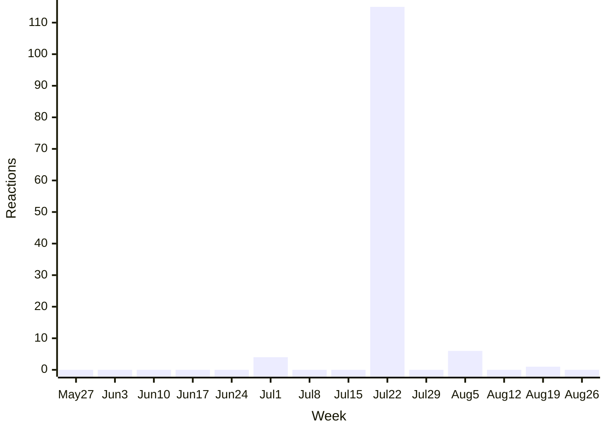
```mermaid
xychart-beta
  x-axis "Week" [May 27, Jun 3, Jun 10, Jun 17, Jun 24, Jul 1, Jul 8, Jul 15, Jul 22, Jul 29, Aug 5, Aug 12, Aug 19, Aug 26]
  y-axis "Reactions"
  bar [0, 0, 0, 0, 0, 4, 0, 0, 115, 0, 6, 0, 1, 0]
```

</a>

<a name="flutter-flutter-55378-graph">

add spacing parameter to Column and Row (flutter/flutter#55378)...

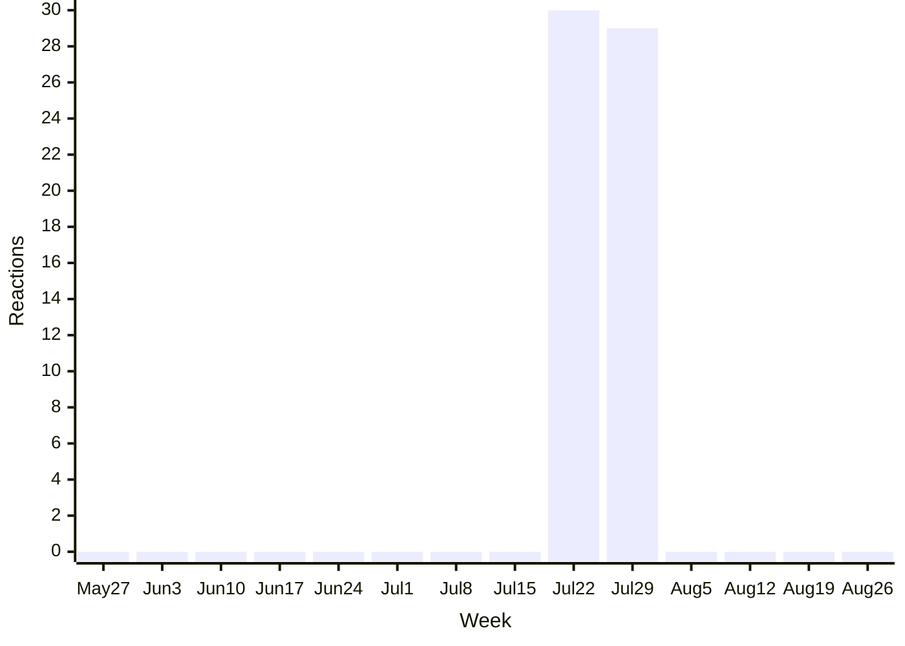
```mermaid
xychart-beta
  x-axis "Week" [May 27, Jun 3, Jun 10, Jun 17, Jun 24, Jul 1, Jul 8, Jul 15, Jul 22, Jul 29, Aug 5, Aug 12, Aug 19, Aug 26]
  y-axis "Reactions"
  bar [0, 0, 0, 0, 0, 0, 0, 0, 30, 29, 0, 0, 0, 0]
```

</a>

<a name="flutter-flutter-53041-graph">

Enable "hot reload" (not just "hot restart") for Flutter Web (flutter/flutter#53041)...

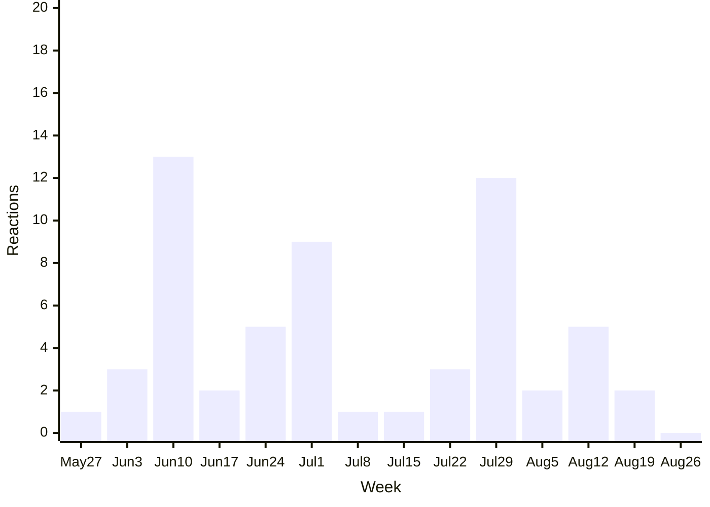
```mermaid
xychart-beta
  x-axis "Week" [May 27, Jun 3, Jun 10, Jun 17, Jun 24, Jul 1, Jul 8, Jul 15, Jul 22, Jul 29, Aug 5, Aug 12, Aug 19, Aug 26]
  y-axis "Reactions" 0 --> 20
  bar [1, 3, 13, 2, 5, 9, 1, 1, 3, 12, 2, 5, 2, 0]
```

</a>

<a name="flutter-flutter-115704-graph">

Add support to define widget preview and see it in the IDE when developing (flutter/flutter#115704)...

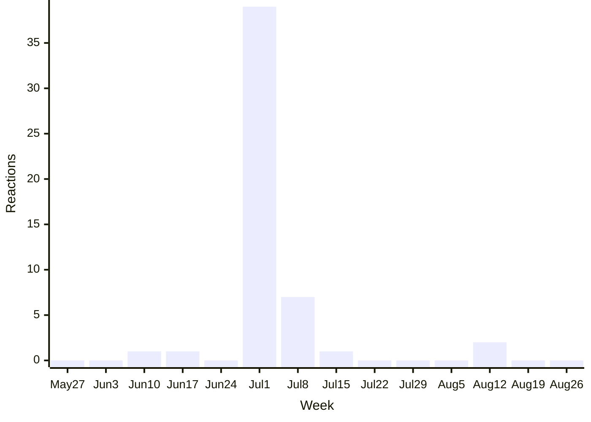
```mermaid
xychart-beta
  x-axis "Week" [May 27, Jun 3, Jun 10, Jun 17, Jun 24, Jul 1, Jul 8, Jul 15, Jul 22, Jul 29, Aug 5, Aug 12, Aug 19, Aug 26]
  y-axis "Reactions"
  bar [0, 0, 1, 1, 0, 39, 7, 1, 0, 0, 0, 2, 0, 0]
```

</a>

<a name="flutter-flutter-139289-graph">

Allow to provide compile-time variables for native platforms from a file (flutter/flutter#139289)...

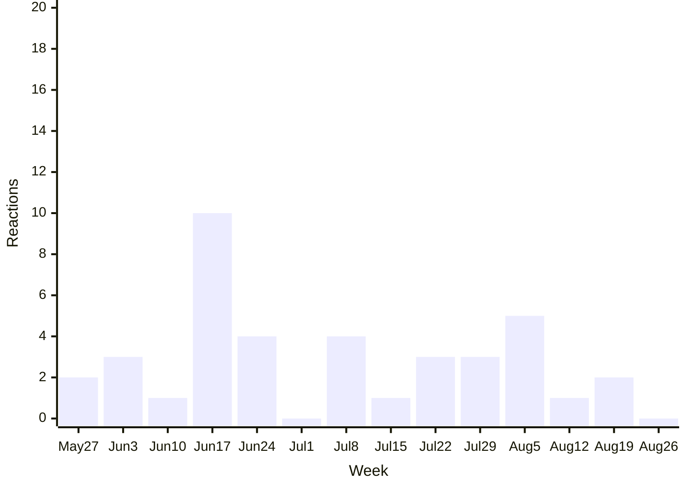
```mermaid
xychart-beta
  x-axis "Week" [May 27, Jun 3, Jun 10, Jun 17, Jun 24, Jul 1, Jul 8, Jul 15, Jul 22, Jul 29, Aug 5, Aug 12, Aug 19, Aug 26]
  y-axis "Reactions" 0 --> 20
  bar [2, 3, 1, 10, 4, 0, 4, 1, 3, 3, 5, 1, 2, 0]
```

</a>

<a name="flutter-flutter-128313-graph">

Add support for visionOS (flutter/flutter#128313)...

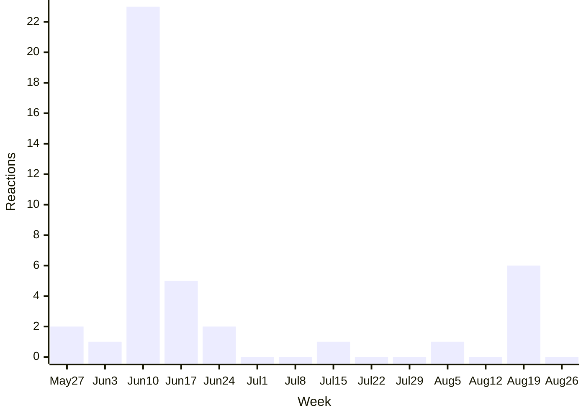
```mermaid
xychart-beta
  x-axis "Week" [May 27, Jun 3, Jun 10, Jun 17, Jun 24, Jul 1, Jul 8, Jul 15, Jul 22, Jul 29, Aug 5, Aug 12, Aug 19, Aug 26]
  y-axis "Reactions"
  bar [2, 1, 23, 5, 2, 0, 0, 1, 0, 0, 1, 0, 6, 0]
```

</a>

<a name="flutter-flutter-109813-graph">

Flutter app flagged for missing accessibility content labels by Google Play Store (flutter/flutter#109813)...

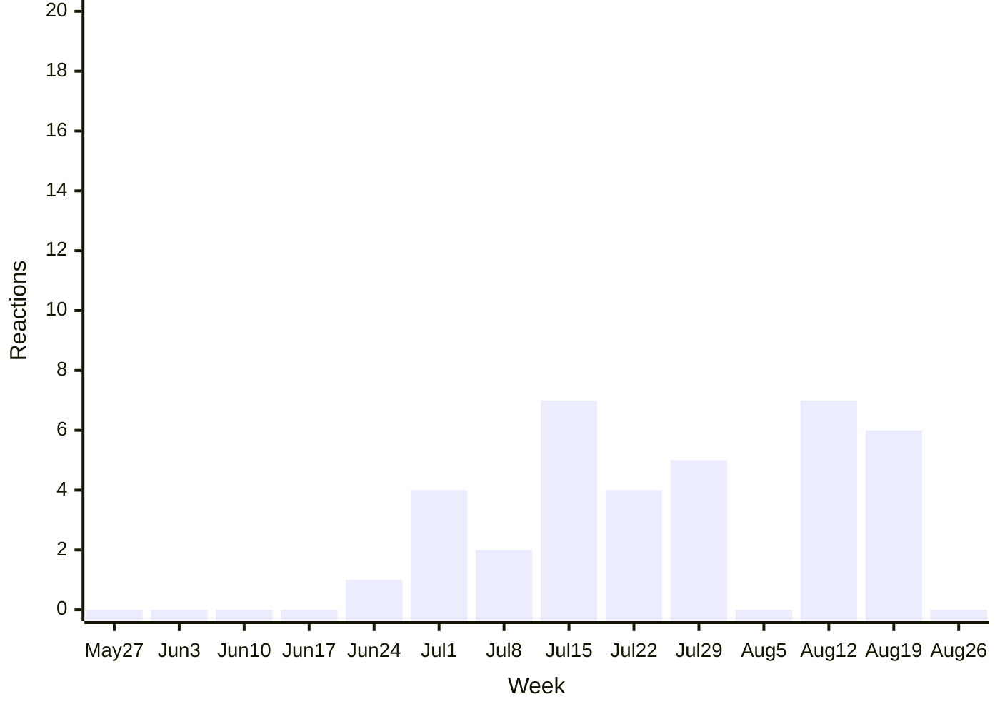
```mermaid
xychart-beta
  x-axis "Week" [May 27, Jun 3, Jun 10, Jun 17, Jun 24, Jul 1, Jul 8, Jul 15, Jul 22, Jul 29, Aug 5, Aug 12, Aug 19, Aug 26]
  y-axis "Reactions" 0 --> 20
  bar [0, 0, 0, 0, 1, 4, 2, 7, 4, 5, 0, 7, 6, 0]
```

</a>

<a name="flutter-flutter-145954-graph">

☂️ Intent to deprecate and remove the HTML renderer in Flutter Web (flutter/flutter#145954)...

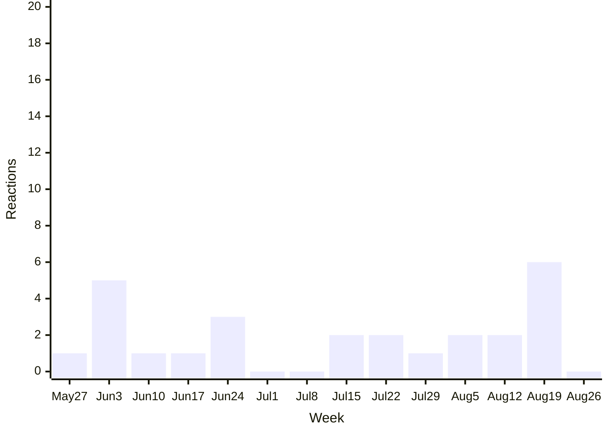
```mermaid
xychart-beta
  x-axis "Week" [May 27, Jun 3, Jun 10, Jun 17, Jun 24, Jul 1, Jul 8, Jul 15, Jul 22, Jul 29, Aug 5, Aug 12, Aug 19, Aug 26]
  y-axis "Reactions" 0 --> 20
  bar [1, 5, 1, 1, 3, 0, 0, 2, 2, 1, 2, 2, 6, 0]
```

</a>

<a name="flutter-flutter-138614-graph">

Preserve WillPopScope as an alternate for PopScope (flutter/flutter#138614)...

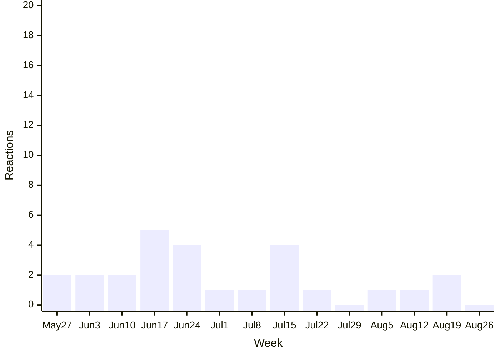
```mermaid
xychart-beta
  x-axis "Week" [May 27, Jun 3, Jun 10, Jun 17, Jun 24, Jul 1, Jul 8, Jul 15, Jul 22, Jul 29, Aug 5, Aug 12, Aug 19, Aug 26]
  y-axis "Reactions" 0 --> 20
  bar [2, 2, 2, 5, 4, 1, 1, 4, 1, 0, 1, 1, 2, 0]
```

</a>

<a name="dart-lang-sdk-55816-graph">

Move `Listenable`, `ValueListenable`, `ChangeNotifier` and `ValueNotifier` to the Dart sdk and add listening methods (dart-lang/sdk#55816)...

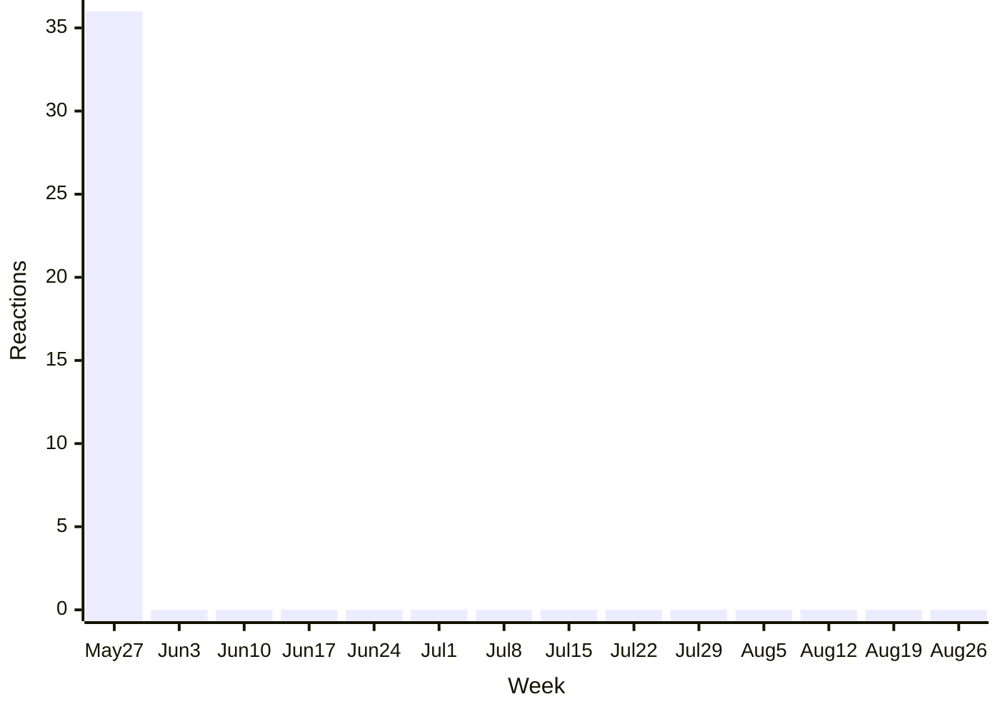
```mermaid
xychart-beta
  x-axis "Week" [May 27, Jun 3, Jun 10, Jun 17, Jun 24, Jul 1, Jul 8, Jul 15, Jul 22, Jul 29, Aug 5, Aug 12, Aug 19, Aug 26]
  y-axis "Reactions"
  bar [36, 0, 0, 0, 0, 0, 0, 0, 0, 0, 0, 0, 0, 0]
```

</a>

<a name="flutter-flutter-152953-graph">

Urgent Flutter 3.24.1 Cherry picks for web (flutter/flutter#152953)...

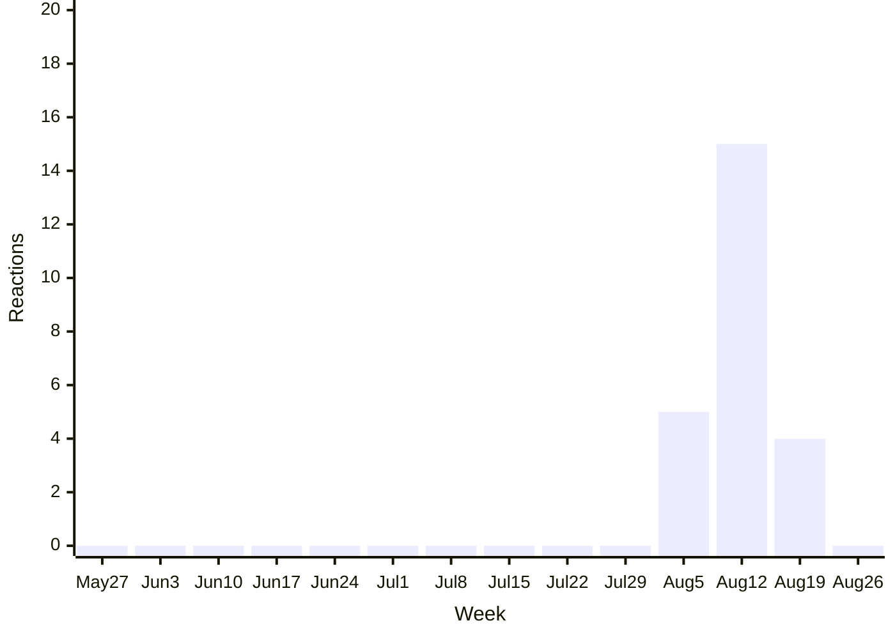
```mermaid
xychart-beta
  x-axis "Week" [May 27, Jun 3, Jun 10, Jun 17, Jun 24, Jul 1, Jul 8, Jul 15, Jul 22, Jul 29, Aug 5, Aug 12, Aug 19, Aug 26]
  y-axis "Reactions" 0 --> 20
  bar [0, 0, 0, 0, 0, 0, 0, 0, 0, 0, 5, 15, 4, 0]
```

</a>

<a name="flutter-flutter-30701-graph">

Support multiple windows for desktop shells (flutter/flutter#30701)...

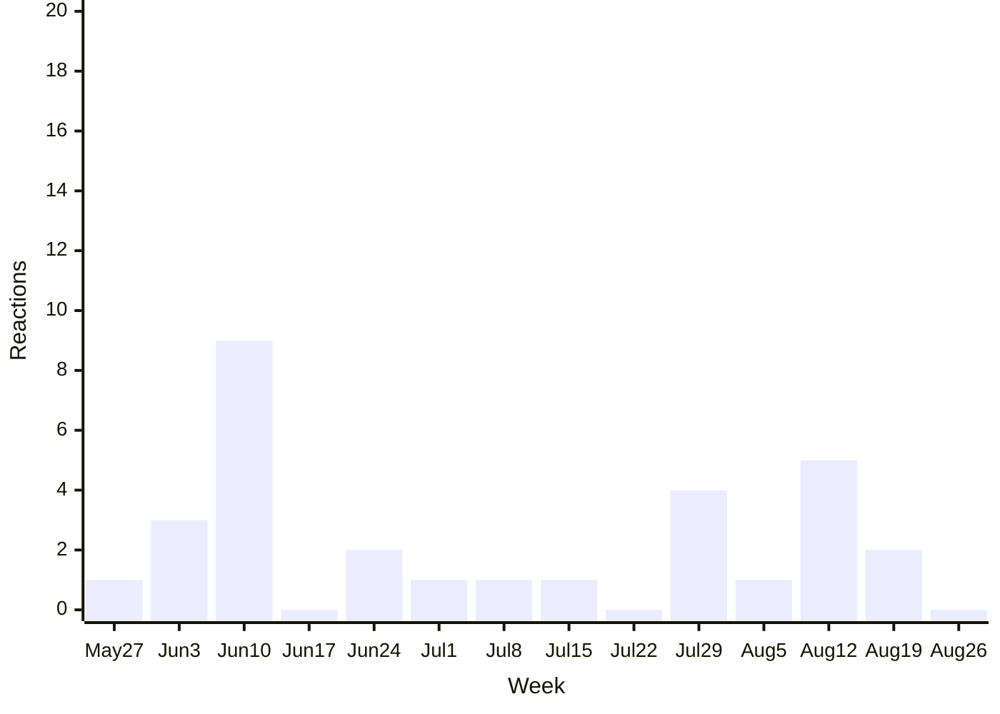
```mermaid
xychart-beta
  x-axis "Week" [May 27, Jun 3, Jun 10, Jun 17, Jun 24, Jul 1, Jul 8, Jul 15, Jul 22, Jul 29, Aug 5, Aug 12, Aug 19, Aug 26]
  y-axis "Reactions" 0 --> 20
  bar [1, 3, 9, 0, 2, 1, 1, 1, 0, 4, 1, 5, 2, 0]
```

</a>

<a name="dart-lang-sdk-54934-graph">

Support for hot reload in DDC (dart-lang/sdk#54934)...

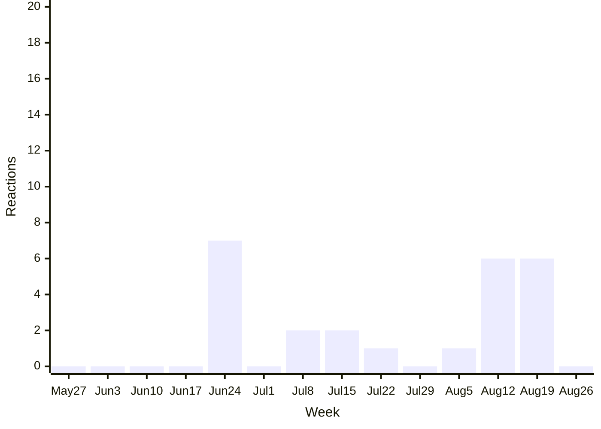
```mermaid
xychart-beta
  x-axis "Week" [May 27, Jun 3, Jun 10, Jun 17, Jun 24, Jul 1, Jul 8, Jul 15, Jul 22, Jul 29, Aug 5, Aug 12, Aug 19, Aug 26]
  y-axis "Reactions" 0 --> 20
  bar [0, 0, 0, 0, 7, 0, 2, 2, 1, 0, 1, 6, 6, 0]
```

</a>

<a name="flutter-flutter-66711-graph">

[pigeon] Support typesafe EventChannels (flutter/flutter#66711)...

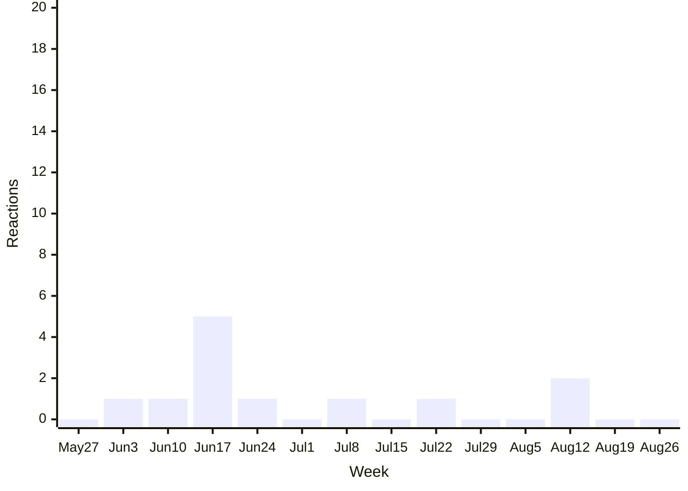
```mermaid
xychart-beta
  x-axis "Week" [May 27, Jun 3, Jun 10, Jun 17, Jun 24, Jul 1, Jul 8, Jul 15, Jul 22, Jul 29, Aug 5, Aug 12, Aug 19, Aug 26]
  y-axis "Reactions" 0 --> 20
  bar [0, 1, 1, 5, 1, 0, 1, 0, 1, 0, 0, 2, 0, 0]
```

</a>

<a name="flutter-flutter-126005-graph">

☂️ Add Swift Package Manager compatibility (flutter/flutter#126005)...

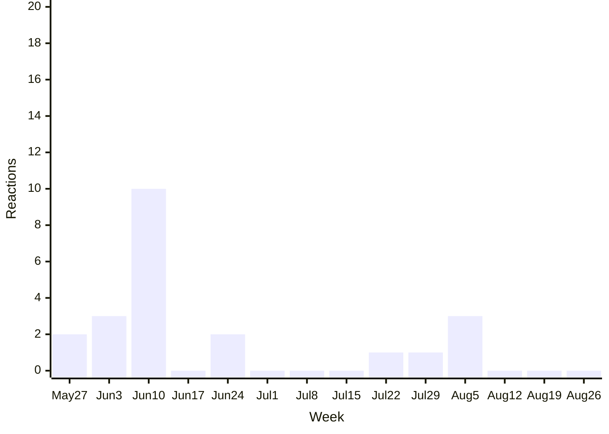
```mermaid
xychart-beta
  x-axis "Week" [May 27, Jun 3, Jun 10, Jun 17, Jun 24, Jul 1, Jul 8, Jul 15, Jul 22, Jul 29, Aug 5, Aug 12, Aug 19, Aug 26]
  y-axis "Reactions" 0 --> 20
  bar [2, 3, 10, 0, 2, 0, 0, 0, 1, 1, 3, 0, 0, 0]
```

</a>

<a name="flutter-flutter-142845-graph">

☂️ Multi View for Windows/MacOS (flutter/flutter#142845)...

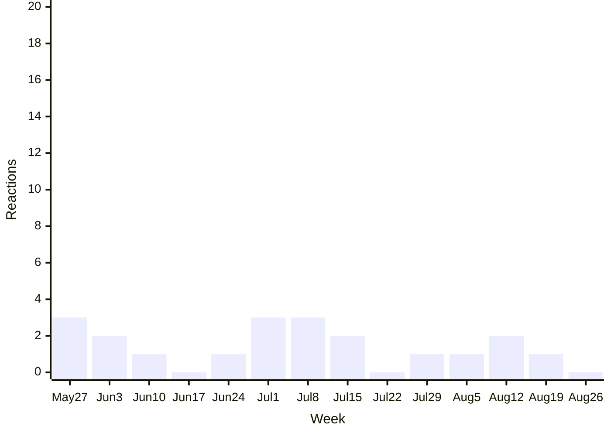
```mermaid
xychart-beta
  x-axis "Week" [May 27, Jun 3, Jun 10, Jun 17, Jun 24, Jul 1, Jul 8, Jul 15, Jul 22, Jul 29, Aug 5, Aug 12, Aug 19, Aug 26]
  y-axis "Reactions" 0 --> 20
  bar [3, 2, 1, 0, 1, 3, 3, 2, 0, 1, 1, 2, 1, 0]
```

</a>

<a name="flutter-flutter-138737-graph">

PopScope seems to be incompatible with GoRouter (flutter/flutter#138737)...

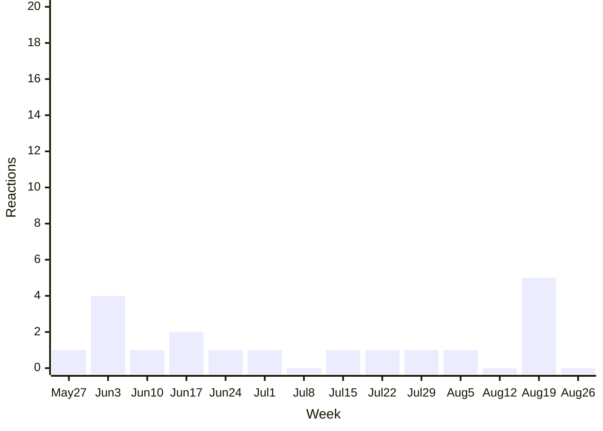
```mermaid
xychart-beta
  x-axis "Week" [May 27, Jun 3, Jun 10, Jun 17, Jun 24, Jul 1, Jul 8, Jul 15, Jul 22, Jul 29, Aug 5, Aug 12, Aug 19, Aug 26]
  y-axis "Reactions" 0 --> 20
  bar [1, 4, 1, 2, 1, 1, 0, 1, 1, 1, 1, 0, 5, 0]
```

</a>

<a name="dart-lang-sdk-53875-graph">

Implement Workspace Feature [meta] (dart-lang/sdk#53875)...

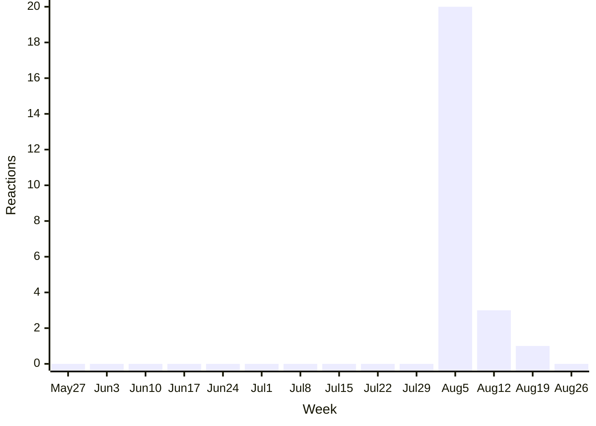
```mermaid
xychart-beta
  x-axis "Week" [May 27, Jun 3, Jun 10, Jun 17, Jun 24, Jul 1, Jul 8, Jul 15, Jul 22, Jul 29, Aug 5, Aug 12, Aug 19, Aug 26]
  y-axis "Reactions" 0 --> 20
  bar [0, 0, 0, 0, 0, 0, 0, 0, 0, 0, 20, 3, 1, 0]
```

</a>

<a name="flutter-flutter-46789-graph">

Improve the indexability (SEO) of Flutter apps on the web  (flutter/flutter#46789)...

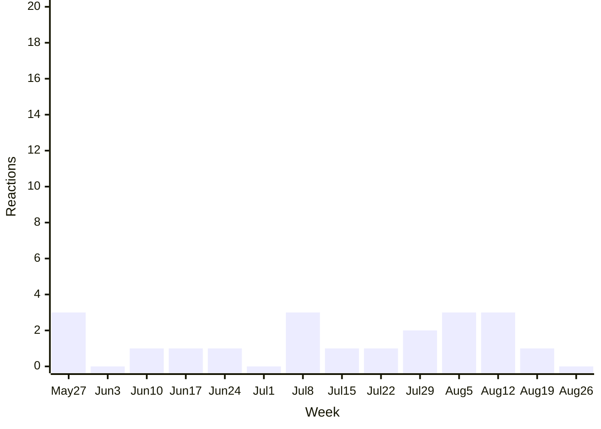
```mermaid
xychart-beta
  x-axis "Week" [May 27, Jun 3, Jun 10, Jun 17, Jun 24, Jul 1, Jul 8, Jul 15, Jul 22, Jul 29, Aug 5, Aug 12, Aug 19, Aug 26]
  y-axis "Reactions" 0 --> 20
  bar [3, 0, 1, 1, 1, 0, 3, 1, 1, 2, 3, 3, 1, 0]
```

</a>

<a name="flutter-flutter-14330-graph">

Code Push / Hot Update / out of band updates (flutter/flutter#14330)...

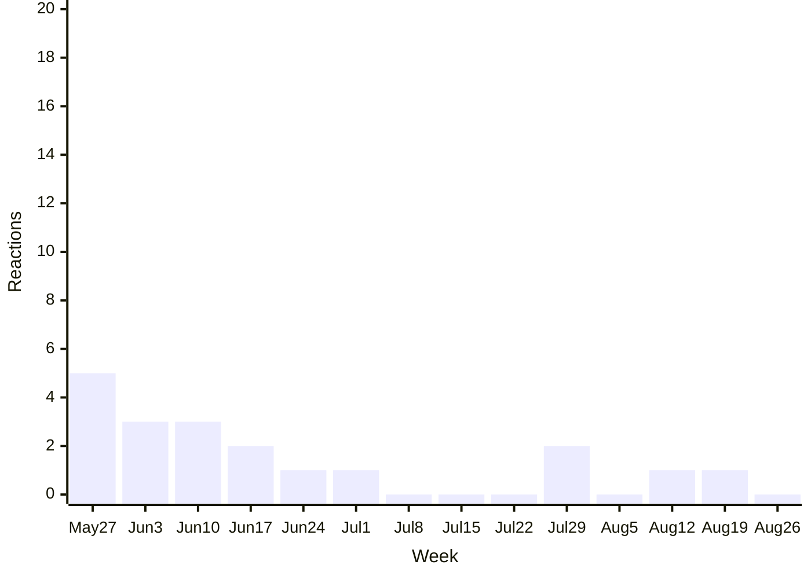
```mermaid
xychart-beta
  x-axis "Week" [May 27, Jun 3, Jun 10, Jun 17, Jun 24, Jul 1, Jul 8, Jul 15, Jul 22, Jul 29, Aug 5, Aug 12, Aug 19, Aug 26]
  y-axis "Reactions" 0 --> 20
  bar [5, 3, 3, 2, 1, 1, 0, 0, 0, 2, 0, 1, 1, 0]
```

</a>

<a name="dart-lang-sdk-56358-graph">

@depreacte dart:html and other "legacy" DOM libraries (dart-lang/sdk#56358)...

```mermaid
xychart-beta
  x-axis "Week" [May 27, Jun 3, Jun 10, Jun 17, Jun 24, Jul 1, Jul 8, Jul 15, Jul 22, Jul 29, Aug 5, Aug 12, Aug 19, Aug 26]
  y-axis "Reactions" 0 --> 20
  bar [0, 0, 0, 0, 0, 0, 0, 0, 0, 14, 7, 0, 0, 0]
```

</a>

<a name="flutter-flutter-65504-graph">

Ctrl+F support, finding text on a page (even when scrolled off screen) (flutter/flutter#65504)...

```mermaid
xychart-beta
  x-axis "Week" [May 27, Jun 3, Jun 10, Jun 17, Jun 24, Jul 1, Jul 8, Jul 15, Jul 22, Jul 29, Aug 5, Aug 12, Aug 19, Aug 26]
  y-axis "Reactions" 0 --> 20
  bar [1, 1, 0, 0, 4, 5, 1, 1, 2, 0, 3, 0, 0, 0]
```

</a>

<a name="flutter-flutter-31713-graph">

Implement PlatformView support on Windows (flutter/flutter#31713)...

```mermaid
xychart-beta
  x-axis "Week" [May 27, Jun 3, Jun 10, Jun 17, Jun 24, Jul 1, Jul 8, Jul 15, Jul 22, Jul 29, Aug 5, Aug 12, Aug 19, Aug 26]
  y-axis "Reactions" 0 --> 20
  bar [1, 0, 2, 1, 0, 1, 0, 2, 1, 1, 1, 5, 3, 0]
```

</a>

<a name="flutter-flutter-21594-graph">

Table > TableRow > TableCell colspan (flutter/flutter#21594)...

```mermaid
xychart-beta
  x-axis "Week" [May 27, Jun 3, Jun 10, Jun 17, Jun 24, Jul 1, Jul 8, Jul 15, Jul 22, Jul 29, Aug 5, Aug 12, Aug 19, Aug 26]
  y-axis "Reactions" 0 --> 20
  bar [0, 1, 4, 1, 1, 0, 0, 3, 5, 2, 0, 0, 2, 0]
```

</a>

<a name="flutter-flutter-65065-graph">

Bundling assets only on a specific platform (and remove assets on another platform) (flutter/flutter#65065)...

```mermaid
xychart-beta
  x-axis "Week" [May 27, Jun 3, Jun 10, Jun 17, Jun 24, Jul 1, Jul 8, Jul 15, Jul 22, Jul 29, Aug 5, Aug 12, Aug 19, Aug 26]
  y-axis "Reactions" 0 --> 20
  bar [4, 0, 0, 4, 1, 0, 4, 1, 1, 0, 0, 0, 1, 0]
```

</a>

<a name="flutter-flutter-26801-graph">

Apple CarPlay / Android Auto support? (flutter/flutter#26801)...

```mermaid
xychart-beta
  x-axis "Week" [May 27, Jun 3, Jun 10, Jun 17, Jun 24, Jul 1, Jul 8, Jul 15, Jul 22, Jul 29, Aug 5, Aug 12, Aug 19, Aug 26]
  y-axis "Reactions" 0 --> 20
  bar [0, 0, 7, 0, 0, 1, 1, 0, 6, 0, 0, 1, 0, 0]
```

</a>

<a name="flutter-flutter-99606-graph">

Ability to change the keyboard language programmatically (flutter/flutter#99606)...

```mermaid
xychart-beta
  x-axis "Week" [May 27, Jun 3, Jun 10, Jun 17, Jun 24, Jul 1, Jul 8, Jul 15, Jul 22, Jul 29, Aug 5, Aug 12, Aug 19, Aug 26]
  y-axis "Reactions" 0 --> 20
  bar [2, 2, 0, 1, 2, 2, 0, 3, 0, 1, 1, 0, 1, 0]
```

</a>

<a name="flutter-flutter-152995-graph">

[WEB] Refresh MIME Type Error on destination route when using `usePathUrlStrategy` on Flutter stable 3.24.0 (flutter/flutter#152995)...

```mermaid
xychart-beta
  x-axis "Week" [May 27, Jun 3, Jun 10, Jun 17, Jun 24, Jul 1, Jul 8, Jul 15, Jul 22, Jul 29, Aug 5, Aug 12, Aug 19, Aug 26]
  y-axis "Reactions" 0 --> 20
  bar [0, 0, 0, 0, 0, 0, 0, 0, 0, 0, 6, 9, 0, 0]
```

</a>

<a name="flutter-flutter-91241-graph">

Video Player HDR Problem (flutter/flutter#91241)...

```mermaid
xychart-beta
  x-axis "Week" [May 27, Jun 3, Jun 10, Jun 17, Jun 24, Jul 1, Jul 8, Jul 15, Jul 22, Jul 29, Aug 5, Aug 12, Aug 19, Aug 26]
  y-axis "Reactions" 0 --> 20
  bar [2, 1, 0, 2, 6, 2, 3, 1, 0, 0, 1, 0, 0, 0]
```

</a>

<a name="flutter-flutter-47600-graph">

Server-side rendering for Flutter web (flutter/flutter#47600)...

```mermaid
xychart-beta
  x-axis "Week" [May 27, Jun 3, Jun 10, Jun 17, Jun 24, Jul 1, Jul 8, Jul 15, Jul 22, Jul 29, Aug 5, Aug 12, Aug 19, Aug 26]
  y-axis "Reactions" 0 --> 20
  bar [1, 5, 0, 0, 0, 0, 0, 5, 0, 1, 0, 0, 0, 0]
```

</a>

<a name="flutter-flutter-60240-graph">

Make it easier to upload Android native debug symbols for release builds (flutter/flutter#60240)...

```mermaid
xychart-beta
  x-axis "Week" [May 27, Jun 3, Jun 10, Jun 17, Jun 24, Jul 1, Jul 8, Jul 15, Jul 22, Jul 29, Aug 5, Aug 12, Aug 19, Aug 26]
  y-axis "Reactions" 0 --> 20
  bar [0, 5, 0, 5, 1, 0, 0, 1, 0, 1, 0, 0, 2, 0]
```

</a>

<a name="flutter-flutter-110431-graph">

Flutter adds additional one frame touch latency compared to native (flutter/flutter#110431)...

```mermaid
xychart-beta
  x-axis "Week" [May 27, Jun 3, Jun 10, Jun 17, Jun 24, Jul 1, Jul 8, Jul 15, Jul 22, Jul 29, Aug 5, Aug 12, Aug 19, Aug 26]
  y-axis "Reactions" 0 --> 20
  bar [5, 0, 2, 0, 0, 0, 1, 0, 2, 1, 1, 0, 0, 0]
```

</a>

<a name="flutter-flutter-41725-graph">

[webview_flutter] Add macOS support (flutter/flutter#41725)...

```mermaid
xychart-beta
  x-axis "Week" [May 27, Jun 3, Jun 10, Jun 17, Jun 24, Jul 1, Jul 8, Jul 15, Jul 22, Jul 29, Aug 5, Aug 12, Aug 19, Aug 26]
  y-axis "Reactions" 0 --> 20
  bar [0, 2, 1, 1, 5, 0, 2, 1, 0, 0, 1, 1, 0, 0]
```

</a>

<a name="flutter-flutter-69529-graph">

[web] Scroll is not recognized by the browser (flutter/flutter#69529)...

```mermaid
xychart-beta
  x-axis "Week" [May 27, Jun 3, Jun 10, Jun 17, Jun 24, Jul 1, Jul 8, Jul 15, Jul 22, Jul 29, Aug 5, Aug 12, Aug 19, Aug 26]
  y-axis "Reactions" 0 --> 20
  bar [3, 2, 0, 0, 0, 0, 0, 4, 0, 1, 0, 1, 1, 0]
```

</a>

<a name="flutter-flutter-149031-graph">

[WEB] Web Cache invalidation based on pubspec.yaml version (flutter/flutter#149031)...

```mermaid
xychart-beta
  x-axis "Week" [May 27, Jun 3, Jun 10, Jun 17, Jun 24, Jul 1, Jul 8, Jul 15, Jul 22, Jul 29, Aug 5, Aug 12, Aug 19, Aug 26]
  y-axis "Reactions" 0 --> 20
  bar [0, 0, 0, 0, 0, 0, 0, 0, 0, 0, 6, 1, 6, 0]
```

</a>

<a name="flutter-flutter-124334-graph">

WebGPU Backend for Flutter Web (flutter/flutter#124334)...

```mermaid
xychart-beta
  x-axis "Week" [May 27, Jun 3, Jun 10, Jun 17, Jun 24, Jul 1, Jul 8, Jul 15, Jul 22, Jul 29, Aug 5, Aug 12, Aug 19, Aug 26]
  y-axis "Reactions" 0 --> 20
  bar [0, 6, 0, 0, 1, 0, 0, 0, 2, 3, 0, 0, 1, 0]
```

</a>

<a name="flutter-flutter-124205-graph">

Keyboard issue on mobile Web platform (flutter/flutter#124205)...

```mermaid
xychart-beta
  x-axis "Week" [May 27, Jun 3, Jun 10, Jun 17, Jun 24, Jul 1, Jul 8, Jul 15, Jul 22, Jul 29, Aug 5, Aug 12, Aug 19, Aug 26]
  y-axis "Reactions" 0 --> 20
  bar [0, 1, 1, 1, 0, 1, 2, 0, 0, 2, 2, 1, 1, 0]
```

</a>

<a name="flutter-flutter-140586-graph">

[go_router] Failed assertion: line 3817 pos 18: '!keyReservation.contains(key)': is not true. (flutter/flutter#140586)...

```mermaid
xychart-beta
  x-axis "Week" [May 27, Jun 3, Jun 10, Jun 17, Jun 24, Jul 1, Jul 8, Jul 15, Jul 22, Jul 29, Aug 5, Aug 12, Aug 19, Aug 26]
  y-axis "Reactions" 0 --> 20
  bar [1, 1, 0, 1, 0, 1, 1, 0, 0, 0, 3, 0, 2, 0]
```

</a>

<a name="flutter-flutter-54200-graph">

allow Hero widgets to have transitions within the same screen (flutter/flutter#54200)...

```mermaid
xychart-beta
  x-axis "Week" [May 27, Jun 3, Jun 10, Jun 17, Jun 24, Jul 1, Jul 8, Jul 15, Jul 22, Jul 29, Aug 5, Aug 12, Aug 19, Aug 26]
  y-axis "Reactions" 0 --> 20
  bar [1, 2, 1, 0, 5, 0, 1, 0, 0, 3, 1, 0, 0, 0]
```

</a>

<a name="dart-lang-sdk-55991-graph">

☂️ Explore shared memory multithreading (dart-lang/sdk#55991)...

```mermaid
xychart-beta
  x-axis "Week" [May 27, Jun 3, Jun 10, Jun 17, Jun 24, Jul 1, Jul 8, Jul 15, Jul 22, Jul 29, Aug 5, Aug 12, Aug 19, Aug 26]
  y-axis "Reactions" 0 --> 20
  bar [0, 0, 5, 1, 0, 4, 0, 0, 0, 1, 0, 1, 0, 0]
```

</a>

<a name="flutter-flutter-129757-graph">

☂️ Native assets support (flutter/flutter#129757)...

```mermaid
xychart-beta
  x-axis "Week" [May 27, Jun 3, Jun 10, Jun 17, Jun 24, Jul 1, Jul 8, Jul 15, Jul 22, Jul 29, Aug 5, Aug 12, Aug 19, Aug 26]
  y-axis "Reactions" 0 --> 20
  bar [5, 0, 1, 1, 2, 0, 0, 0, 2, 0, 1, 0, 1, 0]
```

</a>

<a name="flutter-flutter-90856-graph">

ReorderableListView Weird Behaviour on reordering the second last child (flutter/flutter#90856)...

```mermaid
xychart-beta
  x-axis "Week" [May 27, Jun 3, Jun 10, Jun 17, Jun 24, Jul 1, Jul 8, Jul 15, Jul 22, Jul 29, Aug 5, Aug 12, Aug 19, Aug 26]
  y-axis "Reactions" 0 --> 20
  bar [0, 1, 0, 0, 0, 0, 0, 0, 1, 3, 0, 0, 0, 0]
```

</a>

<a name="flutter-flutter-140869-graph">

[go_router] WillPopScope/PopScope doesn't trigger with back button navigation on root screens (flutter/flutter#140869)...

```mermaid
xychart-beta
  x-axis "Week" [May 27, Jun 3, Jun 10, Jun 17, Jun 24, Jul 1, Jul 8, Jul 15, Jul 22, Jul 29, Aug 5, Aug 12, Aug 19, Aug 26]
  y-axis "Reactions" 0 --> 20
  bar [0, 0, 2, 1, 0, 1, 1, 2, 0, 1, 1, 0, 0, 0]
```

</a>

<a name="flutter-flutter-96283-graph">

[Web]: Proposal to be able to build flutter web app with debug profile support (flutter/flutter#96283)...

```mermaid
xychart-beta
  x-axis "Week" [May 27, Jun 3, Jun 10, Jun 17, Jun 24, Jul 1, Jul 8, Jul 15, Jul 22, Jul 29, Aug 5, Aug 12, Aug 19, Aug 26]
  y-axis "Reactions" 0 --> 20
  bar [2, 1, 0, 2, 1, 0, 2, 1, 0, 1, 0, 0, 1, 0]
```

</a>

<a name="flutter-flutter-18443-graph">

Support soft hyphenation (line breaks at U+00AD plus rendering a hyphen at the end of the line) (flutter/flutter#18443)...

```mermaid
xychart-beta
  x-axis "Week" [May 27, Jun 3, Jun 10, Jun 17, Jun 24, Jul 1, Jul 8, Jul 15, Jul 22, Jul 29, Aug 5, Aug 12, Aug 19, Aug 26]
  y-axis "Reactions" 0 --> 20
  bar [0, 0, 3, 2, 1, 0, 0, 0, 0, 1, 3, 0, 0, 0]
```

</a>

<a name="flutter-flutter-107157-graph">

[Proposal]Allow multiple arb files to organize l10n / intl localizations for a language (flutter/flutter#107157)...

```mermaid
xychart-beta
  x-axis "Week" [May 27, Jun 3, Jun 10, Jun 17, Jun 24, Jul 1, Jul 8, Jul 15, Jul 22, Jul 29, Aug 5, Aug 12, Aug 19, Aug 26]
  y-axis "Reactions" 0 --> 20
  bar [2, 1, 0, 1, 1, 2, 1, 1, 0, 0, 1, 1, 1, 0]
```

</a>

<a name="flutter-flutter-139292-graph">

New DOM renderer for Flutter web (flutter/flutter#139292)...

```mermaid
xychart-beta
  x-axis "Week" [May 27, Jun 3, Jun 10, Jun 17, Jun 24, Jul 1, Jul 8, Jul 15, Jul 22, Jul 29, Aug 5, Aug 12, Aug 19, Aug 26]
  y-axis "Reactions" 0 --> 20
  bar [2, 5, 1, 1, 0, 0, 0, 0, 0, 0, 0, 0, 0, 0]
```

</a>

<a name="flutter-flutter-109842-graph">

Add suport for Android 13 per-app language preferences  (flutter/flutter#109842)...

```mermaid
xychart-beta
  x-axis "Week" [May 27, Jun 3, Jun 10, Jun 17, Jun 24, Jul 1, Jul 8, Jul 15, Jul 22, Jul 29, Aug 5, Aug 12, Aug 19, Aug 26]
  y-axis "Reactions" 0 --> 20
  bar [3, 3, 0, 1, 0, -3, 0, 2, 0, 0, 0, 0, 2, 0]
```

</a>

<a name="flutter-flutter-127409-graph">

add restartApp() method (flutter/flutter#127409)...

```mermaid
xychart-beta
  x-axis "Week" [May 27, Jun 3, Jun 10, Jun 17, Jun 24, Jul 1, Jul 8, Jul 15, Jul 22, Jul 29, Aug 5, Aug 12, Aug 19, Aug 26]
  y-axis "Reactions" 0 --> 20
  bar [0, 1, 1, 1, 0, 2, 2, 2, 0, 0, 1, 0, 1, 0]
```

</a>

<a name="dart-lang-sdk-55281-graph">

Dart Analyzer very slow/stuck (dart-lang/sdk#55281)...

```mermaid
xychart-beta
  x-axis "Week" [May 27, Jun 3, Jun 10, Jun 17, Jun 24, Jul 1, Jul 8, Jul 15, Jul 22, Jul 29, Aug 5, Aug 12, Aug 19, Aug 26]
  y-axis "Reactions" 0 --> 20
  bar [1, 0, 2, 1, 2, 0, 0, 0, 2, 0, 1, 2, 0, 0]
```

</a>

<a name="flutter-flutter-61229-graph">

AVIF codec support (flutter/flutter#61229)...

```mermaid
xychart-beta
  x-axis "Week" [May 27, Jun 3, Jun 10, Jun 17, Jun 24, Jul 1, Jul 8, Jul 15, Jul 22, Jul 29, Aug 5, Aug 12, Aug 19, Aug 26]
  y-axis "Reactions" 0 --> 20
  bar [4, 0, 0, 0, 0, 1, 0, 1, 0, 0, 0, 0, 1, 0]
```

</a>

<a name="flutter-flutter-62597-graph">

[Windows] ☂️  Add support for Arm64 as a target (flutter/flutter#62597)...

```mermaid
xychart-beta
  x-axis "Week" [May 27, Jun 3, Jun 10, Jun 17, Jun 24, Jul 1, Jul 8, Jul 15, Jul 22, Jul 29, Aug 5, Aug 12, Aug 19, Aug 26]
  y-axis "Reactions" 0 --> 20
  bar [1, 0, 0, 0, 3, 2, 0, 1, 0, 2, 0, 0, 1, 0]
```

</a>

<a name="flutter-flutter-102003-graph">

Rewrite the NestedScrollView (flutter/flutter#102003)...

```mermaid
xychart-beta
  x-axis "Week" [May 27, Jun 3, Jun 10, Jun 17, Jun 24, Jul 1, Jul 8, Jul 15, Jul 22, Jul 29, Aug 5, Aug 12, Aug 19, Aug 26]
  y-axis "Reactions" 0 --> 20
  bar [0, 2, 0, 0, 0, 0, 0, 0, 0, 1, 4, 0, 0, 0]
```

</a>

<a name="flutter-flutter-141371-graph">

Web: include different files depending on the flavor (flutter/flutter#141371)...

```mermaid
xychart-beta
  x-axis "Week" [May 27, Jun 3, Jun 10, Jun 17, Jun 24, Jul 1, Jul 8, Jul 15, Jul 22, Jul 29, Aug 5, Aug 12, Aug 19, Aug 26]
  y-axis "Reactions" 0 --> 20
  bar [0, 0, 0, 0, 0, 0, 0, 0, 0, 0, 8, 0, 2, 0]
```

</a>

<a name="flutter-flutter-127855-graph">

Implement wide gamut color support in the Framework (flutter/flutter#127855)...

```mermaid
xychart-beta
  x-axis "Week" [May 27, Jun 3, Jun 10, Jun 17, Jun 24, Jul 1, Jul 8, Jul 15, Jul 22, Jul 29, Aug 5, Aug 12, Aug 19, Aug 26]
  y-axis "Reactions" 0 --> 20
  bar [0, 0, 0, 2, 0, 0, 0, 0, 0, 6, 0, 0, 0, 0]
```

</a>

<a name="flutter-flutter-59284-graph">

Text widget incorrectly wraps Korean text (flutter/flutter#59284)...

```mermaid
xychart-beta
  x-axis "Week" [May 27, Jun 3, Jun 10, Jun 17, Jun 24, Jul 1, Jul 8, Jul 15, Jul 22, Jul 29, Aug 5, Aug 12, Aug 19, Aug 26]
  y-axis "Reactions" 0 --> 20
  bar [0, 0, 0, 0, 0, 1, 0, 0, 0, 9, 0, 0, 1, 0]
```

</a>

<a name="flutter-flutter-37597-graph">

[webview_flutter] Add Windows support (flutter/flutter#37597)...

```mermaid
xychart-beta
  x-axis "Week" [May 27, Jun 3, Jun 10, Jun 17, Jun 24, Jul 1, Jul 8, Jul 15, Jul 22, Jul 29, Aug 5, Aug 12, Aug 19, Aug 26]
  y-axis "Reactions" 0 --> 20
  bar [0, 0, 2, 2, 0, 1, 1, 1, 0, 0, 0, 2, 0, 0]
```

</a>

<a name="flutter-flutter-116383-graph">

[in_app_purchase] Use StoreKit 2 APIs (flutter/flutter#116383)...

```mermaid
xychart-beta
  x-axis "Week" [May 27, Jun 3, Jun 10, Jun 17, Jun 24, Jul 1, Jul 8, Jul 15, Jul 22, Jul 29, Aug 5, Aug 12, Aug 19, Aug 26]
  y-axis "Reactions" 0 --> 20
  bar [0, 1, 3, 0, 1, 0, 0, 1, 0, 1, 2, 0, 1, 0]
```

</a>

<a name="flutter-flutter-121929-graph">

[animation] using animations package with go_router package instead of Navigator.push() method (flutter/flutter#121929)...

```mermaid
xychart-beta
  x-axis "Week" [May 27, Jun 3, Jun 10, Jun 17, Jun 24, Jul 1, Jul 8, Jul 15, Jul 22, Jul 29, Aug 5, Aug 12, Aug 19, Aug 26]
  y-axis "Reactions" 0 --> 20
  bar [0, 1, 0, 2, 0, 0, 0, 1, 0, 0, 3, 1, 0, 0]
```

</a>

<a name="dart-lang-sdk-55762-graph">

Macros: Declaring a constructor on a generic class with an `implements` breaks generation (dart-lang/sdk#55762)...

```mermaid
xychart-beta
  x-axis "Week" [May 27, Jun 3, Jun 10, Jun 17, Jun 24, Jul 1, Jul 8, Jul 15, Jul 22, Jul 29, Aug 5, Aug 12, Aug 19, Aug 26]
  y-axis "Reactions" 0 --> 20
  bar [5, 3, 0, 0, 0, 0, 0, 0, 0, 2, 0, 0, 0, 0]
```

</a>

<a name="flutter-flutter-104509-graph">

Flutter web - Need documentation on how to conditionally display a "Refresh. New Version is available." prompt when updated code is deployed to production. (flutter/flutter#104509)...

```mermaid
xychart-beta
  x-axis "Week" [May 27, Jun 3, Jun 10, Jun 17, Jun 24, Jul 1, Jul 8, Jul 15, Jul 22, Jul 29, Aug 5, Aug 12, Aug 19, Aug 26]
  y-axis "Reactions" 0 --> 20
  bar [0, 2, 0, 0, 1, 0, 1, 0, 1, 2, 0, 0, 1, 0]
```

</a>

<a name="flutter-flutter-37159-graph">

Roku support (flutter/flutter#37159)...

```mermaid
xychart-beta
  x-axis "Week" [May 27, Jun 3, Jun 10, Jun 17, Jun 24, Jul 1, Jul 8, Jul 15, Jul 22, Jul 29, Aug 5, Aug 12, Aug 19, Aug 26]
  y-axis "Reactions" 0 --> 20
  bar [0, 1, 0, 0, 0, 0, 0, 2, 0, 0, 0, 1, 0, 0]
```

</a>

<a name="dart-lang-sdk-50565-graph">

☂️ [vm/ffi] Native assets feature (dart-lang/sdk#50565)...

```mermaid
xychart-beta
  x-axis "Week" [May 27, Jun 3, Jun 10, Jun 17, Jun 24, Jul 1, Jul 8, Jul 15, Jul 22, Jul 29, Aug 5, Aug 12, Aug 19, Aug 26]
  y-axis "Reactions" 0 --> 20
  bar [1, 1, 0, 1, 1, 2, 0, 1, 0, 0, 1, 0, 0, 0]
```

</a>

<a name="flutter-flutter-10437-graph">

Do plugins need to know about hot reload and hot restart? (flutter/flutter#10437)...

```mermaid
xychart-beta
  x-axis "Week" [May 27, Jun 3, Jun 10, Jun 17, Jun 24, Jul 1, Jul 8, Jul 15, Jul 22, Jul 29, Aug 5, Aug 12, Aug 19, Aug 26]
  y-axis "Reactions" 0 --> 20
  bar [0, 0, 0, 1, 3, 0, 0, 0, 0, 2, 0, 3, 1, 0]
```

</a>

<a name="dart-lang-sdk-42855-graph">

Add possibility to truly cancel/dispose Fututre (dart-lang/sdk#42855)...

```mermaid
xychart-beta
  x-axis "Week" [May 27, Jun 3, Jun 10, Jun 17, Jun 24, Jul 1, Jul 8, Jul 15, Jul 22, Jul 29, Aug 5, Aug 12, Aug 19, Aug 26]
  y-axis "Reactions" 0 --> 20
  bar [0, 0, 0, 0, 1, 0, 1, 0, 0, 4, 0, 0, 0, 0]
```

</a>

<a name="flutter-flutter-55324-graph">

Support Firefox as a browser in flutter run (flutter/flutter#55324)...

```mermaid
xychart-beta
  x-axis "Week" [May 27, Jun 3, Jun 10, Jun 17, Jun 24, Jul 1, Jul 8, Jul 15, Jul 22, Jul 29, Aug 5, Aug 12, Aug 19, Aug 26]
  y-axis "Reactions" 0 --> 20
  bar [0, 0, 1, 2, 0, 1, 1, 2, 0, 0, 1, 0, 0, 0]
```

</a>

<a name="flutter-flutter-45296-graph">

[path_provider] Add support for web (flutter/flutter#45296)...

```mermaid
xychart-beta
  x-axis "Week" [May 27, Jun 3, Jun 10, Jun 17, Jun 24, Jul 1, Jul 8, Jul 15, Jul 22, Jul 29, Aug 5, Aug 12, Aug 19, Aug 26]
  y-axis "Reactions" 0 --> 20
  bar [1, 1, 2, 0, 0, 0, 0, 1, 0, 0, 2, 0, 0, 0]
```

</a>

<a name="flutter-flutter-120353-graph">

[go_router] ShellRoutes break iOS swipe back navigation (flutter/flutter#120353)...

```mermaid
xychart-beta
  x-axis "Week" [May 27, Jun 3, Jun 10, Jun 17, Jun 24, Jul 1, Jul 8, Jul 15, Jul 22, Jul 29, Aug 5, Aug 12, Aug 19, Aug 26]
  y-axis "Reactions" 0 --> 20
  bar [2, 1, 0, 0, 1, 0, 0, 0, 1, 0, 0, 1, 0, 0]
```

</a>

<a name="flutter-flutter-45336-graph">

Add TextOverflow  "ellipsisStart" , "ellipsisMiddle"  and "ellipsisEnd"  (flutter/flutter#45336)...

```mermaid
xychart-beta
  x-axis "Week" [May 27, Jun 3, Jun 10, Jun 17, Jun 24, Jul 1, Jul 8, Jul 15, Jul 22, Jul 29, Aug 5, Aug 12, Aug 19, Aug 26]
  y-axis "Reactions" 0 --> 20
  bar [0, 2, 1, 0, 0, 0, 0, 0, 0, 1, 0, 1, 2, 0]
```

</a>

<a name="flutter-flutter-18345-graph">

SliverAppBar flexibleSpace with height depending on children (flutter/flutter#18345)...

```mermaid
xychart-beta
  x-axis "Week" [May 27, Jun 3, Jun 10, Jun 17, Jun 24, Jul 1, Jul 8, Jul 15, Jul 22, Jul 29, Aug 5, Aug 12, Aug 19, Aug 26]
  y-axis "Reactions" 0 --> 20
  bar [2, 1, 1, 0, 0, 0, 0, 0, 1, 2, 1, 1, 0, 0]
```

</a>

<a name="flutter-flutter-14288-graph">

Antialiasing behaviour when same-colour  (flutter/flutter#14288)...

```mermaid
xychart-beta
  x-axis "Week" [May 27, Jun 3, Jun 10, Jun 17, Jun 24, Jul 1, Jul 8, Jul 15, Jul 22, Jul 29, Aug 5, Aug 12, Aug 19, Aug 26]
  y-axis "Reactions" 0 --> 20
  bar [1, 1, 2, 0, 1, 0, 1, 0, 0, 1, 1, 0, 0, 0]
```

</a>

<a name="flutter-flutter-122258-graph">

[go_router_builder] Define routes in separate files (flutter/flutter#122258)...

```mermaid
xychart-beta
  x-axis "Week" [May 27, Jun 3, Jun 10, Jun 17, Jun 24, Jul 1, Jul 8, Jul 15, Jul 22, Jul 29, Aug 5, Aug 12, Aug 19, Aug 26]
  y-axis "Reactions" 0 --> 20
  bar [0, 0, 1, 0, 0, 2, 2, 0, 0, 0, 1, 1, 0, 0]
```

</a>

<a name="flutter-flutter-108683-graph">

Add Dropdown support to `FilterChip` (flutter/flutter#108683)...

```mermaid
xychart-beta
  x-axis "Week" [May 27, Jun 3, Jun 10, Jun 17, Jun 24, Jul 1, Jul 8, Jul 15, Jul 22, Jul 29, Aug 5, Aug 12, Aug 19, Aug 26]
  y-axis "Reactions" 0 --> 20
  bar [1, 0, 0, 0, 1, 1, 0, 0, 0, 0, 0, 0, 0, 0]
```

</a>

<a name="flutter-flutter-146860-graph">

TextHeightBehaviour should allow more tightly-wrapped text (flutter/flutter#146860)...

```mermaid
xychart-beta
  x-axis "Week" [May 27, Jun 3, Jun 10, Jun 17, Jun 24, Jul 1, Jul 8, Jul 15, Jul 22, Jul 29, Aug 5, Aug 12, Aug 19, Aug 26]
  y-axis "Reactions" 0 --> 20
  bar [0, 0, 1, 0, 0, 0, 1, 0, 0, 1, 2, 0, 2, 0]
```

</a>

<a name="flutter-flutter-133746-graph">

[go_router] Unwanted black screen when using async redirect. (flutter/flutter#133746)...

```mermaid
xychart-beta
  x-axis "Week" [May 27, Jun 3, Jun 10, Jun 17, Jun 24, Jul 1, Jul 8, Jul 15, Jul 22, Jul 29, Aug 5, Aug 12, Aug 19, Aug 26]
  y-axis "Reactions" 0 --> 20
  bar [0, 1, 0, 2, 2, 0, 0, 0, 0, 0, 0, 1, 0, 0]
```

</a>

<a name="flutter-flutter-41722-graph">

Implement PlatformView support on macOS (flutter/flutter#41722)...

```mermaid
xychart-beta
  x-axis "Week" [May 27, Jun 3, Jun 10, Jun 17, Jun 24, Jul 1, Jul 8, Jul 15, Jul 22, Jul 29, Aug 5, Aug 12, Aug 19, Aug 26]
  y-axis "Reactions" 0 --> 20
  bar [-1, 1, 1, 0, 0, 0, 0, 1, 3, 0, 0, 2, 0, 0]
```

</a>

<a name="flutter-flutter-83596-graph">

Android crash: Fatal Exception: java.lang.RuntimeException java.util.concurrent.ExecutionException: java.lang.UnsatisfiedLinkError: dalvik.system.PathClassLoader[DexPathList[[zip file "/system/framework/android.test.runner.jar", zip file "/system/framework/org.apache.http.legacy.boot.jar"........ (flutter/flutter#83596)...

```mermaid
xychart-beta
  x-axis "Week" [May 27, Jun 3, Jun 10, Jun 17, Jun 24, Jul 1, Jul 8, Jul 15, Jul 22, Jul 29, Aug 5, Aug 12, Aug 19, Aug 26]
  y-axis "Reactions" 0 --> 20
  bar [0, 0, 0, 0, 1, 0, 1, 0, 0, 0, 0, 0, 4, 0]
```

</a>

<a name="flutter-flutter-104908-graph">

Android TalkBack Item label warning for the whole screen (flutter/flutter#104908)...

```mermaid
xychart-beta
  x-axis "Week" [May 27, Jun 3, Jun 10, Jun 17, Jun 24, Jul 1, Jul 8, Jul 15, Jul 22, Jul 29, Aug 5, Aug 12, Aug 19, Aug 26]
  y-axis "Reactions" 0 --> 20
  bar [0, 0, 2, 0, 1, 2, 0, 0, 1, 2, 0, 0, 0, 0]
```

</a>

<a name="flutter-flutter-64106-graph">

Tree shake unused assets (flutter/flutter#64106)...

```mermaid
xychart-beta
  x-axis "Week" [May 27, Jun 3, Jun 10, Jun 17, Jun 24, Jul 1, Jul 8, Jul 15, Jul 22, Jul 29, Aug 5, Aug 12, Aug 19, Aug 26]
  y-axis "Reactions" 0 --> 20
  bar [0, 1, 0, 0, 3, 0, 3, 0, 0, 0, 0, 0, 0, 0]
```

</a>

<a name="flutter-flutter-8230-graph">

Platform specific assets (flutter/flutter#8230)...

```mermaid
xychart-beta
  x-axis "Week" [May 27, Jun 3, Jun 10, Jun 17, Jun 24, Jul 1, Jul 8, Jul 15, Jul 22, Jul 29, Aug 5, Aug 12, Aug 19, Aug 26]
  y-axis "Reactions" 0 --> 20
  bar [2, 1, 0, 0, 0, 0, 3, 0, 1, 0, 0, 0, 0, 0]
```

</a>

<a name="flutter-flutter-86295-graph">

[integration_test] Allow driving native UI interactions from Dart (flutter/flutter#86295)...

```mermaid
xychart-beta
  x-axis "Week" [May 27, Jun 3, Jun 10, Jun 17, Jun 24, Jul 1, Jul 8, Jul 15, Jul 22, Jul 29, Aug 5, Aug 12, Aug 19, Aug 26]
  y-axis "Reactions" 0 --> 20
  bar [0, 1, 0, 0, 0, 0, 0, 1, 0, 3, 0, 0, 1, 0]
```

</a>

<a name="flutter-flutter-98178-graph">

[ListTile] Support custom height constraints of leading/trailing (flutter/flutter#98178)...

```mermaid
xychart-beta
  x-axis "Week" [May 27, Jun 3, Jun 10, Jun 17, Jun 24, Jul 1, Jul 8, Jul 15, Jul 22, Jul 29, Aug 5, Aug 12, Aug 19, Aug 26]
  y-axis "Reactions" 0 --> 20
  bar [1, 1, 1, 0, 1, 0, 0, 3, 0, 0, 0, 0, 0, 0]
```

</a>

<a name="flutter-flutter-27293-graph">

Wrapped Text has unexpected intrinsic size (flutter/flutter#27293)...

```mermaid
xychart-beta
  x-axis "Week" [May 27, Jun 3, Jun 10, Jun 17, Jun 24, Jul 1, Jul 8, Jul 15, Jul 22, Jul 29, Aug 5, Aug 12, Aug 19, Aug 26]
  y-axis "Reactions" 0 --> 20
  bar [0, 2, 1, 0, 0, 0, 0, 0, 0, 2, 0, 0, 0, 0]
```

</a>

<a name="flutter-flutter-124382-graph">

Going back to the previous route, images should not be redrawn (flutter/flutter#124382)...

```mermaid
xychart-beta
  x-axis "Week" [May 27, Jun 3, Jun 10, Jun 17, Jun 24, Jul 1, Jul 8, Jul 15, Jul 22, Jul 29, Aug 5, Aug 12, Aug 19, Aug 26]
  y-axis "Reactions" 0 --> 20
  bar [0, 0, 0, 0, 0, 0, 0, 0, 2, 0, 1, 2, 0, 0]
```

</a>

<a name="dart-lang-sdk-56217-graph">

:memo: Data Assets Tracker (dart-lang/sdk#56217)...

```mermaid
xychart-beta
  x-axis "Week" [May 27, Jun 3, Jun 10, Jun 17, Jun 24, Jul 1, Jul 8, Jul 15, Jul 22, Jul 29, Aug 5, Aug 12, Aug 19, Aug 26]
  y-axis "Reactions" 0 --> 20
  bar [0, 0, 0, 0, 0, 0, 4, 0, 0, 2, 0, 1, 0, 0]
```

</a>

<a name="flutter-flutter-112196-graph">

[go_router] ShellRoutes seem to cause NavigatorObserver to not fire (5.0.1) (flutter/flutter#112196)...

```mermaid
xychart-beta
  x-axis "Week" [May 27, Jun 3, Jun 10, Jun 17, Jun 24, Jul 1, Jul 8, Jul 15, Jul 22, Jul 29, Aug 5, Aug 12, Aug 19, Aug 26]
  y-axis "Reactions" 0 --> 20
  bar [0, 0, 0, 1, 2, 1, 0, 1, 1, 1, 0, 0, 0, 0]
```

</a>

<a name="dart-lang-sdk-42358-graph">

Missing inspections for unused class, unused public methods and properties (dart-lang/sdk#42358)...

```mermaid
xychart-beta
  x-axis "Week" [May 27, Jun 3, Jun 10, Jun 17, Jun 24, Jul 1, Jul 8, Jul 15, Jul 22, Jul 29, Aug 5, Aug 12, Aug 19, Aug 26]
  y-axis "Reactions" 0 --> 20
  bar [0, 2, 0, 1, 1, 1, 0, 0, 0, 0, 0, 0, 0, 0]
```

</a>

<a name="flutter-flutter-46979-graph">

Support different dependencies when using flavors (flutter/flutter#46979)...

```mermaid
xychart-beta
  x-axis "Week" [May 27, Jun 3, Jun 10, Jun 17, Jun 24, Jul 1, Jul 8, Jul 15, Jul 22, Jul 29, Aug 5, Aug 12, Aug 19, Aug 26]
  y-axis "Reactions" 0 --> 20
  bar [0, 1, 1, 0, 2, 0, 0, 0, 0, 0, 1, 0, 0, 0]
```

</a>

<a name="dart-lang-sdk-55760-graph">

pkg:json - Support for enums (dart-lang/sdk#55760)...

```mermaid
xychart-beta
  x-axis "Week" [May 27, Jun 3, Jun 10, Jun 17, Jun 24, Jul 1, Jul 8, Jul 15, Jul 22, Jul 29, Aug 5, Aug 12, Aug 19, Aug 26]
  y-axis "Reactions" 0 --> 20
  bar [1, 2, 0, 0, 2, 0, 2, 0, 0, 0, 0, 0, 0, 0]
```

</a>

<a name="dart-lang-sdk-56017-graph">

"Static" "version" in dart (dart-lang/sdk#56017)...

```mermaid
xychart-beta
  x-axis "Week" [May 27, Jun 3, Jun 10, Jun 17, Jun 24, Jul 1, Jul 8, Jul 15, Jul 22, Jul 29, Aug 5, Aug 12, Aug 19, Aug 26]
  y-axis "Reactions" 0 --> 20
  bar [0, 0, 0, 0, 2, 0, 0, 1, 2, 0, 0, 0, 0, 0]
```

</a>

<a name="flutter-flutter-77638-graph">

Avoid requiring Visual Studio for Windows development (flutter/flutter#77638)...

```mermaid
xychart-beta
  x-axis "Week" [May 27, Jun 3, Jun 10, Jun 17, Jun 24, Jul 1, Jul 8, Jul 15, Jul 22, Jul 29, Aug 5, Aug 12, Aug 19, Aug 26]
  y-axis "Reactions" 0 --> 20
  bar [1, 1, 2, 0, 0, 0, 0, 1, 0, 0, 0, 0, 0, 0]
```

</a>

<a name="flutter-flutter-19830-graph">

Can't resolve symbol io.flutter.plugin dependency (flutter/flutter#19830)...

```mermaid
xychart-beta
  x-axis "Week" [May 27, Jun 3, Jun 10, Jun 17, Jun 24, Jul 1, Jul 8, Jul 15, Jul 22, Jul 29, Aug 5, Aug 12, Aug 19, Aug 26]
  y-axis "Reactions" 0 --> 20
  bar [1, 0, 0, 0, 0, 0, 0, 0, 1, 0, 2, 0, 0, 0]
```

</a>

<a name="flutter-flutter-91247-graph">

Flutter Camera plugin camera lens change (flutter/flutter#91247)...

```mermaid
xychart-beta
  x-axis "Week" [May 27, Jun 3, Jun 10, Jun 17, Jun 24, Jul 1, Jul 8, Jul 15, Jul 22, Jul 29, Aug 5, Aug 12, Aug 19, Aug 26]
  y-axis "Reactions" 0 --> 20
  bar [2, 1, 0, 0, 0, 1, 0, 1, 0, 0, 0, 2, 0, 0]
```

</a>

<a name="flutter-flutter-134346-graph">

Make Windows plugin APIs thread-safe (flutter/flutter#134346)...

```mermaid
xychart-beta
  x-axis "Week" [May 27, Jun 3, Jun 10, Jun 17, Jun 24, Jul 1, Jul 8, Jul 15, Jul 22, Jul 29, Aug 5, Aug 12, Aug 19, Aug 26]
  y-axis "Reactions" 0 --> 20
  bar [0, 1, 0, 1, 0, 0, 1, 0, 0, 0, 0, 1, 1, 0]
```

</a>

<a name="flutter-flutter-108177-graph">

[go_router] Add support for relative routes (flutter/flutter#108177)...

```mermaid
xychart-beta
  x-axis "Week" [May 27, Jun 3, Jun 10, Jun 17, Jun 24, Jul 1, Jul 8, Jul 15, Jul 22, Jul 29, Aug 5, Aug 12, Aug 19, Aug 26]
  y-axis "Reactions" 0 --> 20
  bar [0, 0, 1, 0, 2, 0, 1, 0, 0, 1, 0, 0, 1, 0]
```

</a>

<a name="flutter-flutter-114131-graph">

[go_router] choose in redirect method if `push` or `go` (flutter/flutter#114131)...

```mermaid
xychart-beta
  x-axis "Week" [May 27, Jun 3, Jun 10, Jun 17, Jun 24, Jul 1, Jul 8, Jul 15, Jul 22, Jul 29, Aug 5, Aug 12, Aug 19, Aug 26]
  y-axis "Reactions" 0 --> 20
  bar [0, 0, 0, 0, 1, 0, 1, 0, 0, 1, 1, 0, 1, 0]
```

</a>

<a name="flutter-flutter-102408-graph">

[go_router] Replace redirect with onEnter and onExit (flutter/flutter#102408)...

```mermaid
xychart-beta
  x-axis "Week" [May 27, Jun 3, Jun 10, Jun 17, Jun 24, Jul 1, Jul 8, Jul 15, Jul 22, Jul 29, Aug 5, Aug 12, Aug 19, Aug 26]
  y-axis "Reactions" 0 --> 20
  bar [0, 1, 0, 0, 0, 0, 0, 0, 1, 1, 0, 0, 0, 0]
```

</a>

<a name="dart-lang-sdk-37355-graph">

Provide interop between Dart and WASM (dart-lang/sdk#37355)...

```mermaid
xychart-beta
  x-axis "Week" [May 27, Jun 3, Jun 10, Jun 17, Jun 24, Jul 1, Jul 8, Jul 15, Jul 22, Jul 29, Aug 5, Aug 12, Aug 19, Aug 26]
  y-axis "Reactions" 0 --> 20
  bar [0, 0, 1, 0, 1, 1, 0, 0, 1, 0, 0, 0, 1, 0]
```

</a>

<a name="flutter-flutter-102560-graph">

Support Material Symbols  (flutter/flutter#102560)...

```mermaid
xychart-beta
  x-axis "Week" [May 27, Jun 3, Jun 10, Jun 17, Jun 24, Jul 1, Jul 8, Jul 15, Jul 22, Jul 29, Aug 5, Aug 12, Aug 19, Aug 26]
  y-axis "Reactions" 0 --> 20
  bar [1, 0, 0, 0, 0, 0, 0, 1, 0, 1, 1, 0, 0, 0]
```

</a>

<a name="dart-lang-sdk-46690-graph">

[ffi/js-interop/wasm] Unified API for using dart:ffi and JS Interop with WASM (dart-lang/sdk#46690)...

```mermaid
xychart-beta
  x-axis "Week" [May 27, Jun 3, Jun 10, Jun 17, Jun 24, Jul 1, Jul 8, Jul 15, Jul 22, Jul 29, Aug 5, Aug 12, Aug 19, Aug 26]
  y-axis "Reactions" 0 --> 20
  bar [0, 0, 1, 0, 1, 0, 1, 0, 1, 0, 0, 0, 1, 0]
```

</a>

<a name="flutter-flutter-129638-graph">

Support visionOS devices for iOS apps in `flutter devices`, `flutter run`, etc. (flutter/flutter#129638)...

```mermaid
xychart-beta
  x-axis "Week" [May 27, Jun 3, Jun 10, Jun 17, Jun 24, Jul 1, Jul 8, Jul 15, Jul 22, Jul 29, Aug 5, Aug 12, Aug 19, Aug 26]
  y-axis "Reactions" 0 --> 20
  bar [0, 1, 1, 2, 0, 0, 0, 0, 0, 0, 0, 1, 0, 0]
```

</a>

<a name="flutter-flutter-117061-graph">

Back gesture on Android 12+ kills app rather than backgrounding it (flutter/flutter#117061)...

```mermaid
xychart-beta
  x-axis "Week" [May 27, Jun 3, Jun 10, Jun 17, Jun 24, Jul 1, Jul 8, Jul 15, Jul 22, Jul 29, Aug 5, Aug 12, Aug 19, Aug 26]
  y-axis "Reactions" 0 --> 20
  bar [0, 1, 0, 1, 1, 0, 0, 0, 0, 0, 1, 1, 0, 0]
```

</a>

<a name="flutter-flutter-129640-graph">

Support eye tracking when running on visionOS or iOS (flutter/flutter#129640)...

```mermaid
xychart-beta
  x-axis "Week" [May 27, Jun 3, Jun 10, Jun 17, Jun 24, Jul 1, Jul 8, Jul 15, Jul 22, Jul 29, Aug 5, Aug 12, Aug 19, Aug 26]
  y-axis "Reactions" 0 --> 20
  bar [0, 0, 1, 2, 0, 0, 1, 0, 0, 0, 0, 1, 0, 0]
```

</a>

<a name="flutter-flutter-127852-graph">

[Impeller] Implement Wide Gamut colors for Vulkan (flutter/flutter#127852)...

```mermaid
xychart-beta
  x-axis "Week" [May 27, Jun 3, Jun 10, Jun 17, Jun 24, Jul 1, Jul 8, Jul 15, Jul 22, Jul 29, Aug 5, Aug 12, Aug 19, Aug 26]
  y-axis "Reactions" 0 --> 20
  bar [0, 0, 1, 1, 0, 0, 0, 0, 0, 2, 0, 0, 1, 0]
```

</a>

<a name="flutter-flutter-57609-graph">

Let iOS keyboard dismissal synchronize with scroll (flutter/flutter#57609)...

```mermaid
xychart-beta
  x-axis "Week" [May 27, Jun 3, Jun 10, Jun 17, Jun 24, Jul 1, Jul 8, Jul 15, Jul 22, Jul 29, Aug 5, Aug 12, Aug 19, Aug 26]
  y-axis "Reactions" 0 --> 20
  bar [0, 0, 0, 0, 0, 0, 0, 0, 0, 1, 0, 0, 0, 0]
```

</a>

<a name="flutter-flutter-115926-graph">

Blur filter isn't clipped when using border radius (flutter/flutter#115926)...

```mermaid
xychart-beta
  x-axis "Week" [May 27, Jun 3, Jun 10, Jun 17, Jun 24, Jul 1, Jul 8, Jul 15, Jul 22, Jul 29, Aug 5, Aug 12, Aug 19, Aug 26]
  y-axis "Reactions" 0 --> 20
  bar [0, 0, 1, 2, 1, 0, 0, 0, 1, 0, 0, 1, 0, 0]
```

</a>

<a name="flutter-flutter-29021-graph">

Expo like tool for flutter (flutter/flutter#29021)...

```mermaid
xychart-beta
  x-axis "Week" [May 27, Jun 3, Jun 10, Jun 17, Jun 24, Jul 1, Jul 8, Jul 15, Jul 22, Jul 29, Aug 5, Aug 12, Aug 19, Aug 26]
  y-axis "Reactions" 0 --> 20
  bar [0, 0, 1, 0, 0, 1, 0, 0, 0, 0, 1, 1, 1, 0]
```

</a>

<a name="flutter-flutter-64685-graph">

[image_picker][android] PickedFile should store the original file name.  (flutter/flutter#64685)...

```mermaid
xychart-beta
  x-axis "Week" [May 27, Jun 3, Jun 10, Jun 17, Jun 24, Jul 1, Jul 8, Jul 15, Jul 22, Jul 29, Aug 5, Aug 12, Aug 19, Aug 26]
  y-axis "Reactions" 0 --> 20
  bar [1, 0, 0, 0, 0, 0, 0, 2, 0, 0, 0, 2, 0, 0]
```

</a>

<a name="flutter-flutter-90612-graph">

[flutter_tools] Add support for running custom scripts (flutter/flutter#90612)...

```mermaid
xychart-beta
  x-axis "Week" [May 27, Jun 3, Jun 10, Jun 17, Jun 24, Jul 1, Jul 8, Jul 15, Jul 22, Jul 29, Aug 5, Aug 12, Aug 19, Aug 26]
  y-axis "Reactions" 0 --> 20
  bar [0, 0, 0, 0, 0, 0, 0, 0, 0, 0, 0, 3, 1, 0]
```

</a>

<a name="flutter-flutter-41724-graph">

Implement PlatformView support on Linux (flutter/flutter#41724)...

```mermaid
xychart-beta
  x-axis "Week" [May 27, Jun 3, Jun 10, Jun 17, Jun 24, Jul 1, Jul 8, Jul 15, Jul 22, Jul 29, Aug 5, Aug 12, Aug 19, Aug 26]
  y-axis "Reactions" 0 --> 20
  bar [0, 1, 0, 0, 0, 0, 0, 0, 0, 0, 0, 1, 0, 0]
```

</a>

<a name="flutter-flutter-69949-graph">

[doc] Explain how hot-restart works and  why deactivate (dispose) not called on hot restart  (flutter/flutter#69949)...

```mermaid
xychart-beta
  x-axis "Week" [May 27, Jun 3, Jun 10, Jun 17, Jun 24, Jul 1, Jul 8, Jul 15, Jul 22, Jul 29, Aug 5, Aug 12, Aug 19, Aug 26]
  y-axis "Reactions" 0 --> 20
  bar [0, 1, 0, 0, 0, 2, 0, 1, 0, 0, 0, 0, 0, 0]
```

</a>

<a name="flutter-flutter-141340-graph">

Update both `ProgressIndicator` for Material 3 redesign (flutter/flutter#141340)...

```mermaid
xychart-beta
  x-axis "Week" [May 27, Jun 3, Jun 10, Jun 17, Jun 24, Jul 1, Jul 8, Jul 15, Jul 22, Jul 29, Aug 5, Aug 12, Aug 19, Aug 26]
  y-axis "Reactions" 0 --> 20
  bar [0, 0, 0, 2, 0, 1, 0, 1, 1, 0, 0, 0, 0, 0]
```

</a>

<a name="flutter-flutter-26134-graph">

Support home and lock screen widgets (flutter/flutter#26134)...

```mermaid
xychart-beta
  x-axis "Week" [May 27, Jun 3, Jun 10, Jun 17, Jun 24, Jul 1, Jul 8, Jul 15, Jul 22, Jul 29, Aug 5, Aug 12, Aug 19, Aug 26]
  y-axis "Reactions" 0 --> 20
  bar [1, 0, 2, 0, 0, 0, 0, 0, 0, 1, 1, 0, 0, 0]
```

</a>

<a name="flutter-flutter-61081-graph">

Allow text wrapping behavior to be controlled (flutter/flutter#61081)...

```mermaid
xychart-beta
  x-axis "Week" [May 27, Jun 3, Jun 10, Jun 17, Jun 24, Jul 1, Jul 8, Jul 15, Jul 22, Jul 29, Aug 5, Aug 12, Aug 19, Aug 26]
  y-axis "Reactions" 0 --> 20
  bar [0, 0, 1, 1, 1, 0, 2, 0, 0, 0, 0, 0, 0, 0]
```

</a>

<a name="flutter-flutter-48381-graph">

Use a system default font on flutter (flutter/flutter#48381)...

```mermaid
xychart-beta
  x-axis "Week" [May 27, Jun 3, Jun 10, Jun 17, Jun 24, Jul 1, Jul 8, Jul 15, Jul 22, Jul 29, Aug 5, Aug 12, Aug 19, Aug 26]
  y-axis "Reactions" 0 --> 20
  bar [0, 0, 0, 0, 2, 0, 0, 1, 0, 1, 0, 1, 0, 0]
```

</a>

<a name="flutter-flutter-131690-graph">

Issue: Cannot theme progress indicators, many properties missing (flutter/flutter#131690)...

```mermaid
xychart-beta
  x-axis "Week" [May 27, Jun 3, Jun 10, Jun 17, Jun 24, Jul 1, Jul 8, Jul 15, Jul 22, Jul 29, Aug 5, Aug 12, Aug 19, Aug 26]
  y-axis "Reactions" 0 --> 20
  bar [0, 0, 0, 0, 0, 0, 0, 1, 0, 2, 1, 0, 0, 0]
```

</a>

<a name="flutter-flutter-47441-graph">

Cupertino back gesture are disabled when using PageRouteBuilder (flutter/flutter#47441)...

```mermaid
xychart-beta
  x-axis "Week" [May 27, Jun 3, Jun 10, Jun 17, Jun 24, Jul 1, Jul 8, Jul 15, Jul 22, Jul 29, Aug 5, Aug 12, Aug 19, Aug 26]
  y-axis "Reactions" 0 --> 20
  bar [0, 0, 0, 0, 0, 1, 0, 0, 0, 0, 0, 1, 0, 0]
```

</a>

<a name="flutter-flutter-28901-graph">

Flutter support for Apple Watch (flutter/flutter#28901)...

```mermaid
xychart-beta
  x-axis "Week" [May 27, Jun 3, Jun 10, Jun 17, Jun 24, Jul 1, Jul 8, Jul 15, Jul 22, Jul 29, Aug 5, Aug 12, Aug 19, Aug 26]
  y-axis "Reactions" 0 --> 20
  bar [1, 0, 0, 1, 0, 0, 0, 0, 0, 0, 0, 0, 1, 0]
```

</a>

<a name="flutter-flutter-30541-graph">

Space between text and underline (flutter/flutter#30541)...

```mermaid
xychart-beta
  x-axis "Week" [May 27, Jun 3, Jun 10, Jun 17, Jun 24, Jul 1, Jul 8, Jul 15, Jul 22, Jul 29, Aug 5, Aug 12, Aug 19, Aug 26]
  y-axis "Reactions" 0 --> 20
  bar [0, 0, 0, 0, 0, 0, 0, 1, 1, 1, 0, 0, 1, 0]
```

</a>

<a name="flutter-flutter-69157-graph">

Build Flutter macOS artifacts with ARM architecture slice (flutter/flutter#69157)...

```mermaid
xychart-beta
  x-axis "Week" [May 27, Jun 3, Jun 10, Jun 17, Jun 24, Jul 1, Jul 8, Jul 15, Jul 22, Jul 29, Aug 5, Aug 12, Aug 19, Aug 26]
  y-axis "Reactions" 0 --> 20
  bar [0, 0, 0, 0, 0, 0, 0, 1, 2, 0, 0, 1, 0, 0]
```

</a>

<a name="flutter-flutter-105395-graph">

Android build fails with certain plugins if project is in a different drive (from sdk) (flutter/flutter#105395)...

```mermaid
xychart-beta
  x-axis "Week" [May 27, Jun 3, Jun 10, Jun 17, Jun 24, Jul 1, Jul 8, Jul 15, Jul 22, Jul 29, Aug 5, Aug 12, Aug 19, Aug 26]
  y-axis "Reactions" 0 --> 20
  bar [0, 0, 0, 1, 0, 1, 0, 0, 2, 1, 0, 0, 0, 0]
```

</a>

<a name="flutter-flutter-119536-graph">

[Engine][3.7] Emojis are not properly rendered (flutter/flutter#119536)...

```mermaid
xychart-beta
  x-axis "Week" [May 27, Jun 3, Jun 10, Jun 17, Jun 24, Jul 1, Jul 8, Jul 15, Jul 22, Jul 29, Aug 5, Aug 12, Aug 19, Aug 26]
  y-axis "Reactions" 0 --> 20
  bar [0, 0, 0, 0, 0, 0, 0, 0, 2, 3, 0, 0, 0, 0]
```

</a>

<a name="flutter-flutter-62960-graph">

[proposal] Provide a way to close a specific dialog (flutter/flutter#62960)...

```mermaid
xychart-beta
  x-axis "Week" [May 27, Jun 3, Jun 10, Jun 17, Jun 24, Jul 1, Jul 8, Jul 15, Jul 22, Jul 29, Aug 5, Aug 12, Aug 19, Aug 26]
  y-axis "Reactions" 0 --> 20
  bar [0, 1, 0, 0, 0, 1, 1, 1, 0, 0, 0, 0, 1, 0]
```

</a>

<a name="flutter-flutter-95472-graph">

[flutter_tools] pubspec.yaml environment.flutter constraint not respected by pub get (flutter/flutter#95472)...

```mermaid
xychart-beta
  x-axis "Week" [May 27, Jun 3, Jun 10, Jun 17, Jun 24, Jul 1, Jul 8, Jul 15, Jul 22, Jul 29, Aug 5, Aug 12, Aug 19, Aug 26]
  y-axis "Reactions" 0 --> 20
  bar [0, 0, 0, 1, 0, 0, 0, 0, 0, 0, 0, 0, 4, 0]
```

</a>

<a name="flutter-flutter-139427-graph">

Use the default NDK version from AGP (flutter/flutter#139427)...

```mermaid
xychart-beta
  x-axis "Week" [May 27, Jun 3, Jun 10, Jun 17, Jun 24, Jul 1, Jul 8, Jul 15, Jul 22, Jul 29, Aug 5, Aug 12, Aug 19, Aug 26]
  y-axis "Reactions" 0 --> 20
  bar [0, 0, 1, 2, 0, 0, 0, 0, 0, 0, 0, 1, 0, 0]
```

</a>

<a name="dart-lang-language-4057-graph">

Reusable Pattern Matching (dart-lang/language#4057)...

```mermaid
xychart-beta
  x-axis "Week" [May 27, Jun 3, Jun 10, Jun 17, Jun 24, Jul 1, Jul 8, Jul 15, Jul 22, Jul 29, Aug 5, Aug 12, Aug 19, Aug 26]
  y-axis "Reactions" 0 --> 20
  bar [0, 0, 0, 0, 0, 0, 0, 0, 0, 0, 0, 0, 0, 0]
```

</a>

<a name="flutter-flutter-129632-graph">

Stuttering while scrolling PlatformViews only on iPhone 12 onwards (works on iPhone 7) (flutter/flutter#129632)...

```mermaid
xychart-beta
  x-axis "Week" [May 27, Jun 3, Jun 10, Jun 17, Jun 24, Jul 1, Jul 8, Jul 15, Jul 22, Jul 29, Aug 5, Aug 12, Aug 19, Aug 26]
  y-axis "Reactions" 0 --> 20
  bar [0, 1, 3, 0, 0, 0, 0, 0, 0, 0, 0, 0, 1, 0]
```

</a>

<a name="flutter-flutter-41980-graph">

[Desktop] - Splash screen or background color customization (flutter/flutter#41980)...

```mermaid
xychart-beta
  x-axis "Week" [May 27, Jun 3, Jun 10, Jun 17, Jun 24, Jul 1, Jul 8, Jul 15, Jul 22, Jul 29, Aug 5, Aug 12, Aug 19, Aug 26]
  y-axis "Reactions" 0 --> 20
  bar [0, 1, 2, 0, 0, 0, 1, 0, 1, 0, 0, 0, 0, 0]
```

</a>

<a name="flutter-flutter-14230-graph">

Provide an easy way to select the version of Flutter to use (flutter/flutter#14230)...

```mermaid
xychart-beta
  x-axis "Week" [May 27, Jun 3, Jun 10, Jun 17, Jun 24, Jul 1, Jul 8, Jul 15, Jul 22, Jul 29, Aug 5, Aug 12, Aug 19, Aug 26]
  y-axis "Reactions" 0 --> 20
  bar [0, 0, 0, 1, 0, 0, 0, 1, 0, 0, 1, 0, 0, 0]
```

</a>

<a name="flutter-flutter-42560-graph">

Support for sheet presentation style (flutter/flutter#42560)...

```mermaid
xychart-beta
  x-axis "Week" [May 27, Jun 3, Jun 10, Jun 17, Jun 24, Jul 1, Jul 8, Jul 15, Jul 22, Jul 29, Aug 5, Aug 12, Aug 19, Aug 26]
  y-axis "Reactions" 0 --> 20
  bar [0, 0, 2, 0, 0, 0, 0, 0, 0, 2, 0, 0, 0, 0]
```

</a>

<a name="flutter-flutter-103682-graph">

[google_sign_in] Support Windows (flutter/flutter#103682)...

```mermaid
xychart-beta
  x-axis "Week" [May 27, Jun 3, Jun 10, Jun 17, Jun 24, Jul 1, Jul 8, Jul 15, Jul 22, Jul 29, Aug 5, Aug 12, Aug 19, Aug 26]
  y-axis "Reactions" 0 --> 20
  bar [0, 1, 0, 0, 0, 0, 0, 1, 1, 0, 0, 0, 0, 0]
```

</a>

<a name="flutter-flutter-114559-graph">

[go_router] `ShellRoute` should have a `redirect` method similar to `GoRoute` (flutter/flutter#114559)...

```mermaid
xychart-beta
  x-axis "Week" [May 27, Jun 3, Jun 10, Jun 17, Jun 24, Jul 1, Jul 8, Jul 15, Jul 22, Jul 29, Aug 5, Aug 12, Aug 19, Aug 26]
  y-axis "Reactions" 0 --> 20
  bar [0, 0, 0, 0, 0, 2, 0, 0, 0, 0, 0, 0, 0, 0]
```

</a>

<a name="flutter-flutter-94804-graph">

Use gtk4 for linux desktop (flutter/flutter#94804)...

```mermaid
xychart-beta
  x-axis "Week" [May 27, Jun 3, Jun 10, Jun 17, Jun 24, Jul 1, Jul 8, Jul 15, Jul 22, Jul 29, Aug 5, Aug 12, Aug 19, Aug 26]
  y-axis "Reactions" 0 --> 20
  bar [0, 0, 0, 1, 0, 0, 0, 1, 0, 0, 0, 1, 1, 0]
```

</a>

<a name="flutter-flutter-82906-graph">

Re-implement stretch overscroll behavior as a custom shader (flutter/flutter#82906)...

```mermaid
xychart-beta
  x-axis "Week" [May 27, Jun 3, Jun 10, Jun 17, Jun 24, Jul 1, Jul 8, Jul 15, Jul 22, Jul 29, Aug 5, Aug 12, Aug 19, Aug 26]
  y-axis "Reactions" 0 --> 20
  bar [0, 0, 1, 0, 0, 3, 0, 0, 0, 0, 0, 0, 0, 0]
```

</a>

<a name="flutter-flutter-113757-graph">

[go_router] ShellRoute with CupertinoTabScaffold crashes with "multiple widgets used the same GlobalKey" (flutter/flutter#113757)...

```mermaid
xychart-beta
  x-axis "Week" [May 27, Jun 3, Jun 10, Jun 17, Jun 24, Jul 1, Jul 8, Jul 15, Jul 22, Jul 29, Aug 5, Aug 12, Aug 19, Aug 26]
  y-axis "Reactions" 0 --> 20
  bar [0, 0, 0, 1, 0, 0, 0, 1, 0, 0, 0, 0, 0, 0]
```

</a>

<a name="flutter-flutter-112181-graph">

[go_router] Duplicate GlobalKey detected in widget tree when a navigatorKey is used on a nested ShellRoute (flutter/flutter#112181)...

```mermaid
xychart-beta
  x-axis "Week" [May 27, Jun 3, Jun 10, Jun 17, Jun 24, Jul 1, Jul 8, Jul 15, Jul 22, Jul 29, Aug 5, Aug 12, Aug 19, Aug 26]
  y-axis "Reactions" 0 --> 20
  bar [1, 0, 1, 0, 1, 0, 1, 0, 0, 0, 0, 0, 0, 0]
```

</a>

<a name="flutter-flutter-101479-graph">

Move the material and cupertino packages outside of Flutter (flutter/flutter#101479)...

```mermaid
xychart-beta
  x-axis "Week" [May 27, Jun 3, Jun 10, Jun 17, Jun 24, Jul 1, Jul 8, Jul 15, Jul 22, Jul 29, Aug 5, Aug 12, Aug 19, Aug 26]
  y-axis "Reactions" 0 --> 20
  bar [0, 0, 0, 1, 1, 0, 0, 0, 0, 0, 0, 0, 0, 0]
```

</a>

<a name="flutter-flutter-10713-graph">

Hot restart while keyboard is up leaves the keyboard up (flutter/flutter#10713)...

```mermaid
xychart-beta
  x-axis "Week" [May 27, Jun 3, Jun 10, Jun 17, Jun 24, Jul 1, Jul 8, Jul 15, Jul 22, Jul 29, Aug 5, Aug 12, Aug 19, Aug 26]
  y-axis "Reactions" 0 --> 20
  bar [0, 0, 1, 1, 1, 1, 0, 0, 0, 0, 0, 0, 0, 0]
```

</a>

<a name="flutter-flutter-36461-graph">

Different Appbar with same bottomNavigatioBar without nesting Scaffolds (flutter/flutter#36461)...

```mermaid
xychart-beta
  x-axis "Week" [May 27, Jun 3, Jun 10, Jun 17, Jun 24, Jul 1, Jul 8, Jul 15, Jul 22, Jul 29, Aug 5, Aug 12, Aug 19, Aug 26]
  y-axis "Reactions" 0 --> 20
  bar [0, 0, 0, 0, 0, 0, 1, 0, 0, 0, 2, 1, 0, 0]
```

</a>

<a name="flutter-flutter-110781-graph">

[go_router_builder] Custom type conversion for parameters (flutter/flutter#110781)...

```mermaid
xychart-beta
  x-axis "Week" [May 27, Jun 3, Jun 10, Jun 17, Jun 24, Jul 1, Jul 8, Jul 15, Jul 22, Jul 29, Aug 5, Aug 12, Aug 19, Aug 26]
  y-axis "Reactions" 0 --> 20
  bar [2, 0, 0, 0, 0, 0, 0, 0, 0, 0, 1, 1, 0, 0]
```

</a>

<a name="flutter-flutter-107578-graph">

Missing default context menu buttons on each platform (flutter/flutter#107578)...

```mermaid
xychart-beta
  x-axis "Week" [May 27, Jun 3, Jun 10, Jun 17, Jun 24, Jul 1, Jul 8, Jul 15, Jul 22, Jul 29, Aug 5, Aug 12, Aug 19, Aug 26]
  y-axis "Reactions" 0 --> 20
  bar [1, 0, 1, 1, 0, 0, 0, 0, 1, 0, 0, 0, 0, 0]
```

</a>

<a name="flutter-flutter-37673-graph">

[video_player] Add Windows support (flutter/flutter#37673)...

```mermaid
xychart-beta
  x-axis "Week" [May 27, Jun 3, Jun 10, Jun 17, Jun 24, Jul 1, Jul 8, Jul 15, Jul 22, Jul 29, Aug 5, Aug 12, Aug 19, Aug 26]
  y-axis "Reactions" 0 --> 20
  bar [0, 0, 1, 0, 0, 2, 0, 0, 0, 1, 0, 0, 0, 0]
```

</a>

<a name="flutter-flutter-53059-graph">

Suggestion: decouple more widgets from Android/iOS design guidelines (flutter/flutter#53059)...

```mermaid
xychart-beta
  x-axis "Week" [May 27, Jun 3, Jun 10, Jun 17, Jun 24, Jul 1, Jul 8, Jul 15, Jul 22, Jul 29, Aug 5, Aug 12, Aug 19, Aug 26]
  y-axis "Reactions" 0 --> 20
  bar [0, 0, 0, 1, 0, 0, 0, 0, 0, 0, 1, 0, 1, 0]
```

</a>

<a name="flutter-flutter-114012-graph">

Camera CameraCaptureSession.close() crash (flutter/flutter#114012)...

```mermaid
xychart-beta
  x-axis "Week" [May 27, Jun 3, Jun 10, Jun 17, Jun 24, Jul 1, Jul 8, Jul 15, Jul 22, Jul 29, Aug 5, Aug 12, Aug 19, Aug 26]
  y-axis "Reactions" 0 --> 20
  bar [1, 0, 0, 0, 0, 0, 0, 0, 1, 1, 1, 0, 0, 0]
```

</a>

<a name="flutter-flutter-41726-graph">

[webview_flutter] Add Linux support (flutter/flutter#41726)...

```mermaid
xychart-beta
  x-axis "Week" [May 27, Jun 3, Jun 10, Jun 17, Jun 24, Jul 1, Jul 8, Jul 15, Jul 22, Jul 29, Aug 5, Aug 12, Aug 19, Aug 26]
  y-axis "Reactions" 0 --> 20
  bar [0, 1, 0, 0, 0, 0, 0, -2, 0, 0, 1, 1, 0, 0]
```

</a>

<a name="flutter-flutter-14337-graph">

[shared_preferences] Allow specifying the preferences store name on Android (flutter/flutter#14337)...

```mermaid
xychart-beta
  x-axis "Week" [May 27, Jun 3, Jun 10, Jun 17, Jun 24, Jul 1, Jul 8, Jul 15, Jul 22, Jul 29, Aug 5, Aug 12, Aug 19, Aug 26]
  y-axis "Reactions" 0 --> 20
  bar [0, 1, 0, 0, 0, 0, 0, 0, 0, 0, 0, 1, 0, 0]
```

</a>

<a name="flutter-flutter-33850-graph">

Investigate Swift Package Manager for Swift plugins (flutter/flutter#33850)...

```mermaid
xychart-beta
  x-axis "Week" [May 27, Jun 3, Jun 10, Jun 17, Jun 24, Jul 1, Jul 8, Jul 15, Jul 22, Jul 29, Aug 5, Aug 12, Aug 19, Aug 26]
  y-axis "Reactions" 0 --> 20
  bar [1, 0, 1, 0, 0, 0, 0, 0, 0, 1, 1, 0, 0, 0]
```

</a>

<a name="flutter-flutter-106612-graph">

Support `flutter build ipa` with manual signing and provisioning profiles (flutter/flutter#106612)...

```mermaid
xychart-beta
  x-axis "Week" [May 27, Jun 3, Jun 10, Jun 17, Jun 24, Jul 1, Jul 8, Jul 15, Jul 22, Jul 29, Aug 5, Aug 12, Aug 19, Aug 26]
  y-axis "Reactions" 0 --> 20
  bar [0, 0, 0, 0, 0, 0, 0, 0, 1, 1, 0, 1, 0, 0]
```

</a>

<a name="flutter-flutter-59430-graph">

Support XDG Base Directory Specfication (flutter/flutter#59430)...

```mermaid
xychart-beta
  x-axis "Week" [May 27, Jun 3, Jun 10, Jun 17, Jun 24, Jul 1, Jul 8, Jul 15, Jul 22, Jul 29, Aug 5, Aug 12, Aug 19, Aug 26]
  y-axis "Reactions" 0 --> 20
  bar [0, 0, 0, 1, 2, 0, 0, 0, 0, 0, 1, 0, 0, 0]
```

</a>

<a name="flutter-flutter-65248-graph">

Support stylus input on Windows 10 devices (flutter/flutter#65248)...

```mermaid
xychart-beta
  x-axis "Week" [May 27, Jun 3, Jun 10, Jun 17, Jun 24, Jul 1, Jul 8, Jul 15, Jul 22, Jul 29, Aug 5, Aug 12, Aug 19, Aug 26]
  y-axis "Reactions" 0 --> 20
  bar [0, 0, 0, 0, 1, 0, 0, 0, 1, 0, 0, 0, 1, 0]
```

</a>

<a name="flutter-flutter-63209-graph">

[feature-request] Support pen pressure and pointer kinds on Linux (flutter/flutter#63209)...

```mermaid
xychart-beta
  x-axis "Week" [May 27, Jun 3, Jun 10, Jun 17, Jun 24, Jul 1, Jul 8, Jul 15, Jul 22, Jul 29, Aug 5, Aug 12, Aug 19, Aug 26]
  y-axis "Reactions" 0 --> 20
  bar [0, 0, 0, 0, 1, 0, 0, 0, 1, 0, 1, 0, 0, 0]
```

</a>

<a name="flutter-flutter-103163-graph">

Flutter should support iOS 15's Secure Paste feature (flutter/flutter#103163)...

```mermaid
xychart-beta
  x-axis "Week" [May 27, Jun 3, Jun 10, Jun 17, Jun 24, Jul 1, Jul 8, Jul 15, Jul 22, Jul 29, Aug 5, Aug 12, Aug 19, Aug 26]
  y-axis "Reactions" 0 --> 20
  bar [0, 0, 0, 0, 0, 0, 0, 0, 1, 0, 0, 0, 0, 0]
```

</a>

<a name="flutter-flutter-140501-graph">

In iOS version 17.2, when moving the input focus in a WebView, an unknown area appears at the top of the screen. (flutter/flutter#140501)...

```mermaid
xychart-beta
  x-axis "Week" [May 27, Jun 3, Jun 10, Jun 17, Jun 24, Jul 1, Jul 8, Jul 15, Jul 22, Jul 29, Aug 5, Aug 12, Aug 19, Aug 26]
  y-axis "Reactions" 0 --> 20
  bar [0, 0, 0, 1, 0, 0, 1, 0, 0, 0, 0, 1, 0, 0]
```

</a>

<a name="flutter-flutter-64491-graph">

Colorized console output does not work in iOS builds but works for Android builds (flutter/flutter#64491)...

```mermaid
xychart-beta
  x-axis "Week" [May 27, Jun 3, Jun 10, Jun 17, Jun 24, Jul 1, Jul 8, Jul 15, Jul 22, Jul 29, Aug 5, Aug 12, Aug 19, Aug 26]
  y-axis "Reactions" 0 --> 20
  bar [0, 0, 0, 0, 1, 1, 0, 0, 0, 0, 0, 0, 1, 0]
```

</a>

<a name="flutter-flutter-14050-graph">

Let flutter be installable via homebrew (flutter/flutter#14050)...

```mermaid
xychart-beta
  x-axis "Week" [May 27, Jun 3, Jun 10, Jun 17, Jun 24, Jul 1, Jul 8, Jul 15, Jul 22, Jul 29, Aug 5, Aug 12, Aug 19, Aug 26]
  y-axis "Reactions" 0 --> 20
  bar [1, 0, 0, 0, 1, 0, 0, 0, 0, 0, 0, 0, 1, 0]
```

</a>

<a name="flutter-flutter-48017-graph">

Equivalent of `InkWell` in Cupertino style (flutter/flutter#48017)...

```mermaid
xychart-beta
  x-axis "Week" [May 27, Jun 3, Jun 10, Jun 17, Jun 24, Jul 1, Jul 8, Jul 15, Jul 22, Jul 29, Aug 5, Aug 12, Aug 19, Aug 26]
  y-axis "Reactions" 0 --> 20
  bar [0, 0, 3, 0, 0, 0, 0, 0, 0, 0, 0, 0, 0, 0]
```

</a>

<a name="flutter-flutter-60298-graph">

Pull-Down Menus for iOS 14 (flutter/flutter#60298)...

```mermaid
xychart-beta
  x-axis "Week" [May 27, Jun 3, Jun 10, Jun 17, Jun 24, Jul 1, Jul 8, Jul 15, Jul 22, Jul 29, Aug 5, Aug 12, Aug 19, Aug 26]
  y-axis "Reactions" 0 --> 20
  bar [0, 0, 0, 0, 0, 1, 0, 1, 0, 1, 0, 0, 0, 0]
```

</a>

<a name="flutter-flutter-9707-graph">

"Lost connection to device" randomly when not doing anything in particular (flutter/flutter#9707)...

```mermaid
xychart-beta
  x-axis "Week" [May 27, Jun 3, Jun 10, Jun 17, Jun 24, Jul 1, Jul 8, Jul 15, Jul 22, Jul 29, Aug 5, Aug 12, Aug 19, Aug 26]
  y-axis "Reactions" 0 --> 20
  bar [0, 0, 0, 0, 0, 0, 0, 1, 1, 0, 0, 0, 0, 0]
```

</a>

<a name="flutter-flutter-63693-graph">

Add new Cupertino calendar date picker mode (flutter/flutter#63693)...

```mermaid
xychart-beta
  x-axis "Week" [May 27, Jun 3, Jun 10, Jun 17, Jun 24, Jul 1, Jul 8, Jul 15, Jul 22, Jul 29, Aug 5, Aug 12, Aug 19, Aug 26]
  y-axis "Reactions" 0 --> 20
  bar [0, 0, 0, 0, 1, 0, 0, 1, 0, 1, 0, 0, 0, 0]
```

</a>

<a name="flutter-flutter-86636-graph">

Support weight/boldness configuration of an Icon (flutter/flutter#86636)...

```mermaid
xychart-beta
  x-axis "Week" [May 27, Jun 3, Jun 10, Jun 17, Jun 24, Jul 1, Jul 8, Jul 15, Jul 22, Jul 29, Aug 5, Aug 12, Aug 19, Aug 26]
  y-axis "Reactions" 0 --> 20
  bar [0, 0, 0, 0, 0, 0, 0, 0, 0, 0, 0, 0, 1, 0]
```

</a>

<a name="flutter-flutter-63696-graph">

Add new Cupertino time picker mode  (flutter/flutter#63696)...

```mermaid
xychart-beta
  x-axis "Week" [May 27, Jun 3, Jun 10, Jun 17, Jun 24, Jul 1, Jul 8, Jul 15, Jul 22, Jul 29, Aug 5, Aug 12, Aug 19, Aug 26]
  y-axis "Reactions" 0 --> 20
  bar [0, 0, 0, 0, 1, 0, 1, 0, 0, 0, 0, 0, 0, 0]
```

</a>

<a name="flutter-flutter-12920-graph">

Autocorrect tooltips don't appear on iOS (flutter/flutter#12920)...

```mermaid
xychart-beta
  x-axis "Week" [May 27, Jun 3, Jun 10, Jun 17, Jun 24, Jul 1, Jul 8, Jul 15, Jul 22, Jul 29, Aug 5, Aug 12, Aug 19, Aug 26]
  y-axis "Reactions" 0 --> 20
  bar [1, 0, 0, 0, 0, 0, 0, 0, 0, 0, 0, 0, 0, 0]
```

</a>

<a name="flutter-flutter-37329-graph">

CupertinoPicker and CupertinoDatePicker don't play the ticker sound (flutter/flutter#37329)...

```mermaid
xychart-beta
  x-axis "Week" [May 27, Jun 3, Jun 10, Jun 17, Jun 24, Jul 1, Jul 8, Jul 15, Jul 22, Jul 29, Aug 5, Aug 12, Aug 19, Aug 26]
  y-axis "Reactions" 0 --> 20
  bar [0, 0, 0, 0, 0, 0, 0, 1, 0, 0, 0, 0, 0, 0]
```

</a>

<a name="flutter-flutter-64657-graph">

Cupertino back swipe snapping curve doesn't match native iOS (flutter/flutter#64657)...

```mermaid
xychart-beta
  x-axis "Week" [May 27, Jun 3, Jun 10, Jun 17, Jun 24, Jul 1, Jul 8, Jul 15, Jul 22, Jul 29, Aug 5, Aug 12, Aug 19, Aug 26]
  y-axis "Reactions" 0 --> 20
  bar [0, 1, 0, 0, 0, 0, 0, 0, 0, 0, 0, 0, 0, 0]
```

</a>

<a name="flutter-flutter-55809-graph">

Support iPadOS pointer interactions (flutter/flutter#55809)...

```mermaid
xychart-beta
  x-axis "Week" [May 27, Jun 3, Jun 10, Jun 17, Jun 24, Jul 1, Jul 8, Jul 15, Jul 22, Jul 29, Aug 5, Aug 12, Aug 19, Aug 26]
  y-axis "Reactions" 0 --> 20
  bar [1, 0, 0, 0, 0, 0, 0, 0, 0, 0, 0, 0, 0, 0]
```

</a>

<a name="flutter-flutter-60762-graph">

Add a Sidebar widget to Cupertino for a native look on iPadOS (flutter/flutter#60762)...

```mermaid
xychart-beta
  x-axis "Week" [May 27, Jun 3, Jun 10, Jun 17, Jun 24, Jul 1, Jul 8, Jul 15, Jul 22, Jul 29, Aug 5, Aug 12, Aug 19, Aug 26]
  y-axis "Reactions" 0 --> 20
  bar [0, 0, 0, 0, 0, 0, 0, 0, 0, 0, 0, 1, 0, 0]
```

</a>

<a name="dart-lang-language-877-graph">

[Feature] Add support for an Undefined data type (dart-lang/language#877)...

```mermaid
xychart-beta
  x-axis "Week" [May 27, Jun 3, Jun 10, Jun 17, Jun 24, Jul 1, Jul 8, Jul 15, Jul 22, Jul 29, Aug 5, Aug 12, Aug 19, Aug 26]
  y-axis "Reactions" 0 --> 20
  bar [0, 0, 0, 0, 0, 0, 0, 0, 0, 0, 0, 0, 0, 0]
```

</a>

<a name="dart-lang-language-524-graph">

Feature: Statically checked declaration-site variance (dart-lang/language#524)...

```mermaid
xychart-beta
  x-axis "Week" [May 27, Jun 3, Jun 10, Jun 17, Jun 24, Jul 1, Jul 8, Jul 15, Jul 22, Jul 29, Aug 5, Aug 12, Aug 19, Aug 26]
  y-axis "Reactions" 0 --> 20
  bar [0, 0, 0, 0, 0, 0, 0, 0, 0, 0, 0, 0, 0, 0]
```

</a>

<a name="dart-lang-language-357-graph">

Allow for shorter dot syntax to access enum values (dart-lang/language#357)...

```mermaid
xychart-beta
  x-axis "Week" [May 27, Jun 3, Jun 10, Jun 17, Jun 24, Jul 1, Jul 8, Jul 15, Jul 22, Jul 29, Aug 5, Aug 12, Aug 19, Aug 26]
  y-axis "Reactions" 0 --> 20
  bar [0, 0, 0, 0, 0, 0, 0, 0, 0, 0, 0, 0, 0, 0]
```

</a>

<a name="dart-lang-language-723-graph">

Static extension methods (dart-lang/language#723)...

```mermaid
xychart-beta
  x-axis "Week" [May 27, Jun 3, Jun 10, Jun 17, Jun 24, Jul 1, Jul 8, Jul 15, Jul 22, Jul 29, Aug 5, Aug 12, Aug 19, Aug 26]
  y-axis "Reactions" 0 --> 20
  bar [0, 0, 0, 0, 0, 0, 0, 0, 0, 0, 0, 0, 0, 0]
```

</a>

<a name="dart-lang-language-69-graph">

Optional Semicolons (dart-lang/language#69)...

```mermaid
xychart-beta
  x-axis "Week" [May 27, Jun 3, Jun 10, Jun 17, Jun 24, Jul 1, Jul 8, Jul 15, Jul 22, Jul 29, Aug 5, Aug 12, Aug 19, Aug 26]
  y-axis "Reactions" 0 --> 20
  bar [0, 0, 0, 0, 0, 0, 0, 0, 0, 0, 0, 0, 0, 0]
```

</a>

<a name="dart-lang-language-314-graph">

Add data classes (dart-lang/language#314)...

```mermaid
xychart-beta
  x-axis "Week" [May 27, Jun 3, Jun 10, Jun 17, Jun 24, Jul 1, Jul 8, Jul 15, Jul 22, Jul 29, Aug 5, Aug 12, Aug 19, Aug 26]
  y-axis "Reactions" 0 --> 20
  bar [0, 0, 0, 0, 0, 0, 0, 0, 0, 0, 0, 0, 0, 0]
```

</a>

<a name="dart-lang-language-1482-graph">

Static Metaprogramming (dart-lang/language#1482)...

```mermaid
xychart-beta
  x-axis "Week" [May 27, Jun 3, Jun 10, Jun 17, Jun 24, Jul 1, Jul 8, Jul 15, Jul 22, Jul 29, Aug 5, Aug 12, Aug 19, Aug 26]
  y-axis "Reactions" 0 --> 20
  bar [0, 0, 0, 0, 0, 0, 0, 0, 0, 0, 0, 0, 0, 0]
```

</a>

<a name="dart-lang-language-83-graph">

Sum/union types and type matching (dart-lang/language#83)...

```mermaid
xychart-beta
  x-axis "Week" [May 27, Jun 3, Jun 10, Jun 17, Jun 24, Jul 1, Jul 8, Jul 15, Jul 22, Jul 29, Aug 5, Aug 12, Aug 19, Aug 26]
  y-axis "Reactions" 0 --> 20
  bar [0, 0, 0, 0, 0, 0, 0, 0, 0, 0, 0, 0, 0, 0]
```

</a>

<a name="dart-lang-language-356-graph">

Abstract static methods (dart-lang/language#356)...

```mermaid
xychart-beta
  x-axis "Week" [May 27, Jun 3, Jun 10, Jun 17, Jun 24, Jul 1, Jul 8, Jul 15, Jul 22, Jul 29, Aug 5, Aug 12, Aug 19, Aug 26]
  y-axis "Reactions" 0 --> 20
  bar [0, 0, 0, 0, 0, 0, 0, 0, 0, 0, 0, 0, 0, 0]
```

</a>

<a name="dart-lang-language-1122-graph">

Support method/function overloads (dart-lang/language#1122)...

```mermaid
xychart-beta
  x-axis "Week" [May 27, Jun 3, Jun 10, Jun 17, Jun 24, Jul 1, Jul 8, Jul 15, Jul 22, Jul 29, Aug 5, Aug 12, Aug 19, Aug 26]
  y-axis "Reactions" 0 --> 20
  bar [0, 0, 0, 0, 0, 0, 0, 0, 0, 0, 0, 0, 0, 0]
```

</a>

<a name="dart-lang-language-1048-graph">

Constant function literals (dart-lang/language#1048)...

```mermaid
xychart-beta
  x-axis "Week" [May 27, Jun 3, Jun 10, Jun 17, Jun 24, Jul 1, Jul 8, Jul 15, Jul 22, Jul 29, Aug 5, Aug 12, Aug 19, Aug 26]
  y-axis "Reactions" 0 --> 20
  bar [0, 0, 0, 0, 0, 0, 0, 0, 0, 0, 0, 0, 0, 0]
```

</a>

<a name="dart-lang-language-72-graph">

Terminating Tokens (dart-lang/language#72)...

```mermaid
xychart-beta
  x-axis "Week" [May 27, Jun 3, Jun 10, Jun 17, Jun 24, Jul 1, Jul 8, Jul 15, Jul 22, Jul 29, Aug 5, Aug 12, Aug 19, Aug 26]
  y-axis "Reactions" 0 --> 20
  bar [0, 0, 0, 0, 0, 0, 0, 0, 0, 0, 0, 0, 0, 0]
```

</a>

<a name="dart-lang-language-649-graph">

Import shorthand syntax (dart-lang/language#649)...

```mermaid
xychart-beta
  x-axis "Week" [May 27, Jun 3, Jun 10, Jun 17, Jun 24, Jul 1, Jul 8, Jul 15, Jul 22, Jul 29, Aug 5, Aug 12, Aug 19, Aug 26]
  y-axis "Reactions" 0 --> 20
  bar [0, 0, 0, 0, 0, 0, 0, 0, 0, 0, 0, 0, 0, 0]
```

</a>

<a name="dart-lang-language-333-graph">

It is necessary to implement threads (dart-lang/language#333)...

```mermaid
xychart-beta
  x-axis "Week" [May 27, Jun 3, Jun 10, Jun 17, Jun 24, Jul 1, Jul 8, Jul 15, Jul 22, Jul 29, Aug 5, Aug 12, Aug 19, Aug 26]
  y-axis "Reactions" 0 --> 20
  bar [0, 0, 0, 0, 0, 0, 0, 0, 0, 0, 0, 0, 0, 0]
```

</a>

